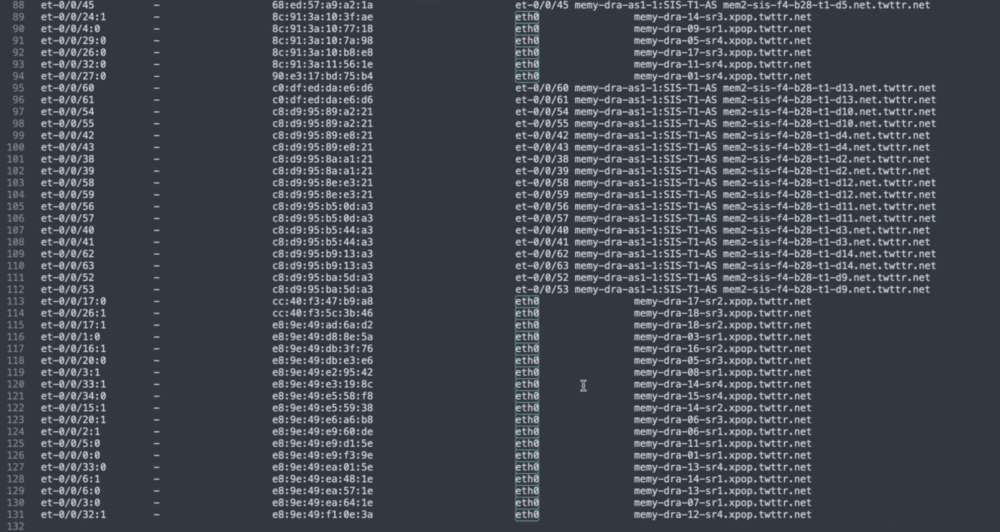

## XAI QFX to Server and T1 Connection Details

LLDP Neighbor

## RSI FA Unit2 (Systest Lab)

```
root@MEMY-CCA-AS1-1> show version node all

re0:
--------------------------------------------------------------------------
Hostname: MEMY-CCA-AS1-1
Model: qfx5240-64od
Junos: 23.4X100-D40.7-EVO
Yocto: 3.0.2
Linux Kernel: 5.2.60-yocto-standard-g72d147e
JUNOS-EVO OS 64-bit [junos-evo-install-qfx-ms-x86-64-23.4X100-D40.7-EVO]


root@MEMY-CCA-AS1-1> show system alarms no-forwarding

0 alarms currently active


root@MEMY-CCA-AS1-1> show system firmware

Part             Type              Tag Current               Available             Status
                                       version               version
PSM 0            Psm MCU AC        0   00.02.02              00.02.02              OK
PSM 1            Psm MCU AC        0   00.02.02              00.02.02              OK
RE 0             BIOS ROM          0   v41.01.08.06          v41.01.08.06          OK
RE 0             EC FPGA           1   0x0100                0.0                   OK
RE 0             I210 NIC          2   3.25                  3.25                  OK
RE 0             SSD Primary       3   EIEM51.2              EIEM51.2              OK
RE 0             SSD Secondary     4   EIEM51.2              EIEM51.2              OK
CB 0             System FPGA       0   0x5B0A                0x5B0A                OK
CB 0             Port FPGA         1   0x0B07.0x0B08         0x0B07.0x0B08         OK
CB 0             Fan CPLD          2   0x0B03                0x0B03                OK
FPC 0            BCM Tomahawk5     0   2.11                  2.11                  OK
FPC 0            IDT PLL           1   1.3                   1.3                   OK


root@MEMY-CCA-AS1-1> show system errors active detail


root@MEMY-CCA-AS1-1> show chassis hardware detail no-forwarding

Hardware inventory:
Item             Version  Part number  Serial number     Description
Chassis                                AP20062568        QFX5240-64OD
PSM 0                                  6U6LX01025124QA   AC AFO 3000W PSU
PSM 1                                  6U6LX01025124P9   AC AFO 3000W PSU
Routing Engine 0          BUILTIN      BUILTIN           RE-QFX5240
  nvme0 480103 MB  EPM3750-M8480GB5    511250213183001706 NVMe Solid State Disk
  nvme1 480103 MB  EPM3750-M8480GB5    511250213183001675 NVMe Solid State Disk
CB 0             REV 05   650-175147   AP20062568        QFX5240-64OD
FPC 0                     BUILTIN      BUILTIN           QFX5240-64OD
  PIC 0                   BUILTIN      BUILTIN           64X800G-OSFP
    Xcvr 0       XXXX     NON-JNPR     BL8J44X539000GH   UNKNOWN
    Xcvr 1       XXXX     NON-JNPR     BL8J44X5390005U   UNKNOWN
    Xcvr 2       XXXX     NON-JNPR     BL8J44X539000DS   UNKNOWN
    Xcvr 3       XXXX     NON-JNPR     BL8J44X539000EJ   UNKNOWN
    Xcvr 4       XXXX     NON-JNPR     BL8J44X539000DX   UNKNOWN
    Xcvr 5       XXXX     NON-JNPR     BL8J44X539000CU   UNKNOWN
    Xcvr 6       XXXX     NON-JNPR     BL8J44X539000B4   UNKNOWN
    Xcvr 7       XXXX     NON-JNPR     BL8J44X539000HB   UNKNOWN
    Xcvr 8       XXXX     NON-JNPR     BL8J44X539000EU   UNKNOWN
    Xcvr 9       XXXX     NON-JNPR     BL8J435539001M0   UNKNOWN
    Xcvr 10      XXXX     NON-JNPR     BL8J4355390019C   UNKNOWN
    Xcvr 11      XXXX     NON-JNPR     BL8J4355390019B   UNKNOWN
    Xcvr 12      XXXX     NON-JNPR     BL8J435539001KT   UNKNOWN
    Xcvr 13      XXXX     NON-JNPR     BL8J4355390011S   UNKNOWN
    Xcvr 14      XXXX     NON-JNPR     BL8J435539001MH   UNKNOWN
    Xcvr 15      XXXX     NON-JNPR     BL8J435539001GK   UNKNOWN
    Xcvr 16      XXXX     NON-JNPR     BL8J4355390019A   UNKNOWN
    Xcvr 17      XXXX     NON-JNPR     BL8J435539000YB   UNKNOWN
    Xcvr 18      XXXX     NON-JNPR     BL8J45554400132   UNKNOWN
    Xcvr 19      XXXX     NON-JNPR     BL8J45554400133   UNKNOWN
    Xcvr 20      XXXX     NON-JNPR     BL8J455544001QG   UNKNOWN
    Xcvr 21      XXXX     NON-JNPR     BL8J455544001SG   UNKNOWN
    Xcvr 22      XXXX     NON-JNPR     BL8J4455390000Q   UNKNOWN
    Xcvr 23      XXXX     NON-JNPR     BL8J44553900011   UNKNOWN
    Xcvr 24      XXXX     NON-JNPR     BL8J44553900054   UNKNOWN
    Xcvr 25      XXXX     NON-JNPR     BL8J44553900010   UNKNOWN
    Xcvr 26      XXXX     NON-JNPR     BL8J44553900007   UNKNOWN
    Xcvr 27      XXXX     NON-JNPR     BL8J46X545000TX   UNKNOWN
    Xcvr 28      XXXX     NON-JNPR     BL8J46X545000CF   UNKNOWN
    Xcvr 29      XXXX     NON-JNPR     BL8J46X545000TC   UNKNOWN
    Xcvr 30      XXXX     NON-JNPR     BL8J46X545000VL   UNKNOWN
    Xcvr 31      XXXX     NON-JNPR     BL8J455544001TY   UNKNOWN
    Xcvr 32      XXXX     NON-JNPR     BL8J455544001MV   UNKNOWN
    Xcvr 33      XXXX     NON-JNPR     BL8J455544001PA   UNKNOWN
    Xcvr 34      XXXX     NON-JNPR     BL8J4555440015P   UNKNOWN
    Xcvr 35      XXXX     NON-JNPR     BL8J455544001P0   UNKNOWN
    Xcvr 36      XXXX     NON-JNPR     G8FSBC656D0KH     OSFP-800G-DR8
    Xcvr 37      XXXX     NON-JNPR     G8FSBC656D0L0     OSFP-800G-DR8
    Xcvr 38      XXXX     NON-JNPR     G8FSBC656C016     OSFP-800G-DR8
    Xcvr 39      XXXX     NON-JNPR     G8FSBC656C00U     OSFP-800G-DR8
    Xcvr 40      XXXX     NON-JNPR     G8FSBC656D0KJ     OSFP-800G-DR8
    Xcvr 41      XXXX     NON-JNPR     G8FSBC656D0JY     OSFP-800G-DR8
    Xcvr 42      XXXX     NON-JNPR     G8FSBC656C005     OSFP-800G-DR8
    Xcvr 43      XXXX     NON-JNPR     G8FSBC656C00Z     OSFP-800G-DR8
    Xcvr 44      XXXX     NON-JNPR     G8FSBC656D0KG     OSFP-800G-DR8
    Xcvr 45      XXXX     NON-JNPR     G8FSBC656C047     OSFP-800G-DR8
    Xcvr 46      XXXX     NON-JNPR     G8FSBC656D0K9     OSFP-800G-DR8
    Xcvr 47      XXXX     NON-JNPR     G8FSBC656C010     OSFP-800G-DR8
    Xcvr 48      XXXX     NON-JNPR     G8FSBC656D0KF     OSFP-800G-DR8
    Xcvr 49      XXXX     NON-JNPR     G8FSBC656D0P6     OSFP-800G-DR8
    Xcvr 50      XXXX     NON-JNPR     G8FSBC656C00D     OSFP-800G-DR8
    Xcvr 51      XXXX     NON-JNPR     G8FSBC656D0J2     OSFP-800G-DR8
    Xcvr 52      XXXX     NON-JNPR     G8FSBC656D0KQ     OSFP-800G-DR8
    Xcvr 53      XXXX     NON-JNPR     G8FSBC656C019     OSFP-800G-DR8
    Xcvr 54      XXXX     NON-JNPR     G8FSBC656C011     OSFP-800G-DR8
    Xcvr 55      XXXX     NON-JNPR     G8FSBC656D0HW     OSFP-800G-DR8
    Xcvr 56      XXXX     NON-JNPR     G8FSBC656D0KZ     OSFP-800G-DR8
    Xcvr 57      XXXX     NON-JNPR     G8FSBC656C013     OSFP-800G-DR8
    Xcvr 58      XXXX     NON-JNPR     G8FSBC656C00M     OSFP-800G-DR8
    Xcvr 59      XXXX     NON-JNPR     G8FSBC656D0J1     OSFP-800G-DR8
    Xcvr 60      XXXX     NON-JNPR     G8FSBC656D0KD     OSFP-800G-DR8
    Xcvr 61      XXXX     NON-JNPR     G8FSBC656C00A     OSFP-800G-DR8
    Xcvr 62      XXXX     NON-JNPR     G8FSBC656C015     OSFP-800G-DR8
    Xcvr 63      XXXX     NON-JNPR     G8FSBC656D0J0     OSFP-800G-DR8
Fan Tray 0                                               QFX5240-64OD/QFX5240-64QD Fan Tray, Front to Back Airflow - AFO
Fan Tray 1                                               QFX5240-64OD/QFX5240-64QD Fan Tray, Front to Back Airflow - AFO
Fan Tray 2                                               QFX5240-64OD/QFX5240-64QD Fan Tray, Front to Back Airflow - AFO
Fan Tray 3                                               QFX5240-64OD/QFX5240-64QD Fan Tray, Front to Back Airflow - AFO


root@MEMY-CCA-AS1-1> show pfe statistics error


root@MEMY-CCA-AS1-1> show pfe statistics traffic

Packet Forwarding Engine traffic statistics:
    Input  packets:           2309986057              3208995 pps
    Output packets:           2310274431              3217357 pps
    Fabric Input  :                    0                    0 pps
    Fabric Output :                    0                    0 pps
Packet Forwarding Engine local traffic statistics:
    Local packets input                 :                    0
    Local packets output                :                    0
    Software input control plane drops  :                    0
    Software input high drops           :                    0
    Software input medium drops         :                    0
    Software input low drops            :                    0
    Software output drops               :                    0
    Hardware input drops                :                    0
Packet Forwarding Engine local protocol statistics:
    HDLC keepalives            :                    0
    ATM OAM                    :                    0
    Frame Relay LMI            :                    0
    PPP LCP/NCP                :                    0
    OSPF hello                 :                    0
    OSPF3 hello                :                    0
    RSVP hello                 :                    0
    LDP hello                  :                    0
    BFD                        :                76072
    IS-IS IIH                  :                    0
    LACP                       :                    0
    ARP                        :                    0
    ETHER OAM                  :                    0
    Unknown                    :                    0
Packet Forwarding Engine hardware discard statistics:
    Timeout                    :                    0
    Truncated key              :                    0
    Bits to test               :                    0
    Data error                 :                    0
    TCP header length error    :                    0
    Stack underflow            :                    0
    Stack overflow             :                    0
    Normal discard             :                    0
    Extended discard           :                    0
    Invalid interface          :                    0
    Info cell drops            :                    0
    Fabric drops               :                    0
Packet Forwarding Engine Input IPv4 Header Checksum Error and Output MTU Error statistics:
    Input Checksum             :                    0
    Output MTU                 :                    0


root@MEMY-CCA-AS1-1> show chassis routing-engine no-forwarding

Routing Engine status:
  Slot 0:
    Current state                  Master
    Election priority              Master (default)
    Temperature                 64 degrees C / 147 degrees F
    CPU temperature             64 degrees C / 147 degrees F
    DRAM                      26412 MB (32768 MB installed)
    Memory utilization          19 percent
    5 sec CPU utilization:
      User                       3 percent
      Background                 0 percent
      Kernel                    11 percent
      Interrupt                  0 percent
      Idle                      85 percent
    1 min CPU utilization:
      User                       2 percent
      Background                 0 percent
      Kernel                    12 percent
      Interrupt                  0 percent
      Idle                      85 percent
    5 min CPU utilization:
      User                       2 percent
      Background                 0 percent
      Kernel                    11 percent
      Interrupt                  0 percent
      Idle                      85 percent
    15 min CPU utilization:
      User                       2 percent
      Background                 0 percent
      Kernel                     9 percent
      Interrupt                  0 percent
      Idle                      66 percent
    Model                          RE-QFX5240
    Serial ID                      BUILTIN
    Start time                     2025-12-14 19:03:00 UTC
    Uptime                         22 minutes, 6 seconds
    Load averages:                 1 minute   5 minute  15 minute
                                       1.86       1.81       1.53
    Last reboot reason             power cycle


root@MEMY-CCA-AS1-1> show chassis environment no-forwarding

Class Item                           Status     Measurement
Power PSM 0                          OK         39 degrees C / 102 degrees F
      PSM 1                          OK         40 degrees C / 104 degrees F
Temp  FPC 0 Sensor TH5 Max Reading   OK         67 degrees C / 152 degrees F
      FPC 0 xcvr-0/0/0               OK         49 degrees C / 120 degrees F
      FPC 0 xcvr-0/0/1               OK         55 degrees C / 131 degrees F
      FPC 0 xcvr-0/0/2               OK         55 degrees C / 131 degrees F
      FPC 0 xcvr-0/0/3               OK         50 degrees C / 122 degrees F
      FPC 0 xcvr-0/0/4               OK         52 degrees C / 125 degrees F
      FPC 0 xcvr-0/0/5               OK         58 degrees C / 136 degrees F
      FPC 0 xcvr-0/0/6               OK         59 degrees C / 138 degrees F
      FPC 0 xcvr-0/0/7               OK         52 degrees C / 125 degrees F
      FPC 0 xcvr-0/0/8               OK         51 degrees C / 123 degrees F
      FPC 0 xcvr-0/0/9               OK         59 degrees C / 138 degrees F
      FPC 0 xcvr-0/0/10              OK         59 degrees C / 138 degrees F
      FPC 0 xcvr-0/0/11              OK         52 degrees C / 125 degrees F
      FPC 0 xcvr-0/0/12              OK         51 degrees C / 123 degrees F
      FPC 0 xcvr-0/0/13              OK         56 degrees C / 132 degrees F
      FPC 0 xcvr-0/0/14              OK         57 degrees C / 134 degrees F
      FPC 0 xcvr-0/0/15              OK         51 degrees C / 123 degrees F
      FPC 0 xcvr-0/0/16              OK         49 degrees C / 120 degrees F
      FPC 0 xcvr-0/0/17              OK         55 degrees C / 131 degrees F
      FPC 0 xcvr-0/0/18              OK         55 degrees C / 131 degrees F
      FPC 0 xcvr-0/0/19              OK         51 degrees C / 123 degrees F
      FPC 0 xcvr-0/0/20              OK         50 degrees C / 122 degrees F
      FPC 0 xcvr-0/0/21              OK         55 degrees C / 131 degrees F
      FPC 0 xcvr-0/0/22              OK         58 degrees C / 136 degrees F
      FPC 0 xcvr-0/0/23              OK         52 degrees C / 125 degrees F
      FPC 0 xcvr-0/0/24              OK         50 degrees C / 122 degrees F
      FPC 0 xcvr-0/0/25              OK         58 degrees C / 136 degrees F
      FPC 0 xcvr-0/0/26              OK         58 degrees C / 136 degrees F
      FPC 0 xcvr-0/0/27              OK         51 degrees C / 123 degrees F
      FPC 0 xcvr-0/0/28              OK         50 degrees C / 122 degrees F
      FPC 0 xcvr-0/0/29              OK         57 degrees C / 134 degrees F
      FPC 0 xcvr-0/0/30              OK         57 degrees C / 134 degrees F
      FPC 0 xcvr-0/0/31              OK         51 degrees C / 123 degrees F
      FPC 0 xcvr-0/0/32              OK         52 degrees C / 125 degrees F
      FPC 0 xcvr-0/0/33              OK         58 degrees C / 136 degrees F
      FPC 0 xcvr-0/0/34              OK         59 degrees C / 138 degrees F
      FPC 0 xcvr-0/0/35              OK         52 degrees C / 125 degrees F
      FPC 0 xcvr-0/0/36              OK         40 degrees C / 104 degrees F
      FPC 0 xcvr-0/0/37              OK         48 degrees C / 118 degrees F
      FPC 0 xcvr-0/0/38              OK         51 degrees C / 123 degrees F
      FPC 0 xcvr-0/0/39              OK         42 degrees C / 107 degrees F
      FPC 0 xcvr-0/0/40              OK         41 degrees C / 105 degrees F
      FPC 0 xcvr-0/0/41              OK         51 degrees C / 123 degrees F
      FPC 0 xcvr-0/0/42              OK         52 degrees C / 125 degrees F
      FPC 0 xcvr-0/0/43              OK         43 degrees C / 109 degrees F
      FPC 0 xcvr-0/0/44              OK         40 degrees C / 104 degrees F
      FPC 0 xcvr-0/0/45              OK         49 degrees C / 120 degrees F
      FPC 0 xcvr-0/0/46              OK         46 degrees C / 114 degrees F
      FPC 0 xcvr-0/0/47              OK         41 degrees C / 105 degrees F
      FPC 0 xcvr-0/0/48              OK         42 degrees C / 107 degrees F
      FPC 0 xcvr-0/0/49              OK         47 degrees C / 116 degrees F
      FPC 0 xcvr-0/0/50              OK         45 degrees C / 113 degrees F
      FPC 0 xcvr-0/0/51              OK         43 degrees C / 109 degrees F
      FPC 0 xcvr-0/0/52              OK         41 degrees C / 105 degrees F
      FPC 0 xcvr-0/0/53              OK         50 degrees C / 122 degrees F
      FPC 0 xcvr-0/0/54              OK         52 degrees C / 125 degrees F
      FPC 0 xcvr-0/0/55              OK         42 degrees C / 107 degrees F
      FPC 0 xcvr-0/0/56              OK         40 degrees C / 104 degrees F
      FPC 0 xcvr-0/0/57              OK         52 degrees C / 125 degrees F
      FPC 0 xcvr-0/0/58              OK         52 degrees C / 125 degrees F
      FPC 0 xcvr-0/0/59              OK         41 degrees C / 105 degrees F
      FPC 0 xcvr-0/0/60              OK         43 degrees C / 109 degrees F
      FPC 0 xcvr-0/0/61              OK         43 degrees C / 109 degrees F
      FPC 0 xcvr-0/0/62              OK         45 degrees C / 113 degrees F
      FPC 0 xcvr-0/0/63              OK         41 degrees C / 105 degrees F
      FPC 0 MB Middle Right Rear     OK         47 degrees C / 116 degrees F
      FPC 0 MB Middle Left Rear      OK         46 degrees C / 114 degrees F
      FPC 0 MB Left Rear             OK         42 degrees C / 107 degrees F
      FPC 0 MB Left Front            OK         42 degrees C / 107 degrees F
      FPC 0 MB Right Rear            OK         35 degrees C / 95 degrees F
      FPC 0 MB Right Front           OK         37 degrees C / 98 degrees F
      FPC 0 MB OPTICS_GRP1_3V3       OK         47 degrees C / 116 degrees F
      FPC 0 MB OPTICS_GRP2_3V3       OK         48 degrees C / 118 degrees F
      FPC 0 MB OPTICS_GRP3_3V3       OK         53 degrees C / 127 degrees F
      FPC 0 MB VDD_0P75              OK         58 degrees C / 136 degrees F
      FPC 0 MB TRVDD1_0V9_0V75       OK         47 degrees C / 116 degrees F
      FPC 0 MB TRVDD0_0V9_0V75       OK         48 degrees C / 118 degrees F
      FPC 0 FB Exhaust Left          OK         35 degrees C / 95 degrees F
      FPC 0 FB Exhaust Right         OK         36 degrees C / 96 degrees F
      Routing Engine 0 CPU Temperature OK       64 degrees C / 147 degrees F
      Routing Engine 0 Ch-0 DIMM-0 Temp OK      51 degrees C / 123 degrees F
      Routing Engine 0 Ch-1 DIMM-0 Temp OK      54 degrees C / 129 degrees F
Fan   Fan Tray 0 Fan 1               OK         8550 RPM
      Fan Tray 0 Fan 2               OK         9600 RPM
      Fan Tray 1 Fan 1               OK         8550 RPM
      Fan Tray 1 Fan 2               OK         9750 RPM
      Fan Tray 2 Fan 1               OK         8550 RPM
      Fan Tray 2 Fan 2               OK         9750 RPM
      Fan Tray 3 Fan 1               OK         8550 RPM
      Fan Tray 3 Fan 2               OK         9750 RPM


root@MEMY-CCA-AS1-1> show chassis power detail

Chassis Power        Voltage(V)    Power(W)

Total Input Power                   1697
  PSM 0
    State: Online
    Input 1             237          877
    Output            12.23        787.71
    Capacity           3000 W (maximum 3000 W)
  PSM 1
    State: Online
    Input 1             237          820
    Output            12.21        761.9
    Capacity           3000 W (maximum 3000 W)

System:
  Zone 0:
      Capacity:          6000 W (maximum 6000 W)
      Allocated power:   2582 W (3418 W remaining)
      Actual usage:      1697 W
  Total system capacity: 6000 W (maximum 6000 W)
  Total remaining power: 3418 W


root@MEMY-CCA-AS1-1> show chassis fpc detail

Slot 0 information:
  State                               Online
  Start time                          2025-12-14 19:04:29 UTC
  Uptime                              22 minutes, 11 seconds


root@MEMY-CCA-AS1-1> show chassis hardware extensive no-forwarding

Hardware inventory:
Item             Version  Part number  Serial number     Description
Chassis                                AP20062568        QFX5240-64OD
 Jedec Code:   0x7fb0            EEPROM Version:    0x02
                                 S/N:               AP20062568
 Assembly ID:  0x05d5            Assembly Version:  00.00
 Date:         0000-00-00        Assembly Flags:    0x00
 ID: QFX5240-64OD                FRU Model Number:  QFX5240-64OD
 Board Information Record:
  Address 0x00: 00 00 00 00 00 00 00 00 00 00 00 00 00 00 00 00
 I2C Hex Data:
  Address 0x00: 7f b0 02 00 05 d5 00 00 00 00 00 00 00 00 00 00
  Address 0x10: 00 00 00 00 00 00 00 00 00 00 00 00 00 00 00 00
  Address 0x20: 41 50 32 30 30 36 32 35 36 38 00 00 00 00 00 00
  Address 0x30: 00 00 00 00 00 00 00 00 00 00 00 00 00 00 00 00
  Address 0x40: 00 00 00 00 01 00 00 00 00 00 00 00 00 00 00 51
  Address 0x50: 46 58 35 32 34 30 2d 36 34 4f 44 00 00 00 00 00
  Address 0x60: 00 00 00 00 00 00 00 00 00 00 00 00 00 00 00 00
  Address 0x70: 00 00 00 00 00 00 00 00 00 00 00 00 00 00 00 00
PSM 0                                  6U6LX01025124QA   AC AFO 3000W PSU
 Jedec Code:   0x7fb0            EEPROM Version:    0x02
                                 S/N:               6U6LX01025124QA
 Assembly ID:  0x04f4            Assembly Version:  00.00
 Date:         0000-00-00        Assembly Flags:    0x00
 ID: AC AFO 3000W PSU            FRU Model Number:  QFX5240-PSU
 Board Information Record:
  Address 0x00: 00 00 00 00 00 00 00 00 00 00 00 00 00 00 00 00
 I2C Hex Data:
  Address 0x00: 7f b0 02 ff 04 f4 00 00 00 00 00 00 00 00 00 00
  Address 0x10: 00 00 00 00 00 00 00 00 00 00 00 00 00 00 00 00
  Address 0x20: 00 00 00 00 00 00 00 00 00 00 00 00 00 00 00 00
  Address 0x30: 00 00 00 00 00 00 00 00 00 00 00 00 00 00 00 00
  Address 0x40: 00 00 00 00 01 00 00 00 00 00 00 00 00 00 00 51
  Address 0x50: 46 58 35 32 34 30 2d 50 53 55 00 00 00 00 00 00
  Address 0x60: 00 00 00 00 00 00 00 00 00 00 00 00 00 00 00 00
  Address 0x70: 00 00 00 00 00 00 00 00 00 00 00 00 00 00 00 00
PSM 1                                  6U6LX01025124P9   AC AFO 3000W PSU
 Jedec Code:   0x7fb0            EEPROM Version:    0x02
                                 S/N:               6U6LX01025124P9
 Assembly ID:  0x04f4            Assembly Version:  00.00
 Date:         0000-00-00        Assembly Flags:    0x00
 ID: AC AFO 3000W PSU            FRU Model Number:  QFX5240-PSU
 Board Information Record:
  Address 0x00: 00 00 00 00 00 00 00 00 00 00 00 00 00 00 00 00
 I2C Hex Data:
  Address 0x00: 7f b0 02 ff 04 f4 00 00 00 00 00 00 00 00 00 00
  Address 0x10: 00 00 00 00 00 00 00 00 00 00 00 00 00 00 00 00
  Address 0x20: 00 00 00 00 00 00 00 00 00 00 00 00 00 00 00 00
  Address 0x30: 00 00 00 00 00 00 00 00 00 00 00 00 00 00 00 00
  Address 0x40: 00 00 00 00 01 00 00 00 00 00 00 00 00 00 00 51
  Address 0x50: 46 58 35 32 34 30 2d 50 53 55 00 00 00 00 00 00
  Address 0x60: 00 00 00 00 00 00 00 00 00 00 00 00 00 00 00 00
  Address 0x70: 00 00 00 00 00 00 00 00 00 00 00 00 00 00 00 00
Routing Engine 0          BUILTIN      BUILTIN           RE-QFX5240
 Jedec Code:   0x7fb0            EEPROM Version:    0x02
 P/N:          BUILTIN           S/N:               BUILTIN
 Assembly ID:  0x0df3            Assembly Version:  00.00
 Date:         0000-00-00        Assembly Flags:    0x00
                                 CLEI Code:         CMM8800CRA
 ID: RE-QFX5240                  FRU Model Number:  QFX5240
 Board Information Record:
  Address 0x00: 00 00 00 00 00 00 00 00 00 00 00 00 00 00 00 00
 I2C Hex Data:
  Address 0x00: 7f b0 02 ff 0d f3 00 00 00 00 00 00 00 00 00 00
  Address 0x10: 00 00 00 00 42 55 49 4c 54 49 4e 00 00 00 00 00
  Address 0x20: 42 55 49 4c 54 49 4e 00 00 00 00 00 00 00 00 00
  Address 0x30: 00 00 00 00 00 00 00 00 00 00 00 00 00 00 00 00
  Address 0x40: 00 00 00 00 01 43 4d 4d 38 38 30 30 43 52 41 51
  Address 0x50: 46 58 35 32 34 30 00 00 00 00 00 00 00 00 00 00
  Address 0x60: 00 00 00 00 00 00 00 00 00 00 00 00 00 00 00 00
  Address 0x70: 00 00 00 00 00 00 00 00 00 00 00 00 00 00 00 00
  nvme0 480103 MB  EPM3750-M8480GB5    511250213183001706 NVMe Solid State Disk
  nvme1 480103 MB  EPM3750-M8480GB5    511250213183001675 NVMe Solid State Disk
CB 0             REV 05   650-175147   AP20062568        QFX5240-64OD
 Jedec Code:   0x7fb0            EEPROM Version:    0x02
 P/N:          650-175147        S/N:               AP20062568
 Assembly ID:  0x0df4            Assembly Version:  01.05
 Date:         2025-05-24        Assembly Flags:    0x00
 Version:      REV 05            CLEI Code:         CMM8800CRA
 ID: QFX5240-64OD                FRU Model Number:  QFX5240-64OD-CHAS
 Board Information Record:
  Address 0x00: ff ff ff ff ff ff ff ff ff ff ff ff ff ff ff ff
 I2C Hex Data:
  Address 0x00: 7f b0 02 fe 0d f4 01 05 52 45 56 20 30 35 00 00
  Address 0x10: 00 00 00 00 36 35 30 2d 31 37 35 31 34 37 00 00
  Address 0x20: 41 50 32 30 30 36 32 35 36 38 00 00 00 18 05 07
  Address 0x30: e9 ff ff ff ff ff ff ff ff ff ff ff ff ff ff ff
  Address 0x40: ff ff ff ff 01 43 4d 4d 38 38 30 30 43 52 41 51
  Address 0x50: 46 58 35 32 34 30 2d 36 34 4f 44 2d 43 48 41 53
  Address 0x60: 00 00 00 00 00 00 42 00 00 ff ff ff ff ff ff ff
  Address 0x70: ff ff ff ec 41 50 32 30 30 36 32 35 36 38 00 00
FPC 0                     BUILTIN      BUILTIN           QFX5240-64OD
 Jedec Code:   0x7fb0            EEPROM Version:    0x01
 P/N:          BUILTIN           S/N:               BUILTIN
 Assembly ID:  0x0df5            Assembly Version:  01.05
 Date:         0000-00-00        Assembly Flags:    0x00
 ID: QFX5240-64OD                FRU Model Number:  QFX5240-64OD
 Board Information Record:
  Address 0x00: 00 00 00 00 00 00 00 00 00 00 00 00 00 00 00 00
 I2C Hex Data:
  Address 0x00: 7f b0 01 ff 0d f5 01 05 00 00 00 00 00 00 00 00
  Address 0x10: 00 00 00 00 42 55 49 4c 54 49 4e 00 00 00 00 00
  Address 0x20: 42 55 49 4c 54 49 4e 00 00 00 00 00 00 00 00 00
  Address 0x30: 00 00 00 00 00 00 00 00 00 00 00 00 00 00 00 00
  Address 0x40: 00 00 00 00 01 43 4d 4d 38 38 30 30 43 52 41 51
  Address 0x50: 46 58 35 32 34 30 2d 36 34 4f 44 00 00 00 00 00
  Address 0x60: 00 00 00 00 00 00 00 00 00 00 00 00 00 00 00 00
  Address 0x70: 00 00 00 00 00 00 00 00 00 00 00 00 00 00 00 00
  PIC 0                   BUILTIN      BUILTIN           64X800G-OSFP
 Jedec Code:   0x7fb0            EEPROM Version:    0x01
 P/N:          BUILTIN           S/N:               BUILTIN
 Assembly ID:  0x0e5b            Assembly Version:  01.05
 Date:         0000-00-00        Assembly Flags:    0x00
 ID: 64X800G-OSFP                FRU Model Number:  QFX5240-64OD
 Board Information Record:
  Address 0x00: 00 00 00 00 00 00 00 00 00 00 00 00 00 00 00 00
 I2C Hex Data:
  Address 0x00: 7f b0 01 ff 0e 5b 01 05 00 00 00 00 00 00 00 00
  Address 0x10: 00 00 00 00 42 55 49 4c 54 49 4e 00 00 00 00 00
  Address 0x20: 42 55 49 4c 54 49 4e 00 00 00 00 00 00 00 00 00
  Address 0x30: 00 00 00 00 00 00 00 00 00 00 00 00 00 00 00 00
  Address 0x40: 00 00 00 00 01 43 4d 4d 38 38 30 30 43 52 41 51
  Address 0x50: 46 58 35 32 34 30 2d 36 34 4f 44 00 00 00 00 00
  Address 0x60: 00 00 00 00 00 00 00 00 00 00 00 00 00 00 00 00
  Address 0x70: 00 00 00 00 00 00 00 00 00 00 00 00 00 00 00 00
    Xcvr 0       XXXX     NON-JNPR     BL8J44X539000GH   UNKNOWN
    Xcvr 1       XXXX     NON-JNPR     BL8J44X5390005U   UNKNOWN
    Xcvr 2       XXXX     NON-JNPR     BL8J44X539000DS   UNKNOWN
    Xcvr 3       XXXX     NON-JNPR     BL8J44X539000EJ   UNKNOWN
    Xcvr 4       XXXX     NON-JNPR     BL8J44X539000DX   UNKNOWN
    Xcvr 5       XXXX     NON-JNPR     BL8J44X539000CU   UNKNOWN
    Xcvr 6       XXXX     NON-JNPR     BL8J44X539000B4   UNKNOWN
    Xcvr 7       XXXX     NON-JNPR     BL8J44X539000HB   UNKNOWN
    Xcvr 8       XXXX     NON-JNPR     BL8J44X539000EU   UNKNOWN
    Xcvr 9       XXXX     NON-JNPR     BL8J435539001M0   UNKNOWN
    Xcvr 10      XXXX     NON-JNPR     BL8J4355390019C   UNKNOWN
    Xcvr 11      XXXX     NON-JNPR     BL8J4355390019B   UNKNOWN
    Xcvr 12      XXXX     NON-JNPR     BL8J435539001KT   UNKNOWN
    Xcvr 13      XXXX     NON-JNPR     BL8J4355390011S   UNKNOWN
    Xcvr 14      XXXX     NON-JNPR     BL8J435539001MH   UNKNOWN
    Xcvr 15      XXXX     NON-JNPR     BL8J435539001GK   UNKNOWN
    Xcvr 16      XXXX     NON-JNPR     BL8J4355390019A   UNKNOWN
    Xcvr 17      XXXX     NON-JNPR     BL8J435539000YB   UNKNOWN
    Xcvr 18      XXXX     NON-JNPR     BL8J45554400132   UNKNOWN
    Xcvr 19      XXXX     NON-JNPR     BL8J45554400133   UNKNOWN
    Xcvr 20      XXXX     NON-JNPR     BL8J455544001QG   UNKNOWN
    Xcvr 21      XXXX     NON-JNPR     BL8J455544001SG   UNKNOWN
    Xcvr 22      XXXX     NON-JNPR     BL8J4455390000Q   UNKNOWN
    Xcvr 23      XXXX     NON-JNPR     BL8J44553900011   UNKNOWN
    Xcvr 24      XXXX     NON-JNPR     BL8J44553900054   UNKNOWN
    Xcvr 25      XXXX     NON-JNPR     BL8J44553900010   UNKNOWN
    Xcvr 26      XXXX     NON-JNPR     BL8J44553900007   UNKNOWN
    Xcvr 27      XXXX     NON-JNPR     BL8J46X545000TX   UNKNOWN
    Xcvr 28      XXXX     NON-JNPR     BL8J46X545000CF   UNKNOWN
    Xcvr 29      XXXX     NON-JNPR     BL8J46X545000TC   UNKNOWN
    Xcvr 30      XXXX     NON-JNPR     BL8J46X545000VL   UNKNOWN
    Xcvr 31      XXXX     NON-JNPR     BL8J455544001TY   UNKNOWN
    Xcvr 32      XXXX     NON-JNPR     BL8J455544001MV   UNKNOWN
    Xcvr 33      XXXX     NON-JNPR     BL8J455544001PA   UNKNOWN
    Xcvr 34      XXXX     NON-JNPR     BL8J4555440015P   UNKNOWN
    Xcvr 35      XXXX     NON-JNPR     BL8J455544001P0   UNKNOWN
    Xcvr 36      XXXX     NON-JNPR     G8FSBC656D0KH     OSFP-800G-DR8
    Xcvr 37      XXXX     NON-JNPR     G8FSBC656D0L0     OSFP-800G-DR8
    Xcvr 38      XXXX     NON-JNPR     G8FSBC656C016     OSFP-800G-DR8
    Xcvr 39      XXXX     NON-JNPR     G8FSBC656C00U     OSFP-800G-DR8
    Xcvr 40      XXXX     NON-JNPR     G8FSBC656D0KJ     OSFP-800G-DR8
    Xcvr 41      XXXX     NON-JNPR     G8FSBC656D0JY     OSFP-800G-DR8
    Xcvr 42      XXXX     NON-JNPR     G8FSBC656C005     OSFP-800G-DR8
    Xcvr 43      XXXX     NON-JNPR     G8FSBC656C00Z     OSFP-800G-DR8
    Xcvr 44      XXXX     NON-JNPR     G8FSBC656D0KG     OSFP-800G-DR8
    Xcvr 45      XXXX     NON-JNPR     G8FSBC656C047     OSFP-800G-DR8
    Xcvr 46      XXXX     NON-JNPR     G8FSBC656D0K9     OSFP-800G-DR8
    Xcvr 47      XXXX     NON-JNPR     G8FSBC656C010     OSFP-800G-DR8
    Xcvr 48      XXXX     NON-JNPR     G8FSBC656D0KF     OSFP-800G-DR8
    Xcvr 49      XXXX     NON-JNPR     G8FSBC656D0P6     OSFP-800G-DR8
    Xcvr 50      XXXX     NON-JNPR     G8FSBC656C00D     OSFP-800G-DR8
    Xcvr 51      XXXX     NON-JNPR     G8FSBC656D0J2     OSFP-800G-DR8
    Xcvr 52      XXXX     NON-JNPR     G8FSBC656D0KQ     OSFP-800G-DR8
    Xcvr 53      XXXX     NON-JNPR     G8FSBC656C019     OSFP-800G-DR8
    Xcvr 54      XXXX     NON-JNPR     G8FSBC656C011     OSFP-800G-DR8
    Xcvr 55      XXXX     NON-JNPR     G8FSBC656D0HW     OSFP-800G-DR8
    Xcvr 56      XXXX     NON-JNPR     G8FSBC656D0KZ     OSFP-800G-DR8
    Xcvr 57      XXXX     NON-JNPR     G8FSBC656C013     OSFP-800G-DR8
    Xcvr 58      XXXX     NON-JNPR     G8FSBC656C00M     OSFP-800G-DR8
    Xcvr 59      XXXX     NON-JNPR     G8FSBC656D0J1     OSFP-800G-DR8
    Xcvr 60      XXXX     NON-JNPR     G8FSBC656D0KD     OSFP-800G-DR8
    Xcvr 61      XXXX     NON-JNPR     G8FSBC656C00A     OSFP-800G-DR8
    Xcvr 62      XXXX     NON-JNPR     G8FSBC656C015     OSFP-800G-DR8
    Xcvr 63      XXXX     NON-JNPR     G8FSBC656D0J0     OSFP-800G-DR8
Fan Tray 0                                               QFX5240-64OD/QFX5240-64QD Fan Tray, Front to Back Airflow - AFO
 Jedec Code:   0x7fb0            EEPROM Version:    0x02
 Assembly ID:  0x0df9            Assembly Version:  00.00
 Date:         0000-00-00        Assembly Flags:    0x00
 ID: QFX5240-64OD/QFX5240-64QD Fan Tray, Front to Back Airflow - AFO FRU Model Number:  QFX5240-FAN
 Board Information Record:
  Address 0x00: 00 00 00 00 00 00 00 00 00 00 00 00 00 00 00 00
 I2C Hex Data:
  Address 0x00: 7f b0 02 ff 0d f9 00 00 00 00 00 00 00 00 00 00
  Address 0x10: 00 00 00 00 00 00 00 00 00 00 00 00 00 00 00 00
  Address 0x20: 00 00 00 00 00 00 00 00 00 00 00 00 00 00 00 00
  Address 0x30: 00 00 00 00 00 00 00 00 00 00 00 00 00 00 00 00
  Address 0x40: 00 00 00 00 01 00 00 00 00 00 00 00 00 00 00 51
  Address 0x50: 46 58 35 32 34 30 2d 46 41 4e 00 00 00 00 00 00
  Address 0x60: 00 00 00 00 00 00 00 00 00 00 00 00 00 00 00 00
  Address 0x70: 00 00 00 00 00 00 00 00 00 00 00 00 00 00 00 00
Fan Tray 1                                               QFX5240-64OD/QFX5240-64QD Fan Tray, Front to Back Airflow - AFO
 Jedec Code:   0x7fb0            EEPROM Version:    0x02
 Assembly ID:  0x0df9            Assembly Version:  00.00
 Date:         0000-00-00        Assembly Flags:    0x00
 ID: QFX5240-64OD/QFX5240-64QD Fan Tray, Front to Back Airflow - AFO FRU Model Number:  QFX5240-FAN
 Board Information Record:
  Address 0x00: 00 00 00 00 00 00 00 00 00 00 00 00 00 00 00 00
 I2C Hex Data:
  Address 0x00: 7f b0 02 ff 0d f9 00 00 00 00 00 00 00 00 00 00
  Address 0x10: 00 00 00 00 00 00 00 00 00 00 00 00 00 00 00 00
  Address 0x20: 00 00 00 00 00 00 00 00 00 00 00 00 00 00 00 00
  Address 0x30: 00 00 00 00 00 00 00 00 00 00 00 00 00 00 00 00
  Address 0x40: 00 00 00 00 01 00 00 00 00 00 00 00 00 00 00 51
  Address 0x50: 46 58 35 32 34 30 2d 46 41 4e 00 00 00 00 00 00
  Address 0x60: 00 00 00 00 00 00 00 00 00 00 00 00 00 00 00 00
  Address 0x70: 00 00 00 00 00 00 00 00 00 00 00 00 00 00 00 00
Fan Tray 2                                               QFX5240-64OD/QFX5240-64QD Fan Tray, Front to Back Airflow - AFO
 Jedec Code:   0x7fb0            EEPROM Version:    0x02
 Assembly ID:  0x0df9            Assembly Version:  00.00
 Date:         0000-00-00        Assembly Flags:    0x00
 ID: QFX5240-64OD/QFX5240-64QD Fan Tray, Front to Back Airflow - AFO FRU Model Number:  QFX5240-FAN
 Board Information Record:
  Address 0x00: 00 00 00 00 00 00 00 00 00 00 00 00 00 00 00 00
 I2C Hex Data:
  Address 0x00: 7f b0 02 ff 0d f9 00 00 00 00 00 00 00 00 00 00
  Address 0x10: 00 00 00 00 00 00 00 00 00 00 00 00 00 00 00 00
  Address 0x20: 00 00 00 00 00 00 00 00 00 00 00 00 00 00 00 00
  Address 0x30: 00 00 00 00 00 00 00 00 00 00 00 00 00 00 00 00
  Address 0x40: 00 00 00 00 01 00 00 00 00 00 00 00 00 00 00 51
  Address 0x50: 46 58 35 32 34 30 2d 46 41 4e 00 00 00 00 00 00
  Address 0x60: 00 00 00 00 00 00 00 00 00 00 00 00 00 00 00 00
  Address 0x70: 00 00 00 00 00 00 00 00 00 00 00 00 00 00 00 00
Fan Tray 3                                               QFX5240-64OD/QFX5240-64QD Fan Tray, Front to Back Airflow - AFO
 Jedec Code:   0x7fb0            EEPROM Version:    0x02
 Assembly ID:  0x0df9            Assembly Version:  00.00
 Date:         0000-00-00        Assembly Flags:    0x00
 ID: QFX5240-64OD/QFX5240-64QD Fan Tray, Front to Back Airflow - AFO FRU Model Number:  QFX5240-FAN
 Board Information Record:
  Address 0x00: 00 00 00 00 00 00 00 00 00 00 00 00 00 00 00 00
 I2C Hex Data:
  Address 0x00: 7f b0 02 ff 0d f9 00 00 00 00 00 00 00 00 00 00
  Address 0x10: 00 00 00 00 00 00 00 00 00 00 00 00 00 00 00 00
  Address 0x20: 00 00 00 00 00 00 00 00 00 00 00 00 00 00 00 00
  Address 0x30: 00 00 00 00 00 00 00 00 00 00 00 00 00 00 00 00
  Address 0x40: 00 00 00 00 01 00 00 00 00 00 00 00 00 00 00 51
  Address 0x50: 46 58 35 32 34 30 2d 46 41 4e 00 00 00 00 00 00
  Address 0x60: 00 00 00 00 00 00 00 00 00 00 00 00 00 00 00 00
  Address 0x70: 00 00 00 00 00 00 00 00 00 00 00 00 00 00 00 00


root@MEMY-CCA-AS1-1> show chassis sibs detail


error: command is not valid on the qfx5240-64od


root@MEMY-CCA-AS1-1> show chassis fabric fpcs no-forwarding


error: command is not valid on the qfx5240-64od


root@MEMY-CCA-AS1-1> show chassis fabric plane-location no-forwarding


error: command is not valid on the qfx5240-64od


root@MEMY-CCA-AS1-1> show chassis fabric sibs no-forwarding


error: command is not valid on the qfx5240-64od


root@MEMY-CCA-AS1-1> show chassis fabric topology no-forwarding


error: command is not valid on the qfx5240-64od


root@MEMY-CCA-AS1-1> show chassis fabric degraded-fabric-reachability


error: command is not valid on the qfx5240-64od


root@MEMY-CCA-AS1-1> show chassis feb


error: command is not valid on the qfx5240-64od


root@MEMY-CCA-AS1-1> show system configuration database usage

Maximum size of the database: 688.99 MB
Current database size on disk: 2.00 MB
Actual database usage: 1.97 MB
Available database space: 687.02 MB


root@MEMY-CCA-AS1-1> show system license

License usage:
                                 Licensed     Licensed    Licensed
                                  Feature      Feature     Feature
  Feature name                       used    installed      needed    Expiry
  bgp                                   1            1           0    permanent
  isis                                  0            1           0    permanent
  filter-based-forwarding               0            1           0    permanent
  connectivity-fault-management         0            1           0    permanent
  vrrp                                  0            1           0    permanent
  dot1q-tunneling                       0            1           0    permanent
  vxlan                                 0            1           0    permanent
  PCEP                                  0            1           0    permanent
  mc-lag                                0            1           0    permanent
  esi-lag                               0            1           0    permanent
  Timing License                        0            1           0    permanent
  link-fault-management                 0            1           0    permanent
  evpn-vxlan                            0            1           0    permanent
  igmp-multicast                        0            1           0    permanent
  pim                                   0            1           0    permanent
  gre_tunnel                            0            1           0    permanent
  static-mpls                           0            1           0    permanent
  rip                                   0            1           0    permanent
  ospf                                  0            1           0    permanent
  inmon-sflow                           0            1           0    permanent

Licenses installed:

  License identifier: E20220415001
  License version: 4
  Order Type: commercial
  Software Serial Number: 160090454000
  Customer ID: Twitter
  Features:
    ospf             - OSPF protocol
      permanent
    static-mpls      - Static Mpls lsp feature
      permanent
    evpn-vxlan       - EVPN feature with VXLAN encapsulation
      permanent
    PCEP             - PATH COMPUTATION ELEMENT PROTOCOL
      permanent
    inmon-sflow      - License for protocol sflow feature
      permanent
    bgp              - BGP Routing Protocol
      permanent
    connectivity-fault-management - Connectivity Fault Management
      permanent
    mc-lag           - MC-LAG
      permanent
    vrrp             - Virtual Router Redundancy Protocol
      permanent
    esi-lag          - ESI-LAG
      permanent
    pim              - PIM feature
      permanent
    igmp-multicast   - IGMP feature
      permanent
    rip              - RIP protocol
      permanent
    Timing License   - PTP/SyncE protocol features
      permanent
    link-fault-management - Link Fault Management
      permanent
    gre_tunnel       - GRE tunnel usage license
      permanent
    isis             - IS-IS Routing Protocol
      permanent
    dot1q-tunneling  - 802.1ad
      permanent
    vxlan            - VxLAN
      permanent
    filter-based-forwarding - Filter Based Forwarding
      permanent


root@MEMY-CCA-AS1-1> show configuration | except SECRET-DATA | display omit

## Last commit: 2025-12-14 19:04:26 UTC by root
version 23.4X100-D40.7-EVO;
groups {
    AS-BGP-POLICY {
        policy-options {
            policy-statement T1-IN {
                term GSHUT {
                    from community GSHUT;
                    then {
                        local-preference 0;
                        accept;
                    }
                }
            }
            policy-statement T1-OUT {
                term LOCAL-VL100 {
                    from {
                        protocol direct;
                        interface [ vlan.0 irb.0 ];
                    }
                    then {
                        community set COMM-RT-RACKROUTE;
                        accept;
                    }
                }
                term LOCAL-LOOPBACK {
                    from {
                        protocol direct;
                        interface lo0.0;
                    }
                    then {
                        community set COMM-RT-LOOPBACK;
                        accept;
                    }
                }
                term DC-SERVER-BGP-PUB-V4 {
                    from {
                        protocol bgp;
                        route-filter 64.63.0.0/18 prefix-length-range /32-/32;
                        route-filter 65.172.54.68/30 prefix-length-range /32-/32;
                        route-filter 69.12.63.0/24 prefix-length-range /32-/32;
                        route-filter 144.135.120.141/32 prefix-length-range /32-/32;
                        route-filter 144.135.121.141/32 prefix-length-range /32-/32;
                        route-filter 170.55.29.20/30 prefix-length-range /32-/32;
                        route-filter 173.209.195.32/27 prefix-length-range /32-/32;
                        route-filter 173.209.197.128/25 prefix-length-range /32-/32;
                        route-filter 173.209.205.32/27 prefix-length-range /32-/32;
                        route-filter 193.105.74.58/32 prefix-length-range /32-/32;
                        route-filter 193.105.74.158/32 prefix-length-range /32-/32;
                        route-filter 193.111.74.140/32 prefix-length-range /32-/32;
                        route-filter 193.111.74.143/32 prefix-length-range /32-/32;
                        route-filter 193.111.74.146/32 prefix-length-range /32-/32;
                        route-filter 193.111.74.148/32 prefix-length-range /32-/32;
                        route-filter 208.243.234.120/32 prefix-length-range /32-/32;
                    }
                    then {
                        community set COMM-RT-DC-SERVER-BGP-PUB;
                        accept;
                    }
                }
                term DC-SERVER-BGP-PRI-V4 {
                    from {
                        protocol bgp;
                        route-filter 10.6.248.0/22 orlonger;
                        route-filter 10.36.0.0/15 orlonger;
                        route-filter 22.128.0.0/9 orlonger;
                    }
                    then {
                        community set COMM-RT-DC-SERVER-BGP-PRI;
                        accept;
                    }
                }
                then reject;
            }
            policy-statement DC-SERVER-IPV4-IN {
                term DC-SERVER-BGP-PUB-V4 {
                    from {
                        route-filter 64.63.0.0/18 prefix-length-range /32-/32;
                        route-filter 65.172.54.68/30 prefix-length-range /32-/32;
                        route-filter 69.12.63.0/24 prefix-length-range /32-/32;
                        route-filter 144.135.120.141/32 prefix-length-range /32-/32;
                        route-filter 144.135.121.141/32 prefix-length-range /32-/32;
                        route-filter 170.55.29.20/30 prefix-length-range /32-/32;
                        route-filter 173.209.195.32/27 prefix-length-range /32-/32;
                        route-filter 173.209.197.128/25 prefix-length-range /32-/32;
                        route-filter 173.209.205.32/27 prefix-length-range /32-/32;
                        route-filter 193.105.74.58/32 prefix-length-range /32-/32;
                        route-filter 193.105.74.158/32 prefix-length-range /32-/32;
                        route-filter 193.111.74.140/32 prefix-length-range /32-/32;
                        route-filter 193.111.74.143/32 prefix-length-range /32-/32;
                        route-filter 193.111.74.146/32 prefix-length-range /32-/32;
                        route-filter 193.111.74.148/32 prefix-length-range /32-/32;
                        route-filter 208.243.234.120/32 prefix-length-range /32-/32;
                    }
                    then {
                        community set COMM-RT-DC-SERVER-BGP-PUB;
                        accept;
                    }
                }
                term DC-SERVER-BGP-PRI-V4 {
                    from {
                        route-filter 10.6.248.0/22 orlonger;
                        route-filter 10.36.0.0/15 orlonger;
                        route-filter 22.128.0.0/9 orlonger;
                    }
                    then {
                        community set COMM-RT-DC-SERVER-BGP-PRI;
                        accept;
                    }
                }
                then reject;
            }
            policy-statement DC-SERVER-IPV4-OUT {
                then reject;
            }
            policy-statement T1-V6-IN {
                term GSHUT {
                    from community GSHUT;
                    then {
                        local-preference 0;
                        accept;
                    }
                }
            }
            policy-statement T1-V6-OUT {
                term RACKROUTE {
                    from community COMM-RT-RACKROUTE;
                    then accept;
                }
                term DC-SERVER-BGP-PRI {
                    from community COMM-RT-DC-SERVER-BGP-PRI;
                    then accept;
                }
                term DC-SERVER-BGP-PUB {
                    from community COMM-RT-DC-SERVER-BGP-PUB;
                    then accept;
                }
                then reject;
            }
            policy-statement DC-SERVER-IPV6-IN {
                term DC-SERVER-BGP-PRI-V6 {
                    from protocol bgp;
                    then {
                        community set COMM-RT-DC-SERVER-BGP-PRI;
                        accept;
                    }
                }
                term DC-SERVER-BGP-PUB-V6 {
                    from {
                        protocol bgp;
                        route-filter 2606:1f80:1000::/40 prefix-length-range /128-/128;
                        route-filter 2606:1f80:f000::/39 prefix-length-range /128-/128;
                    }
                    then {
                        community set COMM-RT-DC-SERVER-BGP-PUB;
                        accept;
                    }
                }
                term DC-SERVER-BGP-HOST-V6 {
                    from {
                        protocol bgp;
                        route-filter-list RACKROUTE-ADDRESS-V6;
                    }
                    then {
                        community set COMM-RT-HOST-V6-ROUTE;
                        accept;
                    }
                }
                then reject;
            }
            policy-statement DC-SERVER-IPV6-OUT {
                then reject;
            }
            community COMM-RT-AGGREGATE members 63179:101;
            community COMM-RT-CORP-OFFICE members 63179:111;
            community COMM-RT-CSAS-AGGREGATE members 63179:108;
            community COMM-RT-DC-SERVER-BGP-PRI members 63179:112;
            community COMM-RT-DC-SERVER-BGP-PUB members 63179:113;
            community COMM-RT-DEFAULT members 63179:100;
            community COMM-RT-DIRECT members 63179:104;
            community COMM-RT-FAB-AGGREGATE members 63179:114;
            community COMM-RT-HOST-V6-ROUTE members 63179:115;
            community COMM-RT-INTERNAL-SNAT members 63179:110;
            community COMM-RT-INTERNAL-VIPs members 63179:109;
            community COMM-RT-LOOPBACK members 63179:102;
            community COMM-RT-OOB members 63179:169;
            community COMM-RT-RACKROUTE members 63179:103;
            community COMM-RT-STATIC members 63179:105;
            community GSHUT members 65535:0;
            as-path PATH-LEN-1 "^.$";
        }
        protocols {
            bgp {
                group <T1-V*> {
                    description "peering to T1";
                    multipath {
                        multiple-as;
                    }
                    bfd-liveness-detection {
                        minimum-interval 1000;
                    }
                }
                group <T1-V4> {
                    import T1-IN;
                    export T1-OUT;
                }
                group <T1-V6> {
                    import T1-V6-IN;
                    export T1-V6-OUT;
                }
                log-updown;
            }
        }
    }
    AS-AGG-POLICY {
        policy-options {
            policy-statement T1-AGGREGATE-OUT {
                term AGGREGATE {
                    from {
                        protocol aggregate;
                        route-filter 22.128.0.0/9 prefix-length-range /20-/20;
                    }
                    then accept;
                }
                term DENY-DC-SERVER-BGP-PRI-V4-MORE-SPECIFIC {
                    from {
                        protocol bgp;
                        route-filter 22.128.0.0/9 prefix-length-range /21-/30;
                    }
                    then reject;
                }
                then next policy;
            }
        }
        protocols {
            bgp {
                group <T1-V4> {
                    export T1-AGGREGATE-OUT;
                }
            }
        }
    }
    JUMBO-FRAME-BREAKOUTS {
        interfaces {
            <et-0/0/*> {
                mtu 9216;
            }
        }
    }
}
apply-groups [ AS-AGG-POLICY AS-BGP-POLICY ];
system {
    host-name MEMY-CCA-AS1-1;
    root-authentication {
    }
    login {
        class network-view-shell {
            permissions [ configure control network shell view view-configuration ];
        }
        class port-operator {
            idle-timeout 60;
            permissions [ clear maintenance network view view-configuration ];
            allow-commands "(ping)|(traceroute)|(show .*)(clear interface statistics .*)|(request system configuration rescue save)";
        }
        class read-only-local {
            permissions [ view view-configuration ];
        }
        class twitter-super-user {
            idle-timeout 60;
            permissions all;
        }
        user intake {
            full-name "Intake User";
            uid 2000;
            class network-view-shell;
            authentication {
            }
        }
        user port-operator {
            full-name "SiteOps Port Operator";
            uid 2020;
            class port-operator;
        }
        user rancid {
            full-name Rancid;
            uid 2002;
            class read-only-local;
            authentication {
            }
        }
        user remote {
            uid 2001;
            class super-user;
        }
        user siteops {
            uid 1006;
            class super-user;
            authentication {
            }
        }
        message "\n\n\nUNAUTHORIZED USE OF THIS SYSTEM\nIS STRICTLY PROHIBITED!\n\n\Please contact neteng@twitter.com to gain access \nto this equipment if you need authorization.\n\n\n";
    }
    syslog {
        archive {
            size 1000000;
            files 100;
        }
        user * {
            any emergency;
        }
        host 10.59.32.247 {
            any notice;
            authorization info;
            match "!(.*LICENSE_EXPIRED.*|.*License color.*|.*requires a license.*|.*craftd.clear.alarm.message.*)";
            facility-override local3;
            log-prefix MEMY-CCA-AS1-1;
        }
        file clicommands {
            interactive-commands any;
        }
        file interactive-commands {
            interactive-commands any;
        }
        file messages {
            any notice;
            authorization info;
            match "!(.*LICENSE_EXPIRED.*|.*License color.*|.*requires a license.*|.*craftd.clear.alarm.message.*)";
        }
        source-address 10.222.110.8;
    }
    services {
        netconf {
            ssh;
        }
        ssh {
            root-login deny;
            protocol-version v2;
            connection-limit 60;
            rate-limit 120;
        }
        extension-service {
            request-response {
                grpc {
                    clear-text {
                        port 443;
                    }
                    routing-instance mgmt_junos;
                }
            }
            notification {
                allow-clients {
                    address 100.64.0.0/10;
                }
            }
        }
    }
    domain-name net.twttr.net;
    time-zone UTC;
    default-address-selection;
    management-instance;
    authentication-order [ radius password ];
    name-server {
        10.235.91.140;
        10.235.91.40;
        10.235.91.150;
    }
    radius-server {
        172.29.157.14 {
            port 1812;
            timeout 3;
            retry 1;
            source-address 10.222.110.8;
        }
        172.29.157.13 {
            port 1812;
            timeout 3;
            retry 1;
            source-address 10.222.110.8;
        }
        inactive: 172.29.29.14 {
            port 1812;
            timeout 3;
            retry 1;
            source-address 10.222.110.8;
        }
        inactive: 172.29.29.13 {
            port 1812;
            timeout 3;
            retry 1;
            source-address 10.222.110.8;
        }
    }
    license {
        keys {
            key "E20220415001 aeaqib rgqefy cgmbdk arraig qd3ycf ubd6aq pah5qe adbah3 qd6icj jpqecf sxk6qc sfacym ge3dam bzga2d knbqga yayb2u o5uxi5 dfoids qejnum wcs2rt kcbjbk x7fz2d q6l3pr vw22yh xumhgo fis67p pdd7px s5pyn4 gtvyg2 5b";
        }
    }
    ntp {
        server 10.235.39.38;
        server 10.235.39.153;
        server 10.235.91.20;
        server 10.235.91.144;
        server 10.235.143.13;
        server 10.235.143.156;
        server 10.235.195.30;
        server 10.235.195.161;
        source-address 10.222.110.8;
    }
}
chassis {
    maximum-ecmp 64;
    alarm {
        management-ethernet {
            link-down ignore;
        }
    }
}
services {
    analytics {
        zero-suppression {
            no-zero-suppression;
        }
    }
}
interfaces {
    apply-groups JUMBO-FRAME-BREAKOUTS;
    et-0/0/0 {
        number-of-sub-ports 2;
        speed 400g;
    }
    et-0/0/0:0 {
        unit 0 {
            description MEMY-CCA-AS:0;
            family ethernet-switching {
                vlan {
                    members v100;
                }
            }
        }
    }
    et-0/0/0:1 {
        unit 0 {
            description MEMY-CCA-AS:1;
            family ethernet-switching {
                vlan {
                    members v100;
                }
            }
        }
    }
    et-0/0/1 {
        number-of-sub-ports 2;
        speed 400g;
    }
    et-0/0/1:0 {
        unit 0 {
            description MEMY-CCA-AS:2;
            family ethernet-switching {
                vlan {
                    members v100;
                }
            }
        }
    }
    et-0/0/1:1 {
        unit 0 {
            description MEMY-CCA-AS:3;
            family ethernet-switching {
                vlan {
                    members v100;
                }
            }
        }
    }
    et-0/0/2 {
        number-of-sub-ports 2;
        speed 400g;
    }
    et-0/0/2:0 {
        unit 0 {
            description MEMY-CCA-AS:4;
            family ethernet-switching {
                vlan {
                    members v100;
                }
            }
        }
    }
    et-0/0/2:1 {
        unit 0 {
            description MEMY-CCA-AS:5;
            family ethernet-switching {
                vlan {
                    members v100;
                }
            }
        }
    }
    et-0/0/3 {
        number-of-sub-ports 2;
        speed 400g;
    }
    et-0/0/3:0 {
        unit 0 {
            description MEMY-CCA-AS:6;
            family ethernet-switching {
                vlan {
                    members v100;
                }
            }
        }
    }
    et-0/0/3:1 {
        unit 0 {
            description MEMY-CCA-AS:7;
            family ethernet-switching {
                vlan {
                    members v100;
                }
            }
        }
    }
    et-0/0/4 {
        number-of-sub-ports 2;
        speed 400g;
    }
    et-0/0/4:0 {
        unit 0 {
            description MEMY-CCA-AS:8;
            family ethernet-switching {
                vlan {
                    members v100;
                }
            }
        }
    }
    et-0/0/4:1 {
        unit 0 {
            description MEMY-CCA-AS:9;
            family ethernet-switching {
                vlan {
                    members v100;
                }
            }
        }
    }
    et-0/0/5 {
        number-of-sub-ports 2;
        speed 400g;
    }
    et-0/0/5:0 {
        unit 0 {
            description MEMY-CCA-AS:10;
            family ethernet-switching {
                vlan {
                    members v100;
                }
            }
        }
    }
    et-0/0/5:1 {
        unit 0 {
            description MEMY-CCA-AS:11;
            family ethernet-switching {
                vlan {
                    members v100;
                }
            }
        }
    }
    et-0/0/6 {
        number-of-sub-ports 2;
        speed 400g;
    }
    et-0/0/6:0 {
        unit 0 {
            description MEMY-CCA-AS:12;
            family ethernet-switching {
                vlan {
                    members v100;
                }
            }
        }
    }
    et-0/0/6:1 {
        unit 0 {
            description MEMY-CCA-AS:13;
            family ethernet-switching {
                vlan {
                    members v100;
                }
            }
        }
    }
    et-0/0/7 {
        number-of-sub-ports 2;
        speed 400g;
    }
    et-0/0/7:0 {
        unit 0 {
            description MEMY-CCA-AS:14;
            family ethernet-switching {
                vlan {
                    members v100;
                }
            }
        }
    }
    et-0/0/7:1 {
        unit 0 {
            description MEMY-CCA-AS:15;
            family ethernet-switching {
                vlan {
                    members v100;
                }
            }
        }
    }
    et-0/0/8 {
        number-of-sub-ports 2;
        speed 400g;
    }
    et-0/0/8:0 {
        unit 0 {
            description MEMY-CCA-AS:16;
            family ethernet-switching {
                vlan {
                    members v100;
                }
            }
        }
    }
    et-0/0/8:1 {
        unit 0 {
            description MEMY-CCA-AS:17;
            family ethernet-switching {
                vlan {
                    members v100;
                }
            }
        }
    }
    et-0/0/9 {
        number-of-sub-ports 2;
        speed 400g;
    }
    et-0/0/9:0 {
        unit 0 {
            description MEMY-CCA-AS:18;
            family ethernet-switching {
                vlan {
                    members v100;
                }
            }
        }
    }
    et-0/0/9:1 {
        unit 0 {
            description MEMY-CCA-AS:19;
            family ethernet-switching {
                vlan {
                    members v100;
                }
            }
        }
    }
    et-0/0/10 {
        number-of-sub-ports 2;
        speed 400g;
    }
    et-0/0/10:0 {
        unit 0 {
            description MEMY-CCA-AS:20;
            family ethernet-switching {
                vlan {
                    members v100;
                }
            }
        }
    }
    et-0/0/10:1 {
        unit 0 {
            description MEMY-CCA-AS:21;
            family ethernet-switching {
                vlan {
                    members v100;
                }
            }
        }
    }
    et-0/0/11 {
        number-of-sub-ports 2;
        speed 400g;
    }
    et-0/0/11:0 {
        unit 0 {
            description MEMY-CCA-AS:22;
            family ethernet-switching {
                vlan {
                    members v100;
                }
            }
        }
    }
    et-0/0/11:1 {
        unit 0 {
            description MEMY-CCA-AS:23;
            family ethernet-switching {
                vlan {
                    members v100;
                }
            }
        }
    }
    et-0/0/12 {
        number-of-sub-ports 2;
        speed 400g;
    }
    et-0/0/12:0 {
        unit 0 {
            description MEMY-CCA-AS:24;
            family ethernet-switching {
                vlan {
                    members v100;
                }
            }
        }
    }
    et-0/0/12:1 {
        unit 0 {
            description MEMY-CCA-AS:25;
            family ethernet-switching {
                vlan {
                    members v100;
                }
            }
        }
    }
    et-0/0/13 {
        number-of-sub-ports 2;
        speed 400g;
    }
    et-0/0/13:0 {
        unit 0 {
            description MEMY-CCA-AS:26;
            family ethernet-switching {
                vlan {
                    members v100;
                }
            }
        }
    }
    et-0/0/13:1 {
        unit 0 {
            description MEMY-CCA-AS:27;
            family ethernet-switching {
                vlan {
                    members v100;
                }
            }
        }
    }
    et-0/0/14 {
        number-of-sub-ports 2;
        speed 400g;
    }
    et-0/0/14:0 {
        unit 0 {
            description MEMY-CCA-AS:28;
            family ethernet-switching {
                vlan {
                    members v100;
                }
            }
        }
    }
    et-0/0/14:1 {
        unit 0 {
            description MEMY-CCA-AS:29;
            family ethernet-switching {
                vlan {
                    members v100;
                }
            }
        }
    }
    et-0/0/15 {
        number-of-sub-ports 2;
        speed 400g;
    }
    et-0/0/15:0 {
        unit 0 {
            description MEMY-CCA-AS:30;
            family ethernet-switching {
                vlan {
                    members v100;
                }
            }
        }
    }
    et-0/0/15:1 {
        unit 0 {
            description MEMY-CCA-AS:31;
            family ethernet-switching {
                vlan {
                    members v100;
                }
            }
        }
    }
    et-0/0/16 {
        number-of-sub-ports 2;
        speed 400g;
    }
    et-0/0/16:0 {
        unit 0 {
            description MEMY-CCA-AS:32;
            family ethernet-switching {
                vlan {
                    members v100;
                }
            }
        }
    }
    et-0/0/16:1 {
        unit 0 {
            description MEMY-CCA-AS:33;
            family ethernet-switching {
                vlan {
                    members v100;
                }
            }
        }
    }
    et-0/0/17 {
        number-of-sub-ports 2;
        speed 400g;
    }
    et-0/0/17:0 {
        unit 0 {
            description MEMY-CCA-AS:34;
            family ethernet-switching {
                vlan {
                    members v100;
                }
            }
        }
    }
    et-0/0/17:1 {
        unit 0 {
            description MEMY-CCA-AS:35;
            family ethernet-switching {
                vlan {
                    members v100;
                }
            }
        }
    }
    et-0/0/18 {
        number-of-sub-ports 2;
        speed 400g;
    }
    et-0/0/18:0 {
        unit 0 {
            description MEMY-CCA-AS:36;
            family ethernet-switching {
                vlan {
                    members v100;
                }
            }
        }
    }
    et-0/0/18:1 {
        unit 0 {
            description MEMY-CCA-AS:37;
            family ethernet-switching {
                vlan {
                    members v100;
                }
            }
        }
    }
    et-0/0/19 {
        number-of-sub-ports 2;
        speed 400g;
    }
    et-0/0/19:0 {
        unit 0 {
            description MEMY-CCA-AS:38;
            family ethernet-switching {
                vlan {
                    members v100;
                }
            }
        }
    }
    et-0/0/19:1 {
        unit 0 {
            description MEMY-CCA-AS:39;
            family ethernet-switching {
                vlan {
                    members v100;
                }
            }
        }
    }
    et-0/0/20 {
        number-of-sub-ports 2;
        speed 400g;
    }
    et-0/0/20:0 {
        unit 0 {
            description MEMY-CCA-AS:40;
            family ethernet-switching {
                vlan {
                    members v100;
                }
            }
        }
    }
    et-0/0/20:1 {
        unit 0 {
            description MEMY-CCA-AS:41;
            family ethernet-switching {
                vlan {
                    members v100;
                }
            }
        }
    }
    et-0/0/21 {
        number-of-sub-ports 2;
        speed 400g;
    }
    et-0/0/21:0 {
        unit 0 {
            description MEMY-CCA-AS:42;
            family ethernet-switching {
                vlan {
                    members v100;
                }
            }
        }
    }
    et-0/0/21:1 {
        unit 0 {
            description MEMY-CCA-AS:43;
            family ethernet-switching {
                vlan {
                    members v100;
                }
            }
        }
    }
    et-0/0/22 {
        number-of-sub-ports 2;
        speed 400g;
    }
    et-0/0/22:0 {
        unit 0 {
            description MEMY-CCA-AS:44;
            family ethernet-switching {
                vlan {
                    members v100;
                }
            }
        }
    }
    et-0/0/22:1 {
        unit 0 {
            description MEMY-CCA-AS:45;
            family ethernet-switching {
                vlan {
                    members v100;
                }
            }
        }
    }
    et-0/0/23 {
        number-of-sub-ports 2;
        speed 400g;
    }
    et-0/0/23:0 {
        unit 0 {
            description MEMY-CCA-AS:46;
            family ethernet-switching {
                vlan {
                    members v100;
                }
            }
        }
    }
    et-0/0/23:1 {
        unit 0 {
            description MEMY-CCA-AS:47;
            family ethernet-switching {
                vlan {
                    members v100;
                }
            }
        }
    }
    et-0/0/24 {
        number-of-sub-ports 2;
        speed 400g;
    }
    et-0/0/24:0 {
        unit 0 {
            description MEMY-CCA-AS:48;
            family ethernet-switching {
                vlan {
                    members v100;
                }
            }
        }
    }
    et-0/0/24:1 {
        unit 0 {
            description MEMY-CCA-AS:49;
            family ethernet-switching {
                vlan {
                    members v100;
                }
            }
        }
    }
    et-0/0/25 {
        number-of-sub-ports 2;
        speed 400g;
    }
    et-0/0/25:0 {
        unit 0 {
            description MEMY-CCA-AS:50;
            family ethernet-switching {
                vlan {
                    members v100;
                }
            }
        }
    }
    et-0/0/25:1 {
        unit 0 {
            description MEMY-CCA-AS:51;
            family ethernet-switching {
                vlan {
                    members v100;
                }
            }
        }
    }
    et-0/0/26 {
        number-of-sub-ports 2;
        speed 400g;
    }
    et-0/0/26:0 {
        unit 0 {
            description MEMY-CCA-AS:52;
            family ethernet-switching {
                vlan {
                    members v100;
                }
            }
        }
    }
    et-0/0/26:1 {
        unit 0 {
            description MEMY-CCA-AS:53;
            family ethernet-switching {
                vlan {
                    members v100;
                }
            }
        }
    }
    et-0/0/27 {
        number-of-sub-ports 2;
        speed 400g;
    }
    et-0/0/27:0 {
        unit 0 {
            description MEMY-CCA-AS:54;
            family ethernet-switching {
                vlan {
                    members v100;
                }
            }
        }
    }
    et-0/0/27:1 {
        unit 0 {
            description MEMY-CCA-AS:55;
            family ethernet-switching {
                vlan {
                    members v100;
                }
            }
        }
    }
    et-0/0/28 {
        number-of-sub-ports 2;
        speed 400g;
    }
    et-0/0/28:0 {
        unit 0 {
            description MEMY-CCA-AS:56;
            family ethernet-switching {
                vlan {
                    members v100;
                }
            }
        }
    }
    et-0/0/28:1 {
        unit 0 {
            description MEMY-CCA-AS:57;
            family ethernet-switching {
                vlan {
                    members v100;
                }
            }
        }
    }
    et-0/0/29 {
        number-of-sub-ports 2;
        speed 400g;
    }
    et-0/0/29:0 {
        unit 0 {
            description MEMY-CCA-AS:58;
            family ethernet-switching {
                vlan {
                    members v100;
                }
            }
        }
    }
    et-0/0/29:1 {
        unit 0 {
            description MEMY-CCA-AS:59;
            family ethernet-switching {
                vlan {
                    members v100;
                }
            }
        }
    }
    et-0/0/30 {
        number-of-sub-ports 2;
        speed 400g;
    }
    et-0/0/30:0 {
        unit 0 {
            description MEMY-CCA-AS:60;
            family ethernet-switching {
                vlan {
                    members v100;
                }
            }
        }
    }
    et-0/0/30:1 {
        unit 0 {
            description MEMY-CCA-AS:61;
            family ethernet-switching {
                vlan {
                    members v100;
                }
            }
        }
    }
    et-0/0/31 {
        number-of-sub-ports 2;
        speed 400g;
    }
    et-0/0/31:0 {
        unit 0 {
            description MEMY-CCA-AS:62;
            family ethernet-switching {
                vlan {
                    members v100;
                }
            }
        }
    }
    et-0/0/31:1 {
        unit 0 {
            description MEMY-CCA-AS:63;
            family ethernet-switching {
                vlan {
                    members v100;
                }
            }
        }
    }
    et-0/0/32 {
        number-of-sub-ports 2;
        speed 400g;
    }
    et-0/0/32:0 {
        unit 0 {
            description MEMY-CCA-AS:64;
            family ethernet-switching {
                vlan {
                    members v100;
                }
            }
        }
    }
    et-0/0/32:1 {
        unit 0 {
            description MEMY-CCA-AS:65;
            family ethernet-switching {
                vlan {
                    members v100;
                }
            }
        }
    }
    et-0/0/33 {
        number-of-sub-ports 2;
        speed 400g;
    }
    et-0/0/33:0 {
        unit 0 {
            description MEMY-CCA-AS:66;
            family ethernet-switching {
                vlan {
                    members v100;
                }
            }
        }
    }
    et-0/0/33:1 {
        unit 0 {
            description MEMY-CCA-AS:67;
            family ethernet-switching {
                vlan {
                    members v100;
                }
            }
        }
    }
    et-0/0/34 {
        number-of-sub-ports 2;
        speed 400g;
    }
    et-0/0/34:0 {
        unit 0 {
            description MEMY-CCA-AS:68;
            family ethernet-switching {
                vlan {
                    members v100;
                }
            }
        }
    }
    et-0/0/34:1 {
        unit 0 {
            description MEMY-CCA-AS:69;
            family ethernet-switching {
                vlan {
                    members v100;
                }
            }
        }
    }
    et-0/0/35 {
        number-of-sub-ports 2;
        speed 400g;
    }
    et-0/0/35:0 {
        unit 0 {
            description MEMY-CCA-AS:70;
            family ethernet-switching {
                vlan {
                    members v100;
                }
            }
        }
    }
    et-0/0/35:1 {
        unit 0 {
            description MEMY-CCA-AS:71;
            family ethernet-switching {
                vlan {
                    members v100;
                }
            }
        }
    }
    et-0/0/36 {
        description "et-0/0/20 mem2-sis-f4-b15-t1-d1:AS-SIS-T1";
        unit 0 {
            family inet {
                address 22.64.112.41/31;
            }
            family inet6 {
                address 2606:1f80:a500:2:e000:0:15:2/112;
            }
        }
    }
    et-0/0/37 {
        description "et-0/0/21 mem2-sis-f4-b15-t1-d1:AS-SIS-T1";
        unit 0 {
            family inet {
                address 22.64.112.43/31;
            }
            family inet6 {
                address 2606:1f80:a500:2:e000:0:16:2/112;
            }
        }
    }
    et-0/0/38 {
        description "et-0/0/20 mem2-sis-f4-b15-t1-d2:AS-SIS-T1";
        unit 0 {
            family inet {
                address 22.64.112.169/31;
            }
            family inet6 {
                address 2606:1f80:a500:2:e100:0:15:2/112;
            }
        }
    }
    et-0/0/39 {
        description "et-0/0/21 mem2-sis-f4-b15-t1-d2:AS-SIS-T1";
        unit 0 {
            family inet {
                address 22.64.112.171/31;
            }
            family inet6 {
                address 2606:1f80:a500:2:e100:0:16:2/112;
            }
        }
    }
    et-0/0/40 {
        description "et-0/0/20 mem2-sis-f4-b15-t1-d3:AS-SIS-T1";
        unit 0 {
            family inet {
                address 22.64.113.41/31;
            }
            family inet6 {
                address 2606:1f80:a500:2:e200:0:15:2/112;
            }
        }
    }
    et-0/0/41 {
        description "et-0/0/21 mem2-sis-f4-b15-t1-d3:AS-SIS-T1";
        unit 0 {
            family inet {
                address 22.64.113.43/31;
            }
            family inet6 {
                address 2606:1f80:a500:2:e200:0:16:2/112;
            }
        }
    }
    et-0/0/42 {
        description "et-0/0/20 mem2-sis-f4-b15-t1-d4:AS-SIS-T1";
        unit 0 {
            family inet {
                address 22.64.113.169/31;
            }
            family inet6 {
                address 2606:1f80:a500:2:e300:0:15:2/112;
            }
        }
    }
    et-0/0/43 {
        description "et-0/0/21 mem2-sis-f4-b15-t1-d4:AS-SIS-T1";
        unit 0 {
            family inet {
                address 22.64.113.171/31;
            }
            family inet6 {
                address 2606:1f80:a500:2:e300:0:16:2/112;
            }
        }
    }
    et-0/0/44 {
        description "et-0/0/20 mem2-sis-f4-b15-t1-d5:AS-SIS-T1";
        unit 0 {
            family inet {
                address 22.64.114.41/31;
            }
            family inet6 {
                address 2606:1f80:a500:2:e400:0:15:2/112;
            }
        }
    }
    et-0/0/45 {
        description "et-0/0/21 mem2-sis-f4-b15-t1-d5:AS-SIS-T1";
        unit 0 {
            family inet {
                address 22.64.114.43/31;
            }
            family inet6 {
                address 2606:1f80:a500:2:e400:0:16:2/112;
            }
        }
    }
    et-0/0/46 {
        description "et-0/0/20 mem2-sis-f4-b15-t1-d6:AS-SIS-T1";
        unit 0 {
            family inet {
                address 22.64.114.169/31;
            }
            family inet6 {
                address 2606:1f80:a500:2:e500:0:15:2/112;
            }
        }
    }
    et-0/0/47 {
        description "et-0/0/21 mem2-sis-f4-b15-t1-d6:AS-SIS-T1";
        unit 0 {
            family inet {
                address 22.64.114.171/31;
            }
            family inet6 {
                address 2606:1f80:a500:2:e500:0:16:2/112;
            }
        }
    }
    et-0/0/48 {
        description "et-0/0/20 mem2-sis-f4-b15-t1-d7:AS-SIS-T1";
        unit 0 {
            family inet {
                address 22.64.115.41/31;
            }
            family inet6 {
                address 2606:1f80:a500:2:e600:0:15:2/112;
            }
        }
    }
    et-0/0/49 {
        description "et-0/0/21 mem2-sis-f4-b15-t1-d7:AS-SIS-T1";
        unit 0 {
            family inet {
                address 22.64.115.43/31;
            }
            family inet6 {
                address 2606:1f80:a500:2:e600:0:16:2/112;
            }
        }
    }
    et-0/0/50 {
        description "et-0/0/20 mem2-sis-f4-b15-t1-d8:AS-SIS-T1";
        unit 0 {
            family inet {
                address 22.64.115.169/31;
            }
            family inet6 {
                address 2606:1f80:a500:2:e700:0:15:2/112;
            }
        }
    }
    et-0/0/51 {
        description "et-0/0/21 mem2-sis-f4-b15-t1-d8:AS-SIS-T1";
        unit 0 {
            family inet {
                address 22.64.115.171/31;
            }
            family inet6 {
                address 2606:1f80:a500:2:e700:0:16:2/112;
            }
        }
    }
    et-0/0/52 {
        description "et-0/0/20 mem2-sis-f4-b15-t1-d9:AS-SIS-T1";
        unit 0 {
            family inet {
                address 22.64.116.41/31;
            }
            family inet6 {
                address 2606:1f80:a500:2:e800:0:15:2/112;
            }
        }
    }
    et-0/0/53 {
        description "et-0/0/21 mem2-sis-f4-b15-t1-d9:AS-SIS-T1";
        unit 0 {
            family inet {
                address 22.64.116.43/31;
            }
            family inet6 {
                address 2606:1f80:a500:2:e800:0:16:2/112;
            }
        }
    }
    et-0/0/54 {
        description "et-0/0/20 mem2-sis-f4-b15-t1-d10:AS-SIS-T1";
        unit 0 {
            family inet {
                address 22.64.116.169/31;
            }
            family inet6 {
                address 2606:1f80:a500:2:e900:0:15:2/112;
            }
        }
    }
    et-0/0/55 {
        description "et-0/0/21 mem2-sis-f4-b15-t1-d10:AS-SIS-T1";
        unit 0 {
            family inet {
                address 22.64.116.171/31;
            }
            family inet6 {
                address 2606:1f80:a500:2:e900:0:16:2/112;
            }
        }
    }
    et-0/0/56 {
        description "et-0/0/20 mem2-sis-f4-b15-t1-d11:AS-SIS-T1";
        unit 0 {
            family inet {
                address 22.64.117.41/31;
            }
            family inet6 {
                address 2606:1f80:a500:2:ea00:0:15:2/112;
            }
        }
    }
    et-0/0/57 {
        description "et-0/0/21 mem2-sis-f4-b15-t1-d11:AS-SIS-T1";
        unit 0 {
            family inet {
                address 22.64.117.43/31;
            }
            family inet6 {
                address 2606:1f80:a500:2:ea00:0:16:2/112;
            }
        }
    }
    et-0/0/58 {
        description "et-0/0/20 mem2-sis-f4-b15-t1-d12:AS-SIS-T1";
        unit 0 {
            family inet {
                address 22.64.117.169/31;
            }
            family inet6 {
                address 2606:1f80:a500:2:eb00:0:15:2/112;
            }
        }
    }
    et-0/0/59 {
        description "et-0/0/21 mem2-sis-f4-b15-t1-d12:AS-SIS-T1";
        unit 0 {
            family inet {
                address 22.64.117.171/31;
            }
            family inet6 {
                address 2606:1f80:a500:2:eb00:0:16:2/112;
            }
        }
    }
    et-0/0/60 {
        description "et-0/0/20 mem2-sis-f4-b15-t1-d13:AS-SIS-T1";
        unit 0 {
            family inet {
                address 22.64.118.41/31;
            }
            family inet6 {
                address 2606:1f80:a500:2:ec00:0:15:2/112;
            }
        }
    }
    et-0/0/61 {
        description "et-0/0/21 mem2-sis-f4-b15-t1-d13:AS-SIS-T1";
        unit 0 {
            family inet {
                address 22.64.118.43/31;
            }
            family inet6 {
                address 2606:1f80:a500:2:ec00:0:16:2/112;
            }
        }
    }
    et-0/0/62 {
        description "et-0/0/20 mem2-sis-f4-b15-t1-d14:AS-SIS-T1";
        unit 0 {
            family inet {
                address 22.64.118.169/31;
            }
            family inet6 {
                address 2606:1f80:a500:2:ed00:0:15:2/112;
            }
        }
    }
    et-0/0/63 {
        description "et-0/0/21 mem2-sis-f4-b15-t1-d14:AS-SIS-T1";
        unit 0 {
            family inet {
                address 22.64.118.171/31;
            }
            family inet6 {
                address 2606:1f80:a500:2:ed00:0:16:2/112;
            }
        }
    }
    irb {
        mtu 9216;
        unit 0 {
            family inet {
                address 10.232.101.1/25;
            }
            family inet6 {
                address 2606:1f80:a505:7d01::1/64;
            }
        }
    }
    lo0 {
        unit 0 {
            family inet {
                filter {
                    input LOOPBACK_DC;
                }
                address 10.222.110.8/32;
            }
            family inet6 {
                address 2606:1f80:a505:7d00::/128;
            }
        }
    }
    re0:mgmt-0 {
        unit 0 {
            family inet {
                address 100.120.101.4/25;
            }
        }
    }
}
snmp {
    community Sparrows {
        authorization read-only;
        routing-instance mgmt_junos {
            clients {
                100.64.0.0/10;
            }
        }
    }
    trap-options {
        source-address lo0;
    }
    trap-group neteng {
        version v2;
        categories {
            chassis;
            link;
            routing;
        }
        targets {
            10.59.33.83;
        }
    }
    routing-instance-access;
}
forwarding-options {
    dhcp-relay {
        relay-option-82 {
            circuit-id {
                use-interface-description logical;
            }
        }
        server-group {
            DHCP-SERVERS {
                10.185.137.141;
                10.187.128.104;
                10.187.129.107;
                10.187.129.111;
                10.187.136.116;
            }
        }
        active-server-group DHCP-SERVERS;
        group DHCP-SERVERS {
            interface irb.0;
        }
    }
}
event-options {
    policy server_links {
        events snmp_trap_link_down;
        within 1 {
            trigger on 5;
        }
        attributes-match {
            event.snmp_trap_link_down matches "^SNMP_TRAP_LINK_DOWN$";
        }
        then {
            execute-commands {
                commands {
                    "request routing-engine execute command \"sh /var/tmp/interface_flap.sh  >> /var/log/interface_flap.txt\"";
                }
                output-filename event_option_execution.txt;
                destination destination;
                output-format text;
            }
            raise-trap;
        }
    }
    destinations {
        destination {
            archive-sites {
                /var/log/;
            }
        }
    }
}
policy-options {
    prefix-list BFD-PEERS {
        apply-path "protocols bgp group <*> neighbor <*>";
    }
    prefix-list BGP-PEERS {
        apply-path "protocols bgp group <*> neighbor <*>";
    }
    prefix-list IRB-INTERFACE-IPV4 {
        apply-path "interfaces irb unit <*> family inet address <*>";
    }
    prefix-list LOOPBACK-ADDRESS {
        apply-path "interfaces lo0 unit 0 family inet address <*>";
    }
    prefix-list VRRP-PEERS {
        apply-path "interfaces irb unit <*> family inet address <*>";
    }
    route-filter-list RACKROUTE-ADDRESS-V6 {
        2606:1f80:a505:7d00::/56 prefix-length-range /64-/128;
    }
    policy-statement load-balancing-policy {
        then {
            load-balance per-packet;
        }
    }
}
class-of-service {
    classifiers {
        dscp rdma {
            forwarding-class gpu_direct {
                loss-priority low code-points 011000;
            }
            forwarding-class network_control {
                loss-priority low code-points 110000;
            }
            forwarding-class network_mgmt {
                loss-priority low code-points 010000;
            }
            forwarding-class rdma_storage {
                loss-priority low code-points 101000;
            }
        }
    }
    drop-profiles {
        dp_fabric {
            interpolate {
                fill-level [ 8 16 ];
                drop-probability [ 0 100 ];
            }
        }
    }
    shared-buffer {
        ingress {
            buffer-partition lossless {
                percent 30;
            }
            buffer-partition lossless-headroom {
                percent 65;
            }
            buffer-partition lossy {
                percent 5;
            }
        }
        egress {
            buffer-partition lossless {
                percent 30;
            }
            buffer-partition lossy {
                percent 5;
            }
        }
    }
    dedicated-buffer {
        ingress {
            percent 50;
        }
        egress {
            percent 50;
        }
    }
    forwarding-classes {
        class best_effort queue-num 0;
        class gpu_direct queue-num 3 no-loss pfc-priority 3;
        class network_control queue-num 7;
        class network_mgmt queue-num 1;
        class rdma_storage queue-num 2 no-loss pfc-priority 2;
    }
    congestion-notification-profile {
        fabric {
            input {
                dscp {
                    code-point 011000 {
                        pfc;
                        mru 9214;
                    }
                    code-point 101000 {
                        pfc;
                        mru 9214;
                    }
                }
            }
            output {
                ieee-802.1 {
                    code-point 010 {
                        flow-control-queue 2;
                    }
                    code-point 011 {
                        flow-control-queue 3;
                    }
                }
            }
        }
    }
    interfaces {
        et-* {
            congestion-notification-profile fabric;
            scheduler-map sm1;
            unit 0 {
                classifiers {
                    dscp rdma;
                }
            }
        }
    }
    scheduler-maps {
        sm1 {
            forwarding-class best_effort scheduler sc0;
            forwarding-class gpu_direct scheduler sc3;
            forwarding-class network_control scheduler sc7;
            forwarding-class network_mgmt scheduler sc1;
        }
    }
    schedulers {
        sc0 {
            transmit-rate percent 38;
            buffer-size percent 38;
        }
        sc1 {
            transmit-rate percent 1;
            buffer-size percent 1;
        }
        sc3 {
            transmit-rate percent 60;
            buffer-size percent 60;
            drop-profile-map loss-priority any protocol any drop-profile dp_fabric;
            explicit-congestion-notification;
        }
        sc7 {
            transmit-rate percent 1;
            shaping-rate percent 1;
            buffer-size percent 1;
            priority strict-high;
        }
    }
}
firewall {
    family inet {
        filter LOOPBACK_DC {
            term PERMIT_LOOPBACK {
                from {
                    source-prefix-list {
                        LOOPBACK-ADDRESS;
                    }
                }
                then accept;
            }
            term PERMIT_FROM_BFD_PEERS {
                from {
                    source-address {
                        10.0.0.0/8;
                        22.0.0.0/9;
                    }
                    protocol udp;
                    destination-port 3784;
                }
                then accept;
            }
            term PERMIT_TO_BFD_PEERS {
                from {
                    source-address {
                        10.0.0.0/8;
                        22.0.0.0/9;
                    }
                    protocol udp;
                    source-port 3784;
                }
                then accept;
            }
            term PERMIT_DNS {
                from {
                    source-address {
                        10.235.91.140/32;
                        10.235.91.40/32;
                        10.235.91.150/32;
                    }
                    protocol udp;
                    source-port 53;
                }
                then accept;
            }
            term PERMIT_FROM_BGP_PEERS {
                from {
                    source-address {
                        10.0.0.0/8;
                        22.0.0.0/9;
                    }
                    protocol tcp;
                    destination-port 179;
                }
                then accept;
            }
            term PERMIT_TO_BGP_PEERS {
                from {
                    source-address {
                        10.0.0.0/8;
                        22.0.0.0/9;
                    }
                    protocol tcp;
                    source-port 179;
                }
                then accept;
            }
            term PERMIT_DHCP_CLIENTS {
                from {
                    source-address {
                        0.0.0.0/32;
                    }
                    destination-address {
                        255.255.255.255/32;
                    }
                }
                then accept;
            }
            term PERMIT_DHCP_HELPERS {
                from {
                    protocol udp;
                    source-port 67-68;
                }
                then accept;
            }
            term PERMIT_RADIUS {
                from {
                    source-address {
                        172.29.157.13/32;
                        172.29.157.14/32;
                        172.29.29.13/32;
                        172.29.29.14/32;
                    }
                    protocol udp;
                    source-port 1812-1813;
                }
                then accept;
            }
            term PERMIT_LOCAL_NTP {
                from {
                    source-prefix-list {
                        LOOPBACK-ADDRESS;
                    }
                    protocol udp;
                    destination-port 123;
                }
                then accept;
            }
            term PERMIT_REMOTE_NTP {
                from {
                    source-address {
                        10.235.39.38/32;
                        10.235.39.153/32;
                        10.235.91.20/32;
                        10.235.91.144/32;
                        10.235.143.13/32;
                        10.235.143.156/32;
                        10.235.195.30/32;
                        10.235.195.161/32;
                    }
                    protocol udp;
                    source-port 123;
                }
                then accept;
            }
            term PERMIT_TRACEROUTE {
                from {
                    protocol udp;
                    source-port 33400-33700;
                }
                then accept;
            }
            term PERMIT_ICMP {
                from {
                    protocol icmp;
                }
                then accept;
            }
            term PERMIT_SNMP_NETENG_ATLA_IPADDRESS_PROD {
                from {
                    source-address {
                        10.44.78.114/32;
                        10.82.197.110/32;
                        10.85.157.156/32;
                        10.145.157.120/32;
                        10.146.95.104/32;
                        10.146.142.112/32;
                    }
                    protocol udp;
                    destination-port 161;
                }
                then accept;
            }
            term PERMIT_SNMP_NETENG_ATLC_IPADDRESS_PROD {
                from {
                    source-address {
                        172.29.133.118/32;
                        172.29.134.118/32;
                        172.29.135.118/32;
                    }
                    protocol udp;
                    destination-port 161;
                }
                then accept;
            }
            term PERMIT_SNMP_NETENG_PDXA_IPADDRESS_PROD {
                from {
                    source-address {
                        10.208.9.136/32;
                        10.208.13.136/32;
                        10.208.14.136/32;
                        10.216.117.109/32;
                        10.218.180.105/32;
                    }
                    protocol udp;
                    destination-port 161;
                }
                then accept;
            }
            term PERMIT_SNMP_NETENG_PDXC_IPADDRESS_PROD {
                from {
                    source-address {
                        172.29.7.124/32;
                        172.29.8.105/32;
                    }
                    protocol udp;
                    destination-port 161;
                }
                then accept;
            }
            term PERMIT_SNMP_NETENG.MGMT_ATLA_IPADDRESS_PROD {
                from {
                    source-address {
                        10.40.181.122/32;
                        10.44.104.119/32;
                        10.49.84.114/32;
                        10.50.104.112/32;
                        10.92.130.100/32;
                        10.133.100.122/32;
                        10.133.101.144/32;
                        10.133.148.110/32;
                        10.133.149.144/32;
                        10.133.150.132/32;
                        10.133.152.126/32;
                        10.133.153.144/32;
                        10.133.154.162/32;
                        10.146.166.102/32;
                        10.148.44.106/32;
                        10.151.124.100/32;
                    }
                    protocol udp;
                    destination-port 161;
                }
                then accept;
            }
            term PERMIT_SNMP_NETENG.MGMT_MEMX_IPADDRESS_PROD {
                from {
                    source-address {
                        10.187.128.100/32;
                        10.187.129.100/32;
                        10.187.134.119/32;
                        10.187.135.124/32;
                        10.187.136.124/32;
                    }
                    protocol udp;
                    destination-port 161;
                }
                then accept;
            }
            term PERMIT_SNMP_NETENG.MGMT_MEMY_IPADDRESS_PROD {
                from {
                    source-address {
                        10.235.91.19/32;
                        10.235.91.147/32;
                        10.235.91.152/32;
                    }
                    protocol udp;
                    destination-port 161;
                }
                then accept;
            }
            term PERMIT_SNMP_NETENG.MGMT_PDXA_IPADDRESS_PROD {
                from {
                    source-address {
                        10.33.71.104/32;
                        10.208.1.110/32;
                        10.208.3.105/32;
                        10.208.15.136/32;
                        10.208.16.136/32;
                        10.208.17.136/32;
                        10.208.88.146/32;
                        10.208.90.144/32;
                        10.214.59.104/32;
                        10.214.226.110/32;
                    }
                    protocol udp;
                    destination-port 161;
                }
                then accept;
            }
            term PERMIT_SNMP_NETNEST_ATLC_IPADDRESS_PROD {
                from {
                    source-address {
                        172.29.132.111/32;
                        172.29.133.111/32;
                        172.29.134.111/32;
                    }
                    protocol udp;
                    destination-port 161;
                }
                then accept;
            }
            term PERMIT_SSH_IPMI.SERVICE.MEMY_MEMY_IPADDRESS_PROD {
                from {
                    source-address {
                        10.235.39.142/32;
                        10.235.91.14/32;
                        10.235.143.162/32;
                        10.235.195.142/32;
                    }
                    protocol tcp;
                    destination-port 22;
                }
                then accept;
            }
            term PERMIT_SSH_NETENG_ATLA_IPADDRESS_MGMT {
                from {
                    source-address {
                        10.20.85.150/32;
                        10.78.197.150/32;
                        10.153.160.150/32;
                        10.154.98.150/32;
                        10.154.145.150/32;
                    }
                    protocol tcp;
                    destination-port 22;
                }
                then accept;
            }
            term PERMIT_SSH_NETENG_ATLA_IPADDRESS_PROD {
                from {
                    source-address {
                        10.44.78.114/32;
                        10.82.197.110/32;
                        10.85.157.156/32;
                        10.145.157.120/32;
                        10.146.95.104/32;
                        10.146.142.112/32;
                    }
                    protocol tcp;
                    destination-port 22;
                }
                then accept;
            }
            term PERMIT_SSH_NETENG_ATLC_IPADDRESS_PROD {
                from {
                    source-address {
                        172.29.133.118/32;
                        172.29.134.118/32;
                        172.29.135.118/32;
                    }
                    protocol tcp;
                    destination-port 22;
                }
                then accept;
            }
            term PERMIT_SSH_NETENG_PDXA_IPADDRESS_PROD {
                from {
                    source-address {
                        10.208.9.136/32;
                        10.208.13.136/32;
                        10.208.14.136/32;
                        10.216.117.109/32;
                        10.218.180.105/32;
                    }
                    protocol tcp;
                    destination-port 22;
                }
                then accept;
            }
            term PERMIT_SSH_NETENG_PDXC_IPADDRESS_PROD {
                from {
                    source-address {
                        172.29.7.124/32;
                        172.29.8.105/32;
                    }
                    protocol tcp;
                    destination-port 22;
                }
                then accept;
            }
            term PERMIT_SSH_NETENG.MGMT_ATLA_IPADDRESS_PROD {
                from {
                    source-address {
                        10.40.181.122/32;
                        10.44.104.119/32;
                        10.49.84.114/32;
                        10.50.104.112/32;
                        10.92.130.100/32;
                        10.133.100.122/32;
                        10.133.101.144/32;
                        10.133.148.110/32;
                        10.133.149.144/32;
                        10.133.150.132/32;
                        10.133.152.126/32;
                        10.133.153.144/32;
                        10.133.154.162/32;
                        10.146.166.102/32;
                        10.148.44.106/32;
                        10.151.124.100/32;
                    }
                    protocol tcp;
                    destination-port 22;
                }
                then accept;
            }
            term PERMIT_SSH_NETENG.MGMT_MEMX_IPADDRESS_PROD {
                from {
                    source-address {
                        10.187.128.100/32;
                        10.187.129.100/32;
                        10.187.134.119/32;
                        10.187.135.124/32;
                        10.187.136.124/32;
                    }
                    protocol tcp;
                    destination-port 22;
                }
                then accept;
            }
            term PERMIT_SSH_NETENG.MGMT_MEMY_IPADDRESS_PROD {
                from {
                    source-address {
                        10.235.91.19/32;
                        10.235.91.147/32;
                        10.235.91.152/32;
                    }
                    protocol tcp;
                    destination-port 22;
                }
                then accept;
            }
            term PERMIT_SSH_NETENG.MGMT_PDXA_IPADDRESS_PROD {
                from {
                    source-address {
                        10.33.71.104/32;
                        10.208.1.110/32;
                        10.208.3.105/32;
                        10.208.15.136/32;
                        10.208.16.136/32;
                        10.208.17.136/32;
                        10.208.88.146/32;
                        10.208.90.144/32;
                        10.214.59.104/32;
                        10.214.226.110/32;
                    }
                    protocol tcp;
                    destination-port 22;
                }
                then accept;
            }
            term PERMIT_SSH_NETNEST_ATLC_IPADDRESS_PROD {
                from {
                    source-address {
                        172.29.132.111/32;
                        172.29.133.111/32;
                        172.29.134.111/32;
                    }
                    protocol tcp;
                    destination-port 22;
                }
                then accept;
            }
        }
    }
}
routing-instances {
    mgmt_junos {
        routing-options {
            static {
                route 0.0.0.0/0 next-hop 100.120.101.1;
            }
        }
    }
}
routing-options {
    rib inet6.0 {
        aggregate {
            route 2606:1f80:a505:7d00::/56 community 63179:103;
        }
    }
    router-id 10.222.110.8;
    autonomous-system 4201571404;
    aggregate {
        route 22.241.160.0/20 {
            community 63179:112;
            discard;
        }
    }
    forwarding-table {
        export load-balancing-policy;
    }
}
protocols {
    bgp {
        group T1-V4 {
            neighbor 22.64.112.40 {
                description "et-0/0/36 - et-0/0/20 mem2-sis-f4-b15-t1-d1:AS-SIS-T1:4202154115";
                peer-as 4202154115;
            }
            neighbor 22.64.112.42 {
                description "et-0/0/37 - et-0/0/21 mem2-sis-f4-b15-t1-d1:AS-SIS-T1:4202154115";
                peer-as 4202154115;
            }
            neighbor 22.64.112.168 {
                description "et-0/0/38 - et-0/0/20 mem2-sis-f4-b15-t1-d2:AS-SIS-T1:4202154115";
                peer-as 4202154115;
            }
            neighbor 22.64.112.170 {
                description "et-0/0/39 - et-0/0/21 mem2-sis-f4-b15-t1-d2:AS-SIS-T1:4202154115";
                peer-as 4202154115;
            }
            neighbor 22.64.113.40 {
                description "et-0/0/40 - et-0/0/20 mem2-sis-f4-b15-t1-d3:AS-SIS-T1:4202154115";
                peer-as 4202154115;
            }
            neighbor 22.64.113.42 {
                description "et-0/0/41 - et-0/0/21 mem2-sis-f4-b15-t1-d3:AS-SIS-T1:4202154115";
                peer-as 4202154115;
            }
            neighbor 22.64.113.168 {
                description "et-0/0/42 - et-0/0/20 mem2-sis-f4-b15-t1-d4:AS-SIS-T1:4202154115";
                peer-as 4202154115;
            }
            neighbor 22.64.113.170 {
                description "et-0/0/43 - et-0/0/21 mem2-sis-f4-b15-t1-d4:AS-SIS-T1:4202154115";
                peer-as 4202154115;
            }
            neighbor 22.64.114.40 {
                description "et-0/0/44 - et-0/0/20 mem2-sis-f4-b15-t1-d5:AS-SIS-T1:4202154115";
                peer-as 4202154115;
            }
            neighbor 22.64.114.42 {
                description "et-0/0/45 - et-0/0/21 mem2-sis-f4-b15-t1-d5:AS-SIS-T1:4202154115";
                peer-as 4202154115;
            }
            neighbor 22.64.114.168 {
                description "et-0/0/46 - et-0/0/20 mem2-sis-f4-b15-t1-d6:AS-SIS-T1:4202154115";
                peer-as 4202154115;
            }
            neighbor 22.64.114.170 {
                description "et-0/0/47 - et-0/0/21 mem2-sis-f4-b15-t1-d6:AS-SIS-T1:4202154115";
                peer-as 4202154115;
            }
            neighbor 22.64.115.40 {
                description "et-0/0/48 - et-0/0/20 mem2-sis-f4-b15-t1-d7:AS-SIS-T1:4202154115";
                peer-as 4202154115;
            }
            neighbor 22.64.115.42 {
                description "et-0/0/49 - et-0/0/21 mem2-sis-f4-b15-t1-d7:AS-SIS-T1:4202154115";
                peer-as 4202154115;
            }
            neighbor 22.64.115.168 {
                description "et-0/0/50 - et-0/0/20 mem2-sis-f4-b15-t1-d8:AS-SIS-T1:4202154115";
                peer-as 4202154115;
            }
            neighbor 22.64.115.170 {
                description "et-0/0/51 - et-0/0/21 mem2-sis-f4-b15-t1-d8:AS-SIS-T1:4202154115";
                peer-as 4202154115;
            }
            neighbor 22.64.116.40 {
                description "et-0/0/52 - et-0/0/20 mem2-sis-f4-b15-t1-d9:AS-SIS-T1:4202154115";
                peer-as 4202154115;
            }
            neighbor 22.64.116.42 {
                description "et-0/0/53 - et-0/0/21 mem2-sis-f4-b15-t1-d9:AS-SIS-T1:4202154115";
                peer-as 4202154115;
            }
            neighbor 22.64.116.168 {
                description "et-0/0/54 - et-0/0/20 mem2-sis-f4-b15-t1-d10:AS-SIS-T1:4202154115";
                peer-as 4202154115;
            }
            neighbor 22.64.116.170 {
                description "et-0/0/55 - et-0/0/21 mem2-sis-f4-b15-t1-d10:AS-SIS-T1:4202154115";
                peer-as 4202154115;
            }
            neighbor 22.64.117.40 {
                description "et-0/0/56 - et-0/0/20 mem2-sis-f4-b15-t1-d11:AS-SIS-T1:4202154115";
                peer-as 4202154115;
            }
            neighbor 22.64.117.42 {
                description "et-0/0/57 - et-0/0/21 mem2-sis-f4-b15-t1-d11:AS-SIS-T1:4202154115";
                peer-as 4202154115;
            }
            neighbor 22.64.117.168 {
                description "et-0/0/58 - et-0/0/20 mem2-sis-f4-b15-t1-d12:AS-SIS-T1:4202154115";
                peer-as 4202154115;
            }
            neighbor 22.64.117.170 {
                description "et-0/0/59 - et-0/0/21 mem2-sis-f4-b15-t1-d12:AS-SIS-T1:4202154115";
                peer-as 4202154115;
            }
            neighbor 22.64.118.40 {
                description "et-0/0/60 - et-0/0/20 mem2-sis-f4-b15-t1-d13:AS-SIS-T1:4202154115";
                peer-as 4202154115;
            }
            neighbor 22.64.118.42 {
                description "et-0/0/61 - et-0/0/21 mem2-sis-f4-b15-t1-d13:AS-SIS-T1:4202154115";
                peer-as 4202154115;
            }
            neighbor 22.64.118.168 {
                description "et-0/0/62 - et-0/0/20 mem2-sis-f4-b15-t1-d14:AS-SIS-T1:4202154115";
                peer-as 4202154115;
            }
            neighbor 22.64.118.170 {
                description "et-0/0/63 - et-0/0/21 mem2-sis-f4-b15-t1-d14:AS-SIS-T1:4202154115";
                peer-as 4202154115;
            }
        }
        group DC-SERVER {
            import DC-SERVER-IPV4-IN;
            family inet {
                unicast {
                    prefix-limit {
                        maximum 10;
                        teardown;
                    }
                }
            }
            export DC-SERVER-IPV4-OUT;
            peer-as 65533;
            allow 10.232.101.0/25;
        }
        group T1-V6 {
            neighbor 2606:1f80:a500:2:e000:0:15:1 {
                description "et-0/0/36 - et-0/0/20 mem2-sis-f4-b15-t1-d1:AS-SIS-T1:4202154115";
                peer-as 4202154115;
            }
            neighbor 2606:1f80:a500:2:e000:0:16:1 {
                description "et-0/0/37 - et-0/0/21 mem2-sis-f4-b15-t1-d1:AS-SIS-T1:4202154115";
                peer-as 4202154115;
            }
            neighbor 2606:1f80:a500:2:e100:0:15:1 {
                description "et-0/0/38 - et-0/0/20 mem2-sis-f4-b15-t1-d2:AS-SIS-T1:4202154115";
                peer-as 4202154115;
            }
            neighbor 2606:1f80:a500:2:e100:0:16:1 {
                description "et-0/0/39 - et-0/0/21 mem2-sis-f4-b15-t1-d2:AS-SIS-T1:4202154115";
                peer-as 4202154115;
            }
            neighbor 2606:1f80:a500:2:e200:0:15:1 {
                description "et-0/0/40 - et-0/0/20 mem2-sis-f4-b15-t1-d3:AS-SIS-T1:4202154115";
                peer-as 4202154115;
            }
            neighbor 2606:1f80:a500:2:e200:0:16:1 {
                description "et-0/0/41 - et-0/0/21 mem2-sis-f4-b15-t1-d3:AS-SIS-T1:4202154115";
                peer-as 4202154115;
            }
            neighbor 2606:1f80:a500:2:e300:0:15:1 {
                description "et-0/0/42 - et-0/0/20 mem2-sis-f4-b15-t1-d4:AS-SIS-T1:4202154115";
                peer-as 4202154115;
            }
            neighbor 2606:1f80:a500:2:e300:0:16:1 {
                description "et-0/0/43 - et-0/0/21 mem2-sis-f4-b15-t1-d4:AS-SIS-T1:4202154115";
                peer-as 4202154115;
            }
            neighbor 2606:1f80:a500:2:e400:0:15:1 {
                description "et-0/0/44 - et-0/0/20 mem2-sis-f4-b15-t1-d5:AS-SIS-T1:4202154115";
                peer-as 4202154115;
            }
            neighbor 2606:1f80:a500:2:e400:0:16:1 {
                description "et-0/0/45 - et-0/0/21 mem2-sis-f4-b15-t1-d5:AS-SIS-T1:4202154115";
                peer-as 4202154115;
            }
            neighbor 2606:1f80:a500:2:e500:0:15:1 {
                description "et-0/0/46 - et-0/0/20 mem2-sis-f4-b15-t1-d6:AS-SIS-T1:4202154115";
                peer-as 4202154115;
            }
            neighbor 2606:1f80:a500:2:e500:0:16:1 {
                description "et-0/0/47 - et-0/0/21 mem2-sis-f4-b15-t1-d6:AS-SIS-T1:4202154115";
                peer-as 4202154115;
            }
            neighbor 2606:1f80:a500:2:e600:0:15:1 {
                description "et-0/0/48 - et-0/0/20 mem2-sis-f4-b15-t1-d7:AS-SIS-T1:4202154115";
                peer-as 4202154115;
            }
            neighbor 2606:1f80:a500:2:e600:0:16:1 {
                description "et-0/0/49 - et-0/0/21 mem2-sis-f4-b15-t1-d7:AS-SIS-T1:4202154115";
                peer-as 4202154115;
            }
            neighbor 2606:1f80:a500:2:e700:0:15:1 {
                description "et-0/0/50 - et-0/0/20 mem2-sis-f4-b15-t1-d8:AS-SIS-T1:4202154115";
                peer-as 4202154115;
            }
            neighbor 2606:1f80:a500:2:e700:0:16:1 {
                description "et-0/0/51 - et-0/0/21 mem2-sis-f4-b15-t1-d8:AS-SIS-T1:4202154115";
                peer-as 4202154115;
            }
            neighbor 2606:1f80:a500:2:e800:0:15:1 {
                description "et-0/0/52 - et-0/0/20 mem2-sis-f4-b15-t1-d9:AS-SIS-T1:4202154115";
                peer-as 4202154115;
            }
            neighbor 2606:1f80:a500:2:e800:0:16:1 {
                description "et-0/0/53 - et-0/0/21 mem2-sis-f4-b15-t1-d9:AS-SIS-T1:4202154115";
                peer-as 4202154115;
            }
            neighbor 2606:1f80:a500:2:e900:0:15:1 {
                description "et-0/0/54 - et-0/0/20 mem2-sis-f4-b15-t1-d10:AS-SIS-T1:4202154115";
                peer-as 4202154115;
            }
            neighbor 2606:1f80:a500:2:e900:0:16:1 {
                description "et-0/0/55 - et-0/0/21 mem2-sis-f4-b15-t1-d10:AS-SIS-T1:4202154115";
                peer-as 4202154115;
            }
            neighbor 2606:1f80:a500:2:ea00:0:15:1 {
                description "et-0/0/56 - et-0/0/20 mem2-sis-f4-b15-t1-d11:AS-SIS-T1:4202154115";
                peer-as 4202154115;
            }
            neighbor 2606:1f80:a500:2:ea00:0:16:1 {
                description "et-0/0/57 - et-0/0/21 mem2-sis-f4-b15-t1-d11:AS-SIS-T1:4202154115";
                peer-as 4202154115;
            }
            neighbor 2606:1f80:a500:2:eb00:0:15:1 {
                description "et-0/0/58 - et-0/0/20 mem2-sis-f4-b15-t1-d12:AS-SIS-T1:4202154115";
                peer-as 4202154115;
            }
            neighbor 2606:1f80:a500:2:eb00:0:16:1 {
                description "et-0/0/59 - et-0/0/21 mem2-sis-f4-b15-t1-d12:AS-SIS-T1:4202154115";
                peer-as 4202154115;
            }
            neighbor 2606:1f80:a500:2:ec00:0:15:1 {
                description "et-0/0/60 - et-0/0/20 mem2-sis-f4-b15-t1-d13:AS-SIS-T1:4202154115";
                peer-as 4202154115;
            }
            neighbor 2606:1f80:a500:2:ec00:0:16:1 {
                description "et-0/0/61 - et-0/0/21 mem2-sis-f4-b15-t1-d13:AS-SIS-T1:4202154115";
                peer-as 4202154115;
            }
            neighbor 2606:1f80:a500:2:ed00:0:15:1 {
                description "et-0/0/62 - et-0/0/20 mem2-sis-f4-b15-t1-d14:AS-SIS-T1:4202154115";
                peer-as 4202154115;
            }
            neighbor 2606:1f80:a500:2:ed00:0:16:1 {
                description "et-0/0/63 - et-0/0/21 mem2-sis-f4-b15-t1-d14:AS-SIS-T1:4202154115";
                peer-as 4202154115;
            }
        }
        group DC-SERVER-IPV6 {
            import DC-SERVER-IPV6-IN;
            family inet6 {
                unicast {
                    prefix-limit {
                        maximum 64;
                        teardown;
                    }
                }
            }
            export DC-SERVER-IPV6-OUT;
            peer-as 65533;
            allow 2606:1f80:a505:7d01::/64;
        }
    }
    lldp {
        port-id-subtype interface-name;
        interface all;
    }
    lldp-med {
        interface all;
    }
}
vlans {
    v100 {
        vlan-id 100;
        l3-interface irb.0;
    }
}


root@MEMY-CCA-AS1-1> show interfaces extensive no-forwarding

Physical interface: et-0/0/0:0, Enabled, Physical link is Up
  Interface index: 1247, SNMP ifIndex: 638, Generation: 592705488439
  Link-level type: Ethernet, MTU: 9216, LAN-PHY mode, Speed: 400Gbps, BPDU Error: None, Loop Detect PDU Error: None, Ethernet-Switching Error: None, MAC-REWRITE Error: None, Loopback: Disabled, Source filtering: Disabled, Flow control: Disabled, Auto-negotiation: Disabled, Media type: Fiber
  Device flags   : Present Running
  Interface flags: SNMP-Traps
  CoS queues     : 0 supported, 0 maximum usable queues
  Hold-times     : Up 0 ms, Down 0 ms
  Damping        : half-life: 0 sec, max-suppress: 0 sec, reuse: 0, suppress: 0, state: unsuppressed
  Current address: c0:df:ed:dd:7d:00, Hardware address: c0:df:ed:dd:7d:00
  Last flapped   : 2025-12-14 19:06:16 UTC (00:20:24 ago)
  Statistics last cleared: Never
  Traffic statistics:
   Input  bytes  :             30442283               159256 bps
   Output bytes  :            218282514              1616064 bps
   Input  packets:                72485                   42 pps
   Output packets:               100902                   69 pps
  Input errors:
    Errors: 0, Drops: 0, Framing errors: 0, Runts: 0, Policed discards: 0, L3 incompletes: 0, L2 channel errors: 0, L2 mismatch timeouts: 0, FIFO errors: 0, Resource errors: 0
  Output errors:
    Carrier transitions: 1, Errors: 0, Drops: 0, Collisions: 0, Aged packets: 0, FIFO errors: 0, HS link CRC errors: 0, MTU errors: 0, Resource errors: 0, ECN Marked packets: 0
  Egress queues: 12 supported, 7 in use
  Queue counters:       Queued packets  Transmitted packets      Dropped packets
    0                            93800                93800                    0
    1                                0                    0                    0
    2                                0                    0                    0
    3                                0                    0                    0
    4                                0                    0                    0
    7                              151                  151                    0
    8                             6203                 6203                    0
  Queue number:         Mapped forwarding classes
    0                   best_effort
    1                   network_mgmt
    2                   rdma_storage
    3                   gpu_direct
    4                   no-loss
    7                   network_control
    8                   mcast
  Active alarms  : None
  Active defects : None
  PCS statistics                      Seconds
    Bit errors                             0
    Errored blocks                         0
  Ethernet FEC Mode  :                 FEC119
    FEC Codeword size                     544
    FEC Codeword rate                   0.945
  Ethernet FEC statistics              Errors
    FEC Corrected Errors                 1151
    FEC Uncorrected Errors                  0
    FEC Corrected Errors Rate               0
    FEC Uncorrected Errors Rate             0
    PRE FEC BER                 2.4999999900105e-12
  Symbol Error Per Code Word         Code Words    Total Code Words    Last Changed
         Bin0                         172993554         95585039605    00:00:01 ago
         Bin1                                 2                1146    00:00:01 ago
         Bin2                                 0                   5    00:06:26 ago
         Bin3                                 0                   0           Never
         Bin4                                 0                   0           Never
         Bin5                                 0                   0           Never
         Bin6                                 0                   0           Never
         Bin7                                 0                   0           Never
         Bin8                                 0                   0           Never
         Bin9                                 0                   0           Never
         Bin10                                0                   0           Never
         Bin11                                0                   0           Never
         Bin12                                0                   0           Never
         Bin13                                0                   0           Never
         Bin14                                0                   0           Never
         Bin15                                0                   0           Never
  MAC statistics:                      Receive         Transmit
    Total octets                      30442283        218282514
    Total packets                        72485           100902
    Unicast packets                      72315            94209
    Broadcast packets                      125             6642
    Multicast packets                       45               51
    CRC/Align errors                         0                0
    FIFO errors                              0                0
    MAC control frames                       0                0
    MAC pause frames                         0                0
    Oversized frames                         0
    Jabber frames                            0
    Fragment frames                          0
    VLAN tagged frames                       0
    Code violations                          0
    Total errors                             0                0
  MAC Priority Flow Control Statistics:
    Priority :  0                             0                0
    Priority :  1                             0                0
    Priority :  2                             0                0
    Priority :  3                             0                0
    Priority :  4                             0                0
    Priority :  5                             0                0
    Priority :  6                             0                0
    Priority :  7                             0                0
  Priority Flow Control Watchdog Statistics:
    Queue          Detected        Recovered  LastPacketDropCount  TotalPacketDropCount
      0                   0                0                    0                     0
      1                   0                0                    0                     0
      2                   0                0                    0                     0
      3                   0                0                    0                     0
      4                   0                0                    0                     0
      5                   0                0                    0                     0
      6                   0                0                    0                     0
      7                   0                0                    0                     0
  Filter statistics:
    Input packet count                   72485
    Input packet rejects                     0
    Input DA rejects                         0
    Input SA rejects                         0
    Output packet count                                  100902
    Output packet pad count                                   0
    Output packet error count                                 0
    CAM destination filters: 0, CAM source filters: 0
  CoS information:
    Direction : Output
    CoS transmit queue               Bandwidth               Buffer Priority   Limit
                              %            bps     %           usec
    0 best_effort            38   152000000000    38              0      low    none
    1 network_mgmt            1     4000000000     1              0      low    none
    3 gpu_direct             60   240000000000    60              0      low    none
    7 network_control         1     4000000000     1              0 strict-high    none
  PRBS Mode : Disabled
  Interface transmit statistics: Disabled
  Link Degrade :
    Link Monitoring                   :  Disable

  Logical interface et-0/0/0:0.0 (Index 1043) (SNMP ifIndex 641) (Generation 592705488441)
    Description: MEMY-CCA-AS:0
    Flags: Up SNMP-Traps Encapsulation: Ethernet-Bridge DF
  Traffic statistics:
   Input  bytes  :                    0
   Output bytes  :                    0
   Input  packets:                    0
   Output packets:                    0
   Local statistics:
    Input  bytes  :                11835
    Output bytes  :                17296
    Input  packets:                   45
    Output packets:                   47
   Transit statistics:
    Input  bytes  :                    0                    0 bps
    Output bytes  :                    0                    0 bps
    Input  packets:                    0                    0 pps
    Output packets:                    0                    0 pps
    Protocol ethernet-switching, MTU: 9216, Generation: 592705488443, Route table: 52, Mesh Group: __all_ces__, Next-hop: 10036
      Flags: None

Physical interface: et-0/0/0:1, Enabled, Physical link is Up
  Interface index: 1248, SNMP ifIndex: 639, Generation: 592705488440
  Link-level type: Ethernet, MTU: 9216, LAN-PHY mode, Speed: 400Gbps, BPDU Error: None, Loop Detect PDU Error: None, Ethernet-Switching Error: None, MAC-REWRITE Error: None, Loopback: Disabled, Source filtering: Disabled, Flow control: Disabled, Auto-negotiation: Disabled, Media type: Fiber
  Device flags   : Present Running
  Interface flags: SNMP-Traps
  CoS queues     : 0 supported, 0 maximum usable queues
  Hold-times     : Up 0 ms, Down 0 ms
  Damping        : half-life: 0 sec, max-suppress: 0 sec, reuse: 0, suppress: 0, state: unsuppressed
  Current address: c0:df:ed:dd:7d:01, Hardware address: c0:df:ed:dd:7d:01
  Last flapped   : 2025-12-14 19:06:26 UTC (00:20:14 ago)
  Statistics last cleared: Never
  Traffic statistics:
   Input  bytes  :             30526722               215672 bps
   Output bytes  :            206799064              1774488 bps
   Input  packets:                72711                   84 pps
   Output packets:                96183                   87 pps
  Input errors:
    Errors: 0, Drops: 0, Framing errors: 0, Runts: 0, Policed discards: 0, L3 incompletes: 0, L2 channel errors: 0, L2 mismatch timeouts: 0, FIFO errors: 0, Resource errors: 0
  Output errors:
    Carrier transitions: 1, Errors: 0, Drops: 0, Collisions: 0, Aged packets: 0, FIFO errors: 0, HS link CRC errors: 0, MTU errors: 0, Resource errors: 0, ECN Marked packets: 0
  Egress queues: 12 supported, 7 in use
  Queue counters:       Queued packets  Transmitted packets      Dropped packets
    0                            92370                92370                    0
    1                                0                    0                    0
    2                                0                    0                    0
    3                                0                    0                    0
    4                                0                    0                    0
    7                              207                  207                    0
    8                             3314                 3314                    0
  Queue number:         Mapped forwarding classes
    0                   best_effort
    1                   network_mgmt
    2                   rdma_storage
    3                   gpu_direct
    4                   no-loss
    7                   network_control
    8                   mcast
  Active alarms  : None
  Active defects : None
  PCS statistics                      Seconds
    Bit errors                             0
    Errored blocks                         0
  Ethernet FEC Mode  :                 FEC119
    FEC Codeword size                     544
    FEC Codeword rate                   0.945
  Ethernet FEC statistics              Errors
    FEC Corrected Errors                 2758
    FEC Uncorrected Errors                  0
    FEC Corrected Errors Rate               2
    FEC Uncorrected Errors Rate             0
    PRE FEC BER                 6.2500000834464e-12
  Symbol Error Per Code Word         Code Words    Total Code Words    Last Changed
         Bin0                         172995619         94773241536    00:00:01 ago
         Bin1                                 5                2732    00:00:01 ago
         Bin2                                 0                  26    00:01:59 ago
         Bin3                                 0                   0           Never
         Bin4                                 0                   0           Never
         Bin5                                 0                   0           Never
         Bin6                                 0                   0           Never
         Bin7                                 0                   0           Never
         Bin8                                 0                   0           Never
         Bin9                                 0                   0           Never
         Bin10                                0                   0           Never
         Bin11                                0                   0           Never
         Bin12                                0                   0           Never
         Bin13                                0                   0           Never
         Bin14                                0                   0           Never
         Bin15                                0                   0           Never
  MAC statistics:                      Receive         Transmit
    Total octets                      30526722        206799064
    Total packets                        72711            96183
    Unicast packets                      72635            92774
    Broadcast packets                       31             3362
    Multicast packets                       45               47
    CRC/Align errors                         0                0
    FIFO errors                              0                0
    MAC control frames                       0                0
    MAC pause frames                         0                0
    Oversized frames                         0
    Jabber frames                            0
    Fragment frames                          0
    VLAN tagged frames                       0
    Code violations                          0
    Total errors                             0                0
  MAC Priority Flow Control Statistics:
    Priority :  0                             0                0
    Priority :  1                             0                0
    Priority :  2                             0                0
    Priority :  3                             0                0
    Priority :  4                             0                0
    Priority :  5                             0                0
    Priority :  6                             0                0
    Priority :  7                             0                0
  Priority Flow Control Watchdog Statistics:
    Queue          Detected        Recovered  LastPacketDropCount  TotalPacketDropCount
      0                   0                0                    0                     0
      1                   0                0                    0                     0
      2                   0                0                    0                     0
      3                   0                0                    0                     0
      4                   0                0                    0                     0
      5                   0                0                    0                     0
      6                   0                0                    0                     0
      7                   0                0                    0                     0
  Filter statistics:
    Input packet count                   72711
    Input packet rejects                     0
    Input DA rejects                         0
    Input SA rejects                         0
    Output packet count                                   96183
    Output packet pad count                                   0
    Output packet error count                                 0
    CAM destination filters: 0, CAM source filters: 0
  CoS information:
    Direction : Output
    CoS transmit queue               Bandwidth               Buffer Priority   Limit
                              %            bps     %           usec
    0 best_effort            38   152000000000    38              0      low    none
    1 network_mgmt            1     4000000000     1              0      low    none
    3 gpu_direct             60   240000000000    60              0      low    none
    7 network_control         1     4000000000     1              0 strict-high    none
  PRBS Mode : Disabled
  Interface transmit statistics: Disabled
  Link Degrade :
    Link Monitoring                   :  Disable

  Logical interface et-0/0/0:1.0 (Index 1044) (SNMP ifIndex 644) (Generation 592705488442)
    Description: MEMY-CCA-AS:1
    Flags: Up SNMP-Traps Encapsulation: Ethernet-Bridge DF
  Traffic statistics:
   Input  bytes  :                    0
   Output bytes  :                    0
   Input  packets:                    0
   Output packets:                    0
   Local statistics:
    Input  bytes  :                11835
    Output bytes  :                17296
    Input  packets:                   45
    Output packets:                   47
   Transit statistics:
    Input  bytes  :                    0                    0 bps
    Output bytes  :                    0                    0 bps
    Input  packets:                    0                    0 pps
    Output packets:                    0                    0 pps
    Protocol ethernet-switching, MTU: 9216, Generation: 592705488444, Route table: 52, Mesh Group: __all_ces__, Next-hop: 10037
      Flags: None

Physical interface: gr-0/0/0, Enabled, Physical link is Up
  Interface index: 1202, SNMP ifIndex: 502, Generation: 592705487885
  Type: GRE, Link-level type: GRE, MTU: Unlimited, Clocking: Unspecified, Speed: 800Mbps, Auto-negotiation: Disabled
  Device flags   : Present Running
  Interface flags: None
  Link type      : Unspecified
  Physical info  : Unspecified
  Hold-times     : Up 0 ms, Down 0 ms
  Damping        : half-life: 0 sec, max-suppress: 0 sec, reuse: 0, suppress: 0, state: unsuppressed
  Current address: Unspecified, Hardware address: Unspecified
  Alternate link address: Unspecified
  Last flapped   : Never
  Statistics last cleared: Never
  Traffic statistics:
   Input  bytes  :                    0                    0 bps
   Output bytes  :                    0                    0 bps
   Input  packets:                    0                    0 pps
   Output packets:                    0                    0 pps
  Input errors:
    Errors: 0, Drops: 0, Framing errors: 0, Runts: 0, Policed discards: 0, L3 incompletes: 0, L2 channel errors: 0, L2 mismatch timeouts: 0, FIFO errors: 0, Resource errors: 0
  Output errors:
    Carrier transitions: 0, Errors: 0, Drops: 0, Collisions: 0, Aged packets: 0, FIFO errors: 0, HS link CRC errors: 0, MTU errors: 0, Resource errors: 0, ECN Marked packets: 0

Physical interface: et-0/0/1:0, Enabled, Physical link is Up
  Interface index: 1215, SNMP ifIndex: 645, Generation: 592705488043
  Link-level type: Ethernet, MTU: 9216, LAN-PHY mode, Speed: 400Gbps, BPDU Error: None, Loop Detect PDU Error: None, Ethernet-Switching Error: None, MAC-REWRITE Error: None, Loopback: Disabled, Source filtering: Disabled, Flow control: Disabled, Auto-negotiation: Disabled, Media type: Fiber
  Device flags   : Present Running
  Interface flags: SNMP-Traps
  CoS queues     : 0 supported, 0 maximum usable queues
  Hold-times     : Up 0 ms, Down 0 ms
  Damping        : half-life: 0 sec, max-suppress: 0 sec, reuse: 0, suppress: 0, state: unsuppressed
  Current address: c0:df:ed:dd:7d:08, Hardware address: c0:df:ed:dd:7d:08
  Last flapped   : 2025-12-14 19:06:15 UTC (00:20:25 ago)
  Statistics last cleared: Never
  Traffic statistics:
   Input  bytes  :             31376685                35144 bps
   Output bytes  :            237497946              1612656 bps
   Input  packets:                76819                   48 pps
   Output packets:               107354                   59 pps
  Input errors:
    Errors: 0, Drops: 0, Framing errors: 0, Runts: 0, Policed discards: 0, L3 incompletes: 0, L2 channel errors: 0, L2 mismatch timeouts: 0, FIFO errors: 0, Resource errors: 0
  Output errors:
    Carrier transitions: 1, Errors: 0, Drops: 0, Collisions: 0, Aged packets: 0, FIFO errors: 0, HS link CRC errors: 0, MTU errors: 0, Resource errors: 0, ECN Marked packets: 0
  Egress queues: 12 supported, 7 in use
  Queue counters:       Queued packets  Transmitted packets      Dropped packets
    0                            99974                99974                    0
    1                                0                    0                    0
    2                                0                    0                    0
    3                                0                    0                    0
    4                                0                    0                    0
    7                              174                  174                    0
    8                             6361                 6361                    0
  Queue number:         Mapped forwarding classes
    0                   best_effort
    1                   network_mgmt
    2                   rdma_storage
    3                   gpu_direct
    4                   no-loss
    7                   network_control
    8                   mcast
  Active alarms  : None
  Active defects : None
  PCS statistics                      Seconds
    Bit errors                             0
    Errored blocks                         0
  Ethernet FEC Mode  :                 FEC119
    FEC Codeword size                     544
    FEC Codeword rate                   0.945
  Ethernet FEC statistics              Errors
    FEC Corrected Errors                 4653
    FEC Uncorrected Errors                  0
    FEC Corrected Errors Rate               1
    FEC Uncorrected Errors Rate             0
    PRE FEC BER                 4.999999980021e-12
  Symbol Error Per Code Word         Code Words    Total Code Words    Last Changed
         Bin0                         172991758         95700188691    00:00:01 ago
         Bin1                                 4                4636    00:00:01 ago
         Bin2                                 0                  17    00:00:41 ago
         Bin3                                 0                   0           Never
         Bin4                                 0                   0           Never
         Bin5                                 0                   0           Never
         Bin6                                 0                   0           Never
         Bin7                                 0                   0           Never
         Bin8                                 0                   0           Never
         Bin9                                 0                   0           Never
         Bin10                                0                   0           Never
         Bin11                                0                   0           Never
         Bin12                                0                   0           Never
         Bin13                                0                   0           Never
         Bin14                                0                   0           Never
         Bin15                                0                   0           Never
  MAC statistics:                      Receive         Transmit
    Total octets                      31376685        237497946
    Total packets                        76819           107354
    Unicast packets                      76631           100418
    Broadcast packets                      146             6885
    Multicast packets                       42               51
    CRC/Align errors                         0                0
    FIFO errors                              0                0
    MAC control frames                       0                0
    MAC pause frames                         0                0
    Oversized frames                         0
    Jabber frames                            0
    Fragment frames                          0
    VLAN tagged frames                       0
    Code violations                          0
    Total errors                             0                0
  MAC Priority Flow Control Statistics:
    Priority :  0                             0                0
    Priority :  1                             0                0
    Priority :  2                             0                0
    Priority :  3                             0                0
    Priority :  4                             0                0
    Priority :  5                             0                0
    Priority :  6                             0                0
    Priority :  7                             0                0
  Filter statistics:
    Input packet count                   76819
    Input packet rejects                     0
    Input DA rejects                         0
    Input SA rejects                         0
    Output packet count                                  107354
    Output packet pad count                                   0
    Output packet error count                                 0
    CAM destination filters: 0, CAM source filters: 0
  CoS information:
    Direction : Output
    CoS transmit queue               Bandwidth               Buffer Priority   Limit
                              %            bps     %           usec
    0 best_effort            38   152000000000    38              0      low    none
    1 network_mgmt            1     4000000000     1              0      low    none
    3 gpu_direct             60   240000000000    60              0      low    none
    7 network_control         1     4000000000     1              0 strict-high    none
  PRBS Mode : Disabled
  Interface transmit statistics: Disabled
  Link Degrade :
    Link Monitoring                   :  Disable

  Logical interface et-0/0/1:0.0 (Index 1011) (SNMP ifIndex 648) (Generation 592705488045)
    Description: MEMY-CCA-AS:2
    Flags: Up SNMP-Traps Encapsulation: Ethernet-Bridge DF
  Traffic statistics:
   Input  bytes  :                    0
   Output bytes  :                    0
   Input  packets:                    0
   Output packets:                    0
   Local statistics:
    Input  bytes  :                11046
    Output bytes  :                17296
    Input  packets:                   42
    Output packets:                   47
   Transit statistics:
    Input  bytes  :                    0                    0 bps
    Output bytes  :                    0                    0 bps
    Input  packets:                    0                    0 pps
    Output packets:                    0                    0 pps
    Protocol ethernet-switching, MTU: 9216, Generation: 592705488047, Route table: 52, Mesh Group: __all_ces__, Next-hop: 10014
      Flags: None

Physical interface: et-0/0/1:1, Enabled, Physical link is Up
  Interface index: 1216, SNMP ifIndex: 649, Generation: 592705488044
  Link-level type: Ethernet, MTU: 9216, LAN-PHY mode, Speed: 400Gbps, BPDU Error: None, Loop Detect PDU Error: None, Ethernet-Switching Error: None, MAC-REWRITE Error: None, Loopback: Disabled, Source filtering: Disabled, Flow control: Disabled, Auto-negotiation: Disabled, Media type: Fiber
  Device flags   : Present Running
  Interface flags: SNMP-Traps
  CoS queues     : 0 supported, 0 maximum usable queues
  Hold-times     : Up 0 ms, Down 0 ms
  Damping        : half-life: 0 sec, max-suppress: 0 sec, reuse: 0, suppress: 0, state: unsuppressed
  Current address: c0:df:ed:dd:7d:09, Hardware address: c0:df:ed:dd:7d:09
  Last flapped   : 2025-12-14 19:06:23 UTC (00:20:17 ago)
  Statistics last cleared: Never
  Traffic statistics:
   Input  bytes  :             31158209               378952 bps
   Output bytes  :            213702909              1607616 bps
   Input  packets:                74291                   39 pps
   Output packets:                99736                   56 pps
  Input errors:
    Errors: 0, Drops: 0, Framing errors: 0, Runts: 0, Policed discards: 0, L3 incompletes: 0, L2 channel errors: 0, L2 mismatch timeouts: 0, FIFO errors: 0, Resource errors: 0
  Output errors:
    Carrier transitions: 1, Errors: 0, Drops: 0, Collisions: 0, Aged packets: 0, FIFO errors: 0, HS link CRC errors: 0, MTU errors: 0, Resource errors: 0, ECN Marked packets: 0
  Egress queues: 12 supported, 7 in use
  Queue counters:       Queued packets  Transmitted packets      Dropped packets
    0                            94748                94748                    0
    1                                0                    0                    0
    2                                0                    0                    0
    3                                0                    0                    0
    4                                0                    0                    0
    7                              209                  209                    0
    8                             4359                 4359                    0
  Queue number:         Mapped forwarding classes
    0                   best_effort
    1                   network_mgmt
    2                   rdma_storage
    3                   gpu_direct
    4                   no-loss
    7                   network_control
    8                   mcast
  Active alarms  : None
  Active defects : None
  PCS statistics                      Seconds
    Bit errors                             0
    Errored blocks                         0
  Ethernet FEC Mode  :                 FEC119
    FEC Codeword size                     544
    FEC Codeword rate                   0.945
  Ethernet FEC statistics              Errors
    FEC Corrected Errors                 3863
    FEC Uncorrected Errors                  0
    FEC Corrected Errors Rate               3
    FEC Uncorrected Errors Rate             0
    PRE FEC BER                 8.7499998566165e-12
  Symbol Error Per Code Word         Code Words    Total Code Words    Last Changed
         Bin0                         172989457         95033818759    00:00:01 ago
         Bin1                                 7                3861    00:00:01 ago
         Bin2                                 0                   2    00:11:34 ago
         Bin3                                 0                   0           Never
         Bin4                                 0                   0           Never
         Bin5                                 0                   0           Never
         Bin6                                 0                   0           Never
         Bin7                                 0                   0           Never
         Bin8                                 0                   0           Never
         Bin9                                 0                   0           Never
         Bin10                                0                   0           Never
         Bin11                                0                   0           Never
         Bin12                                0                   0           Never
         Bin13                                0                   0           Never
         Bin14                                0                   0           Never
         Bin15                                0                   0           Never
  MAC statistics:                      Receive         Transmit
    Total octets                      31158209        213702909
    Total packets                        74291            99736
    Unicast packets                      74197            95172
    Broadcast packets                       52             4517
    Multicast packets                       42               47
    CRC/Align errors                         0                0
    FIFO errors                              0                0
    MAC control frames                       0                0
    MAC pause frames                         0                0
    Oversized frames                         0
    Jabber frames                            0
    Fragment frames                          0
    VLAN tagged frames                       0
    Code violations                          0
    Total errors                             0                0
  MAC Priority Flow Control Statistics:
    Priority :  0                             0                0
    Priority :  1                             0                0
    Priority :  2                             0                0
    Priority :  3                             0                0
    Priority :  4                             0                0
    Priority :  5                             0                0
    Priority :  6                             0                0
    Priority :  7                             0                0
  Filter statistics:
    Input packet count                   74291
    Input packet rejects                     0
    Input DA rejects                         0
    Input SA rejects                         0
    Output packet count                                   99736
    Output packet pad count                                   0
    Output packet error count                                 0
    CAM destination filters: 0, CAM source filters: 0
  CoS information:
    Direction : Output
    CoS transmit queue               Bandwidth               Buffer Priority   Limit
                              %            bps     %           usec
    0 best_effort            38   152000000000    38              0      low    none
    1 network_mgmt            1     4000000000     1              0      low    none
    3 gpu_direct             60   240000000000    60              0      low    none
    7 network_control         1     4000000000     1              0 strict-high    none
  PRBS Mode : Disabled
  Interface transmit statistics: Disabled
  Link Degrade :
    Link Monitoring                   :  Disable

  Logical interface et-0/0/1:1.0 (Index 1012) (SNMP ifIndex 652) (Generation 592705488046)
    Description: MEMY-CCA-AS:3
    Flags: Up SNMP-Traps Encapsulation: Ethernet-Bridge DF
  Traffic statistics:
   Input  bytes  :                    0
   Output bytes  :                    0
   Input  packets:                    0
   Output packets:                    0
   Local statistics:
    Input  bytes  :                11046
    Output bytes  :                17296
    Input  packets:                   42
    Output packets:                   47
   Transit statistics:
    Input  bytes  :                    0                    0 bps
    Output bytes  :                    0                    0 bps
    Input  packets:                    0                    0 pps
    Output packets:                    0                    0 pps
    Protocol ethernet-switching, MTU: 9216, Generation: 592705488048, Route table: 52, Mesh Group: __all_ces__, Next-hop: 10015
      Flags: None

Physical interface: et-0/0/2:0, Enabled, Physical link is Up
  Interface index: 1275, SNMP ifIndex: 642, Generation: 592705488823
  Link-level type: Ethernet, MTU: 9216, LAN-PHY mode, Speed: 400Gbps, BPDU Error: None, Loop Detect PDU Error: None, Ethernet-Switching Error: None, MAC-REWRITE Error: None, Loopback: Disabled, Source filtering: Disabled, Flow control: Disabled, Auto-negotiation: Disabled, Media type: Fiber
  Device flags   : Present Running
  Interface flags: SNMP-Traps
  CoS queues     : 0 supported, 0 maximum usable queues
  Hold-times     : Up 0 ms, Down 0 ms
  Damping        : half-life: 0 sec, max-suppress: 0 sec, reuse: 0, suppress: 0, state: unsuppressed
  Current address: c0:df:ed:dd:7d:10, Hardware address: c0:df:ed:dd:7d:10
  Last flapped   : 2025-12-14 19:06:18 UTC (00:20:22 ago)
  Statistics last cleared: Never
  Traffic statistics:
   Input  bytes  :             31181696               215864 bps
   Output bytes  :            219062111              1621120 bps
   Input  packets:                74958                   49 pps
   Output packets:               101943                   72 pps
  Input errors:
    Errors: 0, Drops: 0, Framing errors: 0, Runts: 0, Policed discards: 0, L3 incompletes: 0, L2 channel errors: 0, L2 mismatch timeouts: 0, FIFO errors: 0, Resource errors: 0
  Output errors:
    Carrier transitions: 1, Errors: 0, Drops: 0, Collisions: 0, Aged packets: 0, FIFO errors: 0, HS link CRC errors: 0, MTU errors: 0, Resource errors: 0, ECN Marked packets: 0
  Egress queues: 12 supported, 7 in use
  Queue counters:       Queued packets  Transmitted packets      Dropped packets
    0                            95213                95213                    0
    1                                0                    0                    0
    2                                0                    0                    0
    3                                0                    0                    0
    4                                0                    0                    0
    7                              213                  213                    0
    8                             5884                 5884                    0
  Queue number:         Mapped forwarding classes
    0                   best_effort
    1                   network_mgmt
    2                   rdma_storage
    3                   gpu_direct
    4                   no-loss
    7                   network_control
    8                   mcast
  Active alarms  : None
  Active defects : None
  PCS statistics                      Seconds
    Bit errors                             0
    Errored blocks                         0
  Ethernet FEC Mode  :                 FEC119
    FEC Codeword size                     544
    FEC Codeword rate                   0.945
  Ethernet FEC statistics              Errors
    FEC Corrected Errors                12864
    FEC Uncorrected Errors                  0
    FEC Corrected Errors Rate              10
    FEC Uncorrected Errors Rate             0
    PRE FEC BER                 2.8750000644062e-11
  Symbol Error Per Code Word         Code Words    Total Code Words    Last Changed
         Bin0                         172921851         95458714076    00:00:01 ago
         Bin1                                23               12854    00:00:01 ago
         Bin2                                 0                  10    00:00:12 ago
         Bin3                                 0                   0           Never
         Bin4                                 0                   0           Never
         Bin5                                 0                   0           Never
         Bin6                                 0                   0           Never
         Bin7                                 0                   0           Never
         Bin8                                 0                   0           Never
         Bin9                                 0                   0           Never
         Bin10                                0                   0           Never
         Bin11                                0                   0           Never
         Bin12                                0                   0           Never
         Bin13                                0                   0           Never
         Bin14                                0                   0           Never
         Bin15                                0                   0           Never
  MAC statistics:                      Receive         Transmit
    Total octets                      31181696        219062111
    Total packets                        74958           101943
    Unicast packets                      74807            95667
    Broadcast packets                      106             6227
    Multicast packets                       45               49
    CRC/Align errors                         0                0
    FIFO errors                              0                0
    MAC control frames                       0                0
    MAC pause frames                         0                0
    Oversized frames                         0
    Jabber frames                            0
    Fragment frames                          0
    VLAN tagged frames                       0
    Code violations                          0
    Total errors                             0                0
  MAC Priority Flow Control Statistics:
    Priority :  0                             0                0
    Priority :  1                             0                0
    Priority :  2                             0                0
    Priority :  3                             0                0
    Priority :  4                             0                0
    Priority :  5                             0                0
    Priority :  6                             0                0
    Priority :  7                             0                0
  Filter statistics:
    Input packet count                   74958
    Input packet rejects                     0
    Input DA rejects                         0
    Input SA rejects                         0
    Output packet count                                  101943
    Output packet pad count                                   0
    Output packet error count                                 0
    CAM destination filters: 0, CAM source filters: 0
  CoS information:
    Direction : Output
    CoS transmit queue               Bandwidth               Buffer Priority   Limit
                              %            bps     %           usec
    0 best_effort            38   152000000000    38              0      low    none
    1 network_mgmt            1     4000000000     1              0      low    none
    3 gpu_direct             60   240000000000    60              0      low    none
    7 network_control         1     4000000000     1              0 strict-high    none
  PRBS Mode : Disabled
  Interface transmit statistics: Disabled
  Link Degrade :
    Link Monitoring                   :  Disable

  Logical interface et-0/0/2:0.0 (Index 1071) (SNMP ifIndex 653) (Generation 592705488825)
    Description: MEMY-CCA-AS:4
    Flags: Up SNMP-Traps Encapsulation: Ethernet-Bridge DF
  Traffic statistics:
   Input  bytes  :                    0
   Output bytes  :                    0
   Input  packets:                    0
   Output packets:                    0
   Local statistics:
    Input  bytes  :                11835
    Output bytes  :                17296
    Input  packets:                   45
    Output packets:                   47
   Transit statistics:
    Input  bytes  :                    0                    0 bps
    Output bytes  :                    0                    0 bps
    Input  packets:                    0                    0 pps
    Output packets:                    0                    0 pps
    Protocol ethernet-switching, MTU: 9216, Generation: 592705488827, Route table: 52, Mesh Group: __all_ces__, Next-hop: 10054
      Flags: None

Physical interface: et-0/0/2:1, Enabled, Physical link is Up
  Interface index: 1276, SNMP ifIndex: 643, Generation: 592705488824
  Link-level type: Ethernet, MTU: 9216, LAN-PHY mode, Speed: 400Gbps, BPDU Error: None, Loop Detect PDU Error: None, Ethernet-Switching Error: None, MAC-REWRITE Error: None, Loopback: Disabled, Source filtering: Disabled, Flow control: Disabled, Auto-negotiation: Disabled, Media type: Fiber
  Device flags   : Present Running
  Interface flags: SNMP-Traps
  CoS queues     : 0 supported, 0 maximum usable queues
  Hold-times     : Up 0 ms, Down 0 ms
  Damping        : half-life: 0 sec, max-suppress: 0 sec, reuse: 0, suppress: 0, state: unsuppressed
  Current address: c0:df:ed:dd:7d:11, Hardware address: c0:df:ed:dd:7d:11
  Last flapped   : 2025-12-14 19:06:29 UTC (00:20:11 ago)
  Statistics last cleared: Never
  Traffic statistics:
   Input  bytes  :             31351653                39632 bps
   Output bytes  :            206659358              1618320 bps
   Input  packets:                74917                   57 pps
   Output packets:                96994                   66 pps
  Input errors:
    Errors: 0, Drops: 0, Framing errors: 0, Runts: 0, Policed discards: 0, L3 incompletes: 0, L2 channel errors: 0, L2 mismatch timeouts: 0, FIFO errors: 0, Resource errors: 0
  Output errors:
    Carrier transitions: 1, Errors: 0, Drops: 0, Collisions: 0, Aged packets: 0, FIFO errors: 0, HS link CRC errors: 0, MTU errors: 0, Resource errors: 0, ECN Marked packets: 0
  Egress queues: 12 supported, 7 in use
  Queue counters:       Queued packets  Transmitted packets      Dropped packets
    0                            94013                94013                    0
    1                                0                    0                    0
    2                                0                    0                    0
    3                                0                    0                    0
    4                                0                    0                    0
    7                              208                  208                    0
    8                             2549                 2549                    0
  Queue number:         Mapped forwarding classes
    0                   best_effort
    1                   network_mgmt
    2                   rdma_storage
    3                   gpu_direct
    4                   no-loss
    7                   network_control
    8                   mcast
  Active alarms  : None
  Active defects : None
  PCS statistics                      Seconds
    Bit errors                             0
    Errored blocks                         0
  Ethernet FEC Mode  :                 FEC119
    FEC Codeword size                     544
    FEC Codeword rate                   0.945
  Ethernet FEC statistics              Errors
    FEC Corrected Errors                 1311
    FEC Uncorrected Errors                  0
    FEC Corrected Errors Rate               2
    FEC Uncorrected Errors Rate             0
    PRE FEC BER                 6.2500000834464e-12
  Symbol Error Per Code Word         Code Words    Total Code Words    Last Changed
         Bin0                         172992581         94569113759    00:00:01 ago
         Bin1                                 5                1310    00:00:01 ago
         Bin2                                 0                   1    00:15:17 ago
         Bin3                                 0                   0           Never
         Bin4                                 0                   0           Never
         Bin5                                 0                   0           Never
         Bin6                                 0                   0           Never
         Bin7                                 0                   0           Never
         Bin8                                 0                   0           Never
         Bin9                                 0                   0           Never
         Bin10                                0                   0           Never
         Bin11                                0                   0           Never
         Bin12                                0                   0           Never
         Bin13                                0                   0           Never
         Bin14                                0                   0           Never
         Bin15                                0                   0           Never
  MAC statistics:                      Receive         Transmit
    Total octets                      31351653        206659358
    Total packets                        74917            96994
    Unicast packets                      74852            94413
    Broadcast packets                       20             2534
    Multicast packets                       45               47
    CRC/Align errors                         0                0
    FIFO errors                              0                0
    MAC control frames                       0                0
    MAC pause frames                         0                0
    Oversized frames                         0
    Jabber frames                            0
    Fragment frames                          0
    VLAN tagged frames                       0
    Code violations                          0
    Total errors                             0                0
  MAC Priority Flow Control Statistics:
    Priority :  0                             0                0
    Priority :  1                             0                0
    Priority :  2                             0                0
    Priority :  3                             0                0
    Priority :  4                             0                0
    Priority :  5                             0                0
    Priority :  6                             0                0
    Priority :  7                             0                0
  Filter statistics:
    Input packet count                   74917
    Input packet rejects                     0
    Input DA rejects                         0
    Input SA rejects                         0
    Output packet count                                   96994
    Output packet pad count                                   0
    Output packet error count                                 0
    CAM destination filters: 0, CAM source filters: 0
  CoS information:
    Direction : Output
    CoS transmit queue               Bandwidth               Buffer Priority   Limit
                              %            bps     %           usec
    0 best_effort            38   152000000000    38              0      low    none
    1 network_mgmt            1     4000000000     1              0      low    none
    3 gpu_direct             60   240000000000    60              0      low    none
    7 network_control         1     4000000000     1              0 strict-high    none
  PRBS Mode : Disabled
  Interface transmit statistics: Disabled
  Link Degrade :
    Link Monitoring                   :  Disable

  Logical interface et-0/0/2:1.0 (Index 1072) (SNMP ifIndex 656) (Generation 592705488826)
    Description: MEMY-CCA-AS:5
    Flags: Up SNMP-Traps Encapsulation: Ethernet-Bridge DF
  Traffic statistics:
   Input  bytes  :                    0
   Output bytes  :                    0
   Input  packets:                    0
   Output packets:                    0
   Local statistics:
    Input  bytes  :                11835
    Output bytes  :                17296
    Input  packets:                   45
    Output packets:                   47
   Transit statistics:
    Input  bytes  :                    0                    0 bps
    Output bytes  :                    0                    0 bps
    Input  packets:                    0                    0 pps
    Output packets:                    0                    0 pps
    Protocol ethernet-switching, MTU: 9216, Generation: 592705488828, Route table: 52, Mesh Group: __all_ces__, Next-hop: 10055
      Flags: None

Physical interface: et-0/0/3:0, Enabled, Physical link is Up
  Interface index: 1233, SNMP ifIndex: 657, Generation: 592705488277
  Link-level type: Ethernet, MTU: 9216, LAN-PHY mode, Speed: 400Gbps, BPDU Error: None, Loop Detect PDU Error: None, Ethernet-Switching Error: None, MAC-REWRITE Error: None, Loopback: Disabled, Source filtering: Disabled, Flow control: Disabled, Auto-negotiation: Disabled, Media type: Fiber
  Device flags   : Present Running
  Interface flags: SNMP-Traps
  CoS queues     : 0 supported, 0 maximum usable queues
  Hold-times     : Up 0 ms, Down 0 ms
  Damping        : half-life: 0 sec, max-suppress: 0 sec, reuse: 0, suppress: 0, state: unsuppressed
  Current address: c0:df:ed:dd:7d:18, Hardware address: c0:df:ed:dd:7d:18
  Last flapped   : 2025-12-14 19:06:15 UTC (00:20:25 ago)
  Statistics last cleared: Never
  Traffic statistics:
   Input  bytes  :             30517337                90496 bps
   Output bytes  :            220677208              1610968 bps
   Input  packets:                73102                   38 pps
   Output packets:               101527                   55 pps
  Input errors:
    Errors: 0, Drops: 0, Framing errors: 0, Runts: 0, Policed discards: 0, L3 incompletes: 0, L2 channel errors: 0, L2 mismatch timeouts: 0, FIFO errors: 0, Resource errors: 0
  Output errors:
    Carrier transitions: 1, Errors: 0, Drops: 0, Collisions: 0, Aged packets: 0, FIFO errors: 0, HS link CRC errors: 0, MTU errors: 0, Resource errors: 0, ECN Marked packets: 0
  Egress queues: 12 supported, 7 in use
  Queue counters:       Queued packets  Transmitted packets      Dropped packets
    0                            94111                94111                    0
    1                                0                    0                    0
    2                                0                    0                    0
    3                                0                    0                    0
    4                                0                    0                    0
    7                              209                  209                    0
    8                             6364                 6364                    0
  Queue number:         Mapped forwarding classes
    0                   best_effort
    1                   network_mgmt
    2                   rdma_storage
    3                   gpu_direct
    4                   no-loss
    7                   network_control
    8                   mcast
  Active alarms  : None
  Active defects : None
  PCS statistics                      Seconds
    Bit errors                             0
    Errored blocks                         0
  Ethernet FEC Mode  :                 FEC119
    FEC Codeword size                     544
    FEC Codeword rate                   0.945
  Ethernet FEC statistics              Errors
    FEC Corrected Errors                 1311
    FEC Uncorrected Errors                  0
    FEC Corrected Errors Rate               1
    FEC Uncorrected Errors Rate             0
    PRE FEC BER                 3.7499998765955e-12
  Symbol Error Per Code Word         Code Words    Total Code Words    Last Changed
         Bin0                         172994385         95701086115    00:00:01 ago
         Bin1                                 3                1302    00:00:01 ago
         Bin2                                 0                   9    00:01:31 ago
         Bin3                                 0                   0           Never
         Bin4                                 0                   0           Never
         Bin5                                 0                   0           Never
         Bin6                                 0                   0           Never
         Bin7                                 0                   0           Never
         Bin8                                 0                   0           Never
         Bin9                                 0                   0           Never
         Bin10                                0                   0           Never
         Bin11                                0                   0           Never
         Bin12                                0                   0           Never
         Bin13                                0                   0           Never
         Bin14                                0                   0           Never
         Bin15                                0                   0           Never
  MAC statistics:                      Receive         Transmit
    Total octets                      30517337        220677208
    Total packets                        73102           101527
    Unicast packets                      72915            94593
    Broadcast packets                      145             6882
    Multicast packets                       42               52
    CRC/Align errors                         0                0
    FIFO errors                              0                0
    MAC control frames                       0                0
    MAC pause frames                         0                0
    Oversized frames                         0
    Jabber frames                            0
    Fragment frames                          0
    VLAN tagged frames                       0
    Code violations                          0
    Total errors                             0                0
  MAC Priority Flow Control Statistics:
    Priority :  0                             0                0
    Priority :  1                             0                0
    Priority :  2                             0                0
    Priority :  3                             0                0
    Priority :  4                             0                0
    Priority :  5                             0                0
    Priority :  6                             0                0
    Priority :  7                             0                0
  Filter statistics:
    Input packet count                   73102
    Input packet rejects                     0
    Input DA rejects                         0
    Input SA rejects                         0
    Output packet count                                  101527
    Output packet pad count                                   0
    Output packet error count                                 0
    CAM destination filters: 0, CAM source filters: 0
  CoS information:
    Direction : Output
    CoS transmit queue               Bandwidth               Buffer Priority   Limit
                              %            bps     %           usec
    0 best_effort            38   152000000000    38              0      low    none
    1 network_mgmt            1     4000000000     1              0      low    none
    3 gpu_direct             60   240000000000    60              0      low    none
    7 network_control         1     4000000000     1              0 strict-high    none
  PRBS Mode : Disabled
  Interface transmit statistics: Disabled
  Link Degrade :
    Link Monitoring                   :  Disable

  Logical interface et-0/0/3:0.0 (Index 1029) (SNMP ifIndex 660) (Generation 592705488279)
    Description: MEMY-CCA-AS:6
    Flags: Up SNMP-Traps Encapsulation: Ethernet-Bridge DF
  Traffic statistics:
   Input  bytes  :                    0
   Output bytes  :                    0
   Input  packets:                    0
   Output packets:                    0
   Local statistics:
    Input  bytes  :                11046
    Output bytes  :                17664
    Input  packets:                   42
    Output packets:                   48
   Transit statistics:
    Input  bytes  :                    0                    0 bps
    Output bytes  :                    0                    0 bps
    Input  packets:                    0                    0 pps
    Output packets:                    0                    0 pps
    Protocol ethernet-switching, MTU: 9216, Generation: 592705488281, Route table: 52, Mesh Group: __all_ces__, Next-hop: 10026
      Flags: None

Physical interface: et-0/0/3:1, Enabled, Physical link is Up
  Interface index: 1234, SNMP ifIndex: 661, Generation: 592705488278
  Link-level type: Ethernet, MTU: 9216, LAN-PHY mode, Speed: 400Gbps, BPDU Error: None, Loop Detect PDU Error: None, Ethernet-Switching Error: None, MAC-REWRITE Error: None, Loopback: Disabled, Source filtering: Disabled, Flow control: Disabled, Auto-negotiation: Disabled, Media type: Fiber
  Device flags   : Present Running
  Interface flags: SNMP-Traps
  CoS queues     : 0 supported, 0 maximum usable queues
  Hold-times     : Up 0 ms, Down 0 ms
  Damping        : half-life: 0 sec, max-suppress: 0 sec, reuse: 0, suppress: 0, state: unsuppressed
  Current address: c0:df:ed:dd:7d:19, Hardware address: c0:df:ed:dd:7d:19
  Last flapped   : 2025-12-14 19:06:25 UTC (00:20:15 ago)
  Statistics last cleared: Never
  Traffic statistics:
   Input  bytes  :             31020149                45696 bps
   Output bytes  :            229602931              1620920 bps
   Input  packets:                74556                   61 pps
   Output packets:               100507                   73 pps
  Input errors:
    Errors: 0, Drops: 0, Framing errors: 0, Runts: 0, Policed discards: 0, L3 incompletes: 0, L2 channel errors: 0, L2 mismatch timeouts: 0, FIFO errors: 0, Resource errors: 0
  Output errors:
    Carrier transitions: 1, Errors: 0, Drops: 0, Collisions: 0, Aged packets: 0, FIFO errors: 0, HS link CRC errors: 0, MTU errors: 0, Resource errors: 0, ECN Marked packets: 0
  Egress queues: 12 supported, 7 in use
  Queue counters:       Queued packets  Transmitted packets      Dropped packets
    0                            96057                96057                    0
    1                                0                    0                    0
    2                                0                    0                    0
    3                                0                    0                    0
    4                                0                    0                    0
    7                              209                  209                    0
    8                             3889                 3889                    0
  Queue number:         Mapped forwarding classes
    0                   best_effort
    1                   network_mgmt
    2                   rdma_storage
    3                   gpu_direct
    4                   no-loss
    7                   network_control
    8                   mcast
  Active alarms  : None
  Active defects : None
  PCS statistics                      Seconds
    Bit errors                             0
    Errored blocks                         0
  Ethernet FEC Mode  :                 FEC119
    FEC Codeword size                     544
    FEC Codeword rate                   0.945
  Ethernet FEC statistics              Errors
    FEC Corrected Errors                10600
    FEC Uncorrected Errors                  0
    FEC Corrected Errors Rate               9
    FEC Uncorrected Errors Rate             0
    PRE FEC BER                 2.5000000333786e-11
  Symbol Error Per Code Word         Code Words    Total Code Words    Last Changed
         Bin0                         172990070         94913095976    00:00:01 ago
         Bin1                                20               10589    00:00:01 ago
         Bin2                                 0                  11    00:00:56 ago
         Bin3                                 0                   0           Never
         Bin4                                 0                   0           Never
         Bin5                                 0                   0           Never
         Bin6                                 0                   0           Never
         Bin7                                 0                   0           Never
         Bin8                                 0                   0           Never
         Bin9                                 0                   0           Never
         Bin10                                0                   0           Never
         Bin11                                0                   0           Never
         Bin12                                0                   0           Never
         Bin13                                0                   0           Never
         Bin14                                0                   0           Never
         Bin15                                0                   0           Never
  MAC statistics:                      Receive         Transmit
    Total octets                      31020149        229602931
    Total packets                        74556           100507
    Unicast packets                      74469            96476
    Broadcast packets                       42             3983
    Multicast packets                       45               48
    CRC/Align errors                         0                0
    FIFO errors                              0                0
    MAC control frames                       0                0
    MAC pause frames                         0                0
    Oversized frames                         0
    Jabber frames                            0
    Fragment frames                          0
    VLAN tagged frames                       0
    Code violations                          0
    Total errors                             0                0
  MAC Priority Flow Control Statistics:
    Priority :  0                             0                0
    Priority :  1                             0                0
    Priority :  2                             0                0
    Priority :  3                             0                0
    Priority :  4                             0                0
    Priority :  5                             0                0
    Priority :  6                             0                0
    Priority :  7                             0                0
  Filter statistics:
    Input packet count                   74556
    Input packet rejects                     0
    Input DA rejects                         0
    Input SA rejects                         0
    Output packet count                                  100507
    Output packet pad count                                   0
    Output packet error count                                 0
    CAM destination filters: 0, CAM source filters: 0
  CoS information:
    Direction : Output
    CoS transmit queue               Bandwidth               Buffer Priority   Limit
                              %            bps     %           usec
    0 best_effort            38   152000000000    38              0      low    none
    1 network_mgmt            1     4000000000     1              0      low    none
    3 gpu_direct             60   240000000000    60              0      low    none
    7 network_control         1     4000000000     1              0 strict-high    none
  PRBS Mode : Disabled
  Interface transmit statistics: Disabled
  Link Degrade :
    Link Monitoring                   :  Disable

  Logical interface et-0/0/3:1.0 (Index 1030) (SNMP ifIndex 664) (Generation 592705488280)
    Description: MEMY-CCA-AS:7
    Flags: Up SNMP-Traps Encapsulation: Ethernet-Bridge DF
  Traffic statistics:
   Input  bytes  :                    0
   Output bytes  :                    0
   Input  packets:                    0
   Output packets:                    0
   Local statistics:
    Input  bytes  :                11835
    Output bytes  :                17664
    Input  packets:                   45
    Output packets:                   48
   Transit statistics:
    Input  bytes  :                    0                    0 bps
    Output bytes  :                    0                    0 bps
    Input  packets:                    0                    0 pps
    Output packets:                    0                    0 pps
    Protocol ethernet-switching, MTU: 9216, Generation: 592705488282, Route table: 52, Mesh Group: __all_ces__, Next-hop: 10027
      Flags: None

Physical interface: et-0/0/4:0, Enabled, Physical link is Up
  Interface index: 1260, SNMP ifIndex: 646, Generation: 592705488628
  Link-level type: Ethernet, MTU: 9216, LAN-PHY mode, Speed: 400Gbps, BPDU Error: None, Loop Detect PDU Error: None, Ethernet-Switching Error: None, MAC-REWRITE Error: None, Loopback: Disabled, Source filtering: Disabled, Flow control: Disabled, Auto-negotiation: Disabled, Media type: Fiber
  Device flags   : Present Running
  Interface flags: SNMP-Traps
  CoS queues     : 0 supported, 0 maximum usable queues
  Hold-times     : Up 0 ms, Down 0 ms
  Damping        : half-life: 0 sec, max-suppress: 0 sec, reuse: 0, suppress: 0, state: unsuppressed
  Current address: c0:df:ed:dd:7d:20, Hardware address: c0:df:ed:dd:7d:20
  Last flapped   : 2025-12-14 19:06:17 UTC (00:20:23 ago)
  Statistics last cleared: Never
  Traffic statistics:
   Input  bytes  :             30738203                39704 bps
   Output bytes  :            218651384              1614296 bps
   Input  packets:                74372                   56 pps
   Output packets:               101228                   67 pps
  Input errors:
    Errors: 0, Drops: 0, Framing errors: 0, Runts: 0, Policed discards: 0, L3 incompletes: 0, L2 channel errors: 0, L2 mismatch timeouts: 0, FIFO errors: 0, Resource errors: 0
  Output errors:
    Carrier transitions: 1, Errors: 0, Drops: 0, Collisions: 0, Aged packets: 0, FIFO errors: 0, HS link CRC errors: 0, MTU errors: 0, Resource errors: 0, ECN Marked packets: 0
  Egress queues: 12 supported, 7 in use
  Queue counters:       Queued packets  Transmitted packets      Dropped packets
    0                            94221                94221                    0
    1                                0                    0                    0
    2                                0                    0                    0
    3                                0                    0                    0
    4                                0                    0                    0
    7                              199                  199                    0
    8                             6090                 6090                    0
  Queue number:         Mapped forwarding classes
    0                   best_effort
    1                   network_mgmt
    2                   rdma_storage
    3                   gpu_direct
    4                   no-loss
    7                   network_control
    8                   mcast
  Active alarms  : None
  Active defects : None
  PCS statistics                      Seconds
    Bit errors                             0
    Errored blocks                         0
  Ethernet FEC Mode  :                 FEC119
    FEC Codeword size                     544
    FEC Codeword rate                   0.945
  Ethernet FEC statistics              Errors
    FEC Corrected Errors                 4496
    FEC Uncorrected Errors                  0
    FEC Corrected Errors Rate               3
    FEC Uncorrected Errors Rate             0
    PRE FEC BER                 9.999999960042e-12
  Symbol Error Per Code Word         Code Words    Total Code Words    Last Changed
         Bin0                         173263672         95527593736    00:00:01 ago
         Bin1                                 8                3863    00:00:01 ago
         Bin2                                 0                 633    00:00:04 ago
         Bin3                                 0                   0           Never
         Bin4                                 0                   0           Never
         Bin5                                 0                   0           Never
         Bin6                                 0                   0           Never
         Bin7                                 0                   0           Never
         Bin8                                 0                   0           Never
         Bin9                                 0                   0           Never
         Bin10                                0                   0           Never
         Bin11                                0                   0           Never
         Bin12                                0                   0           Never
         Bin13                                0                   0           Never
         Bin14                                0                   0           Never
         Bin15                                0                   0           Never
  MAC statistics:                      Receive         Transmit
    Total octets                      30738203        218651384
    Total packets                        74372           101228
    Unicast packets                      74216            94679
    Broadcast packets                      114             6499
    Multicast packets                       42               50
    CRC/Align errors                         0                0
    FIFO errors                              0                0
    MAC control frames                       0                0
    MAC pause frames                         0                0
    Oversized frames                         0
    Jabber frames                            0
    Fragment frames                          0
    VLAN tagged frames                       0
    Code violations                          0
    Total errors                             0                0
  MAC Priority Flow Control Statistics:
    Priority :  0                             0                0
    Priority :  1                             0                0
    Priority :  2                             0                0
    Priority :  3                             0                0
    Priority :  4                             0                0
    Priority :  5                             0                0
    Priority :  6                             0                0
    Priority :  7                             0                0
  Filter statistics:
    Input packet count                   74372
    Input packet rejects                     0
    Input DA rejects                         0
    Input SA rejects                         0
    Output packet count                                  101228
    Output packet pad count                                   0
    Output packet error count                                 0
    CAM destination filters: 0, CAM source filters: 0
  CoS information:
    Direction : Output
    CoS transmit queue               Bandwidth               Buffer Priority   Limit
                              %            bps     %           usec
    0 best_effort            38   152000000000    38              0      low    none
    1 network_mgmt            1     4000000000     1              0      low    none
    3 gpu_direct             60   240000000000    60              0      low    none
    7 network_control         1     4000000000     1              0 strict-high    none
  PRBS Mode : Disabled
  Interface transmit statistics: Disabled
  Link Degrade :
    Link Monitoring                   :  Disable

  Logical interface et-0/0/4:0.0 (Index 1056) (SNMP ifIndex 665) (Generation 592705488630)
    Description: MEMY-CCA-AS:8
    Flags: Up SNMP-Traps Encapsulation: Ethernet-Bridge DF
  Traffic statistics:
   Input  bytes  :                    0
   Output bytes  :                    0
   Input  packets:                    0
   Output packets:                    0
   Local statistics:
    Input  bytes  :                11046
    Output bytes  :                17664
    Input  packets:                   42
    Output packets:                   48
   Transit statistics:
    Input  bytes  :                    0                    0 bps
    Output bytes  :                    0                    0 bps
    Input  packets:                    0                    0 pps
    Output packets:                    0                    0 pps
    Protocol ethernet-switching, MTU: 9216, Generation: 592705488632, Route table: 52, Mesh Group: __all_ces__, Next-hop: 10044
      Flags: None

Physical interface: et-0/0/4:1, Enabled, Physical link is Up
  Interface index: 1261, SNMP ifIndex: 647, Generation: 592705488629
  Link-level type: Ethernet, MTU: 9216, LAN-PHY mode, Speed: 400Gbps, BPDU Error: None, Loop Detect PDU Error: None, Ethernet-Switching Error: None, MAC-REWRITE Error: None, Loopback: Disabled, Source filtering: Disabled, Flow control: Disabled, Auto-negotiation: Disabled, Media type: Fiber
  Device flags   : Present Running
  Interface flags: SNMP-Traps
  CoS queues     : 0 supported, 0 maximum usable queues
  Hold-times     : Up 0 ms, Down 0 ms
  Damping        : half-life: 0 sec, max-suppress: 0 sec, reuse: 0, suppress: 0, state: unsuppressed
  Current address: c0:df:ed:dd:7d:21, Hardware address: c0:df:ed:dd:7d:21
  Last flapped   : 2025-12-14 19:06:30 UTC (00:20:10 ago)
  Statistics last cleared: Never
  Traffic statistics:
   Input  bytes  :             30698906               382864 bps
   Output bytes  :            202011481              1607992 bps
   Input  packets:                72625                   46 pps
   Output packets:                94040                   61 pps
  Input errors:
    Errors: 0, Drops: 0, Framing errors: 0, Runts: 0, Policed discards: 0, L3 incompletes: 0, L2 channel errors: 0, L2 mismatch timeouts: 0, FIFO errors: 0, Resource errors: 0
  Output errors:
    Carrier transitions: 1, Errors: 0, Drops: 0, Collisions: 0, Aged packets: 0, FIFO errors: 0, HS link CRC errors: 0, MTU errors: 0, Resource errors: 0, ECN Marked packets: 0
  Egress queues: 12 supported, 7 in use
  Queue counters:       Queued packets  Transmitted packets      Dropped packets
    0                            91370                91370                    0
    1                                0                    0                    0
    2                                0                    0                    0
    3                                0                    0                    0
    4                                0                    0                    0
    7                              213                  213                    0
    8                             2251                 2251                    0
  Queue number:         Mapped forwarding classes
    0                   best_effort
    1                   network_mgmt
    2                   rdma_storage
    3                   gpu_direct
    4                   no-loss
    7                   network_control
    8                   mcast
  Active alarms  : None
  Active defects : None
  PCS statistics                      Seconds
    Bit errors                             0
    Errored blocks                         0
  Ethernet FEC Mode  :                 FEC119
    FEC Codeword size                     544
    FEC Codeword rate                   0.945
  Ethernet FEC statistics              Errors
    FEC Corrected Errors                 2559
    FEC Uncorrected Errors                  0
    FEC Corrected Errors Rate               1
    FEC Uncorrected Errors Rate             0
    PRE FEC BER                 3.7499998765955e-12
  Symbol Error Per Code Word         Code Words    Total Code Words    Last Changed
         Bin0                         173338265         94494574529    00:00:01 ago
         Bin1                                 3                2527    00:00:01 ago
         Bin2                                 0                  32    00:00:19 ago
         Bin3                                 0                   0           Never
         Bin4                                 0                   0           Never
         Bin5                                 0                   0           Never
         Bin6                                 0                   0           Never
         Bin7                                 0                   0           Never
         Bin8                                 0                   0           Never
         Bin9                                 0                   0           Never
         Bin10                                0                   0           Never
         Bin11                                0                   0           Never
         Bin12                                0                   0           Never
         Bin13                                0                   0           Never
         Bin14                                0                   0           Never
         Bin15                                0                   0           Never
  MAC statistics:                      Receive         Transmit
    Total octets                      30698906        202011481
    Total packets                        72625            94040
    Unicast packets                      72570            91742
    Broadcast packets                       10             2252
    Multicast packets                       45               46
    CRC/Align errors                         0                0
    FIFO errors                              0                0
    MAC control frames                       0                0
    MAC pause frames                         0                0
    Oversized frames                         0
    Jabber frames                            0
    Fragment frames                          0
    VLAN tagged frames                       0
    Code violations                          0
    Total errors                             0                0
  MAC Priority Flow Control Statistics:
    Priority :  0                             0                0
    Priority :  1                             0                0
    Priority :  2                             0                0
    Priority :  3                             0                0
    Priority :  4                             0                0
    Priority :  5                             0                0
    Priority :  6                             0                0
    Priority :  7                             0                0
  Filter statistics:
    Input packet count                   72625
    Input packet rejects                     0
    Input DA rejects                         0
    Input SA rejects                         0
    Output packet count                                   94040
    Output packet pad count                                   0
    Output packet error count                                 0
    CAM destination filters: 0, CAM source filters: 0
  CoS information:
    Direction : Output
    CoS transmit queue               Bandwidth               Buffer Priority   Limit
                              %            bps     %           usec
    0 best_effort            38   152000000000    38              0      low    none
    1 network_mgmt            1     4000000000     1              0      low    none
    3 gpu_direct             60   240000000000    60              0      low    none
    7 network_control         1     4000000000     1              0 strict-high    none
  PRBS Mode : Disabled
  Interface transmit statistics: Disabled
  Link Degrade :
    Link Monitoring                   :  Disable

  Logical interface et-0/0/4:1.0 (Index 1057) (SNMP ifIndex 668) (Generation 592705488631)
    Description: MEMY-CCA-AS:9
    Flags: Up SNMP-Traps Encapsulation: Ethernet-Bridge DF
  Traffic statistics:
   Input  bytes  :                    0
   Output bytes  :                    0
   Input  packets:                    0
   Output packets:                    0
   Local statistics:
    Input  bytes  :                11835
    Output bytes  :                16928
    Input  packets:                   45
    Output packets:                   46
   Transit statistics:
    Input  bytes  :                    0                    0 bps
    Output bytes  :                    0                    0 bps
    Input  packets:                    0                    0 pps
    Output packets:                    0                    0 pps
    Protocol ethernet-switching, MTU: 9216, Generation: 592705488633, Route table: 52, Mesh Group: __all_ces__, Next-hop: 10045
      Flags: None

Physical interface: et-0/0/5:0, Enabled, Physical link is Up
  Interface index: 1209, SNMP ifIndex: 669, Generation: 592705487964
  Link-level type: Ethernet, MTU: 9216, LAN-PHY mode, Speed: 400Gbps, BPDU Error: None, Loop Detect PDU Error: None, Ethernet-Switching Error: None, MAC-REWRITE Error: None, Loopback: Disabled, Source filtering: Disabled, Flow control: Disabled, Auto-negotiation: Disabled, Media type: Fiber
  Device flags   : Present Running
  Interface flags: SNMP-Traps
  CoS queues     : 0 supported, 0 maximum usable queues
  Hold-times     : Up 0 ms, Down 0 ms
  Damping        : half-life: 0 sec, max-suppress: 0 sec, reuse: 0, suppress: 0, state: unsuppressed
  Current address: c0:df:ed:dd:7d:28, Hardware address: c0:df:ed:dd:7d:28
  Last flapped   : 2025-12-14 19:06:15 UTC (00:20:25 ago)
  Statistics last cleared: Never
  Traffic statistics:
   Input  bytes  :             35939462                31792 bps
   Output bytes  :            221896890              1612752 bps
   Input  packets:                77108                   42 pps
   Output packets:               105794                   63 pps
  Input errors:
    Errors: 0, Drops: 0, Framing errors: 0, Runts: 0, Policed discards: 0, L3 incompletes: 0, L2 channel errors: 0, L2 mismatch timeouts: 0, FIFO errors: 0, Resource errors: 0
  Output errors:
    Carrier transitions: 1, Errors: 0, Drops: 0, Collisions: 0, Aged packets: 0, FIFO errors: 0, HS link CRC errors: 0, MTU errors: 0, Resource errors: 0, ECN Marked packets: 0
  Egress queues: 12 supported, 7 in use
  Queue counters:       Queued packets  Transmitted packets      Dropped packets
    0                            98563                98563                    0
    1                                0                    0                    0
    2                                0                    0                    0
    3                                0                    0                    0
    4                                0                    0                    0
    7                              153                  153                    0
    8                             6300                 6300                    0
  Queue number:         Mapped forwarding classes
    0                   best_effort
    1                   network_mgmt
    2                   rdma_storage
    3                   gpu_direct
    4                   no-loss
    7                   network_control
    8                   mcast
  Active alarms  : None
  Active defects : None
  PCS statistics                      Seconds
    Bit errors                             0
    Errored blocks                         0
  Ethernet FEC Mode  :                 FEC119
    FEC Codeword size                     544
    FEC Codeword rate                   0.945
  Ethernet FEC statistics              Errors
    FEC Corrected Errors                  468
    FEC Uncorrected Errors                  0
    FEC Corrected Errors Rate               0
    FEC Uncorrected Errors Rate             0
    PRE FEC BER                             0
  Symbol Error Per Code Word         Code Words    Total Code Words    Last Changed
         Bin0                         173122222         95642165808    00:00:01 ago
         Bin1                                 0                 467    00:00:04 ago
         Bin2                                 0                   1    00:19:55 ago
         Bin3                                 0                   0           Never
         Bin4                                 0                   0           Never
         Bin5                                 0                   0           Never
         Bin6                                 0                   0           Never
         Bin7                                 0                   0           Never
         Bin8                                 0                   0           Never
         Bin9                                 0                   0           Never
         Bin10                                0                   0           Never
         Bin11                                0                   0           Never
         Bin12                                0                   0           Never
         Bin13                                0                   0           Never
         Bin14                                0                   0           Never
         Bin15                                0                   0           Never
  MAC statistics:                      Receive         Transmit
    Total octets                      35939462        221896890
    Total packets                        77108           105794
    Unicast packets                      76928            98986
    Broadcast packets                      135             6756
    Multicast packets                       45               52
    CRC/Align errors                         0                0
    FIFO errors                              0                0
    MAC control frames                       0                0
    MAC pause frames                         0                0
    Oversized frames                         0
    Jabber frames                            0
    Fragment frames                          0
    VLAN tagged frames                       0
    Code violations                          0
    Total errors                             0                0
  MAC Priority Flow Control Statistics:
    Priority :  0                             0                0
    Priority :  1                             0                0
    Priority :  2                             0                0
    Priority :  3                             0                0
    Priority :  4                             0                0
    Priority :  5                             0                0
    Priority :  6                             0                0
    Priority :  7                             0                0
  Filter statistics:
    Input packet count                   77108
    Input packet rejects                     0
    Input DA rejects                         0
    Input SA rejects                         0
    Output packet count                                  105794
    Output packet pad count                                   0
    Output packet error count                                 0
    CAM destination filters: 0, CAM source filters: 0
  CoS information:
    Direction : Output
    CoS transmit queue               Bandwidth               Buffer Priority   Limit
                              %            bps     %           usec
    0 best_effort            38   152000000000    38              0      low    none
    1 network_mgmt            1     4000000000     1              0      low    none
    3 gpu_direct             60   240000000000    60              0      low    none
    7 network_control         1     4000000000     1              0 strict-high    none
  PRBS Mode : Disabled
  Interface transmit statistics: Disabled
  Link Degrade :
    Link Monitoring                   :  Disable

  Logical interface et-0/0/5:0.0 (Index 1005) (SNMP ifIndex 672) (Generation 592705487966)
    Description: MEMY-CCA-AS:10
    Flags: Up SNMP-Traps Encapsulation: Ethernet-Bridge DF
  Traffic statistics:
   Input  bytes  :                    0
   Output bytes  :                    0
   Input  packets:                    0
   Output packets:                    0
   Local statistics:
    Input  bytes  :                11835
    Output bytes  :                17664
    Input  packets:                   45
    Output packets:                   48
   Transit statistics:
    Input  bytes  :                    0                    0 bps
    Output bytes  :                    0                    0 bps
    Input  packets:                    0                    0 pps
    Output packets:                    0                    0 pps
    Protocol ethernet-switching, MTU: 9216, Generation: 592705487968, Route table: 52, Mesh Group: __all_ces__, Next-hop: 10010
      Flags: Is-Primary

Physical interface: et-0/0/5:1, Enabled, Physical link is Up
  Interface index: 1210, SNMP ifIndex: 673, Generation: 592705487965
  Link-level type: Ethernet, MTU: 9216, LAN-PHY mode, Speed: 400Gbps, BPDU Error: None, Loop Detect PDU Error: None, Ethernet-Switching Error: None, MAC-REWRITE Error: None, Loopback: Disabled, Source filtering: Disabled, Flow control: Disabled, Auto-negotiation: Disabled, Media type: Fiber
  Device flags   : Present Running
  Interface flags: SNMP-Traps
  CoS queues     : 0 supported, 0 maximum usable queues
  Hold-times     : Up 0 ms, Down 0 ms
  Damping        : half-life: 0 sec, max-suppress: 0 sec, reuse: 0, suppress: 0, state: unsuppressed
  Current address: c0:df:ed:dd:7d:29, Hardware address: c0:df:ed:dd:7d:29
  Last flapped   : 2025-12-14 19:06:30 UTC (00:20:10 ago)
  Statistics last cleared: Never
  Traffic statistics:
   Input  bytes  :             34497546               146288 bps
   Output bytes  :            225620634              1695072 bps
   Input  packets:                74236                   41 pps
   Output packets:                98204                   58 pps
  Input errors:
    Errors: 0, Drops: 0, Framing errors: 0, Runts: 0, Policed discards: 0, L3 incompletes: 0, L2 channel errors: 0, L2 mismatch timeouts: 0, FIFO errors: 0, Resource errors: 0
  Output errors:
    Carrier transitions: 1, Errors: 0, Drops: 0, Collisions: 0, Aged packets: 0, FIFO errors: 0, HS link CRC errors: 0, MTU errors: 0, Resource errors: 0, ECN Marked packets: 0
  Egress queues: 12 supported, 7 in use
  Queue counters:       Queued packets  Transmitted packets      Dropped packets
    0                            95666                95666                    0
    1                                0                    0                    0
    2                                0                    0                    0
    3                                0                    0                    0
    4                                0                    0                    0
    7                              209                  209                    0
    8                             2130                 2130                    0
  Queue number:         Mapped forwarding classes
    0                   best_effort
    1                   network_mgmt
    2                   rdma_storage
    3                   gpu_direct
    4                   no-loss
    7                   network_control
    8                   mcast
  Active alarms  : None
  Active defects : None
  PCS statistics                      Seconds
    Bit errors                             0
    Errored blocks                         0
  Ethernet FEC Mode  :                 FEC119
    FEC Codeword size                     544
    FEC Codeword rate                   0.945
  Ethernet FEC statistics              Errors
    FEC Corrected Errors                  575
    FEC Uncorrected Errors                  0
    FEC Corrected Errors Rate               0
    FEC Uncorrected Errors Rate             0
    PRE FEC BER                 1.2499999950052e-12
  Symbol Error Per Code Word         Code Words    Total Code Words    Last Changed
         Bin0                         173187341         94468874895    00:00:01 ago
         Bin1                                 1                 575    00:00:01 ago
         Bin2                                 0                   0           Never
         Bin3                                 0                   0           Never
         Bin4                                 0                   0           Never
         Bin5                                 0                   0           Never
         Bin6                                 0                   0           Never
         Bin7                                 0                   0           Never
         Bin8                                 0                   0           Never
         Bin9                                 0                   0           Never
         Bin10                                0                   0           Never
         Bin11                                0                   0           Never
         Bin12                                0                   0           Never
         Bin13                                0                   0           Never
         Bin14                                0                   0           Never
         Bin15                                0                   0           Never
  MAC statistics:                      Receive         Transmit
    Total octets                      34497546        225620634
    Total packets                        74236            98204
    Unicast packets                      74184            96009
    Broadcast packets                        7             2148
    Multicast packets                       45               47
    CRC/Align errors                         0                0
    FIFO errors                              0                0
    MAC control frames                       0                0
    MAC pause frames                         0                0
    Oversized frames                         0
    Jabber frames                            0
    Fragment frames                          0
    VLAN tagged frames                       0
    Code violations                          0
    Total errors                             0                0
  MAC Priority Flow Control Statistics:
    Priority :  0                             0                0
    Priority :  1                             0                0
    Priority :  2                             0                0
    Priority :  3                             0                0
    Priority :  4                             0                0
    Priority :  5                             0                0
    Priority :  6                             0                0
    Priority :  7                             0                0
  Filter statistics:
    Input packet count                   74236
    Input packet rejects                     0
    Input DA rejects                         0
    Input SA rejects                         0
    Output packet count                                   98204
    Output packet pad count                                   0
    Output packet error count                                 0
    CAM destination filters: 0, CAM source filters: 0
  CoS information:
    Direction : Output
    CoS transmit queue               Bandwidth               Buffer Priority   Limit
                              %            bps     %           usec
    0 best_effort            38   152000000000    38              0      low    none
    1 network_mgmt            1     4000000000     1              0      low    none
    3 gpu_direct             60   240000000000    60              0      low    none
    7 network_control         1     4000000000     1              0 strict-high    none
  PRBS Mode : Disabled
  Interface transmit statistics: Disabled
  Link Degrade :
    Link Monitoring                   :  Disable

  Logical interface et-0/0/5:1.0 (Index 1006) (SNMP ifIndex 676) (Generation 592705487967)
    Description: MEMY-CCA-AS:11
    Flags: Up SNMP-Traps Encapsulation: Ethernet-Bridge DF
  Traffic statistics:
   Input  bytes  :                    0
   Output bytes  :                    0
   Input  packets:                    0
   Output packets:                    0
   Local statistics:
    Input  bytes  :                11835
    Output bytes  :                17296
    Input  packets:                   45
    Output packets:                   47
   Transit statistics:
    Input  bytes  :                    0                    0 bps
    Output bytes  :                    0                    0 bps
    Input  packets:                    0                    0 pps
    Output packets:                    0                    0 pps
    Protocol ethernet-switching, MTU: 9216, Generation: 592705487969, Route table: 52, Mesh Group: __all_ces__, Next-hop: 10011
      Flags: None

Physical interface: et-0/0/6:0, Enabled, Physical link is Up
  Interface index: 1224, SNMP ifIndex: 650, Generation: 592705488160
  Link-level type: Ethernet, MTU: 9216, LAN-PHY mode, Speed: 400Gbps, BPDU Error: None, Loop Detect PDU Error: None, Ethernet-Switching Error: None, MAC-REWRITE Error: None, Loopback: Disabled, Source filtering: Disabled, Flow control: Disabled, Auto-negotiation: Disabled, Media type: Fiber
  Device flags   : Present Running
  Interface flags: SNMP-Traps
  CoS queues     : 0 supported, 0 maximum usable queues
  Hold-times     : Up 0 ms, Down 0 ms
  Damping        : half-life: 0 sec, max-suppress: 0 sec, reuse: 0, suppress: 0, state: unsuppressed
  Current address: c0:df:ed:dd:7d:30, Hardware address: c0:df:ed:dd:7d:30
  Last flapped   : 2025-12-14 19:06:16 UTC (00:20:24 ago)
  Statistics last cleared: Never
  Traffic statistics:
   Input  bytes  :             31499431               392584 bps
   Output bytes  :            242308613              1624280 bps
   Input  packets:                76826                   55 pps
   Output packets:               107037                   71 pps
  Input errors:
    Errors: 0, Drops: 0, Framing errors: 0, Runts: 0, Policed discards: 0, L3 incompletes: 0, L2 channel errors: 0, L2 mismatch timeouts: 0, FIFO errors: 0, Resource errors: 0
  Output errors:
    Carrier transitions: 1, Errors: 0, Drops: 0, Collisions: 0, Aged packets: 0, FIFO errors: 0, HS link CRC errors: 0, MTU errors: 0, Resource errors: 0, ECN Marked packets: 0
  Egress queues: 12 supported, 7 in use
  Queue counters:       Queued packets  Transmitted packets      Dropped packets
    0                            99886                99886                    0
    1                                0                    0                    0
    2                                0                    0                    0
    3                                0                    0                    0
    4                                0                    0                    0
    7                              159                  159                    0
    8                             6269                 6269                    0
  Queue number:         Mapped forwarding classes
    0                   best_effort
    1                   network_mgmt
    2                   rdma_storage
    3                   gpu_direct
    4                   no-loss
    7                   network_control
    8                   mcast
  Active alarms  : None
  Active defects : None
  PCS statistics                      Seconds
    Bit errors                             0
    Errored blocks                         0
  Ethernet FEC Mode  :                 FEC119
    FEC Codeword size                     544
    FEC Codeword rate                   0.945
  Ethernet FEC statistics              Errors
    FEC Corrected Errors                 5776
    FEC Uncorrected Errors                  0
    FEC Corrected Errors Rate               6
    FEC Uncorrected Errors Rate             0
    PRE FEC BER                 1.8749999816658e-11
  Symbol Error Per Code Word         Code Words    Total Code Words    Last Changed
         Bin0                         172998779         95611477004    00:00:01 ago
         Bin1                                15                5774    00:00:01 ago
         Bin2                                 0                   2    00:02:48 ago
         Bin3                                 0                   0           Never
         Bin4                                 0                   0           Never
         Bin5                                 0                   0           Never
         Bin6                                 0                   0           Never
         Bin7                                 0                   0           Never
         Bin8                                 0                   0           Never
         Bin9                                 0                   0           Never
         Bin10                                0                   0           Never
         Bin11                                0                   0           Never
         Bin12                                0                   0           Never
         Bin13                                0                   0           Never
         Bin14                                0                   0           Never
         Bin15                                0                   0           Never
  MAC statistics:                      Receive         Transmit
    Total octets                      31499431        242308613
    Total packets                        76826           107037
    Unicast packets                      76655           100309
    Broadcast packets                      129             6676
    Multicast packets                       42               52
    CRC/Align errors                         0                0
    FIFO errors                              0                0
    MAC control frames                       0                0
    MAC pause frames                         0                0
    Oversized frames                         0
    Jabber frames                            0
    Fragment frames                          0
    VLAN tagged frames                       0
    Code violations                          0
    Total errors                             0                0
  MAC Priority Flow Control Statistics:
    Priority :  0                             0                0
    Priority :  1                             0                0
    Priority :  2                             0                0
    Priority :  3                             0                0
    Priority :  4                             0                0
    Priority :  5                             0                0
    Priority :  6                             0                0
    Priority :  7                             0                0
  Filter statistics:
    Input packet count                   76826
    Input packet rejects                     0
    Input DA rejects                         0
    Input SA rejects                         0
    Output packet count                                  107037
    Output packet pad count                                   0
    Output packet error count                                 0
    CAM destination filters: 0, CAM source filters: 0
  CoS information:
    Direction : Output
    CoS transmit queue               Bandwidth               Buffer Priority   Limit
                              %            bps     %           usec
    0 best_effort            38   152000000000    38              0      low    none
    1 network_mgmt            1     4000000000     1              0      low    none
    3 gpu_direct             60   240000000000    60              0      low    none
    7 network_control         1     4000000000     1              0 strict-high    none
  PRBS Mode : Disabled
  Interface transmit statistics: Disabled
  Link Degrade :
    Link Monitoring                   :  Disable

  Logical interface et-0/0/6:0.0 (Index 1020) (SNMP ifIndex 677) (Generation 592705488162)
    Description: MEMY-CCA-AS:12
    Flags: Up SNMP-Traps Encapsulation: Ethernet-Bridge DF
  Traffic statistics:
   Input  bytes  :                    0
   Output bytes  :                    0
   Input  packets:                    0
   Output packets:                    0
   Local statistics:
    Input  bytes  :                11046
    Output bytes  :                17664
    Input  packets:                   42
    Output packets:                   48
   Transit statistics:
    Input  bytes  :                    0                    0 bps
    Output bytes  :                    0                    0 bps
    Input  packets:                    0                    0 pps
    Output packets:                    0                    0 pps
    Protocol ethernet-switching, MTU: 9216, Generation: 592705488164, Route table: 52, Mesh Group: __all_ces__, Next-hop: 10020
      Flags: None

Physical interface: et-0/0/6:1, Enabled, Physical link is Up
  Interface index: 1225, SNMP ifIndex: 651, Generation: 592705488161
  Link-level type: Ethernet, MTU: 9216, LAN-PHY mode, Speed: 400Gbps, BPDU Error: None, Loop Detect PDU Error: None, Ethernet-Switching Error: None, MAC-REWRITE Error: None, Loopback: Disabled, Source filtering: Disabled, Flow control: Disabled, Auto-negotiation: Disabled, Media type: Fiber
  Device flags   : Present Running
  Interface flags: SNMP-Traps
  CoS queues     : 0 supported, 0 maximum usable queues
  Hold-times     : Up 0 ms, Down 0 ms
  Damping        : half-life: 0 sec, max-suppress: 0 sec, reuse: 0, suppress: 0, state: unsuppressed
  Current address: c0:df:ed:dd:7d:31, Hardware address: c0:df:ed:dd:7d:31
  Last flapped   : 2025-12-14 19:06:32 UTC (00:20:08 ago)
  Statistics last cleared: Never
  Traffic statistics:
   Input  bytes  :            434077143                36096 bps
   Output bytes  :          89947275105              1619192 bps
   Input  packets:              1540301                   52 pps
   Output packets:             10740662                   72 pps
  Input errors:
    Errors: 0, Drops: 0, Framing errors: 0, Runts: 0, Policed discards: 0, L3 incompletes: 0, L2 channel errors: 0, L2 mismatch timeouts: 0, FIFO errors: 0, Resource errors: 0
  Output errors:
    Carrier transitions: 1, Errors: 0, Drops: 0, Collisions: 0, Aged packets: 0, FIFO errors: 0, HS link CRC errors: 0, MTU errors: 0, Resource errors: 0, ECN Marked packets: 0
  Egress queues: 12 supported, 7 in use
  Queue counters:       Queued packets  Transmitted packets      Dropped packets
    0                         10738458             10738458                    0
    1                                0                    0                    0
    2                                0                    0                    0
    3                                0                    0                    0
    4                                0                    0                    0
    7                              209                  209                    0
    8                             1822                 1822                    0
  Queue number:         Mapped forwarding classes
    0                   best_effort
    1                   network_mgmt
    2                   rdma_storage
    3                   gpu_direct
    4                   no-loss
    7                   network_control
    8                   mcast
  Active alarms  : None
  Active defects : None
  PCS statistics                      Seconds
    Bit errors                             0
    Errored blocks                         0
  Ethernet FEC Mode  :                 FEC119
    FEC Codeword size                     544
    FEC Codeword rate                   0.945
  Ethernet FEC statistics              Errors
    FEC Corrected Errors                 4497
    FEC Uncorrected Errors                  0
    FEC Corrected Errors Rate               3
    FEC Uncorrected Errors Rate             0
    PRE FEC BER                 9.999999960042e-12
  Symbol Error Per Code Word         Code Words    Total Code Words    Last Changed
         Bin0                         173063080         94370166359    00:00:01 ago
         Bin1                                 8                4496    00:00:01 ago
         Bin2                                 0                   1    00:07:16 ago
         Bin3                                 0                   0           Never
         Bin4                                 0                   0           Never
         Bin5                                 0                   0           Never
         Bin6                                 0                   0           Never
         Bin7                                 0                   0           Never
         Bin8                                 0                   0           Never
         Bin9                                 0                   0           Never
         Bin10                                0                   0           Never
         Bin11                                0                   0           Never
         Bin12                                0                   0           Never
         Bin13                                0                   0           Never
         Bin14                                0                   0           Never
         Bin15                                0                   0           Never
  MAC statistics:                      Receive         Transmit
    Total octets                     434077143      89947275105
    Total packets                      1540301         10740662
    Unicast packets                    1540250         10738797
    Broadcast packets                        6             1818
    Multicast packets                       45               47
    CRC/Align errors                         0                0
    FIFO errors                              0                0
    MAC control frames                       0                0
    MAC pause frames                         0                0
    Oversized frames                         0
    Jabber frames                            0
    Fragment frames                          0
    VLAN tagged frames                       0
    Code violations                          0
    Total errors                             0                0
  MAC Priority Flow Control Statistics:
    Priority :  0                             0                0
    Priority :  1                             0                0
    Priority :  2                             0                0
    Priority :  3                             0                0
    Priority :  4                             0                0
    Priority :  5                             0                0
    Priority :  6                             0                0
    Priority :  7                             0                0
  Filter statistics:
    Input packet count                 1540301
    Input packet rejects                     0
    Input DA rejects                         0
    Input SA rejects                         0
    Output packet count                                10740662
    Output packet pad count                                   0
    Output packet error count                                 0
    CAM destination filters: 0, CAM source filters: 0
  CoS information:
    Direction : Output
    CoS transmit queue               Bandwidth               Buffer Priority   Limit
                              %            bps     %           usec
    0 best_effort            38   152000000000    38              0      low    none
    1 network_mgmt            1     4000000000     1              0      low    none
    3 gpu_direct             60   240000000000    60              0      low    none
    7 network_control         1     4000000000     1              0 strict-high    none
  PRBS Mode : Disabled
  Interface transmit statistics: Disabled
  Link Degrade :
    Link Monitoring                   :  Disable

  Logical interface et-0/0/6:1.0 (Index 1021) (SNMP ifIndex 680) (Generation 592705488163)
    Description: MEMY-CCA-AS:13
    Flags: Up SNMP-Traps Encapsulation: Ethernet-Bridge DF
  Traffic statistics:
   Input  bytes  :                    0
   Output bytes  :                    0
   Input  packets:                    0
   Output packets:                    0
   Local statistics:
    Input  bytes  :                11835
    Output bytes  :                17296
    Input  packets:                   45
    Output packets:                   47
   Transit statistics:
    Input  bytes  :                    0                    0 bps
    Output bytes  :                    0                    0 bps
    Input  packets:                    0                    0 pps
    Output packets:                    0                    0 pps
    Protocol ethernet-switching, MTU: 9216, Generation: 592705488165, Route table: 52, Mesh Group: __all_ces__, Next-hop: 10021
      Flags: None

Physical interface: et-0/0/7:0, Enabled, Physical link is Up
  Interface index: 1238, SNMP ifIndex: 681, Generation: 592705488322
  Link-level type: Ethernet, MTU: 9216, LAN-PHY mode, Speed: 400Gbps, BPDU Error: None, Loop Detect PDU Error: None, Ethernet-Switching Error: None, MAC-REWRITE Error: None, Loopback: Disabled, Source filtering: Disabled, Flow control: Disabled, Auto-negotiation: Disabled, Media type: Fiber
  Device flags   : Present Running
  Interface flags: SNMP-Traps
  CoS queues     : 0 supported, 0 maximum usable queues
  Hold-times     : Up 0 ms, Down 0 ms
  Damping        : half-life: 0 sec, max-suppress: 0 sec, reuse: 0, suppress: 0, state: unsuppressed
  Current address: c0:df:ed:dd:7d:38, Hardware address: c0:df:ed:dd:7d:38
  Last flapped   : 2025-12-14 19:06:17 UTC (00:20:23 ago)
  Statistics last cleared: Never
  Traffic statistics:
   Input  bytes  :            430216810                40672 bps
   Output bytes  :          89962843223              1610640 bps
   Input  packets:              1552406                   45 pps
   Output packets:             10731983                   66 pps
  Input errors:
    Errors: 0, Drops: 0, Framing errors: 0, Runts: 0, Policed discards: 0, L3 incompletes: 0, L2 channel errors: 0, L2 mismatch timeouts: 0, FIFO errors: 0, Resource errors: 0
  Output errors:
    Carrier transitions: 1, Errors: 0, Drops: 0, Collisions: 0, Aged packets: 0, FIFO errors: 0, HS link CRC errors: 0, MTU errors: 0, Resource errors: 0, ECN Marked packets: 0
  Egress queues: 12 supported, 7 in use
  Queue counters:       Queued packets  Transmitted packets      Dropped packets
    0                         10725003             10725003                    0
    1                                0                    0                    0
    2                                0                    0                    0
    3                                0                    0                    0
    4                                0                    0                    0
    7                              211                  211                    0
    8                             6065                 6065                    0
  Queue number:         Mapped forwarding classes
    0                   best_effort
    1                   network_mgmt
    2                   rdma_storage
    3                   gpu_direct
    4                   no-loss
    7                   network_control
    8                   mcast
  Active alarms  : None
  Active defects : None
  PCS statistics                      Seconds
    Bit errors                             0
    Errored blocks                         0
  Ethernet FEC Mode  :                 FEC119
    FEC Codeword size                     544
    FEC Codeword rate                   0.945
  Ethernet FEC statistics              Errors
    FEC Corrected Errors                 3530
    FEC Uncorrected Errors                  0
    FEC Corrected Errors Rate               3
    FEC Uncorrected Errors Rate             0
    PRE FEC BER                 8.7499998566165e-12
  Symbol Error Per Code Word         Code Words    Total Code Words    Last Changed
         Bin0                         173397757         95521793924    00:00:01 ago
         Bin1                                 7                3527    00:00:01 ago
         Bin2                                 0                   3    00:05:05 ago
         Bin3                                 0                   0           Never
         Bin4                                 0                   0           Never
         Bin5                                 0                   0           Never
         Bin6                                 0                   0           Never
         Bin7                                 0                   0           Never
         Bin8                                 0                   0           Never
         Bin9                                 0                   0           Never
         Bin10                                0                   0           Never
         Bin11                                0                   0           Never
         Bin12                                0                   0           Never
         Bin13                                0                   0           Never
         Bin14                                0                   0           Never
         Bin15                                0                   0           Never
  MAC statistics:                      Receive         Transmit
    Total octets                     430216810      89962843223
    Total packets                      1552406         10731983
    Unicast packets                    1552251         10725472
    Broadcast packets                      113             6462
    Multicast packets                       42               49
    CRC/Align errors                         0                0
    FIFO errors                              0                0
    MAC control frames                       0                0
    MAC pause frames                         0                0
    Oversized frames                         0
    Jabber frames                            0
    Fragment frames                          0
    VLAN tagged frames                       0
    Code violations                          0
    Total errors                             0                0
  MAC Priority Flow Control Statistics:
    Priority :  0                             0                0
    Priority :  1                             0                0
    Priority :  2                             0                0
    Priority :  3                             0                0
    Priority :  4                             0                0
    Priority :  5                             0                0
    Priority :  6                             0                0
    Priority :  7                             0                0
  Filter statistics:
    Input packet count                 1552406
    Input packet rejects                     0
    Input DA rejects                         0
    Input SA rejects                         0
    Output packet count                                10731983
    Output packet pad count                                   0
    Output packet error count                                 0
    CAM destination filters: 0, CAM source filters: 0
  CoS information:
    Direction : Output
    CoS transmit queue               Bandwidth               Buffer Priority   Limit
                              %            bps     %           usec
    0 best_effort            38   152000000000    38              0      low    none
    1 network_mgmt            1     4000000000     1              0      low    none
    3 gpu_direct             60   240000000000    60              0      low    none
    7 network_control         1     4000000000     1              0 strict-high    none
  PRBS Mode : Disabled
  Interface transmit statistics: Disabled
  Link Degrade :
    Link Monitoring                   :  Disable

  Logical interface et-0/0/7:0.0 (Index 1034) (SNMP ifIndex 684) (Generation 592705488324)
    Description: MEMY-CCA-AS:14
    Flags: Up SNMP-Traps Encapsulation: Ethernet-Bridge DF
  Traffic statistics:
   Input  bytes  :                    0
   Output bytes  :                    0
   Input  packets:                    0
   Output packets:                    0
   Local statistics:
    Input  bytes  :                11046
    Output bytes  :                17296
    Input  packets:                   42
    Output packets:                   47
   Transit statistics:
    Input  bytes  :                    0                    0 bps
    Output bytes  :                    0                    0 bps
    Input  packets:                    0                    0 pps
    Output packets:                    0                    0 pps
    Protocol ethernet-switching, MTU: 9216, Generation: 592705488326, Route table: 52, Mesh Group: __all_ces__, Next-hop: 10030
      Flags: None

Physical interface: et-0/0/7:1, Enabled, Physical link is Up
  Interface index: 1239, SNMP ifIndex: 685, Generation: 592705488323
  Link-level type: Ethernet, MTU: 9216, LAN-PHY mode, Speed: 400Gbps, BPDU Error: None, Loop Detect PDU Error: None, Ethernet-Switching Error: None, MAC-REWRITE Error: None, Loopback: Disabled, Source filtering: Disabled, Flow control: Disabled, Auto-negotiation: Disabled, Media type: Fiber
  Device flags   : Present Running
  Interface flags: SNMP-Traps
  CoS queues     : 0 supported, 0 maximum usable queues
  Hold-times     : Up 0 ms, Down 0 ms
  Damping        : half-life: 0 sec, max-suppress: 0 sec, reuse: 0, suppress: 0, state: unsuppressed
  Current address: c0:df:ed:dd:7d:39, Hardware address: c0:df:ed:dd:7d:39
  Last flapped   : 2025-12-14 19:06:33 UTC (00:20:07 ago)
  Statistics last cleared: Never
  Traffic statistics:
   Input  bytes  :             34537630               285672 bps
   Output bytes  :            201520511              1618392 bps
   Input  packets:                73441                   58 pps
   Output packets:                95378                   73 pps
  Input errors:
    Errors: 0, Drops: 0, Framing errors: 0, Runts: 0, Policed discards: 0, L3 incompletes: 0, L2 channel errors: 0, L2 mismatch timeouts: 0, FIFO errors: 0, Resource errors: 0
  Output errors:
    Carrier transitions: 1, Errors: 0, Drops: 0, Collisions: 0, Aged packets: 0, FIFO errors: 0, HS link CRC errors: 0, MTU errors: 0, Resource errors: 0, ECN Marked packets: 0
  Egress queues: 12 supported, 7 in use
  Queue counters:       Queued packets  Transmitted packets      Dropped packets
    0                            93490                93490                    0
    1                                0                    0                    0
    2                                0                    0                    0
    3                                0                    0                    0
    4                                0                    0                    0
    7                              209                  209                    0
    8                             1536                 1536                    0
  Queue number:         Mapped forwarding classes
    0                   best_effort
    1                   network_mgmt
    2                   rdma_storage
    3                   gpu_direct
    4                   no-loss
    7                   network_control
    8                   mcast
  Active alarms  : None
  Active defects : None
  PCS statistics                      Seconds
    Bit errors                             0
    Errored blocks                         0
  Ethernet FEC Mode  :                 FEC119
    FEC Codeword size                     544
    FEC Codeword rate                   0.945
  Ethernet FEC statistics              Errors
    FEC Corrected Errors                 1865
    FEC Uncorrected Errors                  0
    FEC Corrected Errors Rate               0
    FEC Uncorrected Errors Rate             0
    PRE FEC BER                             0
  Symbol Error Per Code Word         Code Words    Total Code Words    Last Changed
         Bin0                         173458110         94268949931    00:00:01 ago
         Bin1                                 0                1854    00:00:04 ago
         Bin2                                 0                  11    00:03:05 ago
         Bin3                                 0                   0           Never
         Bin4                                 0                   0           Never
         Bin5                                 0                   0           Never
         Bin6                                 0                   0           Never
         Bin7                                 0                   0           Never
         Bin8                                 0                   0           Never
         Bin9                                 0                   0           Never
         Bin10                                0                   0           Never
         Bin11                                0                   0           Never
         Bin12                                0                   0           Never
         Bin13                                0                   0           Never
         Bin14                                0                   0           Never
         Bin15                                0                   0           Never
  MAC statistics:                      Receive         Transmit
    Total octets                      34537630        201520511
    Total packets                        73441            95378
    Unicast packets                      73392            93827
    Broadcast packets                        7             1504
    Multicast packets                       42               47
    CRC/Align errors                         0                0
    FIFO errors                              0                0
    MAC control frames                       0                0
    MAC pause frames                         0                0
    Oversized frames                         0
    Jabber frames                            0
    Fragment frames                          0
    VLAN tagged frames                       0
    Code violations                          0
    Total errors                             0                0
  MAC Priority Flow Control Statistics:
    Priority :  0                             0                0
    Priority :  1                             0                0
    Priority :  2                             0                0
    Priority :  3                             0                0
    Priority :  4                             0                0
    Priority :  5                             0                0
    Priority :  6                             0                0
    Priority :  7                             0                0
  Filter statistics:
    Input packet count                   73441
    Input packet rejects                     0
    Input DA rejects                         0
    Input SA rejects                         0
    Output packet count                                   95378
    Output packet pad count                                   0
    Output packet error count                                 0
    CAM destination filters: 0, CAM source filters: 0
  CoS information:
    Direction : Output
    CoS transmit queue               Bandwidth               Buffer Priority   Limit
                              %            bps     %           usec
    0 best_effort            38   152000000000    38              0      low    none
    1 network_mgmt            1     4000000000     1              0      low    none
    3 gpu_direct             60   240000000000    60              0      low    none
    7 network_control         1     4000000000     1              0 strict-high    none
  PRBS Mode : Disabled
  Interface transmit statistics: Disabled
  Link Degrade :
    Link Monitoring                   :  Disable

  Logical interface et-0/0/7:1.0 (Index 1035) (SNMP ifIndex 688) (Generation 592705488325)
    Description: MEMY-CCA-AS:15
    Flags: Up SNMP-Traps Encapsulation: Ethernet-Bridge DF
  Traffic statistics:
   Input  bytes  :                    0
   Output bytes  :                    0
   Input  packets:                    0
   Output packets:                    0
   Local statistics:
    Input  bytes  :                11046
    Output bytes  :                17296
    Input  packets:                   42
    Output packets:                   47
   Transit statistics:
    Input  bytes  :                    0                    0 bps
    Output bytes  :                    0                    0 bps
    Input  packets:                    0                    0 pps
    Output packets:                    0                    0 pps
    Protocol ethernet-switching, MTU: 9216, Generation: 592705488327, Route table: 52, Mesh Group: __all_ces__, Next-hop: 10031
      Flags: None

Physical interface: et-0/0/8:0, Enabled, Physical link is Up
  Interface index: 1252, SNMP ifIndex: 654, Generation: 592705488484
  Link-level type: Ethernet, MTU: 9216, LAN-PHY mode, Speed: 400Gbps, BPDU Error: None, Loop Detect PDU Error: None, Ethernet-Switching Error: None, MAC-REWRITE Error: None, Loopback: Disabled, Source filtering: Disabled, Flow control: Disabled, Auto-negotiation: Disabled, Media type: Fiber
  Device flags   : Present Running
  Interface flags: SNMP-Traps
  CoS queues     : 0 supported, 0 maximum usable queues
  Hold-times     : Up 0 ms, Down 0 ms
  Damping        : half-life: 0 sec, max-suppress: 0 sec, reuse: 0, suppress: 0, state: unsuppressed
  Current address: c0:df:ed:dd:7d:40, Hardware address: c0:df:ed:dd:7d:40
  Last flapped   : 2025-12-14 19:06:17 UTC (00:20:23 ago)
  Statistics last cleared: Never
  Traffic statistics:
   Input  bytes  :             31703054                35696 bps
   Output bytes  :            221541174              1610064 bps
   Input  packets:                76047                   47 pps
   Output packets:               104785                   65 pps
  Input errors:
    Errors: 0, Drops: 0, Framing errors: 0, Runts: 0, Policed discards: 0, L3 incompletes: 0, L2 channel errors: 0, L2 mismatch timeouts: 0, FIFO errors: 0, Resource errors: 0
  Output errors:
    Carrier transitions: 1, Errors: 0, Drops: 0, Collisions: 0, Aged packets: 0, FIFO errors: 0, HS link CRC errors: 0, MTU errors: 0, Resource errors: 0, ECN Marked packets: 0
  Egress queues: 12 supported, 7 in use
  Queue counters:       Queued packets  Transmitted packets      Dropped packets
    0                            97941                97941                    0
    1                                0                    0                    0
    2                                0                    0                    0
    3                                0                    0                    0
    4                                0                    0                    0
    7                              212                  212                    0
    8                             5962                 5962                    0
  Queue number:         Mapped forwarding classes
    0                   best_effort
    1                   network_mgmt
    2                   rdma_storage
    3                   gpu_direct
    4                   no-loss
    7                   network_control
    8                   mcast
  Active alarms  : None
  Active defects : None
  PCS statistics                      Seconds
    Bit errors                             0
    Errored blocks                         0
  Ethernet FEC Mode  :                 FEC119
    FEC Codeword size                     544
    FEC Codeword rate                   0.945
  Ethernet FEC statistics              Errors
    FEC Corrected Errors                  504
    FEC Uncorrected Errors                  0
    FEC Corrected Errors Rate               0
    FEC Uncorrected Errors Rate             0
    PRE FEC BER                             0
  Symbol Error Per Code Word         Code Words    Total Code Words    Last Changed
         Bin0                         173557436         95493646108    00:00:01 ago
         Bin1                                 0                 501    00:00:04 ago
         Bin2                                 0                   3    00:07:38 ago
         Bin3                                 0                   0           Never
         Bin4                                 0                   0           Never
         Bin5                                 0                   0           Never
         Bin6                                 0                   0           Never
         Bin7                                 0                   0           Never
         Bin8                                 0                   0           Never
         Bin9                                 0                   0           Never
         Bin10                                0                   0           Never
         Bin11                                0                   0           Never
         Bin12                                0                   0           Never
         Bin13                                0                   0           Never
         Bin14                                0                   0           Never
         Bin15                                0                   0           Never
  MAC statistics:                      Receive         Transmit
    Total octets                      31703054        221541174
    Total packets                        76047           104785
    Unicast packets                      75896            98395
    Broadcast packets                      106             6340
    Multicast packets                       45               50
    CRC/Align errors                         0                0
    FIFO errors                              0                0
    MAC control frames                       0                0
    MAC pause frames                         0                0
    Oversized frames                         0
    Jabber frames                            0
    Fragment frames                          0
    VLAN tagged frames                       0
    Code violations                          0
    Total errors                             0                0
  MAC Priority Flow Control Statistics:
    Priority :  0                             0                0
    Priority :  1                             0                0
    Priority :  2                             0                0
    Priority :  3                             0                0
    Priority :  4                             0                0
    Priority :  5                             0                0
    Priority :  6                             0                0
    Priority :  7                             0                0
  Filter statistics:
    Input packet count                   76047
    Input packet rejects                     0
    Input DA rejects                         0
    Input SA rejects                         0
    Output packet count                                  104785
    Output packet pad count                                   0
    Output packet error count                                 0
    CAM destination filters: 0, CAM source filters: 0
  CoS information:
    Direction : Output
    CoS transmit queue               Bandwidth               Buffer Priority   Limit
                              %            bps     %           usec
    0 best_effort            38   152000000000    38              0      low    none
    1 network_mgmt            1     4000000000     1              0      low    none
    3 gpu_direct             60   240000000000    60              0      low    none
    7 network_control         1     4000000000     1              0 strict-high    none
  PRBS Mode : Disabled
  Interface transmit statistics: Disabled
  Link Degrade :
    Link Monitoring                   :  Disable

  Logical interface et-0/0/8:0.0 (Index 1048) (SNMP ifIndex 689) (Generation 592705488486)
    Description: MEMY-CCA-AS:16
    Flags: Up SNMP-Traps Encapsulation: Ethernet-Bridge DF
  Traffic statistics:
   Input  bytes  :                    0
   Output bytes  :                    0
   Input  packets:                    0
   Output packets:                    0
   Local statistics:
    Input  bytes  :                11835
    Output bytes  :                17664
    Input  packets:                   45
    Output packets:                   48
   Transit statistics:
    Input  bytes  :                    0                    0 bps
    Output bytes  :                    0                    0 bps
    Input  packets:                    0                    0 pps
    Output packets:                    0                    0 pps
    Protocol ethernet-switching, MTU: 9216, Generation: 592705488488, Route table: 52, Mesh Group: __all_ces__, Next-hop: 10040
      Flags: None

Physical interface: et-0/0/8:1, Enabled, Physical link is Up
  Interface index: 1253, SNMP ifIndex: 655, Generation: 592705488485
  Link-level type: Ethernet, MTU: 9216, LAN-PHY mode, Speed: 400Gbps, BPDU Error: None, Loop Detect PDU Error: None, Ethernet-Switching Error: None, MAC-REWRITE Error: None, Loopback: Disabled, Source filtering: Disabled, Flow control: Disabled, Auto-negotiation: Disabled, Media type: Fiber
  Device flags   : Present Running
  Interface flags: SNMP-Traps
  CoS queues     : 0 supported, 0 maximum usable queues
  Hold-times     : Up 0 ms, Down 0 ms
  Damping        : half-life: 0 sec, max-suppress: 0 sec, reuse: 0, suppress: 0, state: unsuppressed
  Current address: c0:df:ed:dd:7d:41, Hardware address: c0:df:ed:dd:7d:41
  Last flapped   : 2025-12-14 19:06:34 UTC (00:20:06 ago)
  Statistics last cleared: Never
  Traffic statistics:
   Input  bytes  :             30014092                28176 bps
   Output bytes  :            201703416              1686760 bps
   Input  packets:                70579                   38 pps
   Output packets:                91495                   58 pps
  Input errors:
    Errors: 0, Drops: 0, Framing errors: 0, Runts: 0, Policed discards: 0, L3 incompletes: 0, L2 channel errors: 0, L2 mismatch timeouts: 0, FIFO errors: 0, Resource errors: 0
  Output errors:
    Carrier transitions: 1, Errors: 0, Drops: 0, Collisions: 0, Aged packets: 0, FIFO errors: 0, HS link CRC errors: 0, MTU errors: 0, Resource errors: 0, ECN Marked packets: 0
  Egress queues: 12 supported, 7 in use
  Queue counters:       Queued packets  Transmitted packets      Dropped packets
    0                            89915                89915                    0
    1                                0                    0                    0
    2                                0                    0                    0
    3                                0                    0                    0
    4                                0                    0                    0
    7                              180                  180                    0
    8                             1276                 1276                    0
  Queue number:         Mapped forwarding classes
    0                   best_effort
    1                   network_mgmt
    2                   rdma_storage
    3                   gpu_direct
    4                   no-loss
    7                   network_control
    8                   mcast
  Active alarms  : None
  Active defects : None
  PCS statistics                      Seconds
    Bit errors                             0
    Errored blocks                         0
  Ethernet FEC Mode  :                 FEC119
    FEC Codeword size                     544
    FEC Codeword rate                   0.945
  Ethernet FEC statistics              Errors
    FEC Corrected Errors                 1629
    FEC Uncorrected Errors                  0
    FEC Corrected Errors Rate               1
    FEC Uncorrected Errors Rate             0
    PRE FEC BER                 4.999999980021e-12
  Symbol Error Per Code Word         Code Words    Total Code Words    Last Changed
         Bin0                         173140080         94171919871    00:00:01 ago
         Bin1                                 4                1629    00:00:01 ago
         Bin2                                 0                   0           Never
         Bin3                                 0                   0           Never
         Bin4                                 0                   0           Never
         Bin5                                 0                   0           Never
         Bin6                                 0                   0           Never
         Bin7                                 0                   0           Never
         Bin8                                 0                   0           Never
         Bin9                                 0                   0           Never
         Bin10                                0                   0           Never
         Bin11                                0                   0           Never
         Bin12                                0                   0           Never
         Bin13                                0                   0           Never
         Bin14                                0                   0           Never
         Bin15                                0                   0           Never
  MAC statistics:                      Receive         Transmit
    Total octets                      30014092        201703416
    Total packets                        70579            91495
    Unicast packets                      70523            90216
    Broadcast packets                       11             1232
    Multicast packets                       45               47
    CRC/Align errors                         0                0
    FIFO errors                              0                0
    MAC control frames                       0                0
    MAC pause frames                         0                0
    Oversized frames                         0
    Jabber frames                            0
    Fragment frames                          0
    VLAN tagged frames                       0
    Code violations                          0
    Total errors                             0                0
  MAC Priority Flow Control Statistics:
    Priority :  0                             0                0
    Priority :  1                             0                0
    Priority :  2                             0                0
    Priority :  3                             0                0
    Priority :  4                             0                0
    Priority :  5                             0                0
    Priority :  6                             0                0
    Priority :  7                             0                0
  Filter statistics:
    Input packet count                   70579
    Input packet rejects                     0
    Input DA rejects                         0
    Input SA rejects                         0
    Output packet count                                   91495
    Output packet pad count                                   0
    Output packet error count                                 0
    CAM destination filters: 0, CAM source filters: 0
  CoS information:
    Direction : Output
    CoS transmit queue               Bandwidth               Buffer Priority   Limit
                              %            bps     %           usec
    0 best_effort            38   152000000000    38              0      low    none
    1 network_mgmt            1     4000000000     1              0      low    none
    3 gpu_direct             60   240000000000    60              0      low    none
    7 network_control         1     4000000000     1              0 strict-high    none
  PRBS Mode : Disabled
  Interface transmit statistics: Disabled
  Link Degrade :
    Link Monitoring                   :  Disable

  Logical interface et-0/0/8:1.0 (Index 1049) (SNMP ifIndex 692) (Generation 592705488487)
    Description: MEMY-CCA-AS:17
    Flags: Up SNMP-Traps Encapsulation: Ethernet-Bridge DF
  Traffic statistics:
   Input  bytes  :                    0
   Output bytes  :                    0
   Input  packets:                    0
   Output packets:                    0
   Local statistics:
    Input  bytes  :                11835
    Output bytes  :                17296
    Input  packets:                   45
    Output packets:                   47
   Transit statistics:
    Input  bytes  :                    0                    0 bps
    Output bytes  :                    0                    0 bps
    Input  packets:                    0                    0 pps
    Output packets:                    0                    0 pps
    Protocol ethernet-switching, MTU: 9216, Generation: 592705488489, Route table: 52, Mesh Group: __all_ces__, Next-hop: 10041
      Flags: None

Physical interface: et-0/0/9:0, Enabled, Physical link is Up
  Interface index: 1270, SNMP ifIndex: 693, Generation: 592705488718
  Link-level type: Ethernet, MTU: 9216, LAN-PHY mode, Speed: 400Gbps, BPDU Error: None, Loop Detect PDU Error: None, Ethernet-Switching Error: None, MAC-REWRITE Error: None, Loopback: Disabled, Source filtering: Disabled, Flow control: Disabled, Auto-negotiation: Disabled, Media type: Fiber
  Device flags   : Present Running
  Interface flags: SNMP-Traps
  CoS queues     : 0 supported, 0 maximum usable queues
  Hold-times     : Up 0 ms, Down 0 ms
  Damping        : half-life: 0 sec, max-suppress: 0 sec, reuse: 0, suppress: 0, state: unsuppressed
  Current address: c0:df:ed:dd:7d:48, Hardware address: c0:df:ed:dd:7d:48
  Last flapped   : 2025-12-14 19:06:20 UTC (00:20:20 ago)
  Statistics last cleared: Never
  Traffic statistics:
   Input  bytes  :             31336092                56104 bps
   Output bytes  :            232144013              1771592 bps
   Input  packets:                74590                   74 pps
   Output packets:               103156                   85 pps
  Input errors:
    Errors: 0, Drops: 0, Framing errors: 0, Runts: 0, Policed discards: 0, L3 incompletes: 0, L2 channel errors: 0, L2 mismatch timeouts: 0, FIFO errors: 0, Resource errors: 0
  Output errors:
    Carrier transitions: 1, Errors: 0, Drops: 0, Collisions: 0, Aged packets: 0, FIFO errors: 0, HS link CRC errors: 0, MTU errors: 0, Resource errors: 0, ECN Marked packets: 0
  Egress queues: 12 supported, 7 in use
  Queue counters:       Queued packets  Transmitted packets      Dropped packets
    0                            97119                97119                    0
    1                                0                    0                    0
    2                                0                    0                    0
    3                                0                    0                    0
    4                                0                    0                    0
    7                              212                  212                    0
    8                             5346                 5346                    0
  Queue number:         Mapped forwarding classes
    0                   best_effort
    1                   network_mgmt
    2                   rdma_storage
    3                   gpu_direct
    4                   no-loss
    7                   network_control
    8                   mcast
  Active alarms  : None
  Active defects : None
  PCS statistics                      Seconds
    Bit errors                             0
    Errored blocks                         0
  Ethernet FEC Mode  :                 FEC119
    FEC Codeword size                     544
    FEC Codeword rate                   0.945
  Ethernet FEC statistics              Errors
    FEC Corrected Errors                 4544
    FEC Uncorrected Errors                  0
    FEC Corrected Errors Rate               2
    FEC Uncorrected Errors Rate             0
    PRE FEC BER                 7.499999753191e-12
  Symbol Error Per Code Word         Code Words    Total Code Words    Last Changed
         Bin0                         173563034         95318802318    00:00:01 ago
         Bin1                                 6                4544    00:00:01 ago
         Bin2                                 0                   0           Never
         Bin3                                 0                   0           Never
         Bin4                                 0                   0           Never
         Bin5                                 0                   0           Never
         Bin6                                 0                   0           Never
         Bin7                                 0                   0           Never
         Bin8                                 0                   0           Never
         Bin9                                 0                   0           Never
         Bin10                                0                   0           Never
         Bin11                                0                   0           Never
         Bin12                                0                   0           Never
         Bin13                                0                   0           Never
         Bin14                                0                   0           Never
         Bin15                                0                   0           Never
  MAC statistics:                      Receive         Transmit
    Total octets                      31336092        232144013
    Total packets                        74590           103156
    Unicast packets                      74383            97559
    Broadcast packets                      162             5550
    Multicast packets                       45               47
    CRC/Align errors                         0                0
    FIFO errors                              0                0
    MAC control frames                       0                0
    MAC pause frames                         0                0
    Oversized frames                         0
    Jabber frames                            0
    Fragment frames                          0
    VLAN tagged frames                       0
    Code violations                          0
    Total errors                             0                0
  MAC Priority Flow Control Statistics:
    Priority :  0                             0                0
    Priority :  1                             0                0
    Priority :  2                             0                0
    Priority :  3                             0                0
    Priority :  4                             0                0
    Priority :  5                             0                0
    Priority :  6                             0                0
    Priority :  7                             0                0
  Filter statistics:
    Input packet count                   74590
    Input packet rejects                     0
    Input DA rejects                         0
    Input SA rejects                         0
    Output packet count                                  103156
    Output packet pad count                                   0
    Output packet error count                                 0
    CAM destination filters: 0, CAM source filters: 0
  CoS information:
    Direction : Output
    CoS transmit queue               Bandwidth               Buffer Priority   Limit
                              %            bps     %           usec
    0 best_effort            38   152000000000    38              0      low    none
    1 network_mgmt            1     4000000000     1              0      low    none
    3 gpu_direct             60   240000000000    60              0      low    none
    7 network_control         1     4000000000     1              0 strict-high    none
  PRBS Mode : Disabled
  Interface transmit statistics: Disabled
  Link Degrade :
    Link Monitoring                   :  Disable

  Logical interface et-0/0/9:0.0 (Index 1066) (SNMP ifIndex 696) (Generation 592705488720)
    Description: MEMY-CCA-AS:18
    Flags: Up SNMP-Traps Encapsulation: Ethernet-Bridge DF
  Traffic statistics:
   Input  bytes  :                    0
   Output bytes  :                    0
   Input  packets:                    0
   Output packets:                    0
   Local statistics:
    Input  bytes  :                11835
    Output bytes  :                17296
    Input  packets:                   45
    Output packets:                   47
   Transit statistics:
    Input  bytes  :                    0                    0 bps
    Output bytes  :                    0                    0 bps
    Input  packets:                    0                    0 pps
    Output packets:                    0                    0 pps
    Protocol ethernet-switching, MTU: 9216, Generation: 592705488722, Route table: 52, Mesh Group: __all_ces__, Next-hop: 10052
      Flags: None

Physical interface: et-0/0/9:1, Enabled, Physical link is Up
  Interface index: 1271, SNMP ifIndex: 697, Generation: 592705488719
  Link-level type: Ethernet, MTU: 9216, LAN-PHY mode, Speed: 400Gbps, BPDU Error: None, Loop Detect PDU Error: None, Ethernet-Switching Error: None, MAC-REWRITE Error: None, Loopback: Disabled, Source filtering: Disabled, Flow control: Disabled, Auto-negotiation: Disabled, Media type: Fiber
  Device flags   : Present Running
  Interface flags: SNMP-Traps
  CoS queues     : 0 supported, 0 maximum usable queues
  Hold-times     : Up 0 ms, Down 0 ms
  Damping        : half-life: 0 sec, max-suppress: 0 sec, reuse: 0, suppress: 0, state: unsuppressed
  Current address: c0:df:ed:dd:7d:49, Hardware address: c0:df:ed:dd:7d:49
  Last flapped   : 2025-12-14 19:06:36 UTC (00:20:04 ago)
  Statistics last cleared: Never
  Traffic statistics:
   Input  bytes  :             30708025               164728 bps
   Output bytes  :            223066121              1615200 bps
   Input  packets:                73450                   53 pps
   Output packets:                96834                   70 pps
  Input errors:
    Errors: 0, Drops: 0, Framing errors: 0, Runts: 0, Policed discards: 0, L3 incompletes: 0, L2 channel errors: 0, L2 mismatch timeouts: 0, FIFO errors: 0, Resource errors: 0
  Output errors:
    Carrier transitions: 1, Errors: 0, Drops: 0, Collisions: 0, Aged packets: 0, FIFO errors: 0, HS link CRC errors: 0, MTU errors: 0, Resource errors: 0, ECN Marked packets: 0
  Egress queues: 12 supported, 7 in use
  Queue counters:       Queued packets  Transmitted packets      Dropped packets
    0                            95572                95572                    0
    1                                0                    0                    0
    2                                0                    0                    0
    3                                0                    0                    0
    4                                0                    0                    0
    7                              207                  207                    0
    8                              945                  945                    0
  Queue number:         Mapped forwarding classes
    0                   best_effort
    1                   network_mgmt
    2                   rdma_storage
    3                   gpu_direct
    4                   no-loss
    7                   network_control
    8                   mcast
  Active alarms  : None
  Active defects : None
  PCS statistics                      Seconds
    Bit errors                             0
    Errored blocks                         0
  Ethernet FEC Mode  :                 FEC119
    FEC Codeword size                     544
    FEC Codeword rate                   0.945
  Ethernet FEC statistics              Errors
    FEC Corrected Errors                 6878
    FEC Uncorrected Errors                  0
    FEC Corrected Errors Rate               6
    FEC Uncorrected Errors Rate             0
    PRE FEC BER                 1.7499999713233e-11
  Symbol Error Per Code Word         Code Words    Total Code Words    Last Changed
         Bin0                         173565804         94057403034    00:00:01 ago
         Bin1                                14                6861    00:00:01 ago
         Bin2                                 0                  17    00:00:08 ago
         Bin3                                 0                   0           Never
         Bin4                                 0                   0           Never
         Bin5                                 0                   0           Never
         Bin6                                 0                   0           Never
         Bin7                                 0                   0           Never
         Bin8                                 0                   0           Never
         Bin9                                 0                   0           Never
         Bin10                                0                   0           Never
         Bin11                                0                   0           Never
         Bin12                                0                   0           Never
         Bin13                                0                   0           Never
         Bin14                                0                   0           Never
         Bin15                                0                   0           Never
  MAC statistics:                      Receive         Transmit
    Total octets                      30708025        223066121
    Total packets                        73450            96834
    Unicast packets                      73372            95857
    Broadcast packets                       34              930
    Multicast packets                       44               47
    CRC/Align errors                         0                0
    FIFO errors                              0                0
    MAC control frames                       0                0
    MAC pause frames                         0                0
    Oversized frames                         0
    Jabber frames                            0
    Fragment frames                          0
    VLAN tagged frames                       0
    Code violations                          0
    Total errors                             0                0
  MAC Priority Flow Control Statistics:
    Priority :  0                             0                0
    Priority :  1                             0                0
    Priority :  2                             0                0
    Priority :  3                             0                0
    Priority :  4                             0                0
    Priority :  5                             0                0
    Priority :  6                             0                0
    Priority :  7                             0                0
  Filter statistics:
    Input packet count                   73450
    Input packet rejects                     0
    Input DA rejects                         0
    Input SA rejects                         0
    Output packet count                                   96834
    Output packet pad count                                   0
    Output packet error count                                 0
    CAM destination filters: 0, CAM source filters: 0
  CoS information:
    Direction : Output
    CoS transmit queue               Bandwidth               Buffer Priority   Limit
                              %            bps     %           usec
    0 best_effort            38   152000000000    38              0      low    none
    1 network_mgmt            1     4000000000     1              0      low    none
    3 gpu_direct             60   240000000000    60              0      low    none
    7 network_control         1     4000000000     1              0 strict-high    none
  PRBS Mode : Disabled
  Interface transmit statistics: Disabled
  Link Degrade :
    Link Monitoring                   :  Disable

  Logical interface et-0/0/9:1.0 (Index 1067) (SNMP ifIndex 700) (Generation 592705488721)
    Description: MEMY-CCA-AS:19
    Flags: Up SNMP-Traps Encapsulation: Ethernet-Bridge DF
  Traffic statistics:
   Input  bytes  :                    0
   Output bytes  :                    0
   Input  packets:                    0
   Output packets:                    0
   Local statistics:
    Input  bytes  :                11572
    Output bytes  :                17296
    Input  packets:                   44
    Output packets:                   47
   Transit statistics:
    Input  bytes  :                    0                    0 bps
    Output bytes  :                    0                    0 bps
    Input  packets:                    0                    0 pps
    Output packets:                    0                    0 pps
    Protocol ethernet-switching, MTU: 9216, Generation: 592705488723, Route table: 52, Mesh Group: __all_ces__, Next-hop: 10053
      Flags: None

Physical interface: et-0/0/10:0, Enabled, Physical link is Up
  Interface index: 1285, SNMP ifIndex: 658, Generation: 592705488973
  Link-level type: Ethernet, MTU: 9216, LAN-PHY mode, Speed: 400Gbps, BPDU Error: None, Loop Detect PDU Error: None, Ethernet-Switching Error: None, MAC-REWRITE Error: None, Loopback: Disabled, Source filtering: Disabled, Flow control: Disabled, Auto-negotiation: Disabled, Media type: Fiber
  Device flags   : Present Running
  Interface flags: SNMP-Traps
  CoS queues     : 0 supported, 0 maximum usable queues
  Hold-times     : Up 0 ms, Down 0 ms
  Damping        : half-life: 0 sec, max-suppress: 0 sec, reuse: 0, suppress: 0, state: unsuppressed
  Current address: c0:df:ed:dd:7d:50, Hardware address: c0:df:ed:dd:7d:50
  Last flapped   : 2025-12-14 19:06:19 UTC (00:20:21 ago)
  Statistics last cleared: Never
  Traffic statistics:
   Input  bytes  :             31292973               160120 bps
   Output bytes  :            219725159              1618352 bps
   Input  packets:                73913                   67 pps
   Output packets:               102252                   76 pps
  Input errors:
    Errors: 0, Drops: 0, Framing errors: 0, Runts: 0, Policed discards: 0, L3 incompletes: 0, L2 channel errors: 0, L2 mismatch timeouts: 0, FIFO errors: 0, Resource errors: 0
  Output errors:
    Carrier transitions: 1, Errors: 0, Drops: 0, Collisions: 0, Aged packets: 0, FIFO errors: 0, HS link CRC errors: 0, MTU errors: 0, Resource errors: 0, ECN Marked packets: 0
  Egress queues: 12 supported, 7 in use
  Queue counters:       Queued packets  Transmitted packets      Dropped packets
    0                            95863                95863                    0
    1                                0                    0                    0
    2                                0                    0                    0
    3                                0                    0                    0
    4                                0                    0                    0
    7                              211                  211                    0
    8                             5569                 5569                    0
  Queue number:         Mapped forwarding classes
    0                   best_effort
    1                   network_mgmt
    2                   rdma_storage
    3                   gpu_direct
    4                   no-loss
    7                   network_control
    8                   mcast
  Active alarms  : None
  Active defects : None
  PCS statistics                      Seconds
    Bit errors                             0
    Errored blocks                         0
  Ethernet FEC Mode  :                 FEC119
    FEC Codeword size                     544
    FEC Codeword rate                   0.945
  Ethernet FEC statistics              Errors
    FEC Corrected Errors                 4919
    FEC Uncorrected Errors                  0
    FEC Corrected Errors Rate               4
    FEC Uncorrected Errors Rate             0
    PRE FEC BER                 1.2500000166893e-11
  Symbol Error Per Code Word         Code Words    Total Code Words    Last Changed
         Bin0                         173507733         95387489501    00:00:01 ago
         Bin1                                10                4909    00:00:01 ago
         Bin2                                 0                  10    00:00:58 ago
         Bin3                                 0                   0           Never
         Bin4                                 0                   0           Never
         Bin5                                 0                   0           Never
         Bin6                                 0                   0           Never
         Bin7                                 0                   0           Never
         Bin8                                 0                   0           Never
         Bin9                                 0                   0           Never
         Bin10                                0                   0           Never
         Bin11                                0                   0           Never
         Bin12                                0                   0           Never
         Bin13                                0                   0           Never
         Bin14                                0                   0           Never
         Bin15                                0                   0           Never
  MAC statistics:                      Receive         Transmit
    Total octets                      31292973        219725159
    Total packets                        73913           102252
    Unicast packets                      73695            96310
    Broadcast packets                      173             5893
    Multicast packets                       45               49
    CRC/Align errors                         0                0
    FIFO errors                              0                0
    MAC control frames                       0                0
    MAC pause frames                         0                0
    Oversized frames                         0
    Jabber frames                            0
    Fragment frames                          0
    VLAN tagged frames                       0
    Code violations                          0
    Total errors                             0                0
  MAC Priority Flow Control Statistics:
    Priority :  0                             0                0
    Priority :  1                             0                0
    Priority :  2                             0                0
    Priority :  3                             0                0
    Priority :  4                             0                0
    Priority :  5                             0                0
    Priority :  6                             0                0
    Priority :  7                             0                0
  Filter statistics:
    Input packet count                   73913
    Input packet rejects                     0
    Input DA rejects                         0
    Input SA rejects                         0
    Output packet count                                  102252
    Output packet pad count                                   0
    Output packet error count                                 0
    CAM destination filters: 0, CAM source filters: 0
  CoS information:
    Direction : Output
    CoS transmit queue               Bandwidth               Buffer Priority   Limit
                              %            bps     %           usec
    0 best_effort            38   152000000000    38              0      low    none
    1 network_mgmt            1     4000000000     1              0      low    none
    3 gpu_direct             60   240000000000    60              0      low    none
    7 network_control         1     4000000000     1              0 strict-high    none
  PRBS Mode : Disabled
  Interface transmit statistics: Disabled
  Link Degrade :
    Link Monitoring                   :  Disable

  Logical interface et-0/0/10:0.0 (Index 1081) (SNMP ifIndex 701) (Generation 592705488975)
    Description: MEMY-CCA-AS:20
    Flags: Up SNMP-Traps Encapsulation: Ethernet-Bridge DF
  Traffic statistics:
   Input  bytes  :                    0
   Output bytes  :                    0
   Input  packets:                    0
   Output packets:                    0
   Local statistics:
    Input  bytes  :                11835
    Output bytes  :                17390
    Input  packets:                   45
    Output packets:                   47
   Transit statistics:
    Input  bytes  :                    0                    0 bps
    Output bytes  :                    0                    0 bps
    Input  packets:                    0                    0 pps
    Output packets:                    0                    0 pps
    Protocol ethernet-switching, MTU: 9216, Generation: 592705488977, Route table: 52, Mesh Group: __all_ces__, Next-hop: 10060
      Flags: None

Physical interface: et-0/0/10:1, Enabled, Physical link is Up
  Interface index: 1286, SNMP ifIndex: 659, Generation: 592705488974
  Link-level type: Ethernet, MTU: 9216, LAN-PHY mode, Speed: 400Gbps, BPDU Error: None, Loop Detect PDU Error: None, Ethernet-Switching Error: None, MAC-REWRITE Error: None, Loopback: Disabled, Source filtering: Disabled, Flow control: Disabled, Auto-negotiation: Disabled, Media type: Fiber
  Device flags   : Present Running
  Interface flags: SNMP-Traps
  CoS queues     : 0 supported, 0 maximum usable queues
  Hold-times     : Up 0 ms, Down 0 ms
  Damping        : half-life: 0 sec, max-suppress: 0 sec, reuse: 0, suppress: 0, state: unsuppressed
  Current address: c0:df:ed:dd:7d:51, Hardware address: c0:df:ed:dd:7d:51
  Last flapped   : 2025-12-14 19:06:37 UTC (00:20:03 ago)
  Statistics last cleared: Never
  Traffic statistics:
   Input  bytes  :             30512596                34520 bps
   Output bytes  :            199225740              1615832 bps
   Input  packets:                71833                   45 pps
   Output packets:                92527                   66 pps
  Input errors:
    Errors: 0, Drops: 0, Framing errors: 0, Runts: 0, Policed discards: 0, L3 incompletes: 0, L2 channel errors: 0, L2 mismatch timeouts: 0, FIFO errors: 0, Resource errors: 0
  Output errors:
    Carrier transitions: 1, Errors: 0, Drops: 0, Collisions: 0, Aged packets: 0, FIFO errors: 0, HS link CRC errors: 0, MTU errors: 0, Resource errors: 0, ECN Marked packets: 0
  Egress queues: 12 supported, 7 in use
  Queue counters:       Queued packets  Transmitted packets      Dropped packets
    0                            91474                91474                    0
    1                                0                    0                    0
    2                                0                    0                    0
    3                                0                    0                    0
    4                                0                    0                    0
    7                              207                  207                    0
    8                              754                  754                    0
  Queue number:         Mapped forwarding classes
    0                   best_effort
    1                   network_mgmt
    2                   rdma_storage
    3                   gpu_direct
    4                   no-loss
    7                   network_control
    8                   mcast
  Active alarms  : None
  Active defects : None
  PCS statistics                      Seconds
    Bit errors                             0
    Errored blocks                         0
  Ethernet FEC Mode  :                 FEC119
    FEC Codeword size                     544
    FEC Codeword rate                   0.945
  Ethernet FEC statistics              Errors
    FEC Corrected Errors                  627
    FEC Uncorrected Errors                  0
    FEC Corrected Errors Rate               0
    FEC Uncorrected Errors Rate             0
    PRE FEC BER                 1.2499999950052e-12
  Symbol Error Per Code Word         Code Words    Total Code Words    Last Changed
         Bin0                         173550371         93958626335    00:00:01 ago
         Bin1                                 1                 627    00:00:01 ago
         Bin2                                 0                   0           Never
         Bin3                                 0                   0           Never
         Bin4                                 0                   0           Never
         Bin5                                 0                   0           Never
         Bin6                                 0                   0           Never
         Bin7                                 0                   0           Never
         Bin8                                 0                   0           Never
         Bin9                                 0                   0           Never
         Bin10                                0                   0           Never
         Bin11                                0                   0           Never
         Bin12                                0                   0           Never
         Bin13                                0                   0           Never
         Bin14                                0                   0           Never
         Bin15                                0                   0           Never
  MAC statistics:                      Receive         Transmit
    Total octets                      30512596        199225740
    Total packets                        71833            92527
    Unicast packets                      71761            91736
    Broadcast packets                       30              745
    Multicast packets                       42               46
    CRC/Align errors                         0                0
    FIFO errors                              0                0
    MAC control frames                       0                0
    MAC pause frames                         0                0
    Oversized frames                         0
    Jabber frames                            0
    Fragment frames                          0
    VLAN tagged frames                       0
    Code violations                          0
    Total errors                             0                0
  MAC Priority Flow Control Statistics:
    Priority :  0                             0                0
    Priority :  1                             0                0
    Priority :  2                             0                0
    Priority :  3                             0                0
    Priority :  4                             0                0
    Priority :  5                             0                0
    Priority :  6                             0                0
    Priority :  7                             0                0
  Filter statistics:
    Input packet count                   71833
    Input packet rejects                     0
    Input DA rejects                         0
    Input SA rejects                         0
    Output packet count                                   92527
    Output packet pad count                                   0
    Output packet error count                                 0
    CAM destination filters: 0, CAM source filters: 0
  CoS information:
    Direction : Output
    CoS transmit queue               Bandwidth               Buffer Priority   Limit
                              %            bps     %           usec
    0 best_effort            38   152000000000    38              0      low    none
    1 network_mgmt            1     4000000000     1              0      low    none
    3 gpu_direct             60   240000000000    60              0      low    none
    7 network_control         1     4000000000     1              0 strict-high    none
  PRBS Mode : Disabled
  Interface transmit statistics: Disabled
  Link Degrade :
    Link Monitoring                   :  Disable

  Logical interface et-0/0/10:1.0 (Index 1082) (SNMP ifIndex 704) (Generation 592705488976)
    Description: MEMY-CCA-AS:21
    Flags: Up SNMP-Traps Encapsulation: Ethernet-Bridge DF
  Traffic statistics:
   Input  bytes  :                    0
   Output bytes  :                    0
   Input  packets:                    0
   Output packets:                    0
   Local statistics:
    Input  bytes  :                11046
    Output bytes  :                17390
    Input  packets:                   42
    Output packets:                   47
   Transit statistics:
    Input  bytes  :                    0                    0 bps
    Output bytes  :                    0                    0 bps
    Input  packets:                    0                    0 pps
    Output packets:                    0                    0 pps
    Protocol ethernet-switching, MTU: 9216, Generation: 592705488978, Route table: 52, Mesh Group: __all_ces__, Next-hop: 10061
      Flags: None

Physical interface: et-0/0/11:0, Enabled, Physical link is Up
  Interface index: 1287, SNMP ifIndex: 705, Generation: 592705488979
  Link-level type: Ethernet, MTU: 9216, LAN-PHY mode, Speed: 400Gbps, BPDU Error: None, Loop Detect PDU Error: None, Ethernet-Switching Error: None, MAC-REWRITE Error: None, Loopback: Disabled, Source filtering: Disabled, Flow control: Disabled, Auto-negotiation: Disabled, Media type: Fiber
  Device flags   : Present Running
  Interface flags: SNMP-Traps
  CoS queues     : 0 supported, 0 maximum usable queues
  Hold-times     : Up 0 ms, Down 0 ms
  Damping        : half-life: 0 sec, max-suppress: 0 sec, reuse: 0, suppress: 0, state: unsuppressed
  Current address: c0:df:ed:dd:7d:58, Hardware address: c0:df:ed:dd:7d:58
  Last flapped   : 2025-12-14 19:06:19 UTC (00:20:21 ago)
  Statistics last cleared: Never
  Traffic statistics:
   Input  bytes  :             35302970               246352 bps
   Output bytes  :            217868494              1614272 bps
   Input  packets:                75102                   39 pps
   Output packets:               101889                   59 pps
  Input errors:
    Errors: 0, Drops: 0, Framing errors: 0, Runts: 0, Policed discards: 0, L3 incompletes: 0, L2 channel errors: 0, L2 mismatch timeouts: 0, FIFO errors: 0, Resource errors: 0
  Output errors:
    Carrier transitions: 1, Errors: 0, Drops: 0, Collisions: 0, Aged packets: 0, FIFO errors: 0, HS link CRC errors: 0, MTU errors: 0, Resource errors: 0, ECN Marked packets: 0
  Egress queues: 12 supported, 7 in use
  Queue counters:       Queued packets  Transmitted packets      Dropped packets
    0                            95663                95663                    0
    1                                0                    0                    0
    2                                0                    0                    0
    3                                0                    0                    0
    4                                0                    0                    0
    7                              198                  198                    0
    8                             5454                 5454                    0
  Queue number:         Mapped forwarding classes
    0                   best_effort
    1                   network_mgmt
    2                   rdma_storage
    3                   gpu_direct
    4                   no-loss
    7                   network_control
    8                   mcast
  Active alarms  : None
  Active defects : None
  PCS statistics                      Seconds
    Bit errors                             0
    Errored blocks                         0
  Ethernet FEC Mode  :                 FEC119
    FEC Codeword size                     544
    FEC Codeword rate                   0.945
  Ethernet FEC statistics              Errors
    FEC Corrected Errors                  794
    FEC Uncorrected Errors                  0
    FEC Corrected Errors Rate               0
    FEC Uncorrected Errors Rate             0
    PRE FEC BER                 1.2499999950052e-12
  Symbol Error Per Code Word         Code Words    Total Code Words    Last Changed
         Bin0                         173004401         95353547412    00:00:01 ago
         Bin1                                 1                 794    00:00:01 ago
         Bin2                                 0                   0           Never
         Bin3                                 0                   0           Never
         Bin4                                 0                   0           Never
         Bin5                                 0                   0           Never
         Bin6                                 0                   0           Never
         Bin7                                 0                   0           Never
         Bin8                                 0                   0           Never
         Bin9                                 0                   0           Never
         Bin10                                0                   0           Never
         Bin11                                0                   0           Never
         Bin12                                0                   0           Never
         Bin13                                0                   0           Never
         Bin14                                0                   0           Never
         Bin15                                0                   0           Never
  MAC statistics:                      Receive         Transmit
    Total octets                      35302970        217868494
    Total packets                        75102           101889
    Unicast packets                      74890            96088
    Broadcast packets                      167             5751
    Multicast packets                       45               50
    CRC/Align errors                         0                0
    FIFO errors                              0                0
    MAC control frames                       0                0
    MAC pause frames                         0                0
    Oversized frames                         0
    Jabber frames                            0
    Fragment frames                          0
    VLAN tagged frames                       0
    Code violations                          0
    Total errors                             0                0
  MAC Priority Flow Control Statistics:
    Priority :  0                             0                0
    Priority :  1                             0                0
    Priority :  2                             0                0
    Priority :  3                             0                0
    Priority :  4                             0                0
    Priority :  5                             0                0
    Priority :  6                             0                0
    Priority :  7                             0                0
  Filter statistics:
    Input packet count                   75102
    Input packet rejects                     0
    Input DA rejects                         0
    Input SA rejects                         0
    Output packet count                                  101889
    Output packet pad count                                   0
    Output packet error count                                 0
    CAM destination filters: 0, CAM source filters: 0
  CoS information:
    Direction : Output
    CoS transmit queue               Bandwidth               Buffer Priority   Limit
                              %            bps     %           usec
    0 best_effort            38   152000000000    38              0      low    none
    1 network_mgmt            1     4000000000     1              0      low    none
    3 gpu_direct             60   240000000000    60              0      low    none
    7 network_control         1     4000000000     1              0 strict-high    none
  PRBS Mode : Disabled
  Interface transmit statistics: Disabled
  Link Degrade :
    Link Monitoring                   :  Disable

  Logical interface et-0/0/11:0.0 (Index 1083) (SNMP ifIndex 708) (Generation 592705488981)
    Description: MEMY-CCA-AS:22
    Flags: Up SNMP-Traps Encapsulation: Ethernet-Bridge DF
  Traffic statistics:
   Input  bytes  :                    0
   Output bytes  :                    0
   Input  packets:                    0
   Output packets:                    0
   Local statistics:
    Input  bytes  :                11835
    Output bytes  :                17760
    Input  packets:                   45
    Output packets:                   48
   Transit statistics:
    Input  bytes  :                    0                    0 bps
    Output bytes  :                    0                    0 bps
    Input  packets:                    0                    0 pps
    Output packets:                    0                    0 pps
    Protocol ethernet-switching, MTU: 9216, Generation: 592705488983, Route table: 52, Mesh Group: __all_ces__, Next-hop: 10062
      Flags: None

Physical interface: et-0/0/11:1, Enabled, Physical link is Up
  Interface index: 1288, SNMP ifIndex: 709, Generation: 592705488980
  Link-level type: Ethernet, MTU: 9216, LAN-PHY mode, Speed: 400Gbps, BPDU Error: None, Loop Detect PDU Error: None, Ethernet-Switching Error: None, MAC-REWRITE Error: None, Loopback: Disabled, Source filtering: Disabled, Flow control: Disabled, Auto-negotiation: Disabled, Media type: Fiber
  Device flags   : Present Running
  Interface flags: SNMP-Traps
  CoS queues     : 0 supported, 0 maximum usable queues
  Hold-times     : Up 0 ms, Down 0 ms
  Damping        : half-life: 0 sec, max-suppress: 0 sec, reuse: 0, suppress: 0, state: unsuppressed
  Current address: c0:df:ed:dd:7d:59, Hardware address: c0:df:ed:dd:7d:59
  Last flapped   : 2025-12-14 19:06:38 UTC (00:20:02 ago)
  Statistics last cleared: Never
  Traffic statistics:
   Input  bytes  :             30268246                24736 bps
   Output bytes  :            194833115              1612264 bps
   Input  packets:                71789                   36 pps
   Output packets:                90922                   57 pps
  Input errors:
    Errors: 0, Drops: 0, Framing errors: 0, Runts: 0, Policed discards: 0, L3 incompletes: 0, L2 channel errors: 0, L2 mismatch timeouts: 0, FIFO errors: 0, Resource errors: 0
  Output errors:
    Carrier transitions: 1, Errors: 0, Drops: 0, Collisions: 0, Aged packets: 0, FIFO errors: 0, HS link CRC errors: 0, MTU errors: 0, Resource errors: 0, ECN Marked packets: 0
  Egress queues: 12 supported, 7 in use
  Queue counters:       Queued packets  Transmitted packets      Dropped packets
    0                            90085                90085                    0
    1                                0                    0                    0
    2                                0                    0                    0
    3                                0                    0                    0
    4                                0                    0                    0
    7                              211                  211                    0
    8                              548                  548                    0
  Queue number:         Mapped forwarding classes
    0                   best_effort
    1                   network_mgmt
    2                   rdma_storage
    3                   gpu_direct
    4                   no-loss
    7                   network_control
    8                   mcast
  Active alarms  : None
  Active defects : None
  PCS statistics                      Seconds
    Bit errors                             0
    Errored blocks                         0
  Ethernet FEC Mode  :                 FEC119
    FEC Codeword size                     544
    FEC Codeword rate                   0.945
  Ethernet FEC statistics              Errors
    FEC Corrected Errors                 3876
    FEC Uncorrected Errors                  0
    FEC Corrected Errors Rate               4
    FEC Uncorrected Errors Rate             0
    PRE FEC BER                 1.1250000063467e-11
  Symbol Error Per Code Word         Code Words    Total Code Words    Last Changed
         Bin0                         172897745         93852703184    00:00:01 ago
         Bin1                                 9                3809    00:00:01 ago
         Bin2                                 0                  67    00:00:12 ago
         Bin3                                 0                   0           Never
         Bin4                                 0                   0           Never
         Bin5                                 0                   0           Never
         Bin6                                 0                   0           Never
         Bin7                                 0                   0           Never
         Bin8                                 0                   0           Never
         Bin9                                 0                   0           Never
         Bin10                                0                   0           Never
         Bin11                                0                   0           Never
         Bin12                                0                   0           Never
         Bin13                                0                   0           Never
         Bin14                                0                   0           Never
         Bin15                                0                   0           Never
  MAC statistics:                      Receive         Transmit
    Total octets                      30268246        194833115
    Total packets                        71789            90922
    Unicast packets                      71725            90316
    Broadcast packets                       20              560
    Multicast packets                       44               46
    CRC/Align errors                         0                0
    FIFO errors                              0                0
    MAC control frames                       0                0
    MAC pause frames                         0                0
    Oversized frames                         0
    Jabber frames                            0
    Fragment frames                          0
    VLAN tagged frames                       0
    Code violations                          0
    Total errors                             0                0
  MAC Priority Flow Control Statistics:
    Priority :  0                             0                0
    Priority :  1                             0                0
    Priority :  2                             0                0
    Priority :  3                             0                0
    Priority :  4                             0                0
    Priority :  5                             0                0
    Priority :  6                             0                0
    Priority :  7                             0                0
  Filter statistics:
    Input packet count                   71789
    Input packet rejects                     0
    Input DA rejects                         0
    Input SA rejects                         0
    Output packet count                                   90922
    Output packet pad count                                   0
    Output packet error count                                 0
    CAM destination filters: 0, CAM source filters: 0
  CoS information:
    Direction : Output
    CoS transmit queue               Bandwidth               Buffer Priority   Limit
                              %            bps     %           usec
    0 best_effort            38   152000000000    38              0      low    none
    1 network_mgmt            1     4000000000     1              0      low    none
    3 gpu_direct             60   240000000000    60              0      low    none
    7 network_control         1     4000000000     1              0 strict-high    none
  PRBS Mode : Disabled
  Interface transmit statistics: Disabled
  Link Degrade :
    Link Monitoring                   :  Disable

  Logical interface et-0/0/11:1.0 (Index 1084) (SNMP ifIndex 712) (Generation 592705488982)
    Description: MEMY-CCA-AS:23
    Flags: Up SNMP-Traps Encapsulation: Ethernet-Bridge DF
  Traffic statistics:
   Input  bytes  :                    0
   Output bytes  :                    0
   Input  packets:                    0
   Output packets:                    0
   Local statistics:
    Input  bytes  :                11572
    Output bytes  :                17390
    Input  packets:                   44
    Output packets:                   47
   Transit statistics:
    Input  bytes  :                    0                    0 bps
    Output bytes  :                    0                    0 bps
    Input  packets:                    0                    0 pps
    Output packets:                    0                    0 pps
    Protocol ethernet-switching, MTU: 9216, Generation: 592705488984, Route table: 52, Mesh Group: __all_ces__, Next-hop: 10063
      Flags: None

Physical interface: et-0/0/12:0, Enabled, Physical link is Up
  Interface index: 1295, SNMP ifIndex: 662, Generation: 592705489063
  Link-level type: Ethernet, MTU: 9216, LAN-PHY mode, Speed: 400Gbps, BPDU Error: None, Loop Detect PDU Error: None, Ethernet-Switching Error: None, MAC-REWRITE Error: None, Loopback: Disabled, Source filtering: Disabled, Flow control: Disabled, Auto-negotiation: Disabled, Media type: Fiber
  Device flags   : Present Running
  Interface flags: SNMP-Traps
  CoS queues     : 0 supported, 0 maximum usable queues
  Hold-times     : Up 0 ms, Down 0 ms
  Damping        : half-life: 0 sec, max-suppress: 0 sec, reuse: 0, suppress: 0, state: unsuppressed
  Current address: c0:df:ed:dd:7d:60, Hardware address: c0:df:ed:dd:7d:60
  Last flapped   : 2025-12-14 19:06:20 UTC (00:20:20 ago)
  Statistics last cleared: Never
  Traffic statistics:
   Input  bytes  :             30666492               148248 bps
   Output bytes  :            213994035              1614240 bps
   Input  packets:                73857                   46 pps
   Output packets:               100104                   60 pps
  Input errors:
    Errors: 0, Drops: 0, Framing errors: 0, Runts: 0, Policed discards: 0, L3 incompletes: 0, L2 channel errors: 0, L2 mismatch timeouts: 0, FIFO errors: 0, Resource errors: 0
  Output errors:
    Carrier transitions: 1, Errors: 0, Drops: 0, Collisions: 0, Aged packets: 0, FIFO errors: 0, HS link CRC errors: 0, MTU errors: 0, Resource errors: 0, ECN Marked packets: 0
  Egress queues: 12 supported, 7 in use
  Queue counters:       Queued packets  Transmitted packets      Dropped packets
    0                            94289                94289                    0
    1                                0                    0                    0
    2                                0                    0                    0
    3                                0                    0                    0
    4                                0                    0                    0
    7                              209                  209                    0
    8                             5085                 5085                    0
  Queue number:         Mapped forwarding classes
    0                   best_effort
    1                   network_mgmt
    2                   rdma_storage
    3                   gpu_direct
    4                   no-loss
    7                   network_control
    8                   mcast
  Active alarms  : None
  Active defects : None
  PCS statistics                      Seconds
    Bit errors                             0
    Errored blocks                         0
  Ethernet FEC Mode  :                 FEC119
    FEC Codeword size                     544
    FEC Codeword rate                   0.945
  Ethernet FEC statistics              Errors
    FEC Corrected Errors                 5175
    FEC Uncorrected Errors                  0
    FEC Corrected Errors Rate               4
    FEC Uncorrected Errors Rate             0
    PRE FEC BER                 1.3750000270318e-11
  Symbol Error Per Code Word         Code Words    Total Code Words    Last Changed
         Bin0                         172667611         95244255317    00:00:01 ago
         Bin1                                11                5171    00:00:01 ago
         Bin2                                 0                   4    00:02:12 ago
         Bin3                                 0                   0           Never
         Bin4                                 0                   0           Never
         Bin5                                 0                   0           Never
         Bin6                                 0                   0           Never
         Bin7                                 0                   0           Never
         Bin8                                 0                   0           Never
         Bin9                                 0                   0           Never
         Bin10                                0                   0           Never
         Bin11                                0                   0           Never
         Bin12                                0                   0           Never
         Bin13                                0                   0           Never
         Bin14                                0                   0           Never
         Bin15                                0                   0           Never
  MAC statistics:                      Receive         Transmit
    Total octets                      30666492        213994035
    Total packets                        73857           100104
    Unicast packets                      73664            94722
    Broadcast packets                      148             5335
    Multicast packets                       45               47
    CRC/Align errors                         0                0
    FIFO errors                              0                0
    MAC control frames                       0                0
    MAC pause frames                         0                0
    Oversized frames                         0
    Jabber frames                            0
    Fragment frames                          0
    VLAN tagged frames                       0
    Code violations                          0
    Total errors                             0                0
  MAC Priority Flow Control Statistics:
    Priority :  0                             0                0
    Priority :  1                             0                0
    Priority :  2                             0                0
    Priority :  3                             0                0
    Priority :  4                             0                0
    Priority :  5                             0                0
    Priority :  6                             0                0
    Priority :  7                             0                0
  Filter statistics:
    Input packet count                   73857
    Input packet rejects                     0
    Input DA rejects                         0
    Input SA rejects                         0
    Output packet count                                  100104
    Output packet pad count                                   0
    Output packet error count                                 0
    CAM destination filters: 0, CAM source filters: 0
  CoS information:
    Direction : Output
    CoS transmit queue               Bandwidth               Buffer Priority   Limit
                              %            bps     %           usec
    0 best_effort            38   152000000000    38              0      low    none
    1 network_mgmt            1     4000000000     1              0      low    none
    3 gpu_direct             60   240000000000    60              0      low    none
    7 network_control         1     4000000000     1              0 strict-high    none
  PRBS Mode : Disabled
  Interface transmit statistics: Disabled
  Link Degrade :
    Link Monitoring                   :  Disable

  Logical interface et-0/0/12:0.0 (Index 1091) (SNMP ifIndex 713) (Generation 592705489065)
    Description: MEMY-CCA-AS:24
    Flags: Up SNMP-Traps Encapsulation: Ethernet-Bridge DF
  Traffic statistics:
   Input  bytes  :                    0
   Output bytes  :                    0
   Input  packets:                    0
   Output packets:                    0
   Local statistics:
    Input  bytes  :                11835
    Output bytes  :                17390
    Input  packets:                   45
    Output packets:                   47
   Transit statistics:
    Input  bytes  :                    0                    0 bps
    Output bytes  :                    0                    0 bps
    Input  packets:                    0                    0 pps
    Output packets:                    0                    0 pps
    Protocol ethernet-switching, MTU: 9216, Generation: 592705489067, Route table: 52, Mesh Group: __all_ces__, Next-hop: 10068
      Flags: None

Physical interface: et-0/0/12:1, Enabled, Physical link is Up
  Interface index: 1296, SNMP ifIndex: 663, Generation: 592705489064
  Link-level type: Ethernet, MTU: 9216, LAN-PHY mode, Speed: 400Gbps, BPDU Error: None, Loop Detect PDU Error: None, Ethernet-Switching Error: None, MAC-REWRITE Error: None, Loopback: Disabled, Source filtering: Disabled, Flow control: Disabled, Auto-negotiation: Disabled, Media type: Fiber
  Device flags   : Present Running
  Interface flags: SNMP-Traps
  CoS queues     : 0 supported, 0 maximum usable queues
  Hold-times     : Up 0 ms, Down 0 ms
  Damping        : half-life: 0 sec, max-suppress: 0 sec, reuse: 0, suppress: 0, state: unsuppressed
  Current address: c0:df:ed:dd:7d:61, Hardware address: c0:df:ed:dd:7d:61
  Last flapped   : 2025-12-14 19:06:41 UTC (00:19:59 ago)
  Statistics last cleared: Never
  Traffic statistics:
   Input  bytes  :             34982667                24896 bps
   Output bytes  :            219689009              1608360 bps
   Input  packets:                80949                   30 pps
   Output packets:               105948                   51 pps
  Input errors:
    Errors: 0, Drops: 0, Framing errors: 0, Runts: 0, Policed discards: 0, L3 incompletes: 0, L2 channel errors: 0, L2 mismatch timeouts: 0, FIFO errors: 0, Resource errors: 0
  Output errors:
    Carrier transitions: 1, Errors: 0, Drops: 0, Collisions: 0, Aged packets: 0, FIFO errors: 0, HS link CRC errors: 0, MTU errors: 0, Resource errors: 0, ECN Marked packets: 0
  Egress queues: 12 supported, 7 in use
  Queue counters:       Queued packets  Transmitted packets      Dropped packets
    0                           105482               105482                    0
    1                                0                    0                    0
    2                                0                    0                    0
    3                                0                    0                    0
    4                                0                    0                    0
    7                              157                  157                    0
    8                              255                  255                    0
  Queue number:         Mapped forwarding classes
    0                   best_effort
    1                   network_mgmt
    2                   rdma_storage
    3                   gpu_direct
    4                   no-loss
    7                   network_control
    8                   mcast
  Active alarms  : None
  Active defects : None
  PCS statistics                      Seconds
    Bit errors                             0
    Errored blocks                         0
  Ethernet FEC Mode  :                 FEC119
    FEC Codeword size                     544
    FEC Codeword rate                   0.945
  Ethernet FEC statistics              Errors
    FEC Corrected Errors                 8715
    FEC Uncorrected Errors                  0
    FEC Corrected Errors Rate               7
    FEC Uncorrected Errors Rate             0
    PRE FEC BER                 2.1250000023509e-11
  Symbol Error Per Code Word         Code Words    Total Code Words    Last Changed
         Bin0                         172622033         93625239393    00:00:01 ago
         Bin1                                17                8708    00:00:01 ago
         Bin2                                 0                   7    00:01:11 ago
         Bin3                                 0                   0           Never
         Bin4                                 0                   0           Never
         Bin5                                 0                   0           Never
         Bin6                                 0                   0           Never
         Bin7                                 0                   0           Never
         Bin8                                 0                   0           Never
         Bin9                                 0                   0           Never
         Bin10                                0                   0           Never
         Bin11                                0                   0           Never
         Bin12                                0                   0           Never
         Bin13                                0                   0           Never
         Bin14                                0                   0           Never
         Bin15                                0                   0           Never
  MAC statistics:                      Receive         Transmit
    Total octets                      34982667        219689009
    Total packets                        80949           105948
    Unicast packets                      80895           105658
    Broadcast packets                       10              244
    Multicast packets                       44               46
    CRC/Align errors                         0                0
    FIFO errors                              0                0
    MAC control frames                       0                0
    MAC pause frames                         0                0
    Oversized frames                         0
    Jabber frames                            0
    Fragment frames                          0
    VLAN tagged frames                       0
    Code violations                          0
    Total errors                             0                0
  MAC Priority Flow Control Statistics:
    Priority :  0                             0                0
    Priority :  1                             0                0
    Priority :  2                             0                0
    Priority :  3                             0                0
    Priority :  4                             0                0
    Priority :  5                             0                0
    Priority :  6                             0                0
    Priority :  7                             0                0
  Filter statistics:
    Input packet count                   80949
    Input packet rejects                     0
    Input DA rejects                         0
    Input SA rejects                         0
    Output packet count                                  105948
    Output packet pad count                                   0
    Output packet error count                                 0
    CAM destination filters: 0, CAM source filters: 0
  CoS information:
    Direction : Output
    CoS transmit queue               Bandwidth               Buffer Priority   Limit
                              %            bps     %           usec
    0 best_effort            38   152000000000    38              0      low    none
    1 network_mgmt            1     4000000000     1              0      low    none
    3 gpu_direct             60   240000000000    60              0      low    none
    7 network_control         1     4000000000     1              0 strict-high    none
  PRBS Mode : Disabled
  Interface transmit statistics: Disabled
  Link Degrade :
    Link Monitoring                   :  Disable

  Logical interface et-0/0/12:1.0 (Index 1092) (SNMP ifIndex 716) (Generation 592705489066)
    Description: MEMY-CCA-AS:25
    Flags: Up SNMP-Traps Encapsulation: Ethernet-Bridge DF
  Traffic statistics:
   Input  bytes  :                    0
   Output bytes  :                    0
   Input  packets:                    0
   Output packets:                    0
   Local statistics:
    Input  bytes  :                11572
    Output bytes  :                17020
    Input  packets:                   44
    Output packets:                   46
   Transit statistics:
    Input  bytes  :                    0                    0 bps
    Output bytes  :                    0                    0 bps
    Input  packets:                    0                    0 pps
    Output packets:                    0                    0 pps
    Protocol ethernet-switching, MTU: 9216, Generation: 592705489068, Route table: 52, Mesh Group: __all_ces__, Next-hop: 10069
      Flags: None

Physical interface: et-0/0/13:0, Enabled, Physical link is Up
  Interface index: 1297, SNMP ifIndex: 717, Generation: 592705489069
  Link-level type: Ethernet, MTU: 9216, LAN-PHY mode, Speed: 400Gbps, BPDU Error: None, Loop Detect PDU Error: None, Ethernet-Switching Error: None, MAC-REWRITE Error: None, Loopback: Disabled, Source filtering: Disabled, Flow control: Disabled, Auto-negotiation: Disabled, Media type: Fiber
  Device flags   : Present Running
  Interface flags: SNMP-Traps
  CoS queues     : 0 supported, 0 maximum usable queues
  Hold-times     : Up 0 ms, Down 0 ms
  Damping        : half-life: 0 sec, max-suppress: 0 sec, reuse: 0, suppress: 0, state: unsuppressed
  Current address: c0:df:ed:dd:7d:68, Hardware address: c0:df:ed:dd:7d:68
  Last flapped   : 2025-12-14 19:06:21 UTC (00:20:19 ago)
  Statistics last cleared: Never
  Traffic statistics:
   Input  bytes  :             31428696               145592 bps
   Output bytes  :            216191099              1611256 bps
   Input  packets:                74276                   43 pps
   Output packets:               101211                   61 pps
  Input errors:
    Errors: 0, Drops: 0, Framing errors: 0, Runts: 0, Policed discards: 0, L3 incompletes: 0, L2 channel errors: 0, L2 mismatch timeouts: 0, FIFO errors: 0, Resource errors: 0
  Output errors:
    Carrier transitions: 1, Errors: 0, Drops: 0, Collisions: 0, Aged packets: 0, FIFO errors: 0, HS link CRC errors: 0, MTU errors: 0, Resource errors: 0, ECN Marked packets: 0
  Egress queues: 12 supported, 7 in use
  Queue counters:       Queued packets  Transmitted packets      Dropped packets
    0                            95625                95625                    0
    1                                0                    0                    0
    2                                0                    0                    0
    3                                0                    0                    0
    4                                0                    0                    0
    7                              212                  212                    0
    8                             4877                 4877                    0
  Queue number:         Mapped forwarding classes
    0                   best_effort
    1                   network_mgmt
    2                   rdma_storage
    3                   gpu_direct
    4                   no-loss
    7                   network_control
    8                   mcast
  Active alarms  : None
  Active defects : None
  PCS statistics                      Seconds
    Bit errors                             0
    Errored blocks                         0
  Ethernet FEC Mode  :                 FEC119
    FEC Codeword size                     544
    FEC Codeword rate                   0.945
  Ethernet FEC statistics              Errors
    FEC Corrected Errors                 2198
    FEC Uncorrected Errors                  0
    FEC Corrected Errors Rate               2
    FEC Uncorrected Errors Rate             0
    PRE FEC BER                 6.2500000834464e-12
  Symbol Error Per Code Word         Code Words    Total Code Words    Last Changed
         Bin0                         172751659         95185927002    00:00:01 ago
         Bin1                                 5                2197    00:00:01 ago
         Bin2                                 0                   1    00:07:45 ago
         Bin3                                 0                   0           Never
         Bin4                                 0                   0           Never
         Bin5                                 0                   0           Never
         Bin6                                 0                   0           Never
         Bin7                                 0                   0           Never
         Bin8                                 0                   0           Never
         Bin9                                 0                   0           Never
         Bin10                                0                   0           Never
         Bin11                                0                   0           Never
         Bin12                                0                   0           Never
         Bin13                                0                   0           Never
         Bin14                                0                   0           Never
         Bin15                                0                   0           Never
  MAC statistics:                      Receive         Transmit
    Total octets                      31428696        216191099
    Total packets                        74276           101211
    Unicast packets                      74090            96058
    Broadcast packets                      141             5106
    Multicast packets                       45               47
    CRC/Align errors                         0                0
    FIFO errors                              0                0
    MAC control frames                       0                0
    MAC pause frames                         0                0
    Oversized frames                         0
    Jabber frames                            0
    Fragment frames                          0
    VLAN tagged frames                       0
    Code violations                          0
    Total errors                             0                0
  MAC Priority Flow Control Statistics:
    Priority :  0                             0                0
    Priority :  1                             0                0
    Priority :  2                             0                0
    Priority :  3                             0                0
    Priority :  4                             0                0
    Priority :  5                             0                0
    Priority :  6                             0                0
    Priority :  7                             0                0
  Filter statistics:
    Input packet count                   74276
    Input packet rejects                     0
    Input DA rejects                         0
    Input SA rejects                         0
    Output packet count                                  101211
    Output packet pad count                                   0
    Output packet error count                                 0
    CAM destination filters: 0, CAM source filters: 0
  CoS information:
    Direction : Output
    CoS transmit queue               Bandwidth               Buffer Priority   Limit
                              %            bps     %           usec
    0 best_effort            38   152000000000    38              0      low    none
    1 network_mgmt            1     4000000000     1              0      low    none
    3 gpu_direct             60   240000000000    60              0      low    none
    7 network_control         1     4000000000     1              0 strict-high    none
  PRBS Mode : Disabled
  Interface transmit statistics: Disabled
  Link Degrade :
    Link Monitoring                   :  Disable

  Logical interface et-0/0/13:0.0 (Index 1093) (SNMP ifIndex 720) (Generation 592705489071)
    Description: MEMY-CCA-AS:26
    Flags: Up SNMP-Traps Encapsulation: Ethernet-Bridge DF
  Traffic statistics:
   Input  bytes  :                    0
   Output bytes  :                    0
   Input  packets:                    0
   Output packets:                    0
   Local statistics:
    Input  bytes  :                11835
    Output bytes  :                17390
    Input  packets:                   45
    Output packets:                   47
   Transit statistics:
    Input  bytes  :                    0                    0 bps
    Output bytes  :                    0                    0 bps
    Input  packets:                    0                    0 pps
    Output packets:                    0                    0 pps
    Protocol ethernet-switching, MTU: 9216, Generation: 592705489073, Route table: 52, Mesh Group: __all_ces__, Next-hop: 10070
      Flags: None

Physical interface: et-0/0/13:1, Enabled, Physical link is Up
  Interface index: 1298, SNMP ifIndex: 721, Generation: 592705489070
  Link-level type: Ethernet, MTU: 9216, LAN-PHY mode, Speed: 400Gbps, BPDU Error: None, Loop Detect PDU Error: None, Ethernet-Switching Error: None, MAC-REWRITE Error: None, Loopback: Disabled, Source filtering: Disabled, Flow control: Disabled, Auto-negotiation: Disabled, Media type: Fiber
  Device flags   : Present Running
  Interface flags: SNMP-Traps
  CoS queues     : 0 supported, 0 maximum usable queues
  Hold-times     : Up 0 ms, Down 0 ms
  Damping        : half-life: 0 sec, max-suppress: 0 sec, reuse: 0, suppress: 0, state: unsuppressed
  Current address: c0:df:ed:dd:7d:69, Hardware address: c0:df:ed:dd:7d:69
  Last flapped   : 2025-12-14 19:06:44 UTC (00:19:56 ago)
  Statistics last cleared: Never
  Traffic statistics:
   Input  bytes  :             29862965               549880 bps
   Output bytes  :            181144803              1630968 bps
   Input  packets:                69474                   64 pps
   Output packets:                86383                   75 pps
  Input errors:
    Errors: 0, Drops: 0, Framing errors: 0, Runts: 0, Policed discards: 0, L3 incompletes: 0, L2 channel errors: 0, L2 mismatch timeouts: 0, FIFO errors: 0, Resource errors: 0
  Output errors:
    Carrier transitions: 1, Errors: 0, Drops: 0, Collisions: 0, Aged packets: 0, FIFO errors: 0, HS link CRC errors: 0, MTU errors: 0, Resource errors: 0, ECN Marked packets: 0
  Egress queues: 12 supported, 7 in use
  Queue counters:       Queued packets  Transmitted packets      Dropped packets
    0                            86055                86055                    0
    1                                0                    0                    0
    2                                0                    0                    0
    3                                0                    0                    0
    4                                0                    0                    0
    7                              194                  194                    0
    8                               88                   88                    0
  Queue number:         Mapped forwarding classes
    0                   best_effort
    1                   network_mgmt
    2                   rdma_storage
    3                   gpu_direct
    4                   no-loss
    7                   network_control
    8                   mcast
  Active alarms  : None
  Active defects : None
  PCS statistics                      Seconds
    Bit errors                             0
    Errored blocks                         0
  Ethernet FEC Mode  :                 FEC119
    FEC Codeword size                     544
    FEC Codeword rate                   0.945
  Ethernet FEC statistics              Errors
    FEC Corrected Errors                 3178
    FEC Uncorrected Errors                  0
    FEC Corrected Errors Rate               2
    FEC Uncorrected Errors Rate             0
    PRE FEC BER                 7.499999753191e-12
  Symbol Error Per Code Word         Code Words    Total Code Words    Last Changed
         Bin0                         172701318         93422918734    00:00:01 ago
         Bin1                                 6                3176    00:00:01 ago
         Bin2                                 0                   2    00:02:34 ago
         Bin3                                 0                   0           Never
         Bin4                                 0                   0           Never
         Bin5                                 0                   0           Never
         Bin6                                 0                   0           Never
         Bin7                                 0                   0           Never
         Bin8                                 0                   0           Never
         Bin9                                 0                   0           Never
         Bin10                                0                   0           Never
         Bin11                                0                   0           Never
         Bin12                                0                   0           Never
         Bin13                                0                   0           Never
         Bin14                                0                   0           Never
         Bin15                                0                   0           Never
  MAC statistics:                      Receive         Transmit
    Total octets                      29862965        181144803
    Total packets                        69474            86383
    Unicast packets                      69424            86257
    Broadcast packets                        9               80
    Multicast packets                       41               46
    CRC/Align errors                         0                0
    FIFO errors                              0                0
    MAC control frames                       0                0
    MAC pause frames                         0                0
    Oversized frames                         0
    Jabber frames                            0
    Fragment frames                          0
    VLAN tagged frames                       0
    Code violations                          0
    Total errors                             0                0
  MAC Priority Flow Control Statistics:
    Priority :  0                             0                0
    Priority :  1                             0                0
    Priority :  2                             0                0
    Priority :  3                             0                0
    Priority :  4                             0                0
    Priority :  5                             0                0
    Priority :  6                             0                0
    Priority :  7                             0                0
  Filter statistics:
    Input packet count                   69474
    Input packet rejects                     0
    Input DA rejects                         0
    Input SA rejects                         0
    Output packet count                                   86383
    Output packet pad count                                   0
    Output packet error count                                 0
    CAM destination filters: 0, CAM source filters: 0
  CoS information:
    Direction : Output
    CoS transmit queue               Bandwidth               Buffer Priority   Limit
                              %            bps     %           usec
    0 best_effort            38   152000000000    38              0      low    none
    1 network_mgmt            1     4000000000     1              0      low    none
    3 gpu_direct             60   240000000000    60              0      low    none
    7 network_control         1     4000000000     1              0 strict-high    none
  PRBS Mode : Disabled
  Interface transmit statistics: Disabled
  Link Degrade :
    Link Monitoring                   :  Disable

  Logical interface et-0/0/13:1.0 (Index 1094) (SNMP ifIndex 724) (Generation 592705489072)
    Description: MEMY-CCA-AS:27
    Flags: Up SNMP-Traps Encapsulation: Ethernet-Bridge DF
  Traffic statistics:
   Input  bytes  :                    0
   Output bytes  :                    0
   Input  packets:                    0
   Output packets:                    0
   Local statistics:
    Input  bytes  :                10783
    Output bytes  :                17020
    Input  packets:                   41
    Output packets:                   46
   Transit statistics:
    Input  bytes  :                    0                    0 bps
    Output bytes  :                    0                    0 bps
    Input  packets:                    0                    0 pps
    Output packets:                    0                    0 pps
    Protocol ethernet-switching, MTU: 9216, Generation: 592705489074, Route table: 52, Mesh Group: __all_ces__, Next-hop: 10071
      Flags: None

Physical interface: et-0/0/14:0, Enabled, Physical link is Up
  Interface index: 1303, SNMP ifIndex: 666, Generation: 592705489087
  Link-level type: Ethernet, MTU: 9216, LAN-PHY mode, Speed: 400Gbps, BPDU Error: None, Loop Detect PDU Error: None, Ethernet-Switching Error: None, MAC-REWRITE Error: None, Loopback: Disabled, Source filtering: Disabled, Flow control: Disabled, Auto-negotiation: Disabled, Media type: Fiber
  Device flags   : Present Running
  Interface flags: SNMP-Traps
  CoS queues     : 0 supported, 0 maximum usable queues
  Hold-times     : Up 0 ms, Down 0 ms
  Damping        : half-life: 0 sec, max-suppress: 0 sec, reuse: 0, suppress: 0, state: unsuppressed
  Current address: c0:df:ed:dd:7d:70, Hardware address: c0:df:ed:dd:7d:70
  Last flapped   : 2025-12-14 19:06:22 UTC (00:20:18 ago)
  Statistics last cleared: Never
  Traffic statistics:
   Input  bytes  :            371368287                47432 bps
   Output bytes  :          89954966719              2064808 bps
   Input  packets:              1459281                   59 pps
   Output packets:             10723309                   74 pps
  Input errors:
    Errors: 0, Drops: 0, Framing errors: 0, Runts: 0, Policed discards: 0, L3 incompletes: 0, L2 channel errors: 0, L2 mismatch timeouts: 0, FIFO errors: 0, Resource errors: 0
  Output errors:
    Carrier transitions: 1, Errors: 0, Drops: 0, Collisions: 0, Aged packets: 0, FIFO errors: 0, HS link CRC errors: 0, MTU errors: 0, Resource errors: 0, ECN Marked packets: 0
  Egress queues: 12 supported, 7 in use
  Queue counters:       Queued packets  Transmitted packets      Dropped packets
    0                         10718005             10718005                    0
    1                                0                    0                    0
    2                                0                    0                    0
    3                                0                    0                    0
    4                                0                    0                    0
    7                              210                  210                    0
    8                             4662                 4662                    0
  Queue number:         Mapped forwarding classes
    0                   best_effort
    1                   network_mgmt
    2                   rdma_storage
    3                   gpu_direct
    4                   no-loss
    7                   network_control
    8                   mcast
  Active alarms  : None
  Active defects : None
  PCS statistics                      Seconds
    Bit errors                             0
    Errored blocks                         0
  Ethernet FEC Mode  :                 FEC119
    FEC Codeword size                     544
    FEC Codeword rate                   0.945
  Ethernet FEC statistics              Errors
    FEC Corrected Errors                 2760
    FEC Uncorrected Errors                  0
    FEC Corrected Errors Rate               2
    FEC Uncorrected Errors Rate             0
    PRE FEC BER                 7.499999753191e-12
  Symbol Error Per Code Word         Code Words    Total Code Words    Last Changed
         Bin0                         172845280         95133079762    00:00:01 ago
         Bin1                                 6                2755    00:00:01 ago
         Bin2                                 0                   5    00:00:56 ago
         Bin3                                 0                   0           Never
         Bin4                                 0                   0           Never
         Bin5                                 0                   0           Never
         Bin6                                 0                   0           Never
         Bin7                                 0                   0           Never
         Bin8                                 0                   0           Never
         Bin9                                 0                   0           Never
         Bin10                                0                   0           Never
         Bin11                                0                   0           Never
         Bin12                                0                   0           Never
         Bin13                                0                   0           Never
         Bin14                                0                   0           Never
         Bin15                                0                   0           Never
  MAC statistics:                      Receive         Transmit
    Total octets                     371368287      89954966719
    Total packets                      1459281         10723309
    Unicast packets                    1459104         10718428
    Broadcast packets                      132             4834
    Multicast packets                       45               47
    CRC/Align errors                         0                0
    FIFO errors                              0                0
    MAC control frames                       0                0
    MAC pause frames                         0                0
    Oversized frames                         0
    Jabber frames                            0
    Fragment frames                          0
    VLAN tagged frames                       0
    Code violations                          0
    Total errors                             0                0
  MAC Priority Flow Control Statistics:
    Priority :  0                             0                0
    Priority :  1                             0                0
    Priority :  2                             0                0
    Priority :  3                             0                0
    Priority :  4                             0                0
    Priority :  5                             0                0
    Priority :  6                             0                0
    Priority :  7                             0                0
  Filter statistics:
    Input packet count                 1459281
    Input packet rejects                     0
    Input DA rejects                         0
    Input SA rejects                         0
    Output packet count                                10723309
    Output packet pad count                                   0
    Output packet error count                                 0
    CAM destination filters: 0, CAM source filters: 0
  CoS information:
    Direction : Output
    CoS transmit queue               Bandwidth               Buffer Priority   Limit
                              %            bps     %           usec
    0 best_effort            38   152000000000    38              0      low    none
    1 network_mgmt            1     4000000000     1              0      low    none
    3 gpu_direct             60   240000000000    60              0      low    none
    7 network_control         1     4000000000     1              0 strict-high    none
  PRBS Mode : Disabled
  Interface transmit statistics: Disabled
  Link Degrade :
    Link Monitoring                   :  Disable

  Logical interface et-0/0/14:0.0 (Index 1099) (SNMP ifIndex 725) (Generation 592705489088)
    Description: MEMY-CCA-AS:28
    Flags: Up SNMP-Traps Encapsulation: Ethernet-Bridge DF
  Traffic statistics:
   Input  bytes  :                    0
   Output bytes  :                    0
   Input  packets:                    0
   Output packets:                    0
   Local statistics:
    Input  bytes  :                11835
    Output bytes  :                17760
    Input  packets:                   45
    Output packets:                   48
   Transit statistics:
    Input  bytes  :                    0                    0 bps
    Output bytes  :                    0                    0 bps
    Input  packets:                    0                    0 pps
    Output packets:                    0                    0 pps
    Protocol ethernet-switching, MTU: 9216, Generation: 592705489089, Route table: 52, Mesh Group: __all_ces__, Next-hop: 10076
      Flags: None

Physical interface: et-0/0/14:1, Enabled, Physical link is Up
  Interface index: 1304, SNMP ifIndex: 667, Generation: 592705489090
  Link-level type: Ethernet, MTU: 9216, LAN-PHY mode, Speed: 400Gbps, BPDU Error: None, Loop Detect PDU Error: None, Ethernet-Switching Error: None, MAC-REWRITE Error: None, Loopback: Disabled, Source filtering: Disabled, Flow control: Disabled, Auto-negotiation: Disabled, Media type: Fiber
  Device flags   : Present Running
  Interface flags: SNMP-Traps
  CoS queues     : 0 supported, 0 maximum usable queues
  Hold-times     : Up 0 ms, Down 0 ms
  Damping        : half-life: 0 sec, max-suppress: 0 sec, reuse: 0, suppress: 0, state: unsuppressed
  Current address: c0:df:ed:dd:7d:71, Hardware address: c0:df:ed:dd:7d:71
  Last flapped   : 2025-12-14 19:06:45 UTC (00:19:55 ago)
  Statistics last cleared: Never
  Traffic statistics:
   Input  bytes  :             30162879                91352 bps
   Output bytes  :            180792567              1613536 bps
   Input  packets:                70409                   38 pps
   Output packets:                87472                   56 pps
  Input errors:
    Errors: 0, Drops: 0, Framing errors: 0, Runts: 0, Policed discards: 0, L3 incompletes: 0, L2 channel errors: 0, L2 mismatch timeouts: 0, FIFO errors: 0, Resource errors: 0
  Output errors:
    Carrier transitions: 1, Errors: 0, Drops: 0, Collisions: 0, Aged packets: 0, FIFO errors: 0, HS link CRC errors: 0, MTU errors: 0, Resource errors: 0, ECN Marked packets: 0
  Egress queues: 12 supported, 7 in use
  Queue counters:       Queued packets  Transmitted packets      Dropped packets
    0                            87205                87205                    0
    1                                0                    0                    0
    2                                0                    0                    0
    3                                0                    0                    0
    4                                0                    0                    0
    7                              169                  169                    0
    8                               54                   54                    0
  Queue number:         Mapped forwarding classes
    0                   best_effort
    1                   network_mgmt
    2                   rdma_storage
    3                   gpu_direct
    4                   no-loss
    7                   network_control
    8                   mcast
  Active alarms  : None
  Active defects : None
  PCS statistics                      Seconds
    Bit errors                             0
    Errored blocks                         0
  Ethernet FEC Mode  :                 FEC119
    FEC Codeword size                     544
    FEC Codeword rate                   0.945
  Ethernet FEC statistics              Errors
    FEC Corrected Errors                17751
    FEC Uncorrected Errors                  0
    FEC Corrected Errors Rate              13
    FEC Uncorrected Errors Rate             0
    PRE FEC BER                 3.7499999633317e-11
  Symbol Error Per Code Word         Code Words    Total Code Words    Last Changed
         Bin0                         172816338         93342139749    00:00:01 ago
         Bin1                                30               17731    00:00:01 ago
         Bin2                                 0                  20    00:01:05 ago
         Bin3                                 0                   0           Never
         Bin4                                 0                   0           Never
         Bin5                                 0                   0           Never
         Bin6                                 0                   0           Never
         Bin7                                 0                   0           Never
         Bin8                                 0                   0           Never
         Bin9                                 0                   0           Never
         Bin10                                0                   0           Never
         Bin11                                0                   0           Never
         Bin12                                0                   0           Never
         Bin13                                0                   0           Never
         Bin14                                0                   0           Never
         Bin15                                0                   0           Never
  MAC statistics:                      Receive         Transmit
    Total octets                      30162879        180792567
    Total packets                        70409            87472
    Unicast packets                      70354            87376
    Broadcast packets                       11               50
    Multicast packets                       44               46
    CRC/Align errors                         0                0
    FIFO errors                              0                0
    MAC control frames                       0                0
    MAC pause frames                         0                0
    Oversized frames                         0
    Jabber frames                            0
    Fragment frames                          0
    VLAN tagged frames                       0
    Code violations                          0
    Total errors                             0                0
  MAC Priority Flow Control Statistics:
    Priority :  0                             0                0
    Priority :  1                             0                0
    Priority :  2                             0                0
    Priority :  3                             0                0
    Priority :  4                             0                0
    Priority :  5                             0                0
    Priority :  6                             0                0
    Priority :  7                             0                0
  Filter statistics:
    Input packet count                   70409
    Input packet rejects                     0
    Input DA rejects                         0
    Input SA rejects                         0
    Output packet count                                   87472
    Output packet pad count                                   0
    Output packet error count                                 0
    CAM destination filters: 0, CAM source filters: 0
  CoS information:
    Direction : Output
    CoS transmit queue               Bandwidth               Buffer Priority   Limit
                              %            bps     %           usec
    0 best_effort            38   152000000000    38              0      low    none
    1 network_mgmt            1     4000000000     1              0      low    none
    3 gpu_direct             60   240000000000    60              0      low    none
    7 network_control         1     4000000000     1              0 strict-high    none
  PRBS Mode : Disabled
  Interface transmit statistics: Disabled
  Link Degrade :
    Link Monitoring                   :  Disable

  Logical interface et-0/0/14:1.0 (Index 1300) (SNMP ifIndex 728) (Generation 592705489091)
    Description: MEMY-CCA-AS:29
    Flags: Up SNMP-Traps Encapsulation: Ethernet-Bridge DF
  Traffic statistics:
   Input  bytes  :                    0
   Output bytes  :                    0
   Input  packets:                    0
   Output packets:                    0
   Local statistics:
    Input  bytes  :                11572
    Output bytes  :                17020
    Input  packets:                   44
    Output packets:                   46
   Transit statistics:
    Input  bytes  :                    0                    0 bps
    Output bytes  :                    0                    0 bps
    Input  packets:                    0                    0 pps
    Output packets:                    0                    0 pps
    Protocol ethernet-switching, MTU: 9216, Generation: 592705489092, Route table: 52, Mesh Group: __all_ces__, Next-hop: 10077
      Flags: None

Physical interface: et-0/0/15:0, Enabled, Physical link is Up
  Interface index: 1305, SNMP ifIndex: 729, Generation: 592705489093
  Link-level type: Ethernet, MTU: 9216, LAN-PHY mode, Speed: 400Gbps, BPDU Error: None, Loop Detect PDU Error: None, Ethernet-Switching Error: None, MAC-REWRITE Error: None, Loopback: Disabled, Source filtering: Disabled, Flow control: Disabled, Auto-negotiation: Disabled, Media type: Fiber
  Device flags   : Present Running
  Interface flags: SNMP-Traps
  CoS queues     : 0 supported, 0 maximum usable queues
  Hold-times     : Up 0 ms, Down 0 ms
  Damping        : half-life: 0 sec, max-suppress: 0 sec, reuse: 0, suppress: 0, state: unsuppressed
  Current address: c0:df:ed:dd:7d:78, Hardware address: c0:df:ed:dd:7d:78
  Last flapped   : 2025-12-14 19:06:22 UTC (00:20:18 ago)
  Statistics last cleared: Never
  Traffic statistics:
   Input  bytes  :             35208106                24608 bps
   Output bytes  :            213346120              1608544 bps
   Input  packets:                73755                   36 pps
   Output packets:               100637                   54 pps
  Input errors:
    Errors: 0, Drops: 0, Framing errors: 0, Runts: 0, Policed discards: 0, L3 incompletes: 0, L2 channel errors: 0, L2 mismatch timeouts: 0, FIFO errors: 0, Resource errors: 0
  Output errors:
    Carrier transitions: 1, Errors: 0, Drops: 0, Collisions: 0, Aged packets: 0, FIFO errors: 0, HS link CRC errors: 0, MTU errors: 0, Resource errors: 0, ECN Marked packets: 0
  Egress queues: 12 supported, 7 in use
  Queue counters:       Queued packets  Transmitted packets      Dropped packets
    0                            95393                95393                    0
    1                                0                    0                    0
    2                                0                    0                    0
    3                                0                    0                    0
    4                                0                    0                    0
    7                              174                  174                    0
    8                             4617                 4617                    0
  Queue number:         Mapped forwarding classes
    0                   best_effort
    1                   network_mgmt
    2                   rdma_storage
    3                   gpu_direct
    4                   no-loss
    7                   network_control
    8                   mcast
  Active alarms  : None
  Active defects : None
  PCS statistics                      Seconds
    Bit errors                             0
    Errored blocks                         0
  Ethernet FEC Mode  :                 FEC119
    FEC Codeword size                     544
    FEC Codeword rate                   0.945
  Ethernet FEC statistics              Errors
    FEC Corrected Errors                  900
    FEC Uncorrected Errors                  0
    FEC Corrected Errors Rate               0
    FEC Uncorrected Errors Rate             0
    PRE FEC BER                             0
  Symbol Error Per Code Word         Code Words    Total Code Words    Last Changed
         Bin0                         172609942         95118725114    00:00:01 ago
         Bin1                                 0                 898    00:00:04 ago
         Bin2                                 0                   2    00:18:10 ago
         Bin3                                 0                   0           Never
         Bin4                                 0                   0           Never
         Bin5                                 0                   0           Never
         Bin6                                 0                   0           Never
         Bin7                                 0                   0           Never
         Bin8                                 0                   0           Never
         Bin9                                 0                   0           Never
         Bin10                                0                   0           Never
         Bin11                                0                   0           Never
         Bin12                                0                   0           Never
         Bin13                                0                   0           Never
         Bin14                                0                   0           Never
         Bin15                                0                   0           Never
  MAC statistics:                      Receive         Transmit
    Total octets                      35208106        213346120
    Total packets                        73755           100637
    Unicast packets                      73586            95783
    Broadcast packets                      127             4807
    Multicast packets                       42               47
    CRC/Align errors                         0                0
    FIFO errors                              0                0
    MAC control frames                       0                0
    MAC pause frames                         0                0
    Oversized frames                         0
    Jabber frames                            0
    Fragment frames                          0
    VLAN tagged frames                       0
    Code violations                          0
    Total errors                             0                0
  MAC Priority Flow Control Statistics:
    Priority :  0                             0                0
    Priority :  1                             0                0
    Priority :  2                             0                0
    Priority :  3                             0                0
    Priority :  4                             0                0
    Priority :  5                             0                0
    Priority :  6                             0                0
    Priority :  7                             0                0
  Filter statistics:
    Input packet count                   73755
    Input packet rejects                     0
    Input DA rejects                         0
    Input SA rejects                         0
    Output packet count                                  100637
    Output packet pad count                                   0
    Output packet error count                                 0
    CAM destination filters: 0, CAM source filters: 0
  CoS information:
    Direction : Output
    CoS transmit queue               Bandwidth               Buffer Priority   Limit
                              %            bps     %           usec
    0 best_effort            38   152000000000    38              0      low    none
    1 network_mgmt            1     4000000000     1              0      low    none
    3 gpu_direct             60   240000000000    60              0      low    none
    7 network_control         1     4000000000     1              0 strict-high    none
  PRBS Mode : Disabled
  Interface transmit statistics: Disabled
  Link Degrade :
    Link Monitoring                   :  Disable

  Logical interface et-0/0/15:0.0 (Index 1301) (SNMP ifIndex 732) (Generation 592705489095)
    Description: MEMY-CCA-AS:30
    Flags: Up SNMP-Traps Encapsulation: Ethernet-Bridge DF
  Traffic statistics:
   Input  bytes  :                    0
   Output bytes  :                    0
   Input  packets:                    0
   Output packets:                    0
   Local statistics:
    Input  bytes  :                11046
    Output bytes  :                17390
    Input  packets:                   42
    Output packets:                   47
   Transit statistics:
    Input  bytes  :                    0                    0 bps
    Output bytes  :                    0                    0 bps
    Input  packets:                    0                    0 pps
    Output packets:                    0                    0 pps
    Protocol ethernet-switching, MTU: 9216, Generation: 592705489097, Route table: 52, Mesh Group: __all_ces__, Next-hop: 10078
      Flags: None

Physical interface: et-0/0/15:1, Enabled, Physical link is Up
  Interface index: 1306, SNMP ifIndex: 733, Generation: 592705489094
  Link-level type: Ethernet, MTU: 9216, LAN-PHY mode, Speed: 400Gbps, BPDU Error: None, Loop Detect PDU Error: None, Ethernet-Switching Error: None, MAC-REWRITE Error: None, Loopback: Disabled, Source filtering: Disabled, Flow control: Disabled, Auto-negotiation: Disabled, Media type: Fiber
  Device flags   : Present Running
  Interface flags: SNMP-Traps
  CoS queues     : 0 supported, 0 maximum usable queues
  Hold-times     : Up 0 ms, Down 0 ms
  Damping        : half-life: 0 sec, max-suppress: 0 sec, reuse: 0, suppress: 0, state: unsuppressed
  Current address: c0:df:ed:dd:7d:79, Hardware address: c0:df:ed:dd:7d:79
  Last flapped   : 2025-12-14 19:06:41 UTC (00:19:59 ago)
  Statistics last cleared: Never
  Traffic statistics:
   Input  bytes  :            212956797               224128 bps
   Output bytes  :          89922545210              1621120 bps
   Input  packets:              1480284                   47 pps
   Output packets:             10702155                   67 pps
  Input errors:
    Errors: 0, Drops: 0, Framing errors: 0, Runts: 0, Policed discards: 0, L3 incompletes: 0, L2 channel errors: 0, L2 mismatch timeouts: 0, FIFO errors: 0, Resource errors: 0
  Output errors:
    Carrier transitions: 1, Errors: 0, Drops: 0, Collisions: 0, Aged packets: 0, FIFO errors: 0, HS link CRC errors: 0, MTU errors: 0, Resource errors: 0, ECN Marked packets: 0
  Egress queues: 12 supported, 7 in use
  Queue counters:       Queued packets  Transmitted packets      Dropped packets
    0                         10701623             10701623                    0
    1                                0                    0                    0
    2                                0                    0                    0
    3                                0                    0                    0
    4                                0                    0                    0
    7                              163                  163                    0
    8                              307                  307                    0
  Queue number:         Mapped forwarding classes
    0                   best_effort
    1                   network_mgmt
    2                   rdma_storage
    3                   gpu_direct
    4                   no-loss
    7                   network_control
    8                   mcast
  Active alarms  : None
  Active defects : None
  PCS statistics                      Seconds
    Bit errors                             0
    Errored blocks                         0
  Ethernet FEC Mode  :                 FEC119
    FEC Codeword size                     544
    FEC Codeword rate                   0.945
  Ethernet FEC statistics              Errors
    FEC Corrected Errors                  263
    FEC Uncorrected Errors                  0
    FEC Corrected Errors Rate               0
    FEC Uncorrected Errors Rate             0
    PRE FEC BER                             0
  Symbol Error Per Code Word         Code Words    Total Code Words    Last Changed
         Bin0                         172565568         93673934345    00:00:01 ago
         Bin1                                 0                 263    00:00:12 ago
         Bin2                                 0                   0           Never
         Bin3                                 0                   0           Never
         Bin4                                 0                   0           Never
         Bin5                                 0                   0           Never
         Bin6                                 0                   0           Never
         Bin7                                 0                   0           Never
         Bin8                                 0                   0           Never
         Bin9                                 0                   0           Never
         Bin10                                0                   0           Never
         Bin11                                0                   0           Never
         Bin12                                0                   0           Never
         Bin13                                0                   0           Never
         Bin14                                0                   0           Never
         Bin15                                0                   0           Never
  MAC statistics:                      Receive         Transmit
    Total octets                     212956797      89922545210
    Total packets                      1480284         10702155
    Unicast packets                    1480231         10701806
    Broadcast packets                       12              303
    Multicast packets                       41               46
    CRC/Align errors                         0                0
    FIFO errors                              0                0
    MAC control frames                       0                0
    MAC pause frames                         0                0
    Oversized frames                         0
    Jabber frames                            0
    Fragment frames                          0
    VLAN tagged frames                       0
    Code violations                          0
    Total errors                             0                0
  MAC Priority Flow Control Statistics:
    Priority :  0                             0                0
    Priority :  1                             0                0
    Priority :  2                             0                0
    Priority :  3                             0                0
    Priority :  4                             0                0
    Priority :  5                             0                0
    Priority :  6                             0                0
    Priority :  7                             0                0
  Filter statistics:
    Input packet count                 1480284
    Input packet rejects                     0
    Input DA rejects                         0
    Input SA rejects                         0
    Output packet count                                10702155
    Output packet pad count                                   0
    Output packet error count                                 0
    CAM destination filters: 0, CAM source filters: 0
  CoS information:
    Direction : Output
    CoS transmit queue               Bandwidth               Buffer Priority   Limit
                              %            bps     %           usec
    0 best_effort            38   152000000000    38              0      low    none
    1 network_mgmt            1     4000000000     1              0      low    none
    3 gpu_direct             60   240000000000    60              0      low    none
    7 network_control         1     4000000000     1              0 strict-high    none
  PRBS Mode : Disabled
  Interface transmit statistics: Disabled
  Link Degrade :
    Link Monitoring                   :  Disable

  Logical interface et-0/0/15:1.0 (Index 1302) (SNMP ifIndex 736) (Generation 592705489096)
    Description: MEMY-CCA-AS:31
    Flags: Up SNMP-Traps Encapsulation: Ethernet-Bridge DF
  Traffic statistics:
   Input  bytes  :                    0
   Output bytes  :                    0
   Input  packets:                    0
   Output packets:                    0
   Local statistics:
    Input  bytes  :                10783
    Output bytes  :                17020
    Input  packets:                   41
    Output packets:                   46
   Transit statistics:
    Input  bytes  :                    0                    0 bps
    Output bytes  :                    0                    0 bps
    Input  packets:                    0                    0 pps
    Output packets:                    0                    0 pps
    Protocol ethernet-switching, MTU: 9216, Generation: 592705489098, Route table: 52, Mesh Group: __all_ces__, Next-hop: 10079
      Flags: None

Physical interface: et-0/0/16:0, Enabled, Physical link is Up
  Interface index: 1249, SNMP ifIndex: 670, Generation: 592705488445
  Link-level type: Ethernet, MTU: 9216, LAN-PHY mode, Speed: 400Gbps, BPDU Error: None, Loop Detect PDU Error: None, Ethernet-Switching Error: None, MAC-REWRITE Error: None, Loopback: Disabled, Source filtering: Disabled, Flow control: Disabled, Auto-negotiation: Disabled, Media type: Fiber
  Device flags   : Present Running
  Interface flags: SNMP-Traps
  CoS queues     : 0 supported, 0 maximum usable queues
  Hold-times     : Up 0 ms, Down 0 ms
  Damping        : half-life: 0 sec, max-suppress: 0 sec, reuse: 0, suppress: 0, state: unsuppressed
  Current address: c0:df:ed:dd:7d:80, Hardware address: c0:df:ed:dd:7d:80
  Last flapped   : 2025-12-14 19:06:17 UTC (00:20:23 ago)
  Statistics last cleared: Never
  Traffic statistics:
   Input  bytes  :             30432569               300160 bps
   Output bytes  :            219467497              1633904 bps
   Input  packets:                72165                   48 pps
   Output packets:               101205                   73 pps
  Input errors:
    Errors: 0, Drops: 0, Framing errors: 0, Runts: 0, Policed discards: 0, L3 incompletes: 0, L2 channel errors: 0, L2 mismatch timeouts: 0, FIFO errors: 0, Resource errors: 0
  Output errors:
    Carrier transitions: 1, Errors: 0, Drops: 0, Collisions: 0, Aged packets: 0, FIFO errors: 0, HS link CRC errors: 0, MTU errors: 0, Resource errors: 0, ECN Marked packets: 0
  Egress queues: 12 supported, 7 in use
  Queue counters:       Queued packets  Transmitted packets      Dropped packets
    0                            94442                94442                    0
    1                                0                    0                    0
    2                                0                    0                    0
    3                                0                    0                    0
    4                                0                    0                    0
    7                              209                  209                    0
    8                             5889                 5889                    0
  Queue number:         Mapped forwarding classes
    0                   best_effort
    1                   network_mgmt
    2                   rdma_storage
    3                   gpu_direct
    4                   no-loss
    7                   network_control
    8                   mcast
  Active alarms  : None
  Active defects : None
  PCS statistics                      Seconds
    Bit errors                             0
    Errored blocks                         0
  Ethernet FEC Mode  :                 FEC119
    FEC Codeword size                     544
    FEC Codeword rate                   0.945
  Ethernet FEC statistics              Errors
    FEC Corrected Errors                 1612
    FEC Uncorrected Errors                  0
    FEC Corrected Errors Rate               0
    FEC Uncorrected Errors Rate             0
    PRE FEC BER                 2.4999999900105e-12
  Symbol Error Per Code Word         Code Words    Total Code Words    Last Changed
         Bin0                         172307420         95501268110    00:00:01 ago
         Bin1                                 2                1609    00:00:01 ago
         Bin2                                 0                   3    00:03:53 ago
         Bin3                                 0                   0           Never
         Bin4                                 0                   0           Never
         Bin5                                 0                   0           Never
         Bin6                                 0                   0           Never
         Bin7                                 0                   0           Never
         Bin8                                 0                   0           Never
         Bin9                                 0                   0           Never
         Bin10                                0                   0           Never
         Bin11                                0                   0           Never
         Bin12                                0                   0           Never
         Bin13                                0                   0           Never
         Bin14                                0                   0           Never
         Bin15                                0                   0           Never
  MAC statistics:                      Receive         Transmit
    Total octets                      30432569        219467497
    Total packets                        72165           101205
    Unicast packets                      71927            94893
    Broadcast packets                      193             6263
    Multicast packets                       45               49
    CRC/Align errors                         0                0
    FIFO errors                              0                0
    MAC control frames                       0                0
    MAC pause frames                         0                0
    Oversized frames                         0
    Jabber frames                            0
    Fragment frames                          0
    VLAN tagged frames                       0
    Code violations                          0
    Total errors                             0                0
  MAC Priority Flow Control Statistics:
    Priority :  0                             0                0
    Priority :  1                             0                0
    Priority :  2                             0                0
    Priority :  3                             0                0
    Priority :  4                             0                0
    Priority :  5                             0                0
    Priority :  6                             0                0
    Priority :  7                             0                0
  Filter statistics:
    Input packet count                   72165
    Input packet rejects                     0
    Input DA rejects                         0
    Input SA rejects                         0
    Output packet count                                  101205
    Output packet pad count                                   0
    Output packet error count                                 0
    CAM destination filters: 0, CAM source filters: 0
  CoS information:
    Direction : Output
    CoS transmit queue               Bandwidth               Buffer Priority   Limit
                              %            bps     %           usec
    0 best_effort            38   152000000000    38              0      low    none
    1 network_mgmt            1     4000000000     1              0      low    none
    3 gpu_direct             60   240000000000    60              0      low    none
    7 network_control         1     4000000000     1              0 strict-high    none
  PRBS Mode : Disabled
  Interface transmit statistics: Disabled
  Link Degrade :
    Link Monitoring                   :  Disable

  Logical interface et-0/0/16:0.0 (Index 1045) (SNMP ifIndex 737) (Generation 592705488447)
    Description: MEMY-CCA-AS:32
    Flags: Up SNMP-Traps Encapsulation: Ethernet-Bridge DF
  Traffic statistics:
   Input  bytes  :                    0
   Output bytes  :                    0
   Input  packets:                    0
   Output packets:                    0
   Local statistics:
    Input  bytes  :                11835
    Output bytes  :                17390
    Input  packets:                   45
    Output packets:                   47
   Transit statistics:
    Input  bytes  :                    0                    0 bps
    Output bytes  :                    0                    0 bps
    Input  packets:                    0                    0 pps
    Output packets:                    0                    0 pps
    Protocol ethernet-switching, MTU: 9216, Generation: 592705488449, Route table: 52, Mesh Group: __all_ces__, Next-hop: 10038
      Flags: None

Physical interface: et-0/0/16:1, Enabled, Physical link is Up
  Interface index: 1250, SNMP ifIndex: 671, Generation: 592705488446
  Link-level type: Ethernet, MTU: 9216, LAN-PHY mode, Speed: 400Gbps, BPDU Error: None, Loop Detect PDU Error: None, Ethernet-Switching Error: None, MAC-REWRITE Error: None, Loopback: Disabled, Source filtering: Disabled, Flow control: Disabled, Auto-negotiation: Disabled, Media type: Fiber
  Device flags   : Present Running
  Interface flags: SNMP-Traps
  CoS queues     : 0 supported, 0 maximum usable queues
  Hold-times     : Up 0 ms, Down 0 ms
  Damping        : half-life: 0 sec, max-suppress: 0 sec, reuse: 0, suppress: 0, state: unsuppressed
  Current address: c0:df:ed:dd:7d:81, Hardware address: c0:df:ed:dd:7d:81
  Last flapped   : 2025-12-14 19:06:26 UTC (00:20:14 ago)
  Statistics last cleared: Never
  Traffic statistics:
   Input  bytes  :             34261961               369776 bps
   Output bytes  :            207053772              1629624 bps
   Input  packets:                74955                   53 pps
   Output packets:                98651                   68 pps
  Input errors:
    Errors: 0, Drops: 0, Framing errors: 0, Runts: 0, Policed discards: 0, L3 incompletes: 0, L2 channel errors: 0, L2 mismatch timeouts: 0, FIFO errors: 0, Resource errors: 0
  Output errors:
    Carrier transitions: 1, Errors: 0, Drops: 0, Collisions: 0, Aged packets: 0, FIFO errors: 0, HS link CRC errors: 0, MTU errors: 0, Resource errors: 0, ECN Marked packets: 0
  Egress queues: 12 supported, 7 in use
  Queue counters:       Queued packets  Transmitted packets      Dropped packets
    0                            94754                94754                    0
    1                                0                    0                    0
    2                                0                    0                    0
    3                                0                    0                    0
    4                                0                    0                    0
    7                              151                  151                    0
    8                             3433                 3433                    0
  Queue number:         Mapped forwarding classes
    0                   best_effort
    1                   network_mgmt
    2                   rdma_storage
    3                   gpu_direct
    4                   no-loss
    7                   network_control
    8                   mcast
  Active alarms  : None
  Active defects : None
  PCS statistics                      Seconds
    Bit errors                             0
    Errored blocks                         0
  Ethernet FEC Mode  :                 FEC119
    FEC Codeword size                     544
    FEC Codeword rate                   0.945
  Ethernet FEC statistics              Errors
    FEC Corrected Errors                 1281
    FEC Uncorrected Errors                  0
    FEC Corrected Errors Rate               1
    FEC Uncorrected Errors Rate             0
    PRE FEC BER                 3.7499998765955e-12
  Symbol Error Per Code Word         Code Words    Total Code Words    Last Changed
         Bin0                         172298419         94822826263    00:00:01 ago
         Bin1                                 3                1243    00:00:01 ago
         Bin2                                 0                  37    00:00:21 ago
         Bin3                                 0                   1    00:20:12 ago
         Bin4                                 0                   0           Never
         Bin5                                 0                   0           Never
         Bin6                                 0                   0           Never
         Bin7                                 0                   0           Never
         Bin8                                 0                   0           Never
         Bin9                                 0                   0           Never
         Bin10                                0                   0           Never
         Bin11                                0                   0           Never
         Bin12                                0                   0           Never
         Bin13                                0                   0           Never
         Bin14                                0                   0           Never
         Bin15                                0                   0           Never
  MAC statistics:                      Receive         Transmit
    Total octets                      34261961        207053772
    Total packets                        74955            98651
    Unicast packets                      74809            95099
    Broadcast packets                      101             3505
    Multicast packets                       45               47
    CRC/Align errors                         0                0
    FIFO errors                              0                0
    MAC control frames                       0                0
    MAC pause frames                         0                0
    Oversized frames                         0
    Jabber frames                            0
    Fragment frames                          0
    VLAN tagged frames                       0
    Code violations                          0
    Total errors                             0                0
  MAC Priority Flow Control Statistics:
    Priority :  0                             0                0
    Priority :  1                             0                0
    Priority :  2                             0                0
    Priority :  3                             0                0
    Priority :  4                             0                0
    Priority :  5                             0                0
    Priority :  6                             0                0
    Priority :  7                             0                0
  Filter statistics:
    Input packet count                   74955
    Input packet rejects                     0
    Input DA rejects                         0
    Input SA rejects                         0
    Output packet count                                   98651
    Output packet pad count                                   0
    Output packet error count                                 0
    CAM destination filters: 0, CAM source filters: 0
  CoS information:
    Direction : Output
    CoS transmit queue               Bandwidth               Buffer Priority   Limit
                              %            bps     %           usec
    0 best_effort            38   152000000000    38              0      low    none
    1 network_mgmt            1     4000000000     1              0      low    none
    3 gpu_direct             60   240000000000    60              0      low    none
    7 network_control         1     4000000000     1              0 strict-high    none
  PRBS Mode : Disabled
  Interface transmit statistics: Disabled
  Link Degrade :
    Link Monitoring                   :  Disable

  Logical interface et-0/0/16:1.0 (Index 1046) (SNMP ifIndex 740) (Generation 592705488448)
    Description: MEMY-CCA-AS:33
    Flags: Up SNMP-Traps Encapsulation: Ethernet-Bridge DF
  Traffic statistics:
   Input  bytes  :                    0
   Output bytes  :                    0
   Input  packets:                    0
   Output packets:                    0
   Local statistics:
    Input  bytes  :                11835
    Output bytes  :                17390
    Input  packets:                   45
    Output packets:                   47
   Transit statistics:
    Input  bytes  :                    0                    0 bps
    Output bytes  :                    0                    0 bps
    Input  packets:                    0                    0 pps
    Output packets:                    0                    0 pps
    Protocol ethernet-switching, MTU: 9216, Generation: 592705488450, Route table: 52, Mesh Group: __all_ces__, Next-hop: 10039
      Flags: None

Physical interface: et-0/0/17:0, Enabled, Physical link is Up
  Interface index: 1217, SNMP ifIndex: 741, Generation: 592705488049
  Link-level type: Ethernet, MTU: 9216, LAN-PHY mode, Speed: 400Gbps, BPDU Error: None, Loop Detect PDU Error: None, Ethernet-Switching Error: None, MAC-REWRITE Error: None, Loopback: Disabled, Source filtering: Disabled, Flow control: Disabled, Auto-negotiation: Disabled, Media type: Fiber
  Device flags   : Present Running
  Interface flags: SNMP-Traps
  CoS queues     : 0 supported, 0 maximum usable queues
  Hold-times     : Up 0 ms, Down 0 ms
  Damping        : half-life: 0 sec, max-suppress: 0 sec, reuse: 0, suppress: 0, state: unsuppressed
  Current address: c0:df:ed:dd:7d:88, Hardware address: c0:df:ed:dd:7d:88
  Last flapped   : 2025-12-14 19:06:16 UTC (00:20:24 ago)
  Statistics last cleared: Never
  Traffic statistics:
   Input  bytes  :             36129065               246584 bps
   Output bytes  :            222398687              1612800 bps
   Input  packets:                77324                   38 pps
   Output packets:               106122                   55 pps
  Input errors:
    Errors: 0, Drops: 0, Framing errors: 0, Runts: 0, Policed discards: 0, L3 incompletes: 0, L2 channel errors: 0, L2 mismatch timeouts: 0, FIFO errors: 0, Resource errors: 0
  Output errors:
    Carrier transitions: 1, Errors: 0, Drops: 0, Collisions: 0, Aged packets: 0, FIFO errors: 0, HS link CRC errors: 0, MTU errors: 0, Resource errors: 0, ECN Marked packets: 0
  Egress queues: 12 supported, 7 in use
  Queue counters:       Queued packets  Transmitted packets      Dropped packets
    0                            99016                99016                    0
    1                                0                    0                    0
    2                                0                    0                    0
    3                                0                    0                    0
    4                                0                    0                    0
    7                              152                  152                    0
    8                             6202                 6202                    0
  Queue number:         Mapped forwarding classes
    0                   best_effort
    1                   network_mgmt
    2                   rdma_storage
    3                   gpu_direct
    4                   no-loss
    7                   network_control
    8                   mcast
  Active alarms  : None
  Active defects : None
  PCS statistics                      Seconds
    Bit errors                             0
    Errored blocks                         0
  Ethernet FEC Mode  :                 FEC119
    FEC Codeword size                     544
    FEC Codeword rate                   0.945
  Ethernet FEC statistics              Errors
    FEC Corrected Errors                 8841
    FEC Uncorrected Errors                  0
    FEC Corrected Errors Rate               8
    FEC Uncorrected Errors Rate             0
    PRE FEC BER                 2.5000000333786e-11
  Symbol Error Per Code Word         Code Words    Total Code Words    Last Changed
         Bin0                         172372868         95631602339    00:00:01 ago
         Bin1                                18                8365    00:00:01 ago
         Bin2                                 1                 476    00:00:01 ago
         Bin3                                 0                   0           Never
         Bin4                                 0                   0           Never
         Bin5                                 0                   0           Never
         Bin6                                 0                   0           Never
         Bin7                                 0                   0           Never
         Bin8                                 0                   0           Never
         Bin9                                 0                   0           Never
         Bin10                                0                   0           Never
         Bin11                                0                   0           Never
         Bin12                                0                   0           Never
         Bin13                                0                   0           Never
         Bin14                                0                   0           Never
         Bin15                                0                   0           Never
  MAC statistics:                      Receive         Transmit
    Total octets                      36129065        222398687
    Total packets                        77324           106122
    Unicast packets                      77056            99431
    Broadcast packets                      226             6639
    Multicast packets                       42               52
    CRC/Align errors                         0                0
    FIFO errors                              0                0
    MAC control frames                       0                0
    MAC pause frames                         0                0
    Oversized frames                         0
    Jabber frames                            0
    Fragment frames                          0
    VLAN tagged frames                       0
    Code violations                          0
    Total errors                             0                0
  MAC Priority Flow Control Statistics:
    Priority :  0                             0                0
    Priority :  1                             0                0
    Priority :  2                             0                0
    Priority :  3                             0                0
    Priority :  4                             0                0
    Priority :  5                             0                0
    Priority :  6                             0                0
    Priority :  7                             0                0
  Filter statistics:
    Input packet count                   77324
    Input packet rejects                     0
    Input DA rejects                         0
    Input SA rejects                         0
    Output packet count                                  106122
    Output packet pad count                                   0
    Output packet error count                                 0
    CAM destination filters: 0, CAM source filters: 0
  CoS information:
    Direction : Output
    CoS transmit queue               Bandwidth               Buffer Priority   Limit
                              %            bps     %           usec
    0 best_effort            38   152000000000    38              0      low    none
    1 network_mgmt            1     4000000000     1              0      low    none
    3 gpu_direct             60   240000000000    60              0      low    none
    7 network_control         1     4000000000     1              0 strict-high    none
  PRBS Mode : Disabled
  Interface transmit statistics: Disabled
  Link Degrade :
    Link Monitoring                   :  Disable

  Logical interface et-0/0/17:0.0 (Index 1013) (SNMP ifIndex 744) (Generation 592705488051)
    Description: MEMY-CCA-AS:34
    Flags: Up SNMP-Traps Encapsulation: Ethernet-Bridge DF
  Traffic statistics:
   Input  bytes  :                    0
   Output bytes  :                    0
   Input  packets:                    0
   Output packets:                    0
   Local statistics:
    Input  bytes  :                11046
    Output bytes  :                17760
    Input  packets:                   42
    Output packets:                   48
   Transit statistics:
    Input  bytes  :                    0                    0 bps
    Output bytes  :                    0                    0 bps
    Input  packets:                    0                    0 pps
    Output packets:                    0                    0 pps
    Protocol ethernet-switching, MTU: 9216, Generation: 592705488053, Route table: 52, Mesh Group: __all_ces__, Next-hop: 10016
      Flags: None

Physical interface: et-0/0/17:1, Enabled, Physical link is Up
  Interface index: 1218, SNMP ifIndex: 745, Generation: 592705488050
  Link-level type: Ethernet, MTU: 9216, LAN-PHY mode, Speed: 400Gbps, BPDU Error: None, Loop Detect PDU Error: None, Ethernet-Switching Error: None, MAC-REWRITE Error: None, Loopback: Disabled, Source filtering: Disabled, Flow control: Disabled, Auto-negotiation: Disabled, Media type: Fiber
  Device flags   : Present Running
  Interface flags: SNMP-Traps
  CoS queues     : 0 supported, 0 maximum usable queues
  Hold-times     : Up 0 ms, Down 0 ms
  Damping        : half-life: 0 sec, max-suppress: 0 sec, reuse: 0, suppress: 0, state: unsuppressed
  Current address: c0:df:ed:dd:7d:89, Hardware address: c0:df:ed:dd:7d:89
  Last flapped   : 2025-12-14 19:06:23 UTC (00:20:17 ago)
  Statistics last cleared: Never
  Traffic statistics:
   Input  bytes  :             31142204                35376 bps
   Output bytes  :            235266411              1619488 bps
   Input  packets:                74766                   50 pps
   Output packets:               102564                   62 pps
  Input errors:
    Errors: 0, Drops: 0, Framing errors: 0, Runts: 0, Policed discards: 0, L3 incompletes: 0, L2 channel errors: 0, L2 mismatch timeouts: 0, FIFO errors: 0, Resource errors: 0
  Output errors:
    Carrier transitions: 1, Errors: 0, Drops: 0, Collisions: 0, Aged packets: 0, FIFO errors: 0, HS link CRC errors: 0, MTU errors: 0, Resource errors: 0, ECN Marked packets: 0
  Egress queues: 12 supported, 7 in use
  Queue counters:       Queued packets  Transmitted packets      Dropped packets
    0                            97644                97644                    0
    1                                0                    0                    0
    2                                0                    0                    0
    3                                0                    0                    0
    4                                0                    0                    0
    7                              210                  210                    0
    8                             4289                 4289                    0
  Queue number:         Mapped forwarding classes
    0                   best_effort
    1                   network_mgmt
    2                   rdma_storage
    3                   gpu_direct
    4                   no-loss
    7                   network_control
    8                   mcast
  Active alarms  : None
  Active defects : None
  PCS statistics                      Seconds
    Bit errors                             0
    Errored blocks                         0
  Ethernet FEC Mode  :                 FEC119
    FEC Codeword size                     544
    FEC Codeword rate                   0.945
  Ethernet FEC statistics              Errors
    FEC Corrected Errors                 1875
    FEC Uncorrected Errors                  0
    FEC Corrected Errors Rate               0
    FEC Uncorrected Errors Rate             0
    PRE FEC BER                 2.4999999900105e-12
  Symbol Error Per Code Word         Code Words    Total Code Words    Last Changed
         Bin0                         172342862         95038819819    00:00:01 ago
         Bin1                                 2                1857    00:00:01 ago
         Bin2                                 0                  18    00:00:39 ago
         Bin3                                 0                   0           Never
         Bin4                                 0                   0           Never
         Bin5                                 0                   0           Never
         Bin6                                 0                   0           Never
         Bin7                                 0                   0           Never
         Bin8                                 0                   0           Never
         Bin9                                 0                   0           Never
         Bin10                                0                   0           Never
         Bin11                                0                   0           Never
         Bin12                                0                   0           Never
         Bin13                                0                   0           Never
         Bin14                                0                   0           Never
         Bin15                                0                   0           Never
  MAC statistics:                      Receive         Transmit
    Total octets                      31142204        235266411
    Total packets                        74766           102564
    Unicast packets                      74604            98070
    Broadcast packets                      120             4446
    Multicast packets                       42               48
    CRC/Align errors                         0                0
    FIFO errors                              0                0
    MAC control frames                       0                0
    MAC pause frames                         0                0
    Oversized frames                         0
    Jabber frames                            0
    Fragment frames                          0
    VLAN tagged frames                       0
    Code violations                          0
    Total errors                             0                0
  MAC Priority Flow Control Statistics:
    Priority :  0                             0                0
    Priority :  1                             0                0
    Priority :  2                             0                0
    Priority :  3                             0                0
    Priority :  4                             0                0
    Priority :  5                             0                0
    Priority :  6                             0                0
    Priority :  7                             0                0
  Filter statistics:
    Input packet count                   74766
    Input packet rejects                     0
    Input DA rejects                         0
    Input SA rejects                         0
    Output packet count                                  102564
    Output packet pad count                                   0
    Output packet error count                                 0
    CAM destination filters: 0, CAM source filters: 0
  CoS information:
    Direction : Output
    CoS transmit queue               Bandwidth               Buffer Priority   Limit
                              %            bps     %           usec
    0 best_effort            38   152000000000    38              0      low    none
    1 network_mgmt            1     4000000000     1              0      low    none
    3 gpu_direct             60   240000000000    60              0      low    none
    7 network_control         1     4000000000     1              0 strict-high    none
  PRBS Mode : Disabled
  Interface transmit statistics: Disabled
  Link Degrade :
    Link Monitoring                   :  Disable

  Logical interface et-0/0/17:1.0 (Index 1014) (SNMP ifIndex 748) (Generation 592705488052)
    Description: MEMY-CCA-AS:35
    Flags: Up SNMP-Traps Encapsulation: Ethernet-Bridge DF
  Traffic statistics:
   Input  bytes  :                    0
   Output bytes  :                    0
   Input  packets:                    0
   Output packets:                    0
   Local statistics:
    Input  bytes  :                11046
    Output bytes  :                17760
    Input  packets:                   42
    Output packets:                   48
   Transit statistics:
    Input  bytes  :                    0                    0 bps
    Output bytes  :                    0                    0 bps
    Input  packets:                    0                    0 pps
    Output packets:                    0                    0 pps
    Protocol ethernet-switching, MTU: 9216, Generation: 592705488054, Route table: 52, Mesh Group: __all_ces__, Next-hop: 10017
      Flags: None

Physical interface: et-0/0/18:0, Enabled, Physical link is Up
  Interface index: 1277, SNMP ifIndex: 674, Generation: 592705488829
  Link-level type: Ethernet, MTU: 9216, LAN-PHY mode, Speed: 400Gbps, BPDU Error: None, Loop Detect PDU Error: None, Ethernet-Switching Error: None, MAC-REWRITE Error: None, Loopback: Disabled, Source filtering: Disabled, Flow control: Disabled, Auto-negotiation: Disabled, Media type: Fiber
  Device flags   : Present Running
  Interface flags: SNMP-Traps
  CoS queues     : 0 supported, 0 maximum usable queues
  Hold-times     : Up 0 ms, Down 0 ms
  Damping        : half-life: 0 sec, max-suppress: 0 sec, reuse: 0, suppress: 0, state: unsuppressed
  Current address: c0:df:ed:dd:7d:90, Hardware address: c0:df:ed:dd:7d:90
  Last flapped   : 2025-12-14 19:06:17 UTC (00:20:23 ago)
  Statistics last cleared: Never
  Traffic statistics:
   Input  bytes  :             31080504                27640 bps
   Output bytes  :            220478932              1613144 bps
   Input  packets:                74508                   40 pps
   Output packets:               103174                   60 pps
  Input errors:
    Errors: 0, Drops: 0, Framing errors: 0, Runts: 0, Policed discards: 0, L3 incompletes: 0, L2 channel errors: 0, L2 mismatch timeouts: 0, FIFO errors: 0, Resource errors: 0
  Output errors:
    Carrier transitions: 1, Errors: 0, Drops: 0, Collisions: 0, Aged packets: 0, FIFO errors: 0, HS link CRC errors: 0, MTU errors: 0, Resource errors: 0, ECN Marked packets: 0
  Egress queues: 12 supported, 7 in use
  Queue counters:       Queued packets  Transmitted packets      Dropped packets
    0                            96398                96398                    0
    1                                0                    0                    0
    2                                0                    0                    0
    3                                0                    0                    0
    4                                0                    0                    0
    7                              182                  182                    0
    8                             5936                 5936                    0
  Queue number:         Mapped forwarding classes
    0                   best_effort
    1                   network_mgmt
    2                   rdma_storage
    3                   gpu_direct
    4                   no-loss
    7                   network_control
    8                   mcast
  Active alarms  : None
  Active defects : None
  PCS statistics                      Seconds
    Bit errors                             0
    Errored blocks                         0
  Ethernet FEC Mode  :                 FEC119
    FEC Codeword size                     544
    FEC Codeword rate                   0.945
  Ethernet FEC statistics              Errors
    FEC Corrected Errors                11350
    FEC Uncorrected Errors                  0
    FEC Corrected Errors Rate              10
    FEC Uncorrected Errors Rate             0
    PRE FEC BER                 2.9999999012764e-11
  Symbol Error Per Code Word         Code Words    Total Code Words    Last Changed
         Bin0                         172498050         95487491570    00:00:01 ago
         Bin1                                22               11145    00:00:01 ago
         Bin2                                 1                 205    00:00:01 ago
         Bin3                                 0                   0           Never
         Bin4                                 0                   0           Never
         Bin5                                 0                   0           Never
         Bin6                                 0                   0           Never
         Bin7                                 0                   0           Never
         Bin8                                 0                   0           Never
         Bin9                                 0                   0           Never
         Bin10                                0                   0           Never
         Bin11                                0                   0           Never
         Bin12                                0                   0           Never
         Bin13                                0                   0           Never
         Bin14                                0                   0           Never
         Bin15                                0                   0           Never
  MAC statistics:                      Receive         Transmit
    Total octets                      31080504        220478932
    Total packets                        74508           103174
    Unicast packets                      74348            96823
    Broadcast packets                      115             6302
    Multicast packets                       45               49
    CRC/Align errors                         0                0
    FIFO errors                              0                0
    MAC control frames                       0                0
    MAC pause frames                         0                0
    Oversized frames                         0
    Jabber frames                            0
    Fragment frames                          0
    VLAN tagged frames                       0
    Code violations                          0
    Total errors                             0                0
  MAC Priority Flow Control Statistics:
    Priority :  0                             0                0
    Priority :  1                             0                0
    Priority :  2                             0                0
    Priority :  3                             0                0
    Priority :  4                             0                0
    Priority :  5                             0                0
    Priority :  6                             0                0
    Priority :  7                             0                0
  Filter statistics:
    Input packet count                   74508
    Input packet rejects                     0
    Input DA rejects                         0
    Input SA rejects                         0
    Output packet count                                  103174
    Output packet pad count                                   0
    Output packet error count                                 0
    CAM destination filters: 0, CAM source filters: 0
  CoS information:
    Direction : Output
    CoS transmit queue               Bandwidth               Buffer Priority   Limit
                              %            bps     %           usec
    0 best_effort            38   152000000000    38              0      low    none
    1 network_mgmt            1     4000000000     1              0      low    none
    3 gpu_direct             60   240000000000    60              0      low    none
    7 network_control         1     4000000000     1              0 strict-high    none
  PRBS Mode : Disabled
  Interface transmit statistics: Disabled
  Link Degrade :
    Link Monitoring                   :  Disable

  Logical interface et-0/0/18:0.0 (Index 1073) (SNMP ifIndex 749) (Generation 592705488830)
    Description: MEMY-CCA-AS:36
    Flags: Up SNMP-Traps Encapsulation: Ethernet-Bridge DF
  Traffic statistics:
   Input  bytes  :                    0
   Output bytes  :                    0
   Input  packets:                    0
   Output packets:                    0
   Local statistics:
    Input  bytes  :                11835
    Output bytes  :                17390
    Input  packets:                   45
    Output packets:                   47
   Transit statistics:
    Input  bytes  :                    0                    0 bps
    Output bytes  :                    0                    0 bps
    Input  packets:                    0                    0 pps
    Output packets:                    0                    0 pps
    Protocol ethernet-switching, MTU: 9216, Generation: 592705488831, Route table: 52, Mesh Group: __all_ces__, Next-hop: 10056
      Flags: None

Physical interface: et-0/0/18:1, Enabled, Physical link is Up
  Interface index: 1278, SNMP ifIndex: 675, Generation: 592705488832
  Link-level type: Ethernet, MTU: 9216, LAN-PHY mode, Speed: 400Gbps, BPDU Error: None, Loop Detect PDU Error: None, Ethernet-Switching Error: None, MAC-REWRITE Error: None, Loopback: Disabled, Source filtering: Disabled, Flow control: Disabled, Auto-negotiation: Disabled, Media type: Fiber
  Device flags   : Present Running
  Interface flags: SNMP-Traps
  CoS queues     : 0 supported, 0 maximum usable queues
  Hold-times     : Up 0 ms, Down 0 ms
  Damping        : half-life: 0 sec, max-suppress: 0 sec, reuse: 0, suppress: 0, state: unsuppressed
  Current address: c0:df:ed:dd:7d:91, Hardware address: c0:df:ed:dd:7d:91
  Last flapped   : 2025-12-14 19:06:33 UTC (00:20:07 ago)
  Statistics last cleared: Never
  Traffic statistics:
   Input  bytes  :             30948455               110264 bps
   Output bytes  :            200119328              1625216 bps
   Input  packets:                71942                   50 pps
   Output packets:                93194                   67 pps
  Input errors:
    Errors: 0, Drops: 0, Framing errors: 0, Runts: 0, Policed discards: 0, L3 incompletes: 0, L2 channel errors: 0, L2 mismatch timeouts: 0, FIFO errors: 0, Resource errors: 0
  Output errors:
    Carrier transitions: 1, Errors: 0, Drops: 0, Collisions: 0, Aged packets: 0, FIFO errors: 0, HS link CRC errors: 0, MTU errors: 0, Resource errors: 0, ECN Marked packets: 0
  Egress queues: 12 supported, 7 in use
  Queue counters:       Queued packets  Transmitted packets      Dropped packets
    0                            91275                91275                    0
    1                                0                    0                    0
    2                                0                    0                    0
    3                                0                    0                    0
    4                                0                    0                    0
    7                              209                  209                    0
    8                             1563                 1563                    0
  Queue number:         Mapped forwarding classes
    0                   best_effort
    1                   network_mgmt
    2                   rdma_storage
    3                   gpu_direct
    4                   no-loss
    7                   network_control
    8                   mcast
  Active alarms  : None
  Active defects : None
  PCS statistics                      Seconds
    Bit errors                             0
    Errored blocks                         0
  Ethernet FEC Mode  :                 FEC119
    FEC Codeword size                     544
    FEC Codeword rate                   0.945
  Ethernet FEC statistics              Errors
    FEC Corrected Errors                  284
    FEC Uncorrected Errors                  0
    FEC Corrected Errors Rate               0
    FEC Uncorrected Errors Rate             0
    PRE FEC BER                             0
  Symbol Error Per Code Word         Code Words    Total Code Words    Last Changed
         Bin0                         172423848         94281775074    00:00:01 ago
         Bin1                                 0                 251    00:00:10 ago
         Bin2                                 0                  33    00:00:21 ago
         Bin3                                 0                   0           Never
         Bin4                                 0                   0           Never
         Bin5                                 0                   0           Never
         Bin6                                 0                   0           Never
         Bin7                                 0                   0           Never
         Bin8                                 0                   0           Never
         Bin9                                 0                   0           Never
         Bin10                                0                   0           Never
         Bin11                                0                   0           Never
         Bin12                                0                   0           Never
         Bin13                                0                   0           Never
         Bin14                                0                   0           Never
         Bin15                                0                   0           Never
  MAC statistics:                      Receive         Transmit
    Total octets                      30948455        200119328
    Total packets                        71942            93194
    Unicast packets                      71887            91610
    Broadcast packets                       10             1537
    Multicast packets                       45               47
    CRC/Align errors                         0                0
    FIFO errors                              0                0
    MAC control frames                       0                0
    MAC pause frames                         0                0
    Oversized frames                         0
    Jabber frames                            0
    Fragment frames                          0
    VLAN tagged frames                       0
    Code violations                          0
    Total errors                             0                0
  MAC Priority Flow Control Statistics:
    Priority :  0                             0                0
    Priority :  1                             0                0
    Priority :  2                             0                0
    Priority :  3                             0                0
    Priority :  4                             0                0
    Priority :  5                             0                0
    Priority :  6                             0                0
    Priority :  7                             0                0
  Filter statistics:
    Input packet count                   71942
    Input packet rejects                     0
    Input DA rejects                         0
    Input SA rejects                         0
    Output packet count                                   93194
    Output packet pad count                                   0
    Output packet error count                                 0
    CAM destination filters: 0, CAM source filters: 0
  CoS information:
    Direction : Output
    CoS transmit queue               Bandwidth               Buffer Priority   Limit
                              %            bps     %           usec
    0 best_effort            38   152000000000    38              0      low    none
    1 network_mgmt            1     4000000000     1              0      low    none
    3 gpu_direct             60   240000000000    60              0      low    none
    7 network_control         1     4000000000     1              0 strict-high    none
  PRBS Mode : Disabled
  Interface transmit statistics: Disabled
  Link Degrade :
    Link Monitoring                   :  Disable

  Logical interface et-0/0/18:1.0 (Index 1074) (SNMP ifIndex 752) (Generation 592705488833)
    Description: MEMY-CCA-AS:37
    Flags: Up SNMP-Traps Encapsulation: Ethernet-Bridge DF
  Traffic statistics:
   Input  bytes  :                    0
   Output bytes  :                    0
   Input  packets:                    0
   Output packets:                    0
   Local statistics:
    Input  bytes  :                11835
    Output bytes  :                17390
    Input  packets:                   45
    Output packets:                   47
   Transit statistics:
    Input  bytes  :                    0                    0 bps
    Output bytes  :                    0                    0 bps
    Input  packets:                    0                    0 pps
    Output packets:                    0                    0 pps
    Protocol ethernet-switching, MTU: 9216, Generation: 592705488834, Route table: 52, Mesh Group: __all_ces__, Next-hop: 10057
      Flags: None

Physical interface: et-0/0/19:0, Enabled, Physical link is Up
  Interface index: 1235, SNMP ifIndex: 753, Generation: 592705488283
  Link-level type: Ethernet, MTU: 9216, LAN-PHY mode, Speed: 400Gbps, BPDU Error: None, Loop Detect PDU Error: None, Ethernet-Switching Error: None, MAC-REWRITE Error: None, Loopback: Disabled, Source filtering: Disabled, Flow control: Disabled, Auto-negotiation: Disabled, Media type: Fiber
  Device flags   : Present Running
  Interface flags: SNMP-Traps
  CoS queues     : 0 supported, 0 maximum usable queues
  Hold-times     : Up 0 ms, Down 0 ms
  Damping        : half-life: 0 sec, max-suppress: 0 sec, reuse: 0, suppress: 0, state: unsuppressed
  Current address: c0:df:ed:dd:7d:98, Hardware address: c0:df:ed:dd:7d:98
  Last flapped   : 2025-12-14 19:06:15 UTC (00:20:25 ago)
  Statistics last cleared: Never
  Traffic statistics:
   Input  bytes  :             31438981                22440 bps
   Output bytes  :            221614400              1612064 bps
   Input  packets:                75332                   29 pps
   Output packets:               104042                   52 pps
  Input errors:
    Errors: 0, Drops: 0, Framing errors: 0, Runts: 0, Policed discards: 0, L3 incompletes: 0, L2 channel errors: 0, L2 mismatch timeouts: 0, FIFO errors: 0, Resource errors: 0
  Output errors:
    Carrier transitions: 1, Errors: 0, Drops: 0, Collisions: 0, Aged packets: 0, FIFO errors: 0, HS link CRC errors: 0, MTU errors: 0, Resource errors: 0, ECN Marked packets: 0
  Egress queues: 12 supported, 7 in use
  Queue counters:       Queued packets  Transmitted packets      Dropped packets
    0                            96756                96756                    0
    1                                0                    0                    0
    2                                0                    0                    0
    3                                0                    0                    0
    4                                0                    0                    0
    7                              213                  213                    0
    8                             6294                 6294                    0
  Queue number:         Mapped forwarding classes
    0                   best_effort
    1                   network_mgmt
    2                   rdma_storage
    3                   gpu_direct
    4                   no-loss
    7                   network_control
    8                   mcast
  Active alarms  : None
  Active defects : None
  PCS statistics                      Seconds
    Bit errors                             0
    Errored blocks                         0
  Ethernet FEC Mode  :                 FEC119
    FEC Codeword size                     544
    FEC Codeword rate                   0.945
  Ethernet FEC statistics              Errors
    FEC Corrected Errors                18490
    FEC Uncorrected Errors                  0
    FEC Corrected Errors Rate              13
    FEC Uncorrected Errors Rate             0
    PRE FEC BER                 3.6249999529891e-11
  Symbol Error Per Code Word         Code Words    Total Code Words    Last Changed
         Bin0                         172250113         95646535832    00:00:01 ago
         Bin1                                29               18443    00:00:01 ago
         Bin2                                 0                  47    00:00:17 ago
         Bin3                                 0                   0           Never
         Bin4                                 0                   0           Never
         Bin5                                 0                   0           Never
         Bin6                                 0                   0           Never
         Bin7                                 0                   0           Never
         Bin8                                 0                   0           Never
         Bin9                                 0                   0           Never
         Bin10                                0                   0           Never
         Bin11                                0                   0           Never
         Bin12                                0                   0           Never
         Bin13                                0                   0           Never
         Bin14                                0                   0           Never
         Bin15                                0                   0           Never
  MAC statistics:                      Receive         Transmit
    Total octets                      31438981        221614400
    Total packets                        75332           104042
    Unicast packets                      75147            97240
    Broadcast packets                      143             6750
    Multicast packets                       42               52
    CRC/Align errors                         0                0
    FIFO errors                              0                0
    MAC control frames                       0                0
    MAC pause frames                         0                0
    Oversized frames                         0
    Jabber frames                            0
    Fragment frames                          0
    VLAN tagged frames                       0
    Code violations                          0
    Total errors                             0                0
  MAC Priority Flow Control Statistics:
    Priority :  0                             0                0
    Priority :  1                             0                0
    Priority :  2                             0                0
    Priority :  3                             0                0
    Priority :  4                             0                0
    Priority :  5                             0                0
    Priority :  6                             0                0
    Priority :  7                             0                0
  Filter statistics:
    Input packet count                   75332
    Input packet rejects                     0
    Input DA rejects                         0
    Input SA rejects                         0
    Output packet count                                  104042
    Output packet pad count                                   0
    Output packet error count                                 0
    CAM destination filters: 0, CAM source filters: 0
  CoS information:
    Direction : Output
    CoS transmit queue               Bandwidth               Buffer Priority   Limit
                              %            bps     %           usec
    0 best_effort            38   152000000000    38              0      low    none
    1 network_mgmt            1     4000000000     1              0      low    none
    3 gpu_direct             60   240000000000    60              0      low    none
    7 network_control         1     4000000000     1              0 strict-high    none
  PRBS Mode : Disabled
  Interface transmit statistics: Disabled
  Link Degrade :
    Link Monitoring                   :  Disable

  Logical interface et-0/0/19:0.0 (Index 1031) (SNMP ifIndex 756) (Generation 592705488285)
    Description: MEMY-CCA-AS:38
    Flags: Up SNMP-Traps Encapsulation: Ethernet-Bridge DF
  Traffic statistics:
   Input  bytes  :                    0
   Output bytes  :                    0
   Input  packets:                    0
   Output packets:                    0
   Local statistics:
    Input  bytes  :                11046
    Output bytes  :                17760
    Input  packets:                   42
    Output packets:                   48
   Transit statistics:
    Input  bytes  :                    0                    0 bps
    Output bytes  :                    0                    0 bps
    Input  packets:                    0                    0 pps
    Output packets:                    0                    0 pps
    Protocol ethernet-switching, MTU: 9216, Generation: 592705488287, Route table: 52, Mesh Group: __all_ces__, Next-hop: 10028
      Flags: None

Physical interface: et-0/0/19:1, Enabled, Physical link is Up
  Interface index: 1236, SNMP ifIndex: 757, Generation: 592705488284
  Link-level type: Ethernet, MTU: 9216, LAN-PHY mode, Speed: 400Gbps, BPDU Error: None, Loop Detect PDU Error: None, Ethernet-Switching Error: None, MAC-REWRITE Error: None, Loopback: Disabled, Source filtering: Disabled, Flow control: Disabled, Auto-negotiation: Disabled, Media type: Fiber
  Device flags   : Present Running
  Interface flags: SNMP-Traps
  CoS queues     : 0 supported, 0 maximum usable queues
  Hold-times     : Up 0 ms, Down 0 ms
  Damping        : half-life: 0 sec, max-suppress: 0 sec, reuse: 0, suppress: 0, state: unsuppressed
  Current address: c0:df:ed:dd:7d:99, Hardware address: c0:df:ed:dd:7d:99
  Last flapped   : 2025-12-14 19:06:26 UTC (00:20:14 ago)
  Statistics last cleared: Never
  Traffic statistics:
   Input  bytes  :             30701075               290960 bps
   Output bytes  :            208150925              1631000 bps
   Input  packets:                73167                   63 pps
   Output packets:                98256                   77 pps
  Input errors:
    Errors: 0, Drops: 0, Framing errors: 0, Runts: 0, Policed discards: 0, L3 incompletes: 0, L2 channel errors: 0, L2 mismatch timeouts: 0, FIFO errors: 0, Resource errors: 0
  Output errors:
    Carrier transitions: 1, Errors: 0, Drops: 0, Collisions: 0, Aged packets: 0, FIFO errors: 0, HS link CRC errors: 0, MTU errors: 0, Resource errors: 0, ECN Marked packets: 0
  Egress queues: 12 supported, 7 in use
  Queue counters:       Queued packets  Transmitted packets      Dropped packets
    0                            94284                94284                    0
    1                                0                    0                    0
    2                                0                    0                    0
    3                                0                    0                    0
    4                                0                    0                    0
    7                              168                  168                    0
    8                             3489                 3489                    0
  Queue number:         Mapped forwarding classes
    0                   best_effort
    1                   network_mgmt
    2                   rdma_storage
    3                   gpu_direct
    4                   no-loss
    7                   network_control
    8                   mcast
  Active alarms  : None
  Active defects : None
  PCS statistics                      Seconds
    Bit errors                             0
    Errored blocks                         0
  Ethernet FEC Mode  :                 FEC119
    FEC Codeword size                     544
    FEC Codeword rate                   0.945
  Ethernet FEC statistics              Errors
    FEC Corrected Errors                  632
    FEC Uncorrected Errors                  0
    FEC Corrected Errors Rate               0
    FEC Uncorrected Errors Rate             0
    PRE FEC BER                 1.2499999950052e-12
  Symbol Error Per Code Word         Code Words    Total Code Words    Last Changed
         Bin0                         172214219         94823188366    00:00:01 ago
         Bin1                                 1                 624    00:00:01 ago
         Bin2                                 0                   8    00:06:17 ago
         Bin3                                 0                   0           Never
         Bin4                                 0                   0           Never
         Bin5                                 0                   0           Never
         Bin6                                 0                   0           Never
         Bin7                                 0                   0           Never
         Bin8                                 0                   0           Never
         Bin9                                 0                   0           Never
         Bin10                                0                   0           Never
         Bin11                                0                   0           Never
         Bin12                                0                   0           Never
         Bin13                                0                   0           Never
         Bin14                                0                   0           Never
         Bin15                                0                   0           Never
  MAC statistics:                      Receive         Transmit
    Total octets                      30701075        208150925
    Total packets                        73167            98256
    Unicast packets                      73084            94646
    Broadcast packets                       38             3563
    Multicast packets                       45               47
    CRC/Align errors                         0                0
    FIFO errors                              0                0
    MAC control frames                       0                0
    MAC pause frames                         0                0
    Oversized frames                         0
    Jabber frames                            0
    Fragment frames                          0
    VLAN tagged frames                       0
    Code violations                          0
    Total errors                             0                0
  MAC Priority Flow Control Statistics:
    Priority :  0                             0                0
    Priority :  1                             0                0
    Priority :  2                             0                0
    Priority :  3                             0                0
    Priority :  4                             0                0
    Priority :  5                             0                0
    Priority :  6                             0                0
    Priority :  7                             0                0
  Filter statistics:
    Input packet count                   73167
    Input packet rejects                     0
    Input DA rejects                         0
    Input SA rejects                         0
    Output packet count                                   98256
    Output packet pad count                                   0
    Output packet error count                                 0
    CAM destination filters: 0, CAM source filters: 0
  CoS information:
    Direction : Output
    CoS transmit queue               Bandwidth               Buffer Priority   Limit
                              %            bps     %           usec
    0 best_effort            38   152000000000    38              0      low    none
    1 network_mgmt            1     4000000000     1              0      low    none
    3 gpu_direct             60   240000000000    60              0      low    none
    7 network_control         1     4000000000     1              0 strict-high    none
  PRBS Mode : Disabled
  Interface transmit statistics: Disabled
  Link Degrade :
    Link Monitoring                   :  Disable

  Logical interface et-0/0/19:1.0 (Index 1032) (SNMP ifIndex 760) (Generation 592705488286)
    Description: MEMY-CCA-AS:39
    Flags: Up SNMP-Traps Encapsulation: Ethernet-Bridge DF
  Traffic statistics:
   Input  bytes  :                    0
   Output bytes  :                    0
   Input  packets:                    0
   Output packets:                    0
   Local statistics:
    Input  bytes  :                11835
    Output bytes  :                17390
    Input  packets:                   45
    Output packets:                   47
   Transit statistics:
    Input  bytes  :                    0                    0 bps
    Output bytes  :                    0                    0 bps
    Input  packets:                    0                    0 pps
    Output packets:                    0                    0 pps
    Protocol ethernet-switching, MTU: 9216, Generation: 592705488288, Route table: 52, Mesh Group: __all_ces__, Next-hop: 10029
      Flags: None

Physical interface: et-0/0/20:0, Enabled, Physical link is Up
  Interface index: 1262, SNMP ifIndex: 678, Generation: 592705488634
  Link-level type: Ethernet, MTU: 9216, LAN-PHY mode, Speed: 400Gbps, BPDU Error: None, Loop Detect PDU Error: None, Ethernet-Switching Error: None, MAC-REWRITE Error: None, Loopback: Disabled, Source filtering: Disabled, Flow control: Disabled, Auto-negotiation: Disabled, Media type: Fiber
  Device flags   : Present Running
  Interface flags: SNMP-Traps
  CoS queues     : 0 supported, 0 maximum usable queues
  Hold-times     : Up 0 ms, Down 0 ms
  Damping        : half-life: 0 sec, max-suppress: 0 sec, reuse: 0, suppress: 0, state: unsuppressed
  Current address: c0:df:ed:dd:7d:a0, Hardware address: c0:df:ed:dd:7d:a0
  Last flapped   : 2025-12-14 19:06:17 UTC (00:20:23 ago)
  Statistics last cleared: Never
  Traffic statistics:
   Input  bytes  :             34675691               128936 bps
   Output bytes  :            219571618              1619424 bps
   Input  packets:                75336                   44 pps
   Output packets:               103258                   64 pps
  Input errors:
    Errors: 0, Drops: 0, Framing errors: 0, Runts: 0, Policed discards: 0, L3 incompletes: 0, L2 channel errors: 0, L2 mismatch timeouts: 0, FIFO errors: 0, Resource errors: 0
  Output errors:
    Carrier transitions: 1, Errors: 0, Drops: 0, Collisions: 0, Aged packets: 0, FIFO errors: 0, HS link CRC errors: 0, MTU errors: 0, Resource errors: 0, ECN Marked packets: 0
  Egress queues: 12 supported, 7 in use
  Queue counters:       Queued packets  Transmitted packets      Dropped packets
    0                            96222                96222                    0
    1                                0                    0                    0
    2                                0                    0                    0
    3                                0                    0                    0
    4                                0                    0                    0
    7                              211                  211                    0
    8                             6110                 6110                    0
  Queue number:         Mapped forwarding classes
    0                   best_effort
    1                   network_mgmt
    2                   rdma_storage
    3                   gpu_direct
    4                   no-loss
    7                   network_control
    8                   mcast
  Active alarms  : None
  Active defects : None
  PCS statistics                      Seconds
    Bit errors                             0
    Errored blocks                         0
  Ethernet FEC Mode  :                 FEC119
    FEC Codeword size                     544
    FEC Codeword rate                   0.945
  Ethernet FEC statistics              Errors
    FEC Corrected Errors                  748
    FEC Uncorrected Errors                  0
    FEC Corrected Errors Rate               0
    FEC Uncorrected Errors Rate             0
    PRE FEC BER                             0
  Symbol Error Per Code Word         Code Words    Total Code Words    Last Changed
         Bin0                         172208884         95548475466    00:00:01 ago
         Bin1                                 0                 662    00:00:04 ago
         Bin2                                 0                  86    00:00:04 ago
         Bin3                                 0                   0           Never
         Bin4                                 0                   0           Never
         Bin5                                 0                   0           Never
         Bin6                                 0                   0           Never
         Bin7                                 0                   0           Never
         Bin8                                 0                   0           Never
         Bin9                                 0                   0           Never
         Bin10                                0                   0           Never
         Bin11                                0                   0           Never
         Bin12                                0                   0           Never
         Bin13                                0                   0           Never
         Bin14                                0                   0           Never
         Bin15                                0                   0           Never
  MAC statistics:                      Receive         Transmit
    Total octets                      34675691        219571618
    Total packets                        75336           103258
    Unicast packets                      75169            96693
    Broadcast packets                      122             6516
    Multicast packets                       45               49
    CRC/Align errors                         0                0
    FIFO errors                              0                0
    MAC control frames                       0                0
    MAC pause frames                         0                0
    Oversized frames                         0
    Jabber frames                            0
    Fragment frames                          0
    VLAN tagged frames                       0
    Code violations                          0
    Total errors                             0                0
  MAC Priority Flow Control Statistics:
    Priority :  0                             0                0
    Priority :  1                             0                0
    Priority :  2                             0                0
    Priority :  3                             0                0
    Priority :  4                             0                0
    Priority :  5                             0                0
    Priority :  6                             0                0
    Priority :  7                             0                0
  Filter statistics:
    Input packet count                   75336
    Input packet rejects                     0
    Input DA rejects                         0
    Input SA rejects                         0
    Output packet count                                  103258
    Output packet pad count                                   0
    Output packet error count                                 0
    CAM destination filters: 0, CAM source filters: 0
  CoS information:
    Direction : Output
    CoS transmit queue               Bandwidth               Buffer Priority   Limit
                              %            bps     %           usec
    0 best_effort            38   152000000000    38              0      low    none
    1 network_mgmt            1     4000000000     1              0      low    none
    3 gpu_direct             60   240000000000    60              0      low    none
    7 network_control         1     4000000000     1              0 strict-high    none
  PRBS Mode : Disabled
  Interface transmit statistics: Disabled
  Link Degrade :
    Link Monitoring                   :  Disable

  Logical interface et-0/0/20:0.0 (Index 1058) (SNMP ifIndex 761) (Generation 592705488636)
    Description: MEMY-CCA-AS:40
    Flags: Up SNMP-Traps Encapsulation: Ethernet-Bridge DF
  Traffic statistics:
   Input  bytes  :                    0
   Output bytes  :                    0
   Input  packets:                    0
   Output packets:                    0
   Local statistics:
    Input  bytes  :                11835
    Output bytes  :                17390
    Input  packets:                   45
    Output packets:                   47
   Transit statistics:
    Input  bytes  :                    0                    0 bps
    Output bytes  :                    0                    0 bps
    Input  packets:                    0                    0 pps
    Output packets:                    0                    0 pps
    Protocol ethernet-switching, MTU: 9216, Generation: 592705488638, Route table: 52, Mesh Group: __all_ces__, Next-hop: 10046
      Flags: None

Physical interface: et-0/0/20:1, Enabled, Physical link is Up
  Interface index: 1263, SNMP ifIndex: 679, Generation: 592705488635
  Link-level type: Ethernet, MTU: 9216, LAN-PHY mode, Speed: 400Gbps, BPDU Error: None, Loop Detect PDU Error: None, Ethernet-Switching Error: None, MAC-REWRITE Error: None, Loopback: Disabled, Source filtering: Disabled, Flow control: Disabled, Auto-negotiation: Disabled, Media type: Fiber
  Device flags   : Present Running
  Interface flags: SNMP-Traps
  CoS queues     : 0 supported, 0 maximum usable queues
  Hold-times     : Up 0 ms, Down 0 ms
  Damping        : half-life: 0 sec, max-suppress: 0 sec, reuse: 0, suppress: 0, state: unsuppressed
  Current address: c0:df:ed:dd:7d:a1, Hardware address: c0:df:ed:dd:7d:a1
  Last flapped   : 2025-12-14 19:06:27 UTC (00:20:13 ago)
  Statistics last cleared: Never
  Traffic statistics:
   Input  bytes  :             30932553               143200 bps
   Output bytes  :            208202690              1647376 bps
   Input  packets:                74292                   63 pps
   Output packets:                97841                   77 pps
  Input errors:
    Errors: 0, Drops: 0, Framing errors: 0, Runts: 0, Policed discards: 0, L3 incompletes: 0, L2 channel errors: 0, L2 mismatch timeouts: 0, FIFO errors: 0, Resource errors: 0
  Output errors:
    Carrier transitions: 1, Errors: 0, Drops: 0, Collisions: 0, Aged packets: 0, FIFO errors: 0, HS link CRC errors: 0, MTU errors: 0, Resource errors: 0, ECN Marked packets: 0
  Egress queues: 12 supported, 7 in use
  Queue counters:       Queued packets  Transmitted packets      Dropped packets
    0                            94392                94392                    0
    1                                0                    0                    0
    2                                0                    0                    0
    3                                0                    0                    0
    4                                0                    0                    0
    7                              183                  183                    0
    8                             3030                 3030                    0
  Queue number:         Mapped forwarding classes
    0                   best_effort
    1                   network_mgmt
    2                   rdma_storage
    3                   gpu_direct
    4                   no-loss
    7                   network_control
    8                   mcast
  Active alarms  : None
  Active defects : None
  PCS statistics                      Seconds
    Bit errors                             0
    Errored blocks                         0
  Ethernet FEC Mode  :                 FEC119
    FEC Codeword size                     544
    FEC Codeword rate                   0.945
  Ethernet FEC statistics              Errors
    FEC Corrected Errors                 6375
    FEC Uncorrected Errors                  0
    FEC Corrected Errors Rate               4
    FEC Uncorrected Errors Rate             0
    PRE FEC BER                 1.4999999506382e-11
  Symbol Error Per Code Word         Code Words    Total Code Words    Last Changed
         Bin0                         172246537         94706198861    00:00:01 ago
         Bin1                                11                6176    00:00:01 ago
         Bin2                                 0                 199    00:00:12 ago
         Bin3                                 0                   0           Never
         Bin4                                 0                   0           Never
         Bin5                                 0                   0           Never
         Bin6                                 0                   0           Never
         Bin7                                 0                   0           Never
         Bin8                                 0                   0           Never
         Bin9                                 0                   0           Never
         Bin10                                0                   0           Never
         Bin11                                0                   0           Never
         Bin12                                0                   0           Never
         Bin13                                0                   0           Never
         Bin14                                0                   0           Never
         Bin15                                0                   0           Never
  MAC statistics:                      Receive         Transmit
    Total octets                      30932553        208202690
    Total packets                        74292            97841
    Unicast packets                      74215            94765
    Broadcast packets                       32             3029
    Multicast packets                       45               47
    CRC/Align errors                         0                0
    FIFO errors                              0                0
    MAC control frames                       0                0
    MAC pause frames                         0                0
    Oversized frames                         0
    Jabber frames                            0
    Fragment frames                          0
    VLAN tagged frames                       0
    Code violations                          0
    Total errors                             0                0
  MAC Priority Flow Control Statistics:
    Priority :  0                             0                0
    Priority :  1                             0                0
    Priority :  2                             0                0
    Priority :  3                             0                0
    Priority :  4                             0                0
    Priority :  5                             0                0
    Priority :  6                             0                0
    Priority :  7                             0                0
  Filter statistics:
    Input packet count                   74292
    Input packet rejects                     0
    Input DA rejects                         0
    Input SA rejects                         0
    Output packet count                                   97841
    Output packet pad count                                   0
    Output packet error count                                 0
    CAM destination filters: 0, CAM source filters: 0
  CoS information:
    Direction : Output
    CoS transmit queue               Bandwidth               Buffer Priority   Limit
                              %            bps     %           usec
    0 best_effort            38   152000000000    38              0      low    none
    1 network_mgmt            1     4000000000     1              0      low    none
    3 gpu_direct             60   240000000000    60              0      low    none
    7 network_control         1     4000000000     1              0 strict-high    none
  PRBS Mode : Disabled
  Interface transmit statistics: Disabled
  Link Degrade :
    Link Monitoring                   :  Disable

  Logical interface et-0/0/20:1.0 (Index 1059) (SNMP ifIndex 764) (Generation 592705488637)
    Description: MEMY-CCA-AS:41
    Flags: Up SNMP-Traps Encapsulation: Ethernet-Bridge DF
  Traffic statistics:
   Input  bytes  :                    0
   Output bytes  :                    0
   Input  packets:                    0
   Output packets:                    0
   Local statistics:
    Input  bytes  :                11835
    Output bytes  :                17390
    Input  packets:                   45
    Output packets:                   47
   Transit statistics:
    Input  bytes  :                    0                    0 bps
    Output bytes  :                    0                    0 bps
    Input  packets:                    0                    0 pps
    Output packets:                    0                    0 pps
    Protocol ethernet-switching, MTU: 9216, Generation: 592705488639, Route table: 52, Mesh Group: __all_ces__, Next-hop: 10047
      Flags: None

Physical interface: et-0/0/21:0, Enabled, Physical link is Up
  Interface index: 1211, SNMP ifIndex: 765, Generation: 592705487971
  Link-level type: Ethernet, MTU: 9216, LAN-PHY mode, Speed: 400Gbps, BPDU Error: None, Loop Detect PDU Error: None, Ethernet-Switching Error: None, MAC-REWRITE Error: None, Loopback: Disabled, Source filtering: Disabled, Flow control: Disabled, Auto-negotiation: Disabled, Media type: Fiber
  Device flags   : Present Running
  Interface flags: SNMP-Traps
  CoS queues     : 0 supported, 0 maximum usable queues
  Hold-times     : Up 0 ms, Down 0 ms
  Damping        : half-life: 0 sec, max-suppress: 0 sec, reuse: 0, suppress: 0, state: unsuppressed
  Current address: c0:df:ed:dd:7d:a8, Hardware address: c0:df:ed:dd:7d:a8
  Last flapped   : 2025-12-14 19:06:12 UTC (00:20:28 ago)
  Statistics last cleared: Never
  Traffic statistics:
   Input  bytes  :             30798200               221968 bps
   Output bytes  :            220468208              1626416 bps
   Input  packets:                73811                   58 pps
   Output packets:               101596                   70 pps
  Input errors:
    Errors: 0, Drops: 0, Framing errors: 0, Runts: 0, Policed discards: 0, L3 incompletes: 0, L2 channel errors: 0, L2 mismatch timeouts: 0, FIFO errors: 0, Resource errors: 0
  Output errors:
    Carrier transitions: 1, Errors: 0, Drops: 0, Collisions: 0, Aged packets: 0, FIFO errors: 0, HS link CRC errors: 0, MTU errors: 0, Resource errors: 0, ECN Marked packets: 0
  Egress queues: 12 supported, 7 in use
  Queue counters:       Queued packets  Transmitted packets      Dropped packets
    0                            93936                93936                    0
    1                                0                    0                    0
    2                                0                    0                    0
    3                                0                    0                    0
    4                                0                    0                    0
    7                              185                  185                    0
    8                             6471                 6471                    0
  Queue number:         Mapped forwarding classes
    0                   best_effort
    1                   network_mgmt
    2                   rdma_storage
    3                   gpu_direct
    4                   no-loss
    7                   network_control
    8                   mcast
  Active alarms  : None
  Active defects : None
  PCS statistics                      Seconds
    Bit errors                             0
    Errored blocks                         0
  Ethernet FEC Mode  :                 FEC119
    FEC Codeword size                     544
    FEC Codeword rate                   0.945
  Ethernet FEC statistics              Errors
    FEC Corrected Errors                  292
    FEC Uncorrected Errors                  0
    FEC Corrected Errors Rate               0
    FEC Uncorrected Errors Rate             0
    PRE FEC BER                             0
  Symbol Error Per Code Word         Code Words    Total Code Words    Last Changed
         Bin0                         172199100         95910770362    00:00:01 ago
         Bin1                                 0                 279    00:00:08 ago
         Bin2                                 0                  13    00:00:06 ago
         Bin3                                 0                   0           Never
         Bin4                                 0                   0           Never
         Bin5                                 0                   0           Never
         Bin6                                 0                   0           Never
         Bin7                                 0                   0           Never
         Bin8                                 0                   0           Never
         Bin9                                 0                   0           Never
         Bin10                                0                   0           Never
         Bin11                                0                   0           Never
         Bin12                                0                   0           Never
         Bin13                                0                   0           Never
         Bin14                                0                   0           Never
         Bin15                                0                   0           Never
  MAC statistics:                      Receive         Transmit
    Total octets                      30798200        220468208
    Total packets                        73811           101596
    Unicast packets                      73570            94394
    Broadcast packets                      196             7148
    Multicast packets                       45               54
    CRC/Align errors                         0                0
    FIFO errors                              0                0
    MAC control frames                       0                0
    MAC pause frames                         0                0
    Oversized frames                         0
    Jabber frames                            0
    Fragment frames                          0
    VLAN tagged frames                       0
    Code violations                          0
    Total errors                             0                0
  MAC Priority Flow Control Statistics:
    Priority :  0                             0                0
    Priority :  1                             0                0
    Priority :  2                             0                0
    Priority :  3                             0                0
    Priority :  4                             0                0
    Priority :  5                             0                0
    Priority :  6                             0                0
    Priority :  7                             0                0
  Filter statistics:
    Input packet count                   73811
    Input packet rejects                     0
    Input DA rejects                         0
    Input SA rejects                         0
    Output packet count                                  101596
    Output packet pad count                                   0
    Output packet error count                                 0
    CAM destination filters: 0, CAM source filters: 0
  CoS information:
    Direction : Output
    CoS transmit queue               Bandwidth               Buffer Priority   Limit
                              %            bps     %           usec
    0 best_effort            38   152000000000    38              0      low    none
    1 network_mgmt            1     4000000000     1              0      low    none
    3 gpu_direct             60   240000000000    60              0      low    none
    7 network_control         1     4000000000     1              0 strict-high    none
  PRBS Mode : Disabled
  Interface transmit statistics: Disabled
  Link Degrade :
    Link Monitoring                   :  Disable

  Logical interface et-0/0/21:0.0 (Index 1007) (SNMP ifIndex 768) (Generation 592705487973)
    Description: MEMY-CCA-AS:42
    Flags: Up SNMP-Traps Encapsulation: Ethernet-Bridge DF
  Traffic statistics:
   Input  bytes  :                    0
   Output bytes  :                    0
   Input  packets:                    0
   Output packets:                    0
   Local statistics:
    Input  bytes  :                11835
    Output bytes  :                17760
    Input  packets:                   45
    Output packets:                   48
   Transit statistics:
    Input  bytes  :                    0                    0 bps
    Output bytes  :                    0                    0 bps
    Input  packets:                    0                    0 pps
    Output packets:                    0                    0 pps
    Protocol ethernet-switching, MTU: 9216, Generation: 592705487975, Route table: 52, Mesh Group: __all_ces__, Next-hop: 10012
      Flags: None

Physical interface: et-0/0/21:1, Enabled, Physical link is Up
  Interface index: 1212, SNMP ifIndex: 769, Generation: 592705487972
  Link-level type: Ethernet, MTU: 9216, LAN-PHY mode, Speed: 400Gbps, BPDU Error: None, Loop Detect PDU Error: None, Ethernet-Switching Error: None, MAC-REWRITE Error: None, Loopback: Disabled, Source filtering: Disabled, Flow control: Disabled, Auto-negotiation: Disabled, Media type: Fiber
  Device flags   : Present Running
  Interface flags: SNMP-Traps
  CoS queues     : 0 supported, 0 maximum usable queues
  Hold-times     : Up 0 ms, Down 0 ms
  Damping        : half-life: 0 sec, max-suppress: 0 sec, reuse: 0, suppress: 0, state: unsuppressed
  Current address: c0:df:ed:dd:7d:a9, Hardware address: c0:df:ed:dd:7d:a9
  Last flapped   : 2025-12-14 19:06:20 UTC (00:20:20 ago)
  Statistics last cleared: Never
  Traffic statistics:
   Input  bytes  :             31437455               382456 bps
   Output bytes  :            214533356              1616528 bps
   Input  packets:                74169                   40 pps
   Output packets:               100409                   56 pps
  Input errors:
    Errors: 0, Drops: 0, Framing errors: 0, Runts: 0, Policed discards: 0, L3 incompletes: 0, L2 channel errors: 0, L2 mismatch timeouts: 0, FIFO errors: 0, Resource errors: 0
  Output errors:
    Carrier transitions: 1, Errors: 0, Drops: 0, Collisions: 0, Aged packets: 0, FIFO errors: 0, HS link CRC errors: 0, MTU errors: 0, Resource errors: 0, ECN Marked packets: 0
  Egress queues: 12 supported, 7 in use
  Queue counters:       Queued packets  Transmitted packets      Dropped packets
    0                            94504                94504                    0
    1                                0                    0                    0
    2                                0                    0                    0
    3                                0                    0                    0
    4                                0                    0                    0
    7                              155                  155                    0
    8                             5259                 5259                    0
  Queue number:         Mapped forwarding classes
    0                   best_effort
    1                   network_mgmt
    2                   rdma_storage
    3                   gpu_direct
    4                   no-loss
    7                   network_control
    8                   mcast
  Active alarms  : None
  Active defects : None
  PCS statistics                      Seconds
    Bit errors                             0
    Errored blocks                         0
  Ethernet FEC Mode  :                 FEC119
    FEC Codeword size                     544
    FEC Codeword rate                   0.945
  Ethernet FEC statistics              Errors
    FEC Corrected Errors                  971
    FEC Uncorrected Errors                  0
    FEC Corrected Errors Rate               3
    FEC Uncorrected Errors Rate             0
    PRE FEC BER                 9.999999960042e-12
  Symbol Error Per Code Word         Code Words    Total Code Words    Last Changed
         Bin0                         172202045         95275036619    00:00:01 ago
         Bin1                                 6                 825    00:00:01 ago
         Bin2                                 1                 146    00:00:01 ago
         Bin3                                 0                   0           Never
         Bin4                                 0                   0           Never
         Bin5                                 0                   0           Never
         Bin6                                 0                   0           Never
         Bin7                                 0                   0           Never
         Bin8                                 0                   0           Never
         Bin9                                 0                   0           Never
         Bin10                                0                   0           Never
         Bin11                                0                   0           Never
         Bin12                                0                   0           Never
         Bin13                                0                   0           Never
         Bin14                                0                   0           Never
         Bin15                                0                   0           Never
  MAC statistics:                      Receive         Transmit
    Total octets                      31437455        214533356
    Total packets                        74169           100409
    Unicast packets                      74037            94885
    Broadcast packets                       87             5476
    Multicast packets                       45               48
    CRC/Align errors                         0                0
    FIFO errors                              0                0
    MAC control frames                       0                0
    MAC pause frames                         0                0
    Oversized frames                         0
    Jabber frames                            0
    Fragment frames                          0
    VLAN tagged frames                       0
    Code violations                          0
    Total errors                             0                0
  MAC Priority Flow Control Statistics:
    Priority :  0                             0                0
    Priority :  1                             0                0
    Priority :  2                             0                0
    Priority :  3                             0                0
    Priority :  4                             0                0
    Priority :  5                             0                0
    Priority :  6                             0                0
    Priority :  7                             0                0
  Filter statistics:
    Input packet count                   74169
    Input packet rejects                     0
    Input DA rejects                         0
    Input SA rejects                         0
    Output packet count                                  100409
    Output packet pad count                                   0
    Output packet error count                                 0
    CAM destination filters: 0, CAM source filters: 0
  CoS information:
    Direction : Output
    CoS transmit queue               Bandwidth               Buffer Priority   Limit
                              %            bps     %           usec
    0 best_effort            38   152000000000    38              0      low    none
    1 network_mgmt            1     4000000000     1              0      low    none
    3 gpu_direct             60   240000000000    60              0      low    none
    7 network_control         1     4000000000     1              0 strict-high    none
  PRBS Mode : Disabled
  Interface transmit statistics: Disabled
  Link Degrade :
    Link Monitoring                   :  Disable

  Logical interface et-0/0/21:1.0 (Index 1008) (SNMP ifIndex 771) (Generation 592705487974)
    Description: MEMY-CCA-AS:43
    Flags: Up SNMP-Traps Encapsulation: Ethernet-Bridge DF
  Traffic statistics:
   Input  bytes  :                    0
   Output bytes  :                    0
   Input  packets:                    0
   Output packets:                    0
   Local statistics:
    Input  bytes  :                11835
    Output bytes  :                17760
    Input  packets:                   45
    Output packets:                   48
   Transit statistics:
    Input  bytes  :                    0                    0 bps
    Output bytes  :                    0                    0 bps
    Input  packets:                    0                    0 pps
    Output packets:                    0                    0 pps
    Protocol ethernet-switching, MTU: 9216, Generation: 592705487976, Route table: 52, Mesh Group: __all_ces__, Next-hop: 10013
      Flags: None

Physical interface: et-0/0/22:0, Enabled, Physical link is Up
  Interface index: 1226, SNMP ifIndex: 682, Generation: 592705488166
  Link-level type: Ethernet, MTU: 9216, LAN-PHY mode, Speed: 400Gbps, BPDU Error: None, Loop Detect PDU Error: None, Ethernet-Switching Error: None, MAC-REWRITE Error: None, Loopback: Disabled, Source filtering: Disabled, Flow control: Disabled, Auto-negotiation: Disabled, Media type: Fiber
  Device flags   : Present Running
  Interface flags: SNMP-Traps
  CoS queues     : 0 supported, 0 maximum usable queues
  Hold-times     : Up 0 ms, Down 0 ms
  Damping        : half-life: 0 sec, max-suppress: 0 sec, reuse: 0, suppress: 0, state: unsuppressed
  Current address: c0:df:ed:dd:7d:b0, Hardware address: c0:df:ed:dd:7d:b0
  Last flapped   : 2025-12-14 19:06:15 UTC (00:20:25 ago)
  Statistics last cleared: Never
  Traffic statistics:
   Input  bytes  :             31495351                94760 bps
   Output bytes  :            220362064              1623968 bps
   Input  packets:                74411                   54 pps
   Output packets:               103381                   68 pps
  Input errors:
    Errors: 0, Drops: 0, Framing errors: 0, Runts: 0, Policed discards: 0, L3 incompletes: 0, L2 channel errors: 0, L2 mismatch timeouts: 0, FIFO errors: 0, Resource errors: 0
  Output errors:
    Carrier transitions: 1, Errors: 0, Drops: 0, Collisions: 0, Aged packets: 0, FIFO errors: 0, HS link CRC errors: 0, MTU errors: 0, Resource errors: 0, ECN Marked packets: 0
  Egress queues: 12 supported, 7 in use
  Queue counters:       Queued packets  Transmitted packets      Dropped packets
    0                            96108                96108                    0
    1                                0                    0                    0
    2                                0                    0                    0
    3                                0                    0                    0
    4                                0                    0                    0
    7                              206                  206                    0
    8                             6292                 6292                    0
  Queue number:         Mapped forwarding classes
    0                   best_effort
    1                   network_mgmt
    2                   rdma_storage
    3                   gpu_direct
    4                   no-loss
    7                   network_control
    8                   mcast
  Active alarms  : None
  Active defects : None
  PCS statistics                      Seconds
    Bit errors                             0
    Errored blocks                         0
  Ethernet FEC Mode  :                 FEC119
    FEC Codeword size                     544
    FEC Codeword rate                   0.945
  Ethernet FEC statistics              Errors
    FEC Corrected Errors                  772
    FEC Uncorrected Errors                  0
    FEC Corrected Errors Rate               0
    FEC Uncorrected Errors Rate             0
    PRE FEC BER                             0
  Symbol Error Per Code Word         Code Words    Total Code Words    Last Changed
         Bin0                         172218350         95637144438    00:00:01 ago
         Bin1                                 0                 764    00:00:04 ago
         Bin2                                 0                   8    00:00:04 ago
         Bin3                                 0                   0           Never
         Bin4                                 0                   0           Never
         Bin5                                 0                   0           Never
         Bin6                                 0                   0           Never
         Bin7                                 0                   0           Never
         Bin8                                 0                   0           Never
         Bin9                                 0                   0           Never
         Bin10                                0                   0           Never
         Bin11                                0                   0           Never
         Bin12                                0                   0           Never
         Bin13                                0                   0           Never
         Bin14                                0                   0           Never
         Bin15                                0                   0           Never
  MAC statistics:                      Receive         Transmit
    Total octets                      31495351        220362064
    Total packets                        74411           103381
    Unicast packets                      74228            96580
    Broadcast packets                      138             6750
    Multicast packets                       45               51
    CRC/Align errors                         0                0
    FIFO errors                              0                0
    MAC control frames                       0                0
    MAC pause frames                         0                0
    Oversized frames                         0
    Jabber frames                            0
    Fragment frames                          0
    VLAN tagged frames                       0
    Code violations                          0
    Total errors                             0                0
  MAC Priority Flow Control Statistics:
    Priority :  0                             0                0
    Priority :  1                             0                0
    Priority :  2                             0                0
    Priority :  3                             0                0
    Priority :  4                             0                0
    Priority :  5                             0                0
    Priority :  6                             0                0
    Priority :  7                             0                0
  Filter statistics:
    Input packet count                   74411
    Input packet rejects                     0
    Input DA rejects                         0
    Input SA rejects                         0
    Output packet count                                  103381
    Output packet pad count                                   0
    Output packet error count                                 0
    CAM destination filters: 0, CAM source filters: 0
  CoS information:
    Direction : Output
    CoS transmit queue               Bandwidth               Buffer Priority   Limit
                              %            bps     %           usec
    0 best_effort            38   152000000000    38              0      low    none
    1 network_mgmt            1     4000000000     1              0      low    none
    3 gpu_direct             60   240000000000    60              0      low    none
    7 network_control         1     4000000000     1              0 strict-high    none
  PRBS Mode : Disabled
  Interface transmit statistics: Disabled
  Link Degrade :
    Link Monitoring                   :  Disable

  Logical interface et-0/0/22:0.0 (Index 1022) (SNMP ifIndex 773) (Generation 592705488167)
    Description: MEMY-CCA-AS:44
    Flags: Up SNMP-Traps Encapsulation: Ethernet-Bridge DF
  Traffic statistics:
   Input  bytes  :                    0
   Output bytes  :                    0
   Input  packets:                    0
   Output packets:                    0
   Local statistics:
    Input  bytes  :                11835
    Output bytes  :                17390
    Input  packets:                   45
    Output packets:                   47
   Transit statistics:
    Input  bytes  :                    0                    0 bps
    Output bytes  :                    0                    0 bps
    Input  packets:                    0                    0 pps
    Output packets:                    0                    0 pps
    Protocol ethernet-switching, MTU: 9216, Generation: 592705488168, Route table: 52, Mesh Group: __all_ces__, Next-hop: 10022
      Flags: None

Physical interface: et-0/0/22:1, Enabled, Physical link is Up
  Interface index: 1227, SNMP ifIndex: 683, Generation: 592705488169
  Link-level type: Ethernet, MTU: 9216, LAN-PHY mode, Speed: 400Gbps, BPDU Error: None, Loop Detect PDU Error: None, Ethernet-Switching Error: None, MAC-REWRITE Error: None, Loopback: Disabled, Source filtering: Disabled, Flow control: Disabled, Auto-negotiation: Disabled, Media type: Fiber
  Device flags   : Present Running
  Interface flags: SNMP-Traps
  CoS queues     : 0 supported, 0 maximum usable queues
  Hold-times     : Up 0 ms, Down 0 ms
  Damping        : half-life: 0 sec, max-suppress: 0 sec, reuse: 0, suppress: 0, state: unsuppressed
  Current address: c0:df:ed:dd:7d:b1, Hardware address: c0:df:ed:dd:7d:b1
  Last flapped   : 2025-12-14 19:06:29 UTC (00:20:11 ago)
  Statistics last cleared: Never
  Traffic statistics:
   Input  bytes  :             34727484                28680 bps
   Output bytes  :            203641872              1612848 bps
   Input  packets:                73490                   32 pps
   Output packets:                96118                   54 pps
  Input errors:
    Errors: 0, Drops: 0, Framing errors: 0, Runts: 0, Policed discards: 0, L3 incompletes: 0, L2 channel errors: 0, L2 mismatch timeouts: 0, FIFO errors: 0, Resource errors: 0
  Output errors:
    Carrier transitions: 1, Errors: 0, Drops: 0, Collisions: 0, Aged packets: 0, FIFO errors: 0, HS link CRC errors: 0, MTU errors: 0, Resource errors: 0, ECN Marked packets: 0
  Egress queues: 12 supported, 7 in use
  Queue counters:       Queued packets  Transmitted packets      Dropped packets
    0                            93049                93049                    0
    1                                0                    0                    0
    2                                0                    0                    0
    3                                0                    0                    0
    4                                0                    0                    0
    7                              199                  199                    0
    8                             2638                 2638                    0
  Queue number:         Mapped forwarding classes
    0                   best_effort
    1                   network_mgmt
    2                   rdma_storage
    3                   gpu_direct
    4                   no-loss
    7                   network_control
    8                   mcast
  Active alarms  : None
  Active defects : None
  PCS statistics                      Seconds
    Bit errors                             0
    Errored blocks                         0
  Ethernet FEC Mode  :                 FEC119
    FEC Codeword size                     544
    FEC Codeword rate                   0.945
  Ethernet FEC statistics              Errors
    FEC Corrected Errors                 1173
    FEC Uncorrected Errors                  0
    FEC Corrected Errors Rate               2
    FEC Uncorrected Errors Rate             0
    PRE FEC BER                 7.499999753191e-12
  Symbol Error Per Code Word         Code Words    Total Code Words    Last Changed
         Bin0                         172220426         94598762147    00:00:01 ago
         Bin1                                 6                1173    00:00:01 ago
         Bin2                                 0                   0           Never
         Bin3                                 0                   0           Never
         Bin4                                 0                   0           Never
         Bin5                                 0                   0           Never
         Bin6                                 0                   0           Never
         Bin7                                 0                   0           Never
         Bin8                                 0                   0           Never
         Bin9                                 0                   0           Never
         Bin10                                0                   0           Never
         Bin11                                0                   0           Never
         Bin12                                0                   0           Never
         Bin13                                0                   0           Never
         Bin14                                0                   0           Never
         Bin15                                0                   0           Never
  MAC statistics:                      Receive         Transmit
    Total octets                      34727484        203641872
    Total packets                        73490            96118
    Unicast packets                      73426            93436
    Broadcast packets                       19             2635
    Multicast packets                       45               47
    CRC/Align errors                         0                0
    FIFO errors                              0                0
    MAC control frames                       0                0
    MAC pause frames                         0                0
    Oversized frames                         0
    Jabber frames                            0
    Fragment frames                          0
    VLAN tagged frames                       0
    Code violations                          0
    Total errors                             0                0
  MAC Priority Flow Control Statistics:
    Priority :  0                             0                0
    Priority :  1                             0                0
    Priority :  2                             0                0
    Priority :  3                             0                0
    Priority :  4                             0                0
    Priority :  5                             0                0
    Priority :  6                             0                0
    Priority :  7                             0                0
  Filter statistics:
    Input packet count                   73490
    Input packet rejects                     0
    Input DA rejects                         0
    Input SA rejects                         0
    Output packet count                                   96118
    Output packet pad count                                   0
    Output packet error count                                 0
    CAM destination filters: 0, CAM source filters: 0
  CoS information:
    Direction : Output
    CoS transmit queue               Bandwidth               Buffer Priority   Limit
                              %            bps     %           usec
    0 best_effort            38   152000000000    38              0      low    none
    1 network_mgmt            1     4000000000     1              0      low    none
    3 gpu_direct             60   240000000000    60              0      low    none
    7 network_control         1     4000000000     1              0 strict-high    none
  PRBS Mode : Disabled
  Interface transmit statistics: Disabled
  Link Degrade :
    Link Monitoring                   :  Disable

  Logical interface et-0/0/22:1.0 (Index 1023) (SNMP ifIndex 776) (Generation 592705488171)
    Description: MEMY-CCA-AS:45
    Flags: Up SNMP-Traps Encapsulation: Ethernet-Bridge DF
  Traffic statistics:
   Input  bytes  :                    0
   Output bytes  :                    0
   Input  packets:                    0
   Output packets:                    0
   Local statistics:
    Input  bytes  :                11835
    Output bytes  :                17390
    Input  packets:                   45
    Output packets:                   47
   Transit statistics:
    Input  bytes  :                    0                    0 bps
    Output bytes  :                    0                    0 bps
    Input  packets:                    0                    0 pps
    Output packets:                    0                    0 pps
    Protocol ethernet-switching, MTU: 9216, Generation: 592705488173, Route table: 52, Mesh Group: __all_ces__, Next-hop: 10023
      Flags: None

Physical interface: et-0/0/23:0, Enabled, Physical link is Up
  Interface index: 1240, SNMP ifIndex: 777, Generation: 592705488328
  Link-level type: Ethernet, MTU: 9216, LAN-PHY mode, Speed: 400Gbps, BPDU Error: None, Loop Detect PDU Error: None, Ethernet-Switching Error: None, MAC-REWRITE Error: None, Loopback: Disabled, Source filtering: Disabled, Flow control: Disabled, Auto-negotiation: Disabled, Media type: Fiber
  Device flags   : Present Running
  Interface flags: SNMP-Traps
  CoS queues     : 0 supported, 0 maximum usable queues
  Hold-times     : Up 0 ms, Down 0 ms
  Damping        : half-life: 0 sec, max-suppress: 0 sec, reuse: 0, suppress: 0, state: unsuppressed
  Current address: c0:df:ed:dd:7d:b8, Hardware address: c0:df:ed:dd:7d:b8
  Last flapped   : 2025-12-14 19:06:16 UTC (00:20:24 ago)
  Statistics last cleared: Never
  Traffic statistics:
   Input  bytes  :            449892652                19976 bps
   Output bytes  :          89987497876              1612648 bps
   Input  packets:              1504620                   26 pps
   Output packets:             10739535                   54 pps
  Input errors:
    Errors: 0, Drops: 0, Framing errors: 0, Runts: 0, Policed discards: 0, L3 incompletes: 0, L2 channel errors: 0, L2 mismatch timeouts: 0, FIFO errors: 0, Resource errors: 0
  Output errors:
    Carrier transitions: 1, Errors: 0, Drops: 0, Collisions: 0, Aged packets: 0, FIFO errors: 0, HS link CRC errors: 0, MTU errors: 0, Resource errors: 0, ECN Marked packets: 0
  Egress queues: 12 supported, 7 in use
  Queue counters:       Queued packets  Transmitted packets      Dropped packets
    0                         10732480             10732480                    0
    1                                0                    0                    0
    2                                0                    0                    0
    3                                0                    0                    0
    4                                0                    0                    0
    7                              161                  161                    0
    8                             6166                 6166                    0
  Queue number:         Mapped forwarding classes
    0                   best_effort
    1                   network_mgmt
    2                   rdma_storage
    3                   gpu_direct
    4                   no-loss
    7                   network_control
    8                   mcast
  Active alarms  : None
  Active defects : None
  PCS statistics                      Seconds
    Bit errors                             0
    Errored blocks                         0
  Ethernet FEC Mode  :                 FEC119
    FEC Codeword size                     544
    FEC Codeword rate                   0.945
  Ethernet FEC statistics              Errors
    FEC Corrected Errors                 1027
    FEC Uncorrected Errors                  0
    FEC Corrected Errors Rate               0
    FEC Uncorrected Errors Rate             0
    PRE FEC BER                             0
  Symbol Error Per Code Word         Code Words    Total Code Words    Last Changed
         Bin0                         172264680         95574151093    00:00:01 ago
         Bin1                                 0                1027    00:00:04 ago
         Bin2                                 0                   0           Never
         Bin3                                 0                   0           Never
         Bin4                                 0                   0           Never
         Bin5                                 0                   0           Never
         Bin6                                 0                   0           Never
         Bin7                                 0                   0           Never
         Bin8                                 0                   0           Never
         Bin9                                 0                   0           Never
         Bin10                                0                   0           Never
         Bin11                                0                   0           Never
         Bin12                                0                   0           Never
         Bin13                                0                   0           Never
         Bin14                                0                   0           Never
         Bin15                                0                   0           Never
  MAC statistics:                      Receive         Transmit
    Total octets                     449892652      89987497876
    Total packets                      1504620         10739535
    Unicast packets                    1504447         10732901
    Broadcast packets                      128             6583
    Multicast packets                       45               51
    CRC/Align errors                         0                0
    FIFO errors                              0                0
    MAC control frames                       0                0
    MAC pause frames                         0                0
    Oversized frames                         0
    Jabber frames                            0
    Fragment frames                          0
    VLAN tagged frames                       0
    Code violations                          0
    Total errors                             0                0
  MAC Priority Flow Control Statistics:
    Priority :  0                             0                0
    Priority :  1                             0                0
    Priority :  2                             0                0
    Priority :  3                             0                0
    Priority :  4                             0                0
    Priority :  5                             0                0
    Priority :  6                             0                0
    Priority :  7                             0                0
  Filter statistics:
    Input packet count                 1504620
    Input packet rejects                     0
    Input DA rejects                         0
    Input SA rejects                         0
    Output packet count                                10739535
    Output packet pad count                                   0
    Output packet error count                                 0
    CAM destination filters: 0, CAM source filters: 0
  CoS information:
    Direction : Output
    CoS transmit queue               Bandwidth               Buffer Priority   Limit
                              %            bps     %           usec
    0 best_effort            38   152000000000    38              0      low    none
    1 network_mgmt            1     4000000000     1              0      low    none
    3 gpu_direct             60   240000000000    60              0      low    none
    7 network_control         1     4000000000     1              0 strict-high    none
  PRBS Mode : Disabled
  Interface transmit statistics: Disabled
  Link Degrade :
    Link Monitoring                   :  Disable

  Logical interface et-0/0/23:0.0 (Index 1036) (SNMP ifIndex 781) (Generation 592705488330)
    Description: MEMY-CCA-AS:46
    Flags: Up SNMP-Traps Encapsulation: Ethernet-Bridge DF
  Traffic statistics:
   Input  bytes  :                    0
   Output bytes  :                    0
   Input  packets:                    0
   Output packets:                    0
   Local statistics:
    Input  bytes  :                11835
    Output bytes  :                17390
    Input  packets:                   45
    Output packets:                   47
   Transit statistics:
    Input  bytes  :                    0                    0 bps
    Output bytes  :                    0                    0 bps
    Input  packets:                    0                    0 pps
    Output packets:                    0                    0 pps
    Protocol ethernet-switching, MTU: 9216, Generation: 592705488332, Route table: 52, Mesh Group: __all_ces__, Next-hop: 10032
      Flags: None

Physical interface: et-0/0/23:1, Enabled, Physical link is Up
  Interface index: 1241, SNMP ifIndex: 779, Generation: 592705488329
  Link-level type: Ethernet, MTU: 9216, LAN-PHY mode, Speed: 400Gbps, BPDU Error: None, Loop Detect PDU Error: None, Ethernet-Switching Error: None, MAC-REWRITE Error: None, Loopback: Disabled, Source filtering: Disabled, Flow control: Disabled, Auto-negotiation: Disabled, Media type: Fiber
  Device flags   : Present Running
  Interface flags: SNMP-Traps
  CoS queues     : 0 supported, 0 maximum usable queues
  Hold-times     : Up 0 ms, Down 0 ms
  Damping        : half-life: 0 sec, max-suppress: 0 sec, reuse: 0, suppress: 0, state: unsuppressed
  Current address: c0:df:ed:dd:7d:b9, Hardware address: c0:df:ed:dd:7d:b9
  Last flapped   : 2025-12-14 19:06:30 UTC (00:20:10 ago)
  Statistics last cleared: Never
  Traffic statistics:
   Input  bytes  :             31258129               154808 bps
   Output bytes  :            203105245              1625856 bps
   Input  packets:                73541                   56 pps
   Output packets:                95653                   73 pps
  Input errors:
    Errors: 0, Drops: 0, Framing errors: 0, Runts: 0, Policed discards: 0, L3 incompletes: 0, L2 channel errors: 0, L2 mismatch timeouts: 0, FIFO errors: 0, Resource errors: 0
  Output errors:
    Carrier transitions: 1, Errors: 0, Drops: 0, Collisions: 0, Aged packets: 0, FIFO errors: 0, HS link CRC errors: 0, MTU errors: 0, Resource errors: 0, ECN Marked packets: 0
  Egress queues: 12 supported, 7 in use
  Queue counters:       Queued packets  Transmitted packets      Dropped packets
    0                            93021                93021                    0
    1                                0                    0                    0
    2                                0                    0                    0
    3                                0                    0                    0
    4                                0                    0                    0
    7                              211                  211                    0
    8                             2220                 2220                    0
  Queue number:         Mapped forwarding classes
    0                   best_effort
    1                   network_mgmt
    2                   rdma_storage
    3                   gpu_direct
    4                   no-loss
    7                   network_control
    8                   mcast
  Active alarms  : None
  Active defects : None
  PCS statistics                      Seconds
    Bit errors                             0
    Errored blocks                         0
  Ethernet FEC Mode  :                 FEC119
    FEC Codeword size                     544
    FEC Codeword rate                   0.945
  Ethernet FEC statistics              Errors
    FEC Corrected Errors                  733
    FEC Uncorrected Errors                  0
    FEC Corrected Errors Rate               1
    FEC Uncorrected Errors Rate             0
    PRE FEC BER                 3.7499998765955e-12
  Symbol Error Per Code Word         Code Words    Total Code Words    Last Changed
         Bin0                         172266487         94493213681    00:00:01 ago
         Bin1                                 3                 733    00:00:01 ago
         Bin2                                 0                   0           Never
         Bin3                                 0                   0           Never
         Bin4                                 0                   0           Never
         Bin5                                 0                   0           Never
         Bin6                                 0                   0           Never
         Bin7                                 0                   0           Never
         Bin8                                 0                   0           Never
         Bin9                                 0                   0           Never
         Bin10                                0                   0           Never
         Bin11                                0                   0           Never
         Bin12                                0                   0           Never
         Bin13                                0                   0           Never
         Bin14                                0                   0           Never
         Bin15                                0                   0           Never
  MAC statistics:                      Receive         Transmit
    Total octets                      31258129        203105245
    Total packets                        73541            95653
    Unicast packets                      73479            93389
    Broadcast packets                       17             2217
    Multicast packets                       45               47
    CRC/Align errors                         0                0
    FIFO errors                              0                0
    MAC control frames                       0                0
    MAC pause frames                         0                0
    Oversized frames                         0
    Jabber frames                            0
    Fragment frames                          0
    VLAN tagged frames                       0
    Code violations                          0
    Total errors                             0                0
  MAC Priority Flow Control Statistics:
    Priority :  0                             0                0
    Priority :  1                             0                0
    Priority :  2                             0                0
    Priority :  3                             0                0
    Priority :  4                             0                0
    Priority :  5                             0                0
    Priority :  6                             0                0
    Priority :  7                             0                0
  Filter statistics:
    Input packet count                   73541
    Input packet rejects                     0
    Input DA rejects                         0
    Input SA rejects                         0
    Output packet count                                   95653
    Output packet pad count                                   0
    Output packet error count                                 0
    CAM destination filters: 0, CAM source filters: 0
  CoS information:
    Direction : Output
    CoS transmit queue               Bandwidth               Buffer Priority   Limit
                              %            bps     %           usec
    0 best_effort            38   152000000000    38              0      low    none
    1 network_mgmt            1     4000000000     1              0      low    none
    3 gpu_direct             60   240000000000    60              0      low    none
    7 network_control         1     4000000000     1              0 strict-high    none
  PRBS Mode : Disabled
  Interface transmit statistics: Disabled
  Link Degrade :
    Link Monitoring                   :  Disable

  Logical interface et-0/0/23:1.0 (Index 1037) (SNMP ifIndex 783) (Generation 592705488331)
    Description: MEMY-CCA-AS:47
    Flags: Up SNMP-Traps Encapsulation: Ethernet-Bridge DF
  Traffic statistics:
   Input  bytes  :                    0
   Output bytes  :                    0
   Input  packets:                    0
   Output packets:                    0
   Local statistics:
    Input  bytes  :                11835
    Output bytes  :                17390
    Input  packets:                   45
    Output packets:                   47
   Transit statistics:
    Input  bytes  :                    0                    0 bps
    Output bytes  :                    0                    0 bps
    Input  packets:                    0                    0 pps
    Output packets:                    0                    0 pps
    Protocol ethernet-switching, MTU: 9216, Generation: 592705488333, Route table: 52, Mesh Group: __all_ces__, Next-hop: 10033
      Flags: None

Physical interface: et-0/0/24:0, Enabled, Physical link is Up
  Interface index: 1254, SNMP ifIndex: 686, Generation: 592705488490
  Link-level type: Ethernet, MTU: 9216, LAN-PHY mode, Speed: 400Gbps, BPDU Error: None, Loop Detect PDU Error: None, Ethernet-Switching Error: None, MAC-REWRITE Error: None, Loopback: Disabled, Source filtering: Disabled, Flow control: Disabled, Auto-negotiation: Disabled, Media type: Fiber
  Device flags   : Present Running
  Interface flags: SNMP-Traps
  CoS queues     : 0 supported, 0 maximum usable queues
  Hold-times     : Up 0 ms, Down 0 ms
  Damping        : half-life: 0 sec, max-suppress: 0 sec, reuse: 0, suppress: 0, state: unsuppressed
  Current address: c0:df:ed:dd:7d:c0, Hardware address: c0:df:ed:dd:7d:c0
  Last flapped   : 2025-12-14 19:06:17 UTC (00:20:23 ago)
  Statistics last cleared: Never
  Traffic statistics:
   Input  bytes  :             35686607                32520 bps
   Output bytes  :            238171057              1616136 bps
   Input  packets:                77264                   47 pps
   Output packets:               107641                   62 pps
  Input errors:
    Errors: 0, Drops: 0, Framing errors: 0, Runts: 0, Policed discards: 0, L3 incompletes: 0, L2 channel errors: 0, L2 mismatch timeouts: 0, FIFO errors: 0, Resource errors: 0
  Output errors:
    Carrier transitions: 1, Errors: 0, Drops: 0, Collisions: 0, Aged packets: 0, FIFO errors: 0, HS link CRC errors: 0, MTU errors: 0, Resource errors: 0, ECN Marked packets: 0
  Egress queues: 12 supported, 7 in use
  Queue counters:       Queued packets  Transmitted packets      Dropped packets
    0                           100839               100839                    0
    1                                0                    0                    0
    2                                0                    0                    0
    3                                0                    0                    0
    4                                0                    0                    0
    7                              209                  209                    0
    8                             5928                 5928                    0
  Queue number:         Mapped forwarding classes
    0                   best_effort
    1                   network_mgmt
    2                   rdma_storage
    3                   gpu_direct
    4                   no-loss
    7                   network_control
    8                   mcast
  Active alarms  : None
  Active defects : None
  PCS statistics                      Seconds
    Bit errors                             0
    Errored blocks                         0
  Ethernet FEC Mode  :                 FEC119
    FEC Codeword size                     544
    FEC Codeword rate                   0.945
  Ethernet FEC statistics              Errors
    FEC Corrected Errors                 5816
    FEC Uncorrected Errors                  0
    FEC Corrected Errors Rate               2
    FEC Uncorrected Errors Rate             0
    PRE FEC BER                 6.2500000834464e-12
  Symbol Error Per Code Word         Code Words    Total Code Words    Last Changed
         Bin0                         172179921         95486342830    00:00:01 ago
         Bin1                                 5                5809    00:00:01 ago
         Bin2                                 0                   7    00:01:59 ago
         Bin3                                 0                   0           Never
         Bin4                                 0                   0           Never
         Bin5                                 0                   0           Never
         Bin6                                 0                   0           Never
         Bin7                                 0                   0           Never
         Bin8                                 0                   0           Never
         Bin9                                 0                   0           Never
         Bin10                                0                   0           Never
         Bin11                                0                   0           Never
         Bin12                                0                   0           Never
         Bin13                                0                   0           Never
         Bin14                                0                   0           Never
         Bin15                                0                   0           Never
  MAC statistics:                      Receive         Transmit
    Total octets                      35686607        238171057
    Total packets                        77264           107641
    Unicast packets                      77109           101290
    Broadcast packets                      110             6301
    Multicast packets                       45               50
    CRC/Align errors                         0                0
    FIFO errors                              0                0
    MAC control frames                       0                0
    MAC pause frames                         0                0
    Oversized frames                         0
    Jabber frames                            0
    Fragment frames                          0
    VLAN tagged frames                       0
    Code violations                          0
    Total errors                             0                0
  MAC Priority Flow Control Statistics:
    Priority :  0                             0                0
    Priority :  1                             0                0
    Priority :  2                             0                0
    Priority :  3                             0                0
    Priority :  4                             0                0
    Priority :  5                             0                0
    Priority :  6                             0                0
    Priority :  7                             0                0
  Filter statistics:
    Input packet count                   77264
    Input packet rejects                     0
    Input DA rejects                         0
    Input SA rejects                         0
    Output packet count                                  107641
    Output packet pad count                                   0
    Output packet error count                                 0
    CAM destination filters: 0, CAM source filters: 0
  CoS information:
    Direction : Output
    CoS transmit queue               Bandwidth               Buffer Priority   Limit
                              %            bps     %           usec
    0 best_effort            38   152000000000    38              0      low    none
    1 network_mgmt            1     4000000000     1              0      low    none
    3 gpu_direct             60   240000000000    60              0      low    none
    7 network_control         1     4000000000     1              0 strict-high    none
  PRBS Mode : Disabled
  Interface transmit statistics: Disabled
  Link Degrade :
    Link Monitoring                   :  Disable

  Logical interface et-0/0/24:0.0 (Index 1050) (SNMP ifIndex 784) (Generation 592705488491)
    Description: MEMY-CCA-AS:48
    Flags: Up SNMP-Traps Encapsulation: Ethernet-Bridge DF
  Traffic statistics:
   Input  bytes  :                    0
   Output bytes  :                    0
   Input  packets:                    0
   Output packets:                    0
   Local statistics:
    Input  bytes  :                11835
    Output bytes  :                17760
    Input  packets:                   45
    Output packets:                   48
   Transit statistics:
    Input  bytes  :                    0                    0 bps
    Output bytes  :                    0                    0 bps
    Input  packets:                    0                    0 pps
    Output packets:                    0                    0 pps
    Protocol ethernet-switching, MTU: 9216, Generation: 592705488492, Route table: 52, Mesh Group: __all_ces__, Next-hop: 10042
      Flags: None

Physical interface: et-0/0/24:1, Enabled, Physical link is Up
  Interface index: 1255, SNMP ifIndex: 687, Generation: 592705488493
  Link-level type: Ethernet, MTU: 9216, LAN-PHY mode, Speed: 400Gbps, BPDU Error: None, Loop Detect PDU Error: None, Ethernet-Switching Error: None, MAC-REWRITE Error: None, Loopback: Disabled, Source filtering: Disabled, Flow control: Disabled, Auto-negotiation: Disabled, Media type: Fiber
  Device flags   : Present Running
  Interface flags: SNMP-Traps
  CoS queues     : 0 supported, 0 maximum usable queues
  Hold-times     : Up 0 ms, Down 0 ms
  Damping        : half-life: 0 sec, max-suppress: 0 sec, reuse: 0, suppress: 0, state: unsuppressed
  Current address: c0:df:ed:dd:7d:c1, Hardware address: c0:df:ed:dd:7d:c1
  Last flapped   : 2025-12-14 19:06:32 UTC (00:20:08 ago)
  Statistics last cleared: Never
  Traffic statistics:
   Input  bytes  :             30570621                39464 bps
   Output bytes  :            203850369              1621608 bps
   Input  packets:                72878                   49 pps
   Output packets:                95093                   64 pps
  Input errors:
    Errors: 0, Drops: 0, Framing errors: 0, Runts: 0, Policed discards: 0, L3 incompletes: 0, L2 channel errors: 0, L2 mismatch timeouts: 0, FIFO errors: 0, Resource errors: 0
  Output errors:
    Carrier transitions: 1, Errors: 0, Drops: 0, Collisions: 0, Aged packets: 0, FIFO errors: 0, HS link CRC errors: 0, MTU errors: 0, Resource errors: 0, ECN Marked packets: 0
  Egress queues: 12 supported, 7 in use
  Queue counters:       Queued packets  Transmitted packets      Dropped packets
    0                            92874                92874                    0
    1                                0                    0                    0
    2                                0                    0                    0
    3                                0                    0                    0
    4                                0                    0                    0
    7                              208                  208                    0
    8                             1834                 1834                    0
  Queue number:         Mapped forwarding classes
    0                   best_effort
    1                   network_mgmt
    2                   rdma_storage
    3                   gpu_direct
    4                   no-loss
    7                   network_control
    8                   mcast
  Active alarms  : None
  Active defects : None
  PCS statistics                      Seconds
    Bit errors                             0
    Errored blocks                         0
  Ethernet FEC Mode  :                 FEC119
    FEC Codeword size                     544
    FEC Codeword rate                   0.945
  Ethernet FEC statistics              Errors
    FEC Corrected Errors                  862
    FEC Uncorrected Errors                  0
    FEC Corrected Errors Rate               0
    FEC Uncorrected Errors Rate             0
    PRE FEC BER                 2.4999999900105e-12
  Symbol Error Per Code Word         Code Words    Total Code Words    Last Changed
         Bin0                         172228478         94387150282    00:00:01 ago
         Bin1                                 2                 862    00:00:01 ago
         Bin2                                 0                   0           Never
         Bin3                                 0                   0           Never
         Bin4                                 0                   0           Never
         Bin5                                 0                   0           Never
         Bin6                                 0                   0           Never
         Bin7                                 0                   0           Never
         Bin8                                 0                   0           Never
         Bin9                                 0                   0           Never
         Bin10                                0                   0           Never
         Bin11                                0                   0           Never
         Bin12                                0                   0           Never
         Bin13                                0                   0           Never
         Bin14                                0                   0           Never
         Bin15                                0                   0           Never
  MAC statistics:                      Receive         Transmit
    Total octets                      30570621        203850369
    Total packets                        72878            95093
    Unicast packets                      72822            93210
    Broadcast packets                       11             1836
    Multicast packets                       45               47
    CRC/Align errors                         0                0
    FIFO errors                              0                0
    MAC control frames                       0                0
    MAC pause frames                         0                0
    Oversized frames                         0
    Jabber frames                            0
    Fragment frames                          0
    VLAN tagged frames                       0
    Code violations                          0
    Total errors                             0                0
  MAC Priority Flow Control Statistics:
    Priority :  0                             0                0
    Priority :  1                             0                0
    Priority :  2                             0                0
    Priority :  3                             0                0
    Priority :  4                             0                0
    Priority :  5                             0                0
    Priority :  6                             0                0
    Priority :  7                             0                0
  Filter statistics:
    Input packet count                   72878
    Input packet rejects                     0
    Input DA rejects                         0
    Input SA rejects                         0
    Output packet count                                   95093
    Output packet pad count                                   0
    Output packet error count                                 0
    CAM destination filters: 0, CAM source filters: 0
  CoS information:
    Direction : Output
    CoS transmit queue               Bandwidth               Buffer Priority   Limit
                              %            bps     %           usec
    0 best_effort            38   152000000000    38              0      low    none
    1 network_mgmt            1     4000000000     1              0      low    none
    3 gpu_direct             60   240000000000    60              0      low    none
    7 network_control         1     4000000000     1              0 strict-high    none
  PRBS Mode : Disabled
  Interface transmit statistics: Disabled
  Link Degrade :
    Link Monitoring                   :  Disable

  Logical interface et-0/0/24:1.0 (Index 1051) (SNMP ifIndex 789) (Generation 592705488494)
    Description: MEMY-CCA-AS:49
    Flags: Up SNMP-Traps Encapsulation: Ethernet-Bridge DF
  Traffic statistics:
   Input  bytes  :                    0
   Output bytes  :                    0
   Input  packets:                    0
   Output packets:                    0
   Local statistics:
    Input  bytes  :                11835
    Output bytes  :                17390
    Input  packets:                   45
    Output packets:                   47
   Transit statistics:
    Input  bytes  :                    0                    0 bps
    Output bytes  :                    0                    0 bps
    Input  packets:                    0                    0 pps
    Output packets:                    0                    0 pps
    Protocol ethernet-switching, MTU: 9216, Generation: 592705488495, Route table: 52, Mesh Group: __all_ces__, Next-hop: 10043
      Flags: None

Physical interface: et-0/0/25:0, Enabled, Physical link is Up
  Interface index: 1267, SNMP ifIndex: 788, Generation: 592705488679
  Link-level type: Ethernet, MTU: 9216, LAN-PHY mode, Speed: 400Gbps, BPDU Error: None, Loop Detect PDU Error: None, Ethernet-Switching Error: None, MAC-REWRITE Error: None, Loopback: Disabled, Source filtering: Disabled, Flow control: Disabled, Auto-negotiation: Disabled, Media type: Fiber
  Device flags   : Present Running
  Interface flags: SNMP-Traps
  CoS queues     : 0 supported, 0 maximum usable queues
  Hold-times     : Up 0 ms, Down 0 ms
  Damping        : half-life: 0 sec, max-suppress: 0 sec, reuse: 0, suppress: 0, state: unsuppressed
  Current address: c0:df:ed:dd:7d:c8, Hardware address: c0:df:ed:dd:7d:c8
  Last flapped   : 2025-12-14 19:06:18 UTC (00:20:22 ago)
  Statistics last cleared: Never
  Traffic statistics:
   Input  bytes  :             35638787               271600 bps
   Output bytes  :            240008286              1616496 bps
   Input  packets:                77788                   42 pps
   Output packets:               107199                   65 pps
  Input errors:
    Errors: 0, Drops: 0, Framing errors: 0, Runts: 0, Policed discards: 0, L3 incompletes: 0, L2 channel errors: 0, L2 mismatch timeouts: 0, FIFO errors: 0, Resource errors: 0
  Output errors:
    Carrier transitions: 1, Errors: 0, Drops: 0, Collisions: 0, Aged packets: 0, FIFO errors: 0, HS link CRC errors: 0, MTU errors: 0, Resource errors: 0, ECN Marked packets: 0
  Egress queues: 12 supported, 7 in use
  Queue counters:       Queued packets  Transmitted packets      Dropped packets
    0                           100663               100663                    0
    1                                0                    0                    0
    2                                0                    0                    0
    3                                0                    0                    0
    4                                0                    0                    0
    7                              160                  160                    0
    8                             5852                 5852                    0
  Queue number:         Mapped forwarding classes
    0                   best_effort
    1                   network_mgmt
    2                   rdma_storage
    3                   gpu_direct
    4                   no-loss
    7                   network_control
    8                   mcast
  Active alarms  : None
  Active defects : None
  PCS statistics                      Seconds
    Bit errors                             0
    Errored blocks                         0
  Ethernet FEC Mode  :                 FEC119
    FEC Codeword size                     544
    FEC Codeword rate                   0.945
  Ethernet FEC statistics              Errors
    FEC Corrected Errors                 3187
    FEC Uncorrected Errors                  0
    FEC Corrected Errors Rate               3
    FEC Uncorrected Errors Rate             0
    PRE FEC BER                 9.999999960042e-12
  Symbol Error Per Code Word         Code Words    Total Code Words    Last Changed
         Bin0                         172267156         95455361581    00:00:01 ago
         Bin1                                 8                3186    00:00:01 ago
         Bin2                                 0                   1    00:12:59 ago
         Bin3                                 0                   0           Never
         Bin4                                 0                   0           Never
         Bin5                                 0                   0           Never
         Bin6                                 0                   0           Never
         Bin7                                 0                   0           Never
         Bin8                                 0                   0           Never
         Bin9                                 0                   0           Never
         Bin10                                0                   0           Never
         Bin11                                0                   0           Never
         Bin12                                0                   0           Never
         Bin13                                0                   0           Never
         Bin14                                0                   0           Never
         Bin15                                0                   0           Never
  MAC statistics:                      Receive         Transmit
    Total octets                      35638787        240008286
    Total packets                        77788           107199
    Unicast packets                      77635           101061
    Broadcast packets                      108             6089
    Multicast packets                       45               49
    CRC/Align errors                         0                0
    FIFO errors                              0                0
    MAC control frames                       0                0
    MAC pause frames                         0                0
    Oversized frames                         0
    Jabber frames                            0
    Fragment frames                          0
    VLAN tagged frames                       0
    Code violations                          0
    Total errors                             0                0
  MAC Priority Flow Control Statistics:
    Priority :  0                             0                0
    Priority :  1                             0                0
    Priority :  2                             0                0
    Priority :  3                             0                0
    Priority :  4                             0                0
    Priority :  5                             0                0
    Priority :  6                             0                0
    Priority :  7                             0                0
  Filter statistics:
    Input packet count                   77788
    Input packet rejects                     0
    Input DA rejects                         0
    Input SA rejects                         0
    Output packet count                                  107199
    Output packet pad count                                   0
    Output packet error count                                 0
    CAM destination filters: 0, CAM source filters: 0
  CoS information:
    Direction : Output
    CoS transmit queue               Bandwidth               Buffer Priority   Limit
                              %            bps     %           usec
    0 best_effort            38   152000000000    38              0      low    none
    1 network_mgmt            1     4000000000     1              0      low    none
    3 gpu_direct             60   240000000000    60              0      low    none
    7 network_control         1     4000000000     1              0 strict-high    none
  PRBS Mode : Disabled
  Interface transmit statistics: Disabled
  Link Degrade :
    Link Monitoring                   :  Disable

  Logical interface et-0/0/25:0.0 (Index 1063) (SNMP ifIndex 793) (Generation 592705488681)
    Description: MEMY-CCA-AS:50
    Flags: Up SNMP-Traps Encapsulation: Ethernet-Bridge DF
  Traffic statistics:
   Input  bytes  :                    0
   Output bytes  :                    0
   Input  packets:                    0
   Output packets:                    0
   Local statistics:
    Input  bytes  :                11835
    Output bytes  :                17390
    Input  packets:                   45
    Output packets:                   47
   Transit statistics:
    Input  bytes  :                    0                    0 bps
    Output bytes  :                    0                    0 bps
    Input  packets:                    0                    0 pps
    Output packets:                    0                    0 pps
    Protocol ethernet-switching, MTU: 9216, Generation: 592705488683, Route table: 52, Mesh Group: __all_ces__, Next-hop: 10050
      Flags: None

Physical interface: et-0/0/25:1, Enabled, Physical link is Up
  Interface index: 1268, SNMP ifIndex: 792, Generation: 592705488680
  Link-level type: Ethernet, MTU: 9216, LAN-PHY mode, Speed: 400Gbps, BPDU Error: None, Loop Detect PDU Error: None, Ethernet-Switching Error: None, MAC-REWRITE Error: None, Loopback: Disabled, Source filtering: Disabled, Flow control: Disabled, Auto-negotiation: Disabled, Media type: Fiber
  Device flags   : Present Running
  Interface flags: SNMP-Traps
  CoS queues     : 0 supported, 0 maximum usable queues
  Hold-times     : Up 0 ms, Down 0 ms
  Damping        : half-life: 0 sec, max-suppress: 0 sec, reuse: 0, suppress: 0, state: unsuppressed
  Current address: c0:df:ed:dd:7d:c9, Hardware address: c0:df:ed:dd:7d:c9
  Last flapped   : 2025-12-14 19:06:34 UTC (00:20:06 ago)
  Statistics last cleared: Never
  Traffic statistics:
   Input  bytes  :             30845027                27904 bps
   Output bytes  :            202664436              1608440 bps
   Input  packets:                72612                   40 pps
   Output packets:                94327                   55 pps
  Input errors:
    Errors: 0, Drops: 0, Framing errors: 0, Runts: 0, Policed discards: 0, L3 incompletes: 0, L2 channel errors: 0, L2 mismatch timeouts: 0, FIFO errors: 0, Resource errors: 0
  Output errors:
    Carrier transitions: 1, Errors: 0, Drops: 0, Collisions: 0, Aged packets: 0, FIFO errors: 0, HS link CRC errors: 0, MTU errors: 0, Resource errors: 0, ECN Marked packets: 0
  Egress queues: 12 supported, 7 in use
  Queue counters:       Queued packets  Transmitted packets      Dropped packets
    0                            92756                92756                    0
    1                                0                    0                    0
    2                                0                    0                    0
    3                                0                    0                    0
    4                                0                    0                    0
    7                              170                  170                    0
    8                             1277                 1277                    0
  Queue number:         Mapped forwarding classes
    0                   best_effort
    1                   network_mgmt
    2                   rdma_storage
    3                   gpu_direct
    4                   no-loss
    7                   network_control
    8                   mcast
  Active alarms  : None
  Active defects : None
  PCS statistics                      Seconds
    Bit errors                             0
    Errored blocks                         0
  Ethernet FEC Mode  :                 FEC119
    FEC Codeword size                     544
    FEC Codeword rate                   0.945
  Ethernet FEC statistics              Errors
    FEC Corrected Errors                 2555
    FEC Uncorrected Errors                  0
    FEC Corrected Errors Rate               2
    FEC Uncorrected Errors Rate             0
    PRE FEC BER                 6.2500000834464e-12
  Symbol Error Per Code Word         Code Words    Total Code Words    Last Changed
         Bin0                         172200817         94176292269    00:00:01 ago
         Bin1                                 5                2555    00:00:01 ago
         Bin2                                 0                   0           Never
         Bin3                                 0                   0           Never
         Bin4                                 0                   0           Never
         Bin5                                 0                   0           Never
         Bin6                                 0                   0           Never
         Bin7                                 0                   0           Never
         Bin8                                 0                   0           Never
         Bin9                                 0                   0           Never
         Bin10                                0                   0           Never
         Bin11                                0                   0           Never
         Bin12                                0                   0           Never
         Bin13                                0                   0           Never
         Bin14                                0                   0           Never
         Bin15                                0                   0           Never
  MAC statistics:                      Receive         Transmit
    Total octets                      30845027        202664436
    Total packets                        72612            94327
    Unicast packets                      72562            93045
    Broadcast packets                        8             1235
    Multicast packets                       42               47
    CRC/Align errors                         0                0
    FIFO errors                              0                0
    MAC control frames                       0                0
    MAC pause frames                         0                0
    Oversized frames                         0
    Jabber frames                            0
    Fragment frames                          0
    VLAN tagged frames                       0
    Code violations                          0
    Total errors                             0                0
  MAC Priority Flow Control Statistics:
    Priority :  0                             0                0
    Priority :  1                             0                0
    Priority :  2                             0                0
    Priority :  3                             0                0
    Priority :  4                             0                0
    Priority :  5                             0                0
    Priority :  6                             0                0
    Priority :  7                             0                0
  Filter statistics:
    Input packet count                   72612
    Input packet rejects                     0
    Input DA rejects                         0
    Input SA rejects                         0
    Output packet count                                   94327
    Output packet pad count                                   0
    Output packet error count                                 0
    CAM destination filters: 0, CAM source filters: 0
  CoS information:
    Direction : Output
    CoS transmit queue               Bandwidth               Buffer Priority   Limit
                              %            bps     %           usec
    0 best_effort            38   152000000000    38              0      low    none
    1 network_mgmt            1     4000000000     1              0      low    none
    3 gpu_direct             60   240000000000    60              0      low    none
    7 network_control         1     4000000000     1              0 strict-high    none
  PRBS Mode : Disabled
  Interface transmit statistics: Disabled
  Link Degrade :
    Link Monitoring                   :  Disable

  Logical interface et-0/0/25:1.0 (Index 1064) (SNMP ifIndex 795) (Generation 592705488682)
    Description: MEMY-CCA-AS:51
    Flags: Up SNMP-Traps Encapsulation: Ethernet-Bridge DF
  Traffic statistics:
   Input  bytes  :                    0
   Output bytes  :                    0
   Input  packets:                    0
   Output packets:                    0
   Local statistics:
    Input  bytes  :                11046
    Output bytes  :                17390
    Input  packets:                   42
    Output packets:                   47
   Transit statistics:
    Input  bytes  :                    0                    0 bps
    Output bytes  :                    0                    0 bps
    Input  packets:                    0                    0 pps
    Output packets:                    0                    0 pps
    Protocol ethernet-switching, MTU: 9216, Generation: 592705488684, Route table: 52, Mesh Group: __all_ces__, Next-hop: 10051
      Flags: None

Physical interface: et-0/0/26:0, Enabled, Physical link is Up
  Interface index: 1281, SNMP ifIndex: 690, Generation: 592705488901
  Link-level type: Ethernet, MTU: 9216, LAN-PHY mode, Speed: 400Gbps, BPDU Error: None, Loop Detect PDU Error: None, Ethernet-Switching Error: None, MAC-REWRITE Error: None, Loopback: Disabled, Source filtering: Disabled, Flow control: Disabled, Auto-negotiation: Disabled, Media type: Fiber
  Device flags   : Present Running
  Interface flags: SNMP-Traps
  CoS queues     : 0 supported, 0 maximum usable queues
  Hold-times     : Up 0 ms, Down 0 ms
  Damping        : half-life: 0 sec, max-suppress: 0 sec, reuse: 0, suppress: 0, state: unsuppressed
  Current address: c0:df:ed:dd:7d:d0, Hardware address: c0:df:ed:dd:7d:d0
  Last flapped   : 2025-12-14 19:06:18 UTC (00:20:22 ago)
  Statistics last cleared: Never
  Traffic statistics:
   Input  bytes  :             31365192               221584 bps
   Output bytes  :            219804705              1628648 bps
   Input  packets:                75099                   58 pps
   Output packets:               102796                   68 pps
  Input errors:
    Errors: 0, Drops: 0, Framing errors: 0, Runts: 0, Policed discards: 0, L3 incompletes: 0, L2 channel errors: 0, L2 mismatch timeouts: 0, FIFO errors: 0, Resource errors: 0
  Output errors:
    Carrier transitions: 1, Errors: 0, Drops: 0, Collisions: 0, Aged packets: 0, FIFO errors: 0, HS link CRC errors: 0, MTU errors: 0, Resource errors: 0, ECN Marked packets: 0
  Egress queues: 12 supported, 7 in use
  Queue counters:       Queued packets  Transmitted packets      Dropped packets
    0                            96268                96268                    0
    1                                0                    0                    0
    2                                0                    0                    0
    3                                0                    0                    0
    4                                0                    0                    0
    7                              180                  180                    0
    8                             5741                 5741                    0
  Queue number:         Mapped forwarding classes
    0                   best_effort
    1                   network_mgmt
    2                   rdma_storage
    3                   gpu_direct
    4                   no-loss
    7                   network_control
    8                   mcast
  Active alarms  : None
  Active defects : None
  PCS statistics                      Seconds
    Bit errors                             0
    Errored blocks                         0
  Ethernet FEC Mode  :                 FEC119
    FEC Codeword size                     544
    FEC Codeword rate                   0.945
  Ethernet FEC statistics              Errors
    FEC Corrected Errors                  584
    FEC Uncorrected Errors                  0
    FEC Corrected Errors Rate               0
    FEC Uncorrected Errors Rate             0
    PRE FEC BER                 1.2499999950052e-12
  Symbol Error Per Code Word         Code Words    Total Code Words    Last Changed
         Bin0                         172267083         95424702766    00:00:01 ago
         Bin1                                 1                 583    00:00:01 ago
         Bin2                                 0                   1    00:02:17 ago
         Bin3                                 0                   0           Never
         Bin4                                 0                   0           Never
         Bin5                                 0                   0           Never
         Bin6                                 0                   0           Never
         Bin7                                 0                   0           Never
         Bin8                                 0                   0           Never
         Bin9                                 0                   0           Never
         Bin10                                0                   0           Never
         Bin11                                0                   0           Never
         Bin12                                0                   0           Never
         Bin13                                0                   0           Never
         Bin14                                0                   0           Never
         Bin15                                0                   0           Never
  MAC statistics:                      Receive         Transmit
    Total octets                      31365192        219804705
    Total packets                        75099           102796
    Unicast packets                      74953            96686
    Broadcast packets                      101             6061
    Multicast packets                       45               49
    CRC/Align errors                         0                0
    FIFO errors                              0                0
    MAC control frames                       0                0
    MAC pause frames                         0                0
    Oversized frames                         0
    Jabber frames                            0
    Fragment frames                          0
    VLAN tagged frames                       0
    Code violations                          0
    Total errors                             0                0
  MAC Priority Flow Control Statistics:
    Priority :  0                             0                0
    Priority :  1                             0                0
    Priority :  2                             0                0
    Priority :  3                             0                0
    Priority :  4                             0                0
    Priority :  5                             0                0
    Priority :  6                             0                0
    Priority :  7                             0                0
  Filter statistics:
    Input packet count                   75099
    Input packet rejects                     0
    Input DA rejects                         0
    Input SA rejects                         0
    Output packet count                                  102796
    Output packet pad count                                   0
    Output packet error count                                 0
    CAM destination filters: 0, CAM source filters: 0
  CoS information:
    Direction : Output
    CoS transmit queue               Bandwidth               Buffer Priority   Limit
                              %            bps     %           usec
    0 best_effort            38   152000000000    38              0      low    none
    1 network_mgmt            1     4000000000     1              0      low    none
    3 gpu_direct             60   240000000000    60              0      low    none
    7 network_control         1     4000000000     1              0 strict-high    none
  PRBS Mode : Disabled
  Interface transmit statistics: Disabled
  Link Degrade :
    Link Monitoring                   :  Disable

  Logical interface et-0/0/26:0.0 (Index 1077) (SNMP ifIndex 796) (Generation 592705488903)
    Description: MEMY-CCA-AS:52
    Flags: Up SNMP-Traps Encapsulation: Ethernet-Bridge DF
  Traffic statistics:
   Input  bytes  :                    0
   Output bytes  :                    0
   Input  packets:                    0
   Output packets:                    0
   Local statistics:
    Input  bytes  :                11835
    Output bytes  :                17390
    Input  packets:                   45
    Output packets:                   47
   Transit statistics:
    Input  bytes  :                    0                    0 bps
    Output bytes  :                    0                    0 bps
    Input  packets:                    0                    0 pps
    Output packets:                    0                    0 pps
    Protocol ethernet-switching, MTU: 9216, Generation: 592705488905, Route table: 52, Mesh Group: __all_ces__, Next-hop: 10058
      Flags: None

Physical interface: et-0/0/26:1, Enabled, Physical link is Up
  Interface index: 1282, SNMP ifIndex: 691, Generation: 592705488902
  Link-level type: Ethernet, MTU: 9216, LAN-PHY mode, Speed: 400Gbps, BPDU Error: None, Loop Detect PDU Error: None, Ethernet-Switching Error: None, MAC-REWRITE Error: None, Loopback: Disabled, Source filtering: Disabled, Flow control: Disabled, Auto-negotiation: Disabled, Media type: Fiber
  Device flags   : Present Running
  Interface flags: SNMP-Traps
  CoS queues     : 0 supported, 0 maximum usable queues
  Hold-times     : Up 0 ms, Down 0 ms
  Damping        : half-life: 0 sec, max-suppress: 0 sec, reuse: 0, suppress: 0, state: unsuppressed
  Current address: c0:df:ed:dd:7d:d1, Hardware address: c0:df:ed:dd:7d:d1
  Last flapped   : 2025-12-14 19:06:36 UTC (00:20:04 ago)
  Statistics last cleared: Never
  Traffic statistics:
   Input  bytes  :            185996886                55552 bps
   Output bytes  :          89940947977              1955760 bps
   Input  packets:              1487512                   52 pps
   Output packets:             10725609                   93 pps
  Input errors:
    Errors: 0, Drops: 0, Framing errors: 0, Runts: 0, Policed discards: 0, L3 incompletes: 0, L2 channel errors: 0, L2 mismatch timeouts: 0, FIFO errors: 0, Resource errors: 0
  Output errors:
    Carrier transitions: 1, Errors: 0, Drops: 0, Collisions: 0, Aged packets: 0, FIFO errors: 0, HS link CRC errors: 0, MTU errors: 0, Resource errors: 0, ECN Marked packets: 0
  Egress queues: 12 supported, 7 in use
  Queue counters:       Queued packets  Transmitted packets      Dropped packets
    0                         10724302             10724302                    0
    1                                0                    0                    0
    2                                0                    0                    0
    3                                0                    0                    0
    4                                0                    0                    0
    7                              185                  185                    0
    8                             1014                 1014                    0
  Queue number:         Mapped forwarding classes
    0                   best_effort
    1                   network_mgmt
    2                   rdma_storage
    3                   gpu_direct
    4                   no-loss
    7                   network_control
    8                   mcast
  Active alarms  : None
  Active defects : None
  PCS statistics                      Seconds
    Bit errors                             0
    Errored blocks                         0
  Ethernet FEC Mode  :                 FEC119
    FEC Codeword size                     544
    FEC Codeword rate                   0.945
  Ethernet FEC statistics              Errors
    FEC Corrected Errors                  561
    FEC Uncorrected Errors                  0
    FEC Corrected Errors Rate               1
    FEC Uncorrected Errors Rate             0
    PRE FEC BER                 4.999999980021e-12
  Symbol Error Per Code Word         Code Words    Total Code Words    Last Changed
         Bin0                         172266732         94070704975    00:00:01 ago
         Bin1                                 4                 557    00:00:01 ago
         Bin2                                 0                   4    00:00:47 ago
         Bin3                                 0                   0           Never
         Bin4                                 0                   0           Never
         Bin5                                 0                   0           Never
         Bin6                                 0                   0           Never
         Bin7                                 0                   0           Never
         Bin8                                 0                   0           Never
         Bin9                                 0                   0           Never
         Bin10                                0                   0           Never
         Bin11                                0                   0           Never
         Bin12                                0                   0           Never
         Bin13                                0                   0           Never
         Bin14                                0                   0           Never
         Bin15                                0                   0           Never
  MAC statistics:                      Receive         Transmit
    Total octets                     185996886      89940947977
    Total packets                      1487512         10725609
    Unicast packets                    1487453         10724602
    Broadcast packets                       17              960
    Multicast packets                       42               47
    CRC/Align errors                         0                0
    FIFO errors                              0                0
    MAC control frames                       0                0
    MAC pause frames                         0                0
    Oversized frames                         0
    Jabber frames                            0
    Fragment frames                          0
    VLAN tagged frames                       0
    Code violations                          0
    Total errors                             0                0
  MAC Priority Flow Control Statistics:
    Priority :  0                             0                0
    Priority :  1                             0                0
    Priority :  2                             0                0
    Priority :  3                             0                0
    Priority :  4                             0                0
    Priority :  5                             0                0
    Priority :  6                             0                0
    Priority :  7                             0                0
  Filter statistics:
    Input packet count                 1487512
    Input packet rejects                     0
    Input DA rejects                         0
    Input SA rejects                         0
    Output packet count                                10725609
    Output packet pad count                                   0
    Output packet error count                                 0
    CAM destination filters: 0, CAM source filters: 0
  CoS information:
    Direction : Output
    CoS transmit queue               Bandwidth               Buffer Priority   Limit
                              %            bps     %           usec
    0 best_effort            38   152000000000    38              0      low    none
    1 network_mgmt            1     4000000000     1              0      low    none
    3 gpu_direct             60   240000000000    60              0      low    none
    7 network_control         1     4000000000     1              0 strict-high    none
  PRBS Mode : Disabled
  Interface transmit statistics: Disabled
  Link Degrade :
    Link Monitoring                   :  Disable

  Logical interface et-0/0/26:1.0 (Index 1078) (SNMP ifIndex 799) (Generation 592705488904)
    Description: MEMY-CCA-AS:53
    Flags: Up SNMP-Traps Encapsulation: Ethernet-Bridge DF
  Traffic statistics:
   Input  bytes  :                    0
   Output bytes  :                    0
   Input  packets:                    0
   Output packets:                    0
   Local statistics:
    Input  bytes  :                11046
    Output bytes  :                17390
    Input  packets:                   42
    Output packets:                   47
   Transit statistics:
    Input  bytes  :                    0                    0 bps
    Output bytes  :                    0                    0 bps
    Input  packets:                    0                    0 pps
    Output packets:                    0                    0 pps
    Protocol ethernet-switching, MTU: 9216, Generation: 592705488906, Route table: 52, Mesh Group: __all_ces__, Next-hop: 10059
      Flags: None

Physical interface: et-0/0/27:0, Enabled, Physical link is Up
  Interface index: 1290, SNMP ifIndex: 802, Generation: 592705489018
  Link-level type: Ethernet, MTU: 9216, LAN-PHY mode, Speed: 400Gbps, BPDU Error: None, Loop Detect PDU Error: None, Ethernet-Switching Error: None, MAC-REWRITE Error: None, Loopback: Disabled, Source filtering: Disabled, Flow control: Disabled, Auto-negotiation: Disabled, Media type: Fiber
  Device flags   : Present Running
  Interface flags: SNMP-Traps
  CoS queues     : 0 supported, 0 maximum usable queues
  Hold-times     : Up 0 ms, Down 0 ms
  Damping        : half-life: 0 sec, max-suppress: 0 sec, reuse: 0, suppress: 0, state: unsuppressed
  Current address: c0:df:ed:dd:7d:d8, Hardware address: c0:df:ed:dd:7d:d8
  Last flapped   : 2025-12-14 19:06:20 UTC (00:20:20 ago)
  Statistics last cleared: Never
  Traffic statistics:
   Input  bytes  :             34570093               145424 bps
   Output bytes  :            217230795              1615800 bps
   Input  packets:                75148                   43 pps
   Output packets:               101904                   62 pps
  Input errors:
    Errors: 0, Drops: 0, Framing errors: 0, Runts: 0, Policed discards: 0, L3 incompletes: 0, L2 channel errors: 0, L2 mismatch timeouts: 0, FIFO errors: 0, Resource errors: 0
  Output errors:
    Carrier transitions: 1, Errors: 0, Drops: 0, Collisions: 0, Aged packets: 0, FIFO errors: 0, HS link CRC errors: 0, MTU errors: 0, Resource errors: 0, ECN Marked packets: 0
  Egress queues: 12 supported, 7 in use
  Queue counters:       Queued packets  Transmitted packets      Dropped packets
    0                            95904                95904                    0
    1                                0                    0                    0
    2                                0                    0                    0
    3                                0                    0                    0
    4                                0                    0                    0
    7                              158                  158                    0
    8                             5305                 5305                    0
  Queue number:         Mapped forwarding classes
    0                   best_effort
    1                   network_mgmt
    2                   rdma_storage
    3                   gpu_direct
    4                   no-loss
    7                   network_control
    8                   mcast
  Active alarms  : None
  Active defects : None
  PCS statistics                      Seconds
    Bit errors                             0
    Errored blocks                         0
  Ethernet FEC Mode  :                 FEC119
    FEC Codeword size                     544
    FEC Codeword rate                   0.945
  Ethernet FEC statistics              Errors
    FEC Corrected Errors                  376
    FEC Uncorrected Errors                  0
    FEC Corrected Errors Rate               0
    FEC Uncorrected Errors Rate             0
    PRE FEC BER                             0
  Symbol Error Per Code Word         Code Words    Total Code Words    Last Changed
         Bin0                         172226898         95303911676    00:00:01 ago
         Bin1                                 0                 360    00:00:04 ago
         Bin2                                 0                  16    00:01:24 ago
         Bin3                                 0                   0           Never
         Bin4                                 0                   0           Never
         Bin5                                 0                   0           Never
         Bin6                                 0                   0           Never
         Bin7                                 0                   0           Never
         Bin8                                 0                   0           Never
         Bin9                                 0                   0           Never
         Bin10                                0                   0           Never
         Bin11                                0                   0           Never
         Bin12                                0                   0           Never
         Bin13                                0                   0           Never
         Bin14                                0                   0           Never
         Bin15                                0                   0           Never
  MAC statistics:                      Receive         Transmit
    Total octets                      34570093        217230795
    Total packets                        75148           101904
    Unicast packets                      74958            96294
    Broadcast packets                      145             5563
    Multicast packets                       45               47
    CRC/Align errors                         0                0
    FIFO errors                              0                0
    MAC control frames                       0                0
    MAC pause frames                         0                0
    Oversized frames                         0
    Jabber frames                            0
    Fragment frames                          0
    VLAN tagged frames                       0
    Code violations                          0
    Total errors                             0                0
  MAC Priority Flow Control Statistics:
    Priority :  0                             0                0
    Priority :  1                             0                0
    Priority :  2                             0                0
    Priority :  3                             0                0
    Priority :  4                             0                0
    Priority :  5                             0                0
    Priority :  6                             0                0
    Priority :  7                             0                0
  Filter statistics:
    Input packet count                   75148
    Input packet rejects                     0
    Input DA rejects                         0
    Input SA rejects                         0
    Output packet count                                  101904
    Output packet pad count                                   0
    Output packet error count                                 0
    CAM destination filters: 0, CAM source filters: 0
  CoS information:
    Direction : Output
    CoS transmit queue               Bandwidth               Buffer Priority   Limit
                              %            bps     %           usec
    0 best_effort            38   152000000000    38              0      low    none
    1 network_mgmt            1     4000000000     1              0      low    none
    3 gpu_direct             60   240000000000    60              0      low    none
    7 network_control         1     4000000000     1              0 strict-high    none
  PRBS Mode : Disabled
  Interface transmit statistics: Disabled
  Link Degrade :
    Link Monitoring                   :  Disable

  Logical interface et-0/0/27:0.0 (Index 1086) (SNMP ifIndex 805) (Generation 592705489020)
    Description: MEMY-CCA-AS:54
    Flags: Up SNMP-Traps Encapsulation: Ethernet-Bridge DF
  Traffic statistics:
   Input  bytes  :                    0
   Output bytes  :                    0
   Input  packets:                    0
   Output packets:                    0
   Local statistics:
    Input  bytes  :                11835
    Output bytes  :                17390
    Input  packets:                   45
    Output packets:                   47
   Transit statistics:
    Input  bytes  :                    0                    0 bps
    Output bytes  :                    0                    0 bps
    Input  packets:                    0                    0 pps
    Output packets:                    0                    0 pps
    Protocol ethernet-switching, MTU: 9216, Generation: 592705489022, Route table: 52, Mesh Group: __all_ces__, Next-hop: 10064
      Flags: None

Physical interface: et-0/0/27:1, Enabled, Physical link is Up
  Interface index: 1291, SNMP ifIndex: 806, Generation: 592705489019
  Link-level type: Ethernet, MTU: 9216, LAN-PHY mode, Speed: 400Gbps, BPDU Error: None, Loop Detect PDU Error: None, Ethernet-Switching Error: None, MAC-REWRITE Error: None, Loopback: Disabled, Source filtering: Disabled, Flow control: Disabled, Auto-negotiation: Disabled, Media type: Fiber
  Device flags   : Present Running
  Interface flags: SNMP-Traps
  CoS queues     : 0 supported, 0 maximum usable queues
  Hold-times     : Up 0 ms, Down 0 ms
  Damping        : half-life: 0 sec, max-suppress: 0 sec, reuse: 0, suppress: 0, state: unsuppressed
  Current address: c0:df:ed:dd:7d:d9, Hardware address: c0:df:ed:dd:7d:d9
  Last flapped   : 2025-12-14 19:06:37 UTC (00:20:03 ago)
  Statistics last cleared: Never
  Traffic statistics:
   Input  bytes  :             30234647                84360 bps
   Output bytes  :            198555223              1692656 bps
   Input  packets:                71189                   39 pps
   Output packets:                91824                   58 pps
  Input errors:
    Errors: 0, Drops: 0, Framing errors: 0, Runts: 0, Policed discards: 0, L3 incompletes: 0, L2 channel errors: 0, L2 mismatch timeouts: 0, FIFO errors: 0, Resource errors: 0
  Output errors:
    Carrier transitions: 1, Errors: 0, Drops: 0, Collisions: 0, Aged packets: 0, FIFO errors: 0, HS link CRC errors: 0, MTU errors: 0, Resource errors: 0, ECN Marked packets: 0
  Egress queues: 12 supported, 7 in use
  Queue counters:       Queued packets  Transmitted packets      Dropped packets
    0                            90758                90758                    0
    1                                0                    0                    0
    2                                0                    0                    0
    3                                0                    0                    0
    4                                0                    0                    0
    7                              208                  208                    0
    8                              765                  765                    0
  Queue number:         Mapped forwarding classes
    0                   best_effort
    1                   network_mgmt
    2                   rdma_storage
    3                   gpu_direct
    4                   no-loss
    7                   network_control
    8                   mcast
  Active alarms  : None
  Active defects : None
  PCS statistics                      Seconds
    Bit errors                             0
    Errored blocks                         0
  Ethernet FEC Mode  :                 FEC119
    FEC Codeword size                     544
    FEC Codeword rate                   0.945
  Ethernet FEC statistics              Errors
    FEC Corrected Errors                 1827
    FEC Uncorrected Errors                  0
    FEC Corrected Errors Rate               1
    FEC Uncorrected Errors Rate             0
    PRE FEC BER                 3.7499998765955e-12
  Symbol Error Per Code Word         Code Words    Total Code Words    Last Changed
         Bin0                         172217299         93966417275    00:00:01 ago
         Bin1                                 3                1824    00:00:01 ago
         Bin2                                 0                   3    00:00:39 ago
         Bin3                                 0                   0           Never
         Bin4                                 0                   0           Never
         Bin5                                 0                   0           Never
         Bin6                                 0                   0           Never
         Bin7                                 0                   0           Never
         Bin8                                 0                   0           Never
         Bin9                                 0                   0           Never
         Bin10                                0                   0           Never
         Bin11                                0                   0           Never
         Bin12                                0                   0           Never
         Bin13                                0                   0           Never
         Bin14                                0                   0           Never
         Bin15                                0                   0           Never
  MAC statistics:                      Receive         Transmit
    Total octets                      30234647        198555223
    Total packets                        71189            91824
    Unicast packets                      71124            91020
    Broadcast packets                       21              757
    Multicast packets                       44               47
    CRC/Align errors                         0                0
    FIFO errors                              0                0
    MAC control frames                       0                0
    MAC pause frames                         0                0
    Oversized frames                         0
    Jabber frames                            0
    Fragment frames                          0
    VLAN tagged frames                       0
    Code violations                          0
    Total errors                             0                0
  MAC Priority Flow Control Statistics:
    Priority :  0                             0                0
    Priority :  1                             0                0
    Priority :  2                             0                0
    Priority :  3                             0                0
    Priority :  4                             0                0
    Priority :  5                             0                0
    Priority :  6                             0                0
    Priority :  7                             0                0
  Filter statistics:
    Input packet count                   71189
    Input packet rejects                     0
    Input DA rejects                         0
    Input SA rejects                         0
    Output packet count                                   91824
    Output packet pad count                                   0
    Output packet error count                                 0
    CAM destination filters: 0, CAM source filters: 0
  CoS information:
    Direction : Output
    CoS transmit queue               Bandwidth               Buffer Priority   Limit
                              %            bps     %           usec
    0 best_effort            38   152000000000    38              0      low    none
    1 network_mgmt            1     4000000000     1              0      low    none
    3 gpu_direct             60   240000000000    60              0      low    none
    7 network_control         1     4000000000     1              0 strict-high    none
  PRBS Mode : Disabled
  Interface transmit statistics: Disabled
  Link Degrade :
    Link Monitoring                   :  Disable

  Logical interface et-0/0/27:1.0 (Index 1087) (SNMP ifIndex 807) (Generation 592705489021)
    Description: MEMY-CCA-AS:55
    Flags: Up SNMP-Traps Encapsulation: Ethernet-Bridge DF
  Traffic statistics:
   Input  bytes  :                    0
   Output bytes  :                    0
   Input  packets:                    0
   Output packets:                    0
   Local statistics:
    Input  bytes  :                11572
    Output bytes  :                17390
    Input  packets:                   44
    Output packets:                   47
   Transit statistics:
    Input  bytes  :                    0                    0 bps
    Output bytes  :                    0                    0 bps
    Input  packets:                    0                    0 pps
    Output packets:                    0                    0 pps
    Protocol ethernet-switching, MTU: 9216, Generation: 592705489023, Route table: 52, Mesh Group: __all_ces__, Next-hop: 10065
      Flags: None

Physical interface: et-0/0/28:0, Enabled, Physical link is Up
  Interface index: 1293, SNMP ifIndex: 694, Generation: 592705489057
  Link-level type: Ethernet, MTU: 9216, LAN-PHY mode, Speed: 400Gbps, BPDU Error: None, Loop Detect PDU Error: None, Ethernet-Switching Error: None, MAC-REWRITE Error: None, Loopback: Disabled, Source filtering: Disabled, Flow control: Disabled, Auto-negotiation: Disabled, Media type: Fiber
  Device flags   : Present Running
  Interface flags: SNMP-Traps
  CoS queues     : 0 supported, 0 maximum usable queues
  Hold-times     : Up 0 ms, Down 0 ms
  Damping        : half-life: 0 sec, max-suppress: 0 sec, reuse: 0, suppress: 0, state: unsuppressed
  Current address: c0:df:ed:dd:7d:e0, Hardware address: c0:df:ed:dd:7d:e0
  Last flapped   : 2025-12-14 19:06:22 UTC (00:20:18 ago)
  Statistics last cleared: Never
  Traffic statistics:
   Input  bytes  :        1757376779776          30082451784 bps
   Output bytes  :         281322006087             15054888 bps
   Input  packets:            432043303               911223 pps
   Output packets:             81463705                18243 pps
  Input errors:
    Errors: 0, Drops: 0, Framing errors: 0, Runts: 0, Policed discards: 0, L3 incompletes: 0, L2 channel errors: 0, L2 mismatch timeouts: 0, FIFO errors: 0, Resource errors: 0
  Output errors:
    Carrier transitions: 1, Errors: 0, Drops: 0, Collisions: 0, Aged packets: 0, FIFO errors: 0, HS link CRC errors: 0, MTU errors: 0, Resource errors: 0, ECN Marked packets: 0
  Egress queues: 12 supported, 7 in use
  Queue counters:       Queued packets  Transmitted packets      Dropped packets
    0                          5285969              5285969                    0
    1                                0                    0                    0
    2                                0                    0                    0
    3                         76172300             76172300                    0
    4                                0                    0                    0
    7                              168                  168                    0
    8                             4795                 4795                    0
  Queue number:         Mapped forwarding classes
    0                   best_effort
    1                   network_mgmt
    2                   rdma_storage
    3                   gpu_direct
    4                   no-loss
    7                   network_control
    8                   mcast
  Active alarms  : None
  Active defects : None
  PCS statistics                      Seconds
    Bit errors                             0
    Errored blocks                         0
  Ethernet FEC Mode  :                 FEC119
    FEC Codeword size                     544
    FEC Codeword rate                   0.945
  Ethernet FEC statistics              Errors
    FEC Corrected Errors                 8335
    FEC Uncorrected Errors                  0
    FEC Corrected Errors Rate               8
    FEC Uncorrected Errors Rate             0
    PRE FEC BER                 2.2500000126935e-11
  Symbol Error Per Code Word         Code Words    Total Code Words    Last Changed
         Bin0                         172012442         95168929751    00:00:01 ago
         Bin1                                18                8322    00:00:01 ago
         Bin2                                 0                  13    00:01:31 ago
         Bin3                                 0                   0           Never
         Bin4                                 0                   0           Never
         Bin5                                 0                   0           Never
         Bin6                                 0                   0           Never
         Bin7                                 0                   0           Never
         Bin8                                 0                   0           Never
         Bin9                                 0                   0           Never
         Bin10                                0                   0           Never
         Bin11                                0                   0           Never
         Bin12                                0                   0           Never
         Bin13                                0                   0           Never
         Bin14                                0                   0           Never
         Bin15                                0                   0           Never
  MAC statistics:                      Receive         Transmit
    Total octets                 1757376779776     281322006087
    Total packets                    432043303         81463705
    Unicast packets                  432043127         81458661
    Broadcast packets                      131             4997
    Multicast packets                       45               47
    CRC/Align errors                         0                0
    FIFO errors                              0                0
    MAC control frames                       0                0
    MAC pause frames                         0                0
    Oversized frames                         0
    Jabber frames                            0
    Fragment frames                          0
    VLAN tagged frames                       0
    Code violations                          0
    Total errors                             0                0
  MAC Priority Flow Control Statistics:
    Priority :  0                             0                0
    Priority :  1                             0                0
    Priority :  2                             0                0
    Priority :  3                             0                0
    Priority :  4                             0                0
    Priority :  5                             0                0
    Priority :  6                             0                0
    Priority :  7                             0                0
  Filter statistics:
    Input packet count               432043303
    Input packet rejects                     0
    Input DA rejects                         0
    Input SA rejects                         0
    Output packet count                                81463705
    Output packet pad count                                   0
    Output packet error count                                 0
    CAM destination filters: 0, CAM source filters: 0
  CoS information:
    Direction : Output
    CoS transmit queue               Bandwidth               Buffer Priority   Limit
                              %            bps     %           usec
    0 best_effort            38   152000000000    38              0      low    none
    1 network_mgmt            1     4000000000     1              0      low    none
    3 gpu_direct             60   240000000000    60              0      low    none
    7 network_control         1     4000000000     1              0 strict-high    none
  PRBS Mode : Disabled
  Interface transmit statistics: Disabled
  Link Degrade :
    Link Monitoring                   :  Disable

  Logical interface et-0/0/28:0.0 (Index 1089) (SNMP ifIndex 810) (Generation 592705489058)
    Description: MEMY-CCA-AS:56
    Flags: Up SNMP-Traps Encapsulation: Ethernet-Bridge DF
  Traffic statistics:
   Input  bytes  :                    0
   Output bytes  :                    0
   Input  packets:                    0
   Output packets:                    0
   Local statistics:
    Input  bytes  :                11835
    Output bytes  :                17760
    Input  packets:                   45
    Output packets:                   48
   Transit statistics:
    Input  bytes  :                    0                    0 bps
    Output bytes  :                    0                    0 bps
    Input  packets:                    0                    0 pps
    Output packets:                    0                    0 pps
    Protocol ethernet-switching, MTU: 9216, Generation: 592705489059, Route table: 52, Mesh Group: __all_ces__, Next-hop: 10066
      Flags: None

Physical interface: et-0/0/28:1, Enabled, Physical link is Up
  Interface index: 1294, SNMP ifIndex: 695, Generation: 592705489060
  Link-level type: Ethernet, MTU: 9216, LAN-PHY mode, Speed: 400Gbps, BPDU Error: None, Loop Detect PDU Error: None, Ethernet-Switching Error: None, MAC-REWRITE Error: None, Loopback: Disabled, Source filtering: Disabled, Flow control: Disabled, Auto-negotiation: Disabled, Media type: Fiber
  Device flags   : Present Running
  Interface flags: SNMP-Traps
  CoS queues     : 0 supported, 0 maximum usable queues
  Hold-times     : Up 0 ms, Down 0 ms
  Damping        : half-life: 0 sec, max-suppress: 0 sec, reuse: 0, suppress: 0, state: unsuppressed
  Current address: c0:df:ed:dd:7d:e1, Hardware address: c0:df:ed:dd:7d:e1
  Last flapped   : 2025-12-14 19:06:39 UTC (00:20:01 ago)
  Statistics last cleared: Never
  Traffic statistics:
   Input  bytes  :            657440937                42160 bps
   Output bytes  :            231420239              1643192 bps
   Input  packets:               151133                   53 pps
   Output packets:               120966                   74 pps
  Input errors:
    Errors: 0, Drops: 0, Framing errors: 0, Runts: 0, Policed discards: 0, L3 incompletes: 0, L2 channel errors: 0, L2 mismatch timeouts: 0, FIFO errors: 0, Resource errors: 0
  Output errors:
    Carrier transitions: 1, Errors: 0, Drops: 0, Collisions: 0, Aged packets: 0, FIFO errors: 0, HS link CRC errors: 0, MTU errors: 0, Resource errors: 0, ECN Marked packets: 0
  Egress queues: 12 supported, 7 in use
  Queue counters:       Queued packets  Transmitted packets      Dropped packets
    0                           120215               120215                    0
    1                                0                    0                    0
    2                                0                    0                    0
    3                                0                    0                    0
    4                                0                    0                    0
    7                              209                  209                    0
    8                              472                  472                    0
  Queue number:         Mapped forwarding classes
    0                   best_effort
    1                   network_mgmt
    2                   rdma_storage
    3                   gpu_direct
    4                   no-loss
    7                   network_control
    8                   mcast
  Active alarms  : None
  Active defects : None
  PCS statistics                      Seconds
    Bit errors                             0
    Errored blocks                         0
  Ethernet FEC Mode  :                 FEC119
    FEC Codeword size                     544
    FEC Codeword rate                   0.945
  Ethernet FEC statistics              Errors
    FEC Corrected Errors                 1170
    FEC Uncorrected Errors                  0
    FEC Corrected Errors Rate               0
    FEC Uncorrected Errors Rate             0
    PRE FEC BER                 1.2499999950052e-12
  Symbol Error Per Code Word         Code Words    Total Code Words    Last Changed
         Bin0                         172018811         93790091920    00:00:01 ago
         Bin1                                 1                1160    00:00:01 ago
         Bin2                                 0                  10    00:03:33 ago
         Bin3                                 0                   0           Never
         Bin4                                 0                   0           Never
         Bin5                                 0                   0           Never
         Bin6                                 0                   0           Never
         Bin7                                 0                   0           Never
         Bin8                                 0                   0           Never
         Bin9                                 0                   0           Never
         Bin10                                0                   0           Never
         Bin11                                0                   0           Never
         Bin12                                0                   0           Never
         Bin13                                0                   0           Never
         Bin14                                0                   0           Never
         Bin15                                0                   0           Never
  MAC statistics:                      Receive         Transmit
    Total octets                     657440937        231420239
    Total packets                       151133           120966
    Unicast packets                     151082           120448
    Broadcast packets                       10              471
    Multicast packets                       41               47
    CRC/Align errors                         0                0
    FIFO errors                              0                0
    MAC control frames                       0                0
    MAC pause frames                         0                0
    Oversized frames                         0
    Jabber frames                            0
    Fragment frames                          0
    VLAN tagged frames                       0
    Code violations                          0
    Total errors                             0                0
  MAC Priority Flow Control Statistics:
    Priority :  0                             0                0
    Priority :  1                             0                0
    Priority :  2                             0                0
    Priority :  3                             0                0
    Priority :  4                             0                0
    Priority :  5                             0                0
    Priority :  6                             0                0
    Priority :  7                             0                0
  Filter statistics:
    Input packet count                  151133
    Input packet rejects                     0
    Input DA rejects                         0
    Input SA rejects                         0
    Output packet count                                  120966
    Output packet pad count                                   0
    Output packet error count                                 0
    CAM destination filters: 0, CAM source filters: 0
  CoS information:
    Direction : Output
    CoS transmit queue               Bandwidth               Buffer Priority   Limit
                              %            bps     %           usec
    0 best_effort            38   152000000000    38              0      low    none
    1 network_mgmt            1     4000000000     1              0      low    none
    3 gpu_direct             60   240000000000    60              0      low    none
    7 network_control         1     4000000000     1              0 strict-high    none
  PRBS Mode : Disabled
  Interface transmit statistics: Disabled
  Link Degrade :
    Link Monitoring                   :  Disable

  Logical interface et-0/0/28:1.0 (Index 1090) (SNMP ifIndex 812) (Generation 592705489061)
    Description: MEMY-CCA-AS:57
    Flags: Up SNMP-Traps Encapsulation: Ethernet-Bridge DF
  Traffic statistics:
   Input  bytes  :                    0
   Output bytes  :                    0
   Input  packets:                    0
   Output packets:                    0
   Local statistics:
    Input  bytes  :                10783
    Output bytes  :                17390
    Input  packets:                   41
    Output packets:                   47
   Transit statistics:
    Input  bytes  :                    0                    0 bps
    Output bytes  :                    0                    0 bps
    Input  packets:                    0                    0 pps
    Output packets:                    0                    0 pps
    Protocol ethernet-switching, MTU: 9216, Generation: 592705489062, Route table: 52, Mesh Group: __all_ces__, Next-hop: 10067
      Flags: None

Physical interface: et-0/0/29:0, Enabled, Physical link is Up
  Interface index: 1299, SNMP ifIndex: 813, Generation: 592705489075
  Link-level type: Ethernet, MTU: 9216, LAN-PHY mode, Speed: 400Gbps, BPDU Error: None, Loop Detect PDU Error: None, Ethernet-Switching Error: None, MAC-REWRITE Error: None, Loopback: Disabled, Source filtering: Disabled, Flow control: Disabled, Auto-negotiation: Disabled, Media type: Fiber
  Device flags   : Present Running
  Interface flags: SNMP-Traps
  CoS queues     : 0 supported, 0 maximum usable queues
  Hold-times     : Up 0 ms, Down 0 ms
  Damping        : half-life: 0 sec, max-suppress: 0 sec, reuse: 0, suppress: 0, state: unsuppressed
  Current address: c0:df:ed:dd:7d:e8, Hardware address: c0:df:ed:dd:7d:e8
  Last flapped   : 2025-12-14 19:06:24 UTC (00:20:16 ago)
  Statistics last cleared: Never
  Traffic statistics:
   Input  bytes  :             30827415                92176 bps
   Output bytes  :            210197303              1614984 bps
   Input  packets:                74361                   46 pps
   Output packets:                99202                   57 pps
  Input errors:
    Errors: 0, Drops: 0, Framing errors: 0, Runts: 0, Policed discards: 0, L3 incompletes: 0, L2 channel errors: 0, L2 mismatch timeouts: 0, FIFO errors: 0, Resource errors: 0
  Output errors:
    Carrier transitions: 1, Errors: 0, Drops: 0, Collisions: 0, Aged packets: 0, FIFO errors: 0, HS link CRC errors: 0, MTU errors: 0, Resource errors: 0, ECN Marked packets: 0
  Egress queues: 12 supported, 7 in use
  Queue counters:       Queued packets  Transmitted packets      Dropped packets
    0                            94478                94478                    0
    1                                0                    0                    0
    2                                0                    0                    0
    3                                0                    0                    0
    4                                0                    0                    0
    7                              211                  211                    0
    8                             4190                 4190                    0
  Queue number:         Mapped forwarding classes
    0                   best_effort
    1                   network_mgmt
    2                   rdma_storage
    3                   gpu_direct
    4                   no-loss
    7                   network_control
    8                   mcast
  Active alarms  : None
  Active defects : None
  PCS statistics                      Seconds
    Bit errors                             0
    Errored blocks                         0
  Ethernet FEC Mode  :                 FEC119
    FEC Codeword size                     544
    FEC Codeword rate                   0.945
  Ethernet FEC statistics              Errors
    FEC Corrected Errors                 2010
    FEC Uncorrected Errors                  0
    FEC Corrected Errors Rate               0
    FEC Uncorrected Errors Rate             0
    PRE FEC BER                 2.4999999900105e-12
  Symbol Error Per Code Word         Code Words    Total Code Words    Last Changed
         Bin0                         172131206         95010835212    00:00:01 ago
         Bin1                                 2                2010    00:00:01 ago
         Bin2                                 0                   0           Never
         Bin3                                 0                   0           Never
         Bin4                                 0                   0           Never
         Bin5                                 0                   0           Never
         Bin6                                 0                   0           Never
         Bin7                                 0                   0           Never
         Bin8                                 0                   0           Never
         Bin9                                 0                   0           Never
         Bin10                                0                   0           Never
         Bin11                                0                   0           Never
         Bin12                                0                   0           Never
         Bin13                                0                   0           Never
         Bin14                                0                   0           Never
         Bin15                                0                   0           Never
  MAC statistics:                      Receive         Transmit
    Total octets                      30827415        210197303
    Total packets                        74361            99202
    Unicast packets                      74206            94909
    Broadcast packets                      110             4246
    Multicast packets                       45               47
    CRC/Align errors                         0                0
    FIFO errors                              0                0
    MAC control frames                       0                0
    MAC pause frames                         0                0
    Oversized frames                         0
    Jabber frames                            0
    Fragment frames                          0
    VLAN tagged frames                       0
    Code violations                          0
    Total errors                             0                0
  MAC Priority Flow Control Statistics:
    Priority :  0                             0                0
    Priority :  1                             0                0
    Priority :  2                             0                0
    Priority :  3                             0                0
    Priority :  4                             0                0
    Priority :  5                             0                0
    Priority :  6                             0                0
    Priority :  7                             0                0
  Filter statistics:
    Input packet count                   74361
    Input packet rejects                     0
    Input DA rejects                         0
    Input SA rejects                         0
    Output packet count                                   99202
    Output packet pad count                                   0
    Output packet error count                                 0
    CAM destination filters: 0, CAM source filters: 0
  CoS information:
    Direction : Output
    CoS transmit queue               Bandwidth               Buffer Priority   Limit
                              %            bps     %           usec
    0 best_effort            38   152000000000    38              0      low    none
    1 network_mgmt            1     4000000000     1              0      low    none
    3 gpu_direct             60   240000000000    60              0      low    none
    7 network_control         1     4000000000     1              0 strict-high    none
  PRBS Mode : Disabled
  Interface transmit statistics: Disabled
  Link Degrade :
    Link Monitoring                   :  Disable

  Logical interface et-0/0/29:0.0 (Index 1095) (SNMP ifIndex 815) (Generation 592705489077)
    Description: MEMY-CCA-AS:58
    Flags: Up SNMP-Traps Encapsulation: Ethernet-Bridge DF
  Traffic statistics:
   Input  bytes  :                    0
   Output bytes  :                    0
   Input  packets:                    0
   Output packets:                    0
   Local statistics:
    Input  bytes  :                11835
    Output bytes  :                17390
    Input  packets:                   45
    Output packets:                   47
   Transit statistics:
    Input  bytes  :                    0                    0 bps
    Output bytes  :                    0                    0 bps
    Input  packets:                    0                    0 pps
    Output packets:                    0                    0 pps
    Protocol ethernet-switching, MTU: 9216, Generation: 592705489079, Route table: 52, Mesh Group: __all_ces__, Next-hop: 10072
      Flags: None

Physical interface: et-0/0/29:1, Enabled, Physical link is Up
  Interface index: 1300, SNMP ifIndex: 819, Generation: 592705489076
  Link-level type: Ethernet, MTU: 9216, LAN-PHY mode, Speed: 400Gbps, BPDU Error: None, Loop Detect PDU Error: None, Ethernet-Switching Error: None, MAC-REWRITE Error: None, Loopback: Disabled, Source filtering: Disabled, Flow control: Disabled, Auto-negotiation: Disabled, Media type: Fiber
  Device flags   : Present Running
  Interface flags: SNMP-Traps
  CoS queues     : 0 supported, 0 maximum usable queues
  Hold-times     : Up 0 ms, Down 0 ms
  Damping        : half-life: 0 sec, max-suppress: 0 sec, reuse: 0, suppress: 0, state: unsuppressed
  Current address: c0:df:ed:dd:7d:e9, Hardware address: c0:df:ed:dd:7d:e9
  Last flapped   : 2025-12-14 19:06:41 UTC (00:19:59 ago)
  Statistics last cleared: Never
  Traffic statistics:
   Input  bytes  :             30457637               182648 bps
   Output bytes  :            190895048              1604968 bps
   Input  packets:                71491                   26 pps
   Output packets:                90099                   47 pps
  Input errors:
    Errors: 0, Drops: 0, Framing errors: 0, Runts: 0, Policed discards: 0, L3 incompletes: 0, L2 channel errors: 0, L2 mismatch timeouts: 0, FIFO errors: 0, Resource errors: 0
  Output errors:
    Carrier transitions: 1, Errors: 0, Drops: 0, Collisions: 0, Aged packets: 0, FIFO errors: 0, HS link CRC errors: 0, MTU errors: 0, Resource errors: 0, ECN Marked packets: 0
  Egress queues: 12 supported, 7 in use
  Queue counters:       Queued packets  Transmitted packets      Dropped packets
    0                            89579                89579                    0
    1                                0                    0                    0
    2                                0                    0                    0
    3                                0                    0                    0
    4                                0                    0                    0
    7                              177                  177                    0
    8                              283                  283                    0
  Queue number:         Mapped forwarding classes
    0                   best_effort
    1                   network_mgmt
    2                   rdma_storage
    3                   gpu_direct
    4                   no-loss
    7                   network_control
    8                   mcast
  Active alarms  : None
  Active defects : None
  PCS statistics                      Seconds
    Bit errors                             0
    Errored blocks                         0
  Ethernet FEC Mode  :                 FEC119
    FEC Codeword size                     544
    FEC Codeword rate                   0.945
  Ethernet FEC statistics              Errors
    FEC Corrected Errors                 1917
    FEC Uncorrected Errors                  0
    FEC Corrected Errors Rate               1
    FEC Uncorrected Errors Rate             0
    PRE FEC BER                 3.7499998765955e-12
  Symbol Error Per Code Word         Code Words    Total Code Words    Last Changed
         Bin0                         172060901         93648752647    00:00:01 ago
         Bin1                                 3                1915    00:00:01 ago
         Bin2                                 0                   2    00:00:21 ago
         Bin3                                 0                   0           Never
         Bin4                                 0                   0           Never
         Bin5                                 0                   0           Never
         Bin6                                 0                   0           Never
         Bin7                                 0                   0           Never
         Bin8                                 0                   0           Never
         Bin9                                 0                   0           Never
         Bin10                                0                   0           Never
         Bin11                                0                   0           Never
         Bin12                                0                   0           Never
         Bin13                                0                   0           Never
         Bin14                                0                   0           Never
         Bin15                                0                   0           Never
  MAC statistics:                      Receive         Transmit
    Total octets                      30457637        190895048
    Total packets                        71491            90099
    Unicast packets                      71444            89774
    Broadcast packets                        3              279
    Multicast packets                       44               46
    CRC/Align errors                         0                0
    FIFO errors                              0                0
    MAC control frames                       0                0
    MAC pause frames                         0                0
    Oversized frames                         0
    Jabber frames                            0
    Fragment frames                          0
    VLAN tagged frames                       0
    Code violations                          0
    Total errors                             0                0
  MAC Priority Flow Control Statistics:
    Priority :  0                             0                0
    Priority :  1                             0                0
    Priority :  2                             0                0
    Priority :  3                             0                0
    Priority :  4                             0                0
    Priority :  5                             0                0
    Priority :  6                             0                0
    Priority :  7                             0                0
  Filter statistics:
    Input packet count                   71491
    Input packet rejects                     0
    Input DA rejects                         0
    Input SA rejects                         0
    Output packet count                                   90099
    Output packet pad count                                   0
    Output packet error count                                 0
    CAM destination filters: 0, CAM source filters: 0
  CoS information:
    Direction : Output
    CoS transmit queue               Bandwidth               Buffer Priority   Limit
                              %            bps     %           usec
    0 best_effort            38   152000000000    38              0      low    none
    1 network_mgmt            1     4000000000     1              0      low    none
    3 gpu_direct             60   240000000000    60              0      low    none
    7 network_control         1     4000000000     1              0 strict-high    none
  PRBS Mode : Disabled
  Interface transmit statistics: Disabled
  Link Degrade :
    Link Monitoring                   :  Disable

  Logical interface et-0/0/29:1.0 (Index 1096) (SNMP ifIndex 820) (Generation 592705489078)
    Description: MEMY-CCA-AS:59
    Flags: Up SNMP-Traps Encapsulation: Ethernet-Bridge DF
  Traffic statistics:
   Input  bytes  :                    0
   Output bytes  :                    0
   Input  packets:                    0
   Output packets:                    0
   Local statistics:
    Input  bytes  :                11572
    Output bytes  :                17020
    Input  packets:                   44
    Output packets:                   46
   Transit statistics:
    Input  bytes  :                    0                    0 bps
    Output bytes  :                    0                    0 bps
    Input  packets:                    0                    0 pps
    Output packets:                    0                    0 pps
    Protocol ethernet-switching, MTU: 9216, Generation: 592705489080, Route table: 52, Mesh Group: __all_ces__, Next-hop: 10073
      Flags: None

Physical interface: et-0/0/30:0, Enabled, Physical link is Up
  Interface index: 1301, SNMP ifIndex: 698, Generation: 592705489081
  Link-level type: Ethernet, MTU: 9216, LAN-PHY mode, Speed: 400Gbps, BPDU Error: None, Loop Detect PDU Error: None, Ethernet-Switching Error: None, MAC-REWRITE Error: None, Loopback: Disabled, Source filtering: Disabled, Flow control: Disabled, Auto-negotiation: Disabled, Media type: Fiber
  Device flags   : Present Running
  Interface flags: SNMP-Traps
  CoS queues     : 0 supported, 0 maximum usable queues
  Hold-times     : Up 0 ms, Down 0 ms
  Damping        : half-life: 0 sec, max-suppress: 0 sec, reuse: 0, suppress: 0, state: unsuppressed
  Current address: c0:df:ed:dd:7d:f0, Hardware address: c0:df:ed:dd:7d:f0
  Last flapped   : 2025-12-14 19:06:24 UTC (00:20:16 ago)
  Statistics last cleared: Never
  Traffic statistics:
   Input  bytes  :             34923506               265088 bps
   Output bytes  :            210060057              1612184 bps
   Input  packets:                74968                   42 pps
   Output packets:               100461                   58 pps
  Input errors:
    Errors: 0, Drops: 0, Framing errors: 0, Runts: 0, Policed discards: 0, L3 incompletes: 0, L2 channel errors: 0, L2 mismatch timeouts: 0, FIFO errors: 0, Resource errors: 0
  Output errors:
    Carrier transitions: 1, Errors: 0, Drops: 0, Collisions: 0, Aged packets: 0, FIFO errors: 0, HS link CRC errors: 0, MTU errors: 0, Resource errors: 0, ECN Marked packets: 0
  Egress queues: 12 supported, 7 in use
  Queue counters:       Queued packets  Transmitted packets      Dropped packets
    0                            96032                96032                    0
    1                                0                    0                    0
    2                                0                    0                    0
    3                                0                    0                    0
    4                                0                    0                    0
    7                              164                  164                    0
    8                             3907                 3907                    0
  Queue number:         Mapped forwarding classes
    0                   best_effort
    1                   network_mgmt
    2                   rdma_storage
    3                   gpu_direct
    4                   no-loss
    7                   network_control
    8                   mcast
  Active alarms  : None
  Active defects : None
  PCS statistics                      Seconds
    Bit errors                             0
    Errored blocks                         0
  Ethernet FEC Mode  :                 FEC119
    FEC Codeword size                     544
    FEC Codeword rate                   0.945
  Ethernet FEC statistics              Errors
    FEC Corrected Errors                 5044
    FEC Uncorrected Errors                  0
    FEC Corrected Errors Rate               3
    FEC Uncorrected Errors Rate             0
    PRE FEC BER                 1.2500000166893e-11
  Symbol Error Per Code Word         Code Words    Total Code Words    Last Changed
         Bin0                         172214964         94940438626    00:00:01 ago
         Bin1                                 6                4229    00:00:01 ago
         Bin2                                 2                 815    00:00:01 ago
         Bin3                                 0                   0           Never
         Bin4                                 0                   0           Never
         Bin5                                 0                   0           Never
         Bin6                                 0                   0           Never
         Bin7                                 0                   0           Never
         Bin8                                 0                   0           Never
         Bin9                                 0                   0           Never
         Bin10                                0                   0           Never
         Bin11                                0                   0           Never
         Bin12                                0                   0           Never
         Bin13                                0                   0           Never
         Bin14                                0                   0           Never
         Bin15                                0                   0           Never
  MAC statistics:                      Receive         Transmit
    Total octets                      34923506        210060057
    Total packets                        74968           100461
    Unicast packets                      74834            96413
    Broadcast packets                       92             4001
    Multicast packets                       42               47
    CRC/Align errors                         0                0
    FIFO errors                              0                0
    MAC control frames                       0                0
    MAC pause frames                         0                0
    Oversized frames                         0
    Jabber frames                            0
    Fragment frames                          0
    VLAN tagged frames                       0
    Code violations                          0
    Total errors                             0                0
  MAC Priority Flow Control Statistics:
    Priority :  0                             0                0
    Priority :  1                             0                0
    Priority :  2                             0                0
    Priority :  3                             0                0
    Priority :  4                             0                0
    Priority :  5                             0                0
    Priority :  6                             0                0
    Priority :  7                             0                0
  Filter statistics:
    Input packet count                   74968
    Input packet rejects                     0
    Input DA rejects                         0
    Input SA rejects                         0
    Output packet count                                  100461
    Output packet pad count                                   0
    Output packet error count                                 0
    CAM destination filters: 0, CAM source filters: 0
  CoS information:
    Direction : Output
    CoS transmit queue               Bandwidth               Buffer Priority   Limit
                              %            bps     %           usec
    0 best_effort            38   152000000000    38              0      low    none
    1 network_mgmt            1     4000000000     1              0      low    none
    3 gpu_direct             60   240000000000    60              0      low    none
    7 network_control         1     4000000000     1              0 strict-high    none
  PRBS Mode : Disabled
  Interface transmit statistics: Disabled
  Link Degrade :
    Link Monitoring                   :  Disable

  Logical interface et-0/0/30:0.0 (Index 1097) (SNMP ifIndex 821) (Generation 592705489083)
    Description: MEMY-CCA-AS:60
    Flags: Up SNMP-Traps Encapsulation: Ethernet-Bridge DF
  Traffic statistics:
   Input  bytes  :                    0
   Output bytes  :                    0
   Input  packets:                    0
   Output packets:                    0
   Local statistics:
    Input  bytes  :                11046
    Output bytes  :                17390
    Input  packets:                   42
    Output packets:                   47
   Transit statistics:
    Input  bytes  :                    0                    0 bps
    Output bytes  :                    0                    0 bps
    Input  packets:                    0                    0 pps
    Output packets:                    0                    0 pps
    Protocol ethernet-switching, MTU: 9216, Generation: 592705489085, Route table: 52, Mesh Group: __all_ces__, Next-hop: 10074
      Flags: None

Physical interface: et-0/0/30:1, Enabled, Physical link is Up
  Interface index: 1302, SNMP ifIndex: 699, Generation: 592705489082
  Link-level type: Ethernet, MTU: 9216, LAN-PHY mode, Speed: 400Gbps, BPDU Error: None, Loop Detect PDU Error: None, Ethernet-Switching Error: None, MAC-REWRITE Error: None, Loopback: Disabled, Source filtering: Disabled, Flow control: Disabled, Auto-negotiation: Disabled, Media type: Fiber
  Device flags   : Present Running
  Interface flags: SNMP-Traps
  CoS queues     : 0 supported, 0 maximum usable queues
  Hold-times     : Up 0 ms, Down 0 ms
  Damping        : half-life: 0 sec, max-suppress: 0 sec, reuse: 0, suppress: 0, state: unsuppressed
  Current address: c0:df:ed:dd:7d:f1, Hardware address: c0:df:ed:dd:7d:f1
  Last flapped   : 2025-12-14 19:06:42 UTC (00:19:58 ago)
  Statistics last cleared: Never
  Traffic statistics:
   Input  bytes  :            397201047                30728 bps
   Output bytes  :          89931741601              1919112 bps
   Input  packets:              1510003                   43 pps
   Output packets:             10729333                   64 pps
  Input errors:
    Errors: 0, Drops: 0, Framing errors: 0, Runts: 0, Policed discards: 0, L3 incompletes: 0, L2 channel errors: 0, L2 mismatch timeouts: 0, FIFO errors: 0, Resource errors: 0
  Output errors:
    Carrier transitions: 1, Errors: 0, Drops: 0, Collisions: 0, Aged packets: 0, FIFO errors: 0, HS link CRC errors: 0, MTU errors: 0, Resource errors: 0, ECN Marked packets: 0
  Egress queues: 12 supported, 7 in use
  Queue counters:       Queued packets  Transmitted packets      Dropped packets
    0                         10728970             10728970                    0
    1                                0                    0                    0
    2                                0                    0                    0
    3                                0                    0                    0
    4                                0                    0                    0
    7                              147                  147                    0
    8                              166                  166                    0
  Queue number:         Mapped forwarding classes
    0                   best_effort
    1                   network_mgmt
    2                   rdma_storage
    3                   gpu_direct
    4                   no-loss
    7                   network_control
    8                   mcast
  Active alarms  : None
  Active defects : None
  PCS statistics                      Seconds
    Bit errors                             0
    Errored blocks                         0
  Ethernet FEC Mode  :                 FEC119
    FEC Codeword size                     544
    FEC Codeword rate                   0.945
  Ethernet FEC statistics              Errors
    FEC Corrected Errors                 5307
    FEC Uncorrected Errors                  0
    FEC Corrected Errors Rate               5
    FEC Uncorrected Errors Rate             0
    PRE FEC BER                 1.4999999506382e-11
  Symbol Error Per Code Word         Code Words    Total Code Words    Last Changed
         Bin0                         172190806         93535789161    00:00:01 ago
         Bin1                                12                5298    00:00:01 ago
         Bin2                                 0                   9    00:04:24 ago
         Bin3                                 0                   0           Never
         Bin4                                 0                   0           Never
         Bin5                                 0                   0           Never
         Bin6                                 0                   0           Never
         Bin7                                 0                   0           Never
         Bin8                                 0                   0           Never
         Bin9                                 0                   0           Never
         Bin10                                0                   0           Never
         Bin11                                0                   0           Never
         Bin12                                0                   0           Never
         Bin13                                0                   0           Never
         Bin14                                0                   0           Never
         Bin15                                0                   0           Never
  MAC statistics:                      Receive         Transmit
    Total octets                     397201047      89931741601
    Total packets                      1510003         10729333
    Unicast packets                    1509947         10729130
    Broadcast packets                       12              157
    Multicast packets                       44               46
    CRC/Align errors                         0                0
    FIFO errors                              0                0
    MAC control frames                       0                0
    MAC pause frames                         0                0
    Oversized frames                         0
    Jabber frames                            0
    Fragment frames                          0
    VLAN tagged frames                       0
    Code violations                          0
    Total errors                             0                0
  MAC Priority Flow Control Statistics:
    Priority :  0                             0                0
    Priority :  1                             0                0
    Priority :  2                             0                0
    Priority :  3                             0                0
    Priority :  4                             0                0
    Priority :  5                             0                0
    Priority :  6                             0                0
    Priority :  7                             0                0
  Filter statistics:
    Input packet count                 1510003
    Input packet rejects                     0
    Input DA rejects                         0
    Input SA rejects                         0
    Output packet count                                10729333
    Output packet pad count                                   0
    Output packet error count                                 0
    CAM destination filters: 0, CAM source filters: 0
  CoS information:
    Direction : Output
    CoS transmit queue               Bandwidth               Buffer Priority   Limit
                              %            bps     %           usec
    0 best_effort            38   152000000000    38              0      low    none
    1 network_mgmt            1     4000000000     1              0      low    none
    3 gpu_direct             60   240000000000    60              0      low    none
    7 network_control         1     4000000000     1              0 strict-high    none
  PRBS Mode : Disabled
  Interface transmit statistics: Disabled
  Link Degrade :
    Link Monitoring                   :  Disable

  Logical interface et-0/0/30:1.0 (Index 1098) (SNMP ifIndex 823) (Generation 592705489084)
    Description: MEMY-CCA-AS:61
    Flags: Up SNMP-Traps Encapsulation: Ethernet-Bridge DF
  Traffic statistics:
   Input  bytes  :                    0
   Output bytes  :                    0
   Input  packets:                    0
   Output packets:                    0
   Local statistics:
    Input  bytes  :                11572
    Output bytes  :                17020
    Input  packets:                   44
    Output packets:                   46
   Transit statistics:
    Input  bytes  :                    0                    0 bps
    Output bytes  :                    0                    0 bps
    Input  packets:                    0                    0 pps
    Output packets:                    0                    0 pps
    Protocol ethernet-switching, MTU: 9216, Generation: 592705489086, Route table: 52, Mesh Group: __all_ces__, Next-hop: 10075
      Flags: None

Physical interface: et-0/0/31:0, Enabled, Physical link is Up
  Interface index: 1307, SNMP ifIndex: 825, Generation: 592705489099
  Link-level type: Ethernet, MTU: 9216, LAN-PHY mode, Speed: 400Gbps, BPDU Error: None, Loop Detect PDU Error: None, Ethernet-Switching Error: None, MAC-REWRITE Error: None, Loopback: Disabled, Source filtering: Disabled, Flow control: Disabled, Auto-negotiation: Disabled, Media type: Fiber
  Device flags   : Present Running
  Interface flags: SNMP-Traps
  CoS queues     : 0 supported, 0 maximum usable queues
  Hold-times     : Up 0 ms, Down 0 ms
  Damping        : half-life: 0 sec, max-suppress: 0 sec, reuse: 0, suppress: 0, state: unsuppressed
  Current address: c0:df:ed:dd:7d:f8, Hardware address: c0:df:ed:dd:7d:f8
  Last flapped   : 2025-12-14 19:06:23 UTC (00:20:17 ago)
  Statistics last cleared: Never
  Traffic statistics:
   Input  bytes  :             31259499               576376 bps
   Output bytes  :            209961123              1623960 bps
   Input  packets:                73261                   56 pps
   Output packets:                97960                   69 pps
  Input errors:
    Errors: 0, Drops: 0, Framing errors: 0, Runts: 0, Policed discards: 0, L3 incompletes: 0, L2 channel errors: 0, L2 mismatch timeouts: 0, FIFO errors: 0, Resource errors: 0
  Output errors:
    Carrier transitions: 1, Errors: 0, Drops: 0, Collisions: 0, Aged packets: 0, FIFO errors: 0, HS link CRC errors: 0, MTU errors: 0, Resource errors: 0, ECN Marked packets: 0
  Egress queues: 12 supported, 7 in use
  Queue counters:       Queued packets  Transmitted packets      Dropped packets
    0                            93015                93015                    0
    1                                0                    0                    0
    2                                0                    0                    0
    3                                0                    0                    0
    4                                0                    0                    0
    7                              211                  211                    0
    8                             4324                 4324                    0
  Queue number:         Mapped forwarding classes
    0                   best_effort
    1                   network_mgmt
    2                   rdma_storage
    3                   gpu_direct
    4                   no-loss
    7                   network_control
    8                   mcast
  Active alarms  : None
  Active defects : None
  PCS statistics                      Seconds
    Bit errors                             0
    Errored blocks                         0
  Ethernet FEC Mode  :                 FEC119
    FEC Codeword size                     544
    FEC Codeword rate                   0.945
  Ethernet FEC statistics              Errors
    FEC Corrected Errors                11297
    FEC Uncorrected Errors                  0
    FEC Corrected Errors Rate              11
    FEC Uncorrected Errors Rate             0
    PRE FEC BER                 3.6249999529891e-11
  Symbol Error Per Code Word         Code Words    Total Code Words    Last Changed
         Bin0                         172020096         95043086013    00:00:01 ago
         Bin1                                23               11004    00:00:01 ago
         Bin2                                 3                 293    00:00:01 ago
         Bin3                                 0                   0           Never
         Bin4                                 0                   0           Never
         Bin5                                 0                   0           Never
         Bin6                                 0                   0           Never
         Bin7                                 0                   0           Never
         Bin8                                 0                   0           Never
         Bin9                                 0                   0           Never
         Bin10                                0                   0           Never
         Bin11                                0                   0           Never
         Bin12                                0                   0           Never
         Bin13                                0                   0           Never
         Bin14                                0                   0           Never
         Bin15                                0                   0           Never
  MAC statistics:                      Receive         Transmit
    Total octets                      31259499        209961123
    Total packets                        73261            97960
    Unicast packets                      73111            93448
    Broadcast packets                      108             4465
    Multicast packets                       42               47
    CRC/Align errors                         0                0
    FIFO errors                              0                0
    MAC control frames                       0                0
    MAC pause frames                         0                0
    Oversized frames                         0
    Jabber frames                            0
    Fragment frames                          0
    VLAN tagged frames                       0
    Code violations                          0
    Total errors                             0                0
  MAC Priority Flow Control Statistics:
    Priority :  0                             0                0
    Priority :  1                             0                0
    Priority :  2                             0                0
    Priority :  3                             0                0
    Priority :  4                             0                0
    Priority :  5                             0                0
    Priority :  6                             0                0
    Priority :  7                             0                0
  Filter statistics:
    Input packet count                   73261
    Input packet rejects                     0
    Input DA rejects                         0
    Input SA rejects                         0
    Output packet count                                   97960
    Output packet pad count                                   0
    Output packet error count                                 0
    CAM destination filters: 0, CAM source filters: 0
  CoS information:
    Direction : Output
    CoS transmit queue               Bandwidth               Buffer Priority   Limit
                              %            bps     %           usec
    0 best_effort            38   152000000000    38              0      low    none
    1 network_mgmt            1     4000000000     1              0      low    none
    3 gpu_direct             60   240000000000    60              0      low    none
    7 network_control         1     4000000000     1              0 strict-high    none
  PRBS Mode : Disabled
  Interface transmit statistics: Disabled
  Link Degrade :
    Link Monitoring                   :  Disable

  Logical interface et-0/0/31:0.0 (Index 1303) (SNMP ifIndex 826) (Generation 592705489101)
    Description: MEMY-CCA-AS:62
    Flags: Up SNMP-Traps Encapsulation: Ethernet-Bridge DF
  Traffic statistics:
   Input  bytes  :                    0
   Output bytes  :                    0
   Input  packets:                    0
   Output packets:                    0
   Local statistics:
    Input  bytes  :                11046
    Output bytes  :                17390
    Input  packets:                   42
    Output packets:                   47
   Transit statistics:
    Input  bytes  :                    0                    0 bps
    Output bytes  :                    0                    0 bps
    Input  packets:                    0                    0 pps
    Output packets:                    0                    0 pps
    Protocol ethernet-switching, MTU: 9216, Generation: 592705489103, Route table: 52, Mesh Group: __all_ces__, Next-hop: 10080
      Flags: None

Physical interface: et-0/0/31:1, Enabled, Physical link is Up
  Interface index: 1308, SNMP ifIndex: 827, Generation: 592705489100
  Link-level type: Ethernet, MTU: 9216, LAN-PHY mode, Speed: 400Gbps, BPDU Error: None, Loop Detect PDU Error: None, Ethernet-Switching Error: None, MAC-REWRITE Error: None, Loopback: Disabled, Source filtering: Disabled, Flow control: Disabled, Auto-negotiation: Disabled, Media type: Fiber
  Device flags   : Present Running
  Interface flags: SNMP-Traps
  CoS queues     : 0 supported, 0 maximum usable queues
  Hold-times     : Up 0 ms, Down 0 ms
  Damping        : half-life: 0 sec, max-suppress: 0 sec, reuse: 0, suppress: 0, state: unsuppressed
  Current address: c0:df:ed:dd:7d:f9, Hardware address: c0:df:ed:dd:7d:f9
  Last flapped   : 2025-12-14 19:06:42 UTC (00:19:58 ago)
  Statistics last cleared: Never
  Traffic statistics:
   Input  bytes  :             30695261               152568 bps
   Output bytes  :            188890407              1621936 bps
   Input  packets:                71695                   54 pps
   Output packets:                89837                   68 pps
  Input errors:
    Errors: 0, Drops: 0, Framing errors: 0, Runts: 0, Policed discards: 0, L3 incompletes: 0, L2 channel errors: 0, L2 mismatch timeouts: 0, FIFO errors: 0, Resource errors: 0
  Output errors:
    Carrier transitions: 1, Errors: 0, Drops: 0, Collisions: 0, Aged packets: 0, FIFO errors: 0, HS link CRC errors: 0, MTU errors: 0, Resource errors: 0, ECN Marked packets: 0
  Egress queues: 12 supported, 7 in use
  Queue counters:       Queued packets  Transmitted packets      Dropped packets
    0                            89459                89459                    0
    1                                0                    0                    0
    2                                0                    0                    0
    3                                0                    0                    0
    4                                0                    0                    0
    7                              160                  160                    0
    8                              169                  169                    0
  Queue number:         Mapped forwarding classes
    0                   best_effort
    1                   network_mgmt
    2                   rdma_storage
    3                   gpu_direct
    4                   no-loss
    7                   network_control
    8                   mcast
  Active alarms  : None
  Active defects : None
  PCS statistics                      Seconds
    Bit errors                             0
    Errored blocks                         0
  Ethernet FEC Mode  :                 FEC119
    FEC Codeword size                     544
    FEC Codeword rate                   0.945
  Ethernet FEC statistics              Errors
    FEC Corrected Errors                 9066
    FEC Uncorrected Errors                  0
    FEC Corrected Errors Rate               7
    FEC Uncorrected Errors Rate             0
    PRE FEC BER                 2.2500000126935e-11
  Symbol Error Per Code Word         Code Words    Total Code Words    Last Changed
         Bin0                         172025527         93533571808    00:00:01 ago
         Bin1                                16                8812    00:00:01 ago
         Bin2                                 1                 254    00:00:01 ago
         Bin3                                 0                   0           Never
         Bin4                                 0                   0           Never
         Bin5                                 0                   0           Never
         Bin6                                 0                   0           Never
         Bin7                                 0                   0           Never
         Bin8                                 0                   0           Never
         Bin9                                 0                   0           Never
         Bin10                                0                   0           Never
         Bin11                                0                   0           Never
         Bin12                                0                   0           Never
         Bin13                                0                   0           Never
         Bin14                                0                   0           Never
         Bin15                                0                   0           Never
  MAC statistics:                      Receive         Transmit
    Total octets                      30695261        188890407
    Total packets                        71695            89837
    Unicast packets                      71640            89634
    Broadcast packets                       11              156
    Multicast packets                       44               47
    CRC/Align errors                         0                0
    FIFO errors                              0                0
    MAC control frames                       0                0
    MAC pause frames                         0                0
    Oversized frames                         0
    Jabber frames                            0
    Fragment frames                          0
    VLAN tagged frames                       0
    Code violations                          0
    Total errors                             0                0
  MAC Priority Flow Control Statistics:
    Priority :  0                             0                0
    Priority :  1                             0                0
    Priority :  2                             0                0
    Priority :  3                             0                0
    Priority :  4                             0                0
    Priority :  5                             0                0
    Priority :  6                             0                0
    Priority :  7                             0                0
  Filter statistics:
    Input packet count                   71695
    Input packet rejects                     0
    Input DA rejects                         0
    Input SA rejects                         0
    Output packet count                                   89837
    Output packet pad count                                   0
    Output packet error count                                 0
    CAM destination filters: 0, CAM source filters: 0
  CoS information:
    Direction : Output
    CoS transmit queue               Bandwidth               Buffer Priority   Limit
                              %            bps     %           usec
    0 best_effort            38   152000000000    38              0      low    none
    1 network_mgmt            1     4000000000     1              0      low    none
    3 gpu_direct             60   240000000000    60              0      low    none
    7 network_control         1     4000000000     1              0 strict-high    none
  PRBS Mode : Disabled
  Interface transmit statistics: Disabled
  Link Degrade :
    Link Monitoring                   :  Disable

  Logical interface et-0/0/31:1.0 (Index 1304) (SNMP ifIndex 830) (Generation 592705489102)
    Description: MEMY-CCA-AS:63
    Flags: Up SNMP-Traps Encapsulation: Ethernet-Bridge DF
  Traffic statistics:
   Input  bytes  :                    0
   Output bytes  :                    0
   Input  packets:                    0
   Output packets:                    0
   Local statistics:
    Input  bytes  :                11572
    Output bytes  :                17390
    Input  packets:                   44
    Output packets:                   47
   Transit statistics:
    Input  bytes  :                    0                    0 bps
    Output bytes  :                    0                    0 bps
    Input  packets:                    0                    0 pps
    Output packets:                    0                    0 pps
    Protocol ethernet-switching, MTU: 9216, Generation: 592705489104, Route table: 52, Mesh Group: __all_ces__, Next-hop: 10081
      Flags: None

Physical interface: et-0/0/32:0, Enabled, Physical link is Up
  Interface index: 1243, SNMP ifIndex: 702, Generation: 592705488367
  Link-level type: Ethernet, MTU: 9216, LAN-PHY mode, Speed: 400Gbps, BPDU Error: None, Loop Detect PDU Error: None, Ethernet-Switching Error: None, MAC-REWRITE Error: None, Loopback: Disabled, Source filtering: Disabled, Flow control: Disabled, Auto-negotiation: Disabled, Media type: Fiber
  Device flags   : Present Running
  Interface flags: SNMP-Traps
  CoS queues     : 0 supported, 0 maximum usable queues
  Hold-times     : Up 0 ms, Down 0 ms
  Damping        : half-life: 0 sec, max-suppress: 0 sec, reuse: 0, suppress: 0, state: unsuppressed
  Current address: c0:df:ed:dd:7e:00, Hardware address: c0:df:ed:dd:7e:00
  Last flapped   : 2025-12-14 19:06:12 UTC (00:20:28 ago)
  Statistics last cleared: Never
  Traffic statistics:
   Input  bytes  :             31234525               137152 bps
   Output bytes  :            222997775               853320 bps
   Input  packets:                74665                   31 pps
   Output packets:               103926                   37 pps
  Input errors:
    Errors: 0, Drops: 0, Framing errors: 0, Runts: 0, Policed discards: 0, L3 incompletes: 0, L2 channel errors: 0, L2 mismatch timeouts: 0, FIFO errors: 0, Resource errors: 0
  Output errors:
    Carrier transitions: 1, Errors: 0, Drops: 0, Collisions: 0, Aged packets: 0, FIFO errors: 0, HS link CRC errors: 0, MTU errors: 0, Resource errors: 0, ECN Marked packets: 0
  Egress queues: 12 supported, 7 in use
  Queue counters:       Queued packets  Transmitted packets      Dropped packets
    0                            96342                96342                    0
    1                                0                    0                    0
    2                                0                    0                    0
    3                                0                    0                    0
    4                                0                    0                    0
    7                              161                  161                    0
    8                             6411                 6411                    0
  Queue number:         Mapped forwarding classes
    0                   best_effort
    1                   network_mgmt
    2                   rdma_storage
    3                   gpu_direct
    4                   no-loss
    7                   network_control
    8                   mcast
  Active alarms  : None
  Active defects : None
  PCS statistics                      Seconds
    Bit errors                             0
    Errored blocks                         0
  Ethernet FEC Mode  :                 FEC119
    FEC Codeword size                     544
    FEC Codeword rate                   0.945
  Ethernet FEC statistics              Errors
    FEC Corrected Errors                 6010
    FEC Uncorrected Errors                  0
    FEC Corrected Errors Rate               4
    FEC Uncorrected Errors Rate             0
    PRE FEC BER                 1.1250000063467e-11
  Symbol Error Per Code Word         Code Words    Total Code Words    Last Changed
         Bin0                         172285027         95922495618    00:00:01 ago
         Bin1                                 9                5942    00:00:01 ago
         Bin2                                 0                  68    00:00:04 ago
         Bin3                                 0                   0           Never
         Bin4                                 0                   0           Never
         Bin5                                 0                   0           Never
         Bin6                                 0                   0           Never
         Bin7                                 0                   0           Never
         Bin8                                 0                   0           Never
         Bin9                                 0                   0           Never
         Bin10                                0                   0           Never
         Bin11                                0                   0           Never
         Bin12                                0                   0           Never
         Bin13                                0                   0           Never
         Bin14                                0                   0           Never
         Bin15                                0                   0           Never
  MAC statistics:                      Receive         Transmit
    Total octets                      31234525        222997775
    Total packets                        74665           103926
    Unicast packets                      74361            96780
    Broadcast packets                      262             7092
    Multicast packets                       42               54
    CRC/Align errors                         0                0
    FIFO errors                              0                0
    MAC control frames                       0                0
    MAC pause frames                         0                0
    Oversized frames                         0
    Jabber frames                            0
    Fragment frames                          0
    VLAN tagged frames                       0
    Code violations                          0
    Total errors                             0                0
  MAC Priority Flow Control Statistics:
    Priority :  0                             0                0
    Priority :  1                             0                0
    Priority :  2                             0                0
    Priority :  3                             0                0
    Priority :  4                             0                0
    Priority :  5                             0                0
    Priority :  6                             0                0
    Priority :  7                             0                0
  Filter statistics:
    Input packet count                   74665
    Input packet rejects                     0
    Input DA rejects                         0
    Input SA rejects                         0
    Output packet count                                  103926
    Output packet pad count                                   0
    Output packet error count                                 0
    CAM destination filters: 0, CAM source filters: 0
  CoS information:
    Direction : Output
    CoS transmit queue               Bandwidth               Buffer Priority   Limit
                              %            bps     %           usec
    0 best_effort            38   152000000000    38              0      low    none
    1 network_mgmt            1     4000000000     1              0      low    none
    3 gpu_direct             60   240000000000    60              0      low    none
    7 network_control         1     4000000000     1              0 strict-high    none
  PRBS Mode : Disabled
  Interface transmit statistics: Disabled
  Link Degrade :
    Link Monitoring                   :  Disable

  Logical interface et-0/0/32:0.0 (Index 1039) (SNMP ifIndex 832) (Generation 592705488369)
    Description: MEMY-CCA-AS:64
    Flags: Up SNMP-Traps Encapsulation: Ethernet-Bridge DF
  Traffic statistics:
   Input  bytes  :                    0
   Output bytes  :                    0
   Input  packets:                    0
   Output packets:                    0
   Local statistics:
    Input  bytes  :                11046
    Output bytes  :                17760
    Input  packets:                   42
    Output packets:                   48
   Transit statistics:
    Input  bytes  :                    0                    0 bps
    Output bytes  :                    0                    0 bps
    Input  packets:                    0                    0 pps
    Output packets:                    0                    0 pps
    Protocol ethernet-switching, MTU: 9216, Generation: 592705488371, Route table: 52, Mesh Group: __all_ces__, Next-hop: 10034
      Flags: None

Physical interface: et-0/0/32:1, Enabled, Physical link is Up
  Interface index: 1244, SNMP ifIndex: 703, Generation: 592705488368
  Link-level type: Ethernet, MTU: 9216, LAN-PHY mode, Speed: 400Gbps, BPDU Error: None, Loop Detect PDU Error: None, Ethernet-Switching Error: None, MAC-REWRITE Error: None, Loopback: Disabled, Source filtering: Disabled, Flow control: Disabled, Auto-negotiation: Disabled, Media type: Fiber
  Device flags   : Present Running
  Interface flags: SNMP-Traps
  CoS queues     : 0 supported, 0 maximum usable queues
  Hold-times     : Up 0 ms, Down 0 ms
  Damping        : half-life: 0 sec, max-suppress: 0 sec, reuse: 0, suppress: 0, state: unsuppressed
  Current address: c0:df:ed:dd:7e:01, Hardware address: c0:df:ed:dd:7e:01
  Last flapped   : 2025-12-14 19:06:29 UTC (00:20:11 ago)
  Statistics last cleared: Never
  Traffic statistics:
   Input  bytes  :        1756376495080          30037701280 bps
   Output bytes  :         282010395958             14572776 bps
   Input  packets:            431907196               910018 pps
   Output packets:             81462366                18338 pps
  Input errors:
    Errors: 0, Drops: 0, Framing errors: 0, Runts: 0, Policed discards: 0, L3 incompletes: 0, L2 channel errors: 0, L2 mismatch timeouts: 0, FIFO errors: 0, Resource errors: 0
  Output errors:
    Carrier transitions: 1, Errors: 0, Drops: 0, Collisions: 0, Aged packets: 0, FIFO errors: 0, HS link CRC errors: 0, MTU errors: 0, Resource errors: 0, ECN Marked packets: 0
  Egress queues: 12 supported, 7 in use
  Queue counters:       Queued packets  Transmitted packets      Dropped packets
    0                          5301503              5301503                    0
    1                                0                    0                    0
    2                                0                    0                    0
    3                         76157853             76157853                    0
    4                                0                    0                    0
    7                              210                  210                    0
    8                             2568                 2568                    0
  Queue number:         Mapped forwarding classes
    0                   best_effort
    1                   network_mgmt
    2                   rdma_storage
    3                   gpu_direct
    4                   no-loss
    7                   network_control
    8                   mcast
  Active alarms  : None
  Active defects : None
  PCS statistics                      Seconds
    Bit errors                             0
    Errored blocks                         0
  Ethernet FEC Mode  :                 FEC119
    FEC Codeword size                     544
    FEC Codeword rate                   0.945
  Ethernet FEC statistics              Errors
    FEC Corrected Errors                 5705
    FEC Uncorrected Errors                  0
    FEC Corrected Errors Rate               5
    FEC Uncorrected Errors Rate             0
    PRE FEC BER                 1.6249999609808e-11
  Symbol Error Per Code Word         Code Words    Total Code Words    Last Changed
         Bin0                         172269835         94593228093    00:00:01 ago
         Bin1                                13                5519    00:00:01 ago
         Bin2                                 0                 186    00:00:06 ago
         Bin3                                 0                   0           Never
         Bin4                                 0                   0           Never
         Bin5                                 0                   0           Never
         Bin6                                 0                   0           Never
         Bin7                                 0                   0           Never
         Bin8                                 0                   0           Never
         Bin9                                 0                   0           Never
         Bin10                                0                   0           Never
         Bin11                                0                   0           Never
         Bin12                                0                   0           Never
         Bin13                                0                   0           Never
         Bin14                                0                   0           Never
         Bin15                                0                   0           Never
  MAC statistics:                      Receive         Transmit
    Total octets                 1756376495080     282010395958
    Total packets                    431907196         81462366
    Unicast packets                  431907091         81459758
    Broadcast packets                       60             2561
    Multicast packets                       45               47
    CRC/Align errors                         0                0
    FIFO errors                              0                0
    MAC control frames                       0                0
    MAC pause frames                         0                0
    Oversized frames                         0
    Jabber frames                            0
    Fragment frames                          0
    VLAN tagged frames                       0
    Code violations                          0
    Total errors                             0                0
  MAC Priority Flow Control Statistics:
    Priority :  0                             0                0
    Priority :  1                             0                0
    Priority :  2                             0                0
    Priority :  3                             0                0
    Priority :  4                             0                0
    Priority :  5                             0                0
    Priority :  6                             0                0
    Priority :  7                             0                0
  Filter statistics:
    Input packet count               431907196
    Input packet rejects                     0
    Input DA rejects                         0
    Input SA rejects                         0
    Output packet count                                81462366
    Output packet pad count                                   0
    Output packet error count                                 0
    CAM destination filters: 0, CAM source filters: 0
  CoS information:
    Direction : Output
    CoS transmit queue               Bandwidth               Buffer Priority   Limit
                              %            bps     %           usec
    0 best_effort            38   152000000000    38              0      low    none
    1 network_mgmt            1     4000000000     1              0      low    none
    3 gpu_direct             60   240000000000    60              0      low    none
    7 network_control         1     4000000000     1              0 strict-high    none
  PRBS Mode : Disabled
  Interface transmit statistics: Disabled
  Link Degrade :
    Link Monitoring                   :  Disable

  Logical interface et-0/0/32:1.0 (Index 1040) (SNMP ifIndex 835) (Generation 592705488370)
    Description: MEMY-CCA-AS:65
    Flags: Up SNMP-Traps Encapsulation: Ethernet-Bridge DF
  Traffic statistics:
   Input  bytes  :                    0
   Output bytes  :                    0
   Input  packets:                    0
   Output packets:                    0
   Local statistics:
    Input  bytes  :                11835
    Output bytes  :                17390
    Input  packets:                   45
    Output packets:                   47
   Transit statistics:
    Input  bytes  :                    0                    0 bps
    Output bytes  :                    0                    0 bps
    Input  packets:                    0                    0 pps
    Output packets:                    0                    0 pps
    Protocol ethernet-switching, MTU: 9216, Generation: 592705488372, Route table: 52, Mesh Group: __all_ces__, Next-hop: 10035
      Flags: None

Physical interface: et-0/0/33:0, Enabled, Physical link is Up
  Interface index: 1219, SNMP ifIndex: 837, Generation: 592705488055
  Link-level type: Ethernet, MTU: 9216, LAN-PHY mode, Speed: 400Gbps, BPDU Error: None, Loop Detect PDU Error: None, Ethernet-Switching Error: None, MAC-REWRITE Error: None, Loopback: Disabled, Source filtering: Disabled, Flow control: Disabled, Auto-negotiation: Disabled, Media type: Fiber
  Device flags   : Present Running
  Interface flags: SNMP-Traps
  CoS queues     : 0 supported, 0 maximum usable queues
  Hold-times     : Up 0 ms, Down 0 ms
  Damping        : half-life: 0 sec, max-suppress: 0 sec, reuse: 0, suppress: 0, state: unsuppressed
  Current address: c0:df:ed:dd:7e:08, Hardware address: c0:df:ed:dd:7e:08
  Last flapped   : 2025-12-14 19:06:08 UTC (00:20:32 ago)
  Statistics last cleared: Never
  Traffic statistics:
   Input  bytes  :        2077788747766          21683298216 bps
   Output bytes  :         281996068157             19694904 bps
   Input  packets:            509653480               659537 pps
   Output packets:             82950198                16003 pps
  Input errors:
    Errors: 0, Drops: 0, Framing errors: 0, Runts: 0, Policed discards: 0, L3 incompletes: 0, L2 channel errors: 0, L2 mismatch timeouts: 0, FIFO errors: 0, Resource errors: 0
  Output errors:
    Carrier transitions: 1, Errors: 0, Drops: 0, Collisions: 0, Aged packets: 0, FIFO errors: 0, HS link CRC errors: 0, MTU errors: 0, Resource errors: 0, ECN Marked packets: 0
  Egress queues: 12 supported, 7 in use
  Queue counters:       Queued packets  Transmitted packets      Dropped packets
    0                          5166866              5166866                    0
    1                                0                    0                    0
    2                                0                    0                    0
    3                         77775460             77775460                    0
    4                                0                    0                    0
    7                              199                  199                    0
    8                             6452                 6452                    0
  Queue number:         Mapped forwarding classes
    0                   best_effort
    1                   network_mgmt
    2                   rdma_storage
    3                   gpu_direct
    4                   no-loss
    7                   network_control
    8                   mcast
  Active alarms  : None
  Active defects : None
  PCS statistics                      Seconds
    Bit errors                             0
    Errored blocks                         0
  Ethernet FEC Mode  :                 FEC119
    FEC Codeword size                     544
    FEC Codeword rate                   0.945
  Ethernet FEC statistics              Errors
    FEC Corrected Errors                 3102
    FEC Uncorrected Errors                  0
    FEC Corrected Errors Rate               0
    FEC Uncorrected Errors Rate             0
    PRE FEC BER                 1.2499999950052e-12
  Symbol Error Per Code Word         Code Words    Total Code Words    Last Changed
         Bin0                         172165599         96189668246    00:00:01 ago
         Bin1                                 1                3077    00:00:01 ago
         Bin2                                 0                  25    00:00:32 ago
         Bin3                                 0                   0           Never
         Bin4                                 0                   0           Never
         Bin5                                 0                   0           Never
         Bin6                                 0                   0           Never
         Bin7                                 0                   0           Never
         Bin8                                 0                   0           Never
         Bin9                                 0                   0           Never
         Bin10                                0                   0           Never
         Bin11                                0                   0           Never
         Bin12                                0                   0           Never
         Bin13                                0                   0           Never
         Bin14                                0                   0           Never
         Bin15                                0                   0           Never
  MAC statistics:                      Receive         Transmit
    Total octets                 2077788747766     281996068157
    Total packets                    509653480         82950198
    Unicast packets                  509653117         82942798
    Broadcast packets                      321             7344
    Multicast packets                       42               56
    CRC/Align errors                         0                0
    FIFO errors                              0                0
    MAC control frames                       0                0
    MAC pause frames                         0                0
    Oversized frames                         0
    Jabber frames                            0
    Fragment frames                          0
    VLAN tagged frames                       0
    Code violations                          0
    Total errors                             0                0
  MAC Priority Flow Control Statistics:
    Priority :  0                             0                0
    Priority :  1                             0                0
    Priority :  2                             0                0
    Priority :  3                             0                0
    Priority :  4                             0                0
    Priority :  5                             0                0
    Priority :  6                             0                0
    Priority :  7                             0                0
  Filter statistics:
    Input packet count               509653480
    Input packet rejects                     0
    Input DA rejects                         0
    Input SA rejects                         0
    Output packet count                                82950198
    Output packet pad count                                   0
    Output packet error count                                 0
    CAM destination filters: 0, CAM source filters: 0
  CoS information:
    Direction : Output
    CoS transmit queue               Bandwidth               Buffer Priority   Limit
                              %            bps     %           usec
    0 best_effort            38   152000000000    38              0      low    none
    1 network_mgmt            1     4000000000     1              0      low    none
    3 gpu_direct             60   240000000000    60              0      low    none
    7 network_control         1     4000000000     1              0 strict-high    none
  PRBS Mode : Disabled
  Interface transmit statistics: Disabled
  Link Degrade :
    Link Monitoring                   :  Disable

  Logical interface et-0/0/33:0.0 (Index 1015) (SNMP ifIndex 840) (Generation 592705488058)
    Description: MEMY-CCA-AS:66
    Flags: Up SNMP-Traps Encapsulation: Ethernet-Bridge DF
  Traffic statistics:
   Input  bytes  :                    0
   Output bytes  :                    0
   Input  packets:                    0
   Output packets:                    0
   Local statistics:
    Input  bytes  :                11309
    Output bytes  :                17760
    Input  packets:                   43
    Output packets:                   48
   Transit statistics:
    Input  bytes  :                    0                    0 bps
    Output bytes  :                    0                    0 bps
    Input  packets:                    0                    0 pps
    Output packets:                    0                    0 pps
    Protocol ethernet-switching, MTU: 9216, Generation: 592705488061, Route table: 52, Mesh Group: __all_ces__, Next-hop: 10018
      Flags: None

Physical interface: et-0/0/33:1, Enabled, Physical link is Up
  Interface index: 1220, SNMP ifIndex: 841, Generation: 592705488056
  Link-level type: Ethernet, MTU: 9216, LAN-PHY mode, Speed: 400Gbps, BPDU Error: None, Loop Detect PDU Error: None, Ethernet-Switching Error: None, MAC-REWRITE Error: None, Loopback: Disabled, Source filtering: Disabled, Flow control: Disabled, Auto-negotiation: Disabled, Media type: Fiber
  Device flags   : Present Running
  Interface flags: SNMP-Traps
  CoS queues     : 0 supported, 0 maximum usable queues
  Hold-times     : Up 0 ms, Down 0 ms
  Damping        : half-life: 0 sec, max-suppress: 0 sec, reuse: 0, suppress: 0, state: unsuppressed
  Current address: c0:df:ed:dd:7e:09, Hardware address: c0:df:ed:dd:7e:09
  Last flapped   : 2025-12-14 19:06:26 UTC (00:20:14 ago)
  Statistics last cleared: Never
  Traffic statistics:
   Input  bytes  :            186668112                16176 bps
   Output bytes  :          89935141973               851336 bps
   Input  packets:              1556083                   24 pps
   Output packets:             10711430                   36 pps
  Input errors:
    Errors: 0, Drops: 0, Framing errors: 0, Runts: 0, Policed discards: 0, L3 incompletes: 0, L2 channel errors: 0, L2 mismatch timeouts: 0, FIFO errors: 0, Resource errors: 0
  Output errors:
    Carrier transitions: 1, Errors: 0, Drops: 0, Collisions: 0, Aged packets: 0, FIFO errors: 0, HS link CRC errors: 0, MTU errors: 0, Resource errors: 0, ECN Marked packets: 0
  Egress queues: 12 supported, 7 in use
  Queue counters:       Queued packets  Transmitted packets      Dropped packets
    0                         10707601             10707601                    0
    1                                0                    0                    0
    2                                0                    0                    0
    3                                0                    0                    0
    4                                0                    0                    0
    7                              212                  212                    0
    8                             3366                 3366                    0
  Queue number:         Mapped forwarding classes
    0                   best_effort
    1                   network_mgmt
    2                   rdma_storage
    3                   gpu_direct
    4                   no-loss
    7                   network_control
    8                   mcast
  Active alarms  : None
  Active defects : None
  PCS statistics                      Seconds
    Bit errors                             0
    Errored blocks                         0
  Ethernet FEC Mode  :                 FEC119
    FEC Codeword size                     544
    FEC Codeword rate                   0.945
  Ethernet FEC statistics              Errors
    FEC Corrected Errors                  685
    FEC Uncorrected Errors                  0
    FEC Corrected Errors Rate               0
    FEC Uncorrected Errors Rate             0
    PRE FEC BER                 2.4999999900105e-12
  Symbol Error Per Code Word         Code Words    Total Code Words    Last Changed
         Bin0                         172242220         94805996287    00:00:01 ago
         Bin1                                 2                 682    00:00:01 ago
         Bin2                                 0                   3    00:03:38 ago
         Bin3                                 0                   0           Never
         Bin4                                 0                   0           Never
         Bin5                                 0                   0           Never
         Bin6                                 0                   0           Never
         Bin7                                 0                   0           Never
         Bin8                                 0                   0           Never
         Bin9                                 0                   0           Never
         Bin10                                0                   0           Never
         Bin11                                0                   0           Never
         Bin12                                0                   0           Never
         Bin13                                0                   0           Never
         Bin14                                0                   0           Never
         Bin15                                0                   0           Never
  MAC statistics:                      Receive         Transmit
    Total octets                     186668112      89935141973
    Total packets                      1556083         10711430
    Unicast packets                    1555963         10708011
    Broadcast packets                       78             3372
    Multicast packets                       42               47
    CRC/Align errors                         0                0
    FIFO errors                              0                0
    MAC control frames                       0                0
    MAC pause frames                         0                0
    Oversized frames                         0
    Jabber frames                            0
    Fragment frames                          0
    VLAN tagged frames                       0
    Code violations                          0
    Total errors                             0                0
  MAC Priority Flow Control Statistics:
    Priority :  0                             0                0
    Priority :  1                             0                0
    Priority :  2                             0                0
    Priority :  3                             0                0
    Priority :  4                             0                0
    Priority :  5                             0                0
    Priority :  6                             0                0
    Priority :  7                             0                0
  Filter statistics:
    Input packet count                 1556083
    Input packet rejects                     0
    Input DA rejects                         0
    Input SA rejects                         0
    Output packet count                                10711430
    Output packet pad count                                   0
    Output packet error count                                 0
    CAM destination filters: 0, CAM source filters: 0
  CoS information:
    Direction : Output
    CoS transmit queue               Bandwidth               Buffer Priority   Limit
                              %            bps     %           usec
    0 best_effort            38   152000000000    38              0      low    none
    1 network_mgmt            1     4000000000     1              0      low    none
    3 gpu_direct             60   240000000000    60              0      low    none
    7 network_control         1     4000000000     1              0 strict-high    none
  PRBS Mode : Disabled
  Interface transmit statistics: Disabled
  Link Degrade :
    Link Monitoring                   :  Disable

  Logical interface et-0/0/33:1.0 (Index 1016) (SNMP ifIndex 844) (Generation 592705488059)
    Description: MEMY-CCA-AS:67
    Flags: Up SNMP-Traps Encapsulation: Ethernet-Bridge DF
  Traffic statistics:
   Input  bytes  :                    0
   Output bytes  :                    0
   Input  packets:                    0
   Output packets:                    0
   Local statistics:
    Input  bytes  :                11046
    Output bytes  :                17390
    Input  packets:                   42
    Output packets:                   47
   Transit statistics:
    Input  bytes  :                    0                    0 bps
    Output bytes  :                    0                    0 bps
    Input  packets:                    0                    0 pps
    Output packets:                    0                    0 pps
    Protocol ethernet-switching, MTU: 9216, Generation: 592705488062, Route table: 52, Mesh Group: __all_ces__, Next-hop: 10019
      Flags: None

Physical interface: et-0/0/34:0, Enabled, Physical link is Up
  Interface index: 1264, SNMP ifIndex: 706, Generation: 592705488640
  Link-level type: Ethernet, MTU: 9216, LAN-PHY mode, Speed: 400Gbps, BPDU Error: None, Loop Detect PDU Error: None, Ethernet-Switching Error: None, MAC-REWRITE Error: None, Loopback: Disabled, Source filtering: Disabled, Flow control: Disabled, Auto-negotiation: Disabled, Media type: Fiber
  Device flags   : Present Running
  Interface flags: SNMP-Traps
  CoS queues     : 0 supported, 0 maximum usable queues
  Hold-times     : Up 0 ms, Down 0 ms
  Damping        : half-life: 0 sec, max-suppress: 0 sec, reuse: 0, suppress: 0, state: unsuppressed
  Current address: c0:df:ed:dd:7e:10, Hardware address: c0:df:ed:dd:7e:10
  Last flapped   : 2025-12-14 19:06:17 UTC (00:20:23 ago)
  Statistics last cleared: Never
  Traffic statistics:
   Input  bytes  :        2078696952238          21705904552 bps
   Output bytes  :         281426393233             15158296 bps
   Input  packets:            509772974               659997 pps
   Output packets:             82937515                15875 pps
  Input errors:
    Errors: 0, Drops: 0, Framing errors: 0, Runts: 0, Policed discards: 0, L3 incompletes: 0, L2 channel errors: 0, L2 mismatch timeouts: 0, FIFO errors: 0, Resource errors: 0
  Output errors:
    Carrier transitions: 1, Errors: 0, Drops: 0, Collisions: 0, Aged packets: 0, FIFO errors: 0, HS link CRC errors: 0, MTU errors: 0, Resource errors: 0, ECN Marked packets: 0
  Egress queues: 12 supported, 7 in use
  Queue counters:       Queued packets  Transmitted packets      Dropped packets
    0                          5173029              5173029                    0
    1                                0                    0                    0
    2                                0                    0                    0
    3                         77757593             77757593                    0
    4                                0                    0                    0
    7                              209                  209                    0
    8                             5978                 5978                    0
  Queue number:         Mapped forwarding classes
    0                   best_effort
    1                   network_mgmt
    2                   rdma_storage
    3                   gpu_direct
    4                   no-loss
    7                   network_control
    8                   mcast
  Active alarms  : None
  Active defects : None
  PCS statistics                      Seconds
    Bit errors                             0
    Errored blocks                         0
  Ethernet FEC Mode  :                 FEC119
    FEC Codeword size                     544
    FEC Codeword rate                   0.945
  Ethernet FEC statistics              Errors
    FEC Corrected Errors                 2809
    FEC Uncorrected Errors                  0
    FEC Corrected Errors Rate               4
    FEC Uncorrected Errors Rate             0
    PRE FEC BER                 1.3750000270318e-11
  Symbol Error Per Code Word         Code Words    Total Code Words    Last Changed
         Bin0                         172041246         95526036327    00:00:01 ago
         Bin1                                10                2490    00:00:01 ago
         Bin2                                 0                 319    00:00:04 ago
         Bin3                                 0                   0           Never
         Bin4                                 0                   0           Never
         Bin5                                 0                   0           Never
         Bin6                                 0                   0           Never
         Bin7                                 0                   0           Never
         Bin8                                 0                   0           Never
         Bin9                                 0                   0           Never
         Bin10                                0                   0           Never
         Bin11                                0                   0           Never
         Bin12                                0                   0           Never
         Bin13                                0                   0           Never
         Bin14                                0                   0           Never
         Bin15                                0                   0           Never
  MAC statistics:                      Receive         Transmit
    Total octets                 2078696952238     281426393233
    Total packets                    509772974         82937515
    Unicast packets                  509772747         82931096
    Broadcast packets                      185             6369
    Multicast packets                       42               50
    CRC/Align errors                         0                0
    FIFO errors                              0                0
    MAC control frames                       0                0
    MAC pause frames                         0                0
    Oversized frames                         0
    Jabber frames                            0
    Fragment frames                          0
    VLAN tagged frames                       0
    Code violations                          0
    Total errors                             0                0
  MAC Priority Flow Control Statistics:
    Priority :  0                             0                0
    Priority :  1                             0                0
    Priority :  2                             0                0
    Priority :  3                             0                0
    Priority :  4                             0                0
    Priority :  5                             0                0
    Priority :  6                             0                0
    Priority :  7                             0                0
  Filter statistics:
    Input packet count               509772974
    Input packet rejects                     0
    Input DA rejects                         0
    Input SA rejects                         0
    Output packet count                                82937515
    Output packet pad count                                   0
    Output packet error count                                 0
    CAM destination filters: 0, CAM source filters: 0
  CoS information:
    Direction : Output
    CoS transmit queue               Bandwidth               Buffer Priority   Limit
                              %            bps     %           usec
    0 best_effort            38   152000000000    38              0      low    none
    1 network_mgmt            1     4000000000     1              0      low    none
    3 gpu_direct             60   240000000000    60              0      low    none
    7 network_control         1     4000000000     1              0 strict-high    none
  PRBS Mode : Disabled
  Interface transmit statistics: Disabled
  Link Degrade :
    Link Monitoring                   :  Disable

  Logical interface et-0/0/34:0.0 (Index 1060) (SNMP ifIndex 845) (Generation 592705488643)
    Description: MEMY-CCA-AS:68
    Flags: Up SNMP-Traps Encapsulation: Ethernet-Bridge DF
  Traffic statistics:
   Input  bytes  :                    0
   Output bytes  :                    0
   Input  packets:                    0
   Output packets:                    0
   Local statistics:
    Input  bytes  :                11046
    Output bytes  :                17760
    Input  packets:                   42
    Output packets:                   48
   Transit statistics:
    Input  bytes  :                    0                    0 bps
    Output bytes  :                    0                    0 bps
    Input  packets:                    0                    0 pps
    Output packets:                    0                    0 pps
    Protocol ethernet-switching, MTU: 9216, Generation: 592705488646, Route table: 52, Mesh Group: __all_ces__, Next-hop: 10048
      Flags: None

Physical interface: et-0/0/34:1, Enabled, Physical link is Up
  Interface index: 1265, SNMP ifIndex: 707, Generation: 592705488641
  Link-level type: Ethernet, MTU: 9216, LAN-PHY mode, Speed: 400Gbps, BPDU Error: None, Loop Detect PDU Error: None, Ethernet-Switching Error: None, MAC-REWRITE Error: None, Loopback: Disabled, Source filtering: Disabled, Flow control: Disabled, Auto-negotiation: Disabled, Media type: Fiber
  Device flags   : Present Running
  Interface flags: SNMP-Traps
  CoS queues     : 0 supported, 0 maximum usable queues
  Hold-times     : Up 0 ms, Down 0 ms
  Damping        : half-life: 0 sec, max-suppress: 0 sec, reuse: 0, suppress: 0, state: unsuppressed
  Current address: c0:df:ed:dd:7e:11, Hardware address: c0:df:ed:dd:7e:11
  Last flapped   : 2025-12-14 19:06:31 UTC (00:20:09 ago)
  Statistics last cleared: Never
  Traffic statistics:
   Input  bytes  :             30994160               137656 bps
   Output bytes  :            204553964               857984 bps
   Input  packets:                72796                   32 pps
   Output packets:                96082                   41 pps
  Input errors:
    Errors: 0, Drops: 0, Framing errors: 0, Runts: 0, Policed discards: 0, L3 incompletes: 0, L2 channel errors: 0, L2 mismatch timeouts: 0, FIFO errors: 0, Resource errors: 0
  Output errors:
    Carrier transitions: 1, Errors: 0, Drops: 0, Collisions: 0, Aged packets: 0, FIFO errors: 0, HS link CRC errors: 0, MTU errors: 0, Resource errors: 0, ECN Marked packets: 0
  Egress queues: 12 supported, 7 in use
  Queue counters:       Queued packets  Transmitted packets      Dropped packets
    0                            93635                93635                    0
    1                                0                    0                    0
    2                                0                    0                    0
    3                                0                    0                    0
    4                                0                    0                    0
    7                              211                  211                    0
    8                             2041                 2041                    0
  Queue number:         Mapped forwarding classes
    0                   best_effort
    1                   network_mgmt
    2                   rdma_storage
    3                   gpu_direct
    4                   no-loss
    7                   network_control
    8                   mcast
  Active alarms  : None
  Active defects : None
  PCS statistics                      Seconds
    Bit errors                             0
    Errored blocks                         0
  Ethernet FEC Mode  :                 FEC119
    FEC Codeword size                     544
    FEC Codeword rate                   0.945
  Ethernet FEC statistics              Errors
    FEC Corrected Errors                 2954
    FEC Uncorrected Errors                  0
    FEC Corrected Errors Rate               1
    FEC Uncorrected Errors Rate             0
    PRE FEC BER                 4.999999980021e-12
  Symbol Error Per Code Word         Code Words    Total Code Words    Last Changed
         Bin0                         172103738         94464641392    00:00:01 ago
         Bin1                                 4                2883    00:00:01 ago
         Bin2                                 0                  71    00:00:10 ago
         Bin3                                 0                   0           Never
         Bin4                                 0                   0           Never
         Bin5                                 0                   0           Never
         Bin6                                 0                   0           Never
         Bin7                                 0                   0           Never
         Bin8                                 0                   0           Never
         Bin9                                 0                   0           Never
         Bin10                                0                   0           Never
         Bin11                                0                   0           Never
         Bin12                                0                   0           Never
         Bin13                                0                   0           Never
         Bin14                                0                   0           Never
         Bin15                                0                   0           Never
  MAC statistics:                      Receive         Transmit
    Total octets                      30994160        204553964
    Total packets                        72796            96082
    Unicast packets                      72697            93978
    Broadcast packets                       54             2057
    Multicast packets                       45               47
    CRC/Align errors                         0                0
    FIFO errors                              0                0
    MAC control frames                       0                0
    MAC pause frames                         0                0
    Oversized frames                         0
    Jabber frames                            0
    Fragment frames                          0
    VLAN tagged frames                       0
    Code violations                          0
    Total errors                             0                0
  MAC Priority Flow Control Statistics:
    Priority :  0                             0                0
    Priority :  1                             0                0
    Priority :  2                             0                0
    Priority :  3                             0                0
    Priority :  4                             0                0
    Priority :  5                             0                0
    Priority :  6                             0                0
    Priority :  7                             0                0
  Filter statistics:
    Input packet count                   72796
    Input packet rejects                     0
    Input DA rejects                         0
    Input SA rejects                         0
    Output packet count                                   96082
    Output packet pad count                                   0
    Output packet error count                                 0
    CAM destination filters: 0, CAM source filters: 0
  CoS information:
    Direction : Output
    CoS transmit queue               Bandwidth               Buffer Priority   Limit
                              %            bps     %           usec
    0 best_effort            38   152000000000    38              0      low    none
    1 network_mgmt            1     4000000000     1              0      low    none
    3 gpu_direct             60   240000000000    60              0      low    none
    7 network_control         1     4000000000     1              0 strict-high    none
  PRBS Mode : Disabled
  Interface transmit statistics: Disabled
  Link Degrade :
    Link Monitoring                   :  Disable

  Logical interface et-0/0/34:1.0 (Index 1061) (SNMP ifIndex 848) (Generation 592705488644)
    Description: MEMY-CCA-AS:69
    Flags: Up SNMP-Traps Encapsulation: Ethernet-Bridge DF
  Traffic statistics:
   Input  bytes  :                    0
   Output bytes  :                    0
   Input  packets:                    0
   Output packets:                    0
   Local statistics:
    Input  bytes  :                11835
    Output bytes  :                17390
    Input  packets:                   45
    Output packets:                   47
   Transit statistics:
    Input  bytes  :                    0                    0 bps
    Output bytes  :                    0                    0 bps
    Input  packets:                    0                    0 pps
    Output packets:                    0                    0 pps
    Protocol ethernet-switching, MTU: 9216, Generation: 592705488647, Route table: 52, Mesh Group: __all_ces__, Next-hop: 10049
      Flags: None

Physical interface: et-0/0/35:0, Enabled, Physical link is Up
  Interface index: 1229, SNMP ifIndex: 850, Generation: 592705488205
  Link-level type: Ethernet, MTU: 9216, LAN-PHY mode, Speed: 400Gbps, BPDU Error: None, Loop Detect PDU Error: None, Ethernet-Switching Error: None, MAC-REWRITE Error: None, Loopback: Disabled, Source filtering: Disabled, Flow control: Disabled, Auto-negotiation: Disabled, Media type: Fiber
  Device flags   : Present Running
  Interface flags: SNMP-Traps
  CoS queues     : 0 supported, 0 maximum usable queues
  Hold-times     : Up 0 ms, Down 0 ms
  Damping        : half-life: 0 sec, max-suppress: 0 sec, reuse: 0, suppress: 0, state: unsuppressed
  Current address: c0:df:ed:dd:7e:18, Hardware address: c0:df:ed:dd:7e:18
  Last flapped   : 2025-12-14 19:06:09 UTC (00:20:31 ago)
  Statistics last cleared: Never
  Traffic statistics:
   Input  bytes  :             31394424                22888 bps
   Output bytes  :            223321622               856192 bps
   Input  packets:                75912                   34 pps
   Output packets:               104254                   44 pps
  Input errors:
    Errors: 0, Drops: 0, Framing errors: 0, Runts: 0, Policed discards: 0, L3 incompletes: 0, L2 channel errors: 0, L2 mismatch timeouts: 0, FIFO errors: 0, Resource errors: 0
  Output errors:
    Carrier transitions: 1, Errors: 0, Drops: 0, Collisions: 0, Aged packets: 0, FIFO errors: 0, HS link CRC errors: 0, MTU errors: 0, Resource errors: 0, ECN Marked packets: 0
  Egress queues: 12 supported, 7 in use
  Queue counters:       Queued packets  Transmitted packets      Dropped packets
    0                            96393                96393                    0
    1                                0                    0                    0
    2                                0                    0                    0
    3                                0                    0                    0
    4                                0                    0                    0
    7                              189                  189                    0
    8                             6457                 6457                    0
  Queue number:         Mapped forwarding classes
    0                   best_effort
    1                   network_mgmt
    2                   rdma_storage
    3                   gpu_direct
    4                   no-loss
    7                   network_control
    8                   mcast
  Active alarms  : None
  Active defects : None
  PCS statistics                      Seconds
    Bit errors                             0
    Errored blocks                         0
  Ethernet FEC Mode  :                 FEC119
    FEC Codeword size                     544
    FEC Codeword rate                   0.945
  Ethernet FEC statistics              Errors
    FEC Corrected Errors                36715
    FEC Uncorrected Errors                  0
    FEC Corrected Errors Rate              23
    FEC Uncorrected Errors Rate             0
    PRE FEC BER                 8.7500000300889e-11
  Symbol Error Per Code Word         Code Words    Total Code Words    Last Changed
         Bin0                         172271337         96185753425    00:00:01 ago
         Bin1                                34               24451    00:00:01 ago
         Bin2                                18               12263    00:00:01 ago
         Bin3                                 0                   0           Never
         Bin4                                 0                   1    00:11:21 ago
         Bin5                                 0                   0           Never
         Bin6                                 0                   0           Never
         Bin7                                 0                   0           Never
         Bin8                                 0                   0           Never
         Bin9                                 0                   0           Never
         Bin10                                0                   0           Never
         Bin11                                0                   0           Never
         Bin12                                0                   0           Never
         Bin13                                0                   0           Never
         Bin14                                0                   0           Never
         Bin15                                0                   0           Never
  MAC statistics:                      Receive         Transmit
    Total octets                      31394424        223321622
    Total packets                        75912           104254
    Unicast packets                      75551            96858
    Broadcast packets                      316             7341
    Multicast packets                       45               55
    CRC/Align errors                         0                0
    FIFO errors                              0                0
    MAC control frames                       0                0
    MAC pause frames                         0                0
    Oversized frames                         0
    Jabber frames                            0
    Fragment frames                          0
    VLAN tagged frames                       0
    Code violations                          0
    Total errors                             0                0
  MAC Priority Flow Control Statistics:
    Priority :  0                             0                0
    Priority :  1                             0                0
    Priority :  2                             0                0
    Priority :  3                             0                0
    Priority :  4                             0                0
    Priority :  5                             0                0
    Priority :  6                             0                0
    Priority :  7                             0                0
  Filter statistics:
    Input packet count                   75912
    Input packet rejects                     0
    Input DA rejects                         0
    Input SA rejects                         0
    Output packet count                                  104254
    Output packet pad count                                   0
    Output packet error count                                 0
    CAM destination filters: 0, CAM source filters: 0
  CoS information:
    Direction : Output
    CoS transmit queue               Bandwidth               Buffer Priority   Limit
                              %            bps     %           usec
    0 best_effort            38   152000000000    38              0      low    none
    1 network_mgmt            1     4000000000     1              0      low    none
    3 gpu_direct             60   240000000000    60              0      low    none
    7 network_control         1     4000000000     1              0 strict-high    none
  PRBS Mode : Disabled
  Interface transmit statistics: Disabled
  Link Degrade :
    Link Monitoring                   :  Disable

  Logical interface et-0/0/35:0.0 (Index 1025) (SNMP ifIndex 852) (Generation 592705488207)
    Description: MEMY-CCA-AS:70
    Flags: Up SNMP-Traps Encapsulation: Ethernet-Bridge DF
  Traffic statistics:
   Input  bytes  :                    0
   Output bytes  :                    0
   Input  packets:                    0
   Output packets:                    0
   Local statistics:
    Input  bytes  :                11835
    Output bytes  :                17390
    Input  packets:                   45
    Output packets:                   47
   Transit statistics:
    Input  bytes  :                    0                    0 bps
    Output bytes  :                    0                    0 bps
    Input  packets:                    0                    0 pps
    Output packets:                    0                    0 pps
    Protocol ethernet-switching, MTU: 9216, Generation: 592705488209, Route table: 52, Mesh Group: __all_ces__, Next-hop: 10024
      Flags: None

Physical interface: et-0/0/35:1, Enabled, Physical link is Up
  Interface index: 1230, SNMP ifIndex: 853, Generation: 592705488206
  Link-level type: Ethernet, MTU: 9216, LAN-PHY mode, Speed: 400Gbps, BPDU Error: None, Loop Detect PDU Error: None, Ethernet-Switching Error: None, MAC-REWRITE Error: None, Loopback: Disabled, Source filtering: Disabled, Flow control: Disabled, Auto-negotiation: Disabled, Media type: Fiber
  Device flags   : Present Running
  Interface flags: SNMP-Traps
  CoS queues     : 0 supported, 0 maximum usable queues
  Hold-times     : Up 0 ms, Down 0 ms
  Damping        : half-life: 0 sec, max-suppress: 0 sec, reuse: 0, suppress: 0, state: unsuppressed
  Current address: c0:df:ed:dd:7e:19, Hardware address: c0:df:ed:dd:7e:19
  Last flapped   : 2025-12-14 19:06:28 UTC (00:20:12 ago)
  Statistics last cleared: Never
  Traffic statistics:
   Input  bytes  :            430900716               761584 bps
   Output bytes  :          89953184527               870624 bps
   Input  packets:              1552432                   48 pps
   Output packets:             10742158                   58 pps
  Input errors:
    Errors: 0, Drops: 0, Framing errors: 0, Runts: 0, Policed discards: 0, L3 incompletes: 0, L2 channel errors: 0, L2 mismatch timeouts: 0, FIFO errors: 0, Resource errors: 0
  Output errors:
    Carrier transitions: 1, Errors: 0, Drops: 0, Collisions: 0, Aged packets: 0, FIFO errors: 0, HS link CRC errors: 0, MTU errors: 0, Resource errors: 0, ECN Marked packets: 0
  Egress queues: 12 supported, 7 in use
  Queue counters:       Queued packets  Transmitted packets      Dropped packets
    0                         10738719             10738719                    0
    1                                0                    0                    0
    2                                0                    0                    0
    3                                0                    0                    0
    4                                0                    0                    0
    7                              213                  213                    0
    8                             2957                 2957                    0
  Queue number:         Mapped forwarding classes
    0                   best_effort
    1                   network_mgmt
    2                   rdma_storage
    3                   gpu_direct
    4                   no-loss
    7                   network_control
    8                   mcast
  Active alarms  : None
  Active defects : None
  PCS statistics                      Seconds
    Bit errors                             0
    Errored blocks                         0
  Ethernet FEC Mode  :                 FEC119
    FEC Codeword size                     544
    FEC Codeword rate                   0.945
  Ethernet FEC statistics              Errors
    FEC Corrected Errors                 2244
    FEC Uncorrected Errors                  0
    FEC Corrected Errors Rate               1
    FEC Uncorrected Errors Rate             0
    PRE FEC BER                 3.7499998765955e-12
  Symbol Error Per Code Word         Code Words    Total Code Words    Last Changed
         Bin0                         172210497         94701114308    00:00:01 ago
         Bin1                                 3                1969    00:00:01 ago
         Bin2                                 0                 275    00:00:04 ago
         Bin3                                 0                   0           Never
         Bin4                                 0                   0           Never
         Bin5                                 0                   0           Never
         Bin6                                 0                   0           Never
         Bin7                                 0                   0           Never
         Bin8                                 0                   0           Never
         Bin9                                 0                   0           Never
         Bin10                                0                   0           Never
         Bin11                                0                   0           Never
         Bin12                                0                   0           Never
         Bin13                                0                   0           Never
         Bin14                                0                   0           Never
         Bin15                                0                   0           Never
  MAC statistics:                      Receive         Transmit
    Total octets                     430900716      89953184527
    Total packets                      1552432         10742158
    Unicast packets                    1552322         10739127
    Broadcast packets                       68             2984
    Multicast packets                       42               47
    CRC/Align errors                         0                0
    FIFO errors                              0                0
    MAC control frames                       0                0
    MAC pause frames                         0                0
    Oversized frames                         0
    Jabber frames                            0
    Fragment frames                          0
    VLAN tagged frames                       0
    Code violations                          0
    Total errors                             0                0
  MAC Priority Flow Control Statistics:
    Priority :  0                             0                0
    Priority :  1                             0                0
    Priority :  2                             0                0
    Priority :  3                             0                0
    Priority :  4                             0                0
    Priority :  5                             0                0
    Priority :  6                             0                0
    Priority :  7                             0                0
  Filter statistics:
    Input packet count                 1552432
    Input packet rejects                     0
    Input DA rejects                         0
    Input SA rejects                         0
    Output packet count                                10742158
    Output packet pad count                                   0
    Output packet error count                                 0
    CAM destination filters: 0, CAM source filters: 0
  CoS information:
    Direction : Output
    CoS transmit queue               Bandwidth               Buffer Priority   Limit
                              %            bps     %           usec
    0 best_effort            38   152000000000    38              0      low    none
    1 network_mgmt            1     4000000000     1              0      low    none
    3 gpu_direct             60   240000000000    60              0      low    none
    7 network_control         1     4000000000     1              0 strict-high    none
  PRBS Mode : Disabled
  Interface transmit statistics: Disabled
  Link Degrade :
    Link Monitoring                   :  Disable

  Logical interface et-0/0/35:1.0 (Index 1026) (SNMP ifIndex 856) (Generation 592705488208)
    Description: MEMY-CCA-AS:71
    Flags: Up SNMP-Traps Encapsulation: Ethernet-Bridge DF
  Traffic statistics:
   Input  bytes  :                    0
   Output bytes  :                    0
   Input  packets:                    0
   Output packets:                    0
   Local statistics:
    Input  bytes  :                11046
    Output bytes  :                17390
    Input  packets:                   42
    Output packets:                   47
   Transit statistics:
    Input  bytes  :                    0                    0 bps
    Output bytes  :                    0                    0 bps
    Input  packets:                    0                    0 pps
    Output packets:                    0                    0 pps
    Protocol ethernet-switching, MTU: 9216, Generation: 592705488210, Route table: 52, Mesh Group: __all_ces__, Next-hop: 10025
      Flags: None

Physical interface: et-0/0/36, Enabled, Physical link is Up
  Interface index: 1256, SNMP ifIndex: 586, Generation: 592705488496
  Description: et-0/0/20 mem2-sis-f4-b15-t1-d1:AS-SIS-T1
  Link-level type: Ethernet, MTU: 9216, LAN-PHY mode, Speed: 800Gbps, BPDU Error: None, Loop Detect PDU Error: None, Ethernet-Switching Error: None, MAC-REWRITE Error: None, Loopback: Disabled, Source filtering: Disabled, Flow control: Disabled, Auto-negotiation: Disabled, Media type: Fiber
  Device flags   : Present Running
  Interface flags: SNMP-Traps
  CoS queues     : 0 supported, 0 maximum usable queues
  Hold-times     : Up 0 ms, Down 0 ms
  Damping        : half-life: 0 sec, max-suppress: 0 sec, reuse: 0, suppress: 0, state: unsuppressed
  Current address: c0:df:ed:dd:7e:20, Hardware address: c0:df:ed:dd:7e:20
  Last flapped   : 2025-12-14 19:06:11 UTC (00:20:29 ago)
  Statistics last cleared: Never
  Traffic statistics:
   Input  bytes  :         107190810957              5873408 bps
   Output bytes  :         218197831340              1872440 bps
   Input  packets:             22676259                 1117 pps
   Output packets:             53456013                 1174 pps
  Input errors:
    Errors: 0, Drops: 0, Framing errors: 0, Runts: 0, Policed discards: 0, L3 incompletes: 0, L2 channel errors: 0, L2 mismatch timeouts: 0, FIFO errors: 0, Resource errors: 0
  Output errors:
    Carrier transitions: 1, Errors: 0, Drops: 0, Collisions: 0, Aged packets: 0, FIFO errors: 0, HS link CRC errors: 0, MTU errors: 0, Resource errors: 0, ECN Marked packets: 0
  Egress queues: 12 supported, 7 in use
  Queue counters:       Queued packets  Transmitted packets      Dropped packets
    0                           573067               573067                    0
    1                                0                    0                    0
    2                                0                    0                    0
    3                         52882697             52882697                    0
    4                                0                    0                    0
    7                              249                  249                    0
    8                                0                    0                    0
  Queue number:         Mapped forwarding classes
    0                   best_effort
    1                   network_mgmt
    2                   rdma_storage
    3                   gpu_direct
    4                   no-loss
    7                   network_control
    8                   mcast
  Active alarms  : None
  Active defects : None
  PCS statistics                      Seconds
    Bit errors                             0
    Errored blocks                         0
  Ethernet FEC Mode  :                 FEC119
    FEC Codeword size                     544
    FEC Codeword rate                   0.945
  Ethernet FEC statistics              Errors
    FEC Corrected Errors                  866
    FEC Uncorrected Errors                  0
    FEC Corrected Errors Rate               0
    FEC Uncorrected Errors Rate             0
    PRE FEC BER                             0
  Symbol Error Per Code Word         Code Words    Total Code Words    Last Changed
         Bin0                         344193412        196075154050    00:00:01 ago
         Bin1                                 0                 865    00:00:04 ago
         Bin2                                 0                   1    00:02:17 ago
         Bin3                                 0                   0           Never
         Bin4                                 0                   0           Never
         Bin5                                 0                   0           Never
         Bin6                                 0                   0           Never
         Bin7                                 0                   0           Never
         Bin8                                 0                   0           Never
         Bin9                                 0                   0           Never
         Bin10                                0                   0           Never
         Bin11                                0                   0           Never
         Bin12                                0                   0           Never
         Bin13                                0                   0           Never
         Bin14                                0                   0           Never
         Bin15                                0                   0           Never
  MAC statistics:                      Receive         Transmit
    Total octets                  107190810957     218197831340
    Total packets                     22676259         53456013
    Unicast packets                   22676201         53455956
    Broadcast packets                        0                1
    Multicast packets                       58               56
    CRC/Align errors                         0                0
    FIFO errors                              0                0
    MAC control frames                       0                0
    MAC pause frames                         0                0
    Oversized frames                         0
    Jabber frames                            0
    Fragment frames                          0
    VLAN tagged frames                       0
    Code violations                          0
    Total errors                             0                0
  MAC Priority Flow Control Statistics:
    Priority :  0                             0                0
    Priority :  1                             0                0
    Priority :  2                             0                0
    Priority :  3                             0                0
    Priority :  4                             0                0
    Priority :  5                             0                0
    Priority :  6                             0                0
    Priority :  7                             0                0
  Filter statistics:
    Input packet count                22676259
    Input packet rejects                     0
    Input DA rejects                         0
    Input SA rejects                         0
    Output packet count                                53456013
    Output packet pad count                                   0
    Output packet error count                                 0
    CAM destination filters: 0, CAM source filters: 0
  CoS information:
    Direction : Output
    CoS transmit queue               Bandwidth               Buffer Priority   Limit
                              %            bps     %           usec
    0 best_effort            38   304000000000    38              0      low    none
    1 network_mgmt            1     8000000000     1              0      low    none
    3 gpu_direct             60   480000000000    60              0      low    none
    7 network_control         1     8000000000     1              0 strict-high    none
  PRBS Mode : Disabled
  Interface transmit statistics: Disabled
  Link Degrade :
    Link Monitoring                   :  Disable

  Logical interface et-0/0/36.0 (Index 1052) (SNMP ifIndex 587) (Generation 592705488497)
    Flags: Up SNMP-Traps Encapsulation: ENET2 DF
  Traffic statistics:
   Input  bytes  :         107190810411
   Output bytes  :         218198320647
   Input  packets:             22676261
   Output packets:             53459156
   Local statistics:
    Input  bytes  :               432502
    Output bytes  :               254271
    Input  packets:                 3130
    Output packets:                 3103
   Transit statistics:
    Input  bytes  :         107190377909              8877064 bps
    Output bytes  :         218198066376              1885408 bps
    Input  packets:             22673131                 1165 pps
    Output packets:             53456053                 1199 pps
    Protocol inet
    Max nh cache: 100000, New hold nh limit: 100000, Curr nh cnt: 1, Curr new hold cnt: 0, NH drop cnt: 0, Hold NH RED drop cnt: 0
    MTU: 9202, Generation: 592705488498, Route table: 0, Next-hop: 0
      Flags: Sendbcast-pkt-to-re
      Addresses, Flags: Is-Preferred Is-Primary
        Destination: 22.64.112.40/31, Local: 22.64.112.41, Broadcast: Unspecified, Generation: 592705488502
    Protocol inet6
    Max nh cache: 100000, New hold nh limit: 100000, Curr nh cnt: 2, Curr new hold cnt: 0, NH drop cnt: 0, Hold NH RED drop cnt: 0
    MTU: 9202, Generation: 592705488499, Route table: 0, Next-hop: 0
      Flags: None
      Addresses, Flags: Is-Preferred Is-Primary
        Destination: 2606:1f80:a500:2:e000:0:15:0/112, Local: 2606:1f80:a500:2:e000:0:15:2
    Generation: 592705488507
      Addresses, Flags: Is-Preferred
        Destination: fe80::/64, Local: fe80::c2df:edff:fedd:7e20
    Protocol multiservice, MTU: Unlimited, Generation: 592705488519
    Generation: 592705488501, Route table: 0, Next-hop: 0
      Flags: None

Physical interface: et-0/0/37, Enabled, Physical link is Up
  Interface index: 1213, SNMP ifIndex: 602, Generation: 592705487977
  Description: et-0/0/21 mem2-sis-f4-b15-t1-d1:AS-SIS-T1
  Link-level type: Ethernet, MTU: 9216, LAN-PHY mode, Speed: 800Gbps, BPDU Error: None, Loop Detect PDU Error: None, Ethernet-Switching Error: None, MAC-REWRITE Error: None, Loopback: Disabled, Source filtering: Disabled, Flow control: Disabled, Auto-negotiation: Disabled, Media type: Fiber
  Device flags   : Present Running
  Interface flags: SNMP-Traps
  CoS queues     : 0 supported, 0 maximum usable queues
  Hold-times     : Up 0 ms, Down 0 ms
  Damping        : half-life: 0 sec, max-suppress: 0 sec, reuse: 0, suppress: 0, state: unsuppressed
  Current address: c0:df:ed:dd:7e:28, Hardware address: c0:df:ed:dd:7e:28
  Last flapped   : 2025-12-14 19:06:01 UTC (00:20:39 ago)
  Statistics last cleared: Never
  Traffic statistics:
   Input  bytes  :          98846726647              6567088 bps
   Output bytes  :         278387805613           7517137928 bps
   Input  packets:             21695579                 2909 pps
   Output packets:             67929771               228678 pps
  Input errors:
    Errors: 0, Drops: 0, Framing errors: 0, Runts: 0, Policed discards: 0, L3 incompletes: 0, L2 channel errors: 0, L2 mismatch timeouts: 0, FIFO errors: 0, Resource errors: 0
  Output errors:
    Carrier transitions: 1, Errors: 0, Drops: 0, Collisions: 0, Aged packets: 0, FIFO errors: 0, HS link CRC errors: 0, MTU errors: 0, Resource errors: 0, ECN Marked packets: 0
  Egress queues: 12 supported, 7 in use
  Queue counters:       Queued packets  Transmitted packets      Dropped packets
    0                           344053               344053                    0
    1                                0                    0                    0
    2                                0                    0                    0
    3                         67585426             67585426                    0
    4                                0                    0                    0
    7                              292                  292                    0
    8                                0                    0                    0
  Queue number:         Mapped forwarding classes
    0                   best_effort
    1                   network_mgmt
    2                   rdma_storage
    3                   gpu_direct
    4                   no-loss
    7                   network_control
    8                   mcast
  Active alarms  : None
  Active defects : None
  PCS statistics                      Seconds
    Bit errors                             0
    Errored blocks                         0
  Ethernet FEC Mode  :                 FEC119
    FEC Codeword size                     544
    FEC Codeword rate                   0.945
  Ethernet FEC statistics              Errors
    FEC Corrected Errors                 9584
    FEC Uncorrected Errors                  0
    FEC Corrected Errors Rate               5
    FEC Uncorrected Errors Rate             0
    PRE FEC BER                 8.1249998049038e-12
  Symbol Error Per Code Word         Code Words    Total Code Words    Last Changed
         Bin0                         344230737        196607688398    00:00:01 ago
         Bin1                                13                9583    00:00:01 ago
         Bin2                                 0                   1    00:15:39 ago
         Bin3                                 0                   0           Never
         Bin4                                 0                   0           Never
         Bin5                                 0                   0           Never
         Bin6                                 0                   0           Never
         Bin7                                 0                   0           Never
         Bin8                                 0                   0           Never
         Bin9                                 0                   0           Never
         Bin10                                0                   0           Never
         Bin11                                0                   0           Never
         Bin12                                0                   0           Never
         Bin13                                0                   0           Never
         Bin14                                0                   0           Never
         Bin15                                0                   0           Never
  MAC statistics:                      Receive         Transmit
    Total octets                   98846726647     278387805613
    Total packets                     21695579         67929771
    Unicast packets                   21695520         67929713
    Broadcast packets                        1                1
    Multicast packets                       58               57
    CRC/Align errors                         0                0
    FIFO errors                              0                0
    MAC control frames                       0                0
    MAC pause frames                         0                0
    Oversized frames                         0
    Jabber frames                            0
    Fragment frames                          0
    VLAN tagged frames                       0
    Code violations                          0
    Total errors                             0                0
  MAC Priority Flow Control Statistics:
    Priority :  0                             0                0
    Priority :  1                             0                0
    Priority :  2                             0                0
    Priority :  3                             0                0
    Priority :  4                             0                0
    Priority :  5                             0                0
    Priority :  6                             0                0
    Priority :  7                             0                0
  Filter statistics:
    Input packet count                21695579
    Input packet rejects                     0
    Input DA rejects                         0
    Input SA rejects                         0
    Output packet count                                67929771
    Output packet pad count                                   0
    Output packet error count                                 0
    CAM destination filters: 0, CAM source filters: 0
  CoS information:
    Direction : Output
    CoS transmit queue               Bandwidth               Buffer Priority   Limit
                              %            bps     %           usec
    0 best_effort            38   304000000000    38              0      low    none
    1 network_mgmt            1     8000000000     1              0      low    none
    3 gpu_direct             60   480000000000    60              0      low    none
    7 network_control         1     8000000000     1              0 strict-high    none
  PRBS Mode : Disabled
  Interface transmit statistics: Disabled
  Link Degrade :
    Link Monitoring                   :  Disable

  Logical interface et-0/0/37.0 (Index 1009) (SNMP ifIndex 603) (Generation 592705487979)
    Flags: Up SNMP-Traps Encapsulation: ENET2 DF
  Traffic statistics:
   Input  bytes  :          98849280320
   Output bytes  :         278388268603
   Input  packets:             21701672
   Output packets:             67932806
   Local statistics:
    Input  bytes  :               463038
    Output bytes  :              2806920
    Input  packets:                 3502
    Output packets:                 9369
   Transit statistics:
    Input  bytes  :          98848817282              8410984 bps
    Output bytes  :         278385461683           7499247808 bps
    Input  packets:             21698170                 2942 pps
    Output packets:             67923437               227948 pps
    Protocol inet
    Max nh cache: 100000, New hold nh limit: 100000, Curr nh cnt: 1, Curr new hold cnt: 0, NH drop cnt: 0, Hold NH RED drop cnt: 0
    MTU: 9202, Generation: 592705487981, Route table: 0, Next-hop: 0
      Flags: Sendbcast-pkt-to-re
      Addresses, Flags: Is-Preferred Is-Primary
        Destination: 22.64.112.42/31, Local: 22.64.112.43, Broadcast: Unspecified, Generation: 592705487988
    Protocol inet6
    Max nh cache: 100000, New hold nh limit: 100000, Curr nh cnt: 2, Curr new hold cnt: 0, NH drop cnt: 0, Hold NH RED drop cnt: 0
    MTU: 9202, Generation: 592705487982, Route table: 0, Next-hop: 0
      Flags: None
      Addresses, Flags: Is-Preferred Is-Primary
        Destination: 2606:1f80:a500:2:e000:0:16:0/112, Local: 2606:1f80:a500:2:e000:0:16:2
    Generation: 592705487993
      Addresses, Flags: Is-Preferred
        Destination: fe80::/64, Local: fe80::c2df:edff:fedd:7e28
    Protocol multiservice, MTU: Unlimited, Generation: 592705488023
    Generation: 592705487987, Route table: 0, Next-hop: 0
      Flags: None

Physical interface: et-0/0/38, Enabled, Physical link is Up
  Interface index: 1222, SNMP ifIndex: 594, Generation: 592705488094
  Description: et-0/0/20 mem2-sis-f4-b15-t1-d2:AS-SIS-T1
  Link-level type: Ethernet, MTU: 9216, LAN-PHY mode, Speed: 800Gbps, BPDU Error: None, Loop Detect PDU Error: None, Ethernet-Switching Error: None, MAC-REWRITE Error: None, Loopback: Disabled, Source filtering: Disabled, Flow control: Disabled, Auto-negotiation: Disabled, Media type: Fiber
  Device flags   : Present Running
  Interface flags: SNMP-Traps
  CoS queues     : 0 supported, 0 maximum usable queues
  Hold-times     : Up 0 ms, Down 0 ms
  Damping        : half-life: 0 sec, max-suppress: 0 sec, reuse: 0, suppress: 0, state: unsuppressed
  Current address: c0:df:ed:dd:7e:30, Hardware address: c0:df:ed:dd:7e:30
  Last flapped   : 2025-12-14 19:06:07 UTC (00:20:33 ago)
  Statistics last cleared: Never
  Traffic statistics:
   Input  bytes  :          69052751788              5217336 bps
   Output bytes  :         271537342478           4510125808 bps
   Input  packets:              9896644                 1965 pps
   Output packets:             66655005               135849 pps
  Input errors:
    Errors: 0, Drops: 0, Framing errors: 0, Runts: 0, Policed discards: 0, L3 incompletes: 0, L2 channel errors: 0, L2 mismatch timeouts: 0, FIFO errors: 0, Resource errors: 0
  Output errors:
    Carrier transitions: 1, Errors: 0, Drops: 0, Collisions: 0, Aged packets: 0, FIFO errors: 0, HS link CRC errors: 0, MTU errors: 0, Resource errors: 0, ECN Marked packets: 0
  Egress queues: 12 supported, 7 in use
  Queue counters:       Queued packets  Transmitted packets      Dropped packets
    0                           632911               632911                    0
    1                                0                    0                    0
    2                                0                    0                    0
    3                         66021749             66021749                    0
    4                                0                    0                    0
    7                              345                  345                    0
    8                                0                    0                    0
  Queue number:         Mapped forwarding classes
    0                   best_effort
    1                   network_mgmt
    2                   rdma_storage
    3                   gpu_direct
    4                   no-loss
    7                   network_control
    8                   mcast
  Active alarms  : None
  Active defects : None
  PCS statistics                      Seconds
    Bit errors                             0
    Errored blocks                         0
  Ethernet FEC Mode  :                 FEC119
    FEC Codeword size                     544
    FEC Codeword rate                   0.945
  Ethernet FEC statistics              Errors
    FEC Corrected Errors                   67
    FEC Uncorrected Errors                  0
    FEC Corrected Errors Rate               0
    FEC Uncorrected Errors Rate             0
    PRE FEC BER                             0
  Symbol Error Per Code Word         Code Words    Total Code Words    Last Changed
         Bin0                         344305996        196467539113    00:00:01 ago
         Bin1                                 0                  67    00:00:25 ago
         Bin2                                 0                   0           Never
         Bin3                                 0                   0           Never
         Bin4                                 0                   0           Never
         Bin5                                 0                   0           Never
         Bin6                                 0                   0           Never
         Bin7                                 0                   0           Never
         Bin8                                 0                   0           Never
         Bin9                                 0                   0           Never
         Bin10                                0                   0           Never
         Bin11                                0                   0           Never
         Bin12                                0                   0           Never
         Bin13                                0                   0           Never
         Bin14                                0                   0           Never
         Bin15                                0                   0           Never
  MAC statistics:                      Receive         Transmit
    Total octets                   69052751788     271537342478
    Total packets                      9896644         66655005
    Unicast packets                    9896585         66654948
    Broadcast packets                        1                0
    Multicast packets                       58               57
    CRC/Align errors                         0                0
    FIFO errors                              0                0
    MAC control frames                       0                0
    MAC pause frames                         0                0
    Oversized frames                         0
    Jabber frames                            0
    Fragment frames                          0
    VLAN tagged frames                       0
    Code violations                          0
    Total errors                             0                0
  MAC Priority Flow Control Statistics:
    Priority :  0                             0                0
    Priority :  1                             0                0
    Priority :  2                             0                0
    Priority :  3                             0                0
    Priority :  4                             0                0
    Priority :  5                             0                0
    Priority :  6                             0                0
    Priority :  7                             0                0
  Filter statistics:
    Input packet count                 9896644
    Input packet rejects                     0
    Input DA rejects                         0
    Input SA rejects                         0
    Output packet count                                66655005
    Output packet pad count                                   0
    Output packet error count                                 0
    CAM destination filters: 0, CAM source filters: 0
  CoS information:
    Direction : Output
    CoS transmit queue               Bandwidth               Buffer Priority   Limit
                              %            bps     %           usec
    0 best_effort            38   304000000000    38              0      low    none
    1 network_mgmt            1     8000000000     1              0      low    none
    3 gpu_direct             60   480000000000    60              0      low    none
    7 network_control         1     8000000000     1              0 strict-high    none
  PRBS Mode : Disabled
  Interface transmit statistics: Disabled
  Link Degrade :
    Link Monitoring                   :  Disable

  Logical interface et-0/0/38.0 (Index 1018) (SNMP ifIndex 595) (Generation 592705488095)
    Flags: Up SNMP-Traps Encapsulation: ENET2 DF
  Traffic statistics:
   Input  bytes  :          69052580112
   Output bytes  :         271537764393
   Input  packets:              9894993
   Output packets:             66657652
   Local statistics:
    Input  bytes  :               433573
    Output bytes  :               255114
    Input  packets:                 3140
    Output packets:                 3114
   Transit statistics:
    Input  bytes  :          69052146539              6108072 bps
    Output bytes  :         271537509279           4505331664 bps
    Input  packets:              9891853                 1234 pps
    Output packets:             66654538               135409 pps
    Protocol inet
    Max nh cache: 100000, New hold nh limit: 100000, Curr nh cnt: 1, Curr new hold cnt: 0, NH drop cnt: 0, Hold NH RED drop cnt: 0
    MTU: 9202, Generation: 592705488096, Route table: 0, Next-hop: 0
      Flags: Sendbcast-pkt-to-re
      Addresses, Flags: Is-Preferred Is-Primary
        Destination: 22.64.112.168/31, Local: 22.64.112.169, Broadcast: Unspecified, Generation: 592705488100
    Protocol inet6
    Max nh cache: 100000, New hold nh limit: 100000, Curr nh cnt: 2, Curr new hold cnt: 0, NH drop cnt: 0, Hold NH RED drop cnt: 0
    MTU: 9202, Generation: 592705488097, Route table: 0, Next-hop: 0
      Flags: None
      Addresses, Flags: Is-Preferred Is-Primary
        Destination: 2606:1f80:a500:2:e100:0:15:0/112, Local: 2606:1f80:a500:2:e100:0:15:2
    Generation: 592705488105
      Addresses, Flags: Is-Preferred
        Destination: fe80::/64, Local: fe80::c2df:edff:fedd:7e30
    Protocol multiservice, MTU: Unlimited, Generation: 592705488117
    Generation: 592705488099, Route table: 0, Next-hop: 0
      Flags: None

Physical interface: et-0/0/39, Enabled, Physical link is Up
  Interface index: 1232, SNMP ifIndex: 582, Generation: 592705488244
  Description: et-0/0/21 mem2-sis-f4-b15-t1-d2:AS-SIS-T1
  Link-level type: Ethernet, MTU: 9216, LAN-PHY mode, Speed: 800Gbps, BPDU Error: None, Loop Detect PDU Error: None, Ethernet-Switching Error: None, MAC-REWRITE Error: None, Loopback: Disabled, Source filtering: Disabled, Flow control: Disabled, Auto-negotiation: Disabled, Media type: Fiber
  Device flags   : Present Running
  Interface flags: SNMP-Traps
  CoS queues     : 0 supported, 0 maximum usable queues
  Hold-times     : Up 0 ms, Down 0 ms
  Damping        : half-life: 0 sec, max-suppress: 0 sec, reuse: 0, suppress: 0, state: unsuppressed
  Current address: c0:df:ed:dd:7e:38, Hardware address: c0:df:ed:dd:7e:38
  Last flapped   : 2025-12-14 19:06:08 UTC (00:20:32 ago)
  Statistics last cleared: Never
  Traffic statistics:
   Input  bytes  :          54531724220              7050912 bps
   Output bytes  :         277780304539              2695296 bps
   Input  packets:              8007474                 2929 pps
   Output packets:             67694802                 2368 pps
  Input errors:
    Errors: 0, Drops: 0, Framing errors: 0, Runts: 0, Policed discards: 0, L3 incompletes: 0, L2 channel errors: 0, L2 mismatch timeouts: 0, FIFO errors: 0, Resource errors: 0
  Output errors:
    Carrier transitions: 1, Errors: 0, Drops: 0, Collisions: 0, Aged packets: 0, FIFO errors: 0, HS link CRC errors: 0, MTU errors: 0, Resource errors: 0, ECN Marked packets: 0
  Egress queues: 12 supported, 7 in use
  Queue counters:       Queued packets  Transmitted packets      Dropped packets
    0                           383114               383114                    0
    1                                0                    0                    0
    2                                0                    0                    0
    3                         67311252             67311252                    0
    4                                0                    0                    0
    7                              436                  436                    0
    8                                0                    0                    0
  Queue number:         Mapped forwarding classes
    0                   best_effort
    1                   network_mgmt
    2                   rdma_storage
    3                   gpu_direct
    4                   no-loss
    7                   network_control
    8                   mcast
  Active alarms  : None
  Active defects : None
  PCS statistics                      Seconds
    Bit errors                             0
    Errored blocks                         0
  Ethernet FEC Mode  :                 FEC119
    FEC Codeword size                     544
    FEC Codeword rate                   0.945
  Ethernet FEC statistics              Errors
    FEC Corrected Errors                  343
    FEC Uncorrected Errors                  0
    FEC Corrected Errors Rate               0
    FEC Uncorrected Errors Rate             0
    PRE FEC BER                 6.2499999750262e-13
  Symbol Error Per Code Word         Code Words    Total Code Words    Last Changed
         Bin0                         344171219        196298197697    00:00:01 ago
         Bin1                                 1                 333    00:00:01 ago
         Bin2                                 0                   9    00:01:24 ago
         Bin3                                 0                   1    00:17:00 ago
         Bin4                                 0                   0           Never
         Bin5                                 0                   0           Never
         Bin6                                 0                   0           Never
         Bin7                                 0                   0           Never
         Bin8                                 0                   0           Never
         Bin9                                 0                   0           Never
         Bin10                                0                   0           Never
         Bin11                                0                   0           Never
         Bin12                                0                   0           Never
         Bin13                                0                   0           Never
         Bin14                                0                   0           Never
         Bin15                                0                   0           Never
  MAC statistics:                      Receive         Transmit
    Total octets                   54531724220     277780304539
    Total packets                      8007474         67694802
    Unicast packets                    8007415         67694744
    Broadcast packets                        1                1
    Multicast packets                       58               57
    CRC/Align errors                         0                0
    FIFO errors                              0                0
    MAC control frames                       0                0
    MAC pause frames                         0                0
    Oversized frames                         0
    Jabber frames                            0
    Fragment frames                          0
    VLAN tagged frames                       0
    Code violations                          0
    Total errors                             0                0
  MAC Priority Flow Control Statistics:
    Priority :  0                             0                0
    Priority :  1                             0                0
    Priority :  2                             0                0
    Priority :  3                             0                0
    Priority :  4                             0                0
    Priority :  5                             0                0
    Priority :  6                             0                0
    Priority :  7                             0                0
  Filter statistics:
    Input packet count                 8007474
    Input packet rejects                     0
    Input DA rejects                         0
    Input SA rejects                         0
    Output packet count                                67694802
    Output packet pad count                                   0
    Output packet error count                                 0
    CAM destination filters: 0, CAM source filters: 0
  CoS information:
    Direction : Output
    CoS transmit queue               Bandwidth               Buffer Priority   Limit
                              %            bps     %           usec
    0 best_effort            38   304000000000    38              0      low    none
    1 network_mgmt            1     8000000000     1              0      low    none
    3 gpu_direct             60   480000000000    60              0      low    none
    7 network_control         1     8000000000     1              0 strict-high    none
  PRBS Mode : Disabled
  Interface transmit statistics: Disabled
  Link Degrade :
    Link Monitoring                   :  Disable

  Logical interface et-0/0/39.0 (Index 1028) (SNMP ifIndex 583) (Generation 592705488245)
    Flags: Up SNMP-Traps Encapsulation: ENET2 DF
  Traffic statistics:
   Input  bytes  :          54531725218
   Output bytes  :         277780740042
   Input  packets:              8007486
   Output packets:             67697558
   Local statistics:
    Input  bytes  :               435440
    Output bytes  :               254042
    Input  packets:                 3171
    Output packets:                 3103
   Transit statistics:
    Input  bytes  :          54531289778              7787744 bps
    Output bytes  :         277780486000              2496128 bps
    Input  packets:              8004315                 2934 pps
    Output packets:             67694455                 2192 pps
    Protocol inet
    Max nh cache: 100000, New hold nh limit: 100000, Curr nh cnt: 1, Curr new hold cnt: 0, NH drop cnt: 0, Hold NH RED drop cnt: 0
    MTU: 9202, Generation: 592705488246, Route table: 0, Next-hop: 0
      Flags: Sendbcast-pkt-to-re
      Addresses, Flags: Is-Preferred Is-Primary
        Destination: 22.64.112.170/31, Local: 22.64.112.171, Broadcast: Unspecified, Generation: 592705488250
    Protocol inet6
    Max nh cache: 100000, New hold nh limit: 100000, Curr nh cnt: 2, Curr new hold cnt: 0, NH drop cnt: 0, Hold NH RED drop cnt: 0
    MTU: 9202, Generation: 592705488247, Route table: 0, Next-hop: 0
      Flags: None
      Addresses, Flags: Is-Preferred Is-Primary
        Destination: 2606:1f80:a500:2:e100:0:16:0/112, Local: 2606:1f80:a500:2:e100:0:16:2
    Generation: 592705488255
      Addresses, Flags: Is-Preferred
        Destination: fe80::/64, Local: fe80::c2df:edff:fedd:7e38
    Protocol multiservice, MTU: Unlimited, Generation: 592705488267
    Generation: 592705488249, Route table: 0, Next-hop: 0
      Flags: None

Physical interface: et-0/0/40, Enabled, Physical link is Up
  Interface index: 1245, SNMP ifIndex: 590, Generation: 592705488373
  Description: et-0/0/20 mem2-sis-f4-b15-t1-d3:AS-SIS-T1
  Link-level type: Ethernet, MTU: 9216, LAN-PHY mode, Speed: 800Gbps, BPDU Error: None, Loop Detect PDU Error: None, Ethernet-Switching Error: None, MAC-REWRITE Error: None, Loopback: Disabled, Source filtering: Disabled, Flow control: Disabled, Auto-negotiation: Disabled, Media type: Fiber
  Device flags   : Present Running
  Interface flags: SNMP-Traps
  CoS queues     : 0 supported, 0 maximum usable queues
  Hold-times     : Up 0 ms, Down 0 ms
  Damping        : half-life: 0 sec, max-suppress: 0 sec, reuse: 0, suppress: 0, state: unsuppressed
  Current address: c0:df:ed:dd:7e:40, Hardware address: c0:df:ed:dd:7e:40
  Last flapped   : 2025-12-14 19:06:12 UTC (00:20:28 ago)
  Statistics last cleared: Never
  Traffic statistics:
   Input  bytes  :          48775098136              7127296 bps
   Output bytes  :         307062154191              2185760 bps
   Input  packets:              7560386                 7027 pps
   Output packets:             74734501                 1933 pps
  Input errors:
    Errors: 0, Drops: 0, Framing errors: 0, Runts: 0, Policed discards: 0, L3 incompletes: 0, L2 channel errors: 0, L2 mismatch timeouts: 0, FIFO errors: 0, Resource errors: 0
  Output errors:
    Carrier transitions: 1, Errors: 0, Drops: 0, Collisions: 0, Aged packets: 0, FIFO errors: 0, HS link CRC errors: 0, MTU errors: 0, Resource errors: 0, ECN Marked packets: 0
  Egress queues: 12 supported, 7 in use
  Queue counters:       Queued packets  Transmitted packets      Dropped packets
    0                           351403               351403                    0
    1                                0                    0                    0
    2                                0                    0                    0
    3                         74382790             74382790                    0
    4                                0                    0                    0
    7                              308                  308                    0
    8                                0                    0                    0
  Queue number:         Mapped forwarding classes
    0                   best_effort
    1                   network_mgmt
    2                   rdma_storage
    3                   gpu_direct
    4                   no-loss
    7                   network_control
    8                   mcast
  Active alarms  : None
  Active defects : None
  PCS statistics                      Seconds
    Bit errors                             0
    Errored blocks                         0
  Ethernet FEC Mode  :                 FEC119
    FEC Codeword size                     544
    FEC Codeword rate                   0.945
  Ethernet FEC statistics              Errors
    FEC Corrected Errors                  311
    FEC Uncorrected Errors                  0
    FEC Corrected Errors Rate               0
    FEC Uncorrected Errors Rate             0
    PRE FEC BER                 6.2499999750262e-13
  Symbol Error Per Code Word         Code Words    Total Code Words    Last Changed
         Bin0                         343970319        196150477869    00:00:01 ago
         Bin1                                 1                 311    00:00:01 ago
         Bin2                                 0                   0           Never
         Bin3                                 0                   0           Never
         Bin4                                 0                   0           Never
         Bin5                                 0                   0           Never
         Bin6                                 0                   0           Never
         Bin7                                 0                   0           Never
         Bin8                                 0                   0           Never
         Bin9                                 0                   0           Never
         Bin10                                0                   0           Never
         Bin11                                0                   0           Never
         Bin12                                0                   0           Never
         Bin13                                0                   0           Never
         Bin14                                0                   0           Never
         Bin15                                0                   0           Never
  MAC statistics:                      Receive         Transmit
    Total octets                   48775098136     307062154191
    Total packets                      7560386         74734501
    Unicast packets                    7560328         74734444
    Broadcast packets                        0                1
    Multicast packets                       58               56
    CRC/Align errors                         0                0
    FIFO errors                              0                0
    MAC control frames                       0                0
    MAC pause frames                         0                0
    Oversized frames                         0
    Jabber frames                            0
    Fragment frames                          0
    VLAN tagged frames                       0
    Code violations                          0
    Total errors                             0                0
  MAC Priority Flow Control Statistics:
    Priority :  0                             0                0
    Priority :  1                             0                0
    Priority :  2                             0                0
    Priority :  3                             0                0
    Priority :  4                             0                0
    Priority :  5                             0                0
    Priority :  6                             0                0
    Priority :  7                             0                0
  Filter statistics:
    Input packet count                 7560386
    Input packet rejects                     0
    Input DA rejects                         0
    Input SA rejects                         0
    Output packet count                                74734501
    Output packet pad count                                   0
    Output packet error count                                 0
    CAM destination filters: 0, CAM source filters: 0
  CoS information:
    Direction : Output
    CoS transmit queue               Bandwidth               Buffer Priority   Limit
                              %            bps     %           usec
    0 best_effort            38   304000000000    38              0      low    none
    1 network_mgmt            1     8000000000     1              0      low    none
    3 gpu_direct             60   480000000000    60              0      low    none
    7 network_control         1     8000000000     1              0 strict-high    none
  PRBS Mode : Disabled
  Interface transmit statistics: Disabled
  Link Degrade :
    Link Monitoring                   :  Disable

  Logical interface et-0/0/40.0 (Index 1041) (SNMP ifIndex 591) (Generation 592705488374)
    Flags: Up SNMP-Traps Encapsulation: ENET2 DF
  Traffic statistics:
   Input  bytes  :          48775042094
   Output bytes  :         307062642628
   Input  packets:              7559975
   Output packets:             74737634
   Local statistics:
    Input  bytes  :               431289
    Output bytes  :               253564
    Input  packets:                 3112
    Output packets:                 3099
   Transit statistics:
    Input  bytes  :          48774610805              9166888 bps
    Output bytes  :         307062389064              2240768 bps
    Input  packets:              7556863                 6853 pps
    Output packets:             74734535                 1934 pps
    Protocol inet
    Max nh cache: 100000, New hold nh limit: 100000, Curr nh cnt: 1, Curr new hold cnt: 0, NH drop cnt: 0, Hold NH RED drop cnt: 0
    MTU: 9202, Generation: 592705488375, Route table: 0, Next-hop: 0
      Flags: Sendbcast-pkt-to-re
      Addresses, Flags: Is-Preferred Is-Primary
        Destination: 22.64.113.40/31, Local: 22.64.113.41, Broadcast: Unspecified, Generation: 592705488379
    Protocol inet6
    Max nh cache: 100000, New hold nh limit: 100000, Curr nh cnt: 2, Curr new hold cnt: 0, NH drop cnt: 0, Hold NH RED drop cnt: 0
    MTU: 9202, Generation: 592705488376, Route table: 0, Next-hop: 0
      Flags: None
      Addresses, Flags: Is-Preferred Is-Primary
        Destination: 2606:1f80:a500:2:e200:0:15:0/112, Local: 2606:1f80:a500:2:e200:0:15:2
    Generation: 592705488384
      Addresses, Flags: Is-Preferred
        Destination: fe80::/64, Local: fe80::c2df:edff:fedd:7e40
    Protocol multiservice, MTU: Unlimited, Generation: 592705488396
    Generation: 592705488378, Route table: 0, Next-hop: 0
      Flags: None

Physical interface: et-0/0/41, Enabled, Physical link is Up
  Interface index: 1258, SNMP ifIndex: 598, Generation: 592705488562
  Description: et-0/0/21 mem2-sis-f4-b15-t1-d3:AS-SIS-T1
  Link-level type: Ethernet, MTU: 9216, LAN-PHY mode, Speed: 800Gbps, BPDU Error: None, Loop Detect PDU Error: None, Ethernet-Switching Error: None, MAC-REWRITE Error: None, Loopback: Disabled, Source filtering: Disabled, Flow control: Disabled, Auto-negotiation: Disabled, Media type: Fiber
  Device flags   : Present Running
  Interface flags: SNMP-Traps
  CoS queues     : 0 supported, 0 maximum usable queues
  Hold-times     : Up 0 ms, Down 0 ms
  Damping        : half-life: 0 sec, max-suppress: 0 sec, reuse: 0, suppress: 0, state: unsuppressed
  Current address: c0:df:ed:dd:7e:48, Hardware address: c0:df:ed:dd:7e:48
  Last flapped   : 2025-12-14 19:06:13 UTC (00:20:27 ago)
  Statistics last cleared: Never
  Traffic statistics:
   Input  bytes  :          54455748395              1781328 bps
   Output bytes  :         350114780732               502504 bps
   Input  packets:              8179644                   57 pps
   Output packets:             85522057                   45 pps
  Input errors:
    Errors: 0, Drops: 0, Framing errors: 0, Runts: 0, Policed discards: 0, L3 incompletes: 0, L2 channel errors: 0, L2 mismatch timeouts: 0, FIFO errors: 0, Resource errors: 0
  Output errors:
    Carrier transitions: 1, Errors: 0, Drops: 0, Collisions: 0, Aged packets: 0, FIFO errors: 0, HS link CRC errors: 0, MTU errors: 0, Resource errors: 0, ECN Marked packets: 0
  Egress queues: 12 supported, 7 in use
  Queue counters:       Queued packets  Transmitted packets      Dropped packets
    0                           500939               500939                    0
    1                                0                    0                    0
    2                                0                    0                    0
    3                         85021020             85021020                    0
    4                                0                    0                    0
    7                               98                   98                    0
    8                                0                    0                    0
  Queue number:         Mapped forwarding classes
    0                   best_effort
    1                   network_mgmt
    2                   rdma_storage
    3                   gpu_direct
    4                   no-loss
    7                   network_control
    8                   mcast
  Active alarms  : None
  Active defects : None
  PCS statistics                      Seconds
    Bit errors                             0
    Errored blocks                         0
  Ethernet FEC Mode  :                 FEC119
    FEC Codeword size                     544
    FEC Codeword rate                   0.945
  Ethernet FEC statistics              Errors
    FEC Corrected Errors                    7
    FEC Uncorrected Errors                  0
    FEC Corrected Errors Rate               0
    FEC Uncorrected Errors Rate             0
    PRE FEC BER                             0
  Symbol Error Per Code Word         Code Words    Total Code Words    Last Changed
         Bin0                         344069590        196004838623    00:00:01 ago
         Bin1                                 0                   7    00:01:24 ago
         Bin2                                 0                   0           Never
         Bin3                                 0                   0           Never
         Bin4                                 0                   0           Never
         Bin5                                 0                   0           Never
         Bin6                                 0                   0           Never
         Bin7                                 0                   0           Never
         Bin8                                 0                   0           Never
         Bin9                                 0                   0           Never
         Bin10                                0                   0           Never
         Bin11                                0                   0           Never
         Bin12                                0                   0           Never
         Bin13                                0                   0           Never
         Bin14                                0                   0           Never
         Bin15                                0                   0           Never
  MAC statistics:                      Receive         Transmit
    Total octets                   54455748395     350114780732
    Total packets                      8179644         85522057
    Unicast packets                    8179585         85521999
    Broadcast packets                        1                1
    Multicast packets                       58               57
    CRC/Align errors                         0                0
    FIFO errors                              0                0
    MAC control frames                       0                0
    MAC pause frames                         0                0
    Oversized frames                         0
    Jabber frames                            0
    Fragment frames                          0
    VLAN tagged frames                       0
    Code violations                          0
    Total errors                             0                0
  MAC Priority Flow Control Statistics:
    Priority :  0                             0                0
    Priority :  1                             0                0
    Priority :  2                             0                0
    Priority :  3                             0                0
    Priority :  4                             0                0
    Priority :  5                             0                0
    Priority :  6                             0                0
    Priority :  7                             0                0
  Filter statistics:
    Input packet count                 8179644
    Input packet rejects                     0
    Input DA rejects                         0
    Input SA rejects                         0
    Output packet count                                85522057
    Output packet pad count                                   0
    Output packet error count                                 0
    CAM destination filters: 0, CAM source filters: 0
  CoS information:
    Direction : Output
    CoS transmit queue               Bandwidth               Buffer Priority   Limit
                              %            bps     %           usec
    0 best_effort            38   304000000000    38              0      low    none
    1 network_mgmt            1     8000000000     1              0      low    none
    3 gpu_direct             60   480000000000    60              0      low    none
    7 network_control         1     8000000000     1              0 strict-high    none
  PRBS Mode : Disabled
  Interface transmit statistics: Disabled
  Link Degrade :
    Link Monitoring                   :  Disable

  Logical interface et-0/0/41.0 (Index 1054) (SNMP ifIndex 599) (Generation 592705488563)
    Flags: Up SNMP-Traps Encapsulation: ENET2 DF
  Traffic statistics:
   Input  bytes  :          54455748807
   Output bytes  :         350115269286
   Input  packets:              8179650
   Output packets:             85525192
   Local statistics:
    Input  bytes  :               432124
    Output bytes  :               256455
    Input  packets:                 3123
    Output packets:                 3131
   Transit statistics:
    Input  bytes  :          54455316683              3290848 bps
    Output bytes  :         350115012831               515568 bps
    Input  packets:              8176527                   83 pps
    Output packets:             85522061                   67 pps
    Protocol inet
    Max nh cache: 100000, New hold nh limit: 100000, Curr nh cnt: 1, Curr new hold cnt: 0, NH drop cnt: 0, Hold NH RED drop cnt: 0
    MTU: 9202, Generation: 592705488564, Route table: 0, Next-hop: 0
      Flags: Sendbcast-pkt-to-re
      Addresses, Flags: Is-Preferred Is-Primary
        Destination: 22.64.113.42/31, Local: 22.64.113.43, Broadcast: Unspecified, Generation: 592705488568
    Protocol inet6
    Max nh cache: 100000, New hold nh limit: 100000, Curr nh cnt: 2, Curr new hold cnt: 0, NH drop cnt: 0, Hold NH RED drop cnt: 0
    MTU: 9202, Generation: 592705488565, Route table: 0, Next-hop: 0
      Flags: None
      Addresses, Flags: Is-Preferred Is-Primary
        Destination: 2606:1f80:a500:2:e200:0:16:0/112, Local: 2606:1f80:a500:2:e200:0:16:2
    Generation: 592705488573
      Addresses, Flags: Is-Preferred
        Destination: fe80::/64, Local: fe80::c2df:edff:fedd:7e48
    Protocol multiservice, MTU: Unlimited, Generation: 592705488585
    Generation: 592705488567, Route table: 0, Next-hop: 0
      Flags: None

Physical interface: et-0/0/42, Enabled, Physical link is Up
  Interface index: 1269, SNMP ifIndex: 606, Generation: 592705488685
  Description: et-0/0/20 mem2-sis-f4-b15-t1-d4:AS-SIS-T1
  Link-level type: Ethernet, MTU: 9216, LAN-PHY mode, Speed: 800Gbps, BPDU Error: None, Loop Detect PDU Error: None, Ethernet-Switching Error: None, MAC-REWRITE Error: None, Loopback: Disabled, Source filtering: Disabled, Flow control: Disabled, Auto-negotiation: Disabled, Media type: Fiber
  Device flags   : Present Running
  Interface flags: SNMP-Traps
  CoS queues     : 0 supported, 0 maximum usable queues
  Hold-times     : Up 0 ms, Down 0 ms
  Damping        : half-life: 0 sec, max-suppress: 0 sec, reuse: 0, suppress: 0, state: unsuppressed
  Current address: c0:df:ed:dd:7e:50, Hardware address: c0:df:ed:dd:7e:50
  Last flapped   : 2025-12-14 19:06:15 UTC (00:20:25 ago)
  Statistics last cleared: Never
  Traffic statistics:
   Input  bytes  :         190191752598              7109016 bps
   Output bytes  :         244553793938           8427023072 bps
   Input  packets:             41063892                 5532 pps
   Output packets:             60186214               253380 pps
  Input errors:
    Errors: 0, Drops: 0, Framing errors: 0, Runts: 0, Policed discards: 0, L3 incompletes: 0, L2 channel errors: 0, L2 mismatch timeouts: 0, FIFO errors: 0, Resource errors: 0
  Output errors:
    Carrier transitions: 1, Errors: 0, Drops: 0, Collisions: 0, Aged packets: 0, FIFO errors: 0, HS link CRC errors: 0, MTU errors: 0, Resource errors: 0, ECN Marked packets: 0
  Egress queues: 12 supported, 7 in use
  Queue counters:       Queued packets  Transmitted packets      Dropped packets
    0                           595284               595284                    0
    1                                0                    0                    0
    2                                0                    0                    0
    3                         59590424             59590424                    0
    4                                0                    0                    0
    7                              506                  506                    0
    8                                0                    0                    0
  Queue number:         Mapped forwarding classes
    0                   best_effort
    1                   network_mgmt
    2                   rdma_storage
    3                   gpu_direct
    4                   no-loss
    7                   network_control
    8                   mcast
  Active alarms  : None
  Active defects : None
  PCS statistics                      Seconds
    Bit errors                             0
    Errored blocks                         0
  Ethernet FEC Mode  :                 FEC119
    FEC Codeword size                     544
    FEC Codeword rate                   0.945
  Ethernet FEC statistics              Errors
    FEC Corrected Errors                  168
    FEC Uncorrected Errors                  0
    FEC Corrected Errors Rate               0
    FEC Uncorrected Errors Rate             0
    PRE FEC BER                 6.2499999750262e-13
  Symbol Error Per Code Word         Code Words    Total Code Words    Last Changed
         Bin0                         344129785        195832812630    00:00:01 ago
         Bin1                                 1                 168    00:00:01 ago
         Bin2                                 0                   0           Never
         Bin3                                 0                   0           Never
         Bin4                                 0                   0           Never
         Bin5                                 0                   0           Never
         Bin6                                 0                   0           Never
         Bin7                                 0                   0           Never
         Bin8                                 0                   0           Never
         Bin9                                 0                   0           Never
         Bin10                                0                   0           Never
         Bin11                                0                   0           Never
         Bin12                                0                   0           Never
         Bin13                                0                   0           Never
         Bin14                                0                   0           Never
         Bin15                                0                   0           Never
  MAC statistics:                      Receive         Transmit
    Total octets                  190191752598     244553793938
    Total packets                     41063892         60186214
    Unicast packets                   41063833         60186158
    Broadcast packets                        1                1
    Multicast packets                       58               55
    CRC/Align errors                         0                0
    FIFO errors                              0                0
    MAC control frames                       0                0
    MAC pause frames                         0                0
    Oversized frames                         0
    Jabber frames                            0
    Fragment frames                          0
    VLAN tagged frames                       0
    Code violations                          0
    Total errors                             0                0
  MAC Priority Flow Control Statistics:
    Priority :  0                             0                0
    Priority :  1                             0                0
    Priority :  2                             0                0
    Priority :  3                             0                0
    Priority :  4                             0                0
    Priority :  5                             0                0
    Priority :  6                             0                0
    Priority :  7                             0                0
  Filter statistics:
    Input packet count                41063892
    Input packet rejects                     0
    Input DA rejects                         0
    Input SA rejects                         0
    Output packet count                                60186214
    Output packet pad count                                   0
    Output packet error count                                 0
    CAM destination filters: 0, CAM source filters: 0
  CoS information:
    Direction : Output
    CoS transmit queue               Bandwidth               Buffer Priority   Limit
                              %            bps     %           usec
    0 best_effort            38   304000000000    38              0      low    none
    1 network_mgmt            1     8000000000     1              0      low    none
    3 gpu_direct             60   480000000000    60              0      low    none
    7 network_control         1     8000000000     1              0 strict-high    none
  PRBS Mode : Disabled
  Interface transmit statistics: Disabled
  Link Degrade :
    Link Monitoring                   :  Disable

  Logical interface et-0/0/42.0 (Index 1065) (SNMP ifIndex 607) (Generation 592705488686)
    Flags: Up SNMP-Traps Encapsulation: ENET2 DF
  Traffic statistics:
   Input  bytes  :         190191654516
   Output bytes  :         244303674719
   Input  packets:             41062413
   Output packets:             60129214
   Local statistics:
    Input  bytes  :               419343
    Output bytes  :               253208
    Input  packets:                 3264
    Output packets:                 3094
   Transit statistics:
    Input  bytes  :         190191235173              9008496 bps
    Output bytes  :         244303421511           7486784376 bps
    Input  packets:             41059149                 4881 pps
    Output packets:             60126120               225127 pps
    Protocol inet
    Max nh cache: 100000, New hold nh limit: 100000, Curr nh cnt: 1, Curr new hold cnt: 0, NH drop cnt: 0, Hold NH RED drop cnt: 0
    MTU: 9202, Generation: 592705488687, Route table: 0, Next-hop: 0
      Flags: Sendbcast-pkt-to-re
      Addresses, Flags: Is-Preferred Is-Primary
        Destination: 22.64.113.168/31, Local: 22.64.113.169, Broadcast: Unspecified, Generation: 592705488691
    Protocol inet6
    Max nh cache: 100000, New hold nh limit: 100000, Curr nh cnt: 1, Curr new hold cnt: 0, NH drop cnt: 0, Hold NH RED drop cnt: 0
    MTU: 9202, Generation: 592705488688, Route table: 0, Next-hop: 0
      Flags: None
      Addresses, Flags: Is-Preferred Is-Primary
        Destination: 2606:1f80:a500:2:e300:0:15:0/112, Local: 2606:1f80:a500:2:e300:0:15:2
    Generation: 592705488696
      Addresses, Flags: Is-Preferred
        Destination: fe80::/64, Local: fe80::c2df:edff:fedd:7e50
    Protocol multiservice, MTU: Unlimited, Generation: 592705488708
    Generation: 592705488690, Route table: 0, Next-hop: 0
      Flags: None

Physical interface: et-0/0/43, Enabled, Physical link is Up
  Interface index: 1274, SNMP ifIndex: 584, Generation: 592705488790
  Description: et-0/0/21 mem2-sis-f4-b15-t1-d4:AS-SIS-T1
  Link-level type: Ethernet, MTU: 9216, LAN-PHY mode, Speed: 800Gbps, BPDU Error: None, Loop Detect PDU Error: None, Ethernet-Switching Error: None, MAC-REWRITE Error: None, Loopback: Disabled, Source filtering: Disabled, Flow control: Disabled, Auto-negotiation: Disabled, Media type: Fiber
  Device flags   : Present Running
  Interface flags: SNMP-Traps
  CoS queues     : 0 supported, 0 maximum usable queues
  Hold-times     : Up 0 ms, Down 0 ms
  Damping        : half-life: 0 sec, max-suppress: 0 sec, reuse: 0, suppress: 0, state: unsuppressed
  Current address: c0:df:ed:dd:7e:58, Hardware address: c0:df:ed:dd:7e:58
  Last flapped   : 2025-12-14 19:06:17 UTC (00:20:23 ago)
  Statistics last cleared: Never
  Traffic statistics:
   Input  bytes  :         118996403177              8978248 bps
   Output bytes  :         292654587864           4518993696 bps
   Input  packets:             24432254                 3517 pps
   Output packets:             71242840               138130 pps
  Input errors:
    Errors: 0, Drops: 0, Framing errors: 0, Runts: 0, Policed discards: 0, L3 incompletes: 0, L2 channel errors: 0, L2 mismatch timeouts: 0, FIFO errors: 0, Resource errors: 0
  Output errors:
    Carrier transitions: 1, Errors: 0, Drops: 0, Collisions: 0, Aged packets: 0, FIFO errors: 0, HS link CRC errors: 0, MTU errors: 0, Resource errors: 0, ECN Marked packets: 0
  Egress queues: 12 supported, 7 in use
  Queue counters:       Queued packets  Transmitted packets      Dropped packets
    0                           306237               306237                    0
    1                                0                    0                    0
    2                                0                    0                    0
    3                         70936069             70936069                    0
    4                                0                    0                    0
    7                              534                  534                    0
    8                                0                    0                    0
  Queue number:         Mapped forwarding classes
    0                   best_effort
    1                   network_mgmt
    2                   rdma_storage
    3                   gpu_direct
    4                   no-loss
    7                   network_control
    8                   mcast
  Active alarms  : None
  Active defects : None
  PCS statistics                      Seconds
    Bit errors                             0
    Errored blocks                         0
  Ethernet FEC Mode  :                 FEC119
    FEC Codeword size                     544
    FEC Codeword rate                   0.945
  Ethernet FEC statistics              Errors
    FEC Corrected Errors                   15
    FEC Uncorrected Errors                  0
    FEC Corrected Errors Rate               0
    FEC Uncorrected Errors Rate             0
    PRE FEC BER                 6.2499999750262e-13
  Symbol Error Per Code Word         Code Words    Total Code Words    Last Changed
         Bin0                         343779377        195761599537    00:00:01 ago
         Bin1                                 1                  15    00:00:01 ago
         Bin2                                 0                   0           Never
         Bin3                                 0                   0           Never
         Bin4                                 0                   0           Never
         Bin5                                 0                   0           Never
         Bin6                                 0                   0           Never
         Bin7                                 0                   0           Never
         Bin8                                 0                   0           Never
         Bin9                                 0                   0           Never
         Bin10                                0                   0           Never
         Bin11                                0                   0           Never
         Bin12                                0                   0           Never
         Bin13                                0                   0           Never
         Bin14                                0                   0           Never
         Bin15                                0                   0           Never
  MAC statistics:                      Receive         Transmit
    Total octets                  118996403177     292654587864
    Total packets                     24432254         71242840
    Unicast packets                   24432196         71242783
    Broadcast packets                        1                1
    Multicast packets                       57               56
    CRC/Align errors                         0                0
    FIFO errors                              0                0
    MAC control frames                       0                0
    MAC pause frames                         0                0
    Oversized frames                         0
    Jabber frames                            0
    Fragment frames                          0
    VLAN tagged frames                       0
    Code violations                          0
    Total errors                             0                0
  MAC Priority Flow Control Statistics:
    Priority :  0                             0                0
    Priority :  1                             0                0
    Priority :  2                             0                0
    Priority :  3                             0                0
    Priority :  4                             0                0
    Priority :  5                             0                0
    Priority :  6                             0                0
    Priority :  7                             0                0
  Filter statistics:
    Input packet count                24432254
    Input packet rejects                     0
    Input DA rejects                         0
    Input SA rejects                         0
    Output packet count                                71242840
    Output packet pad count                                   0
    Output packet error count                                 0
    CAM destination filters: 0, CAM source filters: 0
  CoS information:
    Direction : Output
    CoS transmit queue               Bandwidth               Buffer Priority   Limit
                              %            bps     %           usec
    0 best_effort            38   304000000000    38              0      low    none
    1 network_mgmt            1     8000000000     1              0      low    none
    3 gpu_direct             60   480000000000    60              0      low    none
    7 network_control         1     8000000000     1              0 strict-high    none
  PRBS Mode : Disabled
  Interface transmit statistics: Disabled
  Link Degrade :
    Link Monitoring                   :  Disable

  Logical interface et-0/0/43.0 (Index 1070) (SNMP ifIndex 585) (Generation 592705488791)
    Flags: Up SNMP-Traps Encapsulation: ENET2 DF
  Traffic statistics:
   Input  bytes  :         118996286898
   Output bytes  :         292654926052
   Input  packets:             24431009
   Output packets:             71245019
   Local statistics:
    Input  bytes  :               406646
    Output bytes  :               252924
    Input  packets:                 3095
    Output packets:                 3091
   Transit statistics:
    Input  bytes  :         118995880252             13782600 bps
    Output bytes  :         292654673128           4494850616 bps
    Input  packets:             24427914                 3028 pps
    Output packets:             71241928               137015 pps
    Protocol inet
    Max nh cache: 100000, New hold nh limit: 100000, Curr nh cnt: 1, Curr new hold cnt: 0, NH drop cnt: 0, Hold NH RED drop cnt: 0
    MTU: 9202, Generation: 592705488792, Route table: 0, Next-hop: 0
      Flags: Sendbcast-pkt-to-re
      Addresses, Flags: Is-Preferred Is-Primary
        Destination: 22.64.113.170/31, Local: 22.64.113.171, Broadcast: Unspecified, Generation: 592705488796
    Protocol inet6
    Max nh cache: 100000, New hold nh limit: 100000, Curr nh cnt: 2, Curr new hold cnt: 0, NH drop cnt: 0, Hold NH RED drop cnt: 0
    MTU: 9202, Generation: 592705488793, Route table: 0, Next-hop: 0
      Flags: None
      Addresses, Flags: Is-Preferred Is-Primary
        Destination: 2606:1f80:a500:2:e300:0:16:0/112, Local: 2606:1f80:a500:2:e300:0:16:2
    Generation: 592705488801
      Addresses, Flags: Is-Preferred
        Destination: fe80::/64, Local: fe80::c2df:edff:fedd:7e58
    Protocol multiservice, MTU: Unlimited, Generation: 592705488813
    Generation: 592705488795, Route table: 0, Next-hop: 0
      Flags: None

Physical interface: et-0/0/44, Enabled, Physical link is Up
  Interface index: 1279, SNMP ifIndex: 588, Generation: 592705488835
  Description: et-0/0/20 mem2-sis-f4-b15-t1-d5:AS-SIS-T1
  Link-level type: Ethernet, MTU: 9216, LAN-PHY mode, Speed: 800Gbps, BPDU Error: None, Loop Detect PDU Error: None, Ethernet-Switching Error: None, MAC-REWRITE Error: None, Loopback: Disabled, Source filtering: Disabled, Flow control: Disabled, Auto-negotiation: Disabled, Media type: Fiber
  Device flags   : Present Running
  Interface flags: SNMP-Traps
  CoS queues     : 0 supported, 0 maximum usable queues
  Hold-times     : Up 0 ms, Down 0 ms
  Damping        : half-life: 0 sec, max-suppress: 0 sec, reuse: 0, suppress: 0, state: unsuppressed
  Current address: c0:df:ed:dd:7e:60, Hardware address: c0:df:ed:dd:7e:60
  Last flapped   : 2025-12-14 19:06:26 UTC (00:20:14 ago)
  Statistics last cleared: Never
  Traffic statistics:
   Input  bytes  :         185047201959              6683616 bps
   Output bytes  :         224412300324            912501872 bps
   Input  packets:             40318194                 3908 pps
   Output packets:             55034060                27462 pps
  Input errors:
    Errors: 0, Drops: 0, Framing errors: 0, Runts: 0, Policed discards: 0, L3 incompletes: 0, L2 channel errors: 0, L2 mismatch timeouts: 0, FIFO errors: 0, Resource errors: 0
  Output errors:
    Carrier transitions: 1, Errors: 0, Drops: 0, Collisions: 0, Aged packets: 0, FIFO errors: 0, HS link CRC errors: 0, MTU errors: 0, Resource errors: 0, ECN Marked packets: 0
  Egress queues: 12 supported, 7 in use
  Queue counters:       Queued packets  Transmitted packets      Dropped packets
    0                           423183               423183                    0
    1                                0                    0                    0
    2                                0                    0                    0
    3                         54610649             54610649                    0
    4                                0                    0                    0
    7                              228                  228                    0
    8                                0                    0                    0
  Queue number:         Mapped forwarding classes
    0                   best_effort
    1                   network_mgmt
    2                   rdma_storage
    3                   gpu_direct
    4                   no-loss
    7                   network_control
    8                   mcast
  Active alarms  : None
  Active defects : None
  PCS statistics                      Seconds
    Bit errors                             0
    Errored blocks                         0
  Ethernet FEC Mode  :                 FEC119
    FEC Codeword size                     544
    FEC Codeword rate                   0.945
  Ethernet FEC statistics              Errors
    FEC Corrected Errors                  544
    FEC Uncorrected Errors                  0
    FEC Corrected Errors Rate               0
    FEC Uncorrected Errors Rate             0
    PRE FEC BER                             0
  Symbol Error Per Code Word         Code Words    Total Code Words    Last Changed
         Bin0                         343357216        195681653164    00:00:01 ago
         Bin1                                 0                 544    00:00:04 ago
         Bin2                                 0                   0           Never
         Bin3                                 0                   0           Never
         Bin4                                 0                   0           Never
         Bin5                                 0                   0           Never
         Bin6                                 0                   0           Never
         Bin7                                 0                   0           Never
         Bin8                                 0                   0           Never
         Bin9                                 0                   0           Never
         Bin10                                0                   0           Never
         Bin11                                0                   0           Never
         Bin12                                0                   0           Never
         Bin13                                0                   0           Never
         Bin14                                0                   0           Never
         Bin15                                0                   0           Never
  MAC statistics:                      Receive         Transmit
    Total octets                  185047201959     224412300324
    Total packets                     40318194         55034060
    Unicast packets                   40318137         55034002
    Broadcast packets                        0                2
    Multicast packets                       57               56
    CRC/Align errors                         0                0
    FIFO errors                              0                0
    MAC control frames                       0                0
    MAC pause frames                         0                0
    Oversized frames                         0
    Jabber frames                            0
    Fragment frames                          0
    VLAN tagged frames                       0
    Code violations                          0
    Total errors                             0                0
  MAC Priority Flow Control Statistics:
    Priority :  0                             0                0
    Priority :  1                             0                0
    Priority :  2                             0                0
    Priority :  3                             0                0
    Priority :  4                             0                0
    Priority :  5                             0                0
    Priority :  6                             0                0
    Priority :  7                             0                0
  Filter statistics:
    Input packet count                40318194
    Input packet rejects                     0
    Input DA rejects                         0
    Input SA rejects                         0
    Output packet count                                55034060
    Output packet pad count                                   0
    Output packet error count                                 0
    CAM destination filters: 0, CAM source filters: 0
  CoS information:
    Direction : Output
    CoS transmit queue               Bandwidth               Buffer Priority   Limit
                              %            bps     %           usec
    0 best_effort            38   304000000000    38              0      low    none
    1 network_mgmt            1     8000000000     1              0      low    none
    3 gpu_direct             60   480000000000    60              0      low    none
    7 network_control         1     8000000000     1              0 strict-high    none
  PRBS Mode : Disabled
  Interface transmit statistics: Disabled
  Link Degrade :
    Link Monitoring                   :  Disable

  Logical interface et-0/0/44.0 (Index 1075) (SNMP ifIndex 589) (Generation 592705488836)
    Flags: Up SNMP-Traps Encapsulation: ENET2 DF
  Traffic statistics:
   Input  bytes  :         185047200112
   Output bytes  :         224162187447
   Input  packets:             40318186
   Output packets:             54976887
   Local statistics:
    Input  bytes  :               430226
    Output bytes  :               252914
    Input  packets:                 3103
    Output packets:                 3088
   Transit statistics:
    Input  bytes  :         185046769886             10397992 bps
    Output bytes  :         224161934533               208592 bps
    Input  packets:             40315083                 3949 pps
    Output packets:             54973799                   55 pps
    Protocol inet
    Max nh cache: 100000, New hold nh limit: 100000, Curr nh cnt: 1, Curr new hold cnt: 0, NH drop cnt: 0, Hold NH RED drop cnt: 0
    MTU: 9202, Generation: 592705488837, Route table: 0, Next-hop: 0
      Flags: Sendbcast-pkt-to-re
      Addresses, Flags: Is-Preferred Is-Primary
        Destination: 22.64.114.40/31, Local: 22.64.114.41, Broadcast: Unspecified, Generation: 592705488841
    Protocol inet6
    Max nh cache: 100000, New hold nh limit: 100000, Curr nh cnt: 2, Curr new hold cnt: 0, NH drop cnt: 0, Hold NH RED drop cnt: 0
    MTU: 9202, Generation: 592705488838, Route table: 0, Next-hop: 0
      Flags: None
      Addresses, Flags: Is-Preferred Is-Primary
        Destination: 2606:1f80:a500:2:e400:0:15:0/112, Local: 2606:1f80:a500:2:e400:0:15:2
    Generation: 592705488846
      Addresses, Flags: Is-Preferred
        Destination: fe80::/64, Local: fe80::c2df:edff:fedd:7e60
    Protocol multiservice, MTU: Unlimited, Generation: 592705488858
    Generation: 592705488840, Route table: 0, Next-hop: 0
      Flags: None

Physical interface: et-0/0/45, Enabled, Physical link is Up
  Interface index: 1284, SNMP ifIndex: 592, Generation: 592705488940
  Description: et-0/0/21 mem2-sis-f4-b15-t1-d5:AS-SIS-T1
  Link-level type: Ethernet, MTU: 9216, LAN-PHY mode, Speed: 800Gbps, BPDU Error: None, Loop Detect PDU Error: None, Ethernet-Switching Error: None, MAC-REWRITE Error: None, Loopback: Disabled, Source filtering: Disabled, Flow control: Disabled, Auto-negotiation: Disabled, Media type: Fiber
  Device flags   : Present Running
  Interface flags: SNMP-Traps
  CoS queues     : 0 supported, 0 maximum usable queues
  Hold-times     : Up 0 ms, Down 0 ms
  Damping        : half-life: 0 sec, max-suppress: 0 sec, reuse: 0, suppress: 0, state: unsuppressed
  Current address: c0:df:ed:dd:7e:68, Hardware address: c0:df:ed:dd:7e:68
  Last flapped   : 2025-12-14 19:06:20 UTC (00:20:20 ago)
  Statistics last cleared: Never
  Traffic statistics:
   Input  bytes  :          48962719173              5346000 bps
   Output bytes  :         271622856384          16578942544 bps
   Input  packets:              7448225                 2007 pps
   Output packets:             66758841               501671 pps
  Input errors:
    Errors: 0, Drops: 0, Framing errors: 0, Runts: 0, Policed discards: 0, L3 incompletes: 0, L2 channel errors: 0, L2 mismatch timeouts: 0, FIFO errors: 0, Resource errors: 0
  Output errors:
    Carrier transitions: 1, Errors: 0, Drops: 0, Collisions: 0, Aged packets: 0, FIFO errors: 0, HS link CRC errors: 0, MTU errors: 0, Resource errors: 0, ECN Marked packets: 0
  Egress queues: 12 supported, 7 in use
  Queue counters:       Queued packets  Transmitted packets      Dropped packets
    0                           678369               678369                    0
    1                                0                    0                    0
    2                                0                    0                    0
    3                         66080164             66080164                    0
    4                                0                    0                    0
    7                              308                  308                    0
    8                                0                    0                    0
  Queue number:         Mapped forwarding classes
    0                   best_effort
    1                   network_mgmt
    2                   rdma_storage
    3                   gpu_direct
    4                   no-loss
    7                   network_control
    8                   mcast
  Active alarms  : None
  Active defects : None
  PCS statistics                      Seconds
    Bit errors                             0
    Errored blocks                         0
  Ethernet FEC Mode  :                 FEC119
    FEC Codeword size                     544
    FEC Codeword rate                   0.945
  Ethernet FEC statistics              Errors
    FEC Corrected Errors                   33
    FEC Uncorrected Errors                  0
    FEC Corrected Errors Rate               0
    FEC Uncorrected Errors Rate             0
    PRE FEC BER                             0
  Symbol Error Per Code Word         Code Words    Total Code Words    Last Changed
         Bin0                         343556682        195610580381    00:00:01 ago
         Bin1                                 0                  33    00:00:08 ago
         Bin2                                 0                   0           Never
         Bin3                                 0                   0           Never
         Bin4                                 0                   0           Never
         Bin5                                 0                   0           Never
         Bin6                                 0                   0           Never
         Bin7                                 0                   0           Never
         Bin8                                 0                   0           Never
         Bin9                                 0                   0           Never
         Bin10                                0                   0           Never
         Bin11                                0                   0           Never
         Bin12                                0                   0           Never
         Bin13                                0                   0           Never
         Bin14                                0                   0           Never
         Bin15                                0                   0           Never
  MAC statistics:                      Receive         Transmit
    Total octets                   48962719173     271622856384
    Total packets                      7448225         66758841
    Unicast packets                    7448167         66758784
    Broadcast packets                        1                1
    Multicast packets                       57               56
    CRC/Align errors                         0                0
    FIFO errors                              0                0
    MAC control frames                       0                0
    MAC pause frames                         0                0
    Oversized frames                         0
    Jabber frames                            0
    Fragment frames                          0
    VLAN tagged frames                       0
    Code violations                          0
    Total errors                             0                0
  MAC Priority Flow Control Statistics:
    Priority :  0                             0                0
    Priority :  1                             0                0
    Priority :  2                             0                0
    Priority :  3                             0                0
    Priority :  4                             0                0
    Priority :  5                             0                0
    Priority :  6                             0                0
    Priority :  7                             0                0
  Filter statistics:
    Input packet count                 7448225
    Input packet rejects                     0
    Input DA rejects                         0
    Input SA rejects                         0
    Output packet count                                66758841
    Output packet pad count                                   0
    Output packet error count                                 0
    CAM destination filters: 0, CAM source filters: 0
  CoS information:
    Direction : Output
    CoS transmit queue               Bandwidth               Buffer Priority   Limit
                              %            bps     %           usec
    0 best_effort            38   304000000000    38              0      low    none
    1 network_mgmt            1     8000000000     1              0      low    none
    3 gpu_direct             60   480000000000    60              0      low    none
    7 network_control         1     8000000000     1              0 strict-high    none
  PRBS Mode : Disabled
  Interface transmit statistics: Disabled
  Link Degrade :
    Link Monitoring                   :  Disable

  Logical interface et-0/0/45.0 (Index 1080) (SNMP ifIndex 593) (Generation 592705488941)
    Flags: Up SNMP-Traps Encapsulation: ENET2 DF
  Traffic statistics:
   Input  bytes  :          48962658479
   Output bytes  :         271621402672
   Input  packets:              7447767
   Output packets:             66761733
   Local statistics:
    Input  bytes  :               449931
    Output bytes  :               252812
    Input  packets:                 3110
    Output packets:                 3088
   Transit statistics:
    Input  bytes  :          48962208548              8864080 bps
    Output bytes  :         271621149860          16469722232 bps
    Input  packets:              7444657                 1853 pps
    Output packets:             66758645               498496 pps
    Protocol inet
    Max nh cache: 100000, New hold nh limit: 100000, Curr nh cnt: 1, Curr new hold cnt: 0, NH drop cnt: 0, Hold NH RED drop cnt: 0
    MTU: 9202, Generation: 592705488942, Route table: 0, Next-hop: 0
      Flags: Sendbcast-pkt-to-re
      Addresses, Flags: Is-Preferred Is-Primary
        Destination: 22.64.114.42/31, Local: 22.64.114.43, Broadcast: Unspecified, Generation: 592705488946
    Protocol inet6
    Max nh cache: 100000, New hold nh limit: 100000, Curr nh cnt: 2, Curr new hold cnt: 0, NH drop cnt: 0, Hold NH RED drop cnt: 0
    MTU: 9202, Generation: 592705488943, Route table: 0, Next-hop: 0
      Flags: None
      Addresses, Flags: Is-Preferred Is-Primary
        Destination: 2606:1f80:a500:2:e400:0:16:0/112, Local: 2606:1f80:a500:2:e400:0:16:2
    Generation: 592705488951
      Addresses, Flags: Is-Preferred
        Destination: fe80::/64, Local: fe80::c2df:edff:fedd:7e68
    Protocol multiservice, MTU: Unlimited, Generation: 592705488963
    Generation: 592705488945, Route table: 0, Next-hop: 0
      Flags: None

Physical interface: et-0/0/46, Enabled, Physical link is Up
  Interface index: 1289, SNMP ifIndex: 596, Generation: 592705488985
  Description: et-0/0/20 mem2-sis-f4-b15-t1-d6:AS-SIS-T1
  Link-level type: Ethernet, MTU: 9216, LAN-PHY mode, Speed: 800Gbps, BPDU Error: None, Loop Detect PDU Error: None, Ethernet-Switching Error: None, MAC-REWRITE Error: None, Loopback: Disabled, Source filtering: Disabled, Flow control: Disabled, Auto-negotiation: Disabled, Media type: Fiber
  Device flags   : Present Running
  Interface flags: SNMP-Traps
  CoS queues     : 0 supported, 0 maximum usable queues
  Hold-times     : Up 0 ms, Down 0 ms
  Damping        : half-life: 0 sec, max-suppress: 0 sec, reuse: 0, suppress: 0, state: unsuppressed
  Current address: c0:df:ed:dd:7e:70, Hardware address: c0:df:ed:dd:7e:70
  Last flapped   : 2025-12-14 19:06:21 UTC (00:20:19 ago)
  Statistics last cleared: Never
  Traffic statistics:
   Input  bytes  :         130165248720              5877328 bps
   Output bytes  :         324426773250              1631184 bps
   Input  packets:             25386365                  155 pps
   Output packets:             79466043                 1144 pps
  Input errors:
    Errors: 0, Drops: 0, Framing errors: 0, Runts: 0, Policed discards: 0, L3 incompletes: 0, L2 channel errors: 0, L2 mismatch timeouts: 0, FIFO errors: 0, Resource errors: 0
  Output errors:
    Carrier transitions: 1, Errors: 0, Drops: 0, Collisions: 0, Aged packets: 0, FIFO errors: 0, HS link CRC errors: 0, MTU errors: 0, Resource errors: 0, ECN Marked packets: 0
  Egress queues: 12 supported, 7 in use
  Queue counters:       Queued packets  Transmitted packets      Dropped packets
    0                           584310               584310                    0
    1                                0                    0                    0
    2                                0                    0                    0
    3                         78881413             78881413                    0
    4                                0                    0                    0
    7                              320                  320                    0
    8                                0                    0                    0
  Queue number:         Mapped forwarding classes
    0                   best_effort
    1                   network_mgmt
    2                   rdma_storage
    3                   gpu_direct
    4                   no-loss
    7                   network_control
    8                   mcast
  Active alarms  : None
  Active defects : None
  PCS statistics                      Seconds
    Bit errors                             0
    Errored blocks                         0
  Ethernet FEC Mode  :                 FEC119
    FEC Codeword size                     544
    FEC Codeword rate                   0.945
  Ethernet FEC statistics              Errors
    FEC Corrected Errors                 1418
    FEC Uncorrected Errors                  0
    FEC Corrected Errors Rate               2
    FEC Uncorrected Errors Rate             0
    PRE FEC BER                 3.1250000417232e-12
  Symbol Error Per Code Word         Code Words    Total Code Words    Last Changed
         Bin0                         343605055        195529423226    00:00:01 ago
         Bin1                                 5                1418    00:00:01 ago
         Bin2                                 0                   0           Never
         Bin3                                 0                   0           Never
         Bin4                                 0                   0           Never
         Bin5                                 0                   0           Never
         Bin6                                 0                   0           Never
         Bin7                                 0                   0           Never
         Bin8                                 0                   0           Never
         Bin9                                 0                   0           Never
         Bin10                                0                   0           Never
         Bin11                                0                   0           Never
         Bin12                                0                   0           Never
         Bin13                                0                   0           Never
         Bin14                                0                   0           Never
         Bin15                                0                   0           Never
  MAC statistics:                      Receive         Transmit
    Total octets                  130165248720     324426773250
    Total packets                     25386365         79466043
    Unicast packets                   25386307         79465986
    Broadcast packets                        1                1
    Multicast packets                       57               56
    CRC/Align errors                         0                0
    FIFO errors                              0                0
    MAC control frames                       0                0
    MAC pause frames                         0                0
    Oversized frames                         0
    Jabber frames                            0
    Fragment frames                          0
    VLAN tagged frames                       0
    Code violations                          0
    Total errors                             0                0
  MAC Priority Flow Control Statistics:
    Priority :  0                             0                0
    Priority :  1                             0                0
    Priority :  2                             0                0
    Priority :  3                             0                0
    Priority :  4                             0                0
    Priority :  5                             0                0
    Priority :  6                             0                0
    Priority :  7                             0                0
  Filter statistics:
    Input packet count                25386365
    Input packet rejects                     0
    Input DA rejects                         0
    Input SA rejects                         0
    Output packet count                                79466043
    Output packet pad count                                   0
    Output packet error count                                 0
    CAM destination filters: 0, CAM source filters: 0
  CoS information:
    Direction : Output
    CoS transmit queue               Bandwidth               Buffer Priority   Limit
                              %            bps     %           usec
    0 best_effort            38   304000000000    38              0      low    none
    1 network_mgmt            1     8000000000     1              0      low    none
    3 gpu_direct             60   480000000000    60              0      low    none
    7 network_control         1     8000000000     1              0 strict-high    none
  PRBS Mode : Disabled
  Interface transmit statistics: Disabled
  Link Degrade :
    Link Monitoring                   :  Disable

  Logical interface et-0/0/46.0 (Index 1085) (SNMP ifIndex 597) (Generation 592705488986)
    Flags: Up SNMP-Traps Encapsulation: ENET2 DF
  Traffic statistics:
   Input  bytes  :         130165247730
   Output bytes  :         324427257337
   Input  packets:             25386348
   Output packets:             79469140
   Local statistics:
    Input  bytes  :               429682
    Output bytes  :               251560
    Input  packets:                 3092
    Output packets:                 3073
   Transit statistics:
    Input  bytes  :         130164818048             11109176 bps
    Output bytes  :         324427005777              1623624 bps
    Input  packets:             25383256                  239 pps
    Output packets:             79466067                 1145 pps
    Protocol inet
    Max nh cache: 100000, New hold nh limit: 100000, Curr nh cnt: 1, Curr new hold cnt: 0, NH drop cnt: 0, Hold NH RED drop cnt: 0
    MTU: 9202, Generation: 592705488987, Route table: 0, Next-hop: 0
      Flags: Sendbcast-pkt-to-re
      Addresses, Flags: Is-Preferred Is-Primary
        Destination: 22.64.114.168/31, Local: 22.64.114.169, Broadcast: Unspecified, Generation: 592705488991
    Protocol inet6
    Max nh cache: 100000, New hold nh limit: 100000, Curr nh cnt: 2, Curr new hold cnt: 0, NH drop cnt: 0, Hold NH RED drop cnt: 0
    MTU: 9202, Generation: 592705488988, Route table: 0, Next-hop: 0
      Flags: None
      Addresses, Flags: Is-Preferred Is-Primary
        Destination: 2606:1f80:a500:2:e500:0:15:0/112, Local: 2606:1f80:a500:2:e500:0:15:2
    Generation: 592705488996
      Addresses, Flags: Is-Preferred
        Destination: fe80::/64, Local: fe80::c2df:edff:fedd:7e70
    Protocol multiservice, MTU: Unlimited, Generation: 592705489008
    Generation: 592705488990, Route table: 0, Next-hop: 0
      Flags: None

Physical interface: et-0/0/47, Enabled, Physical link is Up
  Interface index: 1292, SNMP ifIndex: 600, Generation: 592705489024
  Description: et-0/0/21 mem2-sis-f4-b15-t1-d6:AS-SIS-T1
  Link-level type: Ethernet, MTU: 9216, LAN-PHY mode, Speed: 800Gbps, BPDU Error: None, Loop Detect PDU Error: None, Ethernet-Switching Error: None, MAC-REWRITE Error: None, Loopback: Disabled, Source filtering: Disabled, Flow control: Disabled, Auto-negotiation: Disabled, Media type: Fiber
  Device flags   : Present Running
  Interface flags: SNMP-Traps
  CoS queues     : 0 supported, 0 maximum usable queues
  Hold-times     : Up 0 ms, Down 0 ms
  Damping        : half-life: 0 sec, max-suppress: 0 sec, reuse: 0, suppress: 0, state: unsuppressed
  Current address: c0:df:ed:dd:7e:78, Hardware address: c0:df:ed:dd:7e:78
  Last flapped   : 2025-12-14 19:06:23 UTC (00:20:17 ago)
  Statistics last cleared: Never
  Traffic statistics:
   Input  bytes  :          41222522442              6824264 bps
   Output bytes  :         280573861345            915195648 bps
   Input  packets:              6430211                 2844 pps
   Output packets:             68851338                29468 pps
  Input errors:
    Errors: 0, Drops: 0, Framing errors: 0, Runts: 0, Policed discards: 0, L3 incompletes: 0, L2 channel errors: 0, L2 mismatch timeouts: 0, FIFO errors: 0, Resource errors: 0
  Output errors:
    Carrier transitions: 1, Errors: 0, Drops: 0, Collisions: 0, Aged packets: 0, FIFO errors: 0, HS link CRC errors: 0, MTU errors: 0, Resource errors: 0, ECN Marked packets: 0
  Egress queues: 12 supported, 7 in use
  Queue counters:       Queued packets  Transmitted packets      Dropped packets
    0                           929460               929460                    0
    1                                0                    0                    0
    2                                0                    0                    0
    3                         67921630             67921630                    0
    4                                0                    0                    0
    7                              248                  248                    0
    8                                0                    0                    0
  Queue number:         Mapped forwarding classes
    0                   best_effort
    1                   network_mgmt
    2                   rdma_storage
    3                   gpu_direct
    4                   no-loss
    7                   network_control
    8                   mcast
  Active alarms  : None
  Active defects : None
  PCS statistics                      Seconds
    Bit errors                             0
    Errored blocks                         0
  Ethernet FEC Mode  :                 FEC119
    FEC Codeword size                     544
    FEC Codeword rate                   0.945
  Ethernet FEC statistics              Errors
    FEC Corrected Errors                  173
    FEC Uncorrected Errors                  0
    FEC Corrected Errors Rate               0
    FEC Uncorrected Errors Rate             0
    PRE FEC BER                             0
  Symbol Error Per Code Word         Code Words    Total Code Words    Last Changed
         Bin0                         343218186        195303020387    00:00:01 ago
         Bin1                                 0                 173    00:00:17 ago
         Bin2                                 0                   0           Never
         Bin3                                 0                   0           Never
         Bin4                                 0                   0           Never
         Bin5                                 0                   0           Never
         Bin6                                 0                   0           Never
         Bin7                                 0                   0           Never
         Bin8                                 0                   0           Never
         Bin9                                 0                   0           Never
         Bin10                                0                   0           Never
         Bin11                                0                   0           Never
         Bin12                                0                   0           Never
         Bin13                                0                   0           Never
         Bin14                                0                   0           Never
         Bin15                                0                   0           Never
  MAC statistics:                      Receive         Transmit
    Total octets                   41222522442     280573861345
    Total packets                      6430211         68851338
    Unicast packets                    6430152         68851281
    Broadcast packets                        1                1
    Multicast packets                       58               56
    CRC/Align errors                         0                0
    FIFO errors                              0                0
    MAC control frames                       0                0
    MAC pause frames                         0                0
    Oversized frames                         0
    Jabber frames                            0
    Fragment frames                          0
    VLAN tagged frames                       0
    Code violations                          0
    Total errors                             0                0
  MAC Priority Flow Control Statistics:
    Priority :  0                             0                0
    Priority :  1                             0                0
    Priority :  2                             0                0
    Priority :  3                             0                0
    Priority :  4                             0                0
    Priority :  5                             0                0
    Priority :  6                             0                0
    Priority :  7                             0                0
  Filter statistics:
    Input packet count                 6430211
    Input packet rejects                     0
    Input DA rejects                         0
    Input SA rejects                         0
    Output packet count                                68851338
    Output packet pad count                                   0
    Output packet error count                                 0
    CAM destination filters: 0, CAM source filters: 0
  CoS information:
    Direction : Output
    CoS transmit queue               Bandwidth               Buffer Priority   Limit
                              %            bps     %           usec
    0 best_effort            38   304000000000    38              0      low    none
    1 network_mgmt            1     8000000000     1              0      low    none
    3 gpu_direct             60   480000000000    60              0      low    none
    7 network_control         1     8000000000     1              0 strict-high    none
  PRBS Mode : Disabled
  Interface transmit statistics: Disabled
  Link Degrade :
    Link Monitoring                   :  Disable

  Logical interface et-0/0/47.0 (Index 1088) (SNMP ifIndex 601) (Generation 592705489025)
    Flags: Up SNMP-Traps Encapsulation: ENET2 DF
  Traffic statistics:
   Input  bytes  :          41222521478
   Output bytes  :         280323764117
   Input  packets:              6430202
   Output packets:             68794315
   Local statistics:
    Input  bytes  :               442277
    Output bytes  :               252608
    Input  packets:                 3250
    Output packets:                 3086
   Transit statistics:
    Input  bytes  :          41222079201             11283880 bps
    Output bytes  :         280323511509              2518896 bps
    Input  packets:              6426952                 2894 pps
    Output packets:             68791229                 2039 pps
    Protocol inet
    Max nh cache: 100000, New hold nh limit: 100000, Curr nh cnt: 1, Curr new hold cnt: 0, NH drop cnt: 0, Hold NH RED drop cnt: 0
    MTU: 9202, Generation: 592705489026, Route table: 0, Next-hop: 0
      Flags: Sendbcast-pkt-to-re
      Addresses, Flags: Is-Preferred Is-Primary
        Destination: 22.64.114.170/31, Local: 22.64.114.171, Broadcast: Unspecified, Generation: 592705489030
    Protocol inet6
    Max nh cache: 100000, New hold nh limit: 100000, Curr nh cnt: 2, Curr new hold cnt: 0, NH drop cnt: 0, Hold NH RED drop cnt: 0
    MTU: 9202, Generation: 592705489027, Route table: 0, Next-hop: 0
      Flags: None
      Addresses, Flags: Is-Preferred Is-Primary
        Destination: 2606:1f80:a500:2:e500:0:16:0/112, Local: 2606:1f80:a500:2:e500:0:16:2
    Generation: 592705489035
      Addresses, Flags: Is-Preferred
        Destination: fe80::/64, Local: fe80::c2df:edff:fedd:7e78
    Protocol multiservice, MTU: Unlimited, Generation: 592705489047
    Generation: 592705489029, Route table: 0, Next-hop: 0
      Flags: None

Physical interface: et-0/0/48, Enabled, Physical link is Up
  Interface index: 1237, SNMP ifIndex: 604, Generation: 592705488289
  Description: et-0/0/20 mem2-sis-f4-b15-t1-d7:AS-SIS-T1
  Link-level type: Ethernet, MTU: 9216, LAN-PHY mode, Speed: 800Gbps, BPDU Error: None, Loop Detect PDU Error: None, Ethernet-Switching Error: None, MAC-REWRITE Error: None, Loopback: Disabled, Source filtering: Disabled, Flow control: Disabled, Auto-negotiation: Disabled, Media type: Fiber
  Device flags   : Present Running
  Interface flags: SNMP-Traps
  CoS queues     : 0 supported, 0 maximum usable queues
  Hold-times     : Up 0 ms, Down 0 ms
  Damping        : half-life: 0 sec, max-suppress: 0 sec, reuse: 0, suppress: 0, state: unsuppressed
  Current address: c0:df:ed:dd:7e:80, Hardware address: c0:df:ed:dd:7e:80
  Last flapped   : 2025-12-14 19:06:13 UTC (00:20:27 ago)
  Statistics last cleared: Never
  Traffic statistics:
   Input  bytes  :          51808055667              3962496 bps
   Output bytes  :         268814508483           8451755152 bps
   Input  packets:              7658055                 1563 pps
   Output packets:             66089271               254299 pps
  Input errors:
    Errors: 0, Drops: 0, Framing errors: 0, Runts: 0, Policed discards: 0, L3 incompletes: 0, L2 channel errors: 0, L2 mismatch timeouts: 0, FIFO errors: 0, Resource errors: 0
  Output errors:
    Carrier transitions: 3, Errors: 0, Drops: 5, Collisions: 0, Aged packets: 0, FIFO errors: 0, HS link CRC errors: 0, MTU errors: 0, Resource errors: 0, ECN Marked packets: 0
  Egress queues: 12 supported, 7 in use
  Queue counters:       Queued packets  Transmitted packets      Dropped packets
    0                           896271               896271                    0
    1                                0                    0                    0
    2                                0                    0                    0
    3                         65192564             65192564                    0
    4                                0                    0                    0
    7                              441                  436                    5
    8                                0                    0                    0
  Queue number:         Mapped forwarding classes
    0                   best_effort
    1                   network_mgmt
    2                   rdma_storage
    3                   gpu_direct
    4                   no-loss
    7                   network_control
    8                   mcast
  Active alarms  : None
  Active defects : None
  PCS statistics                      Seconds
    Bit errors                             0
    Errored blocks                         0
  Ethernet FEC Mode  :                 FEC119
    FEC Codeword size                     544
    FEC Codeword rate                   0.945
  Ethernet FEC statistics              Errors
    FEC Corrected Errors                15602
    FEC Uncorrected Errors                  0
    FEC Corrected Errors Rate              12
    FEC Uncorrected Errors Rate             0
    PRE FEC BER                 1.687499966152e-11
  Symbol Error Per Code Word         Code Words    Total Code Words    Last Changed
         Bin0                         343138637        196666771676    00:00:01 ago
         Bin1                                27               15602    00:00:01 ago
         Bin2                                 0                   0           Never
         Bin3                                 0                   0           Never
         Bin4                                 0                   0           Never
         Bin5                                 0                   0           Never
         Bin6                                 0                   0           Never
         Bin7                                 0                   0           Never
         Bin8                                 0                   0           Never
         Bin9                                 0                   0           Never
         Bin10                                0                   0           Never
         Bin11                                0                   0           Never
         Bin12                                0                   0           Never
         Bin13                                0                   0           Never
         Bin14                                0                   0           Never
         Bin15                                0                   0           Never
  MAC statistics:                      Receive         Transmit
    Total octets                   51808055667     268814508483
    Total packets                      7658055         66089271
    Unicast packets                    7657989         66089204
    Broadcast packets                        0                2
    Multicast packets                       66               65
    CRC/Align errors                         0                0
    FIFO errors                              0                0
    MAC control frames                       0                0
    MAC pause frames                         0                0
    Oversized frames                         0
    Jabber frames                            0
    Fragment frames                          0
    VLAN tagged frames                       0
    Code violations                          0
    Total errors                             0                0
  MAC Priority Flow Control Statistics:
    Priority :  0                             0                0
    Priority :  1                             0                0
    Priority :  2                             0                0
    Priority :  3                             0                0
    Priority :  4                             0                0
    Priority :  5                             0                0
    Priority :  6                             0                0
    Priority :  7                             0                0
  Filter statistics:
    Input packet count                 7658055
    Input packet rejects                     0
    Input DA rejects                         0
    Input SA rejects                         0
    Output packet count                                66089271
    Output packet pad count                                   0
    Output packet error count                                 0
    CAM destination filters: 0, CAM source filters: 0
  CoS information:
    Direction : Output
    CoS transmit queue               Bandwidth               Buffer Priority   Limit
                              %            bps     %           usec
    0 best_effort            38   304000000000    38              0      low    none
    1 network_mgmt            1     8000000000     1              0      low    none
    3 gpu_direct             60   480000000000    60              0      low    none
    7 network_control         1     8000000000     1              0 strict-high    none
  PRBS Mode : Disabled
  Interface transmit statistics: Disabled
  Link Degrade :
    Link Monitoring                   :  Disable

  Logical interface et-0/0/48.0 (Index 1033) (SNMP ifIndex 605) (Generation 592705488290)
    Flags: Up SNMP-Traps Encapsulation: ENET2 DF
  Traffic statistics:
   Input  bytes  :          51808008570
   Output bytes  :         268564574647
   Input  packets:              7657335
   Output packets:             66032133
   Local statistics:
    Input  bytes  :               660541
    Output bytes  :               261594
    Input  packets:                 3550
    Output packets:                 3181
   Transit statistics:
    Input  bytes  :          51807348029              6043136 bps
    Output bytes  :         268564313053           7494177336 bps
    Input  packets:              7653785                 1267 pps
    Output packets:             66028952               225327 pps
    Protocol inet
    Max nh cache: 100000, New hold nh limit: 100000, Curr nh cnt: 1, Curr new hold cnt: 0, NH drop cnt: 0, Hold NH RED drop cnt: 0
    MTU: 9202, Generation: 592705488291, Route table: 0, Next-hop: 0
      Flags: Sendbcast-pkt-to-re
      Addresses, Flags: Is-Preferred Is-Primary
        Destination: 22.64.115.40/31, Local: 22.64.115.41, Broadcast: Unspecified, Generation: 592705488295
    Protocol inet6
    Max nh cache: 100000, New hold nh limit: 100000, Curr nh cnt: 2, Curr new hold cnt: 0, NH drop cnt: 0, Hold NH RED drop cnt: 0
    MTU: 9202, Generation: 592705488292, Route table: 0, Next-hop: 0
      Flags: None
      Addresses, Flags: Is-Preferred Is-Primary
        Destination: 2606:1f80:a500:2:e600:0:15:0/112, Local: 2606:1f80:a500:2:e600:0:15:2
    Generation: 592705488300
      Addresses, Flags: Is-Preferred
        Destination: fe80::/64, Local: fe80::c2df:edff:fedd:7e80
    Protocol multiservice, MTU: Unlimited, Generation: 592705488312
    Generation: 592705488294, Route table: 0, Next-hop: 0
      Flags: None

Physical interface: et-0/0/49, Enabled, Physical link is Up
  Interface index: 1221, SNMP ifIndex: 608, Generation: 592705488057
  Description: et-0/0/21 mem2-sis-f4-b15-t1-d7:AS-SIS-T1
  Link-level type: Ethernet, MTU: 9216, LAN-PHY mode, Speed: 800Gbps, BPDU Error: None, Loop Detect PDU Error: None, Ethernet-Switching Error: None, MAC-REWRITE Error: None, Loopback: Disabled, Source filtering: Disabled, Flow control: Disabled, Auto-negotiation: Disabled, Media type: Fiber
  Device flags   : Present Running
  Interface flags: SNMP-Traps
  CoS queues     : 0 supported, 0 maximum usable queues
  Hold-times     : Up 0 ms, Down 0 ms
  Damping        : half-life: 0 sec, max-suppress: 0 sec, reuse: 0, suppress: 0, state: unsuppressed
  Current address: c0:df:ed:dd:7e:88, Hardware address: c0:df:ed:dd:7e:88
  Last flapped   : 2025-12-14 19:06:00 UTC (00:20:40 ago)
  Statistics last cleared: Never
  Traffic statistics:
   Input  bytes  :          54854784909              5568592 bps
   Output bytes  :         311050688202               434008 bps
   Input  packets:              8140450                 2277 pps
   Output packets:             76311163                   44 pps
  Input errors:
    Errors: 0, Drops: 0, Framing errors: 0, Runts: 0, Policed discards: 0, L3 incompletes: 0, L2 channel errors: 0, L2 mismatch timeouts: 0, FIFO errors: 0, Resource errors: 0
  Output errors:
    Carrier transitions: 1, Errors: 0, Drops: 0, Collisions: 0, Aged packets: 0, FIFO errors: 0, HS link CRC errors: 0, MTU errors: 0, Resource errors: 0, ECN Marked packets: 0
  Egress queues: 12 supported, 7 in use
  Queue counters:       Queued packets  Transmitted packets      Dropped packets
    0                           836734               836734                    0
    1                                0                    0                    0
    2                                0                    0                    0
    3                         75474035             75474035                    0
    4                                0                    0                    0
    7                              394                  394                    0
    8                                0                    0                    0
  Queue number:         Mapped forwarding classes
    0                   best_effort
    1                   network_mgmt
    2                   rdma_storage
    3                   gpu_direct
    4                   no-loss
    7                   network_control
    8                   mcast
  Active alarms  : None
  Active defects : None
  PCS statistics                      Seconds
    Bit errors                             0
    Errored blocks                         0
  Ethernet FEC Mode  :                 FEC119
    FEC Codeword size                     544
    FEC Codeword rate                   0.945
  Ethernet FEC statistics              Errors
    FEC Corrected Errors                   30
    FEC Uncorrected Errors                  0
    FEC Corrected Errors Rate               0
    FEC Uncorrected Errors Rate             0
    PRE FEC BER                             0
  Symbol Error Per Code Word         Code Words    Total Code Words    Last Changed
         Bin0                         343160938        196990349320    00:00:01 ago
         Bin1                                 0                  30    00:00:38 ago
         Bin2                                 0                   0           Never
         Bin3                                 0                   0           Never
         Bin4                                 0                   0           Never
         Bin5                                 0                   0           Never
         Bin6                                 0                   0           Never
         Bin7                                 0                   0           Never
         Bin8                                 0                   0           Never
         Bin9                                 0                   0           Never
         Bin10                                0                   0           Never
         Bin11                                0                   0           Never
         Bin12                                0                   0           Never
         Bin13                                0                   0           Never
         Bin14                                0                   0           Never
         Bin15                                0                   0           Never
  MAC statistics:                      Receive         Transmit
    Total octets                   54854784909     311050688202
    Total packets                      8140450         76311163
    Unicast packets                    8140392         76311104
    Broadcast packets                        0                2
    Multicast packets                       58               57
    CRC/Align errors                         0                0
    FIFO errors                              0                0
    MAC control frames                       0                0
    MAC pause frames                         0                0
    Oversized frames                         0
    Jabber frames                            0
    Fragment frames                          0
    VLAN tagged frames                       0
    Code violations                          0
    Total errors                             0                0
  MAC Priority Flow Control Statistics:
    Priority :  0                             0                0
    Priority :  1                             0                0
    Priority :  2                             0                0
    Priority :  3                             0                0
    Priority :  4                             0                0
    Priority :  5                             0                0
    Priority :  6                             0                0
    Priority :  7                             0                0
  Filter statistics:
    Input packet count                 8140450
    Input packet rejects                     0
    Input DA rejects                         0
    Input SA rejects                         0
    Output packet count                                76311163
    Output packet pad count                                   0
    Output packet error count                                 0
    CAM destination filters: 0, CAM source filters: 0
  CoS information:
    Direction : Output
    CoS transmit queue               Bandwidth               Buffer Priority   Limit
                              %            bps     %           usec
    0 best_effort            38   304000000000    38              0      low    none
    1 network_mgmt            1     8000000000     1              0      low    none
    3 gpu_direct             60   480000000000    60              0      low    none
    7 network_control         1     8000000000     1              0 strict-high    none
  PRBS Mode : Disabled
  Interface transmit statistics: Disabled
  Link Degrade :
    Link Monitoring                   :  Disable

  Logical interface et-0/0/49.0 (Index 1017) (SNMP ifIndex 609) (Generation 592705488060)
    Flags: Up SNMP-Traps Encapsulation: ENET2 DF
  Traffic statistics:
   Input  bytes  :          54854799640
   Output bytes  :         311051229987
   Input  packets:              8140413
   Output packets:             76314965
   Local statistics:
    Input  bytes  :               469659
    Output bytes  :               325839
    Input  packets:                 3776
    Output packets:                 3567
   Transit statistics:
    Input  bytes  :          54854329981              8320184 bps
    Output bytes  :         311050904148               433960 bps
    Input  packets:              8136637                 2101 pps
    Output packets:             76311398                   48 pps
    Protocol inet
    Max nh cache: 100000, New hold nh limit: 100000, Curr nh cnt: 1, Curr new hold cnt: 0, NH drop cnt: 0, Hold NH RED drop cnt: 0
    MTU: 9202, Generation: 592705488063, Route table: 0, Next-hop: 0
      Flags: Sendbcast-pkt-to-re
      Addresses, Flags: Is-Preferred Is-Primary
        Destination: 22.64.115.42/31, Local: 22.64.115.43, Broadcast: Unspecified, Generation: 592705488067
    Protocol inet6
    Max nh cache: 100000, New hold nh limit: 100000, Curr nh cnt: 2, Curr new hold cnt: 0, NH drop cnt: 0, Hold NH RED drop cnt: 0
    MTU: 9202, Generation: 592705488064, Route table: 0, Next-hop: 0
      Flags: None
      Addresses, Flags: Is-Preferred Is-Primary
        Destination: 2606:1f80:a500:2:e600:0:16:0/112, Local: 2606:1f80:a500:2:e600:0:16:2
    Generation: 592705488072
      Addresses, Flags: Is-Preferred
        Destination: fe80::/64, Local: fe80::c2df:edff:fedd:7e88
    Protocol multiservice, MTU: Unlimited, Generation: 592705488084
    Generation: 592705488066, Route table: 0, Next-hop: 0
      Flags: None

Physical interface: et-0/0/50, Enabled, Physical link is Up
  Interface index: 1257, SNMP ifIndex: 610, Generation: 592705488529
  Description: et-0/0/20 mem2-sis-f4-b15-t1-d8:AS-SIS-T1
  Link-level type: Ethernet, MTU: 9216, LAN-PHY mode, Speed: 800Gbps, BPDU Error: None, Loop Detect PDU Error: None, Ethernet-Switching Error: None, MAC-REWRITE Error: None, Loopback: Disabled, Source filtering: Disabled, Flow control: Disabled, Auto-negotiation: Disabled, Media type: Fiber
  Device flags   : Present Running
  Interface flags: SNMP-Traps
  CoS queues     : 0 supported, 0 maximum usable queues
  Hold-times     : Up 0 ms, Down 0 ms
  Damping        : half-life: 0 sec, max-suppress: 0 sec, reuse: 0, suppress: 0, state: unsuppressed
  Current address: c0:df:ed:dd:7e:90, Hardware address: c0:df:ed:dd:7e:90
  Last flapped   : 2025-12-14 19:06:10 UTC (00:20:30 ago)
  Statistics last cleared: Never
  Traffic statistics:
   Input  bytes  :         123382874188              1628344 bps
   Output bytes  :         251287433314              1866552 bps
   Input  packets:             24648911                   65 pps
   Output packets:             61970017                 1255 pps
  Input errors:
    Errors: 0, Drops: 0, Framing errors: 0, Runts: 0, Policed discards: 0, L3 incompletes: 0, L2 channel errors: 0, L2 mismatch timeouts: 0, FIFO errors: 0, Resource errors: 0
  Output errors:
    Carrier transitions: 1, Errors: 0, Drops: 0, Collisions: 0, Aged packets: 0, FIFO errors: 0, HS link CRC errors: 0, MTU errors: 0, Resource errors: 0, ECN Marked packets: 0
  Egress queues: 12 supported, 7 in use
  Queue counters:       Queued packets  Transmitted packets      Dropped packets
    0                           755217               755217                    0
    1                                0                    0                    0
    2                                0                    0                    0
    3                         61214794             61214794                    0
    4                                0                    0                    0
    7                                6                    6                    0
    8                                0                    0                    0
  Queue number:         Mapped forwarding classes
    0                   best_effort
    1                   network_mgmt
    2                   rdma_storage
    3                   gpu_direct
    4                   no-loss
    7                   network_control
    8                   mcast
  Active alarms  : None
  Active defects : None
  PCS statistics                      Seconds
    Bit errors                             0
    Errored blocks                         0
  Ethernet FEC Mode  :                 FEC119
    FEC Codeword size                     544
    FEC Codeword rate                   0.945
  Ethernet FEC statistics              Errors
    FEC Corrected Errors                  840
    FEC Uncorrected Errors                  0
    FEC Corrected Errors Rate               0
    FEC Uncorrected Errors Rate             0
    PRE FEC BER                 1.2499999950052e-12
  Symbol Error Per Code Word         Code Words    Total Code Words    Last Changed
         Bin0                         343175686        196458141996    00:00:01 ago
         Bin1                                 2                 840    00:00:01 ago
         Bin2                                 0                   0           Never
         Bin3                                 0                   0           Never
         Bin4                                 0                   0           Never
         Bin5                                 0                   0           Never
         Bin6                                 0                   0           Never
         Bin7                                 0                   0           Never
         Bin8                                 0                   0           Never
         Bin9                                 0                   0           Never
         Bin10                                0                   0           Never
         Bin11                                0                   0           Never
         Bin12                                0                   0           Never
         Bin13                                0                   0           Never
         Bin14                                0                   0           Never
         Bin15                                0                   0           Never
  MAC statistics:                      Receive         Transmit
    Total octets                  123382874188     251287433314
    Total packets                     24648911         61970017
    Unicast packets                   24648853         61969960
    Broadcast packets                        0                1
    Multicast packets                       58               56
    CRC/Align errors                         0                0
    FIFO errors                              0                0
    MAC control frames                       0                0
    MAC pause frames                         0                0
    Oversized frames                         0
    Jabber frames                            0
    Fragment frames                          0
    VLAN tagged frames                       0
    Code violations                          0
    Total errors                             0                0
  MAC Priority Flow Control Statistics:
    Priority :  0                             0                0
    Priority :  1                             0                0
    Priority :  2                             0                0
    Priority :  3                             0                0
    Priority :  4                             0                0
    Priority :  5                             0                0
    Priority :  6                             0                0
    Priority :  7                             0                0
  Filter statistics:
    Input packet count                24648911
    Input packet rejects                     0
    Input DA rejects                         0
    Input SA rejects                         0
    Output packet count                                61970017
    Output packet pad count                                   0
    Output packet error count                                 0
    CAM destination filters: 0, CAM source filters: 0
  CoS information:
    Direction : Output
    CoS transmit queue               Bandwidth               Buffer Priority   Limit
                              %            bps     %           usec
    0 best_effort            38   304000000000    38              0      low    none
    1 network_mgmt            1     8000000000     1              0      low    none
    3 gpu_direct             60   480000000000    60              0      low    none
    7 network_control         1     8000000000     1              0 strict-high    none
  PRBS Mode : Disabled
  Interface transmit statistics: Disabled
  Link Degrade :
    Link Monitoring                   :  Disable

  Logical interface et-0/0/50.0 (Index 1053) (SNMP ifIndex 611) (Generation 592705488530)
    Flags: Up SNMP-Traps Encapsulation: ENET2 DF
  Traffic statistics:
   Input  bytes  :         123382875548
   Output bytes  :         251287972767
   Input  packets:             24648927
   Output packets:             61973721
   Local statistics:
    Input  bytes  :               470567
    Output bytes  :               256868
    Input  packets:                 3692
    Output packets:                 3141
   Transit statistics:
    Input  bytes  :         123382404981              3139904 bps
    Output bytes  :         251287715899              1877192 bps
    Input  packets:             24645235                  103 pps
    Output packets:             61970580                 1278 pps
    Protocol inet
    Max nh cache: 100000, New hold nh limit: 100000, Curr nh cnt: 1, Curr new hold cnt: 0, NH drop cnt: 0, Hold NH RED drop cnt: 0
    MTU: 9202, Generation: 592705488531, Route table: 0, Next-hop: 0
      Flags: Sendbcast-pkt-to-re
      Addresses, Flags: Is-Preferred Is-Primary
        Destination: 22.64.115.168/31, Local: 22.64.115.169, Broadcast: Unspecified, Generation: 592705488535
    Protocol inet6
    Max nh cache: 100000, New hold nh limit: 100000, Curr nh cnt: 2, Curr new hold cnt: 0, NH drop cnt: 0, Hold NH RED drop cnt: 0
    MTU: 9202, Generation: 592705488532, Route table: 0, Next-hop: 0
      Flags: None
      Addresses, Flags: Is-Preferred Is-Primary
        Destination: 2606:1f80:a500:2:e700:0:15:0/112, Local: 2606:1f80:a500:2:e700:0:15:2
    Generation: 592705488540
      Addresses, Flags: Is-Preferred
        Destination: fe80::/64, Local: fe80::c2df:edff:fedd:7e90
    Protocol multiservice, MTU: Unlimited, Generation: 592705488552
    Generation: 592705488534, Route table: 0, Next-hop: 0
      Flags: None

Physical interface: et-0/0/51, Enabled, Physical link is Up
  Interface index: 1228, SNMP ifIndex: 612, Generation: 592705488170
  Description: et-0/0/21 mem2-sis-f4-b15-t1-d8:AS-SIS-T1
  Link-level type: Ethernet, MTU: 9216, LAN-PHY mode, Speed: 800Gbps, BPDU Error: None, Loop Detect PDU Error: None, Ethernet-Switching Error: None, MAC-REWRITE Error: None, Loopback: Disabled, Source filtering: Disabled, Flow control: Disabled, Auto-negotiation: Disabled, Media type: Fiber
  Device flags   : Present Running
  Interface flags: SNMP-Traps
  CoS queues     : 0 supported, 0 maximum usable queues
  Hold-times     : Up 0 ms, Down 0 ms
  Damping        : half-life: 0 sec, max-suppress: 0 sec, reuse: 0, suppress: 0, state: unsuppressed
  Current address: c0:df:ed:dd:7e:98, Hardware address: c0:df:ed:dd:7e:98
  Last flapped   : 2025-12-14 19:06:02 UTC (00:20:38 ago)
  Statistics last cleared: Never
  Traffic statistics:
   Input  bytes  :         202924623766             10634672 bps
   Output bytes  :         332555180685          19603567800 bps
   Input  packets:             42606808                 5533 pps
   Output packets:             81136800               591038 pps
  Input errors:
    Errors: 0, Drops: 0, Framing errors: 0, Runts: 0, Policed discards: 0, L3 incompletes: 0, L2 channel errors: 0, L2 mismatch timeouts: 0, FIFO errors: 0, Resource errors: 0
  Output errors:
    Carrier transitions: 1, Errors: 0, Drops: 0, Collisions: 0, Aged packets: 0, FIFO errors: 0, HS link CRC errors: 0, MTU errors: 0, Resource errors: 0, ECN Marked packets: 0
  Egress queues: 12 supported, 7 in use
  Queue counters:       Queued packets  Transmitted packets      Dropped packets
    0                           510844               510844                    0
    1                                0                    0                    0
    2                                0                    0                    0
    3                         80625835             80625835                    0
    4                                0                    0                    0
    7                              121                  121                    0
    8                                0                    0                    0
  Queue number:         Mapped forwarding classes
    0                   best_effort
    1                   network_mgmt
    2                   rdma_storage
    3                   gpu_direct
    4                   no-loss
    7                   network_control
    8                   mcast
  Active alarms  : None
  Active defects : None
  PCS statistics                      Seconds
    Bit errors                             0
    Errored blocks                         0
  Ethernet FEC Mode  :                 FEC119
    FEC Codeword size                     544
    FEC Codeword rate                   0.945
  Ethernet FEC statistics              Errors
    FEC Corrected Errors                   18
    FEC Uncorrected Errors                  0
    FEC Corrected Errors Rate               0
    FEC Uncorrected Errors Rate             0
    PRE FEC BER                             0
  Symbol Error Per Code Word         Code Words    Total Code Words    Last Changed
         Bin0                         343135048        196909725578    00:00:01 ago
         Bin1                                 0                  18    00:03:07 ago
         Bin2                                 0                   0           Never
         Bin3                                 0                   0           Never
         Bin4                                 0                   0           Never
         Bin5                                 0                   0           Never
         Bin6                                 0                   0           Never
         Bin7                                 0                   0           Never
         Bin8                                 0                   0           Never
         Bin9                                 0                   0           Never
         Bin10                                0                   0           Never
         Bin11                                0                   0           Never
         Bin12                                0                   0           Never
         Bin13                                0                   0           Never
         Bin14                                0                   0           Never
         Bin15                                0                   0           Never
  MAC statistics:                      Receive         Transmit
    Total octets                  202924623766     332555180685
    Total packets                     42606808         81136800
    Unicast packets                   42606749         81136742
    Broadcast packets                        1                1
    Multicast packets                       58               57
    CRC/Align errors                         0                0
    FIFO errors                              0                0
    MAC control frames                       0                0
    MAC pause frames                         0                0
    Oversized frames                         0
    Jabber frames                            0
    Fragment frames                          0
    VLAN tagged frames                       0
    Code violations                          0
    Total errors                             0                0
  MAC Priority Flow Control Statistics:
    Priority :  0                             0                0
    Priority :  1                             0                0
    Priority :  2                             0                0
    Priority :  3                             0                0
    Priority :  4                             0                0
    Priority :  5                             0                0
    Priority :  6                             0                0
    Priority :  7                             0                0
  Filter statistics:
    Input packet count                42606808
    Input packet rejects                     0
    Input DA rejects                         0
    Input SA rejects                         0
    Output packet count                                81136800
    Output packet pad count                                   0
    Output packet error count                                 0
    CAM destination filters: 0, CAM source filters: 0
  CoS information:
    Direction : Output
    CoS transmit queue               Bandwidth               Buffer Priority   Limit
                              %            bps     %           usec
    0 best_effort            38   304000000000    38              0      low    none
    1 network_mgmt            1     8000000000     1              0      low    none
    3 gpu_direct             60   480000000000    60              0      low    none
    7 network_control         1     8000000000     1              0 strict-high    none
  PRBS Mode : Disabled
  Interface transmit statistics: Disabled
  Link Degrade :
    Link Monitoring                   :  Disable

  Logical interface et-0/0/51.0 (Index 1024) (SNMP ifIndex 613) (Generation 592705488172)
    Flags: Up SNMP-Traps Encapsulation: ENET2 DF
  Traffic statistics:
   Input  bytes  :         202924471219
   Output bytes  :         332555662423
   Input  packets:             42606208
   Output packets:             81139919
   Local statistics:
    Input  bytes  :               432837
    Output bytes  :               256774
    Input  packets:                 3135
    Output packets:                 3133
   Transit statistics:
    Input  bytes  :         202924038382             16074600 bps
    Output bytes  :         332555405649          19494206160 bps
    Input  packets:             42603073                 5356 pps
    Output packets:             81136786               587735 pps
    Protocol inet
    Max nh cache: 100000, New hold nh limit: 100000, Curr nh cnt: 1, Curr new hold cnt: 0, NH drop cnt: 0, Hold NH RED drop cnt: 0
    MTU: 9202, Generation: 592705488174, Route table: 0, Next-hop: 0
      Flags: Sendbcast-pkt-to-re
      Addresses, Flags: Is-Preferred Is-Primary
        Destination: 22.64.115.170/31, Local: 22.64.115.171, Broadcast: Unspecified, Generation: 592705488178
    Protocol inet6
    Max nh cache: 100000, New hold nh limit: 100000, Curr nh cnt: 2, Curr new hold cnt: 0, NH drop cnt: 0, Hold NH RED drop cnt: 0
    MTU: 9202, Generation: 592705488175, Route table: 0, Next-hop: 0
      Flags: None
      Addresses, Flags: Is-Preferred Is-Primary
        Destination: 2606:1f80:a500:2:e700:0:16:0/112, Local: 2606:1f80:a500:2:e700:0:16:2
    Generation: 592705488183
      Addresses, Flags: Is-Preferred
        Destination: fe80::/64, Local: fe80::c2df:edff:fedd:7e98
    Protocol multiservice, MTU: Unlimited, Generation: 592705488195
    Generation: 592705488177, Route table: 0, Next-hop: 0
      Flags: None

Physical interface: et-0/0/52, Enabled, Physical link is Up
  Interface index: 1246, SNMP ifIndex: 614, Generation: 592705488406
  Description: et-0/0/20 mem2-sis-f4-b15-t1-d9:AS-SIS-T1
  Link-level type: Ethernet, MTU: 9216, LAN-PHY mode, Speed: 800Gbps, BPDU Error: None, Loop Detect PDU Error: None, Ethernet-Switching Error: None, MAC-REWRITE Error: None, Loopback: Disabled, Source filtering: Disabled, Flow control: Disabled, Auto-negotiation: Disabled, Media type: Fiber
  Device flags   : Present Running
  Interface flags: SNMP-Traps
  CoS queues     : 0 supported, 0 maximum usable queues
  Hold-times     : Up 0 ms, Down 0 ms
  Damping        : half-life: 0 sec, max-suppress: 0 sec, reuse: 0, suppress: 0, state: unsuppressed
  Current address: c0:df:ed:dd:7e:a0, Hardware address: c0:df:ed:dd:7e:a0
  Last flapped   : 2025-12-14 19:06:13 UTC (00:20:27 ago)
  Statistics last cleared: Never
  Traffic statistics:
   Input  bytes  :          72577809653              1844648 bps
   Output bytes  :         274080298281               256512 bps
   Input  packets:             18232305                 1544 pps
   Output packets:             66944960                   39 pps
  Input errors:
    Errors: 0, Drops: 0, Framing errors: 0, Runts: 0, Policed discards: 0, L3 incompletes: 0, L2 channel errors: 0, L2 mismatch timeouts: 0, FIFO errors: 0, Resource errors: 0
  Output errors:
    Carrier transitions: 1, Errors: 0, Drops: 0, Collisions: 0, Aged packets: 0, FIFO errors: 0, HS link CRC errors: 0, MTU errors: 0, Resource errors: 0, ECN Marked packets: 0
  Egress queues: 12 supported, 7 in use
  Queue counters:       Queued packets  Transmitted packets      Dropped packets
    0                           453859               453859                    0
    1                                0                    0                    0
    2                                0                    0                    0
    3                         66490793             66490793                    0
    4                                0                    0                    0
    7                              308                  308                    0
    8                                0                    0                    0
  Queue number:         Mapped forwarding classes
    0                   best_effort
    1                   network_mgmt
    2                   rdma_storage
    3                   gpu_direct
    4                   no-loss
    7                   network_control
    8                   mcast
  Active alarms  : None
  Active defects : None
  PCS statistics                      Seconds
    Bit errors                             0
    Errored blocks                         0
  Ethernet FEC Mode  :                 FEC119
    FEC Codeword size                     544
    FEC Codeword rate                   0.945
  Ethernet FEC statistics              Errors
    FEC Corrected Errors                 4445
    FEC Uncorrected Errors                  0
    FEC Corrected Errors Rate               1
    FEC Uncorrected Errors Rate             0
    PRE FEC BER                 1.8749999382978e-12
  Symbol Error Per Code Word         Code Words    Total Code Words    Last Changed
         Bin0                         343077855        196525924585    00:00:01 ago
         Bin1                                 3                4445    00:00:01 ago
         Bin2                                 0                   0           Never
         Bin3                                 0                   0           Never
         Bin4                                 0                   0           Never
         Bin5                                 0                   0           Never
         Bin6                                 0                   0           Never
         Bin7                                 0                   0           Never
         Bin8                                 0                   0           Never
         Bin9                                 0                   0           Never
         Bin10                                0                   0           Never
         Bin11                                0                   0           Never
         Bin12                                0                   0           Never
         Bin13                                0                   0           Never
         Bin14                                0                   0           Never
         Bin15                                0                   0           Never
  MAC statistics:                      Receive         Transmit
    Total octets                   72577809653     274080298281
    Total packets                     18232305         66944960
    Unicast packets                   18232248         66944901
    Broadcast packets                        0                2
    Multicast packets                       57               57
    CRC/Align errors                         0                0
    FIFO errors                              0                0
    MAC control frames                       0                0
    MAC pause frames                         0                0
    Oversized frames                         0
    Jabber frames                            0
    Fragment frames                          0
    VLAN tagged frames                       0
    Code violations                          0
    Total errors                             0                0
  MAC Priority Flow Control Statistics:
    Priority :  0                             0                0
    Priority :  1                             0                0
    Priority :  2                             0                0
    Priority :  3                             0                0
    Priority :  4                             0                0
    Priority :  5                             0                0
    Priority :  6                             0                0
    Priority :  7                             0                0
  Filter statistics:
    Input packet count                18232305
    Input packet rejects                     0
    Input DA rejects                         0
    Input SA rejects                         0
    Output packet count                                66944960
    Output packet pad count                                   0
    Output packet error count                                 0
    CAM destination filters: 0, CAM source filters: 0
  CoS information:
    Direction : Output
    CoS transmit queue               Bandwidth               Buffer Priority   Limit
                              %            bps     %           usec
    0 best_effort            38   304000000000    38              0      low    none
    1 network_mgmt            1     8000000000     1              0      low    none
    3 gpu_direct             60   480000000000    60              0      low    none
    7 network_control         1     8000000000     1              0 strict-high    none
  PRBS Mode : Disabled
  Interface transmit statistics: Disabled
  Link Degrade :
    Link Monitoring                   :  Disable

  Logical interface et-0/0/52.0 (Index 1042) (SNMP ifIndex 615) (Generation 592705488407)
    Flags: Up SNMP-Traps Encapsulation: ENET2 DF
  Traffic statistics:
   Input  bytes  :          72577809812
   Output bytes  :         274080765939
   Input  packets:             18232307
   Output packets:             66948064
   Local statistics:
    Input  bytes  :               430978
    Output bytes  :               254693
    Input  packets:                 3111
    Output packets:                 3107
   Transit statistics:
    Input  bytes  :          72577378834              1909096 bps
    Output bytes  :         274080511246               197880 bps
    Input  packets:             18229196                 1537 pps
    Output packets:             66944957                   52 pps
    Protocol inet
    Max nh cache: 100000, New hold nh limit: 100000, Curr nh cnt: 1, Curr new hold cnt: 0, NH drop cnt: 0, Hold NH RED drop cnt: 0
    MTU: 9202, Generation: 592705488408, Route table: 0, Next-hop: 0
      Flags: Sendbcast-pkt-to-re
      Addresses, Flags: Is-Preferred Is-Primary
        Destination: 22.64.116.40/31, Local: 22.64.116.41, Broadcast: Unspecified, Generation: 592705488412
    Protocol inet6
    Max nh cache: 100000, New hold nh limit: 100000, Curr nh cnt: 2, Curr new hold cnt: 0, NH drop cnt: 0, Hold NH RED drop cnt: 0
    MTU: 9202, Generation: 592705488409, Route table: 0, Next-hop: 0
      Flags: None
      Addresses, Flags: Is-Preferred Is-Primary
        Destination: 2606:1f80:a500:2:e800:0:15:0/112, Local: 2606:1f80:a500:2:e800:0:15:2
    Generation: 592705488417
      Addresses, Flags: Is-Preferred
        Destination: fe80::/64, Local: fe80::c2df:edff:fedd:7ea0
    Protocol multiservice, MTU: Unlimited, Generation: 592705488429
    Generation: 592705488411, Route table: 0, Next-hop: 0
      Flags: None

Physical interface: et-0/0/53, Enabled, Physical link is Up
  Interface index: 1214, SNMP ifIndex: 616, Generation: 592705487978
  Description: et-0/0/21 mem2-sis-f4-b15-t1-d9:AS-SIS-T1
  Link-level type: Ethernet, MTU: 9216, LAN-PHY mode, Speed: 800Gbps, BPDU Error: None, Loop Detect PDU Error: None, Ethernet-Switching Error: None, MAC-REWRITE Error: None, Loopback: Disabled, Source filtering: Disabled, Flow control: Disabled, Auto-negotiation: Disabled, Media type: Fiber
  Device flags   : Present Running
  Interface flags: SNMP-Traps
  CoS queues     : 0 supported, 0 maximum usable queues
  Hold-times     : Up 0 ms, Down 0 ms
  Damping        : half-life: 0 sec, max-suppress: 0 sec, reuse: 0, suppress: 0, state: unsuppressed
  Current address: c0:df:ed:dd:7e:a8, Hardware address: c0:df:ed:dd:7e:a8
  Last flapped   : 2025-12-14 19:06:06 UTC (00:20:34 ago)
  Statistics last cleared: Never
  Traffic statistics:
   Input  bytes  :          72738906717              4212056 bps
   Output bytes  :         281298973103           2740921448 bps
   Input  packets:             18368261                 3012 pps
   Output packets:             68741916                84183 pps
  Input errors:
    Errors: 0, Drops: 0, Framing errors: 0, Runts: 0, Policed discards: 0, L3 incompletes: 0, L2 channel errors: 0, L2 mismatch timeouts: 0, FIFO errors: 0, Resource errors: 0
  Output errors:
    Carrier transitions: 1, Errors: 0, Drops: 0, Collisions: 0, Aged packets: 0, FIFO errors: 0, HS link CRC errors: 0, MTU errors: 0, Resource errors: 0, ECN Marked packets: 0
  Egress queues: 12 supported, 7 in use
  Queue counters:       Queued packets  Transmitted packets      Dropped packets
    0                           475785               475785                    0
    1                                0                    0                    0
    2                                0                    0                    0
    3                         68265782             68265782                    0
    4                                0                    0                    0
    7                              349                  349                    0
    8                                0                    0                    0
  Queue number:         Mapped forwarding classes
    0                   best_effort
    1                   network_mgmt
    2                   rdma_storage
    3                   gpu_direct
    4                   no-loss
    7                   network_control
    8                   mcast
  Active alarms  : None
  Active defects : None
  PCS statistics                      Seconds
    Bit errors                             0
    Errored blocks                         0
  Ethernet FEC Mode  :                 FEC119
    FEC Codeword size                     544
    FEC Codeword rate                   0.945
  Ethernet FEC statistics              Errors
    FEC Corrected Errors                   73
    FEC Uncorrected Errors                  0
    FEC Corrected Errors Rate               0
    FEC Uncorrected Errors Rate             0
    PRE FEC BER                             0
  Symbol Error Per Code Word         Code Words    Total Code Words    Last Changed
         Bin0                         343120842        197079230759    00:00:01 ago
         Bin1                                 0                  73    00:00:14 ago
         Bin2                                 0                   0           Never
         Bin3                                 0                   0           Never
         Bin4                                 0                   0           Never
         Bin5                                 0                   0           Never
         Bin6                                 0                   0           Never
         Bin7                                 0                   0           Never
         Bin8                                 0                   0           Never
         Bin9                                 0                   0           Never
         Bin10                                0                   0           Never
         Bin11                                0                   0           Never
         Bin12                                0                   0           Never
         Bin13                                0                   0           Never
         Bin14                                0                   0           Never
         Bin15                                0                   0           Never
  MAC statistics:                      Receive         Transmit
    Total octets                   72738906717     281298973103
    Total packets                     18368261         68741916
    Unicast packets                   18368203         68741858
    Broadcast packets                        0                2
    Multicast packets                       58               56
    CRC/Align errors                         0                0
    FIFO errors                              0                0
    MAC control frames                       0                0
    MAC pause frames                         0                0
    Oversized frames                         0
    Jabber frames                            0
    Fragment frames                          0
    VLAN tagged frames                       0
    Code violations                          0
    Total errors                             0                0
  MAC Priority Flow Control Statistics:
    Priority :  0                             0                0
    Priority :  1                             0                0
    Priority :  2                             0                0
    Priority :  3                             0                0
    Priority :  4                             0                0
    Priority :  5                             0                0
    Priority :  6                             0                0
    Priority :  7                             0                0
  Filter statistics:
    Input packet count                18368261
    Input packet rejects                     0
    Input DA rejects                         0
    Input SA rejects                         0
    Output packet count                                68741916
    Output packet pad count                                   0
    Output packet error count                                 0
    CAM destination filters: 0, CAM source filters: 0
  CoS information:
    Direction : Output
    CoS transmit queue               Bandwidth               Buffer Priority   Limit
                              %            bps     %           usec
    0 best_effort            38   304000000000    38              0      low    none
    1 network_mgmt            1     8000000000     1              0      low    none
    3 gpu_direct             60   480000000000    60              0      low    none
    7 network_control         1     8000000000     1              0 strict-high    none
  PRBS Mode : Disabled
  Interface transmit statistics: Disabled
  Link Degrade :
    Link Monitoring                   :  Disable

  Logical interface et-0/0/53.0 (Index 1010) (SNMP ifIndex 617) (Generation 592705487980)
    Flags: Up SNMP-Traps Encapsulation: ENET2 DF
  Traffic statistics:
   Input  bytes  :          72738909245
   Output bytes  :         280547690810
   Input  packets:             18368293
   Output packets:             68564283
   Local statistics:
    Input  bytes  :               452788
    Output bytes  :               257529
    Input  packets:                 3144
    Output packets:                 3145
   Transit statistics:
    Input  bytes  :          72738456457              5051208 bps
    Output bytes  :         280547433281              2118400 bps
    Input  packets:             18365149                 3013 pps
    Output packets:             68561138                 1856 pps
    Protocol inet
    Max nh cache: 100000, New hold nh limit: 100000, Curr nh cnt: 1, Curr new hold cnt: 0, NH drop cnt: 0, Hold NH RED drop cnt: 0
    MTU: 9202, Generation: 592705487984, Route table: 0, Next-hop: 0
      Flags: Sendbcast-pkt-to-re
      Addresses, Flags: Is-Preferred Is-Primary
        Destination: 22.64.116.42/31, Local: 22.64.116.43, Broadcast: Unspecified, Generation: 592705488006
    Protocol inet6
    Max nh cache: 100000, New hold nh limit: 100000, Curr nh cnt: 2, Curr new hold cnt: 0, NH drop cnt: 0, Hold NH RED drop cnt: 0
    MTU: 9202, Generation: 592705487985, Route table: 0, Next-hop: 0
      Flags: None
      Addresses, Flags: Is-Preferred Is-Primary
        Destination: 2606:1f80:a500:2:e800:0:16:0/112, Local: 2606:1f80:a500:2:e800:0:16:2
    Generation: 592705488011
      Addresses, Flags: Is-Preferred
        Destination: fe80::/64, Local: fe80::c2df:edff:fedd:7ea8
    Protocol multiservice, MTU: Unlimited, Generation: 592705488033
    Generation: 592705488005, Route table: 0, Next-hop: 0
      Flags: None

Physical interface: et-0/0/54, Enabled, Physical link is Up
  Interface index: 1223, SNMP ifIndex: 618, Generation: 592705488127
  Description: et-0/0/20 mem2-sis-f4-b15-t1-d10:AS-SIS-T1
  Link-level type: Ethernet, MTU: 9216, LAN-PHY mode, Speed: 800Gbps, BPDU Error: None, Loop Detect PDU Error: None, Ethernet-Switching Error: None, MAC-REWRITE Error: None, Loopback: Disabled, Source filtering: Disabled, Flow control: Disabled, Auto-negotiation: Disabled, Media type: Fiber
  Device flags   : Present Running
  Interface flags: SNMP-Traps
  CoS queues     : 0 supported, 0 maximum usable queues
  Hold-times     : Up 0 ms, Down 0 ms
  Damping        : half-life: 0 sec, max-suppress: 0 sec, reuse: 0, suppress: 0, state: unsuppressed
  Current address: c0:df:ed:dd:7e:b0, Hardware address: c0:df:ed:dd:7e:b0
  Last flapped   : 2025-12-14 19:06:07 UTC (00:20:33 ago)
  Statistics last cleared: Never
  Traffic statistics:
   Input  bytes  :            311507312                57264 bps
   Output bytes  :         239022381963               290688 bps
   Input  packets:              1618377                    4 pps
   Output packets:             58825997                   30 pps
  Input errors:
    Errors: 0, Drops: 0, Framing errors: 0, Runts: 0, Policed discards: 0, L3 incompletes: 0, L2 channel errors: 0, L2 mismatch timeouts: 0, FIFO errors: 0, Resource errors: 0
  Output errors:
    Carrier transitions: 1, Errors: 0, Drops: 0, Collisions: 0, Aged packets: 0, FIFO errors: 0, HS link CRC errors: 0, MTU errors: 0, Resource errors: 0, ECN Marked packets: 0
  Egress queues: 12 supported, 7 in use
  Queue counters:       Queued packets  Transmitted packets      Dropped packets
    0                           632224               632224                    0
    1                                0                    0                    0
    2                                0                    0                    0
    3                         58193365             58193365                    0
    4                                0                    0                    0
    7                              408                  408                    0
    8                                0                    0                    0
  Queue number:         Mapped forwarding classes
    0                   best_effort
    1                   network_mgmt
    2                   rdma_storage
    3                   gpu_direct
    4                   no-loss
    7                   network_control
    8                   mcast
  Active alarms  : None
  Active defects : None
  PCS statistics                      Seconds
    Bit errors                             0
    Errored blocks                         0
  Ethernet FEC Mode  :                 FEC119
    FEC Codeword size                     544
    FEC Codeword rate                   0.945
  Ethernet FEC statistics              Errors
    FEC Corrected Errors                  916
    FEC Uncorrected Errors                  0
    FEC Corrected Errors Rate               0
    FEC Uncorrected Errors Rate             0
    PRE FEC BER                 6.2499999750262e-13
  Symbol Error Per Code Word         Code Words    Total Code Words    Last Changed
         Bin0                         343128545        196830169538    00:00:01 ago
         Bin1                                 1                 916    00:00:01 ago
         Bin2                                 0                   0           Never
         Bin3                                 0                   0           Never
         Bin4                                 0                   0           Never
         Bin5                                 0                   0           Never
         Bin6                                 0                   0           Never
         Bin7                                 0                   0           Never
         Bin8                                 0                   0           Never
         Bin9                                 0                   0           Never
         Bin10                                0                   0           Never
         Bin11                                0                   0           Never
         Bin12                                0                   0           Never
         Bin13                                0                   0           Never
         Bin14                                0                   0           Never
         Bin15                                0                   0           Never
  MAC statistics:                      Receive         Transmit
    Total octets                     311507312     239022381963
    Total packets                      1618377         58825997
    Unicast packets                    1618319         58825939
    Broadcast packets                        1                1
    Multicast packets                       57               57
    CRC/Align errors                         0                0
    FIFO errors                              0                0
    MAC control frames                       0                0
    MAC pause frames                         0                0
    Oversized frames                         0
    Jabber frames                            0
    Fragment frames                          0
    VLAN tagged frames                       0
    Code violations                          0
    Total errors                             0                0
  MAC Priority Flow Control Statistics:
    Priority :  0                             0                0
    Priority :  1                             0                0
    Priority :  2                             0                0
    Priority :  3                             0                0
    Priority :  4                             0                0
    Priority :  5                             0                0
    Priority :  6                             0                0
    Priority :  7                             0                0
  Filter statistics:
    Input packet count                 1618377
    Input packet rejects                     0
    Input DA rejects                         0
    Input SA rejects                         0
    Output packet count                                58825997
    Output packet pad count                                   0
    Output packet error count                                 0
    CAM destination filters: 0, CAM source filters: 0
  CoS information:
    Direction : Output
    CoS transmit queue               Bandwidth               Buffer Priority   Limit
                              %            bps     %           usec
    0 best_effort            38   304000000000    38              0      low    none
    1 network_mgmt            1     8000000000     1              0      low    none
    3 gpu_direct             60   480000000000    60              0      low    none
    7 network_control         1     8000000000     1              0 strict-high    none
  PRBS Mode : Disabled
  Interface transmit statistics: Disabled
  Link Degrade :
    Link Monitoring                   :  Disable

  Logical interface et-0/0/54.0 (Index 1019) (SNMP ifIndex 619) (Generation 592705488128)
    Flags: Up SNMP-Traps Encapsulation: ENET2 DF
  Traffic statistics:
   Input  bytes  :            311508422
   Output bytes  :         239022859465
   Input  packets:              1618390
   Output packets:             58829118
   Local statistics:
    Input  bytes  :               431240
    Output bytes  :               255580
    Input  packets:                 3117
    Output packets:                 3117
   Transit statistics:
    Input  bytes  :            311077182                90608 bps
    Output bytes  :         239022603885               262120 bps
    Input  packets:              1615273                    4 pps
    Output packets:             58826001                   40 pps
    Protocol inet
    Max nh cache: 100000, New hold nh limit: 100000, Curr nh cnt: 1, Curr new hold cnt: 0, NH drop cnt: 0, Hold NH RED drop cnt: 0
    MTU: 9202, Generation: 592705488129, Route table: 0, Next-hop: 0
      Flags: Sendbcast-pkt-to-re
      Addresses, Flags: Is-Preferred Is-Primary
        Destination: 22.64.116.168/31, Local: 22.64.116.169, Broadcast: Unspecified, Generation: 592705488133
    Protocol inet6
    Max nh cache: 100000, New hold nh limit: 100000, Curr nh cnt: 2, Curr new hold cnt: 0, NH drop cnt: 0, Hold NH RED drop cnt: 0
    MTU: 9202, Generation: 592705488130, Route table: 0, Next-hop: 0
      Flags: None
      Addresses, Flags: Is-Preferred Is-Primary
        Destination: 2606:1f80:a500:2:e900:0:15:0/112, Local: 2606:1f80:a500:2:e900:0:15:2
    Generation: 592705488138
      Addresses, Flags: Is-Preferred
        Destination: fe80::/64, Local: fe80::c2df:edff:fedd:7eb0
    Protocol multiservice, MTU: Unlimited, Generation: 592705488150
    Generation: 592705488132, Route table: 0, Next-hop: 0
      Flags: None

Physical interface: et-0/0/55, Enabled, Physical link is Up
  Interface index: 1231, SNMP ifIndex: 620, Generation: 592705488211
  Description: et-0/0/21 mem2-sis-f4-b15-t1-d10:AS-SIS-T1
  Link-level type: Ethernet, MTU: 9216, LAN-PHY mode, Speed: 800Gbps, BPDU Error: None, Loop Detect PDU Error: None, Ethernet-Switching Error: None, MAC-REWRITE Error: None, Loopback: Disabled, Source filtering: Disabled, Flow control: Disabled, Auto-negotiation: Disabled, Media type: Fiber
  Device flags   : Present Running
  Interface flags: SNMP-Traps
  CoS queues     : 0 supported, 0 maximum usable queues
  Hold-times     : Up 0 ms, Down 0 ms
  Damping        : half-life: 0 sec, max-suppress: 0 sec, reuse: 0, suppress: 0, state: unsuppressed
  Current address: c0:df:ed:dd:7e:b8, Hardware address: c0:df:ed:dd:7e:b8
  Last flapped   : 2025-12-14 19:06:09 UTC (00:20:31 ago)
  Statistics last cleared: Never
  Traffic statistics:
   Input  bytes  :          72471659327              2675640 bps
   Output bytes  :         260436874877                97728 bps
   Input  packets:             18340261                 4804 pps
   Output packets:             63872607                   43 pps
  Input errors:
    Errors: 0, Drops: 0, Framing errors: 0, Runts: 0, Policed discards: 0, L3 incompletes: 0, L2 channel errors: 0, L2 mismatch timeouts: 0, FIFO errors: 0, Resource errors: 0
  Output errors:
    Carrier transitions: 1, Errors: 0, Drops: 0, Collisions: 0, Aged packets: 0, FIFO errors: 0, HS link CRC errors: 0, MTU errors: 0, Resource errors: 0, ECN Marked packets: 0
  Egress queues: 12 supported, 7 in use
  Queue counters:       Queued packets  Transmitted packets      Dropped packets
    0                           429951               429951                    0
    1                                0                    0                    0
    2                                0                    0                    0
    3                         63442411             63442411                    0
    4                                0                    0                    0
    7                              245                  245                    0
    8                                0                    0                    0
  Queue number:         Mapped forwarding classes
    0                   best_effort
    1                   network_mgmt
    2                   rdma_storage
    3                   gpu_direct
    4                   no-loss
    7                   network_control
    8                   mcast
  Active alarms  : None
  Active defects : None
  PCS statistics                      Seconds
    Bit errors                             0
    Errored blocks                         0
  Ethernet FEC Mode  :                 FEC119
    FEC Codeword size                     544
    FEC Codeword rate                   0.945
  Ethernet FEC statistics              Errors
    FEC Corrected Errors                   33
    FEC Uncorrected Errors                  0
    FEC Corrected Errors Rate               0
    FEC Uncorrected Errors Rate             0
    PRE FEC BER                             0
  Symbol Error Per Code Word         Code Words    Total Code Words    Last Changed
         Bin0                         343040114        196767708189    00:00:01 ago
         Bin1                                 0                  33    00:01:42 ago
         Bin2                                 0                   0           Never
         Bin3                                 0                   0           Never
         Bin4                                 0                   0           Never
         Bin5                                 0                   0           Never
         Bin6                                 0                   0           Never
         Bin7                                 0                   0           Never
         Bin8                                 0                   0           Never
         Bin9                                 0                   0           Never
         Bin10                                0                   0           Never
         Bin11                                0                   0           Never
         Bin12                                0                   0           Never
         Bin13                                0                   0           Never
         Bin14                                0                   0           Never
         Bin15                                0                   0           Never
  MAC statistics:                      Receive         Transmit
    Total octets                   72471659327     260436874877
    Total packets                     18340261         63872607
    Unicast packets                   18340203         63872549
    Broadcast packets                        0                1
    Multicast packets                       58               57
    CRC/Align errors                         0                0
    FIFO errors                              0                0
    MAC control frames                       0                0
    MAC pause frames                         0                0
    Oversized frames                         0
    Jabber frames                            0
    Fragment frames                          0
    VLAN tagged frames                       0
    Code violations                          0
    Total errors                             0                0
  MAC Priority Flow Control Statistics:
    Priority :  0                             0                0
    Priority :  1                             0                0
    Priority :  2                             0                0
    Priority :  3                             0                0
    Priority :  4                             0                0
    Priority :  5                             0                0
    Priority :  6                             0                0
    Priority :  7                             0                0
  Filter statistics:
    Input packet count                18340261
    Input packet rejects                     0
    Input DA rejects                         0
    Input SA rejects                         0
    Output packet count                                63872607
    Output packet pad count                                   0
    Output packet error count                                 0
    CAM destination filters: 0, CAM source filters: 0
  CoS information:
    Direction : Output
    CoS transmit queue               Bandwidth               Buffer Priority   Limit
                              %            bps     %           usec
    0 best_effort            38   304000000000    38              0      low    none
    1 network_mgmt            1     8000000000     1              0      low    none
    3 gpu_direct             60   480000000000    60              0      low    none
    7 network_control         1     8000000000     1              0 strict-high    none
  PRBS Mode : Disabled
  Interface transmit statistics: Disabled
  Link Degrade :
    Link Monitoring                   :  Disable

  Logical interface et-0/0/55.0 (Index 1027) (SNMP ifIndex 621) (Generation 592705488212)
    Flags: Up SNMP-Traps Encapsulation: ENET2 DF
  Traffic statistics:
   Input  bytes  :          72471610154
   Output bytes  :         260437361392
   Input  packets:             18339516
   Output packets:             63875721
   Local statistics:
    Input  bytes  :               431862
    Output bytes  :               255357
    Input  packets:                 3123
    Output packets:                 3114
   Transit statistics:
    Input  bytes  :          72471178292              2523768 bps
    Output bytes  :         260437106035               112584 bps
    Input  packets:             18336393                 4438 pps
    Output packets:             63872607                   68 pps
    Protocol inet
    Max nh cache: 100000, New hold nh limit: 100000, Curr nh cnt: 1, Curr new hold cnt: 0, NH drop cnt: 0, Hold NH RED drop cnt: 0
    MTU: 9202, Generation: 592705488213, Route table: 0, Next-hop: 0
      Flags: Sendbcast-pkt-to-re
      Addresses, Flags: Is-Preferred Is-Primary
        Destination: 22.64.116.170/31, Local: 22.64.116.171, Broadcast: Unspecified, Generation: 592705488217
    Protocol inet6
    Max nh cache: 100000, New hold nh limit: 100000, Curr nh cnt: 2, Curr new hold cnt: 0, NH drop cnt: 0, Hold NH RED drop cnt: 0
    MTU: 9202, Generation: 592705488214, Route table: 0, Next-hop: 0
      Flags: None
      Addresses, Flags: Is-Preferred Is-Primary
        Destination: 2606:1f80:a500:2:e900:0:16:0/112, Local: 2606:1f80:a500:2:e900:0:16:2
    Generation: 592705488222
      Addresses, Flags: Is-Preferred
        Destination: fe80::/64, Local: fe80::c2df:edff:fedd:7eb8
    Protocol multiservice, MTU: Unlimited, Generation: 592705488234
    Generation: 592705488216, Route table: 0, Next-hop: 0
      Flags: None

Physical interface: et-0/0/56, Enabled, Physical link is Up
  Interface index: 1242, SNMP ifIndex: 622, Generation: 592705488334
  Description: et-0/0/20 mem2-sis-f4-b15-t1-d11:AS-SIS-T1
  Link-level type: Ethernet, MTU: 9216, LAN-PHY mode, Speed: 800Gbps, BPDU Error: None, Loop Detect PDU Error: None, Ethernet-Switching Error: None, MAC-REWRITE Error: None, Loopback: Disabled, Source filtering: Disabled, Flow control: Disabled, Auto-negotiation: Disabled, Media type: Fiber
  Device flags   : Present Running
  Interface flags: SNMP-Traps
  CoS queues     : 0 supported, 0 maximum usable queues
  Hold-times     : Up 0 ms, Down 0 ms
  Damping        : half-life: 0 sec, max-suppress: 0 sec, reuse: 0, suppress: 0, state: unsuppressed
  Current address: c0:df:ed:dd:7e:c0, Hardware address: c0:df:ed:dd:7e:c0
  Last flapped   : 2025-12-14 19:06:12 UTC (00:20:28 ago)
  Statistics last cleared: Never
  Traffic statistics:
   Input  bytes  :          69696965854              3815296 bps
   Output bytes  :         242350694912              2214088 bps
   Input  packets:             18381769                 3408 pps
   Output packets:             59415105                 1308 pps
  Input errors:
    Errors: 0, Drops: 0, Framing errors: 0, Runts: 0, Policed discards: 0, L3 incompletes: 0, L2 channel errors: 0, L2 mismatch timeouts: 0, FIFO errors: 0, Resource errors: 0
  Output errors:
    Carrier transitions: 1, Errors: 0, Drops: 0, Collisions: 0, Aged packets: 0, FIFO errors: 0, HS link CRC errors: 0, MTU errors: 0, Resource errors: 0, ECN Marked packets: 0
  Egress queues: 12 supported, 7 in use
  Queue counters:       Queued packets  Transmitted packets      Dropped packets
    0                           491493               491493                    0
    1                                0                    0                    0
    2                                0                    0                    0
    3                         58923609             58923609                    0
    4                                0                    0                    0
    7                                3                    3                    0
    8                                0                    0                    0
  Queue number:         Mapped forwarding classes
    0                   best_effort
    1                   network_mgmt
    2                   rdma_storage
    3                   gpu_direct
    4                   no-loss
    7                   network_control
    8                   mcast
  Active alarms  : None
  Active defects : None
  PCS statistics                      Seconds
    Bit errors                             0
    Errored blocks                         0
  Ethernet FEC Mode  :                 FEC119
    FEC Codeword size                     544
    FEC Codeword rate                   0.945
  Ethernet FEC statistics              Errors
    FEC Corrected Errors                18801
    FEC Uncorrected Errors                  0
    FEC Corrected Errors Rate              18
    FEC Uncorrected Errors Rate             0
    PRE FEC BER                 2.5000000333786e-11
  Symbol Error Per Code Word         Code Words    Total Code Words    Last Changed
         Bin0                         342945158        196600248411    00:00:01 ago
         Bin1                                40               18801    00:00:01 ago
         Bin2                                 0                   0           Never
         Bin3                                 0                   0           Never
         Bin4                                 0                   0           Never
         Bin5                                 0                   0           Never
         Bin6                                 0                   0           Never
         Bin7                                 0                   0           Never
         Bin8                                 0                   0           Never
         Bin9                                 0                   0           Never
         Bin10                                0                   0           Never
         Bin11                                0                   0           Never
         Bin12                                0                   0           Never
         Bin13                                0                   0           Never
         Bin14                                0                   0           Never
         Bin15                                0                   0           Never
  MAC statistics:                      Receive         Transmit
    Total octets                   69696965854     242350694912
    Total packets                     18381769         59415105
    Unicast packets                   18381712         59415047
    Broadcast packets                        0                1
    Multicast packets                       57               57
    CRC/Align errors                         0                0
    FIFO errors                              0                0
    MAC control frames                       0                0
    MAC pause frames                         0                0
    Oversized frames                         0
    Jabber frames                            0
    Fragment frames                          0
    VLAN tagged frames                       0
    Code violations                          0
    Total errors                             0                0
  MAC Priority Flow Control Statistics:
    Priority :  0                             0                0
    Priority :  1                             0                0
    Priority :  2                             0                0
    Priority :  3                             0                0
    Priority :  4                             0                0
    Priority :  5                             0                0
    Priority :  6                             0                0
    Priority :  7                             0                0
  Filter statistics:
    Input packet count                18381769
    Input packet rejects                     0
    Input DA rejects                         0
    Input SA rejects                         0
    Output packet count                                59415105
    Output packet pad count                                   0
    Output packet error count                                 0
    CAM destination filters: 0, CAM source filters: 0
  CoS information:
    Direction : Output
    CoS transmit queue               Bandwidth               Buffer Priority   Limit
                              %            bps     %           usec
    0 best_effort            38   304000000000    38              0      low    none
    1 network_mgmt            1     8000000000     1              0      low    none
    3 gpu_direct             60   480000000000    60              0      low    none
    7 network_control         1     8000000000     1              0 strict-high    none
  PRBS Mode : Disabled
  Interface transmit statistics: Disabled
  Link Degrade :
    Link Monitoring                   :  Disable

  Logical interface et-0/0/56.0 (Index 1038) (SNMP ifIndex 623) (Generation 592705488335)
    Flags: Up SNMP-Traps Encapsulation: ENET2 DF
  Traffic statistics:
   Input  bytes  :          69696966300
   Output bytes  :         242351091033
   Input  packets:             18381774
   Output packets:             59417713
   Local statistics:
    Input  bytes  :               407561
    Output bytes  :               254929
    Input  packets:                 3105
    Output packets:                 3112
   Transit statistics:
    Input  bytes  :          69696558739              3892928 bps
    Output bytes  :         242350836104              1962872 bps
    Input  packets:             18378669                 3391 pps
    Output packets:             59414601                 1083 pps
    Protocol inet
    Max nh cache: 100000, New hold nh limit: 100000, Curr nh cnt: 1, Curr new hold cnt: 0, NH drop cnt: 0, Hold NH RED drop cnt: 0
    MTU: 9202, Generation: 592705488336, Route table: 0, Next-hop: 0
      Flags: Sendbcast-pkt-to-re
      Addresses, Flags: Is-Preferred Is-Primary
        Destination: 22.64.117.40/31, Local: 22.64.117.41, Broadcast: Unspecified, Generation: 592705488340
    Protocol inet6
    Max nh cache: 100000, New hold nh limit: 100000, Curr nh cnt: 2, Curr new hold cnt: 0, NH drop cnt: 0, Hold NH RED drop cnt: 0
    MTU: 9202, Generation: 592705488337, Route table: 0, Next-hop: 0
      Flags: None
      Addresses, Flags: Is-Preferred Is-Primary
        Destination: 2606:1f80:a500:2:ea00:0:15:0/112, Local: 2606:1f80:a500:2:ea00:0:15:2
    Generation: 592705488345
      Addresses, Flags: Is-Preferred
        Destination: fe80::/64, Local: fe80::c2df:edff:fedd:7ec0
    Protocol multiservice, MTU: Unlimited, Generation: 592705488357
    Generation: 592705488339, Route table: 0, Next-hop: 0
      Flags: None

Physical interface: et-0/0/57, Enabled, Physical link is Up
  Interface index: 1251, SNMP ifIndex: 624, Generation: 592705488451
  Description: et-0/0/21 mem2-sis-f4-b15-t1-d11:AS-SIS-T1
  Link-level type: Ethernet, MTU: 9216, LAN-PHY mode, Speed: 800Gbps, BPDU Error: None, Loop Detect PDU Error: None, Ethernet-Switching Error: None, MAC-REWRITE Error: None, Loopback: Disabled, Source filtering: Disabled, Flow control: Disabled, Auto-negotiation: Disabled, Media type: Fiber
  Device flags   : Present Running
  Interface flags: SNMP-Traps
  CoS queues     : 0 supported, 0 maximum usable queues
  Hold-times     : Up 0 ms, Down 0 ms
  Damping        : half-life: 0 sec, max-suppress: 0 sec, reuse: 0, suppress: 0, state: unsuppressed
  Current address: c0:df:ed:dd:7e:c8, Hardware address: c0:df:ed:dd:7e:c8
  Last flapped   : 2025-12-14 19:06:15 UTC (00:20:25 ago)
  Statistics last cleared: Never
  Traffic statistics:
   Input  bytes  :            217911039              2170640 bps
   Output bytes  :         247432859455           4526754312 bps
   Input  packets:              1402758                 3359 pps
   Output packets:             60616697               136121 pps
  Input errors:
    Errors: 0, Drops: 0, Framing errors: 0, Runts: 0, Policed discards: 0, L3 incompletes: 0, L2 channel errors: 0, L2 mismatch timeouts: 0, FIFO errors: 0, Resource errors: 0
  Output errors:
    Carrier transitions: 1, Errors: 0, Drops: 0, Collisions: 0, Aged packets: 0, FIFO errors: 0, HS link CRC errors: 0, MTU errors: 0, Resource errors: 0, ECN Marked packets: 0
  Egress queues: 12 supported, 7 in use
  Queue counters:       Queued packets  Transmitted packets      Dropped packets
    0                           538084               538084                    0
    1                                0                    0                    0
    2                                0                    0                    0
    3                         60078491             60078491                    0
    4                                0                    0                    0
    7                              122                  122                    0
    8                                0                    0                    0
  Queue number:         Mapped forwarding classes
    0                   best_effort
    1                   network_mgmt
    2                   rdma_storage
    3                   gpu_direct
    4                   no-loss
    7                   network_control
    8                   mcast
  Active alarms  : None
  Active defects : None
  PCS statistics                      Seconds
    Bit errors                             0
    Errored blocks                         0
  Ethernet FEC Mode  :                 FEC119
    FEC Codeword size                     544
    FEC Codeword rate                   0.945
  Ethernet FEC statistics              Errors
    FEC Corrected Errors                   53
    FEC Uncorrected Errors                  0
    FEC Corrected Errors Rate               0
    FEC Uncorrected Errors Rate             0
    PRE FEC BER                             0
  Symbol Error Per Code Word         Code Words    Total Code Words    Last Changed
         Bin0                         343008958        196382709175    00:00:01 ago
         Bin1                                 0                  53    00:00:54 ago
         Bin2                                 0                   0           Never
         Bin3                                 0                   0           Never
         Bin4                                 0                   0           Never
         Bin5                                 0                   0           Never
         Bin6                                 0                   0           Never
         Bin7                                 0                   0           Never
         Bin8                                 0                   0           Never
         Bin9                                 0                   0           Never
         Bin10                                0                   0           Never
         Bin11                                0                   0           Never
         Bin12                                0                   0           Never
         Bin13                                0                   0           Never
         Bin14                                0                   0           Never
         Bin15                                0                   0           Never
  MAC statistics:                      Receive         Transmit
    Total octets                     217911039     247432859455
    Total packets                      1402758         60616697
    Unicast packets                    1402700         60616640
    Broadcast packets                        1                1
    Multicast packets                       57               56
    CRC/Align errors                         0                0
    FIFO errors                              0                0
    MAC control frames                       0                0
    MAC pause frames                         0                0
    Oversized frames                         0
    Jabber frames                            0
    Fragment frames                          0
    VLAN tagged frames                       0
    Code violations                          0
    Total errors                             0                0
  MAC Priority Flow Control Statistics:
    Priority :  0                             0                0
    Priority :  1                             0                0
    Priority :  2                             0                0
    Priority :  3                             0                0
    Priority :  4                             0                0
    Priority :  5                             0                0
    Priority :  6                             0                0
    Priority :  7                             0                0
  Filter statistics:
    Input packet count                 1402758
    Input packet rejects                     0
    Input DA rejects                         0
    Input SA rejects                         0
    Output packet count                                60616697
    Output packet pad count                                   0
    Output packet error count                                 0
    CAM destination filters: 0, CAM source filters: 0
  CoS information:
    Direction : Output
    CoS transmit queue               Bandwidth               Buffer Priority   Limit
                              %            bps     %           usec
    0 best_effort            38   304000000000    38              0      low    none
    1 network_mgmt            1     8000000000     1              0      low    none
    3 gpu_direct             60   480000000000    60              0      low    none
    7 network_control         1     8000000000     1              0 strict-high    none
  PRBS Mode : Disabled
  Interface transmit statistics: Disabled
  Link Degrade :
    Link Monitoring                   :  Disable

  Logical interface et-0/0/57.0 (Index 1047) (SNMP ifIndex 625) (Generation 592705488452)
    Flags: Up SNMP-Traps Encapsulation: ENET2 DF
  Traffic statistics:
   Input  bytes  :            217796629
   Output bytes  :         247433321615
   Input  packets:              1401522
   Output packets:             60619796
   Local statistics:
    Input  bytes  :               407991
    Output bytes  :               253491
    Input  packets:                 3107
    Output packets:                 3098
   Transit statistics:
    Input  bytes  :            217388638              1828168 bps
    Output bytes  :         247433068124           4496623472 bps
    Input  packets:              1398415                 2782 pps
    Output packets:             60616698               135227 pps
    Protocol inet
    Max nh cache: 100000, New hold nh limit: 100000, Curr nh cnt: 1, Curr new hold cnt: 0, NH drop cnt: 0, Hold NH RED drop cnt: 0
    MTU: 9202, Generation: 592705488453, Route table: 0, Next-hop: 0
      Flags: Sendbcast-pkt-to-re
      Addresses, Flags: Is-Preferred Is-Primary
        Destination: 22.64.117.42/31, Local: 22.64.117.43, Broadcast: Unspecified, Generation: 592705488457
    Protocol inet6
    Max nh cache: 100000, New hold nh limit: 100000, Curr nh cnt: 2, Curr new hold cnt: 0, NH drop cnt: 0, Hold NH RED drop cnt: 0
    MTU: 9202, Generation: 592705488454, Route table: 0, Next-hop: 0
      Flags: None
      Addresses, Flags: Is-Preferred Is-Primary
        Destination: 2606:1f80:a500:2:ea00:0:16:0/112, Local: 2606:1f80:a500:2:ea00:0:16:2
    Generation: 592705488462
      Addresses, Flags: Is-Preferred
        Destination: fe80::/64, Local: fe80::c2df:edff:fedd:7ec8
    Protocol multiservice, MTU: Unlimited, Generation: 592705488474
    Generation: 592705488456, Route table: 0, Next-hop: 0
      Flags: None

Physical interface: et-0/0/58, Enabled, Physical link is Up
  Interface index: 1259, SNMP ifIndex: 626, Generation: 592705488595
  Description: et-0/0/20 mem2-sis-f4-b15-t1-d12:AS-SIS-T1
  Link-level type: Ethernet, MTU: 9216, LAN-PHY mode, Speed: 800Gbps, BPDU Error: None, Loop Detect PDU Error: None, Ethernet-Switching Error: None, MAC-REWRITE Error: None, Loopback: Disabled, Source filtering: Disabled, Flow control: Disabled, Auto-negotiation: Disabled, Media type: Fiber
  Device flags   : Present Running
  Interface flags: SNMP-Traps
  CoS queues     : 0 supported, 0 maximum usable queues
  Hold-times     : Up 0 ms, Down 0 ms
  Damping        : half-life: 0 sec, max-suppress: 0 sec, reuse: 0, suppress: 0, state: unsuppressed
  Current address: c0:df:ed:dd:7e:d0, Hardware address: c0:df:ed:dd:7e:d0
  Last flapped   : 2025-12-14 19:06:17 UTC (00:20:23 ago)
  Statistics last cleared: Never
  Traffic statistics:
   Input  bytes  :          69630379118              1767832 bps
   Output bytes  :         309438836382               686712 bps
   Input  packets:             18274028                 3346 pps
   Output packets:             75544929                  249 pps
  Input errors:
    Errors: 0, Drops: 0, Framing errors: 0, Runts: 0, Policed discards: 0, L3 incompletes: 0, L2 channel errors: 0, L2 mismatch timeouts: 0, FIFO errors: 0, Resource errors: 0
  Output errors:
    Carrier transitions: 1, Errors: 0, Drops: 0, Collisions: 0, Aged packets: 0, FIFO errors: 0, HS link CRC errors: 0, MTU errors: 0, Resource errors: 0, ECN Marked packets: 0
  Egress queues: 12 supported, 7 in use
  Queue counters:       Queued packets  Transmitted packets      Dropped packets
    0                           626772               626772                    0
    1                                0                    0                    0
    2                                0                    0                    0
    3                         74917871             74917871                    0
    4                                0                    0                    0
    7                              286                  286                    0
    8                                0                    0                    0
  Queue number:         Mapped forwarding classes
    0                   best_effort
    1                   network_mgmt
    2                   rdma_storage
    3                   gpu_direct
    4                   no-loss
    7                   network_control
    8                   mcast
  Active alarms  : None
  Active defects : None
  PCS statistics                      Seconds
    Bit errors                             0
    Errored blocks                         0
  Ethernet FEC Mode  :                 FEC119
    FEC Codeword size                     544
    FEC Codeword rate                   0.945
  Ethernet FEC statistics              Errors
    FEC Corrected Errors                  226
    FEC Uncorrected Errors                  0
    FEC Corrected Errors Rate               0
    FEC Uncorrected Errors Rate             0
    PRE FEC BER                             0
  Symbol Error Per Code Word         Code Words    Total Code Words    Last Changed
         Bin0                         343024652        196298099186    00:00:01 ago
         Bin1                                 0                 226    00:00:04 ago
         Bin2                                 0                   0           Never
         Bin3                                 0                   0           Never
         Bin4                                 0                   0           Never
         Bin5                                 0                   0           Never
         Bin6                                 0                   0           Never
         Bin7                                 0                   0           Never
         Bin8                                 0                   0           Never
         Bin9                                 0                   0           Never
         Bin10                                0                   0           Never
         Bin11                                0                   0           Never
         Bin12                                0                   0           Never
         Bin13                                0                   0           Never
         Bin14                                0                   0           Never
         Bin15                                0                   0           Never
  MAC statistics:                      Receive         Transmit
    Total octets                   69630379118     309438836382
    Total packets                     18274028         75544929
    Unicast packets                   18273970         75544872
    Broadcast packets                        1                1
    Multicast packets                       57               56
    CRC/Align errors                         0                0
    FIFO errors                              0                0
    MAC control frames                       0                0
    MAC pause frames                         0                0
    Oversized frames                         0
    Jabber frames                            0
    Fragment frames                          0
    VLAN tagged frames                       0
    Code violations                          0
    Total errors                             0                0
  MAC Priority Flow Control Statistics:
    Priority :  0                             0                0
    Priority :  1                             0                0
    Priority :  2                             0                0
    Priority :  3                             0                0
    Priority :  4                             0                0
    Priority :  5                             0                0
    Priority :  6                             0                0
    Priority :  7                             0                0
  Filter statistics:
    Input packet count                18274028
    Input packet rejects                     0
    Input DA rejects                         0
    Input SA rejects                         0
    Output packet count                                75544929
    Output packet pad count                                   0
    Output packet error count                                 0
    CAM destination filters: 0, CAM source filters: 0
  CoS information:
    Direction : Output
    CoS transmit queue               Bandwidth               Buffer Priority   Limit
                              %            bps     %           usec
    0 best_effort            38   304000000000    38              0      low    none
    1 network_mgmt            1     8000000000     1              0      low    none
    3 gpu_direct             60   480000000000    60              0      low    none
    7 network_control         1     8000000000     1              0 strict-high    none
  PRBS Mode : Disabled
  Interface transmit statistics: Disabled
  Link Degrade :
    Link Monitoring                   :  Disable

  Logical interface et-0/0/58.0 (Index 1055) (SNMP ifIndex 627) (Generation 592705488596)
    Flags: Up SNMP-Traps Encapsulation: ENET2 DF
  Traffic statistics:
   Input  bytes  :          69630379428
   Output bytes  :         309439183391
   Input  packets:             18274031
   Output packets:             75547551
   Local statistics:
    Input  bytes  :               431914
    Output bytes  :               255219
    Input  packets:                 3128
    Output packets:                 3117
   Transit statistics:
    Input  bytes  :          69629947514              1755792 bps
    Output bytes  :         309438928172               297992 bps
    Input  packets:             18270903                 3323 pps
    Output packets:             75544434                   34 pps
    Protocol inet
    Max nh cache: 100000, New hold nh limit: 100000, Curr nh cnt: 1, Curr new hold cnt: 0, NH drop cnt: 0, Hold NH RED drop cnt: 0
    MTU: 9202, Generation: 592705488597, Route table: 0, Next-hop: 0
      Flags: Sendbcast-pkt-to-re
      Addresses, Flags: Is-Preferred Is-Primary
        Destination: 22.64.117.168/31, Local: 22.64.117.169, Broadcast: Unspecified, Generation: 592705488601
    Protocol inet6
    Max nh cache: 100000, New hold nh limit: 100000, Curr nh cnt: 2, Curr new hold cnt: 0, NH drop cnt: 0, Hold NH RED drop cnt: 0
    MTU: 9202, Generation: 592705488598, Route table: 0, Next-hop: 0
      Flags: None
      Addresses, Flags: Is-Preferred Is-Primary
        Destination: 2606:1f80:a500:2:eb00:0:15:0/112, Local: 2606:1f80:a500:2:eb00:0:15:2
    Generation: 592705488606
      Addresses, Flags: Is-Preferred
        Destination: fe80::/64, Local: fe80::c2df:edff:fedd:7ed0
    Protocol multiservice, MTU: Unlimited, Generation: 592705488618
    Generation: 592705488600, Route table: 0, Next-hop: 0
      Flags: None

Physical interface: et-0/0/59, Enabled, Physical link is Up
  Interface index: 1266, SNMP ifIndex: 628, Generation: 592705488642
  Description: et-0/0/21 mem2-sis-f4-b15-t1-d12:AS-SIS-T1
  Link-level type: Ethernet, MTU: 9216, LAN-PHY mode, Speed: 800Gbps, BPDU Error: None, Loop Detect PDU Error: None, Ethernet-Switching Error: None, MAC-REWRITE Error: None, Loopback: Disabled, Source filtering: Disabled, Flow control: Disabled, Auto-negotiation: Disabled, Media type: Fiber
  Device flags   : Present Running
  Interface flags: SNMP-Traps
  CoS queues     : 0 supported, 0 maximum usable queues
  Hold-times     : Up 0 ms, Down 0 ms
  Damping        : half-life: 0 sec, max-suppress: 0 sec, reuse: 0, suppress: 0, state: unsuppressed
  Current address: c0:df:ed:dd:7e:d8, Hardware address: c0:df:ed:dd:7e:d8
  Last flapped   : 2025-12-14 19:06:18 UTC (00:20:22 ago)
  Statistics last cleared: Never
  Traffic statistics:
   Input  bytes  :            238522171               171448 bps
   Output bytes  :         279059245009           8458561864 bps
   Input  packets:              1406993                   10 pps
   Output packets:             68529058               255461 pps
  Input errors:
    Errors: 0, Drops: 0, Framing errors: 0, Runts: 0, Policed discards: 0, L3 incompletes: 0, L2 channel errors: 0, L2 mismatch timeouts: 0, FIFO errors: 0, Resource errors: 0
  Output errors:
    Carrier transitions: 1, Errors: 0, Drops: 0, Collisions: 0, Aged packets: 0, FIFO errors: 0, HS link CRC errors: 0, MTU errors: 0, Resource errors: 0, ECN Marked packets: 0
  Egress queues: 12 supported, 7 in use
  Queue counters:       Queued packets  Transmitted packets      Dropped packets
    0                           631947               631947                    0
    1                                0                    0                    0
    2                                0                    0                    0
    3                         67896817             67896817                    0
    4                                0                    0                    0
    7                              294                  294                    0
    8                                0                    0                    0
  Queue number:         Mapped forwarding classes
    0                   best_effort
    1                   network_mgmt
    2                   rdma_storage
    3                   gpu_direct
    4                   no-loss
    7                   network_control
    8                   mcast
  Active alarms  : None
  Active defects : None
  PCS statistics                      Seconds
    Bit errors                             0
    Errored blocks                         0
  Ethernet FEC Mode  :                 FEC119
    FEC Codeword size                     544
    FEC Codeword rate                   0.945
  Ethernet FEC statistics              Errors
    FEC Corrected Errors                  118
    FEC Uncorrected Errors                  0
    FEC Corrected Errors Rate               0
    FEC Uncorrected Errors Rate             0
    PRE FEC BER                             0
  Symbol Error Per Code Word         Code Words    Total Code Words    Last Changed
         Bin0                         342889620        196212372670    00:00:01 ago
         Bin1                                 0                 118    00:00:06 ago
         Bin2                                 0                   0           Never
         Bin3                                 0                   0           Never
         Bin4                                 0                   0           Never
         Bin5                                 0                   0           Never
         Bin6                                 0                   0           Never
         Bin7                                 0                   0           Never
         Bin8                                 0                   0           Never
         Bin9                                 0                   0           Never
         Bin10                                0                   0           Never
         Bin11                                0                   0           Never
         Bin12                                0                   0           Never
         Bin13                                0                   0           Never
         Bin14                                0                   0           Never
         Bin15                                0                   0           Never
  MAC statistics:                      Receive         Transmit
    Total octets                     238522171     279059245009
    Total packets                      1406993         68529058
    Unicast packets                    1406935         68529000
    Broadcast packets                        0                2
    Multicast packets                       58               56
    CRC/Align errors                         0                0
    FIFO errors                              0                0
    MAC control frames                       0                0
    MAC pause frames                         0                0
    Oversized frames                         0
    Jabber frames                            0
    Fragment frames                          0
    VLAN tagged frames                       0
    Code violations                          0
    Total errors                             0                0
  MAC Priority Flow Control Statistics:
    Priority :  0                             0                0
    Priority :  1                             0                0
    Priority :  2                             0                0
    Priority :  3                             0                0
    Priority :  4                             0                0
    Priority :  5                             0                0
    Priority :  6                             0                0
    Priority :  7                             0                0
  Filter statistics:
    Input packet count                 1406993
    Input packet rejects                     0
    Input DA rejects                         0
    Input SA rejects                         0
    Output packet count                                68529058
    Output packet pad count                                   0
    Output packet error count                                 0
    CAM destination filters: 0, CAM source filters: 0
  CoS information:
    Direction : Output
    CoS transmit queue               Bandwidth               Buffer Priority   Limit
                              %            bps     %           usec
    0 best_effort            38   304000000000    38              0      low    none
    1 network_mgmt            1     8000000000     1              0      low    none
    3 gpu_direct             60   480000000000    60              0      low    none
    7 network_control         1     8000000000     1              0 strict-high    none
  PRBS Mode : Disabled
  Interface transmit statistics: Disabled
  Link Degrade :
    Link Monitoring                   :  Disable

  Logical interface et-0/0/59.0 (Index 1062) (SNMP ifIndex 629) (Generation 592705488645)
    Flags: Up SNMP-Traps Encapsulation: ENET2 DF
  Traffic statistics:
   Input  bytes  :            238522289
   Output bytes  :         278809133856
   Input  packets:              1406994
   Output packets:             68471904
   Local statistics:
    Input  bytes  :               432111
    Output bytes  :               254857
    Input  packets:                 3125
    Output packets:                 3115
   Transit statistics:
    Input  bytes  :            238090178               271544 bps
    Output bytes  :         278808878999           7489060424 bps
    Input  packets:              1403869                   14 pps
    Output packets:             68468789               226317 pps
    Protocol inet
    Max nh cache: 100000, New hold nh limit: 100000, Curr nh cnt: 1, Curr new hold cnt: 0, NH drop cnt: 0, Hold NH RED drop cnt: 0
    MTU: 9202, Generation: 592705488648, Route table: 0, Next-hop: 0
      Flags: Sendbcast-pkt-to-re
      Addresses, Flags: Is-Preferred Is-Primary
        Destination: 22.64.117.170/31, Local: 22.64.117.171, Broadcast: Unspecified, Generation: 592705488652
    Protocol inet6
    Max nh cache: 100000, New hold nh limit: 100000, Curr nh cnt: 2, Curr new hold cnt: 0, NH drop cnt: 0, Hold NH RED drop cnt: 0
    MTU: 9202, Generation: 592705488649, Route table: 0, Next-hop: 0
      Flags: None
      Addresses, Flags: Is-Preferred Is-Primary
        Destination: 2606:1f80:a500:2:eb00:0:16:0/112, Local: 2606:1f80:a500:2:eb00:0:16:2
    Generation: 592705488657
      Addresses, Flags: Is-Preferred
        Destination: fe80::/64, Local: fe80::c2df:edff:fedd:7ed8
    Protocol multiservice, MTU: Unlimited, Generation: 592705488669
    Generation: 592705488651, Route table: 0, Next-hop: 0
      Flags: None

Physical interface: et-0/0/60, Enabled, Physical link is Up
  Interface index: 1272, SNMP ifIndex: 630, Generation: 592705488724
  Description: et-0/0/20 mem2-sis-f4-b15-t1-d13:AS-SIS-T1
  Link-level type: Ethernet, MTU: 9216, LAN-PHY mode, Speed: 800Gbps, BPDU Error: None, Loop Detect PDU Error: None, Ethernet-Switching Error: None, MAC-REWRITE Error: None, Loopback: Disabled, Source filtering: Disabled, Flow control: Disabled, Auto-negotiation: Disabled, Media type: Fiber
  Device flags   : Present Running
  Interface flags: SNMP-Traps
  CoS queues     : 0 supported, 0 maximum usable queues
  Hold-times     : Up 0 ms, Down 0 ms
  Damping        : half-life: 0 sec, max-suppress: 0 sec, reuse: 0, suppress: 0, state: unsuppressed
  Current address: c0:df:ed:dd:7e:e0, Hardware address: c0:df:ed:dd:7e:e0
  Last flapped   : 2025-12-14 19:06:19 UTC (00:20:21 ago)
  Statistics last cleared: Never
  Traffic statistics:
   Input  bytes  :            232677241              1974240 bps
   Output bytes  :         332984454725           4526912984 bps
   Input  packets:              1469235                 1792 pps
   Output packets:             81330622               136140 pps
  Input errors:
    Errors: 0, Drops: 0, Framing errors: 0, Runts: 0, Policed discards: 0, L3 incompletes: 0, L2 channel errors: 0, L2 mismatch timeouts: 0, FIFO errors: 0, Resource errors: 0
  Output errors:
    Carrier transitions: 1, Errors: 0, Drops: 0, Collisions: 0, Aged packets: 0, FIFO errors: 0, HS link CRC errors: 0, MTU errors: 0, Resource errors: 0, ECN Marked packets: 0
  Egress queues: 12 supported, 7 in use
  Queue counters:       Queued packets  Transmitted packets      Dropped packets
    0                           352812               352812                    0
    1                                0                    0                    0
    2                                0                    0                    0
    3                         80977687             80977687                    0
    4                                0                    0                    0
    7                              123                  123                    0
    8                                0                    0                    0
  Queue number:         Mapped forwarding classes
    0                   best_effort
    1                   network_mgmt
    2                   rdma_storage
    3                   gpu_direct
    4                   no-loss
    7                   network_control
    8                   mcast
  Active alarms  : None
  Active defects : None
  PCS statistics                      Seconds
    Bit errors                             0
    Errored blocks                         0
  Ethernet FEC Mode  :                 FEC119
    FEC Codeword size                     544
    FEC Codeword rate                   0.945
  Ethernet FEC statistics              Errors
    FEC Corrected Errors                 1139
    FEC Uncorrected Errors                  0
    FEC Corrected Errors Rate               0
    FEC Uncorrected Errors Rate             0
    PRE FEC BER                 1.2499999950052e-12
  Symbol Error Per Code Word         Code Words    Total Code Words    Last Changed
         Bin0                         343006592        196109519941    00:00:01 ago
         Bin1                                 2                1139    00:00:01 ago
         Bin2                                 0                   0           Never
         Bin3                                 0                   0           Never
         Bin4                                 0                   0           Never
         Bin5                                 0                   0           Never
         Bin6                                 0                   0           Never
         Bin7                                 0                   0           Never
         Bin8                                 0                   0           Never
         Bin9                                 0                   0           Never
         Bin10                                0                   0           Never
         Bin11                                0                   0           Never
         Bin12                                0                   0           Never
         Bin13                                0                   0           Never
         Bin14                                0                   0           Never
         Bin15                                0                   0           Never
  MAC statistics:                      Receive         Transmit
    Total octets                     232677241     332984454725
    Total packets                      1469235         81330622
    Unicast packets                    1469176         81330565
    Broadcast packets                        1                1
    Multicast packets                       58               56
    CRC/Align errors                         0                0
    FIFO errors                              0                0
    MAC control frames                       0                0
    MAC pause frames                         0                0
    Oversized frames                         0
    Jabber frames                            0
    Fragment frames                          0
    VLAN tagged frames                       0
    Code violations                          0
    Total errors                             0                0
  MAC Priority Flow Control Statistics:
    Priority :  0                             0                0
    Priority :  1                             0                0
    Priority :  2                             0                0
    Priority :  3                             0                0
    Priority :  4                             0                0
    Priority :  5                             0                0
    Priority :  6                             0                0
    Priority :  7                             0                0
  Filter statistics:
    Input packet count                 1469235
    Input packet rejects                     0
    Input DA rejects                         0
    Input SA rejects                         0
    Output packet count                                81330622
    Output packet pad count                                   0
    Output packet error count                                 0
    CAM destination filters: 0, CAM source filters: 0
  CoS information:
    Direction : Output
    CoS transmit queue               Bandwidth               Buffer Priority   Limit
                              %            bps     %           usec
    0 best_effort            38   304000000000    38              0      low    none
    1 network_mgmt            1     8000000000     1              0      low    none
    3 gpu_direct             60   480000000000    60              0      low    none
    7 network_control         1     8000000000     1              0 strict-high    none
  PRBS Mode : Disabled
  Interface transmit statistics: Disabled
  Link Degrade :
    Link Monitoring                   :  Disable

  Logical interface et-0/0/60.0 (Index 1068) (SNMP ifIndex 631) (Generation 592705488725)
    Flags: Up SNMP-Traps Encapsulation: ENET2 DF
  Traffic statistics:
   Input  bytes  :            232677481
   Output bytes  :         332984937373
   Input  packets:              1469237
   Output packets:             81333693
   Local statistics:
    Input  bytes  :               430116
    Output bytes  :               253315
    Input  packets:                 3093
    Output packets:                 3095
   Transit statistics:
    Input  bytes  :            232247365              1994704 bps
    Output bytes  :         332984684058           4493884976 bps
    Input  packets:              1466144                 1781 pps
    Output packets:             81330598               135159 pps
    Protocol inet
    Max nh cache: 100000, New hold nh limit: 100000, Curr nh cnt: 1, Curr new hold cnt: 0, NH drop cnt: 0, Hold NH RED drop cnt: 0
    MTU: 9202, Generation: 592705488726, Route table: 0, Next-hop: 0
      Flags: Sendbcast-pkt-to-re
      Addresses, Flags: Is-Preferred Is-Primary
        Destination: 22.64.118.40/31, Local: 22.64.118.41, Broadcast: Unspecified, Generation: 592705488730
    Protocol inet6
    Max nh cache: 100000, New hold nh limit: 100000, Curr nh cnt: 2, Curr new hold cnt: 0, NH drop cnt: 0, Hold NH RED drop cnt: 0
    MTU: 9202, Generation: 592705488727, Route table: 0, Next-hop: 0
      Flags: None
      Addresses, Flags: Is-Preferred Is-Primary
        Destination: 2606:1f80:a500:2:ec00:0:15:0/112, Local: 2606:1f80:a500:2:ec00:0:15:2
    Generation: 592705488735
      Addresses, Flags: Is-Preferred
        Destination: fe80::/64, Local: fe80::c2df:edff:fedd:7ee0
    Protocol multiservice, MTU: Unlimited, Generation: 592705488747
    Generation: 592705488729, Route table: 0, Next-hop: 0
      Flags: None

Physical interface: et-0/0/61, Enabled, Physical link is Up
  Interface index: 1273, SNMP ifIndex: 632, Generation: 592705488757
  Description: et-0/0/21 mem2-sis-f4-b15-t1-d13:AS-SIS-T1
  Link-level type: Ethernet, MTU: 9216, LAN-PHY mode, Speed: 800Gbps, BPDU Error: None, Loop Detect PDU Error: None, Ethernet-Switching Error: None, MAC-REWRITE Error: None, Loopback: Disabled, Source filtering: Disabled, Flow control: Disabled, Auto-negotiation: Disabled, Media type: Fiber
  Device flags   : Present Running
  Interface flags: SNMP-Traps
  CoS queues     : 0 supported, 0 maximum usable queues
  Hold-times     : Up 0 ms, Down 0 ms
  Damping        : half-life: 0 sec, max-suppress: 0 sec, reuse: 0, suppress: 0, state: unsuppressed
  Current address: c0:df:ed:dd:7e:e8, Hardware address: c0:df:ed:dd:7e:e8
  Last flapped   : 2025-12-14 19:06:21 UTC (00:20:19 ago)
  Statistics last cleared: Never
  Traffic statistics:
   Input  bytes  :           3003599203                86992 bps
   Output bytes  :         235694666718               157272 bps
   Input  packets:              1618361                    5 pps
   Output packets:             57947001                   44 pps
  Input errors:
    Errors: 0, Drops: 0, Framing errors: 0, Runts: 0, Policed discards: 0, L3 incompletes: 0, L2 channel errors: 0, L2 mismatch timeouts: 0, FIFO errors: 0, Resource errors: 0
  Output errors:
    Carrier transitions: 1, Errors: 0, Drops: 0, Collisions: 0, Aged packets: 0, FIFO errors: 0, HS link CRC errors: 0, MTU errors: 0, Resource errors: 0, ECN Marked packets: 0
  Egress queues: 12 supported, 7 in use
  Queue counters:       Queued packets  Transmitted packets      Dropped packets
    0                           603216               603216                    0
    1                                0                    0                    0
    2                                0                    0                    0
    3                         57343783             57343783                    0
    4                                0                    0                    0
    7                                2                    2                    0
    8                                0                    0                    0
  Queue number:         Mapped forwarding classes
    0                   best_effort
    1                   network_mgmt
    2                   rdma_storage
    3                   gpu_direct
    4                   no-loss
    7                   network_control
    8                   mcast
  Active alarms  : None
  Active defects : None
  PCS statistics                      Seconds
    Bit errors                             0
    Errored blocks                         0
  Ethernet FEC Mode  :                 FEC119
    FEC Codeword size                     544
    FEC Codeword rate                   0.945
  Ethernet FEC statistics              Errors
    FEC Corrected Errors                  134
    FEC Uncorrected Errors                  0
    FEC Corrected Errors Rate               0
    FEC Uncorrected Errors Rate             0
    PRE FEC BER                             0
  Symbol Error Per Code Word         Code Words    Total Code Words    Last Changed
         Bin0                         342867476        196073622178    00:00:01 ago
         Bin1                                 0                 134    00:00:10 ago
         Bin2                                 0                   0           Never
         Bin3                                 0                   0           Never
         Bin4                                 0                   0           Never
         Bin5                                 0                   0           Never
         Bin6                                 0                   0           Never
         Bin7                                 0                   0           Never
         Bin8                                 0                   0           Never
         Bin9                                 0                   0           Never
         Bin10                                0                   0           Never
         Bin11                                0                   0           Never
         Bin12                                0                   0           Never
         Bin13                                0                   0           Never
         Bin14                                0                   0           Never
         Bin15                                0                   0           Never
  MAC statistics:                      Receive         Transmit
    Total octets                    3003599203     235694666718
    Total packets                      1618361         57947001
    Unicast packets                    1618300         57946944
    Broadcast packets                        1                1
    Multicast packets                       60               56
    CRC/Align errors                         0                0
    FIFO errors                              0                0
    MAC control frames                       0                0
    MAC pause frames                         0                0
    Oversized frames                         0
    Jabber frames                            0
    Fragment frames                          0
    VLAN tagged frames                       0
    Code violations                          0
    Total errors                             0                0
  MAC Priority Flow Control Statistics:
    Priority :  0                             0                0
    Priority :  1                             0                0
    Priority :  2                             0                0
    Priority :  3                             0                0
    Priority :  4                             0                0
    Priority :  5                             0                0
    Priority :  6                             0                0
    Priority :  7                             0                0
  Filter statistics:
    Input packet count                 1618361
    Input packet rejects                     0
    Input DA rejects                         0
    Input SA rejects                         0
    Output packet count                                57947001
    Output packet pad count                                   0
    Output packet error count                                 0
    CAM destination filters: 0, CAM source filters: 0
  CoS information:
    Direction : Output
    CoS transmit queue               Bandwidth               Buffer Priority   Limit
                              %            bps     %           usec
    0 best_effort            38   304000000000    38              0      low    none
    1 network_mgmt            1     8000000000     1              0      low    none
    3 gpu_direct             60   480000000000    60              0      low    none
    7 network_control         1     8000000000     1              0 strict-high    none
  PRBS Mode : Disabled
  Interface transmit statistics: Disabled
  Link Degrade :
    Link Monitoring                   :  Disable

  Logical interface et-0/0/61.0 (Index 1069) (SNMP ifIndex 633) (Generation 592705488758)
    Flags: Up SNMP-Traps Encapsulation: ENET2 DF
  Traffic statistics:
   Input  bytes  :           3003599411
   Output bytes  :         235695149154
   Input  packets:              1618363
   Output packets:             57950079
   Local statistics:
    Input  bytes  :               429482
    Output bytes  :               252584
    Input  packets:                 3092
    Output packets:                 3088
   Transit statistics:
    Input  bytes  :           3003169929                96760 bps
    Output bytes  :         235694896570               264952 bps
    Input  packets:              1615271                    7 pps
    Output packets:             57946991                   65 pps
    Protocol inet
    Max nh cache: 100000, New hold nh limit: 100000, Curr nh cnt: 1, Curr new hold cnt: 0, NH drop cnt: 0, Hold NH RED drop cnt: 0
    MTU: 9202, Generation: 592705488759, Route table: 0, Next-hop: 0
      Flags: Sendbcast-pkt-to-re
      Addresses, Flags: Is-Preferred Is-Primary
        Destination: 22.64.118.42/31, Local: 22.64.118.43, Broadcast: Unspecified, Generation: 592705488763
    Protocol inet6
    Max nh cache: 100000, New hold nh limit: 100000, Curr nh cnt: 2, Curr new hold cnt: 0, NH drop cnt: 0, Hold NH RED drop cnt: 0
    MTU: 9202, Generation: 592705488760, Route table: 0, Next-hop: 0
      Flags: None
      Addresses, Flags: Is-Preferred Is-Primary
        Destination: 2606:1f80:a500:2:ec00:0:16:0/112, Local: 2606:1f80:a500:2:ec00:0:16:2
    Generation: 592705488768
      Addresses, Flags: Is-Preferred
        Destination: fe80::/64, Local: fe80::c2df:edff:fedd:7ee8
    Protocol multiservice, MTU: Unlimited, Generation: 592705488780
    Generation: 592705488762, Route table: 0, Next-hop: 0
      Flags: None

Physical interface: et-0/0/62, Enabled, Physical link is Up
  Interface index: 1280, SNMP ifIndex: 634, Generation: 592705488868
  Description: et-0/0/20 mem2-sis-f4-b15-t1-d14:AS-SIS-T1
  Link-level type: Ethernet, MTU: 9216, LAN-PHY mode, Speed: 800Gbps, BPDU Error: None, Loop Detect PDU Error: None, Ethernet-Switching Error: None, MAC-REWRITE Error: None, Loopback: Disabled, Source filtering: Disabled, Flow control: Disabled, Auto-negotiation: Disabled, Media type: Fiber
  Device flags   : Present Running
  Interface flags: SNMP-Traps
  CoS queues     : 0 supported, 0 maximum usable queues
  Hold-times     : Up 0 ms, Down 0 ms
  Damping        : half-life: 0 sec, max-suppress: 0 sec, reuse: 0, suppress: 0, state: unsuppressed
  Current address: c0:df:ed:dd:7e:f0, Hardware address: c0:df:ed:dd:7e:f0
  Last flapped   : 2025-12-14 19:06:22 UTC (00:20:18 ago)
  Statistics last cleared: Never
  Traffic statistics:
   Input  bytes  :           3051983471               237864 bps
   Output bytes  :         220367445686          12073259608 bps
   Input  packets:              1807418                  344 pps
   Output packets:             54086403               363001 pps
  Input errors:
    Errors: 0, Drops: 0, Framing errors: 0, Runts: 0, Policed discards: 0, L3 incompletes: 0, L2 channel errors: 0, L2 mismatch timeouts: 0, FIFO errors: 0, Resource errors: 0
  Output errors:
    Carrier transitions: 1, Errors: 0, Drops: 0, Collisions: 0, Aged packets: 0, FIFO errors: 0, HS link CRC errors: 0, MTU errors: 0, Resource errors: 0, ECN Marked packets: 0
  Egress queues: 12 supported, 7 in use
  Queue counters:       Queued packets  Transmitted packets      Dropped packets
    0                           553019               553019                    0
    1                                0                    0                    0
    2                                0                    0                    0
    3                         53533272             53533272                    0
    4                                0                    0                    0
    7                              112                  112                    0
    8                                0                    0                    0
  Queue number:         Mapped forwarding classes
    0                   best_effort
    1                   network_mgmt
    2                   rdma_storage
    3                   gpu_direct
    4                   no-loss
    7                   network_control
    8                   mcast
  Active alarms  : None
  Active defects : None
  PCS statistics                      Seconds
    Bit errors                             0
    Errored blocks                         0
  Ethernet FEC Mode  :                 FEC119
    FEC Codeword size                     544
    FEC Codeword rate                   0.945
  Ethernet FEC statistics              Errors
    FEC Corrected Errors                  207
    FEC Uncorrected Errors                  0
    FEC Corrected Errors Rate               0
    FEC Uncorrected Errors Rate             0
    PRE FEC BER                             0
  Symbol Error Per Code Word         Code Words    Total Code Words    Last Changed
         Bin0                         342868600        195995636105    00:00:01 ago
         Bin1                                 0                 207    00:00:12 ago
         Bin2                                 0                   0           Never
         Bin3                                 0                   0           Never
         Bin4                                 0                   0           Never
         Bin5                                 0                   0           Never
         Bin6                                 0                   0           Never
         Bin7                                 0                   0           Never
         Bin8                                 0                   0           Never
         Bin9                                 0                   0           Never
         Bin10                                0                   0           Never
         Bin11                                0                   0           Never
         Bin12                                0                   0           Never
         Bin13                                0                   0           Never
         Bin14                                0                   0           Never
         Bin15                                0                   0           Never
  MAC statistics:                      Receive         Transmit
    Total octets                    3051983471     220367445686
    Total packets                      1807418         54086403
    Unicast packets                    1807361         54086345
    Broadcast packets                        0                2
    Multicast packets                       57               56
    CRC/Align errors                         0                0
    FIFO errors                              0                0
    MAC control frames                       0                0
    MAC pause frames                         0                0
    Oversized frames                         0
    Jabber frames                            0
    Fragment frames                          0
    VLAN tagged frames                       0
    Code violations                          0
    Total errors                             0                0
  MAC Priority Flow Control Statistics:
    Priority :  0                             0                0
    Priority :  1                             0                0
    Priority :  2                             0                0
    Priority :  3                             0                0
    Priority :  4                             0                0
    Priority :  5                             0                0
    Priority :  6                             0                0
    Priority :  7                             0                0
  Filter statistics:
    Input packet count                 1807418
    Input packet rejects                     0
    Input DA rejects                         0
    Input SA rejects                         0
    Output packet count                                54086403
    Output packet pad count                                   0
    Output packet error count                                 0
    CAM destination filters: 0, CAM source filters: 0
  CoS information:
    Direction : Output
    CoS transmit queue               Bandwidth               Buffer Priority   Limit
                              %            bps     %           usec
    0 best_effort            38   304000000000    38              0      low    none
    1 network_mgmt            1     8000000000     1              0      low    none
    3 gpu_direct             60   480000000000    60              0      low    none
    7 network_control         1     8000000000     1              0 strict-high    none
  PRBS Mode : Disabled
  Interface transmit statistics: Disabled
  Link Degrade :
    Link Monitoring                   :  Disable

  Logical interface et-0/0/62.0 (Index 1076) (SNMP ifIndex 635) (Generation 592705488869)
    Flags: Up SNMP-Traps Encapsulation: ENET2 DF
  Traffic statistics:
   Input  bytes  :           3051934789
   Output bytes  :         220367840817
   Input  packets:              1806679
   Output packets:             54089460
   Local statistics:
    Input  bytes  :               429534
    Output bytes  :               253367
    Input  packets:                 3099
    Output packets:                 3095
   Transit statistics:
    Input  bytes  :           3051505255                93064 bps
    Output bytes  :         220367587450          11976021224 bps
    Input  packets:              1803580                    8 pps
    Output packets:             54086365               360088 pps
    Protocol inet
    Max nh cache: 100000, New hold nh limit: 100000, Curr nh cnt: 1, Curr new hold cnt: 0, NH drop cnt: 0, Hold NH RED drop cnt: 0
    MTU: 9202, Generation: 592705488870, Route table: 0, Next-hop: 0
      Flags: Sendbcast-pkt-to-re
      Addresses, Flags: Is-Preferred Is-Primary
        Destination: 22.64.118.168/31, Local: 22.64.118.169, Broadcast: Unspecified, Generation: 592705488874
    Protocol inet6
    Max nh cache: 100000, New hold nh limit: 100000, Curr nh cnt: 2, Curr new hold cnt: 0, NH drop cnt: 0, Hold NH RED drop cnt: 0
    MTU: 9202, Generation: 592705488871, Route table: 0, Next-hop: 0
      Flags: None
      Addresses, Flags: Is-Preferred Is-Primary
        Destination: 2606:1f80:a500:2:ed00:0:15:0/112, Local: 2606:1f80:a500:2:ed00:0:15:2
    Generation: 592705488879
      Addresses, Flags: Is-Preferred
        Destination: fe80::/64, Local: fe80::c2df:edff:fedd:7ef0
    Protocol multiservice, MTU: Unlimited, Generation: 592705488891
    Generation: 592705488873, Route table: 0, Next-hop: 0
      Flags: None

Physical interface: et-0/0/63, Enabled, Physical link is Up
  Interface index: 1283, SNMP ifIndex: 636, Generation: 592705488907
  Description: et-0/0/21 mem2-sis-f4-b15-t1-d14:AS-SIS-T1
  Link-level type: Ethernet, MTU: 9216, LAN-PHY mode, Speed: 800Gbps, BPDU Error: None, Loop Detect PDU Error: None, Ethernet-Switching Error: None, MAC-REWRITE Error: None, Loopback: Disabled, Source filtering: Disabled, Flow control: Disabled, Auto-negotiation: Disabled, Media type: Fiber
  Device flags   : Present Running
  Interface flags: SNMP-Traps
  CoS queues     : 0 supported, 0 maximum usable queues
  Hold-times     : Up 0 ms, Down 0 ms
  Damping        : half-life: 0 sec, max-suppress: 0 sec, reuse: 0, suppress: 0, state: unsuppressed
  Current address: c0:df:ed:dd:7e:f8, Hardware address: c0:df:ed:dd:7e:f8
  Last flapped   : 2025-12-14 19:06:24 UTC (00:20:16 ago)
  Statistics last cleared: Never
  Traffic statistics:
   Input  bytes  :            189788699               171336 bps
   Output bytes  :         244507530004                27984 bps
   Input  packets:              1449126                    9 pps
   Output packets:             60138965                   29 pps
  Input errors:
    Errors: 0, Drops: 0, Framing errors: 0, Runts: 0, Policed discards: 0, L3 incompletes: 0, L2 channel errors: 0, L2 mismatch timeouts: 0, FIFO errors: 0, Resource errors: 0
  Output errors:
    Carrier transitions: 1, Errors: 0, Drops: 0, Collisions: 0, Aged packets: 0, FIFO errors: 0, HS link CRC errors: 0, MTU errors: 0, Resource errors: 0, ECN Marked packets: 0
  Egress queues: 12 supported, 7 in use
  Queue counters:       Queued packets  Transmitted packets      Dropped packets
    0                           727369               727369                    0
    1                                0                    0                    0
    2                                0                    0                    0
    3                         59411196             59411196                    0
    4                                0                    0                    0
    7                              400                  400                    0
    8                                0                    0                    0
  Queue number:         Mapped forwarding classes
    0                   best_effort
    1                   network_mgmt
    2                   rdma_storage
    3                   gpu_direct
    4                   no-loss
    7                   network_control
    8                   mcast
  Active alarms  : None
  Active defects : None
  PCS statistics                      Seconds
    Bit errors                             0
    Errored blocks                         0
  Ethernet FEC Mode  :                 FEC119
    FEC Codeword size                     544
    FEC Codeword rate                   0.945
  Ethernet FEC statistics              Errors
    FEC Corrected Errors                  808
    FEC Uncorrected Errors                  0
    FEC Corrected Errors Rate               0
    FEC Uncorrected Errors Rate             0
    PRE FEC BER                 6.2499999750262e-13
  Symbol Error Per Code Word         Code Words    Total Code Words    Last Changed
         Bin0                         343169075        195920127792    00:00:01 ago
         Bin1                                 1                 808    00:00:01 ago
         Bin2                                 0                   0           Never
         Bin3                                 0                   0           Never
         Bin4                                 0                   0           Never
         Bin5                                 0                   0           Never
         Bin6                                 0                   0           Never
         Bin7                                 0                   0           Never
         Bin8                                 0                   0           Never
         Bin9                                 0                   0           Never
         Bin10                                0                   0           Never
         Bin11                                0                   0           Never
         Bin12                                0                   0           Never
         Bin13                                0                   0           Never
         Bin14                                0                   0           Never
         Bin15                                0                   0           Never
  MAC statistics:                      Receive         Transmit
    Total octets                     189788699     244507530004
    Total packets                      1449126         60138965
    Unicast packets                    1449067         60138909
    Broadcast packets                        2                0
    Multicast packets                       57               56
    CRC/Align errors                         0                0
    FIFO errors                              0                0
    MAC control frames                       0                0
    MAC pause frames                         0                0
    Oversized frames                         0
    Jabber frames                            0
    Fragment frames                          0
    VLAN tagged frames                       0
    Code violations                          0
    Total errors                             0                0
  MAC Priority Flow Control Statistics:
    Priority :  0                             0                0
    Priority :  1                             0                0
    Priority :  2                             0                0
    Priority :  3                             0                0
    Priority :  4                             0                0
    Priority :  5                             0                0
    Priority :  6                             0                0
    Priority :  7                             0                0
  Filter statistics:
    Input packet count                 1449126
    Input packet rejects                     0
    Input DA rejects                         0
    Input SA rejects                         0
    Output packet count                                60138965
    Output packet pad count                                   0
    Output packet error count                                 0
    CAM destination filters: 0, CAM source filters: 0
  CoS information:
    Direction : Output
    CoS transmit queue               Bandwidth               Buffer Priority   Limit
                              %            bps     %           usec
    0 best_effort            38   304000000000    38              0      low    none
    1 network_mgmt            1     8000000000     1              0      low    none
    3 gpu_direct             60   480000000000    60              0      low    none
    7 network_control         1     8000000000     1              0 strict-high    none
  PRBS Mode : Disabled
  Interface transmit statistics: Disabled
  Link Degrade :
    Link Monitoring                   :  Disable

  Logical interface et-0/0/63.0 (Index 1079) (SNMP ifIndex 637) (Generation 592705488908)
    Flags: Up SNMP-Traps Encapsulation: ENET2 DF
  Traffic statistics:
   Input  bytes  :            189788818
   Output bytes  :         244508014009
   Input  packets:              1449127
   Output packets:             60142054
   Local statistics:
    Input  bytes  :               429478
    Output bytes  :               252099
    Input  packets:                 3096
    Output packets:                 3078
   Transit statistics:
    Input  bytes  :            189359340               271384 bps
    Output bytes  :         244507761910                38912 bps
    Input  packets:              1446031                   13 pps
    Output packets:             60138976                   44 pps
    Protocol inet
    Max nh cache: 100000, New hold nh limit: 100000, Curr nh cnt: 1, Curr new hold cnt: 0, NH drop cnt: 0, Hold NH RED drop cnt: 0
    MTU: 9202, Generation: 592705488909, Route table: 0, Next-hop: 0
      Flags: Sendbcast-pkt-to-re
      Addresses, Flags: Is-Preferred Is-Primary
        Destination: 22.64.118.170/31, Local: 22.64.118.171, Broadcast: Unspecified, Generation: 592705488913
    Protocol inet6
    Max nh cache: 100000, New hold nh limit: 100000, Curr nh cnt: 2, Curr new hold cnt: 0, NH drop cnt: 0, Hold NH RED drop cnt: 0
    MTU: 9202, Generation: 592705488910, Route table: 0, Next-hop: 0
      Flags: None
      Addresses, Flags: Is-Preferred Is-Primary
        Destination: 2606:1f80:a500:2:ed00:0:16:0/112, Local: 2606:1f80:a500:2:ed00:0:16:2
    Generation: 592705488918
      Addresses, Flags: Is-Preferred
        Destination: fe80::/64, Local: fe80::c2df:edff:fedd:7ef8
    Protocol multiservice, MTU: Unlimited, Generation: 592705488930
    Generation: 592705488912, Route table: 0, Next-hop: 0
      Flags: None

Physical interface: et-0/0/64, Enabled, Physical link is Down
  Interface index: 1207, SNMP ifIndex: 578, Generation: 592705487951
  Link-level type: Ethernet, MTU: 1514, LAN-PHY mode, Speed: 25Gbps, BPDU Error: None, Loop Detect PDU Error: None, Ethernet-Switching Error: None, MAC-REWRITE Error: None, Loopback: Disabled, Source filtering: Disabled, Flow control: Disabled, Auto-negotiation: Disabled, Media type: Fiber
  Device flags   : Present Running Transceiver-Absent
  Interface flags: Hardware-Down SNMP-Traps Internal: 0x8000
  CoS queues     : 0 supported, 0 maximum usable queues
  Hold-times     : Up 0 ms, Down 0 ms
  Damping        : half-life: 0 sec, max-suppress: 0 sec, reuse: 0, suppress: 0, state: unsuppressed
  Current address: c0:df:ed:dd:7f:00, Hardware address: c0:df:ed:dd:7f:00
  Last flapped   : 2025-12-14 19:04:42 UTC (00:21:58 ago)
  Statistics last cleared: Never
  Traffic statistics:
   Input  bytes  :                    0                    0 bps
   Output bytes  :                    0                    0 bps
   Input  packets:                    0                    0 pps
   Output packets:                    0                    0 pps
  Input errors:
    Errors: 0, Drops: 0, Framing errors: 0, Runts: 0, Policed discards: 0, L3 incompletes: 0, L2 channel errors: 0, L2 mismatch timeouts: 0, FIFO errors: 0, Resource errors: 0
  Output errors:
    Carrier transitions: 0, Errors: 0, Drops: 0, Collisions: 0, Aged packets: 0, FIFO errors: 0, HS link CRC errors: 0, MTU errors: 0, Resource errors: 0, ECN Marked packets: 0
  Egress queues: 12 supported, 7 in use
  Queue counters:       Queued packets  Transmitted packets      Dropped packets
    0                                0                    0                    0
    1                                0                    0                    0
    2                                0                    0                    0
    3                                0                    0                    0
    4                                0                    0                    0
    7                                0                    0                    0
    8                                0                    0                    0
  Queue number:         Mapped forwarding classes
    0                   best_effort
    1                   network_mgmt
    2                   rdma_storage
    3                   gpu_direct
    4                   no-loss
    7                   network_control
    8                   mcast
  Active alarms  : LINK
  Active defects : LINK
  PCS statistics                      Seconds
    Bit errors                             0
    Errored blocks                         0
  Ethernet FEC Mode  :                  FEC91
    FEC Codeword size                     528
    FEC Codeword rate                   0.973
  Ethernet FEC statistics              Errors
    FEC Corrected Errors                    0
    FEC Uncorrected Errors                  0
    FEC Corrected Errors Rate               0
    FEC Uncorrected Errors Rate             0
    PRE FEC BER                             0
  MAC statistics:                      Receive         Transmit
    Total octets                             0                0
    Total packets                            0                0
    Unicast packets                          0                0
    Broadcast packets                        0                0
    Multicast packets                        0                0
    CRC/Align errors                         0                0
    FIFO errors                              0                0
    MAC control frames                       0                0
    MAC pause frames                         0                0
    Oversized frames                         0
    Jabber frames                            0
    Fragment frames                          0
    VLAN tagged frames                       0
    Code violations                          0
    Total errors                             0                0
  MAC Priority Flow Control Statistics:
    Priority :  0                             0                0
    Priority :  1                             0                0
    Priority :  2                             0                0
    Priority :  3                             0                0
    Priority :  4                             0                0
    Priority :  5                             0                0
    Priority :  6                             0                0
    Priority :  7                             0                0
  Filter statistics:
    Input packet count                       0
    Input packet rejects                     0
    Input DA rejects                         0
    Input SA rejects                         0
    Output packet count                                       0
    Output packet pad count                                   0
    Output packet error count                                 0
    CAM destination filters: 0, CAM source filters: 0
  CoS information:
    Direction : Output
    CoS transmit queue               Bandwidth               Buffer Priority   Limit
                              %            bps     %           usec
    0 best_effort            38     9500000000    38              0      low    none
    1 network_mgmt            1      250000000     1              0      low    none
    3 gpu_direct             60    15000000000    60              0      low    none
    7 network_control         1      250000000     1              0 strict-high    none
  PRBS Mode : Disabled
  Interface transmit statistics: Disabled
  Link Degrade :
    Link Monitoring                   :  Disable

  Logical interface et-0/0/64.16386 (Index 1003) (SNMP ifIndex 581) (Generation 592705487956)
    Flags: Up SNMP-Traps Encapsulation: ENET2 DF
  Traffic statistics:
   Input  bytes  :                    0
   Output bytes  :                    0
   Input  packets:                    0
   Output packets:                    0
   Local statistics:
    Input  bytes  :                    0
    Output bytes  :                    0
    Input  packets:                    0
    Output packets:                    0
   Transit statistics:
    Input  bytes  :                    0                    0 bps
    Output bytes  :                    0                    0 bps
    Input  packets:                    0                    0 pps
    Output packets:                    0                    0 pps
    Protocol multiservice, MTU: Unlimited, Generation: 592705487958, Route table: 0, Next-hop: 0
      Flags: None

Physical interface: et-0/0/65, Enabled, Physical link is Down
  Interface index: 1208, SNMP ifIndex: 579, Generation: 592705487953
  Link-level type: Ethernet, MTU: 1514, LAN-PHY mode, Speed: 25Gbps, BPDU Error: None, Loop Detect PDU Error: None, Ethernet-Switching Error: None, MAC-REWRITE Error: None, Loopback: Disabled, Source filtering: Disabled, Flow control: Disabled, Auto-negotiation: Disabled, Media type: Fiber
  Device flags   : Present Running Transceiver-Absent
  Interface flags: Hardware-Down SNMP-Traps Internal: 0x8000
  CoS queues     : 0 supported, 0 maximum usable queues
  Hold-times     : Up 0 ms, Down 0 ms
  Damping        : half-life: 0 sec, max-suppress: 0 sec, reuse: 0, suppress: 0, state: unsuppressed
  Current address: c0:df:ed:dd:7f:08, Hardware address: c0:df:ed:dd:7f:08
  Last flapped   : 2025-12-14 19:04:42 UTC (00:21:58 ago)
  Statistics last cleared: Never
  Traffic statistics:
   Input  bytes  :                    0                    0 bps
   Output bytes  :                    0                    0 bps
   Input  packets:                    0                    0 pps
   Output packets:                    0                    0 pps
  Input errors:
    Errors: 0, Drops: 0, Framing errors: 0, Runts: 0, Policed discards: 0, L3 incompletes: 0, L2 channel errors: 0, L2 mismatch timeouts: 0, FIFO errors: 0, Resource errors: 0
  Output errors:
    Carrier transitions: 0, Errors: 0, Drops: 0, Collisions: 0, Aged packets: 0, FIFO errors: 0, HS link CRC errors: 0, MTU errors: 0, Resource errors: 0, ECN Marked packets: 0
  Egress queues: 12 supported, 7 in use
  Queue counters:       Queued packets  Transmitted packets      Dropped packets
    0                                0                    0                    0
    1                                0                    0                    0
    2                                0                    0                    0
    3                                0                    0                    0
    4                                0                    0                    0
    7                                0                    0                    0
    8                                0                    0                    0
  Queue number:         Mapped forwarding classes
    0                   best_effort
    1                   network_mgmt
    2                   rdma_storage
    3                   gpu_direct
    4                   no-loss
    7                   network_control
    8                   mcast
  Active alarms  : LINK
  Active defects : LINK
  PCS statistics                      Seconds
    Bit errors                             0
    Errored blocks                         0
  Ethernet FEC Mode  :                  FEC91
    FEC Codeword size                     528
    FEC Codeword rate                   0.973
  Ethernet FEC statistics              Errors
    FEC Corrected Errors                    0
    FEC Uncorrected Errors                  0
    FEC Corrected Errors Rate               0
    FEC Uncorrected Errors Rate             0
    PRE FEC BER                             0
  MAC statistics:                      Receive         Transmit
    Total octets                             0                0
    Total packets                            0                0
    Unicast packets                          0                0
    Broadcast packets                        0                0
    Multicast packets                        0                0
    CRC/Align errors                         0                0
    FIFO errors                              0                0
    MAC control frames                       0                0
    MAC pause frames                         0                0
    Oversized frames                         0
    Jabber frames                            0
    Fragment frames                          0
    VLAN tagged frames                       0
    Code violations                          0
    Total errors                             0                0
  MAC Priority Flow Control Statistics:
    Priority :  0                             0                0
    Priority :  1                             0                0
    Priority :  2                             0                0
    Priority :  3                             0                0
    Priority :  4                             0                0
    Priority :  5                             0                0
    Priority :  6                             0                0
    Priority :  7                             0                0
  Filter statistics:
    Input packet count                       0
    Input packet rejects                     0
    Input DA rejects                         0
    Input SA rejects                         0
    Output packet count                                       0
    Output packet pad count                                   0
    Output packet error count                                 0
    CAM destination filters: 0, CAM source filters: 0
  CoS information:
    Direction : Output
    CoS transmit queue               Bandwidth               Buffer Priority   Limit
                              %            bps     %           usec
    0 best_effort            38     9500000000    38              0      low    none
    1 network_mgmt            1      250000000     1              0      low    none
    3 gpu_direct             60    15000000000    60              0      low    none
    7 network_control         1      250000000     1              0 strict-high    none
  PRBS Mode : Disabled
  Interface transmit statistics: Disabled
  Link Degrade :
    Link Monitoring                   :  Disable

  Logical interface et-0/0/65.16386 (Index 1004) (SNMP ifIndex 580) (Generation 592705487961)
    Flags: Up SNMP-Traps Encapsulation: ENET2 DF
  Traffic statistics:
   Input  bytes  :                    0
   Output bytes  :                    0
   Input  packets:                    0
   Output packets:                    0
   Local statistics:
    Input  bytes  :                    0
    Output bytes  :                    0
    Input  packets:                    0
    Output packets:                    0
   Transit statistics:
    Input  bytes  :                    0                    0 bps
    Output bytes  :                    0                    0 bps
    Input  packets:                    0                    0 pps
    Output packets:                    0                    0 pps
    Protocol multiservice, MTU: Unlimited, Generation: 592705487963, Route table: 0, Next-hop: 0
      Flags: None

Physical interface: re0:mgmt-0, Enabled, Physical link is Up
  Interface index: 1200, SNMP ifIndex: 193, Generation: 592705487881
  Type: Ethernet, Link-level type: Ethernet, MTU: 1500, Clocking: Unspecified, Speed: 1Gbps, Auto-negotiation: Enabled
  Device flags   : Present Running
  Interface flags: SNMP-Traps
  Link type      : Full-Duplex
  Physical info  : Unspecified
  Hold-times     : Up 0 ms, Down 0 ms
  Damping        : half-life: 0 sec, max-suppress: 0 sec, reuse: 0, suppress: 0, state: unsuppressed
  Current address: c0:df:ed:dd:81:ff, Hardware address: c0:df:ed:dd:81:ff
  Alternate link address: Unspecified
  Last flapped   : 2025-12-14 19:04:19 UTC (00:22:21 ago)
  Statistics last cleared: Never
  Traffic statistics:
   Input  bytes  :              1624290                  448 bps
   Output bytes  :             41393048                  456 bps
   Input  packets:                30535                    0 pps
   Output packets:                50270                    0 pps
   IPv6 traffic statistics:
   Input  bytes  :                 1512
   Output bytes  :                  152
   Input  packets:                   27
   Output packets:                    2
  Input errors:
    Errors: 0, Drops: 0, Framing errors: 0, Runts: 0, Policed discards: 0, L3 incompletes: 0, L2 channel errors: 0, L2 mismatch timeouts: 0, FIFO errors: 0, Resource errors: 0
  Output errors:
    Carrier transitions: 0, Errors: 0, Drops: 0, Collisions: 0, Aged packets: 0, FIFO errors: 0, HS link CRC errors: 0, MTU errors: 0, Resource errors: 0, ECN Marked packets: 0

  Logical interface re0:mgmt-0.0 (Index 1001) (SNMP ifIndex 194) (Generation 592705487902)
    Flags: Up Encapsulation: ENET2 DF
  Traffic statistics:
   Input  bytes  :              1624290
   Output bytes  :             41393048
   Input  packets:                30535
   Output packets:                50270
   IPv6 traffic statistics:
   Input  bytes  :                 1512
   Output bytes  :                  152
   Input  packets:                   27
   Output packets:                    2
   Local statistics:
    Input  bytes  :              1624290
    Output bytes  :             41393048
    Input  packets:                30535
    Output packets:                50270
    IPv6 Local statistics:
     Input  bytes  :                 1512
     Output bytes  :                  152
     Input  packets:                   27
     Output packets:                    2
   Transit statistics:
    Input  bytes  :                    0                    0 bps
    Output bytes  :                    0                    0 bps
    Input  packets:                    0                    0 pps
    Output packets:                    0                    0 pps
    Protocol inet, MTU: 1486, Generation: 592705487903, Route table: 36738, Next-hop: 0
      Flags: Sendbcast-pkt-to-re, Is-Primary
      Addresses, Flags: Is-Preferred Is-Primary
        Destination: 100.120.101.0/25, Local: 100.120.101.4, Broadcast: 100.120.101.127, Generation: 592705487904

Physical interface: esi, Enabled, Physical link is Up
  Interface index: 1203, SNMP ifIndex: 501, Generation: 592705487886
  Type: Software-Pseudo, Link-level type: VxLAN-Tunnel-Endpoint, MTU: Unlimited, Clocking: Unspecified, Speed: Unlimited, Auto-negotiation: Disabled
  Device flags   : Present Running
  Interface flags: SNMP-Traps
  Link type      : Full-Duplex
  Physical info  : Unspecified
  Hold-times     : Up 0 ms, Down 0 ms
  Damping        : half-life: 0 sec, max-suppress: 0 sec, reuse: 0, suppress: 0, state: unsuppressed
  Current address: Unspecified, Hardware address: Unspecified
  Alternate link address: Unspecified
  Last flapped   : Never
  Statistics last cleared: Never
  Traffic statistics:
   Input  bytes  :                    0                    0 bps
   Output bytes  :                    0                    0 bps
   Input  packets:                    0                    0 pps
   Output packets:                    0                    0 pps
  Input errors:
    Errors: 0, Drops: 0, Framing errors: 0, Runts: 0, Policed discards: 0, L3 incompletes: 0, L2 channel errors: 0, L2 mismatch timeouts: 0, FIFO errors: 0, Resource errors: 0
  Output errors:
    Carrier transitions: 0, Errors: 0, Drops: 0, Collisions: 0, Aged packets: 0, FIFO errors: 0, HS link CRC errors: 0, MTU errors: 0, Resource errors: 0, ECN Marked packets: 0

Physical interface: irb, Enabled, Physical link is Up
  Interface index: 1205, SNMP ifIndex: 504, Generation: 592705487913
  Type: Ethernet, Link-level type: Ethernet, MTU: 9216, Clocking: Unspecified, Speed: 1Gbps, Auto-negotiation: Disabled
  Device flags   : Present Running
  Interface flags: None
  Link type      : Full-Duplex
  Physical info  : Unspecified
  Hold-times     : Up 0 ms, Down 0 ms
  Damping        : half-life: 0 sec, max-suppress: 0 sec, reuse: 0, suppress: 0, state: unsuppressed
  Current address: c0:df:ed:dd:82:06, Hardware address: c0:df:ed:dd:82:06
  Alternate link address: Unspecified
  Last flapped   : Never
  Statistics last cleared: Never
  Traffic statistics:
   Input  bytes  :                    0                    0 bps
   Output bytes  :                    0                    0 bps
   Input  packets:                    0                    0 pps
   Output packets:                    0                    0 pps
  Input errors:
    Errors: 0, Drops: 0, Framing errors: 0, Runts: 0, Policed discards: 0, L3 incompletes: 0, L2 channel errors: 0, L2 mismatch timeouts: 0, FIFO errors: 0, Resource errors: 0
  Output errors:
    Carrier transitions: 0, Errors: 0, Drops: 0, Collisions: 0, Aged packets: 0, FIFO errors: 0, HS link CRC errors: 0, MTU errors: 0, Resource errors: 0, ECN Marked packets: 0

  Logical interface irb.0 (Index 1002) (SNMP ifIndex 640) (Generation 592705487915)
    Flags: Up Encapsulation: ENET2 DF
    Bandwidth: 1Gbps
    Routing Instance: default-switch Bridging Domain: v100
  Traffic statistics:
   Input  bytes  :                    0
   Output bytes  :                    0
   Input  packets:                    0
   Output packets:                    0
   Local statistics:
    Input  bytes  :               847399
    Output bytes  :               610249
    Input  packets:                12955
    Output packets:                 7535
   Transit statistics:
    Input  bytes  :                    0                    0 bps
    Output bytes  :                    0                    0 bps
    Input  packets:                    0                    0 pps
    Output packets:                    0                    0 pps
    Protocol inet
    Max nh cache: 100000, New hold nh limit: 100000, Curr nh cnt: 72, Curr new hold cnt: 0, NH drop cnt: 0, Hold NH RED drop cnt: 0
    MTU: 9202, Generation: 592705487916, Route table: 0, Next-hop: 0
      Flags: Sendbcast-pkt-to-re, Is-Primary
      Addresses, Flags: Is-Preferred Is-Primary
        Destination: 10.232.101.0/25, Local: 10.232.101.1, Broadcast: 10.232.101.127, Generation: 592705487920
    Protocol inet6
    Max nh cache: 100000, New hold nh limit: 100000, Curr nh cnt: 0, Curr new hold cnt: 0, NH drop cnt: 0, Hold NH RED drop cnt: 0
    MTU: 9202, Generation: 592705487917, Route table: 0, Next-hop: 0
      Flags: Is-Primary
      Addresses, Flags: Is-Preferred Is-Primary
        Destination: 2606:1f80:a505:7d01::/64, Local: 2606:1f80:a505:7d01::1
    Generation: 592705487929
      Addresses, Flags: Is-Preferred
        Destination: fe80::/64, Local: fe80::c2df:ed00:dd:8206
    Protocol multiservice, MTU: Unlimited, Generation: 592705487941
    Generation: 592705487919, Route table: 0, Next-hop: 0
      Flags: Is-Primary

Physical interface: lo0, Enabled, Physical link is Up
  Interface index: 6, SNMP ifIndex: 6, Generation: 592705487883
  Type: Loopback, Link-level type: Unspecified, MTU: Unlimited, Clocking: Unspecified, Speed: Unspecified, Auto-negotiation: Disabled
  Device flags   : Present Running Loopback
  Interface flags: None
  Link type      : Unspecified
  Physical info  : Unspecified
  Hold-times     : Up 0 ms, Down 0 ms
  Damping        : half-life: 0 sec, max-suppress: 0 sec, reuse: 0, suppress: 0, state: unsuppressed
  Current address: Unspecified, Hardware address: Unspecified
  Alternate link address: Unspecified
  Last flapped   : Never
  Statistics last cleared: Never
  Traffic statistics:
   Input  bytes  :                    0
   Output bytes  :                    0
   Input  packets:                    0
   Output packets:                    0
  Input errors:
    Errors: 0, Drops: 0, Framing errors: 0, Runts: 0, Giants: 0, Policed discards: 0, Resource errors: 0
  Output errors:
    Carrier transitions: 0, Errors: 0, Drops: 0, MTU errors: 0, Resource errors: 0, ECN Marked packets: 0

  Logical interface lo0.0 (Index 1000) (SNMP ifIndex 16) (Generation 592705487888)
    Flags: Up Encapsulation: Unspecified DF
  Traffic statistics:
   Input  bytes  :                    0
   Output bytes  :                    0
   Input  packets:                    0
   Output packets:                    0
   Local statistics:
    Input  bytes  :                    0
    Output bytes  :                    0
    Input  packets:                    0
    Output packets:                    0
    Protocol inet
    Max nh cache: 100000, New hold nh limit: 100000, Curr nh cnt: 0, Curr new hold cnt: 0, NH drop cnt: 0, Hold NH RED drop cnt: 0
    MTU: Unlimited, Generation: 592705487889, Route table: 0, Next-hop: 0
      Flags: Sendbcast-pkt-to-re
      Input Filters: LOOPBACK_DC
      Addresses, Flags: Is-Primary
        Destination: Unspecified, Local: 10.222.110.8, Broadcast: Unspecified, Generation: 592705487891
    Protocol inet6
    Max nh cache: 100000, New hold nh limit: 100000, Curr nh cnt: 0, Curr new hold cnt: 0, NH drop cnt: 0, Hold NH RED drop cnt: 0
    MTU: Unlimited, Generation: 592705487890, Route table: 0, Next-hop: 0
      Flags: None
      Addresses, Flags: Is-Primary
        Destination: Unspecified, Local: 2606:1f80:a505:7d00::
    Generation: 592705487894
      Addresses, Flags: Is-Preferred
        Destination: Unspecified, Local: fe80::c2df:edf0:dd:81ff
    Generation: 592705487899

Physical interface: lsi, Enabled, Physical link is Up
  Interface index: 1201, SNMP ifIndex: 4, Generation: 592705487884
  Type: Software-Pseudo, Link-level type: LSI, MTU: Unlimited, Clocking: Unspecified, Speed: Unlimited, Auto-negotiation: Disabled
  Device flags   : Present Running
  Interface flags: None
  Link type      : Unspecified
  Physical info  : Unspecified
  Hold-times     : Up 0 ms, Down 0 ms
  Damping        : half-life: 0 sec, max-suppress: 0 sec, reuse: 0, suppress: 0, state: unsuppressed
  Current address: Unspecified, Hardware address: Unspecified
  Alternate link address: Unspecified
  Last flapped   : Never
  Statistics last cleared: Never
  Traffic statistics:
   Input  bytes  :                    0                    0 bps
   Output bytes  :                    0                    0 bps
   Input  packets:                    0                    0 pps
   Output packets:                    0                    0 pps
  Input errors:
    Errors: 0, Drops: 0, Framing errors: 0, Runts: 0, Policed discards: 0, L3 incompletes: 0, L2 channel errors: 0, L2 mismatch timeouts: 0, FIFO errors: 0, Resource errors: 0
  Output errors:
    Carrier transitions: 0, Errors: 0, Drops: 0, Collisions: 0, Aged packets: 0, FIFO errors: 0, HS link CRC errors: 0, MTU errors: 0, Resource errors: 0, ECN Marked packets: 0

Physical interface: pip0, Enabled, Physical link is Up
  Interface index: 1206, SNMP ifIndex: 505, Generation: 592705487914
  Type: Ethernet, Link-level type: Ethernet, MTU: 1514, Clocking: Unspecified, Speed: Unspecified, Auto-negotiation: Disabled
  Device flags   : Present Running
  Interface flags: None
  Link type      : Unspecified
  Physical info  : Unspecified
  Hold-times     : Up 0 ms, Down 0 ms
  Damping        : half-life: 0 sec, max-suppress: 0 sec, reuse: 0, suppress: 0, state: unsuppressed
  Current address: c0:df:ed:dd:82:07, Hardware address: c0:df:ed:dd:82:07
  Alternate link address: Unspecified
  Last flapped   : Never
  Statistics last cleared: Never
  Traffic statistics:
   Input  bytes  :                    0                    0 bps
   Output bytes  :                    0                    0 bps
   Input  packets:                    0                    0 pps
   Output packets:                    0                    0 pps
  Input errors:
    Errors: 0, Drops: 0, Framing errors: 0, Runts: 0, Policed discards: 0, L3 incompletes: 0, L2 channel errors: 0, L2 mismatch timeouts: 0, FIFO errors: 0, Resource errors: 0
  Output errors:
    Carrier transitions: 0, Errors: 0, Drops: 0, Collisions: 0, Aged packets: 0, FIFO errors: 0, HS link CRC errors: 0, MTU errors: 0, Resource errors: 0, ECN Marked packets: 0

Physical interface: vtep, Enabled, Physical link is Up
  Interface index: 1204, SNMP ifIndex: 503, Generation: 592705487887
  Type: Software-Pseudo, Link-level type: VxLAN-Tunnel-Endpoint, MTU: Unlimited, Clocking: Unspecified, Speed: Unlimited, Auto-negotiation: Disabled
  Device flags   : Present Running
  Interface flags: None
  Link type      : Full-Duplex
  Physical info  : Unspecified
  Hold-times     : Up 0 ms, Down 0 ms
  Damping        : half-life: 0 sec, max-suppress: 0 sec, reuse: 0, suppress: 0, state: unsuppressed
  Current address: Unspecified, Hardware address: Unspecified
  Alternate link address: Unspecified
  Last flapped   : Never
  Statistics last cleared: Never
  Traffic statistics:
   Input  bytes  :                    0                    0 bps
   Output bytes  :                    0                    0 bps
   Input  packets:                    0                    0 pps
   Output packets:                    0                    0 pps
  Input errors:
    Errors: 0, Drops: 0, Framing errors: 0, Runts: 0, Policed discards: 0, L3 incompletes: 0, L2 channel errors: 0, L2 mismatch timeouts: 0, FIFO errors: 0, Resource errors: 0
  Output errors:
    Carrier transitions: 0, Errors: 0, Drops: 0, Collisions: 0, Aged packets: 0, FIFO errors: 0, HS link CRC errors: 0, MTU errors: 0, Resource errors: 0, ECN Marked packets: 0


root@MEMY-CCA-AS1-1> show route summary

Autonomous system number: 4201571404
Router ID: 10.222.110.8
Maximum ECMP: 64

Highwater Mark (All time / Time averaged watermark)
    RIB unique destination routes: 5730 at 2025-12-14 19:08:11 / 0
    RIB routes                   : 153152 at 2025-12-14 19:08:11 / 0
    FIB routes                   : 5580 at 2025-12-14 19:08:11 / 0
    VRF type routing instances   : 0 at 2025-12-14 19:04:19

inet.0: 5439 destinations, 148330 routes (5439 active, 0 holddown, 0 hidden)
              Direct:     30 routes,     30 active
               Local:     29 routes,     29 active
                 BGP: 148270 routes,   5379 active
           Aggregate:      1 routes,      1 active

mgmt_junos.inet.0: 3 destinations, 3 routes (3 active, 0 holddown, 0 hidden)
              Direct:      1 routes,      1 active
               Local:      1 routes,      1 active
              Static:      1 routes,      1 active

inet6.0: 288 destinations, 4819 routes (288 active, 0 holddown, 0 hidden)
              Direct:     31 routes,     31 active
               Local:     58 routes,     58 active
                 BGP:   4728 routes,    197 active
           Aggregate:      1 routes,      1 active
               INET6:      1 routes,      1 active


root@MEMY-CCA-AS1-1> show system commit

0   2025-12-14 19:04:26 UTC by root via netconf
    internal commit by vendor-templated
1   2025-12-13 02:29:46 UTC by nap-write-user via netconf
2   2025-12-13 02:26:09 UTC by nap-write-user via netconf
3   2025-12-08 16:39:23 UTC by root via netconf
    internal commit by vendor-templated
4   2025-12-06 21:57:23 UTC by sagnew via netconf
    as-sis-jn
5   2025-12-06 03:47:28 UTC by akashrana via cli
6   2025-12-04 01:33:05 UTC by root via netconf
    internal commit by vendor-templated
7   2025-11-24 19:50:19 UTC by root via cli
8   2025-11-24 19:49:09 UTC by root via netconf
    internal commit by vendor-templated
9   2025-11-24 19:48:50 UTC by root via other
10  2025-11-24 19:39:38 UTC by root via button
11  2025-11-24 19:38:31 UTC by root via button
12  2025-11-24 19:36:43 UTC by root via button
13  2025-11-24 19:36:37 UTC by root via button
14  2025-10-25 12:18:48 UTC by root via button
15  2025-10-25 12:17:20 UTC by root via button
16  2025-10-25 12:13:24 UTC by root via button
17  2025-10-25 12:08:29 UTC by root via button
18  2025-10-25 12:05:14 UTC by root via button
19  2025-10-25 12:04:06 UTC by root via button
20  2025-10-25 12:02:38 UTC by root via button
21  2025-10-25 11:58:43 UTC by root via button
22  2025-10-25 11:53:47 UTC by root via button
23  2025-10-25 11:50:32 UTC by root via button
24  2025-10-25 11:49:24 UTC by root via button
25  2025-10-25 11:47:56 UTC by root via button
26  2025-10-25 11:44:00 UTC by root via button
27  2025-10-25 11:39:05 UTC by root via button
28  2025-10-25 11:35:50 UTC by root via button
29  2025-10-25 11:34:42 UTC by root via button
30  2025-10-25 11:33:14 UTC by root via button
31  2025-10-25 11:29:18 UTC by root via button
32  2025-10-25 11:24:23 UTC by root via button
33  2025-10-25 11:21:08 UTC by root via button
34  2025-10-25 11:20:00 UTC by root via button
35  2025-10-25 11:18:31 UTC by root via button
36  2025-10-25 11:14:36 UTC by root via button
37  2025-10-25 11:09:40 UTC by root via button
38  2025-10-25 11:06:26 UTC by root via button
39  2025-10-25 11:05:18 UTC by root via button
40  2025-10-25 11:03:49 UTC by root via button
41  2025-10-25 10:59:54 UTC by root via button
42  2025-10-25 10:54:59 UTC by root via button
43  2025-10-25 10:51:44 UTC by root via button
44  2025-10-25 10:50:36 UTC by root via button
45  2025-10-25 10:49:08 UTC by root via button
46  2025-10-25 10:45:12 UTC by root via button
47  2025-10-25 10:40:17 UTC by root via button
48  2025-10-25 10:37:02 UTC by root via button
49  2025-10-25 10:35:54 UTC by root via button


root@MEMY-CCA-AS1-1> show arp no-resolve

MAC Address       Address         Interface                Flags
c8:d9:95:8f:44:eb 22.64.112.40    et-0/0/36.0              none
c8:d9:95:8f:44:f3 22.64.112.42    et-0/0/37.0              none
c8:d9:95:b6:5f:6d 22.64.112.168   et-0/0/38.0              none
c8:d9:95:b6:5f:75 22.64.112.170   et-0/0/39.0              none
30:63:ea:e3:7a:20 22.64.113.40    et-0/0/40.0              none
30:63:ea:e3:7a:28 22.64.113.42    et-0/0/41.0              none
38:f2:0d:16:54:fb 22.64.113.168   et-0/0/42.0              none
38:f2:0d:16:55:03 22.64.113.170   et-0/0/43.0              none
38:f2:0d:1c:49:fb 22.64.114.40    et-0/0/44.0              none
38:f2:0d:1c:4a:03 22.64.114.42    et-0/0/45.0              none
c0:df:ed:dc:4c:a0 22.64.114.168   et-0/0/46.0              none
c0:df:ed:dc:4c:a8 22.64.114.170   et-0/0/47.0              none
c0:df:ed:a3:75:a0 22.64.115.40    et-0/0/48.0              none
c0:df:ed:a3:75:a8 22.64.115.42    et-0/0/49.0              none
c0:df:ed:de:5e:a0 22.64.115.168   et-0/0/50.0              none
c0:df:ed:de:5e:a8 22.64.115.170   et-0/0/51.0              none
c0:df:ed:dd:b4:a0 22.64.116.40    et-0/0/52.0              none
c0:df:ed:dd:b4:a8 22.64.116.42    et-0/0/53.0              none
38:f2:0d:3b:06:74 22.64.116.168   et-0/0/54.0              none
38:f2:0d:3b:06:7c 22.64.116.170   et-0/0/55.0              none
c0:df:ed:df:a8:a0 22.64.117.40    et-0/0/56.0              none
c0:df:ed:df:a8:a8 22.64.117.42    et-0/0/57.0              none
38:f2:0d:16:2c:fb 22.64.117.168   et-0/0/58.0              none
38:f2:0d:16:2d:03 22.64.117.170   et-0/0/59.0              none
c0:df:ed:da:03:a0 22.64.118.40    et-0/0/60.0              none
c0:df:ed:da:03:a8 22.64.118.42    et-0/0/61.0              none
38:f2:0d:17:53:fb 22.64.118.168   et-0/0/62.0              none
38:f2:0d:17:54:03 22.64.118.170   et-0/0/63.0              none
54:9b:24:ba:ab:40 10.232.101.10   irb.0[ et-0/0/0:0.0 ]    none
54:9b:24:ba:4a:10 10.232.101.11   irb.0[ et-0/0/0:1.0 ]    none
54:9b:24:ba:0a:de 10.232.101.12   irb.0[ et-0/0/1:0.0 ]    none
8c:91:3a:b2:8e:b4 10.232.101.13   irb.0[ et-0/0/1:1.0 ]    none
54:9b:24:b9:f3:fe 10.232.101.14   irb.0[ et-0/0/2:0.0 ]    none
54:9b:24:ba:0d:18 10.232.101.15   irb.0[ et-0/0/2:1.0 ]    none
54:9b:24:b9:f3:d8 10.232.101.16   irb.0[ et-0/0/3:0.0 ]    none
54:9b:24:ba:2b:20 10.232.101.17   irb.0[ et-0/0/3:1.0 ]    none
8c:91:3a:f3:2f:72 10.232.101.18   irb.0[ et-0/0/4:0.0 ]    none
54:9b:24:ba:ab:66 10.232.101.19   irb.0[ et-0/0/4:1.0 ]    none
54:9b:24:ba:a6:f2 10.232.101.20   irb.0[ et-0/0/5:0.0 ]    none
54:9b:24:ba:c0:9a 10.232.101.21   irb.0[ et-0/0/5:1.0 ]    none
8c:91:3a:c3:ff:08 10.232.101.22   irb.0[ et-0/0/6:0.0 ]    none
8c:91:3a:c2:e3:8e 10.232.101.23   irb.0[ et-0/0/6:1.0 ]    none
54:9b:24:ba:23:8e 10.232.101.24   irb.0[ et-0/0/7:0.0 ]    none
54:9b:24:ba:b7:b8 10.232.101.25   irb.0[ et-0/0/7:1.0 ]    none
54:9b:24:ba:1e:36 10.232.101.26   irb.0[ et-0/0/8:0.0 ]    none
54:9b:24:ba:0f:ea 10.232.101.27   irb.0[ et-0/0/8:1.0 ]    none
8c:91:3a:e0:99:58 10.232.101.28   irb.0[ et-0/0/9:0.0 ]    none
54:9b:24:a8:27:4e 10.232.101.29   irb.0[ et-0/0/9:1.0 ]    none
54:9b:24:ba:d2:b6 10.232.101.30   irb.0[ et-0/0/10:0.0 ]   none
8c:91:3a:f2:f3:ec 10.232.101.31   irb.0[ et-0/0/10:1.0 ]   none
8c:91:3a:e7:e5:a0 10.232.101.32   irb.0[ et-0/0/11:0.0 ]   none
8c:91:3a:f2:fe:04 10.232.101.33   irb.0[ et-0/0/11:1.0 ]   none
8c:91:3a:f3:15:52 10.232.101.34   irb.0[ et-0/0/12:0.0 ]   none
54:9b:24:a8:22:b4 10.232.101.35   irb.0[ et-0/0/12:1.0 ]   none
8c:91:3a:e6:3f:9e 10.232.101.36   irb.0[ et-0/0/13:0.0 ]   none
8c:91:3a:e6:2d:82 10.232.101.37   irb.0[ et-0/0/13:1.0 ]   none
54:9b:24:c6:73:a2 10.232.101.38   irb.0[ et-0/0/14:0.0 ]   none
8c:91:3a:f2:da:18 10.232.101.39   irb.0[ et-0/0/14:1.0 ]   none
8c:91:3a:f2:cc:ca 10.232.101.40   irb.0[ et-0/0/15:0.0 ]   none
54:9b:24:a8:46:c6 10.232.101.41   irb.0[ et-0/0/15:1.0 ]   none
8c:91:3a:e6:32:8e 10.232.101.42   irb.0[ et-0/0/16:0.0 ]   none
8c:91:3a:af:17:b0 10.232.101.43   irb.0[ et-0/0/16:1.0 ]   none
8c:91:3a:ad:90:24 10.232.101.44   irb.0[ et-0/0/17:0.0 ]   none
54:9b:24:bc:5b:80 10.232.101.45   irb.0[ et-0/0/17:1.0 ]   none
54:9b:24:a9:49:44 10.232.101.46   irb.0[ et-0/0/18:0.0 ]   none
54:9b:24:c6:95:94 10.232.101.47   irb.0[ et-0/0/18:1.0 ]   none
54:9b:24:a8:12:36 10.232.101.48   irb.0[ et-0/0/19:0.0 ]   none
8c:91:3a:4f:4b:70 10.232.101.49   irb.0[ et-0/0/19:1.0 ]   none
54:9b:24:a8:07:38 10.232.101.50   irb.0[ et-0/0/20:0.0 ]   none
54:9b:24:c6:65:d0 10.232.101.51   irb.0[ et-0/0/20:1.0 ]   none
8c:91:3a:04:51:82 10.232.101.52   irb.0[ et-0/0/21:0.0 ]   none
8c:91:3a:4f:49:82 10.232.101.53   irb.0[ et-0/0/21:1.0 ]   none
54:9b:24:b7:7e:0a 10.232.101.54   irb.0[ et-0/0/22:0.0 ]   none
54:9b:24:ba:94:e0 10.232.101.55   irb.0[ et-0/0/22:1.0 ]   none
8c:91:3a:04:52:40 10.232.101.56   irb.0[ et-0/0/23:0.0 ]   none
54:9b:24:a8:61:32 10.232.101.57   irb.0[ et-0/0/23:1.0 ]   none
8c:91:3a:04:6f:32 10.232.101.58   irb.0[ et-0/0/24:0.0 ]   none
54:9b:24:a8:87:d0 10.232.101.59   irb.0[ et-0/0/24:1.0 ]   none
54:9b:24:a8:5e:3a 10.232.101.60   irb.0[ et-0/0/25:0.0 ]   none
54:9b:24:a9:40:f2 10.232.101.61   irb.0[ et-0/0/25:1.0 ]   none
e8:9e:49:33:2f:da 10.232.101.62   irb.0[ et-0/0/26:0.0 ]   none
54:9b:24:a8:f9:5a 10.232.101.63   irb.0[ et-0/0/26:1.0 ]   none
54:9b:24:b7:44:72 10.232.101.64   irb.0[ et-0/0/27:0.0 ]   none
8c:91:3a:6e:60:64 10.232.101.65   irb.0[ et-0/0/27:1.0 ]   none
8c:91:3a:36:ba:e4 10.232.101.66   irb.0[ et-0/0/28:0.0 ]   none
8c:91:3a:70:a5:96 10.232.101.67   irb.0[ et-0/0/28:1.0 ]   none
54:9b:24:ba:cb:4a 10.232.101.68   irb.0[ et-0/0/29:0.0 ]   none
8c:91:3a:70:a1:ba 10.232.101.69   irb.0[ et-0/0/29:1.0 ]   none
8c:91:3a:6f:a5:70 10.232.101.70   irb.0[ et-0/0/30:0.0 ]   none
8c:91:3a:6e:13:20 10.232.101.71   irb.0[ et-0/0/30:1.0 ]   none
8c:91:3a:6e:56:26 10.232.101.72   irb.0[ et-0/0/31:0.0 ]   none
8c:91:3a:6e:57:30 10.232.101.73   irb.0[ et-0/0/31:1.0 ]   none
8c:91:3a:6e:44:30 10.232.101.74   irb.0[ et-0/0/32:0.0 ]   none
8c:91:3a:70:a4:d8 10.232.101.75   irb.0[ et-0/0/32:1.0 ]   none
8c:91:3a:6e:41:5e 10.232.101.76   irb.0[ et-0/0/33:0.0 ]   none
8c:91:3a:03:9e:0c 10.232.101.77   irb.0[ et-0/0/33:1.0 ]   none
54:9b:24:fc:ad:f2 10.232.101.78   irb.0[ et-0/0/34:0.0 ]   none
8c:91:3a:70:5e:1c 10.232.101.79   irb.0[ et-0/0/34:1.0 ]   none
8c:91:3a:70:6f:54 10.232.101.80   irb.0[ et-0/0/35:0.0 ]   none
8c:91:3a:6e:39:80 10.232.101.81   irb.0[ et-0/0/35:1.0 ]   none
Total entries: 100


root@MEMY-CCA-AS1-1> show configuration |  display commit-scripts | except SECRET-DATA | display omit

## Last commit: 2025-12-14 19:04:26 UTC by root
version 23.4X100-D40.7-EVO;
groups {
    AS-BGP-POLICY {
        policy-options {
            policy-statement T1-IN {
                term GSHUT {
                    from community GSHUT;
                    then {
                        local-preference 0;
                        accept;
                    }
                }
            }
            policy-statement T1-OUT {
                term LOCAL-VL100 {
                    from {
                        protocol direct;
                        interface [ vlan.0 irb.0 ];
                    }
                    then {
                        community set COMM-RT-RACKROUTE;
                        accept;
                    }
                }
                term LOCAL-LOOPBACK {
                    from {
                        protocol direct;
                        interface lo0.0;
                    }
                    then {
                        community set COMM-RT-LOOPBACK;
                        accept;
                    }
                }
                term DC-SERVER-BGP-PUB-V4 {
                    from {
                        protocol bgp;
                        route-filter 64.63.0.0/18 prefix-length-range /32-/32;
                        route-filter 65.172.54.68/30 prefix-length-range /32-/32;
                        route-filter 69.12.63.0/24 prefix-length-range /32-/32;
                        route-filter 144.135.120.141/32 prefix-length-range /32-/32;
                        route-filter 144.135.121.141/32 prefix-length-range /32-/32;
                        route-filter 170.55.29.20/30 prefix-length-range /32-/32;
                        route-filter 173.209.195.32/27 prefix-length-range /32-/32;
                        route-filter 173.209.197.128/25 prefix-length-range /32-/32;
                        route-filter 173.209.205.32/27 prefix-length-range /32-/32;
                        route-filter 193.105.74.58/32 prefix-length-range /32-/32;
                        route-filter 193.105.74.158/32 prefix-length-range /32-/32;
                        route-filter 193.111.74.140/32 prefix-length-range /32-/32;
                        route-filter 193.111.74.143/32 prefix-length-range /32-/32;
                        route-filter 193.111.74.146/32 prefix-length-range /32-/32;
                        route-filter 193.111.74.148/32 prefix-length-range /32-/32;
                        route-filter 208.243.234.120/32 prefix-length-range /32-/32;
                    }
                    then {
                        community set COMM-RT-DC-SERVER-BGP-PUB;
                        accept;
                    }
                }
                term DC-SERVER-BGP-PRI-V4 {
                    from {
                        protocol bgp;
                        route-filter 10.6.248.0/22 orlonger;
                        route-filter 10.36.0.0/15 orlonger;
                        route-filter 22.128.0.0/9 orlonger;
                    }
                    then {
                        community set COMM-RT-DC-SERVER-BGP-PRI;
                        accept;
                    }
                }
                then reject;
            }
            policy-statement DC-SERVER-IPV4-IN {
                term DC-SERVER-BGP-PUB-V4 {
                    from {
                        route-filter 64.63.0.0/18 prefix-length-range /32-/32;
                        route-filter 65.172.54.68/30 prefix-length-range /32-/32;
                        route-filter 69.12.63.0/24 prefix-length-range /32-/32;
                        route-filter 144.135.120.141/32 prefix-length-range /32-/32;
                        route-filter 144.135.121.141/32 prefix-length-range /32-/32;
                        route-filter 170.55.29.20/30 prefix-length-range /32-/32;
                        route-filter 173.209.195.32/27 prefix-length-range /32-/32;
                        route-filter 173.209.197.128/25 prefix-length-range /32-/32;
                        route-filter 173.209.205.32/27 prefix-length-range /32-/32;
                        route-filter 193.105.74.58/32 prefix-length-range /32-/32;
                        route-filter 193.105.74.158/32 prefix-length-range /32-/32;
                        route-filter 193.111.74.140/32 prefix-length-range /32-/32;
                        route-filter 193.111.74.143/32 prefix-length-range /32-/32;
                        route-filter 193.111.74.146/32 prefix-length-range /32-/32;
                        route-filter 193.111.74.148/32 prefix-length-range /32-/32;
                        route-filter 208.243.234.120/32 prefix-length-range /32-/32;
                    }
                    then {
                        community set COMM-RT-DC-SERVER-BGP-PUB;
                        accept;
                    }
                }
                term DC-SERVER-BGP-PRI-V4 {
                    from {
                        route-filter 10.6.248.0/22 orlonger;
                        route-filter 10.36.0.0/15 orlonger;
                        route-filter 22.128.0.0/9 orlonger;
                    }
                    then {
                        community set COMM-RT-DC-SERVER-BGP-PRI;
                        accept;
                    }
                }
                then reject;
            }
            policy-statement DC-SERVER-IPV4-OUT {
                then reject;
            }
            policy-statement T1-V6-IN {
                term GSHUT {
                    from community GSHUT;
                    then {
                        local-preference 0;
                        accept;
                    }
                }
            }
            policy-statement T1-V6-OUT {
                term RACKROUTE {
                    from community COMM-RT-RACKROUTE;
                    then accept;
                }
                term DC-SERVER-BGP-PRI {
                    from community COMM-RT-DC-SERVER-BGP-PRI;
                    then accept;
                }
                term DC-SERVER-BGP-PUB {
                    from community COMM-RT-DC-SERVER-BGP-PUB;
                    then accept;
                }
                then reject;
            }
            policy-statement DC-SERVER-IPV6-IN {
                term DC-SERVER-BGP-PRI-V6 {
                    from protocol bgp;
                    then {
                        community set COMM-RT-DC-SERVER-BGP-PRI;
                        accept;
                    }
                }
                term DC-SERVER-BGP-PUB-V6 {
                    from {
                        protocol bgp;
                        route-filter 2606:1f80:1000::/40 prefix-length-range /128-/128;
                        route-filter 2606:1f80:f000::/39 prefix-length-range /128-/128;
                    }
                    then {
                        community set COMM-RT-DC-SERVER-BGP-PUB;
                        accept;
                    }
                }
                term DC-SERVER-BGP-HOST-V6 {
                    from {
                        protocol bgp;
                        route-filter-list RACKROUTE-ADDRESS-V6;
                    }
                    then {
                        community set COMM-RT-HOST-V6-ROUTE;
                        accept;
                    }
                }
                then reject;
            }
            policy-statement DC-SERVER-IPV6-OUT {
                then reject;
            }
            community COMM-RT-AGGREGATE members 63179:101;
            community COMM-RT-CORP-OFFICE members 63179:111;
            community COMM-RT-CSAS-AGGREGATE members 63179:108;
            community COMM-RT-DC-SERVER-BGP-PRI members 63179:112;
            community COMM-RT-DC-SERVER-BGP-PUB members 63179:113;
            community COMM-RT-DEFAULT members 63179:100;
            community COMM-RT-DIRECT members 63179:104;
            community COMM-RT-FAB-AGGREGATE members 63179:114;
            community COMM-RT-HOST-V6-ROUTE members 63179:115;
            community COMM-RT-INTERNAL-SNAT members 63179:110;
            community COMM-RT-INTERNAL-VIPs members 63179:109;
            community COMM-RT-LOOPBACK members 63179:102;
            community COMM-RT-OOB members 63179:169;
            community COMM-RT-RACKROUTE members 63179:103;
            community COMM-RT-STATIC members 63179:105;
            community GSHUT members 65535:0;
            as-path PATH-LEN-1 "^.$";
        }
        protocols {
            bgp {
                group <T1-V*> {
                    description "peering to T1";
                    multipath {
                        multiple-as;
                    }
                    bfd-liveness-detection {
                        minimum-interval 1000;
                    }
                }
                group <T1-V4> {
                    import T1-IN;
                    export T1-OUT;
                }
                group <T1-V6> {
                    import T1-V6-IN;
                    export T1-V6-OUT;
                }
                log-updown;
            }
        }
    }
    AS-AGG-POLICY {
        policy-options {
            policy-statement T1-AGGREGATE-OUT {
                term AGGREGATE {
                    from {
                        protocol aggregate;
                        route-filter 22.128.0.0/9 prefix-length-range /20-/20;
                    }
                    then accept;
                }
                term DENY-DC-SERVER-BGP-PRI-V4-MORE-SPECIFIC {
                    from {
                        protocol bgp;
                        route-filter 22.128.0.0/9 prefix-length-range /21-/30;
                    }
                    then reject;
                }
                then next policy;
            }
        }
        protocols {
            bgp {
                group <T1-V4> {
                    export T1-AGGREGATE-OUT;
                }
            }
        }
    }
    JUMBO-FRAME-BREAKOUTS {
        interfaces {
            <et-0/0/*> {
                mtu 9216;
            }
        }
    }
}
apply-groups [ AS-AGG-POLICY AS-BGP-POLICY ];
system {
    host-name MEMY-CCA-AS1-1;
    root-authentication {
    }
    login {
        class network-view-shell {
            permissions [ configure control network shell view view-configuration ];
        }
        class port-operator {
            idle-timeout 60;
            permissions [ clear maintenance network view view-configuration ];
            allow-commands "(ping)|(traceroute)|(show .*)(clear interface statistics .*)|(request system configuration rescue save)";
        }
        class read-only-local {
            permissions [ view view-configuration ];
        }
        class twitter-super-user {
            idle-timeout 60;
            permissions all;
        }
        user intake {
            full-name "Intake User";
            uid 2000;
            class network-view-shell;
            authentication {
            }
        }
        user port-operator {
            full-name "SiteOps Port Operator";
            uid 2020;
            class port-operator;
        }
        user rancid {
            full-name Rancid;
            uid 2002;
            class read-only-local;
            authentication {
            }
        }
        user remote {
            uid 2001;
            class super-user;
        }
        user siteops {
            uid 1006;
            class super-user;
            authentication {
            }
        }
        message "\n\n\nUNAUTHORIZED USE OF THIS SYSTEM\nIS STRICTLY PROHIBITED!\n\n\Please contact neteng@twitter.com to gain access \nto this equipment if you need authorization.\n\n\n";
    }
    syslog {
        archive {
            size 1000000;
            files 100;
        }
        user * {
            any emergency;
        }
        host 10.59.32.247 {
            any notice;
            authorization info;
            match "!(.*LICENSE_EXPIRED.*|.*License color.*|.*requires a license.*|.*craftd.clear.alarm.message.*)";
            facility-override local3;
            log-prefix MEMY-CCA-AS1-1;
        }
        file clicommands {
            interactive-commands any;
        }
        file interactive-commands {
            interactive-commands any;
        }
        file messages {
            any notice;
            authorization info;
            match "!(.*LICENSE_EXPIRED.*|.*License color.*|.*requires a license.*|.*craftd.clear.alarm.message.*)";
        }
        source-address 10.222.110.8;
    }
    services {
        netconf {
            ssh;
        }
        ssh {
            root-login deny;
            protocol-version v2;
            connection-limit 60;
            rate-limit 120;
        }
        extension-service {
            request-response {
                grpc {
                    clear-text {
                        port 443;
                    }
                    routing-instance mgmt_junos;
                }
            }
            notification {
                allow-clients {
                    address 100.64.0.0/10;
                }
            }
        }
    }
    domain-name net.twttr.net;
    time-zone UTC;
    default-address-selection;
    management-instance;
    authentication-order [ radius password ];
    name-server {
        10.235.91.140;
        10.235.91.40;
        10.235.91.150;
    }
    radius-server {
        172.29.157.14 {
            port 1812;
            timeout 3;
            retry 1;
            source-address 10.222.110.8;
        }
        172.29.157.13 {
            port 1812;
            timeout 3;
            retry 1;
            source-address 10.222.110.8;
        }
        inactive: 172.29.29.14 {
            port 1812;
            timeout 3;
            retry 1;
            source-address 10.222.110.8;
        }
        inactive: 172.29.29.13 {
            port 1812;
            timeout 3;
            retry 1;
            source-address 10.222.110.8;
        }
    }
    license {
        keys {
            key "E20220415001 aeaqib rgqefy cgmbdk arraig qd3ycf ubd6aq pah5qe adbah3 qd6icj jpqecf sxk6qc sfacym ge3dam bzga2d knbqga yayb2u o5uxi5 dfoids qejnum wcs2rt kcbjbk x7fz2d q6l3pr vw22yh xumhgo fis67p pdd7px s5pyn4 gtvyg2 5b";
        }
    }
    ntp {
        server 10.235.39.38;
        server 10.235.39.153;
        server 10.235.91.20;
        server 10.235.91.144;
        server 10.235.143.13;
        server 10.235.143.156;
        server 10.235.195.30;
        server 10.235.195.161;
        source-address 10.222.110.8;
    }
}
chassis {
    maximum-ecmp 64;
    alarm {
        management-ethernet {
            link-down ignore;
        }
    }
}
services {
    analytics {
        zero-suppression {
            no-zero-suppression;
        }
    }
}
interfaces {
    apply-groups JUMBO-FRAME-BREAKOUTS;
    et-0/0/0 {
        number-of-sub-ports 2;
        speed 400g;
    }
    et-0/0/0:0 {
        unit 0 {
            description MEMY-CCA-AS:0;
            family ethernet-switching {
                vlan {
                    members v100;
                }
            }
        }
    }
    et-0/0/0:1 {
        unit 0 {
            description MEMY-CCA-AS:1;
            family ethernet-switching {
                vlan {
                    members v100;
                }
            }
        }
    }
    et-0/0/1 {
        number-of-sub-ports 2;
        speed 400g;
    }
    et-0/0/1:0 {
        unit 0 {
            description MEMY-CCA-AS:2;
            family ethernet-switching {
                vlan {
                    members v100;
                }
            }
        }
    }
    et-0/0/1:1 {
        unit 0 {
            description MEMY-CCA-AS:3;
            family ethernet-switching {
                vlan {
                    members v100;
                }
            }
        }
    }
    et-0/0/2 {
        number-of-sub-ports 2;
        speed 400g;
    }
    et-0/0/2:0 {
        unit 0 {
            description MEMY-CCA-AS:4;
            family ethernet-switching {
                vlan {
                    members v100;
                }
            }
        }
    }
    et-0/0/2:1 {
        unit 0 {
            description MEMY-CCA-AS:5;
            family ethernet-switching {
                vlan {
                    members v100;
                }
            }
        }
    }
    et-0/0/3 {
        number-of-sub-ports 2;
        speed 400g;
    }
    et-0/0/3:0 {
        unit 0 {
            description MEMY-CCA-AS:6;
            family ethernet-switching {
                vlan {
                    members v100;
                }
            }
        }
    }
    et-0/0/3:1 {
        unit 0 {
            description MEMY-CCA-AS:7;
            family ethernet-switching {
                vlan {
                    members v100;
                }
            }
        }
    }
    et-0/0/4 {
        number-of-sub-ports 2;
        speed 400g;
    }
    et-0/0/4:0 {
        unit 0 {
            description MEMY-CCA-AS:8;
            family ethernet-switching {
                vlan {
                    members v100;
                }
            }
        }
    }
    et-0/0/4:1 {
        unit 0 {
            description MEMY-CCA-AS:9;
            family ethernet-switching {
                vlan {
                    members v100;
                }
            }
        }
    }
    et-0/0/5 {
        number-of-sub-ports 2;
        speed 400g;
    }
    et-0/0/5:0 {
        unit 0 {
            description MEMY-CCA-AS:10;
            family ethernet-switching {
                vlan {
                    members v100;
                }
            }
        }
    }
    et-0/0/5:1 {
        unit 0 {
            description MEMY-CCA-AS:11;
            family ethernet-switching {
                vlan {
                    members v100;
                }
            }
        }
    }
    et-0/0/6 {
        number-of-sub-ports 2;
        speed 400g;
    }
    et-0/0/6:0 {
        unit 0 {
            description MEMY-CCA-AS:12;
            family ethernet-switching {
                vlan {
                    members v100;
                }
            }
        }
    }
    et-0/0/6:1 {
        unit 0 {
            description MEMY-CCA-AS:13;
            family ethernet-switching {
                vlan {
                    members v100;
                }
            }
        }
    }
    et-0/0/7 {
        number-of-sub-ports 2;
        speed 400g;
    }
    et-0/0/7:0 {
        unit 0 {
            description MEMY-CCA-AS:14;
            family ethernet-switching {
                vlan {
                    members v100;
                }
            }
        }
    }
    et-0/0/7:1 {
        unit 0 {
            description MEMY-CCA-AS:15;
            family ethernet-switching {
                vlan {
                    members v100;
                }
            }
        }
    }
    et-0/0/8 {
        number-of-sub-ports 2;
        speed 400g;
    }
    et-0/0/8:0 {
        unit 0 {
            description MEMY-CCA-AS:16;
            family ethernet-switching {
                vlan {
                    members v100;
                }
            }
        }
    }
    et-0/0/8:1 {
        unit 0 {
            description MEMY-CCA-AS:17;
            family ethernet-switching {
                vlan {
                    members v100;
                }
            }
        }
    }
    et-0/0/9 {
        number-of-sub-ports 2;
        speed 400g;
    }
    et-0/0/9:0 {
        unit 0 {
            description MEMY-CCA-AS:18;
            family ethernet-switching {
                vlan {
                    members v100;
                }
            }
        }
    }
    et-0/0/9:1 {
        unit 0 {
            description MEMY-CCA-AS:19;
            family ethernet-switching {
                vlan {
                    members v100;
                }
            }
        }
    }
    et-0/0/10 {
        number-of-sub-ports 2;
        speed 400g;
    }
    et-0/0/10:0 {
        unit 0 {
            description MEMY-CCA-AS:20;
            family ethernet-switching {
                vlan {
                    members v100;
                }
            }
        }
    }
    et-0/0/10:1 {
        unit 0 {
            description MEMY-CCA-AS:21;
            family ethernet-switching {
                vlan {
                    members v100;
                }
            }
        }
    }
    et-0/0/11 {
        number-of-sub-ports 2;
        speed 400g;
    }
    et-0/0/11:0 {
        unit 0 {
            description MEMY-CCA-AS:22;
            family ethernet-switching {
                vlan {
                    members v100;
                }
            }
        }
    }
    et-0/0/11:1 {
        unit 0 {
            description MEMY-CCA-AS:23;
            family ethernet-switching {
                vlan {
                    members v100;
                }
            }
        }
    }
    et-0/0/12 {
        number-of-sub-ports 2;
        speed 400g;
    }
    et-0/0/12:0 {
        unit 0 {
            description MEMY-CCA-AS:24;
            family ethernet-switching {
                vlan {
                    members v100;
                }
            }
        }
    }
    et-0/0/12:1 {
        unit 0 {
            description MEMY-CCA-AS:25;
            family ethernet-switching {
                vlan {
                    members v100;
                }
            }
        }
    }
    et-0/0/13 {
        number-of-sub-ports 2;
        speed 400g;
    }
    et-0/0/13:0 {
        unit 0 {
            description MEMY-CCA-AS:26;
            family ethernet-switching {
                vlan {
                    members v100;
                }
            }
        }
    }
    et-0/0/13:1 {
        unit 0 {
            description MEMY-CCA-AS:27;
            family ethernet-switching {
                vlan {
                    members v100;
                }
            }
        }
    }
    et-0/0/14 {
        number-of-sub-ports 2;
        speed 400g;
    }
    et-0/0/14:0 {
        unit 0 {
            description MEMY-CCA-AS:28;
            family ethernet-switching {
                vlan {
                    members v100;
                }
            }
        }
    }
    et-0/0/14:1 {
        unit 0 {
            description MEMY-CCA-AS:29;
            family ethernet-switching {
                vlan {
                    members v100;
                }
            }
        }
    }
    et-0/0/15 {
        number-of-sub-ports 2;
        speed 400g;
    }
    et-0/0/15:0 {
        unit 0 {
            description MEMY-CCA-AS:30;
            family ethernet-switching {
                vlan {
                    members v100;
                }
            }
        }
    }
    et-0/0/15:1 {
        unit 0 {
            description MEMY-CCA-AS:31;
            family ethernet-switching {
                vlan {
                    members v100;
                }
            }
        }
    }
    et-0/0/16 {
        number-of-sub-ports 2;
        speed 400g;
    }
    et-0/0/16:0 {
        unit 0 {
            description MEMY-CCA-AS:32;
            family ethernet-switching {
                vlan {
                    members v100;
                }
            }
        }
    }
    et-0/0/16:1 {
        unit 0 {
            description MEMY-CCA-AS:33;
            family ethernet-switching {
                vlan {
                    members v100;
                }
            }
        }
    }
    et-0/0/17 {
        number-of-sub-ports 2;
        speed 400g;
    }
    et-0/0/17:0 {
        unit 0 {
            description MEMY-CCA-AS:34;
            family ethernet-switching {
                vlan {
                    members v100;
                }
            }
        }
    }
    et-0/0/17:1 {
        unit 0 {
            description MEMY-CCA-AS:35;
            family ethernet-switching {
                vlan {
                    members v100;
                }
            }
        }
    }
    et-0/0/18 {
        number-of-sub-ports 2;
        speed 400g;
    }
    et-0/0/18:0 {
        unit 0 {
            description MEMY-CCA-AS:36;
            family ethernet-switching {
                vlan {
                    members v100;
                }
            }
        }
    }
    et-0/0/18:1 {
        unit 0 {
            description MEMY-CCA-AS:37;
            family ethernet-switching {
                vlan {
                    members v100;
                }
            }
        }
    }
    et-0/0/19 {
        number-of-sub-ports 2;
        speed 400g;
    }
    et-0/0/19:0 {
        unit 0 {
            description MEMY-CCA-AS:38;
            family ethernet-switching {
                vlan {
                    members v100;
                }
            }
        }
    }
    et-0/0/19:1 {
        unit 0 {
            description MEMY-CCA-AS:39;
            family ethernet-switching {
                vlan {
                    members v100;
                }
            }
        }
    }
    et-0/0/20 {
        number-of-sub-ports 2;
        speed 400g;
    }
    et-0/0/20:0 {
        unit 0 {
            description MEMY-CCA-AS:40;
            family ethernet-switching {
                vlan {
                    members v100;
                }
            }
        }
    }
    et-0/0/20:1 {
        unit 0 {
            description MEMY-CCA-AS:41;
            family ethernet-switching {
                vlan {
                    members v100;
                }
            }
        }
    }
    et-0/0/21 {
        number-of-sub-ports 2;
        speed 400g;
    }
    et-0/0/21:0 {
        unit 0 {
            description MEMY-CCA-AS:42;
            family ethernet-switching {
                vlan {
                    members v100;
                }
            }
        }
    }
    et-0/0/21:1 {
        unit 0 {
            description MEMY-CCA-AS:43;
            family ethernet-switching {
                vlan {
                    members v100;
                }
            }
        }
    }
    et-0/0/22 {
        number-of-sub-ports 2;
        speed 400g;
    }
    et-0/0/22:0 {
        unit 0 {
            description MEMY-CCA-AS:44;
            family ethernet-switching {
                vlan {
                    members v100;
                }
            }
        }
    }
    et-0/0/22:1 {
        unit 0 {
            description MEMY-CCA-AS:45;
            family ethernet-switching {
                vlan {
                    members v100;
                }
            }
        }
    }
    et-0/0/23 {
        number-of-sub-ports 2;
        speed 400g;
    }
    et-0/0/23:0 {
        unit 0 {
            description MEMY-CCA-AS:46;
            family ethernet-switching {
                vlan {
                    members v100;
                }
            }
        }
    }
    et-0/0/23:1 {
        unit 0 {
            description MEMY-CCA-AS:47;
            family ethernet-switching {
                vlan {
                    members v100;
                }
            }
        }
    }
    et-0/0/24 {
        number-of-sub-ports 2;
        speed 400g;
    }
    et-0/0/24:0 {
        unit 0 {
            description MEMY-CCA-AS:48;
            family ethernet-switching {
                vlan {
                    members v100;
                }
            }
        }
    }
    et-0/0/24:1 {
        unit 0 {
            description MEMY-CCA-AS:49;
            family ethernet-switching {
                vlan {
                    members v100;
                }
            }
        }
    }
    et-0/0/25 {
        number-of-sub-ports 2;
        speed 400g;
    }
    et-0/0/25:0 {
        unit 0 {
            description MEMY-CCA-AS:50;
            family ethernet-switching {
                vlan {
                    members v100;
                }
            }
        }
    }
    et-0/0/25:1 {
        unit 0 {
            description MEMY-CCA-AS:51;
            family ethernet-switching {
                vlan {
                    members v100;
                }
            }
        }
    }
    et-0/0/26 {
        number-of-sub-ports 2;
        speed 400g;
    }
    et-0/0/26:0 {
        unit 0 {
            description MEMY-CCA-AS:52;
            family ethernet-switching {
                vlan {
                    members v100;
                }
            }
        }
    }
    et-0/0/26:1 {
        unit 0 {
            description MEMY-CCA-AS:53;
            family ethernet-switching {
                vlan {
                    members v100;
                }
            }
        }
    }
    et-0/0/27 {
        number-of-sub-ports 2;
        speed 400g;
    }
    et-0/0/27:0 {
        unit 0 {
            description MEMY-CCA-AS:54;
            family ethernet-switching {
                vlan {
                    members v100;
                }
            }
        }
    }
    et-0/0/27:1 {
        unit 0 {
            description MEMY-CCA-AS:55;
            family ethernet-switching {
                vlan {
                    members v100;
                }
            }
        }
    }
    et-0/0/28 {
        number-of-sub-ports 2;
        speed 400g;
    }
    et-0/0/28:0 {
        unit 0 {
            description MEMY-CCA-AS:56;
            family ethernet-switching {
                vlan {
                    members v100;
                }
            }
        }
    }
    et-0/0/28:1 {
        unit 0 {
            description MEMY-CCA-AS:57;
            family ethernet-switching {
                vlan {
                    members v100;
                }
            }
        }
    }
    et-0/0/29 {
        number-of-sub-ports 2;
        speed 400g;
    }
    et-0/0/29:0 {
        unit 0 {
            description MEMY-CCA-AS:58;
            family ethernet-switching {
                vlan {
                    members v100;
                }
            }
        }
    }
    et-0/0/29:1 {
        unit 0 {
            description MEMY-CCA-AS:59;
            family ethernet-switching {
                vlan {
                    members v100;
                }
            }
        }
    }
    et-0/0/30 {
        number-of-sub-ports 2;
        speed 400g;
    }
    et-0/0/30:0 {
        unit 0 {
            description MEMY-CCA-AS:60;
            family ethernet-switching {
                vlan {
                    members v100;
                }
            }
        }
    }
    et-0/0/30:1 {
        unit 0 {
            description MEMY-CCA-AS:61;
            family ethernet-switching {
                vlan {
                    members v100;
                }
            }
        }
    }
    et-0/0/31 {
        number-of-sub-ports 2;
        speed 400g;
    }
    et-0/0/31:0 {
        unit 0 {
            description MEMY-CCA-AS:62;
            family ethernet-switching {
                vlan {
                    members v100;
                }
            }
        }
    }
    et-0/0/31:1 {
        unit 0 {
            description MEMY-CCA-AS:63;
            family ethernet-switching {
                vlan {
                    members v100;
                }
            }
        }
    }
    et-0/0/32 {
        number-of-sub-ports 2;
        speed 400g;
    }
    et-0/0/32:0 {
        unit 0 {
            description MEMY-CCA-AS:64;
            family ethernet-switching {
                vlan {
                    members v100;
                }
            }
        }
    }
    et-0/0/32:1 {
        unit 0 {
            description MEMY-CCA-AS:65;
            family ethernet-switching {
                vlan {
                    members v100;
                }
            }
        }
    }
    et-0/0/33 {
        number-of-sub-ports 2;
        speed 400g;
    }
    et-0/0/33:0 {
        unit 0 {
            description MEMY-CCA-AS:66;
            family ethernet-switching {
                vlan {
                    members v100;
                }
            }
        }
    }
    et-0/0/33:1 {
        unit 0 {
            description MEMY-CCA-AS:67;
            family ethernet-switching {
                vlan {
                    members v100;
                }
            }
        }
    }
    et-0/0/34 {
        number-of-sub-ports 2;
        speed 400g;
    }
    et-0/0/34:0 {
        unit 0 {
            description MEMY-CCA-AS:68;
            family ethernet-switching {
                vlan {
                    members v100;
                }
            }
        }
    }
    et-0/0/34:1 {
        unit 0 {
            description MEMY-CCA-AS:69;
            family ethernet-switching {
                vlan {
                    members v100;
                }
            }
        }
    }
    et-0/0/35 {
        number-of-sub-ports 2;
        speed 400g;
    }
    et-0/0/35:0 {
        unit 0 {
            description MEMY-CCA-AS:70;
            family ethernet-switching {
                vlan {
                    members v100;
                }
            }
        }
    }
    et-0/0/35:1 {
        unit 0 {
            description MEMY-CCA-AS:71;
            family ethernet-switching {
                vlan {
                    members v100;
                }
            }
        }
    }
    et-0/0/36 {
        description "et-0/0/20 mem2-sis-f4-b15-t1-d1:AS-SIS-T1";
        unit 0 {
            family inet {
                address 22.64.112.41/31;
            }
            family inet6 {
                address 2606:1f80:a500:2:e000:0:15:2/112;
            }
        }
    }
    et-0/0/37 {
        description "et-0/0/21 mem2-sis-f4-b15-t1-d1:AS-SIS-T1";
        unit 0 {
            family inet {
                address 22.64.112.43/31;
            }
            family inet6 {
                address 2606:1f80:a500:2:e000:0:16:2/112;
            }
        }
    }
    et-0/0/38 {
        description "et-0/0/20 mem2-sis-f4-b15-t1-d2:AS-SIS-T1";
        unit 0 {
            family inet {
                address 22.64.112.169/31;
            }
            family inet6 {
                address 2606:1f80:a500:2:e100:0:15:2/112;
            }
        }
    }
    et-0/0/39 {
        description "et-0/0/21 mem2-sis-f4-b15-t1-d2:AS-SIS-T1";
        unit 0 {
            family inet {
                address 22.64.112.171/31;
            }
            family inet6 {
                address 2606:1f80:a500:2:e100:0:16:2/112;
            }
        }
    }
    et-0/0/40 {
        description "et-0/0/20 mem2-sis-f4-b15-t1-d3:AS-SIS-T1";
        unit 0 {
            family inet {
                address 22.64.113.41/31;
            }
            family inet6 {
                address 2606:1f80:a500:2:e200:0:15:2/112;
            }
        }
    }
    et-0/0/41 {
        description "et-0/0/21 mem2-sis-f4-b15-t1-d3:AS-SIS-T1";
        unit 0 {
            family inet {
                address 22.64.113.43/31;
            }
            family inet6 {
                address 2606:1f80:a500:2:e200:0:16:2/112;
            }
        }
    }
    et-0/0/42 {
        description "et-0/0/20 mem2-sis-f4-b15-t1-d4:AS-SIS-T1";
        unit 0 {
            family inet {
                address 22.64.113.169/31;
            }
            family inet6 {
                address 2606:1f80:a500:2:e300:0:15:2/112;
            }
        }
    }
    et-0/0/43 {
        description "et-0/0/21 mem2-sis-f4-b15-t1-d4:AS-SIS-T1";
        unit 0 {
            family inet {
                address 22.64.113.171/31;
            }
            family inet6 {
                address 2606:1f80:a500:2:e300:0:16:2/112;
            }
        }
    }
    et-0/0/44 {
        description "et-0/0/20 mem2-sis-f4-b15-t1-d5:AS-SIS-T1";
        unit 0 {
            family inet {
                address 22.64.114.41/31;
            }
            family inet6 {
                address 2606:1f80:a500:2:e400:0:15:2/112;
            }
        }
    }
    et-0/0/45 {
        description "et-0/0/21 mem2-sis-f4-b15-t1-d5:AS-SIS-T1";
        unit 0 {
            family inet {
                address 22.64.114.43/31;
            }
            family inet6 {
                address 2606:1f80:a500:2:e400:0:16:2/112;
            }
        }
    }
    et-0/0/46 {
        description "et-0/0/20 mem2-sis-f4-b15-t1-d6:AS-SIS-T1";
        unit 0 {
            family inet {
                address 22.64.114.169/31;
            }
            family inet6 {
                address 2606:1f80:a500:2:e500:0:15:2/112;
            }
        }
    }
    et-0/0/47 {
        description "et-0/0/21 mem2-sis-f4-b15-t1-d6:AS-SIS-T1";
        unit 0 {
            family inet {
                address 22.64.114.171/31;
            }
            family inet6 {
                address 2606:1f80:a500:2:e500:0:16:2/112;
            }
        }
    }
    et-0/0/48 {
        description "et-0/0/20 mem2-sis-f4-b15-t1-d7:AS-SIS-T1";
        unit 0 {
            family inet {
                address 22.64.115.41/31;
            }
            family inet6 {
                address 2606:1f80:a500:2:e600:0:15:2/112;
            }
        }
    }
    et-0/0/49 {
        description "et-0/0/21 mem2-sis-f4-b15-t1-d7:AS-SIS-T1";
        unit 0 {
            family inet {
                address 22.64.115.43/31;
            }
            family inet6 {
                address 2606:1f80:a500:2:e600:0:16:2/112;
            }
        }
    }
    et-0/0/50 {
        description "et-0/0/20 mem2-sis-f4-b15-t1-d8:AS-SIS-T1";
        unit 0 {
            family inet {
                address 22.64.115.169/31;
            }
            family inet6 {
                address 2606:1f80:a500:2:e700:0:15:2/112;
            }
        }
    }
    et-0/0/51 {
        description "et-0/0/21 mem2-sis-f4-b15-t1-d8:AS-SIS-T1";
        unit 0 {
            family inet {
                address 22.64.115.171/31;
            }
            family inet6 {
                address 2606:1f80:a500:2:e700:0:16:2/112;
            }
        }
    }
    et-0/0/52 {
        description "et-0/0/20 mem2-sis-f4-b15-t1-d9:AS-SIS-T1";
        unit 0 {
            family inet {
                address 22.64.116.41/31;
            }
            family inet6 {
                address 2606:1f80:a500:2:e800:0:15:2/112;
            }
        }
    }
    et-0/0/53 {
        description "et-0/0/21 mem2-sis-f4-b15-t1-d9:AS-SIS-T1";
        unit 0 {
            family inet {
                address 22.64.116.43/31;
            }
            family inet6 {
                address 2606:1f80:a500:2:e800:0:16:2/112;
            }
        }
    }
    et-0/0/54 {
        description "et-0/0/20 mem2-sis-f4-b15-t1-d10:AS-SIS-T1";
        unit 0 {
            family inet {
                address 22.64.116.169/31;
            }
            family inet6 {
                address 2606:1f80:a500:2:e900:0:15:2/112;
            }
        }
    }
    et-0/0/55 {
        description "et-0/0/21 mem2-sis-f4-b15-t1-d10:AS-SIS-T1";
        unit 0 {
            family inet {
                address 22.64.116.171/31;
            }
            family inet6 {
                address 2606:1f80:a500:2:e900:0:16:2/112;
            }
        }
    }
    et-0/0/56 {
        description "et-0/0/20 mem2-sis-f4-b15-t1-d11:AS-SIS-T1";
        unit 0 {
            family inet {
                address 22.64.117.41/31;
            }
            family inet6 {
                address 2606:1f80:a500:2:ea00:0:15:2/112;
            }
        }
    }
    et-0/0/57 {
        description "et-0/0/21 mem2-sis-f4-b15-t1-d11:AS-SIS-T1";
        unit 0 {
            family inet {
                address 22.64.117.43/31;
            }
            family inet6 {
                address 2606:1f80:a500:2:ea00:0:16:2/112;
            }
        }
    }
    et-0/0/58 {
        description "et-0/0/20 mem2-sis-f4-b15-t1-d12:AS-SIS-T1";
        unit 0 {
            family inet {
                address 22.64.117.169/31;
            }
            family inet6 {
                address 2606:1f80:a500:2:eb00:0:15:2/112;
            }
        }
    }
    et-0/0/59 {
        description "et-0/0/21 mem2-sis-f4-b15-t1-d12:AS-SIS-T1";
        unit 0 {
            family inet {
                address 22.64.117.171/31;
            }
            family inet6 {
                address 2606:1f80:a500:2:eb00:0:16:2/112;
            }
        }
    }
    et-0/0/60 {
        description "et-0/0/20 mem2-sis-f4-b15-t1-d13:AS-SIS-T1";
        unit 0 {
            family inet {
                address 22.64.118.41/31;
            }
            family inet6 {
                address 2606:1f80:a500:2:ec00:0:15:2/112;
            }
        }
    }
    et-0/0/61 {
        description "et-0/0/21 mem2-sis-f4-b15-t1-d13:AS-SIS-T1";
        unit 0 {
            family inet {
                address 22.64.118.43/31;
            }
            family inet6 {
                address 2606:1f80:a500:2:ec00:0:16:2/112;
            }
        }
    }
    et-0/0/62 {
        description "et-0/0/20 mem2-sis-f4-b15-t1-d14:AS-SIS-T1";
        unit 0 {
            family inet {
                address 22.64.118.169/31;
            }
            family inet6 {
                address 2606:1f80:a500:2:ed00:0:15:2/112;
            }
        }
    }
    et-0/0/63 {
        description "et-0/0/21 mem2-sis-f4-b15-t1-d14:AS-SIS-T1";
        unit 0 {
            family inet {
                address 22.64.118.171/31;
            }
            family inet6 {
                address 2606:1f80:a500:2:ed00:0:16:2/112;
            }
        }
    }
    irb {
        mtu 9216;
        unit 0 {
            family inet {
                address 10.232.101.1/25;
            }
            family inet6 {
                address 2606:1f80:a505:7d01::1/64;
            }
        }
    }
    lo0 {
        unit 0 {
            family inet {
                filter {
                    input LOOPBACK_DC;
                }
                address 10.222.110.8/32;
            }
            family inet6 {
                address 2606:1f80:a505:7d00::/128;
            }
        }
    }
    re0:mgmt-0 {
        unit 0 {
            family inet {
                address 100.120.101.4/25;
            }
        }
    }
}
snmp {
    community Sparrows {
        authorization read-only;
        routing-instance mgmt_junos {
            clients {
                100.64.0.0/10;
            }
        }
    }
    trap-options {
        source-address lo0;
    }
    trap-group neteng {
        version v2;
        categories {
            chassis;
            link;
            routing;
        }
        targets {
            10.59.33.83;
        }
    }
    routing-instance-access;
}
forwarding-options {
    dhcp-relay {
        relay-option-82 {
            circuit-id {
                use-interface-description logical;
            }
        }
        server-group {
            DHCP-SERVERS {
                10.185.137.141;
                10.187.128.104;
                10.187.129.107;
                10.187.129.111;
                10.187.136.116;
            }
        }
        active-server-group DHCP-SERVERS;
        group DHCP-SERVERS {
            interface irb.0;
        }
    }
}
event-options {
    policy server_links {
        events snmp_trap_link_down;
        within 1 {
            trigger on 5;
        }
        attributes-match {
            event.snmp_trap_link_down matches "^SNMP_TRAP_LINK_DOWN$";
        }
        then {
            execute-commands {
                commands {
                    "request routing-engine execute command \"sh /var/tmp/interface_flap.sh  >> /var/log/interface_flap.txt\"";
                }
                output-filename event_option_execution.txt;
                destination destination;
                output-format text;
            }
            raise-trap;
        }
    }
    destinations {
        destination {
            archive-sites {
                /var/log/;
            }
        }
    }
}
policy-options {
    prefix-list BFD-PEERS {
        apply-path "protocols bgp group <*> neighbor <*>";
    }
    prefix-list BGP-PEERS {
        apply-path "protocols bgp group <*> neighbor <*>";
    }
    prefix-list IRB-INTERFACE-IPV4 {
        apply-path "interfaces irb unit <*> family inet address <*>";
    }
    prefix-list LOOPBACK-ADDRESS {
        apply-path "interfaces lo0 unit 0 family inet address <*>";
    }
    prefix-list VRRP-PEERS {
        apply-path "interfaces irb unit <*> family inet address <*>";
    }
    route-filter-list RACKROUTE-ADDRESS-V6 {
        2606:1f80:a505:7d00::/56 prefix-length-range /64-/128;
    }
    policy-statement load-balancing-policy {
        then {
            load-balance per-packet;
        }
    }
}
class-of-service {
    classifiers {
        dscp rdma {
            forwarding-class gpu_direct {
                loss-priority low code-points 011000;
            }
            forwarding-class network_control {
                loss-priority low code-points 110000;
            }
            forwarding-class network_mgmt {
                loss-priority low code-points 010000;
            }
            forwarding-class rdma_storage {
                loss-priority low code-points 101000;
            }
        }
    }
    drop-profiles {
        dp_fabric {
            interpolate {
                fill-level [ 8 16 ];
                drop-probability [ 0 100 ];
            }
        }
    }
    shared-buffer {
        ingress {
            buffer-partition lossless {
                percent 30;
            }
            buffer-partition lossless-headroom {
                percent 65;
            }
            buffer-partition lossy {
                percent 5;
            }
        }
        egress {
            buffer-partition lossless {
                percent 30;
            }
            buffer-partition lossy {
                percent 5;
            }
        }
    }
    dedicated-buffer {
        ingress {
            percent 50;
        }
        egress {
            percent 50;
        }
    }
    forwarding-classes {
        class best_effort queue-num 0;
        class gpu_direct queue-num 3 no-loss pfc-priority 3;
        class network_control queue-num 7;
        class network_mgmt queue-num 1;
        class rdma_storage queue-num 2 no-loss pfc-priority 2;
    }
    congestion-notification-profile {
        fabric {
            input {
                dscp {
                    code-point 011000 {
                        pfc;
                        mru 9214;
                    }
                    code-point 101000 {
                        pfc;
                        mru 9214;
                    }
                }
            }
            output {
                ieee-802.1 {
                    code-point 010 {
                        flow-control-queue 2;
                    }
                    code-point 011 {
                        flow-control-queue 3;
                    }
                }
            }
        }
    }
    interfaces {
        et-* {
            congestion-notification-profile fabric;
            scheduler-map sm1;
            unit 0 {
                classifiers {
                    dscp rdma;
                }
            }
        }
    }
    scheduler-maps {
        sm1 {
            forwarding-class best_effort scheduler sc0;
            forwarding-class gpu_direct scheduler sc3;
            forwarding-class network_control scheduler sc7;
            forwarding-class network_mgmt scheduler sc1;
        }
    }
    schedulers {
        sc0 {
            transmit-rate percent 38;
            buffer-size percent 38;
        }
        sc1 {
            transmit-rate percent 1;
            buffer-size percent 1;
        }
        sc3 {
            transmit-rate percent 60;
            buffer-size percent 60;
            drop-profile-map loss-priority any protocol any drop-profile dp_fabric;
            explicit-congestion-notification;
        }
        sc7 {
            transmit-rate percent 1;
            shaping-rate percent 1;
            buffer-size percent 1;
            priority strict-high;
        }
    }
}
firewall {
    family inet {
        filter LOOPBACK_DC {
            term PERMIT_LOOPBACK {
                from {
                    source-prefix-list {
                        LOOPBACK-ADDRESS;
                    }
                }
                then accept;
            }
            term PERMIT_FROM_BFD_PEERS {
                from {
                    source-address {
                        10.0.0.0/8;
                        22.0.0.0/9;
                    }
                    protocol udp;
                    destination-port 3784;
                }
                then accept;
            }
            term PERMIT_TO_BFD_PEERS {
                from {
                    source-address {
                        10.0.0.0/8;
                        22.0.0.0/9;
                    }
                    protocol udp;
                    source-port 3784;
                }
                then accept;
            }
            term PERMIT_DNS {
                from {
                    source-address {
                        10.235.91.140/32;
                        10.235.91.40/32;
                        10.235.91.150/32;
                    }
                    protocol udp;
                    source-port 53;
                }
                then accept;
            }
            term PERMIT_FROM_BGP_PEERS {
                from {
                    source-address {
                        10.0.0.0/8;
                        22.0.0.0/9;
                    }
                    protocol tcp;
                    destination-port 179;
                }
                then accept;
            }
            term PERMIT_TO_BGP_PEERS {
                from {
                    source-address {
                        10.0.0.0/8;
                        22.0.0.0/9;
                    }
                    protocol tcp;
                    source-port 179;
                }
                then accept;
            }
            term PERMIT_DHCP_CLIENTS {
                from {
                    source-address {
                        0.0.0.0/32;
                    }
                    destination-address {
                        255.255.255.255/32;
                    }
                }
                then accept;
            }
            term PERMIT_DHCP_HELPERS {
                from {
                    protocol udp;
                    source-port 67-68;
                }
                then accept;
            }
            term PERMIT_RADIUS {
                from {
                    source-address {
                        172.29.157.13/32;
                        172.29.157.14/32;
                        172.29.29.13/32;
                        172.29.29.14/32;
                    }
                    protocol udp;
                    source-port 1812-1813;
                }
                then accept;
            }
            term PERMIT_LOCAL_NTP {
                from {
                    source-prefix-list {
                        LOOPBACK-ADDRESS;
                    }
                    protocol udp;
                    destination-port 123;
                }
                then accept;
            }
            term PERMIT_REMOTE_NTP {
                from {
                    source-address {
                        10.235.39.38/32;
                        10.235.39.153/32;
                        10.235.91.20/32;
                        10.235.91.144/32;
                        10.235.143.13/32;
                        10.235.143.156/32;
                        10.235.195.30/32;
                        10.235.195.161/32;
                    }
                    protocol udp;
                    source-port 123;
                }
                then accept;
            }
            term PERMIT_TRACEROUTE {
                from {
                    protocol udp;
                    source-port 33400-33700;
                }
                then accept;
            }
            term PERMIT_ICMP {
                from {
                    protocol icmp;
                }
                then accept;
            }
            term PERMIT_SNMP_NETENG_ATLA_IPADDRESS_PROD {
                from {
                    source-address {
                        10.44.78.114/32;
                        10.82.197.110/32;
                        10.85.157.156/32;
                        10.145.157.120/32;
                        10.146.95.104/32;
                        10.146.142.112/32;
                    }
                    protocol udp;
                    destination-port 161;
                }
                then accept;
            }
            term PERMIT_SNMP_NETENG_ATLC_IPADDRESS_PROD {
                from {
                    source-address {
                        172.29.133.118/32;
                        172.29.134.118/32;
                        172.29.135.118/32;
                    }
                    protocol udp;
                    destination-port 161;
                }
                then accept;
            }
            term PERMIT_SNMP_NETENG_PDXA_IPADDRESS_PROD {
                from {
                    source-address {
                        10.208.9.136/32;
                        10.208.13.136/32;
                        10.208.14.136/32;
                        10.216.117.109/32;
                        10.218.180.105/32;
                    }
                    protocol udp;
                    destination-port 161;
                }
                then accept;
            }
            term PERMIT_SNMP_NETENG_PDXC_IPADDRESS_PROD {
                from {
                    source-address {
                        172.29.7.124/32;
                        172.29.8.105/32;
                    }
                    protocol udp;
                    destination-port 161;
                }
                then accept;
            }
            term PERMIT_SNMP_NETENG.MGMT_ATLA_IPADDRESS_PROD {
                from {
                    source-address {
                        10.40.181.122/32;
                        10.44.104.119/32;
                        10.49.84.114/32;
                        10.50.104.112/32;
                        10.92.130.100/32;
                        10.133.100.122/32;
                        10.133.101.144/32;
                        10.133.148.110/32;
                        10.133.149.144/32;
                        10.133.150.132/32;
                        10.133.152.126/32;
                        10.133.153.144/32;
                        10.133.154.162/32;
                        10.146.166.102/32;
                        10.148.44.106/32;
                        10.151.124.100/32;
                    }
                    protocol udp;
                    destination-port 161;
                }
                then accept;
            }
            term PERMIT_SNMP_NETENG.MGMT_MEMX_IPADDRESS_PROD {
                from {
                    source-address {
                        10.187.128.100/32;
                        10.187.129.100/32;
                        10.187.134.119/32;
                        10.187.135.124/32;
                        10.187.136.124/32;
                    }
                    protocol udp;
                    destination-port 161;
                }
                then accept;
            }
            term PERMIT_SNMP_NETENG.MGMT_MEMY_IPADDRESS_PROD {
                from {
                    source-address {
                        10.235.91.19/32;
                        10.235.91.147/32;
                        10.235.91.152/32;
                    }
                    protocol udp;
                    destination-port 161;
                }
                then accept;
            }
            term PERMIT_SNMP_NETENG.MGMT_PDXA_IPADDRESS_PROD {
                from {
                    source-address {
                        10.33.71.104/32;
                        10.208.1.110/32;
                        10.208.3.105/32;
                        10.208.15.136/32;
                        10.208.16.136/32;
                        10.208.17.136/32;
                        10.208.88.146/32;
                        10.208.90.144/32;
                        10.214.59.104/32;
                        10.214.226.110/32;
                    }
                    protocol udp;
                    destination-port 161;
                }
                then accept;
            }
            term PERMIT_SNMP_NETNEST_ATLC_IPADDRESS_PROD {
                from {
                    source-address {
                        172.29.132.111/32;
                        172.29.133.111/32;
                        172.29.134.111/32;
                    }
                    protocol udp;
                    destination-port 161;
                }
                then accept;
            }
            term PERMIT_SSH_IPMI.SERVICE.MEMY_MEMY_IPADDRESS_PROD {
                from {
                    source-address {
                        10.235.39.142/32;
                        10.235.91.14/32;
                        10.235.143.162/32;
                        10.235.195.142/32;
                    }
                    protocol tcp;
                    destination-port 22;
                }
                then accept;
            }
            term PERMIT_SSH_NETENG_ATLA_IPADDRESS_MGMT {
                from {
                    source-address {
                        10.20.85.150/32;
                        10.78.197.150/32;
                        10.153.160.150/32;
                        10.154.98.150/32;
                        10.154.145.150/32;
                    }
                    protocol tcp;
                    destination-port 22;
                }
                then accept;
            }
            term PERMIT_SSH_NETENG_ATLA_IPADDRESS_PROD {
                from {
                    source-address {
                        10.44.78.114/32;
                        10.82.197.110/32;
                        10.85.157.156/32;
                        10.145.157.120/32;
                        10.146.95.104/32;
                        10.146.142.112/32;
                    }
                    protocol tcp;
                    destination-port 22;
                }
                then accept;
            }
            term PERMIT_SSH_NETENG_ATLC_IPADDRESS_PROD {
                from {
                    source-address {
                        172.29.133.118/32;
                        172.29.134.118/32;
                        172.29.135.118/32;
                    }
                    protocol tcp;
                    destination-port 22;
                }
                then accept;
            }
            term PERMIT_SSH_NETENG_PDXA_IPADDRESS_PROD {
                from {
                    source-address {
                        10.208.9.136/32;
                        10.208.13.136/32;
                        10.208.14.136/32;
                        10.216.117.109/32;
                        10.218.180.105/32;
                    }
                    protocol tcp;
                    destination-port 22;
                }
                then accept;
            }
            term PERMIT_SSH_NETENG_PDXC_IPADDRESS_PROD {
                from {
                    source-address {
                        172.29.7.124/32;
                        172.29.8.105/32;
                    }
                    protocol tcp;
                    destination-port 22;
                }
                then accept;
            }
            term PERMIT_SSH_NETENG.MGMT_ATLA_IPADDRESS_PROD {
                from {
                    source-address {
                        10.40.181.122/32;
                        10.44.104.119/32;
                        10.49.84.114/32;
                        10.50.104.112/32;
                        10.92.130.100/32;
                        10.133.100.122/32;
                        10.133.101.144/32;
                        10.133.148.110/32;
                        10.133.149.144/32;
                        10.133.150.132/32;
                        10.133.152.126/32;
                        10.133.153.144/32;
                        10.133.154.162/32;
                        10.146.166.102/32;
                        10.148.44.106/32;
                        10.151.124.100/32;
                    }
                    protocol tcp;
                    destination-port 22;
                }
                then accept;
            }
            term PERMIT_SSH_NETENG.MGMT_MEMX_IPADDRESS_PROD {
                from {
                    source-address {
                        10.187.128.100/32;
                        10.187.129.100/32;
                        10.187.134.119/32;
                        10.187.135.124/32;
                        10.187.136.124/32;
                    }
                    protocol tcp;
                    destination-port 22;
                }
                then accept;
            }
            term PERMIT_SSH_NETENG.MGMT_MEMY_IPADDRESS_PROD {
                from {
                    source-address {
                        10.235.91.19/32;
                        10.235.91.147/32;
                        10.235.91.152/32;
                    }
                    protocol tcp;
                    destination-port 22;
                }
                then accept;
            }
            term PERMIT_SSH_NETENG.MGMT_PDXA_IPADDRESS_PROD {
                from {
                    source-address {
                        10.33.71.104/32;
                        10.208.1.110/32;
                        10.208.3.105/32;
                        10.208.15.136/32;
                        10.208.16.136/32;
                        10.208.17.136/32;
                        10.208.88.146/32;
                        10.208.90.144/32;
                        10.214.59.104/32;
                        10.214.226.110/32;
                    }
                    protocol tcp;
                    destination-port 22;
                }
                then accept;
            }
            term PERMIT_SSH_NETNEST_ATLC_IPADDRESS_PROD {
                from {
                    source-address {
                        172.29.132.111/32;
                        172.29.133.111/32;
                        172.29.134.111/32;
                    }
                    protocol tcp;
                    destination-port 22;
                }
                then accept;
            }
        }
    }
}
routing-instances {
    mgmt_junos {
        routing-options {
            static {
                route 0.0.0.0/0 next-hop 100.120.101.1;
            }
        }
    }
}
routing-options {
    rib inet6.0 {
        aggregate {
            route 2606:1f80:a505:7d00::/56 community 63179:103;
        }
    }
    router-id 10.222.110.8;
    autonomous-system 4201571404;
    aggregate {
        route 22.241.160.0/20 {
            community 63179:112;
            discard;
        }
    }
    forwarding-table {
        export load-balancing-policy;
    }
}
protocols {
    bgp {
        group T1-V4 {
            neighbor 22.64.112.40 {
                description "et-0/0/36 - et-0/0/20 mem2-sis-f4-b15-t1-d1:AS-SIS-T1:4202154115";
                peer-as 4202154115;
            }
            neighbor 22.64.112.42 {
                description "et-0/0/37 - et-0/0/21 mem2-sis-f4-b15-t1-d1:AS-SIS-T1:4202154115";
                peer-as 4202154115;
            }
            neighbor 22.64.112.168 {
                description "et-0/0/38 - et-0/0/20 mem2-sis-f4-b15-t1-d2:AS-SIS-T1:4202154115";
                peer-as 4202154115;
            }
            neighbor 22.64.112.170 {
                description "et-0/0/39 - et-0/0/21 mem2-sis-f4-b15-t1-d2:AS-SIS-T1:4202154115";
                peer-as 4202154115;
            }
            neighbor 22.64.113.40 {
                description "et-0/0/40 - et-0/0/20 mem2-sis-f4-b15-t1-d3:AS-SIS-T1:4202154115";
                peer-as 4202154115;
            }
            neighbor 22.64.113.42 {
                description "et-0/0/41 - et-0/0/21 mem2-sis-f4-b15-t1-d3:AS-SIS-T1:4202154115";
                peer-as 4202154115;
            }
            neighbor 22.64.113.168 {
                description "et-0/0/42 - et-0/0/20 mem2-sis-f4-b15-t1-d4:AS-SIS-T1:4202154115";
                peer-as 4202154115;
            }
            neighbor 22.64.113.170 {
                description "et-0/0/43 - et-0/0/21 mem2-sis-f4-b15-t1-d4:AS-SIS-T1:4202154115";
                peer-as 4202154115;
            }
            neighbor 22.64.114.40 {
                description "et-0/0/44 - et-0/0/20 mem2-sis-f4-b15-t1-d5:AS-SIS-T1:4202154115";
                peer-as 4202154115;
            }
            neighbor 22.64.114.42 {
                description "et-0/0/45 - et-0/0/21 mem2-sis-f4-b15-t1-d5:AS-SIS-T1:4202154115";
                peer-as 4202154115;
            }
            neighbor 22.64.114.168 {
                description "et-0/0/46 - et-0/0/20 mem2-sis-f4-b15-t1-d6:AS-SIS-T1:4202154115";
                peer-as 4202154115;
            }
            neighbor 22.64.114.170 {
                description "et-0/0/47 - et-0/0/21 mem2-sis-f4-b15-t1-d6:AS-SIS-T1:4202154115";
                peer-as 4202154115;
            }
            neighbor 22.64.115.40 {
                description "et-0/0/48 - et-0/0/20 mem2-sis-f4-b15-t1-d7:AS-SIS-T1:4202154115";
                peer-as 4202154115;
            }
            neighbor 22.64.115.42 {
                description "et-0/0/49 - et-0/0/21 mem2-sis-f4-b15-t1-d7:AS-SIS-T1:4202154115";
                peer-as 4202154115;
            }
            neighbor 22.64.115.168 {
                description "et-0/0/50 - et-0/0/20 mem2-sis-f4-b15-t1-d8:AS-SIS-T1:4202154115";
                peer-as 4202154115;
            }
            neighbor 22.64.115.170 {
                description "et-0/0/51 - et-0/0/21 mem2-sis-f4-b15-t1-d8:AS-SIS-T1:4202154115";
                peer-as 4202154115;
            }
            neighbor 22.64.116.40 {
                description "et-0/0/52 - et-0/0/20 mem2-sis-f4-b15-t1-d9:AS-SIS-T1:4202154115";
                peer-as 4202154115;
            }
            neighbor 22.64.116.42 {
                description "et-0/0/53 - et-0/0/21 mem2-sis-f4-b15-t1-d9:AS-SIS-T1:4202154115";
                peer-as 4202154115;
            }
            neighbor 22.64.116.168 {
                description "et-0/0/54 - et-0/0/20 mem2-sis-f4-b15-t1-d10:AS-SIS-T1:4202154115";
                peer-as 4202154115;
            }
            neighbor 22.64.116.170 {
                description "et-0/0/55 - et-0/0/21 mem2-sis-f4-b15-t1-d10:AS-SIS-T1:4202154115";
                peer-as 4202154115;
            }
            neighbor 22.64.117.40 {
                description "et-0/0/56 - et-0/0/20 mem2-sis-f4-b15-t1-d11:AS-SIS-T1:4202154115";
                peer-as 4202154115;
            }
            neighbor 22.64.117.42 {
                description "et-0/0/57 - et-0/0/21 mem2-sis-f4-b15-t1-d11:AS-SIS-T1:4202154115";
                peer-as 4202154115;
            }
            neighbor 22.64.117.168 {
                description "et-0/0/58 - et-0/0/20 mem2-sis-f4-b15-t1-d12:AS-SIS-T1:4202154115";
                peer-as 4202154115;
            }
            neighbor 22.64.117.170 {
                description "et-0/0/59 - et-0/0/21 mem2-sis-f4-b15-t1-d12:AS-SIS-T1:4202154115";
                peer-as 4202154115;
            }
            neighbor 22.64.118.40 {
                description "et-0/0/60 - et-0/0/20 mem2-sis-f4-b15-t1-d13:AS-SIS-T1:4202154115";
                peer-as 4202154115;
            }
            neighbor 22.64.118.42 {
                description "et-0/0/61 - et-0/0/21 mem2-sis-f4-b15-t1-d13:AS-SIS-T1:4202154115";
                peer-as 4202154115;
            }
            neighbor 22.64.118.168 {
                description "et-0/0/62 - et-0/0/20 mem2-sis-f4-b15-t1-d14:AS-SIS-T1:4202154115";
                peer-as 4202154115;
            }
            neighbor 22.64.118.170 {
                description "et-0/0/63 - et-0/0/21 mem2-sis-f4-b15-t1-d14:AS-SIS-T1:4202154115";
                peer-as 4202154115;
            }
        }
        group DC-SERVER {
            import DC-SERVER-IPV4-IN;
            family inet {
                unicast {
                    prefix-limit {
                        maximum 10;
                        teardown;
                    }
                }
            }
            export DC-SERVER-IPV4-OUT;
            peer-as 65533;
            allow 10.232.101.0/25;
        }
        group T1-V6 {
            neighbor 2606:1f80:a500:2:e000:0:15:1 {
                description "et-0/0/36 - et-0/0/20 mem2-sis-f4-b15-t1-d1:AS-SIS-T1:4202154115";
                peer-as 4202154115;
            }
            neighbor 2606:1f80:a500:2:e000:0:16:1 {
                description "et-0/0/37 - et-0/0/21 mem2-sis-f4-b15-t1-d1:AS-SIS-T1:4202154115";
                peer-as 4202154115;
            }
            neighbor 2606:1f80:a500:2:e100:0:15:1 {
                description "et-0/0/38 - et-0/0/20 mem2-sis-f4-b15-t1-d2:AS-SIS-T1:4202154115";
                peer-as 4202154115;
            }
            neighbor 2606:1f80:a500:2:e100:0:16:1 {
                description "et-0/0/39 - et-0/0/21 mem2-sis-f4-b15-t1-d2:AS-SIS-T1:4202154115";
                peer-as 4202154115;
            }
            neighbor 2606:1f80:a500:2:e200:0:15:1 {
                description "et-0/0/40 - et-0/0/20 mem2-sis-f4-b15-t1-d3:AS-SIS-T1:4202154115";
                peer-as 4202154115;
            }
            neighbor 2606:1f80:a500:2:e200:0:16:1 {
                description "et-0/0/41 - et-0/0/21 mem2-sis-f4-b15-t1-d3:AS-SIS-T1:4202154115";
                peer-as 4202154115;
            }
            neighbor 2606:1f80:a500:2:e300:0:15:1 {
                description "et-0/0/42 - et-0/0/20 mem2-sis-f4-b15-t1-d4:AS-SIS-T1:4202154115";
                peer-as 4202154115;
            }
            neighbor 2606:1f80:a500:2:e300:0:16:1 {
                description "et-0/0/43 - et-0/0/21 mem2-sis-f4-b15-t1-d4:AS-SIS-T1:4202154115";
                peer-as 4202154115;
            }
            neighbor 2606:1f80:a500:2:e400:0:15:1 {
                description "et-0/0/44 - et-0/0/20 mem2-sis-f4-b15-t1-d5:AS-SIS-T1:4202154115";
                peer-as 4202154115;
            }
            neighbor 2606:1f80:a500:2:e400:0:16:1 {
                description "et-0/0/45 - et-0/0/21 mem2-sis-f4-b15-t1-d5:AS-SIS-T1:4202154115";
                peer-as 4202154115;
            }
            neighbor 2606:1f80:a500:2:e500:0:15:1 {
                description "et-0/0/46 - et-0/0/20 mem2-sis-f4-b15-t1-d6:AS-SIS-T1:4202154115";
                peer-as 4202154115;
            }
            neighbor 2606:1f80:a500:2:e500:0:16:1 {
                description "et-0/0/47 - et-0/0/21 mem2-sis-f4-b15-t1-d6:AS-SIS-T1:4202154115";
                peer-as 4202154115;
            }
            neighbor 2606:1f80:a500:2:e600:0:15:1 {
                description "et-0/0/48 - et-0/0/20 mem2-sis-f4-b15-t1-d7:AS-SIS-T1:4202154115";
                peer-as 4202154115;
            }
            neighbor 2606:1f80:a500:2:e600:0:16:1 {
                description "et-0/0/49 - et-0/0/21 mem2-sis-f4-b15-t1-d7:AS-SIS-T1:4202154115";
                peer-as 4202154115;
            }
            neighbor 2606:1f80:a500:2:e700:0:15:1 {
                description "et-0/0/50 - et-0/0/20 mem2-sis-f4-b15-t1-d8:AS-SIS-T1:4202154115";
                peer-as 4202154115;
            }
            neighbor 2606:1f80:a500:2:e700:0:16:1 {
                description "et-0/0/51 - et-0/0/21 mem2-sis-f4-b15-t1-d8:AS-SIS-T1:4202154115";
                peer-as 4202154115;
            }
            neighbor 2606:1f80:a500:2:e800:0:15:1 {
                description "et-0/0/52 - et-0/0/20 mem2-sis-f4-b15-t1-d9:AS-SIS-T1:4202154115";
                peer-as 4202154115;
            }
            neighbor 2606:1f80:a500:2:e800:0:16:1 {
                description "et-0/0/53 - et-0/0/21 mem2-sis-f4-b15-t1-d9:AS-SIS-T1:4202154115";
                peer-as 4202154115;
            }
            neighbor 2606:1f80:a500:2:e900:0:15:1 {
                description "et-0/0/54 - et-0/0/20 mem2-sis-f4-b15-t1-d10:AS-SIS-T1:4202154115";
                peer-as 4202154115;
            }
            neighbor 2606:1f80:a500:2:e900:0:16:1 {
                description "et-0/0/55 - et-0/0/21 mem2-sis-f4-b15-t1-d10:AS-SIS-T1:4202154115";
                peer-as 4202154115;
            }
            neighbor 2606:1f80:a500:2:ea00:0:15:1 {
                description "et-0/0/56 - et-0/0/20 mem2-sis-f4-b15-t1-d11:AS-SIS-T1:4202154115";
                peer-as 4202154115;
            }
            neighbor 2606:1f80:a500:2:ea00:0:16:1 {
                description "et-0/0/57 - et-0/0/21 mem2-sis-f4-b15-t1-d11:AS-SIS-T1:4202154115";
                peer-as 4202154115;
            }
            neighbor 2606:1f80:a500:2:eb00:0:15:1 {
                description "et-0/0/58 - et-0/0/20 mem2-sis-f4-b15-t1-d12:AS-SIS-T1:4202154115";
                peer-as 4202154115;
            }
            neighbor 2606:1f80:a500:2:eb00:0:16:1 {
                description "et-0/0/59 - et-0/0/21 mem2-sis-f4-b15-t1-d12:AS-SIS-T1:4202154115";
                peer-as 4202154115;
            }
            neighbor 2606:1f80:a500:2:ec00:0:15:1 {
                description "et-0/0/60 - et-0/0/20 mem2-sis-f4-b15-t1-d13:AS-SIS-T1:4202154115";
                peer-as 4202154115;
            }
            neighbor 2606:1f80:a500:2:ec00:0:16:1 {
                description "et-0/0/61 - et-0/0/21 mem2-sis-f4-b15-t1-d13:AS-SIS-T1:4202154115";
                peer-as 4202154115;
            }
            neighbor 2606:1f80:a500:2:ed00:0:15:1 {
                description "et-0/0/62 - et-0/0/20 mem2-sis-f4-b15-t1-d14:AS-SIS-T1:4202154115";
                peer-as 4202154115;
            }
            neighbor 2606:1f80:a500:2:ed00:0:16:1 {
                description "et-0/0/63 - et-0/0/21 mem2-sis-f4-b15-t1-d14:AS-SIS-T1:4202154115";
                peer-as 4202154115;
            }
        }
        group DC-SERVER-IPV6 {
            import DC-SERVER-IPV6-IN;
            family inet6 {
                unicast {
                    prefix-limit {
                        maximum 64;
                        teardown;
                    }
                }
            }
            export DC-SERVER-IPV6-OUT;
            peer-as 65533;
            allow 2606:1f80:a505:7d01::/64;
        }
    }
    lldp {
        port-id-subtype interface-name;
        interface all;
    }
    lldp-med {
        interface all;
    }
}
vlans {
    v100 {
        vlan-id 100;
        l3-interface irb.0;
    }
}


root@MEMY-CCA-AS1-1> show system uptime no-forwarding

Current time: 2025-12-14 19:26:41 UTC
Time Source:  NTP CLOCK
Node booted: 2025-12-14 19:03:19 UTC (00:23:22 ago)
System booted: 2025-12-14 19:03:20 UTC (00:23:21 ago)
Protocols started: 2025-12-14 19:04:17 UTC (00:22:24 ago)
Last configured: 2025-12-14 19:04:26 UTC (00:22:15 ago) by root
 7:26PM  up 23 min, 1 user, load averages: 2.03, 1.85, 1.55


root@MEMY-CCA-AS1-1> show version detail no-forwarding

Hostname: MEMY-CCA-AS1-1
Model: qfx5240-64od
Junos: 23.4X100-D40.7-EVO
Yocto: 3.0.2
Linux Kernel: 5.2.60-yocto-standard-g72d147e
JUNOS-EVO OS 64-bit [junos-evo-install-qfx-ms-x86-64-23.4X100-D40.7-EVO]
basic_topic_module release 0.0.194.79
basic_types_module release 0.7.1.36
basic_types_module-evl release 0.7.1.36
bq_cmd release 0.0.97.16
bq_module release 6.0.7.245
bq_module-evl release 6.0.7.245
ddx release 0.0.505.15
ddx-ipc-msg release 0.0.505.15
debug-helper-intf release 0.0.201.36
debug_helper_module release 0.0.194.79
debug_helper_module-evl release 0.0.194.79
default-conf release 0.0.14.0
distributor-client release 6.4.216.30
distributord-msg release 6.4.216.30
distributord_module release 5.1.0.36
distributord_module-evl release 5.1.0.36
evl-message release 0.0.97.8
evl_stats release 0.4.39.9
evl_stats_cmd release 0.4.39.9
evl_stats_module release 0.4.39.9
evl_type_info release 0.0.323.25
evl_type_info_module release 0.0.323.25
evl_type_info_module-evl release 0.0.323.25
evlcppfacade release 0.4.39.9
evlcpphelper release 0.4.39.9
evlhelper_module release 0.0.196.71
evlhelper_module-evl release 0.0.196.71
evlruntime release 0.0.205.78
evlruntime-evl release 0.0.205.78
evo-counter-cmd release 0.4.39.9
evo/odl/evlstats release 0.0.45.35
evo/odl/evo-counter release 0.4.39.9
evo/odl/memstats release 6.4.216.30
evo/odl/object-query release 6.4.216.30
evo/odl/object-select release 6.4.216.30
evo_cpp_utils release 0.0.58.33
evo_knob_module release 0.4.39.9
evo_knob_module-evl release 0.4.39.9
evoackmgr release 0.0.29.33
evoackmgr_cmd release 0.0.29.33
evoackmgr_cmd_helper release 0.0.29.33
evoackmgr_module release 0.0.29.33
evoackmgr_module-evl release 0.0.29.33
evoinfra_msg release 6.4.216.30
filewatch release 6.4.216.30
input_ddl release 119.64.0.6
input_ddl-evl release 119.64.0.6
internal-services/ssh/service-common release 0.0.15.0
internal-services/ssh/service-re release 0.0.15.0
jmrt-rust release 0.0.12.543
jmrt-signatures release 0.0.2.5
jmrt/fake-malware release 0.0.5.1171
jmrt/odl release 0.0.5.1171
jmrt/test-odl release 0.0.5.1171
junos-libexec release 0.0.76.0
junos/libjunos-event release 0.0.1.5
junos/libjunos-snmp-util release 0.0.120.5
junos/ui/cli-pfe release 0.0.5.11
junos/ui/commit-syncd release 0.0.1273.0
junos/ui/mgd release 0.0.1273.0
junos/ui/mustd release 0.0.1273.0
lcode release 0.4.39.9
libabstract-channel release 0.0.19.37
libbuffer-stream release 0.0.37.29
libevent-dispatcher release 0.0.44.2
libevent-dispatcher-libevent release 0.0.20.10
libeventthread-dispatcher release 0.0.44.2
libevo-infra release 6.4.216.30
libevoutil release 6.4.216.30
libfswatchman release 0.0.7.1
libinfrastructure-tracing release 0.0.44.2
libisc2 release 6.4.216.30
libjkexec release 0.0.27.29
libjunos-crypto release 0.0.6.15
libloginclass release 0.0.62.332
liblogtrace release 0.0.326.1
liblogtrace-common release 0.0.326.1
libluatable release 6.4.216.30
libmemstats release 6.4.216.30
libnodeinfo release 0.0.45.19
libpset release 6.4.216.30
libshutdown release 6.4.216.30
libsysdbus release 0.0.93.14
libsystemapi release 5.2.110.11
libtime-interval release 0.0.20.8
libtrace-dds release 0.0.195.2
libtrace-infra release 0.0.195.2
libvrf release 0.0.154.2
libwatcher release 0.0.7.1
libwatcherbuilder release 0.0.7.1
libwork-queue release 0.0.44.2
libxapp release 6.4.216.30
libzkimpl release 0.0.7.1
libzooclient release 6.4.216.30
libzooutil release 6.4.216.30
memstats-cmd release 6.4.216.30
memstats_module release 6.4.216.30
memstats_module-evl release 6.4.216.30
meta-ui64 release 0.0.43.131
mp-ffp release 0.0.144.13
object_query release 6.4.216.30
object_query_cmd release 6.4.216.30
object_query_module release 6.4.216.30
object_query_module-evl release 6.4.216.30
object_select_cmd release 6.4.216.30
object_select_module release 1.0.6.81
object_select_module-evl release 1.0.6.81
objping_module release 6.4.216.30
objping_module-evl release 6.4.216.30
objping_topic release 0.0.194.79
python release 6.4.216.30
sdb release 0.4.39.9
sdbtopic release 0.4.39.9
semctl-msg release 0.0.411.23
session-proto-msg release 0.0.187.15
showd_module release 0.1.6.79
showd_module-evl release 0.1.6.79
socket-channel release 0.0.187.15
sodb release 0.0.148.4
str-util release 5.2.110.11
sysinfo release 0.0.139.0
sysman-msg release 0.0.1107.3
sysman_module release 13.1.2.82
sysman_module-evl release 13.1.2.82
sysmanlib release 0.0.1107.3
sysmgr_module release 0.0.194.78
sysmgr_module-evl release 0.0.194.78
topicdb release 0.4.39.9
ui-proxy release 0.0.1273.0
ui-util release 5.2.110.11
aaasd-app-config release 0.0.16.19
aaasd-policy release 0.0.2.14
aapl_25x release 0.0.124.506
accountd release 0.0.76.19
accountd-app-config release 0.0.76.19
accountd-policy release 0.0.4.7
accountd-validation-scripts release 0.0.76.19
accounting_module release 2.0.2.717
accounting_module-evl release 2.0.2.717
ackpersistence_module release 6.4.216.30
ackpersistence_module-evl release 6.4.216.30
action-scripts release 5.2.110.11
addrwatch_module release 1.2.0.73
addrwatch_module-evl release 1.2.0.73
aft-sysinfo-evo release 0.0.1198.7
aft-sysinfo-policy release 0.0.1198.7
agentd release 0.0.173.9
agentd-app-config release 0.0.173.9
agentd-cmd release 0.0.173.9
agentd-policy release 0.0.49.13
agentd-validation-scripts release 5.2.110.11
aggd release 1.0.49.95
aggd-app-config release 1.0.49.95
aggd-policy release 0.0.4.21
alarm-mgmt release 0.0.47.26
alarm-mgmtd release 0.0.161.14
alarm-mgmtd-app-config release 0.0.161.14
alarm-mgmtd-policy release 0.0.47.21
alarmd release 0.1.4.17
alarmd-alarm release 0.1.4.17
alarmd-app-config release 0.1.4.17
alarmd-cmd release 0.1.4.17
alarmd-craft release 0.1.4.17
alarmd-dev-facade release 0.1.4.17
alarmd-policy release 0.0.47.21
alarmd_module release 0.4.1.56
alarmd_module-evl release 0.4.1.56
alarmd_tel_module release 0.1.4.17
alarmd_tel_module-evl release 0.1.4.17
all-evl-modules release 0.0.114.3
antlr3c release 5.2.110.11
app-controller-cmd release 6.2.53.6
app-policy-generator release 0.0.14.5
app_controller_module release 6.2.53.6
app_controller_module-evl release 6.2.53.6
appinfo release 6.4.216.30
arp_module release 9.5.0.59
arp_module-evl release 9.5.0.59
arp_topic_module release 0.0.142.397
arpd release 0.0.307.2
arpd-app-config release 0.0.307.2
arpd-cmd release 0.0.307.2
arpd-policy release 0.0.52.13
arpd-validation-scripts release 0.0.307.2
auditd-app-config release 0.0.49.1
auditd-policy release 0.0.48.21
authd release 0.0.26.872
authd-app-config release 0.0.26.872
authd-policy release 0.0.26.872
autoneg release 0.0.19.361
avago_aapl_intf release 0.0.51.332
basic_topic_module release 0.0.194.79
basic_types_module release 0.7.1.36
basic_types_module-evl release 0.7.1.36
bbe_module release 0.0.2.448
bbe_module-evl release 0.0.2.448
bcmd_lib release 0.0.69.424
bcmd_mgmtif_dbus release 0.0.38.419
bcmd_module release 0.0.204.400
bcmd_module-evl release 0.0.204.400
beacon-msg release 0.0.5.38
bfdd-agent release 0.0.6.31
bfddagent-app-config release 0.0.6.31
bfddagent-policy release 0.0.2.12
bios-manager release 0.0.113.612
bios-manager-app-config release 0.0.113.612
bios-manager-cmd release 0.0.113.612
bios-manager-policy release 0.0.46.21
boot-fpga release 0.0.746.41
bq_cmd release 0.0.97.16
bq_module release 6.0.7.245
bq_module-evl release 6.0.7.245
c-configd release 0.0.572.4
capdb release 0.0.3055.0
capdb-garnet release 0.0.3055.0
capdb-garnet-prime release 0.0.3055.0
capdb-garnet32 release 0.0.3055.0
capdb-glenlivet release 0.0.3055.0
capdb-hillside release 0.0.3055.0
capdb-revival release 0.0.3055.0
capdb-tomatin release 0.0.3055.0
cbc release 0.0.746.41
cbc-fpga release 0.0.19.417
ccgclk_module release 0.0.261.854
ccgclk_module-evl release 0.0.261.854
cfm_module release 1.6.0.248
cfm_module-evl release 1.6.0.248
chore release 0.0.60.15
cleanzk release 0.0.1107.3
clksyncd release 5.10.39.49
clksyncd-app-config release 5.10.39.49
clksyncd-policy release 5.10.39.49
clksyncd_module release 5.10.39.49
clksyncd_module-evl release 5.10.39.49
clksynced_module release 0.0.229.767
clksynced_module-evl release 0.0.229.767
clockd release 0.0.315.3
clockd-app-config release 0.0.315.3
clockd-policy release 0.0.10.12
cmdd release 5.2.110.11
cmdd-app-config release 5.2.110.11
cmdd-cmd release 5.2.110.11
cmdd-policy release 0.0.49.21
command_demo_module release 5.2.110.11
command_demo_module-evl release 5.2.110.11
common-utils release 0.0.2185.0
compare-bom release 0.0.86.2
compat_pio release 0.0.15.440
configd-app-config release 0.0.572.4
configd-ffp release 0.0.100.6
configd-policy release 0.0.51.7
configd-streamer release 0.0.347.18
configd_module release 0.0.194.578
configd_module-evl release 0.0.194.578
configd_topic_module release 0.0.192.433
conn release 0.0.30.414
core-mgr release 0.0.126.1
coredump-utils release 0.0.126.1
cos-oc-render-yang release 1.0.298.2
cos_topic_module release 1.0.298.2
cosd-app-config release 0.0.65.106
cosd-evo release 1.0.298.2
cosd-evo-cmd release 1.0.298.2
cosd-evo-validation-scripts release 1.0.298.2
cosd-policy release 0.0.50.19
cosd_module release 36.30.0.14
cosd_module-evl release 36.30.0.14
cty release 0.0.60.2
ddos_module release 5.1.4.709
ddos_module-evl release 5.1.4.709
ddosd release 26.0.132.51
ddosd-app-config release 26.0.132.51
ddosd-policy release 0.0.4.18
ddx release 0.0.505.15
ddx-ipc-msg release 0.0.505.15
debug-collection release 0.0.106.0
debug-helper release 0.0.201.36
debug-helper-app release 0.0.201.36
debug-helper-intf release 0.0.201.36
debug_helper_module release 0.0.194.79
debug_helper_module-evl release 0.0.194.79
dfwd-junos-relay release 0.0.222.19
dfwd-junos-relay-app-config release 0.0.222.19
dfwd-junos-relay-policy release 0.0.49.19
dfwd-validation-scripts release 2.0.442.3
dhcp-managerd release 1.0.28.49
dhcp-managerd-app-config release 1.0.28.49
dhcp-managerd-cmd release 1.0.28.49
dhcp-managerd-policy release 0.0.3.7
dhcp_managerd_module release 1.0.28.49
dhcp_managerd_module-evl release 1.0.28.49
dhcp_module release 3.0.12.243
dhcp_module-evl release 3.0.12.243
diskmgmt-app-config release 0.0.27.0
diskmgmt-util release 0.0.27.0
diskmgmt-util-policy release 0.0.2.21
distributor-client release 6.4.216.30
distributord release 6.4.216.30
distributord-app-config release 6.4.216.30
distributord-cmd release 6.4.216.30
distributord-msg release 6.4.216.30
distributord-policy release 0.0.52.16
distributord_module release 5.1.0.36
distributord_module-evl release 5.1.0.36
dmf-cmd release 5.0.65.60
dmf_module release 5.0.65.60
dmf_module-evl release 5.0.65.60
docker release 0.0.36.4
dot1x_module release 0.3.0.45
dot1x_module-evl release 0.3.0.45
dpt release 0.0.355.0
ec-fpga-util release 0.0.746.41
ecmp-tracer release 0.0.62.30
ecmp-tracer-server release 0.0.62.30
ecmp-tracer-server-app-config release 0.0.62.30
ecmp-tracer-server-policy release 0.0.3.7
edac release 0.0.746.41
edo release 5.2.110.11
edo-app-config release 5.2.110.11
edo-policy release 0.0.48.22
ehmd release 6.4.216.30
ehmd-app-config release 6.4.216.30
ehmd-oc-render-yang release 6.4.216.30
ehmd-policy release 6.4.216.30
ehmd-telemetry release 6.4.216.30
ehmd_module release 0.7.0.37
ehmd_module-evl release 0.7.0.37
elfcoreinsert release 0.0.126.1
emac release 0.0.155.0
emf-fpa-app-config release 1.1.86.41
emf-fpa-msg release 1.1.86.41
emf-mce-agent release 1.1.86.41
emf-smartd-agent release 1.1.86.41
emf_module release 1.1.86.41
emf_module-evl release 1.1.86.41
emf_ui_module release 1.1.86.41
emf_ui_module-evl release 1.1.86.41
emfd-fpa release 1.1.86.41
emmc_mra_module release 1.0.18.396
emmc_mra_module-evl release 1.0.18.396
errmgr_topic_module release 6.4.216.30
eventd-app-config release 0.0.267.8
eventd-mt-yang release 0.0.267.8
eventd-policy release 0.0.48.21
eventd-validation-scripts release 0.0.267.8
eventd_logger release 0.0.267.8
evl-message release 0.0.97.8
evl_dep_state_module release 3.0.33.40
evl_dep_state_module-evl release 3.0.33.40
evl_stats release 0.4.39.9
evl_stats_cmd release 0.4.39.9
evl_stats_module release 0.4.39.9
evl_stats_module-evl release 0.4.39.9
evl_type_info release 0.0.323.25
evl_type_info_module release 0.0.323.25
evl_type_info_module-evl release 0.0.323.25
evlcppfacade release 0.4.39.9
evlcpphelper release 0.4.39.9
evlhelper_module release 0.0.196.71
evlhelper_module-evl release 0.0.196.71
evlruntime release 0.0.205.78
evlruntime-evl release 0.0.205.78
evo-counter-cmd release 0.4.39.9
evo-dns-relay release 0.0.154.2
evo-dns-relay-app-config release 0.0.154.2
evo-dns-relay-msg release 0.0.154.2
evo-dns-relay-system-policy release 0.0.2.21
evo-errmgr-cmd release 6.4.216.30
evo-firewall release 2.0.442.3
evo-firewall-py release 2.0.442.3
evo-idmdclient-cmd release 6.4.216.30
evo-pfemand release 0.0.510.3
evo-pfemand-policy release 0.0.510.3
evo-pfemand-validation-scripts release 0.0.510.3
evo/d2e/rmopd release 0.18.8.62
evo/ddl/app-controller release 6.2.53.6
evo/ddl/ddos release 26.0.132.51
evo/ddl/distributord release 6.4.216.30
evo/ddl/dmf release 5.0.65.60
evo/ddl/evo release 119.64.0.6
evo/ddl/evo-counter release 0.4.39.9
evo/ddl/evo-errmgr release 6.4.216.30
evo/ddl/evo-platforms-ddl release 119.64.0.6
evo/ddl/fibd release 26.0.132.51
evo/ddl/fwshow release 2.0.442.3
evo/ddl/icmpd release 0.0.69.22
evo/ddl/iflib release 29.0.809.10
evo/ddl/kfirewall-agent release 26.0.132.51
evo/ddl/nlsd release 26.0.132.51
evo/ddl/nsagentd release 0.2.4.64
evo/ddl/ofp release 0.0.469.23
evo/ddl/pfetokenshow release 0.1.46.69
evo/ddl/rmopd release 0.18.8.62
evo/ddl/rpd-agent release 2.5.6.28
evo/ddl/sysman release 0.0.1107.3
evo/odl/agentd release 0.0.173.9
evo/odl/app-controller release 6.2.53.6
evo/odl/bios-manager release 0.0.113.612
evo/odl/bq release 0.4.39.9
evo/odl/clksyncd release 5.10.39.49
evo/odl/ddos release 26.0.132.51
evo/odl/dhcp-managerd release 1.0.28.49
evo/odl/distributord release 6.4.216.30
evo/odl/dmf release 5.0.65.60
evo/odl/evl_dep_state release 3.0.33.40
evo/odl/evlstats release 0.0.45.35
evo/odl/evo-counter release 0.4.39.9
evo/odl/evo-errmgr release 6.4.216.30
evo/odl/evo-idmdclient release 6.4.216.30
evo/odl/fibd release 26.0.132.51
evo/odl/fwshow release 2.0.442.3
evo/odl/icmpd release 0.0.69.22
evo/odl/idmdserver release 6.4.216.30
evo/odl/iflib release 29.0.809.10
evo/odl/kfirewall-agent release 26.0.132.51
evo/odl/memstats release 6.4.216.30
evo/odl/nlsd release 26.0.132.51
evo/odl/nsagentd release 0.2.4.64
evo/odl/object-query release 6.4.216.30
evo/odl/object-select release 6.4.216.30
evo/odl/ofp release 0.0.469.23
evo/odl/pfetokenshow release 0.1.46.69
evo/odl/rmopd release 0.18.8.62
evo/odl/rmopd-ipoqm release 0.18.8.62
evo/odl/rpd-agent release 2.5.6.28
evo/odl/sysman release 0.0.1107.3
evo/odl/system release 5.2.110.11
evo/odl/ztp release 0.0.215.1
evo_cpp_utils release 0.0.58.33
evo_errmgr_cmd_module release 6.4.216.30
evo_errmgr_cmd_module-evl release 6.4.216.30
evo_errmgr_module release 6.4.216.30
evo_errmgr_module-evl release 6.4.216.30
evo_knob_module release 0.4.39.9
evo_knob_module-evl release 0.4.39.9
evo_pfemand_module release 1.0.13.165
evo_pfemand_module-evl release 1.0.13.165
evo_rpdagent_cmd_module release 2.5.6.28
evo_rpdagent_cmd_module-evl release 2.5.6.28
evoackmgr release 0.0.29.33
evoackmgr_cmd release 0.0.29.33
evoackmgr_cmd_helper release 0.0.29.33
evoackmgr_module release 0.0.29.33
evoackmgr_module-evl release 0.0.29.33
evoaft-jvisiond release 0.0.349.12
evoaft-jvisiond-brcm-policy release 0.0.349.12
evoaft_test_module release 0.0.2.189
evoaft_test_module-evl release 0.0.2.189
evoaftman-cmd release 0.0.60.0
evoapp-python release 6.4.216.30
evoinfra_msg release 6.4.216.30
evpn_module release 13.9.0.10
evpn_module-evl release 13.9.0.10
example_ifmand_module release 4.2.0.61
example_ifmand_module-evl release 4.2.0.61
extensions-fs release 0.0.36.4
fabric_module release 9.7.0.87
fabric_module-evl release 9.7.0.87
fabspoke-eal-cmd release 0.0.737.25
ffp release 0.0.144.13
fibd release 0.0.216.16
fibd-app-config release 0.0.216.16
fibd-policy release 0.0.6.22
fibd-proxy-app-config release 0.0.38.1
fibd-proxy-policy release 0.0.9.17
fibd_module release 26.0.132.51
fibd_module-evl release 26.0.132.51
fibtd_module release 8.9.8.90
fibtd_module-evl release 8.9.8.90
filewatch release 6.4.216.30
firewalld release 2.0.442.3
firewalld-app-config release 2.0.442.3
firewalld-policy release 0.0.48.14
fpa-policy release 0.0.46.21
fpm release 0.0.21.5
fru-get-state-common release 0.0.746.41
fruops release 0.0.2001.344
ftc-fpga-isp release 0.0.746.41
fw_module release 19.5.0.9
fw_module-evl release 19.5.0.9
fw_topic_module release 0.0.193.79
fwbitparser-py release 2.0.442.3
fwshow-cmd release 2.0.442.3
fwshow_module release 2.0.442.3
fwshow_module-evl release 2.0.442.3
fwstatsd release 2.0.442.3
fwstatsd-app-config release 2.0.442.3
fwstatsd-policy release 0.0.49.14
garnet-fru-get-state release 0.0.746.41
garnet-prime-re-utils release 0.0.2185.0
garnet-re-utils release 0.0.2185.0
garnet32-re-utils release 0.0.2185.0
gcd release 0.0.139.619
gcd-app-config release 0.0.139.619
gcd-policy release 0.0.47.21
get-type-info release 6.4.216.30
getvrf release 0.0.154.2
glenlivet-fru-get-state release 0.0.746.41
glenlivet-re-utils release 0.0.2185.0
gnoi_pblq_module release 0.2.2.74
gnoi_pblq_module-evl release 0.2.2.74
grpc-tunnel-app-config release 0.0.18.4
grpc-tunnel-policy release 0.0.4.12
hashkey_module release 0.2.0.45
hashkey_module-evl release 0.2.0.45
healthz_module release 0.1.6.22
healthz_module-evl release 0.1.6.22
hillside-fru-get-state release 0.0.746.41
hillside-ptp-fpga-image release 0.0.746.41
hillside-re-utils release 0.0.2185.0
host_ipsec_module release 0.0.226.716
host_ipsec_module-evl release 0.0.226.716
hostname-ffp release 0.0.144.13
hrstorage_module release 0.0.23.442
hrstorage_module-evl release 0.0.23.442
hwd-cmd release 29.0.920.3
hwd-ipc release 0.0.20.444
hwd-jcore-cooling release 29.0.920.3
hwd-jcore-dev-facade release 29.0.920.3
hwd-jcore-fru release 29.0.920.3
hwd-jcore-infra release 29.0.920.3
hwd-jcore-sensor release 29.0.920.3
hwd-ptx release 0.0.854.6
hwd-ptx-re release 0.0.854.6
hwd-validation-scripts release 29.0.920.3
hwd_module release 45.45.1.12
hwd_module-evl release 45.45.1.12
hwdre-app-config release 0.0.854.6
hwdre-policy release 0.0.47.21
i2c-map release 0.0.746.41
i2cs-fpga release 0.0.149.2
i2cs-util release 0.0.150.1
i2csc release 0.0.746.41
iccpd release 0.0.2.309
iccpd-app-config release 0.0.2.309
iccpd-policy release 0.0.1.15
icmpd release 0.0.69.22
icmpd-app-config release 0.0.69.22
icmpd-policy release 0.0.6.0
icmpd_module release 0.0.3.760
icmpd_module-evl release 0.0.3.760
id_resource_module release 1.0.12.50
id_resource_module-evl release 1.0.12.50
id_resource_topic release 1.0.12.50
idmd release 6.4.216.30
idmd-app-config release 6.4.216.30
idmd-policy release 0.0.54.13
idmd_module release 3.4.0.36
idmd_module-evl release 3.4.0.36
idmd_msg release 6.4.216.30
idmdserver release 6.4.216.30
idmdserver-app-config release 6.4.216.30
idmdserver-policy release 0.0.79.12
idmdserver_cmd release 6.4.216.30
idt-i2c release 0.0.746.41
iesd release 0.0.52.3
iesd-app-config release 0.0.52.3
iesd-policy release 0.0.6.7
iesd_subclient release 0.0.52.3
if_redundancy_module release 1.0.49.95
if_redundancy_module-evl release 1.0.49.95
iflib-cmd release 29.0.809.10
iflib_module release 29.0.809.10
iflib_module-evl release 29.0.809.10
ifman release 0.0.667.1008
ifman-cmd release 29.0.809.10
ifman-evl release 0.0.667.1008
ifmand release 29.0.809.10
ifmand-app-config release 29.0.809.10
ifmand-policy release 0.0.49.17
ifmand-validation-scripts release 29.0.809.10
ifmon release 0.0.117.8
ifname-trans-util release 0.0.31.4
ifstats-cmd release 0.0.344.7
ifstats_module release 44.22.0.37
ifstats_module-evl release 44.22.0.37
ifstatsd release 0.0.344.7
ifstatsd-app-config release 0.0.344.7
ifstatsd-policy release 0.0.47.21
iftop release 0.0.112.5
iicc release 0.0.746.41
imgc release 0.0.356.3
imgd release 0.0.356.3
imgd-handlers release 0.0.356.3
imgd-policy release 0.0.58.12
imgd_logger release 0.0.356.3
indexallocater release 6.4.216.30
input_ddl release 119.64.0.6
input_ddl-evl release 119.64.0.6
input_ddl-json release 119.64.0.6
input_ddl_arnd release 119.64.0.6
input_ddl_arnd-evl release 119.64.0.6
input_ddl_ehmd release 119.64.0.6
input_ddl_ehmd-evl release 119.64.0.6
input_ddl_eventd release 119.64.0.6
input_ddl_eventd-evl release 119.64.0.6
input_ddl_fabric release 119.64.0.6
input_ddl_fabric-evl release 119.64.0.6
input_ddl_ffp release 119.64.0.6
input_ddl_ffp-evl release 119.64.0.6
input_ddl_l2 release 119.64.0.6
input_ddl_l2-evl release 119.64.0.6
input_ddl_openroadm release 119.64.0.6
input_ddl_openroadm-evl release 119.64.0.6
input_ddl_services release 119.64.0.6
input_ddl_services-evl release 119.64.0.6
input_ddl_topic release 119.64.0.6
interface-alias-ffp release 0.0.144.13
interface_module release 37.25.0.66
interface_module-evl release 37.25.0.66
interface_topic_module release 0.0.228.31
itable release 0.0.20.29
itable32 release 0.0.20.29
jaapl_25x release 0.0.124.506
javago_serdes release 0.0.51.332
jdhcpd-app-config release 0.0.626.7
jdhcpd-policy release 0.0.2.21
jinsightd-app release 6.1.26.38
jinsightd-app-config release 6.1.26.38
jinsightd-policy release 0.0.2.21
jinsightd_module release 6.1.26.38
jinsightd_module-evl release 6.1.26.38
jinsightd_ui_module release 6.1.26.38
jinsightd_ui_module-evl release 6.1.26.38
jipc release 0.0.17.29
jit release 0.0.20.80
jnet release 0.0.36.4
jp-dfw-proxy release 0.0.3751.0
jp-l2-app-config release 0.0.3751.0
jp-l3common-app-config release 0.0.3751.0
jp-l3lib release 0.0.3751.0
jp-libcommon-hooks release 0.0.3751.0
jp-libjmibs release 0.0.3751.0
jp-libjsnmp release 0.0.3751.0
jp-liblfm release 0.0.3751.0
jp-liblicense-legacy release 0.0.3751.0
jp-libnet-snmp release 0.0.3751.0
jp-libverify release 0.0.3751.0
jp-vrrp release 0.0.3751.0
jresil_module release 4.2.1.63
jresil_module-evl release 4.2.1.63
jsd-app-config release 0.0.304.5
jsd-policy release 0.0.3.21
jstatsd release 0.0.106.19
jstatsd-app-config release 0.0.106.19
jstatsd-app-policy release 0.0.106.19
jtag-test release 0.0.746.41
jtd release 5.0.287.30
junos-alarm release 0.0.74.441
junos/aaasd release 0.0.16.19
junos/auditd release 0.0.49.1
junos/crypto/verify_cert release 0.0.15.663
junos/ddl release 0.0.3844.1
junos/ddl/action-impl/junos release 0.0.3844.1
junos/ddl/dml release 0.0.3844.1
junos/dist/libmosquitto release 0.0.63.4
junos/dist/libmosquitto-thr release 0.0.63.4
junos/dist/mosquitto-sub release 0.0.63.4
junos/dist/python-add-ons release 0.0.13.0
junos/doc/clitips release 0.0.32.8
junos/doc/online release 0.0.32.8
junos/eventd release 0.0.267.8
junos/external/libprotobuf-c release 0.0.44.4
junos/fsxml release 0.0.49.13
junos/grpc-tunnel release 0.0.18.4
junos/jade release 0.0.44.32
junos/jdhcpd release 0.0.626.7
junos/jsd release 0.0.304.5
junos/jsntpc release 0.0.16.681
junos/jsntpd release 0.0.13.727
junos/lacpd release 0.0.282.14
junos/lacpd-cmd release 0.0.282.14
junos/lib-thrift-gen release 0.0.79.1093
junos/libagentd release 0.0.64.6
junos/libbbe-event-mapper release 0.0.3.248
junos/libbfdd release 0.0.12.4
junos/libcmerror release 0.0.200.2
junos/libiccpd release 0.0.32.14
junos/libjsd release 0.0.203.1
junos/libjsd-notification release 0.0.203.1
junos/libjsd-odl release 0.0.304.5
junos/libjunos-event release 0.0.1.5
junos/libjunos-japi release 0.0.203.3
junos/libjunos-package release 0.0.76.5
junos/libjunos-rcmd release 0.0.68.5
junos/libjunos-replicate-file release 0.0.59.13
junos/libjunos-sdk release 0.0.48.5
junos/libjunos-snmp-util release 0.0.120.5
junos/libjunos-sys-util release 0.0.205.5
junos/libjunos-systimes release 0.0.59.3
junos/libjunos-timers release 0.0.55.5
junos/libjunos-util release 0.0.122.1
junos/liblicense release 0.0.513.2
junos/liblsys release 0.0.23.2
junos/libpam-common release 0.0.17.4
junos/libpam-radius release 0.0.30.1
junos/libpam-tacplus release 0.0.41.4
junos/libpki release 0.0.19.1
junos/libpvidb release 0.0.154.5
junos/libradius release 0.0.44.0
junos/libsztp release 0.0.30.0
junos/libtacplus release 0.0.30.4
junos/libtelemetry release 0.0.445.17
junos/libtelemetry-agent release 0.0.95.1
junos/libtelemetry-agent-junos-protobuf release 0.0.95.1
junos/libtelemetry-junos-protobuf release 0.0.445.17
junos/libtelemetry-validate release 0.0.95.1
junos/libuspipc release 0.0.17.5
junos/license-sdk release 0.0.150.1
junos/mosquitto release 0.0.30.30
junos/na-grpcd release 6.0.267.42
junos/na-grpcd/registrar release 6.0.267.42
junos/na-mqttd release 0.0.43.31
junos/odl/alarmd release 0.0.33.375
junos/odl/arp release 0.0.35.11
junos/odl/bfdd release 0.0.34.374
junos/odl/chassis release 0.0.184.2
junos/odl/cos release 0.0.107.0
junos/odl/dcd release 0.0.17.7
junos/odl/filter release 0.0.38.3
junos/odl/iccpd release 0.0.13.6
junos/odl/if release 0.0.489.0
junos/odl/inband-telemetry release 0.0.4.3
junos/odl/jdhcp release 0.0.626.7
junos/odl/jdhcp-service release 0.0.626.7
junos/odl/jinsightd release 0.0.117.3
junos/odl/l2ald release 0.0.1748.0
junos/odl/l2cpd release 0.0.30.4
junos/odl/lacpd release 0.0.282.14
junos/odl/lldp-mtx release 0.0.59.8
junos/odl/mo-sample release 0.0.41.341
junos/odl/mplsoamd release 0.0.29.375
junos/odl/nd6info release 0.0.31.11
junos/odl/ntp release 0.0.207.3
junos/odl/pccd release 0.0.31.78
junos/odl/pfed release 0.0.48.1
junos/odl/phone-home release 0.0.107.1
junos/odl/pkid release 0.0.264.12
junos/odl/ppmd release 0.0.40.375
junos/odl/probetests release 0.0.207.3
junos/odl/ps release 0.0.10.5
junos/odl/rdd release 0.0.48.9
junos/odl/rpd release 0.0.310.374
junos/odl/rtinfo release 0.0.36.367
junos/odl/sflow-service release 0.0.23.2
junos/odl/smpl release 0.0.17.0
junos/odl/snmpd release 0.0.2.7
junos/odl/statistics release 0.0.57.2
junos/odl/telemetry release 0.0.207.3
junos/odl/vrrpd release 0.0.15.47
junos/phone-home release 0.0.107.1
junos/pkid release 0.0.264.12
junos/shared/idl release 0.0.400.1
junos/syslog-filter release 0.0.22.11
junos/telemetry/libgrpc release 0.0.62.2
junos/telemetry/libgrpc-isc release 0.0.62.2
junos/tools/pyang-plugins release 0.0.198.0
junos/ui/libjunos-logical-systems release 0.0.76.146
junos/ui/mgd-api release 0.0.160.5
junos/ui/ui-gnmi-pubd release 0.0.25.11
junos/ui/ui-pubd release 0.0.34.12
junos/ui/yang release 0.0.329.9
junos/x509-pki release 0.0.3.1
junos/xmlproxyd release 0.0.100.11
jwhoami release 0.0.746.41
keyadmin release 0.0.89.348
keyadmin-app-config release 0.0.89.348
keyadmin-policy release 0.0.3.13
kfa_module release 3.0.2.998
kfa_module-evl release 3.0.2.998
kfirewall-agent release 26.0.132.51
kfirewall-agent-app-config release 26.0.132.51
kfirewall-agent-policy release 0.0.4.18
kobj release 0.0.20.444
l2-daemon-agent release 0.0.659.0
l2_topic_module release 0.0.10.186
l2ald-policy release 0.0.4.0
l2aldagent-app-config release 0.0.659.0
l2aldagent-policy release 0.0.7.0
l2control_module release 6.2.0.172
l2control_module-evl release 6.2.0.172
l2cpd-app-config release 0.0.659.0
l2cpd-policy release 0.0.8.0
l2cpdagent-app-config release 0.0.659.0
l2cpdagent-policy release 0.0.11.0
l2rw release 0.0.25.27
lacp_module release 2.6.0.152
lacp_module-evl release 2.6.0.152
lacpd-app-config release 0.0.282.12
lacpd-policy release 0.0.51.13
lattice-isp release 0.0.746.41
lattice-ispvme release 0.0.746.41
lattice-svf2vme release 0.0.746.41
layer2_module release 14.3.0.52
layer2_module-evl release 14.3.0.52
lcdd release 6.4.216.30
lcode release 0.4.39.9
lfm_module release 0.0.497.379
lfm_module-evl release 0.0.497.379
lfmd release 0.0.402.6
lfmd-app-config release 0.0.402.6
lfmd-policy release 0.0.49.8
lib-xcvr-db release 0.0.80.0
libIfDamping release 0.0.1669.0
libObanPic release 0.0.963.1
libPicDriver release 0.0.1669.0
libPicSecurityd release 0.0.1669.0
libPicUI release 0.0.1669.0
libTransport release 0.0.1669.0
libXcvr release 0.0.1669.0
libabstract-channel release 0.0.19.37
libaccountd-cmd release 0.0.76.19
liback-persistence release 6.4.216.30
libaddrwatch-brcm release 0.0.2100.0
libaddrwatch-common release 0.0.30.1
libaddrwatch-notifier release 0.0.30.1
libaddrwatch-requester release 0.0.30.1
libadttlv release 26.0.132.51
libae-link-prot release 1.0.49.95
libafi-grpc-defs release 0.0.1200.1
libafi-transport release 0.0.1200.1
libaft-cli release 0.0.1198.7
libaft-client release 0.0.1200.1
libaft-expr release 0.0.1200.1
libaft-log release 0.0.1200.1
libaft-mgmt-sock release 0.0.81.16
libaft-model release 0.0.1200.1
libaft-module release 0.0.1198.7
libaft-packet release 0.0.1198.7
libaft-sel release 0.0.1198.7
libaft-server-null release 0.0.1200.1
libaft-shm-shim release 0.0.13.34
libaft-status release 0.0.1200.1
libaft-sysinfo-common release 0.0.1198.7
libaft-tlvs release 0.0.1198.7
libaft-transport-direct release 0.0.1200.1
libaftman release 0.0.2671.54
libaftman-sh release 0.0.1198.7
libafttelemetry-common release 0.0.1198.7
libafttelemetry-evo release 0.0.1198.7
libafttelemetry-junos release 0.0.1198.7
libaftutils release 0.0.1198.7
libagentd-evo release 5.2.110.11
libagentd-evo-cmd release 5.2.110.11
libagentd-evo-junos-protobuf release 5.2.110.11
libalarm release 0.1.4.17
libalarm-telemetry release 0.1.4.17
libalarm-telemetry-oc-render-yang release 0.1.4.17
libalarmd-acx release 0.1.4.17
libalarmd-ptx release 0.1.4.17
libalarmd-qfx release 0.1.4.17
libam-cos release 0.0.2671.54
libam-cos-schednode release 0.0.2671.54
libam-dfw release 0.0.2671.54
libam-dfw-common release 0.0.2671.54
libam-frr-session-db release 0.0.2671.54
libam-frr-session-pdl release 0.0.2671.54
libam-if release 0.0.2671.54
libam-if-app release 0.0.2671.54
libam-jflow-ui release 0.0.2671.54
libam-junos-util release 0.0.2671.54
libam-l2alm release 0.0.4103.0
libam-l2alm-ui release 0.0.4103.0
libam-nh release 0.0.2671.54
libam-nh-ui-yang release 0.0.2671.54
libam-pfe release 0.0.2671.54
libam-sensor release 0.0.2671.54
libam-tunnel release 0.0.2671.54
libamf release 0.0.21.1
libamipc release 0.0.2671.54
libapp-controller release 6.2.53.6
libarndutil release 0.0.307.2
libaudit release 0.0.28.423
libbcm-pktio release 0.0.2100.0
libbcm-portofino-sdk release 0.0.23.3
libbcm-portofino-shim release 0.0.23.3
libbeacon release 0.0.5.38
libblob-infra release 0.0.25.5
libbom release 0.0.86.2
libbrcm-init release 0.0.2100.0
libbrcm-sdk release 0.0.2100.0
libbrcm-sdk-plus-dnx release 0.0.1827.3
libbrcm-state release 0.0.2100.0
libbuffer-stream release 0.0.37.29
libcapdb-tracepoints release 0.0.3055.0
libcbctiming release 5.10.39.49
libcdaclient-lkupasic release 0.0.2881.52
libcdagrpcdefs-lkupasic release 0.0.2881.52
libcdautils release 0.0.2881.52
libcli-action release 5.2.110.11
libclockd-aegon release 0.0.7.10
libclockd-alfaromeo release 0.0.34.6
libclockd-ardbeg release 0.0.14.11
libclockd-avengers-cb release 0.0.30.18
libclockd-bolan release 0.0.4.51
libclockd-brackla release 0.0.5.364
libclockd-cli release 0.0.85.5
libclockd-doon release 0.0.15.5
libclockd-garnet release 0.0.3.0
libclockd-guardian release 0.0.61.1
libclockd-hamilton release 0.0.11.11
libclockd-hillside release 0.0.30.5
libclockd-hulk release 0.0.19.52
libclockd-hulk-lite release 0.0.23.18
libclockd-idt-revd release 0.0.315.3
libclockd-idt-reve release 0.0.315.3
libclockd-idt-reve-util release 0.0.315.3
libclockd-infra release 0.0.85.5
libclockd-lazurite release 0.0.10.17
libclockd-redbull release 0.0.8.52
libclockd-scapa release 0.0.10.4
libclockd-tomatin release 0.0.27.2
libclockd-util release 0.0.315.3
libcmdd release 5.2.110.11
libcmerror-client release 0.0.43.60
libcmevod-jipc release 0.0.217.2
libcmevod-jipc-server release 0.0.217.2
libcmevod-module release 0.0.217.2
libcommon-aft release 0.0.2595.0
libcommon-brcm release 0.0.2100.0
libcommon-brcmplus release 0.0.2100.0
libcommon-eal release 0.0.2595.0
libcommon-junos release 0.0.2881.52
libcommon-jvision release 0.0.349.12
libcommon-pil release 0.0.2595.0
libconfig-eal release 0.0.2595.0
libconflib release 0.0.572.4
libcos-brcm release 0.0.2100.0
libcos-brcmplus release 0.0.2100.0
libcos-eal release 0.0.2595.0
libcoslib release 0.0.104.362
libcpdb release 0.0.2595.0
libddos-brcm release 0.0.2100.0
libddos-brcmplus release 0.0.2100.0
libddos-cmd release 26.0.132.51
libddos-common-cmd release 26.0.132.51
libddos-eal release 0.0.2595.0
libddx-consumer release 0.0.266.0
libdfw release 2.0.442.3
libdfw-brcm release 0.0.2100.0
libdfw-brcm-pfe-spec release 0.0.2100.0
libdfw-brcmplus release 0.0.2100.0
libdfw-eal release 0.0.2595.0
libdfw-expr release 0.0.2671.54
libdfw-pfe-spec-filters release 0.0.2595.0
libdfwd-evo release 0.0.222.19
libdisk-mra release 0.0.27.16
libdmf release 5.0.65.60
libdot1x-brcm release 0.0.2100.0
libdrend-util release 5.2.110.11
libecmptracerjet release 0.0.62.30
libedo release 5.2.110.11
libemf-actions release 1.1.86.41
libemf-capdb-facade release 1.1.86.41
libemf-fpa release 1.1.86.41
libemmc-mra release 1.0.18.396
libemmc-mra-cmd release 1.0.18.396
libengineman release 0.0.1130.72
libeti-facade release 5.2.110.11
libevent-dispatcher release 0.0.44.2
libevent-dispatcher-libevent release 0.0.20.10
libeventd-validator release 0.0.267.8
libeventthread-dispatcher release 0.0.44.2
libevl_dep_state release 3.0.33.40
libevl_dep_state_cmd release 3.0.33.40
libevo-actions-impl release 5.2.110.11
libevo-app release 6.4.216.30
libevo-appinfra release 6.4.216.30
libevo-cli-hooks release 5.2.110.11
libevo-dns release 0.0.154.2
libevo-dns-wrap release 0.0.154.2
libevo-errmgr release 6.4.216.30
libevo-hook release 0.0.318.0
libevo-hook-common release 0.0.318.0
libevo-hook-util release 0.0.318.0
libevo-idmd release 6.4.216.30
libevo-idmdclient release 6.4.216.30
libevo-indb release 0.0.32.350
libevo-infra release 6.4.216.30
libevoaftman-stats release 0.0.2595.0
libevoappinfo release 6.4.216.30
libevogarp release 0.4.39.9
libevopfe-cmd release 0.0.2100.0
libevoutil release 6.4.216.30
libexec-ui release 0.0.286.0
libexec-ui-fpc release 0.0.286.0
libexporter release 0.0.590.31
libfabcmn-tracepoints release 0.0.81.9
libfabspoke-eal release 0.0.737.25
libfabspoke-env release 0.0.737.25
libfabspoke-pil release 0.0.737.25
libfabspoke-tracepoints release 0.0.737.25
libfaultmgr release 0.0.36.16
libfetch-junos release 0.0.18.336
libfibdv2-cmd release 0.0.216.16
libfibutils release 0.0.38.1
libfirewalld-cmd release 2.0.442.3
libflexctr-brcmplus release 0.0.2100.0
libflow-asic-if release 0.0.250.2
libflowtracker-brcmplus release 0.0.2100.0
libfscommon-util release 0.0.737.25
libfswatchman release 0.0.7.1
libfw-bitparser release 2.0.442.3
libfwjet release 2.0.442.3
libfwlicense release 2.0.442.3
libfwshow release 2.0.442.3
libfwstats release 2.0.442.3
libfwstats-cmd release 2.0.442.3
libfwstatsd-oc-render-yang release 2.0.442.3
libglenlivet-pd release 0.0.1.21
libgnss release 5.10.39.49
libgnss-rx release 5.10.39.49
libgnssparser release 5.10.39.49
libgpio release 0.0.30.14
libgw release 6.4.216.30
libhashkey-aft release 0.0.2595.0
libhashkey-brcm release 0.0.2100.0
libhashkey-brcmplus release 0.0.2100.0
libhashkey-eal release 0.0.2595.0
libhillside-pd release 0.0.3.336
libhost-app-manager release 0.0.17.2
libhostnetlinkmgr release 0.0.13.416
libhwd-abpm-obsidian release 0.0.130.1
libhwd-debug-cli release 29.0.920.3
libhwd-eswitch release 29.0.920.3
libhwd-fpc-volt-reduction release 0.0.21.52
libhwd-garnet release 0.0.25.0
libhwd-garnet-shared release 0.0.25.0
libhwd-garnet32 release 0.0.8.1
libhwd-glenlivet release 0.0.55.3
libhwd-hillside release 0.0.226.2
libhwd-hillside-shared release 0.0.226.2
libhwd-jcore-firmware release 29.0.920.3
libhwd-nautilus release 0.0.10.540
libhwd-psm-acbel04b2 release 0.0.130.1
libhwd-psm-delta04bf release 0.0.130.1
libhwd-psm-obsidian release 0.0.130.1
libhwd-psmpmbus release 0.0.130.1
libhwd-sapphire release 0.0.37.0
libhwd-sapphire-shared release 0.0.37.0
libhwd-spectrolite release 0.0.29.4
libhwd-tomatin release 0.0.62.2
libiccpd-core release 0.0.3751.0
libicmpd-cmd release 0.0.69.22
libid-resource-mgr release 1.0.12.50
libif-brcm release 0.0.2100.0
libif-brcmplus release 0.0.2100.0
libif-eal release 0.0.2595.0
libif-pil release 0.0.2595.0
libif-telemetry release 0.0.123.1
libif-telemetry-cmd release 0.0.123.1
libif-telemetry-oc-render-yang release 0.0.123.1
libifa-brcm release 0.0.2100.0
libifa-brcmplus release 0.0.2100.0
libiflib release 29.0.809.10
libifname-trans release 26.0.132.51
libifrtsock release 29.0.809.10
libifstatsmgr-brcm release 0.0.2100.0
libinband-telemetry-eal release 0.0.2595.0
libinfra-japi release 0.0.52.3
libinfrastructure-tracing release 0.0.44.2
libinline-ka-brcm release 0.0.2100.0
libinphi1150xx-core release 0.0.94.6
libintfjet release 29.0.809.10
libipcmd release 0.0.3.2
libiptables release 26.0.132.51
libirbeventmgr release 0.0.307.2
libisc2 release 6.4.216.30
libissu-brcm release 0.0.2100.0
libissu-eal release 0.0.2595.0
libissu-pil release 0.0.2595.0
libjbcm-dispatch release 0.0.2100.0
libjdds-controller release 0.0.217.2
libjdds-host-fru release 0.0.217.2
libjet-evo release 5.2.110.11
libjinsightd-common release 6.1.26.38
libjinsightd-comp-map release 6.1.26.38
libjinsightd-config release 6.1.26.38
libjinsightd-input release 6.1.26.38
libjinsightd-junos release 0.0.117.3
libjinsightd-process release 6.1.26.38
libjinsightd-ui release 6.1.26.38
libjinsightd-ui-cmd release 6.1.26.38
libjinsresil-action-iface release 1.1.315.38
libjinsresil-data-colln release 1.1.315.38
libjinsresil-data-colln-hist release 1.1.315.38
libjinsresil-debug-cli release 1.1.315.38
libjinsresil-healthz release 1.1.315.38
libjinsresil-input-iface release 1.1.315.38
libjinsresil-main-proc release 1.1.315.38
libjinsresil-modmgr release 1.1.315.38
libjinsresil-plugin-base release 1.1.315.38
libjinsresil-plugin-plat release 1.1.315.38
libjinsresil-pre-proc release 1.1.315.38
libjinsresil-util release 1.1.315.38
libjipc-parser release 0.0.217.2
libjkexec release 0.0.27.29
libjnh-api-host release 0.0.1321.4
libjnh-host-jam release 0.0.27.21
libjnh-shared release 0.0.118.5
libjnh-ucode-jam release 0.0.213.2
libjnprsock release 0.0.50.13
libjstats-cmd release 0.0.106.19
libjtag-svf release 0.0.3093.0
libjtimer release 6.4.216.30
libjunos-evoapp-ha release 6.4.216.30
libkfirewall-agent-cmd release 26.0.132.51
libl2-telemetry release 0.0.659.0
libl2al-client-ipc release 0.0.4103.0
libl2alm-proxy release 0.0.4103.0
libl2alm-sim-common release 0.0.2671.54
libl2d-cmd release 0.0.659.0
libl2encap release 26.0.132.51
libl2evl-rtsock-xlater release 0.0.659.0
libl2notif-common release 0.0.2671.54
libl2notif-ui release 0.0.2671.54
libl2shim-brcm release 0.0.2100.0
libl2shim-common release 0.0.2671.54
liblayer2-brcm release 0.0.2100.0
liblayer2-brcmplus release 0.0.2100.0
liblayer2-eal release 0.0.2595.0
liblayer2-pil release 0.0.2595.0
liblcdd release 6.4.216.30
liblicense-nextgen release 0.0.137.2
liblicense-odl release 0.0.169.21
liblicense-state release 0.0.169.21
liblicense-validator release 0.0.169.21
liblinux_pio_native release 0.0.91.2
libloginclass release 0.0.62.332
libloglttng release 0.0.326.1
liblogtrace release 0.0.326.1
liblogtrace-common release 0.0.326.1
libluatable release 6.4.216.30
libmacpcs release 0.0.1669.0
libmacsec release 0.0.91.736
libmacseclib release 0.0.76.2
libmbb release 2.5.6.28
libmbb-assist release 0.0.105.8
libmcae release 0.0.9.2
libmdio-qfx5700 release 0.0.15.0
libmemstats release 6.4.216.30
libmfilter release 0.0.140.6
libmfilter-brcm release 0.0.2100.0
libmfilter-brcmplus release 0.0.2100.0
libmfilter-eal release 0.0.2595.0
libmfilter-pil release 0.0.2595.0
libmib2d-cmd release 0.0.508.9
libmirror-brcm release 0.0.2100.0
libmirror-brcmplus release 0.0.2100.0
libmirror-eal release 0.0.2595.0
libmirrord-cmd release 0.0.103.1
libmodule-loader release 0.0.29.13
libmsgclient release 0.0.526.8
libmstr release 0.0.186.14
libmstr-config release 0.0.186.14
libmsvcsdbmsg release 0.0.590.31
libmtip3 release 0.0.2881.52
libneighpub release 0.0.307.2
libnetkey release 0.0.89.348
libnh-brcm release 0.0.2100.0
libnh-brcmplus release 0.0.2100.0
libnh-eal release 0.0.2595.0
libnitrace release 26.0.132.51
libnli release 26.0.132.51
libnlsd-cmd release 26.0.132.51
libnodeinfo release 0.0.45.19
libnsagentd-cmd release 0.2.4.64
libntp-hooks release 0.0.9.331
liboam-brcm-plus release 0.0.2100.0
libobjdump release 0.0.14.18
libobjlog release 0.0.14.18
liborch-msg release 0.0.526.8
libpacketio-injectclient release 0.0.1198.7
libpam-user-lock release 0.0.9.4
libpci-cmd release 1.1.86.41
libpex-febhillside release 0.0.149.2
libpfe-brcm release 0.0.2100.0
libpfe-eal release 0.0.2595.0
libpfe-itable release 0.0.14.25
libpfe-pil release 0.0.2595.0
libpfestats release 0.0.178.7
libpfetoken release 0.1.46.69
libpfetokenshow release 0.1.46.69
libphydriverinphi1150-brcmplus release 0.0.2100.0
libphymanager-brcmplus release 0.0.2100.0
libphyshim-brcmplus release 0.0.2100.0
libpic-alarm release 0.0.1669.0
libpic-asic release 0.0.1669.0
libpic-brcm release 0.0.963.1
libpic-brcm-shared release 0.0.132.0
libpic-cli release 0.0.1669.0
libpic-commit-check release 0.0.1669.0
libpic-garnet release 0.0.19.6
libpic-glenlivet release 0.0.20.1
libpic-marvel7121x-qfx release 0.0.15.0
libpic-marvel7121x-qfx-cli release 0.0.15.0
libpic-mtip3if release 0.0.963.1
libpic-otnframer release 0.0.1669.0
libpic-pm release 0.0.963.1
libpic-py-brcm-pfe release 0.0.44.0
libpic-py-brcm-xgs-pfe release 0.0.44.0
libpic-py-common release 0.0.44.0
libpic-py-hillside release 0.0.44.0
libpic-py-hillside-guardian release 0.0.44.0
libpic-qfx5700 release 0.0.15.0
libpic-retimer release 0.0.1669.0
libpic-retimer-cli release 0.0.1669.0
libpic-sapphire release 0.0.1.8
libpic-tomatin release 0.0.9.18
libpic-trinitypio release 0.0.963.1
libpic-util release 0.0.1669.0
libpktio-app-common release 0.0.1554.1
libpktio-inet release 0.0.1554.1
libpktio-interfaces release 0.0.1554.1
libpktio-io release 0.0.1554.1
libpktio-ionull release 0.0.1554.1
libpktio-jnpr release 0.0.1554.1
libpktio-jnpr-access-security release 0.0.1554.1
libpktio-jnpr-access-security-test release 0.0.1554.1
libpktio-jnpr-app-test release 0.0.1554.1
libpktio-jnpr-common release 0.0.1554.1
libpktio-jnpr-ddos release 0.0.1554.1
libpktio-jnpr-fp-cos release 0.0.1554.1
libpktio-jnpr-hw-notif-test release 0.0.1554.1
libpktio-jnpr-hw_notif release 0.0.1554.1
libpktio-jnpr-icmp release 0.0.1554.1
libpktio-jnpr-icmp-test-server release 0.0.1554.1
libpktio-jnpr-infodb release 0.0.1554.1
libpktio-jnpr-inlinesvc release 0.0.1554.1
libpktio-jnpr-inlinesvc-test-server release 0.0.1554.1
libpktio-jnpr-interfaces release 0.0.1554.1
libpktio-jnpr-ipsec release 0.0.1554.1
libpktio-jnpr-ipsec-test release 0.0.1554.1
libpktio-jnpr-irb-app release 0.0.1554.1
libpktio-jnpr-issu release 0.0.1554.1
libpktio-jnpr-l3options release 0.0.1554.1
libpktio-jnpr-macsec_svtag release 0.0.1554.1
libpktio-jnpr-mafpkt release 0.0.1554.1
libpktio-jnpr-mafpkt-test release 0.0.1554.1
libpktio-jnpr-mlp release 0.0.1554.1
libpktio-jnpr-mlp-test release 0.0.1554.1
libpktio-jnpr-pfe-config release 0.0.1554.1
libpktio-jnpr-ppman release 0.0.1554.1
libpktio-jnpr-resolve release 0.0.1554.1
libpktio-jnpr-resolve-test-server release 0.0.1554.1
libpktio-jnpr-rfc2544 release 0.0.1554.1
libpktio-jnpr-rfc2544-test-reflector release 0.0.1554.1
libpktio-jnpr-rpm release 0.0.1554.1
libpktio-jnpr-rpm-test-server release 0.0.1554.1
libpktio-jnpr-sampler release 0.0.1554.1
libpktio-jnpr-sampler-test release 0.0.1554.1
libpktio-jnpr-stats release 0.0.1554.1
libpktio-jnpr-timestamp release 0.0.1554.1
libpktio-jnpr-ttl-expiry release 0.0.1554.1
libpktio-jnpr-tunnel-app release 0.0.1554.1
libpktio-jnpr-twamp release 0.0.1554.1
libpktio-jnpr-twamp-test-server release 0.0.1554.1
libpktio-jnpr-udp_tunnel release 0.0.1554.1
libpktio-jnpr-util release 0.0.1554.1
libpktio-jnpr-vxlanpkt release 0.0.1554.1
libpktio-jnpr-vxlanpkt-test release 0.0.1554.1
libpktio-jnpr-wedge-detect release 0.0.1554.1
libpktio-jnpr-wedge-detect-test-client release 0.0.1554.1
libpktio-network release 0.0.1554.1
libpktio-pkthooks release 0.0.1554.1
libpktio-pktmmap release 0.0.1554.1
libpktio-replication release 0.0.1554.1
libpktio-rpio release 0.0.1554.1
libpktio-sockio release 0.0.1554.1
libpktio-trace-app release 0.0.1554.1
libpktio-transport release 0.0.1554.1
libpktio-transport-brcm release 0.0.1554.1
libpktio-transport-expr release 0.0.1554.1
libpktio-transport-null release 0.0.1554.1
libpktio-transport-trio release 0.0.1554.1
libpktio-util release 0.0.1554.1
libpktioif-evo release 0.0.2595.0
libplat-mra-shared release 0.0.42.41
libplatmra-datastore release 0.0.42.41
libplatmra-healthmonitor release 0.0.42.41
libplatsvcs release 0.0.2001.344
libpolicer-brcm release 0.0.2100.0
libpolicer-eal release 0.0.2595.0
libpoly release 0.0.1198.7
libppman-client release 0.0.546.1
libppman-client-ipc release 0.0.546.1
libppman-client-ipc-bfd release 0.0.546.1
libppman-client-ipc-cfm release 0.0.546.1
libppman-client-ipc-lacp release 0.0.546.1
libppman-client-ipc-lfm release 0.0.546.1
libppman-client-ipc-rpm release 0.0.546.1
libppman-client-ipc-rt-sesid release 0.0.546.1
libppman-client-ipc-stp release 0.0.546.1
libppman-client-ipc-vrrp release 0.0.546.1
libppman-client-rpc release 0.0.546.1
libppman-client-rpc-cfmman release 0.0.546.1
libppman-client-rpc-l2pt release 0.0.546.1
libppman-client-rpc-l2tp-sf release 0.0.546.1
libppman-client-rpc-vbfman release 0.0.546.1
libppman-control release 0.0.546.1
libppman-control-bfd release 0.0.546.1
libppman-control-cfm release 0.0.546.1
libppman-control-cfm-util release 0.0.546.1
libppman-control-l2pt release 0.0.546.1
libppman-control-l2tp-sf release 0.0.546.1
libppman-control-lacp release 0.0.546.1
libppman-control-lfm release 0.0.546.1
libppman-control-ppp release 0.0.546.1
libppman-control-rpm release 0.0.546.1
libppman-control-rt-sesid release 0.0.546.1
libppman-control-stp release 0.0.546.1
libppman-control-vrrp release 0.0.546.1
libppman-processor release 0.0.546.1
libppman-processor-bfd release 0.0.546.1
libppman-processor-cfm release 0.0.546.1
libppman-processor-l2pt release 0.0.546.1
libppman-processor-l2tp-sf release 0.0.546.1
libppman-processor-lacp release 0.0.546.1
libppman-processor-lfm release 0.0.546.1
libppman-processor-stp release 0.0.546.1
libppman-processor-vrrp release 0.0.546.1
libppman-sh release 0.0.1198.7
libppman-util release 0.0.546.1
libprotocolptp release 5.10.39.49
libpset release 6.4.216.30
libptp-brcmplus release 0.0.2100.0
libptpfpgadriver release 5.10.39.49
libpyvrf3 release 0.0.154.2
libqfx-ddl release 119.64.0.6
libradix-cpp release 0.0.1198.7
libre-link-parser release 0.0.737.25
librefpga-lpc release 0.0.2185.0
libreplicate release 0.0.21.5
libresild-brackla-pd release 0.0.13.10
libresild-clrcmd release 0.0.226.28
libresild-pd release 0.0.226.28
libresild-qfx-pd release 0.0.1.1
libresild-telemetry release 0.0.226.28
libresiliency-brcm release 0.0.2100.0
libresiliency-brcmplus release 0.0.2100.0
libresource-mgr-brcm release 0.0.2100.0
librfc4293-cmd release 0.0.1.346
librmop-brcm release 0.0.2100.0
librmop-eal release 0.0.2595.0
librmop-sh release 0.0.1198.7
librmopd-cmd release 0.18.8.62
librmopd-core release 0.18.8.62
librmopd-core-ext release 0.18.8.62
librmopd-eventlog release 0.18.8.62
librmopd-ipoqm release 0.18.8.62
librmopd-japi release 0.18.8.62
librmopd-paa release 0.18.8.62
librmopd-pal release 0.18.8.62
librmopd-snmp release 0.18.8.62
librmopd-telemetry release 0.18.8.62
librmopd-telemetry-oc-render-yang release 0.18.8.62
librt-brcm release 0.0.2100.0
librt-brcmplus release 0.0.2100.0
librt-eal release 0.0.2595.0
librtdb release 6.4.216.30
librtnh release 2.5.6.28
librtnh_evl release 2.5.6.28
librtnh_evl-evl release 2.5.6.28
librtsmsg release 6.4.216.30
libsample-pd release 0.0.226.28
libsampler-brcm release 0.0.1827.3
libsampler-brcm-plus-dnx release 0.0.1827.3
libsampler-eal release 0.0.2595.0
libsdxd-odl release 0.0.23.0
libsecd-common release 0.0.451.3
libsecd-marvell7121x release 0.0.451.3
libsecd-pi release 0.0.451.3
libsecd-pi-common release 0.0.451.3
libsecd-td4x9 release 0.0.451.3
libsecdmacseclib release 0.0.451.3
libsecurityd-eal release 0.0.2595.0
libsensor-brcm release 0.0.2100.0
libsensor-eal release 0.0.2595.0
libsequence release 0.0.64.343
libserdes-brcmplus release 0.0.2100.0
libsflow-brcm release 0.0.2100.0
libsflow-brcmplus release 0.0.2100.0
libsflow-eal release 0.0.2595.0
libshmstats release 0.0.20.29
libshmtable release 0.0.1198.7
libshutdown release 6.4.216.30
libsi release 0.0.226.1
libsi-policy release 0.0.154.2
libsidirect release 26.0.132.51
libsiedb release 0.0.25.5
libsmfiblookup release 0.0.277.1
libsmg release 0.0.34.2
libsmif release 0.0.105.1
libsmitable release 0.0.11.5
libsmlist release 0.0.6.5
libsmlog release 0.0.12.5
libsmo release 0.0.65.1
libsmroute release 0.0.105.1
libsmstrtrie release 0.0.8.5
libsmsymbol release 0.0.11.5
libsmtrie release 0.0.9.5
libsnmp-evo-hooks release 0.0.502.9
libsnmp-subagent release 0.0.158.0
libsnmp-validator release 0.0.502.9
libsodb-hooks release 0.0.148.4
libssdmon release 0.0.27.16
libstate-collector release 5.2.110.11
libstate-collector-junos-protobuf release 5.2.110.11
libstats release 0.0.178.7
libstats-aft release 0.0.2595.0
libstp-brcm release 0.0.2100.0
libstp-brcmplus release 0.0.2100.0
libstreamsocket release 0.0.19.421
libsuperconclkmux release 5.10.39.49
libsys-attr-parser release 0.0.3055.0
libsysdbus release 0.0.93.14
libsystemapi release 5.2.110.11
libsystemid release 0.0.5.9
libtapagr-brcm release 0.0.2100.0
libtapagr-brcmplus release 0.0.2100.0
libtelemetry-evo release 5.2.110.11
libtelemetry-evo-junos-protobuf release 5.2.110.11
libtime-interval release 0.0.20.8
libtiming-pfe release 0.0.2100.0
libtimingd-ptp-geneva release 5.10.39.49
libtimingd-session-history release 5.10.39.49
libtimingd-utils release 5.10.39.49
libtimingd-vty-qfx release 0.0.86.2
libtimingdeal release 5.10.39.49
libtimingdpil release 5.10.39.49
libtimingdqfx5e release 0.0.86.2
libtomatin-pd release 0.0.1.29
libtrace-cscript-hooks release 0.0.195.2
libtrace-dds release 0.0.195.2
libtrace-infra release 0.0.195.2
libtransportfault release 0.0.1669.0
libtrinity-linux release 0.0.24.16
libtrinity-plat-jam release 0.0.21.2
libtrunk-brcm release 0.0.2100.0
libtrunk-brcmplus release 0.0.2100.0
libttpencap release 26.0.132.51
libtunnel-brcm release 0.0.2100.0
libtunnel-brcmplus release 0.0.2100.0
libtunnel-eal release 0.0.2595.0
libudevhelper release 0.0.22.1
libui-vty-plus release 0.0.11.12
libujtdpkt release 0.0.10.5
libuswitch release 0.0.89.1
libvbf-host-path release 0.0.48.16
libvlan-brcm release 0.0.2100.0
libvlan-brcmplus release 0.0.2100.0
libvrf release 0.0.154.2
libvrf-hooks release 0.0.154.2
libvty-evoaft release 0.0.2595.0
libvty-plus-actions-impl release 0.0.11.12
libvtyp-plugin release 0.0.6.345
libwanio release 0.0.1669.0
libwatcher release 0.0.7.1
libwatcherbuilder release 0.0.7.1
libwork-queue release 0.0.44.2
libworkqueue release 0.0.32.29
libxapp release 6.4.216.30
libxcvr-plugin release 0.0.644.0
libzkimpl release 0.0.7.1
libzooclient release 6.4.216.30
libzooutil release 6.4.216.30
license-check release 0.0.169.21
license-check-app-config release 0.0.169.21
license-check-policy release 0.0.3.21
license-validation-scripts release 0.0.169.21
license_module release 0.0.5.457
license_module-evl release 0.0.5.457
license_topic_module release 0.0.2.433
link-prot-cmd release 1.0.49.95
link_ah_module release 1.1.315.38
link_ah_module-evl release 1.1.315.38
llist release 0.0.24.29
lsver release 0.0.86.2
lxc release 0.0.36.4
macro release 0.0.24.361
macsec_module release 3.0.4.93
macsec_module-evl release 3.0.4.93
macsec_topic_module release 0.0.3.79
mbb-assistd release 0.0.105.8
mbb-assistd-app-config release 0.0.105.8
mbb-assistd-policy release 0.0.105.8
mcasthostd release 0.0.33.3
mcasthostd-app-config release 0.0.33.3
mcasthostd-policy release 0.0.33.3
mcelog-policy release 0.0.1.18
mcgroup release 0.0.12.1126
mcsnoopd-agent-policy release 0.0.2.17
mcsnoopdagent release 2.5.6.28
mcsnoopdagent-app-config release 2.5.6.28
mdio-supercon release 0.0.746.41
mem-mgmt-app-config release 0.0.30.19
mem-mgmt-util release 0.0.30.19
mem-mgmt-util-policy release 0.0.5.21
memstats-cmd release 6.4.216.30
memstats_module release 6.4.216.30
memstats_module-evl release 6.4.216.30
meta-qfx-ms-re64 release 0.0.334.70
mfilter_module release 1.1.3.321
mfilter_module-evl release 1.1.3.321
mfilterd release 0.0.129.66
mfilterd-app-config release 0.0.129.66
mfilterd-policy release 0.0.48.19
mgd-api-app-config release 0.0.160.5
mgd-api-policy release 0.0.2.21
mgd-policy release 0.0.65.0
mgmt-ethd release 0.0.236.2
mgmt-ethd-app-config release 0.0.236.2
mgmt-ethd-cmd release 0.0.236.2
mgmt-ethd-oc-render-yang release 0.0.236.2
mgmt-ethd-policy release 0.0.51.21
mib2d release 0.0.508.9
mib2d-app-config release 0.0.508.9
mib2d-policy release 0.0.49.21
mirror_module release 6.9.0.14
mirror_module-evl release 6.9.0.14
mirrord release 0.0.103.1
mirrord-app-config release 0.0.103.1
mirrord-policy release 0.0.3.7
mirrord-validation-scripts release 0.0.103.1
module1 release 11.4.0.37
module1-evl release 11.4.0.37
mosquitto-app-config release 0.0.30.30
mosquitto-policy release 0.0.4.7
mstr release 0.0.186.14
mstr-fake release 0.0.186.14
mstr-policy release 0.0.30.19
mstrctl release 0.0.75.30
mstrzk release 0.0.79.3
mstrzk-app-config release 0.0.79.3
mstrzk-policy release 0.0.53.7
msvcsd release 0.0.590.31
msvcsd-app-config release 0.0.590.31
msvcsd-policy release 0.0.25.23
mustd-policy release 0.0.14.21
na-grpcd-app-config release 6.0.267.42
na-grpcd-policy release 0.0.5.21
na-mqttd-policy release 0.0.9.7
nagrpcd-cmd release 6.0.267.42
nagrpcd_module release 6.0.267.42
nagrpcd_module-evl release 6.0.267.42
nc-grpc release 0.0.9.574
ndp release 0.0.307.2
ndp-app-config release 0.0.307.2
ndp-cmd release 0.0.307.2
ndp-policy release 0.0.51.13
ndp-validation-scripts release 0.0.307.2
ndp_module release 9.5.0.60
ndp_module-evl release 9.5.0.60
ndp_topic_module release 0.0.123.380
netdefaultsd release 0.0.174.23
netdefaultsd-app-config release 0.0.174.23
netdefaultsd-policy release 0.0.50.19
nginx-helper-apps release 0.0.7.523
nhinfo release 6.4.216.30
nlsd release 26.0.132.51
nlsd-app-config release 26.0.132.51
nlsd-policy release 0.0.6.0
nm release 0.0.21.406
nodeinfo-app release 0.0.45.19
nsagentd release 0.2.4.64
nsagentd-app-config release 0.2.4.64
nsagentd-policy release 0.0.2.13
nsagentd_module release 0.2.4.64
nsagentd_module-evl release 0.2.4.64
ntpd-app-config release 0.0.9.331
ntpd-policy release 0.0.2.21
object_query release 6.4.216.30
object_query_cmd release 6.4.216.30
object_query_module release 6.4.216.30
object_query_module-evl release 6.4.216.30
object_select_cmd release 6.4.216.30
object_select_module release 1.0.6.81
object_select_module-evl release 1.0.6.81
objmon release 6.4.216.30
objmon-app-config release 6.4.216.30
objmon-policy release 0.0.45.21
objping release 6.4.216.30
objping-server release 6.4.216.30
objping-server-app-config release 6.4.216.30
objping-server-policy release 0.0.44.21
objping_module release 6.4.216.30
objping_module-evl release 6.4.216.30
objping_topic release 0.0.194.79
objtop release 0.0.19.29
ofp release 0.0.469.23
ofp-cmd release 0.0.469.23
ofp-cmd-msg release 0.0.469.23
ofp-cmd-proxy release 0.0.469.23
ofp-command-policy release 0.0.52.21
ofp-policy release 0.0.25.21
ofp-protocol-msg release 0.0.469.23
ofp_module release 0.0.195.496
ofp_module-evl release 0.0.195.496
ofpclient release 0.0.469.23
opticmand_module release 27.8.2.50
opticmand_module-evl release 27.8.2.50
orchestrator_module release 18.4.0.28
orchestrator_module-evl release 18.4.0.28
orchestratord release 0.0.526.8
orchestratord-app-config release 0.0.526.8
orchestratord-policy release 0.0.48.21
p2mp_lsp_corr_evl release 0.0.18.44
p2mp_lsp_corr_evl-evl release 0.0.18.44
p4agent_module release 2.3.17.58
p4agent_module-evl release 2.3.17.58
paa_agent_module release 0.0.61.42
paa_agent_module-evl release 0.0.61.42
packet release 0.0.37.18
packetio release 0.0.1554.1
packetio-brcm-policy release 0.0.1554.1
parser release 0.0.39.5
parser-unix release 0.0.39.5
patricia release 0.0.20.29
pci-agent release 1.1.86.41
pci-agent-app-config release 1.1.86.41
pci-agent-app-policy release 1.1.86.41
pci_agent_module release 1.1.86.41
pci_agent_module-evl release 1.1.86.41
pdevmand release 6.4.216.30
pdevmand-app-config release 6.4.216.30
pdevmand-policy release 0.0.50.19
periodic release 0.0.18.29
pex8614 release 0.0.746.41
pex8713 release 0.0.746.41
pex8725 release 0.0.746.41
pex8796 release 0.0.746.41
pfestats_module release 7.4.0.63
pfestats_module-evl release 7.4.0.63
pfestatsd release 0.0.178.7
pfestatsd-app-config release 0.0.178.7
pfestatsd-cmd release 0.0.178.7
pfestatsd-policy release 0.0.47.13
pfetoken_module release 1.0.12.195
pfetoken_module-evl release 1.0.12.195
pfetokenshow-cmd release 0.1.46.69
pfetokenshow_module release 0.1.46.69
pfetokenshow_module-evl release 0.1.46.69
phone-home-app-config release 0.0.107.1
phone-home-policy release 0.0.107.1
picd-app-config release 0.0.963.1
picd-app-qfx release 0.0.2.2
picd-cmd release 0.0.1669.0
picd-qfx-policy release 0.0.3.13
pio release 0.0.26.17
pkid-app-config release 0.0.264.12
pkid-policy release 0.0.264.12
pkid-sync release 0.0.264.12
plat-mra release 0.0.42.41
plat-mra-app-config release 0.0.42.41
plat-mra-app-policy release 0.0.2.21
platform-agent release 1.1.86.41
platform-probe release 0.0.746.41
platmra_module release 1.0.2.445
platmra_module-evl release 1.0.2.445
ppm_client release 0.0.37.13
ppman-aft release 0.0.546.1
ppman-aft-brcm-app-config release 0.0.546.1
ppman-aft-brcm-policy release 0.0.546.1
ppmdagent-app-config release 2.5.6.28
ppmdagent-policy release 0.0.48.22
prefix release 0.0.28.1
protocol release 0.0.89.348
psmisp release 0.0.746.41
ptp-fpga-qfx5e release 0.0.746.41
pysinet release 0.4.39.9
pysodb release 0.0.148.4
pysysinfo release 0.0.139.0
python release 6.4.216.30
qsfp-dd-fw-download release 0.0.644.0
re-utils release 0.0.2185.0
refpga-i2c release 0.0.746.41
refpga-util release 0.0.746.41
resild release 0.0.226.28
resild-app-config release 0.0.226.28
resild-oc-render-yang release 0.0.226.28
resild-policy release 0.0.14.0
resild-validation-scripts release 0.0.226.28
resild_module release 5.4.0.35
resild_module-evl release 5.4.0.35
rest-api-app-config release 0.0.6.12
rest-api-policy release 0.0.1.21
rfc2287a_module release 0.0.1.32
rfc2287a_module-evl release 0.0.1.32
rfc4293_module release 0.0.1.460
rfc4293_module-evl release 0.0.1.460
rip-relay release 0.0.20.815
rmopd release 0.18.8.62
rmopd-app-config release 0.18.8.62
rmopd-policy release 0.0.3.19
rmopd-validation-scripts release 0.18.8.62
rmopd_module release 0.18.8.62
rmopd_module-evl release 0.18.8.62
routemon release 26.0.132.51
rpc-serviced release 6.4.216.30
rpcserviced-app-config release 6.4.216.30
rpcserviced-policy release 0.0.48.21
rpd-agent release 2.5.6.28
rpd-policy release 0.0.20.16
rpda-cmd release 2.5.6.28
rpdagent-app-config release 2.5.6.28
rpdagent-policy release 0.0.57.8
rpdfw release 2.5.6.28
rpdfw-app-config release 2.5.6.28
rpdfw-policy release 0.0.45.21
rpdtelemetry release 2.5.6.28
rtnh_module release 28.18.0.21
rtnh_module-evl release 28.18.0.21
rtnhinfo release 6.4.216.30
script-utils release 0.0.2100.0
sdb release 0.4.39.9
sdbtopic release 0.4.39.9
sdxd-secure release 0.0.7.18
sdxd-secure-app-config release 0.0.7.18
sdxd-secure-policy release 0.0.1.9
securityd-cmd release 0.0.451.3
semclient release 0.0.411.23
semctl release 0.0.411.23
semctl-msg release 0.0.411.23
servicewatch release 6.4.216.30
session-proto-msg release 0.0.187.15
sflowd release 0.0.250.2
sflowd-app-config release 0.0.250.2
sflowd-policy release 0.0.250.2
showd_module release 0.1.6.79
showd_module-evl release 0.1.6.79
sibpexsw-config release 0.0.149.2
simple-evoapp release 0.0.53.32
sinetd release 0.4.39.9
sinetd-policy release 0.0.4.21
slamon_module release 0.2.8.93
slamon_module-evl release 0.2.8.93
smartd-agent-monitor-app-config release 1.1.86.41
smartd-agent-monitor-policy release 0.0.9.21
smo-ctx release 0.0.14.12
smo-obj release 0.0.14.12
smo-stats release 0.0.14.12
snmp release 0.0.289.11
snmp_module release 0.0.10.447
snmp_module-evl release 0.0.10.447
snmpd release 0.0.502.9
snmpd-app-config release 0.0.502.9
snmpd-policy release 0.0.51.19
snmpd-subagent release 0.0.292.63
snmpd-subagent-app-config release 0.0.292.63
snmpd-subagent-cmd release 0.0.292.63
snmpd-subagent-policy release 0.0.48.21
snmpd-validation-scripts release 0.0.502.9
socket release 0.0.34.29
socket-channel release 0.0.187.15
sodb release 0.0.148.4
sodb-tool release 0.0.148.4
sonic_agent_module release 4.1.68.137
sonic_agent_module-evl release 4.1.68.137
ssh-key-add release 0.0.28.0
ssh-key-copy release 0.0.28.0
stdin-logger release 5.2.110.11
stp-portid-ffp release 0.0.144.13
str-util release 5.2.110.11
svcsProxy release 0.0.590.31
svcsProxy-app-config release 0.0.590.31
svcsProxy-policy release 0.0.1.0
svcsd release 0.0.590.31
svcsd-app-config release 0.0.590.31
svcsd-cmd release 0.0.590.31
svcsd-policy release 0.0.26.7
svcsd-validation-scripts release 0.0.590.31
svcsd_module release 4.12.0.68
svcsd_module-evl release 4.12.0.68
svcsd_sflow-oc-render-yang release 0.0.590.31
svcsd_topic_module release 0.0.124.431
switchvrf release 0.0.154.2
sysapp-mib release 0.0.1107.3
sysapp-mib-app-config release 0.0.1107.3
sysapp-mib-cmd release 0.0.1107.3
sysapp-mib-policy release 0.0.1.0
syscmdd release 5.2.110.11
syscmdd-app-config release 5.2.110.11
syscmdd-cmd release 5.2.110.11
syscmdd-policy release 0.0.47.21
sysd release 0.0.11.22
sysd-app-config release 0.0.11.22
sysd-policy release 0.0.2.7
sysepochman release 0.0.411.23
sysepochman-policy release 0.0.25.21
sysinfo release 0.0.139.0
sysman release 0.0.1107.3
sysman-cmd release 0.0.1107.3
sysman-msg release 0.0.1107.3
sysman-policy release 0.0.22.21
sysman-ui release 0.0.1107.3
sysman-ui-app-config release 0.0.1107.3
sysman-ui-policy release 0.0.48.21
sysman_module release 13.1.2.82
sysman_module-evl release 13.1.2.82
sysmanctl release 0.0.156.0
sysmanlib release 0.0.1107.3
sysmgr_module release 0.0.194.78
sysmgr_module-evl release 0.0.194.78
system release 0.0.22.214
system-config-app release 0.0.67.0
system-tools release 0.0.128.0
tcp-ao release 0.0.57.1122
tcp-md5 release 0.0.22.1123
telemsensor_module release 4.0.3.81
telemsensor_module-evl release 4.0.3.81
timingd-app-config release 5.10.39.49
timingd-policy release 5.10.39.49
timingd-qfx-app release 0.0.86.2
tls-proxyd release 0.0.9.12
tnpboot release 0.0.11.197
tomatin-fru-get-state release 0.0.746.41
tomatin-re-utils release 0.0.2185.0
topic-dispatch release 0.0.49.423
topic_test_module release 0.0.174.42
topicdb release 0.4.39.9
trace-app release 0.0.326.1
trace-debug-config release 0.0.10.5
trace-relay release 0.0.195.2
trace-relay-policy release 0.0.8.21
trace-sync release 0.0.326.1
trace-test-app release 0.0.195.2
trace-writer release 0.0.195.2
trace-writer-policy release 0.0.8.21
transport-alarm-statsd release 0.1.45.23
transport-alarm-statsd-config release 0.1.45.23
transport-alarm-statsd-policy release 0.0.11.12
transport-cli release 0.0.66.3
transport-cmd release 0.0.66.3
transport-controller release 0.0.66.3
transport_module release 9.0.1.638
transport_module-evl release 9.0.1.638
transportd_module release 0.0.261.910
transportd_module-evl release 0.0.261.910
trapm release 0.0.502.9
ttpcapture release 0.0.31.4
ttpdump release 0.0.38.1
ttymsg release 0.0.267.8
tunneld release 0.0.34.13
tunneld-app-config release 0.0.34.13
tunneld-policy release 0.0.3.8
uefi-bios release 0.0.70.28
ui-gnmi-pubd-app-config release 0.0.25.11
ui-gnmi-pubd-policy release 0.0.1.15
ui-pubd-policy release 0.0.4.7
ui-scripts release 5.2.110.11
ui-util release 5.2.110.11
ulc_module release 0.3.1.310
ulc_module-evl release 0.3.1.310
upgraded release 0.0.356.3
upgraded-app-config release 0.0.356.3
upgraded-policy release 0.0.58.12
uswitch release 0.0.89.1
uswitchd release 0.0.89.1
util release 0.0.18.422
vendor-templated release 0.0.510.3
vendor-templated-app-config release 0.0.510.3
vendor-templated-policy release 0.0.510.3
vendor-templated-validation-scripts release 0.0.510.3
vrf release 0.0.154.2
vrrpd release 0.0.84.8
vrrpd-app-config release 0.0.84.8
vrrpd-policy release 0.0.5.18
vty release 0.0.62.0
vty-dispatchd release 0.0.11.12
web-api release 0.0.6.12
xmlproxyd-app-config release 0.0.100.11
xmlproxyd-policy release 0.0.2.21
zkconfig-default release 0.0.9.5
zlpmb release 0.0.19.18
zlspi-util release 0.0.746.41
zookeeper-scripts release 0.0.1107.3
ztp release 0.0.215.1
ztp-app-config release 0.0.215.1
ztp-policy release 0.0.4.14
ztp_module release 2.0.3.878
ztp_module-evl release 2.0.3.878
aapl_scripts release 0.0.2001.344
alarmd_module release 0.4.1.56
alarmd_module-evl release 0.4.1.56
app-controller-cmd release 6.2.53.6
app_controller_module release 6.2.53.6
app_controller_module-evl release 6.2.53.6
basic_topic_module release 0.0.194.79
basic_types_module release 0.7.1.36
basic_types_module-evl release 0.7.1.36
bcmctl release 0.0.174.1
bcmd_lib release 0.0.69.424
bq_cmd release 0.0.97.16
bq_module release 6.0.7.245
bq_module-evl release 6.0.7.245
capdb release 0.0.3055.0
ccd_trace release 0.0.21.359
cda-tk-jdid release 0.0.2881.52
compat_pio release 0.0.15.440
crossbar_config release 0.0.2001.344
ddx release 0.0.505.15
ddx-ipc-msg release 0.0.505.15
debug-helper release 0.0.201.36
debug-helper-intf release 0.0.201.36
debug_helper_module release 0.0.194.79
debug_helper_module-evl release 0.0.194.79
diag-app release 0.0.2001.344
diagstools-packet-test release 0.0.2001.344
distributor-client release 6.4.216.30
distributord-msg release 6.4.216.30
distributord_module release 5.1.0.36
distributord_module-evl release 5.1.0.36
dmf-cmd release 5.0.65.60
dmf_module release 5.0.65.60
dmf_module-evl release 5.0.65.60
errmgr_topic_module release 6.4.216.30
evl-message release 0.0.97.8
evl_dep_state_module release 3.0.33.40
evl_dep_state_module-evl release 3.0.33.40
evl_stats release 0.4.39.9
evl_stats_cmd release 0.4.39.9
evl_stats_module release 0.4.39.9
evl_type_info release 0.0.323.25
evl_type_info_module release 0.0.323.25
evl_type_info_module-evl release 0.0.323.25
evlcppfacade release 0.4.39.9
evlcpphelper release 0.4.39.9
evlhelper_module release 0.0.196.71
evlhelper_module-evl release 0.0.196.71
evlruntime release 0.0.205.78
evlruntime-evl release 0.0.205.78
evo-counter-cmd release 0.4.39.9
evo-errmgr-cmd release 6.4.216.30
evo-idmdclient-cmd release 6.4.216.30
evo/ddl/app-controller release 6.2.53.6
evo/ddl/dmf release 5.0.65.60
evo/odl/app-controller release 6.2.53.6
evo/odl/dmf release 5.0.65.60
evo/odl/evl_dep_state release 3.0.33.40
evo/odl/evlstats release 0.0.45.35
evo/odl/evo-counter release 0.4.39.9
evo/odl/evo-errmgr release 6.4.216.30
evo/odl/evo-idmdclient release 6.4.216.30
evo/odl/memstats release 6.4.216.30
evo/odl/object-query release 6.4.216.30
evo/odl/object-select release 6.4.216.30
evo_cpp_utils release 0.0.58.33
evo_errmgr_cmd_module release 6.4.216.30
evo_errmgr_cmd_module-evl release 6.4.216.30
evo_errmgr_module release 6.4.216.30
evo_errmgr_module-evl release 6.4.216.30
evo_knob_module release 0.4.39.9
evo_knob_module-evl release 0.4.39.9
evoackmgr release 0.0.29.33
evoackmgr_cmd release 0.0.29.33
evoackmgr_cmd_helper release 0.0.29.33
evoackmgr_module release 0.0.29.33
evoackmgr_module-evl release 0.0.29.33
evoinfra_msg release 6.4.216.30
filewatch release 6.4.216.30
fruman release 0.0.2001.344
fruops release 0.0.2001.344
get_bios_version release 0.0.2001.344
hwd_module release 45.45.1.12
hwd_module-evl release 45.45.1.12
i2cs-util release 0.0.150.1
id_resource_module release 1.0.12.50
id_resource_module-evl release 1.0.12.50
id_resource_topic release 1.0.12.50
idmd_module release 3.4.0.36
idmd_module-evl release 3.4.0.36
idmd_msg release 6.4.216.30
ifstats_module release 44.22.0.37
ifstats_module-evl release 44.22.0.37
input_ddl release 119.64.0.6
input_ddl-evl release 119.64.0.6
input_ddl_arnd release 119.64.0.6
input_ddl_arnd-evl release 119.64.0.6
interface_module release 37.25.0.66
interface_module-evl release 37.25.0.66
itable release 0.0.20.29
itable32 release 0.0.20.29
jdid release 0.0.83.11
jdid-sysagt release 0.0.83.11
jhostif release 0.0.41.13
junos/aapl_26x_ss release 0.0.60.14
junos/aapl_integ_ss_26x release 0.0.3093.0
junos/bcm-sdk-code/milleniob release 0.0.12.270
junos/bseries_mtk_csr release 0.0.3093.0
junos/bseries_mtk_serdes release 0.0.3093.0
junos/libjunos-event release 0.0.1.5
junos/libjunos-snmp-util release 0.0.120.5
junos/libmbist-jdid release 0.0.3093.0
junos/pfe-shared/drivers/bcm_retimer release 0.0.3093.0
junos/pfe/common/drivers/bcm_retimer release 0.0.51.31
jzfchip-jdid release 0.0.40.340
layer2_module release 14.3.0.52
layer2_module-evl release 14.3.0.52
lcode release 0.4.39.9
libabstract-channel release 0.0.19.37
libaft-cli release 0.0.1198.7
libaft-log release 0.0.1200.1
libaft-mgmt-sock release 0.0.81.16
libaft-status release 0.0.1200.1
libaftutils release 0.0.1198.7
libala88x7121p_dist release 0.0.78.1
libapp-controller release 6.2.53.6
libbcm-asic-cmd-intf release 0.0.2001.344
libbcm-j2cplus-cmd release 0.0.2001.344
libbcm-parser-utils release 0.0.2001.344
libbcm-portofino-sdk release 0.0.23.3
libbcm-portofino-shim release 0.0.23.3
libbcm-td4-cmd release 0.0.2001.344
libbcm_retimer_shim_init release 0.0.5.333
libbenes2 release 0.0.3093.0
libbseries-platform-utils release 0.0.4.1
libbtchip-platform release 0.0.2001.344
libbuffer-stream release 0.0.37.29
libccl-aapl-ptx10016 release 0.0.107.5
libccl-shared release 0.0.3093.0
libccl-vty release 0.0.107.5
libcmdd release 5.2.110.11
libdiags-ardbeg-chassis release 0.0.2001.344
libdiags-ardbeg-rcb release 0.0.2001.344
libdiags-avengers-chassis release 0.0.2001.344
libdiags-avengers-rcb release 0.0.2001.344
libdiags-balerion-chassis release 0.0.2001.344
libdiags-balerion-rcb release 0.0.2001.344
libdiags-bowmore-rcb release 0.0.2001.344
libdiags-bowmorechassis release 0.0.2001.344
libdiags-brackla-rcb release 0.0.2001.344
libdiags-bracklachassis release 0.0.2001.344
libdiags-bugatti-rcb release 0.0.2001.344
libdiags-bugattichassis release 0.0.2001.344
libdiags-cb release 0.0.2001.344
libdiags-common release 0.0.2001.344
libdiags-common-i2c release 0.0.2001.344
libdiags-common-pci release 0.0.2001.344
libdiags-feb release 0.0.2001.344
libdiags-fpc release 0.0.2001.344
libdiags-fpm release 0.0.2001.344
libdiags-ft release 0.0.2001.344
libdiags-gamora-chassis release 0.0.2001.344
libdiags-gamora-rcb release 0.0.2001.344
libdiags-guardian-chassis release 0.0.2001.344
libdiags-guardian-rcb release 0.0.2001.344
libdiags-hillside-chassis release 0.0.2001.344
libdiags-hillside-rcb release 0.0.2001.344
libdiags-infra release 0.0.2001.344
libdiags-jdid release 0.0.2001.344
libdiags-mp release 0.0.2001.344
libdiags-parts release 0.0.2001.344
libdiags-pdu release 0.0.2001.344
libdiags-pic release 0.0.2001.344
libdiags-psm release 0.0.2001.344
libdiags-rcb release 0.0.2001.344
libdiags-reboard release 0.0.2001.344
libdiags-scapa-rcb release 0.0.2001.344
libdiags-scapachassis release 0.0.2001.344
libdiags-sib release 0.0.2001.344
libdiags-tib release 0.0.2001.344
libdmf release 5.0.65.60
libevent-dispatcher release 0.0.44.2
libevent-dispatcher-libevent release 0.0.20.10
libeventthread-dispatcher release 0.0.44.2
libevl_dep_state release 3.0.33.40
libevl_dep_state_cmd release 3.0.33.40
libevo-app release 6.4.216.30
libevo-appinfra release 6.4.216.30
libevo-errmgr release 6.4.216.30
libevo-idmd release 6.4.216.30
libevo-idmdclient release 6.4.216.30
libevo-infra release 6.4.216.30
libevoutil release 6.4.216.30
libfrufsm release 0.0.2001.344
libfscommon-util release 0.0.737.25
libfswatchman release 0.0.7.1
libgf-serdes-driver release 0.0.68.4
libgpio release 0.0.30.14
libhostif-linux release 0.0.41.13
libhostif-pio-helper release 0.0.91.2
libid-resource-mgr release 1.0.12.50
libinfrastructure-tracing release 0.0.44.2
libinphi1150xx-core release 0.0.94.6
libisc2 release 6.4.216.30
libjbitvector-linux release 0.0.21.362
libjdid-cgs release 0.0.150.234
libjdid-common release 0.0.83.11
libjdid-gpb release 0.0.83.11
libjdid-pi release 0.0.83.11
libjdid-plat-svcs release 0.0.150.234
libjdid-reg release 0.0.83.11
libjkexec release 0.0.27.29
libjof release 0.0.83.11
libjos-svcs release 0.0.150.234
libjspec-linux release 0.0.58.21
libjtimer release 6.4.216.30
liblinux_pio_native release 0.0.91.2
liblogtrace release 0.0.326.1
liblogtrace-common release 0.0.326.1
libluatable release 6.4.216.30
libmarvell-88x7121m-c release 0.0.2001.344
libmarvell-88x7121m-cpp-wrapper release 0.0.2001.344
libmemstats release 6.4.216.30
libmodule-loader release 0.0.29.13
libmtk-retimer-sdk release 0.0.14.0
libmtk-retimer-shim release 0.0.14.0
libnodeinfo release 0.0.45.19
libobjdump release 0.0.14.18
libobjlog release 0.0.14.18
libpci-aer release 1.1.86.41
libpex-febgamora release 0.0.149.2
libpex-febguardian release 0.0.149.2
libpex-febhillside release 0.0.149.2
libpic-marvel7121x release 0.0.342.8
libpic-util release 0.0.1669.0
libplatsvcs release 0.0.2001.344
libpset release 6.4.216.30
librefpga-lpc release 0.0.2185.0
librpio-cosim-helper release 0.0.91.2
libsal-ss release 0.0.3093.0
libserdes-test-aapl release 0.0.2001.344
libserdes-test-bcm-56880x release 0.0.2001.344
libserdes-test-bcm-dnx release 0.0.2001.344
libserdes-test-bcm-op2 release 0.0.2001.344
libserdes-test-cli release 0.0.2001.344
libserdes-test-core release 0.0.2001.344
libserdes-test-dbmgr release 0.0.2001.344
libserdes-test-dbmgr_evo release 0.0.2001.344
libserdes-test-gf-fx14p-56g release 0.0.2001.344
libserdes-test-intf release 0.0.2001.344
libserdes-test-mtk-7nm-112g release 0.0.2001.344
libserdes-test-phy-marvel-7121x release 0.0.2001.344
libserdes-test-pio release 0.0.2001.344
libserdes-test-pio_evo release 0.0.2001.344
libserdes-test-rt-bcm-59850 release 0.0.2001.344
libserdes-test-rt-bcm-87800 release 0.0.2001.344
libserdes-test-rt-inphi-1150xx release 0.0.2001.344
libserdes-test-state release 0.0.2001.344
libshutdown release 6.4.216.30
libstaged-debug-cli release 0.0.2001.344
libstageddb release 0.0.2001.344
libstageinfo release 0.0.2001.344
libsysdbus release 0.0.93.14
libtime-interval release 0.0.20.8
libtrace-dds release 0.0.195.2
libtrace-infra release 0.0.195.2
libtrinity-linux release 0.0.24.16
libui-vty-plus release 0.0.11.12
libvrf release 0.0.154.2
libvtyp-plugin release 0.0.6.345
libwatcher release 0.0.7.1
libwatcherbuilder release 0.0.7.1
libwork-queue release 0.0.44.2
libxapp release 6.4.216.30
libzkimpl release 0.0.7.1
libzlspi release 5.10.39.49
libzooclient release 6.4.216.30
libzooutil release 6.4.216.30
llist release 0.0.24.29
memstats-cmd release 6.4.216.30
memstats_module release 6.4.216.30
memstats_module-evl release 6.4.216.30
meta-diags-re64 release 0.0.203.381
object_query release 6.4.216.30
object_query_cmd release 6.4.216.30
object_query_module release 6.4.216.30
object_query_module-evl release 6.4.216.30
object_select_cmd release 6.4.216.30
object_select_module release 1.0.6.81
object_select_module-evl release 1.0.6.81
objping_module release 6.4.216.30
objping_module-evl release 6.4.216.30
objping_topic release 0.0.194.79
parametric-test release 0.0.212.0
parser release 0.0.39.5
parser-unix release 0.0.39.5
patricia release 0.0.20.29
pci_test release 0.0.2001.344
pio release 0.0.26.17
power-report release 0.0.2001.344
rpio_bsd release 0.0.26.30
rtnh_module release 28.18.0.21
rtnh_module-evl release 28.18.0.21
sal release 0.0.9.372
sdb release 0.4.39.9
sdbtopic release 0.4.39.9
semctl-msg release 0.0.411.23
serdes-diag release 0.0.151.0
serdes_test release 0.0.2001.344
serdessweep release 0.0.99.0
session-proto-msg release 0.0.187.15
show_prog release 0.0.2001.344
showd_module release 0.1.6.79
showd_module-evl release 0.1.6.79
sibpexsw-config release 0.0.149.2
socket-channel release 0.0.187.15
sodb release 0.0.148.4
staged release 0.0.2001.344
staged-app-config release 0.0.2001.344
staged-policy release 0.0.5.14
str-util release 5.2.110.11
sysinfo release 0.0.139.0
sysman-msg release 0.0.1107.3
sysman_module release 13.1.2.82
sysman_module-evl release 13.1.2.82
sysmanlib release 0.0.1107.3
sysmgr_module release 0.0.194.78
sysmgr_module-evl release 0.0.194.78
telemsensor_module release 4.0.3.81
telemsensor_module-evl release 4.0.3.81
topicdb release 0.4.39.9
ui-util release 5.2.110.11
evl-message release 0.0.97.8
evo-dns-relay-msg release 0.0.154.2
jp-l2 release 0.0.3751.0
jp-l3common release 0.0.3751.0
jp-l3full release 0.0.3751.0
jp-l3lib release 0.0.3751.0
jp-libjsnmp release 0.0.3751.0
jp-rmop release 0.0.3751.0
junos/dist/libmosquitto release 0.0.63.4
junos/libagentd release 0.0.64.6
junos/libjunos-event release 0.0.1.5
junos/libjunos-rcmd release 0.0.68.5
junos/libjunos-snmp-util release 0.0.120.5
junos/libjunos-sys-util release 0.0.205.5
junos/libjunos-timers release 0.0.55.5
junos/libjunos-util release 0.0.122.1
junos/libpbencode release 0.0.12.17
junos/libpvidb release 0.0.154.5
junos/libradius release 0.0.44.0
junos/libtelemetry release 0.0.445.17
junos/odl/cfmd release 0.0.4.12
junos/odl/ethdm release 0.0.3.334
junos/odl/ethlm release 0.0.3.334
junos/odl/ethping release 0.0.4.5
junos/odl/ethslm release 0.0.3.335
junos/odl/ethtraceroute release 0.0.3.337
libadttlv release 26.0.132.51
libagentd-hook release 0.0.50.3
libbuffer-stream release 0.0.37.29
libevent-dispatcher release 0.0.44.2
libevo-dns release 0.0.154.2
libevoapp_ha-hook release 0.0.50.3
libevodns-hook release 0.0.50.3
libfibutils release 0.0.38.1
libifname-trans release 26.0.132.51
libifname_trans-hook release 0.0.50.3
libinfrastructure-tracing release 0.0.44.2
libisc2 release 6.4.216.30
libjevent-hook release 0.0.50.3
libjsnmp-hook release 0.0.50.3
libjsr release 0.0.315.153
libjsr-hook release 0.0.50.3
libjtimer-hook release 0.0.50.3
libjunos-evoapp-ha release 6.4.216.30
libjunos_sysutil-hook release 0.0.50.3
liblogtrace release 0.0.326.1
liblogtrace-common release 0.0.326.1
libnet_snmp-hook release 0.0.50.3
libpbencode-hook release 0.0.50.3
libradius-hook release 0.0.50.3
libreplicate-hook release 0.0.50.3
libsidirect-hook release 0.0.50.3
libsmfiblookup release 0.0.277.1
libsmg release 0.0.34.2
libsmif release 0.0.105.1
libsmitable release 0.0.11.5
libsmlist release 0.0.6.5
libsmlog release 0.0.12.5
libsmo release 0.0.65.1
libsmroute release 0.0.105.1
libsmstrtrie release 0.0.8.5
libsmsymbol release 0.0.11.5
libsodb-hook release 0.0.50.3
libsysinfo-hook release 0.0.50.3
libtelemetry-hook release 0.0.50.3
libtime-interval release 0.0.20.8
libtrace-infra release 0.0.195.2
libvrf release 0.0.154.2
libvrf-hook release 0.0.50.3
meta-rpd64 release 0.0.33.1979
session-proto-msg release 0.0.187.15
socket-channel release 0.0.187.15
sodb release 0.0.148.4
sysinfo release 0.0.139.0
alarmd_module release 0.4.1.56
alarmd_module-evl release 0.4.1.56
basic_topic_module release 0.0.194.79
basic_types_module release 0.7.1.36
basic_types_module-evl release 0.7.1.36
debug-helper-intf release 0.0.201.36
debug_helper_module release 0.0.194.79
debug_helper_module-evl release 0.0.194.79
dot1xd-app-config release 0.0.659.0
dot1xd-policy release 0.0.3.22
dot1xdagent-app-config release 0.0.659.0
dot1xdagent-policy release 0.0.6.0
evl-message release 0.0.97.8
evlcppfacade release 0.4.39.9
evlhelper_module release 0.0.196.71
evlhelper_module-evl release 0.0.196.71
evlruntime release 0.0.205.78
evlruntime-evl release 0.0.205.78
evoackmgr release 0.0.29.33
hwd_module release 45.45.1.12
hwd_module-evl release 45.45.1.12
ifstats_module release 44.22.0.37
ifstats_module-evl release 44.22.0.37
input_ddl release 119.64.0.6
input_ddl-evl release 119.64.0.6
input_ddl_arnd release 119.64.0.6
input_ddl_arnd-evl release 119.64.0.6
interface_module release 37.25.0.66
interface_module-evl release 37.25.0.66
jp-dot1xd-secure release 0.0.3751.0
jp-l3lib release 0.0.3751.0
junos/libjunos-event release 0.0.1.5
junos/libjunos-snmp-util release 0.0.120.5
junos/libjunos-util release 0.0.122.1
junos/odl/if release 0.0.489.0
layer2_module release 14.3.0.52
layer2_module-evl release 14.3.0.52
lcode release 0.4.39.9
libabstract-channel release 0.0.19.37
libbuffer-stream release 0.0.37.29
libevent-dispatcher release 0.0.44.2
libinfrastructure-tracing release 0.0.44.2
libisc2 release 6.4.216.30
liblogtrace release 0.0.326.1
liblogtrace-common release 0.0.326.1
libsecd-common release 0.0.451.3
libshmstats release 0.0.20.29
libsys-attr-parser release 0.0.3055.0
libtime-interval release 0.0.20.8
libtrace-infra release 0.0.195.2
libui-vty-plus release 0.0.11.12
llist release 0.0.24.29
macsec_module release 3.0.4.93
macsec_module-evl release 3.0.4.93
macsec_topic_module release 0.0.3.79
objping_topic release 0.0.194.79
parser-unix release 0.0.39.5
rtnh_module release 28.18.0.21
rtnh_module-evl release 28.18.0.21
sdb release 0.4.39.9
sdbtopic release 0.4.39.9
securityd-app release 0.0.451.3
securityd-app-config release 0.0.451.3
securityd-cmd release 0.0.451.3
securityd-policy release 0.0.11.10
session-proto-msg release 0.0.187.15
socket-channel release 0.0.187.15
sodb release 0.0.148.4
sysinfo release 0.0.139.0
telemsensor_module release 4.0.3.81
telemsensor_module-evl release 4.0.3.81
meta-qfx-ms-fixed-yang release 0.0.2.863


root@MEMY-CCA-AS1-1> show system core-dumps no-forwarding

re0:
--------------------------------------------------------------------------


root@MEMY-CCA-AS1-1> show system processes extensive no-forwarding

-------------------------------
node: re0
-------------------------------
top - 19:26:43 up 23 min,  1 user,  load average: 2.03, 1.85, 1.55
Threads: 1513 total,   1 running, 1508 sleeping,   0 stopped,   4 zombie
%Cpu(s):  1.1 us,  1.4 sy,  0.0 ni, 97.0 id,  0.0 wa,  0.2 hi,  0.2 si,  0.0 st
MiB Mem :  31407.8 total,  22027.3 free,   4271.0 used,   5109.4 buff/cache
MiB Swap:   4096.0 total,   4096.0 free,      0.0 used.  26383.2 avail Mem

  PID USER       TID PRI  NI    SIZE    RSS S     TIME %MEM %CPU COMMAND
15011 root     15011  19   0 5487504 227128 S 00:01:13  0.7  3.8 picd{picd}
13011 root     19174  19   0 6959432 882500 S 00:00:20  2.7  1.9 EvoPfemand-main{bcmptmCciColTmC}
13011 root     19422  19   0 6959432 882500 S 00:00:00  2.7  1.9 EvoPfemand-main{BrcmDdos-mainte}
13011 root     21828  19   0 6959432 882500 S 00:00:01  2.7  1.9 EvoPfemand-main{Bcmpkt_tp_rx_dy}
15143 root     15143  19   0  989284  31888 R 00:00:08  0.1  1.9 ppmd
    1 root         1  19   0  161196   9928 S 00:00:06  0.0  0.0 systemd
    2 root         2  19   0       0      0 S 00:00:00  0.0  0.0 kthreadd
    3 root         3  39 -20       0      0 I 00:00:00  0.0  0.0 rcu_gp
    4 root         4  39 -20       0      0 I 00:00:00  0.0  0.0 rcu_par_gp
    6 root         6  39 -20       0      0 I 00:00:00  0.0  0.0 kworker/0:0H-kblockd
    8 root         8  39 -20       0      0 I 00:00:00  0.0  0.0 mm_percpu_wq
    9 root         9  19   0       0      0 S 00:00:00  0.0  0.0 ksoftirqd/0
   10 root        10  19   0       0      0 I 00:00:00  0.0  0.0 rcu_preempt
   11 root        11 139   -       0      0 S 00:00:00  0.0  0.0 migration/0
   12 root        12  19   0       0      0 I 00:00:00  0.0  0.0 kworker/0:1-cgroup_destroy
   13 root        13  19   0       0      0 S 00:00:00  0.0  0.0 cpuhp/0
   14 root        14  19   0       0      0 S 00:00:00  0.0  0.0 cpuhp/1
   15 root        15 139   -       0      0 S 00:00:00  0.0  0.0 migration/1
   16 root        16  19   0       0      0 S 00:00:00  0.0  0.0 ksoftirqd/1
   18 root        18  39 -20       0      0 I 00:00:00  0.0  0.0 kworker/1:0H-kblockd
   19 root        19  19   0       0      0 S 00:00:00  0.0  0.0 cpuhp/2
   20 root        20 139   -       0      0 S 00:00:00  0.0  0.0 migration/2
   21 root        21  19   0       0      0 S 00:00:00  0.0  0.0 ksoftirqd/2
   22 root        22  19   0       0      0 I 00:00:00  0.0  0.0 kworker/2:0-events
   23 root        23  39 -20       0      0 I 00:00:00  0.0  0.0 kworker/2:0H-kblockd
   24 root        24  19   0       0      0 S 00:00:00  0.0  0.0 cpuhp/3
   25 root        25 139   -       0      0 S 00:00:00  0.0  0.0 migration/3
   26 root        26  19   0       0      0 S 00:00:00  0.0  0.0 ksoftirqd/3
   28 root        28  39 -20       0      0 I 00:00:00  0.0  0.0 kworker/3:0H-kblockd
   29 root        29  19   0       0      0 S 00:00:00  0.0  0.0 cpuhp/4
   30 root        30 139   -       0      0 S 00:00:00  0.0  0.0 migration/4
   31 root        31  19   0       0      0 S 00:00:00  0.0  0.0 ksoftirqd/4
   33 root        33  39 -20       0      0 I 00:00:00  0.0  0.0 kworker/4:0H-kblockd
   34 root        34  19   0       0      0 S 00:00:00  0.0  0.0 cpuhp/5
   35 root        35 139   -       0      0 S 00:00:00  0.0  0.0 migration/5
   36 root        36  19   0       0      0 S 00:00:00  0.0  0.0 ksoftirqd/5
   38 root        38  39 -20       0      0 I 00:00:00  0.0  0.0 kworker/5:0H-kblockd
   39 root        39  19   0       0      0 S 00:00:00  0.0  0.0 cpuhp/6
   40 root        40 139   -       0      0 S 00:00:00  0.0  0.0 migration/6
   41 root        41  19   0       0      0 S 00:00:00  0.0  0.0 ksoftirqd/6
   43 root        43  39 -20       0      0 I 00:00:00  0.0  0.0 kworker/6:0H-kblockd
   44 root        44  19   0       0      0 S 00:00:00  0.0  0.0 cpuhp/7
   45 root        45 139   -       0      0 S 00:00:00  0.0  0.0 migration/7
   46 root        46  19   0       0      0 S 00:00:00  0.0  0.0 ksoftirqd/7
   48 root        48  39 -20       0      0 I 00:00:00  0.0  0.0 kworker/7:0H-kblockd
   49 root        49  19   0       0      0 S 00:00:00  0.0  0.0 kdevtmpfs
   50 root        50  39 -20       0      0 I 00:00:00  0.0  0.0 netns
   51 root        51  19   0       0      0 S 00:00:00  0.0  0.0 rcu_tasks_kthre
   52 root        52  39 -20       0      0 I 00:00:00  0.0  0.0 jnx-wq
   53 root        53  19   0       0      0 S 00:00:00  0.0  0.0 kauditd
   54 root        54  19   0       0      0 I 00:00:00  0.0  0.0 kworker/1:1-mm_percpu_wq
   56 root        56  19   0       0      0 S 00:00:00  0.0  0.0 khungtaskd
   57 root        57  19   0       0      0 S 00:00:00  0.0  0.0 oom_reaper
   58 root        58  39 -20       0      0 I 00:00:00  0.0  0.0 writeback
   59 root        59  19   0       0      0 S 00:00:00  0.0  0.0 kcompactd0
   60 root        60  14   5       0      0 S 00:00:00  0.0  0.0 ksmd
   61 root        61   0  19       0      0 S 00:00:00  0.0  0.0 khugepaged
   62 root        62  39 -20       0      0 I 00:00:00  0.0  0.0 crypto
  140 root       140  39 -20       0      0 I 00:00:00  0.0  0.0 kblockd
  141 root       141  19   0       0      0 I 00:00:00  0.0  0.0 kworker/3:1-mm_percpu_wq
  143 root       143  39 -20       0      0 I 00:00:00  0.0  0.0 tpm_dev_wq
  144 root       144  39 -20       0      0 I 00:00:00  0.0  0.0 ata_sff
  145 root       145  39 -20       0      0 I 00:00:00  0.0  0.0 md
  146 root       146  39 -20       0      0 I 00:00:00  0.0  0.0 edac-poller
  147 root       147 139   -       0      0 S 00:00:00  0.0  0.0 watchdogd
  148 root       148  39 -20       0      0 I 00:00:00  0.0  0.0 rpciod
  149 root       149  39 -20       0      0 I 00:00:00  0.0  0.0 kworker/u19:0
  150 root       150  39 -20       0      0 I 00:00:00  0.0  0.0 xprtiod
  172 root       172  19   0       0      0 S 00:00:00  0.0  0.0 kswapd0
  173 root       173  39 -20       0      0 I 00:00:00  0.0  0.0 nfsiod
  175 root       175  19   0       0      0 I 00:00:00  0.0  0.0 kworker/5:1-events
  176 root       176  19   0       0      0 I 00:00:00  0.0  0.0 kworker/6:1-mm_percpu_wq
  177 root       177  19   0       0      0 I 00:00:00  0.0  0.0 kworker/7:1-mm_percpu_wq
  178 root       178  39 -20       0      0 I 00:00:00  0.0  0.0 tpm-vtpm
  179 root       179  39 -20       0      0 I 00:00:00  0.0  0.0 nvme-wq
  180 root       180  39 -20       0      0 I 00:00:00  0.0  0.0 nvme-reset-wq
  181 root       181  39 -20       0      0 I 00:00:00  0.0  0.0 nvme-delete-wq
  185 root       185  19   0       0      0 S 00:00:00  0.0  0.0 scsi_eh_0
  186 root       186  39 -20       0      0 I 00:00:00  0.0  0.0 scsi_tmf_0
  187 root       187  19   0       0      0 S 00:00:00  0.0  0.0 scsi_eh_1
  188 root       188  39 -20       0      0 I 00:00:00  0.0  0.0 scsi_tmf_1
  189 root       189  19   0       0      0 S 00:00:00  0.0  0.0 scsi_eh_2
  190 root       190  39 -20       0      0 I 00:00:00  0.0  0.0 scsi_tmf_2
  191 root       191  19   0       0      0 S 00:00:00  0.0  0.0 scsi_eh_3
  192 root       192  39 -20       0      0 I 00:00:00  0.0  0.0 scsi_tmf_3
  193 root       193  19   0       0      0 I 00:00:00  0.0  0.0 kworker/u18:5-events_unbound
  197 root       197  19   0       0      0 I 00:00:00  0.0  0.0 kworker/0:2-mm_percpu_wq
  198 root       198  39 -20       0      0 I 00:00:00  0.0  0.0 ixgbe
  199 root       199  39 -20       0      0 I 00:00:00  0.0  0.0 raid5wq
  200 root       200  39 -20       0      0 I 00:00:00  0.0  0.0 dm_bufio_cache
  202 root       202  39 -20       0      0 I 00:00:00  0.0  0.0 ipv6_addrconf
  554 root       554  19   0       0      0 I 00:00:00  0.0  0.0 kworker/2:2-mm_percpu_wq
 3116 root      3116  19   0       0      0 S 00:00:00  0.0  0.0 jbd2/nvme0n1p2-
 3117 root      3117  39 -20       0      0 I 00:00:00  0.0  0.0 ext4-rsv-conver
 3666 root      3666  39 -20       0      0 I 00:00:00  0.0  0.0 kworker/2:1H-kblockd
 3667 root      3667  39 -20       0      0 I 00:00:00  0.0  0.0 kworker/4:1H-kblockd
 3668 root      3668  39 -20       0      0 I 00:00:00  0.0  0.0 kworker/0:1H-kblockd
 3669 root      3669  39 -20       0      0 I 00:00:00  0.0  0.0 kworker/1:1H-kblockd
 3692 root      3692  39 -20       0      0 I 00:00:00  0.0  0.0 kworker/6:1H-kblockd
 3701 root      3701  19   0       0      0 S 00:00:00  0.0  0.0 jbd2/nvme0n1p5-
 3702 root      3702  39 -20       0      0 I 00:00:00  0.0  0.0 ext4-rsv-conver
 4135 root      4135  39 -20       0      0 I 00:00:00  0.0  0.0 kworker/5:1H-kblockd
 4166 root      4166  19   0       0      0 S 00:00:00  0.0  0.0 jbd2/nvme0n1p7-
 4167 root      4167  39 -20       0      0 I 00:00:00  0.0  0.0 ext4-rsv-conver
 4219 root      4219  19   0       0      0 S 00:00:00  0.0  0.0 jbd2/nvme0n1p6-
 4220 root      4220  39 -20       0      0 I 00:00:00  0.0  0.0 ext4-rsv-conver
 4280 root      4280  39 -20       0      0 S 00:00:00  0.0  0.0 loop0
 4281 root      4281  19   0       0      0 S 00:00:00  0.0  0.0 jbd2/loop0-8
 4282 root      4282  39 -20       0      0 I 00:00:00  0.0  0.0 ext4-rsv-conver
 5011 root      5011  39 -20       0      0 I 00:00:00  0.0  0.0 kworker/7:1H-kblockd
 5031 root      5031  39 -20       0      0 S 00:00:00  0.0  0.0 loop1
 5045 root      5045  39 -20       0      0 S 00:00:00  0.0  0.0 loop2
 5046 root      5046  39 -20       0      0 S 00:00:00  0.0  0.0 loop3
 5047 root      5047  39 -20       0      0 I 00:00:00  0.0  0.0 kworker/3:1H-kblockd
 5048 root      5048  39 -20       0      0 S 00:00:00  0.0  0.0 loop4
 5049 root      5049  39 -20       0      0 S 00:00:00  0.0  0.0 loop5
 5050 root      5050  39 -20       0      0 S 00:00:00  0.0  0.0 loop6
 5051 root      5051  39 -20       0      0 S 00:00:00  0.0  0.0 loop7
 5052 root      5052  39 -20       0      0 S 00:00:00  0.0  0.0 loop8
 5088 root      5088  39 -20       0      0 S 00:00:00  0.0  0.0 loop9
 5101 root      5101  39 -20       0      0 S 00:00:00  0.0  0.0 loop10
 5105 root      5105  39 -20       0      0 S 00:00:00  0.0  0.0 loop11
 5106 root      5106  39 -20       0      0 S 00:00:00  0.0  0.0 loop12
 5109 root      5109  39 -20       0      0 S 00:00:00  0.0  0.0 loop13
 5128 root      5128  39 -20       0      0 S 00:00:00  0.0  0.0 loop14
 5135 root      5135  39 -20       0      0 S 00:00:00  0.0  0.0 loop15
 5148 root      5148  19   0  585968  19920 S 00:00:00  0.1  0.0 uswitchd
 5149 root      5149  19   0 4281744  37832 S 00:00:00  0.1  0.0 uswitchd{uswitchd}
 5149 root      5152  19   0 4281744  37832 S 00:00:00  0.1  0.0 uswitchd{uswitchd}
 5149 root     27059  19   0 4281744  37832 S 00:00:00  0.1  0.0 uswitchd{uswitchd}
 5149 root     27349  19   0 4281744  37832 S 00:00:00  0.1  0.0 uswitchd{uswitchd}
 5149 root     27490  19   0 4281744  37832 S 00:00:00  0.1  0.0 uswitchd{uswitchd}
 5149 root     27491  19   0 4281744  37832 S 00:00:00  0.1  0.0 uswitchd{uswitchd}
 5149 root     27497  19   0 4281744  37832 S 00:00:00  0.1  0.0 uswitchd{uswitchd}
 5149 root     27504  19   0 4281744  37832 S 00:00:00  0.1  0.0 uswitchd{uswitchd}
 5149 root     27506  19   0 4281744  37832 S 00:00:00  0.1  0.0 uswitchd{uswitchd}
 5149 root     27507  19   0 4281744  37832 S 00:00:00  0.1  0.0 uswitchd{uswitchd}
 5149 root     27519  19   0 4281744  37832 S 00:00:00  0.1  0.0 uswitchd{uswitchd}
 5149 root     27520  19   0 4281744  37832 S 00:00:00  0.1  0.0 uswitchd{uswitchd}
 6082 remote    6082  19   0    8656   6640 S 00:00:00  0.0  0.0 systemd
 6083 remote    6083  19   0  162040   4572 S 00:00:00  0.0  0.0 (sd-pam)
 6087 root      6087  19   0       0      0 I 00:00:00  0.0  0.0 kworker/6:0
 6654 root      6654  19   0       0      0 I 00:00:00  0.0  0.0 kworker/u18:2-events_unbound
 8488 root      8488  19   0  188792  15348 S 00:00:00  0.0  0.0 sshd
 8645 remote    8645  19   0  189336   9416 S 00:00:00  0.0  0.0 sshd
 8649 remote    8649  19   0   83468  16616 S 00:00:00  0.1  0.0 cli
 8650 root      8650  19   0 1121180  39416 S 00:00:00  0.1  0.0 mgd
 9299 root      9299  19   0   59920  24684 S 00:00:01  0.1  0.0 systemd-journal
 9304 root      9304  19   0   13660   4736 S 00:00:01  0.0  0.0 systemd-udevd
 9308 root      9308  19   0       0      0 I 00:00:00  0.0  0.0 kworker/1:2-cgroup_destroy
 9309 root      9309  19   0       0      0 I 00:00:00  0.0  0.0 kworker/3:2-rcu_gp
 9312 root      9312  19   0       0      0 I 00:00:00  0.0  0.0 kworker/4:2-events
 9449 root      9449  19   0    2568   1432 S 00:00:00  0.0  0.0 rngd
 9461 root      9461  19   0    2412   1680 S 00:00:00  0.0  0.0 atd
 9462 root      9462  19   0    3344   1936 S 00:00:00  0.0  0.0 crond
 9463 message+  9463  19   0    4336   3304 S 00:00:01  0.0  0.0 dbus-daemon
 9602 root      9602  19   0    6612   4304 S 00:00:00  0.0  0.0 systemd-logind
 9706 root      9706  19   0   28068  23672 S 00:00:00  0.1  0.0 python3
10106 root     10106  39 -20       0      0 I 00:00:00  0.0  0.0 fan0:connect
10107 root     10107  39 -20       0      0 I 00:00:00  0.0  0.0 fan0:load
10108 root     10108  39 -20       0      0 I 00:00:00  0.0  0.0 fan1:connect
10109 root     10109  39 -20       0      0 I 00:00:00  0.0  0.0 fan1:load
10110 root     10110  39 -20       0      0 I 00:00:00  0.0  0.0 fan2:connect
10111 root     10111  39 -20       0      0 I 00:00:00  0.0  0.0 fan2:load
10112 root     10112  39 -20       0      0 I 00:00:00  0.0  0.0 fan3:connect
10113 root     10113  39 -20       0      0 I 00:00:00  0.0  0.0 fan3:load
10114 root     10114  39 -20       0      0 I 00:00:00  0.0  0.0 psm0:connect
10115 root     10115  39 -20       0      0 I 00:00:00  0.0  0.0 psm0:load
10116 root     10116  39 -20       0      0 I 00:00:00  0.0  0.0 psm1:connect
10117 root     10117  39 -20       0      0 I 00:00:00  0.0  0.0 psm1:load
10378 root     10378  19   0    2364   1588 S 00:00:00  0.0  0.0 agetty
10388 root     10388  19   0    6332   3660 S 00:00:00  0.0  0.0 smartd
10433 root     10433  19   0       0      0 I 00:00:00  0.0  0.0 kworker/7:2-cgroup_destroy
10444 root     10444  19   0 6506732 366044 S 00:00:00  1.1  0.0 java{java}
10444 root     10450  19   0 6506732 366044 S 00:00:00  1.1  0.0 java{java}
10444 root     10451  19   0 6506732 366044 S 00:00:00  1.1  0.0 java{java}
10444 root     10452  19   0 6506732 366044 S 00:00:00  1.1  0.0 java{java}
10444 root     10453  19   0 6506732 366044 S 00:00:00  1.1  0.0 java{java}
10444 root     10454  19   0 6506732 366044 S 00:00:00  1.1  0.0 java{java}
10444 root     10455  19   0 6506732 366044 S 00:00:00  1.1  0.0 java{java}
10444 root     10456  19   0 6506732 366044 S 00:00:00  1.1  0.0 java{java}
10444 root     10457  19   0 6506732 366044 S 00:00:00  1.1  0.0 java{java}
10444 root     10458  19   0 6506732 366044 S 00:00:00  1.1  0.0 java{java}
10444 root     10459  19   0 6506732 366044 S 00:00:00  1.1  0.0 java{VM Thread}
10444 root     10460  19   0 6506732 366044 S 00:00:00  1.1  0.0 java{Reference Handl}
10444 root     10461  19   0 6506732 366044 S 00:00:00  1.1  0.0 java{Finalizer}
10444 root     10462  19   0 6506732 366044 S 00:00:00  1.1  0.0 java{Signal Dispatch}
10444 root     10463  19   0 6506732 366044 S 00:00:03  1.1  0.0 java{C2 CompilerThre}
10444 root     10464  19   0 6506732 366044 S 00:00:04  1.1  0.0 java{C2 CompilerThre}
10444 root     10465  19   0 6506732 366044 S 00:00:04  1.1  0.0 java{C2 CompilerThre}
10444 root     10466  19   0 6506732 366044 S 00:00:01  1.1  0.0 java{C1 CompilerThre}
10444 root     10467  19   0 6506732 366044 S 00:00:00  1.1  0.0 java{Service Thread}
10444 root     10468  19   0 6506732 366044 S 00:00:00  1.1  0.0 java{RMI TCP Accept-}
10444 root     10469  19   0 6506732 366044 S 00:00:00  1.1  0.0 java{VM Periodic Tas}
10444 root     10470  19   0 6506732 366044 S 00:00:02  1.1  0.0 java{NIOServerCxnFac}
10444 root     10471  19   0 6506732 366044 S 00:00:01  1.1  0.0 java{NIOServerCxnFac}
10444 root     10472  19   0 6506732 366044 S 00:00:00  1.1  0.0 java{NIOServerCxnFac}
10444 root     10473  19   0 6506732 366044 S 00:00:00  1.1  0.0 java{ConnnectionExpi}
10444 root     10474  19   0 6506732 366044 S 00:00:00  1.1  0.0 java{QuorumPeerListe}
10444 root     10475  19   0 6506732 366044 S 00:00:00  1.1  0.0 java{WorkerSender[my}
10444 root     10476  19   0 6506732 366044 S 00:00:00  1.1  0.0 java{WorkerReceiver[}
10444 root     10477  19   0 6506732 366044 S 00:00:00  1.1  0.0 java{QuorumPeer[myid}
10444 root     10478  19   0 6506732 366044 S 00:00:00  1.1  0.0 java{ListenerHandler}
10444 root     10479  19   0 6506732 366044 S 00:00:00  1.1  0.0 java{LearnerCnxAccep}
10444 root     10480  19   0 6506732 366044 S 00:00:00  1.1  0.0 java{LearnerCnxAccep}
10444 root     10481  19   0 6506732 366044 S 00:00:00  1.1  0.0 java{SessionTracker}
10444 root     10482  19   0 6506732 366044 S 00:00:02  1.1  0.0 java{CommitProcessor}
10444 root     10483  19   0 6506732 366044 S 00:00:00  1.1  0.0 java{SyncThread:1}
10444 root     10484  19   0 6506732 366044 S 00:00:01  1.1  0.0 java{ProcessThread(s}
10444 root     10485  19   0 6506732 366044 S 00:00:00  1.1  0.0 java{ContainerManage}
10444 root     10486  19   0 6506732 366044 S 00:00:00  1.1  0.0 java{RequestThrottle}
10444 root     11422  19   0 6506732 366044 S 00:00:00  1.1  0.0 java{NIOWorkerThread}
10444 root     11424  19   0 6506732 366044 S 00:00:00  1.1  0.0 java{NIOWorkerThread}
10444 root     11425  19   0 6506732 366044 S 00:00:00  1.1  0.0 java{NIOWorkerThread}
10444 root     11426  19   0 6506732 366044 S 00:00:00  1.1  0.0 java{CommitProcWorkT}
10444 root     11427  19   0 6506732 366044 S 00:00:00  1.1  0.0 java{NIOWorkerThread}
10444 root     11437  19   0 6506732 366044 S 00:00:00  1.1  0.0 java{NIOWorkerThread}
10444 root     11438  19   0 6506732 366044 S 00:00:00  1.1  0.0 java{NIOWorkerThread}
10444 root     11439  19   0 6506732 366044 S 00:00:00  1.1  0.0 java{NIOWorkerThread}
10444 root     11440  19   0 6506732 366044 S 00:00:00  1.1  0.0 java{NIOWorkerThread}
10444 root     11441  19   0 6506732 366044 S 00:00:00  1.1  0.0 java{NIOWorkerThread}
10444 root     11442  19   0 6506732 366044 S 00:00:00  1.1  0.0 java{NIOWorkerThread}
10444 root     11443  19   0 6506732 366044 S 00:00:00  1.1  0.0 java{NIOWorkerThread}
10444 root     11444  19   0 6506732 366044 S 00:00:00  1.1  0.0 java{NIOWorkerThread}
10444 root     11445  19   0 6506732 366044 S 00:00:00  1.1  0.0 java{NIOWorkerThread}
10444 root     11446  19   0 6506732 366044 S 00:00:00  1.1  0.0 java{NIOWorkerThread}
10444 root     11447  19   0 6506732 366044 S 00:00:00  1.1  0.0 java{NIOWorkerThread}
10444 root     11448  19   0 6506732 366044 S 00:00:00  1.1  0.0 java{NIOWorkerThread}
10444 root     12399  19   0 6506732 366044 S 00:00:00  1.1  0.0 java{CommitProcWorkT}
10444 root     12426  19   0 6506732 366044 S 00:00:00  1.1  0.0 java{CommitProcWorkT}
10444 root     12429  19   0 6506732 366044 S 00:00:00  1.1  0.0 java{CommitProcWorkT}
10444 root     12544  19   0 6506732 366044 S 00:00:00  1.1  0.0 java{CommitProcWorkT}
10444 root     12644  19   0 6506732 366044 S 00:00:00  1.1  0.0 java{CommitProcWorkT}
10444 root     12733  19   0 6506732 366044 S 00:00:00  1.1  0.0 java{CommitProcWorkT}
10444 root     12762  19   0 6506732 366044 S 00:00:00  1.1  0.0 java{CommitProcWorkT}
11405 root     11405  19   0  159552  68200 S 00:00:01  0.2  0.0 sysman{sysman}
11405 root     11414  19   0  159552  68200 S 00:00:00  0.2  0.0 sysman{sysman-tzmon}
11405 root     11417  19   0  159552  68200 S 00:00:01  0.2  0.0 sysman{sysman}
11405 root     11418  19   0  159552  68200 S 00:00:00  0.2  0.0 sysman{sysman}
11421 root     11421  19   0    8904   8356 S 00:00:07  0.0  0.0 sh
12186 root     12186  19   0 5190936  81216 S 00:00:00  0.3  0.0 aft-sysinfo{aft-sysinfo}
12186 root     12477  19   0 5190936  81216 S 00:00:00  0.3  0.0 aft-sysinfo{aft-sysin-tzmon}
12186 root     12531  19   0 5190936  81216 S 00:00:00  0.3  0.0 aft-sysinfo{aft-sysinfo}
12186 root     12532  19   0 5190936  81216 S 00:00:00  0.3  0.0 aft-sysinfo{aft-sysinfo}
12186 root     12625  19   0 5190936  81216 S 00:00:00  0.3  0.0 aft-sysinfo{AftTimer-0}
12204 root     12204  19   0 5165884  77636 S 00:00:00  0.2  0.0 agentd{agentd}
12204 root     12359  19   0 5165884  77636 S 00:00:00  0.2  0.0 agentd{agentd-tzmon}
12204 root     12395  19   0 5165884  77636 S 00:00:00  0.2  0.0 agentd{agentd}
12204 root     12396  19   0 5165884  77636 S 00:00:00  0.2  0.0 agentd{agentd}
12208 root     12208  19   0 5221492 107564 S 00:00:00  0.3  0.0 aggd{aggd}
12208 root     12373  19   0 5221492 107564 S 00:00:00  0.3  0.0 aggd{aggd-tzmon}
12208 root     12414  19   0 5221492 107564 S 00:00:00  0.3  0.0 aggd{aggd}
12208 root     12416  19   0 5221492 107564 S 00:00:00  0.3  0.0 aggd{aggd}
12247 root     12247  19   0 6755960  80564 S 00:00:00  0.3  0.0 alarm-mgmtd{alarm-mgmtd}
12247 root     12383  19   0 6755960  80564 S 00:00:00  0.3  0.0 alarm-mgmtd{alarm-mgm-tzmon}
12247 root     12421  19   0 6755960  80564 S 00:00:00  0.3  0.0 alarm-mgmtd{alarm-mgmtd}
12247 root     12422  19   0 6755960  80564 S 00:00:00  0.3  0.0 alarm-mgmtd{alarm-mgmtd}
12270 root     12270  19   0       0      0 I 00:00:00  0.0  0.0 kworker/5:0-events
12275 root     12275  19   0 6093716 131232 S 00:00:00  0.4  0.0 alarmd{alarmd}
12275 root     12570  19   0 6093716 131232 S 00:00:00  0.4  0.0 alarmd{alarmd-tzmon}
12275 root     12717  19   0 6093716 131232 S 00:00:00  0.4  0.0 alarmd{alarmd}
12275 root     12718  19   0 6093716 131232 S 00:00:00  0.4  0.0 alarmd{alarmd}
12307 root     12307  19   0    3680   2728 S 00:00:00  0.0  0.0 xinetd-external
12345 root     12345  19   0   14440   6472 S 00:00:00  0.0  0.0 xinetd
12346 root     12346  19   0 6479912 342076 S 00:00:00  1.1  0.0 authd{authd}
12346 root     12596  19   0 6479912 342076 S 00:00:00  1.1  0.0 authd{authd-tzmon}
12346 root     12754  19   0 6479912 342076 S 00:00:00  1.1  0.0 authd{authd}
12346 root     12755  19   0 6479912 342076 S 00:00:00  1.1  0.0 authd{authd}
12346 root     12838  19   0 6479912 342076 S 00:00:03  1.1  0.0 authd{bbeThread}
12346 root     12869  19   0 6479912 342076 S 00:00:00  1.1  0.0 authd{bbeThread}
12394 root     12394  19   0 5284860 147304 S 00:00:00  0.5  0.0 bfdd-agent{bfdd-agent}
12394 root     12642  19   0 5284860 147304 S 00:00:00  0.5  0.0 bfdd-agent{bfdd-agen-tzmon}
12394 root     12763  19   0 5284860 147304 S 00:00:00  0.5  0.0 bfdd-agent{bfdd-agent}
12394 root     12764  19   0 5284860 147304 S 00:00:00  0.5  0.0 bfdd-agent{bfdd-agent}
12423 root     12423  19   0 5176768  73328 S 00:00:00  0.2  0.0 bios-manager{bios-manager}
12423 root     12547  19   0 5176768  73328 S 00:00:00  0.2  0.0 bios-manager{bios-mana-tzmon}
12423 root     12639  19   0 5176768  73328 S 00:00:00  0.2  0.0 bios-manager{bios-manager}
12423 root     12640  19   0 5176768  73328 S 00:00:00  0.2  0.0 bios-manager{bios-manager}
12459 root     12459  19   0 6061868 168520 S 00:00:01  0.5  0.0 clksyncd{clksyncd}
12459 root     12705  19   0 6061868 168520 S 00:00:00  0.5  0.0 clksyncd{clksyncd-tzmon}
12459 root     12835  19   0 6061868 168520 S 00:00:00  0.5  0.0 clksyncd{clksyncd}
12459 root     12836  19   0 6061868 168520 S 00:00:00  0.5  0.0 clksyncd{clksyncd}
12494 root     12494  19   0 5218572  89136 S 00:00:00  0.3  0.0 clockd{clockd}
12494 root     12782  19   0 5218572  89136 S 00:00:00  0.3  0.0 clockd{clockd-tzmon}
12494 root     12853  19   0 5218572  89136 S 00:00:00  0.3  0.0 clockd{clockd}
12494 root     12854  19   0 5218572  89136 S 00:00:00  0.3  0.0 clockd{clockd}
12523 root     12523  19   0 6197600 253804 S 00:00:03  0.8  0.0 cmdd{cmdd}
12523 root     12783  19   0 6197600 253804 S 00:00:00  0.8  0.0 cmdd{cmdd-tzmon}
12523 root     13694  19   0 6197600 253804 S 00:00:00  0.8  0.0 cmdd{cmdd}
12523 root     13695  19   0 6197600 253804 S 00:00:00  0.8  0.0 cmdd{cmdd}
12566 root     12566  19   0 1049696 104244 S 00:00:00  0.3  0.0 mgd
12571 root     12571  19   0 2724960 191504 S 00:00:01  0.6  0.0 mustd
12572 root     12572  19   0    8508   6820 S 00:00:00  0.0  0.0 sshd
12647 root     12647  19   0 5324184 159904 S 00:00:03  0.5  0.0 cosd{cosd}
12647 root     13018  19   0 5324184 159904 S 00:00:00  0.5  0.0 cosd{cosd-tzmon}
12647 root     13088  19   0 5324184 159904 S 00:00:00  0.5  0.0 cosd{cosd}
12647 root     13089  19   0 5324184 159904 S 00:00:00  0.5  0.0 cosd{cosd}
12647 root     13735  19   0 5324184 159904 S 00:00:00  0.5  0.0 cosd{cosd}
12716 root     12716  19   0 5269408 141912 S 00:00:00  0.4  0.0 ddosd{ddosd}
12716 root     12876  19   0 5269408 141912 S 00:00:00  0.4  0.0 ddosd{ddosd-tzmon}
12716 root     12963  19   0 5269408 141912 S 00:00:00  0.4  0.0 ddosd{ddosd}
12716 root     12964  19   0 5269408 141912 S 00:00:00  0.4  0.0 ddosd{ddosd}
12747 root     12747  19   0 5298804 131992 S 00:00:00  0.4  0.0 dfwd-junos-rela{dfwd-junos-rela}
12747 root     12931  19   0 5298804 131992 S 00:00:00  0.4  0.0 dfwd-junos-rela{dfwd-juno-tzmon}
12747 root     13000  19   0 5298804 131992 S 00:00:00  0.4  0.0 dfwd-junos-rela{dfwd-junos-rela}
12747 root     13001  19   0 5298804 131992 S 00:00:00  0.4  0.0 dfwd-junos-rela{dfwd-junos-rela}
12747 root     13729  19   0 5298804 131992 S 00:00:00  0.4  0.0 dfwd-junos-rela{dfwd-junos-rela}
12770 root     12770  19   0 5515284 162560 S 00:00:11  0.5  0.0 fibd{fibd}
12770 root     12997  19   0 5515284 162560 S 00:00:00  0.5  0.0 fibd{fibd-tzmon}
12770 root     13040  19   0 5515284 162560 S 00:00:00  0.5  0.0 fibd{fibd}
12770 root     13041  19   0 5515284 162560 S 00:00:00  0.5  0.0 fibd{fibd}
12770 root     13074  19   0 5515284 162560 S 00:00:01  0.5  0.0 fibd{DC-fibd}
12771 root     12771  19   0 5399804 170656 S 00:00:03  0.5  0.0 arpd{arpd}
12771 root     13014  19   0 5399804 170656 S 00:00:00  0.5  0.0 arpd{arpd-tzmon}
12771 root     13150  19   0 5399804 170656 S 00:00:00  0.5  0.0 arpd{arpd}
12771 root     13151  19   0 5399804 170656 S 00:00:00  0.5  0.0 arpd{arpd}
12771 root     13732  19   0 5399804 170656 S 00:00:00  0.5  0.0 arpd{arpd}
12775 root     12775  19   0   23800  21156 S 00:00:01  0.1  0.0 python3
12819 root     12819  19   0    7052   2364 S 00:00:00  0.0  0.0 xinetd
12855 root     12855  19   0 5413672 128620 S 00:00:03  0.4  0.0 distributord{distributord}
12855 root     13035  19   0 5413672 128620 S 00:00:00  0.4  0.0 distributord{distribut-tzmon}
12855 root     13096  19   0 5413672 128620 S 00:00:00  0.4  0.0 distributord{distributord}
12855 root     13097  19   0 5413672 128620 S 00:00:00  0.4  0.0 distributord{distributord}
12855 root     13119  19   0 5413672 128620 S 00:00:06  0.4  0.0 distributord{distIpcThread}
12856 root     12856  19   0  948288  57684 S 00:00:00  0.2  0.0 dot1xd
12874 root     12874  19   0 4814788  28768 S 00:00:00  0.1  0.0 trace-relay{trace-relay}
12874 root     12879  19   0 4814788  28768 S 00:00:00  0.1  0.0 trace-relay{trace-rel-tzmon}
12874 root     12885  19   0 4814788  28768 S 00:00:00  0.1  0.0 trace-relay{trace-relay}
12874 root     12886  19   0 4814788  28768 S 00:00:00  0.1  0.0 trace-relay{trace-relay}
12874 root     12887  19   0 4814788  28768 S 00:00:00  0.1  0.0 trace-relay{trace-relay}
12874 root     12888  19   0 4814788  28768 S 00:00:00  0.1  0.0 trace-relay{trace-relay}
12874 root     12889  19   0 4814788  28768 S 00:00:00  0.1  0.0 trace-relay{trace-relay}
12874 root     12890  19   0 4814788  28768 S 00:00:00  0.1  0.0 trace-relay{trace-relay}
12874 root     12891  19   0 4814788  28768 S 00:00:00  0.1  0.0 trace-relay{trace-relay}
12874 root     12892  19   0 4814788  28768 S 00:00:00  0.1  0.0 trace-relay{trace-relay}
12874 root     12893  19   0 4814788  28768 S 00:00:00  0.1  0.0 trace-relay{trace-relay}
12874 root     12894  19   0 4814788  28768 S 00:00:00  0.1  0.0 trace-relay{trace-relay}
12874 root     12895  19   0 4814788  28768 S 00:00:00  0.1  0.0 trace-relay{trace-relay}
12874 root     12896  19   0 4814788  28768 S 00:00:00  0.1  0.0 trace-relay{trace-relay}
12874 root     12897  19   0 4814788  28768 S 00:00:00  0.1  0.0 trace-relay{trace-relay}
12874 root     12898  19   0 4814788  28768 S 00:00:00  0.1  0.0 trace-relay{trace-relay}
12874 root     12904  19   0 4814788  28768 S 00:00:00  0.1  0.0 trace-relay{trace-relay}
12874 root     12905  19   0 4814788  28768 S 00:00:00  0.1  0.0 trace-relay{trace-relay}
12874 root     12906  19   0 4814788  28768 S 00:00:00  0.1  0.0 trace-relay{trace-relay}
12874 root     12907  19   0 4814788  28768 S 00:00:00  0.1  0.0 trace-relay{trace-relay}
12874 root     12908  19   0 4814788  28768 S 00:00:00  0.1  0.0 trace-relay{trace-relay}
12874 root     12909  19   0 4814788  28768 S 00:00:00  0.1  0.0 trace-relay{trace-relay}
12874 root     12910  19   0 4814788  28768 S 00:00:00  0.1  0.0 trace-relay{trace-relay}
12874 root     12911  19   0 4814788  28768 S 00:00:00  0.1  0.0 trace-relay{trace-relay}
12874 root     12912  19   0 4814788  28768 S 00:00:00  0.1  0.0 trace-relay{trace-relay}
12874 root     12913  19   0 4814788  28768 S 00:00:00  0.1  0.0 trace-relay{trace-relay}
12874 root     12914  19   0 4814788  28768 S 00:00:00  0.1  0.0 trace-relay{trace-relay}
12874 root     12915  19   0 4814788  28768 S 00:00:00  0.1  0.0 trace-relay{trace-relay}
12874 root     12916  19   0 4814788  28768 S 00:00:00  0.1  0.0 trace-relay{trace-relay}
12874 root     12917  19   0 4814788  28768 S 00:00:00  0.1  0.0 trace-relay{trace-relay}
12874 root     12918  19   0 4814788  28768 S 00:00:00  0.1  0.0 trace-relay{trace-relay}
12874 root     12920  19   0 4814788  28768 S 00:00:00  0.1  0.0 trace-relay{trace-relay}
12874 root     12925  19   0 4814788  28768 S 00:00:00  0.1  0.0 trace-relay{trace-relay}
12874 root     12926  19   0 4814788  28768 S 00:00:00  0.1  0.0 trace-relay{trace-relay}
12874 root     12927  19   0 4814788  28768 S 00:00:00  0.1  0.0 trace-relay{trace-relay}
12874 root     12932  19   0 4814788  28768 S 00:00:00  0.1  0.0 trace-relay{trace-relay}
12874 root     12971  19   0 4814788  28768 S 00:00:00  0.1  0.0 trace-relay{trace-relay}
12874 root     13205  19   0 4814788  28768 S 00:00:00  0.1  0.0 trace-relay{trace-relay}
12874 root     13206  19   0 4814788  28768 S 00:00:00  0.1  0.0 trace-relay{trace-relay}
12874 root     13207  19   0 4814788  28768 S 00:00:00  0.1  0.0 trace-relay{trace-relay}
12874 root     13208  19   0 4814788  28768 S 00:00:00  0.1  0.0 trace-relay{trace-relay}
12874 root     13209  19   0 4814788  28768 S 00:00:00  0.1  0.0 trace-relay{trace-relay}
12874 root     13210  19   0 4814788  28768 S 00:00:00  0.1  0.0 trace-relay{trace-relay}
12874 root     13211  19   0 4814788  28768 S 00:00:00  0.1  0.0 trace-relay{trace-relay}
12874 root     13212  19   0 4814788  28768 S 00:00:00  0.1  0.0 trace-relay{trace-relay}
12874 root     13213  19   0 4814788  28768 S 00:00:00  0.1  0.0 trace-relay{trace-relay}
12874 root     13214  19   0 4814788  28768 S 00:00:00  0.1  0.0 trace-relay{trace-relay}
12874 root     13215  19   0 4814788  28768 S 00:00:00  0.1  0.0 trace-relay{trace-relay}
12874 root     13216  19   0 4814788  28768 S 00:00:00  0.1  0.0 trace-relay{trace-relay}
12874 root     13218  19   0 4814788  28768 S 00:00:00  0.1  0.0 trace-relay{trace-relay}
12874 root     13219  19   0 4814788  28768 S 00:00:00  0.1  0.0 trace-relay{trace-relay}
12874 root     13221  19   0 4814788  28768 S 00:00:00  0.1  0.0 trace-relay{trace-relay}
12874 root     13222  19   0 4814788  28768 S 00:00:00  0.1  0.0 trace-relay{trace-relay}
12874 root     13223  19   0 4814788  28768 S 00:00:00  0.1  0.0 trace-relay{trace-relay}
12874 root     13224  19   0 4814788  28768 S 00:00:00  0.1  0.0 trace-relay{trace-relay}
12874 root     13225  19   0 4814788  28768 S 00:00:00  0.1  0.0 trace-relay{trace-relay}
12874 root     13226  19   0 4814788  28768 S 00:00:00  0.1  0.0 trace-relay{trace-relay}
12874 root     13408  19   0 4814788  28768 S 00:00:00  0.1  0.0 trace-relay{trace-relay}
12874 root     13409  19   0 4814788  28768 S 00:00:00  0.1  0.0 trace-relay{trace-relay}
12874 root     13410  19   0 4814788  28768 S 00:00:00  0.1  0.0 trace-relay{trace-relay}
12874 root     13411  19   0 4814788  28768 S 00:00:00  0.1  0.0 trace-relay{trace-relay}
12874 root     13412  19   0 4814788  28768 S 00:00:00  0.1  0.0 trace-relay{trace-relay}
12874 root     13413  19   0 4814788  28768 S 00:00:00  0.1  0.0 trace-relay{trace-relay}
12874 root     13414  19   0 4814788  28768 S 00:00:00  0.1  0.0 trace-relay{trace-relay}
12874 root     13415  19   0 4814788  28768 S 00:00:00  0.1  0.0 trace-relay{trace-relay}
12874 root     13416  19   0 4814788  28768 S 00:00:00  0.1  0.0 trace-relay{trace-relay}
12874 root     13417  19   0 4814788  28768 S 00:00:00  0.1  0.0 trace-relay{trace-relay}
12874 root     13418  19   0 4814788  28768 S 00:00:00  0.1  0.0 trace-relay{trace-relay}
12874 root     13419  19   0 4814788  28768 S 00:00:00  0.1  0.0 trace-relay{trace-relay}
12874 root     13420  19   0 4814788  28768 S 00:00:00  0.1  0.0 trace-relay{trace-relay}
12874 root     13421  19   0 4814788  28768 S 00:00:00  0.1  0.0 trace-relay{trace-relay}
12874 root     13422  19   0 4814788  28768 S 00:00:00  0.1  0.0 trace-relay{trace-relay}
12874 root     13423  19   0 4814788  28768 S 00:00:00  0.1  0.0 trace-relay{trace-relay}
12874 root     13430  19   0 4814788  28768 S 00:00:00  0.1  0.0 trace-relay{trace-relay}
12874 root     13446  19   0 4814788  28768 S 00:00:00  0.1  0.0 trace-relay{trace-relay}
12874 root     13460  19   0 4814788  28768 S 00:00:00  0.1  0.0 trace-relay{trace-relay}
12874 root     13465  19   0 4814788  28768 S 00:00:00  0.1  0.0 trace-relay{trace-relay}
12874 root     13469  19   0 4814788  28768 S 00:00:00  0.1  0.0 trace-relay{trace-relay}
12874 root     13470  19   0 4814788  28768 S 00:00:00  0.1  0.0 trace-relay{trace-relay}
12874 root     13664  19   0 4814788  28768 S 00:00:00  0.1  0.0 trace-relay{trace-relay}
12874 root     13665  19   0 4814788  28768 S 00:00:00  0.1  0.0 trace-relay{trace-relay}
12874 root     13666  19   0 4814788  28768 S 00:00:00  0.1  0.0 trace-relay{trace-relay}
12874 root     13667  19   0 4814788  28768 S 00:00:00  0.1  0.0 trace-relay{trace-relay}
12874 root     13668  19   0 4814788  28768 S 00:00:00  0.1  0.0 trace-relay{trace-relay}
12874 root     13669  19   0 4814788  28768 S 00:00:00  0.1  0.0 trace-relay{trace-relay}
12874 root     13670  19   0 4814788  28768 S 00:00:00  0.1  0.0 trace-relay{trace-relay}
12874 root     13671  19   0 4814788  28768 S 00:00:00  0.1  0.0 trace-relay{trace-relay}
12874 root     13672  19   0 4814788  28768 S 00:00:00  0.1  0.0 trace-relay{trace-relay}
12874 root     13673  19   0 4814788  28768 S 00:00:00  0.1  0.0 trace-relay{trace-relay}
12874 root     13674  19   0 4814788  28768 S 00:00:00  0.1  0.0 trace-relay{trace-relay}
12874 root     13675  19   0 4814788  28768 S 00:00:00  0.1  0.0 trace-relay{trace-relay}
12874 root     13676  19   0 4814788  28768 S 00:00:00  0.1  0.0 trace-relay{trace-relay}
12874 root     13677  19   0 4814788  28768 S 00:00:00  0.1  0.0 trace-relay{trace-relay}
12874 root     13678  19   0 4814788  28768 S 00:00:00  0.1  0.0 trace-relay{trace-relay}
12874 root     13701  19   0 4814788  28768 S 00:00:00  0.1  0.0 trace-relay{trace-relay}
12874 root     13702  19   0 4814788  28768 S 00:00:00  0.1  0.0 trace-relay{trace-relay}
12874 root     13703  19   0 4814788  28768 S 00:00:00  0.1  0.0 trace-relay{trace-relay}
12874 root     13707  19   0 4814788  28768 S 00:00:00  0.1  0.0 trace-relay{trace-relay}
12874 root     13708  19   0 4814788  28768 S 00:00:00  0.1  0.0 trace-relay{trace-relay}
12874 root     14063  19   0 4814788  28768 S 00:00:00  0.1  0.0 trace-relay{trace-relay}
12874 root     14064  19   0 4814788  28768 S 00:00:00  0.1  0.0 trace-relay{trace-relay}
12874 root     14065  19   0 4814788  28768 S 00:00:00  0.1  0.0 trace-relay{trace-relay}
12874 root     14066  19   0 4814788  28768 S 00:00:00  0.1  0.0 trace-relay{trace-relay}
12874 root     14067  19   0 4814788  28768 S 00:00:00  0.1  0.0 trace-relay{trace-relay}
12874 root     14068  19   0 4814788  28768 S 00:00:00  0.1  0.0 trace-relay{trace-relay}
12874 root     14069  19   0 4814788  28768 S 00:00:00  0.1  0.0 trace-relay{trace-relay}
12874 root     14070  19   0 4814788  28768 S 00:00:00  0.1  0.0 trace-relay{trace-relay}
12874 root     14071  19   0 4814788  28768 S 00:00:00  0.1  0.0 trace-relay{trace-relay}
12874 root     14072  19   0 4814788  28768 S 00:00:00  0.1  0.0 trace-relay{trace-relay}
12874 root     14073  19   0 4814788  28768 S 00:00:00  0.1  0.0 trace-relay{trace-relay}
12874 root     14074  19   0 4814788  28768 S 00:00:00  0.1  0.0 trace-relay{trace-relay}
12874 root     14075  19   0 4814788  28768 S 00:00:00  0.1  0.0 trace-relay{trace-relay}
12874 root     14076  19   0 4814788  28768 S 00:00:00  0.1  0.0 trace-relay{trace-relay}
12874 root     14077  19   0 4814788  28768 S 00:00:00  0.1  0.0 trace-relay{trace-relay}
12874 root     14078  19   0 4814788  28768 S 00:00:00  0.1  0.0 trace-relay{trace-relay}
12874 root     14079  19   0 4814788  28768 S 00:00:00  0.1  0.0 trace-relay{trace-relay}
12874 root     14080  19   0 4814788  28768 S 00:00:00  0.1  0.0 trace-relay{trace-relay}
12874 root     14081  19   0 4814788  28768 S 00:00:00  0.1  0.0 trace-relay{trace-relay}
12874 root     14087  19   0 4814788  28768 S 00:00:00  0.1  0.0 trace-relay{trace-relay}
12874 root     14477  19   0 4814788  28768 S 00:00:00  0.1  0.0 trace-relay{trace-relay}
12874 root     14478  19   0 4814788  28768 S 00:00:00  0.1  0.0 trace-relay{trace-relay}
12874 root     14479  19   0 4814788  28768 S 00:00:00  0.1  0.0 trace-relay{trace-relay}
12874 root     14480  19   0 4814788  28768 S 00:00:00  0.1  0.0 trace-relay{trace-relay}
12874 root     14481  19   0 4814788  28768 S 00:00:00  0.1  0.0 trace-relay{trace-relay}
12874 root     14482  19   0 4814788  28768 S 00:00:00  0.1  0.0 trace-relay{trace-relay}
12874 root     14483  19   0 4814788  28768 S 00:00:00  0.1  0.0 trace-relay{trace-relay}
12874 root     14484  19   0 4814788  28768 S 00:00:00  0.1  0.0 trace-relay{trace-relay}
12874 root     14485  19   0 4814788  28768 S 00:00:00  0.1  0.0 trace-relay{trace-relay}
12874 root     14486  19   0 4814788  28768 S 00:00:00  0.1  0.0 trace-relay{trace-relay}
12874 root     14487  19   0 4814788  28768 S 00:00:00  0.1  0.0 trace-relay{trace-relay}
12874 root     14488  19   0 4814788  28768 S 00:00:00  0.1  0.0 trace-relay{trace-relay}
12874 root     14489  19   0 4814788  28768 S 00:00:00  0.1  0.0 trace-relay{trace-relay}
12874 root     14490  19   0 4814788  28768 S 00:00:00  0.1  0.0 trace-relay{trace-relay}
12874 root     14492  19   0 4814788  28768 S 00:00:00  0.1  0.0 trace-relay{trace-relay}
12874 root     14493  19   0 4814788  28768 S 00:00:00  0.1  0.0 trace-relay{trace-relay}
12874 root     14494  19   0 4814788  28768 S 00:00:00  0.1  0.0 trace-relay{trace-relay}
12874 root     14499  19   0 4814788  28768 S 00:00:00  0.1  0.0 trace-relay{trace-relay}
12874 root     14500  19   0 4814788  28768 S 00:00:00  0.1  0.0 trace-relay{trace-relay}
12874 root     14501  19   0 4814788  28768 S 00:00:00  0.1  0.0 trace-relay{trace-relay}
12874 root     14502  19   0 4814788  28768 S 00:00:00  0.1  0.0 trace-relay{trace-relay}
12874 root     14503  19   0 4814788  28768 S 00:00:00  0.1  0.0 trace-relay{trace-relay}
12874 root     14504  19   0 4814788  28768 S 00:00:00  0.1  0.0 trace-relay{trace-relay}
12874 root     14505  19   0 4814788  28768 S 00:00:00  0.1  0.0 trace-relay{trace-relay}
12874 root     14506  19   0 4814788  28768 S 00:00:00  0.1  0.0 trace-relay{trace-relay}
12874 root     14507  19   0 4814788  28768 S 00:00:00  0.1  0.0 trace-relay{trace-relay}
12874 root     14508  19   0 4814788  28768 S 00:00:00  0.1  0.0 trace-relay{trace-relay}
12874 root     14509  19   0 4814788  28768 S 00:00:00  0.1  0.0 trace-relay{trace-relay}
12874 root     14529  19   0 4814788  28768 S 00:00:00  0.1  0.0 trace-relay{trace-relay}
12874 root     14531  19   0 4814788  28768 S 00:00:00  0.1  0.0 trace-relay{trace-relay}
12874 root     14534  19   0 4814788  28768 S 00:00:00  0.1  0.0 trace-relay{trace-relay}
12874 root     14543  19   0 4814788  28768 S 00:00:00  0.1  0.0 trace-relay{trace-relay}
12874 root     14574  19   0 4814788  28768 S 00:00:00  0.1  0.0 trace-relay{trace-relay}
12874 root     14869  19   0 4814788  28768 S 00:00:00  0.1  0.0 trace-relay{trace-relay}
12874 root     14870  19   0 4814788  28768 S 00:00:00  0.1  0.0 trace-relay{trace-relay}
12874 root     14871  19   0 4814788  28768 S 00:00:00  0.1  0.0 trace-relay{trace-relay}
12874 root     14872  19   0 4814788  28768 S 00:00:00  0.1  0.0 trace-relay{trace-relay}
12874 root     14873  19   0 4814788  28768 S 00:00:00  0.1  0.0 trace-relay{trace-relay}
12874 root     14874  19   0 4814788  28768 S 00:00:00  0.1  0.0 trace-relay{trace-relay}
12874 root     14875  19   0 4814788  28768 S 00:00:00  0.1  0.0 trace-relay{trace-relay}
12874 root     14876  19   0 4814788  28768 S 00:00:00  0.1  0.0 trace-relay{trace-relay}
12874 root     14877  19   0 4814788  28768 S 00:00:00  0.1  0.0 trace-relay{trace-relay}
12874 root     14878  19   0 4814788  28768 S 00:00:00  0.1  0.0 trace-relay{trace-relay}
12874 root     14879  19   0 4814788  28768 S 00:00:00  0.1  0.0 trace-relay{trace-relay}
12874 root     14880  19   0 4814788  28768 S 00:00:00  0.1  0.0 trace-relay{trace-relay}
12874 root     14881  19   0 4814788  28768 S 00:00:00  0.1  0.0 trace-relay{trace-relay}
12874 root     14882  19   0 4814788  28768 S 00:00:00  0.1  0.0 trace-relay{trace-relay}
12874 root     14883  19   0 4814788  28768 S 00:00:00  0.1  0.0 trace-relay{trace-relay}
12874 root     14884  19   0 4814788  28768 S 00:00:00  0.1  0.0 trace-relay{trace-relay}
12874 root     14885  19   0 4814788  28768 S 00:00:00  0.1  0.0 trace-relay{trace-relay}
12874 root     14886  19   0 4814788  28768 S 00:00:00  0.1  0.0 trace-relay{trace-relay}
12874 root     14887  19   0 4814788  28768 S 00:00:00  0.1  0.0 trace-relay{trace-relay}
12874 root     14888  19   0 4814788  28768 S 00:00:00  0.1  0.0 trace-relay{trace-relay}
12874 root     15119  19   0 4814788  28768 S 00:00:00  0.1  0.0 trace-relay{trace-relay}
12874 root     15120  19   0 4814788  28768 S 00:00:00  0.1  0.0 trace-relay{trace-relay}
12874 root     15121  19   0 4814788  28768 S 00:00:00  0.1  0.0 trace-relay{trace-relay}
12874 root     15122  19   0 4814788  28768 S 00:00:00  0.1  0.0 trace-relay{trace-relay}
12874 root     15123  19   0 4814788  28768 S 00:00:00  0.1  0.0 trace-relay{trace-relay}
12874 root     15124  19   0 4814788  28768 S 00:00:00  0.1  0.0 trace-relay{trace-relay}
12874 root     15125  19   0 4814788  28768 S 00:00:00  0.1  0.0 trace-relay{trace-relay}
12874 root     15126  19   0 4814788  28768 S 00:00:00  0.1  0.0 trace-relay{trace-relay}
12874 root     15127  19   0 4814788  28768 S 00:00:00  0.1  0.0 trace-relay{trace-relay}
12874 root     15128  19   0 4814788  28768 S 00:00:00  0.1  0.0 trace-relay{trace-relay}
12874 root     15129  19   0 4814788  28768 S 00:00:00  0.1  0.0 trace-relay{trace-relay}
12874 root     15130  19   0 4814788  28768 S 00:00:00  0.1  0.0 trace-relay{trace-relay}
12874 root     15131  19   0 4814788  28768 S 00:00:00  0.1  0.0 trace-relay{trace-relay}
12874 root     15132  19   0 4814788  28768 S 00:00:00  0.1  0.0 trace-relay{trace-relay}
12874 root     15133  19   0 4814788  28768 S 00:00:00  0.1  0.0 trace-relay{trace-relay}
12874 root     15134  19   0 4814788  28768 S 00:00:00  0.1  0.0 trace-relay{trace-relay}
12874 root     15135  19   0 4814788  28768 S 00:00:00  0.1  0.0 trace-relay{trace-relay}
12874 root     15137  19   0 4814788  28768 S 00:00:00  0.1  0.0 trace-relay{trace-relay}
12874 root     15138  19   0 4814788  28768 S 00:00:00  0.1  0.0 trace-relay{trace-relay}
12874 root     15139  19   0 4814788  28768 S 00:00:00  0.1  0.0 trace-relay{trace-relay}
12874 root     15142  19   0 4814788  28768 S 00:00:00  0.1  0.0 trace-relay{trace-relay}
12874 root     15147  19   0 4814788  28768 S 00:00:00  0.1  0.0 trace-relay{trace-relay}
12874 root     15148  19   0 4814788  28768 S 00:00:00  0.1  0.0 trace-relay{trace-relay}
12874 root     15149  19   0 4814788  28768 S 00:00:00  0.1  0.0 trace-relay{trace-relay}
12874 root     15150  19   0 4814788  28768 S 00:00:00  0.1  0.0 trace-relay{trace-relay}
12874 root     15151  19   0 4814788  28768 S 00:00:00  0.1  0.0 trace-relay{trace-relay}
12874 root     15152  19   0 4814788  28768 S 00:00:00  0.1  0.0 trace-relay{trace-relay}
12874 root     15178  19   0 4814788  28768 S 00:00:00  0.1  0.0 trace-relay{trace-relay}
12874 root     15188  19   0 4814788  28768 S 00:00:00  0.1  0.0 trace-relay{trace-relay}
12874 root     15204  19   0 4814788  28768 S 00:00:00  0.1  0.0 trace-relay{trace-relay}
12874 root     15209  19   0 4814788  28768 S 00:00:00  0.1  0.0 trace-relay{trace-relay}
12874 root     15248  19   0 4814788  28768 S 00:00:00  0.1  0.0 trace-relay{trace-relay}
12874 root     15253  19   0 4814788  28768 S 00:00:00  0.1  0.0 trace-relay{trace-relay}
12874 root     15263  19   0 4814788  28768 S 00:00:00  0.1  0.0 trace-relay{trace-relay}
12874 root     15446  19   0 4814788  28768 S 00:00:00  0.1  0.0 trace-relay{trace-relay}
12874 root     15449  19   0 4814788  28768 S 00:00:00  0.1  0.0 trace-relay{trace-relay}
12874 root     15492  19   0 4814788  28768 S 00:00:00  0.1  0.0 trace-relay{trace-relay}
12874 root     15501  19   0 4814788  28768 S 00:00:00  0.1  0.0 trace-relay{trace-relay}
12874 root     15525  19   0 4814788  28768 S 00:00:00  0.1  0.0 trace-relay{trace-relay}
12874 root     15565  19   0 4814788  28768 S 00:00:00  0.1  0.0 trace-relay{trace-relay}
12874 root     15570  19   0 4814788  28768 S 00:00:00  0.1  0.0 trace-relay{trace-relay}
12874 root     15932  19   0 4814788  28768 S 00:00:00  0.1  0.0 trace-relay{trace-relay}
12874 root     15933  19   0 4814788  28768 S 00:00:00  0.1  0.0 trace-relay{trace-relay}
12874 root     15934  19   0 4814788  28768 S 00:00:00  0.1  0.0 trace-relay{trace-relay}
12874 root     15935  19   0 4814788  28768 S 00:00:00  0.1  0.0 trace-relay{trace-relay}
12874 root     15936  19   0 4814788  28768 S 00:00:00  0.1  0.0 trace-relay{trace-relay}
12874 root     15937  19   0 4814788  28768 S 00:00:00  0.1  0.0 trace-relay{trace-relay}
12874 root     15938  19   0 4814788  28768 S 00:00:00  0.1  0.0 trace-relay{trace-relay}
12874 root     15939  19   0 4814788  28768 S 00:00:00  0.1  0.0 trace-relay{trace-relay}
12874 root     15941  19   0 4814788  28768 S 00:00:00  0.1  0.0 trace-relay{trace-relay}
12874 root     15942  19   0 4814788  28768 S 00:00:00  0.1  0.0 trace-relay{trace-relay}
12874 root     15943  19   0 4814788  28768 S 00:00:00  0.1  0.0 trace-relay{trace-relay}
12874 root     15944  19   0 4814788  28768 S 00:00:00  0.1  0.0 trace-relay{trace-relay}
12874 root     15945  19   0 4814788  28768 S 00:00:00  0.1  0.0 trace-relay{trace-relay}
12874 root     15946  19   0 4814788  28768 S 00:00:00  0.1  0.0 trace-relay{trace-relay}
12874 root     15947  19   0 4814788  28768 S 00:00:00  0.1  0.0 trace-relay{trace-relay}
12874 root     15948  19   0 4814788  28768 S 00:00:00  0.1  0.0 trace-relay{trace-relay}
12874 root     15949  19   0 4814788  28768 S 00:00:00  0.1  0.0 trace-relay{trace-relay}
12874 root     15951  19   0 4814788  28768 S 00:00:00  0.1  0.0 trace-relay{trace-relay}
12874 root     15952  19   0 4814788  28768 S 00:00:00  0.1  0.0 trace-relay{trace-relay}
12874 root     15953  19   0 4814788  28768 S 00:00:00  0.1  0.0 trace-relay{trace-relay}
12874 root     15954  19   0 4814788  28768 S 00:00:00  0.1  0.0 trace-relay{trace-relay}
12874 root     15961  19   0 4814788  28768 S 00:00:00  0.1  0.0 trace-relay{trace-relay}
12874 root     15964  19   0 4814788  28768 S 00:00:00  0.1  0.0 trace-relay{trace-relay}
12874 root     15985  19   0 4814788  28768 S 00:00:00  0.1  0.0 trace-relay{trace-relay}
12874 root     15988  19   0 4814788  28768 S 00:00:00  0.1  0.0 trace-relay{trace-relay}
12874 root     16036  19   0 4814788  28768 S 00:00:00  0.1  0.0 trace-relay{trace-relay}
12874 root     16064  19   0 4814788  28768 S 00:00:00  0.1  0.0 trace-relay{trace-relay}
12874 root     16073  19   0 4814788  28768 S 00:00:00  0.1  0.0 trace-relay{trace-relay}
12874 root     16080  19   0 4814788  28768 S 00:00:00  0.1  0.0 trace-relay{trace-relay}
12874 root     16312  19   0 4814788  28768 S 00:00:00  0.1  0.0 trace-relay{trace-relay}
12874 root     16313  19   0 4814788  28768 S 00:00:00  0.1  0.0 trace-relay{trace-relay}
12874 root     16314  19   0 4814788  28768 S 00:00:00  0.1  0.0 trace-relay{trace-relay}
12874 root     16315  19   0 4814788  28768 S 00:00:00  0.1  0.0 trace-relay{trace-relay}
12874 root     16316  19   0 4814788  28768 S 00:00:00  0.1  0.0 trace-relay{trace-relay}
12874 root     16317  19   0 4814788  28768 S 00:00:00  0.1  0.0 trace-relay{trace-relay}
12874 root     16318  19   0 4814788  28768 S 00:00:00  0.1  0.0 trace-relay{trace-relay}
12874 root     16319  19   0 4814788  28768 S 00:00:00  0.1  0.0 trace-relay{trace-relay}
12874 root     16320  19   0 4814788  28768 S 00:00:00  0.1  0.0 trace-relay{trace-relay}
12874 root     16321  19   0 4814788  28768 S 00:00:00  0.1  0.0 trace-relay{trace-relay}
12874 root     16322  19   0 4814788  28768 S 00:00:00  0.1  0.0 trace-relay{trace-relay}
12874 root     16323  19   0 4814788  28768 S 00:00:00  0.1  0.0 trace-relay{trace-relay}
12874 root     16324  19   0 4814788  28768 S 00:00:00  0.1  0.0 trace-relay{trace-relay}
12874 root     16325  19   0 4814788  28768 S 00:00:00  0.1  0.0 trace-relay{trace-relay}
12874 root     16340  19   0 4814788  28768 S 00:00:00  0.1  0.0 trace-relay{trace-relay}
12874 root     16345  19   0 4814788  28768 S 00:00:00  0.1  0.0 trace-relay{trace-relay}
12874 root     16347  19   0 4814788  28768 S 00:00:00  0.1  0.0 trace-relay{trace-relay}
12874 root     16542  19   0 4814788  28768 S 00:00:00  0.1  0.0 trace-relay{trace-relay}
12874 root     16543  19   0 4814788  28768 S 00:00:00  0.1  0.0 trace-relay{trace-relay}
12874 root     16544  19   0 4814788  28768 S 00:00:00  0.1  0.0 trace-relay{trace-relay}
12874 root     16545  19   0 4814788  28768 S 00:00:00  0.1  0.0 trace-relay{trace-relay}
12874 root     16546  19   0 4814788  28768 S 00:00:00  0.1  0.0 trace-relay{trace-relay}
12874 root     16547  19   0 4814788  28768 S 00:00:00  0.1  0.0 trace-relay{trace-relay}
12874 root     16548  19   0 4814788  28768 S 00:00:00  0.1  0.0 trace-relay{trace-relay}
12874 root     16550  19   0 4814788  28768 S 00:00:00  0.1  0.0 trace-relay{trace-relay}
12874 root     16551  19   0 4814788  28768 S 00:00:00  0.1  0.0 trace-relay{trace-relay}
12874 root     16552  19   0 4814788  28768 S 00:00:00  0.1  0.0 trace-relay{trace-relay}
12874 root     16553  19   0 4814788  28768 S 00:00:00  0.1  0.0 trace-relay{trace-relay}
12874 root     16554  19   0 4814788  28768 S 00:00:00  0.1  0.0 trace-relay{trace-relay}
12874 root     16555  19   0 4814788  28768 S 00:00:00  0.1  0.0 trace-relay{trace-relay}
12874 root     16556  19   0 4814788  28768 S 00:00:00  0.1  0.0 trace-relay{trace-relay}
12874 root     16557  19   0 4814788  28768 S 00:00:00  0.1  0.0 trace-relay{trace-relay}
12874 root     16558  19   0 4814788  28768 S 00:00:00  0.1  0.0 trace-relay{trace-relay}
12874 root     16559  19   0 4814788  28768 S 00:00:00  0.1  0.0 trace-relay{trace-relay}
12874 root     16560  19   0 4814788  28768 S 00:00:00  0.1  0.0 trace-relay{trace-relay}
12874 root     16562  19   0 4814788  28768 S 00:00:00  0.1  0.0 trace-relay{trace-relay}
12874 root     16563  19   0 4814788  28768 S 00:00:00  0.1  0.0 trace-relay{trace-relay}
12874 root     16564  19   0 4814788  28768 S 00:00:00  0.1  0.0 trace-relay{trace-relay}
12874 root     16565  19   0 4814788  28768 S 00:00:00  0.1  0.0 trace-relay{trace-relay}
12874 root     16566  19   0 4814788  28768 S 00:00:00  0.1  0.0 trace-relay{trace-relay}
12874 root     16572  19   0 4814788  28768 S 00:00:00  0.1  0.0 trace-relay{trace-relay}
12874 root     16742  19   0 4814788  28768 S 00:00:00  0.1  0.0 trace-relay{trace-relay}
12874 root     16802  19   0 4814788  28768 S 00:00:00  0.1  0.0 trace-relay{trace-relay}
12874 root     17553  19   0 4814788  28768 S 00:00:00  0.1  0.0 trace-relay{trace-relay}
12874 root     17626  19   0 4814788  28768 S 00:00:00  0.1  0.0 trace-relay{trace-relay}
12874 root     17648  19   0 4814788  28768 S 00:00:00  0.1  0.0 trace-relay{trace-relay}
12874 root     18198  19   0 4814788  28768 S 00:00:00  0.1  0.0 trace-relay{trace-relay}
12874 root     18199  19   0 4814788  28768 S 00:00:00  0.1  0.0 trace-relay{trace-relay}
12874 root     18200  19   0 4814788  28768 S 00:00:00  0.1  0.0 trace-relay{trace-relay}
12874 root     18201  19   0 4814788  28768 S 00:00:00  0.1  0.0 trace-relay{trace-relay}
12874 root     18202  19   0 4814788  28768 S 00:00:00  0.1  0.0 trace-relay{trace-relay}
12874 root     18203  19   0 4814788  28768 S 00:00:00  0.1  0.0 trace-relay{trace-relay}
12874 root     18204  19   0 4814788  28768 S 00:00:00  0.1  0.0 trace-relay{trace-relay}
12874 root     18258  19   0 4814788  28768 S 00:00:00  0.1  0.0 trace-relay{trace-relay}
12874 root     18482  19   0 4814788  28768 S 00:00:00  0.1  0.0 trace-relay{trace-relay}
12874 root     19081  19   0 4814788  28768 S 00:00:00  0.1  0.0 trace-relay{trace-relay}
12874 root     19121  19   0 4814788  28768 S 00:00:00  0.1  0.0 trace-relay{trace-relay}
12874 root     19413  19   0 4814788  28768 S 00:00:00  0.1  0.0 trace-relay{trace-relay}
12874 root     19418  19   0 4814788  28768 S 00:00:00  0.1  0.0 trace-relay{trace-relay}
12874 root     19427  19   0 4814788  28768 S 00:00:00  0.1  0.0 trace-relay{trace-relay}
12874 root     19635  19   0 4814788  28768 S 00:00:00  0.1  0.0 trace-relay{trace-relay}
12874 root     19636  19   0 4814788  28768 S 00:00:00  0.1  0.0 trace-relay{trace-relay}
12874 root     19776  19   0 4814788  28768 S 00:00:00  0.1  0.0 trace-relay{trace-relay}
12874 root     19779  19   0 4814788  28768 S 00:00:00  0.1  0.0 trace-relay{trace-relay}
12874 root     19789  19   0 4814788  28768 S 00:00:00  0.1  0.0 trace-relay{trace-relay}
12874 root     19795  19   0 4814788  28768 S 00:00:00  0.1  0.0 trace-relay{trace-relay}
12874 root     19797  19   0 4814788  28768 S 00:00:00  0.1  0.0 trace-relay{trace-relay}
12874 root     20121  19   0 4814788  28768 S 00:00:00  0.1  0.0 trace-relay{trace-relay}
12874 root     20283  19   0 4814788  28768 S 00:00:00  0.1  0.0 trace-relay{trace-relay}
12874 root     20286  19   0 4814788  28768 S 00:00:00  0.1  0.0 trace-relay{trace-relay}
12874 root     20288  19   0 4814788  28768 S 00:00:00  0.1  0.0 trace-relay{trace-relay}
12874 root     20291  19   0 4814788  28768 S 00:00:00  0.1  0.0 trace-relay{trace-relay}
12874 root     20293  19   0 4814788  28768 S 00:00:00  0.1  0.0 trace-relay{trace-relay}
12874 root     20298  19   0 4814788  28768 S 00:00:00  0.1  0.0 trace-relay{trace-relay}
12874 root     20302  19   0 4814788  28768 S 00:00:00  0.1  0.0 trace-relay{trace-relay}
12874 root     20303  19   0 4814788  28768 S 00:00:00  0.1  0.0 trace-relay{trace-relay}
12874 root     20308  19   0 4814788  28768 S 00:00:00  0.1  0.0 trace-relay{trace-relay}
12874 root     20309  19   0 4814788  28768 S 00:00:00  0.1  0.0 trace-relay{trace-relay}
12874 root     20457  19   0 4814788  28768 S 00:00:00  0.1  0.0 trace-relay{trace-relay}
12874 root     20459  19   0 4814788  28768 S 00:00:00  0.1  0.0 trace-relay{trace-relay}
12874 root     20461  19   0 4814788  28768 S 00:00:00  0.1  0.0 trace-relay{trace-relay}
12874 root     20621  19   0 4814788  28768 S 00:00:00  0.1  0.0 trace-relay{trace-relay}
12929 root     12929  19   0 5367028 159592 S 00:00:01  0.5  0.0 dot1xd-agent{dot1xd-agent}
12929 root     13189  19   0 5367028 159592 S 00:00:00  0.5  0.0 dot1xd-agent{dot1xd-ag-tzmon}
12929 root     13290  19   0 5367028 159592 S 00:00:00  0.5  0.0 dot1xd-agent{dot1xd-agent}
12929 root     13291  19   0 5367028 159592 S 00:00:00  0.5  0.0 dot1xd-agent{dot1xd-agent}
12930 root     12930  19   0 5345564 180436 S 00:00:00  0.6  0.0 edo{edo}
12930 root     13050  19   0 5345564 180436 S 00:00:00  0.6  0.0 edo{edo-tzmon}
12930 root     13697  19   0 5345564 180436 S 00:00:00  0.6  0.0 edo{edo}
12930 root     13698  19   0 5345564 180436 S 00:00:00  0.6  0.0 edo{edo}
12970 root     12970  19   0 5575844 156384 S 00:00:01  0.5  0.0 ehmd{ehmd}
12970 root     13146  19   0 5575844 156384 S 00:00:00  0.5  0.0 ehmd{ehmd-tzmon}
12970 root     13237  19   0 5575844 156384 S 00:00:00  0.5  0.0 ehmd{ehmd}
12970 root     13239  19   0 5575844 156384 S 00:00:00  0.5  0.0 ehmd{ehmd}
13011 root     13011  19   0 6959432 882500 S 00:00:39  2.7  0.0 EvoPfemand-main{EvoPfemand-main}
13011 root     15882  19   0 6959432 882500 S 00:00:00  2.7  0.0 EvoPfemand-main{evo-pfema-tzmon}
13011 root     16082  19   0 6959432 882500 S 00:00:00  2.7  0.0 EvoPfemand-main{evo-pfemand}
13011 root     16083  19   0 6959432 882500 S 00:00:00  2.7  0.0 EvoPfemand-main{evo-pfemand}
13011 root     19084  19   0 6959432 882500 S 00:00:00  2.7  0.0 EvoPfemand-main{EvoPfemand-main}
13011 root     19085  19   0 6959432 882500 S 00:00:00  2.7  0.0 EvoPfemand-main{IOService}
13011 root     19086  19   0 6959432 882500 S 00:00:00  2.7  0.0 EvoPfemand-main{PacketService}
13011 root     19087  19   0 6959432 882500 S 00:00:00  2.7  0.0 EvoPfemand-main{AftTimer-0}
13011 root     19119  19   0 6959432 882500 S 00:00:00  2.7  0.0 EvoPfemand-main{bcmDPC}
13011 root     19131  19   0 6959432 882500 S 00:00:00  2.7  0.0 EvoPfemand-main{shrSysmInst}
13011 root     19132  19   0 6959432 882500 S 00:00:01  2.7  0.0 EvoPfemand-main{bcmtrmNotify}
13011 root     19133  19   0 6959432 882500 S 00:00:00  2.7  0.0 EvoPfemand-main{shrSysmInst}
13011 root     19134  19   0 6959432 882500 S 00:00:00  2.7  0.0 EvoPfemand-main{bcmtrmModel.0}
13011 root     19135  19   0 6959432 882500 S 00:00:00  2.7  0.0 EvoPfemand-main{bcmtrmInter.0}
13011 root     19136  19   0 6959432 882500 S 00:00:00  2.7  0.0 EvoPfemand-main{bcmbdSbusdma0}
13011 root     19137  19   0 6959432 882500 S 00:00:00  2.7  0.0 EvoPfemand-main{bcmbdSbusdma1}
13011 root     19138  19   0 6959432 882500 S 00:00:00  2.7  0.0 EvoPfemand-main{bcmbdSbusdma2}
13011 root     19139  19   0 6959432 882500 S 00:00:00  2.7  0.0 EvoPfemand-main{bcmbdFifodma}
13011 root     19140  19   0 6959432 882500 S 00:00:00  2.7  0.0 EvoPfemand-main{bcmbdDBIntr}
13011 root     19141  19   0 6959432 882500 S 00:00:00  2.7  0.0 EvoPfemand-main{bcmbdDPIOIntr}
13011 root     19142  19   0 6959432 882500 S 00:00:00  2.7  0.0 EvoPfemand-main{bcmbdIPEPIntr}
13011 root     19143  19   0 6959432 882500 S 00:00:00  2.7  0.0 EvoPfemand-main{bcmbdPortIntr}
13011 root     19144  19   0 6959432 882500 S 00:00:00  2.7  0.0 EvoPfemand-main{bcmbdMmuIntr}
13011 root     19145  19   0 6959432 882500 S 00:00:00  2.7  0.0 EvoPfemand-main{bcmbdMmuiIntr}
13011 root     19146  19   0 6959432 882500 S 00:00:00  2.7  0.0 EvoPfemand-main{bcmbdPvtIntr}
13011 root     19147  19   0 6959432 882500 S 00:00:00  2.7  0.0 EvoPfemand-main{bcmbdTSIntr}
13011 root     19148  19   0 6959432 882500 S 00:00:00  2.7  0.0 EvoPfemand-main{bcmbdMORErrIntr}
13011 root     19149  19   0 6959432 882500 S 00:00:00  2.7  0.0 EvoPfemand-main{bcmaSysIsr}
13011 root     19150  19   0 6959432 882500 S 00:00:00  2.7  0.0 EvoPfemand-main{bcmbdM0ssqUc0Sw}
13011 root     19151  19   0 6959432 882500 S 00:00:00  2.7  0.0 EvoPfemand-main{bcmbdM0ssqUc1Sw}
13011 root     19152  19   0 6959432 882500 S 00:00:00  2.7  0.0 EvoPfemand-main{bcmbdM0ssqUc2Sw}
13011 root     19153  19   0 6959432 882500 S 00:00:00  2.7  0.0 EvoPfemand-main{bcmbdM0ssqUc3Sw}
13011 root     19154  19   0 6959432 882500 S 00:00:00  2.7  0.0 EvoPfemand-main{bcmptmWalRd}
13011 root     19155  19   0 6959432 882500 S 00:00:00  2.7  0.0 EvoPfemand-main{bcmtmBstEvent}
13011 root     19164  19   0 6959432 882500 S 00:00:00  2.7  0.0 EvoPfemand-main{bcmcthL2Learn}
13011 root     19165  19   0 6959432 882500 S 00:00:00  2.7  0.0 EvoPfemand-main{bcmptmSerCorr}
13011 root     19166  19   0 6959432 882500 S 00:00:00  2.7  0.0 EvoPfemand-main{bcmptmSerSram}
13011 root     19167  19   0 6959432 882500 S 00:00:02  2.7  0.0 EvoPfemand-main{pm_thread}
13011 root     19171  19   0 6959432 882500 S 00:00:00  2.7  0.0 EvoPfemand-main{bcmpcIntrHandle}
13011 root     19172  19   0 6959432 882500 S 00:00:00  2.7  0.0 EvoPfemand-main{bcmptmCciColCmn}
13011 root     19173  19   0 6959432 882500 S 00:00:00  2.7  0.0 EvoPfemand-main{bcmptmCciColIpE}
13011 root     19175  19   0 6959432 882500 S 00:00:06  2.7  0.0 EvoPfemand-main{bcmptmCciColPor}
13011 root     19176  19   0 6959432 882500 S 00:00:01  2.7  0.0 EvoPfemand-main{bcmptmCciColEvi}
13011 root     19177  19   0 6959432 882500 S 00:00:00  2.7  0.0 EvoPfemand-main{bcmptmCciColPol}
13011 root     19178  19   0 6959432 882500 S 00:00:00  2.7  0.0 EvoPfemand-main{bcmtmPfcDdrScan}
13011 root     19179  19   0 6959432 882500 S 00:00:00  2.7  0.0 EvoPfemand-main{AssistThreadInt}
13011 root     19180  19   0 6959432 882500 S 00:00:00  2.7  0.0 EvoPfemand-main{AssistThreadExt}
13011 root     19181  19   0 6959432 882500 S 00:00:00  2.7  0.0 EvoPfemand-main{MacMon.0}
13011 root     19182  19   0 6959432 882500 S 00:00:00  2.7  0.0 EvoPfemand-main{bcmL2Learn}
13011 root     19216  19   0 6959432 882500 S 00:00:01  2.7  0.0 EvoPfemand-main{Bcmpkt_tp_rx_bc}
13011 root     19220  19   0 6959432 882500 S 00:00:00  2.7  0.0 EvoPfemand-main{LM_THREAD.0}
13011 root     19228  19   0 6959432 882500 S 00:00:00  2.7  0.0 EvoPfemand-main{bcmL2age.0}
13011 root     19406  19   0 6959432 882500 S 00:00:00  2.7  0.0 EvoPfemand-main{sensor-periodic}
13011 root     19407  19   0 6959432 882500 S 00:00:00  2.7  0.0 EvoPfemand-main{brcm_diag}
13011 root     19408  19   0 6959432 882500 S 00:00:00  2.7  0.0 EvoPfemand-main{brcm_diagio}
13011 root     19412  19   0 6959432 882500 S 00:00:06  2.7  0.0 EvoPfemand-main{brcm_async}
13011 root     19415  19   0 6959432 882500 S 00:01:43  2.7  0.0 EvoPfemand-main{IfStatsMgr}
13011 root     19416  19   0 6959432 882500 S 00:00:00  2.7  0.0 EvoPfemand-main{L2alIpcClient}
13011 root     19417  19   0 6959432 882500 S 00:00:00  2.7  0.0 EvoPfemand-main{l2almMacIPsm}
13011 root     19419  19   0 6959432 882500 S 00:00:00  2.7  0.0 EvoPfemand-main{l2almMacIPproxy}
13011 root     19420  19   0 6959432 882500 S 00:00:00  2.7  0.0 EvoPfemand-main{L2almCeIpPing}
13011 root     19423  19   0 6959432 882500 S 00:00:00  2.7  0.0 EvoPfemand-main{EvoPfemand-main}
13011 root     21826  19   0 6959432 882500 S 00:00:01  2.7  0.0 EvoPfemand-main{Bcmpkt_tp_rx_dy}
13013 root     13013  19   0 5267896 115956 S 00:00:00  0.4  0.0 evoaft-jvisiond{evoaft-jvisiond}
13013 root     13160  19   0 5267896 115956 S 00:00:00  0.4  0.0 evoaft-jvisiond{evoaft-jv-tzmon}
13013 root     13230  19   0 5267896 115956 S 00:00:00  0.4  0.0 evoaft-jvisiond{evoaft-jvisiond}
13013 root     13231  19   0 5267896 115956 S 00:00:00  0.4  0.0 evoaft-jvisiond{evoaft-jvisiond}
13013 root     13253  19   0 5267896 115956 S 00:00:00  0.4  0.0 evoaft-jvisiond{DC-evoaft-jvisi}
13013 root     13276  19   0 5267896 115956 S 00:00:00  0.4  0.0 evoaft-jvisiond{AftCliManager}
13022 root     13022  19   0   12144   5512 S 00:00:00  0.0  0.0 evo_dns_relay
13067 root     13067  19   0  830988 297584 S 00:00:00  0.9  0.0 packetio{packetio}
13067 root     19227  19   0  830988 297584 S 00:00:00  0.9  0.0 packetio{JunosInfoDbUpda}
13067 root     19229  19   0  830988 297584 S 00:00:00  0.9  0.0 packetio{PktIoClns}
13067 root     19230  19   0  830988 297584 S 00:00:00  0.9  0.0 packetio{packetio}
13067 root     19231  19   0  830988 297584 S 00:00:00  0.9  0.0 packetio{Jnpr-rpc-thread}
13067 root     19232  19   0  830988 297584 S 00:00:00  0.9  0.0 packetio{pktio-app-threa}
13067 root     19233  19   0  830988 297584 S 00:00:00  0.9  0.0 packetio{Trace-Applicati}
13067 root     19234  19   0  830988 297584 S 00:00:00  0.9  0.0 packetio{Default-App-Ser}
13067 root     19235  19   0  830988 297584 S 00:00:00  0.9  0.0 packetio{Resolver}
13067 root     19236  19   0  830988 297584 S 00:00:00  0.9  0.0 packetio{Wedge-Detect}
13067 root     19237  19   0  830988 297584 S 00:00:00  0.9  0.0 packetio{Maf}
13067 root     19238  19   0  830988 297584 S 00:00:00  0.9  0.0 packetio{l3-options}
13067 root     19239  19   0  830988 297584 S 00:00:00  0.9  0.0 packetio{Timestamp}
13067 root     19240  19   0  830988 297584 S 00:00:00  0.9  0.0 packetio{PktHookUpdate}
13067 root     19241  19   0  830988 297584 S 00:00:00  0.9  0.0 packetio{Rpm}
13067 root     19242  19   0  830988 297584 S 00:00:00  0.9  0.0 packetio{Rfc2544}
13067 root     19243  19   0  830988 297584 S 00:00:00  0.9  0.0 packetio{TtlExpiry}
13067 root     19244  19   0  830988 297584 S 00:00:00  0.9  0.0 packetio{MacSecSvtag}
13067 root     19245  19   0  830988 297584 S 00:00:00  0.9  0.0 packetio{tunnel}
13067 root     19246  19   0  830988 297584 S 00:00:01  0.9  0.0 packetio{Txcp0}
13067 root     19250  19   0  830988 297584 S 00:00:01  0.9  0.0 packetio{Txfp0}
13067 root     19251  19   0  830988 297584 S 00:00:00  0.9  0.0 packetio{Txsflow0}
13067 root     19252  19   0  830988 297584 S 00:00:00  0.9  0.0 packetio{Txam0}
13067 root     19253  19   0  830988 297584 S 00:00:01  0.9  0.0 packetio{Txppm0}
13067 root     19254  19   0  830988 297584 S 00:00:00  0.9  0.0 packetio{AftCliManager}
13067 root     19255  19   0  830988 297584 S 00:00:03  0.9  0.0 packetio{cp-if-pool}
13067 root     19256  19   0  830988 297584 S 00:00:02  0.9  0.0 packetio{fp-if-pool}
13067 root     19257  19   0  830988 297584 S 00:00:00  0.9  0.0 packetio{PortStatsUpdate}
13071 root     13071  19   0  399344 114532 S 00:00:00  0.4  0.0 ppman{ppman}
13071 root     13710  19   0  399344 114532 S 00:00:00  0.4  0.0 ppman{PpmanProcessor:}
13071 root     13713  19   0  399344 114532 S 00:00:00  0.4  0.0 ppman{PpmanProcessor:}
13071 root     13725  19   0  399344 114532 S 00:00:00  0.4  0.0 ppman{ppman}
13071 root     13726  19   0  399344 114532 S 00:00:00  0.4  0.0 ppman{Jnpr-rpc-thread}
13071 root     13738  19   0  399344 114532 S 00:00:00  0.4  0.0 ppman{Default-App-Ser}
13071 root     13744  19   0  399344 114532 S 00:00:00  0.4  0.0 ppman{PktHookUpdate}
13071 root     13749  19   0  399344 114532 S 00:00:00  0.4  0.0 ppman{AftTimer-0}
13071 root     13757  19   0  399344 114532 S 00:00:01  0.4  0.0 ppman{Txpktio0}
13071 root     13849  19   0  399344 114532 S 00:00:00  0.4  0.0 ppman{AftCliManager}
13071 root     13853  19   0  399344 114532 S 00:00:00  0.4  0.0 ppman{ppman}
13071 root     13855  19   0  399344 114532 S 00:00:00  0.4  0.0 ppman{ppman}
13071 root     13856  19   0  399344 114532 S 00:00:00  0.4  0.0 ppman{PpmanCtrl}
13071 root     13861  19   0  399344 114532 S 00:00:00  0.4  0.0 ppman{PpmClient-PPMD}
13071 root     13866  19   0  399344 114532 S 00:00:00  0.4  0.0 ppman{ppman}
13071 root     13867  19   0  399344 114532 S 00:00:00  0.4  0.0 ppman{PpmClient-L2TP-}
13071 root     13871  19   0  399344 114532 S 00:00:00  0.4  0.0 ppman{ppman}
13071 root     13872  19   0  399344 114532 S 00:00:00  0.4  0.0 ppman{PpmClient-L2PT}
13071 root     13876  19   0  399344 114532 S 00:00:00  0.4  0.0 ppman{ppman}
13071 root     13878  19   0  399344 114532 S 00:00:00  0.4  0.0 ppman{PpmClient-VBFMA}
13071 root     13898  19   0  399344 114532 S 00:00:00  0.4  0.0 ppman{ppman}
13071 root     13899  19   0  399344 114532 S 00:00:00  0.4  0.0 ppman{PpmClient-CFMMA}
13071 root     13908  19   0  399344 114532 S 00:00:01  0.4  0.0 ppman{if-pool}
13071 root     13909  19   0  399344 114532 S 00:00:00  0.4  0.0 ppman{PortStatsUpdate}
13107 root     13107  19   0   25820   5364 S 00:00:00  0.0  0.0 imgd{imgd}
13107 root     16222  19   0   25820   5364 S 00:00:00  0.0  0.0 imgd{imgd}
13143 root     13143  19   0       0      0 Z 00:00:00  0.0  0.0 netstat
13147 root     13147  19   0 5204556  80956 S 00:00:00  0.3  0.0 emfd-fpa{emfd-fpa}
13147 root     13262  19   0 5204556  80956 S 00:00:00  0.3  0.0 emfd-fpa{emfd-fpa-tzmon}
13147 root     13279  19   0 5204556  80956 S 00:00:00  0.3  0.0 emfd-fpa{emfd-fpa}
13147 root     13280  19   0 5204556  80956 S 00:00:00  0.3  0.0 emfd-fpa{emfd-fpa}
13158 root     13158  19   0   22756  20072 S 00:00:00  0.1  0.0 python3
13164 root     13164  19   0 6042596 164288 S 00:00:01  0.5  0.0 fwstatsd{fwstatsd}
13164 root     13315  19   0 6042596 164288 S 00:00:00  0.5  0.0 fwstatsd{fwstatsd-tzmon}
13164 root     13362  19   0 6042596 164288 S 00:00:00  0.5  0.0 fwstatsd{fwstatsd}
13164 root     13363  19   0 6042596 164288 S 00:00:00  0.5  0.0 fwstatsd{fwstatsd}
13178 root     13178  19   0 5341164 176012 S 00:00:00  0.5  0.0 gcd{gcd}
13178 root     13281  19   0 5341164 176012 S 00:00:00  0.5  0.0 gcd{gcd-tzmon}
13178 root     13704  19   0 5341164 176012 S 00:00:00  0.5  0.0 gcd{gcd}
13178 root     13705  19   0 5341164 176012 S 00:00:00  0.5  0.0 gcd{gcd}
13241 root     13241  19   0 6226092 162156 S 00:00:23  0.5  0.0 hwdre{hwdre}
13241 root     13632  19   0 6226092 162156 S 00:00:00  0.5  0.0 hwdre{hwdre-tzmon}
13241 root     13755  19   0 6226092 162156 S 00:00:00  0.5  0.0 hwdre{hwdre}
13241 root     13756  19   0 6226092 162156 S 00:00:00  0.5  0.0 hwdre{hwdre}
13275 root     13275  19   0 6109756 140300 S 00:00:00  0.4  0.0 iccpd{iccpd}
13275 root     13400  19   0 6109756 140300 S 00:00:00  0.4  0.0 iccpd{iccpd-tzmon}
13275 root     13502  19   0 6109756 140300 S 00:00:00  0.4  0.0 iccpd{iccpd}
13275 root     13506  19   0 6109756 140300 S 00:00:00  0.4  0.0 iccpd{iccpd}
13278 root     13278  19   0 5498592 118424 S 00:00:00  0.4  0.0 icmpd{icmpd}
13278 root     13445  19   0 5498592 118424 S 00:00:00  0.4  0.0 icmpd{icmpd-tzmon}
13278 root     13514  19   0 5498592 118424 S 00:00:00  0.4  0.0 icmpd{icmpd}
13278 root     13515  19   0 5498592 118424 S 00:00:00  0.4  0.0 icmpd{icmpd}
13278 root     13597  19   0 5498592 118424 S 00:00:00  0.4  0.0 icmpd{icmpd}
13278 root     13598  19   0 5498592 118424 S 00:00:00  0.4  0.0 icmpd{icmpd}
13278 root     13599  19   0 5498592 118424 S 00:00:00  0.4  0.0 icmpd{icmpd}
13278 root     13600  19   0 5498592 118424 S 00:00:00  0.4  0.0 icmpd{icmpd}
13278 root     13601  19   0 5498592 118424 S 00:00:00  0.4  0.0 icmpd{icmpd}
13278 root     13602  19   0 5498592 118424 S 00:00:00  0.4  0.0 icmpd{icmpd}
13278 root     13603  19   0 5498592 118424 S 00:00:00  0.4  0.0 icmpd{icmpd}
13289 root     13289  19   0  148492  59544 S 00:00:00  0.2  0.0 idmd-frr-sessio{idmd-frr-sessio}
13289 root     13396  19   0  148492  59544 S 00:00:00  0.2  0.0 idmd-frr-sessio{idmd-frr--tzmon}
13289 root     13457  19   0  148492  59544 S 00:00:00  0.2  0.0 idmd-frr-sessio{idmd-frr-sessio}
13289 root     13458  19   0  148492  59544 S 00:00:00  0.2  0.0 idmd-frr-sessio{idmd-frr-sessio}
13337 root     13337  19   0  148492  59200 S 00:00:00  0.2  0.0 idmd-bd{idmd-bd}
13337 root     13426  19   0  148492  59200 S 00:00:00  0.2  0.0 idmd-bd{idmd-bd-tzmon}
13337 root     13466  19   0  148492  59200 S 00:00:00  0.2  0.0 idmd-bd{idmd-bd}
13337 root     13467  19   0  148492  59200 S 00:00:00  0.2  0.0 idmd-bd{idmd-bd}
13364 root     13364  19   0  148492  59732 S 00:00:00  0.2  0.0 idmd-rtb{idmd-rtb}
13364 root     13471  19   0  148492  59732 S 00:00:00  0.2  0.0 idmd-rtb{idmd-rtb-tzmon}
13364 root     13496  19   0  148492  59732 S 00:00:00  0.2  0.0 idmd-rtb{idmd-rtb}
13364 root     13497  19   0  148492  59732 S 00:00:00  0.2  0.0 idmd-rtb{idmd-rtb}
13388 root     13388  19   0  156684  61520 S 00:00:00  0.2  0.0 idmd-sensor{idmd-sensor}
13388 root     13485  19   0  156684  61520 S 00:00:00  0.2  0.0 idmd-sensor{idmd-sens-tzmon}
13388 root     13504  19   0  156684  61520 S 00:00:00  0.2  0.0 idmd-sensor{idmd-sensor}
13388 root     13505  19   0  156684  61520 S 00:00:00  0.2  0.0 idmd-sensor{idmd-sensor}
13395 root     13395  19   0 5290376  63800 S 00:00:00  0.2  0.0 idmdserver{idmdserver}
13395 root     13517  19   0 5290376  63800 S 00:00:00  0.2  0.0 idmdserver{idmdserve-tzmon}
13395 root     13533  19   0 5290376  63800 S 00:00:00  0.2  0.0 idmdserver{idmdserver}
13395 root     13534  19   0 5290376  63800 S 00:00:00  0.2  0.0 idmdserver{idmdserver}
13444 root     13444  19   0 6075120 172728 S 00:00:01  0.5  0.0 ifstatsd{ifstatsd}
13444 root     13605  19   0 6075120 172728 S 00:00:00  0.5  0.0 ifstatsd{ifstatsd-tzmon}
13444 root     13711  19   0 6075120 172728 S 00:00:00  0.5  0.0 ifstatsd{ifstatsd}
13444 root     13712  19   0 6075120 172728 S 00:00:00  0.5  0.0 ifstatsd{ifstatsd}
13523 root     13523  19   0 5202864  95712 S 00:00:00  0.3  0.0 jinsightd{jinsightd}
13523 root     13778  19   0 5202864  95712 S 00:00:00  0.3  0.0 jinsightd{jinsightd-tzmon}
13523 root     13873  19   0 5202864  95712 S 00:00:00  0.3  0.0 jinsightd{jinsightd}
13523 root     13874  19   0 5202864  95712 S 00:00:00  0.3  0.0 jinsightd{jinsightd}
13576 root     13576  19   0    9732   5948 S 00:00:00  0.0  0.0 jsntpd
13607 root     13607  19   0 5234964 119456 S 00:00:00  0.4  0.0 jstatsd{jstatsd}
13607 root     13839  19   0 5234964 119456 S 00:00:00  0.4  0.0 jstatsd{jstatsd-tzmon}
13607 root     13942  19   0 5234964 119456 S 00:00:00  0.4  0.0 jstatsd{jstatsd}
13607 root     13943  19   0 5234964 119456 S 00:00:00  0.4  0.0 jstatsd{jstatsd}
13649 root     13649  19   0   14900   7360 S 00:00:00  0.0  0.0 keyadmin
13662 root     13662  19   0 5257052 129660 S 00:00:00  0.4  0.0 kfirewall-agent{kfirewall-agent}
13662 root     13953  19   0 5257052 129660 S 00:00:00  0.4  0.0 kfirewall-agent{kfirewall-tzmon}
13662 root     14004  19   0 5257052 129660 S 00:00:00  0.4  0.0 kfirewall-agent{kfirewall-agent}
13662 root     14005  19   0 5257052 129660 S 00:00:00  0.4  0.0 kfirewall-agent{kfirewall-agent}
13720 root     13720  19   0  798400  29468 S 00:00:00  0.1  0.0 bfdd
13724 root     13724  19   0 5373884 207900 S 00:00:01  0.6  0.0 cconfigd{cconfigd}
13724 root     13961  19   0 5373884 207900 S 00:00:00  0.6  0.0 cconfigd{cconfigd-tzmon}
13724 root     14203  19   0 5373884 207900 S 00:00:00  0.6  0.0 cconfigd{cconfigd}
13724 root     14204  19   0 5373884 207900 S 00:00:00  0.6  0.0 cconfigd{cconfigd}
13730 root     13730  19   0 6009344  77200 S 00:00:00  0.2  0.0 grpc-tunnel{grpc-tunnel}
13730 root     14533  19   0 6009344  77200 S 00:00:00  0.2  0.0 grpc-tunnel{grpc-tunn-tzmon}
13730 root     14703  19   0 6009344  77200 S 00:00:00  0.2  0.0 grpc-tunnel{grpc-tunnel}
13730 root     14705  19   0 6009344  77200 S 00:00:00  0.2  0.0 grpc-tunnel{grpc-tunnel}
13739 root     13739  19   0  771788  12068 S 00:00:00  0.0  0.0 auditd
13747 root     13747  19   0 6223184 134344 S 00:00:00  0.4  0.0 jdhcpd{jdhcpd}
13747 root     14157  19   0 6223184 134344 S 00:00:00  0.4  0.0 jdhcpd{jdhcpd-tzmon}
13747 root     14280  19   0 6223184 134344 S 00:00:00  0.4  0.0 jdhcpd{jdhcpd}
13747 root     14281  19   0 6223184 134344 S 00:00:00  0.4  0.0 jdhcpd{jdhcpd}
13747 root     14473  19   0 6223184 134344 S 00:00:00  0.4  0.0 jdhcpd{jdhcpd}
13750 root     13750  19   0 6308512 139100 S 00:00:00  0.4  0.0 jsd{jsd}
13750 root     14454  19   0 6308512 139100 S 00:00:00  0.4  0.0 jsd{jsd-tzmon}
13750 root     14692  19   0 6308512 139100 S 00:00:00  0.4  0.0 jsd{jsd}
13750 root     14693  19   0 6308512 139100 S 00:00:00  0.4  0.0 jsd{jsd}
13750 root     19629  19   0 6308512 139100 S 00:00:00  0.4  0.0 jsd{default-executo}
13750 root     19630  19   0 6308512 139100 S 00:00:00  0.4  0.0 jsd{resolver-execut}
13750 root     19631  19   0 6308512 139100 S 00:00:00  0.4  0.0 jsd{grpc_global_tim}
13750 root     19632  19   0 6308512 139100 S 00:00:00  0.4  0.0 jsd{jsd}
13750 root     19633  19   0 6308512 139100 S 00:00:01  0.4  0.0 jsd{jsd}
13750 root     19634  19   0 6308512 139100 S 00:00:00  0.4  0.0 jsd{jsd}
13750 root     20099  19   0 6308512 139100 S 00:00:00  0.4  0.0 jsd{jsd}
13750 root     20100  19   0 6308512 139100 S 00:00:00  0.4  0.0 jsd{grpc_global_tim}
13750 root     20280  19   0 6308512 139100 S 00:00:00  0.4  0.0 jsd{jsd}
13750 root     20282  19   0 6308512 139100 S 00:00:02  0.4  0.0 jsd{jsd}
13750 root     20297  19   0 6308512 139100 S 00:00:00  0.4  0.0 jsd{jsd}
13750 root     20300  19   0 6308512 139100 S 00:00:02  0.4  0.0 jsd{jsd}
13760 root     13760  19   0 6117984  85044 S 00:00:00  0.3  0.0 aaasd{aaasd}
13760 root     14566  19   0 6117984  85044 S 00:00:00  0.3  0.0 aaasd{aaasd-tzmon}
13760 root     14770  19   0 6117984  85044 S 00:00:00  0.3  0.0 aaasd{aaasd}
13760 root     14771  19   0 6117984  85044 S 00:00:00  0.3  0.0 aaasd{aaasd}
13760 root     14927  19   0 6117984  85044 S 00:00:00  0.3  0.0 aaasd{aaasd}
13760 root     14945  19   0 6117984  85044 S 00:00:00  0.3  0.0 aaasd{default-executo}
13760 root     14947  19   0 6117984  85044 S 00:00:00  0.3  0.0 aaasd{resolver-execut}
13760 root     14959  19   0 6117984  85044 S 00:00:00  0.3  0.0 aaasd{grpc_global_tim}
13760 root     14961  19   0 6117984  85044 S 00:00:00  0.3  0.0 aaasd{grpcpp_sync_ser}
13760 root     20281  19   0 6117984  85044 S 00:00:00  0.3  0.0 aaasd{grpcpp_sync_ser}
13764 root     13764  19   0 6121692 164784 S 00:00:01  0.5  0.0 firewalld{firewalld}
13764 root     14152  19   0 6121692 164784 S 00:00:00  0.5  0.0 firewalld{firewalld-tzmon}
13764 root     14252  19   0 6121692 164784 S 00:00:00  0.5  0.0 firewalld{firewalld}
13764 root     14253  19   0 6121692 164784 S 00:00:00  0.5  0.0 firewalld{firewalld}
13764 root     14912  19   0 6121692 164784 S 00:00:00  0.5  0.0 firewalld{firewalld}
13765 root     13765  19   0 5281344 131076 S 00:00:02  0.4  0.0 ifmand{ifmand}
13765 root     14086  19   0 5281344 131076 S 00:00:00  0.4  0.0 ifmand{ifmand-tzmon}
13765 root     14181  19   0 5281344 131076 S 00:00:00  0.4  0.0 ifmand{ifmand}
13765 root     14182  19   0 5281344 131076 S 00:00:00  0.4  0.0 ifmand{ifmand}
13765 root     14911  19   0 5281344 131076 S 00:00:00  0.4  0.0 ifmand{ifmand}
13777 root     13777  19   0 6115716 162008 S 00:00:01  0.5  0.0 lacpd{lacpd}
13777 root     14165  19   0 6115716 162008 S 00:00:00  0.5  0.0 lacpd{lacpd-tzmon}
13777 root     14292  19   0 6115716 162008 S 00:00:00  0.5  0.0 lacpd{lacpd}
13777 root     14293  19   0 6115716 162008 S 00:00:00  0.5  0.0 lacpd{lacpd}
13834 root     13834  19   0 4260392  31228 S 00:00:04  0.1  0.0 trace-writer{trace-writer}
13834 root     13851  19   0 4260392  31228 S 00:00:00  0.1  0.0 trace-writer{trace-wri-tzmon}
13834 root     13854  19   0 4260392  31228 S 00:00:00  0.1  0.0 trace-writer{trace-writer}
13834 root     15352  19   0 4260392  31228 S 00:00:00  0.1  0.0 trace-writer{trace-writer}
13834 root     15356  19   0 4260392  31228 S 00:00:00  0.1  0.0 trace-writer{trace-writer}
13834 root     15358  19   0 4260392  31228 S 00:00:00  0.1  0.0 trace-writer{trace-writer}
13834 root     15361  19   0 4260392  31228 S 00:00:00  0.1  0.0 trace-writer{trace-writer}
13834 root     15364  19   0 4260392  31228 S 00:00:00  0.1  0.0 trace-writer{trace-writer}
13834 root     15369  19   0 4260392  31228 S 00:00:00  0.1  0.0 trace-writer{trace-writer}
13834 root     15373  19   0 4260392  31228 S 00:00:00  0.1  0.0 trace-writer{trace-writer}
13834 root     15380  19   0 4260392  31228 S 00:00:00  0.1  0.0 trace-writer{trace-writer}
13834 root     15382  19   0 4260392  31228 S 00:00:00  0.1  0.0 trace-writer{trace-writer}
13834 root     15385  19   0 4260392  31228 S 00:00:00  0.1  0.0 trace-writer{trace-writer}
13834 root     15387  19   0 4260392  31228 S 00:00:00  0.1  0.0 trace-writer{trace-writer}
13834 root     15390  19   0 4260392  31228 S 00:00:00  0.1  0.0 trace-writer{trace-writer}
13834 root     15392  19   0 4260392  31228 S 00:00:00  0.1  0.0 trace-writer{trace-writer}
13834 root     15395  19   0 4260392  31228 S 00:00:00  0.1  0.0 trace-writer{trace-writer}
13834 root     15399  19   0 4260392  31228 S 00:00:00  0.1  0.0 trace-writer{trace-writer}
13834 root     15401  19   0 4260392  31228 S 00:00:00  0.1  0.0 trace-writer{trace-writer}
13834 root     15403  19   0 4260392  31228 S 00:00:00  0.1  0.0 trace-writer{trace-writer}
13834 root     15411  19   0 4260392  31228 S 00:00:00  0.1  0.0 trace-writer{trace-writer}
13834 root     15414  19   0 4260392  31228 S 00:00:00  0.1  0.0 trace-writer{trace-writer}
13834 root     15420  19   0 4260392  31228 S 00:00:00  0.1  0.0 trace-writer{trace-writer}
13834 root     15424  19   0 4260392  31228 S 00:00:00  0.1  0.0 trace-writer{trace-writer}
13834 root     15437  19   0 4260392  31228 S 00:00:00  0.1  0.0 trace-writer{trace-writer}
13834 root     15440  19   0 4260392  31228 S 00:00:00  0.1  0.0 trace-writer{trace-writer}
13834 root     15443  19   0 4260392  31228 S 00:00:00  0.1  0.0 trace-writer{trace-writer}
13834 root     15450  19   0 4260392  31228 S 00:00:00  0.1  0.0 trace-writer{trace-writer}
13834 root     15452  19   0 4260392  31228 S 00:00:00  0.1  0.0 trace-writer{trace-writer}
13834 root     15453  19   0 4260392  31228 S 00:00:00  0.1  0.0 trace-writer{trace-writer}
13834 root     15455  19   0 4260392  31228 S 00:00:00  0.1  0.0 trace-writer{trace-writer}
13834 root     15457  19   0 4260392  31228 S 00:00:00  0.1  0.0 trace-writer{trace-writer}
13834 root     15458  19   0 4260392  31228 S 00:00:00  0.1  0.0 trace-writer{trace-writer}
13834 root     15460  19   0 4260392  31228 S 00:00:00  0.1  0.0 trace-writer{trace-writer}
13834 root     15462  19   0 4260392  31228 S 00:00:00  0.1  0.0 trace-writer{trace-writer}
13834 root     15474  19   0 4260392  31228 S 00:00:00  0.1  0.0 trace-writer{trace-writer}
13834 root     15478  19   0 4260392  31228 S 00:00:00  0.1  0.0 trace-writer{trace-writer}
13834 root     15480  19   0 4260392  31228 S 00:00:00  0.1  0.0 trace-writer{trace-writer}
13834 root     15483  19   0 4260392  31228 S 00:00:00  0.1  0.0 trace-writer{trace-writer}
13834 root     15489  19   0 4260392  31228 S 00:00:00  0.1  0.0 trace-writer{trace-writer}
13834 root     15491  19   0 4260392  31228 S 00:00:00  0.1  0.0 trace-writer{trace-writer}
13834 root     15495  19   0 4260392  31228 S 00:00:00  0.1  0.0 trace-writer{trace-writer}
13834 root     15498  19   0 4260392  31228 S 00:00:00  0.1  0.0 trace-writer{trace-writer}
13834 root     15506  19   0 4260392  31228 S 00:00:00  0.1  0.0 trace-writer{trace-writer}
13834 root     15515  19   0 4260392  31228 S 00:00:00  0.1  0.0 trace-writer{trace-writer}
13834 root     15518  19   0 4260392  31228 S 00:00:00  0.1  0.0 trace-writer{trace-writer}
13834 root     15522  19   0 4260392  31228 S 00:00:00  0.1  0.0 trace-writer{trace-writer}
13834 root     15530  19   0 4260392  31228 S 00:00:00  0.1  0.0 trace-writer{trace-writer}
13834 root     15532  19   0 4260392  31228 S 00:00:00  0.1  0.0 trace-writer{trace-writer}
13834 root     15534  19   0 4260392  31228 S 00:00:00  0.1  0.0 trace-writer{trace-writer}
13834 root     15536  19   0 4260392  31228 S 00:00:00  0.1  0.0 trace-writer{trace-writer}
13834 root     15541  19   0 4260392  31228 S 00:00:00  0.1  0.0 trace-writer{trace-writer}
13834 root     15545  19   0 4260392  31228 S 00:00:00  0.1  0.0 trace-writer{trace-writer}
13834 root     15546  19   0 4260392  31228 S 00:00:00  0.1  0.0 trace-writer{trace-writer}
13834 root     15547  19   0 4260392  31228 S 00:00:00  0.1  0.0 trace-writer{trace-writer}
13834 root     15554  19   0 4260392  31228 S 00:00:00  0.1  0.0 trace-writer{trace-writer}
13834 root     15555  19   0 4260392  31228 S 00:00:00  0.1  0.0 trace-writer{trace-writer}
13834 root     15558  19   0 4260392  31228 S 00:00:00  0.1  0.0 trace-writer{trace-writer}
13834 root     15560  19   0 4260392  31228 S 00:00:00  0.1  0.0 trace-writer{trace-writer}
13834 root     15564  19   0 4260392  31228 S 00:00:00  0.1  0.0 trace-writer{trace-writer}
13834 root     15567  19   0 4260392  31228 S 00:00:00  0.1  0.0 trace-writer{trace-writer}
13834 root     15571  19   0 4260392  31228 S 00:00:00  0.1  0.0 trace-writer{trace-writer}
13834 root     15572  19   0 4260392  31228 S 00:00:00  0.1  0.0 trace-writer{trace-writer}
13834 root     15576  19   0 4260392  31228 S 00:00:00  0.1  0.0 trace-writer{trace-writer}
13834 root     15578  19   0 4260392  31228 S 00:00:00  0.1  0.0 trace-writer{trace-writer}
13834 root     15582  19   0 4260392  31228 S 00:00:00  0.1  0.0 trace-writer{trace-writer}
13834 root     15584  19   0 4260392  31228 S 00:00:00  0.1  0.0 trace-writer{trace-writer}
13834 root     15586  19   0 4260392  31228 S 00:00:00  0.1  0.0 trace-writer{trace-writer}
13834 root     15589  19   0 4260392  31228 S 00:00:00  0.1  0.0 trace-writer{trace-writer}
13834 root     15591  19   0 4260392  31228 S 00:00:00  0.1  0.0 trace-writer{trace-writer}
13834 root     15597  19   0 4260392  31228 S 00:00:00  0.1  0.0 trace-writer{trace-writer}
13834 root     15599  19   0 4260392  31228 S 00:00:00  0.1  0.0 trace-writer{trace-writer}
13834 root     15603  19   0 4260392  31228 S 00:00:00  0.1  0.0 trace-writer{trace-writer}
13834 root     15611  19   0 4260392  31228 S 00:00:00  0.1  0.0 trace-writer{trace-writer}
13834 root     15615  19   0 4260392  31228 S 00:00:00  0.1  0.0 trace-writer{trace-writer}
13834 root     15619  19   0 4260392  31228 S 00:00:00  0.1  0.0 trace-writer{trace-writer}
13834 root     15623  19   0 4260392  31228 S 00:00:00  0.1  0.0 trace-writer{trace-writer}
13834 root     15628  19   0 4260392  31228 S 00:00:00  0.1  0.0 trace-writer{trace-writer}
13834 root     15638  19   0 4260392  31228 S 00:00:00  0.1  0.0 trace-writer{trace-writer}
13834 root     15640  19   0 4260392  31228 S 00:00:00  0.1  0.0 trace-writer{trace-writer}
13834 root     15642  19   0 4260392  31228 S 00:00:00  0.1  0.0 trace-writer{trace-writer}
13834 root     15645  19   0 4260392  31228 S 00:00:00  0.1  0.0 trace-writer{trace-writer}
13834 root     15647  19   0 4260392  31228 S 00:00:00  0.1  0.0 trace-writer{trace-writer}
13834 root     15651  19   0 4260392  31228 S 00:00:00  0.1  0.0 trace-writer{trace-writer}
13834 root     15656  19   0 4260392  31228 S 00:00:00  0.1  0.0 trace-writer{trace-writer}
13834 root     15660  19   0 4260392  31228 S 00:00:00  0.1  0.0 trace-writer{trace-writer}
13834 root     15661  19   0 4260392  31228 S 00:00:00  0.1  0.0 trace-writer{trace-writer}
13834 root     15664  19   0 4260392  31228 S 00:00:00  0.1  0.0 trace-writer{trace-writer}
13834 root     15672  19   0 4260392  31228 S 00:00:00  0.1  0.0 trace-writer{trace-writer}
13834 root     15677  19   0 4260392  31228 S 00:00:00  0.1  0.0 trace-writer{trace-writer}
13834 root     15684  19   0 4260392  31228 S 00:00:00  0.1  0.0 trace-writer{trace-writer}
13834 root     15693  19   0 4260392  31228 S 00:00:00  0.1  0.0 trace-writer{trace-writer}
13834 root     15695  19   0 4260392  31228 S 00:00:00  0.1  0.0 trace-writer{trace-writer}
13834 root     15703  19   0 4260392  31228 S 00:00:00  0.1  0.0 trace-writer{trace-writer}
13834 root     15706  19   0 4260392  31228 S 00:00:00  0.1  0.0 trace-writer{trace-writer}
13834 root     15708  19   0 4260392  31228 S 00:00:00  0.1  0.0 trace-writer{trace-writer}
13834 root     15712  19   0 4260392  31228 S 00:00:00  0.1  0.0 trace-writer{trace-writer}
13834 root     15714  19   0 4260392  31228 S 00:00:00  0.1  0.0 trace-writer{trace-writer}
13834 root     15717  19   0 4260392  31228 S 00:00:00  0.1  0.0 trace-writer{trace-writer}
13834 root     15723  19   0 4260392  31228 S 00:00:00  0.1  0.0 trace-writer{trace-writer}
13834 root     15734  19   0 4260392  31228 S 00:00:00  0.1  0.0 trace-writer{trace-writer}
13834 root     15741  19   0 4260392  31228 S 00:00:00  0.1  0.0 trace-writer{trace-writer}
13834 root     15744  19   0 4260392  31228 S 00:00:00  0.1  0.0 trace-writer{trace-writer}
13834 root     15747  19   0 4260392  31228 S 00:00:00  0.1  0.0 trace-writer{trace-writer}
13834 root     15753  19   0 4260392  31228 S 00:00:00  0.1  0.0 trace-writer{trace-writer}
13834 root     15756  19   0 4260392  31228 S 00:00:00  0.1  0.0 trace-writer{trace-writer}
13834 root     15758  19   0 4260392  31228 S 00:00:00  0.1  0.0 trace-writer{trace-writer}
13834 root     15761  19   0 4260392  31228 S 00:00:00  0.1  0.0 trace-writer{trace-writer}
13834 root     15765  19   0 4260392  31228 S 00:00:00  0.1  0.0 trace-writer{trace-writer}
13834 root     15772  19   0 4260392  31228 S 00:00:00  0.1  0.0 trace-writer{trace-writer}
13834 root     15774  19   0 4260392  31228 S 00:00:00  0.1  0.0 trace-writer{trace-writer}
13834 root     15777  19   0 4260392  31228 S 00:00:00  0.1  0.0 trace-writer{trace-writer}
13834 root     15779  19   0 4260392  31228 S 00:00:00  0.1  0.0 trace-writer{trace-writer}
13834 root     15780  19   0 4260392  31228 S 00:00:00  0.1  0.0 trace-writer{trace-writer}
13834 root     15781  19   0 4260392  31228 S 00:00:00  0.1  0.0 trace-writer{trace-writer}
13834 root     15783  19   0 4260392  31228 S 00:00:00  0.1  0.0 trace-writer{trace-writer}
13834 root     15784  19   0 4260392  31228 S 00:00:00  0.1  0.0 trace-writer{trace-writer}
13834 root     15788  19   0 4260392  31228 S 00:00:00  0.1  0.0 trace-writer{trace-writer}
13834 root     15792  19   0 4260392  31228 S 00:00:00  0.1  0.0 trace-writer{trace-writer}
13834 root     15795  19   0 4260392  31228 S 00:00:00  0.1  0.0 trace-writer{trace-writer}
13834 root     15799  19   0 4260392  31228 S 00:00:00  0.1  0.0 trace-writer{trace-writer}
13834 root     15807  19   0 4260392  31228 S 00:00:00  0.1  0.0 trace-writer{trace-writer}
13834 root     15808  19   0 4260392  31228 S 00:00:00  0.1  0.0 trace-writer{trace-writer}
13834 root     15812  19   0 4260392  31228 S 00:00:00  0.1  0.0 trace-writer{trace-writer}
13834 root     15819  19   0 4260392  31228 S 00:00:00  0.1  0.0 trace-writer{trace-writer}
13834 root     15837  19   0 4260392  31228 S 00:00:00  0.1  0.0 trace-writer{trace-writer}
13834 root     15841  19   0 4260392  31228 S 00:00:00  0.1  0.0 trace-writer{trace-writer}
13834 root     15849  19   0 4260392  31228 S 00:00:00  0.1  0.0 trace-writer{trace-writer}
13834 root     15852  19   0 4260392  31228 S 00:00:00  0.1  0.0 trace-writer{trace-writer}
13834 root     15857  19   0 4260392  31228 S 00:00:00  0.1  0.0 trace-writer{trace-writer}
13834 root     15858  19   0 4260392  31228 S 00:00:00  0.1  0.0 trace-writer{trace-writer}
13834 root     15859  19   0 4260392  31228 S 00:00:00  0.1  0.0 trace-writer{trace-writer}
13834 root     15861  19   0 4260392  31228 S 00:00:00  0.1  0.0 trace-writer{trace-writer}
13834 root     15863  19   0 4260392  31228 S 00:00:00  0.1  0.0 trace-writer{trace-writer}
13834 root     15866  19   0 4260392  31228 S 00:00:00  0.1  0.0 trace-writer{trace-writer}
13834 root     15872  19   0 4260392  31228 S 00:00:00  0.1  0.0 trace-writer{trace-writer}
13834 root     15873  19   0 4260392  31228 S 00:00:00  0.1  0.0 trace-writer{trace-writer}
13834 root     15874  19   0 4260392  31228 S 00:00:00  0.1  0.0 trace-writer{trace-writer}
13834 root     15877  19   0 4260392  31228 S 00:00:00  0.1  0.0 trace-writer{trace-writer}
13834 root     15883  19   0 4260392  31228 S 00:00:00  0.1  0.0 trace-writer{trace-writer}
13834 root     15885  19   0 4260392  31228 S 00:00:00  0.1  0.0 trace-writer{trace-writer}
13834 root     15891  19   0 4260392  31228 S 00:00:00  0.1  0.0 trace-writer{trace-writer}
13834 root     15893  19   0 4260392  31228 S 00:00:00  0.1  0.0 trace-writer{trace-writer}
13834 root     15894  19   0 4260392  31228 S 00:00:00  0.1  0.0 trace-writer{trace-writer}
13834 root     15895  19   0 4260392  31228 S 00:00:00  0.1  0.0 trace-writer{trace-writer}
13834 root     15896  19   0 4260392  31228 S 00:00:00  0.1  0.0 trace-writer{trace-writer}
13834 root     15898  19   0 4260392  31228 S 00:00:00  0.1  0.0 trace-writer{trace-writer}
13834 root     15900  19   0 4260392  31228 S 00:00:00  0.1  0.0 trace-writer{trace-writer}
13834 root     15901  19   0 4260392  31228 S 00:00:00  0.1  0.0 trace-writer{trace-writer}
13834 root     15902  19   0 4260392  31228 S 00:00:00  0.1  0.0 trace-writer{trace-writer}
13834 root     15903  19   0 4260392  31228 S 00:00:00  0.1  0.0 trace-writer{trace-writer}
13834 root     15904  19   0 4260392  31228 S 00:00:00  0.1  0.0 trace-writer{trace-writer}
13834 root     15910  19   0 4260392  31228 S 00:00:00  0.1  0.0 trace-writer{trace-writer}
13834 root     15914  19   0 4260392  31228 S 00:00:00  0.1  0.0 trace-writer{trace-writer}
13834 root     15917  19   0 4260392  31228 S 00:00:00  0.1  0.0 trace-writer{trace-writer}
13834 root     15921  19   0 4260392  31228 S 00:00:00  0.1  0.0 trace-writer{trace-writer}
13834 root     15926  19   0 4260392  31228 S 00:00:00  0.1  0.0 trace-writer{trace-writer}
13834 root     15940  19   0 4260392  31228 S 00:00:00  0.1  0.0 trace-writer{trace-writer}
13834 root     15958  19   0 4260392  31228 S 00:00:00  0.1  0.0 trace-writer{trace-writer}
13834 root     15963  19   0 4260392  31228 S 00:00:00  0.1  0.0 trace-writer{trace-writer}
13834 root     15966  19   0 4260392  31228 S 00:00:00  0.1  0.0 trace-writer{trace-writer}
13834 root     15968  19   0 4260392  31228 S 00:00:00  0.1  0.0 trace-writer{trace-writer}
13834 root     15971  19   0 4260392  31228 S 00:00:00  0.1  0.0 trace-writer{trace-writer}
13834 root     15974  19   0 4260392  31228 S 00:00:00  0.1  0.0 trace-writer{trace-writer}
13834 root     15977  19   0 4260392  31228 S 00:00:00  0.1  0.0 trace-writer{trace-writer}
13834 root     15979  19   0 4260392  31228 S 00:00:00  0.1  0.0 trace-writer{trace-writer}
13834 root     15980  19   0 4260392  31228 S 00:00:00  0.1  0.0 trace-writer{trace-writer}
13834 root     15982  19   0 4260392  31228 S 00:00:00  0.1  0.0 trace-writer{trace-writer}
13834 root     15983  19   0 4260392  31228 S 00:00:00  0.1  0.0 trace-writer{trace-writer}
13834 root     15987  19   0 4260392  31228 S 00:00:00  0.1  0.0 trace-writer{trace-writer}
13834 root     15989  19   0 4260392  31228 S 00:00:00  0.1  0.0 trace-writer{trace-writer}
13834 root     15990  19   0 4260392  31228 S 00:00:00  0.1  0.0 trace-writer{trace-writer}
13834 root     15994  19   0 4260392  31228 S 00:00:00  0.1  0.0 trace-writer{trace-writer}
13834 root     15995  19   0 4260392  31228 S 00:00:00  0.1  0.0 trace-writer{trace-writer}
13834 root     15996  19   0 4260392  31228 S 00:00:00  0.1  0.0 trace-writer{trace-writer}
13834 root     15997  19   0 4260392  31228 S 00:00:00  0.1  0.0 trace-writer{trace-writer}
13834 root     16000  19   0 4260392  31228 S 00:00:00  0.1  0.0 trace-writer{trace-writer}
13834 root     16002  19   0 4260392  31228 S 00:00:00  0.1  0.0 trace-writer{trace-writer}
13834 root     16003  19   0 4260392  31228 S 00:00:00  0.1  0.0 trace-writer{trace-writer}
13834 root     16004  19   0 4260392  31228 S 00:00:00  0.1  0.0 trace-writer{trace-writer}
13834 root     16005  19   0 4260392  31228 S 00:00:00  0.1  0.0 trace-writer{trace-writer}
13834 root     16006  19   0 4260392  31228 S 00:00:00  0.1  0.0 trace-writer{trace-writer}
13834 root     16007  19   0 4260392  31228 S 00:00:00  0.1  0.0 trace-writer{trace-writer}
13834 root     16010  19   0 4260392  31228 S 00:00:00  0.1  0.0 trace-writer{trace-writer}
13834 root     16011  19   0 4260392  31228 S 00:00:00  0.1  0.0 trace-writer{trace-writer}
13834 root     16012  19   0 4260392  31228 S 00:00:00  0.1  0.0 trace-writer{trace-writer}
13834 root     16013  19   0 4260392  31228 S 00:00:00  0.1  0.0 trace-writer{trace-writer}
13834 root     16014  19   0 4260392  31228 S 00:00:00  0.1  0.0 trace-writer{trace-writer}
13834 root     16015  19   0 4260392  31228 S 00:00:00  0.1  0.0 trace-writer{trace-writer}
13834 root     16016  19   0 4260392  31228 S 00:00:00  0.1  0.0 trace-writer{trace-writer}
13834 root     16017  19   0 4260392  31228 S 00:00:00  0.1  0.0 trace-writer{trace-writer}
13834 root     16019  19   0 4260392  31228 S 00:00:00  0.1  0.0 trace-writer{trace-writer}
13834 root     16020  19   0 4260392  31228 S 00:00:00  0.1  0.0 trace-writer{trace-writer}
13834 root     16021  19   0 4260392  31228 S 00:00:00  0.1  0.0 trace-writer{trace-writer}
13834 root     16022  19   0 4260392  31228 S 00:00:00  0.1  0.0 trace-writer{trace-writer}
13834 root     16023  19   0 4260392  31228 S 00:00:00  0.1  0.0 trace-writer{trace-writer}
13834 root     16024  19   0 4260392  31228 S 00:00:00  0.1  0.0 trace-writer{trace-writer}
13834 root     16025  19   0 4260392  31228 S 00:00:00  0.1  0.0 trace-writer{trace-writer}
13834 root     16027  19   0 4260392  31228 S 00:00:00  0.1  0.0 trace-writer{trace-writer}
13834 root     16028  19   0 4260392  31228 S 00:00:00  0.1  0.0 trace-writer{trace-writer}
13834 root     16029  19   0 4260392  31228 S 00:00:00  0.1  0.0 trace-writer{trace-writer}
13834 root     16030  19   0 4260392  31228 S 00:00:00  0.1  0.0 trace-writer{trace-writer}
13834 root     16031  19   0 4260392  31228 S 00:00:00  0.1  0.0 trace-writer{trace-writer}
13834 root     16035  19   0 4260392  31228 S 00:00:00  0.1  0.0 trace-writer{trace-writer}
13834 root     16040  19   0 4260392  31228 S 00:00:00  0.1  0.0 trace-writer{trace-writer}
13834 root     16042  19   0 4260392  31228 S 00:00:00  0.1  0.0 trace-writer{trace-writer}
13834 root     16044  19   0 4260392  31228 S 00:00:00  0.1  0.0 trace-writer{trace-writer}
13834 root     16047  19   0 4260392  31228 S 00:00:00  0.1  0.0 trace-writer{trace-writer}
13834 root     16049  19   0 4260392  31228 S 00:00:00  0.1  0.0 trace-writer{trace-writer}
13834 root     16051  19   0 4260392  31228 S 00:00:00  0.1  0.0 trace-writer{trace-writer}
13834 root     16054  19   0 4260392  31228 S 00:00:00  0.1  0.0 trace-writer{trace-writer}
13834 root     16058  19   0 4260392  31228 S 00:00:00  0.1  0.0 trace-writer{trace-writer}
13834 root     16061  19   0 4260392  31228 S 00:00:00  0.1  0.0 trace-writer{trace-writer}
13834 root     16068  19   0 4260392  31228 S 00:00:00  0.1  0.0 trace-writer{trace-writer}
13834 root     16072  19   0 4260392  31228 S 00:00:00  0.1  0.0 trace-writer{trace-writer}
13834 root     16074  19   0 4260392  31228 S 00:00:00  0.1  0.0 trace-writer{trace-writer}
13834 root     16077  19   0 4260392  31228 S 00:00:00  0.1  0.0 trace-writer{trace-writer}
13834 root     16084  19   0 4260392  31228 S 00:00:00  0.1  0.0 trace-writer{trace-writer}
13834 root     16090  19   0 4260392  31228 S 00:00:00  0.1  0.0 trace-writer{trace-writer}
13834 root     16091  19   0 4260392  31228 S 00:00:00  0.1  0.0 trace-writer{trace-writer}
13834 root     16094  19   0 4260392  31228 S 00:00:00  0.1  0.0 trace-writer{trace-writer}
13834 root     16097  19   0 4260392  31228 S 00:00:00  0.1  0.0 trace-writer{trace-writer}
13834 root     16099  19   0 4260392  31228 S 00:00:00  0.1  0.0 trace-writer{trace-writer}
13834 root     16100  19   0 4260392  31228 S 00:00:00  0.1  0.0 trace-writer{trace-writer}
13834 root     16114  19   0 4260392  31228 S 00:00:00  0.1  0.0 trace-writer{trace-writer}
13834 root     16120  19   0 4260392  31228 S 00:00:00  0.1  0.0 trace-writer{trace-writer}
13834 root     16126  19   0 4260392  31228 S 00:00:00  0.1  0.0 trace-writer{trace-writer}
13834 root     16130  19   0 4260392  31228 S 00:00:00  0.1  0.0 trace-writer{trace-writer}
13834 root     16135  19   0 4260392  31228 S 00:00:00  0.1  0.0 trace-writer{trace-writer}
13834 root     16137  19   0 4260392  31228 S 00:00:00  0.1  0.0 trace-writer{trace-writer}
13834 root     16142  19   0 4260392  31228 S 00:00:00  0.1  0.0 trace-writer{trace-writer}
13834 root     16147  19   0 4260392  31228 S 00:00:00  0.1  0.0 trace-writer{trace-writer}
13834 root     16153  19   0 4260392  31228 S 00:00:00  0.1  0.0 trace-writer{trace-writer}
13834 root     16174  19   0 4260392  31228 S 00:00:00  0.1  0.0 trace-writer{trace-writer}
13834 root     16178  19   0 4260392  31228 S 00:00:00  0.1  0.0 trace-writer{trace-writer}
13834 root     16201  19   0 4260392  31228 S 00:00:00  0.1  0.0 trace-writer{trace-writer}
13834 root     16204  19   0 4260392  31228 S 00:00:00  0.1  0.0 trace-writer{trace-writer}
13834 root     16211  19   0 4260392  31228 S 00:00:00  0.1  0.0 trace-writer{trace-writer}
13834 root     16218  19   0 4260392  31228 S 00:00:00  0.1  0.0 trace-writer{trace-writer}
13834 root     16236  19   0 4260392  31228 S 00:00:00  0.1  0.0 trace-writer{trace-writer}
13834 root     16259  19   0 4260392  31228 S 00:00:00  0.1  0.0 trace-writer{trace-writer}
13834 root     16261  19   0 4260392  31228 S 00:00:00  0.1  0.0 trace-writer{trace-writer}
13834 root     16268  19   0 4260392  31228 S 00:00:00  0.1  0.0 trace-writer{trace-writer}
13834 root     16326  19   0 4260392  31228 S 00:00:00  0.1  0.0 trace-writer{trace-writer}
13834 root     16330  19   0 4260392  31228 S 00:00:00  0.1  0.0 trace-writer{trace-writer}
13834 root     16331  19   0 4260392  31228 S 00:00:00  0.1  0.0 trace-writer{trace-writer}
13834 root     16334  19   0 4260392  31228 S 00:00:00  0.1  0.0 trace-writer{trace-writer}
13834 root     16335  19   0 4260392  31228 S 00:00:00  0.1  0.0 trace-writer{trace-writer}
13834 root     16336  19   0 4260392  31228 S 00:00:00  0.1  0.0 trace-writer{trace-writer}
13834 root     16343  19   0 4260392  31228 S 00:00:00  0.1  0.0 trace-writer{trace-writer}
13834 root     16349  19   0 4260392  31228 S 00:00:00  0.1  0.0 trace-writer{trace-writer}
13834 root     16353  19   0 4260392  31228 S 00:00:00  0.1  0.0 trace-writer{trace-writer}
13834 root     16356  19   0 4260392  31228 S 00:00:00  0.1  0.0 trace-writer{trace-writer}
13834 root     16358  19   0 4260392  31228 S 00:00:00  0.1  0.0 trace-writer{trace-writer}
13834 root     16360  19   0 4260392  31228 S 00:00:00  0.1  0.0 trace-writer{trace-writer}
13834 root     16362  19   0 4260392  31228 S 00:00:00  0.1  0.0 trace-writer{trace-writer}
13834 root     16364  19   0 4260392  31228 S 00:00:00  0.1  0.0 trace-writer{trace-writer}
13834 root     16365  19   0 4260392  31228 S 00:00:00  0.1  0.0 trace-writer{trace-writer}
13834 root     16366  19   0 4260392  31228 S 00:00:00  0.1  0.0 trace-writer{trace-writer}
13834 root     16367  19   0 4260392  31228 S 00:00:00  0.1  0.0 trace-writer{trace-writer}
13834 root     16549  19   0 4260392  31228 S 00:00:00  0.1  0.0 trace-writer{trace-writer}
13834 root     16561  19   0 4260392  31228 S 00:00:00  0.1  0.0 trace-writer{trace-writer}
13834 root     16568  19   0 4260392  31228 S 00:00:00  0.1  0.0 trace-writer{trace-writer}
13834 root     16569  19   0 4260392  31228 S 00:00:00  0.1  0.0 trace-writer{trace-writer}
13834 root     16571  19   0 4260392  31228 S 00:00:00  0.1  0.0 trace-writer{trace-writer}
13834 root     16573  19   0 4260392  31228 S 00:00:00  0.1  0.0 trace-writer{trace-writer}
13834 root     16574  19   0 4260392  31228 S 00:00:00  0.1  0.0 trace-writer{trace-writer}
13834 root     16576  19   0 4260392  31228 S 00:00:00  0.1  0.0 trace-writer{trace-writer}
13834 root     16577  19   0 4260392  31228 S 00:00:00  0.1  0.0 trace-writer{trace-writer}
13834 root     16578  19   0 4260392  31228 S 00:00:00  0.1  0.0 trace-writer{trace-writer}
13834 root     16579  19   0 4260392  31228 S 00:00:00  0.1  0.0 trace-writer{trace-writer}
13834 root     16581  19   0 4260392  31228 S 00:00:00  0.1  0.0 trace-writer{trace-writer}
13834 root     16582  19   0 4260392  31228 S 00:00:00  0.1  0.0 trace-writer{trace-writer}
13834 root     16583  19   0 4260392  31228 S 00:00:00  0.1  0.0 trace-writer{trace-writer}
13834 root     16584  19   0 4260392  31228 S 00:00:00  0.1  0.0 trace-writer{trace-writer}
13834 root     16585  19   0 4260392  31228 S 00:00:00  0.1  0.0 trace-writer{trace-writer}
13834 root     16586  19   0 4260392  31228 S 00:00:00  0.1  0.0 trace-writer{trace-writer}
13834 root     16588  19   0 4260392  31228 S 00:00:00  0.1  0.0 trace-writer{trace-writer}
13834 root     16589  19   0 4260392  31228 S 00:00:00  0.1  0.0 trace-writer{trace-writer}
13834 root     16590  19   0 4260392  31228 S 00:00:00  0.1  0.0 trace-writer{trace-writer}
13834 root     16591  19   0 4260392  31228 S 00:00:00  0.1  0.0 trace-writer{trace-writer}
13834 root     16592  19   0 4260392  31228 S 00:00:00  0.1  0.0 trace-writer{trace-writer}
13834 root     16593  19   0 4260392  31228 S 00:00:00  0.1  0.0 trace-writer{trace-writer}
13834 root     16594  19   0 4260392  31228 S 00:00:00  0.1  0.0 trace-writer{trace-writer}
13834 root     16745  19   0 4260392  31228 S 00:00:00  0.1  0.0 trace-writer{trace-writer}
13834 root     16803  19   0 4260392  31228 S 00:00:00  0.1  0.0 trace-writer{trace-writer}
13834 root     17559  19   0 4260392  31228 S 00:00:00  0.1  0.0 trace-writer{trace-writer}
13834 root     17633  19   0 4260392  31228 S 00:00:00  0.1  0.0 trace-writer{trace-writer}
13834 root     17649  19   0 4260392  31228 S 00:00:00  0.1  0.0 trace-writer{trace-writer}
13834 root     18205  19   0 4260392  31228 S 00:00:00  0.1  0.0 trace-writer{trace-writer}
13834 root     18206  19   0 4260392  31228 S 00:00:00  0.1  0.0 trace-writer{trace-writer}
13834 root     18207  19   0 4260392  31228 S 00:00:00  0.1  0.0 trace-writer{trace-writer}
13834 root     18208  19   0 4260392  31228 S 00:00:00  0.1  0.0 trace-writer{trace-writer}
13834 root     18209  19   0 4260392  31228 S 00:00:00  0.1  0.0 trace-writer{trace-writer}
13834 root     18210  19   0 4260392  31228 S 00:00:00  0.1  0.0 trace-writer{trace-writer}
13834 root     18211  19   0 4260392  31228 S 00:00:00  0.1  0.0 trace-writer{trace-writer}
13834 root     18259  19   0 4260392  31228 S 00:00:00  0.1  0.0 trace-writer{trace-writer}
13834 root     18483  19   0 4260392  31228 S 00:00:00  0.1  0.0 trace-writer{trace-writer}
13834 root     19082  19   0 4260392  31228 S 00:00:00  0.1  0.0 trace-writer{trace-writer}
13834 root     19122  19   0 4260392  31228 S 00:00:00  0.1  0.0 trace-writer{trace-writer}
13834 root     19414  19   0 4260392  31228 S 00:00:00  0.1  0.0 trace-writer{trace-writer}
13834 root     19421  19   0 4260392  31228 S 00:00:00  0.1  0.0 trace-writer{trace-writer}
13834 root     19428  19   0 4260392  31228 S 00:00:00  0.1  0.0 trace-writer{trace-writer}
13834 root     19637  19   0 4260392  31228 S 00:00:00  0.1  0.0 trace-writer{trace-writer}
13834 root     19638  19   0 4260392  31228 S 00:00:00  0.1  0.0 trace-writer{trace-writer}
13834 root     19777  19   0 4260392  31228 S 00:00:00  0.1  0.0 trace-writer{trace-writer}
13834 root     19782  19   0 4260392  31228 S 00:00:00  0.1  0.0 trace-writer{trace-writer}
13834 root     19792  19   0 4260392  31228 S 00:00:00  0.1  0.0 trace-writer{trace-writer}
13834 root     19796  19   0 4260392  31228 S 00:00:00  0.1  0.0 trace-writer{trace-writer}
13834 root     19798  19   0 4260392  31228 S 00:00:00  0.1  0.0 trace-writer{trace-writer}
13834 root     20122  19   0 4260392  31228 S 00:00:00  0.1  0.0 trace-writer{trace-writer}
13834 root     20284  19   0 4260392  31228 S 00:00:00  0.1  0.0 trace-writer{trace-writer}
13834 root     20287  19   0 4260392  31228 S 00:00:00  0.1  0.0 trace-writer{trace-writer}
13834 root     20289  19   0 4260392  31228 S 00:00:00  0.1  0.0 trace-writer{trace-writer}
13834 root     20294  19   0 4260392  31228 S 00:00:00  0.1  0.0 trace-writer{trace-writer}
13834 root     20295  19   0 4260392  31228 S 00:00:00  0.1  0.0 trace-writer{trace-writer}
13834 root     20299  19   0 4260392  31228 S 00:00:00  0.1  0.0 trace-writer{trace-writer}
13834 root     20304  19   0 4260392  31228 S 00:00:00  0.1  0.0 trace-writer{trace-writer}
13834 root     20305  19   0 4260392  31228 S 00:00:00  0.1  0.0 trace-writer{trace-writer}
13834 root     20310  19   0 4260392  31228 S 00:00:00  0.1  0.0 trace-writer{trace-writer}
13834 root     20311  19   0 4260392  31228 S 00:00:00  0.1  0.0 trace-writer{trace-writer}
13834 root     20458  19   0 4260392  31228 S 00:00:00  0.1  0.0 trace-writer{trace-writer}
13834 root     20460  19   0 4260392  31228 S 00:00:00  0.1  0.0 trace-writer{trace-writer}
13834 root     20462  19   0 4260392  31228 S 00:00:00  0.1  0.0 trace-writer{trace-writer}
13834 root     20622  19   0 4260392  31228 S 00:00:00  0.1  0.0 trace-writer{trace-writer}
13875 root     13875  19   0 6037028 154164 S 00:00:00  0.5  0.0 license-check{license-check}
13875 root     14218  19   0 6037028 154164 S 00:00:00  0.5  0.0 license-check{license-c-tzmon}
13875 root     14318  19   0 6037028 154164 S 00:00:00  0.5  0.0 license-check{license-check}
13875 root     14319  19   0 6037028 154164 S 00:00:00  0.5  0.0 license-check{license-check}
13966 root     13966  19   0 6169528 120608 S 00:00:01  0.4  0.0 eventd{eventd}
13966 root     14385  19   0 6169528 120608 S 00:00:00  0.4  0.0 eventd{eventd-tzmon}
13966 root     14526  19   0 6169528 120608 S 00:00:00  0.4  0.0 eventd{eventd}
13966 root     14527  19   0 6169528 120608 S 00:00:00  0.4  0.0 eventd{eventd}
13977 root     13977  19   0 5252740 122216 S 00:00:00  0.4  0.0 mbb-assistd{mbb-assistd}
13977 root     14183  19   0 5252740 122216 S 00:00:00  0.4  0.0 mbb-assistd{mbb-assis-tzmon}
13977 root     14258  19   0 5252740 122216 S 00:00:00  0.4  0.0 mbb-assistd{mbb-assistd}
13977 root     14259  19   0 5252740 122216 S 00:00:00  0.4  0.0 mbb-assistd{mbb-assistd}
13977 root     14718  19   0 5252740 122216 S 00:00:00  0.4  0.0 mbb-assistd{mbb-assistd}
13997 root     13997  19   0 5327016 116204 S 00:00:00  0.4  0.0 mcasthostd{mcasthostd}
13997 root     14313  19   0 5327016 116204 S 00:00:00  0.4  0.0 mcasthostd{mcasthost-tzmon}
13997 root     14417  19   0 5327016 116204 S 00:00:00  0.4  0.0 mcasthostd{mcasthostd}
13997 root     14418  19   0 5327016 116204 S 00:00:00  0.4  0.0 mcasthostd{mcasthostd}
13997 root     14960  19   0 5327016 116204 S 00:00:00  0.4  0.0 mcasthostd{mcasthostd}
14037 root     14037  19   0    2572   1468 S 00:00:00  0.0  0.0 vsftpd
14097 root     14097  19   0   23096  20440 S 00:00:01  0.1  0.0 python3
14164 root     14164  19   0 5221832 110816 S 00:00:00  0.3  0.0 mfilterd{mfilterd}
14164 root     14362  19   0 5221832 110816 S 00:00:00  0.3  0.0 mfilterd{mfilterd-tzmon}
14164 root     14426  19   0 5221832 110816 S 00:00:00  0.3  0.0 mfilterd{mfilterd}
14164 root     14427  19   0 5221832 110816 S 00:00:00  0.3  0.0 mfilterd{mfilterd}
14216 root     14216  19   0 5921364  75428 S 00:00:00  0.2  0.0 mgd-api{mgd-api}
14216 root     14540  19   0 5921364  75428 S 00:00:00  0.2  0.0 mgd-api{mgd-api-tzmon}
14216 root     14598  19   0 5921364  75428 S 00:00:00  0.2  0.0 mgd-api{mgd-api}
14216 root     14599  19   0 5921364  75428 S 00:00:00  0.2  0.0 mgd-api{mgd-api}
14251 root     14251  19   0  904364  15184 S 00:00:00  0.0  0.0 mgd
14335 root     14335  19   0 5379032 138292 S 00:00:00  0.4  0.0 mgmt-ethd{mgmt-ethd}
14335 root     14680  19   0 5379032 138292 S 00:00:00  0.4  0.0 mgmt-ethd{mgmt-ethd-tzmon}
14335 root     14786  19   0 5379032 138292 S 00:00:00  0.4  0.0 mgmt-ethd{mgmt-ethd}
14335 root     14787  19   0 5379032 138292 S 00:00:00  0.4  0.0 mgmt-ethd{mgmt-ethd}
14368 root     14368  19   0 6180912 190224 S 00:00:03  0.6  0.0 mib2d{mib2d}
14368 root     14763  19   0 6180912 190224 S 00:00:00  0.6  0.0 mib2d{mib2d-tzmon}
14368 root     14848  19   0 6180912 190224 S 00:00:00  0.6  0.0 mib2d{mib2d}
14368 root     14850  19   0 6180912 190224 S 00:00:00  0.6  0.0 mib2d{mib2d}
14400 root     14400  19   0  839896  29700 S 00:00:00  0.1  0.0 mplsoamd
14517 root     14517  19   0 7990852 342384 S 00:00:01  1.1  0.0 na-grpcd{na-grpcd}
14517 root     14954  19   0 7990852 342384 S 00:00:00  1.1  0.0 na-grpcd{na-grpcd-tzmon}
14517 root     15005  19   0 7990852 342384 S 00:00:00  1.1  0.0 na-grpcd{na-grpcd}
14517 root     15006  19   0 7990852 342384 S 00:00:00  1.1  0.0 na-grpcd{na-grpcd}
14517 root     16608  19   0 7990852 342384 S 00:00:00  1.1  0.0 na-grpcd{na-grpcd}
14517 root     19778  19   0 7990852 342384 S 00:00:00  1.1  0.0 na-grpcd{na-grpcd}
14517 root     19780  19   0 7990852 342384 S 00:00:00  1.1  0.0 na-grpcd{tokio-runtime-w}
14517 root     19781  19   0 7990852 342384 S 00:00:00  1.1  0.0 na-grpcd{tokio-runtime-w}
14517 root     19783  19   0 7990852 342384 S 00:00:00  1.1  0.0 na-grpcd{tokio-runtime-w}
14517 root     19784  19   0 7990852 342384 S 00:00:00  1.1  0.0 na-grpcd{tokio-runtime-w}
14517 root     19785  19   0 7990852 342384 S 00:00:00  1.1  0.0 na-grpcd{tokio-runtime-w}
14517 root     19786  19   0 7990852 342384 S 00:00:00  1.1  0.0 na-grpcd{tokio-runtime-w}
14517 root     19787  19   0 7990852 342384 S 00:00:00  1.1  0.0 na-grpcd{tokio-runtime-w}
14517 root     19788  19   0 7990852 342384 S 00:00:00  1.1  0.0 na-grpcd{tokio-runtime-w}
14517 root     19790  19   0 7990852 342384 S 00:00:00  1.1  0.0 na-grpcd{default-executo}
14517 root     19791  19   0 7990852 342384 S 00:00:00  1.1  0.0 na-grpcd{resolver-execut}
14517 root     19793  19   0 7990852 342384 S 00:00:00  1.1  0.0 na-grpcd{grpc_global_tim}
14517 root     19794  19   0 7990852 342384 S 00:00:00  1.1  0.0 na-grpcd{grpcpp_sync_ser}
14517 root     20285  19   0 7990852 342384 S 00:00:00  1.1  0.0 na-grpcd{grpcpp_sync_ser}
14517 root     20290  19   0 7990852 342384 S 00:00:00  1.1  0.0 na-grpcd{grpcpp_sync_ser}
14517 root     20292  19   0 7990852 342384 S 00:00:00  1.1  0.0 na-grpcd{grpcpp_sync_ser}
14517 root     20296  19   0 7990852 342384 S 00:00:00  1.1  0.0 na-grpcd{grpc_global_tim}
14517 root     20301  19   0 7990852 342384 S 00:00:00  1.1  0.0 na-grpcd{grpcpp_sync_ser}
14517 root     20306  19   0 7990852 342384 S 00:00:00  1.1  0.0 na-grpcd{grpcpp_sync_ser}
14517 root     20307  19   0 7990852 342384 S 00:00:01  1.1  0.0 na-grpcd{grpcpp_sync_ser}
14555 root     14555  19   0   15828   9768 S 00:00:00  0.0  0.0 na-mqttd
14607 root     14607  19   0 5369288 154500 S 00:00:03  0.5  0.0 ndp{ndp}
14607 root     14842  19   0 5369288 154500 S 00:00:00  0.5  0.0 ndp{ndp-tzmon}
14607 root     14920  19   0 5369288 154500 S 00:00:00  0.5  0.0 ndp{ndp}
14607 root     14921  19   0 5369288 154500 S 00:00:00  0.5  0.0 ndp{ndp}
14607 root     15716  19   0 5369288 154500 S 00:00:00  0.5  0.0 ndp{ndp}
14670 root     14670  19   0 5218476 104688 S 00:00:00  0.3  0.0 netdefaultsd{netdefaultsd}
14670 root     14819  19   0 5218476 104688 S 00:00:00  0.3  0.0 netdefaultsd{netdefaul-tzmon}
14670 root     14865  19   0 5218476 104688 S 00:00:00  0.3  0.0 netdefaultsd{netdefaultsd}
14670 root     14866  19   0 5218476 104688 S 00:00:00  0.3  0.0 netdefaultsd{netdefaultsd}
14715 root     14715  19   0 5478344 127960 S 00:00:00  0.4  0.0 nsagentd{nsagentd}
14715 root     14832  19   0 5478344 127960 S 00:00:00  0.4  0.0 nsagentd{nsagentd-tzmon}
14715 root     14913  19   0 5478344 127960 S 00:00:00  0.4  0.0 nsagentd{nsagentd}
14715 root     14914  19   0 5478344 127960 S 00:00:00  0.4  0.0 nsagentd{nsagentd}
14715 root     15016  19   0 5478344 127960 S 00:00:00  0.4  0.0 nsagentd{nsagentd}
14715 root     15017  19   0 5478344 127960 S 00:00:00  0.4  0.0 nsagentd{nsagentd}
14757 root     14757  19   0  185424  11312 S 00:00:00  0.0  0.0 ntpd
14785 root     14785  19   0 5344640 214964 S 00:00:07  0.7  0.0 objmon{objmon}
14785 root     14896  19   0 5344640 214964 S 00:00:00  0.7  0.0 objmon{objmon-tzmon}
14785 root     14991  19   0 5344640 214964 S 00:00:00  0.7  0.0 objmon{objmon}
14785 root     14992  19   0 5344640 214964 S 00:00:00  0.7  0.0 objmon{objmon}
14810 root     14810  19   0 5157292  60020 S 00:00:00  0.2  0.0 objping-server{objping-server}
14810 root     14915  19   0 5157292  60020 S 00:00:00  0.2  0.0 objping-server{objping-s-tzmon}
14810 root     14935  19   0 5157292  60020 S 00:00:00  0.2  0.0 objping-server{objping-server}
14810 root     14936  19   0 5157292  60020 S 00:00:00  0.2  0.0 objping-server{objping-server}
14828 root     14828  19   0 5940964  85396 S 00:00:00  0.3  0.0 orchestratord{orchestratord}
14828 root     14981  19   0 5940964  85396 S 00:00:00  0.3  0.0 orchestratord{orchestra-tzmon}
14828 root     15026  19   0 5940964  85396 S 00:00:00  0.3  0.0 orchestratord{orchestratord}
14828 root     15027  19   0 5940964  85396 S 00:00:00  0.3  0.0 orchestratord{orchestratord}
14926 root     14926  19   0 5202656  79764 S 00:00:00  0.2  0.0 pci-agent{pci-agent}
14926 root     15001  19   0 5202656  79764 S 00:00:00  0.2  0.0 pci-agent{pci-agent-tzmon}
14926 root     15033  19   0 5202656  79764 S 00:00:00  0.2  0.0 pci-agent{pci-agent}
14926 root     15034  19   0 5202656  79764 S 00:00:00  0.2  0.0 pci-agent{pci-agent}
14926 root     15215  19   0 5202656  79764 S 00:00:00  0.2  0.0 pci-agent{pci-agent}
14926 root     15265  19   0 5202656  79764 S 00:00:00  0.2  0.0 pci-agent{pci-agent}
14953 root     14953  19   0 5221940  98768 S 00:00:00  0.3  0.0 pdevmand{pdevmand}
14953 root     15054  19   0 5221940  98768 S 00:00:00  0.3  0.0 pdevmand{pdevmand-tzmon}
14953 root     15095  19   0 5221940  98768 S 00:00:00  0.3  0.0 pdevmand{pdevmand}
14953 root     15096  19   0 5221940  98768 S 00:00:00  0.3  0.0 pdevmand{pdevmand}
14978 root     14978  19   0 5270172 138540 S 00:00:00  0.4  0.0 pfestatsd{pfestatsd}
14978 root     15083  19   0 5270172 138540 S 00:00:00  0.4  0.0 pfestatsd{pfestatsd-tzmon}
14978 root     15175  19   0 5270172 138540 S 00:00:00  0.4  0.0 pfestatsd{pfestatsd}
14978 root     15176  19   0 5270172 138540 S 00:00:00  0.4  0.0 pfestatsd{pfestatsd}
15011 root     15612  19   0 5487504 227128 S 00:00:00  0.7  0.0 picd{SecdCfgHandlr}
15011 root     15613  18   1 5487504 227128 S 00:00:00  0.7  0.0 picd{SecdStatsMgr}
15011 root     15614  19   0 5487504 227128 S 00:00:00  0.7  0.0 picd{SecdBDStatsMgr}
15011 root     15626  19   0 5487504 227128 S 00:00:00  0.7  0.0 picd{picd-tzmon}
15011 root     15763  19   0 5487504 227128 S 00:00:00  0.7  0.0 picd{picd}
15011 root     15764  19   0 5487504 227128 S 00:00:00  0.7  0.0 picd{picd}
15011 root     19160  19   0 5487504 227128 S 00:04:10  0.7  0.0 picd{XcvrThread-0}
15011 root     19161  19   0 5487504 227128 S 00:04:09  0.7  0.0 picd{XcvrThread-1}
15011 root     19162  19   0 5487504 227128 S 00:04:09  0.7  0.0 picd{XcvrThread-2}
15011 root     19163  19   0 5487504 227128 S 00:04:10  0.7  0.0 picd{XcvrThread-3}
15031 root     15031  19   0 5928588  86184 S 00:00:00  0.3  0.0 pkid{pkid}
15031 root     15203  19   0 5928588  86184 S 00:00:00  0.3  0.0 pkid{pkid-tzmon}
15031 root     15244  19   0 5928588  86184 S 00:00:00  0.3  0.0 pkid{pkid}
15031 root     15245  19   0 5928588  86184 S 00:00:00  0.3  0.0 pkid{pkid}
15073 root     15073  19   0 5183228  80340 S 00:00:00  0.2  0.0 plat-mra{plat-mra}
15073 root     15206  19   0 5183228  80340 S 00:00:00  0.2  0.0 plat-mra{plat-mra-tzmon}
15073 root     15256  19   0 5183228  80340 S 00:00:00  0.2  0.0 plat-mra{plat-mra}
15073 root     15257  19   0 5183228  80340 S 00:00:00  0.2  0.0 plat-mra{plat-mra}
15190 root     15190  19   0 5401684 163804 S 00:00:01  0.5  0.0 ppmd-agent{ppmd-agent}
15190 root     15516  19   0 5401684 163804 S 00:00:00  0.5  0.0 ppmd-agent{ppmd-agen-tzmon}
15190 root     15670  19   0 5401684 163804 S 00:00:00  0.5  0.0 ppmd-agent{ppmd-agent}
15190 root     15671  19   0 5401684 163804 S 00:00:00  0.5  0.0 ppmd-agent{ppmd-agent}
15190 root     16439  19   0 5401684 163804 S 00:00:00  0.5  0.0 ppmd-agent{ppmd-agent}
15219 root     15219  19   0 6529876 133248 S 00:00:00  0.4  0.0 eventd{eventd}
15219 root     15448  19   0 6529876 133248 S 00:00:00  0.4  0.0 eventd{eventd-tzmon}
15219 root     15561  19   0 6529876 133248 S 00:00:00  0.4  0.0 eventd{eventd}
15219 root     15562  19   0 6529876 133248 S 00:00:00  0.4  0.0 eventd{eventd}
15252 root     15252  19   0 5336204 118940 S 00:00:00  0.4  0.0 resiliencyd{resiliencyd}
15252 root     15600  19   0 5336204 118940 S 00:00:00  0.4  0.0 resiliencyd{resilienc-tzmon}
15252 root     15766  19   0 5336204 118940 S 00:00:00  0.4  0.0 resiliencyd{resiliencyd}
15252 root     15767  19   0 5336204 118940 S 00:00:00  0.4  0.0 resiliencyd{resiliencyd}
15285 root     15285  19   0 6104076 143460 S 00:00:00  0.4  0.0 rmopd{rmopd}
15285 root     15735  19   0 6104076 143460 S 00:00:00  0.4  0.0 rmopd{rmopd-tzmon}
15285 root     15824  19   0 6104076 143460 S 00:00:00  0.4  0.0 rmopd{rmopd}
15285 root     15825  19   0 6104076 143460 S 00:00:00  0.4  0.0 rmopd{rmopd}
15316 root     15316  19   0 1294368 243388 S 00:00:10  0.8  0.0 rpd{rpd}
15316 root     16603  19   0 1294368 243388 S 00:00:00  0.8  0.0 rpd{TraceThread}
15316 root     16930  19   0 1294368 243388 S 00:00:00  0.8  0.0 rpd{bgpio-0-th}
15346 root     15346  19   0  143340  55836 S 00:00:00  0.2  0.0 rpcserviced{rpcserviced}
15346 root     15444  19   0  143340  55836 S 00:00:00  0.2  0.0 rpcserviced{rpcservic-tzmon}
15346 root     15485  19   0  143340  55836 S 00:00:00  0.2  0.0 rpcserviced{rpcserviced}
15346 root     15486  19   0  143340  55836 S 00:00:00  0.2  0.0 rpcserviced{rpcserviced}
15388 root     15388  19   0  919188  28284 S 00:00:00  0.1  0.0 rpd-sa-agent
15419 root     15419  19   0 5493864 195704 S 00:00:05  0.6  0.0 rpd-agent{rpd-agent}
15419 root     15810  19   0 5493864 195704 S 00:00:00  0.6  0.0 rpd-agent{rpd-agent-tzmon}
15419 root     15975  19   0 5493864 195704 S 00:00:00  0.6  0.0 rpd-agent{rpd-agent}
15419 root     15976  19   0 5493864 195704 S 00:00:00  0.6  0.0 rpd-agent{rpd-agent}
15419 root     16567  19   0 5493864 195704 S 00:00:00  0.6  0.0 rpd-agent{rpd-agent}
15419 root     16801  19   0 5493864 195704 S 00:00:01  0.6  0.0 rpd-agent{DC-rpd-agent}
15442 root     15442  19   0 5282580 115336 S 00:00:00  0.4  0.0 rpdfw{rpdfw}
15442 root     15746  19   0 5282580 115336 S 00:00:00  0.4  0.0 rpdfw{rpdfw-tzmon}
15442 root     15845  19   0 5282580 115336 S 00:00:00  0.4  0.0 rpdfw{rpdfw}
15442 root     15846  19   0 5282580 115336 S 00:00:00  0.4  0.0 rpdfw{rpdfw}
15442 root     16468  19   0 5282580 115336 S 00:00:00  0.4  0.0 rpdfw{rpdfw}
15542 root     15542  19   0    3816   3080 S 00:00:00  0.0  0.0 smartd-agent-mo
15585 root     15585  19   0 6195992 147928 S 00:00:01  0.5  0.0 snmpd{snmpd}
15585 root     15911  19   0 6195992 147928 S 00:00:00  0.5  0.0 snmpd{snmpd-tzmon}
15585 root     16069  19   0 6195992 147928 S 00:00:00  0.5  0.0 snmpd{snmpd}
15585 root     16070  19   0 6195992 147928 S 00:00:00  0.5  0.0 snmpd{snmpd}
15592 root     15592  19   0 6142860 211352 S 00:00:00  0.7  0.0 snmpd-subagent{snmpd-subagent}
15592 root     15919  19   0 6142860 211352 S 00:00:00  0.7  0.0 snmpd-subagent{snmpd-sub-tzmon}
15592 root     16263  19   0 6142860 211352 S 00:00:00  0.7  0.0 snmpd-subagent{snmpd-subagent}
15592 root     16264  19   0 6142860 211352 S 00:00:00  0.7  0.0 snmpd-subagent{snmpd-subagent}
15622 root     15622  19   0 5208844  93760 S 00:00:00  0.3  0.0 sysapp-mib{sysapp-mib}
15622 root     15853  19   0 5208844  93760 S 00:00:00  0.3  0.0 sysapp-mib{sysapp-mi-tzmon}
15622 root     15956  19   0 5208844  93760 S 00:00:00  0.3  0.0 sysapp-mib{sysapp-mib}
15622 root     15957  19   0 5208844  93760 S 00:00:00  0.3  0.0 sysapp-mib{sysapp-mib}
15666 root     15666  19   0 5151680  61176 S 00:00:00  0.2  0.0 syscmdd{syscmdd}
15666 root     15801  19   0 5151680  61176 S 00:00:00  0.2  0.0 syscmdd{syscmdd-tzmon}
15666 root     15868  19   0 5151680  61176 S 00:00:00  0.2  0.0 syscmdd{syscmdd}
15666 root     15869  19   0 5151680  61176 S 00:00:00  0.2  0.0 syscmdd{syscmdd}
15736 root     15736  19   0 5993876 110536 S 00:00:00  0.3  0.0 sysd{sysd}
15736 root     16062  19   0 5993876 110536 S 00:00:00  0.3  0.0 sysd{sysd-tzmon}
15736 root     16115  19   0 5993876 110536 S 00:00:00  0.3  0.0 sysd{sysd}
15736 root     16116  19   0 5993876 110536 S 00:00:00  0.3  0.0 sysd{sysd}
15815 root     15815  19   0 5163768  73324 S 00:00:00  0.2  0.0 sysman-ui{sysman-ui}
15815 root     16033  19   0 5163768  73324 S 00:00:00  0.2  0.0 sysman-ui{sysman-ui-tzmon}
15815 root     16112  19   0 5163768  73324 S 00:00:00  0.2  0.0 sysman-ui{sysman-ui}
15815 root     16113  19   0 5163768  73324 S 00:00:00  0.2  0.0 sysman-ui{sysman-ui}
15870 root     15870  19   0 5341332 153500 S 00:00:00  0.5  0.0 timingd{timingd}
15870 root     16105  19   0 5341332 153500 S 00:00:00  0.5  0.0 timingd{timingd-tzmon}
15870 root     16188  19   0 5341332 153500 S 00:00:00  0.5  0.0 timingd{timingd}
15870 root     16189  19   0 5341332 153500 S 00:00:00  0.5  0.0 timingd{timingd}
15870 root     16285  19   0 5341332 153500 S 00:00:00  0.5  0.0 timingd{ptp-servo}
15870 root     16291  19   0 5341332 153500 S 00:00:00  0.5  0.0 timingd{timingd}
16089 root     16089  19   0 6197272 135104 S 00:00:00  0.4  0.0 transport-alarm{transport-alarm}
16089 root     16374  19   0 6197272 135104 S 00:00:00  0.4  0.0 transport-alarm{transport-tzmon}
16089 root     16412  19   0 6197272 135104 S 00:00:00  0.4  0.0 transport-alarm{transport-alarm}
16089 root     16413  19   0 6197272 135104 S 00:00:00  0.4  0.0 transport-alarm{transport-alarm}
16131 root     16131  19   0 5161512  69852 S 00:00:00  0.2  0.0 upgraded{upgraded}
16131 root     16246  19   0 5161512  69852 S 00:00:00  0.2  0.0 upgraded{upgraded-tzmon}
16131 root     16294  19   0 5161512  69852 S 00:00:00  0.2  0.0 upgraded{upgraded}
16131 root     16295  19   0 5161512  69852 S 00:00:00  0.2  0.0 upgraded{upgraded}
16158 root     16158  19   0 5984424 104936 S 00:00:00  0.3  0.0 vendor-template{vendor-template}
16158 root     16282  19   0 5984424 104936 S 00:00:00  0.3  0.0 vendor-template{vendor-te-tzmon}
16158 root     16339  19   0 5984424 104936 S 00:00:00  0.3  0.0 vendor-template{vendor-template}
16158 root     16344  19   0 5984424 104936 S 00:00:00  0.3  0.0 vendor-template{vendor-template}
16207 root     16207  19   0 6276988 119568 S 00:00:00  0.4  0.0 xmlproxyd{xmlproxyd}
16207 root     16337  19   0 6276988 119568 S 00:00:00  0.4  0.0 xmlproxyd{xmlproxyd-tzmon}
16207 root     16391  19   0 6276988 119568 S 00:00:00  0.4  0.0 xmlproxyd{xmlproxyd}
16207 root     16392  19   0 6276988 119568 S 00:00:00  0.4  0.0 xmlproxyd{xmlproxyd}
16207 root     16484  19   0 6276988 119568 S 00:00:00  0.4  0.0 xmlproxyd{xmlproxyd}
16207 root     16486  19   0 6276988 119568 S 00:00:00  0.4  0.0 xmlproxyd{xmlproxyd}
16207 root     16487  19   0 6276988 119568 S 00:00:00  0.4  0.0 xmlproxyd{xmlproxyd}
16207 root     16488  19   0 6276988 119568 S 00:00:00  0.4  0.0 xmlproxyd{xmlproxyd}
16207 root     16489  19   0 6276988 119568 S 00:00:00  0.4  0.0 xmlproxyd{xmlproxyd}
16207 root     16490  19   0 6276988 119568 S 00:00:00  0.4  0.0 xmlproxyd{xmlproxyd}
16207 root     16491  19   0 6276988 119568 S 00:00:00  0.4  0.0 xmlproxyd{xmlproxyd}
16207 root     16492  19   0 6276988 119568 S 00:00:00  0.4  0.0 xmlproxyd{xmlproxyd}
16207 root     16493  19   0 6276988 119568 S 00:00:00  0.4  0.0 xmlproxyd{xmlproxyd}
16207 root     16494  19   0 6276988 119568 S 00:00:00  0.4  0.0 xmlproxyd{xmlproxyd}
16207 root     16495  19   0 6276988 119568 S 00:00:00  0.4  0.0 xmlproxyd{xmlproxyd}
16207 root     16500  19   0 6276988 119568 S 00:00:00  0.4  0.0 xmlproxyd{xmlproxyd}
16207 root     16501  19   0 6276988 119568 S 00:00:00  0.4  0.0 xmlproxyd{xmlproxyd}
16207 root     16502  19   0 6276988 119568 S 00:00:00  0.4  0.0 xmlproxyd{xmlproxyd}
16207 root     16503  19   0 6276988 119568 S 00:00:00  0.4  0.0 xmlproxyd{xmlproxyd}
16207 root     16504  19   0 6276988 119568 S 00:00:00  0.4  0.0 xmlproxyd{xmlproxyd}
16521 root     16521  19   0 1108788 107380 S 00:00:00  0.3  0.0 mgd
16743 root     16743  19   0    2448   1900 S 00:00:00  0.0  0.0 mcelog
16877 root     16877  19   0       0      0 I 00:00:00  0.0  0.0 kworker/4:1-events
17149 root     17149  19   0    9752   5912 S 00:00:00  0.0  0.0 agetty
17487 root     17487  19   0 5345988 200944 S 00:00:00  0.6  0.0 iesd{iesd}
17487 root     17552  19   0 5345988 200944 S 00:00:00  0.6  0.0 iesd{iesd-tzmon}
17487 root     17645  19   0 5345988 200944 S 00:00:00  0.6  0.0 iesd{iesd}
17487 root     17646  19   0 5345988 200944 S 00:00:00  0.6  0.0 iesd{iesd}
17501 root     17501  19   0  995292  59124 S 00:00:00  0.2  0.0 l2ald{l2ald}
17501 root     17597  19   0  995292  59124 S 00:00:00  0.2  0.0 l2ald{l2ald}
17521 root     17521  19   0 5414152 177668 S 00:00:02  0.6  0.0 l2ald-agent{l2ald-agent}
17521 root     17624  19   0 5414152 177668 S 00:00:00  0.6  0.0 l2ald-agent{l2ald-age-tzmon}
17521 root     17666  19   0 5414152 177668 S 00:00:00  0.6  0.0 l2ald-agent{l2ald-agent}
17521 root     17667  19   0 5414152 177668 S 00:00:00  0.6  0.0 l2ald-agent{l2ald-agent}
17521 root     18481  19   0 5414152 177668 S 00:00:00  0.6  0.0 l2ald-agent{l2ald-agent}
17534 root     17534  19   0 1022716  62644 S 00:00:01  0.2  0.0 l2cpd
17555 root     17555  19   0 5385480 162796 S 00:00:01  0.5  0.0 l2cpd-agent{l2cpd-agent}
17555 root     17650  19   0 5385480 162796 S 00:00:00  0.5  0.0 l2cpd-agent{l2cpd-age-tzmon}
17555 root     17676  19   0 5385480 162796 S 00:00:00  0.5  0.0 l2cpd-agent{l2cpd-agent}
17555 root     17677  19   0 5385480 162796 S 00:00:00  0.5  0.0 l2cpd-agent{l2cpd-agent}
17555 root     18257  19   0 5385480 162796 S 00:00:00  0.5  0.0 l2cpd-agent{l2cpd-agent}
17566 root     17566  19   0   13772   6488 S 00:00:00  0.0  0.0 mosquitto
17585 root     17585  19   0 2812256 144460 S 00:00:01  0.4  0.0 ui-gnmi-pubd{ui-gnmi-pubd}
17585 root     17655  19   0 2812256 144460 S 00:00:00  0.4  0.0 ui-gnmi-pubd{tokio-runtime-w}
17585 root     17656  19   0 2812256 144460 S 00:00:00  0.4  0.0 ui-gnmi-pubd{tokio-runtime-w}
17585 root     17657  19   0 2812256 144460 S 00:00:00  0.4  0.0 ui-gnmi-pubd{tokio-runtime-w}
17585 root     17658  19   0 2812256 144460 S 00:00:00  0.4  0.0 ui-gnmi-pubd{tokio-runtime-w}
17585 root     17659  19   0 2812256 144460 S 00:00:00  0.4  0.0 ui-gnmi-pubd{tokio-runtime-w}
17585 root     17660  19   0 2812256 144460 S 00:00:00  0.4  0.0 ui-gnmi-pubd{tokio-runtime-w}
17585 root     17661  19   0 2812256 144460 S 00:00:00  0.4  0.0 ui-gnmi-pubd{tokio-runtime-w}
17585 root     17662  19   0 2812256 144460 S 00:00:00  0.4  0.0 ui-gnmi-pubd{tokio-runtime-w}
17585 root     17874  19   0 2812256 144460 S 00:00:00  0.4  0.0 ui-gnmi-pubd{tokio-runtime-w}
17585 root     17879  19   0 2812256 144460 S 00:00:00  0.4  0.0 ui-gnmi-pubd{tokio-runtime-w}
17585 root     17880  19   0 2812256 144460 S 00:00:00  0.4  0.0 ui-gnmi-pubd{tokio-runtime-w}
17585 root     17881  19   0 2812256 144460 S 00:00:00  0.4  0.0 ui-gnmi-pubd{tokio-runtime-w}
17585 root     17882  19   0 2812256 144460 S 00:00:00  0.4  0.0 ui-gnmi-pubd{tokio-runtime-w}
17585 root     17883  19   0 2812256 144460 S 00:00:00  0.4  0.0 ui-gnmi-pubd{tokio-runtime-w}
17585 root     17884  19   0 2812256 144460 S 00:00:01  0.4  0.0 ui-gnmi-pubd{tokio-runtime-w}
17585 root     17885  19   0 2812256 144460 S 00:00:00  0.4  0.0 ui-gnmi-pubd{tokio-runtime-w}
19183 root     19183  39 -20       0      0 I 00:00:00  0.0  0.0 ngknet
21083 root     21083  19   0       0      0 I 00:00:00  0.0  0.0 kworker/1:0
22104 root     22104  19   0       0      0 Z 00:00:00  0.0  0.0 mgd
25979 root     25979  19   0    2288    756 S 00:00:00  0.0  0.0 sleep
26928 root     26928  19   0       0      0 I 00:00:00  0.0  0.0 kworker/4:0-mm_percpu_wq
27175 root     27175  19   0       0      0 Z 00:00:00  0.0  0.0 mgd
27176 root     27176  19   0       0      0 Z 00:00:00  0.0  0.0 mgd
27513 root     27513  19   0       0      0 I 00:00:00  0.0  0.0 kworker/u18:0-flush-259:1
27514 root     27514  19   0   11140   7036 S 00:00:00  0.0  0.0 show-support
27516 root     27516  19   0   83580  17168 S 00:00:00  0.1  0.0 default-evo-sho
27517 root     27517  19   0 1121276  48252 S 00:00:00  0.2  0.0 mgd
27521 root     27521  19   0       0      0 I 00:00:00  0.0  0.0 kworker/5:2
27652 root     27652  19   0   13756  12204 S 00:00:00  0.0  0.0 show_system_pro
27701 root     27701  19   0    2436    916 S 00:00:00  0.0  0.0 sleep


root@MEMY-CCA-AS1-1> show system boot-messages  no-forwarding

-------------------------------
node: re0
-------------------------------
[    0.000000] BIOS-e820: [mem 0x00000000ff000000-0x00000000ffffffff] reserved
[    0.000000] BIOS-e820: [mem 0x0000000100000000-0x000000087fffffff] usable
[    0.000000] x86/PAT: PAT support disabled.
[    0.000000] NX (Execute Disable) protection: active
[    0.000000] e820: update [mem 0x37ff8000-0x37ffb0b0] usable ==> usable
[    0.000000] e820: update [mem 0x37ff8000-0x37ffb0b0] usable ==> usable
[    0.000000] extended physical RAM map:
[    0.000000] reserve setup_data: [mem 0x0000000000000000-0x000000000009dfff] usable
[    0.000000] reserve setup_data: [mem 0x000000000009e000-0x000000000009efff] reserved
[    0.000000] reserve setup_data: [mem 0x000000000009f000-0x000000000009ffff] usable
[    0.000000] reserve setup_data: [mem 0x00000000000a0000-0x00000000000fffff] reserved
[    0.000000] reserve setup_data: [mem 0x0000000000100000-0x0000000037ff7fff] usable
[    0.000000] reserve setup_data: [mem 0x0000000037ff8000-0x0000000037ffb0b0] usable
[    0.000000] reserve setup_data: [mem 0x0000000037ffb0b1-0x0000000063fcbfff] usable
[    0.000000] reserve setup_data: [mem 0x0000000063fcc000-0x00000000660cbfff] reserved
[    0.000000] reserve setup_data: [mem 0x00000000660cc000-0x0000000066215fff] ACPI data
[    0.000000] reserve setup_data: [mem 0x0000000066216000-0x000000006806dfff] ACPI NVS
[    0.000000] reserve setup_data: [mem 0x000000006806e000-0x000000006cf12fff] reserved
[    0.000000] reserve setup_data: [mem 0x000000006cf13000-0x000000006cffefff] type 20
[    0.000000] reserve setup_data: [mem 0x000000006cfff000-0x000000006f7fffff] usable
[    0.000000] reserve setup_data: [mem 0x000000006f800000-0x000000008fffffff] reserved
[    0.000000] reserve setup_data: [mem 0x00000000fed20000-0x00000000fed44fff] reserved
[    0.000000] reserve setup_data: [mem 0x00000000ff000000-0x00000000ffffffff] reserved
[    0.000000] reserve setup_data: [mem 0x0000000100000000-0x000000087fffffff] usable
[    0.000000] efi: EFI v2.80 by American Megatrends
[    0.000000] efi:  ACPI=0x6806a000  ACPI 2.0=0x6806a014  SMBIOS=0x6c833000  SMBIOS 3.0=0x6c832000  MEMATTR=0x60640018  ESRT=0x629bbd98
[    0.000000] SMBIOS 3.5.0 present.
[    0.000000] DMI: Juniper Networks 0DF4/0DF3, BIOS v41.01.08.06 10/09/2024
[    0.000000] tsc: Detected 2200.000 MHz processor
[    0.000027] e820: update [mem 0x00000000-0x00000fff] usable ==> reserved
[    0.000029] e820: remove [mem 0x000a0000-0x000fffff] usable
[    0.000034] last_pfn = 0x880000 max_arch_pfn = 0x10000000000
[    0.000038] MTRR default type: uncachable
[    0.000039] MTRR fixed ranges enabled:
[    0.000040]   00000-9FFFF write-back
[    0.000041]   A0000-FFFFF uncachable
[    0.000041] MTRR variable ranges enabled:
[    0.000043]   0 base 000000000000 mask 3FF000000000 write-back
[    0.000044]   1 base 000080000000 mask 3FFF80000000 uncachable
[    0.000045]   2 base 00007F000000 mask 3FFFFF000000 uncachable
[    0.000045]   3 disabled
[    0.000046]   4 disabled
[    0.000046]   5 disabled
[    0.000047]   6 disabled
[    0.000047]   7 disabled
[    0.000048]   8 disabled
[    0.000048]   9 disabled
[    0.005974] e820: update [mem 0x7f000000-0xffffffff] usable ==> reserved
[    0.005977] x86/PAT: Configuration [0-7]: WB  WT  UC- UC  WB  WT  UC- UC
[    0.005980] last_pfn = 0x6f800 max_arch_pfn = 0x10000000000
[    0.017753] esrt: Reserving ESRT space from 0x00000000629bbd98 to 0x00000000629bbdd0.
[    0.017762] e820: update [mem 0x629bb000-0x629bbfff] usable ==> reserved
[    0.017784] check: Scanning 1 areas for low memory corruption
[    0.017790] Using GB pages for direct mapping
[    0.018161] Secure boot could not be determined
[    0.018163] RAMDISK: [mem 0x3362f000-0x35b0efff]
[    0.018168] ACPI: Early table checksum verification disabled
[    0.018172] ACPI: RSDP 0x000000006806A014 000024 (v02 ALASKA)
[    0.018176] ACPI: XSDT 0x0000000068069728 0000F4 (v01 ALASKA A M I    01072009 AMI  01000013)
[    0.018181] ACPI: FACP 0x0000000066213000 000114 (v06 ALASKA A M I    01072009 INTL 20091013)
[    0.018187] ACPI: DSDT 0x00000000661FB000 017D6B (v02 ALASKA A M I    01072009 INTL 20091013)
[    0.018190] ACPI: FACS 0x000000006806C000 000040
[    0.018193] ACPI: FIDT 0x00000000661FA000 00009C (v01 ALASKA A M I    01072009 AMI  00010013)
[    0.018196] ACPI: SSDT 0x0000000066215000 000409 (v02 INTEL  xh_nccrb 00000000 INTL 20200430)
[    0.018199] ACPI: SSDT 0x0000000066214000 000748 (v02 INTEL  RAS_ACPI 00000001 INTL 20200430)
[    0.018202] ACPI: ERST 0x00000000661F9000 000230 (v01 ALASKA A M I    00000001 INTL 00000001)
[    0.018205] ACPI: BERT 0x00000000661F8000 000030 (v01 ALASKA A M I    00000001 INTL 00000001)
[    0.018208] ACPI: SSDT 0x00000000661F7000 000745 (v02 INTEL  ADDRXLAT 00000001 INTL 20200430)
[    0.018211] ACPI: MCFG 0x00000000661F6000 00003C (v01 ALASKA A M I    01072009 MSFT 00000097)
[    0.018213] ACPI: BDAT 0x00000000661F5000 000030 (v01 ALASKA A M I    00000000 INTL 20091013)
[    0.018216] ACPI: HMAT 0x00000000661F4000 000688 (v01 ALASKA A M I    00000001 INTL 20091013)
[    0.018219] ACPI: HPET 0x00000000661F3000 000038 (v01 ALASKA A M I    00000001 INTL 20091013)
[    0.018222] ACPI: WDDT 0x00000000661F2000 000040 (v01 ALASKA A M I    00000000 INTL 20091013)
[    0.018224] ACPI: APIC 0x00000000661F0000 00009E (v04 ALASKA A M I    00000000 INTL 20091013)
[    0.018227] ACPI: SLIT 0x00000000661EF000 00002D (v01 ALASKA A M I    00000001 AMI  01000013)
[    0.018230] ACPI: SRAT 0x00000000661ED000 001570 (v03 ALASKA A M I    00000002 AMI  01000013)
[    0.018233] ACPI: OEM4 0x000000006618B000 061EE1 (v02 INTEL  CPU  CST 00003000 INTL 20200430)
[    0.018236] ACPI: OEM1 0x0000000066146000 044D89 (v02 INTEL  CPU EIST 00003000 INTL 20200430)
[    0.018239] ACPI: OEM2 0x0000000066134000 011831 (v02 INTEL  CPU  HWP 00003000 INTL 20200430)
[    0.018242] ACPI: SSDT 0x0000000066116000 01D9A5 (v02 INTEL  SSDT  PM 00004000 INTL 20200430)
[    0.018244] ACPI: HEST 0x0000000066115000 00013C (v01 ALASKA A M I    00000001 INTL 00000001)
[    0.018247] ACPI: DMAR 0x0000000066114000 0000D0 (v01 ALASKA A M I    00000001 INTL 20091013)
[    0.018250] ACPI: FPDT 0x0000000066113000 000044 (v01 ALASKA A M I    01072009 AMI  01000013)
[    0.018253] ACPI: SPCR 0x0000000066112000 000050 (v02 ALASKA A M I    01072009 AMI  0005001C)
[    0.018256] ACPI: TPM2 0x0000000066111000 00004C (v04 ALASKA A M I    00000001 AMI  00000000)
[    0.018258] ACPI: SSDT 0x000000006610E000 002790 (v02 INTEL  SpsNm    00000002 INTL 20200430)
[    0.018261] ACPI: WSMT 0x00000000661F1000 000028 (v01 ALASKA A M I    01072009 AMI  00010013)
[    0.018270] ACPI: Local APIC address 0xfee00000
[    0.018309] SRAT: PXM 0 -> APIC 0x00 -> Node 0
[    0.018310] SRAT: PXM 0 -> APIC 0x01 -> Node 0
[    0.018310] SRAT: PXM 0 -> APIC 0x02 -> Node 0
[    0.018311] SRAT: PXM 0 -> APIC 0x03 -> Node 0
[    0.018311] SRAT: PXM 0 -> APIC 0x04 -> Node 0
[    0.018312] SRAT: PXM 0 -> APIC 0x05 -> Node 0
[    0.018312] SRAT: PXM 0 -> APIC 0x06 -> Node 0
[    0.018313] SRAT: PXM 0 -> APIC 0x07 -> Node 0
[    0.018322] ACPI: SRAT: Node 0 PXM 0 [mem 0x00000000-0x7fffffff]
[    0.018323] ACPI: SRAT: Node 0 PXM 0 [mem 0x100000000-0x87fffffff]
[    0.018326] NUMA: Initialized distance table, cnt=1
[    0.018329] NUMA: Node 0 [mem 0x00000000-0x7fffffff] + [mem 0x100000000-0x87fffffff] -> [mem 0x00000000-0x87fffffff]
[    0.018333] NODE_DATA(0) allocated [mem 0x87fffb000-0x87fffefff]
[    0.018337] cma: dma_contiguous_reserve(limit 880000000)
[    0.018343] Reserving 350MB of memory at 896MB for crashkernel (System RAM: 32359MB)
[    0.018513] Zone ranges:
[    0.018514]   DMA      [mem 0x0000000000001000-0x0000000000ffffff]
[    0.018515]   DMA32    [mem 0x0000000001000000-0x00000000ffffffff]
[    0.018516]   Normal   [mem 0x0000000100000000-0x000000087fffffff]
[    0.018517] Movable zone start for each node
[    0.018518] Early memory node ranges
[    0.018519]   node   0: [mem 0x0000000000001000-0x000000000009dfff]
[    0.018519]   node   0: [mem 0x000000000009f000-0x000000000009ffff]
[    0.018520]   node   0: [mem 0x0000000000100000-0x0000000063fcbfff]
[    0.018520]   node   0: [mem 0x000000006cfff000-0x000000006f7fffff]
[    0.018521]   node   0: [mem 0x0000000100000000-0x000000087fffffff]
[    0.018853] Zeroed struct page in unavailable ranges: 39061 pages
[    0.018854] Initmem setup node 0 [mem 0x0000000000001000-0x000000087fffffff]
[    0.018855] On node 0 totalpages: 8284011
[    0.018856]   DMA zone: 64 pages used for memmap
[    0.018857]   DMA zone: 24 pages reserved
[    0.018857]   DMA zone: 3998 pages, LIFO batch:0
[    0.018896]   DMA32 zone: 6496 pages used for memmap
[    0.018897]   DMA32 zone: 415693 pages, LIFO batch:63
[    0.029260]   Normal zone: 122880 pages used for memmap
[    0.029261]   Normal zone: 7864320 pages, LIFO batch:63
[    0.219312] ACPI: PM-Timer IO Port: 0x508
[    0.219315] ACPI: Local APIC address 0xfee00000
[    0.219322] ACPI: X2APIC_NMI (uid[0xffffffff] high edge lint[0x1])
[    0.219324] ACPI: LAPIC_NMI (acpi_id[0xff] high edge lint[0x1])
[    0.219342] IOAPIC[0]: apic_id 8, version 32, address 0xfec00000, GSI 0-23
[    0.219344] ACPI: INT_SRC_OVR (bus 0 bus_irq 0 global_irq 2 dfl dfl)
[    0.219347] ACPI: INT_SRC_OVR (bus 0 bus_irq 9 global_irq 9 high level)
[    0.219348] ACPI: IRQ0 used by override.
[    0.219349] ACPI: IRQ9 used by override.
[    0.219351] Using ACPI (MADT) for SMP configuration information
[    0.219353] ACPI: HPET id: 0x8086a701 base: 0xfed00000
[    0.219360] ACPI: SPCR: console: uart,io,0x3f8,115200
[    0.219626] TSC deadline timer available
[    0.219627] smpboot: Allowing 9 CPUs, 0 hotplug CPUs
[    0.219654] PM: Registered nosave memory: [mem 0x00000000-0x00000fff]
[    0.219657] PM: Registered nosave memory: [mem 0x0009e000-0x0009efff]
[    0.219659] PM: Registered nosave memory: [mem 0x000a0000-0x000fffff]
[    0.219661] PM: Registered nosave memory: [mem 0x37ffb000-0x37ffbfff]
[    0.219663] PM: Registered nosave memory: [mem 0x629bb000-0x629bbfff]
[    0.219665] PM: Registered nosave memory: [mem 0x63fcc000-0x660cbfff]
[    0.219665] PM: Registered nosave memory: [mem 0x660cc000-0x66215fff]
[    0.219666] PM: Registered nosave memory: [mem 0x66216000-0x6806dfff]
[    0.219666] PM: Registered nosave memory: [mem 0x6806e000-0x6cf12fff]
[    0.219667] PM: Registered nosave memory: [mem 0x6cf13000-0x6cffefff]
[    0.219669] PM: Registered nosave memory: [mem 0x6f800000-0x8fffffff]
[    0.219670] PM: Registered nosave memory: [mem 0x90000000-0xfed1ffff]
[    0.219670] PM: Registered nosave memory: [mem 0xfed20000-0xfed44fff]
[    0.219671] PM: Registered nosave memory: [mem 0xfed45000-0xfeffffff]
[    0.219671] PM: Registered nosave memory: [mem 0xff000000-0xffffffff]
[    0.219674] [mem 0x90000000-0xfed1ffff] available for PCI devices
[    0.219680] clocksource: refined-jiffies: mask: 0xffffffff max_cycles: 0xffffffff, max_idle_ns: 1910969940391419 ns
[    0.219691] setup_percpu: NR_CPUS:32 nr_cpumask_bits:32 nr_cpu_ids:9 nr_node_ids:1
[    0.222488] percpu: Embedded 52 pages/cpu s173016 r8192 d31784 u524288
[    0.222497] pcpu-alloc: s173016 r8192 d31784 u524288 alloc=1*2097152
[    0.222498] pcpu-alloc: [0] 0 1 2 3 [0] 4 5 6 7 [0] 8 - - -
[    0.222529] Built 1 zonelists, mobility grouping on.  Total pages: 8154547
[    0.222530] Policy zone: Normal
[    0.222533] Kernel command line: BOOT_IMAGE=/junos-evo-install-qfx-ms-x86-64-23.4X100-D40.7-EVO/bzImage-re-64b.bin jim_node=re beacons=1 uro=1 issu=1 quiet spectre_v2=off nopti rcupdate.panic_on_rcu_stall=1 dtbfile=qfx5240-rcb.dtb ima=1 snapshot_boot= init=/init root=/dev/ram panic=10 rw acpi_no_watchdog console=ttyS0,9600n8 nopat quiet node_name=QFX-5240-64OD ramdisk_size=8388608 acpi_enforce_resources=lax crashkernel=350M singlenode=1 modprobe.blacklist=ice intel_idle.max_cstate=0 processor.max_cstate=0 i2c_i801.disable_features=0x10 extraon=1 sysrq=0 extraon=0 trace_buf_size=20M trace_event=i2c systemd.gpt_auto=no fips=0 console_insecure=0
[    0.223148] fips mode: disabled
[    0.440146] Memory: 32055420K/33136044K available (16388K kernel code, 1875K rwdata, 5372K rodata, 4260K init, 1932K bss, 1080624K reserved, 0K cma-reserved)
[    0.440311] SLUB: HWalign=64, Order=0-3, MinObjects=0, CPUs=9, Nodes=1
[    0.440326] ftrace: allocating 48914 entries in 192 pages
[    0.462781] rcu: Preemptible hierarchical RCU implementation.
[    0.462782] rcu: 	RCU restricting CPUs from NR_CPUS=32 to nr_cpu_ids=9.
[    0.462784] 	Tasks RCU enabled.
[    0.462785] rcu: RCU calculated value of scheduler-enlistment delay is 100 jiffies.
[    0.462785] rcu: Adjusting geometry for rcu_fanout_leaf=16, nr_cpu_ids=9
[    0.465156] NR_IRQS: 4352, nr_irqs: 496, preallocated irqs: 16
[    0.465430] lrng_es_mgr: LRNG fully operational
[    0.465430] lrng_es_mgr: LRNG fully seeded with 394 bits of entropy
[    0.465435] lrng_drng: ChaCha20 core initialized with first seeding
[    0.465471] Console: colour dummy device 80x25
[    0.465503] printk: console [ttyS0] enabled
[    0.465504] kmemleak: Kernel memory leak detector disabled
[    0.465517] ACPI: Core revision 20190509
[    0.466319] clocksource: hpet: mask: 0xffffffff max_cycles: 0xffffffff, max_idle_ns: 79635855245 ns
[    0.466338] hpet clockevent registered
[    0.466370] APIC: Switch to symmetric I/O mode setup
[    0.466372] DMAR: Host address width 46
[    0.466373] DMAR: DRHD base: 0x000000d7ffc000 flags: 0x0
[    0.466378] DMAR: dmar0: reg_base_addr d7ffc000 ver 4:0 cap 8ed008c40780466 ecap 60000f050df
[    0.466379] DMAR: DRHD base: 0x000000fb7fc000 flags: 0x0
[    0.466382] DMAR: dmar1: reg_base_addr fb7fc000 ver 4:0 cap 8ed008c40780466 ecap 60000f050df
[    0.466383] DMAR: DRHD base: 0x000000b3ff6000 flags: 0x1
[    0.466386] DMAR: dmar2: reg_base_addr b3ff6000 ver 4:0 cap 8ed008c40780466 ecap 60000f050df
[    0.466387] DMAR: RMRR base: 0x00000066086000 end: 0x00000066088fff
[    0.466388] DMAR: ATSR flags: 0x0
[    0.466390] DMAR-IR: IOAPIC id 8 under DRHD base  0xb3ff6000 IOMMU 2
[    0.466391] DMAR-IR: HPET id 0 under DRHD base 0xb3ff6000
[    0.467901] DMAR-IR: Enabled IRQ remapping in xapic mode
[    0.467907] Switched APIC routing to physical flat.
[    0.468636] ..TIMER: vector=0x30 apic1=0 pin1=2 apic2=-1 pin2=-1
[    0.473344] clocksource: tsc-early: mask: 0xffffffffffffffff max_cycles: 0x1fb633008a4, max_idle_ns: 440795292230 ns
[    0.473348] Calibrating delay loop (skipped), value calculated using timer frequency.. 4400.00 BogoMIPS (lpj=2200000)
[    0.473350] pid_max: default: 32768 minimum: 301
[    0.475816] LSM: Security Framework initializing
[    0.488022] Dentry cache hash table entries: 4194304 (order: 13, 33554432 bytes)
[    0.494386] Inode-cache hash table entries: 2097152 (order: 12, 16777216 bytes)
[    0.494610] Mount-cache hash table entries: 65536 (order: 7, 524288 bytes)
[    0.494806] Mountpoint-cache hash table entries: 65536 (order: 7, 524288 bytes)
[    0.495125] x86/tme: not enabled by BIOS
[    0.495128] x86/cpu: User Mode Instruction Prevention (UMIP) activated
[    0.495154] mce: CPU0: Thermal monitoring enabled (TM1)
[    0.495273] process: using mwait in idle threads
[    0.495276] Last level iTLB entries: 4KB 0, 2MB 0, 4MB 0
[    0.495277] Last level dTLB entries: 4KB 0, 2MB 0, 4MB 0, 1GB 0
[    0.495282] Spectre V1 : Mitigation: usercopy/swapgs barriers and __user pointer sanitization
[    0.495285] Spectre V2 : off selected on command line.
[    0.495289] Speculative Store Bypass: Mitigation: Speculative Store Bypass disabled via prctl and seccomp
[    0.495825] Freeing SMP alternatives memory: 48K
[    0.495960] smpboot: CPU0: Intel(R) Xeon(R) D-1713NTE CPU @ 2.20GHz (family: 0x6, model: 0x6c, stepping: 0x1)
[    0.501361] Performance Events: PEBS fmt4+-baseline, Icelake events, 32-deep LBR, full-width counters, Intel PMU driver.
[    0.501374] ... version:                5
[    0.501375] ... bit width:              48
[    0.501375] ... generic registers:      8
[    0.501376] ... value mask:             0000ffffffffffff
[    0.501377] ... max period:             00007fffffffffff
[    0.501377] ... fixed-purpose events:   4
[    0.501378] ... event mask:             0000000f000000ff
[    0.503354] rcu: Hierarchical SRCU implementation.
[    0.507556] NMI watchdog: Enabled. Permanently consumes one hw-PMU counter.
[    0.509359] smp: Bringing up secondary CPUs ...
[    0.518203] x86: Booting SMP configuration:
[    0.518204] .... node  #0, CPUs:      #1 #2 #3 #4 #5 #6 #7
[    0.586858] smp: Brought up 1 node, 8 CPUs
[    0.586858] smpboot: Max logical packages: 2
[    0.586858] smpboot: Total of 8 processors activated (35200.00 BogoMIPS)
[    0.588408] devtmpfs: initialized
[    0.588714] x86/mm: Memory block size: 128MB
[    0.590935] PM: Registering ACPI NVS region [mem 0x66216000-0x6806dfff] (31817728 bytes)
[    0.591605] clocksource: jiffies: mask: 0xffffffff max_cycles: 0xffffffff, max_idle_ns: 1911260446275000 ns
[    0.591605] futex hash table entries: 4096 (order: 6, 262144 bytes)
[    0.591605] xor: automatically using best checksumming function   avx
[    0.591605] pinctrl core: initialized pinctrl subsystem
[    0.591605] jnx wq initialized
[    0.591605] NET: Registered protocol family 16
[    0.591714] audit: initializing netlink subsys (disabled)
[    0.591717] audit: type=2000 audit(1765739000.126:1): state=initialized audit_enabled=0 res=1
[    0.592350] cpuidle: using governor menu
[    0.592590] ACPI FADT declares the system doesn't support PCIe ASPM, so disable it
[    0.592590] ACPI: bus type PCI registered
[    0.592590] acpiphp: ACPI Hot Plug PCI Controller Driver version: 0.5
[    0.592590] dca service started, version 1.12.1
[    0.592590] PCI: MMCONFIG for domain 0000 [bus 00-ff] at [mem 0x80000000-0x8fffffff] (base 0x80000000)
[    0.595354] PCI: MMCONFIG at [mem 0x80000000-0x8fffffff] reserved in E820
[    0.595359] pmd_set_huge: Cannot satisfy [mem 0x80000000-0x80200000] with a huge-page mapping due to MTRR override.
[    0.595533] PCI: Using configuration type 1 for base access
[    0.596350] ENERGY_PERF_BIAS: Set to 'normal', was 'performance'
[    0.597387] HugeTLB registered 1.00 GiB page size, pre-allocated 0 pages
[    0.597387] HugeTLB registered 2.00 MiB page size, pre-allocated 0 pages
[    0.729481] cryptd: max_cpu_qlen set to 1000
[    0.734356] alg: No test for fips(ansi_cprng) (fips_ansi_cprng)
[    0.752407] raid6: avx512x4 gen() 33316 MB/s
[    0.769417] raid6: avx512x4 xor() 15285 MB/s
[    0.786428] raid6: avx512x2 gen() 28898 MB/s
[    0.803439] raid6: avx512x2 xor() 16699 MB/s
[    0.820451] raid6: avx512x1 gen() 24621 MB/s
[    0.837462] raid6: avx512x1 xor() 14074 MB/s
[    0.854475] raid6: avx2x4   gen() 24175 MB/s
[    0.871485] raid6: avx2x4   xor() 14990 MB/s
[    0.888495] raid6: avx2x2   gen() 24332 MB/s
[    0.905507] raid6: avx2x2   xor() 16066 MB/s
[    0.922518] raid6: avx2x1   gen() 19246 MB/s
[    0.939529] raid6: avx2x1   xor() 11708 MB/s
[    0.956548] raid6: sse2x4   gen()  8027 MB/s
[    0.973553] raid6: sse2x4   xor()  4619 MB/s
[    0.990565] raid6: sse2x2   gen()  7648 MB/s
[    1.007583] raid6: sse2x2   xor()  4730 MB/s
[    1.024590] raid6: sse2x1   gen()  7234 MB/s
[    1.041604] raid6: sse2x1   xor()  3824 MB/s
[    1.041604] raid6: using algorithm avx512x4 gen() 33316 MB/s
[    1.041605] raid6: .... xor() 15285 MB/s, rmw enabled
[    1.041606] raid6: using avx512x2 recovery algorithm
[    1.042351] ACPI: Added _OSI(Module Device)
[    1.042351] ACPI: Added _OSI(Processor Device)
[    1.042351] ACPI: Added _OSI(3.0 _SCP Extensions)
[    1.042351] ACPI: Added _OSI(Processor Aggregator Device)
[    1.042351] ACPI: Added _OSI(Linux-Dell-Video)
[    1.042351] ACPI: Added _OSI(Linux-Lenovo-NV-HDMI-Audio)
[    1.042351] ACPI: Added _OSI(Linux-HPI-Hybrid-Graphics)
[    1.086891] ACPI: 6 ACPI AML tables successfully acquired and loaded
[    1.097749] ACPI: Dynamic OEM Table Load:
[    1.130907] ACPI: Dynamic OEM Table Load:
[    1.135843] ACPI: Dynamic OEM Table Load:
[    1.189653] ACPI: EC: EC started
[    1.189654] ACPI: EC: interrupt blocked
[    1.189668] ACPI: \_SB_.PC00.LPC0.H_EC: Used as first EC
[    1.189670] ACPI: \_SB_.PC00.LPC0.H_EC: GPE=0x3a, EC_CMD/EC_SC=0x66, EC_DATA=0x62
[    1.189671] ACPI: \_SB_.PC00.LPC0.H_EC: Boot DSDT EC used to handle transactions
[    1.189672] ACPI: Interpreter enabled
[    1.189704] ACPI: (supports S0 S5)
[    1.189706] ACPI: Using IOAPIC for interrupt routing
[    1.189771] HEST: Table parsing has been initialized.
[    1.189773] PCI: Using host bridge windows from ACPI; if necessary, use "pci=nocrs" and report a bug
[    1.194102] ACPI: Enabled 3 GPEs in block 00 to 7F
[    1.223202] ACPI: PCI Root Bridge [PC00] (domain 0000 [bus 00-13])
[    1.223206] acpi PNP0A08:00: _OSC: OS supports [ExtendedConfig ASPM ClockPM Segments MSI EDR HPX-Type3]
[    1.223264] acpi PNP0A08:00: PCIe AER handled by firmware
[    1.223335] acpi PNP0A08:00: _OSC: platform does not support [LTR DPC]
[    1.223464] acpi PNP0A08:00: _OSC: OS now controls [PCIeHotplug PME PCIeCapability]
[    1.223465] acpi PNP0A08:00: FADT indicates ASPM is unsupported, using BIOS configuration
[    1.223664] (null): pcibios_get_phb_of_node found phb_of_node '/pci-0000-00'
[    1.223916] PCI host bridge to bus 0000:00
[    1.223918] pci_bus 0000:00: root bus resource [io  0x0000-0x0cf7 window]
[    1.223919] pci_bus 0000:00: root bus resource [io  0x1000-0x5fff window]
[    1.223920] pci_bus 0000:00: root bus resource [mem 0x000a0000-0x000bffff window]
[    1.223921] pci_bus 0000:00: root bus resource [mem 0x000c8000-0x000cffff window]
[    1.223922] pci_bus 0000:00: root bus resource [mem 0xfe010000-0xfe010fff window]
[    1.223923] pci_bus 0000:00: root bus resource [mem 0x90000000-0xb3ffffff window]
[    1.223924] pci_bus 0000:00: root bus resource [mem 0x20000000000-0x20fffffffff window]
[    1.223925] pci_bus 0000:00: root bus resource [bus 00-13]
[    1.223936] pci 0000:00:00.0: [8086:09a2] type 00 class 0x088000
[    1.224108] pci 0000:00:00.1: [8086:09a4] type 00 class 0x088000
[    1.224257] pci 0000:00:00.2: [8086:09a3] type 00 class 0x088000
[    1.224407] pci 0000:00:00.3: [8086:09a5] type 00 class 0x088000
[    1.224553] pci 0000:00:00.4: [8086:0998] type 00 class 0x060000
[    1.224701] pci 0000:00:01.0: [8086:0b00] type 00 class 0x088000
[    1.224713] pci 0000:00:01.0: reg 0x10: [mem 0x20fffab0000-0x20fffab3fff 64bit]
[    1.224864] pci 0000:00:01.1: [8086:0b00] type 00 class 0x088000
[    1.224876] pci 0000:00:01.1: reg 0x10: [mem 0x20fffaac000-0x20fffaaffff 64bit]
[    1.225020] pci 0000:00:01.2: [8086:0b00] type 00 class 0x088000
[    1.225031] pci 0000:00:01.2: reg 0x10: [mem 0x20fffaa8000-0x20fffaabfff 64bit]
[    1.225175] pci 0000:00:01.3: [8086:0b00] type 00 class 0x088000
[    1.225186] pci 0000:00:01.3: reg 0x10: [mem 0x20fffaa4000-0x20fffaa7fff 64bit]
[    1.225333] pci 0000:00:01.4: [8086:0b00] type 00 class 0x088000
[    1.225344] pci 0000:00:01.4: reg 0x10: [mem 0x20fffaa0000-0x20fffaa3fff 64bit]
[    1.225488] pci 0000:00:01.5: [8086:0b00] type 00 class 0x088000
[    1.225499] pci 0000:00:01.5: reg 0x10: [mem 0x20fffa9c000-0x20fffa9ffff 64bit]
[    1.225648] pci 0000:00:01.6: [8086:0b00] type 00 class 0x088000
[    1.225659] pci 0000:00:01.6: reg 0x10: [mem 0x20fffa98000-0x20fffa9bfff 64bit]
[    1.225804] pci 0000:00:01.7: [8086:0b00] type 00 class 0x088000
[    1.225815] pci 0000:00:01.7: reg 0x10: [mem 0x20fffa94000-0x20fffa97fff 64bit]
[    1.225961] pci 0000:00:02.0: [8086:09a6] type 00 class 0x088000
[    1.225971] pci 0000:00:02.0: reg 0x10: [mem 0xb3f82000-0xb3f83fff]
[    1.226112] pci 0000:00:02.1: [8086:09a7] type 00 class 0x088000
[    1.226122] pci 0000:00:02.1: reg 0x10: [mem 0xb3f00000-0xb3f7ffff]
[    1.226127] pci 0000:00:02.1: reg 0x14: [mem 0xb3e80000-0xb3efffff]
[    1.226264] pci 0000:00:02.4: [8086:3456] type 00 class 0x130000
[    1.226275] pci 0000:00:02.4: reg 0x10: [mem 0x20fff900000-0x20fff9fffff 64bit]
[    1.226281] pci 0000:00:02.4: reg 0x18: [mem 0x20fffa90000-0x20fffa93fff 64bit]
[    1.226287] pci 0000:00:02.4: reg 0x20: [mem 0x20fffa60000-0x20fffa7ffff 64bit]
[    1.226422] pci 0000:00:06.0: [8086:18da] type 01 class 0x060400
[    1.226531] pci 0000:00:06.0: PME# supported from D0 D3hot D3cold
[    1.226674] pci 0000:00:09.0: [8086:18a4] type 01 class 0x060400
[    1.226686] pci 0000:00:09.0: Root port quirk -> 0x8086.0x18a4.
[    1.226690] pci 0000:00:09.0: root port quirk: 0x8086.0x18a4
[    1.226691] pci 0000:00:09.0: PRIMARY_BUS(24): 0x00020200 -> 0x00020200(0x00020200): updated.
[    1.226710] pci 0000:00:09.0: reg 0x10: [mem 0x20fffa40000-0x20fffa5ffff 64bit]
[    1.226736] pci 0000:00:09.0: enabling Extended Tags
[    1.226804] pci 0000:00:09.0: PME# supported from D0 D3hot D3cold
[    1.226843] pci 0000:00:09.0: of_pci_add_device: re-using pre-set node @/pci-0000-00/pci-0000-00-09.0
[    1.226954] pci 0000:00:0b.0: [8086:18a6] type 01 class 0x060400
[    1.226965] pci 0000:00:0b.0: Root port quirk -> 0x8086.0x18a6.
[    1.226969] pci 0000:00:0b.0: root port quirk: 0x8086.0x18a6
[    1.226970] pci 0000:00:0b.0: PRIMARY_BUS(24): 0x00030300 -> 0x00030300(0x00030300): updated.
[    1.226989] pci 0000:00:0b.0: reg 0x10: [mem 0x20fffa20000-0x20fffa3ffff 64bit]
[    1.227014] pci 0000:00:0b.0: enabling Extended Tags
[    1.227081] pci 0000:00:0b.0: PME# supported from D0 D3hot D3cold
[    1.227235] pci 0000:00:0e.0: [8086:18f2] type 00 class 0x010601
[    1.227258] pci 0000:00:0e.0: reg 0x10: [mem 0xb3f80000-0xb3f81fff]
[    1.227268] pci 0000:00:0e.0: reg 0x14: [mem 0xb3f88000-0xb3f880ff]
[    1.227277] pci 0000:00:0e.0: reg 0x18: [io  0x5080-0x5087]
[    1.227287] pci 0000:00:0e.0: reg 0x1c: [io  0x5070-0x5073]
[    1.227296] pci 0000:00:0e.0: reg 0x20: [io  0x5020-0x503f]
[    1.227305] pci 0000:00:0e.0: reg 0x24: [mem 0xb3f87000-0xb3f877ff]
[    1.227357] pci 0000:00:0e.0: PME# supported from D3hot
[    1.227487] pci 0000:00:0f.0: [8086:18ac] type 00 class 0x088000
[    1.227516] pci 0000:00:0f.0: reg 0x10: [mem 0x20fffaba000-0x20fffaba3ff 64bit]
[    1.227648] pci 0000:00:0f.0: of_pci_add_device: re-using pre-set node @/pci-0000-00/pci-0000-00-0f.0
[    1.227759] pci 0000:00:14.0: [8086:18ad] type 01 class 0x060400
[    1.227786] pci 0000:00:14.0: reg 0x10: [mem 0x20fffa00000-0x20fffa1ffff 64bit]
[    1.227809] pci 0000:00:14.0: enabling Extended Tags
[    1.227871] pci 0000:00:14.0: PME# supported from D0 D3hot D3cold
[    1.228029] pci 0000:00:18.0: [8086:18d3] type 00 class 0x078000
[    1.228067] pci 0000:00:18.0: reg 0x10: [mem 0x20fffab9000-0x20fffab9fff 64bit]
[    1.228181] pci 0000:00:18.0: PME# supported from D3hot
[    1.228317] pci 0000:00:18.1: [8086:18d4] type 00 class 0x078000
[    1.228356] pci 0000:00:18.1: reg 0x10: [mem 0x20fffab8000-0x20fffab8fff 64bit]
[    1.228469] pci 0000:00:18.1: PME# supported from D3hot
[    1.228614] pci 0000:00:18.4: [8086:18d6] type 00 class 0x078000
[    1.228652] pci 0000:00:18.4: reg 0x10: [mem 0x20fffab7000-0x20fffab7fff 64bit]
[    1.228766] pci 0000:00:18.4: PME# supported from D3hot
[    1.228909] pci 0000:00:1a.0: [8086:18d8] type 00 class 0x070002
[    1.228933] pci 0000:00:1a.0: reg 0x10: [io  0x5060-0x5067]
[    1.228943] pci 0000:00:1a.0: reg 0x14: [mem 0xb3f86000-0xb3f860ff]
[    1.229147] pci 0000:00:1a.1: [8086:18d8] type 00 class 0x070002
[    1.229170] pci 0000:00:1a.1: reg 0x10: [io  0x5050-0x5057]
[    1.229180] pci 0000:00:1a.1: reg 0x14: [mem 0xb3f85000-0xb3f850ff]
[    1.229386] pci 0000:00:1a.2: [8086:18d8] type 00 class 0x070002
[    1.229409] pci 0000:00:1a.2: reg 0x10: [io  0x5040-0x5047]
[    1.229419] pci 0000:00:1a.2: reg 0x14: [mem 0xb3f84000-0xb3f840ff]
[    1.229625] pci 0000:00:1a.3: [8086:18d9] type 00 class 0xff0000
[    1.229870] pci 0000:00:1d.0: [8086:0998] type 00 class 0x060000
[    1.230102] pci 0000:00:1e.0: [8086:18d0] type 00 class 0x0c0330
[    1.230129] pci 0000:00:1e.0: reg 0x10: [mem 0x20fffa80000-0x20fffa8ffff 64bit]
[    1.230208] pci 0000:00:1e.0: PME# supported from D3hot D3cold
[    1.230374] pci 0000:00:1f.0: [8086:18dc] type 00 class 0x060100
[    1.230601] pci 0000:00:1f.4: [8086:18df] type 00 class 0x0c0500
[    1.230623] pci 0000:00:1f.4: reg 0x10: [mem 0x20fffab6000-0x20fffab60ff 64bit]
[    1.230644] pci 0000:00:1f.4: reg 0x20: [io  0x5000-0x501f]
[    1.230677] pci 0000:00:1f.4: of_pci_add_device: re-using pre-set node @/pci-0000-00/pci-0000-00-1f.4
[    1.230780] pci 0000:00:1f.5: [8086:18e0] type 00 class 0x0c8000
[    1.230802] pci 0000:00:1f.5: reg 0x10: [mem 0xfe010000-0xfe010fff]
[    1.230994] pci 0000:00:1f.7: [8086:18e1] type 00 class 0x130000
[    1.231017] pci 0000:00:1f.7: reg 0x10: [mem 0x20fff800000-0x20fff8fffff 64bit]
[    1.231028] pci 0000:00:1f.7: reg 0x18: [mem 0x20fff000000-0x20fff7fffff 64bit]
[    1.231040] pci 0000:00:1f.7: reg 0x20: [mem 0x20fffab4000-0x20fffab5fff 64bit]
[    1.231251] pci 0000:01:00.0: [8086:18ee] type 00 class 0x0b4000
[    1.231297] pci 0000:01:00.0: reg 0x18: [mem 0xb3d40000-0xb3d7ffff 64bit]
[    1.231311] pci 0000:01:00.0: reg 0x20: [mem 0xb3d00000-0xb3d3ffff 64bit]
[    1.231328] pci 0000:01:00.0: Max Payload Size set to 128 (was 16384, max 16384)
[    1.231332] pci 0000:01:00.0: enabling Extended Tags
[    1.231433] pci 0000:01:00.0: reg 0x164: [mem 0xb3d90000-0xb3d90fff 64bit]
[    1.231435] pci 0000:01:00.0: VF(n) BAR0 space: [mem 0xb3d90000-0xb3d9ffff 64bit] (contains BAR0 for 16 VFs)
[    1.231447] pci 0000:01:00.0: reg 0x16c: [mem 0xb3d80000-0xb3d80fff 64bit]
[    1.231448] pci 0000:01:00.0: VF(n) BAR2 space: [mem 0xb3d80000-0xb3d8ffff 64bit] (contains BAR2 for 16 VFs)
[    1.231530] pci 0000:01:00.0: 2.000 Gb/s available PCIe bandwidth, limited by 2.5 GT/s x1 link at 0000:00:06.0 (capable of 64.000 Gb/s with 5 GT/s x16 link)
[    1.231605] pci 0000:00:06.0: PCI bridge to [bus 01]
[    1.231610] pci 0000:00:06.0:   bridge window [mem 0xb3d00000-0xb3dfffff]
[    1.231684] pci 0000:02:00.0: [10ee:7021] type 00 class 0x058000
[    1.231711] pci 0000:02:00.0: reg 0x10: [mem 0xb3c20000-0xb3c2ffff]
[    1.231721] pci 0000:02:00.0: reg 0x14: [mem 0xb3c10000-0xb3c1ffff]
[    1.231731] pci 0000:02:00.0: reg 0x18: [mem 0xb3c00000-0xb3c0ffff]
[    1.231778] pci 0000:02:00.0: enabling Extended Tags
[    1.231901] pci 0000:02:00.0: of_pci_add_device: re-using pre-set node @/pci-0000-00/pci-0000-00-09.0/pci-0000-02-00.0
[    1.231945] pci 0000:00:09.0: PCI bridge to [bus 02]
[    1.231950] pci 0000:00:09.0:   bridge window [mem 0xb3c00000-0xb3cfffff]
[    1.232027] pci 0000:03:00.0: [8086:1533] type 00 class 0x020000
[    1.232066] pci 0000:03:00.0: reg 0x10: [mem 0xb3b00000-0xb3b7ffff]
[    1.232096] pci 0000:03:00.0: reg 0x18: [io  0x4000-0x401f]
[    1.232111] pci 0000:03:00.0: reg 0x1c: [mem 0xb3b80000-0xb3b83fff]
[    1.232266] pci 0000:03:00.0: PME# supported from D0 D3hot D3cold
[    1.232377] pci 0000:00:0b.0: PCI bridge to [bus 03]
[    1.232381] pci 0000:00:0b.0:   bridge window [io  0x4000-0x4fff]
[    1.232384] pci 0000:00:0b.0:   bridge window [mem 0xb3b00000-0xb3bfffff]
[    1.232457] pci 0000:04:00.0: [8086:1533] type 00 class 0x020000
[    1.232495] pci 0000:04:00.0: reg 0x10: [mem 0xb3a00000-0xb3a7ffff]
[    1.232523] pci 0000:04:00.0: reg 0x18: [io  0x3000-0x301f]
[    1.232537] pci 0000:04:00.0: reg 0x1c: [mem 0xb3a80000-0xb3a83fff]
[    1.232686] pci 0000:04:00.0: PME# supported from D0 D3hot D3cold
[    1.232789] pci 0000:00:14.0: PCI bridge to [bus 04]
[    1.232792] pci 0000:00:14.0:   bridge window [io  0x3000-0x3fff]
[    1.232795] pci 0000:00:14.0:   bridge window [mem 0xb3a00000-0xb3afffff]
[    1.232831] pci_bus 0000:00: on NUMA node 0
[    1.234467] ACPI: PCI Root Bridge [PC01] (domain 0000 [bus 14-f2])
[    1.234470] acpi PNP0A08:01: _OSC: OS supports [ExtendedConfig ASPM ClockPM Segments MSI EDR HPX-Type3]
[    1.234539] acpi PNP0A08:01: PCIe AER handled by firmware
[    1.234656] acpi PNP0A08:01: _OSC: platform does not support [DPC]
[    1.234864] acpi PNP0A08:01: _OSC: OS now controls [PCIeHotplug PME PCIeCapability LTR]
[    1.234865] acpi PNP0A08:01: FADT indicates ASPM is unsupported, using BIOS configuration
[    1.234936] (null): pcibios_get_phb_of_node could not find phb_of_node
[    1.234979] PCI host bridge to bus 0000:14
[    1.234980] pci_bus 0000:14: root bus resource [io  0x6000-0xafff window]
[    1.234981] pci_bus 0000:14: root bus resource [mem 0xb4000000-0xd7ffffff window]
[    1.234983] pci_bus 0000:14: root bus resource [mem 0x21000000000-0x21fffffffff window]
[    1.234984] pci_bus 0000:14: root bus resource [bus 14-f2]
[    1.234991] pci 0000:14:00.0: [8086:09a2] type 00 class 0x088000
[    1.235077] pci 0000:14:00.1: [8086:09a4] type 00 class 0x088000
[    1.235157] pci 0000:14:00.2: [8086:09a3] type 00 class 0x088000
[    1.235237] pci 0000:14:00.3: [8086:09a5] type 00 class 0x088000
[    1.235317] pci 0000:14:00.4: [8086:0998] type 00 class 0x060000
[    1.235399] pci 0000:14:02.0: [8086:347a] type 01 class 0x060400
[    1.235414] pci 0000:14:02.0: reg 0x10: [mem 0x21ffff40000-0x21ffff5ffff 64bit]
[    1.235456] pci 0000:14:02.0: PME# supported from D0 D3hot D3cold
[    1.235586] pci 0000:14:03.0: [8086:347b] type 01 class 0x060400
[    1.235601] pci 0000:14:03.0: reg 0x10: [mem 0x21ffff20000-0x21ffff3ffff 64bit]
[    1.235642] pci 0000:14:03.0: PME# supported from D0 D3hot D3cold
[    1.235763] pci 0000:14:04.0: [8086:347c] type 01 class 0x060400
[    1.235779] pci 0000:14:04.0: reg 0x10: [mem 0x21ffff00000-0x21ffff1ffff 64bit]
[    1.235819] pci 0000:14:04.0: PME# supported from D0 D3hot D3cold
[    1.236008] pci 0000:15:00.0: [14e4:f900] type 00 class 0x020000
[    1.236030] pci 0000:15:00.0: reg 0x10: [mem 0x21fff800000-0x21fff807fff 64bit pref]
[    1.236038] pci 0000:15:00.0: reg 0x18: [mem 0x21fff000000-0x21fff7fffff 64bit pref]
[    1.236111] pci 0000:15:00.0: PME# supported from D0 D3hot D3cold
[    1.236147] pci 0000:15:00.0: 31.504 Gb/s available PCIe bandwidth, limited by 8 GT/s x4 link at 0000:14:02.0 (capable of 63.012 Gb/s with 16 GT/s x4 link)
[    1.236200] pci 0000:14:02.0: PCI bridge to [bus 15]
[    1.236205] pci 0000:14:02.0:   bridge window [mem 0x21fff000000-0x21fff8fffff 64bit pref]
[    1.236261] pci 0000:16:00.0: [1987:5018] type 00 class 0x010802
[    1.236285] pci 0000:16:00.0: reg 0x10: [mem 0xd7e00000-0xd7e03fff 64bit]
[    1.236412] pci 0000:16:00.0: 31.504 Gb/s available PCIe bandwidth, limited by 8 GT/s x4 link at 0000:14:03.0 (capable of 63.012 Gb/s with 16 GT/s x4 link)
[    1.236457] pci 0000:14:03.0: PCI bridge to [bus 16]
[    1.236460] pci 0000:14:03.0:   bridge window [mem 0xd7e00000-0xd7efffff]
[    1.236518] pci 0000:17:00.0: [1987:5018] type 00 class 0x010802
[    1.236542] pci 0000:17:00.0: reg 0x10: [mem 0xd7d00000-0xd7d03fff 64bit]
[    1.236668] pci 0000:17:00.0: 31.504 Gb/s available PCIe bandwidth, limited by 8 GT/s x4 link at 0000:14:04.0 (capable of 63.012 Gb/s with 16 GT/s x4 link)
[    1.236711] pci 0000:14:04.0: PCI bridge to [bus 17]
[    1.236713] pci 0000:14:04.0:   bridge window [mem 0xd7d00000-0xd7dfffff]
[    1.236728] pci_bus 0000:14: on NUMA node 0
[    1.236814] ACPI: PCI Root Bridge [PC02] (domain 0000 [bus f3-fa])
[    1.236816] acpi PNP0A08:02: _OSC: OS supports [ExtendedConfig ASPM ClockPM Segments MSI EDR HPX-Type3]
[    1.236879] acpi PNP0A08:02: PCIe AER handled by firmware
[    1.236956] acpi PNP0A08:02: _OSC: platform does not support [DPC]
[    1.237099] acpi PNP0A08:02: _OSC: OS now controls [PCIeHotplug PME PCIeCapability LTR]
[    1.237100] acpi PNP0A08:02: FADT indicates ASPM is unsupported, using BIOS configuration
[    1.237161] (null): pcibios_get_phb_of_node could not find phb_of_node
[    1.237196] PCI host bridge to bus 0000:f3
[    1.237197] pci_bus 0000:f3: root bus resource [io  0xb000-0xffff window]
[    1.237198] pci_bus 0000:f3: root bus resource [mem 0xd8000000-0xfb7fffff window]
[    1.237199] pci_bus 0000:f3: root bus resource [mem 0x22000000000-0x22fffffffff window]
[    1.237200] pci_bus 0000:f3: root bus resource [bus f3-fa]
[    1.237207] pci 0000:f3:00.0: [8086:09a2] type 00 class 0x088000
[    1.237292] pci 0000:f3:00.1: [8086:09a4] type 00 class 0x088000
[    1.237376] pci 0000:f3:00.2: [8086:09a3] type 00 class 0x088000
[    1.237459] pci 0000:f3:00.3: [8086:09a5] type 00 class 0x088000
[    1.237543] pci 0000:f3:00.4: [8086:0998] type 00 class 0x060000
[    1.237629] pci 0000:f3:04.0: [8086:18d1] type 01 class 0x060400
[    1.237685] pci 0000:f3:04.0: PME# supported from D0 D3hot D3cold
[    1.237793] pci 0000:f4:00.0: [8086:124c] type 00 class 0x020000
[    1.237809] pci 0000:f4:00.0: reg 0x10: [mem 0x22ff0000000-0x22ff7ffffff 64bit pref]
[    1.237822] pci 0000:f4:00.0: reg 0x1c: [mem 0x22ffc030000-0x22ffc03ffff 64bit pref]
[    1.237832] pci 0000:f4:00.0: reg 0x30: [mem 0xfb600000-0xfb6fffff pref]
[    1.237836] pci 0000:f4:00.0: enabling Extended Tags
[    1.237875] pci 0000:f4:00.0: PME# supported from D0 D3hot D3cold
[    1.237893] pci 0000:f4:00.0: reg 0x184: [mem 0x22ffb000000-0x22ffb03ffff 64bit pref]
[    1.237895] pci 0000:f4:00.0: VF(n) BAR0 space: [mem 0x22ffb000000-0x22ffbffffff 64bit pref] (contains BAR0 for 64 VFs)
[    1.237904] pci 0000:f4:00.0: reg 0x190: [mem 0x22ffc340000-0x22ffc343fff 64bit pref]
[    1.237905] pci 0000:f4:00.0: VF(n) BAR3 space: [mem 0x22ffc340000-0x22ffc43ffff 64bit pref] (contains BAR3 for 64 VFs)
[    1.238035] pci 0000:f4:00.1: [8086:124c] type 00 class 0x020000
[    1.238051] pci 0000:f4:00.1: reg 0x10: [mem 0x22fe8000000-0x22fefffffff 64bit pref]
[    1.238063] pci 0000:f4:00.1: reg 0x1c: [mem 0x22ffc020000-0x22ffc02ffff 64bit pref]
[    1.238073] pci 0000:f4:00.1: reg 0x30: [mem 0xfb500000-0xfb5fffff pref]
[    1.238077] pci 0000:f4:00.1: enabling Extended Tags
[    1.238115] pci 0000:f4:00.1: PME# supported from D0 D3hot D3cold
[    1.238130] pci 0000:f4:00.1: reg 0x184: [mem 0x22ffa000000-0x22ffa03ffff 64bit pref]
[    1.238131] pci 0000:f4:00.1: VF(n) BAR0 space: [mem 0x22ffa000000-0x22ffaffffff 64bit pref] (contains BAR0 for 64 VFs)
[    1.238140] pci 0000:f4:00.1: reg 0x190: [mem 0x22ffc240000-0x22ffc243fff 64bit pref]
[    1.238141] pci 0000:f4:00.1: VF(n) BAR3 space: [mem 0x22ffc240000-0x22ffc33ffff 64bit pref] (contains BAR3 for 64 VFs)
[    1.238264] pci 0000:f4:00.2: [8086:124c] type 00 class 0x020000
[    1.238280] pci 0000:f4:00.2: reg 0x10: [mem 0x22fe0000000-0x22fe7ffffff 64bit pref]
[    1.238292] pci 0000:f4:00.2: reg 0x1c: [mem 0x22ffc010000-0x22ffc01ffff 64bit pref]
[    1.238301] pci 0000:f4:00.2: reg 0x30: [mem 0xfb400000-0xfb4fffff pref]
[    1.238306] pci 0000:f4:00.2: enabling Extended Tags
[    1.238344] pci 0000:f4:00.2: PME# supported from D0 D3hot D3cold
[    1.238359] pci 0000:f4:00.2: reg 0x184: [mem 0x22ff9000000-0x22ff903ffff 64bit pref]
[    1.238360] pci 0000:f4:00.2: VF(n) BAR0 space: [mem 0x22ff9000000-0x22ff9ffffff 64bit pref] (contains BAR0 for 64 VFs)
[    1.238369] pci 0000:f4:00.2: reg 0x190: [mem 0x22ffc140000-0x22ffc143fff 64bit pref]
[    1.238370] pci 0000:f4:00.2: VF(n) BAR3 space: [mem 0x22ffc140000-0x22ffc23ffff 64bit pref] (contains BAR3 for 64 VFs)
[    1.238491] pci 0000:f4:00.3: [8086:124c] type 00 class 0x020000
[    1.238506] pci 0000:f4:00.3: reg 0x10: [mem 0x22fd8000000-0x22fdfffffff 64bit pref]
[    1.238518] pci 0000:f4:00.3: reg 0x1c: [mem 0x22ffc000000-0x22ffc00ffff 64bit pref]
[    1.238528] pci 0000:f4:00.3: reg 0x30: [mem 0xfb300000-0xfb3fffff pref]
[    1.238532] pci 0000:f4:00.3: enabling Extended Tags
[    1.238570] pci 0000:f4:00.3: PME# supported from D0 D3hot D3cold
[    1.238585] pci 0000:f4:00.3: reg 0x184: [mem 0x22ff8000000-0x22ff803ffff 64bit pref]
[    1.238586] pci 0000:f4:00.3: VF(n) BAR0 space: [mem 0x22ff8000000-0x22ff8ffffff 64bit pref] (contains BAR0 for 64 VFs)
[    1.238595] pci 0000:f4:00.3: reg 0x190: [mem 0x22ffc040000-0x22ffc043fff 64bit pref]
[    1.238596] pci 0000:f4:00.3: VF(n) BAR3 space: [mem 0x22ffc040000-0x22ffc13ffff 64bit pref] (contains BAR3 for 64 VFs)
[    1.238726] pci 0000:f3:04.0: PCI bridge to [bus f4-f5]
[    1.238729] pci 0000:f3:04.0:   bridge window [mem 0xfb300000-0xfb6fffff]
[    1.238732] pci 0000:f3:04.0:   bridge window [mem 0x22fd8000000-0x22ffc4fffff 64bit pref]
[    1.238739] pci_bus 0000:f3: on NUMA node 0
[    1.238845] ACPI: PCI Root Bridge [UC06] (domain 0000 [bus fe])
[    1.238847] acpi PNP0A08:06: _OSC: OS supports [ExtendedConfig ASPM ClockPM Segments MSI EDR HPX-Type3]
[    1.238902] acpi PNP0A08:06: PCIe AER handled by firmware
[    1.238965] acpi PNP0A08:06: _OSC: platform does not support [LTR DPC]
[    1.239079] acpi PNP0A08:06: _OSC: OS now controls [PCIeHotplug PME PCIeCapability]
[    1.239080] acpi PNP0A08:06: FADT indicates ASPM is unsupported, using BIOS configuration
[    1.239118] (null): pcibios_get_phb_of_node could not find phb_of_node
[    1.239153] PCI host bridge to bus 0000:fe
[    1.239154] pci_bus 0000:fe: root bus resource [bus fe]
[    1.239159] pci 0000:fe:00.0: [8086:3450] type 00 class 0x088000
[    1.239234] pci 0000:fe:00.1: [8086:3451] type 00 class 0x088000
[    1.239303] pci 0000:fe:00.2: [8086:3452] type 00 class 0x088000
[    1.239371] pci 0000:fe:00.3: [8086:0998] type 00 class 0x060000
[    1.239436] pci 0000:fe:00.5: [8086:3455] type 00 class 0x088000
[    1.239508] pci 0000:fe:0b.0: [8086:3448] type 00 class 0x088000
[    1.239569] pci 0000:fe:0b.1: [8086:3448] type 00 class 0x088000
[    1.239630] pci 0000:fe:0b.2: [8086:344b] type 00 class 0x088000
[    1.239693] pci 0000:fe:0c.0: [8086:344a] type 00 class 0x110100
[    1.239804] pci 0000:fe:1a.0: [8086:2880] type 00 class 0x110100
[    1.239904] pci_bus 0000:fe: on NUMA node 0
[    1.239948] ACPI: PCI Root Bridge [UC07] (domain 0000 [bus ff])
[    1.239950] acpi PNP0A08:07: _OSC: OS supports [ExtendedConfig ASPM ClockPM Segments MSI EDR HPX-Type3]
[    1.240001] acpi PNP0A08:07: PCIe AER handled by firmware
[    1.240063] acpi PNP0A08:07: _OSC: platform does not support [LTR DPC]
[    1.240177] acpi PNP0A08:07: _OSC: OS now controls [PCIeHotplug PME PCIeCapability]
[    1.240178] acpi PNP0A08:07: FADT indicates ASPM is unsupported, using BIOS configuration
[    1.240217] (null): pcibios_get_phb_of_node could not find phb_of_node
[    1.240249] PCI host bridge to bus 0000:ff
[    1.240250] pci_bus 0000:ff: root bus resource [bus ff]
[    1.240258] pci 0000:ff:00.0: [8086:344c] type 00 class 0x088000
[    1.240351] pci 0000:ff:00.1: [8086:344c] type 00 class 0x088000
[    1.240437] pci 0000:ff:00.2: [8086:344c] type 00 class 0x088000
[    1.240529] pci 0000:ff:00.3: [8086:344c] type 00 class 0x088000
[    1.240630] pci 0000:ff:0a.0: [8086:344d] type 00 class 0x088000
[    1.240726] pci 0000:ff:0a.1: [8086:344d] type 00 class 0x088000
[    1.240814] pci 0000:ff:0a.2: [8086:344d] type 00 class 0x088000
[    1.240907] pci 0000:ff:0a.3: [8086:344d] type 00 class 0x088000
[    1.241012] pci 0000:ff:1d.0: [8086:344f] type 00 class 0x088000
[    1.241108] pci 0000:ff:1d.1: [8086:3457] type 00 class 0x088000
[    1.241200] pci 0000:ff:1e.0: [8086:3458] type 00 class 0x088000
[    1.241261] pci 0000:ff:1e.1: [8086:3459] type 00 class 0x088000
[    1.241318] pci 0000:ff:1e.2: [8086:345a] type 00 class 0x088000
[    1.241374] pci 0000:ff:1e.3: [8086:345b] type 00 class 0x088000
[    1.241430] pci 0000:ff:1e.4: [8086:345c] type 00 class 0x088000
[    1.241486] pci 0000:ff:1e.5: [8086:345d] type 00 class 0x088000
[    1.241543] pci 0000:ff:1e.6: [8086:345e] type 00 class 0x088000
[    1.241598] pci 0000:ff:1e.7: [8086:345f] type 00 class 0x088000
[    1.241652] pci_bus 0000:ff: on NUMA node 0
[    1.241716] ACPI: PCI Interrupt Link [LNKA] (IRQs 3 4 5 6 10 *11 12 14 15)
[    1.241771] ACPI: PCI Interrupt Link [LNKB] (IRQs 3 4 5 6 *10 11 12 14 15)
[    1.241822] ACPI: PCI Interrupt Link [LNKC] (IRQs 3 4 5 6 10 *11 12 14 15)
[    1.241876] ACPI: PCI Interrupt Link [LNKD] (IRQs 3 4 5 6 10 *11 12 14 15)
[    1.241927] ACPI: PCI Interrupt Link [LNKE] (IRQs 3 4 5 6 10 *11 12 14 15)
[    1.241977] ACPI: PCI Interrupt Link [LNKF] (IRQs 3 4 5 6 10 *11 12 14 15)
[    1.242028] ACPI: PCI Interrupt Link [LNKG] (IRQs 3 4 5 6 10 *11 12 14 15)
[    1.242078] ACPI: PCI Interrupt Link [LNKH] (IRQs 3 4 5 6 10 *11 12 14 15)
[    1.242424] ACPI: EC: interrupt unblocked
[    1.242443] ACPI: EC: event unblocked
[    1.242453] ACPI: \_SB_.PC00.LPC0.H_EC: GPE=0x3a, EC_CMD/EC_SC=0x66, EC_DATA=0x62
[    1.242455] ACPI: \_SB_.PC00.LPC0.H_EC: Boot DSDT EC used to handle transactions and events
[    1.242586] vgaarb: loaded
[    1.242586] SCSI subsystem initialized
[    1.242586] libata version 3.00 loaded.
[    1.242586] ACPI: bus type USB registered
[    1.242586] usbcore: registered new interface driver usbfs
[    1.242586] usbcore: registered new interface driver hub
[    1.243351] usbcore: registered new device driver usb
[    1.243351] pps_core: LinuxPPS API ver. 1 registered
[    1.243351] pps_core: Software ver. 5.3.6 - Copyright 2005-2007 Rodolfo Giometti <giometti@linux.it>
[    1.243351] PTP clock support registered
[    1.243363] EDAC MC: Ver: 3.0.0
[    1.243541] EDAC DEBUG: edac_mc_sysfs_init: device mc created
[    1.243548] Registered efivars operations
[    1.243548] PCI: Using ACPI for IRQ routing
[    1.246825] PCI: pci_cache_line_size set to 64 bytes
[    1.246998] e820: reserve RAM buffer [mem 0x0009e000-0x0009ffff]
[    1.247000] e820: reserve RAM buffer [mem 0x37ff8000-0x37ffffff]
[    1.247000] e820: reserve RAM buffer [mem 0x629bb000-0x63ffffff]
[    1.247001] e820: reserve RAM buffer [mem 0x63fcc000-0x63ffffff]
[    1.247002] e820: reserve RAM buffer [mem 0x6f800000-0x6fffffff]
[    1.247580] hpet0: at MMIO 0xfed00000, IRQs 2, 8, 0, 0, 0, 0, 0, 0
[    1.247580] hpet0: 8 comparators, 64-bit 24.000000 MHz counter
[    1.249384] clocksource: Switched to clocksource tsc-early
[    1.319670] pnp: PnP ACPI init
[    1.323518] pnp 00:00: Plug and Play ACPI device, IDs PNP0b00 (active)
[    1.323596] system 00:01: [io  0x0500-0x05fe] has been reserved
[    1.323597] system 00:01: [io  0x0400-0x041f] has been reserved
[    1.323599] system 00:01: [mem 0xff000000-0xffffffff] has been reserved
[    1.323603] system 00:01: Plug and Play ACPI device, IDs PNP0c02 (active)
[    1.323823] system 00:02: Plug and Play ACPI device, IDs PNP0c02 (active)
[    1.324025] pnp 00:03: [dma 0 disabled]
[    1.324057] pnp 00:03: Plug and Play ACPI device, IDs PNP0501 (active)
[    1.324224] system 00:04: [io  0x0500-0x05fe] has been reserved
[    1.324226] system 00:04: [mem 0xfd000000-0xfd69ffff] has been reserved
[    1.324227] system 00:04: [mem 0xfd6f0000-0xfdffffff] could not be reserved
[    1.324228] system 00:04: [mem 0xfe000000-0xfe01ffff] could not be reserved
[    1.324229] system 00:04: [mem 0xfe200000-0xfe7fffff] has been reserved
[    1.324231] system 00:04: [mem 0xff000000-0xffffffff] has been reserved
[    1.324233] system 00:04: Plug and Play ACPI device, IDs PNP0c02 (active)
[    1.324407] system 00:05: Plug and Play ACPI device, IDs PNP0c02 (active)
[    1.324828] pnp: PnP ACPI: found 6 devices
[    1.330475] clocksource: acpi_pm: mask: 0xffffff max_cycles: 0xffffff, max_idle_ns: 2085701024 ns
[    1.330492] pci 0000:00:06.0: PCI bridge to [bus 01]
[    1.330498] pci 0000:00:06.0:   bridge window [mem 0xb3d00000-0xb3dfffff]
[    1.330506] pci 0000:00:09.0: PCI bridge to [bus 02]
[    1.330510] pci 0000:00:09.0:   bridge window [mem 0xb3c00000-0xb3cfffff]
[    1.330518] pci 0000:00:0b.0: PCI bridge to [bus 03]
[    1.330520] pci 0000:00:0b.0:   bridge window [io  0x4000-0x4fff]
[    1.330524] pci 0000:00:0b.0:   bridge window [mem 0xb3b00000-0xb3bfffff]
[    1.330532] pci 0000:00:14.0: PCI bridge to [bus 04]
[    1.330534] pci 0000:00:14.0:   bridge window [io  0x3000-0x3fff]
[    1.330538] pci 0000:00:14.0:   bridge window [mem 0xb3a00000-0xb3afffff]
[    1.330546] pci_bus 0000:00: resource 4 [io  0x0000-0x0cf7 window]
[    1.330547] pci_bus 0000:00: resource 5 [io  0x1000-0x5fff window]
[    1.330548] pci_bus 0000:00: resource 6 [mem 0x000a0000-0x000bffff window]
[    1.330549] pci_bus 0000:00: resource 7 [mem 0x000c8000-0x000cffff window]
[    1.330550] pci_bus 0000:00: resource 8 [mem 0xfe010000-0xfe010fff window]
[    1.330551] pci_bus 0000:00: resource 9 [mem 0x90000000-0xb3ffffff window]
[    1.330552] pci_bus 0000:00: resource 10 [mem 0x20000000000-0x20fffffffff window]
[    1.330553] pci_bus 0000:01: resource 1 [mem 0xb3d00000-0xb3dfffff]
[    1.330554] pci_bus 0000:02: resource 1 [mem 0xb3c00000-0xb3cfffff]
[    1.330555] pci_bus 0000:03: resource 0 [io  0x4000-0x4fff]
[    1.330556] pci_bus 0000:03: resource 1 [mem 0xb3b00000-0xb3bfffff]
[    1.330557] pci_bus 0000:04: resource 0 [io  0x3000-0x3fff]
[    1.330558] pci_bus 0000:04: resource 1 [mem 0xb3a00000-0xb3afffff]
[    1.330644] pci 0000:14:02.0: PCI bridge to [bus 15]
[    1.330649] pci 0000:14:02.0:   bridge window [mem 0x21fff000000-0x21fff8fffff 64bit pref]
[    1.330652] pci 0000:14:03.0: PCI bridge to [bus 16]
[    1.330655] pci 0000:14:03.0:   bridge window [mem 0xd7e00000-0xd7efffff]
[    1.330660] pci 0000:14:04.0: PCI bridge to [bus 17]
[    1.330663] pci 0000:14:04.0:   bridge window [mem 0xd7d00000-0xd7dfffff]
[    1.330668] pci_bus 0000:14: resource 4 [io  0x6000-0xafff window]
[    1.330669] pci_bus 0000:14: resource 5 [mem 0xb4000000-0xd7ffffff window]
[    1.330670] pci_bus 0000:14: resource 6 [mem 0x21000000000-0x21fffffffff window]
[    1.330671] pci_bus 0000:15: resource 2 [mem 0x21fff000000-0x21fff8fffff 64bit pref]
[    1.330672] pci_bus 0000:16: resource 1 [mem 0xd7e00000-0xd7efffff]
[    1.330673] pci_bus 0000:17: resource 1 [mem 0xd7d00000-0xd7dfffff]
[    1.330700] pci 0000:f3:04.0: PCI bridge to [bus f4-f5]
[    1.330703] pci 0000:f3:04.0:   bridge window [mem 0xfb300000-0xfb6fffff]
[    1.330705] pci 0000:f3:04.0:   bridge window [mem 0x22fd8000000-0x22ffc4fffff 64bit pref]
[    1.330709] pci_bus 0000:f3: resource 4 [io  0xb000-0xffff window]
[    1.330710] pci_bus 0000:f3: resource 5 [mem 0xd8000000-0xfb7fffff window]
[    1.330711] pci_bus 0000:f3: resource 6 [mem 0x22000000000-0x22fffffffff window]
[    1.330712] pci_bus 0000:f4: resource 1 [mem 0xfb300000-0xfb6fffff]
[    1.330713] pci_bus 0000:f4: resource 2 [mem 0x22fd8000000-0x22ffc4fffff 64bit pref]
[    1.330764] NET: Registered protocol family 2
[    1.330901] tcp_listen_portaddr_hash hash table entries: 16384 (order: 6, 262144 bytes)
[    1.331044] TCP established hash table entries: 262144 (order: 9, 2097152 bytes)
[    1.331795] TCP bind hash table entries: 65536 (order: 8, 1048576 bytes)
[    1.332166] TCP: Hash tables configured (established 262144 bind 65536)
[    1.332264] UDP hash table entries: 16384 (order: 7, 524288 bytes)
[    1.332479] UDP-Lite hash table entries: 16384 (order: 7, 524288 bytes)
[    1.332724] NET: Registered protocol family 1
[    1.332836] RPC: Registered named UNIX socket transport module.
[    1.332837] RPC: Registered udp transport module.
[    1.332837] RPC: Registered tcp transport module.
[    1.332838] RPC: Registered tcp NFSv4.1 backchannel transport module.
[    1.333161] pci 0000:15:00.0: CLS mismatch (64 != 32), using 64 bytes
[    1.333237] Trying to unpack rootfs image as initramfs...
[    1.333267] rootfs image is not initramfs (invalid magic at start of compressed archive); looks like an initrd
[    1.369292] Freeing initrd memory: 37760K
[    1.369373] PCI-DMA: Using software bounce buffering for IO (SWIOTLB)
[    1.369375] software IO TLB: mapped [mem 0x5af40000-0x5ef40000] (64MB)
[    1.369690] RAPL PMU: API unit is 2^-32 Joules, 2 fixed counters, 655360 ms ovfl timer
[    1.369691] RAPL PMU: hw unit of domain package 2^-14 Joules
[    1.369691] RAPL PMU: hw unit of domain dram 2^-16 Joules
[    1.370130] clocksource: tsc: mask: 0xffffffffffffffff max_cycles: 0x1fb633008a4, max_idle_ns: 440795292230 ns
[    1.370150] clocksource: Switched to clocksource tsc
[    1.370717] check: Scanning for low memory corruption every 60 seconds
[    1.373902] Initialise system trusted keyrings
[    1.373940] workingset: timestamp_bits=40 max_order=23 bucket_order=0
[    1.375276] squashfs: version 4.0 (2009/01/31) Phillip Lougher
[    1.375410] NFS: Registering the id_resolver key type
[    1.375415] Key type id_resolver registered
[    1.375416] Key type id_legacy registered
[    1.375418] Installing knfsd (copyright (C) 1996 okir@monad.swb.de).
[    1.375502] fuse: init (API version 7.31)
[    1.375543] 9p: Installing v9fs 9p2000 file system support
[    1.387695] NET: Registered protocol family 38
[    1.387709] async_tx: api initialized (async)
[    1.387710] Key type asymmetric registered
[    1.387711] Asymmetric key parser 'x509' registered
[    1.387717] Block layer SCSI generic (bsg) driver version 0.4 loaded (major 247)
[    1.387718] io scheduler mq-deadline registered
[    1.387719] io scheduler kyber registered
[    1.388145] pcieport 0000:00:06.0: PME: Signaling with IRQ 27
[    1.388380] pcieport 0000:00:09.0: PME: Signaling with IRQ 28
[    1.388595] pcieport 0000:00:0b.0: PME: Signaling with IRQ 29
[    1.388807] pcieport 0000:00:14.0: PME: Signaling with IRQ 30
[    1.388973] pcieport 0000:14:02.0: PME: Signaling with IRQ 31
[    1.389101] pcieport 0000:14:03.0: PME: Signaling with IRQ 32
[    1.389231] pcieport 0000:14:04.0: PME: Signaling with IRQ 33
[    1.389367] pcieport 0000:f3:04.0: PME: Signaling with IRQ 34
[    1.389441] intel_idle: disabled
[    1.389534] input: Power Button as /devices/LNXSYSTM:00/LNXPWRBN:00/input/input0
[    1.389571] ACPI: Power Button [PWRF]
[    1.389683] ACPI: ACPI: processor limited to max C-state 0
[    1.389743] Monitor-Mwait will be used to enter C-1 state
[    1.389749] Monitor-Mwait will be used to enter C-2 state
[    1.389754] ACPI: \_SB_.SCK0.C000: Found 2 idle states
[    1.389912] ACPI: \_SB_.SCK0.C001: Found 2 idle states
[    1.390054] ACPI: \_SB_.SCK0.C002: Found 2 idle states
[    1.390195] ACPI: \_SB_.SCK0.C003: Found 2 idle states
[    1.390331] ACPI: \_SB_.SCK0.C004: Found 2 idle states
[    1.390473] ACPI: \_SB_.SCK0.C005: Found 2 idle states
[    1.390631] ACPI: \_SB_.SCK0.C006: Found 2 idle states
[    1.391850] ACPI: \_SB_.SCK0.C007: Found 2 idle states
[    1.391951] ERST: Error Record Serialization Table (ERST) support is initialized.
[    1.391952] pstore: Registered erst as persistent store backend
[    1.392072] GHES: APEI firmware first mode is enabled by APEI bit and WHEA _OSC.
[    1.392130] ioatdma: Intel(R) QuickData Technology Driver 5.00
[    1.392149] ioatdma 0000:00:01.0: enabling device (0144 -> 0146)
[    1.403473] ioatdma 0000:00:01.1: enabling device (0144 -> 0146)
[    1.412691] ioatdma 0000:00:01.2: enabling device (0144 -> 0146)
[    1.421874] ioatdma 0000:00:01.3: enabling device (0144 -> 0146)
[    1.430893] ioatdma 0000:00:01.4: enabling device (0144 -> 0146)
[    1.439992] ioatdma 0000:00:01.5: enabling device (0144 -> 0146)
[    1.449095] ioatdma 0000:00:01.6: enabling device (0144 -> 0146)
[    1.458182] ioatdma 0000:00:01.7: enabling device (0144 -> 0146)
[    1.467310] Serial: 8250/16550 driver, 4 ports, IRQ sharing disabled
[    1.488456] 00:03: ttyS0 at I/O 0x3f8 (irq = 4, base_baud = 115200) is a 16550A
[    1.488784] 8250_mid 0000:00:1a.0: enabling device (0141 -> 0143)
[    1.488983] 8250_mid 0000:00:1a.0: Found HSU DMA, 2 channels
[    1.489035] 0000:00:1a.0: ttyS1 at MMIO 0xb3f86000 (irq = 43, base_baud = 115200) is a TI16750
[    1.489080] 8250_mid 0000:00:1a.1: enabling device (0141 -> 0143)
[    1.489228] 8250_mid 0000:00:1a.1: Found HSU DMA, 2 channels
[    1.489258] 0000:00:1a.1: ttyS2 at MMIO 0xb3f85000 (irq = 44, base_baud = 115200) is a TI16750
[    1.489297] 8250_mid 0000:00:1a.2: enabling device (0141 -> 0143)
[    1.489435] 8250_mid 0000:00:1a.2: Found HSU DMA, 2 channels
[    1.489465] 0000:00:1a.2: ttyS3 at MMIO 0xb3f84000 (irq = 45, base_baud = 115200) is a TI16750
[    1.502609] lrng_selftest: LRNG self-tests passed
[    1.502995] Linux agpgart interface v0.103
[    1.507484] tpm_tis MSFT0101:00: 2.0 TPM (device-id 0x1B, rev-id 16)
[    1.531006] brd: module loaded
[    1.532563] loop: module loaded
[    1.532807] isci: Intel(R) C600 SAS Controller Driver - version 1.2.0
[    1.532824] mpt3sas version 28.100.00.00 loaded
[    1.533071] nvme nvme0: pci function 0000:16:00.0
[    1.533129] nvme nvme1: pci function 0000:17:00.0
[    1.533212] ahci 0000:00:0e.0: version 3.0
[    1.533400] ahci 0000:00:0e.0: AHCI 0001.0301 32 slots 2 ports 6 Gbps 0xa impl SATA mode
[    1.533403] ahci 0000:00:0e.0: flags: 64bit ncq sntf pm clo only pio slum part ems deso sadm sds apst
[    1.542658] scsi host0: ahci
[    1.542771] scsi host1: ahci
[    1.542862] scsi host2: ahci
[    1.542946] scsi host3: ahci
[    1.542993] ata1: DUMMY
[    1.542996] ata2: SATA max UDMA/133 abar m2048@0xb3f87000 port 0xb3f87180 irq 48
[    1.542996] ata3: DUMMY
[    1.542998] ata4: SATA max UDMA/133 abar m2048@0xb3f87000 port 0xb3f87280 irq 48
[    1.543242] libphy: Fixed MDIO Bus: probed
[    1.543332] e100: Intel(R) PRO/100 Network Driver, 3.5.24-k2-NAPI
[    1.543332] e100: Copyright(c) 1999-2006 Intel Corporation
[    1.543356] e1000: Intel(R) PRO/1000 Network Driver - version 7.3.21-k8-NAPI
[    1.543357] e1000: Copyright (c) 1999-2006 Intel Corporation.
[    1.543375] e1000e: Intel(R) PRO/1000 Network Driver - 3.2.6-k
[    1.543375] e1000e: Copyright(c) 1999 - 2015 Intel Corporation.
[    1.543401] igb: Intel(R) Gigabit Ethernet Network Driver - version 5.6.0-k
[    1.543402] igb: Copyright (c) 2007-2014 Intel Corporation.
[    1.572131] pps pps0: new PPS source ptp0
[    1.572164] igb 0000:03:00.0: added PHC on eth0
[    1.572165] igb 0000:03:00.0: Intel(R) Gigabit Ethernet Network Connection
[    1.572167] igb 0000:03:00.0: eth0: (PCIe:2.5Gb/s:Width x1) c0:df:ed:dd:81:ff
[    1.572214] igb 0000:03:00.0: eth0: PBA No: 000300-000
[    1.572216] igb 0000:03:00.0: Using MSI-X interrupts. 4 rx queue(s), 4 tx queue(s)
[    1.600802] pps pps1: new PPS source ptp1
[    1.600824] igb 0000:04:00.0: added PHC on eth1
[    1.600825] igb 0000:04:00.0: Intel(R) Gigabit Ethernet Network Connection
[    1.600826] igb 0000:04:00.0: eth1: (PCIe:2.5Gb/s:Width x1) f8:8e:a1:39:90:80
[    1.600872] igb 0000:04:00.0: eth1: PBA No: 000300-000
[    1.600873] igb 0000:04:00.0: Using MSI-X interrupts. 4 rx queue(s), 4 tx queue(s)
[    1.600904] ixgbe: Intel(R) 10 Gigabit PCI Express Network Driver - version 5.1.0-k
[    1.600904] ixgbe: Copyright (c) 1999-2016 Intel Corporation.
[    1.600953] ixgb: Intel(R) PRO/10GbE Network Driver - version 1.0.135-k2-NAPI
[    1.600954] ixgb: Copyright (c) 1999-2008 Intel Corporation.
[    1.601025] ehci_hcd: USB 2.0 'Enhanced' Host Controller (EHCI) Driver
[    1.601027] ehci-pci: EHCI PCI platform driver
[    1.601040] ohci_hcd: USB 1.1 'Open' Host Controller (OHCI) Driver
[    1.601042] ohci-pci: OHCI PCI platform driver
[    1.601055] uhci_hcd: USB Universal Host Controller Interface driver
[    1.601206] xhci_hcd 0000:00:1e.0: xHCI Host Controller
[    1.601234] xhci_hcd 0000:00:1e.0: new USB bus registered, assigned bus number 1
[    1.602310] xhci_hcd 0000:00:1e.0: hcc params 0x200077c1 hci version 0x100 quirks 0x0000000000009810
[    1.602315] xhci_hcd 0000:00:1e.0: cache line size of 64 is not supported
[    1.602548] hub 1-0:1.0: USB hub found
[    1.602559] hub 1-0:1.0: 6 ports detected
[    1.602976] xhci_hcd 0000:00:1e.0: xHCI Host Controller
[    1.602998] xhci_hcd 0000:00:1e.0: new USB bus registered, assigned bus number 2
[    1.603000] xhci_hcd 0000:00:1e.0: Host supports USB 3.0 SuperSpeed
[    1.603096] hub 2-0:1.0: USB hub found
[    1.603106] hub 2-0:1.0: 4 ports detected
[    1.603341] usbcore: registered new interface driver usb-storage
[    1.603360] usbcore: registered new interface driver usbserial_generic
[    1.603363] usbserial: USB Serial support registered for generic
[    1.603379] i8042: PNP: No PS/2 controller found.
[    1.603495] input: PC Speaker as /devices/platform/pcspkr/input/input1
[    1.603545] rtc_cmos 00:00: RTC can wake from S4
[    1.603765] rtc rtc0: alarm rollover: day
[    1.603866] rtc_cmos 00:00: char device (252:0)
[    1.603868] rtc_cmos 00:00: registered as rtc0
[    1.603879] rtc_cmos 00:00: alarms up to one month, y3k, 114 bytes nvram, hpet irqs
[    1.603918] i801_smbus 0000:00:1f.4: Interrupt disabled by user
[    1.603922] i801_smbus 0000:00:1f.4: enabling device (0140 -> 0143)
[    1.604024] i801_smbus 0000:00:1f.4: SMBus using polling
[    1.611729] at24 1-0056: 512 byte 24c04 EEPROM, read-only, 0 bytes/write
[    1.611737] i2c i2c-0: Added multiplexed i2c bus 1
[    1.611753] i2c i2c-0: Added multiplexed i2c bus 2
[    1.611766] i2c i2c-0: Added multiplexed i2c bus 3
[    1.611779] i2c i2c-0: Added multiplexed i2c bus 4
[    1.611792] i2c i2c-0: Added multiplexed i2c bus 5
[    1.611900] i2c i2c-0: Added multiplexed i2c bus 6
[    1.611914] i2c i2c-0: Added multiplexed i2c bus 7
[    1.611928] i2c i2c-0: Added multiplexed i2c bus 8
[    1.611930] pca954x 0-0078: registered 8 multiplexed busses for I2C switch pca9548
[    1.614235] i2c i2c-9: Added multiplexed i2c bus 10
[    1.614265] i2c i2c-9: Added multiplexed i2c bus 11
[    1.614279] i2c i2c-9: Added multiplexed i2c bus 12
[    1.614291] i2c i2c-9: Added multiplexed i2c bus 13
[    1.614305] i2c i2c-9: Added multiplexed i2c bus 14
[    1.614317] i2c i2c-9: Added multiplexed i2c bus 15
[    1.614330] i2c i2c-9: Added multiplexed i2c bus 16
[    1.614344] i2c i2c-9: Added multiplexed i2c bus 17
[    1.614345] pca954x 9-0076: registered 8 multiplexed busses for I2C switch pca9548
[    1.614373] i2c i2c-0: Added multiplexed i2c bus 9
[    1.614394] i2c i2c-0: Added multiplexed i2c bus 18
[    1.614468] i2c i2c-0: Added multiplexed i2c bus 19
[    1.614513] i2c i2c-0: Added multiplexed i2c bus 20
[    1.614544] i2c i2c-0: Added multiplexed i2c bus 21
[    1.614558] i2c i2c-0: Added multiplexed i2c bus 22
[    1.614573] i2c i2c-0: Added multiplexed i2c bus 23
[    1.614586] i2c i2c-0: Added multiplexed i2c bus 24
[    1.614587] pca954x 0-0070: registered 8 multiplexed busses for I2C switch pca9548
[    1.614626] Driver for 1-wire Dallas network protocol.
[    1.620954] iTCO_wdt: Intel TCO WatchDog Timer Driver v1.11
[    1.620972] iTCO_wdt: Found a Intel PCH TCO device (Version=6, TCOBASE=0x0400)
[    1.621028] iTCO_wdt: initialized. heartbeat=30 sec (nowayout=0)
[    1.621033] iTCO_vendor_support: vendor-support=0
[    1.621034] amd_wdt: AMD WatchDog Timer Driver v1.0
[    1.621160] device-mapper: ioctl: 4.40.0-ioctl (2019-01-18) initialised: dm-devel@redhat.com
[    1.621216] intel_pstate: Intel P-state driver initializing
[    1.621799] intel_pstate: HWP enabled
[    1.621818] sdhci: Secure Digital Host Controller Interface driver
[    1.621819] sdhci: Copyright(c) Pierre Ossman
[    1.621848] sdhci-pltfm: SDHCI platform and OF driver helper
[    1.621856] EFI Variables Facility v0.08 2004-May-17
[    1.624408] pstore: ignoring unexpected backend 'efi'
[    1.624431] usbcore: registered new interface driver usbhid
[    1.624431] usbhid: USB HID core driver
[    1.624517] qfx5k-init board:board-init: qfx5k Board INIT Probe
[    1.624618] oprofile: using NMI interrupt.
[    1.624650] u32 classifier
[    1.624650]     Actions configured
[    1.624698] ipip: IPv4 and MPLS over IPv4 tunneling driver
[    1.624838] NET: Registered protocol family 10
[    1.625021] Segment Routing with IPv6
[    1.625074] sit: IPv6, IPv4 and MPLS over IPv4 tunneling driver
[    1.625139] NET: Registered protocol family 17
[    1.625148] Bridge firewalling registered
[    1.625176] 9pnet: Installing 9P2000 support
[    1.625186] Key type dns_resolver registered
[    1.625990] mce: Using 20 MCE banks
[    1.626023] microcode: sig=0x606c1, pf=0x10, revision=0x1000280
[    1.626050] microcode: Microcode Update Driver: v2.2.
[    1.626114] resctrl: L3 allocation detected
[    1.626114] resctrl: L3 monitoring detected
[    1.626119] AVX2 version of gcm_enc/dec engaged.
[    1.626119] AES CTR mode by8 optimization enabled
[    1.628004] sched_clock: Marking stable (1628070856, -69636)->(1675169078, -47167858)
[    1.628082] registered taskstats version 1
[    1.628085] Loading compiled-in X.509 certificates
[    1.628138] alg: No test for pkcs1pad(rsa,sha1) (pkcs1pad(rsa-generic,sha1))
[    1.628299] Loaded X.509 cert 'Build time autogenerated kernel key: 73a2d787921eb24da7b7ea559d9746e6ffc18b84'
[    1.628314] Loaded X.509 cert 'Juniper Networks: PackageRSACA: 5b2c2a9c9ca21db6f4cfcd72f196eb245165177f'
[    1.628323] Loaded X.509 cert 'Juniper Networks: EngineeringRSACA: 3af0a2949c115e1ea891a7358449a2e95e56af1a'
[    1.653286] Loaded X.509 cert 'JuniperRootRSACA: 0cc2920fefab275ec579b753bff02dcf22f69641'
[    1.653468] Btrfs loaded, crc32c=crc32c-intel
[    1.653544] pstore: Using crash dump compression: deflate
[    1.653714] Key type trusted registered
[    1.653899] Key type encrypted registered
[    1.653906] ima: Allocated hash algorithm: sha256
[    1.690449] No architecture policies found
[    1.691134] lrng_drbg: DRBG with hmac(sha512) core allocated
[    1.691136] lrng_kcapi_hash: Hash sha512 allocated
[    1.691156] lrng_switch: Entropy pool read-hash allocated for DRNG for NUMA node 0
[    1.691158] lrng_switch: DRNG of NUMA node 0 switched
[    1.695369] printk: console [netcon0] enabled
[    1.695369] netconsole: network logging started
[    1.705432] rtc_cmos 00:00: setting system clock to 2025-12-14T19:03:21 UTC (1765739001)
[    1.705445] lrng_es_mgr: LRNG fully operational
[    1.705446] lrng_es_mgr: LRNG fully seeded with 889 bits of entropy
[    1.745552] nvme nvme0: Shutdown timeout set to 10 seconds
[    1.745564] nvme nvme1: Shutdown timeout set to 10 seconds
[    1.746502] nvme nvme1: 9/0/0 default/read/poll queues
[    1.746532] nvme nvme0: 9/0/0 default/read/poll queues
[    1.749577]  nvme1n1: p1 p2 p3 p4 < p5 p6 p7 >
[    1.749610]  nvme0n1: p1 p2 p3 p4 < p5 p6 p7 >
[    1.854550] ata4: SATA link down (SStatus 4 SControl 300)
[    1.854572] ata2: SATA link down (SStatus 4 SControl 300)
[    1.855661] md: Waiting for all devices to be available before autodetect
[    1.855661] md: If you don't use raid, use raid=noautodetect
[    1.855770] md: Autodetecting RAID arrays.
[    1.855772] md: autorun ...
[    1.855772] md: ... autorun DONE.
[    1.855788] RAMDISK: squashfs filesystem found at block 0
[    1.855789] RAMDISK: Loading 37759KiB [1 disk] into ram disk... |\x08/\x08-\x08\\x08|\x08/\x08-\x08\\x08|\x08/\x08-\x08\\x08|\x08/\x08-\x08\\x08|\x08/\x08-\x08\\x08|\x08/\x08-\x08\\x08|\x08/\x08-\x08\\x08|\x08/\x08-\x08\\x08|\x08/\x08-\x08\\x08|\x08/\x08-\x08\\x08|\x08/\x08-\x08\\x08|\x08/\x08-\x08\\x08|\x08/\x08-\x08\\x08|\x08/\x08-\x08\\x08|\x08/\x08-\x08\\x08|\x08/\x08-\x08\\x08|\x08/\x08-\x08\\x08|\x08/\x08-\x08\\x08|\x08/\x08-\x08\\x08|\x08/\x08-\x08\\x08|\x08/\x08-\x08\\x08|\x08/\x08-\x08\\x08|\x08/\x08-\x08\\x08|\x08/\x08-\x08\\x08|\x08/\x08-\x08\\x08|\x08/\x08-\x08\\x08|\x08/\x08-\x08\\x08|\x08/\x08-\x08\\x08|\x08/\x08-\x08\\x08|\x08/\x08-\x08\\x08|\x08/\x08-\x08\\x08|\x08/\x08-\x08\\x08|\x08/\x08-\x08\\x08|\x08/\x08-\x08\\x08|\x08/\x08-\x08\\x08|\x08/\x08-\x08\\x08|\x08/\x08-\x08\\x08|\x08/\x08-\x08\\x08|\x08/\x08-\x08\\x08|\x08/\x08-\x08\\x08|\x08/\x08-\x08\\x08|\x08/\x08-\x08\\x08|\x08/\x08-\x08\\x08|\x08/\x08-\x08\\x08|\x08/\x08-\x08\\x08|\x08/\x08-\x08\\x08|\x08/\x08-\x08\\x08|\x08/\x08-\x08\\x08|\x08/\x08-\x08\\x08|\x08/\x08-\x08\\x08|\x08/\x08-\x08\\x08|\x08/\x08-\x08\\x08|\x08/\x08-\x08\\x08|\x08/\x08-\x08\\x08|\x08/\x08-\x08\\x08|\x08/\x08-\x08\\x08|\x08/\x08-\x08\\x08|\x08/\x08-\x08\\x08|\x08/\x08-\x08\\x08|\x08/\x08-\x08\\x08|\x08/\x08-\x08\\x08|\x08/\x08-\x08\\x08|\x08/\x08-\x08\\x08|\x08/\x08-\x08\\x08|\x08/\x08-\x08\\x08|\x08/\x08-\x08\\x08|\x08/\x08-\x08\\x08|\x08/\x08-\x08\\x08|\x08/\x08-\x08\\x08|\x08/\x08-\x08\\x08|\x08/\x08-\x08\\x08|\x08/\x08-\x08\\x08|\x08/\x08-\x08\\x08|\x08/\x08-\x08\\x08|\x08/\x08-\x08\\x08|\x08/\x08-\x08\\x08|\x08/\x08-\x08\\x08|\x08/\x08-\x08\\x08|\x08/\x08-\x08\\x08|\x08/\x08-\x08\\x08|\x08/\x08-\x08\\x08|\x08/\x08-\x08\\x08|\x08/\x08-\x08\\x08|\x08/\x08-\x08\\x08|\x08/\x08-\x08\\x08|\x08/\x08-\x08\\x08|\x08/\x08-\x08\\x08|\x08/\x08-\x08\\x08|\x08/\x08-\x08\\x08|\x08/\x08-\x08\\x08|\x08/\x08-\x08\\x08|\x08/\x08-\x08\\x08|\x08/\x08-\x08\\x08|\x08/\x08-\x08\\x08|\x08/\x08-\x08\\x08|\x08/\x08-\x08\\x08|\x08/\x08-\x08\\x08|\x08/\x08-\x08\\x08|\x08/\x08-\x08\\x08|\x08/\x08-\x08\\x08|\x08/\x08-\x08\\x08|\x08/\x08-\x08\\x08|\x08/\x08-\x08\\x08|\x08/\x08-\x08\\x08|\x08/\x08-\x08\\x08|\x08/\x08-\x08\\x08|\x08/\x08-\x08\\x08|\x08/\x08-\x08\\x08|\x08/\x08-\x08\\x08|\x08/\x08-\x08\\x08|\x08/\x08-\x08\\x08|\x08/\x08-\x08\\x08|\x08/\x08-\x08\\x08|\x08/\x08-\x08\\x08|\x08/\x08-\x08\\x08|\x08/\x08-\x08\\x08|\x08/\x08-\x08\\x08|\x08/\x08
[    1.862425] -\x08\\x08|\x08/\x08-\x08\\x08|\x08/\x08-\x08\\x08|\x08/\x08-\x08\\x08|\x08/\x08-\x08\\x08|\x08/\x08-\x08\\x08|\x08/\x08-\x08\\x08|\x08/\x08-\x08\\x08|\x08/\x08-\x08\\x08|\x08/\x08-\x08\\x08|\x08/\x08-\x08\\x08|\x08/\x08-\x08\\x08|\x08/\x08-\x08\\x08|\x08/\x08-\x08\\x08|\x08/\x08-\x08\\x08|\x08/\x08-\x08\\x08|\x08/\x08-\x08\\x08|\x08/\x08-\x08\\x08|\x08/\x08-\x08\\x08|\x08/\x08-\x08\\x08|\x08/\x08-\x08\\x08|\x08/\x08-\x08\\x08|\x08/\x08-\x08\\x08|\x08/\x08-\x08\\x08|\x08/\x08-\x08\\x08|\x08/\x08-\x08\\x08|\x08/\x08-\x08\\x08|\x08/\x08-\x08\\x08|\x08/\x08-\x08\\x08|\x08/\x08-\x08\\x08|\x08/\x08-\x08\\x08|\x08/\x08-\x08\\x08|\x08/\x08-\x08\\x08|\x08/\x08-\x08\\x08|\x08/\x08-\x08\\x08|\x08/\x08-\x08\\x08|\x08/\x08-\x08\\x08|\x08/\x08-\x08\\x08|\x08/\x08-\x08\\x08|\x08/\x08-\x08\\x08|\x08/\x08-\x08\\x08|\x08/\x08-\x08\\x08|\x08/\x08-\x08\\x08|\x08/\x08-\x08\\x08|\x08/\x08-\x08\\x08|\x08/\x08-\x08\\x08|\x08/\x08-\x08\\x08|\x08/\x08-\x08\\x08|\x08/\x08-\x08\\x08|\x08/\x08-\x08\\x08|\x08/\x08-\x08\\x08|\x08/\x08-\x08\\x08|\x08/\x08-\x08\\x08|\x08/\x08-\x08\\x08|\x08/\x08-\x08\\x08|\x08/\x08-\x08\\x08|\x08/\x08-\x08\\x08|\x08/\x08-\x08\\x08|\x08/\x08-\x08\\x08|\x08/\x08-\x08\\x08|\x08/\x08-\x08\\x08|\x08/\x08-\x08\\x08|\x08/\x08-\x08\\x08|\x08/\x08-\x08\\x08|\x08/\x08-\x08\\x08|\x08/\x08-\x08\\x08|\x08/\x08-\x08\\x08|\x08/\x08-\x08\\x08|\x08/\x08-\x08\\x08|\x08/\x08-\x08\\x08|\x08/\x08-\x08\\x08|\x08/\x08-\x08\\x08|\x08/\x08-\x08\\x08|\x08/\x08-\x08\\x08|\x08/\x08-\x08\\x08|\x08/\x08-\x08\\x08|\x08/\x08-\x08\\x08|\x08/\x08-\x08\\x08|\x08/\x08-\x08\\x08|\x08/\x08-\x08\\x08|\x08/\x08-\x08\\x08|\x08/\x08-\x08\\x08|\x08/\x08-\x08\\x08|\x08/\x08-\x08\\x08|\x08/\x08-\x08\\x08|\x08/\x08-\x08\\x08|\x08/\x08-\x08\\x08|\x08/\x08-\x08\\x08|\x08/\x08-\x08\\x08|\x08/\x08-\x08\\x08|\x08/\x08-\x08\\x08|\x08/\x08-\x08\\x08|\x08/\x08-\x08\\x08|\x08/\x08-\x08\\x08|\x08/\x08-\x08\\x08|\x08/\x08-\x08\\x08|\x08/\x08-\x08\\x08|\x08/\x08-\x08\\x08|\x08/\x08-\x08\\x08|\x08/\x08-\x08\\x08|\x08/\x08-\x08\\x08|\x08/\x08-\x08\\x08|\x08/\x08-\x08\\x08|\x08/\x08-\x08\\x08|\x08/\x08-\x08\\x08|\x08/\x08-\x08\\x08|\x08/\x08-\x08\\x08|\x08/\x08-\x08\\x08|\x08/\x08-\x08\\x08|\x08/\x08-\x08\\x08|\x08/\x08-\x08\\x08|\x08/\x08-\x08\\x08|\x08/\x08-\x08\\x08|\x08/\x08-\x08\\x08|\x08/\x08-\x08\\x08|\x08/\x08-\x08\\x08|\x08/\x08-\x08\\x08|\x08/\x08-\x08\\x08|\x08/\x08-\x08\\x08|\x08/\x08-\x08\\x08|\x08/\x08-\x08\\x08|\x08/\x08-\x08\\x08|\x08/\x08-\x08\\x08|\x08/\x08-\x08\\x08|\x08/\x08
[    1.869328] -\x08\\x08|\x08/\x08-\x08\\x08|\x08/\x08-\x08\\x08|\x08/\x08-\x08\\x08|\x08/\x08-\x08\\x08|\x08/\x08-\x08\\x08|\x08/\x08-\x08\\x08|\x08/\x08-\x08\\x08|\x08/\x08-\x08\\x08|\x08/\x08-\x08\\x08|\x08/\x08-\x08\\x08|\x08/\x08-\x08\\x08|\x08/\x08-\x08\\x08|\x08/\x08-\x08\\x08|\x08/\x08-\x08\\x08|\x08/\x08-\x08\\x08|\x08/\x08-\x08\\x08|\x08/\x08-\x08\\x08|\x08/\x08-\x08\\x08|\x08/\x08-\x08\\x08|\x08/\x08-\x08\\x08|\x08/\x08-\x08\\x08|\x08/\x08-\x08\\x08|\x08/\x08-\x08\\x08|\x08/\x08-\x08\\x08|\x08/\x08-\x08\\x08|\x08/\x08-\x08\\x08|\x08/\x08-\x08\\x08|\x08/\x08-\x08\\x08|\x08/\x08-\x08\\x08|\x08/\x08-\x08\\x08|\x08/\x08-\x08\\x08|\x08/\x08-\x08\\x08|\x08/\x08-\x08\\x08|\x08/\x08-\x08\\x08|\x08/\x08-\x08\\x08|\x08/\x08-\x08\\x08|\x08/\x08-\x08\\x08|\x08/\x08-\x08\\x08|\x08/\x08-\x08\\x08|\x08/\x08-\x08\\x08|\x08/\x08-\x08\\x08|\x08/\x08-\x08\\x08|\x08/\x08-\x08\\x08|\x08/\x08-\x08\\x08|\x08/\x08-\x08\\x08|\x08/\x08-\x08\\x08|\x08/\x08-\x08\\x08|\x08/\x08-\x08\\x08|\x08/\x08-\x08\\x08|\x08/\x08-\x08\\x08|\x08/\x08-\x08\\x08|\x08/\x08-\x08\\x08|\x08/\x08-\x08\\x08|\x08/\x08-\x08\\x08|\x08/\x08-\x08\\x08|\x08/\x08-\x08\\x08|\x08/\x08-\x08\\x08|\x08/\x08-\x08\\x08|\x08/\x08-\x08\\x08|\x08/\x08-\x08\\x08|\x08/\x08-\x08\\x08|\x08/\x08-\x08\\x08|\x08/\x08-\x08\\x08|\x08/\x08-\x08\\x08|\x08/\x08-\x08\\x08|\x08/\x08-\x08\\x08|\x08/\x08-\x08\\x08|\x08/\x08-\x08\\x08|\x08/\x08-\x08\\x08|\x08/\x08-\x08\\x08|\x08/\x08-\x08\\x08|\x08/\x08-\x08\\x08|\x08/\x08-\x08\\x08|\x08/\x08-\x08\\x08|\x08/\x08-\x08\\x08|\x08/\x08-\x08\\x08|\x08/\x08-\x08\\x08|\x08/\x08-\x08\\x08|\x08/\x08-\x08\\x08|\x08/\x08-\x08\\x08|\x08/\x08-\x08\\x08|\x08/\x08-\x08\\x08|\x08/\x08-\x08\\x08|\x08/\x08-\x08\\x08|\x08/\x08-\x08\\x08|\x08/\x08-\x08\\x08|\x08/\x08-\x08\\x08|\x08/\x08-\x08\\x08|\x08/\x08-\x08\\x08|\x08/\x08-\x08\\x08|\x08/\x08-\x08\\x08|\x08/\x08-\x08\\x08|\x08/\x08-\x08\\x08|\x08/\x08-\x08\\x08|\x08/\x08-\x08\\x08|\x08/\x08-\x08\\x08|\x08/\x08-\x08\\x08|\x08/\x08-\x08\\x08|\x08/\x08-\x08\\x08|\x08/\x08-\x08\\x08|\x08/\x08-\x08\\x08|\x08/\x08-\x08\\x08|\x08/\x08-\x08\\x08|\x08/\x08-\x08\\x08|\x08/\x08-\x08\\x08|\x08/\x08-\x08\\x08|\x08/\x08-\x08\\x08|\x08/\x08-\x08\\x08|\x08/\x08-\x08\\x08|\x08/\x08-\x08\\x08|\x08/\x08-\x08\\x08|\x08/\x08-\x08\\x08|\x08/\x08-\x08\\x08|\x08/\x08-\x08\\x08|\x08/\x08-\x08\\x08|\x08/\x08-\x08\\x08|\x08/\x08-\x08\\x08|\x08/\x08-\x08\\x08|\x08/\x08-\x08\\x08|\x08/\x08-\x08\\x08|\x08/\x08-\x08\\x08|\x08/\x08-\x08\\x08|\x08/\x08-\x08\\x08|\x08/\x08
[    1.876239] -\x08\\x08|\x08/\x08-\x08\\x08|\x08/\x08-\x08\\x08|\x08/\x08-\x08\\x08|\x08/\x08-\x08\\x08|\x08/\x08-\x08\\x08|\x08/\x08-\x08\\x08|\x08/\x08-\x08\\x08|\x08/\x08-\x08\\x08|\x08/\x08-\x08\\x08|\x08/\x08-\x08\\x08|\x08/\x08-\x08\\x08|\x08/\x08-\x08\\x08|\x08/\x08-\x08\\x08|\x08/\x08-\x08\\x08|\x08/\x08-\x08\\x08|\x08/\x08-\x08\\x08|\x08/\x08-\x08\\x08|\x08/\x08-\x08\\x08|\x08/\x08-\x08\\x08|\x08/\x08-\x08\\x08|\x08/\x08-\x08\\x08|\x08/\x08-\x08\\x08|\x08/\x08-\x08\\x08|\x08/\x08-\x08\\x08|\x08/\x08-\x08\\x08|\x08/\x08-\x08\\x08|\x08/\x08-\x08\\x08|\x08/\x08-\x08\\x08|\x08/\x08-\x08\\x08|\x08/\x08-\x08\\x08|\x08/\x08-\x08\\x08|\x08/\x08-\x08\\x08|\x08/\x08-\x08\\x08|\x08/\x08-\x08\\x08|\x08/\x08-\x08\\x08|\x08/\x08-\x08\\x08|\x08/\x08-\x08\\x08|\x08/\x08-\x08\\x08|\x08/\x08-\x08\\x08|\x08/\x08-\x08\\x08|\x08/\x08-\x08\\x08|\x08/\x08-\x08\\x08|\x08/\x08-\x08\\x08|\x08/\x08-\x08\\x08|\x08/\x08-\x08\\x08|\x08/\x08-\x08\\x08|\x08/\x08-\x08\\x08|\x08/\x08-\x08\\x08|\x08/\x08-\x08\\x08|\x08/\x08-\x08\\x08|\x08/\x08-\x08\\x08|\x08/\x08-\x08\\x08|\x08/\x08-\x08\\x08|\x08/\x08-\x08\\x08|\x08/\x08-\x08\\x08|\x08/\x08-\x08\\x08|\x08/\x08-\x08\\x08|\x08/\x08-\x08\\x08|\x08/\x08-\x08\\x08|\x08/\x08-\x08\\x08|\x08/\x08-\x08\\x08|\x08/\x08-\x08\\x08|\x08/\x08-\x08\\x08|\x08/\x08-\x08\\x08|\x08/\x08-\x08\\x08|\x08/\x08-\x08\\x08|\x08/\x08-\x08\\x08|\x08/\x08-\x08\\x08|\x08/\x08-\x08\\x08|\x08/\x08-\x08\\x08|\x08/\x08-\x08\\x08|\x08/\x08-\x08\\x08|\x08/\x08-\x08\\x08|\x08/\x08-\x08\\x08|\x08/\x08-\x08\\x08|\x08/\x08-\x08\\x08|\x08/\x08-\x08\\x08|\x08/\x08-\x08\\x08|\x08/\x08-\x08\\x08|\x08/\x08-\x08\\x08|\x08/\x08-\x08\\x08|\x08/\x08-\x08\\x08|\x08/\x08-\x08\\x08|\x08/\x08-\x08\\x08|\x08/\x08-\x08\\x08|\x08/\x08-\x08\\x08|\x08/\x08-\x08\\x08|\x08/\x08-\x08\\x08|\x08/\x08-\x08\\x08|\x08/\x08-\x08\\x08|\x08/\x08-\x08\\x08|\x08/\x08-\x08\\x08|\x08/\x08-\x08\\x08|\x08/\x08-\x08\\x08|\x08/\x08-\x08\\x08|\x08/\x08-\x08\\x08|\x08/\x08-\x08\\x08|\x08/\x08-\x08\\x08|\x08/\x08-\x08\\x08|\x08/\x08-\x08\\x08|\x08/\x08-\x08\\x08|\x08/\x08-\x08\\x08|\x08/\x08-\x08\\x08|\x08/\x08-\x08\\x08|\x08/\x08-\x08\\x08|\x08/\x08-\x08\\x08|\x08/\x08-\x08\\x08|\x08/\x08-\x08\\x08|\x08/\x08-\x08\\x08|\x08/\x08-\x08\\x08|\x08/\x08-\x08\\x08|\x08/\x08-\x08\\x08|\x08/\x08-\x08\\x08|\x08/\x08-\x08\\x08|\x08/\x08-\x08\\x08|\x08/\x08-\x08\\x08|\x08/\x08-\x08\\x08|\x08/\x08-\x08\\x08|\x08/\x08-\x08\\x08|\x08/\x08-\x08\\x08|\x08/\x08-\x08\\x08|\x08/\x08-\x08\\x08|\x08/\x08-\x08\\x08|\x08/\x08
[    1.883132] -\x08\\x08|\x08/\x08-\x08\\x08|\x08/\x08-\x08\\x08|\x08/\x08-\x08\\x08|\x08/\x08-\x08\\x08|\x08/\x08-\x08\\x08|\x08/\x08-\x08\\x08|\x08/\x08-\x08\\x08|\x08/\x08-\x08\\x08|\x08/\x08-\x08\\x08|\x08/\x08-\x08\\x08|\x08/\x08-\x08\\x08|\x08/\x08-\x08\\x08|\x08/\x08-\x08\\x08|\x08/\x08-\x08\\x08|\x08/\x08-\x08\\x08|\x08/\x08-\x08\\x08|\x08/\x08-\x08\\x08|\x08/\x08-\x08\\x08|\x08/\x08-\x08\\x08|\x08/\x08-\x08\\x08|\x08/\x08-\x08\\x08|\x08/\x08-\x08\\x08|\x08/\x08-\x08\\x08|\x08/\x08-\x08\\x08|\x08/\x08-\x08\\x08|\x08/\x08-\x08\\x08|\x08/\x08-\x08\\x08|\x08/\x08-\x08\\x08|\x08/\x08-\x08\\x08|\x08/\x08-\x08\\x08|\x08/\x08-\x08\\x08|\x08/\x08-\x08\\x08|\x08/\x08-\x08\\x08|\x08/\x08-\x08\\x08|\x08/\x08-\x08\\x08|\x08/\x08-\x08\\x08|\x08/\x08-\x08\\x08|\x08/\x08-\x08\\x08|\x08/\x08-\x08\\x08|\x08/\x08-\x08\\x08|\x08/\x08-\x08\\x08|\x08/\x08-\x08\\x08|\x08/\x08-\x08\\x08|\x08/\x08-\x08\\x08|\x08/\x08-\x08\\x08|\x08/\x08-\x08\\x08|\x08/\x08-\x08\\x08|\x08/\x08-\x08\\x08|\x08/\x08-\x08\\x08|\x08/\x08-\x08\\x08|\x08/\x08-\x08\\x08|\x08/\x08-\x08\\x08|\x08/\x08-\x08\\x08|\x08/\x08-\x08\\x08|\x08/\x08-\x08\\x08|\x08/\x08-\x08\\x08|\x08/\x08-\x08\\x08|\x08/\x08-\x08\\x08|\x08/\x08-\x08\\x08|\x08/\x08-\x08\\x08|\x08/\x08-\x08\\x08|\x08/\x08-\x08\\x08|\x08/\x08-\x08\\x08|\x08/\x08-\x08\\x08|\x08/\x08-\x08\\x08|\x08/\x08-\x08\\x08|\x08/\x08-\x08\\x08|\x08/\x08-\x08\\x08|\x08/\x08-\x08\\x08|\x08/\x08-\x08\\x08|\x08/\x08-\x08\\x08|\x08/\x08-\x08\\x08|\x08/\x08-\x08\\x08|\x08/\x08-\x08\\x08|\x08/\x08-\x08\\x08|\x08/\x08-\x08\\x08|\x08/\x08-\x08\\x08|\x08/\x08-\x08\\x08|\x08/\x08-\x08\\x08|\x08/\x08-\x08\\x08|\x08/\x08-\x08\\x08|\x08/\x08-\x08\\x08|\x08/\x08-\x08\\x08|\x08/\x08-\x08\\x08|\x08/\x08-\x08\\x08|\x08/\x08-\x08\\x08|\x08/\x08-\x08\\x08|\x08/\x08-\x08\\x08|\x08/\x08-\x08\\x08|\x08/\x08-\x08\\x08|\x08/\x08-\x08\\x08|\x08/\x08-\x08\\x08|\x08/\x08-\x08\\x08|\x08/\x08-\x08\\x08|\x08/\x08-\x08\\x08|\x08/\x08-\x08\\x08|\x08/\x08-\x08\\x08|\x08/\x08-\x08\\x08|\x08/\x08-\x08\\x08|\x08/\x08-\x08\\x08done.
[    1.917137] VFS: Mounted root (squashfs filesystem) readonly on device 1:0.
[    1.917245] devtmpfs: mounted
[    1.928574] Freeing unused kernel image memory: 4260K
[    1.928577] Write protecting the kernel read-only data: 24576k
[    1.929385] Freeing unused kernel image memory: 2008K
[    1.929674] Freeing unused kernel image memory: 772K
[    1.929678] Run /init as init process
[    2.110431] audit: type=1807 audit(1765739001.913:2): action=dont_appraise fsmagic=0x73717368 res=1
[    2.110437] audit: type=1807 audit(1765739001.913:3): action=dont_measure fsmagic=0x73717368 res=1
[    2.110443] audit: type=1807 audit(1765739001.913:4): action=dont_appraise fsmagic=0x65735546 res=1
[    2.110449] audit: type=1807 audit(1765739001.913:5): action=dont_measure fsmagic=0x65735546 res=1
[    2.110456] audit: type=1807 audit(1765739001.913:6): action=dont_appraise fsmagic=0x4d44 res=1
[    2.110462] audit: type=1807 audit(1765739001.913:7): action=dont_measure fsmagic=0x4d44 res=1
[    2.110912] audit: type=1807 audit(1765739001.913:8): action=dont_measure fsmagic=0x9660 res=1
[    2.110914] audit: type=1807 audit(1765739001.913:9): action=dont_appraise fsmagic=0x9660 res=1
[    2.110915] audit: type=1807 audit(1765739001.913:10): action=dont_measure fsmagic=0x9fa0 res=1
[    2.111068] ima: policy update completed
[    2.265103] hsdk_lnx_kernel_bde: loading out-of-tree module taints kernel.
[    2.265634] linux-kernel-bde (562): _init(3303):use_msi = 0
[    2.265720] linux-kernel-bde (562): Not find vendor(0x184e) device(0x1004) bus
[    2.265721] linux-kernel-bde (562): Not find vendor(0x184e) device(0x1004) bus
[    2.265721] linux-kernel-bde (562): Not find vendor(0x184e) device(0x1004) bus
[    2.265722] linux-kernel-bde (562): Not find vendor(0x184e) device(0x1004) bus
[    2.270372] linux_ngbde 0000:15:00.0: enabling device (0140 -> 0142)
[    2.270886] Broadcom NGBDE loaded successfully
[    3.584539] watchdog: watchdog0: watchdog did not stop!
[    5.337406] EXT4-fs: Warning: mounting with data=journal disables delayed allocation and O_DIRECT support!
[    5.337866] EXT4-fs (nvme0n1p2): mounted filesystem with journalled data mode. Opts: data=journal,commit=1,errors=panic
[    6.399084] EXT4-fs (nvme0n1p7): mounted filesystem with ordered data mode. Opts: (null)
[    6.551508] EXT4-fs (nvme0n1p5): mounted filesystem with journalled data mode. Opts: data=journal,commit=1,errors=panic
[    9.331487] EXT4-fs (nvme0n1p5): mounted filesystem with journalled data mode. Opts: data=journal,commit=1,errors=panic
[   12.361099] EXT4-fs (nvme0n1p7): mounted filesystem with ordered data mode. Opts: errors=panic
[   12.438679] EXT4-fs (nvme0n1p6): mounted filesystem with journalled data mode. Opts: data=journal,commit=1,errors=panic
[   12.545826] EXT4-fs (loop0): mounted filesystem with ordered data mode. Opts: (null)
[   12.577366] Adding 4194300k swap on /dev/nvme0n1p3.  Priority:-2 extents:1 across:4194300k SS
[   13.963633] ima: integrity: successfully appraised loop device backing file 'meta-security64_Yocto_2.2_x86_64.fs'
[   13.978454] ima: integrity: successfully appraised loop device backing file 'perl-5.30.0_Yocto_2.2_x86_64.fs'
[   13.985827] ima: integrity: successfully appraised loop device backing file 'java_Yocto_2.2_x86_64.fs'
[   13.987157] ima: integrity: successfully appraised loop device backing file 'meta-qfx-ms-fixed-yang_Yocto_2.2_x86_64.fs'
[   13.996687] ima: integrity: successfully appraised loop device backing file 'zookeeper_Yocto_2.2_x86_64.fs'
[   14.088501] ima: integrity: successfully appraised loop device backing file 'python-3.7_Yocto_2.2_x86_64.fs'
[   14.105967] ima: integrity: successfully appraised loop device backing file 'meta-rpd64_Yocto_2.2_x86_64.fs'
[   14.199407] ima: integrity: successfully appraised loop device backing file 'common-platform_Yocto_2.2_x86_64.fs'
[   14.217454] ima: integrity: successfully appraised loop device backing file 'jimbase_Yocto_2.2_x86_64.fs'
[   14.218441] ima: integrity: successfully appraised loop device backing file 'osbase-non-ulc_Yocto_2.2_x86_64.fs'
[   14.248172] ima: integrity: successfully appraised loop device backing file 'meta-ui64_Yocto_2.2_x86_64.fs'
[   14.275483] ima: integrity: successfully appraised loop device backing file 'dev_Yocto_2.2_x86_64.fs'
[   14.370426] ima: integrity: successfully appraised loop device backing file 'initrd_Yocto_2.2_x86_64.fs'
[   14.512540] ima: integrity: successfully appraised loop device backing file 'osbase_Yocto_2.2_x86_64.fs'
[   15.226189] ima: integrity: successfully appraised loop device backing file 'meta-qfx-ms-re64_Yocto_2.2_x86_64.fs'
[   20.565289] FIPS integrity check passed for bzImage-re-64b.bin
[   20.637419] FIPS integrity check passed for initrd_Yocto_2.2_x86_64.fs
[   27.193928] systemd[1]: systemd 243.2+ running in system mode. (+PAM -AUDIT -SELINUX -IMA -APPARMOR -SMACK +SYSVINIT +UTMP -LIBCRYPTSETUP -GCRYPT -GNUTLS -ACL +XZ -LZ4 -SECCOMP +BLKID -ELFUTILS +KMOD -IDN2 -IDN -PCRE2 default-hierarchy=hybrid)
[   27.194001] systemd[1]: Detected architecture x86-64.
[   27.195238] systemd[1]: Set hostname to <re0>.
[   27.195596] systemd[1]: Hardware watchdog 'iTCO_wdt', version 0
[   27.195606] systemd[1]: Set hardware watchdog to 1min 4s.
[   27.245035] systemd[1]: /etc/systemd/system/trace_rsync.service:4: Unit dependency type RequiresOverridable= is obsolete, replacing by Requires=, please update your unit file
[   27.260716] systemd[1]: /etc/systemd/system/xinetd-startup.service:8: PIDFile= references a path below legacy directory /var/run/, updating /var/run/xinetd-startup.pid \xe2\x86\x92 /run/xinetd-startup.pid; please update the unit file accordingly.
[   27.263713] systemd[1]: /etc/systemd/system/xinetd-external.service:7: PIDFile= references a path below legacy directory /var/run/, updating /var/run/xinetd-external.pid \xe2\x86\x92 /run/xinetd-external.pid; please update the unit file accordingly.
[   27.276000] systemd[1]: Created slice system-getty.slice.
[   27.276149] systemd[1]: Created slice system-network.slice.
[   27.297151] i2c /dev entries driver
[   27.318303] Loading JTD version c1c971e.
[   27.319053] cpu[4]:[jtd_init:1805] nf hook register success
[   27.326375] jtd_xfrm_init:414 registering NF_INET_POST_ROUTING & NF_INET_LOCAL_IN hooks for IPv4/6
[   27.348901] systemd-journald[9299]: Received client request to flush runtime journal.
[   27.349960] systemd-journald[9299]: File /var/log/journal/301acb8c3e6748fb938cd2ee25118e02/system.journal corrupted or uncleanly shut down, renaming and replacing.
[   27.367126] Key type kch_key registered
[   27.397513] ip_local_port_range: prefer different parity for start/end values.
[   27.593700] power_meter ACPI000D:00: Found ACPI power meter.
[   27.593722] power_meter ACPI000D:00: Ignoring unsafe software power cap!
[   27.593726] power_meter ACPI000D:00: hwmon_device_register() is deprecated. Please convert the driver to use hwmon_device_register_with_info().
[   27.742282] ismt_smbus 0000:00:0f.0: enabling device (0140 -> 0142)
[   27.743321] at24 25-0050: 4096 byte 24c32 EEPROM, read-only, 0 bytes/write
[   27.877632] lm75 10-004d: hwmon2: sensor 'lm75'
[   27.883840] lm75 11-004e: hwmon3: sensor 'lm75'
[   27.885965] lm75 19-0048: hwmon4: sensor 'lm75'
[   27.889269] lm75 19-004a: hwmon5: sensor 'lm75'
[   27.891624] lm75 19-004b: hwmon6: sensor 'lm75'
[   27.893963] lm75 19-004c: hwmon7: sensor 'lm75'
[   27.896425] lm75 20-0049: hwmon8: sensor 'lm75'
[   27.898436] lm75 20-004d: hwmon9: sensor 'lm75'
[   27.918161] ucd9000 21-0011: Device ID UCD90320|3.0.0.3330|220909
[   27.959851] garnet-fancpld 9-0033: Garnet FanCPLD BoardID is 0x0 VersionID is 0x40
[   27.959854] garnet-fancpld 9-0033: Garnet FanCPLD Major-version 0xB Minor-version 0x3
[   27.960013] leds-i2cs leds-jnx-i2cs.9: DMA mask not set
[   27.962300] garnet-core 0000:02:00.0: enabling device (0140 -> 0142)
[   27.962365] garnet-core 0000:02:00.0: Initialized mutex lock for cpld acess
[   27.962457] garnet-core 0000:02:00.0: Garnet FPGA starting scratch test
[   27.962466] garnet-core 0000:02:00.0: Garnet FPGA scratch test passed !!!
[   27.962467] garnet-core 0000:02:00.0: Garnet CPLD0 starting scratch test
[   27.962542] garnet-core 0000:02:00.0: Garnet CPLD0 scratch test passed !!!
[   27.962543] garnet-core 0000:02:00.0: Garnet CPLD1 starting scratch test
[   27.962618] garnet-core 0000:02:00.0: Garnet CPLD1 scratch test passed !!!
[   27.962623] garnet-core 0000:02:00.0: Garnet FPGA Mux Select Success !!!
[   27.962628] garnet-core 0000:02:00.0: Garnet FPGA Revision: 0x5B.0A
[   27.962667] garnet-core 0000:02:00.0: Garnet optic cpld0 Major: 0x0B.0x07
[   27.962705] garnet-core 0000:02:00.0: Garnet optic cpld1 Major: 0x0B.0x08
[   28.197083] EDAC DEBUG: i10nm_init:
[   28.197093] EDAC DEBUG: skx_get_hi_lo: tolm = 0x7c000000 tohm = 0x87c000000
[   28.197116] EDAC DEBUG: skx_get_all_bus_mappings: busses: 0xfe, 0xff, 0x0, 0x0
[   28.197156] EDAC DEBUG: i10nm_get_all_munits: socket0 mmio base 0xfb800000 (reg 0x1f7)
[   28.197171] EDAC DEBUG: i10nm_get_all_munits: mc0 mmio base 0xfb900000 size 0x80000 (reg 0x802fe100)
[   28.197224] EDAC DEBUG: pci_get_dev_wrapper: No device fe:0d.0
[   28.197239] EDAC DEBUG: pci_get_dev_wrapper: No device fe:0e.0
[   28.197253] EDAC DEBUG: pci_get_dev_wrapper: No device fe:0f.0
[   28.197256] EDAC DEBUG: i10nm_init: src_id = 0 node_id = 0
[   28.197258] EDAC DEBUG: edac_mc_alloc: allocating 1880 bytes for mci data (6 dimms, 6 csrows/channels)
[   28.197267] EDAC DEBUG: skx_register_mci: MC#0: mci = 00000000dccee48e
[   28.197270] EDAC DEBUG: i10nm_get_dimm_config: dimmmtr 0xc9170 mcddrtcfg 0x0 (mc0 ch0 dimm0)
[   28.197272] EDAC DEBUG: skx_get_dimm_info: mc#0: channel 0, dimm 0, 16384 MiB (4194304 pages) bank: 16, rank: 2, row: 0x10, col: 0xa
[   28.197275] EDAC DEBUG: i10nm_get_dimm_config: dimmmtr 0xf0000 mcddrtcfg 0x0 (mc0 ch0 dimm1)
[   28.197276] EDAC DEBUG: i10nm_check_ecc: ch0 mcmtr reg 100d04
[   28.197279] EDAC DEBUG: i10nm_get_dimm_config: dimmmtr 0xc9170 mcddrtcfg 0x0 (mc0 ch1 dimm0)
[   28.197281] EDAC DEBUG: skx_get_dimm_info: mc#0: channel 1, dimm 0, 16384 MiB (4194304 pages) bank: 16, rank: 2, row: 0x10, col: 0xa
[   28.197283] EDAC DEBUG: i10nm_get_dimm_config: dimmmtr 0xf0000 mcddrtcfg 0x0 (mc0 ch1 dimm1)
[   28.197284] EDAC DEBUG: i10nm_check_ecc: ch1 mcmtr reg 100d04
[   28.197285] EDAC DEBUG: edac_mc_add_mc_with_groups:
[   28.197288] EDAC DEBUG: edac_create_sysfs_mci_device: creating device mc0
[   28.197311] EDAC DEBUG: edac_create_sysfs_mci_device: creating dimm0, located at channel 0 slot 0
[   28.197329] EDAC DEBUG: edac_create_dimm_object: created rank/dimm device dimm0
[   28.197330] EDAC DEBUG: edac_create_sysfs_mci_device: creating dimm2, located at channel 1 slot 0
[   28.197341] EDAC DEBUG: edac_create_dimm_object: created rank/dimm device dimm2
[   28.197343] EDAC DEBUG: edac_create_csrow_object: creating (virtual) csrow node csrow0
[   28.197439] EDAC MC0: Giving out device to module i10nm_edac controller Intel_10nm Socket#0 IMC#0: DEV 0000:fe:0c.0 (INTERRUPT)
[   28.197446] EDAC i10nm: v0.0.3
[   28.257037] gpio-garnet actn-gpioslave0-presence-gmc.2: GPIO registered at 0xff710da8c33f9088, gpiobase: 3827 spi_busy_bit: 0
[   28.257143] gpio-garnet actn-gpioslave0-lpmod-gmc.2: GPIO registered at 0xff710da8c340e070, gpiobase: 3795 spi_busy_bit: 0
[   28.257164] s32afc-fan-presence gpio-garnet-fcm-presence.9: DMA mask not set
[   28.257172] s32afc-fan-presence gpio-garnet-fcm-presence.9: Altera Fan IRQ probe called
[   28.257182] irq-tmc irq-tmc.2: irq-num not specified
[   28.257229] gpio-garnet actn-gpioslave0-reset-gmc.2: GPIO registered at 0xff710da8c3415078, gpiobase: 3763 spi_busy_bit: 0
[   28.257246] irq-tmc irq-tmc.2: TMC IRQ registered at 0xff710da8c341d004, gpiobase: 3731
[   28.257302] gpio-garnet actn-gpioslave0-pwr-good.2: GPIO registered at 0xff710da8c3425090, gpiobase: 3659 spi_busy_bit: 0
[   28.258530] jnx-connector fan0: empty:remove_ev
[   28.258532] jnx-connector fan0: empty:remove_ev -> empty:remove_ev
[   28.258582] gpio-garnet actn-gpioslave1-presence-gmc.2: GPIO registered at 0xff710da8c342d088, gpiobase: 3627 spi_busy_bit: 1
[   28.258870] ocores-i2c-garnet i2c-dev-00.2: garnet_ocores_i2c_probe: res->start offset: 0x2100 i2c->spi_busy_bit 0
[   28.259030] ocores-i2c-garnet i2c-dev-00.2: prelow 0x32 prehigh 0x0
[   28.259460] jnx-connector fan1: empty:remove_ev
[   28.259462] jnx-connector fan1: empty:remove_ev -> empty:remove_ev
[   28.259490] ocores-i2c-garnet i2c-dev-01.2: garnet_ocores_i2c_probe: res->start offset: 0x2120 i2c->spi_busy_bit 0
[   28.259535] gpio-garnet actn-gpioslave1-reset-gmc.2: GPIO registered at 0xff710da8c3441078, gpiobase: 3595 spi_busy_bit: 1
[   28.259668] ocores-i2c-garnet i2c-dev-01.2: prelow 0x32 prehigh 0x0
[   28.259939] gpio-garnet actn-gpioslave1-pwr-good.2: GPIO registered at 0xff710da8c3499090, gpiobase: 3555 spi_busy_bit: 1
[   28.260069] jnx-connector fan2: empty:remove_ev
[   28.260071] jnx-connector fan2: empty:remove_ev -> empty:remove_ev
[   28.260072] jnx-connector fan3: empty:remove_ev
[   28.260073] jnx-connector fan3: empty:remove_ev -> empty:remove_ev
[   28.260311] gpio-garnet actn-gpioslave1-sfp-pres-gmc.2: GPIO registered at 0xff710da8c34a1009, gpiobase: 3553 spi_busy_bit: 1
[   28.260339] ocores-i2c-garnet i2c-dev-02.2: garnet_ocores_i2c_probe: res->start offset: 0x2140 i2c->spi_busy_bit 0
[   28.260466] ocores-i2c-garnet i2c-dev-02.2: prelow 0x32 prehigh 0x0
[   28.260607] jnx-connector psm0: empty:insert_ev
[   28.260608] jnx-connector psm1: empty:insert_ev
[   28.260614] jnx-connector psm0: empty:insert_ev -> insert_wait:insert_done_ev
[   28.260615] jnx-connector psm1: empty:insert_ev -> insert_wait:insert_done_ev
[   28.260625] jnx-connector psm0: insert_wait:insert_done_ev
[   28.260628] jnx-connector psm0: insert_wait:insert_done_ev -> loading0:timeout_ev
[   28.260630] jnx-connector psm1: insert_wait:insert_done_ev
[   28.260634] jnx-connector psm1: insert_wait:insert_done_ev -> loading0:timeout_ev
[   28.260634] jnx-connector psm0: loading0:loaded_ev
[   28.260647] jnx-connector psm1: loading0:loaded_ev
[   28.260655] jnx-connector psm0: auto-loading
[   28.260658] jnx-connector psm0: loading0:loaded_ev -> loading:timeout_ev
[   28.260659] jnx-connector psm1: auto-loading
[   28.260661] jnx-connector psm1: loading0:loaded_ev -> loading:timeout_ev
[   28.261357] jnx-connector psm0: loading:loaded_ev
[   28.261360] jnx-connector psm0: loading:loaded_ev -> active:loaded_ev
[   28.261374] jnx-connector psm1: loading:loaded_ev
[   28.261375] jnx-connector psm1: loading:loaded_ev -> active:loaded_ev
[   28.262490] gpio-garnet actn-gpioslave1-sfp-tx_dis-gmc.2: GPIO registered at 0xff710da8c34a9007, gpiobase: 3551 spi_busy_bit: 1
[   28.262494] ocores-i2c-garnet i2c-dev-03.2: garnet_ocores_i2c_probe: res->start offset: 0x2160 i2c->spi_busy_bit 0
[   28.262573] gpio-garnet actn-gpioslave1-sfp-tx_fault-gmc.2: GPIO registered at 0xff710da8c34c1006, gpiobase: 3549 spi_busy_bit: 1
[   28.262578] ocores-i2c-garnet i2c-dev-03.2: prelow 0x32 prehigh 0x0
[   28.262631] gpio-garnet actn-gpioslave1-sfp-rx_los-gmc.2: GPIO registered at 0xff710da8c34c9008, gpiobase: 3547 spi_busy_bit: 1
[   28.262700] gpio-garnet actn-gpioslave1-lpmod-gmc.2: GPIO registered at 0xff710da8c34d1070, gpiobase: 3515 spi_busy_bit: 1
[   28.263064] ocores-i2c-garnet i2c-dev-04.2: garnet_ocores_i2c_probe: res->start offset: 0x2180 i2c->spi_busy_bit 0
[   28.263185] ocores-i2c-garnet i2c-dev-04.2: prelow 0x32 prehigh 0x0
[   28.264397] ocores-i2c-garnet i2c-dev-05.2: garnet_ocores_i2c_probe: res->start offset: 0x21a0 i2c->spi_busy_bit 0
[   28.264459] ocores-i2c-garnet i2c-dev-05.2: prelow 0x32 prehigh 0x0
[   28.264719] ocores-i2c-garnet i2c-dev-06.2: garnet_ocores_i2c_probe: res->start offset: 0x21c0 i2c->spi_busy_bit 0
[   28.265278] ocores-i2c-garnet i2c-dev-06.2: prelow 0x32 prehigh 0x0
[   28.266036] ocores-i2c-garnet i2c-dev-07.2: garnet_ocores_i2c_probe: res->start offset: 0x21e0 i2c->spi_busy_bit 0
[   28.266149] ocores-i2c-garnet i2c-dev-07.2: prelow 0x32 prehigh 0x0
[   28.266794] ocores-i2c-garnet i2c-dev-08.2: garnet_ocores_i2c_probe: res->start offset: 0x2200 i2c->spi_busy_bit 0
[   28.266905] ocores-i2c-garnet i2c-dev-08.2: prelow 0x32 prehigh 0x0
[   28.267480] ocores-i2c-garnet i2c-dev-09.2: garnet_ocores_i2c_probe: res->start offset: 0x2220 i2c->spi_busy_bit 0
[   28.267704] ocores-i2c-garnet i2c-dev-09.2: prelow 0x32 prehigh 0x0
[   28.268136] ocores-i2c-garnet i2c-dev-10.2: garnet_ocores_i2c_probe: res->start offset: 0x2240 i2c->spi_busy_bit 0
[   28.268312] ocores-i2c-garnet i2c-dev-10.2: prelow 0x32 prehigh 0x0
[   28.268571] ocores-i2c-garnet i2c-dev-11.2: garnet_ocores_i2c_probe: res->start offset: 0x2260 i2c->spi_busy_bit 0
[   28.268649] ocores-i2c-garnet i2c-dev-11.2: prelow 0x32 prehigh 0x0
[   28.270153] ocores-i2c-garnet i2c-dev-12.2: garnet_ocores_i2c_probe: res->start offset: 0x2280 i2c->spi_busy_bit 0
[   28.270221] ocores-i2c-garnet i2c-dev-12.2: prelow 0x32 prehigh 0x0
[   28.270594] ocores-i2c-garnet i2c-dev-13.2: garnet_ocores_i2c_probe: res->start offset: 0x22a0 i2c->spi_busy_bit 0
[   28.270654] ocores-i2c-garnet i2c-dev-13.2: prelow 0x32 prehigh 0x0
[   28.270878] ocores-i2c-garnet i2c-dev-14.2: garnet_ocores_i2c_probe: res->start offset: 0x22c0 i2c->spi_busy_bit 0
[   28.270933] ocores-i2c-garnet i2c-dev-14.2: prelow 0x32 prehigh 0x0
[   28.271241] ocores-i2c-garnet i2c-dev-15.2: garnet_ocores_i2c_probe: res->start offset: 0x22e0 i2c->spi_busy_bit 0
[   28.271296] ocores-i2c-garnet i2c-dev-15.2: prelow 0x32 prehigh 0x0
[   28.271609] ocores-i2c-garnet i2c-dev-16.2: garnet_ocores_i2c_probe: res->start offset: 0x2300 i2c->spi_busy_bit 0
[   28.271694] ocores-i2c-garnet i2c-dev-16.2: prelow 0x32 prehigh 0x0
[   28.272044] ocores-i2c-garnet i2c-dev-17.2: garnet_ocores_i2c_probe: res->start offset: 0x2320 i2c->spi_busy_bit 0
[   28.272117] ocores-i2c-garnet i2c-dev-17.2: prelow 0x32 prehigh 0x0
[   28.272657] ocores-i2c-garnet i2c-dev-18.2: garnet_ocores_i2c_probe: res->start offset: 0x2340 i2c->spi_busy_bit 0
[   28.272722] ocores-i2c-garnet i2c-dev-18.2: prelow 0x32 prehigh 0x0
[   28.272948] ocores-i2c-garnet i2c-dev-19.2: garnet_ocores_i2c_probe: res->start offset: 0x2360 i2c->spi_busy_bit 0
[   28.273004] ocores-i2c-garnet i2c-dev-19.2: prelow 0x32 prehigh 0x0
[   28.273203] ocores-i2c-garnet i2c-dev-20.2: garnet_ocores_i2c_probe: res->start offset: 0x2380 i2c->spi_busy_bit 0
[   28.273281] ocores-i2c-garnet i2c-dev-20.2: prelow 0x32 prehigh 0x0
[   28.273482] ocores-i2c-garnet i2c-dev-21.2: garnet_ocores_i2c_probe: res->start offset: 0x23a0 i2c->spi_busy_bit 0
[   28.273569] ocores-i2c-garnet i2c-dev-21.2: prelow 0x32 prehigh 0x0
[   28.273760] ocores-i2c-garnet i2c-dev-22.2: garnet_ocores_i2c_probe: res->start offset: 0x23c0 i2c->spi_busy_bit 0
[   28.273809] ocores-i2c-garnet i2c-dev-22.2: prelow 0x32 prehigh 0x0
[   28.273998] ocores-i2c-garnet i2c-dev-23.2: garnet_ocores_i2c_probe: res->start offset: 0x23e0 i2c->spi_busy_bit 0
[   28.274064] ocores-i2c-garnet i2c-dev-23.2: prelow 0x32 prehigh 0x0
[   28.274248] ocores-i2c-garnet i2c-dev-24.2: garnet_ocores_i2c_probe: res->start offset: 0x2400 i2c->spi_busy_bit 0
[   28.274302] ocores-i2c-garnet i2c-dev-24.2: prelow 0x32 prehigh 0x0
[   28.274570] ocores-i2c-garnet i2c-dev-25.2: garnet_ocores_i2c_probe: res->start offset: 0x2420 i2c->spi_busy_bit 0
[   28.274637] ocores-i2c-garnet i2c-dev-25.2: prelow 0x32 prehigh 0x0
[   28.274834] ocores-i2c-garnet i2c-dev-26.2: garnet_ocores_i2c_probe: res->start offset: 0x2440 i2c->spi_busy_bit 0
[   28.274907] ocores-i2c-garnet i2c-dev-26.2: prelow 0x32 prehigh 0x0
[   28.275109] ocores-i2c-garnet i2c-dev-27.2: garnet_ocores_i2c_probe: res->start offset: 0x2460 i2c->spi_busy_bit 0
[   28.275177] ocores-i2c-garnet i2c-dev-27.2: prelow 0x32 prehigh 0x0
[   28.275365] ocores-i2c-garnet i2c-dev-28.2: garnet_ocores_i2c_probe: res->start offset: 0x2480 i2c->spi_busy_bit 0
[   28.275423] ocores-i2c-garnet i2c-dev-28.2: prelow 0x32 prehigh 0x0
[   28.275623] ocores-i2c-garnet i2c-dev-29.2: garnet_ocores_i2c_probe: res->start offset: 0x24a0 i2c->spi_busy_bit 0
[   28.275669] ocores-i2c-garnet i2c-dev-29.2: prelow 0x32 prehigh 0x0
[   28.275856] ocores-i2c-garnet i2c-dev-30.2: garnet_ocores_i2c_probe: res->start offset: 0x24c0 i2c->spi_busy_bit 0
[   28.275911] ocores-i2c-garnet i2c-dev-30.2: prelow 0x32 prehigh 0x0
[   28.276120] ocores-i2c-garnet i2c-dev-31.2: garnet_ocores_i2c_probe: res->start offset: 0x24e0 i2c->spi_busy_bit 0
[   28.276184] ocores-i2c-garnet i2c-dev-31.2: prelow 0x32 prehigh 0x0
[   28.276376] ocores-i2c-garnet i2c-dev-32.2: garnet_ocores_i2c_probe: res->start offset: 0x3100 i2c->spi_busy_bit 1
[   28.276458] ocores-i2c-garnet i2c-dev-32.2: prelow 0x32 prehigh 0x0
[   28.276849] ocores-i2c-garnet i2c-dev-33.2: garnet_ocores_i2c_probe: res->start offset: 0x3120 i2c->spi_busy_bit 1
[   28.276900] ocores-i2c-garnet i2c-dev-33.2: prelow 0x32 prehigh 0x0
[   28.277266] ocores-i2c-garnet i2c-dev-34.2: garnet_ocores_i2c_probe: res->start offset: 0x3140 i2c->spi_busy_bit 1
[   28.277318] ocores-i2c-garnet i2c-dev-34.2: prelow 0x32 prehigh 0x0
[   28.277397] kauditd_printk_skb: 30 callbacks suppressed
[   28.277398] audit: type=1325 audit(1765739028.080:41): table=filter family=7 entries=1
[   28.277494] ocores-i2c-garnet i2c-dev-35.2: garnet_ocores_i2c_probe: res->start offset: 0x3160 i2c->spi_busy_bit 1
[   28.277547] ocores-i2c-garnet i2c-dev-35.2: prelow 0x32 prehigh 0x0
[   28.277738] ocores-i2c-garnet i2c-dev-36.2: garnet_ocores_i2c_probe: res->start offset: 0x3180 i2c->spi_busy_bit 1
[   28.277790] ocores-i2c-garnet i2c-dev-36.2: prelow 0x32 prehigh 0x0
[   28.277988] ocores-i2c-garnet i2c-dev-37.2: garnet_ocores_i2c_probe: res->start offset: 0x31a0 i2c->spi_busy_bit 1
[   28.278040] ocores-i2c-garnet i2c-dev-37.2: prelow 0x32 prehigh 0x0
[   28.278233] ocores-i2c-garnet i2c-dev-38.2: garnet_ocores_i2c_probe: res->start offset: 0x31c0 i2c->spi_busy_bit 1
[   28.278285] ocores-i2c-garnet i2c-dev-38.2: prelow 0x32 prehigh 0x0
[   28.279081] ocores-i2c-garnet i2c-dev-39.2: garnet_ocores_i2c_probe: res->start offset: 0x31e0 i2c->spi_busy_bit 1
[   28.279134] ocores-i2c-garnet i2c-dev-39.2: prelow 0x32 prehigh 0x0
[   28.279320] ocores-i2c-garnet i2c-dev-40.2: garnet_ocores_i2c_probe: res->start offset: 0x3200 i2c->spi_busy_bit 1
[   28.279372] ocores-i2c-garnet i2c-dev-40.2: prelow 0x32 prehigh 0x0
[   28.279556] ocores-i2c-garnet i2c-dev-41.2: garnet_ocores_i2c_probe: res->start offset: 0x3220 i2c->spi_busy_bit 1
[   28.279608] ocores-i2c-garnet i2c-dev-41.2: prelow 0x32 prehigh 0x0
[   28.279792] ocores-i2c-garnet i2c-dev-42.2: garnet_ocores_i2c_probe: res->start offset: 0x3240 i2c->spi_busy_bit 1
[   28.279844] ocores-i2c-garnet i2c-dev-42.2: prelow 0x32 prehigh 0x0
[   28.280025] ocores-i2c-garnet i2c-dev-43.2: garnet_ocores_i2c_probe: res->start offset: 0x3260 i2c->spi_busy_bit 1
[   28.280076] ocores-i2c-garnet i2c-dev-43.2: prelow 0x32 prehigh 0x0
[   28.280242] ocores-i2c-garnet i2c-dev-44.2: garnet_ocores_i2c_probe: res->start offset: 0x3280 i2c->spi_busy_bit 1
[   28.280292] ocores-i2c-garnet i2c-dev-44.2: prelow 0x32 prehigh 0x0
[   28.280491] ocores-i2c-garnet i2c-dev-45.2: garnet_ocores_i2c_probe: res->start offset: 0x32a0 i2c->spi_busy_bit 1
[   28.280547] ocores-i2c-garnet i2c-dev-45.2: prelow 0x32 prehigh 0x0
[   28.280733] ocores-i2c-garnet i2c-dev-46.2: garnet_ocores_i2c_probe: res->start offset: 0x32c0 i2c->spi_busy_bit 1
[   28.280785] ocores-i2c-garnet i2c-dev-46.2: prelow 0x32 prehigh 0x0
[   28.280968] ocores-i2c-garnet i2c-dev-47.2: garnet_ocores_i2c_probe: res->start offset: 0x32e0 i2c->spi_busy_bit 1
[   28.281020] ocores-i2c-garnet i2c-dev-47.2: prelow 0x32 prehigh 0x0
[   28.281203] ocores-i2c-garnet i2c-dev-48.2: garnet_ocores_i2c_probe: res->start offset: 0x3300 i2c->spi_busy_bit 1
[   28.281255] ocores-i2c-garnet i2c-dev-48.2: prelow 0x32 prehigh 0x0
[   28.281467] ocores-i2c-garnet i2c-dev-49.2: garnet_ocores_i2c_probe: res->start offset: 0x3320 i2c->spi_busy_bit 1
[   28.281519] ocores-i2c-garnet i2c-dev-49.2: prelow 0x32 prehigh 0x0
[   28.281714] ocores-i2c-garnet i2c-dev-50.2: garnet_ocores_i2c_probe: res->start offset: 0x3340 i2c->spi_busy_bit 1
[   28.281767] ocores-i2c-garnet i2c-dev-50.2: prelow 0x32 prehigh 0x0
[   28.281946] ocores-i2c-garnet i2c-dev-51.2: garnet_ocores_i2c_probe: res->start offset: 0x3360 i2c->spi_busy_bit 1
[   28.281998] ocores-i2c-garnet i2c-dev-51.2: prelow 0x32 prehigh 0x0
[   28.282197] ocores-i2c-garnet i2c-dev-52.2: garnet_ocores_i2c_probe: res->start offset: 0x3380 i2c->spi_busy_bit 1
[   28.282250] ocores-i2c-garnet i2c-dev-52.2: prelow 0x32 prehigh 0x0
[   28.282459] ocores-i2c-garnet i2c-dev-53.2: garnet_ocores_i2c_probe: res->start offset: 0x33a0 i2c->spi_busy_bit 1
[   28.282511] ocores-i2c-garnet i2c-dev-53.2: prelow 0x32 prehigh 0x0
[   28.282690] ocores-i2c-garnet i2c-dev-54.2: garnet_ocores_i2c_probe: res->start offset: 0x33c0 i2c->spi_busy_bit 1
[   28.282739] ocores-i2c-garnet i2c-dev-54.2: prelow 0x32 prehigh 0x0
[   28.282900] ocores-i2c-garnet i2c-dev-55.2: garnet_ocores_i2c_probe: res->start offset: 0x33e0 i2c->spi_busy_bit 1
[   28.282950] ocores-i2c-garnet i2c-dev-55.2: prelow 0x32 prehigh 0x0
[   28.283033] audit: type=1325 audit(1765739028.085:42): table=filter family=7 entries=2
[   28.283122] ocores-i2c-garnet i2c-dev-56.2: garnet_ocores_i2c_probe: res->start offset: 0x3400 i2c->spi_busy_bit 1
[   28.283172] ocores-i2c-garnet i2c-dev-56.2: prelow 0x32 prehigh 0x0
[   28.283399] ocores-i2c-garnet i2c-dev-57.2: garnet_ocores_i2c_probe: res->start offset: 0x3420 i2c->spi_busy_bit 1
[   28.283452] ocores-i2c-garnet i2c-dev-57.2: prelow 0x32 prehigh 0x0
[   28.283877] ocores-i2c-garnet i2c-dev-58.2: garnet_ocores_i2c_probe: res->start offset: 0x3440 i2c->spi_busy_bit 1
[   28.283930] ocores-i2c-garnet i2c-dev-58.2: prelow 0x32 prehigh 0x0
[   28.284124] ocores-i2c-garnet i2c-dev-59.2: garnet_ocores_i2c_probe: res->start offset: 0x3460 i2c->spi_busy_bit 1
[   28.284176] ocores-i2c-garnet i2c-dev-59.2: prelow 0x32 prehigh 0x0
[   28.284369] ocores-i2c-garnet i2c-dev-60.2: garnet_ocores_i2c_probe: res->start offset: 0x3480 i2c->spi_busy_bit 1
[   28.284422] ocores-i2c-garnet i2c-dev-60.2: prelow 0x32 prehigh 0x0
[   28.284628] ocores-i2c-garnet i2c-dev-61.2: garnet_ocores_i2c_probe: res->start offset: 0x34a0 i2c->spi_busy_bit 1
[   28.284680] ocores-i2c-garnet i2c-dev-61.2: prelow 0x32 prehigh 0x0
[   28.284865] ocores-i2c-garnet i2c-dev-62.2: garnet_ocores_i2c_probe: res->start offset: 0x34c0 i2c->spi_busy_bit 1
[   28.284917] ocores-i2c-garnet i2c-dev-62.2: prelow 0x32 prehigh 0x0
[   28.285104] ocores-i2c-garnet i2c-dev-63.2: garnet_ocores_i2c_probe: res->start offset: 0x34e0 i2c->spi_busy_bit 1
[   28.285156] ocores-i2c-garnet i2c-dev-63.2: prelow 0x32 prehigh 0x0
[   28.285343] ocores-i2c-garnet i2c-dev-64.2: garnet_ocores_i2c_probe: res->start offset: 0x3500 i2c->spi_busy_bit 1
[   28.285399] ocores-i2c-garnet i2c-dev-64.2: prelow 0x32 prehigh 0x0
[   28.285583] ocores-i2c-garnet i2c-dev-65.2: garnet_ocores_i2c_probe: res->start offset: 0x3520 i2c->spi_busy_bit 1
[   28.285635] ocores-i2c-garnet i2c-dev-65.2: prelow 0x32 prehigh 0x0
[   28.296548] audit: type=1325 audit(1765739028.099:43): table=filter family=7 entries=3
[   28.301732] intel_rapl_common: Found RAPL domain package
[   28.301739] intel_rapl_common: Found RAPL domain dram
[   28.301740] intel_rapl_common: DRAM domain energy unit 15300pj
[   29.297374] jnx-connector fan0: empty:insert_ev
[   29.297375] jnx-connector fan1: empty:insert_ev
[   29.297375] jnx-connector fan2: empty:insert_ev
[   29.297376] jnx-connector fan3: empty:insert_ev
[   29.297379] jnx-connector fan1: empty:insert_ev -> insert_wait:insert_done_ev
[   29.297379] jnx-connector fan2: empty:insert_ev -> insert_wait:insert_done_ev
[   29.297380] jnx-connector fan3: empty:insert_ev -> insert_wait:insert_done_ev
[   29.297381] jnx-connector fan0: empty:insert_ev -> insert_wait:insert_done_ev
[   29.297395] jnx-connector fan3: insert_wait:insert_done_ev
[   29.297398] jnx-connector fan3: insert_wait:insert_done_ev -> loading0:timeout_ev
[   29.297400] jnx-connector fan2: insert_wait:insert_done_ev
[   29.297405] jnx-connector fan2: insert_wait:insert_done_ev -> loading0:timeout_ev
[   29.297407] jnx-connector fan1: insert_wait:insert_done_ev
[   29.297409] jnx-connector fan0: insert_wait:insert_done_ev
[   29.297415] jnx-connector fan1: insert_wait:insert_done_ev -> loading0:timeout_ev
[   29.297416] jnx-connector fan0: insert_wait:insert_done_ev -> loading0:timeout_ev
[   29.297417] jnx-connector fan3: loading0:loaded_ev
[   29.297419] jnx-connector fan2: loading0:loaded_ev
[   29.297431] jnx-connector fan1: loading0:loaded_ev
[   29.297432] jnx-connector fan0: loading0:loaded_ev
[   29.297434] jnx-connector fan3: auto-loading
[   29.297437] jnx-connector fan3: loading0:loaded_ev -> loading:timeout_ev
[   29.297438] jnx-connector fan2: auto-loading
[   29.297441] jnx-connector fan2: loading0:loaded_ev -> loading:timeout_ev
[   29.297444] jnx-connector fan1: auto-loading
[   29.297448] jnx-connector fan1: loading0:loaded_ev -> loading:timeout_ev
[   29.297449] jnx-connector fan0: auto-loading
[   29.297456] jnx-connector fan0: loading0:loaded_ev -> loading:timeout_ev
[   29.298262] jnx-connector fan2: loading:loaded_ev
[   29.298264] jnx-connector fan2: loading:loaded_ev -> active:loaded_ev
[   29.298296] jnx-connector fan1: loading:loaded_ev
[   29.298298] jnx-connector fan1: loading:loaded_ev -> active:loaded_ev
[   29.298318] jnx-connector fan3: loading:loaded_ev
[   29.298320] jnx-connector fan3: loading:loaded_ev -> active:loaded_ev
[   29.298364] jnx-connector fan0: loading:loaded_ev
[   29.298365] jnx-connector fan0: loading:loaded_ev -> active:loaded_ev


root@MEMY-CCA-AS1-1> show system storage no-forwarding

re0:
--------------------------------------------------------------------------
Filesystem              Size       Used      Avail  Capacity   Mounted on
/dev/root                37M        37M          0      100%  /run/initramfs
/dev/nvme0n1p2           32G       2.6G        28G        9%  /soft
/dev/nvme0n1p5          3.0G       204M       2.6G        8%  /data
/dev/nvme0n1p7          403G        16G       367G        5%  /var
/dev/loop0               15G        41M        15G        1%  /data/var/external
devtmpfs                 16G          0        16G        0%  /dev
/tmp                     16G          0        16G        0%  /run/initramfs/uswitch/tmp
/dev/loop4              8.3M       8.3M          0      100%  /run/initramfs/uswitch/data/hashes/f6baacdd602cc6c12a14440de4613a4d2a5e9d3c
/dev/loop6               11M        11M          0      100%  /run/initramfs/uswitch/data/hashes/8cc3e54fbb1ac5ed5df58af37b7f18bed017e0ee
/dev/loop1               37M        37M          0      100%  /run/initramfs/uswitch/data/hashes/3325abf0652d736b5f3c4f87b52066a07ed99bf3
/dev/loop7              7.0M       7.0M          0      100%  /run/initramfs/uswitch/data/hashes/4096533a99dc7735316a4906ce6b47aacd5aa6f0
/dev/loop8              9.7M       9.7M          0      100%  /run/initramfs/uswitch/data/hashes/7c4063646f89521c9a59f85e4f835d1be4bc7220
/dev/loop3               66M        66M          0      100%  /run/initramfs/uswitch/data/hashes/7a13dcd7b9d8d7ba2082d894bcf5caedf1a9c0b1
/dev/loop5               64M        64M          0      100%  /run/initramfs/uswitch/data/hashes/aac588ab85305ea9f44a919269060fc776b2f236
/dev/loop10             8.0K       8.0K          0      100%  /run/initramfs/uswitch/data/hashes/eac4faae454fe351aafe3fa35026969ec6a0f6ae
/dev/loop11             808K       808K          0      100%  /run/initramfs/uswitch/data/hashes/a782d3e85f63814fd9ed8b329f7a657dfb73d4c3
/dev/loop12             1.2M       1.2M          0      100%  /run/initramfs/uswitch/data/hashes/616ce6bbdaa1d09343cf4a88ea1dedad7c360d19
/dev/loop9               33M        33M          0      100%  /run/initramfs/uswitch/data/hashes/c4b7d90ef18d0ee009f3a2527f8718c708800466
/dev/loop13              25M        25M          0      100%  /run/initramfs/uswitch/data/hashes/87ef3d67f510fc9b72428be8ac0e1d20cb7fa681
/dev/loop15              37M        37M          0      100%  /run/initramfs/uswitch/data/hashes/4de5e44e5960797aae869736c3c2e75ac8ecf673
/dev/loop14             118M       118M          0      100%  /run/initramfs/uswitch/data/hashes/e33012e200cf93648e890818e58ccd8cf6505fac
/dev/loop2              835M       835M          0      100%  /run/initramfs/uswitch/data/hashes/52ef92ebee39e06c10b4c25df3fc6362eef4aed0
uswitchd                7.0M       7.0M          0      100%  /
/dev/nvme0n1p1          196M       2.1M       194M        2%  /boot
/dev/nvme0n1p6          984M       2.7M       915M        1%  /data/config
/tmp                     16G       132K        16G        1%  /tmp
tmpfs                    16G       5.7M        16G        1%  /run
tmpfs                    16G       290M        16G        2%  /dev/shm
tmpfs                    16G          0        16G        0%  /sys/fs/cgroup
tmpfs                   3.1G          0       3.1G        0%  /run/user/2001


root@MEMY-CCA-AS1-1> show system virtual-memory no-forwarding

re0:
--------------------------------------------------------------------------
MemTotal: 32161580 kB
MemFree: 22554860 kB
MemAvailable: 27016092 kB
Buffers: 415280 kB
Cached: 4559064 kB
SwapCached: 0 kB
Active: 4214548 kB
Inactive: 3804740 kB
Active(anon): 3050156 kB
Inactive(anon): 298568 kB
Active(file): 1164392 kB
Inactive(file): 3506172 kB
Unevictable: 0 kB
Mlocked: 0 kB
SwapTotal: 4194300 kB
SwapFree: 4194300 kB
Dirty: 1532 kB
Writeback: 0 kB
AnonPages: 3045336 kB
Mapped: 1292540 kB
Shmem: 303808 kB
KReclaimable: 258368 kB
Slab: 717896 kB
SReclaimable: 258368 kB
SUnreclaim: 459528 kB
KernelStack: 24256 kB
PageTables: 60804 kB
NFS_Unstable: 0 kB
Bounce: 0 kB
WritebackTmp: 0 kB
CommitLimit: 20275088 kB
Committed_AS: 49563272 kB
VmallocTotal: 13743895347199 kB
VmallocUsed: 0 kB
VmallocChunk: 0 kB
Percpu: 15216 kB
HardwareCorrupted: 0 kB
AnonHugePages: 0 kB
ShmemHugePages: 0 kB
ShmemPmdMapped: 0 kB
CmaTotal: 0 kB
CmaFree: 0 kB
HugePages_Total: 0
HugePages_Free: 0
HugePages_Rsvd: 0
HugePages_Surp: 0
Hugepagesize: 2048 kB
Hugetlb: 0 kB
DirectMap4k: 237364 kB
DirectMap2M: 10878976 kB
DirectMap1G: 24117248 kB

        CPU0    CPU1    CPU2    CPU3
0   :   30      0       0       0       0 0 0 0 IR-IO-APIC 2-edge timer
4   :   0       0       0       0       133 0 0 0 IR-IO-APIC 4-edge ttyS0
8   :   0       0       0       1       0 0 0 0 IR-IO-APIC 8-edge rtc0
9   :   0       1       0       0       0 0 0 0 IR-IO-APIC 9-fasteoi acpi
21  :   0       0       0       0       0 0 0 0 IR-IO-APIC 21-fasteoi INTC3001:00
24  :   0       0       0       0       0 0 0 0 DMAR-MSI 1-edge dmar1
25  :   0       0       0       0       0 0 0 0 DMAR-MSI 0-edge dmar0
26  :   0       0       0       0       0 0 0 0 DMAR-MSI 2-edge dmar2
27  :   0       0       0       0       0 0 0 0 IR-PCI-MSI 98304-edge PCIe PME
28  :   0       0       0       0       0 0 0 0 IR-PCI-MSI 147456-edge PCIe PME
29  :   0       0       0       0       0 0 0 0 IR-PCI-MSI 180224-edge PCIe PME
30  :   0       0       0       0       0 0 0 0 IR-PCI-MSI 327680-edge PCIe PME
31  :   0       0       0       0       0 0 0 0 IR-PCI-MSI 10518528-edge PCIe PME
32  :   0       0       0       0       0 0 0 0 IR-PCI-MSI 10534912-edge PCIe PME
33  :   0       0       0       0       0 0 0 0 IR-PCI-MSI 10551296-edge PCIe PME
34  :   0       0       0       0       0 0 0 0 IR-PCI-MSI 127467520-edge PCIe PME
35  :   0       0       0       0       2 0 0 0 IR-PCI-MSI 16384-edge ioat-msix
36  :   0       0       0       0       0 2 0 0 IR-PCI-MSI 18432-edge ioat-msix
37  :   0       0       0       0       0 0 2 0 IR-PCI-MSI 20480-edge ioat-msix
38  :   0       0       0       0       0 0 0 2 IR-PCI-MSI 22528-edge ioat-msix
39  :   0       2       0       0       0 0 0 0 IR-PCI-MSI 24576-edge ioat-msix
40  :   0       0       2       0       0 0 0 0 IR-PCI-MSI 26624-edge ioat-msix
41  :   0       0       0       2       0 0 0 0 IR-PCI-MSI 28672-edge ioat-msix
42  :   0       0       0       0       2 0 0 0 IR-PCI-MSI 30720-edge ioat-msix
46  :   0       0       0       0       0 53 0 0 IR-PCI-MSI 11534336-edge nvme0q0
47  :   4142    0       0       0       0 0 0 0 IR-PCI-MSI 11534337-edge nvme0q1
48  :   0       0       0       0       0 0 0 0 IR-PCI-MSI 229376-edge ahci[0000:00:0e.0]
49  :   0       0       0       0       0 0 1 0 IR-PCI-MSI 1572864-edge eth0
50  :   0       0       0       0       0 0 0 35792 IR-PCI-MSI 1572865-edge eth0-TxRx-0
51  :   836     0       0       0       0 0 0 0 IR-PCI-MSI 1572866-edge eth0-TxRx-1
52  :   0       14173   0       0       0 0 0 0 IR-PCI-MSI 1572867-edge eth0-TxRx-2
53  :   0       0       53146   0       0 0 0 0 IR-PCI-MSI 1572868-edge eth0-TxRx-3
54  :   0       0       0       0       0 0 0 0 IR-PCI-MSI 2097152-edge eth1
55  :   0       0       689     0       0 0 0 0 IR-PCI-MSI 2097153-edge eth1-TxRx-0
56  :   0       0       0       689     0 0 0 0 IR-PCI-MSI 2097154-edge eth1-TxRx-1
57  :   0       0       0       0       689 0 0 0 IR-PCI-MSI 2097155-edge eth1-TxRx-2
58  :   0       0       0       0       0 689 0 0 IR-PCI-MSI 2097156-edge eth1-TxRx-3
59  :   0       0       0       0       0 0 0 0 IR-PCI-MSI 491520-edge xhci_hcd
60  :   0       3476    0       0       0 0 0 0 IR-PCI-MSI 11534338-edge nvme0q2
61  :   0       0       0       0       0 0 53 0 IR-PCI-MSI 12058624-edge nvme1q0
62  :   0       0       5819    0       0 0 0 0 IR-PCI-MSI 11534339-edge nvme0q3
63  :   5367    0       0       0       0 0 0 0 IR-PCI-MSI 12058625-edge nvme1q1
64  :   0       0       0       6769    0 0 0 0 IR-PCI-MSI 11534340-edge nvme0q4
65  :   0       5988    0       0       0 0 0 0 IR-PCI-MSI 12058626-edge nvme1q2
66  :   0       0       0       0       9954 0 0 0 IR-PCI-MSI 11534341-edge nvme0q5
67  :   0       0       5309    0       0 0 0 0 IR-PCI-MSI 12058627-edge nvme1q3
68  :   0       0       0       0       0 2952 0 0 IR-PCI-MSI 11534342-edge nvme0q6
69  :   0       0       0       5116    0 0 0 0 IR-PCI-MSI 12058628-edge nvme1q4
70  :   0       0       0       0       0 0 16466 0 IR-PCI-MSI 11534343-edge nvme0q7
71  :   0       0       0       0       5221 0 0 0 IR-PCI-MSI 12058629-edge nvme1q5
72  :   0       0       0       0       0 0 0 6692 IR-PCI-MSI 11534344-edge nvme0q8
73  :   0       0       0       0       0 5053 0 0 IR-PCI-MSI 12058630-edge nvme1q6
74  :   0       0       0       0       0 0 0 0 IR-PCI-MSI 11534345-edge nvme0q9
75  :   0       0       0       0       0 0 5941 0 IR-PCI-MSI 12058631-edge nvme1q7
76  :   0       0       0       0       0 0 0 5398 IR-PCI-MSI 12058632-edge nvme1q8
77  :   0       0       0       0       0 0 0 0 IR-PCI-MSI 12058633-edge nvme1q9
78  :   0       0       0       0       0 0 0 296 IR-PCI-MSI 245760-edge ismt-msi
80  :   0       0       0       0       1 0 0 0 irq-altera_fan 7 fan0
81  :   0       0       0       0       0 0 0 0 irq-altera_fan 23 fan0
82  :   0       0       0       0       1 0 0 0 irq-altera_fan 6 fan1
83  :   0       0       0       0       0 0 0 0 irq-altera_fan 22 fan1
84  :   0       0       0       0       1 0 0 0 irq-altera_fan 5 fan2
85  :   0       0       0       0       0 0 0 0 irq-altera_fan 21 fan2
86  :   0       0       0       0       1 0 0 0 irq-altera_fan 4 fan3
87  :   0       0       0       0       0 0 0 0 irq-altera_fan 20 fan3
88  :   0       0       0       0       0 0 0 0 irq-tmc 25 psm0
89  :   0       0       0       0       0 0 0 0 irq-tmc 24 psm1
90  :   0       0       0       299002  0 0 0 0 IR-PCI-MSI 11010048-edge linux_ngbde
NMI :   28      28      29      29      28 28 28 27 Non-maskable interrupts
LOC :   2050079 2056347 2036056 2045130 2182339 2061792 2049249 2157476 Local timer interrupts
SPU :   0       0       0       0       0 0 0 0 Spurious interrupts
PMI :   28      28      29      29      28 28 28 27 Performance monitoring interrupts
IWI :   0       0       0       0       0 0 0 0 IRQ work interrupts
RTR :   6       0       0       0       0 0 0 0 APIC ICR read retries
RES :   261634  160533  114279  78734   79811 71412 82392 69204 Rescheduling interrupts
CAL :   11422   12169   13151   11924   9306 8817 10109 12703 Function call interrupts
TLB :   21843   19481   26179   21520   19771 21842 19791 20274 TLB shootdowns
TRM :   0       0       0       0       0 0 0 0 Thermal event interrupts
THR :   0       0       0       0       0 0 0 0 Threshold APIC interrupts
DFR :   0       0       0       0       0 0 0 0 Deferred Error APIC interrupts
MCE :   0       0       0       0       0 0 0 0 Machine check exceptions
MCP :   5       6       6       6       6 6 6 6 Machine check polls
ERR :   0
MIS :   0
PIN :   0       0       0       0       0 0 0 0 Posted-interrupt notification event
NPI :   0       0       0       0       0 0 0 0 Nested posted-interrupt event
PIW :   0       0       0       0       0 0 0 0 Posted-interrupt wakeup event

Cache           	Num     Total    Size	Pages
kvm_async_pf            0       0        136     30
kvm_vcpu                0       0        16064   2
kvm_mmu_page_header     0       0        168     24
x86_fpu                 0       0        4160    7
ext4_groupinfo_4k       4368    4368     144     28
btrfs_delayed_node      0       0        312     26
btrfs_ordered_extent    0       0        416     39
btrfs_extent_map        0       0        144     28
btrfs_extent_buffer     0       0        264     31
btrfs_free_space_bitmap 0       0        12288   2
btrfs_path              0       0        112     36
btrfs_inode             0       0        1160    28
p9_req_t                0       0        152     26
ip6-frags               0       0        184     22
PINGv6                  0       0        1216    26
RAWv6                   364     364      1216    26
UDPv6                   624     624      1344    24
tw_sock_TCPv6           0       0        240     34
request_sock_TCPv6      130     130      304     26
TCPv6                   364     364      2368    13
kcopyd_job              0       0        3312    9
Cache                   Num     Total    Size    Pages
scsi_sense_cache        128     128      128     32
mqueue_inode_cache      34      34       960     34
v9fs_inode_cache        0       0        664     24
fuse_request            21451   21600    392     20
fuse_inode              17556   20319    832     39
nfs_direct_cache        0       0        336     24
nfs_read_data           36      36       896     36
nfs_inode_cache         0       0        1072    30
isofs_inode_cache       0       0        648     25
fat_inode_cache         243     264      736     22
fat_cache               306     306      40      102
squashfs_inode_cache    6969    6969     704     23
jbd2_transaction_s      256     256      256     32
jbd2_journal_head       4590    4590     120     34
jbd2_revoke_table_s     768     768      16      256
ext2_inode_cache        0       0        800     20
ext4_inode_cache        36443   37076    1056    31
ext4_allocation_context 256     256      128     32
ext4_pending_reservation 1408   1408     32      128
ext4_extent_status      23664   23664    40      102
mbcache                 657     657      56      73
Cache                   Num     Total    Size    Pages
fscrypt_info            5504    5504     64      64
fscrypt_ctx             680     680      48      85
dnotify_struct          0       0        32      128
pid_namespace           0       0        208     39
posix_timers_cache      0       0        240     34
rpc_inode_cache         0       0        640     25
ip4-frags               0       0        200     20
xfrm_dst_cache          25      25       320     25
xfrm_state              23      23       704     23
PING                    22272   22272    1024    32
RAW                     608     608      1024    32
UDP                     1232    1232     1152    28
tw_sock_TCP             340     340      240     34
request_sock_TCP        208     208      304     26
TCP                     5306    5306     2240    14
hugetlbfs_inode_cache   52      52       624     26
eventpoll_pwq           43960   43960    72      56
request_queue           119     119      1896    17
blkdev_ioc              1248    1248     104     39
biovec-max              258     288      4096    8
biovec-128              32      32       2048    16
Cache                   Num     Total    Size    Pages
biovec-64               256     256      1024    32
user_namespace          0       0        464     35
dmaengine-unmap-256     15      15       2112    15
dmaengine-unmap-128     30      30       1088    30
dmaengine-unmap-16      3967    4011     192     21
dmaengine-unmap-2       6848    6848     64      64
sock_inode_cache        20198   20217    704     23
skbuff_ext_cache        1152    1152     128     32
skbuff_fclone_cache     1472    1568     512     32
skbuff_head_cache       32352   32704    256     32
file_lock_cache         296     296      216     37
fsnotify_mark_connector 1152    1152     32      128
net_namespace           10      10       5568    5
shmem_inode_cache       12903   13248    712     23
task_delay_info         41208   41208    80      51
taskstats               184     184      344     23
proc_dir_entry          1407    1407     192     21
pde_opener              29172   29172    40      102
proc_inode_cache        36279   36696    672     24
bdev_cache              585     585      832     39
kernfs_node_cache       74187   74340    136     30
Cache                   Num     Total    Size    Pages
mnt_cache               987     987      384     21
filp                    116170  118080   256     32
inode_cache             62018   62451    600     27
dentry                  176794  183477   192     21
names_cache             152     200      4096    8
iint_cache              238     238      120     34
buffer_head             506482  507507   104     39
uts_namespace           111     111      440     37
vm_area_struct          191693  193200   200     20
mm_struct               27776   27776    1024    32
files_cache             14973   14973    704     23
signal_cache            19680   19680    1088    30
sighand_cache           10050   10050    2112    15
task_struct             3743    3834     9344    3
cred_jar                22220   22260    192     21
anon_vma_chain          208481  209600   64      64
anon_vma                117849  118128   88      46
pid                     39298   39360    128     32
Acpi-Operand            100856  100856   72      56
Acpi-Parse              584     584      56      73
Acpi-State              561     561      80      51
Cache                   Num     Total    Size    Pages
Acpi-Namespace          12954   12954    40      102
numa_policy             1360    1360     24      170
ftrace_event_field      5015    5015     48      85
pool_workqueue          576     576      256     32
radix_tree_node         48524   51716    584     28
task_group              0       0        640     25
vmap_area               9686    10212    88      46
dma-kmalloc-8k          0       0        8192    4
dma-kmalloc-4k          0       0        4096    8
dma-kmalloc-2k          0       0        2048    16
dma-kmalloc-1k          0       0        1024    32
dma-kmalloc-512         0       0        512     32
dma-kmalloc-256         0       0        256     32
dma-kmalloc-128         0       0        128     32
dma-kmalloc-64          0       0        64      64
dma-kmalloc-32          0       0        32      128
dma-kmalloc-16          0       0        16      256
dma-kmalloc-8           0       0        8       512
dma-kmalloc-192         0       0        192     21
dma-kmalloc-96          0       0        96      42
kmalloc-rcl-8k          0       0        8192    4
Cache                   Num     Total    Size    Pages
kmalloc-rcl-4k          0       0        4096    8
kmalloc-rcl-2k          0       0        2048    16
kmalloc-rcl-1k          0       0        1024    32
kmalloc-rcl-512         0       0        512     32
kmalloc-rcl-256         0       0        256     32
kmalloc-rcl-192         0       0        192     21
kmalloc-rcl-128         192     192      128     32
kmalloc-rcl-96          13247   13482    96      42
kmalloc-rcl-64          27458   29696    64      64
kmalloc-rcl-32          0       0        32      128
kmalloc-rcl-16          0       0        16      256
kmalloc-rcl-8           0       0        8       512
kmalloc-8k              1312    1312     8192    4
kmalloc-4k              7586    7640     4096    8
kmalloc-2k              12262   12448    2048    16
kmalloc-1k              32997   33216    1024    32
kmalloc-512             25344   25504    512     32
kmalloc-256             2720    2720     256     32
kmalloc-192             37754   37968    192     21
kmalloc-128             1888    1888     128     32
kmalloc-96              20664   20664    96      42
Cache                   Num     Total    Size    Pages
kmalloc-64              166609  166848   64      64
kmalloc-32              134528  134528   32      128
kmalloc-16              34048   34048    16      256
kmalloc-8               15360   15360    8       512
kmem_cache_node         6336    6336     64      64
kmem_cache              6279    6279     384     21


root@MEMY-CCA-AS1-1> show system buffer no-forwarding


error: command is not valid on the qfx5240-64od


root@MEMY-CCA-AS1-1> show system queues no-forwarding


error: command is not valid on the qfx5240-64od


root@MEMY-CCA-AS1-1> show system statistics no-forwarding

Tcp:
         932275 packets sent
                 0 window probe packets
         902984 packets received
                 0 discarded for bad checksums
                 0 discarded for bad header offset fields
         1624 connection requests
         595 bad connection attempts
         0 listen queue overflows
         1651 connections established (including accepts)
         3 embryonic connections dropped
                 31 connections dropped by retransmit timeout
                 68436 keepalive probes sent
                 7 retransmitted
                 150 reset
                 0 aborted
         0 cookies sent
         0 cookies received
         41 SACK recovery episodes
         1920 segment retransmits in SACK recovery episodes
         0 out-of-sequence segment drops due to insufficient memory
         674 RST packets
udp:
         194352 datagrams received
         0 with incomplete header
         0 with bad data length field
         0 with bad checksum
         0 dropped due to no socket
         0 broadcast/multicast datagrams dropped due to no socket
         0 dropped due to full socket buffers
         0 not for hashed pcb
         0 delivered
         198917 datagrams output
ip:
         1306382 total packets received
         0 bad header checksums
         0 with size smaller than minimum
         0 with data size < data length
         0 with header length < data size
         0 with data length < header length
         0 with incorrect version number
         0 packets destined to dead next hop
         0 fragments received
         0 fragments dropped (dup or out of space)
         0 fragment sessions dropped (queue overflow)
         0 fragments dropped after timeout
         0 packets reassembled ok
         1306379 packets for this host
         0 packets for unknown/unsupported protocol
         0 packets forwarded
         0 packets not forwardable
         0 redirects sent
         1329889 packets sent from this host
         0 packets sent with fabricated ip header
         0 output packets dropped due to no bufs
         0 output packets discarded due to no route
         0 output datagrams fragmented
         0 fragments created
         0 datagrams that can't be fragmented
         0 packets with bad options
         0 packets with options handled without error
         0 strict source and record route options
         0 loose source and record route options
         0 record route options
         0 timestamp options
         0 timestamp and address options
         0 timestamp and prespecified address options
         0 option packets dropped due to rate limit
         0 router alert options
         0 multicast packets dropped (no iflist)
         0 packets dropped (src and int don't match)
         0 transit re packets dropped on mgmt i/f
         0 packets used first nexthop in ecmp unilist
         0 incoming ttpoip packets received
         0 incoming ttpoip packets dropped
         0 outgoing TTPoIP packets sent
         0 outgoing TTPoIP packets dropped
         0 raw packets dropped. no space in socket recv buffer
         0 packets consumed by virtual-node processing
icmp:
         0 drops due to rate limit
         0 calls to icmp_error
         0 errors not generated because old message was icmp
         Output Histogram
                 261 echo reply
                 0 destination unreachable
                 0 echo
                 0 time exceeded
                 0 parameter problem
                 0 source quench
                 0 routing redirect
                 0 time stamp
                 0 time stamp reply
                 0 address mask request
                 0 address mask reply
                 0 router advertisement
                 0 router solicitation
                 0 extended echo
                 0 extended echo reply
         0 messages with bad code fields
         0 messages less than the minimum length
         0 messages with bad checksum
         0 messages with bad source address
         0 messages with bad length
         0 echo drops with broadcast or multicast destination address
         0 timestamp drops with broadcast or multicast destination address
         Input Histogram
                 0 echo reply
                 607 destination unreachable
                 261 echo
                 0 time exceeded
                 0 parameter problem
                 0 source quench
                 0 routing redirect
                 0 time stamp
                 0 time stamp reply
                 0 address mask request
                 0 address mask reply
                 0 router advertisement
                 0 router solicitation
                 0 extended echo
                 0 extended echo reply
         0 message responses generated
mpls:
         0 Total MPLS packets received
         0 Packets dropped
         0 Packets with header too small
         0 Packets with IPv4 explicit NULL tag
         0 Packets with IPv4 explicit NULL cksum errors
         0 Packets with router alert tag
         0 LSP ping packets (ttl-expired/router alert)
         0 Packets with ttl expired
         0 Packets with tag encoding error
         0 Mpls Bfd packets received
         0 Mpls cfm packets received
ttp:
         104893 Packets sent
         11141 L2 packets received
         51327 IPv4 L3 packets received
         0 Unknown L3 packets received
         0 MPLS L3 packets received
         0 MPLS->IPV4 L3 packets received
         0 IPv4->MPLS L3 packets received
         0 CLNP L3 packets received
         0 ARP L3 packets received
         0 Input packets with bad tlv header
         0 Input packets with bad tlv type
         0 Input packets dropped based on tlv result
         0 Input packets with too many tlvs
         43448 IPv6 L3 packets received
         0 Input packets with bad type
         0 L3 Packets dropped
arp:
         6610 datagrams received
         6464 ARP requests received
         146 ARP replies received
         295 resolution request received
         0 unrestricted proxy requests
         0 restricted proxy requests
         0 received proxy requests
         0 unrestricted proxy requests not proxied
         0 restricted proxy requests not proxied
         0 datagrams with bogus interface
         0 datagrams with incorrect length
         0 datagrams for non-IP protocol
         0 datagrams with unsupported op code
         0 datagrams with bad protocol address length
         0 datagrams with bad hardware address length
         0 datagrams with multicast source address
         0 datagrams with multicast target address
         0 datagrams with my own hardware address
         0 datagrams for an address not on the interface
         0 datagrams with source address duplicate to mine
         6445 datagrams which were not for me
         0 packets discarded waiting for resolution
         0 packets sent after waiting for resolution
         1240 ARP requests sent
         19 ARP replies sent
         0 requests for memory denied
         0 requests dropped on entry
         191 requests dropped during retry
         0 requests dropped due to interface deletion
         0 requests on unnumbered interfaces
         0 new requests on unnumbered interfaces
         0 replies for from unnumbered interfaces
         0 requests on unnumbered interface with non-subnetted donor
         0 replies from unnumbered interface with non-subnetted donor
         0 arp packets rejected as family is configured with deny arp
         0 arp response packets are rejected on mace icl interface
         0 arp replies are rejected as source and destination is same
         0 arp probe for proxy address reachable from the incoming interface
         0 arp request discarded for vrrp source address
         0 self arp request packet received on irb interface
         0 proxy arp request discarded as source ip is a proxy target
         0 arp packets are dropped as nexthop allocation failed
         0 arp packets received from peer vrrp rotuer and discarded
         0 arp packets are rejected as target ip arp resolve is in progress
         0 grat arp packets are ignored as mac address is not changed
         0 arp packets are dropped from peer vrrp
         0 arp packets are dropped as driver call failed
         0 arp packets are dropped as source is not validated
         100 Number of entries present in ARP cache
         100000 Max System ARP nh cache limit
         100000 Max Public ARP nh cache limit
         0 Max IRI ARP nh cache limit
         0 Max Management intf ARP nh cache limit
         100 Current Public ARP nexthops present
         0 Current IRI ARP nexthops present
         0 Current Management ARP nexthops present
         0 Total ARP nexthops creation failed as limit reached
         0 Public ARP nexthops creation failed as public limit reached
         0 IRI ARP nexthops creation failed as iri limit reached
         0 Management ARP nexthops creation failed as mgt limit reached
ip6:
         43476 total packets received
         0 packets with size smaller than minimum
         0 packets with data size < data length
         0 packets with bad options
         0 packets with incorrect version number
         0 fragments received
         0 fragments dropped (dup or out of space)
         0 fragments dropped after timeout
         0 fragment sessions dropped (queue overflow)
         0 packets reassembled ok
         43244 packets for this host
         0 packets forwarded
         0 packets not forwardable
         0 redirects sent
         41421 packets sent from this host
         0 packets sent with fabricated ip header
         0 output packets dropped due to no bufs, etc.
         0 output packets discarded due to no route
         0 output datagrams fragmented
         0 fragments created
         0 datagrams that can't be fragmented
         0 packets that violated scope rules
         0 multicast packets which we don't join
                 0 packets whose headers are not continuous
                 0 tunneling packets that can't find gif
                 0 packets discarded due to too many headers
                 0 failures of source address selection
         source addresses on an outgoing I/F
                 0 link-locals
                 0 site-locals
         source addresses of same scope
                 0 link-locals
         source addresses of a different scope
                 0 site-locals
                 0 forward cache hit
                 0 forward cache miss
                 0 Packets destined to dead next hop
                 0 option packets dropped due to rate limit
                 0 Packets dropped (src and int don't match)
                 0 packets dropped due to bad protocol
                 0 transit re packet(null) dropped on mgmt i/f
 icmp6:
         0 Calls to icmp_error
         0 Errors not generated because old message was icmp error
         0 Errors not generated because rate limitation
         Output histogram:
                 0 unreach
                 0 echo
                 0 echo reply
                 1183 neighbor solicitation
                 1026 neighbor advertisement
                 65 router solicitation
                 0 router advertisment
                 0 time exceeded
                 0 parameter problem
                 0 packet too big
                 0 multicast listener query
                 0 multicast listener report
                 0 multicast listener done
                 28 Version 2 Multicast Listener Report
                 0 redirect
         0 Messages with bad code fields
         0 Messages < minimum length
         0 Bad checksums
         0 Messages with bad length
         Input histogram:
                 0 unreach
                 0 echo
                 0 echo reply
                 1148 neighbor solicitation
                 1054 neighbor advertisement
                 0 router solicitation
                 0 router advertisment
                 0 time exceeded
                 0 parameter problem
                 0 packet too big
                 0 multicast listener query
                 0 multicast listener report
                 0 multicast listener done
                 0 Version 2 Multicast Listener Report
                 0 redirect
         Histogram of error messages to be generated:
                 0 No route
                 0 Administratively prohibited
                 0 Beyond scope
                 0 Address unreachable
                 0 Port unreachable
                 0 Time exceed transit
                 0 Time exceed reassembly
                 0 Erroneous header field
                 0 Unrecognized next header
                 0 Unrecognized option
                 0 Unknown
         0 Message responses generated
         0 Messages with too many ND options
         100000 Max System ND nh cache limit
         100000 Max Public ND nh cache limit
         0 Max IRI ND nh cache limit
         0 Max Management intf ND nh cache limit
         55 Current Public ND nexthops present
         0 Current IRI ND nexthops present
         0 Current Management ND nexthops present
         0 Total ND nexthops creation failed as limit reached
         0 Public ND nexthops creation failed as public limit reached
         0 IRI ND nexthops creation failed as iri limit reached
         0 Management ND nexthops creation failed as mgt limit reached
         0 ND hold nexthops dropped on entry by RED mark
         0 ND hold nexthops dropped on timer expire by RED mark
         0 interface-restricted ndp proxy requests
         0 interface-restricted dad proxy requests
         0 interface-restricted ndp proxy responses
         0 interface-restricted dad proxy conflicts
         0 interface-restricted dad proxy duplicates
         0 interface-restricted ndp proxy resolve requests
         0 interface-restricted dad proxy resolve requests
         0 interface-restricted dad packets from same node dropped
         0 interface-unrestricted ndp proxy requests
         0 interface-unrestricted dad proxy requests
         0 interface-unrestricted ndp proxy responses
         0 interface-unrestricted dad proxy conflicts
         0 interface-unrestricted dad proxy duplicates
         0 interface-unrestricted ndp proxy resolve requests
         0 interface-unrestricted dad proxy resolve requests
         0 interface-unrestricted dad packets from same port dropped
re0:
--------------------------------------------------------------------------
Error JTD stats:
         0 Linux ICMP error msg punt failures to icmpd
         0 failed JTD IOCTLs due to bad cmsg(s)
         0 failed JTD IOCTLs due to missing cmsg(s)
         0 failed JTD IOCTLs due to copy_from_user() errors
         0 input IPv4 packets with invalid IP options specified
         0 IPv4 Router Alert packet punt failure to icmpd
         0 resource allocation failures
         0 failed skb_cmsg_control_get() calls
         0 failed skb_cmsg_control_set() calls
         0 input packets with bad TTP header length
         0 L3 packets dropped on egress
         0 input packets dropped based on TTP tlv result
         0 input packets with bad TTP tlv length
         0 input packets with bad TTP tlv type
         0 input packets with bad TTP tlv value
         0 input packets with expected TTP tlv missing
         0 input packets with too many TTP tlvs
         0 unexpected codepoint reached
         0 failed upcalls to add an entry
         0 failed upcalls to read entry
         0 failed upcalls with incoming SYN
JTD stats:
         0 failed cache entry additions
         143 successful cache entry additions
         0 failed cache entry deletions
         7 successful cache entry deletions
         404 failed cache lookups
         24552 successful cache lookups
         117 cache entry updates
         0 output packets dropped due to filter
         9 jtd_handle_drop() calls
         0 IGMP L2 packets received
         0 input packets dropped due to filter
         2 failed JTD IOCTLs
         1831 successful JTD IOCTLs
         0 input Ipv4 packets with IP options specified
         0 IPv4 Router Alert packets punted to icmpd for processing
         0 MLD L2 packets received
         0 netlink send failures
         0 input packets punted to P4 switch application
         0 TTP_TLV_RAWRX_PROTO tagged input packets punted to userspace
         7 packets for which resets sent
         16 unsuccessful TCP (IPv6) socket lookups
         16 successful TCP (IPv6) socket lookups
         13 unsuccessful TCP (IPv4) socket lookups
         59475 successful TCP (IPv4) socket lookups
         0 ARP packets received
         0 CLNP packets received
         210813 TTP encapsulated packets received
         104896 TTP encapsulated packets sent
         0 IPv4->MPLS L3 packets received
         11141 L2 packets received
         51329 IPv4 packets received
         0 IPv6 packets received
         0 MPLS->IPv4 L3 packets received
         0 MPLS L3 packets received
         0 unknown ttp type packets received
         0 unknown L3 packets received
         118 successful upcalls to add an entry
         118 successful upcalls to read entry
         117 successful upcalls with incoming SYN


root@MEMY-CCA-AS1-1> show krt queue

Routing table add queue: 0 queued
Interface add/delete/change queue: 0 queued
Top-priority deletion queue: 0 queued
Top-priority change queue: 0 queued
Top-priority add queue: 0 queued
high priority V4oV6 tcnh delete queue: 0 queued
high prioriy anchor gencfg delete queue: 0 queued
High-priority multicast add/change: 0 queued
Indirect next hop top priority add/change: 0 queued
Indirect next hop add/change: 0 queued
high prioriy anchor gencfg add-change queue: 0 queued
MPLS add queue: 0 queued
Indirect next hop delete: 0 queued
High-priority deletion queue: 0 queued
MPLS change queue: 0 queued
High-priority change queue: 0 queued
High-priority add queue: 0 queued
Normal-priority indirect next hop queue: 0 queued
Normal-priority deletion queue: 0 queued
Normal-priority composite next hop deletion queue: 0 queued
Low prioriy Statistics-id-group deletion queue: 0 queued
Normal-priority change queue: 0 queued
Normal-priority add queue: 0 queued
Least-priority delete queue: 0 queued
Least-priority change queue: 0 queued
Least-priority add queue: 0 queued
Normal-priority pfe table nexthop queue: 0 queued
EVPN gencfg queue: 0 queued
Normal-priority gmp queue: 0 queued
Routing table delete queue: 0 queued
Low priority route retry queue: 0 queued
Priority queue dependency management system: 0 queued


root@MEMY-CCA-AS1-1> show krt state

General state:
        KRT RE mode: Master
        KRT block count: 0
        KRT unblock count: 0
        Install job is not running
        KRT io tx job is not running
        Number of operations queued: 0
                Routing table adds: 0
                Interface routes: 0
                High pri multicast   Adds/Changes: 0
		Indirect Next Hop    Adds/Changes: 0       Deletes: 0
                MPLS        Adds: 0       Changes: 0
                High pri    Adds: 0       Changes: 0       Deletes: 0
		Normal pri Indirects: 0
                Normal pri  Adds: 0       Changes: 0       Deletes: 0
                GMP GENCFG Objects: 0
                Routing Table deletes: 0
        Number of operations deferred: 0
        Number of operations canceled: 0
        Number of async queue entries: 0
        Number of async non queue entries: 0
        Time until next queue run: 0
        Routes learned from kernel: 0

Routing socket lossage:
        Time until next scan: 40

DFWD Connection Status: Not Connected 	  RetryTime: 0
Multicast Composite delete defer timeout: 0


root@MEMY-CCA-AS1-1> show krt async correlator statistics


Correlator statistics
Insert count     : 143632
Delete count     : 143632
Lookup count     : 574528
Current count    : 0


root@MEMY-CCA-AS1-1> show krt async io statistics

Task IPC Statistics information:
Task Name:  krt unsolic client.128.0.0.4+62000
       Read rtsock count                          :  1599
       Control message write resync count         :  1
       Control message write sockopt count        :  1
       Control message read resync count          :  2
       Control message read return status count   :  2
Task Name:  krt solic client EVO.128.0.0.4+62000
       Write rtsock count                         :  143631
       Read rtsock count                          :  393
       Control message write count                :  1
       Control message read return status count   :  143633
       Enqueue write count                        :  143631


root@MEMY-CCA-AS1-1> show krt async queue


root@MEMY-CCA-AS1-1> show system memory

re0:
--------------------------------------------------------------------------
System memory usage distribution:
        Total memory: 32161580 Kbytes (100%)
       Active memory: 4208164 Kbytes (13%)
     Inactive memory: 3805304 Kbytes (11%)
         Used memory: 9600860 Kbytes (29%)
         Free memory: 22560720 Kbytes (70%)
       Buffer memory: 415324 Kbytes (1%)
         Swap memory: 0 Kbytes (0%)
    Available memory: 27022576 Kbytes (84%)
       Cached memory: 4559792 Kbytes (14%)
Pid     VM-Kbytes(  %  ) Resident(  %  ) Process-name
      1    161196(    0)     9928(    0) /sbin/init
      2         0(    0)        0(    0) [kthreadd]
      3         0(    0)        0(    0) [rcu_gp]
      4         0(    0)        0(    0) [rcu_par_gp]
      6         0(    0)        0(    0) [kworker/0:0H-kblockd]
      8         0(    0)        0(    0) [mm_percpu_wq]
      9         0(    0)        0(    0) [ksoftirqd/0]
     10         0(    0)        0(    0) [rcu_preempt]
     11         0(    0)        0(    0) [migration/0]
     12         0(    0)        0(    0) [kworker/0:1-cgroup_destroy]
     13         0(    0)        0(    0) [cpuhp/0]
     14         0(    0)        0(    0) [cpuhp/1]
     15         0(    0)        0(    0) [migration/1]
     16         0(    0)        0(    0) [ksoftirqd/1]
     18         0(    0)        0(    0) [kworker/1:0H-kblockd]
     19         0(    0)        0(    0) [cpuhp/2]
     20         0(    0)        0(    0) [migration/2]
     21         0(    0)        0(    0) [ksoftirqd/2]
     22         0(    0)        0(    0) [kworker/2:0-events]
     23         0(    0)        0(    0) [kworker/2:0H-kblockd]
     24         0(    0)        0(    0) [cpuhp/3]
     25         0(    0)        0(    0) [migration/3]
     26         0(    0)        0(    0) [ksoftirqd/3]
     28         0(    0)        0(    0) [kworker/3:0H-kblockd]
     29         0(    0)        0(    0) [cpuhp/4]
     30         0(    0)        0(    0) [migration/4]
     31         0(    0)        0(    0) [ksoftirqd/4]
     33         0(    0)        0(    0) [kworker/4:0H-kblockd]
     34         0(    0)        0(    0) [cpuhp/5]
     35         0(    0)        0(    0) [migration/5]
     36         0(    0)        0(    0) [ksoftirqd/5]
     38         0(    0)        0(    0) [kworker/5:0H-kblockd]
     39         0(    0)        0(    0) [cpuhp/6]
     40         0(    0)        0(    0) [migration/6]
     41         0(    0)        0(    0) [ksoftirqd/6]
     43         0(    0)        0(    0) [kworker/6:0H-kblockd]
     44         0(    0)        0(    0) [cpuhp/7]
     45         0(    0)        0(    0) [migration/7]
     46         0(    0)        0(    0) [ksoftirqd/7]
     48         0(    0)        0(    0) [kworker/7:0H-kblockd]
     49         0(    0)        0(    0) [kdevtmpfs]
     50         0(    0)        0(    0) [netns]
     51         0(    0)        0(    0) [rcu_tasks_kthre]
     52         0(    0)        0(    0) [jnx-wq]
     53         0(    0)        0(    0) [kauditd]
     54         0(    0)        0(    0) [kworker/1:1-mm_percpu_wq]
     56         0(    0)        0(    0) [khungtaskd]
     57         0(    0)        0(    0) [oom_reaper]
     58         0(    0)        0(    0) [writeback]
     59         0(    0)        0(    0) [kcompactd0]
     60         0(    0)        0(    0) [ksmd]
     61         0(    0)        0(    0) [khugepaged]
     62         0(    0)        0(    0) [crypto]
    140         0(    0)        0(    0) [kblockd]
    141         0(    0)        0(    0) [kworker/3:1-events]
    143         0(    0)        0(    0) [tpm_dev_wq]
    144         0(    0)        0(    0) [ata_sff]
    145         0(    0)        0(    0) [md]
    146         0(    0)        0(    0) [edac-poller]
    147         0(    0)        0(    0) [watchdogd]
    148         0(    0)        0(    0) [rpciod]
    149         0(    0)        0(    0) [kworker/u19:0]
    150         0(    0)        0(    0) [xprtiod]
    172         0(    0)        0(    0) [kswapd0]
    173         0(    0)        0(    0) [nfsiod]
    175         0(    0)        0(    0) [kworker/5:1-events]
    176         0(    0)        0(    0) [kworker/6:1-events]
    177         0(    0)        0(    0) [kworker/7:1-events]
    178         0(    0)        0(    0) [tpm-vtpm]
    179         0(    0)        0(    0) [nvme-wq]
    180         0(    0)        0(    0) [nvme-reset-wq]
    181         0(    0)        0(    0) [nvme-delete-wq]
    185         0(    0)        0(    0) [scsi_eh_0]
    186         0(    0)        0(    0) [scsi_tmf_0]
    187         0(    0)        0(    0) [scsi_eh_1]
    188         0(    0)        0(    0) [scsi_tmf_1]
    189         0(    0)        0(    0) [scsi_eh_2]
    190         0(    0)        0(    0) [scsi_tmf_2]
    191         0(    0)        0(    0) [scsi_eh_3]
    192         0(    0)        0(    0) [scsi_tmf_3]
    193         0(    0)        0(    0) [kworker/u18:5-events_unbound]
    197         0(    0)        0(    0) [kworker/0:2-events]
    198         0(    0)        0(    0) [ixgbe]
    199         0(    0)        0(    0) [raid5wq]
    200         0(    0)        0(    0) [dm_bufio_cache]
    202         0(    0)        0(    0) [ipv6_addrconf]
    554         0(    0)        0(    0) [kworker/2:2-events]
   3116         0(    0)        0(    0) [jbd2/nvme0n1p2-]
   3117         0(    0)        0(    0) [ext4-rsv-conver]
   3666         0(    0)        0(    0) [kworker/2:1H-kblockd]
   3667         0(    0)        0(    0) [kworker/4:1H-kblockd]
   3668         0(    0)        0(    0) [kworker/0:1H-kblockd]
   3669         0(    0)        0(    0) [kworker/1:1H-kblockd]
   3692         0(    0)        0(    0) [kworker/6:1H-kblockd]
   3701         0(    0)        0(    0) [jbd2/nvme0n1p5-]
   3702         0(    0)        0(    0) [ext4-rsv-conver]
   4135         0(    0)        0(    0) [kworker/5:1H-kblockd]
   4166         0(    0)        0(    0) [jbd2/nvme0n1p7-]
   4167         0(    0)        0(    0) [ext4-rsv-conver]
   4219         0(    0)        0(    0) [jbd2/nvme0n1p6-]
   4220         0(    0)        0(    0) [ext4-rsv-conver]
   4280         0(    0)        0(    0) [loop0]
   4281         0(    0)        0(    0) [jbd2/loop0-8]
   4282         0(    0)        0(    0) [ext4-rsv-conver]
   5011         0(    0)        0(    0) [kworker/7:1H-kblockd]
   5031         0(    0)        0(    0) [loop1]
   5045         0(    0)        0(    0) [loop2]
   5046         0(    0)        0(    0) [loop3]
   5047         0(    0)        0(    0) [kworker/3:1H-kblockd]
   5048         0(    0)        0(    0) [loop4]
   5049         0(    0)        0(    0) [loop5]
   5050         0(    0)        0(    0) [loop6]
   5051         0(    0)        0(    0) [loop7]
   5052         0(    0)        0(    0) [loop8]
   5088         0(    0)        0(    0) [loop9]
   5101         0(    0)        0(    0) [loop10]
   5105         0(    0)        0(    0) [loop11]
   5106         0(    0)        0(    0) [loop12]
   5109         0(    0)        0(    0) [loop13]
   5128         0(    0)        0(    0) [loop14]
   5135         0(    0)        0(    0) [loop15]
   5148    585968(    0)    19920(    0) @switchd
   5149   4281744(    0)    37796(    0) @switchd
   6082      8656(    0)     6640(    0) /lib/systemd/systemd
   6083    162040(    0)     4572(    0) (sd-pam)
   6087         0(    0)        0(    0) [kworker/6:0]
   6654         0(    0)        0(    0) [kworker/u18:2-events_unbound]
   8488    188792(    0)    15348(    0) sshd:
   8645    189336(    0)     9416(    0) sshd:
   8649     83468(    0)    16616(    0) -cli
   8650   1121180(    0)    39416(    0) /usr/sbin/mgd
   9299     59920(    0)    24684(    0) /lib/systemd/systemd-journald
   9304     13660(    0)     4736(    0) /lib/systemd/systemd-udevd
   9308         0(    0)        0(    0) [kworker/1:2-cgroup_destroy]
   9309         0(    0)        0(    0) [kworker/3:2-rcu_gp]
   9312         0(    0)        0(    0) [kworker/4:2-events]
   9449      2568(    0)     1432(    0) /usr/sbin/rngd
   9461      2412(    0)     1680(    0) /usr/sbin/atd
   9462      3344(    0)     1936(    0) /usr/sbin/crond
   9463      4336(    0)     3304(    0) /usr/bin/dbus-daemon
   9602      6612(    0)     4304(    0) /lib/systemd/systemd-logind
   9706     28068(    0)    23672(    0) /usr/bin/python3
  10106         0(    0)        0(    0) [fan0:connect]
  10107         0(    0)        0(    0) [fan0:load]
  10108         0(    0)        0(    0) [fan1:connect]
  10109         0(    0)        0(    0) [fan1:load]
  10110         0(    0)        0(    0) [fan2:connect]
  10111         0(    0)        0(    0) [fan2:load]
  10112         0(    0)        0(    0) [fan3:connect]
  10113         0(    0)        0(    0) [fan3:load]
  10114         0(    0)        0(    0) [psm0:connect]
  10115         0(    0)        0(    0) [psm0:load]
  10116         0(    0)        0(    0) [psm1:connect]
  10117         0(    0)        0(    0) [psm1:load]
  10378      2364(    0)     1588(    0) /sbin/agetty
  10388      6332(    0)     3660(    0) /usr/sbin/smartd
  10433         0(    0)        0(    0) [kworker/7:2-cgroup_destroy]
  10444   6506732(    1)   366044(    2) java
  11405    159552(    0)    68200(    0) /usr/sbin/sysman
  11421      8904(    0)     8356(    0) /bin/sh
  12186   5190936(    1)    81216(    0) /usr/sbin/aft-sysinfo
  12204   5165884(    1)    77636(    0) /usr/sbin/agentd
  12208   5221492(    1)   107564(    0) /usr/sbin/aggd
  12247   6755960(    1)    80564(    0) /usr/sbin/alarm-mgmtd
  12270         0(    0)        0(    0) [kworker/5:0-events]
  12275   6093716(    1)   131232(    0) /usr/sbin/alarmd
  12307      3680(    0)     2728(    0) /bin/bash
  12345     14440(    0)     6472(    0) /usr/sbin/xinetd
  12346   6479912(    1)   342076(    2) /usr/sbin/authd
  12394   5284860(    1)   147304(    0) /usr/sbin/bfdd-agent
  12423   5176768(    1)    73328(    0) /usr/sbin/bios-manager
  12459   6061868(    1)   168520(    1) /usr/sbin/clksyncd
  12494   5218572(    1)    89136(    0) /usr/sbin/clockd
  12523   6199648(    1)   254448(    1) /usr/sbin/cmdd
  12566   1049696(    0)   104244(    0) /usr/sbin/mgd
  12571   2724960(    0)   191504(    1) /usr/sbin/mustd
  12572      8508(    0)     6820(    0) /usr/sbin/sshd
  12647   5324184(    1)   159904(    1) /usr/sbin/cosd
  12716   5269408(    1)   141912(    0) /usr/bin/ddosd
  12747   5298804(    1)   131992(    0) /usr/sbin/dfwd-junos-relay
  12770   5515284(    1)   162560(    1) /usr/bin/fibd
  12771   5399804(    1)   170656(    1) /usr/sbin/arpd
  12775     23800(    0)    21156(    0) python3
  12819      7052(    0)     2364(    0) /usr/sbin/xinetd
  12855   5413672(    1)   128620(    0) /usr/sbin/distributord
  12856    948288(    0)    57684(    0) /usr/sbin/dot1xd
  12874   4814788(    0)    28768(    0) /usr/sbin/trace-relay
  12929   5367028(    1)   159592(    1) /usr/sbin/dot1xd-agent
  12930   5345564(    1)   180436(    1) /usr/sbin/edo
  12970   5575844(    1)   156388(    1) /usr/sbin/ehmd
  13011   6959432(    1)   882500(    5) /usr/sbin/evo-pfemand
  13013   5267896(    1)   115956(    0) /usr/sbin/evoaft-jvisiond
  13022     12144(    0)     5512(    0) /usr/sbin/evo_dns_relay
  13067    830988(    0)   297584(    2) /usr/bin/packetio
  13071    399344(    0)   114532(    0) /usr/bin/ppman
  13107     25820(    0)     5364(    0) /usr/sbin/imgd
  13143         0(    0)        0(    0) [netstat]
  13147   5204556(    1)    80956(    0) /usr/sbin/emfd-fpa
  13158     22756(    0)    20072(    0) python3
  13164   6042596(    1)   164288(    1) /usr/sbin/fwstatsd
  13178   5341164(    1)   176012(    1) /usr/sbin/gcd
  13241   6226092(    1)   162160(    1) /usr/sbin/hwdre
  13275   6109756(    1)   140300(    0) /usr/sbin/iccpd
  13278   5498592(    1)   118424(    0) /usr/bin/icmpd
  13289    148492(    0)    59544(    0) /usr/sbin/idmd-frr-session
  13337    148492(    0)    59200(    0) /usr/sbin/idmd-bd
  13364    148492(    0)    59732(    0) /usr/sbin/idmd-rtb
  13388    156684(    0)    61520(    0) /usr/sbin/idmd-sensor
  13395   5290376(    1)    63800(    0) /usr/sbin/idmdserver
  13444   6075120(    1)   172728(    1) /usr/sbin/ifstatsd
  13523   5202864(    1)    95712(    0) /usr/sbin/jinsightd
  13576      9732(    0)     5948(    0) /usr/sbin/jsntpd
  13607   5241108(    1)   121524(    0) /usr/sbin/jstatsd
  13649     14900(    0)     7360(    0) /usr/sbin/keyadmin
  13662   5257052(    1)   129660(    0) /usr/sbin/kfirewall-agent
  13720    798400(    0)    29468(    0) /usr/sbin/bfdd
  13724   5373884(    1)   207900(    1) /usr/sbin/cconfigd
  13730   6009344(    1)    77200(    0) /usr/sbin/grpc-tunnel
  13739    771788(    0)    12068(    0) /usr/sbin/auditd
  13747   6223184(    1)   134344(    0) /usr/sbin/jdhcpd
  13750   6308512(    1)   139100(    0) /usr/sbin/jsd
  13760   6117984(    1)    85044(    0) /usr/sbin/aaasd
  13764   6121692(    1)   164784(    1) /usr/sbin/firewalld
  13765   5281344(    1)   131076(    0) /usr/sbin/ifmand
  13777   6115716(    1)   162008(    1) /usr/sbin/lacpd
  13834   4260392(    0)    31228(    0) /usr/sbin/trace-writer
  13875   6037028(    1)   154164(    1) /usr/sbin/license-check
  13966   6169528(    1)   120608(    0) /usr/sbin/eventd
  13977   5252740(    1)   122216(    0) /usr/sbin/mbb-assistd
  13997   5327016(    1)   116204(    0) /usr/sbin/mcasthostd
  14037      2572(    0)     1468(    0) /usr/sbin/vsftpd
  14097     23096(    0)    20440(    0) python3
  14164   5221832(    1)   110816(    0) /usr/sbin/mfilterd
  14216   5921364(    1)    75428(    0) /usr/sbin/mgd-api
  14251    904364(    0)    15184(    0) /usr/sbin/mgd
  14335   5379032(    1)   138292(    0) /usr/sbin/mgmt-ethd
  14368   6180912(    1)   190224(    1) /usr/sbin/mib2d
  14400    839896(    0)    29700(    0) /usr/sbin/mplsoamd
  14517   7990852(    1)   342384(    2) /usr/sbin/na-grpcd
  14555     15828(    0)     9768(    0) /usr/sbin/na-mqttd
  14607   5369288(    1)   154500(    1) /usr/sbin/ndp
  14670   5218476(    1)   104688(    0) /usr/sbin/netdefaultsd
  14715   5478344(    1)   127960(    0) /usr/bin/nsagentd
  14757    185424(    0)    11312(    0) /usr/sbin/ntpd
  14785   5344640(    1)   214964(    1) /usr/sbin/objmon
  14810   5157292(    1)    60020(    0) /usr/sbin/objping-server
  14828   5940964(    1)    85396(    0) /usr/sbin/orchestratord
  14926   5202656(    1)    79764(    0) /usr/sbin/pci-agent
  14953   5221940(    1)    98768(    0) /usr/sbin/pdevmand
  14978   5270172(    1)   138540(    0) /usr/sbin/pfestatsd
  15011   5487504(    1)   227128(    1) /usr/sbin/picd
  15031   5928588(    1)    86184(    0) /usr/sbin/pkid
  15073   5183228(    1)    80340(    0) /usr/sbin/plat-mra
  15143    989284(    0)    31888(    0) /usr/sbin/ppmd
  15190   5401684(    1)   163804(    1) /usr/sbin/ppmd-agent
  15219   6529876(    1)   133248(    0) /usr/sbin/eventd
  15252   5336204(    1)   118940(    0) /usr/sbin/resiliencyd
  15285   6104076(    1)   143460(    0) /usr/sbin/rmopd
  15316   1294368(    0)   243388(    1) /usr/sbin/rpd
  15346    143340(    0)    55836(    0) /usr/sbin/rpcserviced
  15388    919188(    0)    28284(    0) /usr/sbin/rpd-sa-agent
  15419   5493864(    1)   195704(    1) /usr/sbin/rpd-agent
  15442   5282580(    1)   115336(    0) /usr/sbin/rpdfw
  15542      3816(    0)     3080(    0) /bin/bash
  15585   6195992(    1)   147928(    1) /usr/sbin/snmpd
  15592   6142860(    1)   211352(    1) /usr/sbin/snmpd-subagent
  15622   5208844(    1)    93760(    0) /usr/sbin/sysapp-mib
  15666   5151680(    1)    61176(    0) /usr/sbin/syscmdd
  15736   5993876(    1)   110536(    0) /usr/sbin/sysd
  15815   5163768(    1)    73324(    0) /usr/sbin/sysman-ui
  15870   5341332(    1)   153500(    1) /usr/sbin/timingd
  16089   6197272(    1)   135104(    0) /usr/sbin/transport-alarm-statsd
  16131   5161512(    1)    69852(    0) /usr/sbin/upgraded
  16158   5984424(    1)   104936(    0) /usr/sbin/vendor-templated
  16207   6276988(    1)   119568(    0) /usr/sbin/xmlproxyd
  16521   1108788(    0)   107380(    0) /usr/sbin/mgd
  16743      2448(    0)     1900(    0) /usr/sbin/mcelog
  16877         0(    0)        0(    0) [kworker/4:1-events]
  17149      9752(    0)     5912(    0) /sbin/agetty
  17487   5345988(    1)   200944(    1) /usr/sbin/iesd
  17501    995292(    0)    59124(    0) /usr/sbin/l2ald
  17521   5416200(    1)   178196(    1) /usr/sbin/l2ald-agent
  17534   1022716(    0)    62644(    0) /usr/sbin/l2cpd
  17555   5385480(    1)   162796(    1) /usr/sbin/l2cpd-agent
  17566     13772(    0)     6488(    0) /usr/libexec/mosquitto
  17585   2812256(    0)   144460(    0) /usr/libexec/ui-gnmi-pubd
  19183         0(    0)        0(    0) [ngknet]
  21083         0(    0)        0(    0) [kworker/1:0]
  22104         0(    0)        0(    0) [mgd]
  25979      2288(    0)      756(    0) sleep
  26928         0(    0)        0(    0) [kworker/4:0-mm_percpu_wq]
  27175         0(    0)        0(    0) [mgd]
  27176         0(    0)        0(    0) [mgd]
  27513         0(    0)        0(    0) [kworker/u18:0-flush-259:1]
  27514     11140(    0)     7036(    0) /bin/sh
  27516     83712(    0)    17736(    0) /usr/sbin/cli
  27517   1121276(    0)    48252(    0) /usr/sbin/mgd
  27521         0(    0)        0(    0) [kworker/5:2]
  27701      2436(    0)      916(    0) sleep
  28072      3816(    0)     3036(    0) /bin/sh
  28118      3816(    0)     1716(    0) /bin/sh
  28119      3144(    0)     1928(    0) ps
  28120      2320(    0)      704(    0) tail
  28121      4876(    0)     2836(    0) awk


root@MEMY-CCA-AS1-1> show platform binding-queue summary


aaasd.default (re0) Binding-queue Object count :
  Complete objects            : 0
  Incomplete objects          : 0
  Dummy Incomplete objects    : 0
  Pending objects             : 0
  Deleted Complete objects    : 0
  Recycle maximum             : 1000
  Recycle current             : 0
  Recycle state               : recycle_none

aft-sysinfo.default (re0) Binding-queue Object count :
  Complete objects            : 0
  Incomplete objects          : 0
  Dummy Incomplete objects    : 0
  Pending objects             : 0
  Deleted Complete objects    : 0
  Recycle maximum             : 1000
  Recycle current             : 0
  Recycle state               : recycle_none

agentd.default (re0) Binding-queue Object count :
  Complete objects            : 0
  Incomplete objects          : 0
  Dummy Incomplete objects    : 0
  Pending objects             : 0
  Deleted Complete objects    : 0
  Recycle maximum             : 1000
  Recycle current             : 0
  Recycle state               : recycle_none

aggd.default (re0) Binding-queue Object count :
  Complete objects            : 0
  Incomplete objects          : 0
  Dummy Incomplete objects    : 0
  Pending objects             : 0
  Deleted Complete objects    : 0
  Recycle maximum             : 1000
  Recycle current             : 0
  Recycle state               : recycle_none

alarm-mgmtd.default (re0) Binding-queue Object count :
  Complete objects            : 0
  Incomplete objects          : 0
  Dummy Incomplete objects    : 0
  Pending objects             : 0
  Deleted Complete objects    : 0
  Recycle maximum             : 1000
  Recycle current             : 0
  Recycle state               : recycle_none

alarmd.default (re0) Binding-queue Object count :
  Complete objects            : 0
  Incomplete objects          : 0
  Dummy Incomplete objects    : 0
  Pending objects             : 0
  Deleted Complete objects    : 0
  Recycle maximum             : 1000
  Recycle current             : 0
  Recycle state               : recycle_none

arpd.default (re0) Binding-queue Object count :
  Complete objects            : 0
  Incomplete objects          : 0
  Dummy Incomplete objects    : 0
  Pending objects             : 0
  Deleted Complete objects    : 0
  Recycle maximum             : 1000
  Recycle current             : 0
  Recycle state               : recycle_none

authd.default (re0) Binding-queue Object count :
  Complete objects            : 0
  Incomplete objects          : 0
  Dummy Incomplete objects    : 0
  Pending objects             : 0
  Deleted Complete objects    : 0
  Recycle maximum             : 1000
  Recycle current             : 0
  Recycle state               : recycle_none

bfddagent.default (re0) Binding-queue Object count :
  Complete objects            : 0
  Incomplete objects          : 0
  Dummy Incomplete objects    : 0
  Pending objects             : 0
  Deleted Complete objects    : 0
  Recycle maximum             : 1000
  Recycle current             : 0
  Recycle state               : recycle_none

bios-manager.default (re0) Binding-queue Object count :
  Complete objects            : 0
  Incomplete objects          : 0
  Dummy Incomplete objects    : 0
  Pending objects             : 0
  Deleted Complete objects    : 0
  Recycle maximum             : 1000
  Recycle current             : 0
  Recycle state               : recycle_none

clksyncd.default (re0) Binding-queue Object count :
  Complete objects            : 0
  Incomplete objects          : 0
  Dummy Incomplete objects    : 0
  Pending objects             : 0
  Deleted Complete objects    : 0
  Recycle maximum             : 1000
  Recycle current             : 0
  Recycle state               : recycle_none

clockd.default (re0) Binding-queue Object count :
  Complete objects            : 0
  Incomplete objects          : 0
  Dummy Incomplete objects    : 0
  Pending objects             : 0
  Deleted Complete objects    : 0
  Recycle maximum             : 1000
  Recycle current             : 0
  Recycle state               : recycle_none

cmdd.default (re0) Binding-queue Object count :
  Complete objects            : 12975
  Incomplete objects          : 0
  Dummy Incomplete objects    : 0
  Pending objects             : 0
  Deleted Complete objects    : 0
  Recycle maximum             : 1000
  Recycle current             : 0
  Recycle state               : recycle_none

configd.default (re0) Binding-queue Object count :
  Complete objects            : 0
  Incomplete objects          : 0
  Dummy Incomplete objects    : 0
  Pending objects             : 0
  Deleted Complete objects    : 0
  Recycle maximum             : 1000
  Recycle current             : 0
  Recycle state               : recycle_none

cosd.default (re0) Binding-queue Object count :
  Complete objects            : 1488
  Incomplete objects          : 0
  Dummy Incomplete objects    : 0
  Pending objects             : 0
  Deleted Complete objects    : 0
  Recycle maximum             : 1000
  Recycle current             : 0
  Recycle state               : recycle_none

ddosd.default (re0) Binding-queue Object count :
  Complete objects            : 0
  Incomplete objects          : 0
  Dummy Incomplete objects    : 0
  Pending objects             : 0
  Deleted Complete objects    : 0
  Recycle maximum             : 1000
  Recycle current             : 0
  Recycle state               : recycle_none

dfwd-junos-relay.default (re0) Binding-queue Object count :
  Complete objects            : 1367
  Incomplete objects          : 0
  Dummy Incomplete objects    : 0
  Pending objects             : 0
  Deleted Complete objects    : 0
  Recycle maximum             : 1000
  Recycle current             : 138
  Recycle state               : recycle_none

dot1xd-agent.default (re0) Binding-queue Object count :
  Complete objects            : 0
  Incomplete objects          : 0
  Dummy Incomplete objects    : 0
  Pending objects             : 0
  Deleted Complete objects    : 0
  Recycle maximum             : 1000
  Recycle current             : 0
  Recycle state               : recycle_none

edo.default (re0) Binding-queue Object count :
  Complete objects            : 213
  Incomplete objects          : 0
  Dummy Incomplete objects    : 0
  Pending objects             : 0
  Deleted Complete objects    : 0
  Recycle maximum             : 1000
  Recycle current             : 8
  Recycle state               : recycle_none

ehmd.default (re0) Binding-queue Object count :
  Complete objects            : 0
  Incomplete objects          : 0
  Dummy Incomplete objects    : 0
  Pending objects             : 0
  Deleted Complete objects    : 0
  Recycle maximum             : 1000
  Recycle current             : 0
  Recycle state               : recycle_none

evo-pfemand.default (re0) Binding-queue Object count :
  Complete objects            : 11968
  Incomplete objects          : 0
  Dummy Incomplete objects    : 0
  Pending objects             : 0
  Deleted Complete objects    : 0
  Recycle maximum             : 1000
  Recycle current             : 186
  Recycle state               : recycle_none

evo-pfemand.dmf-stack (re0) Binding-queue Object count :
  Complete objects            : 5
  Incomplete objects          : 0
  Dummy Incomplete objects    : 0
  Pending objects             : 0
  Deleted Complete objects    : 0
  Recycle maximum             : 1000
  Recycle current             : 0
  Recycle state               : recycle_none

evoaft-jvisiond-brcm.default (re0) Binding-queue Object count :
  Complete objects            : 0
  Incomplete objects          : 0
  Dummy Incomplete objects    : 0
  Pending objects             : 0
  Deleted Complete objects    : 0
  Recycle maximum             : 1000
  Recycle current             : 0
  Recycle state               : recycle_none

fibd.context2 (re0) Binding-queue Object count :
  Complete objects            : 0
  Incomplete objects          : 0
  Dummy Incomplete objects    : 0
  Pending objects             : 0
  Deleted Complete objects    : 0
  Recycle maximum             : 1000
  Recycle current             : 0
  Recycle state               : recycle_none

fibd.default (re0) Binding-queue Object count :
  Complete objects            : 0
  Incomplete objects          : 0
  Dummy Incomplete objects    : 0
  Pending objects             : 0
  Deleted Complete objects    : 0
  Recycle maximum             : 1000
  Recycle current             : 0
  Recycle state               : recycle_none

firewalld.default (re0) Binding-queue Object count :
  Complete objects            : 1665
  Incomplete objects          : 0
  Dummy Incomplete objects    : 0
  Pending objects             : 0
  Deleted Complete objects    : 0
  Recycle maximum             : 1000
  Recycle current             : 0
  Recycle state               : recycle_none

fpa.default (re0) Binding-queue Object count :
  Complete objects            : 0
  Incomplete objects          : 0
  Dummy Incomplete objects    : 0
  Pending objects             : 0
  Deleted Complete objects    : 0
  Recycle maximum             : 1000
  Recycle current             : 0
  Recycle state               : recycle_none

fpa.stack1 (re0) Binding-queue Object count :
  Complete objects            : 0
  Incomplete objects          : 0
  Dummy Incomplete objects    : 0
  Pending objects             : 0
  Deleted Complete objects    : 0
  Recycle maximum             : 1000
  Recycle current             : 0
  Recycle state               : recycle_none

fwstatsd.default (re0) Binding-queue Object count :
  Complete objects            : 1719
  Incomplete objects          : 0
  Dummy Incomplete objects    : 0
  Pending objects             : 0
  Deleted Complete objects    : 0
  Recycle maximum             : 1000
  Recycle current             : 0
  Recycle state               : recycle_none

grpc-tunnel.default (re0) Binding-queue Object count :
  Complete objects            : 0
  Incomplete objects          : 0
  Dummy Incomplete objects    : 0
  Pending objects             : 0
  Deleted Complete objects    : 0
  Recycle maximum             : 1000
  Recycle current             : 0
  Recycle state               : recycle_none

hwdre.default (re0) Binding-queue Object count :
  Complete objects            : 0
  Incomplete objects          : 0
  Dummy Incomplete objects    : 0
  Pending objects             : 0
  Deleted Complete objects    : 0
  Recycle maximum             : 1000
  Recycle current             : 0
  Recycle state               : recycle_none

hwdre.stack1 (re0) Binding-queue Object count :
  Complete objects            : 0
  Incomplete objects          : 0
  Dummy Incomplete objects    : 0
  Pending objects             : 0
  Deleted Complete objects    : 0
  Recycle maximum             : 1000
  Recycle current             : 0
  Recycle state               : recycle_none

iccpd.default (re0) Binding-queue Object count :
  Complete objects            : 0
  Incomplete objects          : 0
  Dummy Incomplete objects    : 0
  Pending objects             : 0
  Deleted Complete objects    : 0
  Recycle maximum             : 1000
  Recycle current             : 0
  Recycle state               : recycle_none

icmpd.default (re0) Binding-queue Object count :
  Complete objects            : 0
  Incomplete objects          : 0
  Dummy Incomplete objects    : 0
  Pending objects             : 0
  Deleted Complete objects    : 0
  Recycle maximum             : 1000
  Recycle current             : 0
  Recycle state               : recycle_none

idmdserver.default (re0) Binding-queue Object count :
  Complete objects            : 0
  Incomplete objects          : 0
  Dummy Incomplete objects    : 0
  Pending objects             : 0
  Deleted Complete objects    : 0
  Recycle maximum             : 1000
  Recycle current             : 0
  Recycle state               : recycle_none

iesd.default (re0) Binding-queue Object count :
  Complete objects            : 0
  Incomplete objects          : 0
  Dummy Incomplete objects    : 0
  Pending objects             : 0
  Deleted Complete objects    : 0
  Recycle maximum             : 1000
  Recycle current             : 0
  Recycle state               : recycle_none

ifmand.default (re0) Binding-queue Object count :
  Complete objects            : 0
  Incomplete objects          : 0
  Dummy Incomplete objects    : 0
  Pending objects             : 0
  Deleted Complete objects    : 0
  Recycle maximum             : 1000
  Recycle current             : 0
  Recycle state               : recycle_none

ifstatsd.default (re0) Binding-queue Object count :
  Complete objects            : 0
  Incomplete objects          : 0
  Dummy Incomplete objects    : 0
  Pending objects             : 0
  Deleted Complete objects    : 0
  Recycle maximum             : 1000
  Recycle current             : 0
  Recycle state               : recycle_none

jdhcpd.default (re0) Binding-queue Object count :
  Complete objects            : 0
  Incomplete objects          : 0
  Dummy Incomplete objects    : 0
  Pending objects             : 0
  Deleted Complete objects    : 0
  Recycle maximum             : 1000
  Recycle current             : 0
  Recycle state               : recycle_none

jinsightd.default (re0) Binding-queue Object count :
  Complete objects            : 0
  Incomplete objects          : 0
  Dummy Incomplete objects    : 0
  Pending objects             : 0
  Deleted Complete objects    : 0
  Recycle maximum             : 1000
  Recycle current             : 0
  Recycle state               : recycle_none

jsd.default (re0) Binding-queue Object count :
  Complete objects            : 0
  Incomplete objects          : 0
  Dummy Incomplete objects    : 0
  Pending objects             : 0
  Deleted Complete objects    : 0
  Recycle maximum             : 1000
  Recycle current             : 0
  Recycle state               : recycle_none

jstatsd.default (re0) Binding-queue Object count :
  Complete objects            : 0
  Incomplete objects          : 0
  Dummy Incomplete objects    : 0
  Pending objects             : 0
  Deleted Complete objects    : 0
  Recycle maximum             : 1000
  Recycle current             : 0
  Recycle state               : recycle_none

kfirewall-agent.default (re0) Binding-queue Object count :
  Complete objects            : 1795
  Incomplete objects          : 0
  Dummy Incomplete objects    : 0
  Pending objects             : 0
  Deleted Complete objects    : 0
  Recycle maximum             : 1000
  Recycle current             : 0
  Recycle state               : recycle_none

l2ald-agent.default (re0) Binding-queue Object count :
  Complete objects            : 0
  Incomplete objects          : 0
  Dummy Incomplete objects    : 0
  Pending objects             : 0
  Deleted Complete objects    : 0
  Recycle maximum             : 1000
  Recycle current             : 0
  Recycle state               : recycle_none

l2cpd-agent.default (re0) Binding-queue Object count :
  Complete objects            : 0
  Incomplete objects          : 0
  Dummy Incomplete objects    : 0
  Pending objects             : 0
  Deleted Complete objects    : 0
  Recycle maximum             : 1000
  Recycle current             : 0
  Recycle state               : recycle_none

lacpd.default (re0) Binding-queue Object count :
  Complete objects            : 0
  Incomplete objects          : 0
  Dummy Incomplete objects    : 0
  Pending objects             : 0
  Deleted Complete objects    : 0
  Recycle maximum             : 1000
  Recycle current             : 0
  Recycle state               : recycle_none

license-check.default (re0) Binding-queue Object count :
  Complete objects            : 0
  Incomplete objects          : 0
  Dummy Incomplete objects    : 0
  Pending objects             : 0
  Deleted Complete objects    : 0
  Recycle maximum             : 1000
  Recycle current             : 0
  Recycle state               : recycle_none

master-eventd.default (re0) Binding-queue Object count :
  Complete objects            : 86
  Incomplete objects          : 0
  Dummy Incomplete objects    : 0
  Pending objects             : 0
  Deleted Complete objects    : 0
  Recycle maximum             : 1000
  Recycle current             : 27
  Recycle state               : recycle_none

mbb-assistd.default (re0) Binding-queue Object count :
  Complete objects            : 0
  Incomplete objects          : 0
  Dummy Incomplete objects    : 0
  Pending objects             : 0
  Deleted Complete objects    : 0
  Recycle maximum             : 1000
  Recycle current             : 0
  Recycle state               : recycle_none

mcasthostd.default (re0) Binding-queue Object count :
  Complete objects            : 0
  Incomplete objects          : 0
  Dummy Incomplete objects    : 0
  Pending objects             : 0
  Deleted Complete objects    : 0
  Recycle maximum             : 1000
  Recycle current             : 0
  Recycle state               : recycle_none

mfilterd.default (re0) Binding-queue Object count :
  Complete objects            : 0
  Incomplete objects          : 0
  Dummy Incomplete objects    : 0
  Pending objects             : 0
  Deleted Complete objects    : 0
  Recycle maximum             : 1000
  Recycle current             : 0
  Recycle state               : recycle_none

mgd-api.default (re0) Binding-queue Object count :
  Complete objects            : 0
  Incomplete objects          : 0
  Dummy Incomplete objects    : 0
  Pending objects             : 0
  Deleted Complete objects    : 0
  Recycle maximum             : 1000
  Recycle current             : 0
  Recycle state               : recycle_none

mgmt-ethd.default (re0) Binding-queue Object count :
  Complete objects            : 0
  Incomplete objects          : 0
  Dummy Incomplete objects    : 0
  Pending objects             : 0
  Deleted Complete objects    : 0
  Recycle maximum             : 1000
  Recycle current             : 0
  Recycle state               : recycle_none

mib2d.default (re0) Binding-queue Object count :
  Complete objects            : 0
  Incomplete objects          : 0
  Dummy Incomplete objects    : 0
  Pending objects             : 0
  Deleted Complete objects    : 0
  Recycle maximum             : 1000
  Recycle current             : 0
  Recycle state               : recycle_none

na-grpcd.default (re0) Binding-queue Object count :
  Complete objects            : 0
  Incomplete objects          : 0
  Dummy Incomplete objects    : 0
  Pending objects             : 0
  Deleted Complete objects    : 0
  Recycle maximum             : 1000
  Recycle current             : 0
  Recycle state               : recycle_none

ndp.default (re0) Binding-queue Object count :
  Complete objects            : 0
  Incomplete objects          : 0
  Dummy Incomplete objects    : 0
  Pending objects             : 0
  Deleted Complete objects    : 0
  Recycle maximum             : 1000
  Recycle current             : 0
  Recycle state               : recycle_none

netdefaultsd.default (re0) Binding-queue Object count :
  Complete objects            : 0
  Incomplete objects          : 0
  Dummy Incomplete objects    : 0
  Pending objects             : 0
  Deleted Complete objects    : 0
  Recycle maximum             : 1000
  Recycle current             : 0
  Recycle state               : recycle_none

nsagentd.default (re0) Binding-queue Object count :
  Complete objects            : 0
  Incomplete objects          : 0
  Dummy Incomplete objects    : 0
  Pending objects             : 0
  Deleted Complete objects    : 0
  Recycle maximum             : 1000
  Recycle current             : 0
  Recycle state               : recycle_none

objping-server.default (re0) Binding-queue Object count :
  Complete objects            : 0
  Incomplete objects          : 0
  Dummy Incomplete objects    : 0
  Pending objects             : 0
  Deleted Complete objects    : 0
  Recycle maximum             : 1000
  Recycle current             : 0
  Recycle state               : recycle_none

orchestratord.default (re0) Binding-queue Object count :
  Complete objects            : 0
  Incomplete objects          : 0
  Dummy Incomplete objects    : 0
  Pending objects             : 0
  Deleted Complete objects    : 0
  Recycle maximum             : 1000
  Recycle current             : 0
  Recycle state               : recycle_none

pci-agent.default (re0) Binding-queue Object count :
  Complete objects            : 0
  Incomplete objects          : 0
  Dummy Incomplete objects    : 0
  Pending objects             : 0
  Deleted Complete objects    : 0
  Recycle maximum             : 1000
  Recycle current             : 0
  Recycle state               : recycle_none

pdevmand.default (re0) Binding-queue Object count :
  Complete objects            : 0
  Incomplete objects          : 0
  Dummy Incomplete objects    : 0
  Pending objects             : 0
  Deleted Complete objects    : 0
  Recycle maximum             : 1000
  Recycle current             : 0
  Recycle state               : recycle_none

pfestatsd.default (re0) Binding-queue Object count :
  Complete objects            : 0
  Incomplete objects          : 0
  Dummy Incomplete objects    : 0
  Pending objects             : 0
  Deleted Complete objects    : 0
  Recycle maximum             : 1000
  Recycle current             : 0
  Recycle state               : recycle_none

picd.default (re0) Binding-queue Object count :
  Complete objects            : 922
  Incomplete objects          : 0
  Dummy Incomplete objects    : 0
  Pending objects             : 0
  Deleted Complete objects    : 0
  Recycle maximum             : 1000
  Recycle current             : 25
  Recycle state               : recycle_none

pkid.default (re0) Binding-queue Object count :
  Complete objects            : 0
  Incomplete objects          : 0
  Dummy Incomplete objects    : 0
  Pending objects             : 0
  Deleted Complete objects    : 0
  Recycle maximum             : 1000
  Recycle current             : 0
  Recycle state               : recycle_none

plat-mra.default (re0) Binding-queue Object count :
  Complete objects            : 0
  Incomplete objects          : 0
  Dummy Incomplete objects    : 0
  Pending objects             : 0
  Deleted Complete objects    : 0
  Recycle maximum             : 1000
  Recycle current             : 0
  Recycle state               : recycle_none

ppmdagent.default (re0) Binding-queue Object count :
  Complete objects            : 0
  Incomplete objects          : 0
  Dummy Incomplete objects    : 0
  Pending objects             : 0
  Deleted Complete objects    : 0
  Recycle maximum             : 1000
  Recycle current             : 0
  Recycle state               : recycle_none

relay-eventd.default (re0) Binding-queue Object count :
  Complete objects            : 46
  Incomplete objects          : 0
  Dummy Incomplete objects    : 0
  Pending objects             : 0
  Deleted Complete objects    : 0
  Recycle maximum             : 1000
  Recycle current             : 11
  Recycle state               : recycle_none

resiliencyd.default (re0) Binding-queue Object count :
  Complete objects            : 0
  Incomplete objects          : 0
  Dummy Incomplete objects    : 0
  Pending objects             : 0
  Deleted Complete objects    : 0
  Recycle maximum             : 1000
  Recycle current             : 0
  Recycle state               : recycle_none

resiliencyd.stack1 (re0) Binding-queue Object count :
  Complete objects            : 0
  Incomplete objects          : 0
  Dummy Incomplete objects    : 0
  Pending objects             : 0
  Deleted Complete objects    : 0
  Recycle maximum             : 1000
  Recycle current             : 0
  Recycle state               : recycle_none

rmopd.default (re0) Binding-queue Object count :
  Complete objects            : 0
  Incomplete objects          : 0
  Dummy Incomplete objects    : 0
  Pending objects             : 0
  Deleted Complete objects    : 0
  Recycle maximum             : 1000
  Recycle current             : 0
  Recycle state               : recycle_none

rpdagent.default (re0) Binding-queue Object count :
  Complete objects            : 4105
  Incomplete objects          : 0
  Dummy Incomplete objects    : 0
  Pending objects             : 0
  Deleted Complete objects    : 0
  Recycle maximum             : 1000
  Recycle current             : 364
  Recycle state               : recycle_none

rpdfw.default (re0) Binding-queue Object count :
  Complete objects            : 0
  Incomplete objects          : 0
  Dummy Incomplete objects    : 0
  Pending objects             : 0
  Deleted Complete objects    : 0
  Recycle maximum             : 1000
  Recycle current             : 0
  Recycle state               : recycle_none

snmpd.default (re0) Binding-queue Object count :
  Complete objects            : 0
  Incomplete objects          : 0
  Dummy Incomplete objects    : 0
  Pending objects             : 0
  Deleted Complete objects    : 0
  Recycle maximum             : 1000
  Recycle current             : 0
  Recycle state               : recycle_none

snmpd-subagent.default (re0) Binding-queue Object count :
  Complete objects            : 0
  Incomplete objects          : 0
  Dummy Incomplete objects    : 0
  Pending objects             : 0
  Deleted Complete objects    : 0
  Recycle maximum             : 1000
  Recycle current             : 0
  Recycle state               : recycle_none

sysapp-mib.default (re0) Binding-queue Object count :
  Complete objects            : 0
  Incomplete objects          : 0
  Dummy Incomplete objects    : 0
  Pending objects             : 0
  Deleted Complete objects    : 0
  Recycle maximum             : 1000
  Recycle current             : 0
  Recycle state               : recycle_none

syscmdd.default (re0) Binding-queue Object count :
  Complete objects            : 0
  Incomplete objects          : 0
  Dummy Incomplete objects    : 0
  Pending objects             : 0
  Deleted Complete objects    : 0
  Recycle maximum             : 1000
  Recycle current             : 0
  Recycle state               : recycle_none

sysd.default (re0) Binding-queue Object count :
  Complete objects            : 0
  Incomplete objects          : 0
  Dummy Incomplete objects    : 0
  Pending objects             : 0
  Deleted Complete objects    : 0
  Recycle maximum             : 1000
  Recycle current             : 0
  Recycle state               : recycle_none

sysman-ui.default (re0) Binding-queue Object count :
  Complete objects            : 0
  Incomplete objects          : 0
  Dummy Incomplete objects    : 0
  Pending objects             : 0
  Deleted Complete objects    : 0
  Recycle maximum             : 1000
  Recycle current             : 0
  Recycle state               : recycle_none

timingd.default (re0) Binding-queue Object count :
  Complete objects            : 0
  Incomplete objects          : 0
  Dummy Incomplete objects    : 0
  Pending objects             : 0
  Deleted Complete objects    : 0
  Recycle maximum             : 1000
  Recycle current             : 0
  Recycle state               : recycle_none

transportd.default (re0) Binding-queue Object count :
  Complete objects            : 0
  Incomplete objects          : 0
  Dummy Incomplete objects    : 0
  Pending objects             : 0
  Deleted Complete objects    : 0
  Recycle maximum             : 1000
  Recycle current             : 0
  Recycle state               : recycle_none

upgraded.default (re0) Binding-queue Object count :
  Complete objects            : 0
  Incomplete objects          : 0
  Dummy Incomplete objects    : 0
  Pending objects             : 0
  Deleted Complete objects    : 0
  Recycle maximum             : 1000
  Recycle current             : 0
  Recycle state               : recycle_none

vendor-templated.default (re0) Binding-queue Object count :
  Complete objects            : 0
  Incomplete objects          : 0
  Dummy Incomplete objects    : 0
  Pending objects             : 0
  Deleted Complete objects    : 0
  Recycle maximum             : 1000
  Recycle current             : 0
  Recycle state               : recycle_none

xmlproxyd.default (re0) Binding-queue Object count :
  Complete objects            : 0
  Incomplete objects          : 0
  Dummy Incomplete objects    : 0
  Pending objects             : 0
  Deleted Complete objects    : 0
  Recycle maximum             : 1000
  Recycle current             : 0
  Recycle state               : recycle_none


root@MEMY-CCA-AS1-1> show platform distributor statistics all-clients


Node: re0
  Client 1 (agentd_)
  Process ID: 12204
  DDS Channel Priority: 1 (normal priority)
    Object adds received          : 84
    Object changes received       : 0
    Object deletes received       : 0
    Object updates sent           : 5208
    Object deletes sent           : 0
    Object receive errors         : 0
    Object send errors            : 0
    SDB object holds total        : 5208
    SDB object releases total     : 0
    SDB object current holds      : 5208
    Receive-handler invocations   : 5
    Receive-handler underrun      : 5
    Update-handler invocations    : 371
    Update-handler underrun       : 371
    More object updates to send   : false
Node: re0
  Client 10 (authd_)
  Process ID: 12346
  DDS Channel Priority: 1 (normal priority)
    Object adds received          : 79
    Object changes received       : 0
    Object deletes received       : 0
    Object updates sent           : 0
    Object deletes sent           : 0
    Object receive errors         : 0
    Object send errors            : 0
    SDB object holds total        : 0
    SDB object releases total     : 0
    SDB object current holds      : 0
    Receive-handler invocations   : 5
    Receive-handler underrun      : 5
    Update-handler invocations    : 3
    Update-handler underrun       : 3
    More object updates to send   : false
Node: re0
  Client 11 (clksyncd_)
  Process ID: 12459
  DDS Channel Priority: 1 (normal priority)
    Object adds received          : 83
    Object changes received       : 0
    Object deletes received       : 0
    Object updates sent           : 1770
    Object deletes sent           : 0
    Object receive errors         : 0
    Object send errors            : 0
    SDB object holds total        : 1770
    SDB object releases total     : 383
    SDB object current holds      : 1387
    Receive-handler invocations   : 28
    Receive-handler underrun      : 28
    Update-handler invocations    : 698
    Update-handler underrun       : 698
    More object updates to send   : false
Node: re0
  Client 12 (clockd_)
  Process ID: 12494
  DDS Channel Priority: 1 (normal priority)
    Object adds received          : 87
    Object changes received       : 0
    Object deletes received       : 0
    Object updates sent           : 16
    Object deletes sent           : 0
    Object receive errors         : 0
    Object send errors            : 0
    SDB object holds total        : 16
    SDB object releases total     : 0
    SDB object current holds      : 16
    Receive-handler invocations   : 8
    Receive-handler underrun      : 8
    Update-handler invocations    : 13
    Update-handler underrun       : 13
    More object updates to send   : false
Node: re0
  Client 13 (fibd_context2)
  Process ID: 12770
  DDS Channel Priority: 1 (normal priority)
    Object adds received          : 41
    Object changes received       : 0
    Object deletes received       : 0
    Object updates sent           : 0
    Object deletes sent           : 0
    Object receive errors         : 0
    Object send errors            : 0
    SDB object holds total        : 0
    SDB object releases total     : 0
    SDB object current holds      : 0
    Receive-handler invocations   : 5
    Receive-handler underrun      : 5
    Update-handler invocations    : 3
    Update-handler underrun       : 3
    More object updates to send   : false
Node: re0
  Client 14 (cosd_)
  Process ID: 12647
  DDS Channel Priority: 1 (normal priority)
    Object adds received          : 1740
    Object changes received       : 125
    Object deletes received       : 3
    Object updates sent           : 1868
    Object deletes sent           : 0
    Object receive errors         : 0
    Object send errors            : 0
    SDB object holds total        : 1868
    SDB object releases total     : 383
    SDB object current holds      : 1485
    Receive-handler invocations   : 133
    Receive-handler underrun      : 118
    Update-handler invocations    : 698
    Update-handler underrun       : 698
    More object updates to send   : false
Node: re0
  Client 15 (arpd_)
  Process ID: 12771
  DDS Channel Priority: 1 (normal priority)
    Object adds received          : 2093
    Object changes received       : 314
    Object deletes received       : 1254
    Object updates sent           : 8347
    Object deletes sent           : 343
    Object receive errors         : 0
    Object send errors            : 0
    SDB object holds total        : 8347
    SDB object releases total     : 899
    SDB object current holds      : 7448
    Receive-handler invocations   : 679
    Receive-handler underrun      : 675
    Update-handler invocations    : 2018
    Update-handler underrun       : 2011
    More object updates to send   : false
Node: re0
  Client 16 (fpa_)
  Process ID: 13147
  DDS Channel Priority: 1 (normal priority)
    Object adds received          : 79
    Object changes received       : 0
    Object deletes received       : 0
    Object updates sent           : 12
    Object deletes sent           : 0
    Object receive errors         : 0
    Object send errors            : 0
    SDB object holds total        : 12
    SDB object releases total     : 0
    SDB object current holds      : 12
    Receive-handler invocations   : 4
    Receive-handler underrun      : 4
    Update-handler invocations    : 9
    Update-handler underrun       : 9
    More object updates to send   : false
Node: re0
  Client 17 (fpa_stack1)
  Process ID: 13147
  DDS Channel Priority: 1 (normal priority)
    Object adds received          : 41
    Object changes received       : 0
    Object deletes received       : 0
    Object updates sent           : 0
    Object deletes sent           : 0
    Object receive errors         : 0
    Object send errors            : 0
    SDB object holds total        : 0
    SDB object releases total     : 0
    SDB object current holds      : 0
    Receive-handler invocations   : 4
    Receive-handler underrun      : 4
    Update-handler invocations    : 3
    Update-handler underrun       : 3
    More object updates to send   : false
Node: re0
  Client 18 (ehmd_)
  Process ID: 12970
  DDS Channel Priority: 1 (normal priority)
    Object adds received          : 138
    Object changes received       : 540
    Object deletes received       : 0
    Object updates sent           : 5247
    Object deletes sent           : 3
    Object receive errors         : 0
    Object send errors            : 0
    SDB object holds total        : 5247
    SDB object releases total     : 4
    SDB object current holds      : 5243
    Receive-handler invocations   : 154
    Receive-handler underrun      : 153
    Update-handler invocations    : 339
    Update-handler underrun       : 323
    More object updates to send   : false
Node: re0
  Client 19 (evoaft-jvisiond-brcm_)
  Process ID: 13013
  DDS Channel Priority: 1 (normal priority)
    Object adds received          : 125
    Object changes received       : 0
    Object deletes received       : 0
    Object updates sent           : 43
    Object deletes sent           : 3
    Object receive errors         : 0
    Object send errors            : 0
    SDB object holds total        : 43
    SDB object releases total     : 3
    SDB object current holds      : 40
    Receive-handler invocations   : 13
    Receive-handler underrun      : 13
    Update-handler invocations    : 9
    Update-handler underrun       : 9
    More object updates to send   : false
Node: re0
  Client 2 (alarm-mgmtd_)
  Process ID: 12247
  DDS Channel Priority: 1 (normal priority)
    Object adds received          : 79
    Object changes received       : 0
    Object deletes received       : 0
    Object updates sent           : 0
    Object deletes sent           : 0
    Object receive errors         : 0
    Object send errors            : 0
    SDB object holds total        : 0
    SDB object releases total     : 0
    SDB object current holds      : 0
    Receive-handler invocations   : 5
    Receive-handler underrun      : 5
    Update-handler invocations    : 3
    Update-handler underrun       : 3
    More object updates to send   : false
Node: re0
  Client 20 (fwstatsd_)
  Process ID: 13164
  DDS Channel Priority: 1 (normal priority)
    Object adds received          : 284
    Object changes received       : 0
    Object deletes received       : 0
    Object updates sent           : 7251
    Object deletes sent           : 3
    Object receive errors         : 0
    Object send errors            : 0
    SDB object holds total        : 7251
    SDB object releases total     : 388
    SDB object current holds      : 6863
    Receive-handler invocations   : 36
    Receive-handler underrun      : 33
    Update-handler invocations    : 1025
    Update-handler underrun       : 1010
    More object updates to send   : false
Node: re0
  Client 21 (idmdserver_)
  Process ID: 13395
  DDS Channel Priority: 1 (normal priority)
    Object adds received          : 74
    Object changes received       : 0
    Object deletes received       : 0
    Object updates sent           : 0
    Object deletes sent           : 0
    Object receive errors         : 0
    Object send errors            : 0
    SDB object holds total        : 0
    SDB object releases total     : 0
    SDB object current holds      : 0
    Receive-handler invocations   : 5
    Receive-handler underrun      : 5
    Update-handler invocations    : 2
    Update-handler underrun       : 2
    More object updates to send   : false
Node: re0
  Client 22 (icmpd_)
  Process ID: 13278
  DDS Channel Priority: 1 (normal priority)
    Object adds received          : 189
    Object changes received       : 0
    Object deletes received       : 0
    Object updates sent           : 0
    Object deletes sent           : 0
    Object receive errors         : 0
    Object send errors            : 0
    SDB object holds total        : 0
    SDB object releases total     : 0
    SDB object current holds      : 0
    Receive-handler invocations   : 8
    Receive-handler underrun      : 7
    Update-handler invocations    : 3
    Update-handler underrun       : 3
    More object updates to send   : false
Node: re0
  Client 23 (iccpd_)
  Process ID: 13275
  DDS Channel Priority: 1 (normal priority)
    Object adds received          : 79
    Object changes received       : 0
    Object deletes received       : 0
    Object updates sent           : 5209
    Object deletes sent           : 0
    Object receive errors         : 0
    Object send errors            : 0
    SDB object holds total        : 5209
    SDB object releases total     : 0
    SDB object current holds      : 5209
    Receive-handler invocations   : 5
    Receive-handler underrun      : 5
    Update-handler invocations    : 319
    Update-handler underrun       : 303
    More object updates to send   : false
Node: re0
  Client 24 (gcd_)
  Process ID: 13178
  DDS Channel Priority: 1 (normal priority)
    Object adds received          : 0
    Object changes received       : 0
    Object deletes received       : 0
    Object updates sent           : 0
    Object deletes sent           : 0
    Object receive errors         : 0
    Object send errors            : 0
    SDB object holds total        : 0
    SDB object releases total     : 0
    SDB object current holds      : 0
    Receive-handler invocations   : 2
    Receive-handler underrun      : 2
    Update-handler invocations    : 2
    Update-handler underrun       : 2
    More object updates to send   : false
Node: re0
  Client 25 (edo_)
  Process ID: 12930
  DDS Channel Priority: 1 (normal priority)
    Object adds received          : 37
    Object changes received       : 0
    Object deletes received       : 0
    Object updates sent           : 132
    Object deletes sent           : 0
    Object receive errors         : 0
    Object send errors            : 0
    SDB object holds total        : 132
    SDB object releases total     : 0
    SDB object current holds      : 132
    Receive-handler invocations   : 5
    Receive-handler underrun      : 5
    Update-handler invocations    : 9
    Update-handler underrun       : 9
    More object updates to send   : false
Node: re0
  Client 26 (jinsightd_)
  Process ID: 13523
  DDS Channel Priority: 1 (normal priority)
    Object adds received          : 280
    Object changes received       : 0
    Object deletes received       : 0
    Object updates sent           : 14
    Object deletes sent           : 0
    Object receive errors         : 0
    Object send errors            : 0
    SDB object holds total        : 14
    SDB object releases total     : 0
    SDB object current holds      : 14
    Receive-handler invocations   : 12
    Receive-handler underrun      : 8
    Update-handler invocations    : 11
    Update-handler underrun       : 11
    More object updates to send   : false
Node: re0
  Client 27 (jstatsd_)
  Process ID: 13607
  DDS Channel Priority: 1 (normal priority)
    Object adds received          : 493
    Object changes received       : 0
    Object deletes received       : 0
    Object updates sent           : 1774
    Object deletes sent           : 0
    Object receive errors         : 0
    Object send errors            : 0
    SDB object holds total        : 1774
    SDB object releases total     : 384
    SDB object current holds      : 1390
    Receive-handler invocations   : 39
    Receive-handler underrun      : 33
    Update-handler invocations    : 691
    Update-handler underrun       : 691
    More object updates to send   : false
Node: re0
  Client 28 (ifstatsd_)
  Process ID: 13444
  DDS Channel Priority: 1 (normal priority)
    Object adds received          : 2243
    Object changes received       : 1684
    Object deletes received       : 0
    Object updates sent           : 7151
    Object deletes sent           : 0
    Object receive errors         : 0
    Object send errors            : 0
    SDB object holds total        : 7151
    SDB object releases total     : 384
    SDB object current holds      : 6767
    Receive-handler invocations   : 148
    Receive-handler underrun      : 106
    Update-handler invocations    : 1048
    Update-handler underrun       : 1020
    More object updates to send   : false
Node: re0
  Client 29 (mbb-assistd_)
  Process ID: 13977
  DDS Channel Priority: 1 (normal priority)
    Object adds received          : 81
    Object changes received       : 0
    Object deletes received       : 0
    Object updates sent           : 3447
    Object deletes sent           : 420
    Object receive errors         : 0
    Object send errors            : 0
    SDB object holds total        : 3447
    SDB object releases total     : 976
    SDB object current holds      : 2471
    Receive-handler invocations   : 32
    Receive-handler underrun      : 32
    Update-handler invocations    : 1567
    Update-handler underrun       : 1567
    More object updates to send   : false
Node: re0
  Client 3 (aggd_)
  Process ID: 12208
  DDS Channel Priority: 1 (normal priority)
    Object adds received          : 132
    Object changes received       : 0
    Object deletes received       : 0
    Object updates sent           : 1348
    Object deletes sent           : 0
    Object receive errors         : 0
    Object send errors            : 0
    SDB object holds total        : 1348
    SDB object releases total     : 383
    SDB object current holds      : 965
    Receive-handler invocations   : 29
    Receive-handler underrun      : 28
    Update-handler invocations    : 669
    Update-handler underrun       : 669
    More object updates to send   : false
Node: re0
  Client 30 (firewalld_)
  Process ID: 13764
  DDS Channel Priority: 1 (normal priority)
    Object adds received          : 352
    Object changes received       : 0
    Object deletes received       : 0
    Object updates sent           : 7262
    Object deletes sent           : 3
    Object receive errors         : 0
    Object send errors            : 0
    SDB object holds total        : 7262
    SDB object releases total     : 408
    SDB object current holds      : 6854
    Receive-handler invocations   : 38
    Receive-handler underrun      : 35
    Update-handler invocations    : 1004
    Update-handler underrun       : 985
    More object updates to send   : false
Node: re0
  Client 31 (jdhcpd_)
  Process ID: 13747
  DDS Channel Priority: 1 (normal priority)
    Object adds received          : 81
    Object changes received       : 0
    Object deletes received       : 0
    Object updates sent           : 2065
    Object deletes sent           : 0
    Object receive errors         : 0
    Object send errors            : 0
    SDB object holds total        : 2065
    SDB object releases total     : 385
    SDB object current holds      : 1680
    Receive-handler invocations   : 28
    Receive-handler underrun      : 28
    Update-handler invocations    : 751
    Update-handler underrun       : 751
    More object updates to send   : false
Node: re0
  Client 32 (license-check_)
  Process ID: 13875
  DDS Channel Priority: 1 (normal priority)
    Object adds received          : 155
    Object changes received       : 20
    Object deletes received       : 0
    Object updates sent           : 1883
    Object deletes sent           : 67
    Object receive errors         : 0
    Object send errors            : 0
    SDB object holds total        : 1883
    SDB object releases total     : 452
    SDB object current holds      : 1431
    Receive-handler invocations   : 31
    Receive-handler underrun      : 30
    Update-handler invocations    : 742
    Update-handler underrun       : 742
    More object updates to send   : false
Node: re0
  Client 33 (ifmand_)
  Process ID: 13765
  DDS Channel Priority: 1 (normal priority)
    Object adds received          : 2244
    Object changes received       : 317
    Object deletes received       : 0
    Object updates sent           : 1821
    Object deletes sent           : 0
    Object receive errors         : 0
    Object send errors            : 0
    SDB object holds total        : 1821
    SDB object releases total     : 519
    SDB object current holds      : 1302
    Receive-handler invocations   : 173
    Receive-handler underrun      : 159
    Update-handler invocations    : 762
    Update-handler underrun       : 762
    More object updates to send   : false
Node: re0
  Client 34 (mfilterd_)
  Process ID: 14164
  DDS Channel Priority: 1 (normal priority)
    Object adds received          : 243
    Object changes received       : 0
    Object deletes received       : 0
    Object updates sent           : 1625
    Object deletes sent           : 0
    Object receive errors         : 0
    Object send errors            : 0
    SDB object holds total        : 1625
    SDB object releases total     : 384
    SDB object current holds      : 1241
    Receive-handler invocations   : 92
    Receive-handler underrun      : 92
    Update-handler invocations    : 691
    Update-handler underrun       : 691
    More object updates to send   : false
Node: re0
  Client 35 (lacpd_)
  Process ID: 13777
  DDS Channel Priority: 1 (normal priority)
    Object adds received          : 169
    Object changes received       : 0
    Object deletes received       : 0
    Object updates sent           : 7107
    Object deletes sent           : 3
    Object receive errors         : 0
    Object send errors            : 0
    SDB object holds total        : 7107
    SDB object releases total     : 387
    SDB object current holds      : 6720
    Receive-handler invocations   : 31
    Receive-handler underrun      : 30
    Update-handler invocations    : 980
    Update-handler underrun       : 950
    More object updates to send   : false
Node: re0
  Client 36 (mcasthostd_)
  Process ID: 13997
  DDS Channel Priority: 1 (normal priority)
    Object adds received          : 81
    Object changes received       : 0
    Object deletes received       : 0
    Object updates sent           : 1847
    Object deletes sent           : 0
    Object receive errors         : 0
    Object send errors            : 0
    SDB object holds total        : 1847
    SDB object releases total     : 385
    SDB object current holds      : 1462
    Receive-handler invocations   : 29
    Receive-handler underrun      : 29
    Update-handler invocations    : 705
    Update-handler underrun       : 705
    More object updates to send   : false
Node: re0
  Client 37 (configd_)
  Process ID: 13724
  DDS Channel Priority: 1 (normal priority)
    Object adds received          : 1374
    Object changes received       : 0
    Object deletes received       : 0
    Object updates sent           : 0
    Object deletes sent           : 0
    Object receive errors         : 0
    Object send errors            : 0
    SDB object holds total        : 0
    SDB object releases total     : 0
    SDB object current holds      : 0
    Receive-handler invocations   : 32
    Receive-handler underrun      : 7
    Update-handler invocations    : 3
    Update-handler underrun       : 3
    More object updates to send   : false
Node: re0
  Client 38 (cmdd_)
  Process ID: 12523
  DDS Channel Priority: 1 (normal priority)
    Object adds received          : 2143
    Object changes received       : 0
    Object deletes received       : 0
    Object updates sent           : 18079
    Object deletes sent           : 0
    Object receive errors         : 0
    Object send errors            : 0
    SDB object holds total        : 18079
    SDB object releases total     : 0
    SDB object current holds      : 18079
    Receive-handler invocations   : 55
    Receive-handler underrun      : 24
    Update-handler invocations    : 699
    Update-handler underrun       : 579
    More object updates to send   : false
Node: re0
  Client 39 (kfirewall-agent_)
  Process ID: 13662
  DDS Channel Priority: 1 (normal priority)
    Object adds received          : 190
    Object changes received       : 0
    Object deletes received       : 0
    Object updates sent           : 2123
    Object deletes sent           : 0
    Object receive errors         : 0
    Object send errors            : 0
    SDB object holds total        : 2123
    SDB object releases total     : 385
    SDB object current holds      : 1738
    Receive-handler invocations   : 32
    Receive-handler underrun      : 31
    Update-handler invocations    : 712
    Update-handler underrun       : 709
    More object updates to send   : false
Node: re0
  Client 4 (aft-sysinfo_)
  Process ID: 12186
  DDS Channel Priority: 1 (normal priority)
    Object adds received          : 79
    Object changes received       : 0
    Object deletes received       : 0
    Object updates sent           : 0
    Object deletes sent           : 0
    Object receive errors         : 0
    Object send errors            : 0
    SDB object holds total        : 0
    SDB object releases total     : 0
    SDB object current holds      : 0
    Receive-handler invocations   : 5
    Receive-handler underrun      : 5
    Update-handler invocations    : 3
    Update-handler underrun       : 3
    More object updates to send   : false
Node: re0
  Client 40 (mgd-api_)
  Process ID: 14216
  DDS Channel Priority: 1 (normal priority)
    Object adds received          : 79
    Object changes received       : 0
    Object deletes received       : 0
    Object updates sent           : 0
    Object deletes sent           : 0
    Object receive errors         : 0
    Object send errors            : 0
    SDB object holds total        : 0
    SDB object releases total     : 0
    SDB object current holds      : 0
    Receive-handler invocations   : 5
    Receive-handler underrun      : 5
    Update-handler invocations    : 3
    Update-handler underrun       : 3
    More object updates to send   : false
Node: re0
  Client 41 (master-eventd_)
  Process ID: 13966
  DDS Channel Priority: 1 (normal priority)
    Object adds received          : 125
    Object changes received       : 0
    Object deletes received       : 0
    Object updates sent           : 83
    Object deletes sent           : 3
    Object receive errors         : 0
    Object send errors            : 0
    SDB object holds total        : 83
    SDB object releases total     : 3
    SDB object current holds      : 80
    Receive-handler invocations   : 6
    Receive-handler underrun      : 5
    Update-handler invocations    : 13
    Update-handler underrun       : 13
    More object updates to send   : false
Node: re0
  Client 42 (grpc-tunnel_)
  Process ID: 13730
  DDS Channel Priority: 1 (normal priority)
    Object adds received          : 79
    Object changes received       : 0
    Object deletes received       : 0
    Object updates sent           : 0
    Object deletes sent           : 0
    Object receive errors         : 0
    Object send errors            : 0
    SDB object holds total        : 0
    SDB object releases total     : 0
    SDB object current holds      : 0
    Receive-handler invocations   : 5
    Receive-handler underrun      : 5
    Update-handler invocations    : 3
    Update-handler underrun       : 3
    More object updates to send   : false
Node: re0
  Client 43 (jsd_)
  Process ID: 13750
  DDS Channel Priority: 1 (normal priority)
    Object adds received          : 125
    Object changes received       : 0
    Object deletes received       : 0
    Object updates sent           : 44
    Object deletes sent           : 3
    Object receive errors         : 0
    Object send errors            : 0
    SDB object holds total        : 44
    SDB object releases total     : 3
    SDB object current holds      : 41
    Receive-handler invocations   : 7
    Receive-handler underrun      : 6
    Update-handler invocations    : 9
    Update-handler underrun       : 9
    More object updates to send   : false
Node: re0
  Client 44 (aaasd_)
  Process ID: 13760
  DDS Channel Priority: 1 (normal priority)
    Object adds received          : 79
    Object changes received       : 0
    Object deletes received       : 0
    Object updates sent           : 0
    Object deletes sent           : 0
    Object receive errors         : 0
    Object send errors            : 0
    SDB object holds total        : 0
    SDB object releases total     : 0
    SDB object current holds      : 0
    Receive-handler invocations   : 5
    Receive-handler underrun      : 5
    Update-handler invocations    : 3
    Update-handler underrun       : 3
    More object updates to send   : false
Node: re0
  Client 45 (mgmt-ethd_)
  Process ID: 14335
  DDS Channel Priority: 1 (normal priority)
    Object adds received          : 210
    Object changes received       : 0
    Object deletes received       : 0
    Object updates sent           : 151
    Object deletes sent           : 67
    Object receive errors         : 0
    Object send errors            : 0
    SDB object holds total        : 151
    SDB object releases total     : 68
    SDB object current holds      : 83
    Receive-handler invocations   : 12
    Receive-handler underrun      : 10
    Update-handler invocations    : 90
    Update-handler underrun       : 90
    More object updates to send   : false
Node: re0
  Client 46 (mib2d_)
  Process ID: 14368
  DDS Channel Priority: 1 (normal priority)
    Object adds received          : 419
    Object changes received       : 0
    Object deletes received       : 0
    Object updates sent           : 14330
    Object deletes sent           : 882
    Object receive errors         : 0
    Object send errors            : 0
    SDB object holds total        : 14330
    SDB object releases total     : 5725
    SDB object current holds      : 8605
    Receive-handler invocations   : 339
    Receive-handler underrun      : 336
    Update-handler invocations    : 4563
    Update-handler underrun       : 4535
    More object updates to send   : false
Node: re0
  Client 47 (nsagentd_)
  Process ID: 14715
  DDS Channel Priority: 1 (normal priority)
    Object adds received          : 102
    Object changes received       : 0
    Object deletes received       : 0
    Object updates sent           : 0
    Object deletes sent           : 0
    Object receive errors         : 0
    Object send errors            : 0
    SDB object holds total        : 0
    SDB object releases total     : 0
    SDB object current holds      : 0
    Receive-handler invocations   : 5
    Receive-handler underrun      : 4
    Update-handler invocations    : 3
    Update-handler underrun       : 3
    More object updates to send   : false
Node: re0
  Client 48 (netdefaultsd_)
  Process ID: 14670
  DDS Channel Priority: 1 (normal priority)
    Object adds received          : 208
    Object changes received       : 0
    Object deletes received       : 0
    Object updates sent           : 0
    Object deletes sent           : 0
    Object receive errors         : 0
    Object send errors            : 0
    SDB object holds total        : 0
    SDB object releases total     : 0
    SDB object current holds      : 0
    Receive-handler invocations   : 8
    Receive-handler underrun      : 5
    Update-handler invocations    : 3
    Update-handler underrun       : 3
    More object updates to send   : false
Node: re0
  Client 49 (objping-server_)
  Process ID: 14810
  DDS Channel Priority: 1 (normal priority)
    Object adds received          : 37
    Object changes received       : 0
    Object deletes received       : 0
    Object updates sent           : 0
    Object deletes sent           : 0
    Object receive errors         : 0
    Object send errors            : 0
    SDB object holds total        : 0
    SDB object releases total     : 0
    SDB object current holds      : 0
    Receive-handler invocations   : 4
    Receive-handler underrun      : 4
    Update-handler invocations    : 3
    Update-handler underrun       : 3
    More object updates to send   : false
Node: re0
  Client 5 (dfwd-junos-relay_)
  Process ID: 12747
  DDS Channel Priority: 1 (normal priority)
    Object adds received          : 90
    Object changes received       : 0
    Object deletes received       : 0
    Object updates sent           : 1982
    Object deletes sent           : 231
    Object receive errors         : 0
    Object send errors            : 0
    SDB object holds total        : 1982
    SDB object releases total     : 615
    SDB object current holds      : 1367
    Receive-handler invocations   : 31
    Receive-handler underrun      : 31
    Update-handler invocations    : 833
    Update-handler underrun       : 833
    More object updates to send   : false
Node: re0
  Client 50 (objping-server_)
  Process ID: 14810
  DDS Channel Priority: 2 (high priority)
    Object adds received          : 0
    Object changes received       : 0
    Object deletes received       : 0
    Object updates sent           : 0
    Object deletes sent           : 0
    Object receive errors         : 0
    Object send errors            : 0
    SDB object holds total        : 0
    SDB object releases total     : 0
    SDB object current holds      : 0
    Receive-handler invocations   : 1
    Receive-handler underrun      : 1
    Update-handler invocations    : 2
    Update-handler underrun       : 2
    More object updates to send   : false
Node: re0
  Client 51 (objping-server_)
  Process ID: 14810
  DDS Channel Priority: 0 (bulk priority)
    Object adds received          : 0
    Object changes received       : 0
    Object deletes received       : 0
    Object updates sent           : 0
    Object deletes sent           : 0
    Object receive errors         : 0
    Object send errors            : 0
    SDB object holds total        : 0
    SDB object releases total     : 0
    SDB object current holds      : 0
    Receive-handler invocations   : 1
    Receive-handler underrun      : 1
    Update-handler invocations    : 2
    Update-handler underrun       : 2
    More object updates to send   : false
Node: re0
  Client 52 (ndp_)
  Process ID: 14607
  DDS Channel Priority: 1 (normal priority)
    Object adds received          : 821
    Object changes received       : 3991
    Object deletes received       : 41
    Object updates sent           : 8830
    Object deletes sent           : 343
    Object receive errors         : 0
    Object send errors            : 0
    SDB object holds total        : 8830
    SDB object releases total     : 1021
    SDB object current holds      : 7809
    Receive-handler invocations   : 2976
    Receive-handler underrun      : 2973
    Update-handler invocations    : 1942
    Update-handler underrun       : 1907
    More object updates to send   : false
Node: re0
  Client 53 (orchestratord_)
  Process ID: 14828
  DDS Channel Priority: 1 (normal priority)
    Object adds received          : 79
    Object changes received       : 0
    Object deletes received       : 0
    Object updates sent           : 12
    Object deletes sent           : 0
    Object receive errors         : 0
    Object send errors            : 0
    SDB object holds total        : 12
    SDB object releases total     : 1
    SDB object current holds      : 11
    Receive-handler invocations   : 5
    Receive-handler underrun      : 5
    Update-handler invocations    : 9
    Update-handler underrun       : 9
    More object updates to send   : false
Node: re0
  Client 54 (pci-agent_)
  Process ID: 14926
  DDS Channel Priority: 1 (normal priority)
    Object adds received          : 116
    Object changes received       : 0
    Object deletes received       : 0
    Object updates sent           : 14
    Object deletes sent           : 0
    Object receive errors         : 0
    Object send errors            : 0
    SDB object holds total        : 14
    SDB object releases total     : 1
    SDB object current holds      : 13
    Receive-handler invocations   : 7
    Receive-handler underrun      : 6
    Update-handler invocations    : 11
    Update-handler underrun       : 11
    More object updates to send   : false
Node: re0
  Client 55 (pfestatsd_)
  Process ID: 14978
  DDS Channel Priority: 1 (normal priority)
    Object adds received          : 305
    Object changes received       : 0
    Object deletes received       : 0
    Object updates sent           : 5186
    Object deletes sent           : 0
    Object receive errors         : 0
    Object send errors            : 0
    SDB object holds total        : 5186
    SDB object releases total     : 1
    SDB object current holds      : 5185
    Receive-handler invocations   : 12
    Receive-handler underrun      : 8
    Update-handler invocations    : 230
    Update-handler underrun       : 174
    More object updates to send   : false
Node: re0
  Client 56 (pdevmand_)
  Process ID: 14953
  DDS Channel Priority: 1 (normal priority)
    Object adds received          : 91
    Object changes received       : 0
    Object deletes received       : 0
    Object updates sent           : 143
    Object deletes sent           : 0
    Object receive errors         : 0
    Object send errors            : 0
    SDB object holds total        : 143
    SDB object releases total     : 0
    SDB object current holds      : 143
    Receive-handler invocations   : 5
    Receive-handler underrun      : 5
    Update-handler invocations    : 13
    Update-handler underrun       : 12
    More object updates to send   : false
Node: re0
  Client 57 (plat-mra_)
  Process ID: 15073
  DDS Channel Priority: 1 (normal priority)
    Object adds received          : 79
    Object changes received       : 0
    Object deletes received       : 0
    Object updates sent           : 12
    Object deletes sent           : 0
    Object receive errors         : 0
    Object send errors            : 0
    SDB object holds total        : 12
    SDB object releases total     : 0
    SDB object current holds      : 12
    Receive-handler invocations   : 4
    Receive-handler underrun      : 4
    Update-handler invocations    : 9
    Update-handler underrun       : 9
    More object updates to send   : false
Node: re0
  Client 58 (hwdre_)
  Process ID: 13241
  DDS Channel Priority: 1 (normal priority)
    Object adds received          : 2167
    Object changes received       : 17168
    Object deletes received       : 0
    Object updates sent           : 10152
    Object deletes sent           : 3
    Object receive errors         : 0
    Object send errors            : 0
    SDB object holds total        : 10152
    SDB object releases total     : 9844
    SDB object current holds      : 308
    Receive-handler invocations   : 2035
    Receive-handler underrun      : 1964
    Update-handler invocations    : 2621
    Update-handler underrun       : 2621
    More object updates to send   : false
Node: re0
  Client 59 (hwdre_stack1)
  Process ID: 13241
  DDS Channel Priority: 1 (normal priority)
    Object adds received          : 777
    Object changes received       : 4253
    Object deletes received       : 0
    Object updates sent           : 43
    Object deletes sent           : 3
    Object receive errors         : 0
    Object send errors            : 0
    SDB object holds total        : 43
    SDB object releases total     : 3
    SDB object current holds      : 40
    Receive-handler invocations   : 440
    Receive-handler underrun      : 428
    Update-handler invocations    : 8
    Update-handler underrun       : 8
    More object updates to send   : false
Node: re0
  Client 6 (bios-manager_)
  Process ID: 12423
  DDS Channel Priority: 1 (normal priority)
    Object adds received          : 97
    Object changes received       : 0
    Object deletes received       : 0
    Object updates sent           : 0
    Object deletes sent           : 0
    Object receive errors         : 0
    Object send errors            : 0
    SDB object holds total        : 0
    SDB object releases total     : 0
    SDB object current holds      : 0
    Receive-handler invocations   : 6
    Receive-handler underrun      : 5
    Update-handler invocations    : 3
    Update-handler underrun       : 3
    More object updates to send   : false
Node: re0
  Client 60 (pkid_)
  Process ID: 15031
  DDS Channel Priority: 1 (normal priority)
    Object adds received          : 79
    Object changes received       : 0
    Object deletes received       : 0
    Object updates sent           : 0
    Object deletes sent           : 0
    Object receive errors         : 0
    Object send errors            : 0
    SDB object holds total        : 0
    SDB object releases total     : 0
    SDB object current holds      : 0
    Receive-handler invocations   : 5
    Receive-handler underrun      : 5
    Update-handler invocations    : 3
    Update-handler underrun       : 3
    More object updates to send   : false
Node: re0
  Client 61 (dot1xd-agent_)
  Process ID: 12929
  DDS Channel Priority: 1 (normal priority)
    Object adds received          : 128
    Object changes received       : 1
    Object deletes received       : 0
    Object updates sent           : 7387
    Object deletes sent           : 3
    Object receive errors         : 0
    Object send errors            : 0
    SDB object holds total        : 7387
    SDB object releases total     : 387
    SDB object current holds      : 7000
    Receive-handler invocations   : 31
    Receive-handler underrun      : 31
    Update-handler invocations    : 969
    Update-handler underrun       : 932
    More object updates to send   : false
Node: re0
  Client 62 (bfddagent_)
  Process ID: 12394
  DDS Channel Priority: 1 (normal priority)
    Object adds received          : 125
    Object changes received       : 0
    Object deletes received       : 0
    Object updates sent           : 5266
    Object deletes sent           : 3
    Object receive errors         : 0
    Object send errors            : 0
    SDB object holds total        : 5266
    SDB object releases total     : 3
    SDB object current holds      : 5263
    Receive-handler invocations   : 7
    Receive-handler underrun      : 6
    Update-handler invocations    : 249
    Update-handler underrun       : 213
    More object updates to send   : false
Node: re0
  Client 63 (relay-eventd_)
  Process ID: 15219
  DDS Channel Priority: 1 (normal priority)
    Object adds received          : 79
    Object changes received       : 0
    Object deletes received       : 0
    Object updates sent           : 40
    Object deletes sent           : 0
    Object receive errors         : 0
    Object send errors            : 0
    SDB object holds total        : 40
    SDB object releases total     : 0
    SDB object current holds      : 40
    Receive-handler invocations   : 5
    Receive-handler underrun      : 5
    Update-handler invocations    : 8
    Update-handler underrun       : 8
    More object updates to send   : false
Node: re0
  Client 64 (rmopd_)
  Process ID: 15285
  DDS Channel Priority: 1 (normal priority)
    Object adds received          : 161
    Object changes received       : 0
    Object deletes received       : 0
    Object updates sent           : 5302
    Object deletes sent           : 3
    Object receive errors         : 0
    Object send errors            : 0
    SDB object holds total        : 5302
    SDB object releases total     : 3
    SDB object current holds      : 5299
    Receive-handler invocations   : 8
    Receive-handler underrun      : 6
    Update-handler invocations    : 229
    Update-handler underrun       : 178
    More object updates to send   : false
Node: re0
  Client 65 (rpdfw_)
  Process ID: 15442
  DDS Channel Priority: 1 (normal priority)
    Object adds received          : 308
    Object changes received       : 0
    Object deletes received       : 0
    Object updates sent           : 0
    Object deletes sent           : 0
    Object receive errors         : 0
    Object send errors            : 0
    SDB object holds total        : 0
    SDB object releases total     : 0
    SDB object current holds      : 0
    Receive-handler invocations   : 10
    Receive-handler underrun      : 6
    Update-handler invocations    : 3
    Update-handler underrun       : 3
    More object updates to send   : false
Node: re0
  Client 66 (picd_)
  Process ID: 15011
  DDS Channel Priority: 1 (normal priority)
    Object adds received          : 1452
    Object changes received       : 6692
    Object deletes received       : 64
    Object updates sent           : 3682
    Object deletes sent           : 102
    Object receive errors         : 0
    Object send errors            : 0
    SDB object holds total        : 3682
    SDB object releases total     : 2863
    SDB object current holds      : 819
    Receive-handler invocations   : 2887
    Receive-handler underrun      : 2879
    Update-handler invocations    : 762
    Update-handler underrun       : 760
    More object updates to send   : false
Node: re0
  Client 67 (ppmdagent_)
  Process ID: 15190
  DDS Channel Priority: 1 (normal priority)
    Object adds received          : 149
    Object changes received       : 0
    Object deletes received       : 0
    Object updates sent           : 7260
    Object deletes sent           : 0
    Object receive errors         : 0
    Object send errors            : 0
    SDB object holds total        : 7260
    SDB object releases total     : 385
    SDB object current holds      : 6875
    Receive-handler invocations   : 32
    Receive-handler underrun      : 30
    Update-handler invocations    : 922
    Update-handler underrun       : 885
    More object updates to send   : false
Node: re0
  Client 68 (sysapp-mib_)
  Process ID: 15622
  DDS Channel Priority: 1 (normal priority)
    Object adds received          : 86
    Object changes received       : 0
    Object deletes received       : 0
    Object updates sent           : 0
    Object deletes sent           : 0
    Object receive errors         : 0
    Object send errors            : 0
    SDB object holds total        : 0
    SDB object releases total     : 0
    SDB object current holds      : 0
    Receive-handler invocations   : 4
    Receive-handler underrun      : 4
    Update-handler invocations    : 3
    Update-handler underrun       : 3
    More object updates to send   : false
Node: re0
  Client 69 (syscmdd_)
  Process ID: 15666
  DDS Channel Priority: 1 (normal priority)
    Object adds received          : 411
    Object changes received       : 0
    Object deletes received       : 0
    Object updates sent           : 0
    Object deletes sent           : 0
    Object receive errors         : 0
    Object send errors            : 0
    SDB object holds total        : 0
    SDB object releases total     : 0
    SDB object current holds      : 0
    Receive-handler invocations   : 12
    Receive-handler underrun      : 6
    Update-handler invocations    : 2
    Update-handler underrun       : 2
    More object updates to send   : false
Node: re0
  Client 7 (ddosd_)
  Process ID: 12716
  DDS Channel Priority: 1 (normal priority)
    Object adds received          : 613
    Object changes received       : 0
    Object deletes received       : 0
    Object updates sent           : 2103
    Object deletes sent           : 3
    Object receive errors         : 0
    Object send errors            : 0
    SDB object holds total        : 2103
    SDB object releases total     : 388
    SDB object current holds      : 1715
    Receive-handler invocations   : 43
    Receive-handler underrun      : 35
    Update-handler invocations    : 719
    Update-handler underrun       : 719
    More object updates to send   : false
Node: re0
  Client 70 (na-grpcd_)
  Process ID: 14517
  DDS Channel Priority: 1 (normal priority)
    Object adds received          : 247
    Object changes received       : 0
    Object deletes received       : 0
    Object updates sent           : 5206
    Object deletes sent           : 3
    Object receive errors         : 0
    Object send errors            : 0
    SDB object holds total        : 5206
    SDB object releases total     : 3
    SDB object current holds      : 5203
    Receive-handler invocations   : 11
    Receive-handler underrun      : 8
    Update-handler invocations    : 207
    Update-handler underrun       : 146
    More object updates to send   : false
Node: re0
  Client 71 (sysman-ui_)
  Process ID: 15815
  DDS Channel Priority: 1 (normal priority)
    Object adds received          : 79
    Object changes received       : 0
    Object deletes received       : 0
    Object updates sent           : 3
    Object deletes sent           : 0
    Object receive errors         : 0
    Object send errors            : 0
    SDB object holds total        : 3
    SDB object releases total     : 0
    SDB object current holds      : 3
    Receive-handler invocations   : 5
    Receive-handler underrun      : 5
    Update-handler invocations    : 5
    Update-handler underrun       : 5
    More object updates to send   : false
Node: re0
  Client 72 (sysd_)
  Process ID: 15736
  DDS Channel Priority: 1 (normal priority)
    Object adds received          : 125
    Object changes received       : 0
    Object deletes received       : 0
    Object updates sent           : 44
    Object deletes sent           : 3
    Object receive errors         : 0
    Object send errors            : 0
    SDB object holds total        : 44
    SDB object releases total     : 3
    SDB object current holds      : 41
    Receive-handler invocations   : 6
    Receive-handler underrun      : 5
    Update-handler invocations    : 9
    Update-handler underrun       : 9
    More object updates to send   : false
Node: re0
  Client 73 (timingd_)
  Process ID: 15870
  DDS Channel Priority: 1 (normal priority)
    Object adds received          : 90
    Object changes received       : 0
    Object deletes received       : 0
    Object updates sent           : 2369
    Object deletes sent           : 0
    Object receive errors         : 0
    Object send errors            : 0
    SDB object holds total        : 2369
    SDB object releases total     : 589
    SDB object current holds      : 1780
    Receive-handler invocations   : 29
    Receive-handler underrun      : 29
    Update-handler invocations    : 924
    Update-handler underrun       : 924
    More object updates to send   : false
Node: re0
  Client 74 (objmon_)
  Process ID: 14785
  DDS Channel Priority: 1 (normal priority)
    Object adds received          : 0
    Object changes received       : 0
    Object deletes received       : 0
    Object updates sent           : 211336
    Object deletes sent           : 2239
    Object receive errors         : 0
    Object send errors            : 0
    SDB object holds total        : 211336
    SDB object releases total     : 211080
    SDB object current holds      : 256
    Receive-handler invocations   : 333
    Receive-handler underrun      : 329
    Update-handler invocations    : 21232
    Update-handler underrun       : 20872
    More object updates to send   : false
Node: re0
  Client 75 (snmpd-subagent_)
  Process ID: 15592
  DDS Channel Priority: 1 (normal priority)
    Object adds received          : 107
    Object changes received       : 0
    Object deletes received       : 0
    Object updates sent           : 5233
    Object deletes sent           : 0
    Object receive errors         : 0
    Object send errors            : 0
    SDB object holds total        : 5233
    SDB object releases total     : 0
    SDB object current holds      : 5233
    Receive-handler invocations   : 9
    Receive-handler underrun      : 9
    Update-handler invocations    : 224
    Update-handler underrun       : 195
    More object updates to send   : false
Node: re0
  Client 76 (upgraded_)
  Process ID: 16131
  DDS Channel Priority: 1 (normal priority)
    Object adds received          : 79
    Object changes received       : 0
    Object deletes received       : 0
    Object updates sent           : 0
    Object deletes sent           : 0
    Object receive errors         : 0
    Object send errors            : 0
    SDB object holds total        : 0
    SDB object releases total     : 0
    SDB object current holds      : 0
    Receive-handler invocations   : 5
    Receive-handler underrun      : 5
    Update-handler invocations    : 3
    Update-handler underrun       : 3
    More object updates to send   : false
Node: re0
  Client 77 (snmpd_)
  Process ID: 15585
  DDS Channel Priority: 1 (normal priority)
    Object adds received          : 81
    Object changes received       : 0
    Object deletes received       : 0
    Object updates sent           : 1653
    Object deletes sent           : 0
    Object receive errors         : 0
    Object send errors            : 0
    SDB object holds total        : 1653
    SDB object releases total     : 384
    SDB object current holds      : 1269
    Receive-handler invocations   : 29
    Receive-handler underrun      : 29
    Update-handler invocations    : 686
    Update-handler underrun       : 686
    More object updates to send   : false
Node: re0
  Client 78 (vendor-templated_)
  Process ID: 16158
  DDS Channel Priority: 1 (normal priority)
    Object adds received          : 79
    Object changes received       : 0
    Object deletes received       : 0
    Object updates sent           : 0
    Object deletes sent           : 0
    Object receive errors         : 0
    Object send errors            : 0
    SDB object holds total        : 0
    SDB object releases total     : 0
    SDB object current holds      : 0
    Receive-handler invocations   : 5
    Receive-handler underrun      : 5
    Update-handler invocations    : 3
    Update-handler underrun       : 3
    More object updates to send   : false
Node: re0
  Client 79 (resiliencyd_)
  Process ID: 15252
  DDS Channel Priority: 1 (normal priority)
    Object adds received          : 143
    Object changes received       : 1
    Object deletes received       : 0
    Object updates sent           : 56
    Object deletes sent           : 3
    Object receive errors         : 0
    Object send errors            : 0
    SDB object holds total        : 56
    SDB object releases total     : 4
    SDB object current holds      : 52
    Receive-handler invocations   : 11
    Receive-handler underrun      : 10
    Update-handler invocations    : 16
    Update-handler underrun       : 16
    More object updates to send   : false
Node: re0
  Client 8 (alarmd_)
  Process ID: 12275
  DDS Channel Priority: 1 (normal priority)
    Object adds received          : 279
    Object changes received       : 0
    Object deletes received       : 0
    Object updates sent           : 121
    Object deletes sent           : 67
    Object receive errors         : 0
    Object send errors            : 0
    SDB object holds total        : 121
    SDB object releases total     : 68
    SDB object current holds      : 53
    Receive-handler invocations   : 13
    Receive-handler underrun      : 10
    Update-handler invocations    : 82
    Update-handler underrun       : 82
    More object updates to send   : false
Node: re0
  Client 80 (resiliencyd_stack1)
  Process ID: 15252
  DDS Channel Priority: 1 (normal priority)
    Object adds received          : 41
    Object changes received       : 0
    Object deletes received       : 0
    Object updates sent           : 12
    Object deletes sent           : 0
    Object receive errors         : 0
    Object send errors            : 0
    SDB object holds total        : 12
    SDB object releases total     : 0
    SDB object current holds      : 12
    Receive-handler invocations   : 5
    Receive-handler underrun      : 5
    Update-handler invocations    : 9
    Update-handler underrun       : 9
    More object updates to send   : false
Node: re0
  Client 81 (transportd_)
  Process ID: 16089
  DDS Channel Priority: 1 (normal priority)
    Object adds received          : 379
    Object changes received       : 0
    Object deletes received       : 0
    Object updates sent           : 5509
    Object deletes sent           : 0
    Object receive errors         : 0
    Object send errors            : 0
    SDB object holds total        : 5509
    SDB object releases total     : 4
    SDB object current holds      : 5505
    Receive-handler invocations   : 15
    Receive-handler underrun      : 11
    Update-handler invocations    : 364
    Update-handler underrun       : 336
    More object updates to send   : false
Node: re0
  Client 82 (evo-pfemand_)
  Process ID: 13011
  DDS Channel Priority: 2 (high priority)
    Object adds received          : 0
    Object changes received       : 0
    Object deletes received       : 0
    Object updates sent           : 204
    Object deletes sent           : 0
    Object receive errors         : 0
    Object send errors            : 0
    SDB object holds total        : 204
    SDB object releases total     : 102
    SDB object current holds      : 102
    Receive-handler invocations   : 2
    Receive-handler underrun      : 2
    Update-handler invocations    : 171
    Update-handler underrun       : 171
    More object updates to send   : false
Node: re0
  Client 83 (evo-pfemand_dmf-stack)
  Process ID: 13011
  DDS Channel Priority: 1 (normal priority)
    Object adds received          : 43
    Object changes received       : 0
    Object deletes received       : 0
    Object updates sent           : 5
    Object deletes sent           : 0
    Object receive errors         : 0
    Object send errors            : 0
    SDB object holds total        : 5
    SDB object releases total     : 0
    SDB object current holds      : 5
    Receive-handler invocations   : 6
    Receive-handler underrun      : 6
    Update-handler invocations    : 8
    Update-handler underrun       : 8
    More object updates to send   : false
Node: re0
  Client 84 (evo-pfemand_)
  Process ID: 13011
  DDS Channel Priority: 1 (normal priority)
    Object adds received          : 1598
    Object changes received       : 264
    Object deletes received       : 438
    Object updates sent           : 151667
    Object deletes sent           : 1350
    Object receive errors         : 0
    Object send errors            : 0
    SDB object holds total        : 151667
    SDB object releases total     : 140365
    SDB object current holds      : 11302
    Receive-handler invocations   : 859
    Receive-handler underrun      : 841
    Update-handler invocations    : 11355
    Update-handler underrun       : 11181
    More object updates to send   : false
Node: re0
  Client 85 (rpdagent_)
  Process ID: 15419
  DDS Channel Priority: 2 (high priority)
    Object adds received          : 0
    Object changes received       : 0
    Object deletes received       : 0
    Object updates sent           : 0
    Object deletes sent           : 0
    Object receive errors         : 0
    Object send errors            : 0
    SDB object holds total        : 0
    SDB object releases total     : 0
    SDB object current holds      : 0
    Receive-handler invocations   : 3
    Receive-handler underrun      : 3
    Update-handler invocations    : 2
    Update-handler underrun       : 2
    More object updates to send   : false
Node: re0
  Client 86 (rpdagent_)
  Process ID: 15419
  DDS Channel Priority: 1 (normal priority)
    Object adds received          : 6980
    Object changes received       : 137370
    Object deletes received       : 440
    Object updates sent           : 11381
    Object deletes sent           : 913
    Object receive errors         : 0
    Object send errors            : 0
    SDB object holds total        : 11381
    SDB object releases total     : 2148
    SDB object current holds      : 9233
    Receive-handler invocations   : 7687
    Receive-handler underrun      : 7526
    Update-handler invocations    : 2076
    Update-handler underrun       : 2020
    More object updates to send   : false
Node: re0
  Client 87 (xmlproxyd_)
  Process ID: 16207
  DDS Channel Priority: 1 (normal priority)
    Object adds received          : 125
    Object changes received       : 0
    Object deletes received       : 0
    Object updates sent           : 41
    Object deletes sent           : 0
    Object receive errors         : 0
    Object send errors            : 0
    SDB object holds total        : 41
    SDB object releases total     : 0
    SDB object current holds      : 41
    Receive-handler invocations   : 6
    Receive-handler underrun      : 5
    Update-handler invocations    : 5
    Update-handler underrun       : 5
    More object updates to send   : false
Node: re0
  Client 88 (iesd_)
  Process ID: 17487
  DDS Channel Priority: 1 (normal priority)
    Object adds received          : 37
    Object changes received       : 0
    Object deletes received       : 0
    Object updates sent           : 5221
    Object deletes sent           : 0
    Object receive errors         : 0
    Object send errors            : 0
    SDB object holds total        : 5221
    SDB object releases total     : 0
    SDB object current holds      : 5221
    Receive-handler invocations   : 5
    Receive-handler underrun      : 5
    Update-handler invocations    : 172
    Update-handler underrun       : 113
    More object updates to send   : false
Node: re0
  Client 89 (l2cpd-agent_)
  Process ID: 17555
  DDS Channel Priority: 1 (normal priority)
    Object adds received          : 508
    Object changes received       : 102
    Object deletes received       : 0
    Object updates sent           : 7692
    Object deletes sent           : 0
    Object receive errors         : 0
    Object send errors            : 0
    SDB object holds total        : 7692
    SDB object releases total     : 383
    SDB object current holds      : 7309
    Receive-handler invocations   : 289
    Receive-handler underrun      : 289
    Update-handler invocations    : 941
    Update-handler underrun       : 844
    More object updates to send   : false
Node: re0
  Client 9 (fibd_)
  Process ID: 12770
  DDS Channel Priority: 1 (normal priority)
    Object adds received          : 502
    Object changes received       : 0
    Object deletes received       : 0
    Object updates sent           : 149131
    Object deletes sent           : 1085
    Object receive errors         : 0
    Object send errors            : 0
    SDB object holds total        : 149131
    SDB object releases total     : 139751
    SDB object current holds      : 9380
    Receive-handler invocations   : 86
    Receive-handler underrun      : 80
    Update-handler invocations    : 10580
    Update-handler underrun       : 10411
    More object updates to send   : false
Node: re0
  Client 90 (l2ald-agent_)
  Process ID: 17521
  DDS Channel Priority: 1 (normal priority)
    Object adds received          : 1087
    Object changes received       : 336
    Object deletes received       : 0
    Object updates sent           : 10197
    Object deletes sent           : 876
    Object receive errors         : 0
    Object send errors            : 0
    SDB object holds total        : 10197
    SDB object releases total     : 1717
    SDB object current holds      : 8480
    Receive-handler invocations   : 235
    Receive-handler underrun      : 228
    Update-handler invocations    : 2380
    Update-handler underrun       : 2287
    More object updates to send   : false
Node: re0
  Client 91 (picd_)
  Process ID: 15011
  DDS Channel Priority: 2 (high priority)
    Object adds received          : 102
    Object changes received       : 102
    Object deletes received       : 0
    Object updates sent           : 0
    Object deletes sent           : 0
    Object receive errors         : 0
    Object send errors            : 0
    SDB object holds total        : 0
    SDB object releases total     : 0
    SDB object current holds      : 0
    Receive-handler invocations   : 169
    Receive-handler underrun      : 169
    Update-handler invocations    : 2
    Update-handler underrun       : 2
    More object updates to send   : false


root@MEMY-CCA-AS1-1> show platform ofp adjacency


root@MEMY-CCA-AS1-1> show platform ofp client


root@MEMY-CCA-AS1-1> show platform ofp neighbor


root@MEMY-CCA-AS1-1> show platform ofp tcp


root@MEMY-CCA-AS1-1> show system applications

Applications Information:
Application             : aaasd
Node                    : re0
App State               : online ready
App Weight              : 1
App Zookeeper Session   : 10000007ba20032
Object Producer details
Producer ID             : 50341996
  Epoch ID                : 46
  Production Topic        : /Root/aaasd/13213455618822576981
  Producer State          : active

Applications Information:
Application             : aft-sysinfo
Node                    : re0
App State               : online ready
App Weight              : 1
App Zookeeper Session   : 10000007ba20004
Object Producer details
Producer ID             : 50341896
  Epoch ID                : 4
  Production Topic        : /Root/re0/aft-sysinfo/505246078012160626
  Producer State          : active

Applications Information:
Application             : agentd
Node                    : re0
App State               : online ready
App Weight              : 1
App Zookeeper Session   : 10000007ba20001
Object Producer details
Producer ID             : 50341890
  Epoch ID                : 1
  Production Topic        : /Root/agentd/15673018184133425798
  Producer State          : active

Applications Information:
Application             : aggd
Node                    : re0
App State               : online ready
App Weight              : 1
App Zookeeper Session   : 10000007ba20002
Object Producer details
Producer ID             : 50341891
  Epoch ID                : 3
  Production Topic        : /Root/aggd/7267082091691146741
  Producer State          : active

Applications Information:
Application             : alarm-mgmtd
Node                    : re0
App State               : online ready
App Weight              : 1
App Zookeeper Session   : 10000007ba20003
Object Producer details
Producer ID             : 50341892
  Epoch ID                : 2
  Production Topic        : /Root/alarm-mgmtd/2290922078490336
  Producer State          : active

Applications Information:
Application             : alarmd
Node                    : re0
App State               : online ready
App Weight              : 1
App Zookeeper Session   : 10000007ba20006
Object Producer details
Producer ID             : 50341900
  Epoch ID                : 8
  Production Topic        : /Root/alarmd/3432369892531027777
  Producer State          : active

Applications Information:
Application             : arpd
Node                    : re0
App State               : online ready
App Weight              : 1
App Zookeeper Session   : 10000007ba20010
Object Producer details
Producer ID             : 50341923
  Epoch ID                : 16
  Production Topic        : /Root/arpd/17588460808705461274
  Producer State          : active

Applications Information:
Application             : authd
Node                    : re0
App State               : online ready
App Weight              : 1
App Zookeeper Session   : 10000007ba20007
Object Producer details
Producer ID             : 50341903
  Epoch ID                : 10
  Production Topic        : /Root/authd/4361881974192769269
  Producer State          : active

Applications Information:
Application             : bfdd
Node                    : re0
App State               : online ready
App Weight              : 0
Object Producer details
Producer ID             : 0
  Epoch ID                : 0

Applications Information:
Application             : bfddagent
Node                    : re0
App State               : online ready
App Weight              : 1
App Zookeeper Session   : 10000007ba20008
Object Producer details
Producer ID             : 50341902
  Epoch ID                : 62
  Production Topic        : /Root/bfddagent/15197224655642014315
  Producer State          : active

Applications Information:
Application             : bios-manager
Node                    : re0
App State               : online ready
App Weight              : 1
App Zookeeper Session   : 10000007ba20005
Object Producer details
Producer ID             : 50341898
  Epoch ID                : 6
  Production Topic        : /Root/bios-manager/14249813889377107082
  Producer State          : active

Applications Information:
Application             : clksyncd
Node                    : re0
App State               : online ready
App Weight              : 1
App Zookeeper Session   : 10000007ba20009
Object Producer details
Producer ID             : 50341905
  Epoch ID                : 11
  Production Topic        : /Root/clksyncd/15069650740724812744
  Producer State          : active

Applications Information:
Application             : clockd
Node                    : re0
App State               : online ready
App Weight              : 1
App Zookeeper Session   : 10000007ba2000a
Object Producer details
Producer ID             : 50341907
  Epoch ID                : 12
  Production Topic        : /Root/re0/clockd/5644209722983781590
  Producer State          : active

Applications Information:
Application             : cmdd
Node                    : re0
App State               : online ready
App Weight              : 1
App Zookeeper Session   : 10000007ba2001e
Object Producer details
Producer ID             : 50341950
  Epoch ID                : 52
  Production Topic        : /Root/re0/cmdd/10104519452109113386
  Producer State          : active

Applications Information:
Application             : configd
Node                    : re0
App State               : online ready
App Weight              : 1
App Zookeeper Session   : 10000007ba20026
Object Producer details
Producer ID             : 50341968
  Epoch ID                : 40
  Production Topic        : /Root/configd/1736088515949463076
  Producer State          : active

Applications Information:
Application             : cosd
Node                    : re0
App State               : online ready
App Weight              : 1
App Zookeeper Session   : 10000007ba2000e
Object Producer details
Producer ID             : 50341915
  Epoch ID                : 14
  Production Topic        : /Root/cosd/1848262480223281074
  Producer State          : active

Applications Information:
Application             : ddosd
Node                    : re0
App State               : online ready
App Weight              : 1
App Zookeeper Session   : 10000007ba2000b
Object Producer details
Producer ID             : 50341909
  Epoch ID                : 7
  Production Topic        : /Root/ddosd/17885791892428833648
  Producer State          : active

Applications Information:
Application             : dfwd-junos-relay
Node                    : re0
App State               : online ready
App Weight              : 1
App Zookeeper Session   : 10000007ba2000c
Object Producer details
Producer ID             : 50341911
  Epoch ID                : 5
  Production Topic        : /Root/dfwd-junos-relay/9882975376744392599
  Producer State          : active

Applications Information:
Application             : diskmgmt
Node                    : re0
App State               : online ready
App Weight              : 0
Object Producer details
Producer ID             : 0
  Epoch ID                : 0

Applications Information:
Application             : distributord
Node                    : re0
App State               : online ready
App Weight              : 0
App Zookeeper Session   : 10000007ba2000f
Object Producer details
Producer ID             : 0
  Epoch ID                : 0

Applications Information:
Application             : dot1xd
Node                    : re0
App State               : online ready
App Weight              : 0
Object Producer details
Producer ID             : 0
  Epoch ID                : 0

Applications Information:
Application             : dot1xd-agent
Node                    : re0
App State               : online ready
App Weight              : 1
App Zookeeper Session   : 10000007ba20014
Object Producer details
Producer ID             : 50341932
  Epoch ID                : 63
  Production Topic        : /Root/dot1xd-agent/6473456124143066690
  Producer State          : active

Applications Information:
Application             : edo
Node                    : re0
App State               : online ready
App Weight              : 1
App Zookeeper Session   : 10000007ba2001d
Object Producer details
Producer ID             : 50341952
  Epoch ID                : 28
  Production Topic        : /Root/re0/edo/7109052171406103092
  Producer State          : active

Applications Information:
Application             : ehmd
Node                    : re0
App State               : online ready
App Weight              : 1
App Zookeeper Session   : 10000007ba20012
Object Producer details
Producer ID             : 50341926
  Epoch ID                : 18
  Production Topic        : /Root/ehmd/7328799373257774835
  Producer State          : active

Applications Information:
Application             : evo-pfemand
Node                    : re0
App State               : online ready
App Weight              : 2
App Zookeeper Session   : 10000007ba2004c
Object Producer details
Producer ID             : 50342050
  Epoch ID                : 88
  Production Topic        : /Root/re0/evo-pfemand/4973592373450625429
  Producer State          : active
Producer ID             : 50342061
  Epoch ID                : 83
  Production Topic        : /Root/evo-pfemand/4973592373450625429
  Producer State          : active

Applications Information:
Application             : evo_dns_relay
Node                    : re0
App State               : online ready
App Weight              : 0
Object Producer details
Producer ID             : 0
  Epoch ID                : 0

Applications Information:
Application             : evoaft-jvisiond-brcm
Node                    : re0
App State               : online ready
App Weight              : 1
App Zookeeper Session   : 10000007ba20011
Object Producer details
Producer ID             : 50341925
  Epoch ID                : 19
  Production Topic        : /Root/re0/evoaft-jvisiond-brcm/13865931797472821672
  Producer State          : active

Applications Information:
Application             : fibd
Node                    : re0
App State               : online ready
App Weight              : 2
App Zookeeper Session   : 10000007ba2000d
Object Producer details
Producer ID             : 50341913
  Epoch ID                : 9
  Production Topic        : /Root/re0/fibd/18377821114916741346
  Producer State          : active
Producer ID             : 50341929
  Epoch ID                : 13
  Production Topic        : /Root/shared_prodset_topic/15638965316355050243
  Producer State          : active

Applications Information:
Application             : fibd-proxy
Node                    : re0
App State               : online ready
App Weight              : 0
Object Producer details
Producer ID             : 0
  Epoch ID                : 0

Applications Information:
Application             : firewalld
Node                    : re0
App State               : online ready
App Weight              : 1
App Zookeeper Session   : 10000007ba20028
Object Producer details
Producer ID             : 50341972
  Epoch ID                : 37
  Production Topic        : /Root/firewalld/5480423955323204253
  Producer State          : active

Applications Information:
Application             : fpa
Node                    : re0
App State               : online ready
App Weight              : 2
App Zookeeper Session   : 10000007ba20013
Object Producer details
Producer ID             : 50341934
  Epoch ID                : 17
  Production Topic        : /Root/fpa/2364219806706341501
  Producer State          : active
Producer ID             : 50341931
  Epoch ID                : 15
  Production Topic        : /Root/re0/fpa/16695783503977631016
  Producer State          : active

Applications Information:
Application             : fwstatsd
Node                    : re0
App State               : online ready
App Weight              : 1
App Zookeeper Session   : 10000007ba20015
Object Producer details
Producer ID             : 50341935
  Epoch ID                : 22
  Production Topic        : /Root/fwstatsd/12489484029658038218
  Producer State          : active

Applications Information:
Application             : gcd
Node                    : re0
App State               : online ready active
App Weight              : 0
App Zookeeper Session   : 10000007ba2001f
Object Producer details
Producer ID             : 50341951
  Epoch ID                : 0
  Production Topic        : /Root/gcd/7129326232604413181
  Producer State          : standby

Applications Information:
Application             : grpc-tunnel
Node                    : re0
App State               : online ready
App Weight              : 1
App Zookeeper Session   : 10000007ba20031
Object Producer details
Producer ID             : 50341992
  Epoch ID                : 44
  Production Topic        : /Root/grpc-tunnel/12656693501407160567
  Producer State          : active

Applications Information:
Application             : hwdre
Node                    : re0
App State               : online ready
App Weight              : 2
App Zookeeper Session   : 10000007ba20021
Object Producer details
Producer ID             : 50341957
  Epoch ID                : 59
  Production Topic        : /Root/hwdre/10930412747256687348
  Producer State          : active
Producer ID             : 50341961
  Epoch ID                : 61
  Production Topic        : /Root/re0/hwdre/9605605565197648506
  Producer State          : active

Applications Information:
Application             : iccpd
Node                    : re0
App State               : online ready
App Weight              : 1
App Zookeeper Session   : 10000007ba20019
Object Producer details
Producer ID             : 50341944
  Epoch ID                : 25
  Production Topic        : /Root/iccpd/5379392115401682080
  Producer State          : active

Applications Information:
Application             : icmpd
Node                    : re0
App State               : online ready
App Weight              : 1
App Zookeeper Session   : 10000007ba2001b
Object Producer details
Producer ID             : 50341945
  Epoch ID                : 27
  Production Topic        : /Root/re0/icmpd/16013462744512821836
  Producer State          : active

Applications Information:
Application             : idmd-frr-session
Node                    : re0
App State               : online ready
App Weight              : 1
App Zookeeper Session   : 10000007ba20016
Object Producer details
Producer ID             : 50341941
  Epoch ID                : 21
  Production Topic        : /Root/idmd-frr-session/10330805686010033572
  Producer State          : active

Applications Information:
Application             : idmdbd
Node                    : re0
App State               : online ready
App Weight              : 1
App Zookeeper Session   : 10000007ba20017
Object Producer details
Producer ID             : 50341940
  Epoch ID                : 20
  Production Topic        : /Root/idmdbd/3192028536981560302
  Producer State          : active

Applications Information:
Application             : idmdrtb
Node                    : re0
App State               : online ready
App Weight              : 1
App Zookeeper Session   : 10000007ba20018
Object Producer details
Producer ID             : 50341942
  Epoch ID                : 23
  Production Topic        : /Root/idmdrtb/2551653134419781643
  Producer State          : active

Applications Information:
Application             : idmdsensor
Node                    : re0
App State               : online ready
App Weight              : 1
App Zookeeper Session   : 10000007ba2001a
Object Producer details
Producer ID             : 50341943
  Epoch ID                : 24
  Production Topic        : /Root/idmdsensor/6895673929675236920
  Producer State          : active

Applications Information:
Application             : idmdserver
Node                    : re0
App State               : online ready
App Weight              : 1
App Zookeeper Session   : 10000007ba2001c
Object Producer details
Producer ID             : 50341947
  Epoch ID                : 26
  Production Topic        : /Root/idmdserver/986400591954696805
  Producer State          : active

Applications Information:
Application             : iesd
Node                    : re0
App State               : online ready
App Weight              : 1
App Zookeeper Session   : 10000007ba20055
Object Producer details
Producer ID             : 50342085
  Epoch ID                : 85
  Production Topic        : /Root/iesd/4037746936984156969
  Producer State          : active

Applications Information:
Application             : ifmand
Node                    : re0
App State               : online ready
App Weight              : 1
App Zookeeper Session   : 10000007ba20025
Object Producer details
Producer ID             : 50341967
  Epoch ID                : 36
  Production Topic        : /Root/ifmand/13204034051373764318
  Producer State          : active

Applications Information:
Application             : ifstatsd
Node                    : re0
App State               : online ready
App Weight              : 1
App Zookeeper Session   : 10000007ba20020
Object Producer details
Producer ID             : 50341953
  Epoch ID                : 32
  Production Topic        : /Root/ifstatsd/6975915724714444946
  Producer State          : active

Applications Information:
Application             : imgd
Node                    : re0
App State               : online ready
App Weight              : 0
Object Producer details
Producer ID             : 0
  Epoch ID                : 0

Applications Information:
Application             : jauditd
Node                    : re0
App State               : online ready
App Weight              : 0
Object Producer details
Producer ID             : 0
  Epoch ID                : 0

Applications Information:
Application             : jdhcpd
Node                    : re0
App State               : online ready
App Weight              : 1
App Zookeeper Session   : 10000007ba20029
Object Producer details
Producer ID             : 50341975
  Epoch ID                : 33
  Production Topic        : /Root/jdhcpd/8069612346160101577
  Producer State          : active

Applications Information:
Application             : jinsightd
Node                    : re0
App State               : online ready
App Weight              : 1
App Zookeeper Session   : 10000007ba20022
Object Producer details
Producer ID             : 50341959
  Epoch ID                : 29
  Production Topic        : /Root/jinsightd/14286277346384054588
  Producer State          : active

Applications Information:
Application             : jsd
Node                    : re0
App State               : online ready
App Weight              : 1
App Zookeeper Session   : 10000007ba20030
Object Producer details
Producer ID             : 50341991
  Epoch ID                : 45
  Production Topic        : /Root/jsd/12495560478692539408
  Producer State          : active

Applications Information:
Application             : jsntpd
Node                    : re0
App State               : online ready
App Weight              : 0
Object Producer details
Producer ID             : 0
  Epoch ID                : 0

Applications Information:
Application             : jstatsd
Node                    : re0
App State               : online ready
App Weight              : 1
App Zookeeper Session   : 10000007ba20023
Object Producer details
Producer ID             : 50341962
  Epoch ID                : 30
  Production Topic        : /Root/re0/jstatsd/7599118557854471958
  Producer State          : active

Applications Information:
Application             : keyadmin
Node                    : re0
App State               : online ready
App Weight              : 0
Object Producer details
Producer ID             : 0
  Epoch ID                : 0

Applications Information:
Application             : kfirewall-agent
Node                    : re0
App State               : online ready
App Weight              : 1
App Zookeeper Session   : 10000007ba20024
Object Producer details
Producer ID             : 50341965
  Epoch ID                : 41
  Production Topic        : /Root/re0/kfirewall-agent/8417992981388233887
  Producer State          : active

Applications Information:
Application             : l2ald
Node                    : re0
App State               : online ready
App Weight              : 0
Object Producer details
Producer ID             : 0
  Epoch ID                : 0

Applications Information:
Application             : l2ald-agent
Node                    : re0
App State               : online ready
App Weight              : 1
App Zookeeper Session   : 10000007ba20056
Object Producer details
Producer ID             : 50342087
  Epoch ID                : 87
  Production Topic        : /Root/l2ald-agent/3118179245799668141
  Producer State          : active

Applications Information:
Application             : l2cpd
Node                    : re0
App State               : online ready
App Weight              : 0
Object Producer details
Producer ID             : 0
  Epoch ID                : 0

Applications Information:
Application             : l2cpd-agent
Node                    : re0
App State               : online ready
App Weight              : 1
App Zookeeper Session   : 10000007ba20057
Object Producer details
Producer ID             : 50342088
  Epoch ID                : 86
  Production Topic        : /Root/l2cpd-agent/17680203248680634874
  Producer State          : active

Applications Information:
Application             : lacpd
Node                    : re0
App State               : online ready
App Weight              : 1
App Zookeeper Session   : 10000007ba2002a
Object Producer details
Producer ID             : 50341973
  Epoch ID                : 38
  Production Topic        : /Root/lacpd/14305306952666971561
  Producer State          : active

Applications Information:
Application             : license-check
Node                    : re0
App State               : online ready
App Weight              : 1
App Zookeeper Session   : 10000007ba2002b
Object Producer details
Producer ID             : 50341977
  Epoch ID                : 34
  Production Topic        : /Root/license-check/8187931947542319004
  Producer State          : active

Applications Information:
Application             : master-eventd
Node                    : re0
App State               : online ready
App Weight              : 1
App Zookeeper Session   : 10000007ba2002e
Object Producer details
Producer ID             : 50341985
  Epoch ID                : 43
  Production Topic        : /Root/master-eventd/11359192161051916794
  Producer State          : active

Applications Information:
Application             : mbb-assistd
Node                    : re0
App State               : online ready
App Weight              : 1
App Zookeeper Session   : 10000007ba20027
Object Producer details
Producer ID             : 50341971
  Epoch ID                : 31
  Production Topic        : /Root/mbb-assistd/5014456843579179464
  Producer State          : active

Applications Information:
Application             : mcasthostd
Node                    : re0
App State               : online ready
App Weight              : 1
App Zookeeper Session   : 10000007ba2002c
Object Producer details
Producer ID             : 50341983
  Epoch ID                : 39
  Production Topic        : /Root/mcasthostd/15664895203720583381
  Producer State          : active

Applications Information:
Application             : mcelog
Node                    : re0
App State               : online ready
App Weight              : 0
Object Producer details
Producer ID             : 0
  Epoch ID                : 0

Applications Information:
Application             : mem-mgmt
Node                    : re0
App State               : online ready
App Weight              : 0
Object Producer details
Producer ID             : 0
  Epoch ID                : 0

Applications Information:
Application             : mfilterd
Node                    : re0
App State               : online ready
App Weight              : 1
App Zookeeper Session   : 10000007ba2002d
Object Producer details
Producer ID             : 50341982
  Epoch ID                : 35
  Production Topic        : /Root/mfilterd/7422589591387771765
  Producer State          : active

Applications Information:
Application             : mgd
Node                    : re0
App State               : online ready
App Weight              : 0
Object Producer details
Producer ID             : 0
  Epoch ID                : 0

Applications Information:
Application             : mgd-api
Node                    : re0
App State               : online ready
App Weight              : 1
App Zookeeper Session   : 10000007ba2002f
Object Producer details
Producer ID             : 50341989
  Epoch ID                : 42
  Production Topic        : /Root/mgd-api/864376519095134761
  Producer State          : active

Applications Information:
Application             : mgd-pfe
Node                    : re0
App State               : online ready
App Weight              : 0
Object Producer details
Producer ID             : 0
  Epoch ID                : 0

Applications Information:
Application             : mgmt-ethd
Node                    : re0
App State               : online ready active
App Weight              : 1
App Zookeeper Session   : 10000007ba20033
Object Producer details
Producer ID             : 50341995
  Epoch ID                : 47
  Production Topic        : /Root/re0/mgmt-ethd/733288615239094720
  Producer State          : active

Applications Information:
Application             : mib2d
Node                    : re0
App State               : online ready
App Weight              : 1
App Zookeeper Session   : 10000007ba20034
Object Producer details
Producer ID             : 50341999
  Epoch ID                : 49
  Production Topic        : /Root/mib2d/9154035685417966564
  Producer State          : active

Applications Information:
Application             : mosquitto
Node                    : re0
App State               : offline
App Weight              : 0
Object Producer details
Producer ID             : 0
  Epoch ID                : 0

Applications Information:
Application             : mplsoamd
Node                    : re0
App State               : online ready
App Weight              : 0
Object Producer details
Producer ID             : 0
  Epoch ID                : 0

Applications Information:
Application             : mustd
Node                    : re0
App State               : online ready
App Weight              : 0
Object Producer details
Producer ID             : 0
  Epoch ID                : 0

Applications Information:
Application             : na-grpcd
Node                    : re0
App State               : online ready
App Weight              : 1
App Zookeeper Session   : 10000007ba2003a
Object Producer details
Producer ID             : 50342011
  Epoch ID                : 74
  Production Topic        : /Root/na-grpcd/16791422540322247643
  Producer State          : active

Applications Information:
Application             : na-mqttd
Node                    : re0
App State               : online ready
App Weight              : 0
Object Producer details
Producer ID             : 0
  Epoch ID                : 0

Applications Information:
Application             : ndp
Node                    : re0
App State               : online ready
App Weight              : 1
App Zookeeper Session   : 10000007ba20037
Object Producer details
Producer ID             : 50342003
  Epoch ID                : 55
  Production Topic        : /Root/ndp/231567704943087209
  Producer State          : active

Applications Information:
Application             : netdefaultsd
Node                    : re0
App State               : online ready
App Weight              : 1
App Zookeeper Session   : 10000007ba20035
Object Producer details
Producer ID             : 50342000
  Epoch ID                : 50
  Production Topic        : /Root/netdefaultsd/3387161566399644970
  Producer State          : active

Applications Information:
Application             : nsagentd
Node                    : re0
App State               : online ready
App Weight              : 1
App Zookeeper Session   : 10000007ba20036
Object Producer details
Producer ID             : 50342004
  Epoch ID                : 48
  Production Topic        : /Root/re0/nsagentd/9641019185808711103
  Producer State          : active

Applications Information:
Application             : ntpd
Node                    : re0
App State               : online ready
App Weight              : 0
Object Producer details
Producer ID             : 0
  Epoch ID                : 0

Applications Information:
Application             : objmon
Node                    : re0
App State               : online ready
App Weight              : 0
App Zookeeper Session   : 10000007ba20039
Object Producer details
Producer ID             : 50342010
  Epoch ID                : 0
  Production Topic        : /Root/re0/objmon/12715566986565089336
  Producer State          : standby

Applications Information:
Application             : objping-server
Node                    : re0
App State               : online ready
App Weight              : 1
App Zookeeper Session   : 10000007ba20038
Object Producer details
Producer ID             : 50342005
  Epoch ID                : 51
  Production Topic        : /Root/re0/objping-server/15261604439366458607
  Producer State          : active

Applications Information:
Application             : orchestratord
Node                    : re0
App State               : online ready
App Weight              : 1
App Zookeeper Session   : 10000007ba2003b
Object Producer details
Producer ID             : 50342012
  Epoch ID                : 53
  Production Topic        : /Root/orchestratord/1326572040734210589
  Producer State          : active

Applications Information:
Application             : packetio-brcm
Node                    : re0
App State               : online ready
App Weight              : 0
Object Producer details
Producer ID             : 0
  Epoch ID                : 0

Applications Information:
Application             : pci-agent
Node                    : re0
App State               : online ready
App Weight              : 1
App Zookeeper Session   : 10000007ba2003c
Object Producer details
Producer ID             : 50342013
  Epoch ID                : 54
  Production Topic        : /Root/re0/pci-agent/7120482269777778249
  Producer State          : active

Applications Information:
Application             : pdevmand
Node                    : re0
App State               : online ready
App Weight              : 1
App Zookeeper Session   : 10000007ba2003d
Object Producer details
Producer ID             : 50342019
  Epoch ID                : 56
  Production Topic        : /Root/pdevmand/14894782680084629129
  Producer State          : active

Applications Information:
Application             : pfestatsd
Node                    : re0
App State               : online ready
App Weight              : 1
App Zookeeper Session   : 10000007ba2003e
Object Producer details
Producer ID             : 50342020
  Epoch ID                : 58
  Production Topic        : /Root/pfestatsd/12378515829977625460
  Producer State          : active

Applications Information:
Application             : picd
Node                    : re0
App State               : online ready
App Weight              : 1
App Zookeeper Session   : 10000007ba20045
Object Producer details
Producer ID             : 50342037
  Epoch ID                : 67
  Production Topic        : /Root/re0/picd/1468922366181296750
  Producer State          : active

Applications Information:
Application             : pkid
Node                    : re0
App State               : online ready
App Weight              : 1
App Zookeeper Session   : 10000007ba2003f
Object Producer details
Producer ID             : 50342023
  Epoch ID                : 60
  Production Topic        : /Root/pkid/7923300610699397882
  Producer State          : active

Applications Information:
Application             : plat-mra
Node                    : re0
App State               : online ready
App Weight              : 1
App Zookeeper Session   : 10000007ba20040
Object Producer details
Producer ID             : 50342024
  Epoch ID                : 57
  Production Topic        : /Root/re0/plat-mra/12969691615840016257
  Producer State          : active

Applications Information:
Application             : ppman
Node                    : re0
App State               : online ready
App Weight              : 0
Object Producer details
Producer ID             : 0
  Epoch ID                : 0

Applications Information:
Application             : ppmd
Node                    : re0
App State               : online ready
App Weight              : 0
Object Producer details
Producer ID             : 0
  Epoch ID                : 0

Applications Information:
Application             : ppmdagent
Node                    : re0
App State               : online ready
App Weight              : 1
App Zookeeper Session   : 10000007ba20043
Object Producer details
Producer ID             : 50342035
  Epoch ID                : 65
  Production Topic        : /Root/ppmdagent/6774681760065710531
  Producer State          : active

Applications Information:
Application             : relay-eventd
Node                    : re0
App State               : online ready
App Weight              : 1
App Zookeeper Session   : 10000007ba20042
Object Producer details
Producer ID             : 50342033
  Epoch ID                : 64
  Production Topic        : /Root/re0/relay-eventd/16932618784836287894
  Producer State          : active

Applications Information:
Application             : resiliencyd
Node                    : re0
App State               : online ready
App Weight              : 2
App Zookeeper Session   : 10000007ba20044
Object Producer details
Producer ID             : 50342036
  Epoch ID                : 80
  Production Topic        : /Root/re0/resiliencyd/509058252635470411
  Producer State          : active
Producer ID             : 50342043
  Epoch ID                : 81
  Production Topic        : /Root/resiliencyd/16716249677184390174
  Producer State          : active

Applications Information:
Application             : rmopd
Node                    : re0
App State               : online ready
App Weight              : 1
App Zookeeper Session   : 10000007ba20046
Object Producer details
Producer ID             : 50342040
  Epoch ID                : 68
  Production Topic        : /Root/rmopd/14615682767746223248
  Producer State          : active

Applications Information:
Application             : routing
Node                    : re0
App State               : online ready
App Weight              : 0
Object Producer details
Producer ID             : 0
  Epoch ID                : 0

Applications Information:
Application             : rpcserviced
Node                    : re0
App State               : online ready
App Weight              : 0
App Zookeeper Session   : 10000007ba20041
Object Producer details
Producer ID             : 50342032
  Epoch ID                : 0
  Production Topic        : /Root/re0/rpcserviced/1544065902886694186
  Producer State          : standby

Applications Information:
Application             : rpd-sa-agent
Node                    : re0
App State               : online ready
App Weight              : 0
Object Producer details
Producer ID             : 0
  Epoch ID                : 0

Applications Information:
Application             : rpdagent
Node                    : re0
App State               : online ready
App Weight              : 1
App Zookeeper Session   : 10000007ba2004a
Object Producer details
Producer ID             : 50342048
  Epoch ID                : 71
  Production Topic        : /Root/rpdagent/2132041811903753112
  Producer State          : active

Applications Information:
Application             : rpdfw
Node                    : re0
App State               : online ready
App Weight              : 1
App Zookeeper Session   : 10000007ba20047
Object Producer details
Producer ID             : 50342041
  Epoch ID                : 66
  Production Topic        : /Root/rpdfw/16647329599414323313
  Producer State          : active

Applications Information:
Application             : sinetd
Node                    : re0
App State               : online ready
App Weight              : 0
Object Producer details
Producer ID             : 0
  Epoch ID                : 0

Applications Information:
Application             : smartd-agent-monitor
Node                    : re0
App State               : online ready
App Weight              : 0
Object Producer details
Producer ID             : 0
  Epoch ID                : 0

Applications Information:
Application             : snmpd
Node                    : re0
App State               : online ready
App Weight              : 1
App Zookeeper Session   : 10000007ba2004b
Object Producer details
Producer ID             : 50342051
  Epoch ID                : 77
  Production Topic        : /Root/snmpd/375987810675668400
  Producer State          : active

Applications Information:
Application             : snmpd-subagent
Node                    : re0
App State               : online ready
App Weight              : 1
App Zookeeper Session   : 10000007ba20050
Object Producer details
Producer ID             : 50342064
  Epoch ID                : 79
  Production Topic        : /Root/snmpd-subagent/14499978239421639590
  Producer State          : active

Applications Information:
Application             : sysapp-mib
Node                    : re0
App State               : online ready
App Weight              : 1
App Zookeeper Session   : 10000007ba20049
Object Producer details
Producer ID             : 50342045
  Epoch ID                : 69
  Production Topic        : /Root/sysapp-mib/17285015184710283002
  Producer State          : active

Applications Information:
Application             : syscmdd
Node                    : re0
App State               : online ready
App Weight              : 1
App Zookeeper Session   : 10000007ba20048
Object Producer details
Producer ID             : 50342042
  Epoch ID                : 70
  Production Topic        : /Root/re0/syscmdd/8062807956865885311
  Producer State          : active

Applications Information:
Application             : sysd
Node                    : re0
App State               : online ready
App Weight              : 1
App Zookeeper Session   : 10000007ba2004e
Object Producer details
Producer ID             : 50342053
  Epoch ID                : 73
  Production Topic        : /Root/sysd/11466200086590777126
  Producer State          : active

Applications Information:
Application             : sysman
Node                    : re0
App State               : online ready active
App Weight              : 0
App Zookeeper Session   : 10000007ba20000
Object Producer details
Producer ID             : 0
  Epoch ID                : 0

Applications Information:
Application             : sysman-ui
Node                    : re0
App State               : online ready
App Weight              : 1
App Zookeeper Session   : 10000007ba2004d
Object Producer details
Producer ID             : 50342055
  Epoch ID                : 72
  Production Topic        : /Root/sysman-ui/2985955817670243666
  Producer State          : active

Applications Information:
Application             : timingd
Node                    : re0
App State               : online ready
App Weight              : 1
App Zookeeper Session   : 10000007ba2004f
Object Producer details
Producer ID             : 50342058
  Epoch ID                : 75
  Production Topic        : /Root/timingd/1650426123950634404
  Producer State          : active

Applications Information:
Application             : trace-relay
Node                    : re0
App State               : online ready
App Weight              : 0
Object Producer details
Producer ID             : 0
  Epoch ID                : 0

Applications Information:
Application             : trace-writer
Node                    : re0
App State               : online ready
App Weight              : 0
Object Producer details
Producer ID             : 0
  Epoch ID                : 0

Applications Information:
Application             : transportd
Node                    : re0
App State               : online ready
App Weight              : 1
App Zookeeper Session   : 10000007ba20054
Object Producer details
Producer ID             : 50342076
  Epoch ID                : 82
  Production Topic        : /Root/transportd/8942503474667563892
  Producer State          : active

Applications Information:
Application             : ui-gnmi-pubd
Node                    : re0
App State               : online ready
App Weight              : 0
Object Producer details
Producer ID             : 0
  Epoch ID                : 0

Applications Information:
Application             : upgraded
Node                    : re0
App State               : online ready
App Weight              : 1
App Zookeeper Session   : 10000007ba20051
Object Producer details
Producer ID             : 50342063
  Epoch ID                : 76
  Production Topic        : /Root/upgraded/11418606976341187947
  Producer State          : active

Applications Information:
Application             : vendor-templated
Node                    : re0
App State               : online ready
App Weight              : 1
App Zookeeper Session   : 10000007ba20052
Object Producer details
Producer ID             : 50342068
  Epoch ID                : 78
  Production Topic        : /Root/re0/vendor-templated/2095033827408721621
  Producer State          : active

Applications Information:
Application             : xmlproxyd
Node                    : re0
App State               : online ready
App Weight              : 1
App Zookeeper Session   : 10000007ba20053
Object Producer details
Producer ID             : 50342075
  Epoch ID                : 84
  Production Topic        : /Root/xmlproxyd/4097283969578488080
  Producer State          : active

Applications Information:
Application             : ztp
Node                    : re0
App State               : offline
App Weight              : 0
Object Producer details
Producer ID             : 0
  Epoch ID                : 0


root@MEMY-CCA-AS1-1> show system software list

-------------------------------
node: re0
-------------------------------
Active boot device is primary: /dev/nvme0n1
List of installed version(s) :

    '-' running version
    '>' next boot version after upgrade/downgrade
    '<' rollback boot version
    '*' deleted JSU version

 -   junos-evo-install-qfx-ms-x86-64-23.4X100-D40.7-EVO - [2025-11-24 19:45:38]
 <   junos-evo-install-qfx-ms-x86-64-23.4R2.13-EVO - [2025-10-25 00:27:23]


root@MEMY-CCA-AS1-1> show version

Hostname: MEMY-CCA-AS1-1
Model: qfx5240-64od
Junos: 23.4X100-D40.7-EVO
Yocto: 3.0.2
Linux Kernel: 5.2.60-yocto-standard-g72d147e
JUNOS-EVO OS 64-bit [junos-evo-install-qfx-ms-x86-64-23.4X100-D40.7-EVO]


root@MEMY-CCA-AS1-1> show chassis fpc pic-status

Slot 0   Online       QFX5240-64OD
  PIC 0  Online       64X800G-OSFP


root@MEMY-CCA-AS1-1> show system nodes

Node: re0
  Node Id    : 598209226576388
  Node Nonce : 4112
  Status     : online, apps-ready
  Attributes : ASICS (Active), BROADCOM (Active), MasterRE (Active), MBB_ASSIST (Active), PIC (Active), RE (Active), TIMINGD_RE (Active), GlobalIPOwner (Active)


root@MEMY-CCA-AS1-1> show system virtual-memory

re0:
--------------------------------------------------------------------------
MemTotal: 32161580 kB
MemFree: 22540488 kB
MemAvailable: 27004792 kB
Buffers: 415348 kB
Cached: 4561344 kB
SwapCached: 0 kB
Active: 4223328 kB
Inactive: 3806900 kB
Active(anon): 3058748 kB
Inactive(anon): 298568 kB
Active(file): 1164580 kB
Inactive(file): 3508332 kB
Unevictable: 0 kB
Mlocked: 0 kB
SwapTotal: 4194300 kB
SwapFree: 4194300 kB
Dirty: 2696 kB
Writeback: 0 kB
AnonPages: 3053632 kB
Mapped: 1293724 kB
Shmem: 303808 kB
KReclaimable: 259092 kB
Slab: 719776 kB
SReclaimable: 259092 kB
SUnreclaim: 460684 kB
KernelStack: 24240 kB
PageTables: 61412 kB
NFS_Unstable: 0 kB
Bounce: 0 kB
WritebackTmp: 0 kB
CommitLimit: 20275088 kB
Committed_AS: 49716952 kB
VmallocTotal: 13743895347199 kB
VmallocUsed: 0 kB
VmallocChunk: 0 kB
Percpu: 15216 kB
HardwareCorrupted: 0 kB
AnonHugePages: 0 kB
ShmemHugePages: 0 kB
ShmemPmdMapped: 0 kB
CmaTotal: 0 kB
CmaFree: 0 kB
HugePages_Total: 0
HugePages_Free: 0
HugePages_Rsvd: 0
HugePages_Surp: 0
Hugepagesize: 2048 kB
Hugetlb: 0 kB
DirectMap4k: 237364 kB
DirectMap2M: 10878976 kB
DirectMap1G: 24117248 kB

        CPU0    CPU1    CPU2    CPU3
0   :   30      0       0       0       0 0 0 0 IR-IO-APIC 2-edge timer
4   :   0       0       0       0       133 0 0 0 IR-IO-APIC 4-edge ttyS0
8   :   0       0       0       1       0 0 0 0 IR-IO-APIC 8-edge rtc0
9   :   0       1       0       0       0 0 0 0 IR-IO-APIC 9-fasteoi acpi
21  :   0       0       0       0       0 0 0 0 IR-IO-APIC 21-fasteoi INTC3001:00
24  :   0       0       0       0       0 0 0 0 DMAR-MSI 1-edge dmar1
25  :   0       0       0       0       0 0 0 0 DMAR-MSI 0-edge dmar0
26  :   0       0       0       0       0 0 0 0 DMAR-MSI 2-edge dmar2
27  :   0       0       0       0       0 0 0 0 IR-PCI-MSI 98304-edge PCIe PME
28  :   0       0       0       0       0 0 0 0 IR-PCI-MSI 147456-edge PCIe PME
29  :   0       0       0       0       0 0 0 0 IR-PCI-MSI 180224-edge PCIe PME
30  :   0       0       0       0       0 0 0 0 IR-PCI-MSI 327680-edge PCIe PME
31  :   0       0       0       0       0 0 0 0 IR-PCI-MSI 10518528-edge PCIe PME
32  :   0       0       0       0       0 0 0 0 IR-PCI-MSI 10534912-edge PCIe PME
33  :   0       0       0       0       0 0 0 0 IR-PCI-MSI 10551296-edge PCIe PME
34  :   0       0       0       0       0 0 0 0 IR-PCI-MSI 127467520-edge PCIe PME
35  :   0       0       0       0       2 0 0 0 IR-PCI-MSI 16384-edge ioat-msix
36  :   0       0       0       0       0 2 0 0 IR-PCI-MSI 18432-edge ioat-msix
37  :   0       0       0       0       0 0 2 0 IR-PCI-MSI 20480-edge ioat-msix
38  :   0       0       0       0       0 0 0 2 IR-PCI-MSI 22528-edge ioat-msix
39  :   0       2       0       0       0 0 0 0 IR-PCI-MSI 24576-edge ioat-msix
40  :   0       0       2       0       0 0 0 0 IR-PCI-MSI 26624-edge ioat-msix
41  :   0       0       0       2       0 0 0 0 IR-PCI-MSI 28672-edge ioat-msix
42  :   0       0       0       0       2 0 0 0 IR-PCI-MSI 30720-edge ioat-msix
46  :   0       0       0       0       0 53 0 0 IR-PCI-MSI 11534336-edge nvme0q0
47  :   4152    0       0       0       0 0 0 0 IR-PCI-MSI 11534337-edge nvme0q1
48  :   0       0       0       0       0 0 0 0 IR-PCI-MSI 229376-edge ahci[0000:00:0e.0]
49  :   0       0       0       0       0 0 1 0 IR-PCI-MSI 1572864-edge eth0
50  :   0       0       0       0       0 0 0 35793 IR-PCI-MSI 1572865-edge eth0-TxRx-0
51  :   837     0       0       0       0 0 0 0 IR-PCI-MSI 1572866-edge eth0-TxRx-1
52  :   0       14174   0       0       0 0 0 0 IR-PCI-MSI 1572867-edge eth0-TxRx-2
53  :   0       0       53147   0       0 0 0 0 IR-PCI-MSI 1572868-edge eth0-TxRx-3
54  :   0       0       0       0       0 0 0 0 IR-PCI-MSI 2097152-edge eth1
55  :   0       0       690     0       0 0 0 0 IR-PCI-MSI 2097153-edge eth1-TxRx-0
56  :   0       0       0       690     0 0 0 0 IR-PCI-MSI 2097154-edge eth1-TxRx-1
57  :   0       0       0       0       690 0 0 0 IR-PCI-MSI 2097155-edge eth1-TxRx-2
58  :   0       0       0       0       0 690 0 0 IR-PCI-MSI 2097156-edge eth1-TxRx-3
59  :   0       0       0       0       0 0 0 0 IR-PCI-MSI 491520-edge xhci_hcd
60  :   0       3509    0       0       0 0 0 0 IR-PCI-MSI 11534338-edge nvme0q2
61  :   0       0       0       0       0 0 53 0 IR-PCI-MSI 12058624-edge nvme1q0
62  :   0       0       5867    0       0 0 0 0 IR-PCI-MSI 11534339-edge nvme0q3
63  :   5367    0       0       0       0 0 0 0 IR-PCI-MSI 12058625-edge nvme1q1
64  :   0       0       0       6800    0 0 0 0 IR-PCI-MSI 11534340-edge nvme0q4
65  :   0       5988    0       0       0 0 0 0 IR-PCI-MSI 12058626-edge nvme1q2
66  :   0       0       0       0       9964 0 0 0 IR-PCI-MSI 11534341-edge nvme0q5
67  :   0       0       5309    0       0 0 0 0 IR-PCI-MSI 12058627-edge nvme1q3
68  :   0       0       0       0       0 2958 0 0 IR-PCI-MSI 11534342-edge nvme0q6
69  :   0       0       0       5116    0 0 0 0 IR-PCI-MSI 12058628-edge nvme1q4
70  :   0       0       0       0       0 0 16469 0 IR-PCI-MSI 11534343-edge nvme0q7
71  :   0       0       0       0       5221 0 0 0 IR-PCI-MSI 12058629-edge nvme1q5
72  :   0       0       0       0       0 0 0 6717 IR-PCI-MSI 11534344-edge nvme0q8
73  :   0       0       0       0       0 5053 0 0 IR-PCI-MSI 12058630-edge nvme1q6
74  :   0       0       0       0       0 0 0 0 IR-PCI-MSI 11534345-edge nvme0q9
75  :   0       0       0       0       0 0 5941 0 IR-PCI-MSI 12058631-edge nvme1q7
76  :   0       0       0       0       0 0 0 5398 IR-PCI-MSI 12058632-edge nvme1q8
77  :   0       0       0       0       0 0 0 0 IR-PCI-MSI 12058633-edge nvme1q9
78  :   0       0       0       0       0 0 0 296 IR-PCI-MSI 245760-edge ismt-msi
80  :   0       0       0       0       1 0 0 0 irq-altera_fan 7 fan0
81  :   0       0       0       0       0 0 0 0 irq-altera_fan 23 fan0
82  :   0       0       0       0       1 0 0 0 irq-altera_fan 6 fan1
83  :   0       0       0       0       0 0 0 0 irq-altera_fan 22 fan1
84  :   0       0       0       0       1 0 0 0 irq-altera_fan 5 fan2
85  :   0       0       0       0       0 0 0 0 irq-altera_fan 21 fan2
86  :   0       0       0       0       1 0 0 0 irq-altera_fan 4 fan3
87  :   0       0       0       0       0 0 0 0 irq-altera_fan 20 fan3
88  :   0       0       0       0       0 0 0 0 irq-tmc 25 psm0
89  :   0       0       0       0       0 0 0 0 irq-tmc 24 psm1
90  :   0       0       0       299499  0 0 0 0 IR-PCI-MSI 11010048-edge linux_ngbde
NMI :   28      28      29      29      28 28 29 27 Non-maskable interrupts
LOC :   2054527 2060258 2040764 2049171 2186711 2065736 2053561 2161798 Local timer interrupts
SPU :   0       0       0       0       0 0 0 0 Spurious interrupts
PMI :   28      28      29      29      28 28 29 27 Performance monitoring interrupts
IWI :   0       0       0       0       0 0 0 0 IRQ work interrupts
RTR :   6       0       0       0       0 0 0 0 APIC ICR read retries
RES :   262018  160786  114474  78876   79926 71484 82525 69267 Rescheduling interrupts
CAL :   11431   12170   13151   11927   9309 8819 10112 12704 Function call interrupts
TLB :   21852   19491   26179   21523   19781 21845 19795 20276 TLB shootdowns
TRM :   0       0       0       0       0 0 0 0 Thermal event interrupts
THR :   0       0       0       0       0 0 0 0 Threshold APIC interrupts
DFR :   0       0       0       0       0 0 0 0 Deferred Error APIC interrupts
MCE :   0       0       0       0       0 0 0 0 Machine check exceptions
MCP :   5       6       6       6       6 6 6 6 Machine check polls
ERR :   0
MIS :   0
PIN :   0       0       0       0       0 0 0 0 Posted-interrupt notification event
NPI :   0       0       0       0       0 0 0 0 Nested posted-interrupt event
PIW :   0       0       0       0       0 0 0 0 Posted-interrupt wakeup event

Cache           	Num     Total    Size	Pages
kvm_async_pf            0       0        136     30
kvm_vcpu                0       0        16064   2
kvm_mmu_page_header     0       0        168     24
x86_fpu                 0       0        4160    7
ext4_groupinfo_4k       4368    4368     144     28
btrfs_delayed_node      0       0        312     26
btrfs_ordered_extent    0       0        416     39
btrfs_extent_map        0       0        144     28
btrfs_extent_buffer     0       0        264     31
btrfs_free_space_bitmap 0       0        12288   2
btrfs_path              0       0        112     36
btrfs_inode             0       0        1160    28
p9_req_t                0       0        152     26
ip6-frags               0       0        184     22
PINGv6                  0       0        1216    26
RAWv6                   364     364      1216    26
UDPv6                   624     624      1344    24
tw_sock_TCPv6           0       0        240     34
request_sock_TCPv6      130     130      304     26
TCPv6                   364     364      2368    13
kcopyd_job              0       0        3312    9
Cache                   Num     Total    Size    Pages
scsi_sense_cache        128     128      128     32
mqueue_inode_cache      34      34       960     34
v9fs_inode_cache        0       0        664     24
fuse_request            21511   21600    392     20
fuse_inode              17556   20319    832     39
nfs_direct_cache        0       0        336     24
nfs_read_data           36      36       896     36
nfs_inode_cache         0       0        1072    30
isofs_inode_cache       0       0        648     25
fat_inode_cache         243     264      736     22
fat_cache               306     306      40      102
squashfs_inode_cache    6969    6969     704     23
jbd2_transaction_s      256     256      256     32
jbd2_journal_head       4590    4590     120     34
jbd2_revoke_table_s     768     768      16      256
ext2_inode_cache        0       0        800     20
ext4_inode_cache        36505   37138    1056    31
ext4_allocation_context 256     256      128     32
ext4_pending_reservation 1408   1408     32      128
ext4_extent_status      23766   23766    40      102
mbcache                 657     657      56      73
Cache                   Num     Total    Size    Pages
fscrypt_info            5504    5504     64      64
fscrypt_ctx             680     680      48      85
dnotify_struct          0       0        32      128
pid_namespace           0       0        208     39
posix_timers_cache      0       0        240     34
rpc_inode_cache         0       0        640     25
ip4-frags               0       0        200     20
xfrm_dst_cache          25      25       320     25
xfrm_state              23      23       704     23
PING                    22272   22272    1024    32
RAW                     608     608      1024    32
UDP                     1232    1232     1152    28
tw_sock_TCP             408     408      240     34
request_sock_TCP        208     208      304     26
TCP                     5502    5502     2240    14
hugetlbfs_inode_cache   52      52       624     26
eventpoll_pwq           44240   44240    72      56
request_queue           119     119      1896    17
blkdev_ioc              1248    1248     104     39
biovec-max              258     288      4096    8
biovec-128              32      32       2048    16
Cache                   Num     Total    Size    Pages
biovec-64               256     256      1024    32
user_namespace          0       0        464     35
dmaengine-unmap-256     15      15       2112    15
dmaengine-unmap-128     30      30       1088    30
dmaengine-unmap-16      4174    4662     192     21
dmaengine-unmap-2       6848    6848     64      64
sock_inode_cache        20635   20654    704     23
skbuff_ext_cache        1248    1248     128     32
skbuff_fclone_cache     1472    1568     512     32
skbuff_head_cache       32672   33024    256     32
file_lock_cache         296     296      216     37
fsnotify_mark_connector 1152    1152     32      128
net_namespace           10      10       5568    5
shmem_inode_cache       12903   13248    712     23
task_delay_info         41208   41208    80      51
taskstats               184     184      344     23
proc_dir_entry          1407    1407     192     21
pde_opener              29274   29274    40      102
proc_inode_cache        36351   36768    672     24
bdev_cache              585     585      832     39
kernfs_node_cache       74187   74340    136     30
Cache                   Num     Total    Size    Pages
mnt_cache               987     987      384     21
filp                    117240  119136   256     32
inode_cache             62288   62721    600     27
dentry                  177346  184002   192     21
names_cache             152     200      4096    8
iint_cache              238     238      120     34
buffer_head             506794  507819   104     39
uts_namespace           111     111      440     37
vm_area_struct          191058  192540   200     20
mm_struct               27808   27808    1024    32
files_cache             14996   14996    704     23
signal_cache            19710   19710    1088    30
sighand_cache           10065   10065    2112    15
task_struct             3760    3840     9344    3
cred_jar                22220   22260    192     21
anon_vma_chain          207778  208960   64      64
anon_vma                119014  119232   88      46
pid                     39778   39840    128     32
Acpi-Operand            100856  100856   72      56
Acpi-Parse              584     584      56      73
Acpi-State              561     561      80      51
Cache                   Num     Total    Size    Pages
Acpi-Namespace          12954   12954    40      102
numa_policy             1360    1360     24      170
ftrace_event_field      5015    5015     48      85
pool_workqueue          576     576      256     32
radix_tree_node         48580   51772    584     28
task_group              0       0        640     25
vmap_area               10094   10212    88      46
dma-kmalloc-8k          0       0        8192    4
dma-kmalloc-4k          0       0        4096    8
dma-kmalloc-2k          0       0        2048    16
dma-kmalloc-1k          0       0        1024    32
dma-kmalloc-512         0       0        512     32
dma-kmalloc-256         0       0        256     32
dma-kmalloc-128         0       0        128     32
dma-kmalloc-64          0       0        64      64
dma-kmalloc-32          0       0        32      128
dma-kmalloc-16          0       0        16      256
dma-kmalloc-8           0       0        8       512
dma-kmalloc-192         0       0        192     21
dma-kmalloc-96          0       0        96      42
kmalloc-rcl-8k          0       0        8192    4
Cache                   Num     Total    Size    Pages
kmalloc-rcl-4k          0       0        4096    8
kmalloc-rcl-2k          0       0        2048    16
kmalloc-rcl-1k          0       0        1024    32
kmalloc-rcl-512         0       0        512     32
kmalloc-rcl-256         0       0        256     32
kmalloc-rcl-192         0       0        192     21
kmalloc-rcl-128         192     192      128     32
kmalloc-rcl-96          13247   13482    96      42
kmalloc-rcl-64          27458   29696    64      64
kmalloc-rcl-32          0       0        32      128
kmalloc-rcl-16          0       0        16      256
kmalloc-rcl-8           0       0        8       512
kmalloc-8k              1312    1312     8192    4
kmalloc-4k              7594    7648     4096    8
kmalloc-2k              12278   12464    2048    16
kmalloc-1k              32990   33216    1024    32
kmalloc-512             25824   25984    512     32
kmalloc-256             2720    2720     256     32
kmalloc-192             37824   37968    192     21
kmalloc-128             1888    1888     128     32
kmalloc-96              20664   20664    96      42
Cache                   Num     Total    Size    Pages
kmalloc-64              165896  166208   64      64
kmalloc-32              134656  134656   32      128
kmalloc-16              34304   34304    16      256
kmalloc-8               15360   15360    8       512
kmem_cache_node         6336    6336     64      64
kmem_cache              6279    6279     384     21


root@MEMY-CCA-AS1-1> show interface routing

Interface        State Addresses
et-0/0/31:1.0    Up
et-0/0/31:0.0    Up
et-0/0/15:1.0    Up
et-0/0/15:0.0    Up
et-0/0/14:1.0    Up
et-0/0/14:0.0    Up
et-0/0/30:1.0    Up
et-0/0/30:0.0    Up
et-0/0/29:1.0    Up
et-0/0/29:0.0    Up
et-0/0/13:1.0    Up
et-0/0/13:0.0    Up
et-0/0/12:1.0    Up
et-0/0/12:0.0    Up
et-0/0/28:1.0    Up
et-0/0/28:0.0    Up
et-0/0/47.0      Up    INET  22.64.114.171
                       INET6 2606:1f80:a500:2:e500:0:16:2
                       INET6 fe80::c2df:edff:fedd:7e78
et-0/0/27:1.0    Up
et-0/0/27:0.0    Up
et-0/0/46.0      Up    INET  22.64.114.169
                       INET6 2606:1f80:a500:2:e500:0:15:2
                       INET6 fe80::c2df:edff:fedd:7e70
et-0/0/11:1.0    Up
et-0/0/11:0.0    Up
et-0/0/10:1.0    Up
et-0/0/10:0.0    Up
et-0/0/45.0      Up    INET  22.64.114.43
                       INET6 2606:1f80:a500:2:e400:0:16:2
                       INET6 fe80::c2df:edff:fedd:7e68
et-0/0/63.0      Up    INET  22.64.118.171
                       INET6 2606:1f80:a500:2:ed00:0:16:2
                       INET6 fe80::c2df:edff:fedd:7ef8
et-0/0/26:1.0    Up
et-0/0/26:0.0    Up
et-0/0/62.0      Up    INET  22.64.118.169
                       INET6 2606:1f80:a500:2:ed00:0:15:2
                       INET6 fe80::c2df:edff:fedd:7ef0
et-0/0/44.0      Up    INET  22.64.114.41
                       INET6 2606:1f80:a500:2:e400:0:15:2
                       INET6 fe80::c2df:edff:fedd:7e60
et-0/0/18:1.0    Up
et-0/0/18:0.0    Up
et-0/0/2:1.0     Up
et-0/0/2:0.0     Up
et-0/0/43.0      Up    INET  22.64.113.171
                       INET6 2606:1f80:a500:2:e300:0:16:2
                       INET6 fe80::c2df:edff:fedd:7e58
et-0/0/61.0      Up    INET  22.64.118.43
                       INET6 2606:1f80:a500:2:ec00:0:16:2
                       INET6 fe80::c2df:edff:fedd:7ee8
et-0/0/60.0      Up    INET6 2606:1f80:a500:2:ec00:0:15:2
                       INET  22.64.118.41
                       INET6 fe80::c2df:edff:fedd:7ee0
et-0/0/9:1.0     Up
et-0/0/9:0.0     Up
et-0/0/42.0      Up    INET  22.64.113.169
                       INET6 2606:1f80:a500:2:e300:0:15:2
                       INET6 fe80::c2df:edff:fedd:7e50
et-0/0/25:1.0    Up
et-0/0/25:0.0    Up
et-0/0/59.0      Up    INET  22.64.117.171
                       INET6 2606:1f80:a500:2:eb00:0:16:2
                       INET6 fe80::c2df:edff:fedd:7ed8
et-0/0/34:1.0    Up
et-0/0/34:0.0    Up
et-0/0/20:1.0    Up
et-0/0/20:0.0    Up
et-0/0/4:1.0     Up
et-0/0/4:0.0     Up
et-0/0/58.0      Up    INET  22.64.117.169
                       INET6 2606:1f80:a500:2:eb00:0:15:2
                       INET6 fe80::c2df:edff:fedd:7ed0
et-0/0/41.0      Up    INET  22.64.113.43
                       INET6 2606:1f80:a500:2:e200:0:16:2
                       INET6 fe80::c2df:edff:fedd:7e48
et-0/0/50.0      Up    INET  22.64.115.169
                       INET6 2606:1f80:a500:2:e700:0:15:2
                       INET6 fe80::c2df:edff:fedd:7e90
et-0/0/36.0      Up    INET  22.64.112.41
                       INET6 2606:1f80:a500:2:e000:0:15:2
                       INET6 fe80::c2df:edff:fedd:7e20
et-0/0/24:1.0    Up
et-0/0/24:0.0    Up
et-0/0/8:1.0     Up
et-0/0/8:0.0     Up
et-0/0/57.0      Up    INET  22.64.117.43
                       INET6 2606:1f80:a500:2:ea00:0:16:2
                       INET6 fe80::c2df:edff:fedd:7ec8
et-0/0/16:1.0    Up
et-0/0/16:0.0    Up
et-0/0/0:1.0     Up
et-0/0/0:0.0     Up
et-0/0/52.0      Up    INET  22.64.116.41
                       INET6 2606:1f80:a500:2:e800:0:15:2
                       INET6 fe80::c2df:edff:fedd:7ea0
et-0/0/40.0      Up    INET  22.64.113.41
                       INET6 2606:1f80:a500:2:e200:0:15:2
                       INET6 fe80::c2df:edff:fedd:7e40
et-0/0/32:1.0    Up
et-0/0/32:0.0    Up
et-0/0/56.0      Up    INET  22.64.117.41
                       INET6 2606:1f80:a500:2:ea00:0:15:2
                       INET6 fe80::c2df:edff:fedd:7ec0
et-0/0/23:1.0    Up
et-0/0/23:0.0    Up
et-0/0/7:1.0     Up
et-0/0/7:0.0     Up
et-0/0/48.0      Up    INET  22.64.115.41
                       INET6 2606:1f80:a500:2:e600:0:15:2
                       INET6 fe80::c2df:edff:fedd:7e80
et-0/0/19:1.0    Up
et-0/0/19:0.0    Up
et-0/0/3:1.0     Up
et-0/0/3:0.0     Up
et-0/0/39.0      Up    INET  22.64.112.171
                       INET6 2606:1f80:a500:2:e100:0:16:2
                       INET6 fe80::c2df:edff:fedd:7e38
et-0/0/55.0      Up    INET  22.64.116.171
                       INET6 2606:1f80:a500:2:e900:0:16:2
                       INET6 fe80::c2df:edff:fedd:7eb8
et-0/0/35:1.0    Up
et-0/0/35:0.0    Up
et-0/0/51.0      Up    INET6 2606:1f80:a500:2:e700:0:16:2
                       INET  22.64.115.171
                       INET6 fe80::c2df:edff:fedd:7e98
et-0/0/22:1.0    Up
et-0/0/22:0.0    Up
et-0/0/6:1.0     Up
et-0/0/6:0.0     Up
et-0/0/54.0      Up    INET  22.64.116.169
                       INET6 2606:1f80:a500:2:e900:0:15:2
                       INET6 fe80::c2df:edff:fedd:7eb0
et-0/0/38.0      Up    INET  22.64.112.169
                       INET6 2606:1f80:a500:2:e100:0:15:2
                       INET6 fe80::c2df:edff:fedd:7e30
et-0/0/49.0      Up    INET6 fe80::c2df:edff:fedd:7e88
                       INET  22.64.115.43
                       INET6 2606:1f80:a500:2:e600:0:16:2
et-0/0/33:1.0    Up
et-0/0/33:0.0    Up
et-0/0/17:1.0    Up
et-0/0/17:0.0    Up
et-0/0/1:1.0     Up
et-0/0/1:0.0     Up
et-0/0/53.0      Up    INET  22.64.116.43
                       INET6 2606:1f80:a500:2:e800:0:16:2
                       INET6 fe80::c2df:edff:fedd:7ea8
et-0/0/37.0      Up    INET6 2606:1f80:a500:2:e000:0:16:2
                       INET  22.64.112.43
                       INET6 fe80::c2df:edff:fedd:7e28
et-0/0/21:1.0    Up
et-0/0/21:0.0    Up
et-0/0/5:1.0     Up
et-0/0/5:0.0     Up
et-0/0/65.16386  Down
et-0/0/64.16386  Down
irb.0            Up    INET  10.232.101.1
                       INET6 2606:1f80:a505:7d01::1
                       INET6 fe80::c2df:ed00:dd:8206
re0:mgmt-0.0     Up    INET  100.120.101.4
lo0.0            Up    INET  10.222.110.8
                       INET6 fe80::c2df:edf0:dd:81ff
                       INET6 2606:1f80:a505:7d00::


root@MEMY-CCA-AS1-1> show platform distributor clients all-clients


Node: re0
  Client 1 (agentd_)
  Process ID: 12204
  DDS Channel Priority: 1 (normal priority)
  Promiscuous mode: false
  Object loopback : false
  Is OFP          : false
  Is SDB client   : true
  No Receive on standby : false
  Scope count     : 13
  Scope IDs       : 50341893, 50332892, 50332894, 50332893, 50333749, 50332964, 50333746, 50332942, 50332965, 50332291, 50332290, 50341890, 50332966

Node: re0
  Client 10 (authd_)
  Process ID: 12346
  DDS Channel Priority: 1 (normal priority)
  Promiscuous mode: false
  Object loopback : false
  Is OFP          : false
  Is SDB client   : true
  No Receive on standby : false
  Scope count     : 10
  Scope IDs       : 50332964, 50332966, 50332965, 50341904, 50332290, 50332893, 50341903, 50332894, 50332892, 50332291

Node: re0
  Client 11 (clksyncd_)
  Process ID: 12459
  DDS Channel Priority: 1 (normal priority)
  Promiscuous mode: false
  Object loopback : false
  Is OFP          : false
  Is SDB client   : true
  No Receive on standby : false
  Scope count     : 53
  Scope IDs       : 50341906, 50332964, 50332966, 50332965, 50332290, 50332291, 50331710, 50331679, 50331700, 50331856, 50332138, 50333536, 50332079, 50332892, 50331717, 50331699, 50331676, 50333309, 50331711, 50332077, 50332894, 50331681, 50332069, 50331740, 50332137, 50331716, 50333596, 50341905, 50331659, 50332074, 50332073, 50333324, 50331675, 50333605, 50331741, 50333332, 50332893, 50333281, 50331855, 50333892, 50331682, 50333331, 50331657, 50332738, 50331658, 50332739, 50331678, 50333521, 50331735, 50331737, 50331736, 50331739, 50331738

Node: re0
  Client 12 (clockd_)
  Process ID: 12494
  DDS Channel Priority: 1 (normal priority)
  Promiscuous mode: false
  Object loopback : false
  Is OFP          : false
  Is SDB client   : true
  No Receive on standby : false
  Scope count     : 13
  Scope IDs       : 50341908, 50332892, 50332290, 50332291, 50333281, 50341907, 50332964, 50332965, 50332989, 50332966, 50332893, 50333837, 50332894

Node: re0
  Client 13 (fibd_context2)
  Process ID: 12770
  DDS Channel Priority: 1 (normal priority)
  Promiscuous mode: false
  Object loopback : false
  Is OFP          : false
  Is SDB client   : true
  No Receive on standby : false
  Scope count     : 5
  Scope IDs       : 50332965, 50332964, 50341929, 50332966, 50332006

Node: re0
  Client 14 (cosd_)
  Process ID: 12647
  DDS Channel Priority: 1 (normal priority)
  Promiscuous mode: false
  Object loopback : false
  Is OFP          : false
  Is SDB client   : true
  No Receive on standby : false
  Scope count     : 97
  Scope IDs       : 50332966, 50332755, 50332751, 50332756, 50332753, 50333141, 50331710, 50331699, 50331739, 50331735, 50331736, 50331737, 50332738, 50332739, 50333521, 50333331, 50333324, 50332750, 50333332, 50333605, 50341916, 50331731, 50331743, 50331855, 50333892, 50331661, 50331723, 50331742, 50331660, 50331711, 50331700, 50331856, 50331732, 50331724, 50331713, 50332964, 50331703, 50331860, 50332212, 50333536, 50333924, 50332245, 50332138, 50334078, 50331696, 50334076, 50331726, 50334079, 50331733, 50334084, 50332204, 50331734, 50331728, 50332213, 50332892, 50331873, 50331738, 50333775, 50331707, 50334074, 50334073, 50333462, 50333281, 50331729, 50332893, 50332214, 50331697, 50332137, 50334077, 50332568, 50331722, 50332206, 50331721, 50331657, 50334082, 50331851, 50332290, 50331708, 50332894, 50341915, 50331730, 50331658, 50334083, 50331852, 50331698, 50332388, 50332291, 50331709, 50333596, 50334081, 50331850, 50331720, 50331861, 50332965, 50331704, 50331714, 50331725

Node: re0
  Client 15 (arpd_)
  Process ID: 12771
  DDS Channel Priority: 1 (normal priority)
  Promiscuous mode: false
  Object loopback : false
  Is OFP          : false
  Is SDB client   : true
  No Receive on standby : false
  Scope count     : 97
  Scope IDs       : 50342131, 50332964, 50332966, 50332965, 50331699, 50341924, 50331739, 50331735, 50331736, 50331737, 50331855, 50333892, 50332738, 50332739, 50331678, 50333521, 50333331, 50333332, 50332942, 50331681, 50331716, 50331659, 50331698, 50331658, 50331852, 50331707, 50333596, 50331850, 50332131, 50332134, 50331782, 50331725, 50331675, 50333324, 50331772, 50331726, 50332290, 50333605, 50331762, 50332053, 50331724, 50342117, 50331738, 50341923, 50331660, 50342130, 50331848, 50331657, 50331754, 50331810, 50331740, 50333486, 50332136, 50331710, 50331807, 50332133, 50331745, 50331709, 50333746, 50332291, 50332892, 50331811, 50333281, 50332893, 50331812, 50332138, 50333399, 50334175, 50332894, 50331719, 50331747, 50332135, 50332132, 50331744, 50331667, 50331820, 50331723, 50331722, 50331721, 50331720, 50331741, 50332129, 50331696, 50333539, 50332130, 50331742, 50341927, 50333536, 50333924, 50333749, 50331809, 50331788, 50331786, 50331785, 50332137, 50332040, 50331749

Node: re0
  Client 16 (fpa_)
  Process ID: 13147
  DDS Channel Priority: 1 (normal priority)
  Promiscuous mode: false
  Object loopback : false
  Is OFP          : false
  Is SDB client   : true
  No Receive on standby : false
  Scope count     : 12
  Scope IDs       : 50332174, 50332892, 50341931, 50332966, 50341933, 50332894, 50332893, 50333281, 50332291, 50332290, 50332965, 50332964

Node: re0
  Client 17 (fpa_stack1)
  Process ID: 13147
  DDS Channel Priority: 1 (normal priority)
  Promiscuous mode: false
  Object loopback : false
  Is OFP          : false
  Is SDB client   : true
  No Receive on standby : false
  Scope count     : 4
  Scope IDs       : 50332966, 50332964, 50341934, 50332965

Node: re0
  Client 18 (ehmd_)
  Process ID: 12970
  DDS Channel Priority: 1 (normal priority)
  Promiscuous mode: false
  Object loopback : false
  Is OFP          : false
  Is SDB client   : true
  No Receive on standby : false
  Scope count     : 25
  Scope IDs       : 50332964, 50332942, 50332755, 50332893, 50333008, 50332750, 50341930, 50333141, 50332290, 50332756, 50332365, 50332892, 50332751, 50341926, 50332291, 50332894, 50332753, 50332388, 50333281, 50333005, 50333010, 50332965, 50333012, 50332966, 50332254

Node: re0
  Client 19 (evoaft-jvisiond-brcm_)
  Process ID: 13013
  DDS Channel Priority: 1 (normal priority)
  Promiscuous mode: false
  Object loopback : false
  Is OFP          : false
  Is SDB client   : true
  No Receive on standby : false
  Scope count     : 16
  Scope IDs       : 50332892, 50332964, 50332753, 50341925, 50341928, 50332291, 50332751, 50332894, 50332756, 50332965, 50332893, 50332755, 50333141, 50332750, 50332290, 50332966

Node: re0
  Client 2 (alarm-mgmtd_)
  Process ID: 12247
  DDS Channel Priority: 1 (normal priority)
  Promiscuous mode: false
  Object loopback : false
  Is OFP          : false
  Is SDB client   : true
  No Receive on standby : false
  Scope count     : 13
  Scope IDs       : 50332785, 50332786, 50332291, 50332894, 50341892, 50332892, 50332893, 50332290, 50332965, 50332966, 50332964, 50341895, 50332787

Node: re0
  Client 20 (fwstatsd_)
  Process ID: 13164
  DDS Channel Priority: 1 (normal priority)
  Promiscuous mode: false
  Object loopback : false
  Is OFP          : false
  Is SDB client   : true
  No Receive on standby : false
  Scope count     : 109
  Scope IDs       : 50341986, 50341936, 50332964, 50332966, 50332965, 50333158, 50333159, 50333209, 50333211, 50341937, 50333536, 50332040, 50332053, 50333605, 50331738, 50331741, 50341935, 50333924, 50331735, 50331872, 50342091, 50331743, 50332738, 50331657, 50341939, 50333538, 50331695, 50332739, 50331658, 50331659, 50334181, 50331660, 50331661, 50332437, 50332756, 50333281, 50331729, 50332755, 50331737, 50331736, 50333184, 50332388, 50331709, 50332751, 50331728, 50333521, 50331730, 50332753, 50332942, 50333141, 50332750, 50331740, 50332138, 50333332, 50333596, 50341938, 50332290, 50331708, 50332137, 50331739, 50333331, 50333530, 50331742, 50334186, 50331734, 50331733, 50333324, 50331732, 50331731, 50331727, 50331726, 50331725, 50331724, 50331723, 50331722, 50331721, 50331720, 50331719, 50331718, 50331717, 50331716, 50333171, 50331715, 50331714, 50333169, 50331713, 50331712, 50331711, 50331710, 50331707, 50331706, 50331705, 50331704, 50333892, 50331703, 50331702, 50331701, 50332894, 50331700, 50332893, 50331699, 50332892, 50331698, 50331697, 50331696, 50332291, 50331694, 50332442, 50333201

Node: re0
  Client 21 (idmdserver_)
  Process ID: 13395
  DDS Channel Priority: 1 (normal priority)
  Promiscuous mode: false
  Object loopback : false
  Is OFP          : false
  Is SDB client   : true
  No Receive on standby : false
  Scope count     : 5
  Scope IDs       : 50341949, 50332894, 50332892, 50341947, 50332893

Node: re0
  Client 22 (icmpd_)
  Process ID: 13278
  DDS Channel Priority: 1 (normal priority)
  Promiscuous mode: false
  Object loopback : false
  Is OFP          : false
  Is SDB client   : true
  No Receive on standby : false
  Scope count     : 11
  Scope IDs       : 50332964, 50332966, 50332965, 50341948, 50332290, 50332291, 50332893, 50332894, 50332628, 50341945, 50332892

Node: re0
  Client 23 (iccpd_)
  Process ID: 13275
  DDS Channel Priority: 1 (normal priority)
  Promiscuous mode: false
  Object loopback : false
  Is OFP          : false
  Is SDB client   : true
  No Receive on standby : false
  Scope count     : 11
  Scope IDs       : 50332892, 50332894, 50341946, 50332893, 50332966, 50332964, 50332942, 50341944, 50332291, 50332290, 50332965

Node: re0
  Client 24 (gcd_)
  Process ID: 13178
  DDS Channel Priority: 1 (normal priority)
  Promiscuous mode: false
  Object loopback : false
  Is OFP          : false
  Is SDB client   : true
  No Receive on standby : false
  Scope count     : 1
  Scope IDs       : 50341951

Node: re0
  Client 25 (edo_)
  Process ID: 12930
  DDS Channel Priority: 1 (normal priority)
  Promiscuous mode: false
  Object loopback : false
  Is OFP          : false
  Is SDB client   : true
  No Receive on standby : false
  Scope count     : 34
  Scope IDs       : 50332384, 50332337, 50332353, 50332387, 50332351, 50332373, 50332395, 50332361, 50331651, 50332356, 50332345, 50332368, 50332893, 50341952, 50332364, 50332341, 50341955, 50332320, 50332894, 50332371, 50332383, 50332360, 50332479, 50332385, 50332343, 50332390, 50332399, 50331652, 50332404, 50332393, 50332334, 50332516, 50332892, 50332328

Node: re0
  Client 26 (jinsightd_)
  Process ID: 13523
  DDS Channel Priority: 1 (normal priority)
  Promiscuous mode: false
  Object loopback : false
  Is OFP          : false
  Is SDB client   : true
  No Receive on standby : false
  Scope count     : 26
  Scope IDs       : 50332966, 50333579, 50332964, 50333575, 50332893, 50332157, 50332290, 50332175, 50341959, 50333840, 50333818, 50332162, 50332894, 50332158, 50333837, 50341963, 50332892, 50333283, 50332291, 50333842, 50333838, 50332159, 50332164, 50332160, 50332965, 50333281

Node: re0
  Client 27 (jstatsd_)
  Process ID: 13607
  DDS Channel Priority: 1 (normal priority)
  Promiscuous mode: false
  Object loopback : false
  Is OFP          : false
  Is SDB client   : true
  No Receive on standby : false
  Scope count     : 56
  Scope IDs       : 50332964, 50341986, 50332965, 50333534, 50331735, 50333324, 50332290, 50333596, 50331716, 50341962, 50331710, 50333332, 50331699, 50332966, 50332481, 50332291, 50341964, 50333331, 50332894, 50332482, 50332137, 50331717, 50332892, 50333605, 50333536, 50333281, 50332893, 50331856, 50332138, 50331700, 50331711, 50331687, 50333530, 50334186, 50331742, 50331737, 50333892, 50331855, 50331661, 50331660, 50334181, 50331659, 50331852, 50331658, 50332739, 50333538, 50331657, 50332738, 50331872, 50333521, 50331743, 50331741, 50331740, 50331739, 50331738, 50331736

Node: re0
  Client 28 (ifstatsd_)
  Process ID: 13444
  DDS Channel Priority: 1 (normal priority)
  Promiscuous mode: false
  Object loopback : false
  Is OFP          : false
  Is SDB client   : true
  No Receive on standby : false
  Scope count     : 59
  Scope IDs       : 50341956, 50332964, 50332966, 50341986, 50332965, 50333462, 50331689, 50331856, 50333534, 50331735, 50331736, 50333332, 50331688, 50332482, 50332137, 50333596, 50333324, 50332581, 50332290, 50332894, 50331660, 50332597, 50331657, 50341953, 50332738, 50332942, 50333281, 50332893, 50333938, 50332291, 50333605, 50332892, 50333331, 50331687, 50332754, 50333530, 50334186, 50331742, 50331737, 50333521, 50341960, 50331872, 50333892, 50331855, 50331661, 50334181, 50331659, 50331852, 50331658, 50332739, 50332568, 50333538, 50332138, 50331743, 50331741, 50331740, 50331739, 50333484, 50331738

Node: re0
  Client 29 (mbb-assistd_)
  Process ID: 13977
  DDS Channel Priority: 1 (normal priority)
  Promiscuous mode: false
  Object loopback : false
  Is OFP          : false
  Is SDB client   : true
  No Receive on standby : false
  Scope count     : 109
  Scope IDs       : 50341986, 50341974, 50332964, 50332966, 50332965, 50333032, 50331674, 50331675, 50331676, 50331677, 50331678, 50332053, 50333605, 50331736, 50332040, 50331872, 50342091, 50331743, 50332738, 50331657, 50333538, 50331695, 50332739, 50331658, 50331660, 50331737, 50334181, 50331659, 50333478, 50333935, 50331704, 50331732, 50333324, 50332290, 50331708, 50333281, 50331729, 50331709, 50331661, 50333521, 50331730, 50332137, 50331739, 50333530, 50333331, 50331682, 50333917, 50331728, 50341971, 50331738, 50333477, 50331731, 50331741, 50334138, 50331713, 50333596, 50331740, 50332138, 50333332, 50331683, 50331742, 50334186, 50331735, 50333924, 50332740, 50333536, 50331734, 50331733, 50331727, 50331726, 50333317, 50331725, 50331724, 50331723, 50331722, 50331721, 50331720, 50331719, 50331718, 50331717, 50331716, 50331715, 50333903, 50331714, 50331712, 50331711, 50333899, 50331710, 50331707, 50331706, 50331705, 50333892, 50331703, 50331702, 50331701, 50332894, 50331700, 50332893, 50331699, 50332892, 50331698, 50331697, 50331696, 50332291, 50331694, 50331684, 50331681, 50331680, 50331679

Node: re0
  Client 3 (aggd_)
  Process ID: 12208
  DDS Channel Priority: 1 (normal priority)
  Promiscuous mode: false
  Object loopback : false
  Is OFP          : false
  Is SDB client   : true
  No Receive on standby : false
  Scope count     : 29
  Scope IDs       : 50341894, 50332964, 50332965, 50332138, 50332966, 50332543, 50332893, 50332137, 50332544, 50332291, 50341891, 50331739, 50333521, 50331658, 50332739, 50332894, 50333331, 50333605, 50331657, 50332738, 50331736, 50332892, 50333597, 50333596, 50333332, 50332290, 50333324, 50333892, 50333281

Node: re0
  Client 30 (firewalld_)
  Process ID: 13764
  DDS Channel Priority: 1 (normal priority)
  Promiscuous mode: false
  Object loopback : false
  Is OFP          : false
  Is SDB client   : true
  No Receive on standby : false
  Scope count     : 131
  Scope IDs       : 50332964, 50332966, 50332965, 50332290, 50332444, 50332447, 50332448, 50332446, 50332432, 50332423, 50332426, 50332422, 50332421, 50332428, 50332433, 50332431, 50332440, 50332597, 50332439, 50332419, 50341986, 50332434, 50332449, 50332441, 50332435, 50332291, 50331694, 50331695, 50331696, 50332429, 50342091, 50331743, 50332738, 50331657, 50331660, 50332436, 50331661, 50332437, 50334186, 50333605, 50332053, 50333596, 50331659, 50334181, 50333680, 50332138, 50333332, 50331740, 50332425, 50333281, 50331729, 50331872, 50331724, 50332420, 50341972, 50332427, 50331728, 50332612, 50332418, 50341976, 50332424, 50333521, 50331730, 50332442, 50332942, 50333141, 50333538, 50332739, 50331658, 50332040, 50332438, 50333632, 50333938, 50331707, 50332417, 50331738, 50332137, 50333530, 50331739, 50333331, 50331742, 50331741, 50331737, 50331736, 50331735, 50333924, 50333536, 50331734, 50331733, 50333324, 50331732, 50331731, 50331727, 50331726, 50331725, 50331723, 50331722, 50331721, 50331720, 50331918, 50331719, 50331718, 50331717, 50332711, 50331716, 50331715, 50331714, 50331713, 50331712, 50331711, 50331710, 50334097, 50331709, 50331708, 50331706, 50331705, 50331704, 50333892, 50331703, 50331702, 50331701, 50332894, 50331700, 50332893, 50334087, 50331699, 50334086, 50332892, 50331698, 50334085, 50331697

Node: re0
  Client 31 (jdhcpd_)
  Process ID: 13747
  DDS Channel Priority: 1 (normal priority)
  Promiscuous mode: false
  Object loopback : false
  Is OFP          : false
  Is SDB client   : true
  No Receive on standby : false
  Scope count     : 64
  Scope IDs       : 50341980, 50332964, 50332966, 50341986, 50332965, 50332290, 50332291, 50331670, 50331688, 50333534, 50331735, 50331736, 50331737, 50331738, 50331739, 50331740, 50331861, 50331673, 50341981, 50331686, 50333331, 50331669, 50333332, 50332892, 50332894, 50332042, 50331856, 50331668, 50332138, 50341975, 50333924, 50331693, 50331689, 50333596, 50331850, 50331685, 50333605, 50333324, 50332893, 50333281, 50331687, 50333530, 50334186, 50331742, 50333521, 50331872, 50331855, 50333892, 50331661, 50331660, 50334181, 50331659, 50331852, 50331658, 50332739, 50333538, 50331851, 50331657, 50331671, 50332738, 50332040, 50332137, 50331743, 50331741

Node: re0
  Client 32 (license-check_)
  Process ID: 13875
  DDS Channel Priority: 1 (normal priority)
  Promiscuous mode: false
  Object loopback : false
  Is OFP          : false
  Is SDB client   : true
  No Receive on standby : false
  Scope count     : 83
  Scope IDs       : 50333630, 50333632, 50332619, 50332624, 50332625, 50332620, 50332621, 50332009, 50332966, 50331705, 50331706, 50331707, 50331710, 50331711, 50342091, 50331712, 50331713, 50331714, 50331694, 50331696, 50341979, 50331697, 50331698, 50331699, 50331700, 50331701, 50331702, 50331727, 50331731, 50331695, 50341977, 50331732, 50331733, 50333331, 50331734, 50331709, 50332291, 50332388, 50333892, 50331661, 50333141, 50332753, 50331730, 50332894, 50332751, 50331728, 50332892, 50332756, 50331708, 50332290, 50333324, 50333332, 50332750, 50332626, 50333596, 50331743, 50331729, 50333281, 50332893, 50332755, 50332627, 50331657, 50332738, 50332965, 50331704, 50331658, 50332739, 50333521, 50331735, 50332623, 50332138, 50333924, 50331737, 50331736, 50331739, 50331738, 50333605, 50332053, 50332622, 50332137, 50332040, 50332964, 50331703

Node: re0
  Client 33 (ifmand_)
  Process ID: 13765
  DDS Channel Priority: 1 (normal priority)
  Promiscuous mode: false
  Object loopback : false
  Is OFP          : false
  Is SDB client   : true
  No Receive on standby : false
  Scope count     : 123
  Scope IDs       : 50341986, 50341970, 50332964, 50332965, 50332572, 50333597, 50333539, 50332153, 50333032, 50332739, 50332966, 50332568, 50332569, 50332606, 50332597, 50332581, 50331674, 50333536, 50333632, 50332040, 50332053, 50333605, 50331736, 50331738, 50332290, 50333484, 50331741, 50342091, 50332738, 50331743, 50333924, 50331735, 50331872, 50331678, 50331657, 50331659, 50334181, 50331660, 50331661, 50331710, 50333281, 50331729, 50333412, 50333596, 50331675, 50334186, 50341967, 50331737, 50333528, 50331728, 50332565, 50333521, 50331730, 50332734, 50332137, 50331739, 50333530, 50333331, 50331682, 50332615, 50331742, 50333538, 50332292, 50331695, 50331658, 50332598, 50331725, 50331734, 50333531, 50332536, 50331740, 50332138, 50333332, 50331683, 50331733, 50333324, 50331732, 50331731, 50331727, 50331726, 50331724, 50331723, 50331722, 50331721, 50331720, 50331719, 50331718, 50333508, 50331717, 50333507, 50331716, 50331715, 50331714, 50331713, 50331712, 50331711, 50331709, 50331708, 50331707, 50331706, 50331705, 50331704, 50333892, 50331703, 50333692, 50331702, 50331701, 50332894, 50331700, 50332893, 50331699, 50332892, 50331698, 50331697, 50331696, 50332291, 50331694, 50331684, 50331681, 50331680, 50331679, 50331677, 50331676

Node: re0
  Client 34 (mfilterd_)
  Process ID: 14164
  DDS Channel Priority: 1 (normal priority)
  Promiscuous mode: false
  Object loopback : false
  Is OFP          : false
  Is SDB client   : true
  No Receive on standby : false
  Scope count     : 61
  Scope IDs       : 50341984, 50332966, 50332291, 50331710, 50331699, 50333536, 50331738, 50331739, 50331736, 50332290, 50331708, 50331849, 50331740, 50332965, 50341986, 50331695, 50331735, 50333481, 50331742, 50334186, 50331741, 50331706, 50331660, 50332894, 50331860, 50332892, 50331697, 50331743, 50331659, 50334181, 50331737, 50333332, 50332964, 50331703, 50331713, 50331857, 50333596, 50331701, 50331712, 50331856, 50332138, 50341982, 50331700, 50331711, 50333896, 50333605, 50333324, 50332893, 50333281, 50331855, 50331661, 50333892, 50333331, 50331851, 50331657, 50332738, 50331658, 50332739, 50331872, 50333521, 50332137

Node: re0
  Client 35 (lacpd_)
  Process ID: 13777
  DDS Channel Priority: 1 (normal priority)
  Promiscuous mode: false
  Object loopback : false
  Is OFP          : false
  Is SDB client   : true
  No Receive on standby : false
  Scope count     : 77
  Scope IDs       : 50331738, 50331735, 50331736, 50331737, 50333892, 50332138, 50333521, 50331658, 50331657, 50333331, 50333324, 50333596, 50332966, 50331705, 50331706, 50331707, 50331739, 50333485, 50331699, 50333924, 50332560, 50331714, 50332604, 50333309, 50332137, 50332040, 50331711, 50332942, 50332894, 50332738, 50332544, 50331698, 50332751, 50332892, 50332739, 50332545, 50333515, 50332549, 50332964, 50331703, 50332153, 50332756, 50332543, 50332570, 50331697, 50341973, 50332753, 50333141, 50333332, 50332750, 50332561, 50332755, 50333281, 50332893, 50331662, 50332291, 50333746, 50332388, 50331709, 50333605, 50332053, 50332965, 50331704, 50331702, 50331701, 50331700, 50341978, 50331696, 50331695, 50331694, 50331713, 50342091, 50333749, 50331712, 50331710, 50332290, 50331708

Node: re0
  Client 36 (mcasthostd_)
  Process ID: 13997
  DDS Channel Priority: 1 (normal priority)
  Promiscuous mode: false
  Object loopback : false
  Is OFP          : false
  Is SDB client   : true
  No Receive on standby : false
  Scope count     : 88
  Scope IDs       : 50331694, 50331696, 50331697, 50331698, 50331699, 50331700, 50331702, 50332964, 50331703, 50341986, 50332965, 50331704, 50341987, 50332966, 50331705, 50331706, 50331707, 50332290, 50331708, 50332291, 50331709, 50331710, 50331711, 50342091, 50331712, 50331713, 50331714, 50331715, 50331716, 50331717, 50331718, 50331719, 50331720, 50331721, 50331722, 50331723, 50331724, 50331725, 50331726, 50332138, 50331657, 50332738, 50332739, 50331658, 50331695, 50333538, 50331735, 50331660, 50333521, 50331872, 50331731, 50333596, 50333332, 50331734, 50333530, 50334186, 50331742, 50331701, 50341983, 50331659, 50334181, 50331737, 50333324, 50331661, 50333892, 50331730, 50332894, 50333331, 50331733, 50331743, 50331741, 50331740, 50331739, 50331738, 50331736, 50333605, 50332053, 50332137, 50332040, 50333924, 50333536, 50331732, 50332893, 50333281, 50331729, 50332892, 50331728, 50331727

Node: re0
  Client 37 (configd_)
  Process ID: 13724
  DDS Channel Priority: 1 (normal priority)
  Promiscuous mode: false
  Object loopback : false
  Is OFP          : false
  Is SDB client   : true
  No Receive on standby : false
  Scope count     : 10
  Scope IDs       : 50332964, 50332966, 50332965, 50332290, 50332893, 50341968, 50341969, 50332894, 50332892, 50332291

Node: re0
  Client 38 (cmdd_)
  Process ID: 12523
  DDS Channel Priority: 1 (normal priority)
  Promiscuous mode: false
  Object loopback : false
  Is OFP          : false
  Is SDB client   : true
  No Receive on standby : false
  Scope count     : 16
  Scope IDs       : 50332942, 50332094, 50332105, 50332104, 50341954, 50332892, 50332100, 50332894, 50332095, 50332106, 50341950, 50332893, 50331878, 50332098, 50332097, 50332096

Node: re0
  Client 39 (kfirewall-agent_)
  Process ID: 13662
  DDS Channel Priority: 1 (normal priority)
  Promiscuous mode: false
  Object loopback : false
  Is OFP          : false
  Is SDB client   : true
  No Receive on standby : false
  Scope count     : 91
  Scope IDs       : 50341966, 50331694, 50331696, 50331697, 50331698, 50331699, 50331700, 50331701, 50331702, 50332964, 50331703, 50341986, 50332965, 50331704, 50332966, 50331705, 50331706, 50331707, 50332290, 50331708, 50332291, 50331709, 50331710, 50331711, 50342091, 50331712, 50331713, 50331715, 50331716, 50331717, 50331718, 50331719, 50331720, 50331721, 50331722, 50331723, 50331724, 50331725, 50331726, 50331727, 50331657, 50332738, 50331735, 50331658, 50332739, 50331695, 50333538, 50331660, 50333521, 50331872, 50331731, 50334186, 50331742, 50333530, 50331650, 50333596, 50342016, 50331734, 50333331, 50331733, 50333332, 50341965, 50331659, 50334181, 50331737, 50331714, 50333169, 50331728, 50332892, 50333324, 50331661, 50333892, 50332894, 50331730, 50332138, 50331743, 50331741, 50331740, 50331739, 50331738, 50331736, 50333605, 50332053, 50332137, 50332040, 50333924, 50333536, 50331732, 50332893, 50333281, 50331729

Node: re0
  Client 4 (aft-sysinfo_)
  Process ID: 12186
  DDS Channel Priority: 1 (normal priority)
  Promiscuous mode: false
  Object loopback : false
  Is OFP          : false
  Is SDB client   : true
  No Receive on standby : false
  Scope count     : 10
  Scope IDs       : 50332892, 50332894, 50332893, 50332291, 50332964, 50341896, 50332966, 50332290, 50341897, 50332965

Node: re0
  Client 40 (mgd-api_)
  Process ID: 14216
  DDS Channel Priority: 1 (normal priority)
  Promiscuous mode: false
  Object loopback : false
  Is OFP          : false
  Is SDB client   : true
  No Receive on standby : false
  Scope count     : 10
  Scope IDs       : 50332964, 50332966, 50332965, 50332290, 50341990, 50332893, 50332894, 50341989, 50332892, 50332291

Node: re0
  Client 41 (master-eventd_)
  Process ID: 13966
  DDS Channel Priority: 1 (normal priority)
  Promiscuous mode: false
  Object loopback : false
  Is OFP          : false
  Is SDB client   : true
  No Receive on standby : false
  Scope count     : 41
  Scope IDs       : 50332262, 50332264, 50332265, 50332273, 50332965, 50332260, 50332289, 50332255, 50332288, 50332287, 50332258, 50332271, 50332285, 50332755, 50332893, 50333141, 50332290, 50332286, 50332756, 50332388, 50332256, 50341985, 50332279, 50332371, 50332894, 50332753, 50332291, 50332385, 50332284, 50332966, 50332261, 50332892, 50332751, 50332281, 50332278, 50332750, 50332280, 50341988, 50332964, 50332259, 50332400

Node: re0
  Client 42 (grpc-tunnel_)
  Process ID: 13730
  DDS Channel Priority: 1 (normal priority)
  Promiscuous mode: false
  Object loopback : false
  Is OFP          : false
  Is SDB client   : true
  No Receive on standby : false
  Scope count     : 10
  Scope IDs       : 50332964, 50332966, 50332965, 50332893, 50332290, 50341992, 50332892, 50332894, 50341993, 50332291

Node: re0
  Client 43 (jsd_)
  Process ID: 13750
  DDS Channel Priority: 1 (normal priority)
  Promiscuous mode: false
  Object loopback : false
  Is OFP          : false
  Is SDB client   : true
  No Receive on standby : false
  Scope count     : 17
  Scope IDs       : 50341994, 50332964, 50332966, 50332965, 50332753, 50332291, 50332751, 50341991, 50332894, 50332388, 50332756, 50332290, 50333141, 50332750, 50332893, 50332755, 50332892

Node: re0
  Client 44 (aaasd_)
  Process ID: 13760
  DDS Channel Priority: 1 (normal priority)
  Promiscuous mode: false
  Object loopback : false
  Is OFP          : false
  Is SDB client   : true
  No Receive on standby : false
  Scope count     : 10
  Scope IDs       : 50332964, 50341997, 50332966, 50332290, 50332893, 50332965, 50341996, 50332291, 50332894, 50332892

Node: re0
  Client 45 (mgmt-ethd_)
  Process ID: 14335
  DDS Channel Priority: 1 (normal priority)
  Promiscuous mode: false
  Object loopback : false
  Is OFP          : false
  Is SDB client   : true
  No Receive on standby : false
  Scope count     : 27
  Scope IDs       : 50341998, 50332964, 50332965, 50332737, 50333924, 50332893, 50332755, 50332736, 50341995, 50333534, 50332735, 50334182, 50332756, 50332388, 50332738, 50332133, 50332751, 50332892, 50332966, 50332120, 50332291, 50332009, 50332290, 50333141, 50332750, 50332894, 50332753

Node: re0
  Client 46 (mib2d_)
  Process ID: 14368
  DDS Channel Priority: 1 (normal priority)
  Promiscuous mode: false
  Object loopback : false
  Is OFP          : false
  Is SDB client   : true
  No Receive on standby : false
  Scope count     : 136
  Scope IDs       : 50332753, 50332756, 50332751, 50332755, 50332016, 50332791, 50331802, 50331801, 50331666, 50331665, 50332750, 50331755, 50331807, 50331823, 50331824, 50331827, 50332821, 50331826, 50332820, 50331825, 50331812, 50331811, 50331810, 50331809, 50331808, 50332018, 50333881, 50333596, 50333605, 50333281, 50331715, 50333903, 50331714, 50331713, 50331712, 50331711, 50331710, 50331708, 50333484, 50332290, 50333697, 50331707, 50333695, 50331705, 50332966, 50331704, 50332965, 50341986, 50332964, 50331702, 50331701, 50331684, 50331697, 50331678, 50331872, 50331696, 50333141, 50332942, 50331681, 50331677, 50331699, 50332893, 50331729, 50331674, 50331706, 50341999, 50331717, 50331709, 50332388, 50331694, 50332291, 50342002, 50331720, 50331683, 50331675, 50331698, 50332892, 50331728, 50331695, 50333538, 50331676, 50331700, 50332894, 50333521, 50331730, 50332565, 50332631, 50331703, 50333892, 50331661, 50331679, 50331680, 50331682, 50331716, 50331718, 50331719, 50331721, 50331722, 50331723, 50331724, 50331725, 50331726, 50331727, 50331731, 50333324, 50331732, 50331733, 50331734, 50333536, 50332040, 50332053, 50333924, 50331735, 50331736, 50331737, 50331738, 50331741, 50331742, 50342091, 50331743, 50332738, 50342092, 50332739, 50333332, 50331740, 50332138, 50331657, 50331658, 50331659, 50334181, 50331660, 50334186, 50333331, 50332137, 50331739, 50333530

Node: re0
  Client 47 (nsagentd_)
  Process ID: 14715
  DDS Channel Priority: 1 (normal priority)
  Promiscuous mode: false
  Object loopback : false
  Is OFP          : false
  Is SDB client   : true
  No Receive on standby : false
  Scope count     : 10
  Scope IDs       : 50332964, 50332966, 50342007, 50332965, 50332290, 50332893, 50332894, 50332892, 50342004, 50332291

Node: re0
  Client 48 (netdefaultsd_)
  Process ID: 14670
  DDS Channel Priority: 1 (normal priority)
  Promiscuous mode: false
  Object loopback : false
  Is OFP          : false
  Is SDB client   : true
  No Receive on standby : false
  Scope count     : 10
  Scope IDs       : 50332964, 50332966, 50332965, 50332290, 50342001, 50332893, 50332894, 50342000, 50332892, 50332291

Node: re0
  Client 49 (objping-server_)
  Process ID: 14810
  DDS Channel Priority: 1 (normal priority)
  Promiscuous mode: false
  Object loopback : false
  Is OFP          : false
  Is SDB client   : true
  No Receive on standby : false
  Scope count     : 6
  Scope IDs       : 50332893, 50342008, 50342027, 50342005, 50332894, 50332892

Node: re0
  Client 5 (dfwd-junos-relay_)
  Process ID: 12747
  DDS Channel Priority: 1 (normal priority)
  Promiscuous mode: false
  Object loopback : false
  Is OFP          : false
  Is SDB client   : true
  No Receive on standby : false
  Scope count     : 61
  Scope IDs       : 50341912, 50332966, 50341986, 50332965, 50332290, 50332291, 50333924, 50332738, 50331760, 50331799, 50332964, 50331800, 50331796, 50334186, 50331742, 50333596, 50331689, 50331736, 50332892, 50331737, 50333281, 50332893, 50333605, 50331859, 50333331, 50333141, 50331686, 50332894, 50331860, 50333332, 50341911, 50331692, 50331739, 50333324, 50331738, 50331759, 50331856, 50332138, 50333530, 50331660, 50334181, 50331659, 50331658, 50332739, 50333538, 50331851, 50331657, 50331872, 50333521, 50331735, 50331688, 50332137, 50331661, 50333892, 50331855, 50331743, 50331741, 50331740, 50331691, 50333534, 50331797

Node: re0
  Client 50 (objping-server_)
  Process ID: 14810
  DDS Channel Priority: 2 (high priority)
  Promiscuous mode: false
  Object loopback : false
  Is OFP          : false
  Is SDB client   : true
  No Receive on standby : false
  Scope count     : 2
  Scope IDs       : 33554440, 33554438

Node: re0
  Client 51 (objping-server_)
  Process ID: 14810
  DDS Channel Priority: 0 (bulk priority)
  Promiscuous mode: false
  Object loopback : false
  Is OFP          : false
  Is SDB client   : true
  No Receive on standby : false
  Scope count     : 2
  Scope IDs       : 7, 5

Node: re0
  Client 52 (ndp_)
  Process ID: 14607
  DDS Channel Priority: 1 (normal priority)
  Promiscuous mode: false
  Object loopback : false
  Is OFP          : false
  Is SDB client   : true
  No Receive on standby : false
  Scope count     : 92
  Scope IDs       : 50342131, 50332964, 50332966, 50332965, 50331783, 50331763, 50331786, 50331785, 50331789, 50331824, 50342009, 50333749, 50331679, 50331773, 50331676, 50331711, 50331700, 50342117, 50331738, 50331739, 50331735, 50331736, 50331737, 50332631, 50333892, 50332738, 50332739, 50333521, 50331657, 50333324, 50342006, 50331724, 50342130, 50331848, 50331707, 50331856, 50332632, 50331747, 50332587, 50332129, 50331741, 50331667, 50332942, 50331720, 50331742, 50332892, 50331717, 50331745, 50331698, 50332290, 50331823, 50331726, 50333281, 50331826, 50332893, 50331660, 50332630, 50332138, 50333399, 50334175, 50331827, 50332894, 50331719, 50331744, 50332137, 50332040, 50331658, 50331755, 50331852, 50333536, 50333924, 50331725, 50332053, 50333605, 50331723, 50331722, 50342003, 50331721, 50333746, 50332291, 50331709, 50333539, 50331696, 50332629, 50331659, 50333486, 50331740, 50333331, 50331682, 50331850, 50333596, 50333332

Node: re0
  Client 53 (orchestratord_)
  Process ID: 14828
  DDS Channel Priority: 1 (normal priority)
  Promiscuous mode: false
  Object loopback : false
  Is OFP          : false
  Is SDB client   : true
  No Receive on standby : false
  Scope count     : 31
  Scope IDs       : 50332964, 50332966, 50332965, 50332291, 50333743, 50333757, 50333758, 50333754, 50333755, 50333744, 50332893, 50333750, 50332892, 50333740, 50342012, 50332894, 50342017, 50333745, 50333749, 50332290, 50333747, 50333746, 50333741, 50333762, 50333737, 50333760, 50333736, 50333759, 50333752, 50333281, 50333751

Node: re0
  Client 54 (pci-agent_)
  Process ID: 14926
  DDS Channel Priority: 1 (normal priority)
  Promiscuous mode: false
  Object loopback : false
  Is OFP          : false
  Is SDB client   : true
  No Receive on standby : false
  Scope count     : 13
  Scope IDs       : 50342018, 50332291, 50333281, 50332892, 50333283, 50332964, 50332192, 50342013, 50332894, 50332290, 50332965, 50332966, 50332893

Node: re0
  Client 55 (pfestatsd_)
  Process ID: 14978
  DDS Channel Priority: 1 (normal priority)
  Promiscuous mode: false
  Object loopback : false
  Is OFP          : false
  Is SDB client   : true
  No Receive on standby : false
  Scope count     : 12
  Scope IDs       : 50342022, 50333281, 50332892, 50332894, 50332291, 50342020, 50332893, 50332964, 50332290, 50332942, 50332965, 50332966

Node: re0
  Client 56 (pdevmand_)
  Process ID: 14953
  DDS Channel Priority: 1 (normal priority)
  Promiscuous mode: false
  Object loopback : false
  Is OFP          : false
  Is SDB client   : true
  No Receive on standby : false
  Scope count     : 13
  Scope IDs       : 50342021, 50332892, 50332964, 50333309, 50332894, 50332966, 50332893, 50332153, 50332291, 50342019, 50332290, 50332551, 50332965

Node: re0
  Client 57 (plat-mra_)
  Process ID: 15073
  DDS Channel Priority: 1 (normal priority)
  Promiscuous mode: false
  Object loopback : false
  Is OFP          : false
  Is SDB client   : true
  No Receive on standby : false
  Scope count     : 12
  Scope IDs       : 50332892, 50332174, 50332966, 50342025, 50332894, 50342024, 50332893, 50333281, 50332291, 50332290, 50332965, 50332964

Node: re0
  Client 58 (hwdre_)
  Process ID: 13241
  DDS Channel Priority: 1 (normal priority)
  Promiscuous mode: false
  Object loopback : false
  Is OFP          : false
  Is SDB client   : true
  No Receive on standby : false
  Scope count     : 50
  Scope IDs       : 50333340, 50333841, 50332187, 50332152, 50333336, 50332894, 50332966, 50332167, 50333248, 50332892, 50333280, 50332989, 50333334, 50332964, 50333288, 50341958, 50332189, 50332965, 50333264, 50332755, 50333272, 50333281, 50332893, 50332291, 50332388, 50333261, 50333355, 50333267, 50332290, 50333374, 50333277, 50333348, 50332756, 50333273, 50332753, 50333335, 50333141, 50333283, 50333279, 50332179, 50332178, 50332164, 50332156, 50332750, 50332168, 50332751, 50332169, 50341957, 50333227, 50333275

Node: re0
  Client 59 (hwdre_stack1)
  Process ID: 13241
  DDS Channel Priority: 1 (normal priority)
  Promiscuous mode: false
  Object loopback : false
  Is OFP          : false
  Is SDB client   : true
  No Receive on standby : false
  Scope count     : 13
  Scope IDs       : 50332173, 50332193, 50332753, 50332751, 50332756, 50332965, 50341961, 50333141, 50332750, 50332755, 50332964, 50332966, 50332174

Node: re0
  Client 6 (bios-manager_)
  Process ID: 12423
  DDS Channel Priority: 1 (normal priority)
  Promiscuous mode: false
  Object loopback : false
  Is OFP          : false
  Is SDB client   : true
  No Receive on standby : false
  Scope count     : 10
  Scope IDs       : 50341899, 50332964, 50332965, 50332290, 50332893, 50332966, 50341898, 50332894, 50332892, 50332291

Node: re0
  Client 60 (pkid_)
  Process ID: 15031
  DDS Channel Priority: 1 (normal priority)
  Promiscuous mode: false
  Object loopback : false
  Is OFP          : false
  Is SDB client   : true
  No Receive on standby : false
  Scope count     : 10
  Scope IDs       : 50332964, 50332966, 50332965, 50332290, 50332893, 50342023, 50332894, 50332892, 50342026, 50332291

Node: re0
  Client 61 (dot1xd-agent_)
  Process ID: 12929
  DDS Channel Priority: 1 (normal priority)
  Promiscuous mode: false
  Object loopback : false
  Is OFP          : false
  Is SDB client   : true
  No Receive on standby : false
  Scope count     : 81
  Scope IDs       : 50333141, 50332753, 50332756, 50332751, 50332755, 50332942, 50332892, 50333924, 50332042, 50331677, 50331679, 50331674, 50331676, 50331706, 50331707, 50331710, 50331711, 50332040, 50332137, 50331714, 50333331, 50341932, 50332893, 50333281, 50333892, 50342054, 50331675, 50333324, 50331708, 50332290, 50332750, 50333332, 50331678, 50333521, 50331735, 50331658, 50332739, 50332992, 50331657, 50332738, 50332894, 50332991, 50342091, 50333749, 50331712, 50332966, 50331705, 50333645, 50332388, 50333746, 50331709, 50332291, 50332965, 50331704, 50333644, 50333596, 50332138, 50331662, 50331713, 50331737, 50331736, 50331739, 50331738, 50333605, 50332053, 50332964, 50331703, 50333642, 50331702, 50333641, 50331701, 50333640, 50331700, 50333639, 50331699, 50333638, 50331698, 50331697, 50331696, 50331695, 50331694

Node: re0
  Client 62 (bfddagent_)
  Process ID: 12394
  DDS Channel Priority: 1 (normal priority)
  Promiscuous mode: false
  Object loopback : false
  Is OFP          : false
  Is SDB client   : true
  No Receive on standby : false
  Scope count     : 21
  Scope IDs       : 50332753, 50342052, 50332892, 50332756, 50332388, 50332894, 50333478, 50331872, 50333141, 50332750, 50332290, 50332964, 50341902, 50332755, 50332893, 50333477, 50332751, 50332291, 50332942, 50332965, 50332966

Node: re0
  Client 63 (relay-eventd_)
  Process ID: 15219
  DDS Channel Priority: 1 (normal priority)
  Promiscuous mode: false
  Object loopback : false
  Is OFP          : false
  Is SDB client   : true
  No Receive on standby : false
  Scope count     : 35
  Scope IDs       : 50332262, 50332264, 50332265, 50332273, 50332256, 50332965, 50332260, 50332289, 50342033, 50342034, 50332258, 50332271, 50332281, 50332892, 50332284, 50332966, 50332261, 50332290, 50332893, 50332278, 50332255, 50332894, 50332388, 50332385, 50332291, 50332280, 50332279, 50332371, 50332964, 50332259, 50332400, 50332285, 50332286, 50332287, 50332288

Node: re0
  Client 64 (rmopd_)
  Process ID: 15285
  DDS Channel Priority: 1 (normal priority)
  Promiscuous mode: false
  Object loopback : false
  Is OFP          : false
  Is SDB client   : true
  No Receive on standby : false
  Scope count     : 36
  Scope IDs       : 50332756, 50332750, 50332755, 50333924, 50332726, 50332728, 50332732, 50332751, 50332892, 50332753, 50332894, 50332733, 50332731, 50332966, 50332893, 50332388, 50332717, 50332729, 50332964, 50332942, 50332730, 50332965, 50342040, 50332725, 50332290, 50332727, 50332291, 50342044, 50332719, 50332723, 50332724, 50333141, 50332718, 50332720, 50332722, 50332721

Node: re0
  Client 65 (rpdfw_)
  Process ID: 15442
  DDS Channel Priority: 1 (normal priority)
  Promiscuous mode: false
  Object loopback : false
  Is OFP          : false
  Is SDB client   : true
  No Receive on standby : false
  Scope count     : 10
  Scope IDs       : 50332964, 50332965, 50342047, 50332290, 50332893, 50332966, 50342041, 50332291, 50332894, 50332892

Node: re0
  Client 66 (picd_)
  Process ID: 15011
  DDS Channel Priority: 1 (normal priority)
  Promiscuous mode: false
  Object loopback : false
  Is OFP          : false
  Is SDB client   : true
  No Receive on standby : false
  Scope count     : 76
  Scope IDs       : 50332964, 50332966, 50332965, 50332551, 50332897, 50332901, 50332900, 50332557, 50333731, 50333732, 50332547, 50332290, 50333279, 50332895, 50333283, 50333348, 50333374, 50333324, 50333322, 50333317, 50333734, 50333309, 50334151, 50332902, 50334163, 50334155, 50332894, 50333749, 50342038, 50333308, 50332187, 50332914, 50333321, 50332009, 50332896, 50332120, 50333281, 50332893, 50332571, 50332291, 50333746, 50333435, 50333338, 50332164, 50333292, 50332563, 50333339, 50332892, 50332989, 50332903, 50333291, 50334164, 50332165, 50332899, 50334160, 50333605, 50333314, 50333596, 50333401, 50334176, 50333326, 50332550, 50333349, 50333427, 50332554, 50332559, 50333311, 50333313, 50331657, 50334179, 50333332, 50342037, 50331658, 50333350, 50332191, 50333331

Node: re0
  Client 67 (ppmdagent_)
  Process ID: 15190
  DDS Channel Priority: 1 (normal priority)
  Promiscuous mode: false
  Object loopback : false
  Is OFP          : false
  Is SDB client   : true
  No Receive on standby : false
  Scope count     : 104
  Scope IDs       : 50332964, 50332966, 50333536, 50332040, 50332053, 50333605, 50331736, 50331741, 50341986, 50331704, 50332965, 50331661, 50333281, 50331729, 50331734, 50331740, 50332138, 50333332, 50331683, 50332942, 50331681, 50333596, 50333478, 50342035, 50333032, 50331674, 50331733, 50331682, 50331738, 50333477, 50331731, 50331660, 50331732, 50333324, 50331675, 50332137, 50333331, 50331739, 50333530, 50331742, 50334186, 50331737, 50334181, 50331659, 50331872, 50331730, 50333521, 50331678, 50333538, 50331695, 50332739, 50331658, 50333924, 50331735, 50342091, 50331743, 50332738, 50331657, 50331728, 50331727, 50331726, 50331725, 50331724, 50342071, 50331723, 50342070, 50331722, 50331721, 50331720, 50331719, 50331718, 50331717, 50331716, 50331715, 50331714, 50331713, 50331712, 50331711, 50331710, 50331709, 50331708, 50332290, 50331707, 50331706, 50331705, 50333892, 50331703, 50331702, 50331701, 50332894, 50331700, 50332893, 50331699, 50332892, 50331698, 50331697, 50331696, 50332291, 50331694, 50331684, 50331680, 50331679, 50331677, 50331676

Node: re0
  Client 68 (sysapp-mib_)
  Process ID: 15622
  DDS Channel Priority: 1 (normal priority)
  Promiscuous mode: false
  Object loopback : false
  Is OFP          : false
  Is SDB client   : true
  No Receive on standby : false
  Scope count     : 10
  Scope IDs       : 50342049, 50332964, 50332966, 50332965, 50332290, 50332893, 50342045, 50332894, 50332892, 50332291

Node: re0
  Client 69 (syscmdd_)
  Process ID: 15666
  DDS Channel Priority: 1 (normal priority)
  Promiscuous mode: false
  Object loopback : false
  Is OFP          : false
  Is SDB client   : true
  No Receive on standby : false
  Scope count     : 5
  Scope IDs       : 50342046, 50332894, 50332892, 50342042, 50332893

Node: re0
  Client 7 (ddosd_)
  Process ID: 12716
  DDS Channel Priority: 1 (normal priority)
  Promiscuous mode: false
  Object loopback : false
  Is OFP          : false
  Is SDB client   : true
  No Receive on standby : false
  Scope count     : 113
  Scope IDs       : 50341986, 50332964, 50332966, 50332965, 50332248, 50332249, 50332251, 50332246, 50332247, 50332250, 50333281, 50331674, 50331675, 50333536, 50332040, 50332252, 50332053, 50333605, 50331736, 50331738, 50331741, 50333924, 50331735, 50331872, 50331678, 50342091, 50331743, 50332738, 50331657, 50333538, 50331695, 50332739, 50331658, 50331659, 50334181, 50331660, 50331729, 50332755, 50341909, 50331724, 50331737, 50341910, 50332756, 50331661, 50332388, 50331709, 50331682, 50331728, 50332751, 50331684, 50333521, 50331730, 50332753, 50333141, 50332750, 50331740, 50332138, 50333332, 50331683, 50333596, 50332290, 50331708, 50332137, 50331739, 50333331, 50333530, 50331742, 50334186, 50331734, 50331733, 50333324, 50331732, 50331731, 50331727, 50331726, 50331725, 50331723, 50331722, 50331721, 50331720, 50331719, 50331718, 50331717, 50331716, 50331715, 50331714, 50331713, 50331712, 50331711, 50331710, 50331707, 50331706, 50331705, 50331704, 50333892, 50331703, 50331702, 50331701, 50332894, 50331700, 50332893, 50331699, 50332892, 50331698, 50331697, 50331696, 50332291, 50331694, 50331681, 50331680, 50331679, 50331677, 50331676

Node: re0
  Client 70 (na-grpcd_)
  Process ID: 14517
  DDS Channel Priority: 1 (normal priority)
  Promiscuous mode: false
  Object loopback : false
  Is OFP          : false
  Is SDB client   : true
  No Receive on standby : false
  Scope count     : 19
  Scope IDs       : 50342015, 50332892, 50332893, 50332755, 50332752, 50332753, 50332751, 50332291, 50332750, 50332290, 50333141, 50332942, 50332965, 50342011, 50332894, 50332756, 50332388, 50332966, 50332964

Node: re0
  Client 71 (sysman-ui_)
  Process ID: 15815
  DDS Channel Priority: 1 (normal priority)
  Promiscuous mode: false
  Object loopback : false
  Is OFP          : false
  Is SDB client   : true
  No Receive on standby : false
  Scope count     : 18
  Scope IDs       : 50332964, 50332966, 50332965, 50332290, 50332291, 50332892, 50332881, 50342055, 50332886, 50342059, 50332882, 50332893, 50332887, 50332714, 50332885, 50332883, 50332894, 50332884

Node: re0
  Client 72 (sysd_)
  Process ID: 15736
  DDS Channel Priority: 1 (normal priority)
  Promiscuous mode: false
  Object loopback : false
  Is OFP          : false
  Is SDB client   : true
  No Receive on standby : false
  Scope count     : 17
  Scope IDs       : 50342057, 50332964, 50332966, 50332965, 50332753, 50342053, 50332291, 50332751, 50332894, 50332388, 50332756, 50332290, 50333141, 50332750, 50332893, 50332755, 50332892

Node: re0
  Client 73 (timingd_)
  Process ID: 15870
  DDS Channel Priority: 1 (normal priority)
  Promiscuous mode: false
  Object loopback : false
  Is OFP          : false
  Is SDB client   : true
  No Receive on standby : false
  Scope count     : 117
  Scope IDs       : 50341986, 50332966, 50332965, 50332290, 50331738, 50331736, 50331737, 50332739, 50331658, 50331720, 50331721, 50331722, 50331723, 50331726, 50331727, 50331728, 50331729, 50333281, 50331733, 50331734, 50331735, 50333924, 50333536, 50332040, 50333538, 50331695, 50331660, 50331731, 50334181, 50331659, 50331678, 50332076, 50332964, 50332168, 50331872, 50332071, 50331683, 50332164, 50331719, 50331725, 50333317, 50331716, 50332070, 50331682, 50331739, 50332137, 50333530, 50333331, 50331679, 50332077, 50331684, 50333482, 50331742, 50334186, 50332068, 50332078, 50331680, 50331724, 50332053, 50333605, 50333521, 50331730, 50333322, 50331718, 50331717, 50331715, 50342062, 50331714, 50331713, 50331712, 50331711, 50331709, 50331708, 50331707, 50331706, 50331705, 50331704, 50333892, 50331703, 50331702, 50331701, 50332894, 50331700, 50332892, 50331698, 50331697, 50331696, 50332291, 50331694, 50332075, 50331677, 50332074, 50333268, 50331676, 50332072, 50331674, 50331661, 50331855, 50342091, 50332738, 50331743, 50332079, 50331681, 50332893, 50331699, 50342058, 50331710, 50332073, 50331675, 50331732, 50333324, 50331741, 50332138, 50333332, 50331740, 50333596, 50331657

Node: re0
  Client 74 (objmon_)
  Process ID: 14785
  DDS Channel Priority: 1 (normal priority)
  Promiscuous mode: true
  Object loopback : false
  Is OFP          : false
  Is SDB client   : true
  No Receive on standby : false
  Scope count     : 0
Node: re0
  Client 75 (snmpd-subagent_)
  Process ID: 15592
  DDS Channel Priority: 1 (normal priority)
  Promiscuous mode: false
  Object loopback : false
  Is OFP          : false
  Is SDB client   : true
  No Receive on standby : false
  Scope count     : 14
  Scope IDs       : 50332811, 50332892, 50332820, 50332291, 50342066, 50334067, 50332894, 50342064, 50332893, 50332290, 50332966, 50332964, 50332965, 50332942

Node: re0
  Client 76 (upgraded_)
  Process ID: 16131
  DDS Channel Priority: 1 (normal priority)
  Promiscuous mode: false
  Object loopback : false
  Is OFP          : false
  Is SDB client   : true
  No Receive on standby : false
  Scope count     : 17
  Scope IDs       : 50332964, 50332966, 50332965, 50332290, 50342069, 50332892, 50333754, 50332894, 50342063, 50332893, 50333751, 50332291, 50333740, 50333757, 50333738, 50333736, 50333759

Node: re0
  Client 77 (snmpd_)
  Process ID: 15585
  DDS Channel Priority: 1 (normal priority)
  Promiscuous mode: false
  Object loopback : false
  Is OFP          : false
  Is SDB client   : true
  No Receive on standby : false
  Scope count     : 142
  Scope IDs       : 50332365, 50332794, 50332821, 50332863, 50332862, 50332861, 50332860, 50332833, 50332822, 50332836, 50332835, 50332834, 50332849, 50332848, 50332856, 50332857, 50332844, 50332843, 50332845, 50332842, 50332841, 50332840, 50332839, 50332838, 50332837, 50332847, 50332846, 50332830, 50332829, 50332831, 50332828, 50332827, 50332826, 50332825, 50332824, 50332823, 50333521, 50332855, 50331661, 50332850, 50331855, 50332854, 50331660, 50332853, 50331659, 50332817, 50332851, 50331657, 50333281, 50332893, 50332796, 50332852, 50331658, 50332739, 50333892, 50342051, 50333538, 50332859, 50332291, 50332873, 50332806, 50332966, 50332869, 50333324, 50332290, 50332872, 50331738, 50332805, 50332820, 50342056, 50332810, 50332965, 50332832, 50341986, 50332868, 50332894, 50332797, 50332892, 50332795, 50332793, 50334186, 50332964, 50331872, 50332867, 50331742, 50333605, 50332809, 50333331, 50331739, 50333530, 50332137, 50332816, 50332738, 50331743, 50333534, 50333332, 50332138, 50331740, 50332807, 50331688, 50333924, 50331735, 50332802, 50331736, 50332803, 50331737, 50332804, 50331741, 50332808, 50332812, 50332814, 50332813, 50332819, 50332785, 50332388, 50332786, 50332787, 50332815, 50332818, 50332790, 50332877, 50332878, 50334181, 50332788, 50332789, 50332865, 50332876, 50331670, 50332864, 50332858, 50332870, 50332875, 50332874, 50332871, 50332866, 50332798, 50332801, 50332799, 50333596, 50332800, 50334185, 50332792

Node: re0
  Client 78 (vendor-templated_)
  Process ID: 16158
  DDS Channel Priority: 1 (normal priority)
  Promiscuous mode: false
  Object loopback : false
  Is OFP          : false
  Is SDB client   : true
  No Receive on standby : false
  Scope count     : 12
  Scope IDs       : 50332291, 50332892, 50332991, 50332894, 50342068, 50332893, 50332904, 50332290, 50342073, 50332965, 50332966, 50332964

Node: re0
  Client 79 (resiliencyd_)
  Process ID: 15252
  DDS Channel Priority: 1 (normal priority)
  Promiscuous mode: false
  Object loopback : false
  Is OFP          : false
  Is SDB client   : true
  No Receive on standby : false
  Scope count     : 45
  Scope IDs       : 50342039, 50332964, 50332966, 50332290, 50332291, 50333826, 50333828, 50333822, 50333824, 50333830, 50333827, 50333829, 50333823, 50333825, 50333821, 50333835, 50332755, 50333833, 50332893, 50332157, 50333831, 50332750, 50333141, 50333820, 50332175, 50332965, 50342036, 50332756, 50332158, 50333832, 50332892, 50332751, 50333834, 50332894, 50332753, 50332388, 50333281, 50332159, 50333838, 50332160, 50333839, 50332162, 50333818, 50332164, 50333819

Node: re0
  Client 8 (alarmd_)
  Process ID: 12275
  DDS Channel Priority: 1 (normal priority)
  Promiscuous mode: false
  Object loopback : false
  Is OFP          : false
  Is SDB client   : true
  No Receive on standby : false
  Scope count     : 20
  Scope IDs       : 50341901, 50332964, 50332966, 50332965, 50333281, 50332009, 50332120, 50332753, 50341900, 50332291, 50332751, 50332894, 50332388, 50332756, 50332290, 50333141, 50332750, 50332893, 50332755, 50332892

Node: re0
  Client 80 (resiliencyd_stack1)
  Process ID: 15252
  DDS Channel Priority: 1 (normal priority)
  Promiscuous mode: false
  Object loopback : false
  Is OFP          : false
  Is SDB client   : true
  No Receive on standby : false
  Scope count     : 9
  Scope IDs       : 50332964, 50332966, 50332965, 50333838, 50333281, 50342043, 50333818, 50333819, 50333839

Node: re0
  Client 81 (transportd_)
  Process ID: 16089
  DDS Channel Priority: 1 (normal priority)
  Promiscuous mode: false
  Object loopback : false
  Is OFP          : false
  Is SDB client   : true
  No Receive on standby : false
  Scope count     : 15
  Scope IDs       : 50342078, 50332964, 50332966, 50334179, 50332892, 50333731, 50332290, 50342076, 50333732, 50332291, 50333427, 50332893, 50332894, 50332965, 50332942

Node: re0
  Client 82 (evo-pfemand_)
  Process ID: 13011
  DDS Channel Priority: 2 (high priority)
  Promiscuous mode: false
  Object loopback : false
  Is OFP          : false
  Is SDB client   : true
  No Receive on standby : false
  Scope count     : 3
  Scope IDs       : 33556968, 33564867, 33554660

Node: re0
  Client 83 (evo-pfemand_dmf-stack)
  Process ID: 13011
  DDS Channel Priority: 1 (normal priority)
  Promiscuous mode: false
  Object loopback : false
  Is OFP          : false
  Is SDB client   : true
  No Receive on standby : false
  Scope count     : 5
  Scope IDs       : 50332965, 50332966, 50342061, 50332964, 50332989

Node: re0
  Client 84 (evo-pfemand_)
  Process ID: 13011
  DDS Channel Priority: 1 (normal priority)
  Promiscuous mode: false
  Object loopback : false
  Is OFP          : false
  Is SDB client   : true
  No Receive on standby : false
  Scope count     : 376
  Scope IDs       : 50332005, 50332155, 50341986, 50342060, 50332045, 50332055, 50333071, 50333072, 50333081, 50332715, 50332053, 50332047, 50332456, 50332470, 50332471, 50332472, 50332466, 50332058, 50332467, 50332050, 50332459, 50332458, 50333912, 50342091, 50333911, 50333913, 50333873, 50332893, 50332484, 50332076, 50332894, 50332485, 50332164, 50332167, 50333281, 50332052, 50333279, 50333322, 50333819, 50333283, 50332168, 50333258, 50333321, 50331873, 50331675, 50331676, 50333313, 50331677, 50331678, 50332497, 50331679, 50332498, 50333316, 50331680, 50333317, 50331681, 50331682, 50331697, 50331702, 50331703, 50331705, 50331706, 50331707, 50331708, 50332527, 50331709, 50331710, 50331711, 50334169, 50331715, 50334173, 50331719, 50331722, 50331723, 50331724, 50331725, 50331726, 50331733, 50333536, 50333924, 50331735, 50331736, 50332964, 50331737, 50332965, 50331738, 50332966, 50331739, 50331740, 50331743, 50333538, 50332738, 50332739, 50331729, 50332138, 50331728, 50332137, 50333930, 50333521, 50331659, 50331660, 50331872, 50331727, 50334181, 50331732, 50334186, 50333530, 50333605, 50333416, 50333444, 50332603, 50333451, 50333427, 50333818, 50333409, 50333484, 50332581, 50332597, 50331741, 50332559, 50331716, 50334170, 50333817, 50333220, 50332169, 50333396, 50331731, 50333776, 50331742, 50333378, 50333846, 50332457, 50333684, 50332490, 50331696, 50333332, 50332923, 50333158, 50333159, 50333169, 50333184, 50333155, 50333951, 50331925, 50333186, 50333185, 50333157, 50333953, 50333173, 50332247, 50332446, 50333659, 50331658, 50332067, 50332996, 50333266, 50332448, 50333675, 50334117, 50332481, 50331674, 50332083, 50332179, 50332997, 50332040, 50333676, 50332222, 50333268, 50333677, 50332007, 50333201, 50333400, 50333171, 50333656, 50333855, 50333183, 50332453, 50333680, 50332077, 50332486, 50333663, 50332469, 50334105, 50332249, 50342065, 50333212, 50332046, 50333682, 50333881, 50332488, 50332892, 50334119, 50331698, 50332925, 50334110, 50333655, 50333854, 50333170, 50334116, 50333635, 50334049, 50332468, 50332059, 50333661, 50333462, 50331704, 50333749, 50333948, 50331683, 50334137, 50331661, 50334115, 50333916, 50333168, 50333653, 50333320, 50331684, 50334138, 50333222, 50333844, 50332482, 50334118, 50333919, 50333892, 50342072, 50332918, 50333077, 50333189, 50333649, 50331701, 50333746, 50331734, 50332552, 50334109, 50333910, 50331699, 50332926, 50333744, 50333650, 50334048, 50332489, 50332531, 50331713, 50341938, 50332444, 50333209, 50332612, 50332530, 50331712, 50341937, 50333665, 50333211, 50334175, 50331721, 50332539, 50333932, 50332442, 50333664, 50333493, 50333674, 50332447, 50333596, 50333187, 50331911, 50332508, 50333083, 50333901, 50333856, 50333597, 50333188, 50333213, 50331730, 50333775, 50332042, 50333678, 50333877, 50333662, 50333141, 50332153, 50334028, 50334025, 50334026, 50333845, 50332995, 50332994, 50332993, 50331657, 50332066, 50331700, 50332927, 50333524, 50333668, 50332032, 50333657, 50332430, 50333324, 50332506, 50333734, 50334143, 50332507, 50332505, 50333897, 50342050, 50333870, 50333878, 50333531, 50333940, 50333914, 50333949, 50333477, 50332250, 50333886, 50333511, 50333866, 50333869, 50333069, 50342067, 50333331, 50331695, 50332922, 50341920, 50333872, 50342074, 50333076, 50333070, 50332252, 50333479, 50333888, 50333950, 50331694, 50341919, 50341917, 50341918, 50333935, 50333931, 50334174, 50331720, 50332538, 50333934, 50333087, 50333905, 50333903, 50332491, 50332292, 50333088, 50333896, 50333925, 50331714, 50341939, 50332532, 50332700, 50332291, 50333927, 50333517, 50332290, 50333926, 50333528, 50333923, 50332568, 50332611, 50332610, 50333608, 50332992, 50333600, 50332293, 50333089, 50331899, 50331717, 50332535, 50333073, 50333891, 50333482, 50331718, 50332536, 50333904, 50333495

Node: re0
  Client 85 (rpdagent_)
  Process ID: 15419
  DDS Channel Priority: 2 (high priority)
  Promiscuous mode: false
  Object loopback : false
  Is OFP          : false
  Is SDB client   : true
  No Receive on standby : false
  Scope count     : 3
  Scope IDs       : 33564868, 33554660, 33554655

Node: re0
  Client 86 (rpdagent_)
  Process ID: 15419
  DDS Channel Priority: 1 (normal priority)
  Promiscuous mode: false
  Object loopback : false
  Is OFP          : false
  Is SDB client   : true
  No Receive on standby : false
  Scope count     : 154
  Scope IDs       : 50332753, 50332756, 50332388, 50332964, 50332966, 50332965, 50331674, 50331675, 50331676, 50331677, 50331678, 50331679, 50331680, 50331681, 50331684, 50332291, 50331694, 50331696, 50331697, 50332892, 50331698, 50331704, 50331706, 50331708, 50331709, 50331710, 50331711, 50331713, 50331715, 50331717, 50331718, 50331719, 50331721, 50331722, 50331723, 50332290, 50333484, 50331683, 50333872, 50331738, 50331702, 50333692, 50332575, 50332066, 50331872, 50332993, 50333478, 50334025, 50332750, 50334143, 50332032, 50331741, 50331650, 50331724, 50333537, 50332893, 50331699, 50333490, 50333141, 50332942, 50332597, 50332995, 50333747, 50332067, 50333477, 50331731, 50331734, 50342082, 50331705, 50333894, 50333845, 50332994, 50334028, 50331695, 50332292, 50333088, 50332751, 50333746, 50333032, 50333400, 50332894, 50331700, 50342048, 50342081, 50331733, 50332927, 50332598, 50333516, 50331725, 50331682, 50333473, 50331727, 50331707, 50333896, 50333605, 50333844, 50332053, 50332755, 50333750, 50331712, 50333901, 50333749, 50331701, 50333890, 50334181, 50331659, 50331716, 50333507, 50334186, 50333084, 50331726, 50331720, 50333511, 50333521, 50331730, 50333919, 50331714, 50333903, 50332739, 50333596, 50342080, 50331732, 50333324, 50333281, 50331729, 50331661, 50331703, 50333892, 50331660, 50331658, 50331657, 50332040, 50333538, 50334026, 50341986, 50342091, 50332738, 50331743, 50331742, 50333332, 50332138, 50331740, 50333331, 50333530, 50332137, 50331739, 50331737, 50331736, 50331735, 50333924, 50333934, 50333536, 50333917, 50331728

Node: re0
  Client 87 (xmlproxyd_)
  Process ID: 16207
  DDS Channel Priority: 1 (normal priority)
  Promiscuous mode: false
  Object loopback : false
  Is OFP          : false
  Is SDB client   : true
  No Receive on standby : false
  Scope count     : 17
  Scope IDs       : 50342077, 50332964, 50332966, 50332965, 50332753, 50342075, 50332291, 50332751, 50332894, 50332388, 50332756, 50332290, 50333141, 50332750, 50332893, 50332755, 50332892

Node: re0
  Client 88 (iesd_)
  Process ID: 17487
  DDS Channel Priority: 1 (normal priority)
  Promiscuous mode: false
  Object loopback : false
  Is OFP          : false
  Is SDB client   : true
  No Receive on standby : false
  Scope count     : 6
  Scope IDs       : 50332942, 50332893, 50342085, 50332894, 50332892, 50342086

Node: re0
  Client 89 (l2cpd-agent_)
  Process ID: 17555
  DDS Channel Priority: 1 (normal priority)
  Promiscuous mode: false
  Object loopback : false
  Is OFP          : false
  Is SDB client   : true
  No Receive on standby : false
  Scope count     : 84
  Scope IDs       : 50333141, 50332753, 50332756, 50332755, 50332942, 50332892, 50332894, 50332032, 50332927, 50332915, 50332042, 50332751, 50333527, 50331677, 50331679, 50331674, 50331676, 50332966, 50331705, 50331706, 50331707, 50333924, 50331714, 50332739, 50331658, 50331678, 50333521, 50331735, 50332738, 50332918, 50331657, 50332965, 50331704, 50333331, 50332893, 50333281, 50332040, 50332137, 50334174, 50333892, 50334169, 50334172, 50332750, 50333332, 50333309, 50331711, 50331708, 50332290, 50334170, 50331675, 50333324, 50332388, 50333746, 50331709, 50332291, 50342088, 50331701, 50333596, 50334173, 50332138, 50334175, 50331737, 50331736, 50331739, 50331738, 50333605, 50332053, 50332964, 50331703, 50331702, 50331700, 50331699, 50331698, 50331697, 50331696, 50331695, 50331694, 50331713, 50342091, 50333749, 50331712, 50342089, 50332292, 50331710

Node: re0
  Client 9 (fibd_)
  Process ID: 12770
  DDS Channel Priority: 1 (normal priority)
  Promiscuous mode: false
  Object loopback : false
  Is OFP          : false
  Is SDB client   : true
  No Receive on standby : false
  Scope count     : 138
  Scope IDs       : 50341986, 50341914, 50341917, 50333935, 50341918, 50332964, 50341919, 50332965, 50341920, 50333881, 50333597, 50332018, 50332042, 50332587, 50333939, 50331853, 50331803, 50331804, 50332966, 50341921, 50341922, 50334182, 50332290, 50332253, 50333222, 50331729, 50333934, 50333536, 50331854, 50332053, 50333605, 50331736, 50332415, 50331738, 50332612, 50331741, 50341913, 50331728, 50331737, 50334181, 50331659, 50331733, 50331682, 50331734, 50331740, 50332138, 50332536, 50333332, 50333872, 50331683, 50333596, 50331732, 50333324, 50331675, 50331661, 50331739, 50332137, 50333331, 50333530, 50333931, 50331742, 50334186, 50331731, 50331872, 50333919, 50331730, 50333521, 50331678, 50331660, 50333538, 50331695, 50332739, 50332040, 50333632, 50331658, 50332628, 50332133, 50333924, 50331735, 50342091, 50331743, 50332738, 50331657, 50331727, 50331726, 50331725, 50331724, 50331723, 50331722, 50331721, 50331720, 50331719, 50331718, 50331717, 50331716, 50331715, 50333903, 50331714, 50333281, 50332684, 50331713, 50331712, 50331711, 50331710, 50331709, 50331708, 50333697, 50331707, 50331706, 50331705, 50331704, 50333892, 50331703, 50333692, 50331702, 50331701, 50332894, 50331700, 50333888, 50332893, 50331699, 50332892, 50331698, 50331697, 50331696, 50332291, 50331694, 50331684, 50333870, 50331681, 50331680, 50331679, 50333866, 50331677, 50331676, 50331674, 50333539, 50333141

Node: re0
  Client 90 (l2ald-agent_)
  Process ID: 17521
  DDS Channel Priority: 1 (normal priority)
  Promiscuous mode: false
  Object loopback : false
  Is OFP          : false
  Is SDB client   : true
  No Receive on standby : false
  Scope count     : 183
  Scope IDs       : 50332756, 50332750, 50332388, 50332964, 50332965, 50332751, 50333746, 50331678, 50331675, 50331710, 50332893, 50331699, 50331855, 50331745, 50333536, 50332739, 50333521, 50331658, 50331657, 50333281, 50333605, 50333596, 50331681, 50332138, 50333332, 50331740, 50331741, 50331659, 50331709, 50332892, 50331698, 50331707, 50331696, 50331850, 50332131, 50333324, 50332130, 50331736, 50332134, 50331762, 50332966, 50331772, 50331749, 50331788, 50331754, 50331820, 50331735, 50332133, 50333924, 50331807, 50333399, 50341927, 50333141, 50332942, 50333539, 50332629, 50332631, 50342131, 50331783, 50331697, 50331701, 50333892, 50331703, 50332753, 50331758, 50331660, 50331809, 50333600, 50334186, 50333604, 50331716, 50333507, 50342090, 50331742, 50342091, 50332738, 50331743, 50331719, 50332560, 50332053, 50331724, 50332597, 50331718, 50331723, 50331812, 50333603, 50331852, 50332051, 50332755, 50331760, 50333508, 50331717, 50331720, 50332894, 50331700, 50331739, 50332137, 50333331, 50342087, 50332290, 50331708, 50333939, 50331722, 50331811, 50333602, 50333749, 50331759, 50331823, 50332561, 50331715, 50334169, 50333486, 50331695, 50332292, 50333088, 50331827, 50331786, 50334174, 50332040, 50333076, 50331683, 50331725, 50333914, 50331682, 50331680, 50334181, 50332047, 50331684, 50331872, 50331704, 50331746, 50333935, 50333903, 50331714, 50331713, 50331810, 50331711, 50331706, 50331705, 50331676, 50331773, 50331674, 50331726, 50333517, 50331679, 50331677, 50331721, 50332716, 50331737, 50333528, 50331738, 50333529, 50331694, 50332291, 50333485, 50331890, 50333891, 50331702, 50333493, 50332580, 50334172, 50342130, 50331782, 50334170, 50331785, 50334173, 50334175, 50332046, 50331846, 50332045, 50332042, 50331862, 50331826, 50331712, 50333901, 50342117, 50341918, 50332129, 50331661, 50342009, 50331824, 50331789, 50331763

Node: re0
  Client 91 (picd_)
  Process ID: 15011
  DDS Channel Priority: 2 (high priority)
  Promiscuous mode: false
  Object loopback : false
  Is OFP          : false
  Is SDB client   : true
  No Receive on standby : false
  Scope count     : 1
  Scope IDs       : 33564879


root@MEMY-CCA-AS1-1> show system storage

re0:
--------------------------------------------------------------------------
Filesystem              Size       Used      Avail  Capacity   Mounted on
/dev/root                37M        37M          0      100%  /run/initramfs
/dev/nvme0n1p2           32G       2.6G        28G        9%  /soft
/dev/nvme0n1p5          3.0G       204M       2.6G        8%  /data
/dev/nvme0n1p7          403G        16G       367G        5%  /var
/dev/loop0               15G        41M        15G        1%  /data/var/external
devtmpfs                 16G          0        16G        0%  /dev
/tmp                     16G          0        16G        0%  /run/initramfs/uswitch/tmp
/dev/loop4              8.3M       8.3M          0      100%  /run/initramfs/uswitch/data/hashes/f6baacdd602cc6c12a14440de4613a4d2a5e9d3c
/dev/loop6               11M        11M          0      100%  /run/initramfs/uswitch/data/hashes/8cc3e54fbb1ac5ed5df58af37b7f18bed017e0ee
/dev/loop1               37M        37M          0      100%  /run/initramfs/uswitch/data/hashes/3325abf0652d736b5f3c4f87b52066a07ed99bf3
/dev/loop7              7.0M       7.0M          0      100%  /run/initramfs/uswitch/data/hashes/4096533a99dc7735316a4906ce6b47aacd5aa6f0
/dev/loop8              9.7M       9.7M          0      100%  /run/initramfs/uswitch/data/hashes/7c4063646f89521c9a59f85e4f835d1be4bc7220
/dev/loop3               66M        66M          0      100%  /run/initramfs/uswitch/data/hashes/7a13dcd7b9d8d7ba2082d894bcf5caedf1a9c0b1
/dev/loop5               64M        64M          0      100%  /run/initramfs/uswitch/data/hashes/aac588ab85305ea9f44a919269060fc776b2f236
/dev/loop10             8.0K       8.0K          0      100%  /run/initramfs/uswitch/data/hashes/eac4faae454fe351aafe3fa35026969ec6a0f6ae
/dev/loop11             808K       808K          0      100%  /run/initramfs/uswitch/data/hashes/a782d3e85f63814fd9ed8b329f7a657dfb73d4c3
/dev/loop12             1.2M       1.2M          0      100%  /run/initramfs/uswitch/data/hashes/616ce6bbdaa1d09343cf4a88ea1dedad7c360d19
/dev/loop9               33M        33M          0      100%  /run/initramfs/uswitch/data/hashes/c4b7d90ef18d0ee009f3a2527f8718c708800466
/dev/loop13              25M        25M          0      100%  /run/initramfs/uswitch/data/hashes/87ef3d67f510fc9b72428be8ac0e1d20cb7fa681
/dev/loop15              37M        37M          0      100%  /run/initramfs/uswitch/data/hashes/4de5e44e5960797aae869736c3c2e75ac8ecf673
/dev/loop14             118M       118M          0      100%  /run/initramfs/uswitch/data/hashes/e33012e200cf93648e890818e58ccd8cf6505fac
/dev/loop2              835M       835M          0      100%  /run/initramfs/uswitch/data/hashes/52ef92ebee39e06c10b4c25df3fc6362eef4aed0
uswitchd                7.0M       7.0M          0      100%  /
/dev/nvme0n1p1          196M       2.1M       194M        2%  /boot
/dev/nvme0n1p6          984M       2.7M       915M        1%  /data/config
/tmp                     16G       132K        16G        1%  /tmp
tmpfs                    16G       5.7M        16G        1%  /run
tmpfs                    16G       290M        16G        2%  /dev/shm
tmpfs                    16G          0        16G        0%  /sys/fs/cgroup
tmpfs                   3.1G          0       3.1G        0%  /run/user/2001


root@MEMY-CCA-AS1-1> show system connections

-------------------------------
node: re0
-------------------------------
Active Internet connections (servers and established)
Proto Recv-Q Send-Q Local Address           Foreign Address         State       PID/Program name
tcp        0      0 0.0.0.0:50751           0.0.0.0:*               LISTEN      15442/rpdfw
tcp        0      0 0.0.0.0:36479           0.0.0.0:*               LISTEN      14335/mgmt-ethd
tcp        0      0 0.0.0.0:45727           0.0.0.0:*               LISTEN      13730/grpc-tunnel
tcp        0      0 0.0.0.0:37343           0.0.0.0:*               LISTEN      13966/eventd
tcp        0      0 0.0.0.0:35551           0.0.0.0:*               LISTEN      14164/mfilterd
tcp        0      0 0.0.0.0:32927           0.0.0.0:*               LISTEN      13777/lacpd
tcp        0      0 0.0.0.0:55583           0.0.0.0:*               LISTEN      13764/firewalld
tcp        0      0 0.0.0.0:41407           0.0.0.0:*               LISTEN      13607/jstatsd
tcp        0      0 0.0.0.0:43263           0.0.0.0:*               LISTEN      13275/iccpd
tcp        0      0 0.0.0.0:41279           0.0.0.0:*               LISTEN      12770/fibd
tcp        0      0 0.0.0.0:35391           0.0.0.0:*               LISTEN      12716/ddosd
tcp        0      0 0.0.0.0:61503           0.0.0.0:*               LISTEN      12204/agentd
tcp        0      0 0.0.0.0:44959           0.0.0.0:*               LISTEN      11405/sysman
tcp        0      0 0.0.0.0:705             0.0.0.0:*               LISTEN      15585/snmpd
tcp        0      0 0.0.0.0:7777            0.0.0.0:*               LISTEN      12523/cmdd
tcp        0      0 0.0.0.0:35969           0.0.0.0:*               LISTEN      13011/evo-pfemand
tcp        0      0 0.0.0.0:41249           0.0.0.0:*               LISTEN      15666/syscmdd
tcp        0      0 0.0.0.0:51201           0.0.0.0:*               LISTEN      15252/resiliencyd
tcp        0      0 0.0.0.0:56737           0.0.0.0:*               LISTEN      14517/na-grpcd
tcp        0      0 0.0.0.0:51713           0.0.0.0:*               LISTEN      14368/mib2d
tcp        0      0 0.0.0.0:39489           0.0.0.0:*               LISTEN      13765/ifmand
tcp        0      0 0.0.0.0:33249           0.0.0.0:*               LISTEN      13662/kfirewall-age
tcp        0      0 0.0.0.0:54273           0.0.0.0:*               LISTEN      13388/idmd-sensor
tcp        0      0 0.0.0.0:57089           0.0.0.0:*               LISTEN      13147/emfd-fpa
tcp        0      0 0.0.0.0:41761           0.0.0.0:*               LISTEN      12494/clockd
tcp        0      0 0.0.0.0:57473           0.0.0.0:*               LISTEN      12204/agentd
tcp        0      0 0.0.0.0:52739           0.0.0.0:*               LISTEN      15622/sysapp-mib
tcp        0      0 0.0.0.0:37635           0.0.0.0:*               LISTEN      15285/rmopd
tcp        0      0 0.0.0.0:35907           0.0.0.0:*               LISTEN      14607/ndp
tcp        0      0 0.0.0.0:38563           0.0.0.0:*               LISTEN      14715/nsagentd
tcp        0      0 0.0.0.0:41475           0.0.0.0:*               LISTEN      13997/mcasthostd
tcp        0      0 0.0.0.0:33699           0.0.0.0:*               LISTEN      13764/firewalld
tcp        0      0 0.0.0.0:37219           0.0.0.0:*               LISTEN      13444/ifstatsd
tcp        0      0 0.0.0.0:34947           0.0.0.0:*               LISTEN      13337/idmd-bd
tcp        0      0 0.0.0.0:57315           0.0.0.0:*               LISTEN      12647/cosd
tcp        0      0 0.0.0.0:32036           0.0.0.0:*               LISTEN      17534/l2cpd
tcp        0      0 0.0.0.0:61508           0.0.0.0:*               LISTEN      13147/emfd-fpa
tcp        0      0 0.0.0.0:32037           0.0.0.0:*               LISTEN      12856/dot1xd
tcp        0      0 0.0.0.0:41509           0.0.0.0:*               LISTEN      13765/ifmand
tcp        0      0 0.0.0.0:58917           0.0.0.0:*               LISTEN      13241/hwdre
tcp        0      0 0.0.0.0:58693           0.0.0.0:*               LISTEN      13395/idmdserver
tcp        0      0 0.0.0.0:39525           0.0.0.0:*               LISTEN      12647/cosd
tcp        0      0 0.0.0.0:42213           0.0.0.0:*               LISTEN      12770/fibd
tcp        0      0 0.0.0.0:36453           0.0.0.0:*               LISTEN      12423/bios-manager
tcp        0      0 0.0.0.0:37445           0.0.0.0:*               LISTEN      12186/aft-sysinfo
tcp        0      0 0.0.0.0:61510           0.0.0.0:*               LISTEN      16131/upgraded
tcp        0      0 0.0.0.0:19014           0.0.0.0:*               LISTEN      13388/idmd-sensor
tcp        0      0 0.0.0.0:38              0.0.0.0:*               LISTEN      12566/mgd
tcp        0      0 0.0.0.0:998             0.0.0.0:*               LISTEN      12346/authd
tcp        0      0 0.0.0.0:38151           0.0.0.0:*               LISTEN      17521/l2ald-agent
tcp        0      0 0.0.0.0:50023           0.0.0.0:*               LISTEN      15219/eventd
tcp        0      0 0.0.0.0:57639           0.0.0.0:*               LISTEN      14953/pdevmand
tcp        0      0 0.0.0.0:41127           0.0.0.0:*               LISTEN      13977/mbb-assistd
tcp        0      0 0.0.0.0:19015           0.0.0.0:*               LISTEN      13337/idmd-bd
tcp        0      0 0.0.0.0:41319           0.0.0.0:*               LISTEN      12394/bfdd-agent
tcp        0      0 0.0.0.0:44007           0.0.0.0:*               LISTEN      12247/alarm-mgmtd
tcp        0      0 0.0.0.0:9000            0.0.0.0:*               LISTEN      12747/dfwd-junos-re
tcp        0      0 0.0.0.0:41769           0.0.0.0:*               LISTEN      17555/l2cpd-agent
tcp        0      0 0.0.0.0:39657           0.0.0.0:*               LISTEN      13011/evo-pfemand
tcp        0      0 0.0.0.0:49673           0.0.0.0:*               LISTEN      15419/rpd-agent
tcp        0      0 0.0.0.0:54537           0.0.0.0:*               LISTEN      14810/objping-serve
tcp        0      0 0.0.0.0:7209            0.0.0.0:*               LISTEN      13966/eventd
tcp        0      0 0.0.0.0:35049           0.0.0.0:*               LISTEN      13278/icmpd
tcp        0      0 0.0.0.0:33353           0.0.0.0:*               LISTEN      12346/authd
tcp        0      0 0.0.0.0:47307           0.0.0.0:*               LISTEN      13607/jstatsd
tcp        0      0 0.0.0.0:58603           0.0.0.0:*               LISTEN      13523/jinsightd
tcp        0      0 0.0.0.0:40747           0.0.0.0:*               LISTEN      12930/edo
tcp        0      0 0.0.0.0:19019           0.0.0.0:*               LISTEN      13395/idmdserver
tcp        0      0 0.0.0.0:6156            0.0.0.0:*               LISTEN      15316/rpd
tcp        0      0 0.0.0.0:7500            0.0.0.0:*               LISTEN      12346/authd
tcp        0      0 0.0.0.0:9101            0.0.0.0:*               LISTEN      14517/na-grpcd
tcp        0      0 0.0.0.0:6157            0.0.0.0:*               LISTEN      17501/l2ald
tcp        0      0 0.0.0.0:44525           0.0.0.0:*               LISTEN      14978/pfestatsd
tcp        0      0 0.0.0.0:38573           0.0.0.0:*               LISTEN      14670/netdefaultsd
tcp        0      0 0.0.0.0:6159            0.0.0.0:*               LISTEN      17534/l2cpd
tcp        0      0 0.0.0.0:49583           0.0.0.0:*               LISTEN      16158/vendor-templa
tcp        0      0 127.0.0.1:7023          0.0.0.0:*               LISTEN      13011/evo-pfemand
tcp        0      0 0.0.0.0:52303           0.0.0.0:*               LISTEN      15346/rpcserviced
tcp        0      0 0.0.0.0:41327           0.0.0.0:*               LISTEN      14785/objmon
tcp        0      0 0.0.0.0:57103           0.0.0.0:*               LISTEN      13178/gcd
tcp        0      0 0.0.0.0:19055           0.0.0.0:*               LISTEN      13289/idmd-frr-sess
tcp        0      0 0.0.0.0:56399           0.0.0.0:*               LISTEN      12929/dot1xd-agent
tcp        0      0 0.0.0.0:62000           0.0.0.0:*               LISTEN      15419/rpd-agent
tcp        0      0 0.0.0.0:62001           0.0.0.0:*               LISTEN      17521/l2ald-agent
tcp        0      0 0.0.0.0:6161            0.0.0.0:*               LISTEN      13720/bfdd
tcp        0      0 0.0.0.0:47249           0.0.0.0:*               LISTEN      16207/xmlproxyd
tcp        0      0 0.0.0.0:58865           0.0.0.0:*               LISTEN      15815/sysman-ui
tcp        0      0 0.0.0.0:41009           0.0.0.0:*               LISTEN      15585/snmpd
tcp        0      0 0.0.0.0:40849           0.0.0.0:*               LISTEN      15190/ppmd-agent
tcp        0      0 0.0.0.0:49809           0.0.0.0:*               LISTEN      13750/jsd
tcp        0      0 0.0.0.0:53777           0.0.0.0:*               LISTEN      14216/mgd-api
tcp        0      0 0.0.0.0:39793           0.0.0.0:*               LISTEN      13289/idmd-frr-sess
tcp        0      0 0.0.0.0:39761           0.0.0.0:*               LISTEN      12771/arpd
tcp        0      0 0.0.0.0:62002           0.0.0.0:*               LISTEN      17555/l2cpd-agent
tcp        0      0 127.0.0.1:61522         0.0.0.0:*               LISTEN      15252/resiliencyd
tcp        0      0 0.0.0.0:2706            0.0.0.0:*               LISTEN      15585/snmpd
tcp        0      0 0.0.0.0:41523           0.0.0.0:*               LISTEN      14517/na-grpcd
tcp        0      0 0.0.0.0:179             0.0.0.0:*               LISTEN      15316/rpd
tcp        0      0 0.0.0.0:61555           0.0.0.0:*               LISTEN      17566/mosquitto
tcp        0      0 0.0.0.0:61011           0.0.0.0:*               LISTEN      15346/rpcserviced
tcp        0      0 0.0.0.0:14995           0.0.0.0:*               LISTEN      13724/cconfigd
tcp        0      0 0.0.0.0:52979           0.0.0.0:*               LISTEN      15031/pkid
tcp        0      0 0.0.0.0:38675           0.0.0.0:*               LISTEN      14828/orchestratord
tcp        0      0 0.0.0.0:61523           0.0.0.0:*               LISTEN      14555/na-mqttd
tcp        0      0 0.0.0.0:44371           0.0.0.0:*               LISTEN      13875/license-check
tcp        0      0 0.0.0.0:56307           0.0.0.0:*               LISTEN      13444/ifstatsd
tcp        0      0 0.0.0.0:36371           0.0.0.0:*               LISTEN      13364/idmd-rtb
tcp        0      0 0.0.0.0:53267           0.0.0.0:*               LISTEN      12771/arpd
tcp        0      0 0.0.0.0:57747           0.0.0.0:*               LISTEN      12208/aggd
tcp        0      0 0.0.0.0:6996            0.0.0.0:*               LISTEN      15143/ppmd
tcp        0      0 0.0.0.0:61524           0.0.0.0:*               LISTEN      14555/na-mqttd
tcp        0      0 0.0.0.0:62004           0.0.0.0:*               LISTEN      12929/dot1xd-agent
tcp        0      0 0.0.0.0:37717           0.0.0.0:*               LISTEN      15011/picd
tcp        0      0 0.0.0.0:41205           0.0.0.0:*               LISTEN      17521/l2ald-agent
tcp        0      0 0.0.0.0:52885           0.0.0.0:*               LISTEN      17555/l2cpd-agent
tcp        0      0 0.0.0.0:37813           0.0.0.0:*               LISTEN      16089/transport-ala
tcp        0      0 0.0.0.0:33333           0.0.0.0:*               LISTEN      16131/upgraded
tcp        0      0 0.0.0.0:8885            0.0.0.0:*               LISTEN      13834/trace-writer
tcp        0      0 0.0.0.0:52693           0.0.0.0:*               LISTEN      13747/jdhcpd
tcp        0      0 0.0.0.0:33557           0.0.0.0:*               LISTEN      13724/cconfigd
tcp        0      0 0.0.0.0:21              0.0.0.0:*               LISTEN      14037/vsftpd
tcp        0      0 0.0.0.0:61526           0.0.0.0:*               LISTEN      15031/pkid
tcp        0      0 127.0.0.1:6166          0.0.0.0:*               LISTEN      12459/clksyncd
tcp        0      0 0.0.0.0:62006           0.0.0.0:*               LISTEN      12394/bfdd-agent
tcp        0      0 0.0.0.0:22              0.0.0.0:*               LISTEN      12345/xinetd
tcp        0      0 0.0.0.0:55767           0.0.0.0:*               LISTEN      17487/iesd
tcp        0      0 0.0.0.0:40855           0.0.0.0:*               LISTEN      12970/ehmd
tcp        0      0 0.0.0.0:53911           0.0.0.0:*               LISTEN      12855/distributord
tcp        0      0 128.0.0.4:87            0.0.0.0:*               LISTEN      12572/sshd
tcp        0      0 0.0.0.0:61592           0.0.0.0:*               LISTEN      14517/na-grpcd
tcp        0      0 0.0.0.0:54585           0.0.0.0:*               LISTEN      16089/transport-ala
tcp        0      0 0.0.0.0:34937           0.0.0.0:*               LISTEN      12929/dot1xd-agent
tcp        0      0 0.0.0.0:48953           0.0.0.0:*               LISTEN      15011/picd
tcp        0      0 0.0.0.0:56441           0.0.0.0:*               LISTEN      15073/plat-mra
tcp        0      0 0.0.0.0:56761           0.0.0.0:*               LISTEN      14926/pci-agent
tcp        0      0 0.0.0.0:58201           0.0.0.0:*               LISTEN      13760/aaasd
tcp        0      0 0.0.0.0:36505           0.0.0.0:*               LISTEN      13241/hwdre
tcp        0      0 0.0.0.0:42009           0.0.0.0:*               LISTEN      13164/fwstatsd
tcp        0      0 0.0.0.0:40889           0.0.0.0:*               LISTEN      12747/dfwd-junos-re
tcp        0      0 0.0.0.0:35737           0.0.0.0:*               LISTEN      12275/alarmd
tcp        0      0 0.0.0.0:666             0.0.0.0:*               LISTEN      15316/rpd
tcp        0      0 0.0.0.0:39547           0.0.0.0:*               LISTEN      17585/ui-gnmi-pubd
tcp        0      0 0.0.0.0:1883            0.0.0.0:*               LISTEN      17566/mosquitto
tcp        0      0 0.0.0.0:6171            0.0.0.0:*               LISTEN      15143/ppmd
tcp        0      0 0.0.0.0:6011            0.0.0.0:*               LISTEN      15143/ppmd
tcp        0      0 0.0.0.0:40091           0.0.0.0:*               LISTEN      15592/snmpd-subagen
tcp        0      0 0.0.0.0:54011           0.0.0.0:*               LISTEN      15736/sysd
tcp        0      0 0.0.0.0:45275           0.0.0.0:*               LISTEN      14607/ndp
tcp        0      0 0.0.0.0:51131           0.0.0.0:*               LISTEN      13013/evoaft-jvisio
tcp        0      0 0.0.0.0:32795           0.0.0.0:*               LISTEN      12747/dfwd-junos-re
tcp        0      0 0.0.0.0:58971           0.0.0.0:*               LISTEN      12459/clksyncd
tcp        0      0 0.0.0.0:2012            0.0.0.0:*               LISTEN      13241/hwdre
tcp        0      0 0.0.0.0:34525           0.0.0.0:*               LISTEN      15870/timingd
tcp        0      0 0.0.0.0:39965           0.0.0.0:*               LISTEN      15252/resiliencyd
tcp        0      0 0.0.0.0:61021           0.0.0.0:*               LISTEN      14828/orchestratord
tcp        0      0 0.0.0.0:56477           0.0.0.0:*               LISTEN      12523/cmdd
tcp        0      0 0.0.0.0:19005           0.0.0.0:*               LISTEN      13364/idmd-rtb
tcp        0      0 0.0.0.0:45693           0.0.0.0:*               LISTEN      13147/emfd-fpa
tcp        0      0 0.0.0.0:61502           0.0.0.0:*               LISTEN      15190/ppmd-agent
tcp        0      0 0.0.0.0:830             0.0.0.0:*               LISTEN      12345/xinetd
tcp        0      0 128.0.0.4:58917         128.0.0.4:46735         ESTABLISHED 13241/hwdre
tcp        0      0 127.0.0.1:46561         127.0.0.1:61508         ESTABLISHED 11405/sysman
tcp        0      0 128.0.0.4:8885          128.0.0.4:45714         ESTABLISHED 13834/trace-writer
tcp        0      0 128.0.0.4:39657         128.0.0.4:49481         ESTABLISHED 13011/evo-pfemand
tcp        0      0 128.0.0.4:54467         128.0.0.4:33353         ESTABLISHED 12523/cmdd
tcp        0      0 128.0.0.4:42964         128.0.0.4:19014         ESTABLISHED 15419/rpd-agent
tcp        0      0 128.0.0.4:46178         128.0.0.4:8885          ESTABLISHED 12874/trace-relay
tcp        0      0 128.0.0.4:8885          128.0.0.4:45876         ESTABLISHED 13834/trace-writer
tcp        0      0 128.0.0.4:8885          128.0.0.4:45802         ESTABLISHED 13834/trace-writer
tcp        0      0 127.0.0.1:38636         127.0.0.1:2181          ESTABLISHED 13241/hwdre
tcp        0      0 128.0.0.4:46040         128.0.0.4:8885          ESTABLISHED 12874/trace-relay
tcp        0      0 128.0.0.4:45694         128.0.0.4:8885          ESTABLISHED 12874/trace-relay
tcp        0      0 128.0.0.4:45762         128.0.0.4:8885          ESTABLISHED 12874/trace-relay
tcp        0      0 128.0.0.4:55178         128.0.0.4:19005         ESTABLISHED 15419/rpd-agent
tcp        0      0 128.0.0.4:8885          128.0.0.4:45342         ESTABLISHED 13834/trace-writer
tcp        0      0 128.0.0.4:8885          128.0.0.4:45890         ESTABLISHED 13834/trace-writer
tcp        0      0 128.0.0.4:56477         128.0.0.4:51169         ESTABLISHED 12523/cmdd
tcp        0      0 128.0.0.4:50549         128.0.0.4:47307         ESTABLISHED 12523/cmdd
tcp        0      0 128.0.0.4:45476         128.0.0.4:8885          ESTABLISHED 12874/trace-relay
tcp        0      0 128.0.0.4:8885          128.0.0.4:45376         ESTABLISHED 13834/trace-writer
tcp        0      0 128.0.0.4:45802         128.0.0.4:8885          ESTABLISHED 12874/trace-relay
tcp        0      0 128.0.0.4:40630         128.0.0.4:61523         ESTABLISHED 14517/na-grpcd
tcp        0      0 128.0.0.4:47307         128.0.0.4:46139         ESTABLISHED 13607/jstatsd
tcp        0      0 128.0.0.4:49909         128.0.0.4:40849         ESTABLISHED 12523/cmdd
tcp        0      0 128.0.0.4:52410         128.0.0.4:62001         ESTABLISHED 17501/l2ald
tcp        0      0 128.0.0.4:33781         128.0.0.4:56477         ESTABLISHED 12523/cmdd
tcp        0      0 128.0.0.4:8885          128.0.0.4:45650         ESTABLISHED 13834/trace-writer
tcp        0      0 128.0.0.4:46038         128.0.0.4:8885          ESTABLISHED 12874/trace-relay
tcp        0      0 128.0.0.4:38675         128.0.0.4:45573         ESTABLISHED 14828/orchestratord
tcp        0      0 127.0.0.1:38526         127.0.0.1:2181          ESTABLISHED 13278/icmpd
tcp        0      0 128.0.0.4:8885          128.0.0.4:45900         ESTABLISHED 13834/trace-writer
tcp        0      0 128.0.0.4:55495         128.0.0.4:58603         ESTABLISHED 12523/cmdd
tcp        0      0 128.0.0.4:19019         128.0.0.4:50143         ESTABLISHED 13395/idmdserver
tcp        0      0 128.0.0.4:8885          128.0.0.4:45470         ESTABLISHED 13834/trace-writer
tcp        0      0 128.0.0.4:57881         128.0.0.4:56477         ESTABLISHED 12523/cmdd
tcp        0      0 128.0.0.4:54537         128.0.0.4:50419         ESTABLISHED 14810/objping-serve
tcp        0      0 128.0.0.4:33333         128.0.0.4:49985         ESTABLISHED 16131/upgraded
tcp        0      0 128.0.0.4:38645         128.0.0.4:56477         ESTABLISHED 12523/cmdd
tcp        0      0 128.0.0.4:19019         128.0.0.4:54921         ESTABLISHED 13395/idmdserver
tcp        0      0 128.0.0.4:8885          128.0.0.4:45338         ESTABLISHED 13834/trace-writer
tcp        0      0 128.0.0.4:53139         128.0.0.4:33249         ESTABLISHED 12523/cmdd
tcp        0      0 127.0.0.1:39712         127.0.0.1:2181          ESTABLISHED 15190/ppmd-agent
tcp        0      0 128.0.0.4:36687         128.0.0.4:19019         ESTABLISHED 13764/firewalld
tcp        0      0 10.232.101.1:179        10.232.101.61:59082     ESTABLISHED 15316/rpd
tcp        0      0 127.0.0.1:40248         127.0.0.1:7777          TIME_WAIT   -
tcp        0      0 128.0.0.4:45400         128.0.0.4:8885          ESTABLISHED 12874/trace-relay
tcp        0      0 128.0.0.4:46139         128.0.0.4:47307         ESTABLISHED 12523/cmdd
tcp        0      0 128.0.0.4:50789         128.0.0.4:56477         ESTABLISHED 12523/cmdd
tcp        0      0 128.0.0.4:45275         128.0.0.4:40085         ESTABLISHED 14607/ndp
tcp        0      0 128.0.0.4:42307         128.0.0.4:50751         ESTABLISHED 12970/ehmd
tcp        0      0 128.0.0.4:33629         128.0.0.4:39657         ESTABLISHED 13444/ifstatsd
tcp        0      0 127.0.0.1:38406         127.0.0.1:2181          ESTABLISHED 13164/fwstatsd
tcp        0      0 127.0.0.1:7777          127.0.0.1:40168         TIME_WAIT   -
tcp        0      0 128.0.0.4:8885          128.0.0.4:45420         ESTABLISHED 13834/trace-writer
tcp        0      0 128.0.0.4:36259         128.0.0.4:36505         ESTABLISHED 12523/cmdd
tcp        0      0 127.0.0.1:56589         127.0.0.1:61508         ESTABLISHED 14926/pci-agent
tcp        0      0 128.0.0.4:45388         128.0.0.4:8885          ESTABLISHED 12874/trace-relay
tcp        0      0 128.0.0.4:33249         128.0.0.4:34467         ESTABLISHED 13662/kfirewall-age
tcp        0      0 128.0.0.4:45206         128.0.0.4:8885          ESTABLISHED 12874/trace-relay
tcp        0      0 128.0.0.4:19014         128.0.0.4:42170         ESTABLISHED 13388/idmd-sensor
tcp        0      0 127.0.0.1:61508         127.0.0.1:54329         ESTABLISHED 13147/emfd-fpa
tcp        0      0 128.0.0.4:8885          128.0.0.4:45892         ESTABLISHED 13834/trace-writer
tcp        0      0 128.0.0.4:57089         128.0.0.4:33157         ESTABLISHED 13147/emfd-fpa
tcp        0      0 128.0.0.4:51717         128.0.0.4:56307         ESTABLISHED 12523/cmdd
tcp        0      0 128.0.0.4:45706         128.0.0.4:8885          ESTABLISHED 12874/trace-relay
tcp        0      0 128.0.0.4:44395         128.0.0.4:48953         ESTABLISHED 13444/ifstatsd
tcp        0      0 128.0.0.4:19014         128.0.0.4:42674         ESTABLISHED 13388/idmd-sensor
tcp        0      0 128.0.0.4:45460         128.0.0.4:8885          ESTABLISHED 12874/trace-relay
tcp        0      0 128.0.0.4:46120         128.0.0.4:8885          ESTABLISHED 12874/trace-relay
tcp        0      0 128.0.0.4:36505         128.0.0.4:35815         ESTABLISHED 13241/hwdre
tcp        0      0 128.0.0.4:8885          128.0.0.4:45720         ESTABLISHED 13834/trace-writer
tcp        0      0 128.0.0.4:8885          128.0.0.4:45696         ESTABLISHED 13834/trace-writer
tcp        0      0 128.0.0.4:45588         128.0.0.4:8885          ESTABLISHED 12874/trace-relay
tcp        0      0 128.0.0.4:8885          128.0.0.4:45532         ESTABLISHED 13834/trace-writer
tcp        0      0 128.0.0.4:45740         128.0.0.4:8885          ESTABLISHED 12874/trace-relay
tcp        0      0 128.0.0.4:45724         128.0.0.4:8885          ESTABLISHED 12874/trace-relay
tcp        0      0 128.0.0.4:57309         128.0.0.4:38151         ESTABLISHED 12523/cmdd
tcp        0      0 128.0.0.4:45420         128.0.0.4:8885          ESTABLISHED 12874/trace-relay
tcp        0      0 128.0.0.4:8885          128.0.0.4:45676         ESTABLISHED 13834/trace-writer
tcp        0      0 128.0.0.4:49919         128.0.0.4:19019         ESTABLISHED 13765/ifmand
tcp        0      0 128.0.0.4:44993         128.0.0.4:53267         ESTABLISHED 12523/cmdd
tcp        0      0 128.0.0.4:50398         128.0.0.4:62000         ESTABLISHED 15316/rpd
tcp        0      0 128.0.0.4:8885          128.0.0.4:45672         ESTABLISHED 13834/trace-writer
tcp        0      0 128.0.0.4:45260         128.0.0.4:8885          ESTABLISHED 12874/trace-relay
tcp        0      0 128.0.0.4:8885          128.0.0.4:45808         ESTABLISHED 13834/trace-writer
tcp        0      0 128.0.0.4:19019         128.0.0.4:56065         ESTABLISHED 13395/idmdserver
tcp        0      0 127.0.0.1:40180         127.0.0.1:7777          TIME_WAIT   -
tcp        0      0 128.0.0.4:8885          128.0.0.4:45896         ESTABLISHED 13834/trace-writer
tcp        0      0 128.0.0.4:34525         128.0.0.4:36573         ESTABLISHED 15870/timingd
tcp        0      0 128.0.0.4:47307         128.0.0.4:50549         ESTABLISHED 13607/jstatsd
tcp        0      0 127.0.0.1:40210         127.0.0.1:7777          TIME_WAIT   -
tcp        0      0 128.0.0.4:48953         128.0.0.4:54915         ESTABLISHED 15011/picd
tcp        0      0 128.0.0.4:42932         128.0.0.4:19014         ESTABLISHED 15252/resiliencyd
tcp        0      0 128.0.0.4:45776         128.0.0.4:8885          ESTABLISHED 12874/trace-relay
tcp        0      0 128.0.0.4:46329         128.0.0.4:19019         ESTABLISHED 12647/cosd
tcp        0      0 128.0.0.4:57315         128.0.0.4:42991         ESTABLISHED 12647/cosd
tcp        0      0 127.0.0.1:61508         127.0.0.1:46187         ESTABLISHED 13147/emfd-fpa
tcp        0      0 127.0.0.1:54329         127.0.0.1:61508         ESTABLISHED 14335/mgmt-ethd
tcp        0      0 128.0.0.4:32925         128.0.0.4:41509         ESTABLISHED 12523/cmdd
tcp        0      0 128.0.0.4:56477         128.0.0.4:50789         ESTABLISHED 12523/cmdd
tcp        0      0 128.0.0.4:8885          128.0.0.4:45282         ESTABLISHED 13834/trace-writer
tcp        0      0 128.0.0.4:8885          128.0.0.4:45594         ESTABLISHED 13834/trace-writer
tcp        0      0 128.0.0.4:40648         128.0.0.4:61523         ESTABLISHED 14517/na-grpcd
tcp        0      0 128.0.0.4:45516         128.0.0.4:8885          ESTABLISHED 12874/trace-relay
tcp        0      0 128.0.0.4:51201         128.0.0.4:54033         ESTABLISHED 15252/resiliencyd
tcp        0      0 127.0.0.1:7777          127.0.0.1:40210         TIME_WAIT   -
tcp        0      0 128.0.0.4:61502         128.0.0.4:47134         ESTABLISHED 15190/ppmd-agent
tcp        0      0 127.0.0.1:40234         127.0.0.1:7777          TIME_WAIT   -
tcp        0      0 128.0.0.4:35327         128.0.0.4:38151         ESTABLISHED 12523/cmdd
tcp        0      0 128.0.0.4:36505         128.0.0.4:51549         ESTABLISHED 13241/hwdre
tcp        0      0 128.0.0.4:35493         128.0.0.4:58917         ESTABLISHED 12523/cmdd
tcp        0      0 128.0.0.4:39077         128.0.0.4:56307         ESTABLISHED 12523/cmdd
tcp        0      0 128.0.0.4:45614         128.0.0.4:8885          ESTABLISHED 12874/trace-relay
tcp        0      0 128.0.0.4:38151         128.0.0.4:53815         ESTABLISHED 17521/l2ald-agent
tcp        0      0 128.0.0.4:50143         128.0.0.4:19019         ESTABLISHED 14607/ndp
tcp        0      0 128.0.0.4:54011         128.0.0.4:53209         ESTABLISHED 15736/sysd
tcp        0      0 128.0.0.4:8885          128.0.0.4:45202         ESTABLISHED 13834/trace-writer
tcp        0      0 128.0.0.4:42389         128.0.0.4:56477         ESTABLISHED 12523/cmdd
tcp        0      0 128.0.0.4:45480         128.0.0.4:8885          ESTABLISHED 12874/trace-relay
tcp        0      0 128.0.0.4:8885          128.0.0.4:45344         ESTABLISHED 13834/trace-writer
tcp        0      0 128.0.0.4:36505         128.0.0.4:45535         ESTABLISHED 13241/hwdre
tcp        0      0 128.0.0.4:47559         128.0.0.4:45275         ESTABLISHED 12523/cmdd
tcp        0      0 128.0.0.4:8885          128.0.0.4:45888         ESTABLISHED 13834/trace-writer
tcp        0      0 128.0.0.4:48743         128.0.0.4:56737         ESTABLISHED 12970/ehmd
tcp        0      0 128.0.0.4:36495         128.0.0.4:55767         ESTABLISHED 12523/cmdd
tcp        0      0 128.0.0.4:45282         128.0.0.4:8885          ESTABLISHED 12874/trace-relay
tcp        0      0 128.0.0.4:8885          128.0.0.4:45658         ESTABLISHED 13834/trace-writer
tcp        0      0 128.0.0.4:8885          128.0.0.4:45864         ESTABLISHED 13834/trace-writer
tcp        0      0 128.0.0.4:41127         128.0.0.4:41597         ESTABLISHED 13977/mbb-assistd
tcp        0      0 128.0.0.4:19019         128.0.0.4:33065         ESTABLISHED 13395/idmdserver
tcp        0      0 127.0.0.1:7777          127.0.0.1:40160         TIME_WAIT   -
tcp        0      0 128.0.0.4:37635         128.0.0.4:43741         ESTABLISHED 15285/rmopd
tcp        0      0 128.0.0.4:45372         128.0.0.4:8885          ESTABLISHED 12874/trace-relay
tcp        0      0 128.0.0.4:38151         128.0.0.4:46667         ESTABLISHED 17521/l2ald-agent
tcp        0      0 128.0.0.4:56307         128.0.0.4:38073         ESTABLISHED 13444/ifstatsd
tcp        0      0 128.0.0.4:8885          128.0.0.4:45334         ESTABLISHED 13834/trace-writer
tcp        0      0 127.0.0.1:52445         127.0.0.1:61508         ESTABLISHED 13395/idmdserver
tcp        0      0 128.0.0.4:8885          128.0.0.4:45460         ESTABLISHED 13834/trace-writer
tcp        0      0 128.0.0.4:45264         128.0.0.4:8885          ESTABLISHED 12874/trace-relay
tcp        0      0 127.0.0.1:40146         127.0.0.1:2181          ESTABLISHED 16207/xmlproxyd
tcp        0      0 128.0.0.4:45622         128.0.0.4:8885          ESTABLISHED 12874/trace-relay
tcp        0      0 128.0.0.4:41250         128.0.0.4:19014         ESTABLISHED 12647/cosd
tcp        0      0 128.0.0.4:8885          128.0.0.4:45204         ESTABLISHED 13834/trace-writer
tcp        0      0 128.0.0.4:8885          128.0.0.4:45860         ESTABLISHED 13834/trace-writer
tcp        0      0 127.0.0.1:38800         127.0.0.1:2181          ESTABLISHED 13747/jdhcpd
tcp        0      0 128.0.0.4:8885          128.0.0.4:45392         ESTABLISHED 13834/trace-writer
tcp        0      0 128.0.0.4:45478         128.0.0.4:8885          ESTABLISHED 12874/trace-relay
tcp        0      0 128.0.0.4:8885          128.0.0.4:45506         ESTABLISHED 13834/trace-writer
tcp        0      0 128.0.0.4:45590         128.0.0.4:8885          ESTABLISHED 12874/trace-relay
tcp        0      0 128.0.0.4:45666         128.0.0.4:8885          ESTABLISHED 12874/trace-relay
tcp        0      0 128.0.0.4:56307         128.0.0.4:40255         ESTABLISHED 13444/ifstatsd
tcp        0      0 128.0.0.4:41761         128.0.0.4:48977         ESTABLISHED 12494/clockd
tcp        0      0 128.0.0.4:54546         128.0.0.4:61524         ESTABLISHED 15011/picd
tcp        0      0 10.232.101.1:179        10.232.101.65:50286     ESTABLISHED 15316/rpd
tcp        0      0 128.0.0.4:45682         128.0.0.4:8885          ESTABLISHED 12874/trace-relay
tcp        0      0 127.0.0.1:7777          127.0.0.1:40188         TIME_WAIT   -
tcp        0      0 128.0.0.4:51961         128.0.0.4:36505         ESTABLISHED 12523/cmdd
tcp        0      0 128.0.0.4:8885          128.0.0.4:45494         ESTABLISHED 13834/trace-writer
tcp        0      0 128.0.0.4:39657         128.0.0.4:34623         ESTABLISHED 13011/evo-pfemand
tcp        0      0 128.0.0.4:8885          128.0.0.4:45316         ESTABLISHED 13834/trace-writer
tcp        0      0 128.0.0.4:19005         128.0.0.4:55178         ESTABLISHED 13364/idmd-rtb
tcp        0      0 128.0.0.4:47307         128.0.0.4:51309         ESTABLISHED 13607/jstatsd
tcp        0      0 128.0.0.4:41252         128.0.0.4:19014         ESTABLISHED 13013/evoaft-jvisio
tcp        0      0 128.0.0.4:33669         128.0.0.4:45727         ESTABLISHED 12523/cmdd
tcp        0      0 128.0.0.4:56737         128.0.0.4:48743         ESTABLISHED 14517/na-grpcd
tcp        0      0 128.0.0.4:50983         128.0.0.4:36505         ESTABLISHED 12523/cmdd
tcp        0      0 128.0.0.4:46172         128.0.0.4:8885          ESTABLISHED 12874/trace-relay
tcp        0      0 128.0.0.4:34903         128.0.0.4:19019         ESTABLISHED 13747/jdhcpd
tcp        0      0 128.0.0.4:48411         128.0.0.4:37343         ESTABLISHED 12523/cmdd
tcp        0      0 128.0.0.4:45604         128.0.0.4:8885          ESTABLISHED 12874/trace-relay
tcp        0      0 128.0.0.4:49267         128.0.0.4:38151         ESTABLISHED 12523/cmdd
tcp        0      0 128.0.0.4:38303         128.0.0.4:53911         ESTABLISHED 12523/cmdd
tcp        0      0 128.0.0.4:50915         128.0.0.4:57747         ESTABLISHED 12970/ehmd
tcp        0      0 128.0.0.4:58917         128.0.0.4:51143         ESTABLISHED 13241/hwdre
tcp        0      0 128.0.0.4:35142         128.0.0.4:62006         ESTABLISHED 13720/bfdd
tcp        0      0 128.0.0.4:54554         128.0.0.4:61524         ESTABLISHED 14335/mgmt-ethd
tcp        0      0 128.0.0.4:34111         128.0.0.4:58603         ESTABLISHED 12970/ehmd
tcp        0      0 128.0.0.4:41258         128.0.0.4:19014         ESTABLISHED 12275/alarmd
tcp        0      0 128.0.0.4:43443         128.0.0.4:32795         ESTABLISHED 12523/cmdd
tcp        0      0 128.0.0.4:45564         128.0.0.4:8885          ESTABLISHED 12874/trace-relay
tcp        0      0 128.0.0.4:45262         128.0.0.4:8885          ESTABLISHED 12874/trace-relay
tcp        0      0 128.0.0.4:55367         128.0.0.4:19019         ESTABLISHED 15419/rpd-agent
tcp        0      0 22.64.115.43:52516      22.64.115.42:179        ESTABLISHED 15316/rpd
tcp        0      0 128.0.0.4:45384         128.0.0.4:8885          ESTABLISHED 12874/trace-relay
tcp        0      0 128.0.0.4:45304         128.0.0.4:8885          ESTABLISHED 12874/trace-relay
tcp        0      0 128.0.0.4:8885          128.0.0.4:45796         ESTABLISHED 13834/trace-writer
tcp        0      0 128.0.0.4:33557         128.0.0.4:42755         ESTABLISHED 13724/cconfigd
tcp        0      0 128.0.0.4:45563         128.0.0.4:40849         ESTABLISHED 12523/cmdd
tcp        0      0 128.0.0.4:55471         128.0.0.4:39657         ESTABLISHED 13444/ifstatsd
tcp        0      0 128.0.0.4:7209          128.0.0.4:48778         ESTABLISHED 13966/eventd
tcp        0      0 128.0.0.4:47197         128.0.0.4:36505         ESTABLISHED 12523/cmdd
tcp        0      0 128.0.0.4:40175         128.0.0.4:39657         ESTABLISHED 13444/ifstatsd
tcp        0      0 128.0.0.4:46186         128.0.0.4:8885          ESTABLISHED 12874/trace-relay
tcp        0      0 128.0.0.4:8885          128.0.0.4:45582         ESTABLISHED 13834/trace-writer
tcp        0      0 128.0.0.4:8885          128.0.0.4:45624         ESTABLISHED 13834/trace-writer
tcp        0      0 128.0.0.4:8885          128.0.0.4:45674         ESTABLISHED 13834/trace-writer
tcp        0      0 128.0.0.4:8885          128.0.0.4:46212         ESTABLISHED 13834/trace-writer
tcp        0      0 128.0.0.4:51131         128.0.0.4:55071         ESTABLISHED 13013/evoaft-jvisio
tcp        0      0 128.0.0.4:51143         128.0.0.4:58917         ESTABLISHED 12523/cmdd
tcp        0      0 128.0.0.4:58255         128.0.0.4:41249         ESTABLISHED 12523/cmdd
tcp        0      0 128.0.0.4:41279         128.0.0.4:46713         ESTABLISHED 12770/fibd
tcp        0      0 128.0.0.4:8885          128.0.0.4:45578         ESTABLISHED 13834/trace-writer
tcp        0      0 128.0.0.4:8885          128.0.0.4:45476         ESTABLISHED 13834/trace-writer
tcp        0      0 128.0.0.4:41509         128.0.0.4:51543         ESTABLISHED 13765/ifmand
tcp        0      0 128.0.0.4:45600         128.0.0.4:8885          ESTABLISHED 12874/trace-relay
tcp        0      0 128.0.0.4:8885          128.0.0.4:45308         ESTABLISHED 13834/trace-writer
tcp        0      0 128.0.0.4:32969         128.0.0.4:35551         ESTABLISHED 12970/ehmd
tcp        0      0 128.0.0.4:36505         128.0.0.4:53689         ESTABLISHED 13241/hwdre
tcp        0      0 127.0.0.1:38222         127.0.0.1:2181          ESTABLISHED 12204/agentd
tcp        0      0 128.0.0.4:47307         128.0.0.4:44135         ESTABLISHED 13607/jstatsd
tcp        0      0 128.0.0.4:38151         128.0.0.4:37843         ESTABLISHED 17521/l2ald-agent
tcp        0      0 128.0.0.4:19019         128.0.0.4:45361         ESTABLISHED 13395/idmdserver
tcp        0      0 128.0.0.4:8885          128.0.0.4:45252         ESTABLISHED 13834/trace-writer
tcp        0      0 128.0.0.4:56761         128.0.0.4:47345         ESTABLISHED 14926/pci-agent
tcp        0      0 127.0.0.1:39188         127.0.0.1:2181          ESTABLISHED 14810/objping-serve
tcp        0      0 128.0.0.4:45275         128.0.0.4:50975         ESTABLISHED 14607/ndp
tcp        0      0 127.0.0.1:39170         127.0.0.1:2181          ESTABLISHED 14607/ndp
tcp        0      0 127.0.0.1:40200         127.0.0.1:7777          TIME_WAIT   -
tcp        0      0 128.0.0.4:8885          128.0.0.4:45298         ESTABLISHED 13834/trace-writer
tcp        0      0 128.0.0.4:35343         128.0.0.4:40849         ESTABLISHED 12970/ehmd
tcp        0      0 128.0.0.4:35081         128.0.0.4:56307         ESTABLISHED 12523/cmdd
tcp        0      0 128.0.0.4:46046         128.0.0.4:8885          ESTABLISHED 12874/trace-relay
tcp        0      0 128.0.0.4:37725         128.0.0.4:36505         ESTABLISHED 12523/cmdd
tcp        0      0 128.0.0.4:56307         128.0.0.4:47923         ESTABLISHED 13444/ifstatsd
tcp        0      0 128.0.0.4:43741         128.0.0.4:37635         ESTABLISHED 12970/ehmd
tcp        0      0 127.0.0.1:39918         127.0.0.1:2181          ESTABLISHED 15622/sysapp-mib
tcp        0      0 128.0.0.4:40661         128.0.0.4:39657         ESTABLISHED 12523/cmdd
tcp        0      0 128.0.0.4:8885          128.0.0.4:46186         ESTABLISHED 13834/trace-writer
tcp        0      0 128.0.0.4:8885          128.0.0.4:45822         ESTABLISHED 13834/trace-writer
tcp        0      0 128.0.0.4:42832         128.0.0.4:19014         ESTABLISHED 12929/dot1xd-agent
tcp        0      0 128.0.0.4:56065         128.0.0.4:19019         ESTABLISHED 15870/timingd
tcp        0      0 128.0.0.4:58917         128.0.0.4:56925         ESTABLISHED 13241/hwdre
tcp        0      0 128.0.0.4:32927         128.0.0.4:33579         ESTABLISHED 13777/lacpd
tcp        0      0 10.232.101.1:179        10.232.101.22:41770     ESTABLISHED 15316/rpd
tcp        0      0 128.0.0.4:8885          128.0.0.4:46170         ESTABLISHED 13834/trace-writer
tcp        0      0 128.0.0.4:705           128.0.0.4:41870         ESTABLISHED 15585/snmpd
tcp        0      0 128.0.0.4:45506         128.0.0.4:8885          ESTABLISHED 12874/trace-relay
tcp        0      0 128.0.0.4:46365         128.0.0.4:41761         ESTABLISHED 12970/ehmd
tcp        0      0 128.0.0.4:40941         128.0.0.4:56761         ESTABLISHED 12970/ehmd
tcp        0      0 128.0.0.4:45814         128.0.0.4:8885          ESTABLISHED 12874/trace-relay
tcp        0      0 128.0.0.4:45636         128.0.0.4:8885          ESTABLISHED 12874/trace-relay
tcp        0      0 128.0.0.4:45252         128.0.0.4:8885          ESTABLISHED 12874/trace-relay
tcp        0      0 128.0.0.4:36505         128.0.0.4:42933         ESTABLISHED 13241/hwdre
tcp        0      0 128.0.0.4:40632         128.0.0.4:61523         ESTABLISHED 14517/na-grpcd
tcp        0      0 128.0.0.4:8885          128.0.0.4:45530         ESTABLISHED 13834/trace-writer
tcp        0      0 128.0.0.4:42213         128.0.0.4:58339         ESTABLISHED 12770/fibd
tcp        0      0 10.232.101.1:179        10.232.101.47:49656     ESTABLISHED 15316/rpd
tcp        0      0 128.0.0.4:42150         128.0.0.4:705           ESTABLISHED 13875/license-check
tcp        0      0 127.0.0.1:6996          127.0.0.1:39574         ESTABLISHED 15143/ppmd
tcp        0      0 10.232.101.1:179        10.232.101.78:54708     ESTABLISHED 15316/rpd
tcp        0      0 128.0.0.4:37925         128.0.0.4:44525         ESTABLISHED 12970/ehmd
tcp        0      0 128.0.0.4:45488         128.0.0.4:8885          ESTABLISHED 12874/trace-relay
tcp        0      0 128.0.0.4:8885          128.0.0.4:45820         ESTABLISHED 13834/trace-writer
tcp        0      0 128.0.0.4:45508         128.0.0.4:8885          ESTABLISHED 12874/trace-relay
tcp        0      0 128.0.0.4:19014         128.0.0.4:43062         ESTABLISHED 13388/idmd-sensor
tcp        0      0 128.0.0.4:705           128.0.0.4:41858         ESTABLISHED 15585/snmpd
tcp        0      0 128.0.0.4:8885          128.0.0.4:45260         ESTABLISHED 13834/trace-writer
tcp        0      0 128.0.0.4:53267         128.0.0.4:33319         ESTABLISHED 12771/arpd
tcp        0      0 128.0.0.4:55449         128.0.0.4:48953         ESTABLISHED 12523/cmdd
tcp        0      0 127.0.0.1:38516         127.0.0.1:2181          ESTABLISHED 13275/iccpd
tcp        0      0 128.0.0.4:47307         128.0.0.4:49533         ESTABLISHED 13607/jstatsd
tcp        0      0 128.0.0.4:37639         128.0.0.4:39657         ESTABLISHED 12523/cmdd
tcp        0      0 128.0.0.4:53369         128.0.0.4:56477         ESTABLISHED 12523/cmdd
tcp        0      0 128.0.0.4:46060         128.0.0.4:8885          ESTABLISHED 12874/trace-relay
tcp        0      0 128.0.0.4:46188         128.0.0.4:8885          ESTABLISHED 12874/trace-relay
tcp        0      0 128.0.0.4:53267         128.0.0.4:50771         ESTABLISHED 12771/arpd
tcp        0      0 128.0.0.4:8885          128.0.0.4:45568         ESTABLISHED 13834/trace-writer
tcp        0      0 128.0.0.4:50015         128.0.0.4:41009         ESTABLISHED 12970/ehmd
tcp        0      0 127.0.0.1:9101          127.0.0.1:49692         ESTABLISHED 14517/na-grpcd
tcp        0      0 128.0.0.4:46210         128.0.0.4:8885          ESTABLISHED 12874/trace-relay
tcp        0      0 128.0.0.4:45670         128.0.0.4:8885          ESTABLISHED 12874/trace-relay
tcp        0      0 10.232.101.1:179        10.232.101.44:50038     ESTABLISHED 15316/rpd
tcp        0      0 128.0.0.4:40371         128.0.0.4:58865         ESTABLISHED 12523/cmdd
tcp        0      0 128.0.0.4:8885          128.0.0.4:45550         ESTABLISHED 13834/trace-writer
tcp        0      0 127.0.0.1:40330         127.0.0.1:2181          ESTABLISHED 17555/l2cpd-agent
tcp        0      0 128.0.0.4:46325         128.0.0.4:41509         ESTABLISHED 12523/cmdd
tcp        0      0 127.0.0.1:40260         127.0.0.1:7777          TIME_WAIT   -
tcp        0      0 128.0.0.4:58917         128.0.0.4:38167         ESTABLISHED 13241/hwdre
tcp        0      0 128.0.0.4:8885          128.0.0.4:45306         ESTABLISHED 13834/trace-writer
tcp        0      0 128.0.0.4:45620         128.0.0.4:8885          ESTABLISHED 12874/trace-relay
tcp        0      0 128.0.0.4:45390         128.0.0.4:8885          ESTABLISHED 12874/trace-relay
tcp        0      0 128.0.0.4:19019         128.0.0.4:49643         ESTABLISHED 13395/idmdserver
tcp        0      0 128.0.0.4:36129         128.0.0.4:56477         ESTABLISHED 12523/cmdd
tcp        0      0 128.0.0.4:45820         128.0.0.4:8885          ESTABLISHED 12874/trace-relay
tcp        0      0 10.232.101.1:179        10.232.101.63:34466     ESTABLISHED 15316/rpd
tcp        0      0 10.232.101.1:179        10.232.101.45:56982     ESTABLISHED 15316/rpd
tcp        0      0 128.0.0.4:53815         128.0.0.4:38151         ESTABLISHED 12523/cmdd
tcp        0      0 10.232.101.1:179        10.232.101.48:51266     ESTABLISHED 15316/rpd
tcp        0      0 10.232.101.1:179        10.232.101.73:54760     ESTABLISHED 15316/rpd
tcp        0      0 128.0.0.4:44959         128.0.0.4:33449         ESTABLISHED 11405/sysman
tcp        0      0 128.0.0.4:41856         128.0.0.4:705           ESTABLISHED 14368/mib2d
tcp        0      0 128.0.0.4:8885          128.0.0.4:45878         ESTABLISHED 13834/trace-writer
tcp        0      0 128.0.0.4:19019         128.0.0.4:49547         ESTABLISHED 13395/idmdserver
tcp        0      0 127.0.0.1:39840         127.0.0.1:2181          ESTABLISHED 15442/rpdfw
tcp        0      0 127.0.0.1:40208         127.0.0.1:7777          TIME_WAIT   -
tcp        0      0 128.0.0.4:45650         128.0.0.4:8885          ESTABLISHED 12874/trace-relay
tcp        0      0 128.0.0.4:43451         128.0.0.4:19019         ESTABLISHED 13764/firewalld
tcp        0      0 127.0.0.1:40066         127.0.0.1:2181          ESTABLISHED 15870/timingd
tcp        0      0 128.0.0.4:52801         128.0.0.4:41319         ESTABLISHED 12523/cmdd
tcp        0      0 10.232.101.1:179        10.232.101.27:43694     ESTABLISHED 15316/rpd
tcp        0      0 128.0.0.4:8885          128.0.0.4:45546         ESTABLISHED 13834/trace-writer
tcp        0      0 127.0.0.1:38346         127.0.0.1:2181          ESTABLISHED 12770/fibd
tcp        0      0 128.0.0.4:38509         128.0.0.4:53267         ESTABLISHED 12523/cmdd
tcp        0      0 127.0.0.1:40256         127.0.0.1:7777          TIME_WAIT   -
tcp        0      0 128.0.0.4:8885          128.0.0.4:45490         ESTABLISHED 13834/trace-writer
tcp        0      0 128.0.0.4:61555         128.0.0.4:48748         ESTABLISHED 17566/mosquitto
tcp        0      0 128.0.0.4:40281         128.0.0.4:41127         ESTABLISHED 12523/cmdd
tcp        0      0 128.0.0.4:45448         128.0.0.4:8885          ESTABLISHED 12874/trace-relay
tcp        0      0 128.0.0.4:51509         128.0.0.4:19019         ESTABLISHED 15419/rpd-agent
tcp        0      0 128.0.0.4:62006         128.0.0.4:35172         ESTABLISHED 12394/bfdd-agent
tcp        0      0 128.0.0.4:8885          128.0.0.4:45364         ESTABLISHED 13834/trace-writer
tcp        0      0 128.0.0.4:48953         128.0.0.4:55449         ESTABLISHED 15011/picd
tcp        0      0 128.0.0.4:36573         128.0.0.4:34525         ESTABLISHED 12970/ehmd
tcp        0      0 128.0.0.4:46162         128.0.0.4:8885          ESTABLISHED 12874/trace-relay
tcp        0      0 128.0.0.4:38573         128.0.0.4:42453         ESTABLISHED 14670/netdefaultsd
tcp        0      0 128.0.0.4:45392         128.0.0.4:8885          ESTABLISHED 12874/trace-relay
tcp        0      0 22.64.117.169:33286     22.64.117.168:179       ESTABLISHED 15316/rpd
tcp        0      0 128.0.0.4:19019         128.0.0.4:42073         ESTABLISHED 13395/idmdserver
tcp        0      0 128.0.0.4:40091         128.0.0.4:33237         ESTABLISHED 15592/snmpd-subagen
tcp        0      0 128.0.0.4:56761         128.0.0.4:40941         ESTABLISHED 14926/pci-agent
tcp        0      0 10.232.101.1:179        10.232.101.72:53498     ESTABLISHED 15316/rpd
tcp        0      0 128.0.0.4:56507         128.0.0.4:45727         ESTABLISHED 12970/ehmd
tcp        0      0 128.0.0.4:45294         128.0.0.4:8885          ESTABLISHED 12874/trace-relay
tcp        0      0 128.0.0.4:45868         128.0.0.4:8885          ESTABLISHED 12874/trace-relay
tcp        0      0 127.0.0.1:7777          127.0.0.1:40216         TIME_WAIT   -
tcp        0      0 128.0.0.4:45224         128.0.0.4:8885          ESTABLISHED 12874/trace-relay
tcp        0      0 128.0.0.4:8885          128.0.0.4:45438         ESTABLISHED 13834/trace-writer
tcp        0      0 128.0.0.4:50891         128.0.0.4:56477         ESTABLISHED 12523/cmdd
tcp        0      0 128.0.0.4:45361         128.0.0.4:19019         ESTABLISHED 15419/rpd-agent
tcp        8      0 128.0.0.4:46184         128.0.0.4:8885          ESTABLISHED 12874/trace-relay
tcp        0      0 128.0.0.4:45202         128.0.0.4:8885          ESTABLISHED 12874/trace-relay
tcp        0      0 128.0.0.4:58339         128.0.0.4:42213         ESTABLISHED 12523/cmdd
tcp        0      0 10.232.101.1:179        10.232.101.56:51886     ESTABLISHED 15316/rpd
tcp        0      0 128.0.0.4:45222         128.0.0.4:8885          ESTABLISHED 12874/trace-relay
tcp        0      0 127.0.0.1:40262         127.0.0.1:7777          ESTABLISHED 27517/mgd
tcp        0      0 128.0.0.4:8885          128.0.0.4:45628         ESTABLISHED 13834/trace-writer
tcp        0      0 128.0.0.4:47307         128.0.0.4:35689         ESTABLISHED 13607/jstatsd
tcp        0      0 128.0.0.4:39119         128.0.0.4:56307         ESTABLISHED 12523/cmdd
tcp        0      0 128.0.0.4:8885          128.0.0.4:45698         ESTABLISHED 13834/trace-writer
tcp        0      0 22.64.114.171:179       22.64.114.170:40720     ESTABLISHED 15316/rpd
tcp        0      0 128.0.0.4:52925         128.0.0.4:19019         ESTABLISHED 12647/cosd
tcp        0      0 128.0.0.4:8885          128.0.0.4:45692         ESTABLISHED 13834/trace-writer
tcp        0      0 128.0.0.4:45940         128.0.0.4:8885          ESTABLISHED 12874/trace-relay
tcp        0      0 128.0.0.4:42755         128.0.0.4:33557         ESTABLISHED 12523/cmdd
tcp        0      0 128.0.0.4:45226         128.0.0.4:8885          ESTABLISHED 12874/trace-relay
tcp        0      0 128.0.0.4:54550         128.0.0.4:61524         ESTABLISHED 12970/ehmd
tcp        0      0 128.0.0.4:41705         128.0.0.4:58693         ESTABLISHED 12523/cmdd
tcp        0      0 128.0.0.4:40849         128.0.0.4:35343         ESTABLISHED 15190/ppmd-agent
tcp        0      0 128.0.0.4:53087         128.0.0.4:39657         ESTABLISHED 12970/ehmd
tcp        0      0 128.0.0.4:8885          128.0.0.4:45574         ESTABLISHED 13834/trace-writer
tcp        0      0 127.0.0.1:49686         127.0.0.1:9101          ESTABLISHED 14517/na-grpcd
tcp        0      0 128.0.0.4:45378         128.0.0.4:8885          ESTABLISHED 12874/trace-relay
tcp        0      0 128.0.0.4:45764         128.0.0.4:8885          ESTABLISHED 12874/trace-relay
tcp        0      0 128.0.0.4:8885          128.0.0.4:45468         ESTABLISHED 13834/trace-writer
tcp        0      0 128.0.0.4:41870         128.0.0.4:705           ESTABLISHED 15592/snmpd-subagen
tcp        0      0 128.0.0.4:40857         128.0.0.4:53267         ESTABLISHED 12970/ehmd
tcp        0      0 128.0.0.4:19019         128.0.0.4:49127         ESTABLISHED 13395/idmdserver
tcp        0      0 128.0.0.4:55171         128.0.0.4:37635         ESTABLISHED 12523/cmdd
tcp        0      0 128.0.0.4:19014         128.0.0.4:42932         ESTABLISHED 13388/idmd-sensor
tcp        0      0 128.0.0.4:34027         128.0.0.4:55583         ESTABLISHED 12523/cmdd
tcp        0      0 128.0.0.4:45696         128.0.0.4:8885          ESTABLISHED 12874/trace-relay
tcp        0      0 128.0.0.4:45892         128.0.0.4:8885          ESTABLISHED 12874/trace-relay
tcp        0      0 128.0.0.4:48953         128.0.0.4:44395         ESTABLISHED 15011/picd
tcp        0      0 128.0.0.4:45340         128.0.0.4:8885          ESTABLISHED 12874/trace-relay
tcp        0      0 128.0.0.4:19019         128.0.0.4:56915         ESTABLISHED 13395/idmdserver
tcp        0      0 128.0.0.4:35551         128.0.0.4:32969         ESTABLISHED 14164/mfilterd
tcp        0      0 128.0.0.4:8885          128.0.0.4:45320         ESTABLISHED 13834/trace-writer
tcp        0      0 128.0.0.4:45896         128.0.0.4:8885          ESTABLISHED 12874/trace-relay
tcp        0      0 128.0.0.4:8885          128.0.0.4:45516         ESTABLISHED 13834/trace-writer
tcp        0      0 10.232.101.1:179        10.232.101.16:45628     ESTABLISHED 15316/rpd
tcp        0      0 128.0.0.4:705           128.0.0.4:41862         ESTABLISHED 15585/snmpd
tcp        0      0 128.0.0.4:33751         128.0.0.4:35551         ESTABLISHED 12523/cmdd
tcp        0      0 128.0.0.4:8885          128.0.0.4:45382         ESTABLISHED 13834/trace-writer
tcp        0      0 128.0.0.4:45346         128.0.0.4:8885          ESTABLISHED 12874/trace-relay
tcp        0      0 128.0.0.4:45560         128.0.0.4:8885          ESTABLISHED 12874/trace-relay
tcp        0      0 10.232.101.1:179        10.232.101.53:42102     ESTABLISHED 15316/rpd
tcp        0      0 128.0.0.4:51567         128.0.0.4:36505         ESTABLISHED 12523/cmdd
tcp        0      0 128.0.0.1:9000          128.0.0.1:49060         ESTABLISHED 12747/dfwd-junos-re
tcp        0      0 128.0.0.4:8885          128.0.0.4:45702         ESTABLISHED 13834/trace-writer
tcp        0      0 128.0.0.4:8885          128.0.0.4:45234         ESTABLISHED 13834/trace-writer
tcp        0      0 128.0.0.4:47307         128.0.0.4:55519         ESTABLISHED 13607/jstatsd
tcp        0      0 128.0.0.4:33255         128.0.0.4:36505         ESTABLISHED 12523/cmdd
tcp        0      0 128.0.0.4:8885          128.0.0.4:45502         ESTABLISHED 13834/trace-writer
tcp        0      0 10.232.101.1:179        10.232.101.37:34648     ESTABLISHED 15316/rpd
tcp        0      0 128.0.0.4:39657         128.0.0.4:52093         ESTABLISHED 13011/evo-pfemand
tcp        0      0 128.0.0.4:45374         128.0.0.4:8885          ESTABLISHED 12874/trace-relay
tcp        0      0 128.0.0.4:34525         128.0.0.4:48013         ESTABLISHED 15870/timingd
tcp        0      0 128.0.0.4:57525         128.0.0.4:44007         ESTABLISHED 12970/ehmd
tcp        0      0 128.0.0.4:8885          128.0.0.4:45666         ESTABLISHED 13834/trace-writer
tcp        0      0 128.0.0.4:8885          128.0.0.4:45454         ESTABLISHED 13834/trace-writer
tcp        0      0 128.0.0.4:8885          128.0.0.4:45514         ESTABLISHED 13834/trace-writer
tcp        0      0 128.0.0.4:47493         128.0.0.4:56441         ESTABLISHED 12523/cmdd
tcp        0      0 128.0.0.4:41009         128.0.0.4:51281         ESTABLISHED 15585/snmpd
tcp        0      0 128.0.0.4:8885          128.0.0.4:45302         ESTABLISHED 13834/trace-writer
tcp        0      0 128.0.0.4:45502         128.0.0.4:8885          ESTABLISHED 12874/trace-relay
tcp        0      0 128.0.0.4:45470         128.0.0.4:8885          ESTABLISHED 12874/trace-relay
tcp        0      0 128.0.0.4:53545         128.0.0.4:19019         ESTABLISHED 15419/rpd-agent
tcp        0      0 128.0.0.4:8885          128.0.0.4:45236         ESTABLISHED 13834/trace-writer
tcp        0      0 128.0.0.4:45618         128.0.0.4:8885          ESTABLISHED 12874/trace-relay
tcp        0      0 128.0.0.4:62004         128.0.0.4:50300         ESTABLISHED 12929/dot1xd-agent
tcp        0      0 128.0.0.4:33579         128.0.0.4:32927         ESTABLISHED 12970/ehmd
tcp        0      0 10.232.101.1:179        10.232.101.23:57754     ESTABLISHED 15316/rpd
tcp        0      0 128.0.0.4:34491         128.0.0.4:49583         ESTABLISHED 12523/cmdd
tcp        0      0 128.0.0.4:37343         128.0.0.4:48411         ESTABLISHED 13966/eventd
tcp        0      0 128.0.0.4:45727         128.0.0.4:56507         ESTABLISHED 13730/grpc-tunnel
tcp        0      0 128.0.0.4:8885          128.0.0.4:45318         ESTABLISHED 13834/trace-writer
tcp        0      0 128.0.0.4:36453         128.0.0.4:44947         ESTABLISHED 12423/bios-manager
tcp        0      0 128.0.0.4:47131         128.0.0.4:58971         ESTABLISHED 12523/cmdd
tcp        0      0 127.0.0.1:38230         127.0.0.1:2181          ESTABLISHED 12423/bios-manager
tcp        0      0 128.0.0.4:45424         128.0.0.4:8885          ESTABLISHED 12874/trace-relay
tcp        0      0 128.0.0.4:8885          128.0.0.4:45884         ESTABLISHED 13834/trace-writer
tcp        0      0 128.0.0.4:54869         128.0.0.4:47249         ESTABLISHED 12970/ehmd
tcp        0      0 127.0.0.1:40162         127.0.0.1:7777          TIME_WAIT   -
tcp        0      0 128.0.0.4:42950         128.0.0.4:19014         ESTABLISHED 16207/xmlproxyd
tcp        0      0 128.0.0.4:45250         128.0.0.4:8885          ESTABLISHED 12874/trace-relay
tcp        0      0 128.0.0.4:705           128.0.0.4:41856         ESTABLISHED 15585/snmpd
tcp        0      0 128.0.0.4:49008         128.0.0.4:61503         ESTABLISHED 15316/rpd
tcp        0      0 128.0.0.4:8885          128.0.0.4:45540         ESTABLISHED 13834/trace-writer
tcp        0      0 10.232.101.1:179        10.232.101.67:55128     ESTABLISHED 15316/rpd
tcp        0      0 128.0.0.4:33157         128.0.0.4:57089         ESTABLISHED 12523/cmdd
tcp        0      0 128.0.0.4:8885          128.0.0.4:45678         ESTABLISHED 13834/trace-writer
tcp        0      0 128.0.0.4:705           128.0.0.4:41852         ESTABLISHED 15585/snmpd
tcp        0      0 128.0.0.4:8885          128.0.0.4:45208         ESTABLISHED 13834/trace-writer
tcp        0      0 128.0.0.4:45826         128.0.0.4:8885          ESTABLISHED 12874/trace-relay
tcp        0      0 128.0.0.4:45218         128.0.0.4:8885          ESTABLISHED 12874/trace-relay
tcp        0      0 128.0.0.4:41850         128.0.0.4:705           ESTABLISHED 12275/alarmd
tcp        0      0 128.0.0.4:56307         128.0.0.4:41173         ESTABLISHED 13444/ifstatsd
tcp        0      0 128.0.0.4:45468         128.0.0.4:8885          ESTABLISHED 12874/trace-relay
tcp        0      0 128.0.0.4:50645         128.0.0.4:36505         ESTABLISHED 12523/cmdd
tcp        0      0 128.0.0.4:33615         128.0.0.4:40855         ESTABLISHED 12523/cmdd
tcp        0      0 128.0.0.4:19014         128.0.0.4:41254         ESTABLISHED 13388/idmd-sensor
tcp        0      0 127.0.0.1:38610         127.0.0.1:2181          ESTABLISHED 12930/edo
tcp        0      0 128.0.0.4:58411         128.0.0.4:50023         ESTABLISHED 12523/cmdd
tcp        0      0 128.0.0.4:45766         128.0.0.4:8885          ESTABLISHED 12874/trace-relay
tcp        0      0 128.0.0.4:8885          128.0.0.4:46128         ESTABLISHED 13834/trace-writer
tcp        0      0 128.0.0.4:35737         128.0.0.4:53951         ESTABLISHED 12275/alarmd
tcp        0      0 128.0.0.4:39657         128.0.0.4:42601         ESTABLISHED 13011/evo-pfemand
tcp        0      0 128.0.0.4:45394         128.0.0.4:8885          ESTABLISHED 12874/trace-relay
tcp        0      0 128.0.0.4:19019         128.0.0.4:55713         ESTABLISHED 13395/idmdserver
tcp        0      0 128.0.0.4:47307         128.0.0.4:48183         ESTABLISHED 13607/jstatsd
tcp        0      0 128.0.0.4:705           128.0.0.4:41940         ESTABLISHED 15585/snmpd
tcp        0      0 128.0.0.4:8885          128.0.0.4:45402         ESTABLISHED 13834/trace-writer
tcp        0      0 128.0.0.4:46128         128.0.0.4:8885          ESTABLISHED 12874/trace-relay
tcp        0      0 128.0.0.4:34935         128.0.0.4:58201         ESTABLISHED 12523/cmdd
tcp        0      0 128.0.0.4:57639         128.0.0.4:34607         ESTABLISHED 14953/pdevmand
tcp        0      0 128.0.0.4:56307         128.0.0.4:40291         ESTABLISHED 13444/ifstatsd
tcp        0      0 128.0.0.4:8885          128.0.0.4:45776         ESTABLISHED 13834/trace-writer
tcp        0      0 128.0.0.4:56307         128.0.0.4:53487         ESTABLISHED 13444/ifstatsd
tcp        0      0 128.0.0.4:45316         128.0.0.4:8885          ESTABLISHED 12874/trace-relay
tcp        0      0 128.0.0.4:45796         128.0.0.4:8885          ESTABLISHED 12874/trace-relay
tcp        0      0 128.0.0.4:47307         128.0.0.4:36077         ESTABLISHED 13607/jstatsd
tcp        0      0 128.0.0.4:19014         128.0.0.4:42902         ESTABLISHED 13388/idmd-sensor
tcp        0      0 128.0.0.4:44525         128.0.0.4:45927         ESTABLISHED 14978/pfestatsd
tcp        0      0 128.0.0.4:19014         128.0.0.4:42260         ESTABLISHED 13388/idmd-sensor
tcp        0      0 128.0.0.4:45312         128.0.0.4:8885          ESTABLISHED 12874/trace-relay
tcp        0      0 128.0.0.4:19019         128.0.0.4:51509         ESTABLISHED 13395/idmdserver
tcp        0      0 128.0.0.1:32036         128.0.0.1:48222         ESTABLISHED 17534/l2cpd
tcp        0      0 128.0.0.4:8885          128.0.0.4:45598         ESTABLISHED 13834/trace-writer
tcp        0      0 128.0.0.4:19014         128.0.0.4:41260         ESTABLISHED 13388/idmd-sensor
tcp        0      0 128.0.0.4:44371         128.0.0.4:43369         ESTABLISHED 13875/license-check
tcp        0      0 128.0.0.4:33333         128.0.0.4:56883         ESTABLISHED 16131/upgraded
tcp        0      0 128.0.0.4:8885          128.0.0.4:45882         ESTABLISHED 13834/trace-writer
tcp        0      0 128.0.0.4:42140         128.0.0.4:19014         ESTABLISHED 13750/jsd
tcp        0      0 128.0.0.4:53911         128.0.0.4:38303         ESTABLISHED 12855/distributord
tcp        0      0 128.0.0.4:57221         128.0.0.4:19019         ESTABLISHED 13765/ifmand
tcp        0      0 127.0.0.1:61526         127.0.0.1:34366         ESTABLISHED 15031/pkid
tcp        0      0 128.0.0.4:46122         128.0.0.4:8885          ESTABLISHED 12874/trace-relay
tcp        0      0 128.0.0.4:33805         128.0.0.4:47307         ESTABLISHED 12523/cmdd
tcp        0      0 127.0.0.1:39216         127.0.0.1:2181          ESTABLISHED 14785/objmon
tcp        0      0 128.0.0.4:19019         128.0.0.4:37585         ESTABLISHED 13395/idmdserver
tcp        0      0 128.0.0.4:40573         128.0.0.4:36505         ESTABLISHED 12523/cmdd
tcp        0      0 128.0.0.4:50266         128.0.0.4:62000         ESTABLISHED 15316/rpd
tcp        0      0 128.0.0.4:40545         128.0.0.4:52739         ESTABLISHED 12523/cmdd
tcp        0      0 128.0.0.4:42170         128.0.0.4:19014         ESTABLISHED 14335/mgmt-ethd
tcp        0      0 127.0.0.1:39830         127.0.0.1:2181          ESTABLISHED 15285/rmopd
tcp        0      0 128.0.0.4:8885          128.0.0.4:45622         ESTABLISHED 13834/trace-writer
tcp        0      0 128.0.0.4:42917         128.0.0.4:58917         ESTABLISHED 12523/cmdd
tcp        0      0 128.0.0.4:8885          128.0.0.4:45880         ESTABLISHED 13834/trace-writer
tcp        0      0 128.0.0.4:39657         128.0.0.4:55471         ESTABLISHED 13011/evo-pfemand
tcp        0      0 128.0.0.4:19014         128.0.0.4:42950         ESTABLISHED 13388/idmd-sensor
tcp        0      0 128.0.0.4:36479         128.0.0.4:41545         ESTABLISHED 14335/mgmt-ethd
tcp        0      0 128.0.0.4:8885          128.0.0.4:45472         ESTABLISHED 13834/trace-writer
tcp        0      0 128.0.0.4:19014         128.0.0.4:42140         ESTABLISHED 13388/idmd-sensor
tcp        0      0 128.0.0.4:8885          128.0.0.4:45648         ESTABLISHED 13834/trace-writer
tcp        0      0 128.0.0.4:57747         128.0.0.4:50915         ESTABLISHED 12208/aggd
tcp        0      0 128.0.0.4:45548         128.0.0.4:8885          ESTABLISHED 12874/trace-relay
tcp        0      0 128.0.0.4:8885          128.0.0.4:45390         ESTABLISHED 13834/trace-writer
tcp        0      0 128.0.0.4:8885          128.0.0.4:45312         ESTABLISHED 13834/trace-writer
tcp        0      0 128.0.0.4:57089         128.0.0.4:44107         ESTABLISHED 13147/emfd-fpa
tcp        0      0 128.0.0.4:19019         128.0.0.4:34903         ESTABLISHED 13395/idmdserver
tcp        0      0 127.0.0.1:38240         127.0.0.1:2181          ESTABLISHED 12494/clockd
tcp        0      0 128.0.0.4:36505         128.0.0.4:44227         ESTABLISHED 13241/hwdre
tcp        0      0 128.0.0.4:49015         128.0.0.4:38573         ESTABLISHED 12970/ehmd
tcp        0      0 128.0.0.4:45630         128.0.0.4:8885          ESTABLISHED 12874/trace-relay
tcp        0      0 128.0.0.4:39657         128.0.0.4:43021         ESTABLISHED 13011/evo-pfemand
tcp        0      0 128.0.0.4:8885          128.0.0.4:45206         ESTABLISHED 13834/trace-writer
tcp        0      0 128.0.0.4:57831         128.0.0.4:58603         ESTABLISHED 12523/cmdd
tcp        0      0 128.0.0.4:56441         128.0.0.4:47493         ESTABLISHED 15073/plat-mra
tcp        0      0 128.0.0.4:45878         128.0.0.4:8885          ESTABLISHED 12874/trace-relay
tcp        0      0 128.0.0.4:8885          128.0.0.4:45758         ESTABLISHED 13834/trace-writer
tcp        0      0 128.0.0.4:45310         128.0.0.4:8885          ESTABLISHED 12874/trace-relay
tcp        0      0 128.0.0.4:36077         128.0.0.4:47307         ESTABLISHED 12523/cmdd
tcp        0      0 127.0.0.1:38770         127.0.0.1:2181          ESTABLISHED 13765/ifmand
tcp        0      0 10.232.101.1:179        10.232.101.14:33618     ESTABLISHED 15316/rpd
tcp        0      0 128.0.0.4:57639         128.0.0.4:37743         ESTABLISHED 14953/pdevmand
tcp        0      0 128.0.0.4:8885          128.0.0.4:45564         ESTABLISHED 13834/trace-writer
tcp        0      0 128.0.0.4:19014         128.0.0.4:42904         ESTABLISHED 13388/idmd-sensor
tcp        0      0 128.0.0.4:8885          128.0.0.4:45224         ESTABLISHED 13834/trace-writer
tcp        0      0 128.0.0.4:8885          128.0.0.4:45240         ESTABLISHED 13834/trace-writer
tcp        0      0 128.0.0.4:49809         128.0.0.4:48311         ESTABLISHED 13750/jsd
tcp        0      0 128.0.0.4:36309         128.0.0.4:56307         ESTABLISHED 12523/cmdd
tcp        0      0 128.0.0.4:19019         128.0.0.4:54125         ESTABLISHED 13395/idmdserver
tcp        0      0 128.0.0.4:45444         128.0.0.4:8885          ESTABLISHED 12874/trace-relay
tcp        0      0 128.0.0.4:19014         128.0.0.4:42832         ESTABLISHED 13388/idmd-sensor
tcp        0      0 128.0.0.4:8885          128.0.0.4:45606         ESTABLISHED 13834/trace-writer
tcp        0      0 128.0.0.4:45246         128.0.0.4:8885          ESTABLISHED 12874/trace-relay
tcp        0      0 128.0.0.4:45692         128.0.0.4:8885          ESTABLISHED 12874/trace-relay
tcp        0      0 128.0.0.4:705           128.0.0.4:41866         ESTABLISHED 15585/snmpd
tcp        0      0 128.0.0.4:42009         128.0.0.4:58547         ESTABLISHED 13164/fwstatsd
tcp        0      0 128.0.0.4:8885          128.0.0.4:45800         ESTABLISHED 13834/trace-writer
tcp        0      0 128.0.0.4:8885          128.0.0.4:45656         ESTABLISHED 13834/trace-writer
tcp        0      0 128.0.0.4:58865         128.0.0.4:55379         ESTABLISHED 15815/sysman-ui
tcp        0      0 128.0.0.4:57037         128.0.0.4:19019         ESTABLISHED 17521/l2ald-agent
tcp        0      0 128.0.0.4:36505         128.0.0.4:36413         ESTABLISHED 13241/hwdre
tcp        0      0 128.0.0.4:46735         128.0.0.4:58917         ESTABLISHED 12523/cmdd
tcp        0      0 128.0.0.4:58627         128.0.0.4:41475         ESTABLISHED 12970/ehmd
tcp        0      0 128.0.0.4:45860         128.0.0.4:8885          ESTABLISHED 12874/trace-relay
tcp        0      0 22.64.115.171:179       22.64.115.170:54074     ESTABLISHED 15316/rpd
tcp        0      0 127.0.0.1:38648         127.0.0.1:2181          ESTABLISHED 13523/jinsightd
tcp        0      0 128.0.0.4:58917         128.0.0.4:48935         ESTABLISHED 13241/hwdre
tcp        0      0 128.0.0.4:8885          128.0.0.4:45690         ESTABLISHED 13834/trace-writer
tcp        0      0 128.0.0.4:45900         128.0.0.4:8885          ESTABLISHED 12874/trace-relay
tcp        0      0 10.232.101.1:179        10.232.101.42:40288     ESTABLISHED 15316/rpd
tcp        0      0 128.0.0.4:19014         128.0.0.4:41838         ESTABLISHED 13388/idmd-sensor
tcp        0      0 128.0.0.4:46146         128.0.0.4:8885          ESTABLISHED 12874/trace-relay
tcp        0      0 128.0.0.4:39597         128.0.0.4:36505         ESTABLISHED 12523/cmdd
tcp        0      0 127.0.0.1:39950         127.0.0.1:2181          ESTABLISHED 15419/rpd-agent
tcp        0      0 128.0.0.4:41297         128.0.0.4:49673         ESTABLISHED 12523/cmdd
tcp        0      0 128.0.0.4:41365         128.0.0.4:58917         ESTABLISHED 12523/cmdd
tcp        0      0 128.0.0.4:8885          128.0.0.4:45372         ESTABLISHED 13834/trace-writer
tcp        0      0 127.0.0.1:39438         127.0.0.1:2181          ESTABLISHED 15073/plat-mra
tcp        0      0 128.0.0.4:8885          128.0.0.4:45238         ESTABLISHED 13834/trace-writer
tcp        0      0 128.0.0.4:46713         128.0.0.4:41279         ESTABLISHED 12523/cmdd
tcp        0      0 128.0.0.4:45664         128.0.0.4:8885          ESTABLISHED 12874/trace-relay
tcp        0      0 128.0.0.4:45490         128.0.0.4:8885          ESTABLISHED 12874/trace-relay
tcp        0      0 127.0.0.1:40214         127.0.0.1:7777          TIME_WAIT   -
tcp        0      0 128.0.0.4:45736         128.0.0.4:8885          ESTABLISHED 12874/trace-relay
tcp        0      0 128.0.0.4:45668         128.0.0.4:8885          ESTABLISHED 12874/trace-relay
tcp        0      0 128.0.0.4:51131         128.0.0.4:43037         ESTABLISHED 13013/evoaft-jvisio
tcp        0      0 128.0.0.4:8885          128.0.0.4:45512         ESTABLISHED 13834/trace-writer
tcp        0      0 128.0.0.4:57391         128.0.0.4:40091         ESTABLISHED 12523/cmdd
tcp        0      0 128.0.0.4:45458         128.0.0.4:8885          ESTABLISHED 12874/trace-relay
tcp        0      0 128.0.0.4:8885          128.0.0.4:45686         ESTABLISHED 13834/trace-writer
tcp        0      0 128.0.0.4:8885          128.0.0.4:46146         ESTABLISHED 13834/trace-writer
tcp        0      0 10.232.101.1:179        10.232.101.58:47836     ESTABLISHED 15316/rpd
tcp        0      0 128.0.0.4:19019         128.0.0.4:57923         ESTABLISHED 13395/idmdserver
tcp        0      0 127.0.0.1:61508         127.0.0.1:46561         ESTABLISHED 13147/emfd-fpa
tcp        0      0 128.0.0.4:8885          128.0.0.4:45584         ESTABLISHED 13834/trace-writer
tcp        0      0 128.0.0.4:45640         128.0.0.4:8885          ESTABLISHED 12874/trace-relay
tcp        0      0 128.0.0.4:58707         128.0.0.4:19019         ESTABLISHED 15190/ppmd-agent
tcp        0      0 127.0.0.1:38630         127.0.0.1:2181          ESTABLISHED 13444/ifstatsd
tcp        0      0 128.0.0.4:48589         128.0.0.4:51201         ESTABLISHED 12970/ehmd
tcp        0      0 128.0.0.4:19019         128.0.0.4:37549         ESTABLISHED 13395/idmdserver
tcp        0      0 128.0.0.4:33405         128.0.0.4:56399         ESTABLISHED 12970/ehmd
tcp        0      0 22.64.118.169:179       22.64.118.168:50396     ESTABLISHED 15316/rpd
tcp        0      0 127.0.0.1:38344         127.0.0.1:2181          ESTABLISHED 12747/dfwd-junos-re
tcp        0      0 128.0.0.4:45652         128.0.0.4:8885          ESTABLISHED 12874/trace-relay
tcp        0      0 128.0.0.4:45284         128.0.0.4:8885          ESTABLISHED 12874/trace-relay
tcp        0      0 127.0.0.1:40178         127.0.0.1:7777          TIME_WAIT   -
tcp        0      0 127.0.0.1:7777          127.0.0.1:40148         TIME_WAIT   -
tcp        0      0 128.0.0.4:8885          128.0.0.4:46152         ESTABLISHED 13834/trace-writer
tcp        0      0 128.0.0.4:8885          128.0.0.4:45694         ESTABLISHED 13834/trace-writer
tcp        0      0 128.0.0.4:19014         128.0.0.4:42964         ESTABLISHED 13388/idmd-sensor
tcp        0      0 128.0.0.4:19019         128.0.0.4:46017         ESTABLISHED 13395/idmdserver
tcp        0      0 128.0.0.4:44959         128.0.0.4:37049         ESTABLISHED 11405/sysman
tcp        0      0 128.0.0.4:8885          128.0.0.4:45384         ESTABLISHED 13834/trace-writer
tcp        0      0 128.0.0.4:43223         128.0.0.4:57747         ESTABLISHED 12523/cmdd
tcp        0      0 128.0.0.4:8885          128.0.0.4:45706         ESTABLISHED 13834/trace-writer
tcp        0      0 128.0.0.4:49127         128.0.0.4:19019         ESTABLISHED 12647/cosd
tcp        0      0 128.0.0.4:45484         128.0.0.4:8885          ESTABLISHED 12874/trace-relay
tcp        0      0 22.64.114.41:179        22.64.114.40:40958      ESTABLISHED 15316/rpd
tcp        0      0 128.0.0.4:19019         128.0.0.4:53651         ESTABLISHED 13395/idmdserver
tcp        0      0 128.0.0.4:45404         128.0.0.4:8885          ESTABLISHED 12874/trace-relay
tcp        0      0 128.0.0.4:8885          128.0.0.4:45274         ESTABLISHED 13834/trace-writer
tcp        0      0 127.0.0.1:40236         127.0.0.1:7777          TIME_WAIT   -
tcp        0      0 128.0.0.4:54585         128.0.0.4:53941         ESTABLISHED 16089/transport-ala
tcp        0      0 128.0.0.4:58201         128.0.0.4:36219         ESTABLISHED 13760/aaasd
tcp        0      0 128.0.0.4:45816         128.0.0.4:8885          ESTABLISHED 12874/trace-relay
tcp        0      0 128.0.0.4:8885          128.0.0.4:45640         ESTABLISHED 13834/trace-writer
tcp        0      0 128.0.0.4:58917         128.0.0.4:43907         ESTABLISHED 13241/hwdre
tcp        0      0 128.0.0.4:36505         128.0.0.4:33255         ESTABLISHED 13241/hwdre
tcp        0      0 128.0.0.4:45472         128.0.0.4:8885          ESTABLISHED 12874/trace-relay
tcp        0      0 128.0.0.4:61523         128.0.0.4:40630         ESTABLISHED 14555/na-mqttd
tcp        0      0 128.0.0.4:45272         128.0.0.4:8885          ESTABLISHED 12874/trace-relay
tcp        0      0 128.0.0.4:41910         128.0.0.4:705           ESTABLISHED 15316/rpd
tcp        0      0 128.0.0.4:8885          128.0.0.4:46184         ESTABLISHED 13834/trace-writer
tcp        0      0 128.0.0.4:8885          128.0.0.4:45446         ESTABLISHED 13834/trace-writer
tcp        0      0 128.0.0.4:45638         128.0.0.4:8885          ESTABLISHED 12874/trace-relay
tcp        0      0 10.232.101.1:179        10.232.101.33:49700     ESTABLISHED 15316/rpd
tcp        0      0 127.0.0.1:40240         127.0.0.1:7777          TIME_WAIT   -
tcp        0      0 128.0.0.4:45376         128.0.0.4:8885          ESTABLISHED 12874/trace-relay
tcp        0      0 128.0.0.4:47923         128.0.0.4:56307         ESTABLISHED 12523/cmdd
tcp        0      0 10.232.101.1:179        10.232.101.50:32814     ESTABLISHED 15316/rpd
tcp        0      0 128.0.0.4:53777         128.0.0.4:53217         ESTABLISHED 14216/mgd-api
tcp        0      0 128.0.0.4:8885          128.0.0.4:45314         ESTABLISHED 13834/trace-writer
tcp        0      0 128.0.0.4:46170         128.0.0.4:8885          ESTABLISHED 12874/trace-relay
tcp        0      0 128.0.0.4:39965         128.0.0.4:39127         ESTABLISHED 15252/resiliencyd
tcp        0      0 128.0.0.4:45364         128.0.0.4:8885          ESTABLISHED 12874/trace-relay
tcp        0      0 128.0.0.4:58917         128.0.0.4:47225         ESTABLISHED 13241/hwdre
tcp        0      0 128.0.0.4:45686         128.0.0.4:8885          ESTABLISHED 12874/trace-relay
tcp        0      0 128.0.0.4:56307         128.0.0.4:44849         ESTABLISHED 13444/ifstatsd
tcp        0      0 128.0.0.4:42213         128.0.0.4:48611         ESTABLISHED 12770/fibd
tcp        0      0 128.0.0.4:46154         128.0.0.4:8885          ESTABLISHED 12874/trace-relay
tcp        0      0 128.0.0.4:45927         128.0.0.4:44525         ESTABLISHED 12523/cmdd
tcp        0      0 128.0.0.4:44959         128.0.0.4:51093         ESTABLISHED 11405/sysman
tcp        0      0 128.0.0.4:55767         128.0.0.4:36495         ESTABLISHED 17487/iesd
tcp        0      0 128.0.0.4:61524         128.0.0.4:54550         ESTABLISHED 14555/na-mqttd
tcp        0      0 128.0.0.4:45586         128.0.0.4:8885          ESTABLISHED 12874/trace-relay
tcp        0      0 128.0.0.4:41900         128.0.0.4:62002         ESTABLISHED 17534/l2cpd
tcp        0      0 128.0.0.4:45208         128.0.0.4:8885          ESTABLISHED 12874/trace-relay
tcp        0      0 127.0.0.1:38622         127.0.0.1:2181          ESTABLISHED 13178/gcd
tcp        0      0 127.0.0.1:7777          127.0.0.1:40172         TIME_WAIT   -
tcp        0      0 128.0.0.4:34849         128.0.0.4:19019         ESTABLISHED 13764/firewalld
tcp        0      0 127.0.0.1:38238         127.0.0.1:2181          ESTABLISHED 12459/clksyncd
tcp        0      0 128.0.0.4:50400         128.0.0.4:62000         ESTABLISHED 15316/rpd
tcp        0      0 10.232.101.1:179        10.232.101.70:36424     ESTABLISHED 15316/rpd
tcp        0      0 127.0.0.1:39034         127.0.0.1:2181          ESTABLISHED 14335/mgmt-ethd
tcp        0      0 128.0.0.4:34051         128.0.0.4:52979         ESTABLISHED 12523/cmdd
tcp        0      0 128.0.0.4:46753         128.0.0.4:36505         ESTABLISHED 12523/cmdd
tcp        0      0 128.0.0.4:62002         128.0.0.4:41902         ESTABLISHED 17555/l2cpd-agent
tcp        0      0 128.0.0.4:8885          128.0.0.4:45466         ESTABLISHED 13834/trace-writer
tcp        0      0 128.0.0.4:8885          128.0.0.4:45904         ESTABLISHED 13834/trace-writer
tcp        0      0 128.0.0.4:8885          128.0.0.4:45304         ESTABLISHED 13834/trace-writer
tcp        0      0 22.64.113.41:179        22.64.113.40:53490      ESTABLISHED 15316/rpd
tcp        0      0 128.0.0.4:61523         128.0.0.4:40648         ESTABLISHED 14555/na-mqttd
tcp        0      0 128.0.0.4:8885          128.0.0.4:45614         ESTABLISHED 13834/trace-writer
tcp        0      0 10.232.101.1:179        10.232.101.59:44626     ESTABLISHED 15316/rpd
tcp        0      0 128.0.0.4:50989         128.0.0.4:19019         ESTABLISHED 15419/rpd-agent
tcp        0      0 128.0.0.4:47307         128.0.0.4:33805         ESTABLISHED 13607/jstatsd
tcp        0      0 128.0.0.4:58315         128.0.0.4:35969         ESTABLISHED 12523/cmdd
tcp        0      0 128.0.0.4:48953         128.0.0.4:58367         ESTABLISHED 15011/picd
tcp        0      0 128.0.0.4:45430         128.0.0.4:8885          ESTABLISHED 12874/trace-relay
tcp        0      0 128.0.0.4:37585         128.0.0.4:19019         ESTABLISHED 12747/dfwd-junos-re
tcp        0      0 128.0.0.4:45862         128.0.0.4:8885          ESTABLISHED 12874/trace-relay
tcp        0      0 128.0.0.4:62002         128.0.0.4:41904         ESTABLISHED 17555/l2cpd-agent
tcp        0      0 128.0.0.4:45646         128.0.0.4:8885          ESTABLISHED 12874/trace-relay
tcp        0      0 128.0.0.4:55699         128.0.0.4:56307         ESTABLISHED 12523/cmdd
tcp        0      0 128.0.0.4:56925         128.0.0.4:58917         ESTABLISHED 12523/cmdd
tcp        0      0 128.0.0.4:8885          128.0.0.4:45478         ESTABLISHED 13834/trace-writer
tcp        0      0 128.0.0.4:36505         128.0.0.4:54205         ESTABLISHED 13241/hwdre
tcp        0      0 128.0.0.4:8885          128.0.0.4:45616         ESTABLISHED 13834/trace-writer
tcp        0      0 128.0.0.4:38573         128.0.0.4:49015         ESTABLISHED 14670/netdefaultsd
tcp        0      0 128.0.0.4:19019         128.0.0.4:33003         ESTABLISHED 13395/idmdserver
tcp        0      0 128.0.0.4:40646         128.0.0.4:61523         ESTABLISHED 14517/na-grpcd
tcp        0      0 127.0.0.1:38972         127.0.0.1:2181          ESTABLISHED 14216/mgd-api
tcp        0      0 127.0.0.1:40170         127.0.0.1:7777          TIME_WAIT   -
tcp        0      0 128.0.0.4:56477         128.0.0.4:38645         ESTABLISHED 12523/cmdd
tcp        0      0 128.0.0.4:45510         128.0.0.4:8885          ESTABLISHED 12874/trace-relay
tcp        0      0 128.0.0.4:46036         128.0.0.4:8885          ESTABLISHED 12874/trace-relay
tcp        0      0 128.0.0.4:57747         128.0.0.4:43223         ESTABLISHED 12208/aggd
tcp        0      0 127.0.0.1:38226         127.0.0.1:2181          ESTABLISHED 12247/alarm-mgmtd
tcp        0      0 128.0.0.4:8885          128.0.0.4:45818         ESTABLISHED 13834/trace-writer
tcp        8      0 128.0.0.4:46166         128.0.0.4:8885          ESTABLISHED 12874/trace-relay
tcp        0      0 128.0.0.4:45270         128.0.0.4:8885          ESTABLISHED 12874/trace-relay
tcp        0      0 128.0.0.4:39965         128.0.0.4:45149         ESTABLISHED 15252/resiliencyd
tcp        0      0 127.0.0.1:40250         127.0.0.1:7777          TIME_WAIT   -
tcp        0      0 128.0.0.4:45278         128.0.0.4:8885          ESTABLISHED 12874/trace-relay
tcp        0      0 128.0.0.4:56477         128.0.0.4:33045         ESTABLISHED 12523/cmdd
tcp        0      0 128.0.0.4:36453         128.0.0.4:55833         ESTABLISHED 12423/bios-manager
tcp        0      0 128.0.0.4:53330         128.0.0.4:19015         ESTABLISHED 17521/l2ald-agent
tcp        0      0 128.0.0.4:56307         128.0.0.4:39875         ESTABLISHED 13444/ifstatsd
tcp        0      0 128.0.0.4:43062         128.0.0.4:19014         ESTABLISHED 17555/l2cpd-agent
tcp        0      0 128.0.0.4:8885          128.0.0.4:45724         ESTABLISHED 13834/trace-writer
tcp        0      0 127.0.0.1:38400         127.0.0.1:2181          ESTABLISHED 12970/ehmd
tcp        0      0 128.0.0.4:8885          128.0.0.4:46040         ESTABLISHED 13834/trace-writer
tcp        0      0 128.0.0.4:53609         128.0.0.4:57473         ESTABLISHED 12523/cmdd
tcp        0      0 128.0.0.4:8885          128.0.0.4:46120         ESTABLISHED 13834/trace-writer
tcp        0      0 128.0.0.4:55311         128.0.0.4:56477         ESTABLISHED 12523/cmdd
tcp        0      0 127.0.0.1:38236         127.0.0.1:2181          ESTABLISHED 12394/bfdd-agent
tcp        0      0 127.0.0.1:7777          127.0.0.1:40190         TIME_WAIT   -
tcp        0      0 128.0.0.4:45434         128.0.0.4:8885          ESTABLISHED 12874/trace-relay
tcp        0      0 127.0.0.1:38234         127.0.0.1:2181          ESTABLISHED 12346/authd
tcp        0      0 128.0.0.4:42009         128.0.0.4:44911         ESTABLISHED 13164/fwstatsd
tcp        0      0 128.0.0.4:33237         128.0.0.4:40091         ESTABLISHED 12970/ehmd
tcp        0      0 128.0.0.4:8885          128.0.0.4:45348         ESTABLISHED 13834/trace-writer
tcp        0      0 128.0.0.4:39657         128.0.0.4:39997         ESTABLISHED 13011/evo-pfemand
tcp        0      0 128.0.0.4:8885          128.0.0.4:45642         ESTABLISHED 13834/trace-writer
tcp        0      0 128.0.0.4:45886         128.0.0.4:8885          ESTABLISHED 12874/trace-relay
tcp        0      0 128.0.0.4:8885          128.0.0.4:46122         ESTABLISHED 13834/trace-writer
tcp        0      0 10.232.101.1:179        10.232.101.71:51920     ESTABLISHED 15316/rpd
tcp        0      0 128.0.0.4:36729         128.0.0.4:40849         ESTABLISHED 12523/cmdd
tcp        0      0 128.0.0.4:8885          128.0.0.4:45228         ESTABLISHED 13834/trace-writer
tcp        0      0 128.0.0.4:19014         128.0.0.4:41256         ESTABLISHED 13388/idmd-sensor
tcp        0      0 128.0.0.4:41319         128.0.0.4:52801         ESTABLISHED 12394/bfdd-agent
tcp        0      0 128.0.0.4:55583         128.0.0.4:43433         ESTABLISHED 13764/firewalld
tcp        0      0 128.0.0.4:8885          128.0.0.4:45794         ESTABLISHED 13834/trace-writer
tcp        0      0 128.0.0.4:8885          128.0.0.4:45374         ESTABLISHED 13834/trace-writer
tcp        0      0 128.0.0.4:48953         128.0.0.4:54183         ESTABLISHED 15011/picd
tcp        0      0 128.0.0.4:49809         128.0.0.4:44071         ESTABLISHED 13750/jsd
tcp        0      0 128.0.0.4:45382         128.0.0.4:8885          ESTABLISHED 12874/trace-relay
tcp        0      0 127.0.0.1:33554         127.0.0.1:61526         ESTABLISHED 13966/eventd
tcp        0      0 128.0.0.4:705           128.0.0.4:41864         ESTABLISHED 15585/snmpd
tcp        0      0 128.0.0.4:45702         128.0.0.4:8885          ESTABLISHED 12874/trace-relay
tcp        0      0 128.0.0.4:45540         128.0.0.4:8885          ESTABLISHED 12874/trace-relay
tcp        0      0 128.0.0.4:45244         128.0.0.4:8885          ESTABLISHED 12874/trace-relay
tcp        0      0 128.0.0.4:8885          128.0.0.4:45378         ESTABLISHED 13834/trace-writer
tcp        0      0 128.0.0.4:705           128.0.0.4:41932         ESTABLISHED 15585/snmpd
tcp        0      0 10.232.101.1:179        10.232.101.41:40456     ESTABLISHED 15316/rpd
tcp        0      0 128.0.0.4:55583         128.0.0.4:50511         ESTABLISHED 13764/firewalld
tcp        0      0 128.0.0.4:8885          128.0.0.4:45444         ESTABLISHED 13834/trace-writer
tcp        0      0 128.0.0.4:45818         128.0.0.4:8885          ESTABLISHED 12874/trace-relay
tcp        0      0 128.0.0.4:8885          128.0.0.4:45394         ESTABLISHED 13834/trace-writer
tcp        0      0 128.0.0.4:54763         128.0.0.4:35737         ESTABLISHED 12970/ehmd
tcp        0      0 128.0.0.4:8885          128.0.0.4:46042         ESTABLISHED 13834/trace-writer
tcp        0      0 128.0.0.4:36505         128.0.0.4:53227         ESTABLISHED 13241/hwdre
tcp        0      0 128.0.0.4:33069         128.0.0.4:51713         ESTABLISHED 12970/ehmd
tcp        0      0 128.0.0.1:32037         128.0.0.1:52040         ESTABLISHED 12856/dot1xd
tcp        0      0 128.0.0.4:51309         128.0.0.4:47307         ESTABLISHED 12523/cmdd
tcp        0      0 128.0.0.4:39997         128.0.0.4:39657         ESTABLISHED 14978/pfestatsd
tcp        0      0 128.0.0.4:45452         128.0.0.4:8885          ESTABLISHED 12874/trace-relay
tcp        0      0 128.0.0.4:55727         128.0.0.4:56477         ESTABLISHED 12523/cmdd
tcp        0      0 128.0.0.4:40117         128.0.0.4:19019         ESTABLISHED 15419/rpd-agent
tcp        0      0 128.0.0.4:37059         128.0.0.4:58917         ESTABLISHED 12523/cmdd
tcp        0      0 128.0.0.4:45320         128.0.0.4:8885          ESTABLISHED 12874/trace-relay
tcp        0      0 128.0.0.4:45352         128.0.0.4:8885          ESTABLISHED 12874/trace-relay
tcp        0      0 128.0.0.4:56881         128.0.0.4:56477         ESTABLISHED 12970/ehmd
tcp        0      0 128.0.0.4:49535         128.0.0.4:48953         ESTABLISHED 12970/ehmd
tcp        0      0 128.0.0.4:43573         128.0.0.4:19019         ESTABLISHED 17521/l2ald-agent
tcp        0      0 128.0.0.4:49643         128.0.0.4:19019         ESTABLISHED 12747/dfwd-junos-re
tcp        0      0 128.0.0.4:46667         128.0.0.4:38151         ESTABLISHED 12970/ehmd
tcp        0      0 128.0.0.4:36505         128.0.0.4:39597         ESTABLISHED 13241/hwdre
tcp        0      0 127.0.0.1:40164         127.0.0.1:7777          TIME_WAIT   -
tcp        0      0 128.0.0.4:35049         128.0.0.4:57895         ESTABLISHED 13278/icmpd
tcp        0      0 128.0.0.4:45518         128.0.0.4:8885          ESTABLISHED 12874/trace-relay
tcp        0      0 128.0.0.4:45822         128.0.0.4:8885          ESTABLISHED 12874/trace-relay
tcp        0      0 128.0.0.4:45396         128.0.0.4:8885          ESTABLISHED 12874/trace-relay
tcp        0      0 128.0.0.4:8885          128.0.0.4:45526         ESTABLISHED 13834/trace-writer
tcp        0      0 128.0.0.4:19019         128.0.0.4:47433         ESTABLISHED 13395/idmdserver
tcp        0      0 128.0.0.4:19019         128.0.0.4:52925         ESTABLISHED 13395/idmdserver
tcp        0      0 128.0.0.4:36505         128.0.0.4:46753         ESTABLISHED 13241/hwdre
tcp        0      0 128.0.0.4:55859         128.0.0.4:56477         ESTABLISHED 12523/cmdd
tcp        0      0 128.0.0.4:45726         128.0.0.4:8885          ESTABLISHED 12874/trace-relay
tcp        0      0 128.0.0.4:54205         128.0.0.4:36505         ESTABLISHED 12523/cmdd
tcp        0      0 128.0.0.4:35170         128.0.0.4:62006         ESTABLISHED 13720/bfdd
tcp        0      0 128.0.0.4:45210         128.0.0.4:8885          ESTABLISHED 12874/trace-relay
tcp        0      0 128.0.0.4:56477         128.0.0.4:55859         ESTABLISHED 12523/cmdd
tcp        0      0 128.0.0.4:44833         128.0.0.4:38151         ESTABLISHED 12523/cmdd
tcp        0      0 128.0.0.4:41597         128.0.0.4:41127         ESTABLISHED 12970/ehmd
tcp        0      0 128.0.0.4:40849         128.0.0.4:36729         ESTABLISHED 15190/ppmd-agent
tcp        0      0 128.0.0.4:61502         128.0.0.4:47030         ESTABLISHED 15190/ppmd-agent
tcp        0      0 128.0.0.4:45418         128.0.0.4:8885          ESTABLISHED 12874/trace-relay
tcp        0      0 128.0.0.4:44869         128.0.0.4:38675         ESTABLISHED 12523/cmdd
tcp        0      0 128.0.0.4:43037         128.0.0.4:51131         ESTABLISHED 12523/cmdd
tcp        0      0 128.0.0.4:8885          128.0.0.4:46144         ESTABLISHED 13834/trace-writer
tcp        0      0 128.0.0.4:44071         128.0.0.4:49809         ESTABLISHED 12970/ehmd
tcp        0      0 128.0.0.4:41817         128.0.0.4:50023         ESTABLISHED 12970/ehmd
tcp        0      0 128.0.0.4:48953         128.0.0.4:40607         ESTABLISHED 15011/picd
tcp        0      0 128.0.0.4:45610         128.0.0.4:8885          ESTABLISHED 12874/trace-relay
tcp        0      0 128.0.0.4:42902         128.0.0.4:19014         ESTABLISHED 15736/sysd
tcp        0      0 128.0.0.4:42560         128.0.0.4:19014         ESTABLISHED 13241/hwdre
tcp        0      0 128.0.0.4:45828         128.0.0.4:8885          ESTABLISHED 12874/trace-relay
tcp        0      0 128.0.0.4:32795         128.0.0.4:34789         ESTABLISHED 12747/dfwd-junos-re
tcp        0      0 128.0.0.4:57315         128.0.0.4:49469         ESTABLISHED 12647/cosd
tcp        0      0 127.0.0.1:38790         127.0.0.1:2181          ESTABLISHED 13764/firewalld
tcp        0      0 128.0.0.4:8885          128.0.0.4:45448         ESTABLISHED 13834/trace-writer
tcp        0      0 128.0.0.4:19019         128.0.0.4:46329         ESTABLISHED 13395/idmdserver
tcp        0      0 128.0.0.4:19019         128.0.0.4:34849         ESTABLISHED 13395/idmdserver
tcp        0      0 128.0.0.4:48748         128.0.0.4:61555         ESTABLISHED 13966/eventd
tcp        0      0 128.0.0.4:8885          128.0.0.4:45814         ESTABLISHED 13834/trace-writer
tcp        0      0 128.0.0.4:8885          128.0.0.4:45894         ESTABLISHED 13834/trace-writer
tcp        0      0 128.0.0.4:39657         128.0.0.4:53693         ESTABLISHED 13011/evo-pfemand
tcp        0      0 128.0.0.4:41509         128.0.0.4:32925         ESTABLISHED 13765/ifmand
tcp        0      0 128.0.0.4:47307         128.0.0.4:44505         ESTABLISHED 13607/jstatsd
tcp        0      0 128.0.0.4:36219         128.0.0.4:58201         ESTABLISHED 12970/ehmd
tcp        0      0 128.0.0.4:8885          128.0.0.4:45440         ESTABLISHED 13834/trace-writer
tcp        0      0 128.0.0.4:42824         128.0.0.4:19014         ESTABLISHED 12394/bfdd-agent
tcp        0      0 128.0.0.4:56477         128.0.0.4:57881         ESTABLISHED 12523/cmdd
tcp        0      0 128.0.0.4:40855         128.0.0.4:33213         ESTABLISHED 12970/ehmd
tcp        0      0 128.0.0.4:41089         128.0.0.4:47307         ESTABLISHED 12523/cmdd
tcp        0      0 127.0.0.1:40150         127.0.0.1:7777          TIME_WAIT   -
tcp        0      0 128.0.0.4:45952         128.0.0.4:8885          ESTABLISHED 12874/trace-relay
tcp        0      0 128.0.0.4:47813         128.0.0.4:39657         ESTABLISHED 14978/pfestatsd
tcp        0      0 128.0.0.4:8885          128.0.0.4:45400         ESTABLISHED 13834/trace-writer
tcp        0      0 127.0.0.1:40206         127.0.0.1:7777          TIME_WAIT   -
tcp        0      0 128.0.0.4:45412         128.0.0.4:8885          ESTABLISHED 12874/trace-relay
tcp        0      0 128.0.0.4:39657         128.0.0.4:50673         ESTABLISHED 13011/evo-pfemand
tcp        0      0 128.0.0.4:8885          128.0.0.4:45414         ESTABLISHED 13834/trace-writer
tcp        0      0 128.0.0.4:705           128.0.0.4:41910         ESTABLISHED 15585/snmpd
tcp        0      0 128.0.0.4:38151         128.0.0.4:57309         ESTABLISHED 17521/l2ald-agent
tcp        0      0 128.0.0.4:8885          128.0.0.4:45736         ESTABLISHED 13834/trace-writer
tcp        0      0 128.0.0.4:36505         128.0.0.4:50983         ESTABLISHED 13241/hwdre
tcp        0      0 128.0.0.4:45798         128.0.0.4:8885          ESTABLISHED 12874/trace-relay
tcp        0      0 127.0.0.1:39074         127.0.0.1:2181          ESTABLISHED 14368/mib2d
tcp        0      0 128.0.0.4:56477         128.0.0.4:56881         ESTABLISHED 12523/cmdd
tcp        0      0 128.0.0.4:36505         128.0.0.4:44285         ESTABLISHED 13241/hwdre
tcp        0      0 128.0.0.4:45214         128.0.0.4:8885          ESTABLISHED 12874/trace-relay
tcp        0      0 128.0.0.4:45580         128.0.0.4:8885          ESTABLISHED 12874/trace-relay
tcp        0      0 10.232.101.1:179        10.232.101.46:38396     ESTABLISHED 15316/rpd
tcp        0      0 128.0.0.4:8885          128.0.0.4:45626         ESTABLISHED 13834/trace-writer
tcp        0      0 128.0.0.4:45698         128.0.0.4:8885          ESTABLISHED 12874/trace-relay
tcp        0      0 128.0.0.4:51093         128.0.0.4:44959         ESTABLISHED 12970/ehmd
tcp        0      0 128.0.0.4:40567         128.0.0.4:51713         ESTABLISHED 12523/cmdd
tcp        0      0 128.0.0.4:36395         128.0.0.4:19019         ESTABLISHED 15419/rpd-agent
tcp        0      0 128.0.0.4:8885          128.0.0.4:45500         ESTABLISHED 13834/trace-writer
tcp        0      0 10.232.101.1:179        10.232.101.11:59800     ESTABLISHED 15316/rpd
tcp        0      0 128.0.0.4:8885          128.0.0.4:45738         ESTABLISHED 13834/trace-writer
tcp        0      0 127.0.0.1:38228         127.0.0.1:2181          ESTABLISHED 12186/aft-sysinfo
tcp        0      0 128.0.0.4:45212         128.0.0.4:8885          ESTABLISHED 12874/trace-relay
tcp        0      0 128.0.0.4:42715         128.0.0.4:35969         ESTABLISHED 12970/ehmd
tcp        0      0 128.0.0.4:45288         128.0.0.4:8885          ESTABLISHED 12874/trace-relay
tcp        0      0 128.0.0.4:58603         128.0.0.4:34111         ESTABLISHED 13523/jinsightd
tcp        0      0 22.64.114.43:179        22.64.114.42:37320      ESTABLISHED 15316/rpd
tcp        0      0 127.0.0.1:7777          127.0.0.1:40192         TIME_WAIT   -
tcp        0      0 128.0.0.4:61523         128.0.0.4:40632         ESTABLISHED 14555/na-mqttd
tcp        0      0 128.0.0.4:56883         128.0.0.4:33333         ESTABLISHED 12970/ehmd
tcp        0      0 128.0.0.4:39657         128.0.0.4:33629         ESTABLISHED 13011/evo-pfemand
tcp        0      0 128.0.0.4:55257         128.0.0.4:35391         ESTABLISHED 12970/ehmd
tcp        0      0 128.0.0.4:51609         128.0.0.4:36505         ESTABLISHED 12523/cmdd
tcp        0      0 128.0.0.4:46044         128.0.0.4:8885          ESTABLISHED 12874/trace-relay
tcp        0      0 128.0.0.4:8885          128.0.0.4:46154         ESTABLISHED 13834/trace-writer
tcp        0      0 128.0.0.4:45700         128.0.0.4:8885          ESTABLISHED 12874/trace-relay
tcp        0      0 128.0.0.4:19019         128.0.0.4:36687         ESTABLISHED 13395/idmdserver
tcp        0      0 128.0.0.4:8885          128.0.0.4:45542         ESTABLISHED 13834/trace-writer
tcp        0      0 128.0.0.4:37743         128.0.0.4:57639         ESTABLISHED 12970/ehmd
tcp        0      0 127.0.0.1:38348         127.0.0.1:2181          ESTABLISHED 12647/cosd
tcp        0      0 128.0.0.4:44525         128.0.0.4:32889         ESTABLISHED 14978/pfestatsd
tcp        0      0 22.64.117.171:50202     22.64.117.170:179       ESTABLISHED 15316/rpd
tcp        0      0 127.0.0.1:38508         127.0.0.1:2181          ESTABLISHED 13364/idmd-rtb
tcp        0      0 128.0.0.4:45621         128.0.0.4:52979         ESTABLISHED 12970/ehmd
tcp        0      0 128.0.0.4:53681         128.0.0.4:48953         ESTABLISHED 12523/cmdd
tcp        0      0 128.0.0.4:8885          128.0.0.4:45412         ESTABLISHED 13834/trace-writer
tcp        0      0 128.0.0.4:54011         128.0.0.4:50667         ESTABLISHED 15736/sysd
tcp        0      0 128.0.0.4:49371         128.0.0.4:49673         ESTABLISHED 12523/cmdd
tcp        0      0 128.0.0.4:45520         128.0.0.4:8885          ESTABLISHED 12874/trace-relay
tcp        0      0 128.0.0.4:45408         128.0.0.4:8885          ESTABLISHED 12874/trace-relay
tcp        0      0 128.0.0.4:45336         128.0.0.4:8885          ESTABLISHED 12874/trace-relay
tcp        0      0 128.0.0.4:19019         128.0.0.4:39207         ESTABLISHED 13395/idmdserver
tcp        0      0 128.0.0.4:53911         128.0.0.4:54037         ESTABLISHED 12855/distributord
tcp        0      0 128.0.0.4:56887         128.0.0.4:55583         ESTABLISHED 12523/cmdd
tcp        0      0 128.0.0.4:58917         128.0.0.4:49529         ESTABLISHED 13241/hwdre
tcp        0      0 128.0.0.4:8885          128.0.0.4:45638         ESTABLISHED 13834/trace-writer
tcp        0      0 128.0.0.4:45882         128.0.0.4:8885          ESTABLISHED 12874/trace-relay
tcp        0      0 128.0.0.4:8885          128.0.0.4:46106         ESTABLISHED 13834/trace-writer
tcp        0      0 128.0.0.4:55352         128.0.0.4:19005         ESTABLISHED 17521/l2ald-agent
tcp        0      0 128.0.0.4:38563         128.0.0.4:39723         ESTABLISHED 14715/nsagentd
tcp        0      0 128.0.0.4:8885          128.0.0.4:45354         ESTABLISHED 13834/trace-writer
tcp        0      0 128.0.0.4:45949         128.0.0.4:56737         ESTABLISHED 12523/cmdd
tcp        0      0 128.0.0.4:45572         128.0.0.4:8885          ESTABLISHED 12874/trace-relay
tcp        0      0 128.0.0.4:8885          128.0.0.4:46020         ESTABLISHED 13834/trace-writer
tcp        0      0 127.0.0.1:39098         127.0.0.1:2181          ESTABLISHED 14670/netdefaultsd
tcp        0      0 128.0.0.4:45280         128.0.0.4:8885          ESTABLISHED 12874/trace-relay
tcp        0      0 128.0.0.4:45422         128.0.0.4:8885          ESTABLISHED 12874/trace-relay
tcp        0      0 128.0.0.4:8885          128.0.0.4:45352         ESTABLISHED 13834/trace-writer
tcp        0      0 128.0.0.4:8885          128.0.0.4:46180         ESTABLISHED 13834/trace-writer
tcp        0      0 128.0.0.4:54183         128.0.0.4:48953         ESTABLISHED 12523/cmdd
tcp        0      0 128.0.0.4:41761         128.0.0.4:46365         ESTABLISHED 12494/clockd
tcp        0      0 128.0.0.4:8885          128.0.0.4:45828         ESTABLISHED 13834/trace-writer
tcp        0      0 128.0.0.4:8885          128.0.0.4:45458         ESTABLISHED 13834/trace-writer
tcp        0      0 128.0.0.4:49469         128.0.0.4:57315         ESTABLISHED 12523/cmdd
tcp        0      0 128.0.0.4:44525         128.0.0.4:49813         ESTABLISHED 14978/pfestatsd
tcp        0      0 128.0.0.4:45812         128.0.0.4:8885          ESTABLISHED 12874/trace-relay
tcp        0      0 128.0.0.4:47307         128.0.0.4:41089         ESTABLISHED 13607/jstatsd
tcp        0      0 128.0.0.4:8885          128.0.0.4:45688         ESTABLISHED 13834/trace-writer
tcp        0      0 128.0.0.4:8885          128.0.0.4:46048         ESTABLISHED 13834/trace-writer
tcp        0      0 128.0.0.4:705           128.0.0.4:41850         ESTABLISHED 15585/snmpd
tcp        0      0 127.0.0.1:39574         127.0.0.1:6996          ESTABLISHED 13777/lacpd
tcp        0      0 127.0.0.1:39638         127.0.0.1:2181          ESTABLISHED 15219/eventd
tcp        0      0 128.0.0.4:19019         128.0.0.4:43951         ESTABLISHED 13395/idmdserver
tcp        0      0 128.0.0.4:45898         128.0.0.4:8885          ESTABLISHED 12874/trace-relay
tcp        0      0 128.0.0.4:45678         128.0.0.4:8885          ESTABLISHED 12874/trace-relay
tcp        0      0 128.0.0.4:44427         128.0.0.4:44371         ESTABLISHED 12523/cmdd
tcp        0      0 128.0.0.4:37522         128.0.0.4:2706          ESTABLISHED 12247/alarm-mgmtd
tcp        0      0 127.0.0.1:39002         127.0.0.1:2181          ESTABLISHED 13730/grpc-tunnel
tcp        0      0 128.0.0.4:8885          128.0.0.4:45294         ESTABLISHED 13834/trace-writer
tcp        0      0 22.64.118.41:179        22.64.118.40:55996      ESTABLISHED 15316/rpd
tcp        0      0 128.0.0.4:39657         128.0.0.4:40881         ESTABLISHED 13011/evo-pfemand
tcp        0      0 128.0.0.4:47225         128.0.0.4:58917         ESTABLISHED 12523/cmdd
tcp        0      0 128.0.0.4:56307         128.0.0.4:55369         ESTABLISHED 13444/ifstatsd
tcp        0      0 128.0.0.4:45606         128.0.0.4:8885          ESTABLISHED 12874/trace-relay
tcp        0      0 128.0.0.4:45254         128.0.0.4:8885          ESTABLISHED 12874/trace-relay
tcp        0      0 127.0.0.1:38612         127.0.0.1:2181          ESTABLISHED 12523/cmdd
tcp        0      0 128.0.0.4:42641         128.0.0.4:36505         ESTABLISHED 12523/cmdd
tcp        0      0 128.0.0.4:43263         128.0.0.4:56987         ESTABLISHED 13275/iccpd
tcp        0      0 128.0.0.4:51581         128.0.0.4:44007         ESTABLISHED 12523/cmdd
tcp        0      0 128.0.0.4:45442         128.0.0.4:8885          ESTABLISHED 12874/trace-relay
tcp        0      0 128.0.0.4:8885          128.0.0.4:46038         ESTABLISHED 13834/trace-writer
tcp        0      0 10.232.101.1:179        10.232.101.36:56996     ESTABLISHED 15316/rpd
tcp        0      0 128.0.0.4:45808         128.0.0.4:8885          ESTABLISHED 12874/trace-relay
tcp        0      0 128.0.0.4:33543         128.0.0.4:56307         ESTABLISHED 12523/cmdd
tcp        0      0 128.0.0.4:46152         128.0.0.4:8885          ESTABLISHED 12874/trace-relay
tcp        0      0 127.0.0.1:7777          127.0.0.1:40182         TIME_WAIT   -
tcp        0      0 128.0.0.4:56399         128.0.0.4:33405         ESTABLISHED 12929/dot1xd-agent
tcp        0      0 128.0.0.4:40849         128.0.0.4:49169         ESTABLISHED 15190/ppmd-agent
tcp        0      0 128.0.0.4:39127         128.0.0.4:39965         ESTABLISHED 12523/cmdd
tcp        0      0 128.0.0.4:8885          128.0.0.4:45230         ESTABLISHED 13834/trace-writer
tcp        0      0 128.0.0.4:36479         128.0.0.4:33117         ESTABLISHED 14335/mgmt-ethd
tcp        0      0 128.0.0.4:45240         128.0.0.4:8885          ESTABLISHED 12874/trace-relay
tcp        0      0 128.0.0.4:53267         128.0.0.4:38509         ESTABLISHED 12771/arpd
tcp        0      0 128.0.0.4:8885          128.0.0.4:45480         ESTABLISHED 13834/trace-writer
tcp        0      0 128.0.0.4:36505         128.0.0.4:47197         ESTABLISHED 13241/hwdre
tcp        0      0 128.0.0.4:45324         128.0.0.4:8885          ESTABLISHED 12874/trace-relay
tcp        0      0 128.0.0.4:8885          128.0.0.4:45868         ESTABLISHED 13834/trace-writer
tcp        0      0 128.0.0.4:8885          128.0.0.4:46060         ESTABLISHED 13834/trace-writer
tcp        0      0 22.64.115.169:47746     22.64.115.168:179       ESTABLISHED 15316/rpd
tcp        0      0 128.0.0.4:8885          128.0.0.4:46044         ESTABLISHED 13834/trace-writer
tcp        0      0 128.0.0.4:58917         128.0.0.4:48591         ESTABLISHED 13241/hwdre
tcp        0      0 128.0.0.4:45220         128.0.0.4:8885          ESTABLISHED 12874/trace-relay
tcp        0      0 128.0.0.4:40085         128.0.0.4:45275         ESTABLISHED 12523/cmdd
tcp        0      0 127.0.0.1:49692         127.0.0.1:9101          ESTABLISHED 17585/ui-gnmi-pubd
tcp        0      0 128.0.0.4:8885          128.0.0.4:45242         ESTABLISHED 13834/trace-writer
tcp        0      0 128.0.0.4:8885          128.0.0.4:46084         ESTABLISHED 13834/trace-writer
tcp        0      0 128.0.0.4:8885          128.0.0.4:45250         ESTABLISHED 13834/trace-writer
tcp        0      0 128.0.0.4:56399         128.0.0.4:53229         ESTABLISHED 12929/dot1xd-agent
tcp        0      0 128.0.0.4:45684         128.0.0.4:8885          ESTABLISHED 12874/trace-relay
tcp        0      0 128.0.0.4:45943         128.0.0.4:56477         ESTABLISHED 12523/cmdd
tcp        0      0 128.0.0.4:54125         128.0.0.4:19019         ESTABLISHED 13997/mcasthostd
tcp        0      0 128.0.0.4:8885          128.0.0.4:45562         ESTABLISHED 13834/trace-writer
tcp        0      0 128.0.0.4:54548         128.0.0.4:61524         ESTABLISHED 14368/mib2d
tcp        0      0 128.0.0.4:8885          128.0.0.4:45430         ESTABLISHED 13834/trace-writer
tcp        0      0 128.0.0.4:55583         128.0.0.4:34027         ESTABLISHED 13764/firewalld
tcp        0      0 128.0.0.4:8885          128.0.0.4:45258         ESTABLISHED 13834/trace-writer
tcp        0      0 128.0.0.4:45522         128.0.0.4:8885          ESTABLISHED 12874/trace-relay
tcp        0      0 128.0.0.4:48013         128.0.0.4:34525         ESTABLISHED 12523/cmdd
tcp        0      0 128.0.0.4:8885          128.0.0.4:45668         ESTABLISHED 13834/trace-writer
tcp        0      0 128.0.0.4:39657         128.0.0.4:53087         ESTABLISHED 13011/evo-pfemand
tcp        0      0 128.0.0.4:45535         128.0.0.4:36505         ESTABLISHED 12523/cmdd
tcp        0      0 22.64.117.43:179        22.64.117.42:46934      ESTABLISHED 15316/rpd
tcp        0      0 10.232.101.1:179        10.232.101.21:54502     ESTABLISHED 15316/rpd
tcp        0      0 128.0.0.4:39401         128.0.0.4:41279         ESTABLISHED 12970/ehmd
tcp        0      0 10.232.101.1:179        10.232.101.66:57850     ESTABLISHED 15316/rpd
tcp        0      0 128.0.0.4:8885          128.0.0.4:45520         ESTABLISHED 13834/trace-writer
tcp        0      0 128.0.0.4:8885          128.0.0.4:45296         ESTABLISHED 13834/trace-writer
tcp        0      0 128.0.0.4:45496         128.0.0.4:8885          ESTABLISHED 12874/trace-relay
tcp        0      0 128.0.0.4:35165         128.0.0.4:35049         ESTABLISHED 12523/cmdd
tcp        0      0 128.0.0.4:8885          128.0.0.4:45872         ESTABLISHED 13834/trace-writer
tcp        0      0 128.0.0.4:56965         128.0.0.4:43263         ESTABLISHED 12523/cmdd
tcp        0      0 128.0.0.4:45275         128.0.0.4:47559         ESTABLISHED 14607/ndp
tcp        0      0 22.64.116.41:179        22.64.116.40:45240      ESTABLISHED 15316/rpd
tcp        0      0 128.0.0.4:8885          128.0.0.4:45554         ESTABLISHED 13834/trace-writer
tcp        0      0 128.0.0.4:8885          128.0.0.4:46172         ESTABLISHED 13834/trace-writer
tcp        0      0 128.0.0.4:32927         128.0.0.4:38311         ESTABLISHED 13777/lacpd
tcp        0      0 128.0.0.4:8885          128.0.0.4:45732         ESTABLISHED 13834/trace-writer
tcp        0      0 128.0.0.4:45693         128.0.0.4:42969         ESTABLISHED 13147/emfd-fpa
tcp        0      0 128.0.0.4:8885          128.0.0.4:45604         ESTABLISHED 13834/trace-writer
tcp        0      0 128.0.0.4:58547         128.0.0.4:42009         ESTABLISHED 12523/cmdd
tcp        0      0 128.0.0.4:35551         128.0.0.4:33751         ESTABLISHED 14164/mfilterd
tcp        0      0 127.0.0.1:38936         127.0.0.1:2181          ESTABLISHED 13966/eventd
tcp        0      0 22.64.115.41:179        22.64.115.40:46334      ESTABLISHED 15316/rpd
tcp        0      0 128.0.0.4:19014         128.0.0.4:42560         ESTABLISHED 13388/idmd-sensor
tcp        0      0 128.0.0.4:45734         128.0.0.4:8885          ESTABLISHED 12874/trace-relay
tcp        0      0 128.0.0.4:45302         128.0.0.4:8885          ESTABLISHED 12874/trace-relay
tcp        0      0 128.0.0.4:56477         128.0.0.4:56391         ESTABLISHED 12523/cmdd
tcp        0      0 128.0.0.4:58971         128.0.0.4:49283         ESTABLISHED 12459/clksyncd
tcp        0      0 128.0.0.4:35737         128.0.0.4:38103         ESTABLISHED 12275/alarmd
tcp        0      0 127.0.0.1:38518         127.0.0.1:2181          ESTABLISHED 13388/idmd-sensor
tcp        0      0 128.0.0.4:8885          128.0.0.4:45482         ESTABLISHED 13834/trace-writer
tcp        0      0 128.0.0.4:40855         128.0.0.4:33615         ESTABLISHED 12970/ehmd
tcp        0      0 128.0.0.4:41260         128.0.0.4:19014         ESTABLISHED 13164/fwstatsd
tcp        0      0 128.0.0.4:35172         128.0.0.4:62006         ESTABLISHED 13720/bfdd
tcp        0      0 128.0.0.4:56987         128.0.0.4:43263         ESTABLISHED 12970/ehmd
tcp        0      0 128.0.0.4:53941         128.0.0.4:54585         ESTABLISHED 12970/ehmd
tcp        0      0 10.232.101.1:179        10.232.101.43:38438     ESTABLISHED 15316/rpd
tcp        0      0 128.0.0.4:45358         128.0.0.4:8885          ESTABLISHED 12874/trace-relay
tcp        0      0 128.0.0.4:53651         128.0.0.4:19019         ESTABLISHED 15419/rpd-agent
tcp        0      0 128.0.0.4:45300         128.0.0.4:8885          ESTABLISHED 12874/trace-relay
tcp        0      0 10.232.101.1:179        10.232.101.68:47122     ESTABLISHED 15316/rpd
tcp        0      0 22.64.116.171:179       22.64.116.170:39366     ESTABLISHED 15316/rpd
tcp        0      0 128.0.0.4:45275         128.0.0.4:48445         ESTABLISHED 14607/ndp
tcp        0      0 128.0.0.4:44959         128.0.0.4:57511         ESTABLISHED 11405/sysman
tcp        0      0 128.0.0.4:39875         128.0.0.4:56307         ESTABLISHED 12523/cmdd
tcp        0      0 10.232.101.1:179        10.232.101.12:47636     ESTABLISHED 15316/rpd
tcp        0      0 128.0.0.4:45436         128.0.0.4:8885          ESTABLISHED 12874/trace-relay
tcp        0      0 128.0.0.4:8885          128.0.0.4:45684         ESTABLISHED 13834/trace-writer
tcp        0      0 128.0.0.4:33213         128.0.0.4:40855         ESTABLISHED 12970/ehmd
tcp        0      0 128.0.0.4:44511         128.0.0.4:19019         ESTABLISHED 13764/firewalld
tcp        0      0 127.0.0.1:40036         127.0.0.1:2181          ESTABLISHED 15736/sysd
tcp        0      0 128.0.0.4:38073         128.0.0.4:56307         ESTABLISHED 12523/cmdd
tcp        0      0 128.0.0.4:40881         128.0.0.4:39657         ESTABLISHED 13444/ifstatsd
tcp        0      0 128.0.0.4:36505         128.0.0.4:51961         ESTABLISHED 13241/hwdre
tcp        0      0 128.0.0.4:55379         128.0.0.4:58865         ESTABLISHED 12970/ehmd
tcp        0      0 128.0.0.4:45864         128.0.0.4:8885          ESTABLISHED 12874/trace-relay
tcp        0      0 128.0.0.4:47345         128.0.0.4:56761         ESTABLISHED 12523/cmdd
tcp        0      0 128.0.0.4:41509         128.0.0.4:46325         ESTABLISHED 13765/ifmand
tcp        0      0 128.0.0.4:8885          128.0.0.4:45244         ESTABLISHED 13834/trace-writer
tcp        0      0 128.0.0.4:47081         128.0.0.4:19019         ESTABLISHED 17521/l2ald-agent
tcp        0      0 128.0.0.4:8885          128.0.0.4:45596         ESTABLISHED 13834/trace-writer
tcp        0      0 128.0.0.4:19019         128.0.0.4:50779         ESTABLISHED 13395/idmdserver
tcp        0      0 128.0.0.4:45712         128.0.0.4:8885          ESTABLISHED 12874/trace-relay
tcp        0      0 128.0.0.4:51549         128.0.0.4:36505         ESTABLISHED 12523/cmdd
tcp        0      0 128.0.0.4:34223         128.0.0.4:36479         ESTABLISHED 12970/ehmd
tcp        0      0 128.0.0.4:8885          128.0.0.4:45586         ESTABLISHED 13834/trace-writer
tcp        0      0 127.0.0.1:7777          127.0.0.1:40224         TIME_WAIT   -
tcp        0      0 128.0.0.4:8885          128.0.0.4:45618         ESTABLISHED 13834/trace-writer
tcp        0      0 10.232.101.1:179        10.232.101.10:46864     ESTABLISHED 15316/rpd
tcp        0      0 10.232.101.1:179        10.232.101.79:36626     ESTABLISHED 15316/rpd
tcp        0      0 128.0.0.4:41854         128.0.0.4:705           ESTABLISHED 13747/jdhcpd
tcp        0      0 128.0.0.4:50751         128.0.0.4:42307         ESTABLISHED 15442/rpdfw
tcp        0      0 128.0.0.4:61503         128.0.0.4:49008         ESTABLISHED 12204/agentd
tcp        0      0 128.0.0.4:45486         128.0.0.4:8885          ESTABLISHED 12874/trace-relay
tcp        0      0 128.0.0.4:45456         128.0.0.4:8885          ESTABLISHED 12874/trace-relay
tcp        0      0 10.232.101.1:179        10.232.101.15:48224     ESTABLISHED 15316/rpd
tcp        0      0 128.0.0.4:8885          128.0.0.4:45556         ESTABLISHED 13834/trace-writer
tcp        0      0 128.0.0.4:57895         128.0.0.4:35049         ESTABLISHED 12970/ehmd
tcp        0      0 128.0.0.4:45880         128.0.0.4:8885          ESTABLISHED 12874/trace-relay
tcp        0      0 128.0.0.4:8885          128.0.0.4:45722         ESTABLISHED 13834/trace-writer
tcp        0      0 128.0.0.4:47325         128.0.0.4:38151         ESTABLISHED 12523/cmdd
tcp        0      0 128.0.0.4:8885          128.0.0.4:45812         ESTABLISHED 13834/trace-writer
tcp        0      0 128.0.0.4:8885          128.0.0.4:46178         ESTABLISHED 13834/trace-writer
tcp        0      0 128.0.0.4:36505         128.0.0.4:37725         ESTABLISHED 13241/hwdre
tcp        0      0 127.0.0.1:6166          127.0.0.1:44941         ESTABLISHED 12459/clksyncd
tcp        0      0 128.0.0.4:33395         128.0.0.4:56477         ESTABLISHED 12523/cmdd
tcp        0      0 128.0.0.4:19019         128.0.0.4:50991         ESTABLISHED 13395/idmdserver
tcp        0      0 128.0.0.4:8885          128.0.0.4:45246         ESTABLISHED 13834/trace-writer
tcp        0      0 128.0.0.4:45298         128.0.0.4:8885          ESTABLISHED 12874/trace-relay
tcp        0      0 128.0.0.4:49673         128.0.0.4:37885         ESTABLISHED 15419/rpd-agent
tcp        0      0 127.0.0.1:40148         127.0.0.1:2181          ESTABLISHED 16089/transport-ala
tcp        0      0 128.0.0.4:57315         128.0.0.4:48835         ESTABLISHED 12647/cosd
tcp        0      0 128.0.0.4:45756         128.0.0.4:8885          ESTABLISHED 12874/trace-relay
tcp        0      0 128.0.0.4:8885          128.0.0.4:46194         ESTABLISHED 13834/trace-writer
tcp        0      0 128.0.0.4:41147         128.0.0.4:19019         ESTABLISHED 15870/timingd
tcp        0      0 128.0.0.4:57473         128.0.0.4:53609         ESTABLISHED 12204/agentd
tcp        0      0 128.0.0.4:8885          128.0.0.4:45450         ESTABLISHED 13834/trace-writer
tcp        0      0 128.0.0.4:56307         128.0.0.4:51717         ESTABLISHED 13444/ifstatsd
tcp        0      0 128.0.0.4:56477         128.0.0.4:47663         ESTABLISHED 12523/cmdd
tcp        0      0 128.0.0.4:45450         128.0.0.4:8885          ESTABLISHED 12874/trace-relay
tcp        0      0 128.0.0.4:33353         128.0.0.4:42221         ESTABLISHED 12346/authd
tcp        0      0 128.0.0.4:43082         128.0.0.4:19014         ESTABLISHED 17521/l2ald-agent
tcp        0      0 128.0.0.4:35049         128.0.0.4:42575         ESTABLISHED 13278/icmpd
tcp        0      0 128.0.0.4:56477         128.0.0.4:36129         ESTABLISHED 12523/cmdd
tcp        0      0 128.0.0.4:19014         128.0.0.4:42846         ESTABLISHED 13388/idmd-sensor
tcp        0      0 128.0.0.4:45410         128.0.0.4:8885          ESTABLISHED 12874/trace-relay
tcp        0      0 128.0.0.4:8885          128.0.0.4:45404         ESTABLISHED 13834/trace-writer
tcp        0      0 128.0.0.4:58971         128.0.0.4:47131         ESTABLISHED 12459/clksyncd
tcp        0      0 128.0.0.4:42904         128.0.0.4:19014         ESTABLISHED 14517/na-grpcd
tcp        0      0 128.0.0.4:41319         128.0.0.4:39235         ESTABLISHED 12394/bfdd-agent
tcp        0      0 127.0.0.1:40230         127.0.0.1:7777          TIME_WAIT   -
tcp        0      0 128.0.0.4:40747         128.0.0.4:41737         ESTABLISHED 12930/edo
tcp        0      0 128.0.0.4:19014         128.0.0.4:41894         ESTABLISHED 13388/idmd-sensor
tcp        0      0 128.0.0.4:19019         128.0.0.4:53763         ESTABLISHED 13395/idmdserver
tcp        0      0 128.0.0.4:50296         128.0.0.4:62004         ESTABLISHED 12856/dot1xd
tcp        0      0 128.0.0.4:55583         128.0.0.4:53007         ESTABLISHED 13764/firewalld
tcp        0      0 128.0.0.4:45414         128.0.0.4:8885          ESTABLISHED 12874/trace-relay
tcp        0      0 128.0.0.4:33449         128.0.0.4:44959         ESTABLISHED 12523/cmdd
tcp        0      0 128.0.0.4:705           128.0.0.4:42000         ESTABLISHED 15585/snmpd
tcp        0      0 128.0.0.4:43639         128.0.0.4:19019         ESTABLISHED 13765/ifmand
tcp        0      0 128.0.0.4:41860         128.0.0.4:705           ESTABLISHED 13444/ifstatsd
tcp        0      0 128.0.0.4:41131         128.0.0.4:35737         ESTABLISHED 12523/cmdd
tcp        0      0 10.232.101.1:179        10.232.101.25:48186     ESTABLISHED 15316/rpd
tcp        0      0 128.0.0.4:46048         128.0.0.4:8885          ESTABLISHED 12874/trace-relay
tcp        0      0 128.0.0.4:39657         128.0.0.4:47813         ESTABLISHED 13011/evo-pfemand
tcp        0      0 128.0.0.4:45556         128.0.0.4:8885          ESTABLISHED 12874/trace-relay
tcp        0      0 22.64.116.169:179       22.64.116.168:54768     ESTABLISHED 15316/rpd
tcp        0      0 128.0.0.4:19019         128.0.0.4:53127         ESTABLISHED 13395/idmdserver
tcp        0      0 128.0.0.4:8885          128.0.0.4:45518         ESTABLISHED 13834/trace-writer
tcp        0      0 128.0.0.4:50023         128.0.0.4:41817         ESTABLISHED 15219/eventd
tcp        0      0 127.0.0.1:38352         127.0.0.1:2181          ESTABLISHED 12771/arpd
tcp        0      0 128.0.0.4:45602         128.0.0.4:8885          ESTABLISHED 12874/trace-relay
tcp        0      0 128.0.0.4:45592         128.0.0.4:8885          ESTABLISHED 12874/trace-relay
tcp        0      0 128.0.0.4:54929         128.0.0.4:52739         ESTABLISHED 12970/ehmd
tcp        0      0 127.0.0.1:38788         127.0.0.1:2181          ESTABLISHED 13977/mbb-assistd
tcp        0      0 127.0.0.1:39000         127.0.0.1:2181          ESTABLISHED 13750/jsd
tcp        0      0 128.0.0.4:45720         128.0.0.4:8885          ESTABLISHED 12874/trace-relay
tcp        0      0 128.0.0.4:8885          128.0.0.4:45560         ESTABLISHED 13834/trace-writer
tcp        0      0 128.0.0.4:45380         128.0.0.4:8885          ESTABLISHED 12874/trace-relay
tcp        0      0 10.232.101.1:179        10.232.101.28:54328     ESTABLISHED 15316/rpd
tcp        0      0 128.0.0.4:36479         128.0.0.4:34223         ESTABLISHED 14335/mgmt-ethd
tcp        0      0 128.0.0.4:53227         128.0.0.4:36505         ESTABLISHED 12523/cmdd
tcp        0      0 128.0.0.4:37049         128.0.0.4:44959         ESTABLISHED 12970/ehmd
tcp        0      0 128.0.0.4:8885          128.0.0.4:45858         ESTABLISHED 13834/trace-writer
tcp        0      0 128.0.0.4:53229         128.0.0.4:56399         ESTABLISHED 12523/cmdd
tcp        0      0 128.0.0.4:45500         128.0.0.4:8885          ESTABLISHED 12874/trace-relay
tcp        0      0 128.0.0.4:53127         128.0.0.4:19019         ESTABLISHED 17521/l2ald-agent
tcp        0      0 128.0.0.4:62001         128.0.0.4:52408         ESTABLISHED 17521/l2ald-agent
tcp        0      0 10.222.110.8:22         172.29.134.118:37520    ESTABLISHED 8488/sshd: amodh [p
tcp        0      0 128.0.0.4:50779         128.0.0.4:19019         ESTABLISHED 17521/l2ald-agent
tcp        0      0 128.0.0.4:49969         128.0.0.4:48953         ESTABLISHED 12523/cmdd
tcp        0      0 128.0.0.4:58917         128.0.0.4:42917         ESTABLISHED 13241/hwdre
tcp        0      0 128.0.0.4:45676         128.0.0.4:8885          ESTABLISHED 12874/trace-relay
tcp        0      0 128.0.0.4:42969         128.0.0.4:45693         ESTABLISHED 12970/ehmd
tcp        0      0 128.0.0.4:8885          128.0.0.4:45652         ESTABLISHED 13834/trace-writer
tcp        0      0 128.0.0.4:8885          128.0.0.4:45620         ESTABLISHED 13834/trace-writer
tcp        0      0 127.0.0.1:38866         127.0.0.1:2181          ESTABLISHED 14164/mfilterd
tcp        0      0 128.0.0.4:43263         128.0.0.4:56965         ESTABLISHED 13275/iccpd
tcp        0      0 127.0.0.1:7777          127.0.0.1:40258         TIME_WAIT   -
tcp        0      0 128.0.0.4:19019         128.0.0.4:44511         ESTABLISHED 13395/idmdserver
tcp        0      0 128.0.0.4:45856         128.0.0.4:8885          ESTABLISHED 12874/trace-relay
tcp        0      0 128.0.0.4:61523         128.0.0.4:40646         ESTABLISHED 14555/na-mqttd
tcp        0      0 128.0.0.4:8885          128.0.0.4:45262         ESTABLISHED 13834/trace-writer
tcp        0      0 127.0.0.1:40096         127.0.0.1:2181          ESTABLISHED 16131/upgraded
tcp        0      0 128.0.0.4:19014         128.0.0.4:43082         ESTABLISHED 13388/idmd-sensor
tcp        0      0 128.0.0.4:8885          128.0.0.4:45436         ESTABLISHED 13834/trace-writer
tcp        0      0 128.0.0.4:49583         128.0.0.4:33261         ESTABLISHED 16158/vendor-templa
tcp        0      0 128.0.0.4:45338         128.0.0.4:8885          ESTABLISHED 12874/trace-relay
tcp        0      0 128.0.0.4:8885          128.0.0.4:45862         ESTABLISHED 13834/trace-writer
tcp        0      0 128.0.0.4:8885          128.0.0.4:46214         ESTABLISHED 13834/trace-writer
tcp        0      0 128.0.0.4:48611         128.0.0.4:42213         ESTABLISHED 12970/ehmd
tcp        0      0 128.0.0.4:41249         128.0.0.4:58255         ESTABLISHED 15666/syscmdd
tcp        0      0 128.0.0.4:19005         128.0.0.4:55352         ESTABLISHED 13364/idmd-rtb
tcp        0      0 128.0.0.4:19019         128.0.0.4:41147         ESTABLISHED 13395/idmdserver
tcp    65536      0 128.0.0.4:56391         128.0.0.4:56477         ESTABLISHED 12523/cmdd
tcp        0      0 128.0.0.4:56307         128.0.0.4:33543         ESTABLISHED 13444/ifstatsd
tcp        0      0 128.0.0.4:34789         128.0.0.4:32795         ESTABLISHED 12970/ehmd
tcp        0      0 128.0.0.4:45804         128.0.0.4:8885          ESTABLISHED 12874/trace-relay
tcp        0      0 128.0.0.4:40291         128.0.0.4:56307         ESTABLISHED 12523/cmdd
tcp        0      0 128.0.0.4:19019         128.0.0.4:36395         ESTABLISHED 13395/idmdserver
tcp        0      0 128.0.0.4:8885          128.0.0.4:45422         ESTABLISHED 13834/trace-writer
tcp        0      0 128.0.0.4:52693         128.0.0.4:52131         ESTABLISHED 13747/jdhcpd
tcp        0      0 128.0.0.4:45342         128.0.0.4:8885          ESTABLISHED 12874/trace-relay
tcp        0      0 128.0.0.4:19015         128.0.0.4:53330         ESTABLISHED 13337/idmd-bd
tcp        0      0 128.0.0.4:52885         128.0.0.4:38537         ESTABLISHED 17555/l2cpd-agent
tcp        0      0 128.0.0.4:47307         128.0.0.4:37365         ESTABLISHED 13607/jstatsd
tcp        0      0 128.0.0.4:46168         128.0.0.4:8885          ESTABLISHED 12874/trace-relay
tcp        0      0 128.0.0.4:35391         128.0.0.4:47299         ESTABLISHED 12716/ddosd
tcp        0      0 127.0.0.1:40242         127.0.0.1:7777          TIME_WAIT   -
tcp        0      0 128.0.0.4:45584         128.0.0.4:8885          ESTABLISHED 12874/trace-relay
tcp        0      0 128.0.0.4:19019         128.0.0.4:53367         ESTABLISHED 13395/idmdserver
tcp        0      0 128.0.0.4:38537         128.0.0.4:52885         ESTABLISHED 12523/cmdd
tcp        0      0 128.0.0.4:19014         128.0.0.4:42072         ESTABLISHED 13388/idmd-sensor
tcp        0      0 128.0.0.4:49547         128.0.0.4:19019         ESTABLISHED 15870/timingd
tcp        0      0 127.0.0.1:39166         127.0.0.1:2181          ESTABLISHED 14715/nsagentd
tcp        0      0 128.0.0.4:45216         128.0.0.4:8885          ESTABLISHED 12874/trace-relay
tcp        0      0 128.0.0.4:52979         128.0.0.4:34051         ESTABLISHED 15031/pkid
tcp        0      0 10.232.101.1:179        10.232.101.75:55086     ESTABLISHED 15316/rpd
tcp        0      0 128.0.0.4:8885          128.0.0.4:45360         ESTABLISHED 13834/trace-writer
tcp        0      0 128.0.0.4:8885          128.0.0.4:45232         ESTABLISHED 13834/trace-writer
tcp        0      0 128.0.0.4:8885          128.0.0.4:45484         ESTABLISHED 13834/trace-writer
tcp        0      0 128.0.0.4:8885          128.0.0.4:45762         ESTABLISHED 13834/trace-writer
tcp        0      0 128.0.0.4:52739         128.0.0.4:54929         ESTABLISHED 15622/sysapp-mib
tcp        0      0 128.0.0.4:50023         128.0.0.4:58411         ESTABLISHED 15219/eventd
tcp        0      0 128.0.0.4:45672         128.0.0.4:8885          ESTABLISHED 12874/trace-relay
tcp        0      0 128.0.0.4:58201         128.0.0.4:34935         ESTABLISHED 13760/aaasd
tcp        0      0 127.0.0.1:39428         127.0.0.1:2181          ESTABLISHED 15031/pkid
tcp        0      0 128.0.0.4:45674         128.0.0.4:8885          ESTABLISHED 12874/trace-relay
tcp        0      0 128.0.0.4:48835         128.0.0.4:57315         ESTABLISHED 12970/ehmd
tcp        0      0 128.0.0.4:8885          128.0.0.4:45602         ESTABLISHED 13834/trace-writer
tcp        0      0 128.0.0.4:33353         128.0.0.4:54467         ESTABLISHED 12346/authd
tcp        0      0 128.0.0.4:41509         128.0.0.4:33303         ESTABLISHED 13765/ifmand
tcp        0      0 128.0.0.4:56753         128.0.0.4:58917         ESTABLISHED 12523/cmdd
tcp        0      0 128.0.0.4:45494         128.0.0.4:8885          ESTABLISHED 12874/trace-relay
tcp        0      0 128.0.0.4:45690         128.0.0.4:8885          ESTABLISHED 12874/trace-relay
tcp        0      0 128.0.0.4:45258         128.0.0.4:8885          ESTABLISHED 12874/trace-relay
tcp        0      0 128.0.0.4:8885          128.0.0.4:45522         ESTABLISHED 13834/trace-writer
tcp        0      0 128.0.0.4:50667         128.0.0.4:54011         ESTABLISHED 12523/cmdd
tcp        0      0 128.0.0.4:19019         128.0.0.4:47081         ESTABLISHED 13395/idmdserver
tcp        0      0 128.0.0.4:37549         128.0.0.4:19019         ESTABLISHED 12747/dfwd-junos-re
tcp        0      0 10.232.101.1:179        10.232.101.55:33512     ESTABLISHED 15316/rpd
tcp        0      0 128.0.0.4:47249         128.0.0.4:36189         ESTABLISHED 16207/xmlproxyd
tcp        0      0 128.0.0.4:19019         128.0.0.4:44967         ESTABLISHED 13395/idmdserver
tcp        0      0 22.64.113.169:179       22.64.113.168:44616     ESTABLISHED 15316/rpd
tcp        0      0 10.232.101.1:179        10.232.101.19:59724     ESTABLISHED 15316/rpd
tcp        0      0 128.0.0.4:47433         128.0.0.4:19019         ESTABLISHED 13977/mbb-assistd
tcp        0      0 128.0.0.4:46194         128.0.0.4:8885          ESTABLISHED 12874/trace-relay
tcp        0      0 128.0.0.4:52131         128.0.0.4:52693         ESTABLISHED 12970/ehmd
tcp        0      0 128.0.0.4:56477         128.0.0.4:48511         ESTABLISHED 12523/cmdd
tcp        0      0 128.0.0.4:36701         128.0.0.4:57473         ESTABLISHED 12970/ehmd
tcp        0      0 128.0.0.4:8885          128.0.0.4:45572         ESTABLISHED 13834/trace-writer
tcp        0      0 128.0.0.4:38151         128.0.0.4:44833         ESTABLISHED 17521/l2ald-agent
tcp        0      0 128.0.0.4:40091         128.0.0.4:57391         ESTABLISHED 15592/snmpd-subagen
tcp        0      0 128.0.0.4:42575         128.0.0.4:35049         ESTABLISHED 12523/cmdd
tcp        0      0 128.0.0.4:45616         128.0.0.4:8885          ESTABLISHED 12874/trace-relay
tcp        0      0 128.0.0.4:49813         128.0.0.4:44525         ESTABLISHED 12523/cmdd
tcp        0      0 128.0.0.4:48953         128.0.0.4:49969         ESTABLISHED 15011/picd
tcp        0      0 128.0.0.4:48953         128.0.0.4:53681         ESTABLISHED 15011/picd
tcp        0      0 127.0.0.1:39592         127.0.0.1:2181          ESTABLISHED 15346/rpcserviced
tcp        0      0 128.0.0.4:52181         128.0.0.4:39657         ESTABLISHED 13444/ifstatsd
tcp        0      0 127.0.0.1:38220         127.0.0.1:2181          ESTABLISHED 11405/sysman
tcp        0      0 10.232.101.1:179        10.232.101.38:60760     ESTABLISHED 15316/rpd
tcp        0      0 128.0.0.4:52439         128.0.0.4:39657         ESTABLISHED 13444/ifstatsd
tcp        0      0 128.0.0.4:34607         128.0.0.4:57639         ESTABLISHED 12523/cmdd
tcp        0      0 128.0.0.4:36505         128.0.0.4:35227         ESTABLISHED 13241/hwdre
tcp        0      0 128.0.0.4:45514         128.0.0.4:8885          ESTABLISHED 12874/trace-relay
tcp        0      0 128.0.0.4:8885          128.0.0.4:45806         ESTABLISHED 13834/trace-writer
tcp        0      0 10.232.101.1:179        10.232.101.62:38390     ESTABLISHED 15316/rpd
tcp        0      0 128.0.0.4:39723         128.0.0.4:38563         ESTABLISHED 12970/ehmd
tcp        0      0 128.0.0.4:38178         128.0.0.4:9000          ESTABLISHED 17534/l2cpd
tcp        0      0 128.0.0.4:8885          128.0.0.4:45218         ESTABLISHED 13834/trace-writer
tcp        0      0 128.0.0.4:45554         128.0.0.4:8885          ESTABLISHED 12874/trace-relay
tcp        0      0 127.0.0.1:7777          127.0.0.1:40244         TIME_WAIT   -
tcp        0      0 128.0.0.4:56477         128.0.0.4:33395         ESTABLISHED 12523/cmdd
tcp        0      0 128.0.0.4:8885          128.0.0.4:45664         ESTABLISHED 13834/trace-writer
tcp        0      0 127.0.0.1:40324         127.0.0.1:2181          ESTABLISHED 17487/iesd
tcp        0      0 128.0.0.4:45654         128.0.0.4:8885          ESTABLISHED 12874/trace-relay
tcp        0      0 22.64.118.171:179       22.64.118.170:58268     ESTABLISHED 15316/rpd
tcp        0      0 128.0.0.4:33261         128.0.0.4:49583         ESTABLISHED 12970/ehmd
tcp        0      0 128.0.0.4:8885          128.0.0.4:45592         ESTABLISHED 13834/trace-writer
tcp        0      0 128.0.0.4:41894         128.0.0.4:19014         ESTABLISHED 13777/lacpd
tcp        0      0 128.0.0.4:53007         128.0.0.4:55583         ESTABLISHED 12523/cmdd
tcp        0      0 128.0.0.4:48445         128.0.0.4:45275         ESTABLISHED 12970/ehmd
tcp        0      0 128.0.0.4:51557         128.0.0.4:49673         ESTABLISHED 12523/cmdd
tcp        0      0 128.0.0.4:50419         128.0.0.4:54537         ESTABLISHED 12523/cmdd
tcp        0      0 10.232.101.1:179        10.232.101.64:59080     ESTABLISHED 15316/rpd
tcp        0      0 128.0.0.4:48511         128.0.0.4:56477         ESTABLISHED 12523/cmdd
tcp        0      0 128.0.0.4:40849         128.0.0.4:49909         ESTABLISHED 15190/ppmd-agent
tcp        0      0 128.0.0.4:44967         128.0.0.4:19019         ESTABLISHED 12747/dfwd-junos-re
tcp        0      0 128.0.0.4:37843         128.0.0.4:38151         ESTABLISHED 12523/cmdd
tcp        0      0 128.0.0.4:44525         128.0.0.4:37925         ESTABLISHED 14978/pfestatsd
tcp        0      0 128.0.0.4:44007         128.0.0.4:51581         ESTABLISHED 12247/alarm-mgmtd
tcp        0      0 128.0.0.4:45562         128.0.0.4:8885          ESTABLISHED 12874/trace-relay
tcp        0      0 127.0.0.1:40218         127.0.0.1:7777          TIME_WAIT   -
tcp        0      0 128.0.0.4:45546         128.0.0.4:8885          ESTABLISHED 12874/trace-relay
tcp        0      0 128.0.0.4:47134         128.0.0.4:61502         ESTABLISHED 15143/ppmd
tcp        0      0 128.0.0.4:55071         128.0.0.4:51131         ESTABLISHED 12970/ehmd
tcp        0      0 128.0.0.4:41866         128.0.0.4:705           ESTABLISHED 13777/lacpd
tcp        0      0 128.0.0.4:56477         128.0.0.4:53369         ESTABLISHED 12523/cmdd
tcp        0      0 128.0.0.4:46156         128.0.0.4:8885          ESTABLISHED 12874/trace-relay
tcp        0      0 128.0.0.1:6011          128.0.0.4:44561         ESTABLISHED 15143/ppmd
tcp        0      0 128.0.0.4:45658         128.0.0.4:8885          ESTABLISHED 12874/trace-relay
tcp        0      0 127.0.0.1:38350         127.0.0.1:2181          ESTABLISHED 12855/distributord
tcp        0      0 128.0.0.4:45438         128.0.0.4:8885          ESTABLISHED 12874/trace-relay
tcp        0      0 128.0.0.4:41858         128.0.0.4:705           ESTABLISHED 12459/clksyncd
tcp        0      0 128.0.0.4:8885          128.0.0.4:45488         ESTABLISHED 13834/trace-writer
tcp        0      0 128.0.0.4:46180         128.0.0.4:8885          ESTABLISHED 12874/trace-relay
tcp        0      0 127.0.0.1:40232         127.0.0.1:7777          TIME_WAIT   -
tcp        0      0 128.0.0.4:45738         128.0.0.4:8885          ESTABLISHED 12874/trace-relay
tcp        0      0 128.0.0.4:39471         128.0.0.4:56477         ESTABLISHED 12523/cmdd
tcp        0      0 128.0.0.4:57923         128.0.0.4:19019         ESTABLISHED 15870/timingd
tcp        0      0 128.0.0.4:56477         128.0.0.4:39237         ESTABLISHED 12523/cmdd
tcp        0      0 128.0.0.4:53569         128.0.0.4:41509         ESTABLISHED 12970/ehmd
tcp        0      0 128.0.0.4:45578         128.0.0.4:8885          ESTABLISHED 12874/trace-relay
tcp        0      0 128.0.0.4:45230         128.0.0.4:8885          ESTABLISHED 12874/trace-relay
tcp        0      0 128.0.0.4:8885          128.0.0.4:46166         ESTABLISHED 13834/trace-writer
tcp        0      0 128.0.0.4:41279         128.0.0.4:39401         ESTABLISHED 12770/fibd
tcp        0      0 128.0.0.4:49583         128.0.0.4:34491         ESTABLISHED 16158/vendor-templa
tcp        0      0 127.0.0.1:7777          127.0.0.1:40262         ESTABLISHED 12523/cmdd
tcp        0      0 128.0.0.4:43021         128.0.0.4:39657         ESTABLISHED 13444/ifstatsd
tcp        0      0 128.0.0.4:45542         128.0.0.4:8885          ESTABLISHED 12874/trace-relay
tcp        0      0 128.0.0.4:53267         128.0.0.4:40857         ESTABLISHED 12771/arpd
tcp        0      0 10.232.101.1:179        10.232.101.80:42146     ESTABLISHED 15316/rpd
tcp        0      0 128.0.0.4:40849         128.0.0.4:45563         ESTABLISHED 15190/ppmd-agent
tcp        0      0 128.0.0.1:48222         128.0.0.1:32036         ESTABLISHED 12856/dot1xd
tcp        0      0 128.0.0.4:8885          128.0.0.4:45292         ESTABLISHED 13834/trace-writer
tcp        0      0 128.0.0.4:8885          128.0.0.4:45866         ESTABLISHED 13834/trace-writer
tcp        0      0 128.0.0.4:8885          128.0.0.4:45410         ESTABLISHED 13834/trace-writer
tcp        0      0 128.0.0.4:47299         128.0.0.4:35391         ESTABLISHED 12523/cmdd
tcp        0      0 128.0.0.4:8885          128.0.0.4:45654         ESTABLISHED 13834/trace-writer
tcp        0      0 128.0.0.4:46709         128.0.0.4:37343         ESTABLISHED 12970/ehmd
tcp        0      0 127.0.0.1:40212         127.0.0.1:7777          TIME_WAIT   -
tcp        0      0 128.0.0.4:8885          128.0.0.4:45486         ESTABLISHED 13834/trace-writer
tcp        0      0 128.0.0.4:8885          128.0.0.4:45214         ESTABLISHED 13834/trace-writer
tcp        0      0 127.0.0.1:40158         127.0.0.1:7777          TIME_WAIT   -
tcp        0      0 128.0.0.4:62001         128.0.0.4:52410         ESTABLISHED 17521/l2ald-agent
tcp        0      0 128.0.0.4:45348         128.0.0.4:8885          ESTABLISHED 12874/trace-relay
tcp        0      0 128.0.0.4:45718         128.0.0.4:8885          ESTABLISHED 12874/trace-relay
tcp        0      0 128.0.0.4:50091         128.0.0.4:50751         ESTABLISHED 12523/cmdd
tcp        0      0 128.0.0.4:54151         128.0.0.4:56477         ESTABLISHED 12523/cmdd
tcp        0      0 128.0.0.4:35737         128.0.0.4:54763         ESTABLISHED 12275/alarmd
tcp        0      0 128.0.0.4:48359         128.0.0.4:48953         ESTABLISHED 13444/ifstatsd
tcp        0      0 128.0.0.4:39657         128.0.0.4:52439         ESTABLISHED 13011/evo-pfemand
tcp        0      0 128.0.0.4:34467         128.0.0.4:33249         ESTABLISHED 12970/ehmd
tcp        0      0 128.0.0.4:44135         128.0.0.4:47307         ESTABLISHED 12523/cmdd
tcp        0      0 128.0.0.4:8885          128.0.0.4:45222         ESTABLISHED 13834/trace-writer
tcp        0      0 128.0.0.4:38563         128.0.0.4:40161         ESTABLISHED 14715/nsagentd
tcp        0      0 128.0.0.4:44371         128.0.0.4:44427         ESTABLISHED 13875/license-check
tcp        0      0 128.0.0.4:49985         128.0.0.4:33333         ESTABLISHED 12523/cmdd
tcp        0      0 128.0.0.4:50673         128.0.0.4:39657         ESTABLISHED 13444/ifstatsd
tcp        0      0 128.0.0.4:8885          128.0.0.4:46196         ESTABLISHED 13834/trace-writer
tcp        0      0 128.0.0.4:37445         128.0.0.4:45665         ESTABLISHED 12186/aft-sysinfo
tcp        0      0 128.0.0.4:35171         128.0.0.4:19019         ESTABLISHED 15419/rpd-agent
tcp        0      0 128.0.0.4:8885          128.0.0.4:45782         ESTABLISHED 13834/trace-writer
tcp        0      0 128.0.0.4:8885          128.0.0.4:46008         ESTABLISHED 13834/trace-writer
tcp        0      0 128.0.0.4:49169         128.0.0.4:40849         ESTABLISHED 12523/cmdd
tcp        0      0 127.0.0.1:7777          127.0.0.1:40214         TIME_WAIT   -
tcp        0      0 128.0.0.4:36505         128.0.0.4:51567         ESTABLISHED 13241/hwdre
tcp        0      0 128.0.0.4:57165         128.0.0.4:35737         ESTABLISHED 12970/ehmd
tcp        0      0 128.0.0.4:62000         128.0.0.4:50400         ESTABLISHED 15419/rpd-agent
tcp        0      0 128.0.0.4:8885          128.0.0.4:45536         ESTABLISHED 13834/trace-writer
tcp        0      0 128.0.0.4:54931         128.0.0.4:48953         ESTABLISHED 12523/cmdd
tcp        0      0 128.0.0.4:8885          128.0.0.4:45210         ESTABLISHED 13834/trace-writer
tcp        0      0 128.0.0.4:44107         128.0.0.4:57089         ESTABLISHED 12970/ehmd
tcp        0      0 127.0.0.1:7777          127.0.0.1:40156         TIME_WAIT   -
tcp        0      0 128.0.0.4:52693         128.0.0.4:39499         ESTABLISHED 13747/jdhcpd
tcp        0      0 128.0.0.4:35969         128.0.0.4:58315         ESTABLISHED 13011/evo-pfemand
tcp        0      0 128.0.0.4:44561         128.0.0.1:6011          ESTABLISHED 13071/ppman
tcp        0      0 128.0.0.4:41893         128.0.0.4:54585         ESTABLISHED 12523/cmdd
tcp        0      0 22.64.117.41:179        22.64.117.40:56106      ESTABLISHED 15316/rpd
tcp        0      0 128.0.0.4:41864         128.0.0.4:705           ESTABLISHED 12247/alarm-mgmtd
tcp        0      0 128.0.0.4:45512         128.0.0.4:8885          ESTABLISHED 12874/trace-relay
tcp        0      0 128.0.0.4:41256         128.0.0.4:19014         ESTABLISHED 12716/ddosd
tcp        0      0 128.0.0.4:8885          128.0.0.4:45786         ESTABLISHED 13834/trace-writer
tcp        0      0 128.0.0.4:35737         128.0.0.4:41131         ESTABLISHED 12275/alarmd
tcp        0      0 128.0.0.4:35603         128.0.0.4:49673         ESTABLISHED 12970/ehmd
tcp        0      0 128.0.0.4:8885          128.0.0.4:45366         ESTABLISHED 13834/trace-writer
tcp        0      0 128.0.0.4:19014         128.0.0.4:42824         ESTABLISHED 13388/idmd-sensor
tcp        0      0 128.0.0.4:50771         128.0.0.4:53267         ESTABLISHED 12523/cmdd
tcp        0      0 128.0.0.4:34659         128.0.0.4:19019         ESTABLISHED 15419/rpd-agent
tcp        0      0 128.0.0.4:19019         128.0.0.4:34659         ESTABLISHED 13395/idmdserver
tcp        0      0 10.232.101.1:179        10.232.101.52:35834     ESTABLISHED 15316/rpd
tcp        0      0 127.0.0.1:40176         127.0.0.1:7777          TIME_WAIT   -
tcp        0      0 128.0.0.4:56477         128.0.0.4:45943         ESTABLISHED 12523/cmdd
tcp        0      0 128.0.0.4:48953         128.0.0.4:48359         ESTABLISHED 15011/picd
tcp        0      0 128.0.0.4:50991         128.0.0.4:19019         ESTABLISHED 15442/rpdfw
tcp        0      0 128.0.0.4:47663         128.0.0.4:56477         ESTABLISHED 12523/cmdd
tcp        0      0 128.0.0.4:8885          128.0.0.4:45336         ESTABLISHED 13834/trace-writer
tcp        8      0 128.0.0.4:45248         128.0.0.4:8885          ESTABLISHED 12874/trace-relay
tcp        0      0 128.0.0.4:46106         128.0.0.4:8885          ESTABLISHED 12874/trace-relay
tcp        0      0 128.0.0.4:39657         128.0.0.4:48665         ESTABLISHED 13011/evo-pfemand
tcp        0      0 128.0.0.4:52408         128.0.0.4:62001         ESTABLISHED 17501/l2ald
tcp        0      0 128.0.0.4:42601         128.0.0.4:39657         ESTABLISHED 12523/cmdd
tcp        0      0 128.0.0.4:56477         128.0.0.4:42389         ESTABLISHED 12523/cmdd
tcp        0      0 128.0.0.4:37635         128.0.0.4:55171         ESTABLISHED 15285/rmopd
tcp        0      0 128.0.0.4:45274         128.0.0.4:8885          ESTABLISHED 12874/trace-relay
tcp        0      0 10.232.101.1:179        10.232.101.26:56810     ESTABLISHED 15316/rpd
tcp        0      0 128.0.0.4:41904         128.0.0.4:62002         ESTABLISHED 17534/l2cpd
tcp        0      0 127.0.0.1:38828         127.0.0.1:2181          ESTABLISHED 13875/license-check
tcp        0      0 128.0.0.4:58603         128.0.0.4:55495         ESTABLISHED 13523/jinsightd
tcp        0      0 128.0.0.4:46020         128.0.0.4:8885          ESTABLISHED 12874/trace-relay
tcp        0      0 128.0.0.4:48025         128.0.0.4:41475         ESTABLISHED 12523/cmdd
tcp        0      0 128.0.0.4:37885         128.0.0.4:49673         ESTABLISHED 12523/cmdd
tcp        0      0 128.0.0.4:39237         128.0.0.4:56477         ESTABLISHED 12523/cmdd
tcp        0      0 127.0.0.1:38404         127.0.0.1:2181          ESTABLISHED 12929/dot1xd-agent
tcp        0      0 128.0.0.4:8885          128.0.0.4:45630         ESTABLISHED 13834/trace-writer
tcp        0      0 128.0.0.4:36757         128.0.0.4:56307         ESTABLISHED 12523/cmdd
tcp        0      0 128.0.0.4:33557         128.0.0.4:36545         ESTABLISHED 13724/cconfigd
tcp        0      0 128.0.0.4:46084         128.0.0.4:8885          ESTABLISHED 12874/trace-relay
tcp        0      0 127.0.0.1:61508         127.0.0.1:52445         ESTABLISHED 13147/emfd-fpa
tcp        0      0 128.0.0.4:45792         128.0.0.4:8885          ESTABLISHED 12874/trace-relay
tcp        0      0 128.0.0.4:45573         128.0.0.4:38675         ESTABLISHED 12970/ehmd
tcp        0      0 128.0.0.4:19019         128.0.0.4:53545         ESTABLISHED 13395/idmdserver
tcp        0      0 128.0.0.4:45866         128.0.0.4:8885          ESTABLISHED 12874/trace-relay
tcp        0      0 128.0.0.4:46212         128.0.0.4:8885          ESTABLISHED 12874/trace-relay
tcp        0      0 127.0.0.1:40094         127.0.0.1:2181          ESTABLISHED 15592/snmpd-subagen
tcp        0      0 128.0.0.4:8885          128.0.0.4:46156         ESTABLISHED 13834/trace-writer
tcp        0      0 10.232.101.1:179        10.232.101.32:56388     ESTABLISHED 15316/rpd
tcp        0      0 128.0.0.4:48183         128.0.0.4:47307         ESTABLISHED 12970/ehmd
tcp        0      0 128.0.0.4:41009         128.0.0.4:50015         ESTABLISHED 15585/snmpd
tcp        0      0 128.0.0.4:38151         128.0.0.4:35327         ESTABLISHED 17521/l2ald-agent
tcp        0      0 127.0.0.1:40328         127.0.0.1:2181          ESTABLISHED 17521/l2ald-agent
tcp        0      0 127.0.0.1:40254         127.0.0.1:7777          TIME_WAIT   -
tcp        0      0 128.0.0.4:47030         128.0.0.4:61502         ESTABLISHED 15143/ppmd
tcp        0      0 128.0.0.4:45656         128.0.0.4:8885          ESTABLISHED 12874/trace-relay
tcp        0      0 128.0.0.4:56477         128.0.0.4:55727         ESTABLISHED 12523/cmdd
tcp        0      0 128.0.0.4:8885          128.0.0.4:45600         ESTABLISHED 13834/trace-writer
tcp        0      0 128.0.0.4:8885          128.0.0.4:45284         ESTABLISHED 13834/trace-writer
tcp        0      0 128.0.0.4:39235         128.0.0.4:41319         ESTABLISHED 12970/ehmd
tcp        0      0 22.64.112.41:179        22.64.112.40:42884      ESTABLISHED 15316/rpd
tcp        0      0 128.0.0.4:51713         128.0.0.4:33069         ESTABLISHED 14368/mib2d
tcp        0      0 127.0.0.1:39232         127.0.0.1:2181          ESTABLISHED 14828/orchestratord
tcp        0      0 128.0.0.4:8885          128.0.0.4:45712         ESTABLISHED 13834/trace-writer
tcp        0      0 128.0.0.4:8885          128.0.0.4:45700         ESTABLISHED 13834/trace-writer
tcp        0      0 128.0.0.4:46017         128.0.0.4:19019         ESTABLISHED 12771/arpd
tcp        0      0 128.0.0.4:34623         128.0.0.4:39657         ESTABLISHED 14978/pfestatsd
tcp        0      0 128.0.0.4:45688         128.0.0.4:8885          ESTABLISHED 12874/trace-relay
tcp        0      0 128.0.0.4:8885          128.0.0.4:45798         ESTABLISHED 13834/trace-writer
tcp        0      0 128.0.0.4:8885          128.0.0.4:46002         ESTABLISHED 13834/trace-writer
tcp        0      0 128.0.0.4:35391         128.0.0.4:55257         ESTABLISHED 12716/ddosd
tcp        0      0 128.0.0.4:8885          128.0.0.4:45418         ESTABLISHED 13834/trace-writer
tcp        0      0 128.0.0.4:45742         128.0.0.4:8885          ESTABLISHED 12874/trace-relay
tcp        0      0 22.64.112.171:51034     22.64.112.170:179       ESTABLISHED 15316/rpd
tcp        0      0 128.0.0.4:8885          128.0.0.4:45874         ESTABLISHED 13834/trace-writer
tcp        0      0 128.0.0.4:8885          128.0.0.4:45682         ESTABLISHED 13834/trace-writer
tcp        0      0 128.0.0.4:53487         128.0.0.4:56307         ESTABLISHED 12523/cmdd
tcp        0      0 128.0.0.4:8885          128.0.0.4:45634         ESTABLISHED 13834/trace-writer
tcp        0      0 128.0.0.4:8885          128.0.0.4:45952         ESTABLISHED 13834/trace-writer
tcp        0      0 128.0.0.4:48763         128.0.0.4:53777         ESTABLISHED 12523/cmdd
tcp        0      0 128.0.0.4:56477         128.0.0.4:33781         ESTABLISHED 12523/cmdd
tcp        0      0 127.0.0.1:39030         127.0.0.1:2181          ESTABLISHED 13760/aaasd
tcp        0      0 128.0.0.4:54530         128.0.0.4:61524         ESTABLISHED 13011/evo-pfemand
tcp        0      0 22.64.116.43:34166      22.64.116.42:179        ESTABLISHED 15316/rpd
tcp        0      0 128.0.0.4:41902         128.0.0.4:62002         ESTABLISHED 17534/l2cpd
tcp        0      0 22.64.113.43:40756      22.64.113.42:179        ESTABLISHED 15316/rpd
tcp        0      0 127.0.0.1:40216         127.0.0.1:7777          TIME_WAIT   -
tcp        0      0 128.0.0.4:56441         128.0.0.4:58355         ESTABLISHED 15073/plat-mra
tcp        0      0 128.0.0.4:19019         128.0.0.4:43739         ESTABLISHED 13395/idmdserver
tcp        0      0 128.0.0.4:45454         128.0.0.4:8885          ESTABLISHED 12874/trace-relay
tcp        0      0 128.0.0.4:40161         128.0.0.4:38563         ESTABLISHED 12523/cmdd
tcp        0      0 128.0.0.4:41269         128.0.0.1:6157          ESTABLISHED 13011/evo-pfemand
tcp        0      0 128.0.0.4:19019         128.0.0.4:57221         ESTABLISHED 13395/idmdserver
tcp        0      0 128.0.0.4:41932         128.0.0.4:705           ESTABLISHED 13720/bfdd
tcp        0      0 128.0.0.4:36189         128.0.0.4:47249         ESTABLISHED 12523/cmdd
tcp        0      0 128.0.0.4:8885          128.0.0.4:46162         ESTABLISHED 13834/trace-writer
tcp        0      0 128.0.0.4:45628         128.0.0.4:8885          ESTABLISHED 12874/trace-relay
tcp        0      0 128.0.0.4:41940         128.0.0.4:705           ESTABLISHED 17501/l2ald
tcp        0      0 127.0.0.1:38812         127.0.0.1:2181          ESTABLISHED 13777/lacpd
tcp        0      0 128.0.0.4:45538         128.0.0.4:8885          ESTABLISHED 12874/trace-relay
tcp        0      0 128.0.0.4:8885          128.0.0.4:45276         ESTABLISHED 13834/trace-writer
tcp        0      0 128.0.0.4:43295         128.0.0.4:36479         ESTABLISHED 12523/cmdd
tcp        0      0 128.0.0.4:35969         128.0.0.4:42715         ESTABLISHED 13011/evo-pfemand
tcp        0      0 127.0.0.1:61508         127.0.0.1:56589         ESTABLISHED 13147/emfd-fpa
tcp        0      0 128.0.0.4:8885          128.0.0.4:45350         ESTABLISHED 13834/trace-writer
tcp        0      0 128.0.0.4:56737         128.0.0.4:45949         ESTABLISHED 14517/na-grpcd
tcp        0      0 10.232.101.1:179        10.232.101.81:52426     ESTABLISHED 15316/rpd
tcp        0      0 128.0.0.4:38151         128.0.0.4:49267         ESTABLISHED 17521/l2ald-agent
tcp        0      0 128.0.0.4:8885          128.0.0.4:46218         ESTABLISHED 13834/trace-writer
tcp        0      0 128.0.0.4:39657         128.0.0.4:52181         ESTABLISHED 13011/evo-pfemand
tcp        0      0 128.0.0.4:8885          128.0.0.4:45310         ESTABLISHED 13834/trace-writer
tcp        0      0 128.0.0.4:56307         128.0.0.4:39077         ESTABLISHED 13444/ifstatsd
tcp        0      0 128.0.0.4:50511         128.0.0.4:55583         ESTABLISHED 12523/cmdd
tcp        0      0 128.0.0.4:8885          128.0.0.4:45278         ESTABLISHED 13834/trace-writer
tcp        0      0 128.0.0.4:19019         128.0.0.4:43639         ESTABLISHED 13395/idmdserver
tcp        0      0 128.0.0.4:55713         128.0.0.4:19019         ESTABLISHED 13765/ifmand
tcp        0      0 128.0.0.4:8885          128.0.0.4:45212         ESTABLISHED 13834/trace-writer
tcp        0      0 128.0.0.4:55833         128.0.0.4:36453         ESTABLISHED 12970/ehmd
tcp        0      0 128.0.0.4:45873         128.0.0.4:56477         ESTABLISHED 12523/cmdd
tcp        0      0 128.0.0.4:45334         128.0.0.4:8885          ESTABLISHED 12874/trace-relay
tcp        0      0 127.0.0.1:39388         127.0.0.1:2181          ESTABLISHED 14978/pfestatsd
tcp        0      0 128.0.0.4:8885          128.0.0.4:45940         ESTABLISHED 13834/trace-writer
tcp        0      0 128.0.0.4:42921         128.0.0.4:45693         ESTABLISHED 12523/cmdd
tcp        0      0 128.0.0.4:54921         128.0.0.4:19019         ESTABLISHED 15442/rpdfw
tcp        0      0 128.0.0.4:33065         128.0.0.4:19019         ESTABLISHED 15419/rpd-agent
tcp        0      0 128.0.0.4:45532         128.0.0.4:8885          ESTABLISHED 12874/trace-relay
tcp        0      0 127.0.0.1:39226         127.0.0.1:2181          ESTABLISHED 14517/na-grpcd
tcp        0      0 128.0.0.4:45872         128.0.0.4:8885          ESTABLISHED 12874/trace-relay
tcp        0      0 128.0.0.4:58865         128.0.0.4:40371         ESTABLISHED 15815/sysman-ui
tcp        0      0 127.0.0.1:40010         127.0.0.1:2181          ESTABLISHED 15585/snmpd
tcp        0      0 128.0.0.4:51169         128.0.0.4:56477         ESTABLISHED 12523/cmdd
tcp        0      0 128.0.0.4:45204         128.0.0.4:8885          ESTABLISHED 12874/trace-relay
tcp        0      0 128.0.0.4:8885          128.0.0.4:45496         ESTABLISHED 13834/trace-writer
tcp        0      0 128.0.0.4:19019         128.0.0.4:52597         ESTABLISHED 13395/idmdserver
tcp        0      0 128.0.0.4:36505         128.0.0.4:36259         ESTABLISHED 13241/hwdre
tcp        0      0 128.0.0.4:36505         128.0.0.4:40573         ESTABLISHED 13241/hwdre
tcp        0      0 128.0.0.4:53217         128.0.0.4:53777         ESTABLISHED 12970/ehmd
tcp        0      0 128.0.0.4:38167         128.0.0.4:58917         ESTABLISHED 12523/cmdd
tcp        0      0 128.0.0.4:8885          128.0.0.4:45510         ESTABLISHED 13834/trace-writer
tcp        0      0 128.0.0.4:8885          128.0.0.4:45424         ESTABLISHED 13834/trace-writer
tcp        0      0 128.0.0.4:45256         128.0.0.4:8885          ESTABLISHED 12874/trace-relay
tcp        0      0 127.0.0.1:39770         127.0.0.1:2181          ESTABLISHED 15011/picd
tcp        0      0 128.0.0.4:45858         128.0.0.4:8885          ESTABLISHED 12874/trace-relay
tcp        0      0 128.0.0.4:44847         128.0.0.4:41509         ESTABLISHED 12523/cmdd
tcp        0      0 10.232.101.1:179        10.232.101.77:39090     ESTABLISHED 15316/rpd
tcp        0      0 128.0.0.4:8885          128.0.0.4:45580         ESTABLISHED 13834/trace-writer
tcp        0      0 128.0.0.4:45710         128.0.0.4:8885          ESTABLISHED 12874/trace-relay
tcp        0      0 128.0.0.4:54037         128.0.0.4:53911         ESTABLISHED 12523/cmdd
tcp        0      0 128.0.0.4:54585         128.0.0.4:41893         ESTABLISHED 16089/transport-ala
tcp        0      0 128.0.0.4:48591         128.0.0.4:58917         ESTABLISHED 12970/ehmd
tcp        0      0 128.0.0.4:42221         128.0.0.4:33353         ESTABLISHED 12970/ehmd
tcp        0      0 128.0.0.4:47249         128.0.0.4:54869         ESTABLISHED 16207/xmlproxyd
tcp        0      0 128.0.0.4:19019         128.0.0.4:43451         ESTABLISHED 13395/idmdserver
tcp        0      0 128.0.0.4:56307         128.0.0.4:36309         ESTABLISHED 13444/ifstatsd
tcp        0      0 128.0.0.4:45238         128.0.0.4:8885          ESTABLISHED 12874/trace-relay
tcp        0      0 128.0.0.4:45888         128.0.0.4:8885          ESTABLISHED 12874/trace-relay
tcp        0      0 127.0.0.1:38484         127.0.0.1:2181          ESTABLISHED 13337/idmd-bd
tcp        0      0 127.0.0.1:38682         127.0.0.1:2181          ESTABLISHED 13662/kfirewall-age
tcp        0      0 128.0.0.4:52093         128.0.0.4:39657         ESTABLISHED 14978/pfestatsd
tcp        0      0 128.0.0.4:45344         128.0.0.4:8885          ESTABLISHED 12874/trace-relay
tcp        0      0 10.232.101.1:179        10.232.101.51:41912     ESTABLISHED 15316/rpd
tcp        0      0 128.0.0.4:45402         128.0.0.4:8885          ESTABLISHED 12874/trace-relay
tcp        0      0 127.0.0.1:38356         127.0.0.1:2181          ESTABLISHED 13013/evoaft-jvisio
tcp        0      0 127.0.0.1:44941         127.0.0.1:6166          ESTABLISHED 15870/timingd
tcp        0      0 128.0.0.4:8885          128.0.0.4:45368         ESTABLISHED 13834/trace-writer
tcp        0      0 128.0.0.4:45368         128.0.0.4:8885          ESTABLISHED 12874/trace-relay
tcp        0      0 128.0.0.4:46042         128.0.0.4:8885          ESTABLISHED 12874/trace-relay
tcp        0      0 128.0.0.4:19019         128.0.0.4:40117         ESTABLISHED 13395/idmdserver
tcp        0      0 128.0.0.4:62004         128.0.0.4:50296         ESTABLISHED 12929/dot1xd-agent
tcp        0      0 128.0.0.4:705           128.0.0.4:41854         ESTABLISHED 15585/snmpd
tcp        0      0 128.0.0.4:45350         128.0.0.4:8885          ESTABLISHED 12874/trace-relay
tcp        0      0 128.0.0.4:8885          128.0.0.4:45804         ESTABLISHED 13834/trace-writer
tcp        0      0 128.0.0.4:32795         128.0.0.4:43443         ESTABLISHED 12747/dfwd-junos-re
tcp        0      0 128.0.0.4:45876         128.0.0.4:8885          ESTABLISHED 12874/trace-relay
tcp        0      0 128.0.0.4:45642         128.0.0.4:8885          ESTABLISHED 12874/trace-relay
tcp        0      0 128.0.0.4:45306         128.0.0.4:8885          ESTABLISHED 12874/trace-relay
tcp        0      0 128.0.0.4:43951         128.0.0.4:19019         ESTABLISHED 13764/firewalld
tcp        0      0 128.0.0.4:58355         128.0.0.4:56441         ESTABLISHED 12970/ehmd
tcp        0      0 128.0.0.4:50751         128.0.0.4:50091         ESTABLISHED 15442/rpdfw
tcp        0      0 128.0.0.4:40255         128.0.0.4:56307         ESTABLISHED 12523/cmdd
tcp        0      0 128.0.0.4:8885          128.0.0.4:45764         ESTABLISHED 13834/trace-writer
tcp        0      0 128.0.0.4:45708         128.0.0.4:8885          ESTABLISHED 12874/trace-relay
tcp        0      0 128.0.0.4:38311         128.0.0.4:32927         ESTABLISHED 12523/cmdd
tcp        0      0 128.0.0.4:8885          128.0.0.4:45886         ESTABLISHED 13834/trace-writer
tcp        0      0 128.0.0.4:45884         128.0.0.4:8885          ESTABLISHED 12874/trace-relay
tcp        0      0 128.0.0.4:38151         128.0.0.4:47325         ESTABLISHED 17521/l2ald-agent
tcp        0      0 128.0.0.4:56477         128.0.0.4:39471         ESTABLISHED 12523/cmdd
tcp        0      0 128.0.0.4:19019         128.0.0.4:50989         ESTABLISHED 13395/idmdserver
tcp        0      0 127.0.0.1:39850         127.0.0.1:2181          ESTABLISHED 15666/syscmdd
tcp        0      0 128.0.0.1:49060         128.0.0.1:9000          ESTABLISHED 15143/ppmd
tcp        0      0 128.0.0.4:45784         128.0.0.4:8885          ESTABLISHED 12874/trace-relay
tcp        0      0 128.0.0.4:45890         128.0.0.4:8885          ESTABLISHED 12874/trace-relay
tcp        0      0 10.232.101.1:179        10.232.101.18:34080     ESTABLISHED 15316/rpd
tcp        0      0 128.0.0.4:45870         128.0.0.4:8885          ESTABLISHED 12874/trace-relay
tcp        0      0 128.0.0.4:8885          128.0.0.4:45646         ESTABLISHED 13834/trace-writer
tcp        0      0 128.0.0.4:19019         128.0.0.4:58707         ESTABLISHED 13395/idmdserver
tcp        0      0 128.0.0.4:19014         128.0.0.4:41252         ESTABLISHED 13388/idmd-sensor
tcp        0      0 127.0.0.1:7777          127.0.0.1:40204         TIME_WAIT   -
tcp        0      0 128.0.0.4:49673         128.0.0.4:51557         ESTABLISHED 15419/rpd-agent
tcp        0      0 128.0.0.4:19014         128.0.0.4:41258         ESTABLISHED 13388/idmd-sensor
tcp        0      0 127.0.0.1:40034         127.0.0.1:2181          ESTABLISHED 15815/sysman-ui
tcp        0      0 128.0.0.4:62002         128.0.0.4:41900         ESTABLISHED 17555/l2cpd-agent
tcp        0      0 128.0.0.4:8885          128.0.0.4:46160         ESTABLISHED 13834/trace-writer
tcp        0      0 128.0.0.4:46214         128.0.0.4:8885          ESTABLISHED 12874/trace-relay
tcp        0      0 128.0.0.4:45228         128.0.0.4:8885          ESTABLISHED 12874/trace-relay
tcp        0      0 127.0.0.1:39240         127.0.0.1:2181          ESTABLISHED 14926/pci-agent
tcp        0      0 10.232.101.1:179        10.232.101.69:45038     ESTABLISHED 15316/rpd
tcp        0      0 128.0.0.4:45596         128.0.0.4:8885          ESTABLISHED 12874/trace-relay
tcp        0      0 128.0.0.4:45732         128.0.0.4:8885          ESTABLISHED 12874/trace-relay
tcp        0      0 128.0.0.4:8885          128.0.0.4:46046         ESTABLISHED 13834/trace-writer
tcp        0      0 127.0.0.1:40238         127.0.0.1:7777          TIME_WAIT   -
tcp        0      0 128.0.0.4:8885          128.0.0.4:45632         ESTABLISHED 13834/trace-writer
tcp        0      0 128.0.0.4:8885          128.0.0.4:45452         ESTABLISHED 13834/trace-writer
tcp        0      0 10.232.101.1:179        10.232.101.40:38996     ESTABLISHED 15316/rpd
tcp        0      0 10.232.101.1:179        10.232.101.39:37218     ESTABLISHED 15316/rpd
tcp        0      0 128.0.0.4:19019         128.0.0.4:49907         ESTABLISHED 13395/idmdserver
tcp        0      0 128.0.0.4:56477         128.0.0.4:55311         ESTABLISHED 12523/cmdd
tcp        0      0 128.0.0.4:42453         128.0.0.4:38573         ESTABLISHED 12523/cmdd
tcp        0      0 128.0.0.4:33003         128.0.0.4:19019         ESTABLISHED 15190/ppmd-agent
tcp        0      0 128.0.0.1:52040         128.0.0.1:32037         ESTABLISHED 17501/l2ald
tcp        0      0 127.0.0.1:40146         127.0.0.1:7777          TIME_WAIT   -
tcp        0      0 128.0.0.4:43907         128.0.0.4:58917         ESTABLISHED 12523/cmdd
tcp        0      0 128.0.0.4:8885          128.0.0.4:45734         ESTABLISHED 13834/trace-writer
tcp        0      0 128.0.0.4:2706          128.0.0.4:37522         ESTABLISHED 15585/snmpd
tcp        0      0 128.0.0.4:48935         128.0.0.4:58917         ESTABLISHED 12523/cmdd
tcp        0      0 128.0.0.4:56307         128.0.0.4:35081         ESTABLISHED 13444/ifstatsd
tcp        0      0 128.0.0.4:37343         128.0.0.4:46709         ESTABLISHED 13966/eventd
tcp        0      0 127.0.0.1:42707         127.0.0.1:61522         ESTABLISHED 13011/evo-pfemand
tcp        0      0 127.0.0.1:40220         127.0.0.1:7777          TIME_WAIT   -
tcp        0      0 128.0.0.4:8885          128.0.0.4:45766         ESTABLISHED 13834/trace-writer
tcp        0      0 128.0.0.4:705           128.0.0.4:41860         ESTABLISHED 15585/snmpd
tcp        0      0 128.0.0.4:62000         128.0.0.4:50266         ESTABLISHED 15419/rpd-agent
tcp        0      0 128.0.0.4:36505         128.0.0.4:51609         ESTABLISHED 13241/hwdre
tcp        0      0 128.0.0.4:40607         128.0.0.4:48953         ESTABLISHED 12523/cmdd
tcp        0      0 128.0.0.4:45598         128.0.0.4:8885          ESTABLISHED 12874/trace-relay
tcp        0      0 128.0.0.4:41127         128.0.0.4:40281         ESTABLISHED 13977/mbb-assistd
tcp        0      0 128.0.0.4:8885          128.0.0.4:45770         ESTABLISHED 13834/trace-writer
tcp        0      0 128.0.0.4:49481         128.0.0.4:39657         ESTABLISHED 13444/ifstatsd
tcp        0      0 128.0.0.4:42073         128.0.0.4:19019         ESTABLISHED 15419/rpd-agent
tcp        0      0 127.0.0.1:9101          127.0.0.1:49686         ESTABLISHED 14517/na-grpcd
tcp        0      0 128.0.0.4:45446         128.0.0.4:8885          ESTABLISHED 12874/trace-relay
tcp        0      0 127.0.0.1:39278         127.0.0.1:2181          ESTABLISHED 14953/pdevmand
tcp        0      0 128.0.0.4:42260         128.0.0.4:19014         ESTABLISHED 14368/mib2d
tcp        0      0 128.0.0.4:46160         128.0.0.4:8885          ESTABLISHED 12874/trace-relay
tcp        0      0 127.0.0.1:61522         127.0.0.1:42707         ESTABLISHED 15252/resiliencyd
tcp        0      0 128.0.0.4:55583         128.0.0.4:56887         ESTABLISHED 13764/firewalld
tcp        0      0 128.0.0.4:8885          128.0.0.4:45726         ESTABLISHED 13834/trace-writer
tcp        0      0 128.0.0.4:42072         128.0.0.4:19014         ESTABLISHED 13966/eventd
tcp        0      0 128.0.0.4:9000          128.0.0.4:38178         ESTABLISHED 12747/dfwd-junos-re
tcp        0      0 128.0.0.4:8885          128.0.0.4:46188         ESTABLISHED 13834/trace-writer
tcp        0      0 10.232.101.1:179        10.232.101.30:43980     ESTABLISHED 15316/rpd
tcp        0      0 128.0.0.4:33117         128.0.0.4:36479         ESTABLISHED 12523/cmdd
tcp        0      0 128.0.0.4:46218         128.0.0.4:8885          ESTABLISHED 12874/trace-relay
tcp        0      0 128.0.0.4:45536         128.0.0.4:8885          ESTABLISHED 12874/trace-relay
tcp        0      0 128.0.0.4:48953         128.0.0.4:49535         ESTABLISHED 15011/picd
tcp        0      0 128.0.0.4:45466         128.0.0.4:8885          ESTABLISHED 12874/trace-relay
tcp        0      0 127.0.0.1:7777          127.0.0.1:40174         TIME_WAIT   -
tcp        0      0 128.0.0.4:62006         128.0.0.4:35142         ESTABLISHED 12394/bfdd-agent
tcp        0      0 128.0.0.4:8885          128.0.0.4:45742         ESTABLISHED 13834/trace-writer
tcp        0      0 127.0.0.1:40186         127.0.0.1:7777          TIME_WAIT   -
tcp        0      0 128.0.0.4:45800         128.0.0.4:8885          ESTABLISHED 12874/trace-relay
tcp        0      0 128.0.0.4:8885          128.0.0.4:45756         ESTABLISHED 13834/trace-writer
tcp        0      0 128.0.0.4:53209         128.0.0.4:54011         ESTABLISHED 12970/ehmd
tcp        0      0 128.0.0.4:41509         128.0.0.4:53569         ESTABLISHED 13765/ifmand
tcp        0      0 128.0.0.4:8885          128.0.0.4:45898         ESTABLISHED 13834/trace-writer
tcp        0      0 128.0.0.4:58917         128.0.0.4:35493         ESTABLISHED 13241/hwdre
tcp        0      0 128.0.0.4:45874         128.0.0.4:8885          ESTABLISHED 12874/trace-relay
tcp        0      0 128.0.0.4:8885          128.0.0.4:45396         ESTABLISHED 13834/trace-writer
tcp        0      0 128.0.0.4:44007         128.0.0.4:57525         ESTABLISHED 12247/alarm-mgmtd
tcp        0      0 22.64.112.169:179       22.64.112.168:40196     ESTABLISHED 15316/rpd
tcp        0      0 128.0.0.4:49673         128.0.0.4:41297         ESTABLISHED 15419/rpd-agent
tcp        0      0 128.0.0.4:8885          128.0.0.4:45826         ESTABLISHED 13834/trace-writer
tcp        0      0 128.0.0.4:8885          128.0.0.4:45226         ESTABLISHED 13834/trace-writer
tcp        0      0 128.0.0.4:8885          128.0.0.4:45380         ESTABLISHED 13834/trace-writer
tcp        0      0 127.0.0.1:40222         127.0.0.1:7777          TIME_WAIT   -
tcp        0      0 128.0.0.4:45722         128.0.0.4:8885          ESTABLISHED 12874/trace-relay
tcp        0      0 128.0.0.4:19019         128.0.0.4:55157         ESTABLISHED 13395/idmdserver
tcp        0      0 128.0.0.4:8885          128.0.0.4:45272         ESTABLISHED 13834/trace-writer
tcp        0      0 128.0.0.4:19019         128.0.0.4:49919         ESTABLISHED 13395/idmdserver
tcp        0      0 127.0.0.1:61526         127.0.0.1:33554         ESTABLISHED 15031/pkid
tcp        0      0 128.0.0.4:56477         128.0.0.4:50891         ESTABLISHED 12523/cmdd
tcp        0      0 128.0.0.4:56307         128.0.0.4:39119         ESTABLISHED 13444/ifstatsd
tcp        0      0 127.0.0.1:38224         127.0.0.1:2181          ESTABLISHED 12208/aggd
tcp        0      0 128.0.0.4:53367         128.0.0.4:19019         ESTABLISHED 15442/rpdfw
tcp        0      0 128.0.0.4:48953         128.0.0.4:42471         ESTABLISHED 15011/picd
tcp        0      0 128.0.0.4:41437         128.0.0.4:38151         ESTABLISHED 12523/cmdd
tcp        0      0 128.0.0.4:45648         128.0.0.4:8885          ESTABLISHED 12874/trace-relay
tcp        0      0 22.64.113.171:179       22.64.113.170:47702     ESTABLISHED 15316/rpd
tcp        0      0 128.0.0.4:55369         128.0.0.4:56307         ESTABLISHED 12970/ehmd
tcp        0      0 128.0.0.4:57511         128.0.0.4:44959         ESTABLISHED 12523/cmdd
tcp        0      0 127.0.0.1:38772         127.0.0.1:2181          ESTABLISHED 13724/cconfigd
tcp        0      0 10.232.101.1:179        10.232.101.49:57712     ESTABLISHED 15316/rpd
tcp        0      0 10.232.101.1:179        10.232.101.34:48250     ESTABLISHED 15316/rpd
tcp        0      0 128.0.0.1:6157          128.0.0.4:41269         ESTABLISHED 17501/l2ald
tcp        0      0 128.0.0.4:42000         128.0.0.4:705           ESTABLISHED 17534/l2cpd
tcp        0      0 128.0.0.4:49533         128.0.0.4:47307         ESTABLISHED 12523/cmdd
tcp        0      0 128.0.0.4:32889         128.0.0.4:44525         ESTABLISHED 12523/cmdd
tcp        0      0 128.0.0.4:61524         128.0.0.4:54546         ESTABLISHED 14555/na-mqttd
tcp        0      0 128.0.0.4:46008         128.0.0.4:8885          ESTABLISHED 12874/trace-relay
tcp        0      0 127.0.0.1:46187         127.0.0.1:61508         ESTABLISHED 12855/distributord
tcp        0      0 127.0.0.1:40130         127.0.0.1:2181          ESTABLISHED 16158/vendor-templa
tcp        0      0 128.0.0.4:46196         128.0.0.4:8885          ESTABLISHED 12874/trace-relay
tcp        0      0 127.0.0.1:7777          127.0.0.1:40202         TIME_WAIT   -
tcp        0      0 128.0.0.4:53693         128.0.0.4:39657         ESTABLISHED 13444/ifstatsd
tcp        0      0 127.0.0.1:38660         127.0.0.1:2181          ESTABLISHED 13607/jstatsd
tcp        0      0 128.0.0.4:35227         128.0.0.4:36505         ESTABLISHED 12523/cmdd
tcp        0      0 128.0.0.4:8885          128.0.0.4:45816         ESTABLISHED 13834/trace-writer
tcp        0      0 128.0.0.4:42846         128.0.0.4:19014         ESTABLISHED 15285/rmopd
tcp        0      0 127.0.0.1:7777          127.0.0.1:40226         TIME_WAIT   -
tcp        0      0 128.0.0.4:61502         128.0.0.4:47132         ESTABLISHED 15190/ppmd-agent
tcp        0      0 128.0.0.4:19019         128.0.0.4:44773         ESTABLISHED 13395/idmdserver
tcp        0      0 128.0.0.4:45582         128.0.0.4:8885          ESTABLISHED 12874/trace-relay
tcp        0      0 127.0.0.1:40184         127.0.0.1:7777          TIME_WAIT   -
tcp        0      0 128.0.0.4:41862         128.0.0.4:705           ESTABLISHED 15285/rmopd
tcp        0      0 127.0.0.1:38858         127.0.0.1:2181          ESTABLISHED 13997/mcasthostd
tcp        0      0 22.64.114.169:179       22.64.114.168:45816     ESTABLISHED 15316/rpd
tcp        0      0 10.232.101.1:179        10.232.101.76:36724     ESTABLISHED 15316/rpd
tcp        0      0 128.0.0.4:36505         128.0.0.4:50645         ESTABLISHED 13241/hwdre
tcp        0      0 128.0.0.4:8885          128.0.0.4:45442         ESTABLISHED 13834/trace-writer
tcp        0      0 128.0.0.4:8885          128.0.0.4:45456         ESTABLISHED 13834/trace-writer
tcp        0      0 128.0.0.4:8885          128.0.0.4:45300         ESTABLISHED 13834/trace-writer
tcp        0      0 128.0.0.4:61524         128.0.0.4:54556         ESTABLISHED 14555/na-mqttd
tcp        0      0 128.0.0.4:45624         128.0.0.4:8885          ESTABLISHED 12874/trace-relay
tcp        0      0 128.0.0.4:37445         128.0.0.4:52773         ESTABLISHED 12186/aft-sysinfo
tcp        0      0 128.0.0.4:36479         128.0.0.4:43295         ESTABLISHED 14335/mgmt-ethd
tcp        0      0 128.0.0.4:47132         128.0.0.4:61502         ESTABLISHED 15143/ppmd
tcp        0      0 127.0.0.1:7777          127.0.0.1:40152         TIME_WAIT   -
tcp        0      0 128.0.0.4:45632         128.0.0.4:8885          ESTABLISHED 12874/trace-relay
tcp        0      0 128.0.0.4:45550         128.0.0.4:8885          ESTABLISHED 12874/trace-relay
tcp        0      0 128.0.0.4:45693         128.0.0.4:42921         ESTABLISHED 13147/emfd-fpa
tcp        0      0 128.0.0.4:8885          128.0.0.4:45740         ESTABLISHED 13834/trace-writer
tcp        0      0 128.0.0.4:42674         128.0.0.4:19014         ESTABLISHED 13241/hwdre
tcp        0      0 128.0.0.4:8885          128.0.0.4:45792         ESTABLISHED 13834/trace-writer
tcp        0      0 128.0.0.4:41852         128.0.0.4:705           ESTABLISHED 15031/pkid
tcp        0      0 128.0.0.4:52979         128.0.0.4:45621         ESTABLISHED 15031/pkid
tcp        0      0 128.0.0.4:8885          128.0.0.4:45708         ESTABLISHED 13834/trace-writer
tcp        0      0 128.0.0.4:58603         128.0.0.4:57831         ESTABLISHED 13523/jinsightd
tcp        0      0 128.0.0.4:19019         128.0.0.4:42853         ESTABLISHED 13395/idmdserver
tcp        0      0 128.0.0.4:19019         128.0.0.4:55725         ESTABLISHED 13395/idmdserver
tcp        0      0 128.0.0.4:45626         128.0.0.4:8885          ESTABLISHED 12874/trace-relay
tcp        0      0 128.0.0.4:8885          128.0.0.4:46036         ESTABLISHED 13834/trace-writer
tcp        0      0 10.232.101.1:179        10.232.101.13:50848     ESTABLISHED 15316/rpd
tcp        0      0 128.0.0.4:61524         128.0.0.4:54548         ESTABLISHED 14555/na-mqttd
tcp        0      0 128.0.0.4:45665         128.0.0.4:37445         ESTABLISHED 12523/cmdd
tcp        0      0 10.232.101.1:179        10.232.101.31:48378     ESTABLISHED 15316/rpd
tcp        0      0 128.0.0.4:45318         128.0.0.4:8885          ESTABLISHED 12874/trace-relay
tcp        0      0 128.0.0.4:8885          128.0.0.4:45346         ESTABLISHED 13834/trace-writer
tcp        0      0 128.0.0.4:8885          128.0.0.4:45570         ESTABLISHED 13834/trace-writer
tcp        0      0 128.0.0.4:45149         128.0.0.4:39965         ESTABLISHED 12970/ehmd
tcp        0      0 128.0.0.4:56307         128.0.0.4:36757         ESTABLISHED 13444/ifstatsd
tcp        0      0 128.0.0.4:45232         128.0.0.4:8885          ESTABLISHED 12874/trace-relay
tcp        0      0 128.0.0.4:53689         128.0.0.4:36505         ESTABLISHED 12523/cmdd
tcp        0      0 128.0.0.4:36505         128.0.0.4:42641         ESTABLISHED 13241/hwdre
tcp        0      0 128.0.0.4:45570         128.0.0.4:8885          ESTABLISHED 12874/trace-relay
tcp        0      0 128.0.0.4:45236         128.0.0.4:8885          ESTABLISHED 12874/trace-relay
tcp        0      0 128.0.0.4:45786         128.0.0.4:8885          ESTABLISHED 12874/trace-relay
tcp        0      0 127.0.0.1:38530         127.0.0.1:2181          ESTABLISHED 13395/idmdserver
tcp        0      0 128.0.0.4:8885          128.0.0.4:45216         ESTABLISHED 13834/trace-writer
tcp        0      0 128.0.0.4:45904         128.0.0.4:8885          ESTABLISHED 12874/trace-relay
tcp        0      0 128.0.0.4:41475         128.0.0.4:48025         ESTABLISHED 13997/mcasthostd
tcp        0      0 128.0.0.4:56307         128.0.0.4:55699         ESTABLISHED 13444/ifstatsd
tcp        0      0 128.0.0.4:42991         128.0.0.4:57315         ESTABLISHED 12523/cmdd
tcp        0      0 128.0.0.4:36505         128.0.0.4:33087         ESTABLISHED 13241/hwdre
tcp        0      0 128.0.0.4:8885          128.0.0.4:45254         ESTABLISHED 13834/trace-writer
tcp        0      0 128.0.0.4:49529         128.0.0.4:58917         ESTABLISHED 12523/cmdd
tcp        0      0 128.0.0.4:37015         128.0.0.4:52885         ESTABLISHED 12970/ehmd
tcp        0      0 128.0.0.4:51281         128.0.0.4:41009         ESTABLISHED 12523/cmdd
tcp        0      0 128.0.0.4:8885          128.0.0.4:45710         ESTABLISHED 13834/trace-writer
tcp        0      0 128.0.0.4:53951         128.0.0.4:35737         ESTABLISHED 12523/cmdd
tcp        0      0 128.0.0.4:8885          128.0.0.4:45784         ESTABLISHED 13834/trace-writer
tcp        0      0 128.0.0.4:33319         128.0.0.4:53267         ESTABLISHED 12523/cmdd
tcp        0      0 128.0.0.4:45354         128.0.0.4:8885          ESTABLISHED 12874/trace-relay
tcp        0      0 128.0.0.4:61524         128.0.0.4:54554         ESTABLISHED 14555/na-mqttd
tcp        0      0 128.0.0.4:45530         128.0.0.4:8885          ESTABLISHED 12874/trace-relay
tcp        0      0 128.0.0.4:45292         128.0.0.4:8885          ESTABLISHED 12874/trace-relay
tcp        0      0 127.0.0.1:34366         127.0.0.1:61526         ESTABLISHED 13750/jsd
tcp        0      0 128.0.0.4:45634         128.0.0.4:8885          ESTABLISHED 12874/trace-relay
tcp        0      0 128.0.0.4:55519         128.0.0.4:47307         ESTABLISHED 12523/cmdd
tcp        0      0 127.0.0.1:40166         127.0.0.1:7777          TIME_WAIT   -
tcp        0      0 128.0.0.4:52773         128.0.0.4:37445         ESTABLISHED 12970/ehmd
tcp        0      0 128.0.0.4:45568         128.0.0.4:8885          ESTABLISHED 12874/trace-relay
tcp        0      0 10.232.101.1:179        10.232.101.20:34600     ESTABLISHED 15316/rpd
tcp        0      0 128.0.0.4:57473         128.0.0.4:36701         ESTABLISHED 12204/agentd
tcp        0      0 10.232.101.1:179        10.232.101.17:46770     ESTABLISHED 15316/rpd
tcp        0      0 128.0.0.4:8885          128.0.0.4:46108         ESTABLISHED 13834/trace-writer
tcp        0      0 128.0.0.4:56475         128.0.0.4:56477         ESTABLISHED 12523/cmdd
tcp        0      0 128.0.0.4:35815         128.0.0.4:36505         ESTABLISHED 12970/ehmd
tcp        0      0 128.0.0.4:8885          128.0.0.4:45538         ESTABLISHED 13834/trace-writer
tcp        0      0 10.232.101.1:179        10.232.101.24:34872     ESTABLISHED 15316/rpd
tcp        0      0 128.0.0.4:19019         128.0.0.4:45395         ESTABLISHED 13395/idmdserver
tcp        0      0 128.0.0.4:45574         128.0.0.4:8885          ESTABLISHED 12874/trace-relay
tcp        0      0 127.0.0.1:40246         127.0.0.1:7777          TIME_WAIT   -
tcp        0      0 128.0.0.4:41173         128.0.0.4:56307         ESTABLISHED 12523/cmdd
tcp        0      0 128.0.0.4:38151         128.0.0.4:41437         ESTABLISHED 17521/l2ald-agent
tcp        0      0 128.0.0.4:45770         128.0.0.4:8885          ESTABLISHED 12874/trace-relay
tcp        0      0 128.0.0.4:8885          128.0.0.4:45548         ESTABLISHED 13834/trace-writer
tcp        0      0 128.0.0.4:51713         128.0.0.4:40567         ESTABLISHED 14368/mib2d
tcp        0      0 128.0.0.4:42853         128.0.0.4:19019         ESTABLISHED 17521/l2ald-agent
tcp        0      0 128.0.0.4:45594         128.0.0.4:8885          ESTABLISHED 12874/trace-relay
tcp        0      0 128.0.0.4:8885          128.0.0.4:45718         ESTABLISHED 13834/trace-writer
tcp        0      0 128.0.0.4:34101         128.0.0.4:56307         ESTABLISHED 12523/cmdd
tcp        0      0 128.0.0.4:58917         128.0.0.4:56753         ESTABLISHED 13241/hwdre
tcp        0      0 128.0.0.4:49673         128.0.0.4:35603         ESTABLISHED 15419/rpd-agent
tcp        0      0 128.0.0.4:56477         128.0.0.4:40599         ESTABLISHED 12523/cmdd
tcp        0      0 127.0.0.1:7777          127.0.0.1:40198         TIME_WAIT   -
tcp        0      0 128.0.0.4:58693         128.0.0.4:41705         ESTABLISHED 13395/idmdserver
tcp        0      0 127.0.0.1:38478         127.0.0.1:2181          ESTABLISHED 13289/idmd-frr-sess
tcp        0      0 128.0.0.4:44947         128.0.0.4:36453         ESTABLISHED 12523/cmdd
tcp        0      0 128.0.0.4:45314         128.0.0.4:8885          ESTABLISHED 12874/trace-relay
tcp        0      0 128.0.0.4:705           128.0.0.4:42150         ESTABLISHED 15585/snmpd
tcp        0      0 128.0.0.4:38103         128.0.0.4:35737         ESTABLISHED 12523/cmdd
tcp        0      0 128.0.0.4:45782         128.0.0.4:8885          ESTABLISHED 12874/trace-relay
tcp        0      0 128.0.0.4:43433         128.0.0.4:55583         ESTABLISHED 12970/ehmd
tcp        0      0 128.0.0.4:8885          128.0.0.4:45590         ESTABLISHED 13834/trace-writer
tcp        0      0 128.0.0.4:8885          128.0.0.4:45280         ESTABLISHED 13834/trace-writer
tcp        0      0 128.0.0.4:8885          128.0.0.4:46210         ESTABLISHED 13834/trace-writer
tcp        0      0 128.0.0.4:53777         128.0.0.4:48763         ESTABLISHED 14216/mgd-api
tcp        0      0 128.0.0.4:45794         128.0.0.4:8885          ESTABLISHED 12874/trace-relay
tcp        0      0 128.0.0.4:33087         128.0.0.4:36505         ESTABLISHED 12523/cmdd
tcp        0      0 128.0.0.4:53267         128.0.0.4:44993         ESTABLISHED 12771/arpd
tcp        0      0 10.232.101.1:179        10.232.101.60:34782     ESTABLISHED 15316/rpd
tcp        0      0 128.0.0.4:54033         128.0.0.4:51201         ESTABLISHED 12523/cmdd
tcp        0      0 128.0.0.4:46144         128.0.0.4:8885          ESTABLISHED 12874/trace-relay
tcp        0      0 128.0.0.4:43369         128.0.0.4:44371         ESTABLISHED 12970/ehmd
tcp        0      0 128.0.0.4:37295         128.0.0.4:36505         ESTABLISHED 12523/cmdd
tcp        0      0 128.0.0.4:56477         128.0.0.4:45873         ESTABLISHED 12523/cmdd
tcp        0      0 128.0.0.4:8885          128.0.0.4:46168         ESTABLISHED 13834/trace-writer
tcp        0      0 128.0.0.4:45276         128.0.0.4:8885          ESTABLISHED 12874/trace-relay
tcp        0      0 128.0.0.4:8885          128.0.0.4:45388         ESTABLISHED 13834/trace-writer
tcp        0      0 127.0.0.1:7777          127.0.0.1:40194         TIME_WAIT   -
tcp        0      0 128.0.0.4:39657         128.0.0.4:40175         ESTABLISHED 13011/evo-pfemand
tcp        0      0 128.0.0.4:35689         128.0.0.4:47307         ESTABLISHED 12523/cmdd
tcp        0      0 128.0.0.4:19014         128.0.0.4:41250         ESTABLISHED 13388/idmd-sensor
tcp        0      0 128.0.0.4:39657         128.0.0.4:37639         ESTABLISHED 13011/evo-pfemand
tcp        0      0 128.0.0.4:39499         128.0.0.4:52693         ESTABLISHED 12523/cmdd
tcp        0      0 128.0.0.4:56477         128.0.0.4:54151         ESTABLISHED 12523/cmdd
tcp        0      0 128.0.0.4:45308         128.0.0.4:8885          ESTABLISHED 12874/trace-relay
tcp        0      0 128.0.0.4:8885          128.0.0.4:45670         ESTABLISHED 13834/trace-writer
tcp        0      0 128.0.0.4:8885          128.0.0.4:45870         ESTABLISHED 13834/trace-writer
tcp        0      0 128.0.0.4:44227         128.0.0.4:36505         ESTABLISHED 12523/cmdd
tcp        0      0 128.0.0.4:49283         128.0.0.4:58971         ESTABLISHED 12970/ehmd
tcp        0      0 128.0.0.4:40599         128.0.0.4:56477         ESTABLISHED 12523/cmdd
tcp        0      0 128.0.0.4:8885          128.0.0.4:45416         ESTABLISHED 13834/trace-writer
tcp        0      0 128.0.0.4:45416         128.0.0.4:8885          ESTABLISHED 12874/trace-relay
tcp        0      0 128.0.0.4:37365         128.0.0.4:47307         ESTABLISHED 12523/cmdd
tcp        0      0 128.0.0.4:45366         128.0.0.4:8885          ESTABLISHED 12874/trace-relay
tcp        0      0 128.0.0.4:45482         128.0.0.4:8885          ESTABLISHED 12874/trace-relay
tcp        0      0 128.0.0.4:8885          128.0.0.4:45248         ESTABLISHED 13834/trace-writer
tcp        0      0 22.64.112.43:179        22.64.112.42:36762      ESTABLISHED 15316/rpd
tcp        0      0 128.0.0.4:58367         128.0.0.4:48953         ESTABLISHED 13444/ifstatsd
tcp        0      0 128.0.0.4:49673         128.0.0.4:49371         ESTABLISHED 15419/rpd-agent
tcp        0      0 128.0.0.4:45526         128.0.0.4:8885          ESTABLISHED 12874/trace-relay
tcp        0      0 128.0.0.4:8885          128.0.0.4:45256         ESTABLISHED 13834/trace-writer
tcp        0      0 128.0.0.4:19019         128.0.0.4:43573         ESTABLISHED 13395/idmdserver
tcp        0      0 128.0.0.4:55157         128.0.0.4:19019         ESTABLISHED 15419/rpd-agent
tcp        0      0 128.0.0.4:45242         128.0.0.4:8885          ESTABLISHED 12874/trace-relay
tcp        0      0 10.232.101.1:179        10.232.101.57:37334     ESTABLISHED 15316/rpd
tcp        0      0 128.0.0.4:41475         128.0.0.4:58627         ESTABLISHED 13997/mcasthostd
tcp        0      0 128.0.0.4:8885          128.0.0.4:45588         ESTABLISHED 13834/trace-writer
tcp        0      0 128.0.0.4:44911         128.0.0.4:42009         ESTABLISHED 12970/ehmd
tcp        0      0 128.0.0.4:41254         128.0.0.4:19014         ESTABLISHED 12970/ehmd
tcp        0      0 128.0.0.4:8885          128.0.0.4:45264         ESTABLISHED 13834/trace-writer
tcp        0      0 128.0.0.4:56915         128.0.0.4:19019         ESTABLISHED 15442/rpdfw
tcp        0      0 128.0.0.4:45714         128.0.0.4:8885          ESTABLISHED 12874/trace-relay
tcp        0      0 128.0.0.4:46002         128.0.0.4:8885          ESTABLISHED 12874/trace-relay
tcp        0      0 128.0.0.4:41545         128.0.0.4:36479         ESTABLISHED 12523/cmdd
tcp        0      0 128.0.0.4:45234         128.0.0.4:8885          ESTABLISHED 12874/trace-relay
tcp        0      0 128.0.0.4:45894         128.0.0.4:8885          ESTABLISHED 12874/trace-relay
tcp        0      0 128.0.0.4:50975         128.0.0.4:45275         ESTABLISHED 12523/cmdd
tcp        0      0 128.0.0.4:8885          128.0.0.4:45358         ESTABLISHED 13834/trace-writer
tcp        0      0 128.0.0.4:35737         128.0.0.4:57165         ESTABLISHED 12275/alarmd
tcp        0      0 128.0.0.4:48977         128.0.0.4:41761         ESTABLISHED 12523/cmdd
tcp        0      0 128.0.0.4:8885          128.0.0.4:45324         ESTABLISHED 13834/trace-writer
tcp        0      0 128.0.0.4:8885          128.0.0.4:45270         ESTABLISHED 13834/trace-writer
tcp        0      0 128.0.0.4:41737         128.0.0.4:40747         ESTABLISHED 12523/cmdd
tcp        0      0 128.0.0.4:45440         128.0.0.4:8885          ESTABLISHED 12874/trace-relay
tcp        0      0 128.0.0.4:19019         128.0.0.4:57037         ESTABLISHED 13395/idmdserver
tcp        0      0 128.0.0.4:36413         128.0.0.4:36505         ESTABLISHED 12523/cmdd
tcp        0      0 22.64.118.43:50012      22.64.118.42:179        ESTABLISHED 15316/rpd
tcp        0      0 128.0.0.4:45395         128.0.0.4:19019         ESTABLISHED 13765/ifmand
tcp        0      0 128.0.0.4:61524         128.0.0.4:54530         ESTABLISHED 14555/na-mqttd
tcp        0      0 128.0.0.4:8885          128.0.0.4:45434         ESTABLISHED 13834/trace-writer
tcp        0      0 10.232.101.1:179        10.232.101.74:49994     ESTABLISHED 15316/rpd
tcp        0      0 127.0.0.1:40154         127.0.0.1:7777          TIME_WAIT   -
tcp        0      0 128.0.0.4:49907         128.0.0.4:19019         ESTABLISHED 17555/l2cpd-agent
tcp        0      0 128.0.0.4:8885          128.0.0.4:45856         ESTABLISHED 13834/trace-writer
tcp        0      0 127.0.0.1:40252         127.0.0.1:7777          TIME_WAIT   -
tcp        0      0 128.0.0.4:48311         128.0.0.4:49809         ESTABLISHED 12523/cmdd
tcp        0      0 128.0.0.4:42471         128.0.0.4:48953         ESTABLISHED 12523/cmdd
tcp        0      0 128.0.0.4:46108         128.0.0.4:8885          ESTABLISHED 12874/trace-relay
tcp        0      0 10.232.101.1:179        10.232.101.35:56586     ESTABLISHED 15316/rpd
tcp        0      0 128.0.0.4:58917         128.0.0.4:37059         ESTABLISHED 13241/hwdre
tcp        0      0 128.0.0.4:54915         128.0.0.4:48953         ESTABLISHED 13444/ifstatsd
tcp        0      0 128.0.0.4:45806         128.0.0.4:8885          ESTABLISHED 12874/trace-relay
tcp        0      0 128.0.0.4:19019         128.0.0.4:35171         ESTABLISHED 13395/idmdserver
tcp        0      0 127.0.0.1:39768         127.0.0.1:2181          ESTABLISHED 15252/resiliencyd
tcp        0      0 128.0.0.4:52739         128.0.0.4:40545         ESTABLISHED 15622/sysapp-mib
tcp        0      0 128.0.0.4:39657         128.0.0.4:40661         ESTABLISHED 13011/evo-pfemand
tcp        0      0 128.0.0.4:33045         128.0.0.4:56477         ESTABLISHED 12523/cmdd
tcp        0      0 10.232.101.1:179        10.232.101.54:34432     ESTABLISHED 15316/rpd
tcp        0      0 128.0.0.4:8885          128.0.0.4:45220         ESTABLISHED 13834/trace-writer
tcp        0      0 128.0.0.4:36505         128.0.0.4:37295         ESTABLISHED 13241/hwdre
tcp        0      0 128.0.0.4:38675         128.0.0.4:44869         ESTABLISHED 14828/orchestratord
tcp        0      0 128.0.0.4:45360         128.0.0.4:8885          ESTABLISHED 12874/trace-relay
tcp        0      0 128.0.0.4:44849         128.0.0.4:56307         ESTABLISHED 12523/cmdd
tcp        0      0 128.0.0.4:56307         128.0.0.4:34101         ESTABLISHED 13444/ifstatsd
tcp        0      0 127.0.0.1:38402         127.0.0.1:2181          ESTABLISHED 13147/emfd-fpa
tcp        0      0 128.0.0.4:42933         128.0.0.4:36505         ESTABLISHED 12523/cmdd
tcp        0      0 128.0.0.4:53763         128.0.0.4:19019         ESTABLISHED 15870/timingd
tcp        0      0 128.0.0.4:8885          128.0.0.4:45610         ESTABLISHED 13834/trace-writer
tcp        0      0 10.232.101.1:179        10.232.101.29:35386     ESTABLISHED 15316/rpd
tcp        0      0 128.0.0.4:51201         128.0.0.4:48589         ESTABLISHED 15252/resiliencyd
tcp        0      0 128.0.0.4:8885          128.0.0.4:45408         ESTABLISHED 13834/trace-writer
tcp        0      0 128.0.0.4:45758         128.0.0.4:8885          ESTABLISHED 12874/trace-relay
tcp        0      0 128.0.0.4:43739         128.0.0.4:19019         ESTABLISHED 12647/cosd
tcp        0      0 128.0.0.4:56477         128.0.0.4:56475         ESTABLISHED 12523/cmdd
tcp        0      0 128.0.0.4:62000         128.0.0.4:50398         ESTABLISHED 15419/rpd-agent
tcp        0      0 127.0.0.1:40022         127.0.0.1:2181          ESTABLISHED 13011/evo-pfemand
tcp        0      0 128.0.0.4:48778         128.0.0.4:7209          ESTABLISHED 15219/eventd
tcp        0      0 128.0.0.4:52597         128.0.0.4:19019         ESTABLISHED 13765/ifmand
tcp        0      0 128.0.0.4:33249         128.0.0.4:53139         ESTABLISHED 13662/kfirewall-age
tcp        0      0 128.0.0.4:52885         128.0.0.4:37015         ESTABLISHED 17555/l2cpd-agent
tcp        0      0 128.0.0.4:44285         128.0.0.4:36505         ESTABLISHED 12523/cmdd
tcp        0      0 128.0.0.4:8885          128.0.0.4:45288         ESTABLISHED 13834/trace-writer
tcp        0      0 128.0.0.4:62006         128.0.0.4:35170         ESTABLISHED 12394/bfdd-agent
tcp        0      0 127.0.0.1:7777          127.0.0.1:40196         TIME_WAIT   -
tcp        0      0 128.0.0.4:35049         128.0.0.4:35165         ESTABLISHED 13278/icmpd
tcp        0      0 128.0.0.4:50300         128.0.0.4:62004         ESTABLISHED 12856/dot1xd
tcp        0      0 128.0.0.4:45727         128.0.0.4:33669         ESTABLISHED 13730/grpc-tunnel
tcp        0      0 128.0.0.4:51543         128.0.0.4:41509         ESTABLISHED 12523/cmdd
tcp        0      0 128.0.0.4:44773         128.0.0.4:19019         ESTABLISHED 13765/ifmand
tcp        0      0 128.0.0.4:48665         128.0.0.4:39657         ESTABLISHED 14978/pfestatsd
tcp        0      0 128.0.0.4:36545         128.0.0.4:33557         ESTABLISHED 12970/ehmd
tcp        0      0 128.0.0.4:48953         128.0.0.4:54931         ESTABLISHED 15011/picd
tcp        0      0 128.0.0.4:41838         128.0.0.4:19014         ESTABLISHED 13875/license-check
tcp        0      0 128.0.0.4:41509         128.0.0.4:44847         ESTABLISHED 13765/ifmand
tcp        0      0 128.0.0.4:33303         128.0.0.4:41509         ESTABLISHED 12523/cmdd
tcp        0      0 128.0.0.4:8885          128.0.0.4:45508         ESTABLISHED 13834/trace-writer
tcp        0      0 128.0.0.4:45608         128.0.0.4:8885          ESTABLISHED 12874/trace-relay
tcp        0      0 127.0.0.1:38232         127.0.0.1:2181          ESTABLISHED 12275/alarmd
tcp        0      0 128.0.0.4:19019         128.0.0.4:55367         ESTABLISHED 13395/idmdserver
tcp        0      0 127.0.0.1:38340         127.0.0.1:2181          ESTABLISHED 12716/ddosd
tcp        0      0 128.0.0.4:39207         128.0.0.4:19019         ESTABLISHED 15419/rpd-agent
tcp        0      0 128.0.0.4:58917         128.0.0.4:41365         ESTABLISHED 13241/hwdre
tcp        0      0 128.0.0.4:8885          128.0.0.4:45340         ESTABLISHED 13834/trace-writer
tcp        0      0 128.0.0.4:8885          128.0.0.4:45608         ESTABLISHED 13834/trace-writer
tcp        0      0 128.0.0.4:8885          128.0.0.4:45636         ESTABLISHED 13834/trace-writer
tcp        0      0 128.0.0.4:45296         128.0.0.4:8885          ESTABLISHED 12874/trace-relay
tcp        0      0 128.0.0.4:44505         128.0.0.4:47307         ESTABLISHED 12523/cmdd
tcp        0      0 127.0.0.1:40228         127.0.0.1:7777          TIME_WAIT   -
tcp        0      0 128.0.0.4:55725         128.0.0.4:19019         ESTABLISHED 15419/rpd-agent
tcp        0      0 128.0.0.4:54556         128.0.0.4:61524         ESTABLISHED 13241/hwdre
tcp6       0      0 :::513                  :::*                    LISTEN      12819/xinetd
tcp6       0      0 :::514                  :::*                    LISTEN      12819/xinetd
tcp6       0      0 :::2179                 :::*                    LISTEN      10444/java
tcp6       0      0 :::2180                 :::*                    LISTEN      10444/java
tcp6       0      0 :::2181                 :::*                    LISTEN      10444/java
tcp6       0      0 128.0.0.4:62505         :::*                    LISTEN      17487/iesd
tcp6       0      0 :::34099                :::*                    LISTEN      10444/java
tcp6       0      0 :::179                  :::*                    LISTEN      15316/rpd
tcp6       0      0 128.0.0.4:61525         :::*                    LISTEN      13750/jsd
tcp6       0      0 :::22                   :::*                    LISTEN      12345/xinetd
tcp6       0      0 :::1883                 :::*                    LISTEN      17566/mosquitto
tcp6       0      0 :::443                  :::*                    LISTEN      13750/jsd
tcp6       0      0 :::830                  :::*                    LISTEN      12345/xinetd
tcp6       0      0 127.0.0.1:2181          127.0.0.1:39638         ESTABLISHED 10444/java
tcp6       0      0 2606:1f80:a500:2:e800:0:15:2:36218 2606:1f80:a500:2:e800:0:15:1:179 ESTABLISHED 15316/rpd
tcp6       0      0 127.0.0.1:2181          127.0.0.1:38800         ESTABLISHED 10444/java
tcp6       0      0 2606:1f80:a500:2:e500:0:16:2:179 2606:1f80:a500:2:e500:0:16:1:54198 ESTABLISHED 15316/rpd
tcp6       0      0 127.0.0.1:2181          127.0.0.1:40324         ESTABLISHED 10444/java
tcp6       0      0 2606:1f80:a500:2:ec00:0:15:2:179 2606:1f80:a500:2:ec00:0:15:1:44832 ESTABLISHED 15316/rpd
tcp6       0      0 127.0.0.1:2181          127.0.0.1:39850         ESTABLISHED 10444/java
tcp6       0      0 127.0.0.1:2181          127.0.0.1:38402         ESTABLISHED 10444/java
tcp6       0      0 2606:1f80:a500:2:ed00:0:15:2:32776 2606:1f80:a500:2:ed00:0:15:1:179 ESTABLISHED 15316/rpd
tcp6       0      0 127.0.0.1:2181          127.0.0.1:38228         ESTABLISHED 10444/java
tcp6       0      0 127.0.0.1:2181          127.0.0.1:38344         ESTABLISHED 10444/java
tcp6       0      0 127.0.0.1:2181          127.0.0.1:38352         ESTABLISHED 10444/java
tcp6       0      0 127.0.0.1:2181          127.0.0.1:39226         ESTABLISHED 10444/java
tcp6       0      0 127.0.0.1:2181          127.0.0.1:38350         ESTABLISHED 10444/java
tcp6       0      0 2606:1f80:a500:2:e000:0:15:2:179 2606:1f80:a500:2:e000:0:15:1:33062 ESTABLISHED 15316/rpd
tcp6       0      0 127.0.0.1:2181          127.0.0.1:38812         ESTABLISHED 10444/java
tcp6       0      0 127.0.0.1:2181          127.0.0.1:38526         ESTABLISHED 10444/java
tcp6       0      0 2606:1f80:a500:2:e700:0:16:2:34610 2606:1f80:a500:2:e700:0:16:1:179 ESTABLISHED 15316/rpd
tcp6       0      0 2606:1f80:a500:2:e500:0:15:2:179 2606:1f80:a500:2:e500:0:15:1:34906 ESTABLISHED 15316/rpd
tcp6       0      0 127.0.0.1:2181          127.0.0.1:39170         ESTABLISHED 10444/java
tcp6       0      0 127.0.0.1:2181          127.0.0.1:38612         ESTABLISHED 10444/java
tcp6       0      0 127.0.0.1:2181          127.0.0.1:38858         ESTABLISHED 10444/java
tcp6       0      0 127.0.0.1:2181          127.0.0.1:39830         ESTABLISHED 10444/java
tcp6       0      0 2606:1f80:a500:2:e900:0:16:2:42778 2606:1f80:a500:2:e900:0:16:1:179 ESTABLISHED 15316/rpd
tcp6       0      0 127.0.0.1:2181          127.0.0.1:38238         ESTABLISHED 10444/java
tcp6       0      0 127.0.0.1:2181          127.0.0.1:38770         ESTABLISHED 10444/java
tcp6       0      0 127.0.0.1:2181          127.0.0.1:40066         ESTABLISHED 10444/java
tcp6       0      0 2606:1f80:a500:2:e600:0:15:2:179 2606:1f80:a500:2:e600:0:15:1:49960 ESTABLISHED 15316/rpd
tcp6       0      0 2606:1f80:a500:2:e900:0:15:2:52024 2606:1f80:a500:2:e900:0:15:1:179 ESTABLISHED 15316/rpd
tcp6       0      0 127.0.0.1:2181          127.0.0.1:38828         ESTABLISHED 10444/java
tcp6       0      0 127.0.0.1:2181          127.0.0.1:38226         ESTABLISHED 10444/java
tcp6       0      0 127.0.0.1:2181          127.0.0.1:38636         ESTABLISHED 10444/java
tcp6       0      0 127.0.0.1:2181          127.0.0.1:38508         ESTABLISHED 10444/java
tcp6       0      0 127.0.0.1:2181          127.0.0.1:38866         ESTABLISHED 10444/java
tcp6       0      0 2606:1f80:a500:2:e400:0:15:2:38768 2606:1f80:a500:2:e400:0:15:1:179 ESTABLISHED 15316/rpd
tcp6       0      0 127.0.0.1:2181          127.0.0.1:38790         ESTABLISHED 10444/java
tcp6       0      0 127.0.0.1:2181          127.0.0.1:38478         ESTABLISHED 10444/java
tcp6       0      0 127.0.0.1:2181          127.0.0.1:38356         ESTABLISHED 10444/java
tcp6       0      0 2606:1f80:a500:2:e200:0:16:2:179 2606:1f80:a500:2:e200:0:16:1:45598 ESTABLISHED 15316/rpd
tcp6       0      0 2606:1f80:a500:2:ed00:0:16:2:179 2606:1f80:a500:2:ed00:0:16:1:54572 ESTABLISHED 15316/rpd
tcp6       0      0 127.0.0.1:2181          127.0.0.1:38788         ESTABLISHED 10444/java
tcp6       0      0 127.0.0.1:2181          127.0.0.1:38220         ESTABLISHED 10444/java
tcp6       0      0 2606:1f80:a500:2:e200:0:15:2:54210 2606:1f80:a500:2:e200:0:15:1:179 ESTABLISHED 15316/rpd
tcp6       0      0 2606:1f80:a500:2:e100:0:16:2:179 2606:1f80:a500:2:e100:0:16:1:34368 ESTABLISHED 15316/rpd
tcp6       0      0 127.0.0.1:2181          127.0.0.1:38484         ESTABLISHED 10444/java
tcp6       0      0 2606:1f80:a500:2:eb00:0:15:2:179 2606:1f80:a500:2:eb00:0:15:1:57920 ESTABLISHED 15316/rpd
tcp6       0      0 127.0.0.1:2181          127.0.0.1:38630         ESTABLISHED 10444/java
tcp6       0      0 127.0.0.1:2181          127.0.0.1:40036         ESTABLISHED 10444/java
tcp6       0      0 127.0.0.1:2181          127.0.0.1:38936         ESTABLISHED 10444/java
tcp6       0      0 127.0.0.1:2181          127.0.0.1:39002         ESTABLISHED 10444/java
tcp6       0      0 127.0.0.1:2181          127.0.0.1:39592         ESTABLISHED 10444/java
tcp6       0      0 127.0.0.1:2181          127.0.0.1:39166         ESTABLISHED 10444/java
tcp6       0      0 127.0.0.1:2181          127.0.0.1:38772         ESTABLISHED 10444/java
tcp6       0      0 127.0.0.1:2181          127.0.0.1:40148         ESTABLISHED 10444/java
tcp6       0      0 2606:1f80:a500:2:eb00:0:16:2:33402 2606:1f80:a500:2:eb00:0:16:1:179 ESTABLISHED 15316/rpd
tcp6       0      0 2606:1f80:a500:2:ec00:0:16:2:39280 2606:1f80:a500:2:ec00:0:16:1:179 ESTABLISHED 15316/rpd
tcp6       0      0 127.0.0.1:2181          127.0.0.1:40330         ESTABLISHED 10444/java
tcp6       0      0 127.0.0.1:2181          127.0.0.1:39030         ESTABLISHED 10444/java
tcp6       0      0 127.0.0.1:2181          127.0.0.1:38236         ESTABLISHED 10444/java
tcp6       0      0 127.0.0.1:2181          127.0.0.1:39428         ESTABLISHED 10444/java
tcp6       0      0 127.0.0.1:2181          127.0.0.1:40328         ESTABLISHED 10444/java
tcp6       0      0 2606:1f80:a500:2:e300:0:15:2:179 2606:1f80:a500:2:e300:0:15:1:48556 ESTABLISHED 15316/rpd
tcp6       0      0 127.0.0.1:2181          127.0.0.1:39918         ESTABLISHED 10444/java
tcp6       0      0 127.0.0.1:2181          127.0.0.1:38230         ESTABLISHED 10444/java
tcp6       0      0 127.0.0.1:2181          127.0.0.1:39388         ESTABLISHED 10444/java
tcp6       0      0 127.0.0.1:2181          127.0.0.1:39034         ESTABLISHED 10444/java
tcp6       0      0 127.0.0.1:2181          127.0.0.1:40034         ESTABLISHED 10444/java
tcp6       0      0 2606:1f80:a500:2:e600:0:16:2:179 2606:1f80:a500:2:e600:0:16:1:46980 ESTABLISHED 15316/rpd
tcp6       0      0 127.0.0.1:2181          127.0.0.1:39438         ESTABLISHED 10444/java
tcp6       0      0 2606:1f80:a500:2:e400:0:16:2:179 2606:1f80:a500:2:e400:0:16:1:47582 ESTABLISHED 15316/rpd
tcp6       0      0 127.0.0.1:2181          127.0.0.1:39712         ESTABLISHED 10444/java
tcp6       0      0 127.0.0.1:2181          127.0.0.1:38224         ESTABLISHED 10444/java
tcp6       0      0 2606:1f80:a500:2:e100:0:15:2:179 2606:1f80:a500:2:e100:0:15:1:37798 ESTABLISHED 15316/rpd
tcp6       0      0 127.0.0.1:2181          127.0.0.1:38682         ESTABLISHED 10444/java
tcp6       0      0 100.120.101.4:443       100.123.195.51:55756    ESTABLISHED 13750/jsd
tcp6       0      0 127.0.0.1:2181          127.0.0.1:39074         ESTABLISHED 10444/java
tcp6       0      0 2606:1f80:a500:2:e800:0:16:2:179 2606:1f80:a500:2:e800:0:16:1:44630 ESTABLISHED 15316/rpd
tcp6       0      0 127.0.0.1:2181          127.0.0.1:38660         ESTABLISHED 10444/java
tcp6       0      0 127.0.0.1:2181          127.0.0.1:38340         ESTABLISHED 10444/java
tcp6       0      0 127.0.0.1:2181          127.0.0.1:39278         ESTABLISHED 10444/java
tcp6       0      0 2606:1f80:a500:2:e000:0:16:2:179 2606:1f80:a500:2:e000:0:16:1:39072 ESTABLISHED 15316/rpd
tcp6       0      0 127.0.0.1:2181          127.0.0.1:39768         ESTABLISHED 10444/java
tcp6       0      0 127.0.0.1:2181          127.0.0.1:38404         ESTABLISHED 10444/java
tcp6       0      0 127.0.0.1:2181          127.0.0.1:38234         ESTABLISHED 10444/java
tcp6       0      0 100.120.101.4:443       100.123.195.51:55758    ESTABLISHED 13750/jsd
tcp6       0      0 2606:1f80:a500:2:e700:0:15:2:179 2606:1f80:a500:2:e700:0:15:1:56452 ESTABLISHED 15316/rpd
tcp6       0      0 127.0.0.1:2181          127.0.0.1:39770         ESTABLISHED 10444/java
tcp6       0      0 127.0.0.1:2181          127.0.0.1:38348         ESTABLISHED 10444/java
tcp6       0      0 127.0.0.1:2181          127.0.0.1:38222         ESTABLISHED 10444/java
tcp6       0      0 127.0.0.1:2181          127.0.0.1:40096         ESTABLISHED 10444/java
tcp6       0      0 127.0.0.1:2181          127.0.0.1:38516         ESTABLISHED 10444/java
tcp6       0      0 127.0.0.1:2181          127.0.0.1:38240         ESTABLISHED 10444/java
tcp6       0      0 127.0.0.1:2181          127.0.0.1:40146         ESTABLISHED 10444/java
tcp6       0      0 127.0.0.1:2181          127.0.0.1:40022         ESTABLISHED 10444/java
tcp6       0      0 127.0.0.1:2181          127.0.0.1:40094         ESTABLISHED 10444/java
tcp6       0      0 127.0.0.1:2181          127.0.0.1:39188         ESTABLISHED 10444/java
tcp6       0      0 127.0.0.1:2181          127.0.0.1:39240         ESTABLISHED 10444/java
tcp6       0      0 127.0.0.1:2181          127.0.0.1:38518         ESTABLISHED 10444/java
tcp6       0      0 127.0.0.1:2181          127.0.0.1:38406         ESTABLISHED 10444/java
tcp6       0      0 127.0.0.1:2181          127.0.0.1:39232         ESTABLISHED 10444/java
tcp6       0      0 127.0.0.1:2181          127.0.0.1:40130         ESTABLISHED 10444/java
tcp6       0      0 127.0.0.1:2181          127.0.0.1:38622         ESTABLISHED 10444/java
tcp6       0      0 127.0.0.1:2181          127.0.0.1:39216         ESTABLISHED 10444/java
tcp6       0      0 2606:1f80:a500:2:ea00:0:15:2:54214 2606:1f80:a500:2:ea00:0:15:1:179 ESTABLISHED 15316/rpd
tcp6       0      0 127.0.0.1:2181          127.0.0.1:38648         ESTABLISHED 10444/java
tcp6       0      0 127.0.0.1:2181          127.0.0.1:39950         ESTABLISHED 10444/java
tcp6       0      0 2606:1f80:a500:2:ea00:0:16:2:179 2606:1f80:a500:2:ea00:0:16:1:38244 ESTABLISHED 15316/rpd
tcp6       0      0 127.0.0.1:2181          127.0.0.1:38400         ESTABLISHED 10444/java
tcp6       0      0 127.0.0.1:2181          127.0.0.1:40010         ESTABLISHED 10444/java
tcp6       0      0 127.0.0.1:2181          127.0.0.1:38346         ESTABLISHED 10444/java
tcp6       0      0 127.0.0.1:2181          127.0.0.1:38610         ESTABLISHED 10444/java
tcp6       0      0 127.0.0.1:2181          127.0.0.1:39000         ESTABLISHED 10444/java
tcp6       0      0 127.0.0.1:2181          127.0.0.1:39098         ESTABLISHED 10444/java
tcp6       0      0 127.0.0.1:2181          127.0.0.1:39840         ESTABLISHED 10444/java
tcp6       0      0 127.0.0.1:2181          127.0.0.1:38232         ESTABLISHED 10444/java
tcp6       0      0 127.0.0.1:2181          127.0.0.1:38530         ESTABLISHED 10444/java
tcp6       0      0 127.0.0.1:2181          127.0.0.1:38972         ESTABLISHED 10444/java
tcp6       0      0 2606:1f80:a500:2:e300:0:16:2:179 2606:1f80:a500:2:e300:0:16:1:49718 ESTABLISHED 15316/rpd
udp        0      0 0.0.0.0:6123            0.0.0.0:*                           13576/jsntpd
udp        0      0 0.0.0.0:6784            0.0.0.0:*                           15143/ppmd
udp        0      0 0.0.0.0:7784            0.0.0.0:*                           15143/ppmd
udp        0      0 0.0.0.0:8503            0.0.0.0:*                           15316/rpd
udp        0      0 127.0.0.1:60031         127.0.0.1:60032         ESTABLISHED 13071/ppman
udp        0      0 127.0.0.1:60032         127.0.0.1:60031         ESTABLISHED 13067/packetio
udp        0      0 127.0.0.1:47509         127.0.0.1:50070         ESTABLISHED 13011/evo-pfemand
udp        0      0 0.0.0.0:49152           0.0.0.0:*                           15143/ppmd
udp        0      0 0.0.0.0:49152           0.0.0.0:*                           15143/ppmd
udp        0      0 0.0.0.0:67              0.0.0.0:*                           13747/jdhcpd
udp        0      0 0.0.0.0:123             0.0.0.0:*                           14757/ntpd
udp        0      0 0.0.0.0:161             0.0.0.0:*                           15585/snmpd
udp        0      0 0.0.0.0:514             0.0.0.0:*                           13966/eventd
udp        0      0 127.0.0.1:50071         127.0.0.1:50072         ESTABLISHED 13067/packetio
udp        0      0 127.0.0.1:50072         127.0.0.1:50071         ESTABLISHED 13011/evo-pfemand
udp        0      0 127.0.0.1:50074         127.0.0.1:50073         ESTABLISHED 13067/packetio
udp        0      0 127.0.0.1:52097         127.0.0.1:50070         ESTABLISHED 15011/picd
udp        0      0 10.222.110.8:52177      0.0.0.0:*                           15585/snmpd
udp        0      0 0.0.0.0:3784            0.0.0.0:*                           15143/ppmd
udp        0      0 0.0.0.0:3785            0.0.0.0:*                           15143/ppmd
udp        0      0 0.0.0.0:4784            0.0.0.0:*                           15143/ppmd
udp        0      0 0.0.0.0:4789            0.0.0.0:*                           15143/ppmd
udp6       0      0 :::6784                 :::*                                15143/ppmd
udp6       0      0 :::7784                 :::*                                15143/ppmd
udp6       0      0 :::49152                :::*                                15143/ppmd
udp6       0      0 :::123                  :::*                                14757/ntpd
udp6       0      0 :::161                  :::*                                15585/snmpd
udp6       0      0 :::514                  :::*                                13966/eventd
udp6       0      0 :::3784                 :::*                                15143/ppmd
udp6       0      0 :::3785                 :::*                                15143/ppmd
udp6       0      0 :::4784                 :::*                                15143/ppmd
raw        0      0 0.0.0.0:1               0.0.0.0:*               7           13278/icmpd
raw        0      0 0.0.0.0:1               0.0.0.0:*               7           13278/icmpd
raw        0      0 0.0.0.0:1               0.0.0.0:*               7           13278/icmpd
raw        0      0 0.0.0.0:2               0.0.0.0:*               7           13997/mcasthostd
raw        0      0 0.0.0.0:84              0.0.0.0:*               7           13067/packetio
raw     2304      0 128.0.0.1:84            128.0.0.1:*             1           13067/packetio
raw        0      0 0.0.0.0:255             0.0.0.0:*               7           15143/ppmd
raw        0      0 0.0.0.0:255             0.0.0.0:*               7           13278/icmpd
raw        0      0 0.0.0.0:255             0.0.0.0:*               7           13278/icmpd
raw6       0      0 :::58                   :::*                    7           15316/rpd
raw6       0      0 :::58                   :::*                    7           14607/ndp
raw6       0      0 :::58                   :::*                    7           13997/mcasthostd
raw6       0      0 :::58                   :::*                    7           13278/icmpd
raw6       0      0 :::58                   :::*                    7           13278/icmpd
raw6       0      0 :::255                  :::*                    7           13278/icmpd
raw6       0      0 :::255                  :::*                    7           13278/icmpd
Active UNIX domain sockets (servers and established)
Proto RefCnt Flags       Type       State         I-Node   PID/Program name    Path
unix  2      [ ACC ]     STREAM     LISTENING     67283    14251/mgd           /var/pfe//var/run/mgd_mgmt
unix  2      [ ACC ]     STREAM     LISTENING     101597   13011/evo-pfemand   /var/pfe//var/run/evo-pfemand_mgmt
unix  2      [ ACC ]     STREAM     LISTENING     118021   17501/l2ald         /var/run/l2ald_vgd_conn
unix  2      [ ACC ]     STREAM     LISTENING     73020    13241/hwdre         /var/pfe//var/run/hwdre_mgmt
unix  2      [ ACC ]     STREAM     LISTENING     97455    15011/picd          /var/pfe//var/run/picd_mgmt
unix  2      [ ACC ]     STREAM     LISTENING     118023   17501/l2ald         /var/run/l2ald_dyn_mgd_test
unix  2      [ ACC ]     STREAM     LISTENING     92406    15011/picd          /var/pfe//var/run/vty+picd_mgmt
unix  2      [ ACC ]     STREAM     LISTENING     118025   17501/l2ald         /var/run/l2ald_tad_conn
unix  2      [ ACC ]     STREAM     LISTENING     118027   17501/l2ald         /var/run/scpd_control
unix  2      [ ACC ]     STREAM     LISTENING     93888    15252/resiliencyd   /var/pfe//var/run/vty+cmerror_mgmt
unix  2      [ ACC ]     STREAM     LISTENING     92939    15870/timingd       /var/pfe//var/run/vty+timingd_mgmt
unix  2      [ ACC ]     STREAM     LISTENING     118029   17501/l2ald         /var/run/rpdf_control
unix  2      [ ACC ]     STREAM     LISTENING     102441   16158/vendor-templa /var/pfe//var/run/vendor-templated_mgmt
unix  2      [ ACC ]     STREAM     LISTENING     118031   17501/l2ald         /var/run/l2ald_control
unix  2      [ ACC ]     STREAM     LISTENING     99344    13107/imgd          /run/imgd.sock
unix  2      [ ACC ]     STREAM     LISTENING     98846    15143/ppmd          /var/run/ppmd_control
unix  2      [ ACC ]     STREAM     LISTENING     29728    1/init              /run/dbus/system_bus_socket
unix  2      [ ACC ]     STREAM     LISTENING     98850    15143/ppmd          //var/run/ppmd_mgmt
unix  2      [ ACC ]     STREAM     LISTENING     119589   13875/license-check //var/run/license-check_mgmt
unix  2      [ ACC ]     STREAM     LISTENING     58406    12346/authd         /var/run/authd_mgmt
unix  2      [ ACC ]     STREAM     LISTENING     119592   13875/license-check /var/run/japi_license-check-grpc
unix  2      [ ACC ]     STREAM     LISTENING     99374    15736/sysd          //var/run/sysd_mgmt
unix  2      [ ACC ]     STREAM     LISTENING     73014    13760/aaasd         /var/run/japi_aaasd
unix  2      [ ACC ]     STREAM     LISTENING     69177    13765/ifmand        /var/run/japi_ifmand
unix  2      [ ACC ]     STREAM     LISTENING     58038    13013/evoaft-jvisio /var/pfe//var/run/evoaft-jvisiond_mgmt
unix  2      [ ACC ]     STREAM     LISTENING     64840    13720/bfdd          /var/run/bfdd_control
unix  2      [ ACC ]     STREAM     LISTENING     54089    12855/distributord  /var/run/distributord_local_socket
unix  2      [ ACC ]     STREAM     LISTENING     99407    13720/bfdd          //var/run/bfdd_mgmt
unix  2      [ ACC ]     STREAM     LISTENING     67409    14400/mplsoamd      /var/run/mplsoamd_mgmt
unix  2      [ ACC ]     STREAM     LISTENING     113235   17534/l2cpd         /var/run/l2cpd_mgmt
unix  2      [ ACC ]     STREAM     LISTENING     67411    14400/mplsoamd      /var/run/mplsoamd_control
unix  2      [ ACC ]     STREAM     LISTENING     72276    13966/eventd        /var/run/eventd_register_events
unix  2      [ ACC ]     STREAM     LISTENING     113238   17534/l2cpd         /var/run/l2cpd_dbgsh
unix  2      [ ACC ]     STREAM     LISTENING     72279    13966/eventd        //var/run/eventd_mgmt
unix  2      [ ACC ]     STREAM     LISTENING     99674    16207/xmlproxyd     //var/run/xmlproxyd_mgmt
unix  2      [ ACC ]     STREAM     LISTENING     57434    12459/clksyncd      //var/run/clksyncd_mgmt
unix  2      [ ACC ]     STREAM     LISTENING     70236    13747/jdhcpd        //var/run/jdhcpd_mgmt
unix  2      [ ACC ]     STREAM     LISTENING     64832    13071/ppman         /var/pfe//var/run/ppman_mgmt
unix  2      [ ACC ]     STREAM     LISTENING     106592   15316/rpd           /var/run/japi_rpd
unix  2      [ ]         DGRAM                    172897   6082/systemd        /run/user/2001/systemd/notify
unix  2      [ ACC ]     STREAM     LISTENING     172901   6082/systemd        /run/user/2001/systemd/private
unix  2      [ ACC ]     STREAM     LISTENING     59625    12770/fibd          /usr/evo/share/vrf_name.socket
unix  2      [ ACC ]     STREAM     LISTENING     172907   6082/systemd        /run/user/2001/bus
unix  2      [ ACC ]     STREAM     LISTENING     109419   17585/ui-gnmi-pubd  //var/run/ui-gnmi-pubd_mgmt
unix  2      [ ACC ]     STREAM     LISTENING     121971   13750/jsd           /var/run/japi_jsd
unix  2      [ ]         DGRAM                    60531    13022/evo_dns_relay /var/run/dns.sock
unix  2      [ ]         DGRAM                    74797    14715/nsagentd      @privsock@@@@@@@@@@@@@@@@@@@@@@@@@@@@@@@@@@@@@@@@@@@@@@@@@@@@@@@@@@@@@@@@@@@@@@@@@@@@@@@@@@@@@@@@@@@@@@@@@@@
unix  2      [ ACC ]     STREAM     LISTENING     53113    12247/alarm-mgmtd   //var/run/alarm-mgmtd_mgmt
unix  2      [ ACC ]     STREAM     LISTENING     116602   13067/packetio      /var/run/aftHAFT-0-PacketIo-50065
unix  2      [ ACC ]     STREAM     LISTENING     90746    15388/rpd-sa-agent  /tmp/rpd-sa-agent
unix  2      [ ACC ]     STREAM     LISTENING     90748    15388/rpd-sa-agent  /var/run/rpd-sa-agent_mgmt
unix  2      [ ACC ]     STREAM     LISTENING     104833   15316/rpd           /var/run/rpd_mgmt
unix  2      [ ACC ]     STREAM     LISTENING     104836   15316/rpd           /var/run/rpd_dbgsh
unix  2      [ ACC ]     STREAM     LISTENING     104838   15316/rpd           /var/run/rpd_mc_svcs_ipc
unix  2      [ ACC ]     STREAM     LISTENING     120077   13067/packetio      /var/pfe///var/run/packetio_mgmt
unix  2      [ ACC ]     STREAM     LISTENING     69769    13739/auditd        //var/run/auditd_mgmt
unix  2      [ ACC ]     STREAM     LISTENING     98186    15285/rmopd         //var/run/rmopd_mgmt
unix  2      [ ACC ]     STREAM     LISTENING     101771   15285/rmopd         /var/run/japi_rmopd
unix  2      [ ACC ]     STREAM     LISTENING     112524   17501/l2ald         /var/run/ping_ceip_l2ald_communication
unix  2      [ ACC ]     STREAM     LISTENING     67473    14400/mplsoamd      /var/run/mplsoamd_dbgsh
unix  2      [ ACC ]     STREAM     LISTENING     95127    12856/dot1xd        /var/run/dot1xd_mgmt
unix  2      [ ACC ]     STREAM     LISTENING     61336    13071/ppman         /var/run/aftHAFT-0-Ppman-L2tp-50066
unix  2      [ ACC ]     STREAM     LISTENING     50805    12186/aft-sysinfo   /var/pfe//var/run/aft-sysinfo_mgmt
unix  2      [ ACC ]     STREAM     LISTENING     95130    12856/dot1xd        /var/run/dot1xd_dbgsh
unix  2      [ ACC ]     STREAM     LISTENING     61341    13071/ppman         /var/run/aftHAFT-0-Ppman-EvoPfemand-61527
unix  24     [ ]         DGRAM                    95395    15219/eventd        /var/run/eventd_events
unix  2      [ ACC ]     STREAM     LISTENING     61347    13071/ppman         /var/run/aftHAFT-0-Ppman-Vbfman-50079
unix  2      [ ACC ]     STREAM     LISTENING     107429   17487/iesd          /var/run/japi_iesd
unix  2      [ ACC ]     STREAM     LISTENING     57513    12346/authd         /var/run/authd_mgmt
unix  2      [ ACC ]     STREAM     LISTENING     56745    12571/mustd         //var/run/mustd_mgmt
unix  4      [ ]         DGRAM                    27306    1/init              /run/systemd/notify
unix  2      [ ACC ]     STREAM     LISTENING     57515    12346/authd         /var/run/bng-auth
unix  2      [ ACC ]     STREAM     LISTENING     61358    13071/ppman         /var/run/aftHAFT-0-Ppman-Cfmman-50077
unix  2      [ ACC ]     STREAM     LISTENING     27310    1/init              /run/systemd/private
unix  2      [ ACC ]     STREAM     LISTENING     112817   17501/l2ald         //var/run/l2ald_mgmt
unix  2      [ ACC ]     STREAM     LISTENING     74678    15031/pkid          //var/run/pkid_mgmt
unix  2      [ ACC ]     STREAM     LISTENING     112824   17501/l2ald         //var/run/l2ald_mgmt
unix  2      [ ACC ]     STREAM     LISTENING     74683    15031/pkid          /var/run/japi_pkid
unix  2      [ ACC ]     STREAM     LISTENING     57532    12346/authd         /var/run/authd_control
unix  2      [ ACC ]     STREAM     LISTENING     68542    13764/firewalld     /var/run/japi_firewalld
unix  2      [ ACC ]     STREAM     LISTENING     57534    12346/authd         /var/run/jauthd_control
unix  2      [ ACC ]     STREAM     LISTENING     91072    15388/rpd-sa-agent  /var/run/rpd-sa-agent_dbgsh
unix  2      [ ACC ]     STREAM     LISTENING     57537    12346/authd         /var/run/authd_alarm_rx
unix  2      [ ACC ]     STREAM     LISTENING     109511   17534/l2cpd         /var/run/japi_l2cpd
unix  2      [ ACC ]     STREAM     LISTENING     117450   13011/evo-pfemand   /var/run/aftHAFT-0-Aftman-50059
unix  2      [ ACC ]     STREAM     LISTENING     102858   15585/snmpd         //var/run/snmpd_mgmt
unix  2      [ ACC ]     STREAM     LISTENING     51014    12494/clockd        /var/pfe//var/run/clockd_mgmt
unix  2      [ ACC ]     STREAM     LISTENING     121293   14517/na-grpcd      /var/run/japi_na-grpcd
unix  2      [ ACC ]     STREAM     LISTENING     72911    14216/mgd-api       /var/run/japi_mgd
unix  2      [ ACC ]     STREAM     LISTENING     56783    12566/mgd           /var/run/mgd_mgmt
unix  2      [ ACC ]     STREAM     LISTENING     68825    13777/lacpd         //var/run/lacpd_mgmt
unix  2      [ ACC ]     STREAM     LISTENING     99293    16743/mcelog        /var/run/mcelog-client
unix  2      [ ACC ]     STREAM     LISTENING     28127    9299/systemd-journa /run/systemd/journal/io.systemd.journal
unix  2      [ ACC ]     STREAM     LISTENING     115680   -                   /var/run/.bcm_diag_socket
unix  2      [ ACC ]     STREAM     LISTENING     103393   15316/rpd           /var/run/rpd_server_communication
unix  2      [ ACC ]     STREAM     LISTENING     57315    13275/iccpd         /var/run/iccpd_control
unix  2      [ ACC ]     STREAM     LISTENING     119268   13750/jsd           //var/run/jsd_mgmt
unix  106    [ ]         DGRAM                    27364    1/init              /run/systemd/journal/dev-log
unix  2      [ ACC ]     STREAM     LISTENING     57318    13275/iccpd         //var/run/iccpd_mgmt
unix  2      [ ACC ]     STREAM     LISTENING     27369    1/init              /run/systemd/journal/stdout
unix  6      [ ]         DGRAM                    27372    1/init              /run/systemd/journal/socket
unix  2      [ ACC ]     SEQPACKET  LISTENING     27375    1/init              /run/udev/control
unix  2      [ ACC ]     STREAM     LISTENING     57253    13278/icmpd         /usr/evo/share/icmpd_stats.socket
unix  2      [ ACC ]     STREAM     LISTENING     20776    5149/@switchd       /data/uswitch/uswitch.sock
unix  3      [ ]         STREAM     CONNECTED     110954   13011/evo-pfemand   /var/run/aftHAFT-0-Aftman-50059
unix  3      [ ]         STREAM     CONNECTED     64445    14810/objping-serve
unix  2      [ ]         DGRAM                    186549   8650/mgd
unix  3      [ ]         STREAM     CONNECTED     119741   15316/rpd
unix  3      [ ]         STREAM     CONNECTED     98526    15585/snmpd
unix  3      [ ]         STREAM     CONNECTED     93890    12855/distributord  /var/run/distributord_local_socket
unix  3      [ ]         STREAM     CONNECTED     72211    14670/netdefaultsd
unix  3      [ ]         STREAM     CONNECTED     55381    1/init              /run/systemd/journal/stdout
unix  3      [ ]         STREAM     CONNECTED     67957    14216/mgd-api
unix  3      [ ]         STREAM     CONNECTED     59305    1/init              /run/systemd/journal/stdout
unix  3      [ ]         STREAM     CONNECTED     119189   13071/ppman
unix  3      [ ]         STREAM     CONNECTED     63850    13777/lacpd
unix  3      [ ]         STREAM     CONNECTED     123532   13875/license-check /var/run/japi_license-check-grpc
unix  3      [ ]         STREAM     CONNECTED     99334    12855/distributord  /var/run/distributord_local_socket
unix  3      [ ]         STREAM     CONNECTED     94672    15622/sysapp-mib
unix  3      [ ]         STREAM     CONNECTED     122223   14517/na-grpcd      /var/run/japi_na-grpcd
unix  3      [ ]         STREAM     CONNECTED     91257    15316/rpd
unix  3      [ ]         STREAM     CONNECTED     67688    13966/eventd
unix  3      [ ]         STREAM     CONNECTED     96247    12855/distributord  /var/run/distributord_local_socket
unix  3      [ ]         STREAM     CONNECTED     94770    1/init              /run/systemd/journal/stdout
unix  2      [ ]         DGRAM                    74595    14670/netdefaultsd
unix  3      [ ]         STREAM     CONNECTED     74041    14953/pdevmand
unix  2      [ ]         DGRAM                    98598    15585/snmpd
unix  2      [ ]         DGRAM                    64854    12930/edo
unix  3      [ ]         STREAM     CONNECTED     172903   6082/systemd
unix  3      [ ]         STREAM     CONNECTED     120405   13750/jsd
unix  3      [ ]         STREAM     CONNECTED     91616    15442/rpdfw
unix  3      [ ]         STREAM     CONNECTED     32069    1/init              /run/systemd/journal/stdout
unix  3      [ ]         STREAM     CONNECTED     75524    1/init              /run/systemd/journal/stdout
unix  3      [ ]         STREAM     CONNECTED     59304    13730/grpc-tunnel
unix  3      [ ]         STREAM     CONNECTED     97069    16158/vendor-templa
unix  3      [ ]         STREAM     CONNECTED     73841    14828/orchestratord
unix  3      [ ]         STREAM     CONNECTED     174005   9463/dbus-daemon    /run/dbus/system_bus_socket
unix  2      [ ]         DGRAM                    82042    13750/jsd
unix  3      [ ]         STREAM     CONNECTED     56092    12771/arpd
unix  3      [ ]         STREAM     CONNECTED     33161    9706/python3
unix  3      [ ]         STREAM     CONNECTED     59069    13444/ifstatsd
unix  3      [ ]         STREAM     CONNECTED     176504   1/init              /run/systemd/journal/stdout
unix  3      [ ]         STREAM     CONNECTED     57784    12855/distributord  /var/run/distributord_local_socket
unix  2      [ ]         DGRAM                    59621    12747/dfwd-junos-re
unix  3      [ ]         STREAM     CONNECTED     53588    12394/bfdd-agent
unix  3      [ ]         STREAM     CONNECTED     119480   13241/hwdre
unix  3      [ ]         STREAM     CONNECTED     122230   14517/na-grpcd
unix  3      [ ]         STREAM     CONNECTED     108811   15316/rpd
unix  3      [ ]         STREAM     CONNECTED     78973    14953/pdevmand
unix  3      [ ]         DGRAM                    172900   6082/systemd
unix  3      [ ]         STREAM     CONNECTED     92028    15592/snmpd-subagen
unix  3      [ ]         STREAM     CONNECTED     64678    13241/hwdre
unix  3      [ ]         STREAM     CONNECTED     117429   13071/ppman
unix  3      [ ]         STREAM     CONNECTED     59629    12855/distributord  /var/run/distributord_local_socket
unix  3      [ ]         STREAM     CONNECTED     58679    13071/ppman
unix  2      [ ]         DGRAM                    180339   6082/systemd
unix  3      [ ]         STREAM     CONNECTED     60662    12716/ddosd
unix  3      [ ]         STREAM     CONNECTED     53461    12275/alarmd
unix  3      [ ]         STREAM     CONNECTED     122231   14517/na-grpcd
unix  3      [ ]         STREAM     CONNECTED     107732   15388/rpd-sa-agent  /tmp/rpd-sa-agent
unix  3      [ ]         STREAM     CONNECTED     95373    1/init              /run/systemd/journal/stdout
unix  3      [ ]         STREAM     CONNECTED     75886    12855/distributord  /var/run/distributord_local_socket
unix  3      [ ]         STREAM     CONNECTED     65731    12855/distributord  /var/run/distributord_local_socket
unix  3      [ ]         STREAM     CONNECTED     55881    12716/ddosd
unix  3      [ ]         STREAM     CONNECTED     119098   13067/packetio      /var/run/aftHAFT-0-PacketIo-50065
unix  3      [ ]         STREAM     CONNECTED     104821   14400/mplsoamd      /var/run/mplsoamd_control
unix  3      [ ]         STREAM     CONNECTED     57776    12423/bios-manager
unix  3      [ ]         STREAM     CONNECTED     58553    13013/evoaft-jvisio
unix  3      [ ]         STREAM     CONNECTED     55369    1/init              /run/systemd/journal/stdout
unix  3      [ ]         STREAM     CONNECTED     96710    1/init              /run/systemd/journal/stdout
unix  3      [ ]         STREAM     CONNECTED     59618    12747/dfwd-junos-re
unix  3      [ ]         STREAM     CONNECTED     54057    13022/evo_dns_relay
unix  3      [ ]         STREAM     CONNECTED     122227   14517/na-grpcd
unix  3      [ ]         STREAM     CONNECTED     108812   15316/rpd
unix  2      [ ]         DGRAM                    73849    13765/ifmand
unix  2      [ ]         DGRAM                    63944    13241/hwdre
unix  3      [ ]         STREAM     CONNECTED     64833    13241/hwdre
unix  3      [ ]         STREAM     CONNECTED     55752    12572/sshd
unix  3      [ ]         STREAM     CONNECTED     104004   15316/rpd
unix  3      [ ]         STREAM     CONNECTED     58399    12856/dot1xd
unix  2      [ ]         DGRAM                    60666    12716/ddosd
unix  3      [ ]         STREAM     CONNECTED     59619    12855/distributord  /var/run/distributord_local_socket
unix  3      [ ]         STREAM     CONNECTED     53930    12930/edo
unix  3      [ ]         STREAM     CONNECTED     119479   13241/hwdre
unix  3      [ ]         STREAM     CONNECTED     122228   14517/na-grpcd
unix  3      [ ]         STREAM     CONNECTED     107733   15143/ppmd          /var/run/ppmd_control
unix  2      [ ]         DGRAM                    65717    13178/gcd
unix  3      [ ]         DGRAM                    172899   6082/systemd
unix  3      [ ]         STREAM     CONNECTED     65751    12855/distributord  /var/run/distributord_local_socket
unix  3      [ ]         STREAM     CONNECTED     55598    12494/clockd
unix  2      [ ]         DGRAM                    57780    12423/bios-manager
unix  3      [ ]         STREAM     CONNECTED     55131    12819/xinetd
unix  3      [ ]         STREAM     CONNECTED     53659    1/init              /run/systemd/journal/stdout
unix  2      [ ]         DGRAM                    59983    13164/fwstatsd
unix  3      [ ]         STREAM     CONNECTED     122210   14517/na-grpcd
unix  3      [ ]         STREAM     CONNECTED     109516   17555/l2cpd-agent
unix  3      [ ]         STREAM     CONNECTED     125216   12459/clksyncd
unix  3      [ ]         STREAM     CONNECTED     121431   13750/jsd
unix  3      [ ]         STREAM     CONNECTED     103469   12855/distributord  /var/run/distributord_local_socket
unix  3      [ ]         STREAM     CONNECTED     71979    14368/mib2d
unix  3      [ ]         STREAM     CONNECTED     63886    1/init              /run/systemd/journal/stdout
unix  3      [ ]         STREAM     CONNECTED     240704   27516/cli
unix  2      [ ]         DGRAM                    73658    15073/plat-mra
unix  3      [ ]         STREAM     CONNECTED     63940    13523/jinsightd
unix  3      [ ]         STREAM     CONNECTED     122211   14517/na-grpcd
unix  3      [ ]         STREAM     CONNECTED     117787   12855/distributord  /var/run/distributord_local_socket
unix  2      [ ]         DGRAM                    105320   14757/ntpd
unix  3      [ ]         STREAM     CONNECTED     120571   13875/license-check /var/run/japi_license-check-grpc
unix  3      [ ]         STREAM     CONNECTED     103466   16089/transport-ala
unix  3      [ ]         STREAM     CONNECTED     73842    1/init              /run/systemd/journal/stdout
unix  3      [ ]         STREAM     CONNECTED     71747    14164/mfilterd
unix  3      [ ]         STREAM     CONNECTED     63701    1/init              /run/systemd/journal/stdout
unix  3      [ ]         STREAM     CONNECTED     65755    12855/distributord  /var/run/distributord_local_socket
unix  3      [ ]         STREAM     CONNECTED     90064    1/init              /run/systemd/journal/stdout
unix  2      [ ]         DGRAM                    68266    13777/lacpd
unix  3      [ ]         STREAM     CONNECTED     122207   14517/na-grpcd
unix  3      [ ]         STREAM     CONNECTED     70752    1/init              /run/systemd/journal/stdout
unix  3      [ ]         STREAM     CONNECTED     66469    14097/python3
unix  3      [ ]         STREAM     CONNECTED     108496   1/init              /run/systemd/journal/stdout
unix  2      [ ]         DGRAM                    58734    12275/alarmd
unix  3      [ ]         STREAM     CONNECTED     56807    12855/distributord  /var/run/distributord_local_socket
unix  2      [ ]         DGRAM                    101878   16131/upgraded
unix  3      [ ]         STREAM     CONNECTED     122208   14517/na-grpcd
unix  3      [ ]         STREAM     CONNECTED     97557    12856/dot1xd
unix  3      [ ]         STREAM     CONNECTED     124138   14517/na-grpcd      /var/run/japi_na-grpcd
unix  3      [ ]         STREAM     CONNECTED     65698    13834/trace-writer
unix  3      [ ]         STREAM     CONNECTED     235160   27517/mgd           /var/run/mgd_mgmt
unix  3      [ ]         STREAM     CONNECTED     72894    1/init              /run/systemd/journal/stdout
unix  3      [ ]         STREAM     CONNECTED     56806    12275/alarmd
unix  3      [ ]         STREAM     CONNECTED     68689    1/init              /run/systemd/journal/stdout
unix  2      [ ]         DGRAM                    57497    12204/agentd
unix  3      [ ]         STREAM     CONNECTED     83451    12855/distributord  /var/run/distributord_local_socket
unix  3      [ ]         STREAM     CONNECTED     65557    13760/aaasd
unix  3      [ ]         STREAM     CONNECTED     79722    15419/rpd-agent
unix  2      [ ]         DGRAM                    59911    13289/idmd-frr-sess
unix  2      [ ]         DGRAM                    68544    14785/objmon
unix  2      [ ]         DGRAM                    59887    12970/ehmd
unix  3      [ ]         STREAM     CONNECTED     118033   13275/iccpd         /var/run/iccpd_control
unix  3      [ ]         STREAM     CONNECTED     73025    1/init              /run/systemd/journal/stdout
unix  2      [ ]         DGRAM                    57490    12855/distributord
unix  3      [ ]         STREAM     CONNECTED     73392    14978/pfestatsd
unix  3      [ ]         STREAM     CONNECTED     63703    1/init              /run/systemd/journal/stdout
unix  3      [ ]         STREAM     CONNECTED     60315    13750/jsd
unix  3      [ ]         STREAM     CONNECTED     79527    15388/rpd-sa-agent
unix  3      [ ]         STREAM     CONNECTED     62449    1/init              /run/systemd/journal/stdout
unix  3      [ ]         STREAM     CONNECTED     57493    12204/agentd
unix  3      [ ]         STREAM     CONNECTED     118020   17501/l2ald
unix  3      [ ]         STREAM     CONNECTED     91819    15542/bash
unix  3      [ ]         STREAM     CONNECTED     67579    14517/na-grpcd
unix  3      [ ]         STREAM     CONNECTED     31159    9463/dbus-daemon
unix  3      [ ]         STREAM     CONNECTED     106150   1/init              /run/systemd/journal/stdout
unix  3      [ ]         STREAM     CONNECTED     61413    1/init              /run/systemd/journal/stdout
unix  3      [ ]         STREAM     CONNECTED     63902    1/init              /run/systemd/journal/stdout
unix  3      [ ]         STREAM     CONNECTED     63705    1/init              /run/systemd/journal/stdout
unix  3      [ ]         STREAM     CONNECTED     60183    13720/bfdd
unix  3      [ ]         STREAM     CONNECTED     50709    1/init              /run/systemd/journal/stdout
unix  3      [ ]         STREAM     CONNECTED     79153    15219/eventd
unix  3      [ ]         STREAM     CONNECTED     57494    12855/distributord  /var/run/distributord_local_socket
unix  3      [ ]         STREAM     CONNECTED     112286   1/init              /run/systemd/journal/stdout
unix  3      [ ]         STREAM     CONNECTED     91820    1/init              /run/systemd/journal/stdout
unix  3      [ ]         STREAM     CONNECTED     74138    12855/distributord  /var/run/distributord_local_socket
unix  3      [ ]         STREAM     CONNECTED     31158    9463/dbus-daemon
unix  2      [ ]         DGRAM                    104765   16207/xmlproxyd
unix  2      [ ]         DGRAM                    71485    13764/firewalld
unix  3      [ ]         STREAM     CONNECTED     59857    13388/idmd-sensor
unix  3      [ ]         STREAM     CONNECTED     68421    14926/pci-agent
unix  2      [ ]         DGRAM                    102578   15622/sysapp-mib
unix  2      [ ]         DGRAM                    92259    14953/pdevmand
unix  3      [ ]         STREAM     CONNECTED     52099    1/init              /run/systemd/journal/stdout
unix  3      [ ]         STREAM     CONNECTED     101860   15316/rpd
unix  3      [ ]         STREAM     CONNECTED     77394    1/init              /run/systemd/journal/stdout
unix  3      [ ]         STREAM     CONNECTED     53754    1/init              /run/systemd/journal/stdout
unix  2      [ ]         DGRAM                    49866    11405/sysman
unix  2      [ ]         DGRAM                    102876   15592/snmpd-subagen
unix  3      [ ]         STREAM     CONNECTED     77979    1/init              /run/systemd/journal/stdout
unix  3      [ ]         STREAM     CONNECTED     74042    1/init              /run/systemd/journal/stdout
unix  3      [ ]         STREAM     CONNECTED     53043    13067/packetio
unix  3      [ ]         STREAM     CONNECTED     104334   1/init              /run/systemd/journal/stdout
unix  3      [ ]         STREAM     CONNECTED     101861   15316/rpd
unix  3      [ ]         STREAM     CONNECTED     97671    1/init              /run/systemd/journal/stdout
unix  2      [ ]         DGRAM                    73613    14828/orchestratord
unix  3      [ ]         STREAM     CONNECTED     51921    12770/fibd
unix  3      [ ]         STREAM     CONNECTED     95622    15815/sysman-ui
unix  3      [ ]         STREAM     CONNECTED     92029    1/init              /run/systemd/journal/stdout
unix  2      [ ]         DGRAM                    72302    13875/license-check
unix  3      [ ]         STREAM     CONNECTED     99433    12855/distributord  /var/run/distributord_local_socket
unix  3      [ ]         STREAM     CONNECTED     101862   15316/rpd
unix  3      [ ]         STREAM     CONNECTED     90298    15031/pkid
unix  3      [ ]         STREAM     CONNECTED     95736    12855/distributord  /var/run/distributord_local_socket
unix  3      [ ]         STREAM     CONNECTED     71989    12855/distributord  /var/run/distributord_local_socket
unix  2      [ ]         DGRAM                    59172    13067/packetio
unix  3      [ ]         STREAM     CONNECTED     59127    1/init              /run/systemd/journal/stdout
unix  2      [ ]         DGRAM                    60546    12208/aggd
unix  3      [ ]         STREAM     CONNECTED     29807    9463/dbus-daemon
unix  3      [ ]         STREAM     CONNECTED     98858    12855/distributord  /var/run/distributord_local_socket
unix  2      [ ]         DGRAM                    105698   13777/lacpd
unix  2      [ ]         DGRAM                    100747   15870/timingd
unix  3      [ ]         STREAM     CONNECTED     101863   15316/rpd
unix  2      [ ]         DGRAM                    100713   14517/na-grpcd
unix  2      [ ]         DGRAM                    90551    14926/pci-agent
unix  3      [ ]         STREAM     CONNECTED     74593    12855/distributord  /var/run/distributord_local_socket
unix  2      [ ]         DGRAM                    68166    14400/mplsoamd
unix  3      [ ]         STREAM     CONNECTED     58902    1/init              /run/systemd/journal/stdout
unix  3      [ ]         STREAM     CONNECTED     94611    15252/resiliencyd
unix  3      [ ]         STREAM     CONNECTED     68807    1/init              /run/systemd/journal/stdout
unix  2      [ ]         DGRAM                    71993    13607/jstatsd
unix  3      [ ]         STREAM     CONNECTED     71988    13875/license-check
unix  3      [ ]         STREAM     CONNECTED     31160    9463/dbus-daemon    /run/dbus/system_bus_socket
unix  2      [ ]         DGRAM                    107367   17555/l2cpd-agent
unix  3      [ ]         STREAM     CONNECTED     101602   13011/evo-pfemand
unix  3      [ ]         DGRAM                    28345    1/init
unix  2      [ ]         DGRAM                    93016    15219/eventd
unix  3      [ ]         STREAM     CONNECTED     63885    13444/ifstatsd
unix  2      [ ]         DGRAM                    101854   15316/rpd
unix  2      [ ]         STREAM     CONNECTED     40655    10444/java
unix  2      [ ]         DGRAM                    129096   15011/picd
unix  2      [ ]         DGRAM                    107322   17501/l2ald
unix  3      [ ]         STREAM     CONNECTED     71980    13777/lacpd
unix  3      [ ]         STREAM     CONNECTED     62761    12855/distributord  /var/run/distributord_local_socket
unix  3      [ ]         STREAM     CONNECTED     56815    12855/distributord  /var/run/distributord_local_socket
unix  3      [ ]         STREAM     CONNECTED     29750    1/init
unix  3      [ ]         STREAM     CONNECTED     99339    12855/distributord  /var/run/distributord_local_socket
unix  3      [ ]         STREAM     CONNECTED     75294    12855/distributord  /var/run/distributord_local_socket
unix  3      [ ]         DGRAM                    28344    1/init
unix  3      [ ]         STREAM     CONNECTED     72374    12855/distributord  /var/run/distributord_local_socket
unix  3      [ ]         STREAM     CONNECTED     63888    12855/distributord  /var/run/distributord_local_socket
unix  2      [ ]         DGRAM                    101855   15316/rpd
unix  2      [ ]         DGRAM                    129097   15011/picd
unix  3      [ ]         STREAM     CONNECTED     71981    12855/distributord  /var/run/distributord_local_socket
unix  3      [ ]         STREAM     CONNECTED     62760    13013/evoaft-jvisio
unix  3      [ ]         STREAM     CONNECTED     63494    13147/emfd-fpa
unix  3      [ ]         STREAM     CONNECTED     92868    13011/evo-pfemand
unix  3      [ ]         STREAM     CONNECTED     90293    15073/plat-mra
unix  3      [ ]         STREAM     CONNECTED     95724    15285/rmopd
unix  3      [ ]         STREAM     CONNECTED     69203    14715/nsagentd
unix  2      [ ]         DGRAM                    109380   17566/mosquitto
unix  3      [ ]         STREAM     CONNECTED     101858   15316/rpd
unix  3      [ ]         STREAM     CONNECTED     54058    1/init              /run/systemd/journal/stdout
unix  3      [ ]         STREAM     CONNECTED     92950    13011/evo-pfemand
unix  3      [ ]         STREAM     CONNECTED     93864    12855/distributord  /var/run/distributord_local_socket
unix  2      [ ]         DGRAM                    74594    14368/mib2d
unix  3      [ ]         STREAM     CONNECTED     70296    1/init              /run/systemd/journal/stdout
unix  3      [ ]         STREAM     CONNECTED     112508   1/init              /run/systemd/journal/stdout
unix  3      [ ]         STREAM     CONNECTED     101859   15316/rpd
unix  2      [ ]         DGRAM                    92878    13011/evo-pfemand
unix  2      [ ]         DGRAM                    59910    13337/idmd-bd
unix  3      [ ]         STREAM     CONNECTED     185578   8645/1
unix  3      [ ]         STREAM     CONNECTED     111350   14335/mgmt-ethd
unix  3      [ ]         STREAM     CONNECTED     60937    12855/distributord  /var/run/distributord_local_socket
unix  3      [ ]         STREAM     CONNECTED     26580    9602/systemd-logind
unix  3      [ ]         STREAM     CONNECTED     117127   13720/bfdd          /var/run/bfdd_control
unix  3      [ ]         STREAM     CONNECTED     102255   15316/rpd
unix  2      [ ]         DGRAM                    77912    13730/grpc-tunnel
unix  3      [ ]         STREAM     CONNECTED     53835    1/init              /run/systemd/journal/stdout
unix  3      [ ]         STREAM     CONNECTED     55479    12346/authd
unix  3      [ ]         STREAM     CONNECTED     50443    1/init              /run/systemd/journal/stdout
unix  3      [ ]         STREAM     CONNECTED     186541   8650/mgd            /var/run/mgd_mgmt
unix  3      [ ]         STREAM     CONNECTED     55236    12855/distributord
unix  3      [ ]         STREAM     CONNECTED     54794    12423/bios-manager
unix  3      [ ]         STREAM     CONNECTED     111349   14335/mgmt-ethd
unix  3      [ ]         STREAM     CONNECTED     109288   17566/mosquitto
unix  3      [ ]         STREAM     CONNECTED     57249    1/init              /run/systemd/journal/stdout
unix  3      [ ]         STREAM     CONNECTED     58930    13164/fwstatsd
unix  3      [ ]         STREAM     CONNECTED     26581    1/init              /run/systemd/journal/stdout
unix  3      [ ]         STREAM     CONNECTED     116379   12208/aggd
unix  3      [ ]         STREAM     CONNECTED     103916   13720/bfdd          /var/run/bfdd_control
unix  3      [ ]         STREAM     CONNECTED     103263   16743/mcelog
unix  3      [ ]         STREAM     CONNECTED     78530    12929/dot1xd-agent
unix  3      [ ]         STREAM     CONNECTED     184653   8649/-cli
unix  3      [ ]         STREAM     CONNECTED     53814    1/init              /run/systemd/journal/stdout
unix  3      [ ]         STREAM     CONNECTED     54633    12208/aggd
unix  2      [ ]         DGRAM                    112579   17487/iesd
unix  2      [ ]         DGRAM                    59586    12856/dot1xd
unix  3      [ ]         STREAM     CONNECTED     102292   15316/rpd
unix  3      [ ]         STREAM     CONNECTED     104744   15143/ppmd          /var/run/ppmd_control
unix  2      [ ]         DGRAM                    103514   15815/sysman-ui
unix  2      [ ]         DGRAM                    98524    13720/bfdd
unix  3      [ ]         STREAM     CONNECTED     69089    13730/grpc-tunnel
unix  2      [ ]         DGRAM                    236152   27517/mgd
unix  3      [ ]         STREAM     CONNECTED     110224   17501/l2ald
unix  3      [ ]         STREAM     CONNECTED     94154    12855/distributord  /var/run/distributord_local_socket
unix  2      [ ]         DGRAM                    98965    15736/sysd
unix  3      [ ]         STREAM     CONNECTED     61781    1/init              /run/systemd/journal/stdout
unix  3      [ ]         STREAM     CONNECTED     54556    12204/agentd
unix  2      [ ]         STREAM     CONNECTED     45210    10444/java
unix  3      [ ]         STREAM     CONNECTED     185579   8488/sshd: amodh [p
unix  3      [ ]         STREAM     CONNECTED     91258    1/init              /run/systemd/journal/stdout
unix  2      [ ]         DGRAM                    59134    13395/idmdserver
unix  3      [ ]         STREAM     CONNECTED     102293   15285/rmopd         /var/run/japi_rmopd
unix  3      [ ]         STREAM     CONNECTED     104743   12459/clksyncd
unix  3      [ ]         STREAM     CONNECTED     68235    12855/distributord  /var/run/distributord_local_socket
unix  3      [ ]         STREAM     CONNECTED     56957    1/init              /run/systemd/journal/stdout
unix  2      [ ]         DGRAM                    72992    13997/mcasthostd
unix  3      [ ]         STREAM     CONNECTED     92933    15870/timingd
unix  3      [ ]         STREAM     CONNECTED     93871    15666/syscmdd
unix  3      [ ]         STREAM     CONNECTED     74505    15190/ppmd-agent
unix  3      [ ]         STREAM     CONNECTED     58871    12494/clockd
unix  3      [ ]         STREAM     CONNECTED     116378   13720/bfdd          /var/run/bfdd_control
unix  3      [ ]         STREAM     CONNECTED     101864   15316/rpd
unix  3      [ ]         STREAM     CONNECTED     102493   16207/xmlproxyd
unix  3      [ ]         STREAM     CONNECTED     58869    12970/ehmd
unix  2      [ ]         DGRAM                    47576    9463/dbus-daemon
unix  2      [ ]         DGRAM                    105697   15031/pkid
unix  3      [ ]         STREAM     CONNECTED     96051    12394/bfdd-agent
unix  3      [ ]         STREAM     CONNECTED     79528    1/init              /run/systemd/journal/stdout
unix  3      [ ]         STREAM     CONNECTED     67461    12855/distributord  /var/run/distributord_local_socket
unix  3      [ ]         STREAM     CONNECTED     57653    1/init              /run/systemd/journal/stdout
unix  3      [ ]         STREAM     CONNECTED     52571    1/init              /run/systemd/journal/stdout
unix  3      [ ]         STREAM     CONNECTED     99406    12855/distributord  /var/run/distributord_local_socket
unix  3      [ ]         STREAM     CONNECTED     95738    12855/distributord  /var/run/distributord_local_socket
unix  3      [ ]         STREAM     CONNECTED     74327    15143/ppmd
unix  3      [ ]         STREAM     CONNECTED     62471    12855/distributord  /var/run/distributord_local_socket
unix  3      [ ]         STREAM     CONNECTED     117126   13777/lacpd
unix  3      [ ]         STREAM     CONNECTED     101865   15316/rpd
unix  3      [ ]         STREAM     CONNECTED     103464   12855/distributord  /var/run/distributord_local_socket
unix  3      [ ]         STREAM     CONNECTED     62470    12855/distributord  /var/run/distributord_local_socket
unix  3      [ ]         STREAM     CONNECTED     28418    1/init              /run/systemd/journal/stdout
unix  3      [ ]         STREAM     CONNECTED     99410    12855/distributord  /var/run/distributord_local_socket
unix  2      [ ]         DGRAM                    99160    15592/snmpd-subagen
unix  3      [ ]         STREAM     CONNECTED     92142    1/init              /run/systemd/journal/stdout
unix  3      [ ]         STREAM     CONNECTED     72360    12855/distributord  /var/run/distributord_local_socket
unix  3      [ ]         STREAM     CONNECTED     72963    13760/aaasd
unix  2      [ ]         DGRAM                    54218    13013/evoaft-jvisio
unix  2      [ ]         DGRAM                    110587   17534/l2cpd
unix  3      [ ]         STREAM     CONNECTED     93013    12855/distributord  /var/run/distributord_local_socket
unix  3      [ ]         STREAM     CONNECTED     92860    16207/xmlproxyd
unix  2      [ ]         DGRAM                    58876    12494/clockd
unix  3      [ ]         STREAM     CONNECTED     58680    1/init              /run/systemd/journal/stdout
unix  3      [ ]         STREAM     CONNECTED     53756    1/init              /run/systemd/journal/stdout
unix  3      [ ]         STREAM     CONNECTED     101869   15316/rpd
unix  3      [ ]         STREAM     CONNECTED     53760    1/init              /run/systemd/journal/stdout
unix  2      [ ]         DGRAM                    28131    9299/systemd-journa
unix  3      [ ]         STREAM     CONNECTED     73624    12855/distributord  /var/run/distributord_local_socket
unix  3      [ ]         STREAM     CONNECTED     53954    1/init              /run/systemd/journal/stdout
unix  2      [ ]         DGRAM                    73395    13760/aaasd
unix  3      [ ]         STREAM     CONNECTED     72359    14670/netdefaultsd
unix  2      [ ]         DGRAM                    65518    14555/na-mqttd
unix  2      [ ]         DGRAM                    110588   17534/l2cpd
unix  3      [ ]         STREAM     CONNECTED     96925    15592/snmpd-subagen
unix  3      [ ]         STREAM     CONNECTED     92665    16158/vendor-templa
unix  2      [ ]         DGRAM                    59867    12771/arpd
unix  3      [ ]         STREAM     CONNECTED     101870   15143/ppmd          /var/run/ppmd_control
unix  3      [ ]         STREAM     CONNECTED     92101    1/init              /run/systemd/journal/stdout
unix  3      [ ]         STREAM     CONNECTED     73623    15219/eventd
unix  2      [ ]         DGRAM                    67365    13977/mbb-assistd
unix  2      [ ]         DGRAM                    78188    15346/rpcserviced
unix  3      [ ]         STREAM     CONNECTED     68856    1/init              /run/systemd/journal/stdout
unix  3      [ ]         STREAM     CONNECTED     120129   13071/ppman
unix  3      [ ]         STREAM     CONNECTED     106603   15316/rpd
unix  3      [ ]         STREAM     CONNECTED     99676    16521/mgd
unix  3      [ ]         STREAM     CONNECTED     69560    15073/plat-mra
unix  3      [ ]         STREAM     CONNECTED     62255    1/init              /run/systemd/journal/stdout
unix  3      [ ]         STREAM     CONNECTED     49084    1/init              /run/systemd/journal/stdout
unix  3      [ ]         STREAM     CONNECTED     96709    16089/transport-ala
unix  3      [ ]         STREAM     CONNECTED     70479    1/init              /run/systemd/journal/stdout
unix  3      [ ]         STREAM     CONNECTED     122247   12970/ehmd
unix  3      [ ]         STREAM     CONNECTED     43888    9463/dbus-daemon    /run/dbus/system_bus_socket
unix  3      [ ]         STREAM     CONNECTED     54193    12855/distributord  /var/run/distributord_local_socket
unix  3      [ ]         STREAM     CONNECTED     110944   13011/evo-pfemand   /var/run/aftHAFT-0-Aftman-50059
unix  3      [ ]         STREAM     CONNECTED     106602   15316/rpd
unix  3      [ ]         STREAM     CONNECTED     64836    1/init              /run/systemd/journal/stdout
unix  3      [ ]         STREAM     CONNECTED     43870    11405/sysman
unix  3      [ ]         STREAM     CONNECTED     113858   17555/l2cpd-agent
unix  3      [ ]         STREAM     CONNECTED     79154    1/init              /run/systemd/journal/stdout
unix  3      [ ]         STREAM     CONNECTED     122248   12970/ehmd
unix  3      [ ]         STREAM     CONNECTED     52569    1/init              /run/systemd/journal/stdout
unix  3      [ ]         STREAM     CONNECTED     47050    11405/sysman
unix  3      [ ]         STREAM     CONNECTED     58726    12771/arpd
unix  3      [ ]         STREAM     CONNECTED     118014   12855/distributord  /var/run/distributord_local_socket
unix  3      [ ]         STREAM     CONNECTED     106605   15316/rpd
unix  3      [ ]         STREAM     CONNECTED     99678    16521/mgd
unix  3      [ ]         STREAM     CONNECTED     69058    14715/nsagentd
unix  2      [ ]         DGRAM                    180199   8488/sshd: amodh [p
unix  3      [ ]         STREAM     CONNECTED     65509    13966/eventd
unix  3      [ ]         STREAM     CONNECTED     43887    9463/dbus-daemon    /run/dbus/system_bus_socket
unix  3      [ ]         STREAM     CONNECTED     118870   17521/l2ald-agent
unix  3      [ ]         STREAM     CONNECTED     106604   15316/rpd
unix  3      [ ]         STREAM     CONNECTED     99677    16207/xmlproxyd
unix  3      [ ]         STREAM     CONNECTED     69368    15011/picd
unix  3      [ ]         STREAM     CONNECTED     54975    1/init              /run/systemd/journal/stdout
unix  3      [ ]         STREAM     CONNECTED     77609    15622/sysapp-mib
unix  2      [ ]         DGRAM                    103038   16089/transport-ala
unix  3      [ ]         STREAM     CONNECTED     65510    12855/distributord  /var/run/distributord_local_socket
unix  3      [ ]         STREAM     CONNECTED     47049    11405/sysman
unix  3      [ ]         STREAM     CONNECTED     114948   13966/eventd
unix  3      [ ]         STREAM     CONNECTED     72361    12855/distributord  /var/run/distributord_local_socket
unix  3      [ ]         STREAM     CONNECTED     53792    1/init              /run/systemd/journal/stdout
unix  3      [ ]         STREAM     CONNECTED     54916    8650/mgd
unix  3      [ ]         STREAM     CONNECTED     101279   12855/distributord  /var/run/distributord_local_socket
unix  3      [ ]         STREAM     CONNECTED     72012    12855/distributord  /var/run/distributord_local_socket
unix  3      [ ]         STREAM     CONNECTED     66328    1/init              /run/systemd/journal/stdout
unix  3      [ ]         STREAM     CONNECTED     66623    13875/license-check
unix  2      [ ]         DGRAM                    51020    12819/xinetd
unix  3      [ ]         STREAM     CONNECTED     50728    1/init              /run/systemd/journal/stdout
unix  3      [ ]         STREAM     CONNECTED     91050    15870/timingd
unix  3      [ ]         STREAM     CONNECTED     106606   15316/rpd
unix  2      [ ]         DGRAM                    101725   15666/syscmdd
unix  3      [ ]         STREAM     CONNECTED     99679    16207/xmlproxyd
unix  3      [ ]         STREAM     CONNECTED     70549    14368/mib2d
unix  3      [ ]         STREAM     CONNECTED     68422    1/init              /run/systemd/journal/stdout
unix  3      [ ]         STREAM     CONNECTED     52485    1/init              /run/systemd/journal/stdout
unix  3      [ ]         STREAM     CONNECTED     101278   15419/rpd-agent
unix  3      [ ]         STREAM     CONNECTED     99721    13720/bfdd
unix  3      [ ]         STREAM     CONNECTED     66327    14037/vsftpd
unix  3      [ ]         STREAM     CONNECTED     67062    13997/mcasthostd
unix  2      [ ]         DGRAM                    93884    15252/resiliencyd
unix  3      [ ]         STREAM     CONNECTED     90743    15666/syscmdd
unix  3      [ ]         STREAM     CONNECTED     112489   17534/l2cpd
unix  2      [ ]         DGRAM                    78217    14607/ndp
unix  3      [ ]         STREAM     CONNECTED     57772    1/init              /run/systemd/journal/stdout
unix  3      [ ]         STREAM     CONNECTED     121443   15011/picd
unix  3      [ ]         STREAM     CONNECTED     101277   12855/distributord  /var/run/distributord_local_socket
unix  3      [ ]         STREAM     CONNECTED     99722    15143/ppmd          /var/run/ppmd_control
unix  3      [ ]         STREAM     CONNECTED     64904    1/init              /run/systemd/journal/stdout
unix  3      [ ]         STREAM     CONNECTED     63259    13764/firewalld
unix  3      [ ]         STREAM     CONNECTED     64262    14216/mgd-api
unix  3      [ ]         STREAM     CONNECTED     63693    1/init              /run/systemd/journal/stdout
unix  2      [ ]         DGRAM                    51492    12345/xinetd
unix  3      [ ]         STREAM     CONNECTED     66044    12855/distributord  /var/run/distributord_local_socket
unix  3      [ ]         STREAM     CONNECTED     114949   13966/eventd
unix  2      [ ]         DGRAM                    70705    13523/jinsightd
unix  3      [ ]         STREAM     CONNECTED     121444   15011/picd
unix  3      [ ]         STREAM     CONNECTED     101276   15419/rpd-agent
unix  3      [ ]         STREAM     CONNECTED     72008    14164/mfilterd
unix  3      [ ]         STREAM     CONNECTED     63380    13765/ifmand
unix  3      [ ]         STREAM     CONNECTED     68179    12855/distributord  /var/run/distributord_local_socket
unix  3      [ ]         STREAM     CONNECTED     112784   17521/l2ald-agent
unix  3      [ ]         STREAM     CONNECTED     64844    13607/jstatsd
unix  3      [ ]         STREAM     CONNECTED     59163    1/init              /run/systemd/journal/stdout
unix  3      [ ]         STREAM     CONNECTED     106595   15316/rpd
unix  3      [ ]         STREAM     CONNECTED     75031    14828/orchestratord
unix  3      [ ]         STREAM     CONNECTED     71380    14555/na-mqttd
unix  3      [ ]         STREAM     CONNECTED     51042    1/init              /run/systemd/journal/stdout
unix  3      [ ]         STREAM     CONNECTED     97008    12855/distributord  /var/run/distributord_local_socket
unix  3      [ ]         STREAM     CONNECTED     74133    1/init              /run/systemd/journal/stdout
unix  3      [ ]         STREAM     CONNECTED     70478    14785/objmon
unix  3      [ ]         STREAM     CONNECTED     62276    12855/distributord  /var/run/distributord_local_socket
unix  3      [ ]         STREAM     CONNECTED     52223    12346/authd
unix  3      [ ]         STREAM     CONNECTED     30228    9463/dbus-daemon    /run/dbus/system_bus_socket
unix  3      [ ]         STREAM     CONNECTED     109513   17534/l2cpd
unix  2      [ ]         DGRAM                    92031    15388/rpd-sa-agent
unix  3      [ ]         STREAM     CONNECTED     73264    12855/distributord  /var/run/distributord_local_socket
unix  3      [ ]         STREAM     CONNECTED     72893    14757/ntpd
unix  3      [ ]         STREAM     CONNECTED     50604    1/init              /run/systemd/journal/stdout
unix  3      [ ]         STREAM     CONNECTED     74787    14978/pfestatsd
unix  3      [ ]         STREAM     CONNECTED     57811    1/init              /run/systemd/journal/stdout
unix  3      [ ]         STREAM     CONNECTED     45637    1/init              /run/systemd/journal/stdout
unix  2      [ ]         DGRAM                    75293    14715/nsagentd
unix  3      [ ]         STREAM     CONNECTED     59327    12523/cmdd
unix  3      [ ]         STREAM     CONNECTED     57832    12855/distributord  /var/run/distributord_local_socket
unix  2      [ ]         DGRAM                    52461    12346/authd
unix  3      [ ]         STREAM     CONNECTED     111190   13750/jsd           /var/run/japi_jsd
unix  3      [ ]         STREAM     CONNECTED     113217   15143/ppmd          /var/run/ppmd_control
unix  3      [ ]         STREAM     CONNECTED     106597   15316/rpd
unix  3      [ ]         STREAM     CONNECTED     65507    14607/ndp
unix  3      [ ]         STREAM     CONNECTED     59070    1/init              /run/systemd/journal/stdout
unix  3      [ ]         STREAM     CONNECTED     50742    1/init              /run/systemd/journal/stdout
unix  3      [ ]         STREAM     CONNECTED     124149   13011/evo-pfemand
unix  3      [ ]         STREAM     CONNECTED     74957    15031/pkid
unix  3      [ ]         STREAM     CONNECTED     63851    1/init              /run/systemd/journal/stdout
unix  3      [ ]         STREAM     CONNECTED     97506    1/init              /run/systemd/journal/stdout
unix  3      [ ]         STREAM     CONNECTED     90274    15285/rmopd
unix  3      [ ]         STREAM     CONNECTED     53824    1/init              /run/systemd/journal/stdout
unix  2      [ ]         DGRAM                    33000    9602/systemd-logind
unix  3      [ ]         STREAM     CONNECTED     122153   15031/pkid
unix  3      [ ]         STREAM     CONNECTED     106596   15316/rpd
unix  3      [ ]         STREAM     CONNECTED     65316    14517/na-grpcd
unix  2      [ ]         DGRAM                    68194    13444/ifstatsd
unix  3      [ ]         STREAM     CONNECTED     124148   13011/evo-pfemand
unix  3      [ ]         STREAM     CONNECTED     75523    15346/rpcserviced
unix  2      [ ]         DGRAM                    73845    13747/jdhcpd
unix  3      [ ]         STREAM     CONNECTED     62713    1/init              /run/systemd/journal/stdout
unix  3      [ ]         STREAM     CONNECTED     50551    1/init              /run/systemd/journal/stdout
unix  3      [ ]         STREAM     CONNECTED     99514    16131/upgraded
unix  3      [ ]         STREAM     CONNECTED     90063    15252/resiliencyd
unix  3      [ ]         STREAM     CONNECTED     33006    9602/systemd-logind
unix  3      [ ]         STREAM     CONNECTED     106599   15316/rpd
unix  3      [ ]         STREAM     CONNECTED     99338    12855/distributord  /var/run/distributord_local_socket
unix  3      [ ]         STREAM     CONNECTED     180334   6082/systemd
unix  3      [ ]         STREAM     CONNECTED     75035    14926/pci-agent
unix  3      [ ]         STREAM     CONNECTED     67119    1/init              /run/systemd/journal/stdout
unix  3      [ ]         STREAM     CONNECTED     93340    15585/snmpd
unix  3      [ ]         STREAM     CONNECTED     58860    12459/clksyncd
unix  3      [ ]         STREAM     CONNECTED     71827    12855/distributord  /var/run/distributord_local_socket
unix  3      [ ]         STREAM     CONNECTED     71781    13765/ifmand
unix  3      [ ]         STREAM     CONNECTED     54228    1/init              /run/systemd/journal/stdout
unix  3      [ ]         STREAM     CONNECTED     106598   15316/rpd
unix  3      [ ]         STREAM     CONNECTED     96892    15736/sysd
unix  3      [ ]         STREAM     CONNECTED     73265    12855/distributord  /var/run/distributord_local_socket
unix  3      [ ]         STREAM     CONNECTED     74328    1/init              /run/systemd/journal/stdout
unix  2      [ ]         DGRAM                    75841    13966/eventd
unix  3      [ ]         STREAM     CONNECTED     40460    9463/dbus-daemon    /run/dbus/system_bus_socket
unix  3      [ ]         STREAM     CONNECTED     93631    15736/sysd
unix  2      [ ]         DGRAM                    62309    13720/bfdd
unix  3      [ ]         STREAM     CONNECTED     57837    12855/distributord  /var/run/distributord_local_socket
unix  3      [ ]         STREAM     CONNECTED     67990    13977/mbb-assistd
unix  3      [ ]         STREAM     CONNECTED     71782    12855/distributord  /var/run/distributord_local_socket
unix  3      [ ]         STREAM     CONNECTED     60892    13275/iccpd
unix  3      [ ]         STREAM     CONNECTED     106601   15316/rpd
unix  3      [ ]         STREAM     CONNECTED     113996   17585/ui-gnmi-pubd
unix  3      [ ]         STREAM     CONNECTED     66181    12855/distributord  /var/run/distributord_local_socket
unix  3      [ ]         STREAM     CONNECTED     63708    1/init              /run/systemd/journal/stdout
unix  3      [ ]         STREAM     CONNECTED     34257    9706/python3
unix  3      [ ]         STREAM     CONNECTED     94093    16131/upgraded
unix  3      [ ]         STREAM     CONNECTED     71787    13724/cconfigd
unix  2      [ ]         DGRAM                    94763    15419/rpd-agent
unix  3      [ ]         STREAM     CONNECTED     60184    1/init              /run/systemd/journal/stdout
unix  3      [ ]         STREAM     CONNECTED     61258    13662/kfirewall-age
unix  3      [ ]         STREAM     CONNECTED     106600   15316/rpd
unix  2      [ ]         DGRAM                    53681    12459/clksyncd
unix  3      [ ]         STREAM     CONNECTED     64853    13178/gcd
unix  3      [ ]         STREAM     CONNECTED     107209   17487/iesd
unix  3      [ ]         STREAM     CONNECTED     71788    12855/distributord  /var/run/distributord_local_socket
unix  3      [ ]         STREAM     CONNECTED     55395    1/init              /run/systemd/journal/stdout
unix  3      [ ]         STREAM     CONNECTED     79723    1/init              /run/systemd/journal/stdout
unix  3      [ ]         STREAM     CONNECTED     61137    13649/keyadmin
unix  3      [ ]         STREAM     CONNECTED     67476    12855/distributord  /var/run/distributord_local_socket
unix  3      [ ]         STREAM     CONNECTED     56956    13395/idmdserver
unix  3      [ ]         STREAM     CONNECTED     68835    1/init              /run/systemd/journal/stdout
unix  2      [ ]         DGRAM                    62721    12647/cosd
unix  2      [ ]         DGRAM                    53787    12394/bfdd-agent
unix  3      [ ]         STREAM     CONNECTED     125021   14368/mib2d
unix  2      [ ]         DGRAM                    122968   13750/jsd
unix  2      [ ]         DGRAM                    73691    14368/mib2d
unix  3      [ ]         STREAM     CONNECTED     74689    12855/distributord  /var/run/distributord_local_socket
unix  3      [ ]         STREAM     CONNECTED     50967    12775/python3
unix  3      [ ]         STREAM     CONNECTED     71511    14335/mgmt-ethd
unix  3      [ ]         STREAM     CONNECTED     56659    12970/ehmd
unix  3      [ ]         DGRAM                    27439    9304/systemd-udevd
unix  2      [ ]         DGRAM                    70627    14216/mgd-api
unix  3      [ ]         STREAM     CONNECTED     50578    1/init              /run/systemd/journal/stdout
unix  3      [ ]         STREAM     CONNECTED     125022   14368/mib2d
unix  3      [ ]         STREAM     CONNECTED     50708    12459/clksyncd
unix  2      [ ]         DGRAM                    98831    15442/rpdfw
unix  3      [ ]         STREAM     CONNECTED     68719    1/init              /run/systemd/journal/stdout
unix  2      [ ]         DGRAM                    58141    13275/iccpd
unix  2      [ ]         DGRAM                    28837    1/init
unix  3      [ ]         DGRAM                    27438    9304/systemd-udevd
unix  3      [ ]         STREAM     CONNECTED     68445    12855/distributord  /var/run/distributord_local_socket
unix  3      [ ]         STREAM     CONNECTED     71829    12855/distributord  /var/run/distributord_local_socket
unix  3      [ ]         STREAM     CONNECTED     62720    12647/cosd
unix  3      [ ]         STREAM     CONNECTED     22310    1/init              /run/systemd/journal/stdout
unix  3      [ ]         STREAM     CONNECTED     31746    9462/crond
unix  3      [ ]         STREAM     CONNECTED     68731    1/init              /run/systemd/journal/stdout
unix  3      [ ]         STREAM     CONNECTED     71986    12855/distributord  /var/run/distributord_local_socket
unix  3      [ ]         STREAM     CONNECTED     64598    1/init              /run/systemd/journal/stdout
unix  3      [ ]         STREAM     CONNECTED     59969    13275/iccpd
unix  3      [ ]         STREAM     CONNECTED     60648    13147/emfd-fpa
unix  2      [ ]         DGRAM                    101883   15585/snmpd
unix  3      [ ]         STREAM     CONNECTED     70958    14335/mgmt-ethd
unix  3      [ ]         STREAM     CONNECTED     56393    12647/cosd
unix  2      [ ]         DGRAM                    27437    9304/systemd-udevd
unix  3      [ ]         STREAM     CONNECTED     74048    14607/ndp
unix  3      [ ]         STREAM     CONNECTED     67994    13764/firewalld
unix  3      [ ]         STREAM     CONNECTED     59736    12855/distributord  /var/run/distributord_local_socket
unix  3      [ ]         STREAM     CONNECTED     57950    1/init              /run/systemd/journal/stdout
unix  3      [ ]         STREAM     CONNECTED     57652    13158/python3
unix  3      [ ]         STREAM     CONNECTED     74958    1/init              /run/systemd/journal/stdout
unix  2      [ ]         DGRAM                    73023    13724/cconfigd
unix  3      [ ]         STREAM     CONNECTED     71984    13747/jdhcpd
unix  3      [ ]         STREAM     CONNECTED     59970    12855/distributord  /var/run/distributord_local_socket
unix  3      [ ]         STREAM     CONNECTED     109071   1/init              /run/systemd/journal/stdout
unix  2      [ ]         DGRAM                    78361    14978/pfestatsd
unix  3      [ ]         STREAM     CONNECTED     65075    14251/mgd
unix  3      [ ]         STREAM     CONNECTED     52763    12874/trace-relay
unix  2      [ ]         DGRAM                    59662    12770/fibd
unix  3      [ ]         STREAM     CONNECTED     68725    1/init              /run/systemd/journal/stdout
unix  3      [ ]         STREAM     CONNECTED     60917    13147/emfd-fpa
unix  3      [ ]         STREAM     CONNECTED     57771    13178/gcd
unix  3      [ ]         STREAM     CONNECTED     57495    12247/alarm-mgmtd
unix  2      [ ]         DGRAM                    103659   16158/vendor-templa
unix  3      [ ]         STREAM     CONNECTED     93784    12855/distributord  /var/run/distributord_local_socket
unix  3      [ ]         STREAM     CONNECTED     69114    1/init              /run/systemd/journal/stdout
unix  2      [ ]         DGRAM                    54155    12247/alarm-mgmtd
unix  2      [ ]         DGRAM                    112887   17521/l2ald-agent
unix  3      [ ]         STREAM     CONNECTED     64597    13724/cconfigd
unix  3      [ ]         STREAM     CONNECTED     52869    12929/dot1xd-agent
unix  3      [ ]         STREAM     CONNECTED     91617    1/init              /run/systemd/journal/stdout
unix  3      [ ]         STREAM     CONNECTED     57949    13278/icmpd
unix  3      [ ]         STREAM     CONNECTED     60649    1/init              /run/systemd/journal/stdout
unix  3      [ ]         STREAM     CONNECTED     57496    12855/distributord  /var/run/distributord_local_socket
unix  3      [ ]         STREAM     CONNECTED     78396    15252/resiliencyd
unix  3      [ ]         STREAM     CONNECTED     74686    14810/objping-serve
unix  3      [ ]         STREAM     CONNECTED     112877   17487/iesd
unix  3      [ ]         STREAM     CONNECTED     74137    12855/distributord  /var/run/distributord_local_socket
unix  3      [ ]         STREAM     CONNECTED     57248    13576/jsntpd
unix  3      [ ]         STREAM     CONNECTED     57381    1/init              /run/systemd/journal/stdout
unix  3      [ ]         STREAM     CONNECTED     74688    12855/distributord  /var/run/distributord_local_socket
unix  2      [ ]         DGRAM                    59965    13388/idmd-sensor
unix  3      [ ]         STREAM     CONNECTED     50526    12247/alarm-mgmtd
unix  3      [ ]         STREAM     CONNECTED     27481    1/init              /run/systemd/journal/stdout
unix  3      [ ]         STREAM     CONNECTED     107344   12855/distributord  /var/run/distributord_local_socket
unix  2      [ ]         DGRAM                    75228    14335/mgmt-ethd
unix  3      [ ]         STREAM     CONNECTED     72412    14785/objmon
unix  3      [ ]         STREAM     CONNECTED     52568    12571/mustd
unix  2      [ ]         DGRAM                    61270    13278/icmpd
unix  3      [ ]         STREAM     CONNECTED     25213    9304/systemd-udevd
unix  3      [ ]         STREAM     CONNECTED     71150    14400/mplsoamd
unix  3      [ ]         STREAM     CONNECTED     56819    12855/distributord  /var/run/distributord_local_socket
unix  3      [ ]         STREAM     CONNECTED     74687    14810/objping-serve
unix  3      [ ]         STREAM     CONNECTED     59858    1/init              /run/systemd/journal/stdout
unix  2      [ ]         DGRAM                    30937    9462/crond
unix  2      [ ]         DGRAM                    110956   15011/picd
unix  3      [ ]         STREAM     CONNECTED     59156    1/init              /run/systemd/journal/stdout
unix  3      [ ]         STREAM     CONNECTED     59957    1/init              /run/systemd/journal/stdout
unix  3      [ ]         STREAM     CONNECTED     57807    12770/fibd
unix  2      [ ]         DGRAM                    55507    12186/aft-sysinfo
unix  3      [ ]         STREAM     CONNECTED     93870    15442/rpdfw
unix  3      [ ]         STREAM     CONNECTED     62892    13523/jinsightd
unix  3      [ ]         STREAM     CONNECTED     116377   13720/bfdd          /var/run/bfdd_control
unix  3      [ ]         STREAM     CONNECTED     107229   1/init              /run/systemd/journal/stdout
unix  2      [ ]         DGRAM                    68253    14164/mfilterd
unix  3      [ ]         STREAM     CONNECTED     59561    1/init              /run/systemd/journal/stdout
unix  3      [ ]         STREAM     CONNECTED     73373    1/init              /run/systemd/journal/stdout
unix  3      [ ]         STREAM     CONNECTED     69369    1/init              /run/systemd/journal/stdout
unix  3      [ ]         STREAM     CONNECTED     72013    13997/mcasthostd
unix  3      [ ]         STREAM     CONNECTED     58710    12855/distributord  /var/run/distributord_local_socket
unix  3      [ ]         STREAM     CONNECTED     68790    1/init              /run/systemd/journal/stdout
unix  2      [ ]         DGRAM                    60919    12929/dot1xd-agent
unix  3      [ ]         STREAM     CONNECTED     61780    13289/idmd-frr-sess
unix  3      [ ]         STREAM     CONNECTED     56808    12855/distributord  /var/run/distributord_local_socket
unix  3      [ ]         STREAM     CONNECTED     59616    12186/aft-sysinfo
unix  3      [ ]         STREAM     CONNECTED     30744    9449/rngd
unix  3      [ ]         STREAM     CONNECTED     95737    12855/distributord  /var/run/distributord_local_socket
unix  2      [ ]         DGRAM                    67538    14810/objping-serve
unix  3      [ ]         STREAM     CONNECTED     63110    13747/jdhcpd
unix  3      [ ]         STREAM     CONNECTED     114356   13275/iccpd
unix  2      [ ]         DGRAM                    77025    15143/ppmd
unix  3      [ ]         STREAM     CONNECTED     78368    15011/picd
unix  3      [ ]         STREAM     CONNECTED     72015    12855/distributord  /var/run/distributord_local_socket
unix  3      [ ]         STREAM     CONNECTED     53817    1/init              /run/systemd/journal/stdout
unix  3      [ ]         STREAM     CONNECTED     121165   12855/distributord  /var/run/distributord_local_socket
unix  3      [ ]         STREAM     CONNECTED     57900    12770/fibd
unix  3      [ ]         STREAM     CONNECTED     53219    13164/fwstatsd
unix  3      [ ]         STREAM     CONNECTED     55330    12186/aft-sysinfo
unix  3      [ ]         STREAM     CONNECTED     119188   13067/packetio
unix  2      [ ]         DGRAM                    103853   16521/mgd
unix  3      [ ]         STREAM     CONNECTED     69367    12855/distributord  /var/run/distributord_local_socket
unix  3      [ ]         STREAM     CONNECTED     51828    12747/dfwd-junos-re
unix  2      [ ]         DGRAM                    124285   13875/license-check
unix  3      [ ]         STREAM     CONNECTED     98854    12855/distributord  /var/run/distributord_local_socket
unix  3      [ ]         STREAM     CONNECTED     92872    15815/sysman-ui
unix  3      [ ]         STREAM     CONNECTED     96926    12346/authd         /var/run/authd_control
unix  3      [ ]         STREAM     CONNECTED     91051    1/init              /run/systemd/journal/stdout
unix  3      [ ]         STREAM     CONNECTED     73696    12855/distributord  /var/run/distributord_local_socket
unix  3      [ ]         STREAM     CONNECTED     45830    1/init              /run/systemd/journal/stdout
unix  3      [ ]         STREAM     CONNECTED     110957   15011/picd
unix  3      [ ]         STREAM     CONNECTED     58873    12855/distributord  /var/run/distributord_local_socket
unix  3      [ ]         STREAM     CONNECTED     61541    13241/hwdre
unix  3      [ ]         STREAM     CONNECTED     54480    1/init              /run/systemd/journal/stdout
unix  3      [ ]         STREAM     CONNECTED     115683   13011/evo-pfemand   /var/run/aftHAFT-0-Aftman-50059
unix  2      [ ]         DGRAM                    78399    15190/ppmd-agent
unix  3      [ ]         STREAM     CONNECTED     90869    1/init              /run/systemd/journal/stdout
unix  3      [ ]         STREAM     CONNECTED     67534    14810/objping-serve
unix  3      [ ]         STREAM     CONNECTED     62712    13364/idmd-rtb
unix  3      [ ]         STREAM     CONNECTED     98853    15190/ppmd-agent
unix  3      [ ]         STREAM     CONNECTED     99343    12855/distributord  /var/run/distributord_local_socket
unix  3      [ ]         STREAM     CONNECTED     60530    13107/imgd
unix  3      [ ]         STREAM     CONNECTED     58709    12208/aggd
unix  2      [ ]         DGRAM                    128082   15011/picd
unix  3      [ ]         STREAM     CONNECTED     64863    12855/distributord  /var/run/distributord_local_socket
unix  3      [ ]         STREAM     CONNECTED     62448    13977/mbb-assistd
unix  3      [ ]         STREAM     CONNECTED     58192    12855/distributord  /var/run/distributord_local_socket
unix  3      [ ]         STREAM     CONNECTED     52084    13011/evo-pfemand
unix  3      [ ]         STREAM     CONNECTED     45941    12307/bash
unix  3      [ ]         STREAM     CONNECTED     59976    13278/icmpd
unix  3      [ ]         STREAM     CONNECTED     51595    12523/cmdd
unix  3      [ ]         STREAM     CONNECTED     28962    1/init              /run/systemd/journal/stdout
unix  2      [ ]         DGRAM                    105700   12247/alarm-mgmtd
unix  2      [ ]         DGRAM                    62115    13071/ppman
unix  2      [ ]         DGRAM                    37480    9706/python3
unix  2      [ ]         DGRAM                    126062   15011/picd
unix  3      [ ]         STREAM     CONNECTED     64859    13662/kfirewall-age
unix  3      [ ]         STREAM     CONNECTED     53952    1/init              /run/systemd/journal/stdout
unix  2      [ ]         DGRAM                    95718    15031/pkid
unix  3      [ ]         STREAM     CONNECTED     59977    12855/distributord  /var/run/distributord_local_socket
unix  3      [ ]         STREAM     CONNECTED     53220    1/init              /run/systemd/journal/stdout
unix  2      [ ]         DGRAM                    61923    13364/idmd-rtb
unix  3      [ ]         STREAM     CONNECTED     107276   1/init              /run/systemd/journal/stdout
unix  2      [ ]         DGRAM                    92368    15011/picd
unix  3      [ ]         STREAM     CONNECTED     62065    13607/jstatsd
unix  3      [ ]         STREAM     CONNECTED     60656    12855/distributord  /var/run/distributord_local_socket
unix  3      [ ]         STREAM     CONNECTED     51033    1/init              /run/systemd/journal/stdout
unix  2      [ ]         DGRAM                    78051    12523/cmdd
unix  2      [ ]         DGRAM                    58934    13147/emfd-fpa
unix  3      [ ]         STREAM     CONNECTED     41980    11421/sh
unix  3      [ ]         STREAM     CONNECTED     68238    12855/distributord  /var/run/distributord_local_socket
unix  3      [ ]         STREAM     CONNECTED     58110    13395/idmdserver
unix  3      [ ]         DGRAM                    27309    1/init
unix  2      [ ]         DGRAM                    121970   13750/jsd
unix  2      [ ]         DGRAM                    73048    13662/kfirewall-age
unix  3      [ ]         STREAM     CONNECTED     63880    12930/edo
unix  3      [ ]         STREAM     CONNECTED     62254    13739/auditd
unix  3      [ ]         STREAM     CONNECTED     62596    13337/idmd-bd
unix  2      [ ]         DGRAM                    99508    13241/hwdre
unix  3      [ ]         STREAM     CONNECTED     71474    13750/jsd
unix  3      [ ]         STREAM     CONNECTED     62912    12855/distributord  /var/run/distributord_local_socket
unix  3      [ ]         DGRAM                    27308    1/init


root@MEMY-CCA-AS1-1> show system node-attributes


Attribute: ASICS
  Active Nodes: re0

Attribute: BROADCOM
  Active Nodes: re0

Attribute: GlobalIPOwner
  Active Nodes: re0

Attribute: MBB_ASSIST
  Configured num active: 1
  Active Nodes: re0

Attribute: MasterRE
  Active Nodes: re0

Attribute: PIC
  Active Nodes: re0

Attribute: RE
  Configured num active: 1
  Active Nodes: re0

Attribute: TIMINGD_RE
  Configured num active: 1
  Active Nodes: re0


root@MEMY-CCA-AS1-1> show platform binding-queue incomplete


root@MEMY-CCA-AS1-1> show platform binding-queue pending


root@MEMY-CCA-AS1-1> show platform distributor eou-status all-clients


Node: re0
  Client 1 (agentd_)
  Process ID: 12204
  DDS Channel Priority: 1 (normal priority)
  EOU request pending         : false
  EOS pending scope count     : 0
Node: re0
  Client 10 (authd_)
  Process ID: 12346
  DDS Channel Priority: 1 (normal priority)
  EOU request pending         : false
  EOS pending scope count     : 0
Node: re0
  Client 11 (clksyncd_)
  Process ID: 12459
  DDS Channel Priority: 1 (normal priority)
  EOU request pending         : false
  EOS pending scope count     : 0
Node: re0
  Client 12 (clockd_)
  Process ID: 12494
  DDS Channel Priority: 1 (normal priority)
  EOU request pending         : false
  EOS pending scope count     : 0
Node: re0
  Client 13 (fibd_context2)
  Process ID: 12770
  DDS Channel Priority: 1 (normal priority)
  EOU request pending         : false
  EOS pending scope count     : 0
Node: re0
  Client 14 (cosd_)
  Process ID: 12647
  DDS Channel Priority: 1 (normal priority)
  EOU request pending         : false
  EOS pending scope count     : 0
Node: re0
  Client 15 (arpd_)
  Process ID: 12771
  DDS Channel Priority: 1 (normal priority)
  EOU request pending         : false
  EOS pending scope count     : 0
Node: re0
  Client 16 (fpa_)
  Process ID: 13147
  DDS Channel Priority: 1 (normal priority)
  EOU request pending         : false
  EOS pending scope count     : 0
Node: re0
  Client 17 (fpa_stack1)
  Process ID: 13147
  DDS Channel Priority: 1 (normal priority)
  EOU request pending         : false
  EOS pending scope count     : 0
Node: re0
  Client 18 (ehmd_)
  Process ID: 12970
  DDS Channel Priority: 1 (normal priority)
  EOU request pending         : false
  EOS pending scope count     : 0
Node: re0
  Client 19 (evoaft-jvisiond-brcm_)
  Process ID: 13013
  DDS Channel Priority: 1 (normal priority)
  EOU request pending         : false
  EOS pending scope count     : 0
Node: re0
  Client 2 (alarm-mgmtd_)
  Process ID: 12247
  DDS Channel Priority: 1 (normal priority)
  EOU request pending         : false
  EOS pending scope count     : 0
Node: re0
  Client 20 (fwstatsd_)
  Process ID: 13164
  DDS Channel Priority: 1 (normal priority)
  EOU request pending         : false
  EOS pending scope count     : 0
Node: re0
  Client 21 (idmdserver_)
  Process ID: 13395
  DDS Channel Priority: 1 (normal priority)
  EOU request pending         : false
  EOS pending scope count     : 0
Node: re0
  Client 22 (icmpd_)
  Process ID: 13278
  DDS Channel Priority: 1 (normal priority)
  EOU request pending         : false
  EOS pending scope count     : 0
Node: re0
  Client 23 (iccpd_)
  Process ID: 13275
  DDS Channel Priority: 1 (normal priority)
  EOU request pending         : false
  EOS pending scope count     : 0
Node: re0
  Client 24 (gcd_)
  Process ID: 13178
  DDS Channel Priority: 1 (normal priority)
  EOU request pending         : false
  EOS pending scope count     : 0
Node: re0
  Client 25 (edo_)
  Process ID: 12930
  DDS Channel Priority: 1 (normal priority)
  EOU request pending         : false
  EOS pending scope count     : 0
Node: re0
  Client 26 (jinsightd_)
  Process ID: 13523
  DDS Channel Priority: 1 (normal priority)
  EOU request pending         : false
  EOS pending scope count     : 0
Node: re0
  Client 27 (jstatsd_)
  Process ID: 13607
  DDS Channel Priority: 1 (normal priority)
  EOU request pending         : false
  EOS pending scope count     : 0
Node: re0
  Client 28 (ifstatsd_)
  Process ID: 13444
  DDS Channel Priority: 1 (normal priority)
  EOU request pending         : false
  EOS pending scope count     : 0
Node: re0
  Client 29 (mbb-assistd_)
  Process ID: 13977
  DDS Channel Priority: 1 (normal priority)
  EOU request pending         : false
  EOS pending scope count     : 0
Node: re0
  Client 3 (aggd_)
  Process ID: 12208
  DDS Channel Priority: 1 (normal priority)
  EOU request pending         : false
  EOS pending scope count     : 0
Node: re0
  Client 30 (firewalld_)
  Process ID: 13764
  DDS Channel Priority: 1 (normal priority)
  EOU request pending         : false
  EOS pending scope count     : 0
Node: re0
  Client 31 (jdhcpd_)
  Process ID: 13747
  DDS Channel Priority: 1 (normal priority)
  EOU request pending         : false
  EOS pending scope count     : 0
Node: re0
  Client 32 (license-check_)
  Process ID: 13875
  DDS Channel Priority: 1 (normal priority)
  EOU request pending         : false
  EOS pending scope count     : 0
Node: re0
  Client 33 (ifmand_)
  Process ID: 13765
  DDS Channel Priority: 1 (normal priority)
  EOU request pending         : false
  EOS pending scope count     : 0
Node: re0
  Client 34 (mfilterd_)
  Process ID: 14164
  DDS Channel Priority: 1 (normal priority)
  EOU request pending         : false
  EOS pending scope count     : 0
Node: re0
  Client 35 (lacpd_)
  Process ID: 13777
  DDS Channel Priority: 1 (normal priority)
  EOU request pending         : false
  EOS pending scope count     : 0
Node: re0
  Client 36 (mcasthostd_)
  Process ID: 13997
  DDS Channel Priority: 1 (normal priority)
  EOU request pending         : false
  EOS pending scope count     : 0
Node: re0
  Client 37 (configd_)
  Process ID: 13724
  DDS Channel Priority: 1 (normal priority)
  EOU request pending         : false
  EOS pending scope count     : 0
Node: re0
  Client 38 (cmdd_)
  Process ID: 12523
  DDS Channel Priority: 1 (normal priority)
  EOU request pending         : false
  EOS pending scope count     : 0
Node: re0
  Client 39 (kfirewall-agent_)
  Process ID: 13662
  DDS Channel Priority: 1 (normal priority)
  EOU request pending         : false
  EOS pending scope count     : 0
Node: re0
  Client 4 (aft-sysinfo_)
  Process ID: 12186
  DDS Channel Priority: 1 (normal priority)
  EOU request pending         : false
  EOS pending scope count     : 0
Node: re0
  Client 40 (mgd-api_)
  Process ID: 14216
  DDS Channel Priority: 1 (normal priority)
  EOU request pending         : false
  EOS pending scope count     : 0
Node: re0
  Client 41 (master-eventd_)
  Process ID: 13966
  DDS Channel Priority: 1 (normal priority)
  EOU request pending         : false
  EOS pending scope count     : 0
Node: re0
  Client 42 (grpc-tunnel_)
  Process ID: 13730
  DDS Channel Priority: 1 (normal priority)
  EOU request pending         : false
  EOS pending scope count     : 0
Node: re0
  Client 43 (jsd_)
  Process ID: 13750
  DDS Channel Priority: 1 (normal priority)
  EOU request pending         : false
  EOS pending scope count     : 0
Node: re0
  Client 44 (aaasd_)
  Process ID: 13760
  DDS Channel Priority: 1 (normal priority)
  EOU request pending         : false
  EOS pending scope count     : 0
Node: re0
  Client 45 (mgmt-ethd_)
  Process ID: 14335
  DDS Channel Priority: 1 (normal priority)
  EOU request pending         : false
  EOS pending scope count     : 0
Node: re0
  Client 46 (mib2d_)
  Process ID: 14368
  DDS Channel Priority: 1 (normal priority)
  EOU request pending         : false
  EOS pending scope count     : 0
Node: re0
  Client 47 (nsagentd_)
  Process ID: 14715
  DDS Channel Priority: 1 (normal priority)
  EOU request pending         : false
  EOS pending scope count     : 0
Node: re0
  Client 48 (netdefaultsd_)
  Process ID: 14670
  DDS Channel Priority: 1 (normal priority)
  EOU request pending         : false
  EOS pending scope count     : 0
Node: re0
  Client 49 (objping-server_)
  Process ID: 14810
  DDS Channel Priority: 1 (normal priority)
  EOU request pending         : false
  EOS pending scope count     : 0
Node: re0
  Client 5 (dfwd-junos-relay_)
  Process ID: 12747
  DDS Channel Priority: 1 (normal priority)
  EOU request pending         : false
  EOS pending scope count     : 0
Node: re0
  Client 50 (objping-server_)
  Process ID: 14810
  DDS Channel Priority: 2 (high priority)
  EOU request pending         : false
  EOS pending scope count     : 0
Node: re0
  Client 51 (objping-server_)
  Process ID: 14810
  DDS Channel Priority: 0 (bulk priority)
  EOU request pending         : false
  EOS pending scope count     : 0
Node: re0
  Client 52 (ndp_)
  Process ID: 14607
  DDS Channel Priority: 1 (normal priority)
  EOU request pending         : false
  EOS pending scope count     : 0
Node: re0
  Client 53 (orchestratord_)
  Process ID: 14828
  DDS Channel Priority: 1 (normal priority)
  EOU request pending         : false
  EOS pending scope count     : 0
Node: re0
  Client 54 (pci-agent_)
  Process ID: 14926
  DDS Channel Priority: 1 (normal priority)
  EOU request pending         : false
  EOS pending scope count     : 0
Node: re0
  Client 55 (pfestatsd_)
  Process ID: 14978
  DDS Channel Priority: 1 (normal priority)
  EOU request pending         : false
  EOS pending scope count     : 0
Node: re0
  Client 56 (pdevmand_)
  Process ID: 14953
  DDS Channel Priority: 1 (normal priority)
  EOU request pending         : false
  EOS pending scope count     : 0
Node: re0
  Client 57 (plat-mra_)
  Process ID: 15073
  DDS Channel Priority: 1 (normal priority)
  EOU request pending         : false
  EOS pending scope count     : 0
Node: re0
  Client 58 (hwdre_)
  Process ID: 13241
  DDS Channel Priority: 1 (normal priority)
  EOU request pending         : false
  EOS pending scope count     : 0
Node: re0
  Client 59 (hwdre_stack1)
  Process ID: 13241
  DDS Channel Priority: 1 (normal priority)
  EOU request pending         : false
  EOS pending scope count     : 0
Node: re0
  Client 6 (bios-manager_)
  Process ID: 12423
  DDS Channel Priority: 1 (normal priority)
  EOU request pending         : false
  EOS pending scope count     : 0
Node: re0
  Client 60 (pkid_)
  Process ID: 15031
  DDS Channel Priority: 1 (normal priority)
  EOU request pending         : false
  EOS pending scope count     : 0
Node: re0
  Client 61 (dot1xd-agent_)
  Process ID: 12929
  DDS Channel Priority: 1 (normal priority)
  EOU request pending         : false
  EOS pending scope count     : 0
Node: re0
  Client 62 (bfddagent_)
  Process ID: 12394
  DDS Channel Priority: 1 (normal priority)
  EOU request pending         : false
  EOS pending scope count     : 0
Node: re0
  Client 63 (relay-eventd_)
  Process ID: 15219
  DDS Channel Priority: 1 (normal priority)
  EOU request pending         : false
  EOS pending scope count     : 0
Node: re0
  Client 64 (rmopd_)
  Process ID: 15285
  DDS Channel Priority: 1 (normal priority)
  EOU request pending         : false
  EOS pending scope count     : 0
Node: re0
  Client 65 (rpdfw_)
  Process ID: 15442
  DDS Channel Priority: 1 (normal priority)
  EOU request pending         : false
  EOS pending scope count     : 0
Node: re0
  Client 66 (picd_)
  Process ID: 15011
  DDS Channel Priority: 1 (normal priority)
  EOU request pending         : false
  EOS pending scope count     : 0
Node: re0
  Client 67 (ppmdagent_)
  Process ID: 15190
  DDS Channel Priority: 1 (normal priority)
  EOU request pending         : false
  EOS pending scope count     : 0
Node: re0
  Client 68 (sysapp-mib_)
  Process ID: 15622
  DDS Channel Priority: 1 (normal priority)
  EOU request pending         : false
  EOS pending scope count     : 0
Node: re0
  Client 69 (syscmdd_)
  Process ID: 15666
  DDS Channel Priority: 1 (normal priority)
  EOU request pending         : false
  EOS pending scope count     : 0
Node: re0
  Client 7 (ddosd_)
  Process ID: 12716
  DDS Channel Priority: 1 (normal priority)
  EOU request pending         : false
  EOS pending scope count     : 0
Node: re0
  Client 70 (na-grpcd_)
  Process ID: 14517
  DDS Channel Priority: 1 (normal priority)
  EOU request pending         : false
  EOS pending scope count     : 0
Node: re0
  Client 71 (sysman-ui_)
  Process ID: 15815
  DDS Channel Priority: 1 (normal priority)
  EOU request pending         : false
  EOS pending scope count     : 0
Node: re0
  Client 72 (sysd_)
  Process ID: 15736
  DDS Channel Priority: 1 (normal priority)
  EOU request pending         : false
  EOS pending scope count     : 0
Node: re0
  Client 73 (timingd_)
  Process ID: 15870
  DDS Channel Priority: 1 (normal priority)
  EOU request pending         : false
  EOS pending scope count     : 0
Node: re0
  Client 74 (objmon_)
  Process ID: 14785
  DDS Channel Priority: 1 (normal priority)
  EOU request pending         : false
  EOS pending scope count     : 0
Node: re0
  Client 75 (snmpd-subagent_)
  Process ID: 15592
  DDS Channel Priority: 1 (normal priority)
  EOU request pending         : false
  EOS pending scope count     : 0
Node: re0
  Client 76 (upgraded_)
  Process ID: 16131
  DDS Channel Priority: 1 (normal priority)
  EOU request pending         : false
  EOS pending scope count     : 0
Node: re0
  Client 77 (snmpd_)
  Process ID: 15585
  DDS Channel Priority: 1 (normal priority)
  EOU request pending         : false
  EOS pending scope count     : 0
Node: re0
  Client 78 (vendor-templated_)
  Process ID: 16158
  DDS Channel Priority: 1 (normal priority)
  EOU request pending         : false
  EOS pending scope count     : 0
Node: re0
  Client 79 (resiliencyd_)
  Process ID: 15252
  DDS Channel Priority: 1 (normal priority)
  EOU request pending         : false
  EOS pending scope count     : 0
Node: re0
  Client 8 (alarmd_)
  Process ID: 12275
  DDS Channel Priority: 1 (normal priority)
  EOU request pending         : false
  EOS pending scope count     : 0
Node: re0
  Client 80 (resiliencyd_stack1)
  Process ID: 15252
  DDS Channel Priority: 1 (normal priority)
  EOU request pending         : false
  EOS pending scope count     : 0
Node: re0
  Client 81 (transportd_)
  Process ID: 16089
  DDS Channel Priority: 1 (normal priority)
  EOU request pending         : false
  EOS pending scope count     : 0
Node: re0
  Client 82 (evo-pfemand_)
  Process ID: 13011
  DDS Channel Priority: 2 (high priority)
  EOU request pending         : false
  EOS pending scope count     : 0
Node: re0
  Client 83 (evo-pfemand_dmf-stack)
  Process ID: 13011
  DDS Channel Priority: 1 (normal priority)
  EOU request pending         : false
  EOS pending scope count     : 0
Node: re0
  Client 84 (evo-pfemand_)
  Process ID: 13011
  DDS Channel Priority: 1 (normal priority)
  EOU request pending         : false
  EOS pending scope count     : 0
Node: re0
  Client 85 (rpdagent_)
  Process ID: 15419
  DDS Channel Priority: 2 (high priority)
  EOU request pending         : false
  EOS pending scope count     : 0
Node: re0
  Client 86 (rpdagent_)
  Process ID: 15419
  DDS Channel Priority: 1 (normal priority)
  EOU request pending         : false
  EOS pending scope count     : 0
Node: re0
  Client 87 (xmlproxyd_)
  Process ID: 16207
  DDS Channel Priority: 1 (normal priority)
  EOU request pending         : false
  EOS pending scope count     : 0
Node: re0
  Client 88 (iesd_)
  Process ID: 17487
  DDS Channel Priority: 1 (normal priority)
  EOU request pending         : false
  EOS pending scope count     : 0
Node: re0
  Client 89 (l2cpd-agent_)
  Process ID: 17555
  DDS Channel Priority: 1 (normal priority)
  EOU request pending         : false
  EOS pending scope count     : 0
Node: re0
  Client 9 (fibd_)
  Process ID: 12770
  DDS Channel Priority: 1 (normal priority)
  EOU request pending         : false
  EOS pending scope count     : 0
Node: re0
  Client 90 (l2ald-agent_)
  Process ID: 17521
  DDS Channel Priority: 1 (normal priority)
  EOU request pending         : false
  EOS pending scope count     : 0
Node: re0
  Client 91 (picd_)
  Process ID: 15011
  DDS Channel Priority: 2 (high priority)
  EOU request pending         : false
  EOS pending scope count     : 0


root@MEMY-CCA-AS1-1> request chassis routing-engine hard-disk-test show-status disk /dev/sda


error: invalid value: /dev/sda


root@MEMY-CCA-AS1-1> request chassis routing-engine hard-disk-test show-status disk /dev/sdb


error: invalid value: /dev/sdb


root@MEMY-CCA-AS1-1> request chassis routing-engine hard-disk-test show-status disk /dev/nvme0n1

Device Self Test Log for NVME device:nvme0n1
Current operation  : 0
Current Completion : 0%
Self Test Result[0]:
  Operation Result             : 0xf
Self Test Result[1]:
  Operation Result             : 0xf
Self Test Result[2]:
  Operation Result             : 0xf
Self Test Result[3]:
  Operation Result             : 0xf
Self Test Result[4]:
  Operation Result             : 0xf
Self Test Result[5]:
  Operation Result             : 0xf
Self Test Result[6]:
  Operation Result             : 0xf
Self Test Result[7]:
  Operation Result             : 0xf
Self Test Result[8]:
  Operation Result             : 0xf
Self Test Result[9]:
  Operation Result             : 0xf
Self Test Result[10]:
  Operation Result             : 0xf
Self Test Result[11]:
  Operation Result             : 0xf
Self Test Result[12]:
  Operation Result             : 0xf
Self Test Result[13]:
  Operation Result             : 0xf
Self Test Result[14]:
  Operation Result             : 0xf
Self Test Result[15]:
  Operation Result             : 0xf
Self Test Result[16]:
  Operation Result             : 0xf
Self Test Result[17]:
  Operation Result             : 0xf
Self Test Result[18]:
  Operation Result             : 0xf
Self Test Result[19]:
  Operation Result             : 0xf


root@MEMY-CCA-AS1-1> request chassis routing-engine hard-disk-test show-status disk /dev/nvme1n1

Device Self Test Log for NVME device:nvme1n1
Current operation  : 0
Current Completion : 0%
Self Test Result[0]:
  Operation Result             : 0xf
Self Test Result[1]:
  Operation Result             : 0xf
Self Test Result[2]:
  Operation Result             : 0xf
Self Test Result[3]:
  Operation Result             : 0xf
Self Test Result[4]:
  Operation Result             : 0xf
Self Test Result[5]:
  Operation Result             : 0xf
Self Test Result[6]:
  Operation Result             : 0xf
Self Test Result[7]:
  Operation Result             : 0xf
Self Test Result[8]:
  Operation Result             : 0xf
Self Test Result[9]:
  Operation Result             : 0xf
Self Test Result[10]:
  Operation Result             : 0xf
Self Test Result[11]:
  Operation Result             : 0xf
Self Test Result[12]:
  Operation Result             : 0xf
Self Test Result[13]:
  Operation Result             : 0xf
Self Test Result[14]:
  Operation Result             : 0xf
Self Test Result[15]:
  Operation Result             : 0xf
Self Test Result[16]:
  Operation Result             : 0xf
Self Test Result[17]:
  Operation Result             : 0xf
Self Test Result[18]:
  Operation Result             : 0xf
Self Test Result[19]:
  Operation Result             : 0xf


root@MEMY-CCA-AS1-1> file list detail /var/rundb/


/var/rundb/:
total blocks: 221952
-rw-r-----  1 root  root           0 Nov 24 19:48 .db_lock
-rw-r-----  1 root  root           0 Nov 24 19:48 .device_yang_gen_lock
-rw-r-----  1 root  root           0 Nov 24 19:48 .schema_db_lock
drw-------  2 root  root        4096 Dec 8  16:38 cached_ssh_pubkeys/
-rw-r-----  1 root  root     5242880 Dec 14 19:04 cdg.db
-rw-r--r--  1 root  root          43 Dec 14 19:04 cfg_users
-rw-r-----  1 root  root           0 Dec 14 19:04 commit.lck
-rw-r--r--  1 root  root          32 Dec 14 19:04 daemon_notification_map.data
-rw-r--r--  1 root  root          11 Dec 14 19:04 db_sequence.last
-rw-r--r--  1 root  root          11 Dec 14 19:04 db_sequence.tmp
-rw-r--r--  1 root  root          65 Dec 14 19:04 disabled-daemons
-rw-r--r--  1 root  root          29 Dec 14 19:04 edflags_map.data
-rw-r--r--  1 root  root         513 Dec 14 19:04 enable-process.data
-rw-r-----  1 root  root         402 Dec 14 19:04 ev.ops
-rw-r-----  1 root  root      214599 Dec 13 02:29 ev.ops.1
-rw-r-----  1 root  root      214597 Dec 13 02:26 ev.ops.2
-rw-r-----  1 root  root         401 Dec 8  16:39 ev.ops.3
-rw-r-----  1 root  root       23771 Dec 6  21:57 ev.ops.4
-rw-r-----  1 root  root        2381 Dec 6  03:47 ev.ops.5
-rw-r-----  1 root  root         399 Dec 4  01:33 ev.ops.6
-rw-r-----  1 root  root      212314 Nov 24 19:50 ev.ops.7
-rw-r-----  1 root  root         393 Nov 24 19:49 ev.ops.8
-rw-r-----  1 root  root      214485 Dec 14 19:04 ev.ops_init
-rw-r-----  1 root  root      214439 Dec 8  16:38 ev.ops_init.1
-rw-r-----  1 root  root      212199 Dec 4  01:33 ev.ops_init.2
-rw-r-----  1 root  root       49813 Nov 24 19:49 ev.ops_init.3
-rw-r--r--  1 root  root       28672 Dec 14 19:04 fru-inventory.db
-rw-r-----  1 root  root     2097152 Dec 14 19:04 juniper.data
-rw-r-----  1 root  root     2097152 Dec 14 19:04 juniper.data.streamer
-rw-r-----  1 root  root     2097152 Dec 14 19:04 juniper.db
-rw-r-----  1 root  root     1572864 Dec 14 19:03 juniper.dyn
-rw-rw-r--  1 root  root        3887 Dec 14 19:04 logincap.db
-rw-rw-rw-  1 root  root           0 Nov 24 19:48 logincap.db.lock
-rw-r--r--  1 root  root       20480 Nov 24 19:49 pci-agent.db
drwxr-xr-x  2 root  root        4096 Oct 25 00:27 private/
-rw-r-----  1 root  root    62390272 Nov 24 19:48 render.db
-rw-r-----  1 root  root        5573 Nov 24 19:48 render.db.cache
-rw-r-----  1 root  root    45088768 Dec 14 19:03 schema.db
-rw-r-----  1 root  root       10334 Dec 14 19:03 schema.db.cache
-rw-r-----  1 root  root     4194304 Dec 14 19:04 ui-state.db
lrwxrwxrwx  1 root  root          25 Dec 14 19:04 yangs@ -> /usr/libdata/yangs/no-ext
total files: 39


root@MEMY-CCA-AS1-1> file list detail /config/


/config/:
total blocks: 96
-rw-r--r--  1 root  root           0 Dec 14 19:04 .mgdInitialized
-rw-r--r--  1 root  root          25 Dec 14 19:04 commit-sync-status
-rw-r--r--  1 root  root           0 Dec 14 19:04 db_ext
-rw-r-----  1 root  root        8054 Dec 13 02:29 juniper.conf.1.gz
-rw-r-----  1 root  root        8038 Dec 13 02:26 juniper.conf.2.gz
-rw-r-----  1 root  root        8034 Dec 8  16:39 juniper.conf.3.gz
-rw-r-----  1 root  root        8038 Dec 14 19:04 juniper.conf.gz
drwxrwx--x  3 root  root        4096 Nov 24 19:50 license/
drwxrwx--x  3 root  root        4096 Oct 25 00:27 scripts/
-rw-r-----  1 root  root           0 Dec 14 19:04 templated.transients.set
-rw-r-----  1 root  root           0 Dec 14 19:04 templated.transients.set.bkp
-rw-r-----  1 root  root           0 Dec 14 19:04 templated.transients.set.tmp
total files: 10


-------------------------------------
UNIT                                                                                 LOAD   ACTIVE SUB       DESCRIPTION
sys-class-net-bcm0.device                                                            loaded active plugged   /sys/class/net/bcm0
sys-class-net-bcm0_0.device                                                          loaded active plugged   /sys/class/net/bcm0_0
sys-class-net-brcmknet0.device                                                       loaded active plugged   /sys/class/net/brcmknet0
sys-class-net-debugknet0.device                                                      loaded active plugged   /sys/class/net/debugknet0
sys-class-net-dynamic_td4.device                                                     loaded active plugged   /sys/class/net/dynamic_td4
sys-class-net-dynamic_th5.device                                                     loaded active plugged   /sys/class/net/dynamic_th5
sys-class-net-eth0.device                                                            loaded active plugged   I210 Gigabit Network Connection
sys-class-net-eth1.device                                                            loaded active plugged   I210 Gigabit Network Connection
sys-class-net-ingvrf.device                                                          loaded active plugged   /sys/class/net/ingvrf
sys-class-net-iri.device                                                             loaded active plugged   /sys/class/net/iri
sys-class-net-jtd0.device                                                            loaded active plugged   /sys/class/net/jtd0
sys-class-net-jtdrop.device                                                          loaded active plugged   /sys/class/net/jtdrop
sys-class-net-jtdv0.device                                                           loaded active plugged   /sys/class/net/jtdv0
sys-class-net-jtdv50.device                                                          loaded active plugged   /sys/class/net/jtdv50
sys-class-net-jtdv51.device                                                          loaded active plugged   /sys/class/net/jtdv51
sys-class-net-jtdv52.device                                                          loaded active plugged   /sys/class/net/jtdv52
sys-class-net-mgmt_junos.device                                                      loaded active plugged   /sys/class/net/mgmt_junos
sys-class-net-sit0.device                                                            loaded active plugged   /sys/class/net/sit0
sys-class-net-tunl0.device                                                           loaded active plugged   /sys/class/net/tunl0
sys-class-net-vib.device                                                             loaded active plugged   /sys/class/net/vib
sys-class-net-vmb0.device                                                            loaded active plugged   /sys/class/net/vmb0
sys-class-net-vrf0.device                                                            loaded active plugged   /sys/class/net/vrf0
sys-class-net-vrf50.device                                                           loaded active plugged   /sys/class/net/vrf50
sys-class-net-vrf51.device                                                           loaded active plugged   /sys/class/net/vrf51
sys-class-net-vrf52.device                                                           loaded active plugged   /sys/class/net/vrf52
sys-devices-pci0000:00-0000:00:0b.0-0000:03:00.0-net-eth0.device                     loaded active plugged   I210 Gigabit Network Connection
sys-devices-pci0000:00-0000:00:14.0-0000:04:00.0-net-eth1.device                     loaded active plugged   I210 Gigabit Network Connection
sys-devices-pci0000:00-0000:00:1a.0-tty-ttyS1.device                                 loaded active plugged   /sys/devices/pci0000:00/0000:00:1a.0/tty/ttyS1
sys-devices-pci0000:00-0000:00:1a.1-tty-ttyS2.device                                 loaded active plugged   /sys/devices/pci0000:00/0000:00:1a.1/tty/ttyS2
sys-devices-pci0000:00-0000:00:1a.2-tty-ttyS3.device                                 loaded active plugged   /sys/devices/pci0000:00/0000:00:1a.2/tty/ttyS3
sys-devices-pci0000:14-0000:14:03.0-0000:16:00.0-nvme-nvme0-nvme0n1-nvme0n1p1.device loaded active plugged   EPM3750-M8480GB5ACT-E184 EvoBoot
sys-devices-pci0000:14-0000:14:03.0-0000:16:00.0-nvme-nvme0-nvme0n1-nvme0n1p2.device loaded active plugged   EPM3750-M8480GB5ACT-E184 EvoSoft
sys-devices-pci0000:14-0000:14:03.0-0000:16:00.0-nvme-nvme0-nvme0n1-nvme0n1p3.device loaded active plugged   EPM3750-M8480GB5ACT-E184 3
sys-devices-pci0000:14-0000:14:03.0-0000:16:00.0-nvme-nvme0-nvme0n1-nvme0n1p4.device loaded active plugged   EPM3750-M8480GB5ACT-E184 4
sys-devices-pci0000:14-0000:14:03.0-0000:16:00.0-nvme-nvme0-nvme0n1-nvme0n1p5.device loaded active plugged   EPM3750-M8480GB5ACT-E184 EvoData
sys-devices-pci0000:14-0000:14:03.0-0000:16:00.0-nvme-nvme0-nvme0n1-nvme0n1p6.device loaded active plugged   EPM3750-M8480GB5ACT-E184 EvoConf
sys-devices-pci0000:14-0000:14:03.0-0000:16:00.0-nvme-nvme0-nvme0n1-nvme0n1p7.device loaded active plugged   EPM3750-M8480GB5ACT-E184 EvoVar
sys-devices-pci0000:14-0000:14:03.0-0000:16:00.0-nvme-nvme0-nvme0n1.device           loaded active plugged   EPM3750-M8480GB5ACT-E184
sys-devices-pci0000:14-0000:14:04.0-0000:17:00.0-nvme-nvme1-nvme1n1-nvme1n1p1.device loaded active plugged   EPM3750-M8480GB5ACT-E184 EvoBootS
sys-devices-pci0000:14-0000:14:04.0-0000:17:00.0-nvme-nvme1-nvme1n1-nvme1n1p2.device loaded active plugged   EPM3750-M8480GB5ACT-E184 EvoSoftS
sys-devices-pci0000:14-0000:14:04.0-0000:17:00.0-nvme-nvme1-nvme1n1-nvme1n1p3.device loaded active plugged   EPM3750-M8480GB5ACT-E184 3
sys-devices-pci0000:14-0000:14:04.0-0000:17:00.0-nvme-nvme1-nvme1n1-nvme1n1p4.device loaded active plugged   EPM3750-M8480GB5ACT-E184 4
sys-devices-pci0000:14-0000:14:04.0-0000:17:00.0-nvme-nvme1-nvme1n1-nvme1n1p5.device loaded active plugged   EPM3750-M8480GB5ACT-E184 EvoDataS
sys-devices-pci0000:14-0000:14:04.0-0000:17:00.0-nvme-nvme1-nvme1n1-nvme1n1p6.device loaded active plugged   EPM3750-M8480GB5ACT-E184 EvoConfS
sys-devices-pci0000:14-0000:14:04.0-0000:17:00.0-nvme-nvme1-nvme1n1-nvme1n1p7.device loaded active plugged   EPM3750-M8480GB5ACT-E184 EvoVarS
sys-devices-pci0000:14-0000:14:04.0-0000:17:00.0-nvme-nvme1-nvme1n1.device           loaded active plugged   EPM3750-M8480GB5ACT-E184
sys-devices-platform-jnx-card-local.device                                           loaded active plugged   /sys/devices/platform/jnx/card/local
sys-devices-platform-jnx-jnx\x2d0df4\x2dlocal.device                                 loaded active plugged   /sys/devices/platform/jnx/jnx-0df4-local
sys-devices-platform-MSFT0101:00-tpm-tpm0.device                                     loaded active plugged   /sys/devices/platform/MSFT0101:00/tpm/tpm0
sys-devices-platform-MSFT0101:00-tpmrm-tpmrm0.device                                 loaded active plugged   /sys/devices/platform/MSFT0101:00/tpmrm/tpmrm0
sys-devices-pnp0-00:03-tty-ttyS0.device                                              loaded active plugged   /sys/devices/pnp0/00:03/tty/ttyS0
sys-devices-virtual-block-loop0.device                                               loaded active plugged   /sys/devices/virtual/block/loop0
sys-devices-virtual-block-loop1.device                                               loaded active plugged   /sys/devices/virtual/block/loop1
sys-devices-virtual-block-loop10.device                                              loaded active plugged   /sys/devices/virtual/block/loop10
sys-devices-virtual-block-loop11.device                                              loaded active plugged   /sys/devices/virtual/block/loop11
sys-devices-virtual-block-loop12.device                                              loaded active plugged   /sys/devices/virtual/block/loop12
sys-devices-virtual-block-loop13.device                                              loaded active plugged   /sys/devices/virtual/block/loop13
sys-devices-virtual-block-loop14.device                                              loaded active plugged   /sys/devices/virtual/block/loop14
sys-devices-virtual-block-loop15.device                                              loaded active plugged   /sys/devices/virtual/block/loop15
sys-devices-virtual-block-loop2.device                                               loaded active plugged   /sys/devices/virtual/block/loop2
sys-devices-virtual-block-loop3.device                                               loaded active plugged   /sys/devices/virtual/block/loop3
sys-devices-virtual-block-loop4.device                                               loaded active plugged   /sys/devices/virtual/block/loop4
sys-devices-virtual-block-loop5.device                                               loaded active plugged   /sys/devices/virtual/block/loop5
sys-devices-virtual-block-loop6.device                                               loaded active plugged   /sys/devices/virtual/block/loop6
sys-devices-virtual-block-loop7.device                                               loaded active plugged   /sys/devices/virtual/block/loop7
sys-devices-virtual-block-loop8.device                                               loaded active plugged   /sys/devices/virtual/block/loop8
sys-devices-virtual-block-loop9.device                                               loaded active plugged   /sys/devices/virtual/block/loop9
sys-devices-virtual-block-ram0.device                                                loaded active plugged   /sys/devices/virtual/block/ram0
sys-devices-virtual-block-ram1.device                                                loaded active plugged   /sys/devices/virtual/block/ram1
sys-devices-virtual-block-ram10.device                                               loaded active plugged   /sys/devices/virtual/block/ram10
sys-devices-virtual-block-ram11.device                                               loaded active plugged   /sys/devices/virtual/block/ram11
sys-devices-virtual-block-ram12.device                                               loaded active plugged   /sys/devices/virtual/block/ram12
sys-devices-virtual-block-ram13.device                                               loaded active plugged   /sys/devices/virtual/block/ram13
sys-devices-virtual-block-ram14.device                                               loaded active plugged   /sys/devices/virtual/block/ram14
sys-devices-virtual-block-ram15.device                                               loaded active plugged   /sys/devices/virtual/block/ram15
sys-devices-virtual-block-ram2.device                                                loaded active plugged   /sys/devices/virtual/block/ram2
sys-devices-virtual-block-ram3.device                                                loaded active plugged   /sys/devices/virtual/block/ram3
sys-devices-virtual-block-ram4.device                                                loaded active plugged   /sys/devices/virtual/block/ram4
sys-devices-virtual-block-ram5.device                                                loaded active plugged   /sys/devices/virtual/block/ram5
sys-devices-virtual-block-ram6.device                                                loaded active plugged   /sys/devices/virtual/block/ram6
sys-devices-virtual-block-ram7.device                                                loaded active plugged   /sys/devices/virtual/block/ram7
sys-devices-virtual-block-ram8.device                                                loaded active plugged   /sys/devices/virtual/block/ram8
sys-devices-virtual-block-ram9.device                                                loaded active plugged   /sys/devices/virtual/block/ram9
sys-devices-virtual-chardrv-jtd0.device                                              loaded active plugged   /sys/devices/virtual/chardrv/jtd0
sys-devices-virtual-net-bcm0.device                                                  loaded active plugged   /sys/devices/virtual/net/bcm0
sys-devices-virtual-net-bcm0_0.device                                                loaded active plugged   /sys/devices/virtual/net/bcm0_0
sys-devices-virtual-net-brcmknet0.device                                             loaded active plugged   /sys/devices/virtual/net/brcmknet0
sys-devices-virtual-net-debugknet0.device                                            loaded active plugged   /sys/devices/virtual/net/debugknet0
sys-devices-virtual-net-dynamic_td4.device                                           loaded active plugged   /sys/devices/virtual/net/dynamic_td4
sys-devices-virtual-net-dynamic_th5.device                                           loaded active plugged   /sys/devices/virtual/net/dynamic_th5
sys-devices-virtual-net-ingvrf.device                                                loaded active plugged   /sys/devices/virtual/net/ingvrf
sys-devices-virtual-net-iri.device                                                   loaded active plugged   /sys/devices/virtual/net/iri
sys-devices-virtual-net-jtd0.device                                                  loaded active plugged   /sys/devices/virtual/net/jtd0
sys-devices-virtual-net-jtdrop.device                                                loaded active plugged   /sys/devices/virtual/net/jtdrop
sys-devices-virtual-net-jtdv0.device                                                 loaded active plugged   /sys/devices/virtual/net/jtdv0
sys-devices-virtual-net-jtdv50.device                                                loaded active plugged   /sys/devices/virtual/net/jtdv50
sys-devices-virtual-net-jtdv51.device                                                loaded active plugged   /sys/devices/virtual/net/jtdv51
sys-devices-virtual-net-jtdv52.device                                                loaded active plugged   /sys/devices/virtual/net/jtdv52
sys-devices-virtual-net-mgmt_junos.device                                            loaded active plugged   /sys/devices/virtual/net/mgmt_junos
sys-devices-virtual-net-sit0.device                                                  loaded active plugged   /sys/devices/virtual/net/sit0
sys-devices-virtual-net-tunl0.device                                                 loaded active plugged   /sys/devices/virtual/net/tunl0
sys-devices-virtual-net-vib.device                                                   loaded active plugged   /sys/devices/virtual/net/vib
sys-devices-virtual-net-vmb0.device                                                  loaded active plugged   /sys/devices/virtual/net/vmb0
sys-devices-virtual-net-vrf0.device                                                  loaded active plugged   /sys/devices/virtual/net/vrf0
sys-devices-virtual-net-vrf50.device                                                 loaded active plugged   /sys/devices/virtual/net/vrf50
sys-devices-virtual-net-vrf51.device                                                 loaded active plugged   /sys/devices/virtual/net/vrf51
sys-devices-virtual-net-vrf52.device                                                 loaded active plugged   /sys/devices/virtual/net/vrf52
sys-module-fuse.device                                                               loaded active plugged   /sys/module/fuse
sys-module-jtd.device                                                                loaded active plugged   /sys/module/jtd
sys-subsystem-net-devices-bcm0.device                                                loaded active plugged   /sys/subsystem/net/devices/bcm0
sys-subsystem-net-devices-bcm0_0.device                                              loaded active plugged   /sys/subsystem/net/devices/bcm0_0
sys-subsystem-net-devices-brcmknet0.device                                           loaded active plugged   /sys/subsystem/net/devices/brcmknet0
sys-subsystem-net-devices-debugknet0.device                                          loaded active plugged   /sys/subsystem/net/devices/debugknet0
sys-subsystem-net-devices-dynamic_td4.device                                         loaded active plugged   /sys/subsystem/net/devices/dynamic_td4
sys-subsystem-net-devices-dynamic_th5.device                                         loaded active plugged   /sys/subsystem/net/devices/dynamic_th5
sys-subsystem-net-devices-eth0.device                                                loaded active plugged   I210 Gigabit Network Connection
sys-subsystem-net-devices-eth1.device                                                loaded active plugged   I210 Gigabit Network Connection
sys-subsystem-net-devices-ingvrf.device                                              loaded active plugged   /sys/subsystem/net/devices/ingvrf
sys-subsystem-net-devices-iri.device                                                 loaded active plugged   /sys/subsystem/net/devices/iri
sys-subsystem-net-devices-jtd0.device                                                loaded active plugged   /sys/subsystem/net/devices/jtd0
sys-subsystem-net-devices-jtdrop.device                                              loaded active plugged   /sys/subsystem/net/devices/jtdrop
sys-subsystem-net-devices-jtdv0.device                                               loaded active plugged   /sys/subsystem/net/devices/jtdv0
sys-subsystem-net-devices-jtdv50.device                                              loaded active plugged   /sys/subsystem/net/devices/jtdv50
sys-subsystem-net-devices-jtdv51.device                                              loaded active plugged   /sys/subsystem/net/devices/jtdv51
sys-subsystem-net-devices-jtdv52.device                                              loaded active plugged   /sys/subsystem/net/devices/jtdv52
sys-subsystem-net-devices-mgmt_junos.device                                          loaded active plugged   /sys/subsystem/net/devices/mgmt_junos
sys-subsystem-net-devices-sit0.device                                                loaded active plugged   /sys/subsystem/net/devices/sit0
sys-subsystem-net-devices-tunl0.device                                               loaded active plugged   /sys/subsystem/net/devices/tunl0
sys-subsystem-net-devices-vib.device                                                 loaded active plugged   /sys/subsystem/net/devices/vib
sys-subsystem-net-devices-vmb0.device                                                loaded active plugged   /sys/subsystem/net/devices/vmb0
sys-subsystem-net-devices-vrf0.device                                                loaded active plugged   /sys/subsystem/net/devices/vrf0
sys-subsystem-net-devices-vrf50.device                                               loaded active plugged   /sys/subsystem/net/devices/vrf50
sys-subsystem-net-devices-vrf51.device                                               loaded active plugged   /sys/subsystem/net/devices/vrf51
sys-subsystem-net-devices-vrf52.device                                               loaded active plugged   /sys/subsystem/net/devices/vrf52
-.mount                                                                              loaded active mounted   /
boot.mount                                                                           loaded active mounted   /boot
config.mount                                                                         loaded active mounted   /config
data-config.mount                                                                    loaded active mounted   /data/config
data-var-external.mount                                                              loaded active mounted   /data/var/external
data-var-home-root-.ssh.mount                                                        loaded active mounted   /data/var/home/root/.ssh
data-var.mount                                                                       loaded active mounted   /data/var
data.mount                                                                           loaded active mounted   /data
dev-hugepages.mount                                                                  loaded active mounted   Huge Pages File System
dev-mqueue.mount                                                                     loaded active mounted   POSIX Message Queue File System
etc.mount                                                                            loaded active mounted   /etc
run-initramfs-uswitch-data-hashes-3325abf0652d736b5f3c4f87b52066a07ed99bf3.mount     loaded active mounted   /run/initramfs/uswitch/data/hashes/3325abf0652d736b5f3c4f87b52066a07ed99bf3
run-initramfs-uswitch-data-hashes-4096533a99dc7735316a4906ce6b47aacd5aa6f0.mount     loaded active mounted   /run/initramfs/uswitch/data/hashes/4096533a99dc7735316a4906ce6b47aacd5aa6f0
run-initramfs-uswitch-data-hashes-4de5e44e5960797aae869736c3c2e75ac8ecf673.mount     loaded active mounted   /run/initramfs/uswitch/data/hashes/4de5e44e5960797aae869736c3c2e75ac8ecf673
run-initramfs-uswitch-data-hashes-52ef92ebee39e06c10b4c25df3fc6362eef4aed0.mount     loaded active mounted   /run/initramfs/uswitch/data/hashes/52ef92ebee39e06c10b4c25df3fc6362eef4aed0
run-initramfs-uswitch-data-hashes-616ce6bbdaa1d09343cf4a88ea1dedad7c360d19.mount     loaded active mounted   /run/initramfs/uswitch/data/hashes/616ce6bbdaa1d09343cf4a88ea1dedad7c360d19
run-initramfs-uswitch-data-hashes-7a13dcd7b9d8d7ba2082d894bcf5caedf1a9c0b1.mount     loaded active mounted   /run/initramfs/uswitch/data/hashes/7a13dcd7b9d8d7ba2082d894bcf5caedf1a9c0b1
run-initramfs-uswitch-data-hashes-7c4063646f89521c9a59f85e4f835d1be4bc7220.mount     loaded active mounted   /run/initramfs/uswitch/data/hashes/7c4063646f89521c9a59f85e4f835d1be4bc7220
run-initramfs-uswitch-data-hashes-87ef3d67f510fc9b72428be8ac0e1d20cb7fa681.mount     loaded active mounted   /run/initramfs/uswitch/data/hashes/87ef3d67f510fc9b72428be8ac0e1d20cb7fa681
run-initramfs-uswitch-data-hashes-8cc3e54fbb1ac5ed5df58af37b7f18bed017e0ee.mount     loaded active mounted   /run/initramfs/uswitch/data/hashes/8cc3e54fbb1ac5ed5df58af37b7f18bed017e0ee
run-initramfs-uswitch-data-hashes-a782d3e85f63814fd9ed8b329f7a657dfb73d4c3.mount     loaded active mounted   /run/initramfs/uswitch/data/hashes/a782d3e85f63814fd9ed8b329f7a657dfb73d4c3
run-initramfs-uswitch-data-hashes-aac588ab85305ea9f44a919269060fc776b2f236.mount     loaded active mounted   /run/initramfs/uswitch/data/hashes/aac588ab85305ea9f44a919269060fc776b2f236
run-initramfs-uswitch-data-hashes-c4b7d90ef18d0ee009f3a2527f8718c708800466.mount     loaded active mounted   /run/initramfs/uswitch/data/hashes/c4b7d90ef18d0ee009f3a2527f8718c708800466
run-initramfs-uswitch-data-hashes-e33012e200cf93648e890818e58ccd8cf6505fac.mount     loaded active mounted   /run/initramfs/uswitch/data/hashes/e33012e200cf93648e890818e58ccd8cf6505fac
run-initramfs-uswitch-data-hashes-eac4faae454fe351aafe3fa35026969ec6a0f6ae.mount     loaded active mounted   /run/initramfs/uswitch/data/hashes/eac4faae454fe351aafe3fa35026969ec6a0f6ae
run-initramfs-uswitch-data-hashes-f6baacdd602cc6c12a14440de4613a4d2a5e9d3c.mount     loaded active mounted   /run/initramfs/uswitch/data/hashes/f6baacdd602cc6c12a14440de4613a4d2a5e9d3c
run-initramfs-uswitch-data-var-external.mount                                        loaded active mounted   /run/initramfs/uswitch/data/var/external
run-initramfs-uswitch-data-var.mount                                                 loaded active mounted   /run/initramfs/uswitch/data/var
run-initramfs-uswitch-data.mount                                                     loaded active mounted   /run/initramfs/uswitch/data
run-initramfs-uswitch-dev.mount                                                      loaded active mounted   /run/initramfs/uswitch/dev
run-initramfs-uswitch-proc.mount                                                     loaded active mounted   /run/initramfs/uswitch/proc
run-initramfs-uswitch-soft.mount                                                     loaded active mounted   /run/initramfs/uswitch/soft
run-initramfs-uswitch-tmp.mount                                                      loaded active mounted   /run/initramfs/uswitch/tmp
run-initramfs-uswitch.mount                                                          loaded active mounted   /run/initramfs/uswitch
run-initramfs.mount                                                                  loaded active mounted   /run/initramfs
run-user-2001.mount                                                                  loaded active mounted   /run/user/2001
soft-uswitch.mount                                                                   loaded active mounted   /soft/uswitch
soft.mount                                                                           loaded active mounted   /soft
sys-fs-fuse-connections.mount                                                        loaded active mounted   FUSE Control File System
sys-kernel-debug-tracing.mount                                                       loaded active mounted   /sys/kernel/debug/tracing
sys-kernel-debug.mount                                                               loaded active mounted   Kernel Debug File System
tmp.mount                                                                            loaded active mounted   Temporary Directory (/tmp)
u.mount                                                                              loaded active mounted   /u
usr-conf.mount                                                                       loaded active mounted   /usr/conf
usr-evo-share.mount                                                                  loaded active mounted   /usr/evo/share
var-db.mount                                                                         loaded active mounted   /var/db
var-etc.mount                                                                        loaded active mounted   /var/etc
var-pfe.mount                                                                        loaded active mounted   /var/pfe
var.mount                                                                            loaded active mounted   /var
mstr_change.path                                                                     loaded active waiting   Monitor /var/run/chassis/mastership for changes
systemd-ask-password-console.path                                                    loaded active waiting   Dispatch Password Requests to Console Directory Watch
systemd-ask-password-wall.path                                                       loaded active waiting   Forward Password Requests to Wall Directory Watch
init.scope                                                                           loaded active running   System and Service Manager
session-c2.scope                                                                     loaded active running   Session c2 of user remote
aaasd.service                                                                        loaded active running   "AAASD Services Daemon on RE"
aft-sysinfo.service                                                                  loaded active running   "AFT SysInfo Daemon"
agentd.service                                                                       loaded active running   "agentd Daemon"
aggd.service                                                                         loaded active running   "AggEther Daemon"
alarm-mgmtd.service                                                                  loaded active running   "Alarm Management Daemon on RE"
alarmd.service                                                                       loaded active running   "Alarm agent on RE"
arpd.service                                                                         loaded active running   "ARP Daemon"
arptables.service                                                                    loaded active exited    Arp filtering arptables
atd.service                                                                          loaded active running   Job spooling tools
authd.service                                                                        loaded active running   "authd process for BBE"
bfdd.service                                                                         loaded active running   "BFDD Daemon on RE"
bfddagent.service                                                                    loaded active running   "BFDD agent on RE"
bios-manager.service                                                                 loaded active running   "BIOS Manager service"
clksyncd.service                                                                     loaded active running   "Clksyncd application for Precision Timing Protocol and Synchronous Ethernet"
clockd.service                                                                       loaded active running   "Platform clocking application"
cmdd.service                                                                         loaded active running   "Command Daemon"
config-sync.service                                                                  loaded active exited    MGD sync-other-re on RE
configd.service                                                                      loaded active running   "Configuration Daemon on RE"
core-mgr.service                                                                     loaded active running   "core-mgr on RE"
coredumputil.service                                                                 loaded active exited    EVO coredump utility
cosd.service                                                                         loaded active running   "Class-of-service Daemon on RE"
crond.service                                                                        loaded active running   Periodic Command Scheduler
dbus.service                                                                         loaded active running   D-Bus System Message Bus
ddosd.service                                                                        loaded active running   "Distributed Denial of Service daemon"
dfwd-junos-relay.service                                                             loaded active running   "EVO firewall Proxy Daemon for JunOS Applications on RE"
diskmgmt.service                                                                     loaded active running   "diskmgmt on RE"
distributord.service                                                                 loaded active running   "Distributor daemon"
dot1xd-agent.service                                                                 loaded active running   "Agent for RE daemon dot1xd. Used for dot1x and macsec protocol"
dot1xd.service                                                                       loaded active running   "dot1xd daemon on RE"
ebtables.service                                                                     loaded active exited    Ethernet Bridge Filtering Tables
edo.service                                                                          loaded active running   "EDO (Internal Application) on RE"
ehmd.service                                                                         loaded active running   "Evo Health Monitoring"
evo-network-wait-online.service                                                      loaded active exited    Wait for Evo network online
evo-pfemand.service                                                                  loaded active running   "Evo Merchant Silicon PFE Manager Daemon"
evo_dns_relay.service                                                                loaded active running   "Evo Dns Relay"
evoaft-jvisiond-brcm.service                                                         loaded active running   "EVO AFT Jvisiond BRCM Daemon"
fibd-proxy.service                                                                   loaded active exited    "Netstack startup service"
fibd.service                                                                         loaded active running   "FIB Service Daemon"
firewalld.service                                                                    loaded active running   "Firewall Daemon on RE"
fpa.service                                                                          loaded active running   "Fault Proxy Agent"
fwstatsd.service                                                                     loaded active running   "Firewall Statistics Daemon on RE"
gcd.service                                                                          loaded active running   "Garbage Collector"
getty@tty1.service                                                                   loaded active running   Getty on tty1
grpc-tunnel.service                                                                  loaded active running   "grpc tunnel daemon"
hwdre.service                                                                        loaded active running   "Hardware Daemon on RE"
iccpd.service                                                                        loaded active running   "Inter Chassis CommunicationProtocol daemon on RE"
icmpd.service                                                                        loaded active running   "ICMP daemon on RE"
idmd-frr-session.service                                                             loaded active running   "Fast re-route session ID manager"
idmdbd.service                                                                       loaded active running   "bridge Domain Index Manager service"
idmdrtb.service                                                                      loaded active running   "Route Table Index Manager service"
idmdsensor.service                                                                   loaded active running   "Telemetry sensor Index Management service"
idmdserver.service                                                                   loaded active running   "General Index Service"
iesd.service                                                                         loaded active running   "Infrastructure extension service"
ifmand.service                                                                       loaded active running   "Interface Manager Daemon on RE"
ifstatsd.service                                                                     loaded active running   "Ifstatsd Daemon on RE to fetch interface statistics"
imgd.service                                                                         loaded active running   Imgd on all nodes
jauditd.service                                                                      loaded active running   "AUDITD daemon on RE"
jdhcpd.service                                                                       loaded active running   "jdhcpd on RE"
jinsightd.service                                                                    loaded active running   "JInsight Daemon"
jsd.service                                                                          loaded active running   "JET Services Daemon on RE"
jsntpd.service                                                                       loaded active running   "JUNOS SNTP(Simple Network Time Protocol) Daemon server version"
jstatsd.service                                                                      loaded active running   "Jstatsd Daemon on RE to fetch local statistics"
keyadmin.service                                                                     loaded active running   "keyadmin(Keychain Management) Daemon"
kfirewall-agent.service                                                              loaded active running   "kernel firewall agent"
kmod-static-nodes.service                                                            loaded active exited    Create list of static device nodes for the current kernel
l2ald-agent.service                                                                  loaded active running   "L2ALD agent on RE"
l2ald.service                                                                        loaded active running   "Layer 2 Address Flooding and Learning Daemon on RE"
l2cpd-agent.service                                                                  loaded active running   "L2CPD agent on RE"
l2cpd.service                                                                        loaded active running   "Layer 2 Control Protocol Daemon on RE"
lacpd.service                                                                        loaded active running   "Link Aggregation Control Protocol Daemon on Sapphire RE"
license-check.service                                                                loaded active running   "license-check on RE"
master-eventd.service                                                                loaded active running   "EVENTD daemon in master mode on RE"
mbb-assistd.service                                                                  loaded active running   "Mbb Assistance Daemon"
mcasthostd.service                                                                   loaded active running   "mcasthostd on Routing Engine"
mcelog.service                                                                       loaded active running   Machine Check Exception Logging Daemon
mem-mgmt.service                                                                     loaded active running   "Evo memory management service "
mfilterd.service                                                                     loaded active running   "MAC Filter Daemon on RE"
mgd-api.service                                                                      loaded active running   "MGD-API daemon runs on RE"
mgd-init.service                                                                     loaded active exited    MGD initialization of schema and database
mgd-pfe-init.service                                                                 loaded active exited    MGD for PFE initialization of schema and database
mgd-pfe.service                                                                      loaded active running   Management daemon (mgd) on PFE
mgd.service                                                                          loaded active running   Management daemon (mgd) on RE
mgmt-ethd-helper.service                                                             loaded active exited    Management Ethernet Interface Manager Service
mgmt-ethd.service                                                                    loaded active running   "mgmt-ethd on RE"
mib2d.service                                                                        loaded active running   "Management Information Base II Daemon on RE"
mosquitto.service                                                                    loaded active running   "Junos Mosquitto Daemon"
mplsoamd.service                                                                     loaded active running   "MPLSOAMD Daemon on RE"
mstr-fake.service                                                                    loaded active exited    Fake mastership
mustd.service                                                                        loaded active running   Constraint check daemon (mustd) on RE
na-grpcd.service                                                                     loaded active running   "The network agent daemon (for gRPC)"
na-mqttd.service                                                                     loaded active running   NA-MQTTD daemon on RE
ndp.service                                                                          loaded active running   "IPv6 Neighbor Discovery Protocol"
netdefaultsd.service                                                                 loaded active running   "Default Networks Config Daemon on RE"
network@bcm0.service                                                                 loaded active exited    bcm0 Network-device Configuration
network@bcm0_0.service                                                               loaded active exited    bcm0_0 Network-device Configuration
network@brcmknet0.service                                                            loaded active exited    brcmknet0 Network-device Configuration
network@debugknet0.service                                                           loaded active exited    debugknet0 Network-device Configuration
network@dynamic_td4.service                                                          loaded active exited    dynamic_td4 Network-device Configuration
network@dynamic_th5.service                                                          loaded active exited    dynamic_th5 Network-device Configuration
network@eth0.service                                                                 loaded active exited    eth0 Network-device Configuration
network@eth1.service                                                                 loaded active exited    eth1 Network-device Configuration
network@ingvrf.service                                                               loaded active exited    ingvrf Network-device Configuration
network@iri.service                                                                  loaded active exited    iri Network-device Configuration
network@jtd0.service                                                                 loaded active exited    jtd0 Network-device Configuration
network@jtdrop.service                                                               loaded active exited    jtdrop Network-device Configuration
network@mgmt_junos.service                                                           loaded active exited    mgmt_junos Network-device Configuration
network@sit0.service                                                                 loaded active exited    sit0 Network-device Configuration
network@tunl0.service                                                                loaded active exited    tunl0 Network-device Configuration
network@vib.service                                                                  loaded active exited    vib Network-device Configuration
network@vmb0.service                                                                 loaded active exited    vmb0 Network-device Configuration
network@vrf0.service                                                                 loaded active exited    vrf0 Network-device Configuration
nsagentd.service                                                                     loaded active running   "Network Stack Agent"
ntpd.service                                                                         loaded active running   "NTP(Network Time Protocol) Daemon"
ntpdate.service                                                                      loaded active exited    Network Time Service (one-shot ntpdate mode)
objmon.service                                                                       loaded active running   "Objmon on RE"
objping-server.service                                                               loaded active running   "Objping server"
orchestratord.service                                                                loaded active running   "orchestratord Daemon on RE to orchestrate Software upgrade"
packetio-brcm.service                                                                loaded active running   "AFT PacketIO Brcm Daemon"
pci-agent.service                                                                    loaded active running   "PCI Agent"
pdevmand.service                                                                     loaded active running   "Pseudo device manager on RE"
pfestatsd.service                                                                    loaded active running   "PFE Statistics daemon"
picd.service                                                                         loaded active running   "picd-fixed"
pkid.service                                                                         loaded active running   "PKID on RE"
plat-mra.service                                                                     loaded active running   "Platform Monitoring and Reporting Agent"
platform-monitor.service                                                             loaded active running   Monitors misc platform devices and components
ppman.service                                                                        loaded active running   "Periodic Packet Management Daemon on the line card"
ppmd.service                                                                         loaded active running   "PPMD Daemon on RE"
ppmdagent.service                                                                    loaded active running   "PPMD agent on RE"
pre-evoapp-shutdown.service                                                          loaded active exited    Helper service to orchestrate actions prior to shut down
pre-network-shutdown.service                                                         loaded active exited    Helper service to execute actions before network layer is shut down
relay-eventd.service                                                                 loaded active running   "EVENTD daemon in relay mode"
resiliencyd.service                                                                  loaded active running   "Resiliency service"
rmopd.service                                                                        loaded active running   "Network performance monitoring application"
rngd.service                                                                         loaded active running   Jitterentropy Gatherer Daemon
routing.service                                                                      loaded active running   "Routing Protocol Daemon on RE"
rpcserviced.service                                                                  loaded active running   "rpc daemon for service discovery API's"
rpd-sa-agent.service                                                                 loaded active running   "RPD SA agent process on RE"
rpdagent.service                                                                     loaded active running   "Routing Protocol Daemon Agent (RPD agent) on RE"
rpdfw.service                                                                        loaded active running   "Routing Protocol Daemon agent for Firewall LSP Policer (rpdfw daemon)"
serial-getty@ttyS0.service                                                           loaded active running   Serial Getty on ttyS0
sinetd.service                                                                       loaded active running   System Internal Communication Infrastructre
smartd-agent-monitor.service                                                         loaded active running   "Monitors smartd activity and alerts smartd-agent"
smartd.service                                                                       loaded active running   Self Monitoring and Reporting Technology (SMART) Daemon
snmpd-subagent.service                                                               loaded active running   "SNMP Agentx Subagent Daemon on RE"
snmpd.service                                                                        loaded active running   "Simple Network Management Protocol Daemon on RE"
ssh-internal.service                                                                 loaded active running   Internal Routing Interface SSH service (RE)
sshdgenkeys.service                                                                  loaded active exited    OpenSSH Key Generation
sysapp-mib.service                                                                   loaded active running   "sysapp-mib on RE"
syscmdd.service                                                                      loaded active running   "System Command Registration Daemon"
sysd.service                                                                         loaded active running   "SYSD daemon on RE"
sysman-ui.service                                                                    loaded active running   "sysman-ui on RE"
sysman.service                                                                       loaded active running   Evo Sysman Launch Service
systemd-journal-flush.service                                                        loaded active exited    Flush Journal to Persistent Storage
systemd-journald.service                                                             loaded active running   Journal Service
systemd-logind.service                                                               loaded active running   Login Service
systemd-modules-load.service                                                         loaded active exited    Load Kernel Modules
systemd-remount-fs.service                                                           loaded active exited    Remount Root and Kernel File Systems
systemd-sysctl.service                                                               loaded active exited    Apply Kernel Variables
systemd-tmpfiles-setup-dev.service                                                   loaded active exited    Create Static Device Nodes in /dev
systemd-tmpfiles-setup.service                                                       loaded active exited    Create Volatile Files and Directories
systemd-udev-trigger.service                                                         loaded active exited    udev Coldplug all Devices
systemd-udevd.service                                                                loaded active running   udev Kernel Device Manager
systemd-update-utmp.service                                                          loaded active exited    Update UTMP about System Boot/Shutdown
systemd-user-sessions.service                                                        loaded active exited    Permit User Sessions
timingd.service                                                                      loaded active running   "Timingd application for Precision Timing Protocol and Synchronous Ethernet."
trace-relay.service                                                                  loaded active running   "Trace Relay"
trace-writer.service                                                                 loaded active running   "Trace Writer"
transportd.service                                                                   loaded active running   "Transport Alarm and Statistics Daemon"
ui-gnmi-pubd.service                                                                 loaded active running   "UI gNMI config publisher daemon"
upgraded.service                                                                     loaded active running   "Upgrade Daemon on RE to handle operations related to image/package installation"
user-runtime-dir@2001.service                                                        loaded active exited    User Runtime Directory /run/user/2001
user@2001.service                                                                    loaded active running   User Manager for UID 2001
vendor-templated.service                                                             loaded active running   "Vendor Template Daemon"
vrf.service                                                                          loaded active exited    Setup VRF on RE
vsftpd.service                                                                       loaded active running   Vsftpd ftp daemon
xinetd-external.service                                                              loaded active running   Xinetd Server to Launch WAN Management Services
xinetd.service                                                                       loaded active running   Xinetd A Powerful Replacement For Inetd
xmlproxyd.service                                                                    loaded active running   "XMLPROXY Daemon on RE"
zookeeper.service                                                                    loaded active running   Zookeeper Server
-.slice                                                                              loaded active active    Root Slice
system-getty.slice                                                                   loaded active active    system-getty.slice
system-network.slice                                                                 loaded active active    system-network.slice
system-serial\x2dgetty.slice                                                         loaded active active    system-serial\x2dgetty.slice
system.slice                                                                         loaded active active    System Slice
user-2001.slice                                                                      loaded active active    User Slice of UID 2001
user.slice                                                                           loaded active active    User and Session Slice
dbus.socket                                                                          loaded active running   D-Bus System Message Bus Socket
systemd-initctl.socket                                                               loaded active listening initctl Compatibility Named Pipe
systemd-journald-audit.socket                                                        loaded active running   Journal Audit Socket
systemd-journald-dev-log.socket                                                      loaded active running   Journal Socket (/dev/log)
systemd-journald.socket                                                              loaded active running   Journal Socket
systemd-udevd-control.socket                                                         loaded active running   udev Control Socket
systemd-udevd-kernel.socket                                                          loaded active running   udev Kernel Socket
nvme0n1p3.swap                                                                       loaded active active    /nvme0n1p3
basic.target                                                                         loaded active active    Basic System
evo-network-online.target                                                            loaded active active    EVO Network is Online
extensions.target                                                                    loaded active active    Extensions
getty.target                                                                         loaded active active    Login Prompts
local-fs-pre.target                                                                  loaded active active    Local File Systems (Pre)
local-fs.target                                                                      loaded active active    Local File Systems
multi-user.target                                                                    loaded active active    Multi-User System
network.target                                                                       loaded active active    Network
paths.target                                                                         loaded active active    Paths
remote-fs.target                                                                     loaded active active    Remote File Systems
slices.target                                                                        loaded active active    Slices
sockets.target                                                                       loaded active active    Sockets
swap.target                                                                          loaded active active    Swap
sysinit.target                                                                       loaded active active    System Initialization
timers.target                                                                        loaded active active    Timers
logrotate.timer                                                                      loaded active waiting   Daily rotation of log files
systemd-tmpfiles-clean.timer                                                         loaded active waiting   Daily Cleanup of Temporary Directories
trace_rsync.timer                                                                    loaded active elapsed   Run rsync on lttng traces at regular intervals

LOAD   = Reflects whether the unit definition was properly loaded.
ACTIVE = The high-level unit activation state, i.e. generalization of SUB.
SUB    = The low-level unit activation state, values depend on unit type.

400 loaded units listed. Pass --all to see loaded but inactive units, too.
To show all installed unit files use 'systemctl list-unit-files'.

-------------------------------------
Active Internet connections (servers and established)
Proto Recv-Q Send-Q Local Address           Foreign Address         State       PID/Program name
tcp        0      0 0.0.0.0:50751           0.0.0.0:*               LISTEN      15442/rpdfw
tcp        0      0 0.0.0.0:36479           0.0.0.0:*               LISTEN      14335/mgmt-ethd
tcp        0      0 0.0.0.0:45727           0.0.0.0:*               LISTEN      13730/grpc-tunnel
tcp        0      0 0.0.0.0:37343           0.0.0.0:*               LISTEN      13966/eventd
tcp        0      0 0.0.0.0:35551           0.0.0.0:*               LISTEN      14164/mfilterd
tcp        0      0 0.0.0.0:32927           0.0.0.0:*               LISTEN      13777/lacpd
tcp        0      0 0.0.0.0:55583           0.0.0.0:*               LISTEN      13764/firewalld
tcp        0      0 0.0.0.0:41407           0.0.0.0:*               LISTEN      13607/jstatsd
tcp        0      0 0.0.0.0:43263           0.0.0.0:*               LISTEN      13275/iccpd
tcp        0      0 0.0.0.0:41279           0.0.0.0:*               LISTEN      12770/fibd
tcp        0      0 0.0.0.0:35391           0.0.0.0:*               LISTEN      12716/ddosd
tcp        0      0 0.0.0.0:61503           0.0.0.0:*               LISTEN      12204/agentd
tcp        0      0 0.0.0.0:44959           0.0.0.0:*               LISTEN      11405/sysman
tcp        0      0 0.0.0.0:705             0.0.0.0:*               LISTEN      15585/snmpd
tcp        0      0 0.0.0.0:7777            0.0.0.0:*               LISTEN      12523/cmdd
tcp        0      0 0.0.0.0:35969           0.0.0.0:*               LISTEN      13011/evo-pfemand
tcp        0      0 0.0.0.0:41249           0.0.0.0:*               LISTEN      15666/syscmdd
tcp        0      0 0.0.0.0:51201           0.0.0.0:*               LISTEN      15252/resiliencyd
tcp        0      0 0.0.0.0:56737           0.0.0.0:*               LISTEN      14517/na-grpcd
tcp        0      0 0.0.0.0:51713           0.0.0.0:*               LISTEN      14368/mib2d
tcp        0      0 0.0.0.0:39489           0.0.0.0:*               LISTEN      13765/ifmand
tcp        0      0 0.0.0.0:33249           0.0.0.0:*               LISTEN      13662/kfirewall-age
tcp        0      0 0.0.0.0:54273           0.0.0.0:*               LISTEN      13388/idmd-sensor
tcp        0      0 0.0.0.0:57089           0.0.0.0:*               LISTEN      13147/emfd-fpa
tcp        0      0 0.0.0.0:41761           0.0.0.0:*               LISTEN      12494/clockd
tcp        0      0 0.0.0.0:57473           0.0.0.0:*               LISTEN      12204/agentd
tcp        0      0 0.0.0.0:52739           0.0.0.0:*               LISTEN      15622/sysapp-mib
tcp        0      0 0.0.0.0:37635           0.0.0.0:*               LISTEN      15285/rmopd
tcp        0      0 0.0.0.0:35907           0.0.0.0:*               LISTEN      14607/ndp
tcp        0      0 0.0.0.0:38563           0.0.0.0:*               LISTEN      14715/nsagentd
tcp        0      0 0.0.0.0:41475           0.0.0.0:*               LISTEN      13997/mcasthostd
tcp        0      0 0.0.0.0:33699           0.0.0.0:*               LISTEN      13764/firewalld
tcp        0      0 0.0.0.0:37219           0.0.0.0:*               LISTEN      13444/ifstatsd
tcp        0      0 0.0.0.0:34947           0.0.0.0:*               LISTEN      13337/idmd-bd
tcp        0      0 0.0.0.0:57315           0.0.0.0:*               LISTEN      12647/cosd
tcp        0      0 0.0.0.0:32036           0.0.0.0:*               LISTEN      17534/l2cpd
tcp        0      0 0.0.0.0:61508           0.0.0.0:*               LISTEN      13147/emfd-fpa
tcp        0      0 0.0.0.0:32037           0.0.0.0:*               LISTEN      12856/dot1xd
tcp        0      0 0.0.0.0:41509           0.0.0.0:*               LISTEN      13765/ifmand
tcp        0      0 0.0.0.0:58917           0.0.0.0:*               LISTEN      13241/hwdre
tcp        0      0 0.0.0.0:58693           0.0.0.0:*               LISTEN      13395/idmdserver
tcp        0      0 0.0.0.0:39525           0.0.0.0:*               LISTEN      12647/cosd
tcp        0      0 0.0.0.0:42213           0.0.0.0:*               LISTEN      12770/fibd
tcp        0      0 0.0.0.0:36453           0.0.0.0:*               LISTEN      12423/bios-manager
tcp        0      0 0.0.0.0:37445           0.0.0.0:*               LISTEN      12186/aft-sysinfo
tcp        0      0 0.0.0.0:61510           0.0.0.0:*               LISTEN      16131/upgraded
tcp        0      0 0.0.0.0:19014           0.0.0.0:*               LISTEN      13388/idmd-sensor
tcp        0      0 0.0.0.0:38              0.0.0.0:*               LISTEN      12566/mgd
tcp        0      0 0.0.0.0:998             0.0.0.0:*               LISTEN      12346/authd
tcp        0      0 0.0.0.0:38151           0.0.0.0:*               LISTEN      17521/l2ald-agent
tcp        0      0 0.0.0.0:50023           0.0.0.0:*               LISTEN      15219/eventd
tcp        0      0 0.0.0.0:57639           0.0.0.0:*               LISTEN      14953/pdevmand
tcp        0      0 0.0.0.0:41127           0.0.0.0:*               LISTEN      13977/mbb-assistd
tcp        0      0 0.0.0.0:19015           0.0.0.0:*               LISTEN      13337/idmd-bd
tcp        0      0 0.0.0.0:41319           0.0.0.0:*               LISTEN      12394/bfdd-agent
tcp        0      0 0.0.0.0:44007           0.0.0.0:*               LISTEN      12247/alarm-mgmtd
tcp        0      0 0.0.0.0:9000            0.0.0.0:*               LISTEN      12747/dfwd-junos-re
tcp        0      0 0.0.0.0:41769           0.0.0.0:*               LISTEN      17555/l2cpd-agent
tcp        0      0 0.0.0.0:39657           0.0.0.0:*               LISTEN      13011/evo-pfemand
tcp        0      0 0.0.0.0:49673           0.0.0.0:*               LISTEN      15419/rpd-agent
tcp        0      0 0.0.0.0:54537           0.0.0.0:*               LISTEN      14810/objping-serve
tcp        0      0 0.0.0.0:7209            0.0.0.0:*               LISTEN      13966/eventd
tcp        0      0 0.0.0.0:35049           0.0.0.0:*               LISTEN      13278/icmpd
tcp        0      0 0.0.0.0:33353           0.0.0.0:*               LISTEN      12346/authd
tcp        0      0 0.0.0.0:47307           0.0.0.0:*               LISTEN      13607/jstatsd
tcp        0      0 0.0.0.0:58603           0.0.0.0:*               LISTEN      13523/jinsightd
tcp        0      0 0.0.0.0:40747           0.0.0.0:*               LISTEN      12930/edo
tcp        0      0 0.0.0.0:19019           0.0.0.0:*               LISTEN      13395/idmdserver
tcp        0      0 0.0.0.0:6156            0.0.0.0:*               LISTEN      15316/rpd
tcp        0      0 0.0.0.0:7500            0.0.0.0:*               LISTEN      12346/authd
tcp        0      0 0.0.0.0:9101            0.0.0.0:*               LISTEN      14517/na-grpcd
tcp        0      0 0.0.0.0:6157            0.0.0.0:*               LISTEN      17501/l2ald
tcp        0      0 0.0.0.0:44525           0.0.0.0:*               LISTEN      14978/pfestatsd
tcp        0      0 0.0.0.0:38573           0.0.0.0:*               LISTEN      14670/netdefaultsd
tcp        0      0 0.0.0.0:6159            0.0.0.0:*               LISTEN      17534/l2cpd
tcp        0      0 0.0.0.0:49583           0.0.0.0:*               LISTEN      16158/vendor-templa
tcp        0      0 127.0.0.1:7023          0.0.0.0:*               LISTEN      13011/evo-pfemand
tcp        0      0 0.0.0.0:52303           0.0.0.0:*               LISTEN      15346/rpcserviced
tcp        0      0 0.0.0.0:41327           0.0.0.0:*               LISTEN      14785/objmon
tcp        0      0 0.0.0.0:57103           0.0.0.0:*               LISTEN      13178/gcd
tcp        0      0 0.0.0.0:19055           0.0.0.0:*               LISTEN      13289/idmd-frr-sess
tcp        0      0 0.0.0.0:56399           0.0.0.0:*               LISTEN      12929/dot1xd-agent
tcp        0      0 0.0.0.0:62000           0.0.0.0:*               LISTEN      15419/rpd-agent
tcp        0      0 0.0.0.0:62001           0.0.0.0:*               LISTEN      17521/l2ald-agent
tcp        0      0 0.0.0.0:6161            0.0.0.0:*               LISTEN      13720/bfdd
tcp        0      0 0.0.0.0:47249           0.0.0.0:*               LISTEN      16207/xmlproxyd
tcp        0      0 0.0.0.0:58865           0.0.0.0:*               LISTEN      15815/sysman-ui
tcp        0      0 0.0.0.0:41009           0.0.0.0:*               LISTEN      15585/snmpd
tcp        0      0 0.0.0.0:40849           0.0.0.0:*               LISTEN      15190/ppmd-agent
tcp        0      0 0.0.0.0:49809           0.0.0.0:*               LISTEN      13750/jsd
tcp        0      0 0.0.0.0:53777           0.0.0.0:*               LISTEN      14216/mgd-api
tcp        0      0 0.0.0.0:39793           0.0.0.0:*               LISTEN      13289/idmd-frr-sess
tcp        0      0 0.0.0.0:39761           0.0.0.0:*               LISTEN      12771/arpd
tcp        0      0 0.0.0.0:62002           0.0.0.0:*               LISTEN      17555/l2cpd-agent
tcp        0      0 127.0.0.1:61522         0.0.0.0:*               LISTEN      15252/resiliencyd
tcp        0      0 0.0.0.0:2706            0.0.0.0:*               LISTEN      15585/snmpd
tcp        0      0 0.0.0.0:41523           0.0.0.0:*               LISTEN      14517/na-grpcd
tcp        0      0 0.0.0.0:179             0.0.0.0:*               LISTEN      15316/rpd
tcp        0      0 0.0.0.0:61555           0.0.0.0:*               LISTEN      17566/mosquitto
tcp        0      0 0.0.0.0:61011           0.0.0.0:*               LISTEN      15346/rpcserviced
tcp        0      0 0.0.0.0:14995           0.0.0.0:*               LISTEN      13724/cconfigd
tcp        0      0 0.0.0.0:52979           0.0.0.0:*               LISTEN      15031/pkid
tcp        0      0 0.0.0.0:38675           0.0.0.0:*               LISTEN      14828/orchestratord
tcp        0      0 0.0.0.0:61523           0.0.0.0:*               LISTEN      14555/na-mqttd
tcp        0      0 0.0.0.0:44371           0.0.0.0:*               LISTEN      13875/license-check
tcp        0      0 0.0.0.0:56307           0.0.0.0:*               LISTEN      13444/ifstatsd
tcp        0      0 0.0.0.0:36371           0.0.0.0:*               LISTEN      13364/idmd-rtb
tcp        0      0 0.0.0.0:53267           0.0.0.0:*               LISTEN      12771/arpd
tcp        0      0 0.0.0.0:57747           0.0.0.0:*               LISTEN      12208/aggd
tcp        0      0 0.0.0.0:6996            0.0.0.0:*               LISTEN      15143/ppmd
tcp        0      0 0.0.0.0:61524           0.0.0.0:*               LISTEN      14555/na-mqttd
tcp        0      0 0.0.0.0:62004           0.0.0.0:*               LISTEN      12929/dot1xd-agent
tcp        0      0 0.0.0.0:37717           0.0.0.0:*               LISTEN      15011/picd
tcp        0      0 0.0.0.0:41205           0.0.0.0:*               LISTEN      17521/l2ald-agent
tcp        0      0 0.0.0.0:52885           0.0.0.0:*               LISTEN      17555/l2cpd-agent
tcp        0      0 0.0.0.0:37813           0.0.0.0:*               LISTEN      16089/transport-ala
tcp        0      0 0.0.0.0:33333           0.0.0.0:*               LISTEN      16131/upgraded
tcp        0      0 0.0.0.0:8885            0.0.0.0:*               LISTEN      13834/trace-writer
tcp        0      0 0.0.0.0:52693           0.0.0.0:*               LISTEN      13747/jdhcpd
tcp        0      0 0.0.0.0:33557           0.0.0.0:*               LISTEN      13724/cconfigd
tcp        0      0 0.0.0.0:21              0.0.0.0:*               LISTEN      14037/vsftpd
tcp        0      0 0.0.0.0:61526           0.0.0.0:*               LISTEN      15031/pkid
tcp        0      0 127.0.0.1:6166          0.0.0.0:*               LISTEN      12459/clksyncd
tcp        0      0 0.0.0.0:62006           0.0.0.0:*               LISTEN      12394/bfdd-agent
tcp        0      0 0.0.0.0:22              0.0.0.0:*               LISTEN      12345/xinetd
tcp        0      0 0.0.0.0:55767           0.0.0.0:*               LISTEN      17487/iesd
tcp        0      0 0.0.0.0:40855           0.0.0.0:*               LISTEN      12970/ehmd
tcp        0      0 0.0.0.0:53911           0.0.0.0:*               LISTEN      12855/distributord
tcp        0      0 128.0.0.4:87            0.0.0.0:*               LISTEN      12572/sshd
tcp        0      0 0.0.0.0:61592           0.0.0.0:*               LISTEN      14517/na-grpcd
tcp        0      0 0.0.0.0:54585           0.0.0.0:*               LISTEN      16089/transport-ala
tcp        0      0 0.0.0.0:34937           0.0.0.0:*               LISTEN      12929/dot1xd-agent
tcp        0      0 0.0.0.0:48953           0.0.0.0:*               LISTEN      15011/picd
tcp        0      0 0.0.0.0:56441           0.0.0.0:*               LISTEN      15073/plat-mra
tcp        0      0 0.0.0.0:56761           0.0.0.0:*               LISTEN      14926/pci-agent
tcp        0      0 0.0.0.0:58201           0.0.0.0:*               LISTEN      13760/aaasd
tcp        0      0 0.0.0.0:36505           0.0.0.0:*               LISTEN      13241/hwdre
tcp        0      0 0.0.0.0:42009           0.0.0.0:*               LISTEN      13164/fwstatsd
tcp        0      0 0.0.0.0:40889           0.0.0.0:*               LISTEN      12747/dfwd-junos-re
tcp        0      0 0.0.0.0:35737           0.0.0.0:*               LISTEN      12275/alarmd
tcp        0      0 0.0.0.0:666             0.0.0.0:*               LISTEN      15316/rpd
tcp        0      0 0.0.0.0:39547           0.0.0.0:*               LISTEN      17585/ui-gnmi-pubd
tcp        0      0 0.0.0.0:1883            0.0.0.0:*               LISTEN      17566/mosquitto
tcp        0      0 0.0.0.0:6171            0.0.0.0:*               LISTEN      15143/ppmd
tcp        0      0 0.0.0.0:6011            0.0.0.0:*               LISTEN      15143/ppmd
tcp        0      0 0.0.0.0:40091           0.0.0.0:*               LISTEN      15592/snmpd-subagen
tcp        0      0 0.0.0.0:54011           0.0.0.0:*               LISTEN      15736/sysd
tcp        0      0 0.0.0.0:45275           0.0.0.0:*               LISTEN      14607/ndp
tcp        0      0 0.0.0.0:51131           0.0.0.0:*               LISTEN      13013/evoaft-jvisio
tcp        0      0 0.0.0.0:32795           0.0.0.0:*               LISTEN      12747/dfwd-junos-re
tcp        0      0 0.0.0.0:58971           0.0.0.0:*               LISTEN      12459/clksyncd
tcp        0      0 0.0.0.0:2012            0.0.0.0:*               LISTEN      13241/hwdre
tcp        0      0 0.0.0.0:34525           0.0.0.0:*               LISTEN      15870/timingd
tcp        0      0 0.0.0.0:39965           0.0.0.0:*               LISTEN      15252/resiliencyd
tcp        0      0 0.0.0.0:61021           0.0.0.0:*               LISTEN      14828/orchestratord
tcp        0      0 0.0.0.0:56477           0.0.0.0:*               LISTEN      12523/cmdd
tcp        0      0 0.0.0.0:19005           0.0.0.0:*               LISTEN      13364/idmd-rtb
tcp        0      0 0.0.0.0:45693           0.0.0.0:*               LISTEN      13147/emfd-fpa
tcp        0      0 0.0.0.0:61502           0.0.0.0:*               LISTEN      15190/ppmd-agent
tcp        0      0 0.0.0.0:830             0.0.0.0:*               LISTEN      12345/xinetd
tcp        0      0 128.0.0.4:58917         128.0.0.4:46735         ESTABLISHED 13241/hwdre
tcp        0      0 127.0.0.1:46561         127.0.0.1:61508         ESTABLISHED 11405/sysman
tcp        0      0 128.0.0.4:8885          128.0.0.4:45714         ESTABLISHED 13834/trace-writer
tcp        0      0 128.0.0.4:39657         128.0.0.4:49481         ESTABLISHED 13011/evo-pfemand
tcp        0      0 128.0.0.4:54467         128.0.0.4:33353         ESTABLISHED 12523/cmdd
tcp        0      0 128.0.0.4:42964         128.0.0.4:19014         ESTABLISHED 15419/rpd-agent
tcp        0      0 128.0.0.4:46178         128.0.0.4:8885          ESTABLISHED 12874/trace-relay
tcp        0      0 128.0.0.4:8885          128.0.0.4:45876         ESTABLISHED 13834/trace-writer
tcp        0      0 128.0.0.4:8885          128.0.0.4:45802         ESTABLISHED 13834/trace-writer
tcp        0      0 128.0.0.4:48097         128.0.0.4:58865         ESTABLISHED 12523/cmdd
tcp        0      0 128.0.0.4:40747         128.0.0.4:34439         ESTABLISHED 12930/edo
tcp        0      0 127.0.0.1:38636         127.0.0.1:2181          ESTABLISHED 13241/hwdre
tcp        0      0 128.0.0.4:46040         128.0.0.4:8885          ESTABLISHED 12874/trace-relay
tcp        0      0 128.0.0.4:41475         128.0.0.4:56981         ESTABLISHED 13997/mcasthostd
tcp        0      0 128.0.0.4:45694         128.0.0.4:8885          ESTABLISHED 12874/trace-relay
tcp        0      0 128.0.0.4:45762         128.0.0.4:8885          ESTABLISHED 12874/trace-relay
tcp        0      0 128.0.0.4:55178         128.0.0.4:19005         ESTABLISHED 15419/rpd-agent
tcp        0      0 128.0.0.4:8885          128.0.0.4:45342         ESTABLISHED 13834/trace-writer
tcp        0      0 128.0.0.4:8885          128.0.0.4:45890         ESTABLISHED 13834/trace-writer
tcp        0      0 128.0.0.4:56477         128.0.0.4:51169         ESTABLISHED 12523/cmdd
tcp        0      0 128.0.0.4:42695         128.0.0.4:48953         ESTABLISHED 12523/cmdd
tcp        0      0 128.0.0.4:50549         128.0.0.4:47307         ESTABLISHED 12523/cmdd
tcp        0      0 128.0.0.4:45476         128.0.0.4:8885          ESTABLISHED 12874/trace-relay
tcp        0      0 128.0.0.4:8885          128.0.0.4:45376         ESTABLISHED 13834/trace-writer
tcp        0      0 128.0.0.4:45802         128.0.0.4:8885          ESTABLISHED 12874/trace-relay
tcp        0      0 128.0.0.4:40630         128.0.0.4:61523         ESTABLISHED 14517/na-grpcd
tcp        0      0 128.0.0.4:47307         128.0.0.4:46139         ESTABLISHED 13607/jstatsd
tcp        0      0 128.0.0.4:49909         128.0.0.4:40849         ESTABLISHED 12523/cmdd
tcp        0      0 128.0.0.4:52410         128.0.0.4:62001         ESTABLISHED 17501/l2ald
tcp        0      0 128.0.0.4:33781         128.0.0.4:56477         ESTABLISHED 12523/cmdd
tcp        0      0 128.0.0.4:8885          128.0.0.4:45650         ESTABLISHED 13834/trace-writer
tcp        0      0 128.0.0.4:46038         128.0.0.4:8885          ESTABLISHED 12874/trace-relay
tcp        0      0 128.0.0.4:38675         128.0.0.4:45573         ESTABLISHED 14828/orchestratord
tcp        0      0 127.0.0.1:38526         127.0.0.1:2181          ESTABLISHED 13278/icmpd
tcp        0      0 128.0.0.4:8885          128.0.0.4:45900         ESTABLISHED 13834/trace-writer
tcp        0      0 128.0.0.4:55495         128.0.0.4:58603         ESTABLISHED 12523/cmdd
tcp        0      0 128.0.0.4:19019         128.0.0.4:50143         ESTABLISHED 13395/idmdserver
tcp        0      0 128.0.0.4:8885          128.0.0.4:45470         ESTABLISHED 13834/trace-writer
tcp        0      0 128.0.0.4:57881         128.0.0.4:56477         ESTABLISHED 12523/cmdd
tcp        0      0 128.0.0.4:54537         128.0.0.4:50419         ESTABLISHED 14810/objping-serve
tcp        0      0 128.0.0.4:33333         128.0.0.4:49985         ESTABLISHED 16131/upgraded
tcp        0      0 128.0.0.4:38645         128.0.0.4:56477         ESTABLISHED 12523/cmdd
tcp        0      0 128.0.0.4:19019         128.0.0.4:54921         ESTABLISHED 13395/idmdserver
tcp        0      0 128.0.0.4:8885          128.0.0.4:45338         ESTABLISHED 13834/trace-writer
tcp        0      0 128.0.0.4:33841         128.0.0.4:53267         ESTABLISHED 12523/cmdd
tcp        0      0 128.0.0.4:53139         128.0.0.4:33249         ESTABLISHED 12523/cmdd
tcp        0      0 127.0.0.1:39712         127.0.0.1:2181          ESTABLISHED 15190/ppmd-agent
tcp        0      0 128.0.0.4:36687         128.0.0.4:19019         ESTABLISHED 13764/firewalld
tcp        0      0 127.0.0.1:40278         127.0.0.1:7777          TIME_WAIT   -
tcp        0      0 10.232.101.1:179        10.232.101.61:59082     ESTABLISHED 15316/rpd
tcp        0      0 127.0.0.1:40248         127.0.0.1:7777          TIME_WAIT   -
tcp        0      0 128.0.0.4:45400         128.0.0.4:8885          ESTABLISHED 12874/trace-relay
tcp        0      0 128.0.0.4:46139         128.0.0.4:47307         ESTABLISHED 12523/cmdd
tcp        0      0 128.0.0.4:50789         128.0.0.4:56477         ESTABLISHED 12523/cmdd
tcp        0      0 128.0.0.4:45275         128.0.0.4:40085         ESTABLISHED 14607/ndp
tcp        0      0 128.0.0.4:42307         128.0.0.4:50751         ESTABLISHED 12970/ehmd
tcp        0      0 128.0.0.4:33629         128.0.0.4:39657         ESTABLISHED 13444/ifstatsd
tcp        0      0 127.0.0.1:38406         127.0.0.1:2181          ESTABLISHED 13164/fwstatsd
tcp        0      0 127.0.0.1:7777          127.0.0.1:40168         TIME_WAIT   -
tcp        0      0 128.0.0.4:8885          128.0.0.4:45420         ESTABLISHED 13834/trace-writer
tcp        0      0 128.0.0.4:36259         128.0.0.4:36505         ESTABLISHED 12523/cmdd
tcp        0      0 127.0.0.1:56589         127.0.0.1:61508         ESTABLISHED 14926/pci-agent
tcp        0      0 128.0.0.4:45388         128.0.0.4:8885          ESTABLISHED 12874/trace-relay
tcp        0      0 128.0.0.4:33249         128.0.0.4:34467         ESTABLISHED 13662/kfirewall-age
tcp        0      0 128.0.0.4:45206         128.0.0.4:8885          ESTABLISHED 12874/trace-relay
tcp        0      0 128.0.0.4:19014         128.0.0.4:42170         ESTABLISHED 13388/idmd-sensor
tcp        0      0 127.0.0.1:61508         127.0.0.1:54329         ESTABLISHED 13147/emfd-fpa
tcp        0      0 128.0.0.4:8885          128.0.0.4:45892         ESTABLISHED 13834/trace-writer
tcp        0      0 128.0.0.4:50023         128.0.0.4:43383         ESTABLISHED 15219/eventd
tcp        0      0 128.0.0.4:57089         128.0.0.4:33157         ESTABLISHED 13147/emfd-fpa
tcp        0      0 128.0.0.4:34191         128.0.0.4:41509         ESTABLISHED 12523/cmdd
tcp        0      0 128.0.0.4:51717         128.0.0.4:56307         ESTABLISHED 12523/cmdd
tcp        0      0 128.0.0.4:45706         128.0.0.4:8885          ESTABLISHED 12874/trace-relay
tcp        0      0 128.0.0.4:52885         128.0.0.4:35691         ESTABLISHED 17555/l2cpd-agent
tcp        0      0 128.0.0.4:44395         128.0.0.4:48953         ESTABLISHED 13444/ifstatsd
tcp        0      0 128.0.0.4:19014         128.0.0.4:42674         ESTABLISHED 13388/idmd-sensor
tcp        0      0 128.0.0.4:45460         128.0.0.4:8885          ESTABLISHED 12874/trace-relay
tcp        0      0 128.0.0.4:46120         128.0.0.4:8885          ESTABLISHED 12874/trace-relay
tcp        0      0 128.0.0.4:36505         128.0.0.4:35815         ESTABLISHED 13241/hwdre
tcp        0      0 128.0.0.4:8885          128.0.0.4:45720         ESTABLISHED 13834/trace-writer
tcp        0      0 128.0.0.4:8885          128.0.0.4:45696         ESTABLISHED 13834/trace-writer
tcp        0      0 128.0.0.4:45588         128.0.0.4:8885          ESTABLISHED 12874/trace-relay
tcp        0      0 128.0.0.4:8885          128.0.0.4:45532         ESTABLISHED 13834/trace-writer
tcp        0      0 128.0.0.4:32927         128.0.0.4:41421         ESTABLISHED 13777/lacpd
tcp        0      0 128.0.0.4:45740         128.0.0.4:8885          ESTABLISHED 12874/trace-relay
tcp        0      0 128.0.0.4:45724         128.0.0.4:8885          ESTABLISHED 12874/trace-relay
tcp        0      0 128.0.0.4:57309         128.0.0.4:38151         ESTABLISHED 12523/cmdd
tcp        0      0 128.0.0.4:45420         128.0.0.4:8885          ESTABLISHED 12874/trace-relay
tcp        0      0 128.0.0.4:8885          128.0.0.4:45676         ESTABLISHED 13834/trace-writer
tcp        0      0 128.0.0.4:49919         128.0.0.4:19019         ESTABLISHED 13765/ifmand
tcp        0      0 128.0.0.4:44993         128.0.0.4:53267         ESTABLISHED 12523/cmdd
tcp        0      0 128.0.0.4:50398         128.0.0.4:62000         ESTABLISHED 15316/rpd
tcp        0      0 128.0.0.4:8885          128.0.0.4:45672         ESTABLISHED 13834/trace-writer
tcp        0      0 128.0.0.4:45260         128.0.0.4:8885          ESTABLISHED 12874/trace-relay
tcp        0      0 128.0.0.4:8885          128.0.0.4:45808         ESTABLISHED 13834/trace-writer
tcp        0      0 128.0.0.4:49673         128.0.0.4:50615         ESTABLISHED 15419/rpd-agent
tcp        0      0 128.0.0.4:19019         128.0.0.4:56065         ESTABLISHED 13395/idmdserver
tcp        0      0 127.0.0.1:40180         127.0.0.1:7777          TIME_WAIT   -
tcp        0      0 128.0.0.4:51131         128.0.0.4:41979         ESTABLISHED 13013/evoaft-jvisio
tcp        0      0 128.0.0.4:8885          128.0.0.4:45896         ESTABLISHED 13834/trace-writer
tcp        0      0 128.0.0.4:34525         128.0.0.4:36573         ESTABLISHED 15870/timingd
tcp        0      0 128.0.0.4:35969         128.0.0.4:34803         ESTABLISHED 13011/evo-pfemand
tcp        0      0 128.0.0.4:41979         128.0.0.4:51131         ESTABLISHED 12523/cmdd
tcp        0      0 128.0.0.4:47307         128.0.0.4:50549         ESTABLISHED 13607/jstatsd
tcp        0      0 127.0.0.1:40210         127.0.0.1:7777          TIME_WAIT   -
tcp        0      0 128.0.0.4:48953         128.0.0.4:54915         ESTABLISHED 15011/picd
tcp        0      0 128.0.0.4:42932         128.0.0.4:19014         ESTABLISHED 15252/resiliencyd
tcp        0      0 128.0.0.4:45776         128.0.0.4:8885          ESTABLISHED 12874/trace-relay
tcp        0      0 128.0.0.4:46329         128.0.0.4:19019         ESTABLISHED 12647/cosd
tcp        0      0 128.0.0.4:57315         128.0.0.4:42991         ESTABLISHED 12647/cosd
tcp        0      0 128.0.0.4:44525         128.0.0.4:35441         ESTABLISHED 14978/pfestatsd
tcp        0      0 127.0.0.1:61508         127.0.0.1:46187         ESTABLISHED 13147/emfd-fpa
tcp        0      0 127.0.0.1:54329         127.0.0.1:61508         ESTABLISHED 14335/mgmt-ethd
tcp        0      0 128.0.0.4:32925         128.0.0.4:41509         ESTABLISHED 12523/cmdd
tcp        0      0 128.0.0.4:56477         128.0.0.4:50789         ESTABLISHED 12523/cmdd
tcp        0      0 127.0.0.1:7777          127.0.0.1:40264         TIME_WAIT   -
tcp        0      0 128.0.0.4:38751         128.0.0.4:40849         ESTABLISHED 12523/cmdd
tcp        0      0 128.0.0.4:8885          128.0.0.4:45282         ESTABLISHED 13834/trace-writer
tcp        0      0 128.0.0.4:8885          128.0.0.4:45594         ESTABLISHED 13834/trace-writer
tcp        0      0 128.0.0.4:40648         128.0.0.4:61523         ESTABLISHED 14517/na-grpcd
tcp        0      0 128.0.0.4:45275         128.0.0.4:41099         ESTABLISHED 14607/ndp
tcp        0      0 128.0.0.4:45516         128.0.0.4:8885          ESTABLISHED 12874/trace-relay
tcp        0      0 128.0.0.4:39657         128.0.0.4:45169         ESTABLISHED 13011/evo-pfemand
tcp        0      0 128.0.0.4:51201         128.0.0.4:54033         ESTABLISHED 15252/resiliencyd
tcp        0      0 127.0.0.1:7777          127.0.0.1:40210         TIME_WAIT   -
tcp        0      0 128.0.0.4:61502         128.0.0.4:47134         ESTABLISHED 15190/ppmd-agent
tcp        0      0 127.0.0.1:40234         127.0.0.1:7777          TIME_WAIT   -
tcp        0      0 128.0.0.4:35327         128.0.0.4:38151         ESTABLISHED 12523/cmdd
tcp        0      0 128.0.0.4:36505         128.0.0.4:51549         ESTABLISHED 13241/hwdre
tcp        0      0 128.0.0.4:58549         128.0.0.4:57473         ESTABLISHED 12523/cmdd
tcp        0      0 128.0.0.4:35493         128.0.0.4:58917         ESTABLISHED 12523/cmdd
tcp        0      0 128.0.0.4:39077         128.0.0.4:56307         ESTABLISHED 12523/cmdd
tcp        0      0 128.0.0.4:45614         128.0.0.4:8885          ESTABLISHED 12874/trace-relay
tcp        0      0 128.0.0.4:38151         128.0.0.4:53815         ESTABLISHED 17521/l2ald-agent
tcp        0      0 128.0.0.4:50143         128.0.0.4:19019         ESTABLISHED 14607/ndp
tcp        0      0 128.0.0.4:54011         128.0.0.4:53209         ESTABLISHED 15736/sysd
tcp        0      0 128.0.0.4:8885          128.0.0.4:45202         ESTABLISHED 13834/trace-writer
tcp        0      0 128.0.0.4:42389         128.0.0.4:56477         ESTABLISHED 12523/cmdd
tcp        0      0 128.0.0.4:58917         128.0.0.4:44039         ESTABLISHED 13241/hwdre
tcp        0      0 128.0.0.4:45480         128.0.0.4:8885          ESTABLISHED 12874/trace-relay
tcp        0      0 128.0.0.4:8885          128.0.0.4:45344         ESTABLISHED 13834/trace-writer
tcp        0      0 128.0.0.4:56227         128.0.0.4:54537         ESTABLISHED 12523/cmdd
tcp        0      0 128.0.0.4:36505         128.0.0.4:45535         ESTABLISHED 13241/hwdre
tcp        0      0 128.0.0.4:47559         128.0.0.4:45275         ESTABLISHED 12523/cmdd
tcp        0      0 128.0.0.4:8885          128.0.0.4:45888         ESTABLISHED 13834/trace-writer
tcp        0      0 128.0.0.4:48743         128.0.0.4:56737         ESTABLISHED 12970/ehmd
tcp        0      0 128.0.0.4:36495         128.0.0.4:55767         ESTABLISHED 12523/cmdd
tcp        0      0 128.0.0.4:45282         128.0.0.4:8885          ESTABLISHED 12874/trace-relay
tcp        0      0 128.0.0.4:8885          128.0.0.4:45658         ESTABLISHED 13834/trace-writer
tcp        0      0 128.0.0.4:8885          128.0.0.4:45864         ESTABLISHED 13834/trace-writer
tcp        0      0 128.0.0.4:41127         128.0.0.4:41597         ESTABLISHED 13977/mbb-assistd
tcp        0      0 128.0.0.4:33333         128.0.0.4:45141         ESTABLISHED 16131/upgraded
tcp        0      0 128.0.0.4:19019         128.0.0.4:33065         ESTABLISHED 13395/idmdserver
tcp        0      0 127.0.0.1:7777          127.0.0.1:40160         TIME_WAIT   -
tcp        0      0 128.0.0.4:37635         128.0.0.4:43741         ESTABLISHED 15285/rmopd
tcp        0      0 128.0.0.4:37255         128.0.0.4:36479         ESTABLISHED 12523/cmdd
tcp        0      0 128.0.0.4:45372         128.0.0.4:8885          ESTABLISHED 12874/trace-relay
tcp        0      0 128.0.0.4:38151         128.0.0.4:46667         ESTABLISHED 17521/l2ald-agent
tcp        0      0 128.0.0.4:56307         128.0.0.4:38073         ESTABLISHED 13444/ifstatsd
tcp        0      0 128.0.0.4:56441         128.0.0.4:41945         ESTABLISHED 15073/plat-mra
tcp        0      0 128.0.0.4:8885          128.0.0.4:45334         ESTABLISHED 13834/trace-writer
tcp        0      0 127.0.0.1:52445         127.0.0.1:61508         ESTABLISHED 13395/idmdserver
tcp        0      0 128.0.0.4:8885          128.0.0.4:45460         ESTABLISHED 13834/trace-writer
tcp        0      0 128.0.0.4:45264         128.0.0.4:8885          ESTABLISHED 12874/trace-relay
tcp        0      0 127.0.0.1:40146         127.0.0.1:2181          ESTABLISHED 16207/xmlproxyd
tcp        0      0 128.0.0.4:45622         128.0.0.4:8885          ESTABLISHED 12874/trace-relay
tcp        0      0 128.0.0.4:41250         128.0.0.4:19014         ESTABLISHED 12647/cosd
tcp        0      0 128.0.0.4:8885          128.0.0.4:45204         ESTABLISHED 13834/trace-writer
tcp        0      0 128.0.0.4:8885          128.0.0.4:45860         ESTABLISHED 13834/trace-writer
tcp        0      0 127.0.0.1:38800         127.0.0.1:2181          ESTABLISHED 13747/jdhcpd
tcp        0      0 128.0.0.4:8885          128.0.0.4:45392         ESTABLISHED 13834/trace-writer
tcp        0      0 128.0.0.4:45478         128.0.0.4:8885          ESTABLISHED 12874/trace-relay
tcp        0      0 128.0.0.4:8885          128.0.0.4:45506         ESTABLISHED 13834/trace-writer
tcp        0      0 128.0.0.4:51075         128.0.0.4:50751         ESTABLISHED 12523/cmdd
tcp        0      0 128.0.0.4:45590         128.0.0.4:8885          ESTABLISHED 12874/trace-relay
tcp        0      0 128.0.0.4:45666         128.0.0.4:8885          ESTABLISHED 12874/trace-relay
tcp        0      0 128.0.0.4:56307         128.0.0.4:40255         ESTABLISHED 13444/ifstatsd
tcp        0      0 128.0.0.4:41761         128.0.0.4:48977         ESTABLISHED 12494/clockd
tcp        0      0 128.0.0.4:54546         128.0.0.4:61524         ESTABLISHED 15011/picd
tcp        0      0 128.0.0.4:47307         128.0.0.4:35193         ESTABLISHED 13607/jstatsd
tcp        0      0 10.232.101.1:179        10.232.101.65:50286     ESTABLISHED 15316/rpd
tcp        0      0 128.0.0.4:45682         128.0.0.4:8885          ESTABLISHED 12874/trace-relay
tcp        0      0 127.0.0.1:7777          127.0.0.1:40188         TIME_WAIT   -
tcp        0      0 128.0.0.4:51961         128.0.0.4:36505         ESTABLISHED 12523/cmdd
tcp        0      0 128.0.0.4:43891         128.0.0.4:45693         ESTABLISHED 12523/cmdd
tcp        0      0 128.0.0.4:8885          128.0.0.4:45494         ESTABLISHED 13834/trace-writer
tcp        0      0 128.0.0.4:58917         128.0.0.4:46473         ESTABLISHED 13241/hwdre
tcp        0      0 128.0.0.4:39657         128.0.0.4:34623         ESTABLISHED 13011/evo-pfemand
tcp        0      0 128.0.0.4:38563         128.0.0.4:55591         ESTABLISHED 14715/nsagentd
tcp        0      0 128.0.0.4:8885          128.0.0.4:45316         ESTABLISHED 13834/trace-writer
tcp        0      0 128.0.0.4:19005         128.0.0.4:55178         ESTABLISHED 13364/idmd-rtb
tcp        0      0 128.0.0.4:47307         128.0.0.4:51309         ESTABLISHED 13607/jstatsd
tcp        0      0 128.0.0.4:39621         128.0.0.4:42213         ESTABLISHED 12523/cmdd
tcp        0      0 128.0.0.4:41252         128.0.0.4:19014         ESTABLISHED 13013/evoaft-jvisio
tcp        0      0 128.0.0.4:33669         128.0.0.4:45727         ESTABLISHED 12523/cmdd
tcp        0      0 128.0.0.4:56737         128.0.0.4:48743         ESTABLISHED 14517/na-grpcd
tcp        0      0 128.0.0.4:50983         128.0.0.4:36505         ESTABLISHED 12523/cmdd
tcp        0      0 128.0.0.4:46172         128.0.0.4:8885          ESTABLISHED 12874/trace-relay
tcp        0      0 128.0.0.4:40659         128.0.0.4:57747         ESTABLISHED 12523/cmdd
tcp        0      0 128.0.0.4:34903         128.0.0.4:19019         ESTABLISHED 13747/jdhcpd
tcp        0      0 128.0.0.4:48411         128.0.0.4:37343         ESTABLISHED 12523/cmdd
tcp        0      0 128.0.0.4:45604         128.0.0.4:8885          ESTABLISHED 12874/trace-relay
tcp        0      0 128.0.0.4:49267         128.0.0.4:38151         ESTABLISHED 12523/cmdd
tcp        0      0 128.0.0.4:38303         128.0.0.4:53911         ESTABLISHED 12523/cmdd
tcp        0      0 128.0.0.4:50915         128.0.0.4:57747         ESTABLISHED 12970/ehmd
tcp        0      0 128.0.0.4:50025         128.0.0.4:44007         ESTABLISHED 12523/cmdd
tcp        0      0 128.0.0.4:58917         128.0.0.4:51143         ESTABLISHED 13241/hwdre
tcp        0      0 128.0.0.4:35142         128.0.0.4:62006         ESTABLISHED 13720/bfdd
tcp        0      0 128.0.0.4:44481         128.0.0.4:33249         ESTABLISHED 12523/cmdd
tcp        0      0 128.0.0.4:54554         128.0.0.4:61524         ESTABLISHED 14335/mgmt-ethd
tcp        0      0 128.0.0.4:34111         128.0.0.4:58603         ESTABLISHED 12970/ehmd
tcp        0      0 128.0.0.4:41258         128.0.0.4:19014         ESTABLISHED 12275/alarmd
tcp        0      0 128.0.0.4:43443         128.0.0.4:32795         ESTABLISHED 12523/cmdd
tcp        0      0 128.0.0.4:45564         128.0.0.4:8885          ESTABLISHED 12874/trace-relay
tcp        0      0 128.0.0.4:45262         128.0.0.4:8885          ESTABLISHED 12874/trace-relay
tcp        0      0 128.0.0.4:42009         128.0.0.4:44667         ESTABLISHED 13164/fwstatsd
tcp        0      0 128.0.0.4:55367         128.0.0.4:19019         ESTABLISHED 15419/rpd-agent
tcp        0      0 22.64.115.43:52516      22.64.115.42:179        ESTABLISHED 15316/rpd
tcp        0      0 128.0.0.4:45384         128.0.0.4:8885          ESTABLISHED 12874/trace-relay
tcp        0      0 128.0.0.4:45304         128.0.0.4:8885          ESTABLISHED 12874/trace-relay
tcp        0      0 128.0.0.4:8885          128.0.0.4:45796         ESTABLISHED 13834/trace-writer
tcp        0      0 128.0.0.4:33557         128.0.0.4:42755         ESTABLISHED 13724/cconfigd
tcp        0      0 128.0.0.4:45563         128.0.0.4:40849         ESTABLISHED 12523/cmdd
tcp        0      0 128.0.0.4:39965         128.0.0.4:43929         ESTABLISHED 15252/resiliencyd
tcp        0      0 128.0.0.4:55471         128.0.0.4:39657         ESTABLISHED 13444/ifstatsd
tcp        0      0 128.0.0.4:7209          128.0.0.4:48778         ESTABLISHED 13966/eventd
tcp        0      0 128.0.0.4:47197         128.0.0.4:36505         ESTABLISHED 12523/cmdd
tcp        0      0 128.0.0.4:53267         128.0.0.4:36815         ESTABLISHED 12771/arpd
tcp        0      0 128.0.0.4:40175         128.0.0.4:39657         ESTABLISHED 13444/ifstatsd
tcp        0      0 128.0.0.4:46186         128.0.0.4:8885          ESTABLISHED 12874/trace-relay
tcp        0      0 128.0.0.4:8885          128.0.0.4:45582         ESTABLISHED 13834/trace-writer
tcp        0      0 128.0.0.4:8885          128.0.0.4:45624         ESTABLISHED 13834/trace-writer
tcp        0      0 128.0.0.4:8885          128.0.0.4:45674         ESTABLISHED 13834/trace-writer
tcp        0      0 128.0.0.4:8885          128.0.0.4:46212         ESTABLISHED 13834/trace-writer
tcp        0      0 128.0.0.4:51131         128.0.0.4:55071         ESTABLISHED 13013/evoaft-jvisio
tcp        0      0 128.0.0.4:51143         128.0.0.4:58917         ESTABLISHED 12523/cmdd
tcp        0      0 128.0.0.4:58255         128.0.0.4:41249         ESTABLISHED 12523/cmdd
tcp        0      0 128.0.0.4:41279         128.0.0.4:46713         ESTABLISHED 12770/fibd
tcp        0      0 128.0.0.4:8885          128.0.0.4:45578         ESTABLISHED 13834/trace-writer
tcp        0      0 128.0.0.4:8885          128.0.0.4:45476         ESTABLISHED 13834/trace-writer
tcp        0      0 128.0.0.4:41509         128.0.0.4:51543         ESTABLISHED 13765/ifmand
tcp        0      0 128.0.0.4:45600         128.0.0.4:8885          ESTABLISHED 12874/trace-relay
tcp        0      0 128.0.0.4:45693         128.0.0.4:48721         ESTABLISHED 13147/emfd-fpa
tcp        0      0 128.0.0.4:8885          128.0.0.4:45308         ESTABLISHED 13834/trace-writer
tcp        0      0 128.0.0.4:32969         128.0.0.4:35551         ESTABLISHED 12970/ehmd
tcp        0      0 128.0.0.4:36505         128.0.0.4:53689         ESTABLISHED 13241/hwdre
tcp        0      0 127.0.0.1:38222         127.0.0.1:2181          ESTABLISHED 12204/agentd
tcp        0      0 128.0.0.4:53193         128.0.0.4:49673         ESTABLISHED 12523/cmdd
tcp        0      0 128.0.0.4:47307         128.0.0.4:44135         ESTABLISHED 13607/jstatsd
tcp        0      0 128.0.0.4:38151         128.0.0.4:37843         ESTABLISHED 17521/l2ald-agent
tcp        0      0 128.0.0.4:19019         128.0.0.4:45361         ESTABLISHED 13395/idmdserver
tcp        0      0 128.0.0.4:8885          128.0.0.4:45252         ESTABLISHED 13834/trace-writer
tcp        0      0 128.0.0.4:56761         128.0.0.4:47345         ESTABLISHED 14926/pci-agent
tcp        0      0 128.0.0.4:44855         128.0.0.4:56737         ESTABLISHED 12523/cmdd
tcp        0      0 127.0.0.1:39188         127.0.0.1:2181          ESTABLISHED 14810/objping-serve
tcp        0      0 128.0.0.4:45275         128.0.0.4:50975         ESTABLISHED 14607/ndp
tcp        0      0 127.0.0.1:39170         127.0.0.1:2181          ESTABLISHED 14607/ndp
tcp        0      0 127.0.0.1:40200         127.0.0.1:7777          TIME_WAIT   -
tcp        0      0 128.0.0.4:35515         128.0.0.4:44959         ESTABLISHED 12523/cmdd
tcp        0      0 128.0.0.4:8885          128.0.0.4:45298         ESTABLISHED 13834/trace-writer
tcp        0      0 128.0.0.4:35343         128.0.0.4:40849         ESTABLISHED 12970/ehmd
tcp        0      0 128.0.0.4:32795         128.0.0.4:39375         ESTABLISHED 12747/dfwd-junos-re
tcp        0      0 128.0.0.4:35081         128.0.0.4:56307         ESTABLISHED 12523/cmdd
tcp        0      0 128.0.0.4:46046         128.0.0.4:8885          ESTABLISHED 12874/trace-relay
tcp        0      0 128.0.0.4:37725         128.0.0.4:36505         ESTABLISHED 12523/cmdd
tcp        0      0 128.0.0.4:56307         128.0.0.4:47923         ESTABLISHED 13444/ifstatsd
tcp        0      0 128.0.0.4:43741         128.0.0.4:37635         ESTABLISHED 12970/ehmd
tcp        0      0 127.0.0.1:39918         127.0.0.1:2181          ESTABLISHED 15622/sysapp-mib
tcp        0      0 128.0.0.4:40661         128.0.0.4:39657         ESTABLISHED 12523/cmdd
tcp        0      0 128.0.0.4:8885          128.0.0.4:46186         ESTABLISHED 13834/trace-writer
tcp        0      0 128.0.0.4:8885          128.0.0.4:45822         ESTABLISHED 13834/trace-writer
tcp        0      0 128.0.0.4:42832         128.0.0.4:19014         ESTABLISHED 12929/dot1xd-agent
tcp        0      0 128.0.0.4:56065         128.0.0.4:19019         ESTABLISHED 15870/timingd
tcp        0      0 128.0.0.4:58917         128.0.0.4:56925         ESTABLISHED 13241/hwdre
tcp        0      0 128.0.0.4:32927         128.0.0.4:33579         ESTABLISHED 13777/lacpd
tcp        0      0 10.232.101.1:179        10.232.101.22:41770     ESTABLISHED 15316/rpd
tcp        0      0 128.0.0.4:8885          128.0.0.4:46170         ESTABLISHED 13834/trace-writer
tcp        0      0 128.0.0.4:39289         128.0.0.4:55583         ESTABLISHED 12523/cmdd
tcp        0      0 128.0.0.4:705           128.0.0.4:41870         ESTABLISHED 15585/snmpd
tcp        0      0 128.0.0.4:45506         128.0.0.4:8885          ESTABLISHED 12874/trace-relay
tcp        0      0 128.0.0.4:42213         128.0.0.4:56727         ESTABLISHED 12770/fibd
tcp        0      0 128.0.0.4:46365         128.0.0.4:41761         ESTABLISHED 12970/ehmd
tcp        0      0 128.0.0.4:40941         128.0.0.4:56761         ESTABLISHED 12970/ehmd
tcp        0      0 128.0.0.4:45814         128.0.0.4:8885          ESTABLISHED 12874/trace-relay
tcp        0      0 128.0.0.4:45636         128.0.0.4:8885          ESTABLISHED 12874/trace-relay
tcp        0      0 128.0.0.4:45252         128.0.0.4:8885          ESTABLISHED 12874/trace-relay
tcp        0      0 128.0.0.4:36505         128.0.0.4:42933         ESTABLISHED 13241/hwdre
tcp        0      0 128.0.0.4:40632         128.0.0.4:61523         ESTABLISHED 14517/na-grpcd
tcp        0      0 128.0.0.4:58801         128.0.0.4:38563         ESTABLISHED 12523/cmdd
tcp        0      0 128.0.0.4:8885          128.0.0.4:45530         ESTABLISHED 13834/trace-writer
tcp        0      0 128.0.0.4:42213         128.0.0.4:58339         ESTABLISHED 12770/fibd
tcp        0      0 10.232.101.1:179        10.232.101.47:49656     ESTABLISHED 15316/rpd
tcp        0      0 128.0.0.4:33659         128.0.0.4:56761         ESTABLISHED 12523/cmdd
tcp        0      0 128.0.0.4:42150         128.0.0.4:705           ESTABLISHED 13875/license-check
tcp        0      0 127.0.0.1:6996          127.0.0.1:39574         ESTABLISHED 15143/ppmd
tcp        0      0 128.0.0.4:53777         128.0.0.4:42971         ESTABLISHED 14216/mgd-api
tcp        0      0 10.232.101.1:179        10.232.101.78:54708     ESTABLISHED 15316/rpd
tcp        0      0 128.0.0.4:38151         128.0.0.4:50347         ESTABLISHED 17521/l2ald-agent
tcp        0      0 128.0.0.4:37925         128.0.0.4:44525         ESTABLISHED 12970/ehmd
tcp        0      0 128.0.0.4:45488         128.0.0.4:8885          ESTABLISHED 12874/trace-relay
tcp        0      0 128.0.0.4:8885          128.0.0.4:45820         ESTABLISHED 13834/trace-writer
tcp        0      0 128.0.0.4:45508         128.0.0.4:8885          ESTABLISHED 12874/trace-relay
tcp        0      0 128.0.0.4:19014         128.0.0.4:43062         ESTABLISHED 13388/idmd-sensor
tcp        0      0 128.0.0.4:705           128.0.0.4:41858         ESTABLISHED 15585/snmpd
tcp        0      0 128.0.0.4:8885          128.0.0.4:45260         ESTABLISHED 13834/trace-writer
tcp        0      0 128.0.0.4:53267         128.0.0.4:33319         ESTABLISHED 12771/arpd
tcp        0      0 128.0.0.4:55449         128.0.0.4:48953         ESTABLISHED 12523/cmdd
tcp        0      0 127.0.0.1:38516         127.0.0.1:2181          ESTABLISHED 13275/iccpd
tcp        0      0 128.0.0.4:47307         128.0.0.4:49533         ESTABLISHED 13607/jstatsd
tcp        0      0 128.0.0.4:37639         128.0.0.4:39657         ESTABLISHED 12523/cmdd
tcp        0      0 128.0.0.4:53369         128.0.0.4:56477         ESTABLISHED 12523/cmdd
tcp        0      0 128.0.0.4:46060         128.0.0.4:8885          ESTABLISHED 12874/trace-relay
tcp        0      0 128.0.0.4:51713         128.0.0.4:34457         ESTABLISHED 14368/mib2d
tcp        0      0 128.0.0.4:46188         128.0.0.4:8885          ESTABLISHED 12874/trace-relay
tcp        0      0 128.0.0.4:53267         128.0.0.4:50771         ESTABLISHED 12771/arpd
tcp        0      0 128.0.0.4:8885          128.0.0.4:45568         ESTABLISHED 13834/trace-writer
tcp        0      0 128.0.0.4:57639         128.0.0.4:52899         ESTABLISHED 14953/pdevmand
tcp        0      0 128.0.0.4:50015         128.0.0.4:41009         ESTABLISHED 12970/ehmd
tcp        0      0 127.0.0.1:9101          127.0.0.1:49692         ESTABLISHED 14517/na-grpcd
tcp        0      0 128.0.0.4:46210         128.0.0.4:8885          ESTABLISHED 12874/trace-relay
tcp        0      0 128.0.0.4:58603         128.0.0.4:50977         ESTABLISHED 13523/jinsightd
tcp        0      0 128.0.0.4:45670         128.0.0.4:8885          ESTABLISHED 12874/trace-relay
tcp        0      0 10.232.101.1:179        10.232.101.44:50038     ESTABLISHED 15316/rpd
tcp        0      0 128.0.0.4:40371         128.0.0.4:58865         ESTABLISHED 12523/cmdd
tcp        0      0 128.0.0.4:8885          128.0.0.4:45550         ESTABLISHED 13834/trace-writer
tcp        0      0 127.0.0.1:40330         127.0.0.1:2181          ESTABLISHED 17555/l2cpd-agent
tcp        0      0 128.0.0.4:46325         128.0.0.4:41509         ESTABLISHED 12523/cmdd
tcp        0      0 127.0.0.1:40260         127.0.0.1:7777          TIME_WAIT   -
tcp        0      0 128.0.0.4:58917         128.0.0.4:38167         ESTABLISHED 13241/hwdre
tcp        0      0 128.0.0.4:36453         128.0.0.4:39701         ESTABLISHED 12423/bios-manager
tcp        0      0 128.0.0.4:8885          128.0.0.4:45306         ESTABLISHED 13834/trace-writer
tcp        0      0 128.0.0.4:45620         128.0.0.4:8885          ESTABLISHED 12874/trace-relay
tcp        0      0 128.0.0.4:45390         128.0.0.4:8885          ESTABLISHED 12874/trace-relay
tcp        0      0 128.0.0.4:19019         128.0.0.4:49643         ESTABLISHED 13395/idmdserver
tcp        0      0 128.0.0.4:36129         128.0.0.4:56477         ESTABLISHED 12523/cmdd
tcp        0      0 128.0.0.4:45820         128.0.0.4:8885          ESTABLISHED 12874/trace-relay
tcp        0      0 10.232.101.1:179        10.232.101.63:34466     ESTABLISHED 15316/rpd
tcp        0      0 10.232.101.1:179        10.232.101.45:56982     ESTABLISHED 15316/rpd
tcp        0      0 128.0.0.4:33353         128.0.0.4:47665         ESTABLISHED 12346/authd
tcp        0      0 128.0.0.4:53815         128.0.0.4:38151         ESTABLISHED 12523/cmdd
tcp        0      0 10.232.101.1:179        10.232.101.48:51266     ESTABLISHED 15316/rpd
tcp        0      0 128.0.0.4:39701         128.0.0.4:36453         ESTABLISHED 12523/cmdd
tcp        0      0 10.232.101.1:179        10.232.101.73:54760     ESTABLISHED 15316/rpd
tcp        0      0 128.0.0.4:44959         128.0.0.4:33449         ESTABLISHED 11405/sysman
tcp        0      0 128.0.0.4:56175         128.0.0.4:51201         ESTABLISHED 12523/cmdd
tcp        0      0 128.0.0.4:41856         128.0.0.4:705           ESTABLISHED 14368/mib2d
tcp        0      0 128.0.0.4:8885          128.0.0.4:45878         ESTABLISHED 13834/trace-writer
tcp        0      0 128.0.0.4:19019         128.0.0.4:49547         ESTABLISHED 13395/idmdserver
tcp        0      0 128.0.0.4:35147         128.0.0.4:57747         ESTABLISHED 12523/cmdd
tcp        0      0 128.0.0.4:33557         128.0.0.4:52879         ESTABLISHED 13724/cconfigd
tcp        0      0 127.0.0.1:39840         127.0.0.1:2181          ESTABLISHED 15442/rpdfw
tcp        0      0 127.0.0.1:40208         127.0.0.1:7777          TIME_WAIT   -
tcp        0      0 128.0.0.4:45650         128.0.0.4:8885          ESTABLISHED 12874/trace-relay
tcp        0      0 128.0.0.4:43451         128.0.0.4:19019         ESTABLISHED 13764/firewalld
tcp        0      0 127.0.0.1:40066         127.0.0.1:2181          ESTABLISHED 15870/timingd
tcp        0      0 128.0.0.4:45063         128.0.0.4:58201         ESTABLISHED 12523/cmdd
tcp        0      0 128.0.0.4:52801         128.0.0.4:41319         ESTABLISHED 12523/cmdd
tcp        0      0 10.232.101.1:179        10.232.101.27:43694     ESTABLISHED 15316/rpd
tcp        0      0 128.0.0.4:8885          128.0.0.4:45546         ESTABLISHED 13834/trace-writer
tcp        0      0 127.0.0.1:38346         127.0.0.1:2181          ESTABLISHED 12770/fibd
tcp        0      0 128.0.0.4:38509         128.0.0.4:53267         ESTABLISHED 12523/cmdd
tcp        0      0 127.0.0.1:40256         127.0.0.1:7777          TIME_WAIT   -
tcp        0      0 128.0.0.4:8885          128.0.0.4:45490         ESTABLISHED 13834/trace-writer
tcp        0      0 128.0.0.4:61555         128.0.0.4:48748         ESTABLISHED 17566/mosquitto
tcp        0      0 128.0.0.4:40281         128.0.0.4:41127         ESTABLISHED 12523/cmdd
tcp        0      0 128.0.0.4:37635         128.0.0.4:45983         ESTABLISHED 15285/rmopd
tcp        0      0 128.0.0.4:45448         128.0.0.4:8885          ESTABLISHED 12874/trace-relay
tcp        0      0 128.0.0.4:51509         128.0.0.4:19019         ESTABLISHED 15419/rpd-agent
tcp        0      0 128.0.0.4:49525         128.0.0.4:41249         ESTABLISHED 12523/cmdd
tcp        0      0 128.0.0.4:62006         128.0.0.4:35172         ESTABLISHED 12394/bfdd-agent
tcp        0      0 128.0.0.4:8885          128.0.0.4:45364         ESTABLISHED 13834/trace-writer
tcp        0      0 128.0.0.4:48953         128.0.0.4:55449         ESTABLISHED 15011/picd
tcp        0      0 128.0.0.4:36573         128.0.0.4:34525         ESTABLISHED 12970/ehmd
tcp        0      0 128.0.0.4:46162         128.0.0.4:8885          ESTABLISHED 12874/trace-relay
tcp        0      0 128.0.0.4:38573         128.0.0.4:42453         ESTABLISHED 14670/netdefaultsd
tcp        0      0 128.0.0.4:45392         128.0.0.4:8885          ESTABLISHED 12874/trace-relay
tcp        0      0 22.64.117.169:33286     22.64.117.168:179       ESTABLISHED 15316/rpd
tcp        0      0 128.0.0.4:19019         128.0.0.4:42073         ESTABLISHED 13395/idmdserver
tcp        0      0 128.0.0.4:40091         128.0.0.4:33237         ESTABLISHED 15592/snmpd-subagen
tcp        0      0 128.0.0.4:56761         128.0.0.4:40941         ESTABLISHED 14926/pci-agent
tcp        0      0 10.232.101.1:179        10.232.101.72:53498     ESTABLISHED 15316/rpd
tcp        0      0 128.0.0.4:56507         128.0.0.4:45727         ESTABLISHED 12970/ehmd
tcp        0      0 128.0.0.4:45294         128.0.0.4:8885          ESTABLISHED 12874/trace-relay
tcp        0      0 128.0.0.4:45868         128.0.0.4:8885          ESTABLISHED 12874/trace-relay
tcp        0      0 127.0.0.1:7777          127.0.0.1:40216         TIME_WAIT   -
tcp        0      0 128.0.0.4:45224         128.0.0.4:8885          ESTABLISHED 12874/trace-relay
tcp        0      0 128.0.0.4:8885          128.0.0.4:45438         ESTABLISHED 13834/trace-writer
tcp        0      0 128.0.0.4:50891         128.0.0.4:56477         ESTABLISHED 12523/cmdd
tcp        0      0 128.0.0.4:45361         128.0.0.4:19019         ESTABLISHED 15419/rpd-agent
tcp        8      0 128.0.0.4:46184         128.0.0.4:8885          ESTABLISHED 12874/trace-relay
tcp        0      0 128.0.0.4:57473         128.0.0.4:36951         ESTABLISHED 12204/agentd
tcp        0      0 128.0.0.4:45202         128.0.0.4:8885          ESTABLISHED 12874/trace-relay
tcp        0      0 128.0.0.4:58339         128.0.0.4:42213         ESTABLISHED 12523/cmdd
tcp        0      0 10.232.101.1:179        10.232.101.56:51886     ESTABLISHED 15316/rpd
tcp        0      0 128.0.0.4:45222         128.0.0.4:8885          ESTABLISHED 12874/trace-relay
tcp        0      0 128.0.0.4:8885          128.0.0.4:45628         ESTABLISHED 13834/trace-writer
tcp        0      0 128.0.0.4:47307         128.0.0.4:35689         ESTABLISHED 13607/jstatsd
tcp        0      0 128.0.0.4:39119         128.0.0.4:56307         ESTABLISHED 12523/cmdd
tcp        0      0 128.0.0.4:8885          128.0.0.4:45698         ESTABLISHED 13834/trace-writer
tcp        0      0 22.64.114.171:179       22.64.114.170:40720     ESTABLISHED 15316/rpd
tcp        0      0 128.0.0.4:52925         128.0.0.4:19019         ESTABLISHED 12647/cosd
tcp        0      0 128.0.0.4:8885          128.0.0.4:45692         ESTABLISHED 13834/trace-writer
tcp        0      0 128.0.0.4:45940         128.0.0.4:8885          ESTABLISHED 12874/trace-relay
tcp        0      0 128.0.0.4:35969         128.0.0.4:47971         ESTABLISHED 13011/evo-pfemand
tcp        0      0 128.0.0.4:45759         128.0.0.4:41761         ESTABLISHED 12523/cmdd
tcp        0      0 128.0.0.4:42755         128.0.0.4:33557         ESTABLISHED 12523/cmdd
tcp        0      0 128.0.0.4:43263         128.0.0.4:44905         ESTABLISHED 13275/iccpd
tcp        0      0 128.0.0.4:45226         128.0.0.4:8885          ESTABLISHED 12874/trace-relay
tcp        0      0 128.0.0.4:54550         128.0.0.4:61524         ESTABLISHED 12970/ehmd
tcp        0      0 128.0.0.4:41705         128.0.0.4:58693         ESTABLISHED 12523/cmdd
tcp        0      0 128.0.0.4:40849         128.0.0.4:35343         ESTABLISHED 15190/ppmd-agent
tcp        0      0 128.0.0.4:53087         128.0.0.4:39657         ESTABLISHED 12970/ehmd
tcp        0      0 128.0.0.4:35551         128.0.0.4:47141         ESTABLISHED 14164/mfilterd
tcp        0      0 128.0.0.4:8885          128.0.0.4:45574         ESTABLISHED 13834/trace-writer
tcp        0      0 127.0.0.1:49686         127.0.0.1:9101          ESTABLISHED 14517/na-grpcd
tcp        0      0 128.0.0.4:45378         128.0.0.4:8885          ESTABLISHED 12874/trace-relay
tcp        0      0 128.0.0.4:45764         128.0.0.4:8885          ESTABLISHED 12874/trace-relay
tcp        0      0 128.0.0.4:8885          128.0.0.4:45468         ESTABLISHED 13834/trace-writer
tcp        0      0 128.0.0.4:41870         128.0.0.4:705           ESTABLISHED 15592/snmpd-subagen
tcp        0      0 128.0.0.4:40857         128.0.0.4:53267         ESTABLISHED 12970/ehmd
tcp        0      0 128.0.0.4:19019         128.0.0.4:49127         ESTABLISHED 13395/idmdserver
tcp        0      0 128.0.0.4:55171         128.0.0.4:37635         ESTABLISHED 12523/cmdd
tcp        0      0 128.0.0.4:19014         128.0.0.4:42932         ESTABLISHED 13388/idmd-sensor
tcp        0      0 128.0.0.4:34027         128.0.0.4:55583         ESTABLISHED 12523/cmdd
tcp        0      0 128.0.0.4:45696         128.0.0.4:8885          ESTABLISHED 12874/trace-relay
tcp        0      0 128.0.0.4:45892         128.0.0.4:8885          ESTABLISHED 12874/trace-relay
tcp        0      0 128.0.0.4:48953         128.0.0.4:44395         ESTABLISHED 15011/picd
tcp        0      0 128.0.0.4:45340         128.0.0.4:8885          ESTABLISHED 12874/trace-relay
tcp        0      0 128.0.0.4:52233         128.0.0.4:54011         ESTABLISHED 12523/cmdd
tcp        0      0 128.0.0.4:19019         128.0.0.4:56915         ESTABLISHED 13395/idmdserver
tcp        0      0 128.0.0.4:35551         128.0.0.4:32969         ESTABLISHED 14164/mfilterd
tcp        0      0 128.0.0.4:8885          128.0.0.4:45320         ESTABLISHED 13834/trace-writer
tcp        0      0 128.0.0.4:45896         128.0.0.4:8885          ESTABLISHED 12874/trace-relay
tcp        0      0 128.0.0.4:8885          128.0.0.4:45516         ESTABLISHED 13834/trace-writer
tcp        0      0 10.232.101.1:179        10.232.101.16:45628     ESTABLISHED 15316/rpd
tcp        0      0 128.0.0.4:705           128.0.0.4:41862         ESTABLISHED 15585/snmpd
tcp        0      0 128.0.0.4:33751         128.0.0.4:35551         ESTABLISHED 12523/cmdd
tcp        0      0 128.0.0.4:8885          128.0.0.4:45382         ESTABLISHED 13834/trace-writer
tcp        0      0 128.0.0.4:45346         128.0.0.4:8885          ESTABLISHED 12874/trace-relay
tcp        0      0 128.0.0.4:45560         128.0.0.4:8885          ESTABLISHED 12874/trace-relay
tcp        0      0 10.232.101.1:179        10.232.101.53:42102     ESTABLISHED 15316/rpd
tcp        0      0 128.0.0.4:51567         128.0.0.4:36505         ESTABLISHED 12523/cmdd
tcp        0      0 128.0.0.1:9000          128.0.0.1:49060         ESTABLISHED 12747/dfwd-junos-re
tcp        0      0 128.0.0.4:8885          128.0.0.4:45702         ESTABLISHED 13834/trace-writer
tcp        0      0 128.0.0.4:8885          128.0.0.4:45234         ESTABLISHED 13834/trace-writer
tcp        0      0 128.0.0.4:47307         128.0.0.4:55519         ESTABLISHED 13607/jstatsd
tcp        0      0 128.0.0.4:33255         128.0.0.4:36505         ESTABLISHED 12523/cmdd
tcp        0      0 128.0.0.4:8885          128.0.0.4:45502         ESTABLISHED 13834/trace-writer
tcp        0      0 128.0.0.4:39703         128.0.0.4:54011         ESTABLISHED 12523/cmdd
tcp        0      0 10.232.101.1:179        10.232.101.37:34648     ESTABLISHED 15316/rpd
tcp        0      0 128.0.0.4:39657         128.0.0.4:52093         ESTABLISHED 13011/evo-pfemand
tcp        0      0 128.0.0.4:45374         128.0.0.4:8885          ESTABLISHED 12874/trace-relay
tcp        0      0 128.0.0.4:34525         128.0.0.4:48013         ESTABLISHED 15870/timingd
tcp        0      0 128.0.0.4:57525         128.0.0.4:44007         ESTABLISHED 12970/ehmd
tcp        0      0 128.0.0.4:8885          128.0.0.4:45666         ESTABLISHED 13834/trace-writer
tcp        0      0 128.0.0.4:8885          128.0.0.4:45454         ESTABLISHED 13834/trace-writer
tcp        0      0 128.0.0.4:8885          128.0.0.4:45514         ESTABLISHED 13834/trace-writer
tcp        0      0 128.0.0.4:47493         128.0.0.4:56441         ESTABLISHED 12523/cmdd
tcp        0      0 128.0.0.4:41009         128.0.0.4:51281         ESTABLISHED 15585/snmpd
tcp        0      0 128.0.0.4:37987         128.0.0.4:52979         ESTABLISHED 12523/cmdd
tcp        0      0 128.0.0.4:8885          128.0.0.4:45302         ESTABLISHED 13834/trace-writer
tcp        0      0 128.0.0.4:45502         128.0.0.4:8885          ESTABLISHED 12874/trace-relay
tcp        0      0 128.0.0.4:45470         128.0.0.4:8885          ESTABLISHED 12874/trace-relay
tcp        0      0 128.0.0.4:53545         128.0.0.4:19019         ESTABLISHED 15419/rpd-agent
tcp        0      0 128.0.0.4:42971         128.0.0.4:53777         ESTABLISHED 12523/cmdd
tcp        0      0 128.0.0.4:58575         128.0.0.4:56737         ESTABLISHED 12523/cmdd
tcp        0      0 128.0.0.4:8885          128.0.0.4:45236         ESTABLISHED 13834/trace-writer
tcp        0      0 128.0.0.4:45618         128.0.0.4:8885          ESTABLISHED 12874/trace-relay
tcp        0      0 128.0.0.4:62004         128.0.0.4:50300         ESTABLISHED 12929/dot1xd-agent
tcp        0      0 128.0.0.4:33579         128.0.0.4:32927         ESTABLISHED 12970/ehmd
tcp        0      0 128.0.0.4:56477         128.0.0.4:36411         ESTABLISHED 12523/cmdd
tcp        0      0 128.0.0.4:41841         128.0.0.4:52885         ESTABLISHED 12523/cmdd
tcp        0      0 10.232.101.1:179        10.232.101.23:57754     ESTABLISHED 15316/rpd
tcp        0      0 128.0.0.4:34491         128.0.0.4:49583         ESTABLISHED 12523/cmdd
tcp        0      0 128.0.0.4:37343         128.0.0.4:48411         ESTABLISHED 13966/eventd
tcp        0      0 128.0.0.4:45727         128.0.0.4:56507         ESTABLISHED 13730/grpc-tunnel
tcp        0      0 128.0.0.4:8885          128.0.0.4:45318         ESTABLISHED 13834/trace-writer
tcp        0      0 128.0.0.4:36453         128.0.0.4:44947         ESTABLISHED 12423/bios-manager
tcp        0      0 128.0.0.4:47131         128.0.0.4:58971         ESTABLISHED 12523/cmdd
tcp        0      0 127.0.0.1:38230         127.0.0.1:2181          ESTABLISHED 12423/bios-manager
tcp        0      0 128.0.0.4:45424         128.0.0.4:8885          ESTABLISHED 12874/trace-relay
tcp        0      0 128.0.0.4:8885          128.0.0.4:45884         ESTABLISHED 13834/trace-writer
tcp        0      0 128.0.0.4:54869         128.0.0.4:47249         ESTABLISHED 12970/ehmd
tcp        0      0 127.0.0.1:40162         127.0.0.1:7777          TIME_WAIT   -
tcp        0      0 128.0.0.4:42950         128.0.0.4:19014         ESTABLISHED 16207/xmlproxyd
tcp        0      0 128.0.0.4:45250         128.0.0.4:8885          ESTABLISHED 12874/trace-relay
tcp        0      0 128.0.0.4:705           128.0.0.4:41856         ESTABLISHED 15585/snmpd
tcp        0      0 128.0.0.4:49008         128.0.0.4:61503         ESTABLISHED 15316/rpd
tcp        0      0 128.0.0.4:8885          128.0.0.4:45540         ESTABLISHED 13834/trace-writer
tcp        0      0 10.232.101.1:179        10.232.101.67:55128     ESTABLISHED 15316/rpd
tcp        0      0 128.0.0.4:33157         128.0.0.4:57089         ESTABLISHED 12523/cmdd
tcp        0      0 128.0.0.4:8885          128.0.0.4:45678         ESTABLISHED 13834/trace-writer
tcp        0      0 128.0.0.4:705           128.0.0.4:41852         ESTABLISHED 15585/snmpd
tcp        0      0 128.0.0.4:8885          128.0.0.4:45208         ESTABLISHED 13834/trace-writer
tcp        0      0 128.0.0.4:52879         128.0.0.4:33557         ESTABLISHED 12523/cmdd
tcp        0      0 128.0.0.4:45826         128.0.0.4:8885          ESTABLISHED 12874/trace-relay
tcp        0      0 128.0.0.4:45218         128.0.0.4:8885          ESTABLISHED 12874/trace-relay
tcp        0      0 128.0.0.4:41850         128.0.0.4:705           ESTABLISHED 12275/alarmd
tcp        0      0 128.0.0.4:56307         128.0.0.4:41173         ESTABLISHED 13444/ifstatsd
tcp        0      0 128.0.0.4:37949         128.0.0.4:35049         ESTABLISHED 12523/cmdd
tcp        0      0 128.0.0.4:45468         128.0.0.4:8885          ESTABLISHED 12874/trace-relay
tcp        0      0 128.0.0.4:50645         128.0.0.4:36505         ESTABLISHED 12523/cmdd
tcp        0      0 128.0.0.4:33615         128.0.0.4:40855         ESTABLISHED 12523/cmdd
tcp        0      0 128.0.0.4:19014         128.0.0.4:41254         ESTABLISHED 13388/idmd-sensor
tcp        0      0 128.0.0.4:46941         128.0.0.4:40855         ESTABLISHED 12523/cmdd
tcp        0      0 127.0.0.1:38610         127.0.0.1:2181          ESTABLISHED 12930/edo
tcp        0      0 128.0.0.4:58411         128.0.0.4:50023         ESTABLISHED 12523/cmdd
tcp        0      0 128.0.0.4:45766         128.0.0.4:8885          ESTABLISHED 12874/trace-relay
tcp        0      0 128.0.0.4:8885          128.0.0.4:46128         ESTABLISHED 13834/trace-writer
tcp        0      0 128.0.0.4:35737         128.0.0.4:53951         ESTABLISHED 12275/alarmd
tcp        0      0 128.0.0.4:39657         128.0.0.4:42601         ESTABLISHED 13011/evo-pfemand
tcp        0      0 128.0.0.4:52693         128.0.0.4:53203         ESTABLISHED 13747/jdhcpd
tcp        0      0 128.0.0.4:45394         128.0.0.4:8885          ESTABLISHED 12874/trace-relay
tcp        0      0 128.0.0.4:19019         128.0.0.4:55713         ESTABLISHED 13395/idmdserver
tcp        0      0 128.0.0.4:47307         128.0.0.4:48183         ESTABLISHED 13607/jstatsd
tcp        0      0 128.0.0.4:705           128.0.0.4:41940         ESTABLISHED 15585/snmpd
tcp        0      0 128.0.0.4:8885          128.0.0.4:45402         ESTABLISHED 13834/trace-writer
tcp        0      0 128.0.0.4:46128         128.0.0.4:8885          ESTABLISHED 12874/trace-relay
tcp        0      0 128.0.0.4:34935         128.0.0.4:58201         ESTABLISHED 12523/cmdd
tcp        0      0 128.0.0.4:57639         128.0.0.4:34607         ESTABLISHED 14953/pdevmand
tcp        0      0 128.0.0.4:56307         128.0.0.4:40291         ESTABLISHED 13444/ifstatsd
tcp        0      0 128.0.0.4:8885          128.0.0.4:45776         ESTABLISHED 13834/trace-writer
tcp        0      0 128.0.0.4:56307         128.0.0.4:53487         ESTABLISHED 13444/ifstatsd
tcp        0      0 128.0.0.4:45316         128.0.0.4:8885          ESTABLISHED 12874/trace-relay
tcp        0      0 128.0.0.4:45796         128.0.0.4:8885          ESTABLISHED 12874/trace-relay
tcp        0      0 128.0.0.4:47307         128.0.0.4:36077         ESTABLISHED 13607/jstatsd
tcp        0      0 128.0.0.4:19014         128.0.0.4:42902         ESTABLISHED 13388/idmd-sensor
tcp        0      0 128.0.0.4:44525         128.0.0.4:45927         ESTABLISHED 14978/pfestatsd
tcp        0      0 128.0.0.4:19014         128.0.0.4:42260         ESTABLISHED 13388/idmd-sensor
tcp        0      0 128.0.0.4:35825         128.0.0.4:58603         ESTABLISHED 12523/cmdd
tcp        0      0 128.0.0.4:45312         128.0.0.4:8885          ESTABLISHED 12874/trace-relay
tcp        0      0 128.0.0.4:19019         128.0.0.4:51509         ESTABLISHED 13395/idmdserver
tcp        0      0 128.0.0.1:32036         128.0.0.1:48222         ESTABLISHED 17534/l2cpd
tcp        0      0 128.0.0.4:8885          128.0.0.4:45598         ESTABLISHED 13834/trace-writer
tcp        0      0 128.0.0.4:19014         128.0.0.4:41260         ESTABLISHED 13388/idmd-sensor
tcp        0      0 128.0.0.4:44371         128.0.0.4:43369         ESTABLISHED 13875/license-check
tcp        0      0 128.0.0.4:44667         128.0.0.4:42009         ESTABLISHED 12523/cmdd
tcp        0      0 128.0.0.4:33333         128.0.0.4:56883         ESTABLISHED 16131/upgraded
tcp        0      0 128.0.0.4:8885          128.0.0.4:45882         ESTABLISHED 13834/trace-writer
tcp        0      0 128.0.0.4:42140         128.0.0.4:19014         ESTABLISHED 13750/jsd
tcp        0      0 128.0.0.4:53911         128.0.0.4:38303         ESTABLISHED 12855/distributord
tcp        0      0 128.0.0.4:57221         128.0.0.4:19019         ESTABLISHED 13765/ifmand
tcp        0      0 127.0.0.1:61526         127.0.0.1:34366         ESTABLISHED 15031/pkid
tcp        0      0 128.0.0.4:56761         128.0.0.4:50507         ESTABLISHED 14926/pci-agent
tcp        0      0 128.0.0.4:46122         128.0.0.4:8885          ESTABLISHED 12874/trace-relay
tcp        0      0 128.0.0.4:33805         128.0.0.4:47307         ESTABLISHED 12523/cmdd
tcp        0      0 127.0.0.1:39216         127.0.0.1:2181          ESTABLISHED 14785/objmon
tcp        0      0 128.0.0.4:19019         128.0.0.4:37585         ESTABLISHED 13395/idmdserver
tcp        0      0 128.0.0.4:40573         128.0.0.4:36505         ESTABLISHED 12523/cmdd
tcp        0      0 128.0.0.4:50266         128.0.0.4:62000         ESTABLISHED 15316/rpd
tcp        0      0 128.0.0.4:40545         128.0.0.4:52739         ESTABLISHED 12523/cmdd
tcp        0      0 128.0.0.4:42170         128.0.0.4:19014         ESTABLISHED 14335/mgmt-ethd
tcp        0      0 127.0.0.1:39830         127.0.0.1:2181          ESTABLISHED 15285/rmopd
tcp        0      0 128.0.0.4:8885          128.0.0.4:45622         ESTABLISHED 13834/trace-writer
tcp        0      0 128.0.0.4:42917         128.0.0.4:58917         ESTABLISHED 12523/cmdd
tcp        0      0 128.0.0.4:8885          128.0.0.4:45880         ESTABLISHED 13834/trace-writer
tcp        0      0 128.0.0.4:39657         128.0.0.4:55471         ESTABLISHED 13011/evo-pfemand
tcp        0      0 128.0.0.4:19014         128.0.0.4:42950         ESTABLISHED 13388/idmd-sensor
tcp        0      0 128.0.0.4:36479         128.0.0.4:41545         ESTABLISHED 14335/mgmt-ethd
tcp        0      0 128.0.0.4:8885          128.0.0.4:45472         ESTABLISHED 13834/trace-writer
tcp        0      0 128.0.0.4:19014         128.0.0.4:42140         ESTABLISHED 13388/idmd-sensor
tcp        0      0 128.0.0.4:8885          128.0.0.4:45648         ESTABLISHED 13834/trace-writer
tcp        0      0 128.0.0.4:57747         128.0.0.4:50915         ESTABLISHED 12208/aggd
tcp        0      0 128.0.0.4:45548         128.0.0.4:8885          ESTABLISHED 12874/trace-relay
tcp        0      0 128.0.0.4:8885          128.0.0.4:45390         ESTABLISHED 13834/trace-writer
tcp        0      0 128.0.0.4:8885          128.0.0.4:45312         ESTABLISHED 13834/trace-writer
tcp        0      0 128.0.0.4:57089         128.0.0.4:44107         ESTABLISHED 13147/emfd-fpa
tcp        0      0 128.0.0.4:50023         128.0.0.4:54073         ESTABLISHED 15219/eventd
tcp        0      0 128.0.0.4:19019         128.0.0.4:34903         ESTABLISHED 13395/idmdserver
tcp        0      0 127.0.0.1:38240         127.0.0.1:2181          ESTABLISHED 12494/clockd
tcp        0      0 128.0.0.4:36505         128.0.0.4:44227         ESTABLISHED 13241/hwdre
tcp        0      0 128.0.0.4:49015         128.0.0.4:38573         ESTABLISHED 12970/ehmd
tcp        0      0 128.0.0.4:45630         128.0.0.4:8885          ESTABLISHED 12874/trace-relay
tcp        0      0 128.0.0.4:39657         128.0.0.4:43021         ESTABLISHED 13011/evo-pfemand
tcp        0      0 128.0.0.4:8885          128.0.0.4:45206         ESTABLISHED 13834/trace-writer
tcp        0      0 128.0.0.4:57831         128.0.0.4:58603         ESTABLISHED 12523/cmdd
tcp        0      0 128.0.0.4:51157         128.0.0.4:41009         ESTABLISHED 12523/cmdd
tcp        0      0 128.0.0.4:56441         128.0.0.4:47493         ESTABLISHED 15073/plat-mra
tcp        0      0 128.0.0.4:45878         128.0.0.4:8885          ESTABLISHED 12874/trace-relay
tcp        0      0 128.0.0.4:8885          128.0.0.4:45758         ESTABLISHED 13834/trace-writer
tcp        0      0 128.0.0.4:45310         128.0.0.4:8885          ESTABLISHED 12874/trace-relay
tcp        0      0 128.0.0.4:55395         128.0.0.4:53777         ESTABLISHED 12523/cmdd
tcp        0      0 128.0.0.4:36077         128.0.0.4:47307         ESTABLISHED 12523/cmdd
tcp        0      0 127.0.0.1:38770         127.0.0.1:2181          ESTABLISHED 13765/ifmand
tcp        0      0 10.232.101.1:179        10.232.101.14:33618     ESTABLISHED 15316/rpd
tcp        0      0 128.0.0.4:57639         128.0.0.4:37743         ESTABLISHED 14953/pdevmand
tcp        0      0 128.0.0.4:8885          128.0.0.4:45564         ESTABLISHED 13834/trace-writer
tcp        0      0 128.0.0.4:19014         128.0.0.4:42904         ESTABLISHED 13388/idmd-sensor
tcp        0      0 128.0.0.4:8885          128.0.0.4:45224         ESTABLISHED 13834/trace-writer
tcp        0      0 128.0.0.4:8885          128.0.0.4:45240         ESTABLISHED 13834/trace-writer
tcp        0      0 128.0.0.4:49809         128.0.0.4:48311         ESTABLISHED 13750/jsd
tcp        0      0 128.0.0.4:36309         128.0.0.4:56307         ESTABLISHED 12523/cmdd
tcp        0      0 128.0.0.4:19019         128.0.0.4:54125         ESTABLISHED 13395/idmdserver
tcp        0      0 128.0.0.4:45444         128.0.0.4:8885          ESTABLISHED 12874/trace-relay
tcp        0      0 128.0.0.4:32927         128.0.0.4:54575         ESTABLISHED 13777/lacpd
tcp        0      0 128.0.0.4:42009         128.0.0.4:36005         ESTABLISHED 13164/fwstatsd
tcp        0      0 128.0.0.4:54947         128.0.0.4:45727         ESTABLISHED 12523/cmdd
tcp        0      0 128.0.0.4:50977         128.0.0.4:58603         ESTABLISHED 12523/cmdd
tcp        0      0 128.0.0.4:41421         128.0.0.4:32927         ESTABLISHED 12523/cmdd
tcp        0      0 128.0.0.4:19014         128.0.0.4:42832         ESTABLISHED 13388/idmd-sensor
tcp        0      0 128.0.0.4:8885          128.0.0.4:45606         ESTABLISHED 13834/trace-writer
tcp        0      0 128.0.0.4:55405         128.0.0.4:32795         ESTABLISHED 12523/cmdd
tcp        0      0 128.0.0.4:47307         128.0.0.4:44005         ESTABLISHED 13607/jstatsd
tcp        0      0 128.0.0.4:45246         128.0.0.4:8885          ESTABLISHED 12874/trace-relay
tcp        0      0 128.0.0.4:45692         128.0.0.4:8885          ESTABLISHED 12874/trace-relay
tcp        0      0 128.0.0.4:705           128.0.0.4:41866         ESTABLISHED 15585/snmpd
tcp        0      0 128.0.0.4:42009         128.0.0.4:58547         ESTABLISHED 13164/fwstatsd
tcp        0      0 128.0.0.4:8885          128.0.0.4:45800         ESTABLISHED 13834/trace-writer
tcp        0      0 128.0.0.4:8885          128.0.0.4:45656         ESTABLISHED 13834/trace-writer
tcp        0      0 128.0.0.4:58865         128.0.0.4:55379         ESTABLISHED 15815/sysman-ui
tcp        0      0 128.0.0.4:57747         128.0.0.4:35147         ESTABLISHED 12208/aggd
tcp        0      0 128.0.0.4:57037         128.0.0.4:19019         ESTABLISHED 17521/l2ald-agent
tcp        0      0 128.0.0.4:38675         128.0.0.4:53029         ESTABLISHED 14828/orchestratord
tcp        0      0 128.0.0.4:36505         128.0.0.4:36413         ESTABLISHED 13241/hwdre
tcp        0      0 128.0.0.4:46735         128.0.0.4:58917         ESTABLISHED 12523/cmdd
tcp        0      0 128.0.0.4:41319         128.0.0.4:51681         ESTABLISHED 12394/bfdd-agent
tcp        0      0 128.0.0.4:58627         128.0.0.4:41475         ESTABLISHED 12970/ehmd
tcp        0      0 128.0.0.4:45860         128.0.0.4:8885          ESTABLISHED 12874/trace-relay
tcp        0      0 22.64.115.171:179       22.64.115.170:54074     ESTABLISHED 15316/rpd
tcp        0      0 128.0.0.4:55271         128.0.0.4:38573         ESTABLISHED 12523/cmdd
tcp        0      0 127.0.0.1:38648         127.0.0.1:2181          ESTABLISHED 13523/jinsightd
tcp        0      0 128.0.0.4:58917         128.0.0.4:48935         ESTABLISHED 13241/hwdre
tcp        0      0 128.0.0.4:57747         128.0.0.4:40659         ESTABLISHED 12208/aggd
tcp        0      0 128.0.0.4:8885          128.0.0.4:45690         ESTABLISHED 13834/trace-writer
tcp        0      0 128.0.0.4:45900         128.0.0.4:8885          ESTABLISHED 12874/trace-relay
tcp        0      0 10.232.101.1:179        10.232.101.42:40288     ESTABLISHED 15316/rpd
tcp        0      0 128.0.0.4:19014         128.0.0.4:41838         ESTABLISHED 13388/idmd-sensor
tcp        0      0 128.0.0.4:46146         128.0.0.4:8885          ESTABLISHED 12874/trace-relay
tcp        0      0 128.0.0.4:39597         128.0.0.4:36505         ESTABLISHED 12523/cmdd
tcp        0      0 127.0.0.1:39950         127.0.0.1:2181          ESTABLISHED 15419/rpd-agent
tcp        0      0 128.0.0.4:41297         128.0.0.4:49673         ESTABLISHED 12523/cmdd
tcp        0      0 128.0.0.4:41127         128.0.0.4:55681         ESTABLISHED 13977/mbb-assistd
tcp        0      0 128.0.0.4:41365         128.0.0.4:58917         ESTABLISHED 12523/cmdd
tcp        0      0 128.0.0.4:8885          128.0.0.4:45372         ESTABLISHED 13834/trace-writer
tcp        0      0 127.0.0.1:39438         127.0.0.1:2181          ESTABLISHED 15073/plat-mra
tcp        0      0 128.0.0.4:8885          128.0.0.4:45238         ESTABLISHED 13834/trace-writer
tcp        0      0 128.0.0.4:54517         128.0.0.4:56307         ESTABLISHED 12523/cmdd
tcp        0      0 128.0.0.4:46713         128.0.0.4:41279         ESTABLISHED 12523/cmdd
tcp        0      0 128.0.0.4:45664         128.0.0.4:8885          ESTABLISHED 12874/trace-relay
tcp        0      0 128.0.0.4:45490         128.0.0.4:8885          ESTABLISHED 12874/trace-relay
tcp        0      0 127.0.0.1:40214         127.0.0.1:7777          TIME_WAIT   -
tcp        0      0 128.0.0.4:45736         128.0.0.4:8885          ESTABLISHED 12874/trace-relay
tcp        0      0 128.0.0.4:45668         128.0.0.4:8885          ESTABLISHED 12874/trace-relay
tcp        0      0 128.0.0.4:51131         128.0.0.4:43037         ESTABLISHED 13013/evoaft-jvisio
tcp        0      0 128.0.0.4:8885          128.0.0.4:45512         ESTABLISHED 13834/trace-writer
tcp        0      0 128.0.0.4:57391         128.0.0.4:40091         ESTABLISHED 12523/cmdd
tcp        0      0 128.0.0.4:45458         128.0.0.4:8885          ESTABLISHED 12874/trace-relay
tcp        0      0 127.0.0.1:40266         127.0.0.1:7777          TIME_WAIT   -
tcp        0      0 128.0.0.4:8885          128.0.0.4:45686         ESTABLISHED 13834/trace-writer
tcp        0      0 128.0.0.4:8885          128.0.0.4:46146         ESTABLISHED 13834/trace-writer
tcp        0      0 10.232.101.1:179        10.232.101.58:47836     ESTABLISHED 15316/rpd
tcp        0      0 128.0.0.4:19019         128.0.0.4:57923         ESTABLISHED 13395/idmdserver
tcp        0      0 128.0.0.4:49809         128.0.0.4:56173         ESTABLISHED 13750/jsd
tcp        0      0 127.0.0.1:61508         127.0.0.1:46561         ESTABLISHED 13147/emfd-fpa
tcp        0      0 128.0.0.4:8885          128.0.0.4:45584         ESTABLISHED 13834/trace-writer
tcp        0      0 128.0.0.4:45640         128.0.0.4:8885          ESTABLISHED 12874/trace-relay
tcp        0      0 128.0.0.4:58707         128.0.0.4:19019         ESTABLISHED 15190/ppmd-agent
tcp        0      0 128.0.0.4:41761         128.0.0.4:45759         ESTABLISHED 12494/clockd
tcp        0      0 128.0.0.4:35881         128.0.0.4:33557         ESTABLISHED 12523/cmdd
tcp        0      0 127.0.0.1:38630         127.0.0.1:2181          ESTABLISHED 13444/ifstatsd
tcp        0      0 128.0.0.4:50347         128.0.0.4:38151         ESTABLISHED 12523/cmdd
tcp        0      0 128.0.0.4:48589         128.0.0.4:51201         ESTABLISHED 12970/ehmd
tcp        0      0 128.0.0.4:19019         128.0.0.4:37549         ESTABLISHED 13395/idmdserver
tcp        0      0 128.0.0.4:33405         128.0.0.4:56399         ESTABLISHED 12970/ehmd
tcp        0      0 128.0.0.4:55767         128.0.0.4:42323         ESTABLISHED 17487/iesd
tcp        0      0 22.64.118.169:179       22.64.118.168:50396     ESTABLISHED 15316/rpd
tcp        0      0 127.0.0.1:38344         127.0.0.1:2181          ESTABLISHED 12747/dfwd-junos-re
tcp        0      0 128.0.0.4:45652         128.0.0.4:8885          ESTABLISHED 12874/trace-relay
tcp        0      0 128.0.0.4:45284         128.0.0.4:8885          ESTABLISHED 12874/trace-relay
tcp        0      0 127.0.0.1:40178         127.0.0.1:7777          TIME_WAIT   -
tcp        0      0 127.0.0.1:7777          127.0.0.1:40148         TIME_WAIT   -
tcp        0      0 128.0.0.4:8885          128.0.0.4:46152         ESTABLISHED 13834/trace-writer
tcp        0      0 128.0.0.4:8885          128.0.0.4:45694         ESTABLISHED 13834/trace-writer
tcp        0      0 128.0.0.4:19014         128.0.0.4:42964         ESTABLISHED 13388/idmd-sensor
tcp        0      0 128.0.0.4:19019         128.0.0.4:46017         ESTABLISHED 13395/idmdserver
tcp        0      0 128.0.0.4:44959         128.0.0.4:37049         ESTABLISHED 11405/sysman
tcp        0      0 128.0.0.4:50751         128.0.0.4:45931         ESTABLISHED 15442/rpdfw
tcp        0      0 128.0.0.4:8885          128.0.0.4:45384         ESTABLISHED 13834/trace-writer
tcp        0      0 128.0.0.4:43223         128.0.0.4:57747         ESTABLISHED 12523/cmdd
tcp        0      0 128.0.0.4:8885          128.0.0.4:45706         ESTABLISHED 13834/trace-writer
tcp        0      0 128.0.0.4:55583         128.0.0.4:56567         ESTABLISHED 13764/firewalld
tcp        0      0 128.0.0.4:49127         128.0.0.4:19019         ESTABLISHED 12647/cosd
tcp        0      0 128.0.0.4:45484         128.0.0.4:8885          ESTABLISHED 12874/trace-relay
tcp        0      0 22.64.114.41:179        22.64.114.40:40958      ESTABLISHED 15316/rpd
tcp        0      0 128.0.0.4:19019         128.0.0.4:53651         ESTABLISHED 13395/idmdserver
tcp        0      0 128.0.0.4:44213         128.0.0.4:41009         ESTABLISHED 12523/cmdd
tcp        0      0 128.0.0.4:45404         128.0.0.4:8885          ESTABLISHED 12874/trace-relay
tcp        0      0 128.0.0.4:8885          128.0.0.4:45274         ESTABLISHED 13834/trace-writer
tcp        0      0 128.0.0.4:58077         128.0.0.4:37635         ESTABLISHED 12523/cmdd
tcp        0      0 127.0.0.1:40236         127.0.0.1:7777          TIME_WAIT   -
tcp        0      0 128.0.0.4:54585         128.0.0.4:53941         ESTABLISHED 16089/transport-ala
tcp        0      0 128.0.0.4:58201         128.0.0.4:36219         ESTABLISHED 13760/aaasd
tcp        0      0 128.0.0.4:45816         128.0.0.4:8885          ESTABLISHED 12874/trace-relay
tcp        0      0 128.0.0.4:35551         128.0.0.4:42013         ESTABLISHED 14164/mfilterd
tcp        0      0 128.0.0.4:36479         128.0.0.4:52385         ESTABLISHED 14335/mgmt-ethd
tcp        0      0 128.0.0.4:8885          128.0.0.4:45640         ESTABLISHED 13834/trace-writer
tcp        0      0 128.0.0.4:58917         128.0.0.4:43907         ESTABLISHED 13241/hwdre
tcp        0      0 128.0.0.4:36505         128.0.0.4:33255         ESTABLISHED 13241/hwdre
tcp        0      0 128.0.0.4:45472         128.0.0.4:8885          ESTABLISHED 12874/trace-relay
tcp        0      0 128.0.0.4:61523         128.0.0.4:40630         ESTABLISHED 14555/na-mqttd
tcp        0      0 128.0.0.4:45272         128.0.0.4:8885          ESTABLISHED 12874/trace-relay
tcp        0      0 128.0.0.4:41910         128.0.0.4:705           ESTABLISHED 15316/rpd
tcp        0      0 128.0.0.4:8885          128.0.0.4:46184         ESTABLISHED 13834/trace-writer
tcp        0      0 128.0.0.4:8885          128.0.0.4:45446         ESTABLISHED 13834/trace-writer
tcp        0      0 128.0.0.4:45638         128.0.0.4:8885          ESTABLISHED 12874/trace-relay
tcp        0      0 10.232.101.1:179        10.232.101.33:49700     ESTABLISHED 15316/rpd
tcp        0      0 127.0.0.1:40240         127.0.0.1:7777          TIME_WAIT   -
tcp        0      0 128.0.0.4:45376         128.0.0.4:8885          ESTABLISHED 12874/trace-relay
tcp        0      0 128.0.0.4:47923         128.0.0.4:56307         ESTABLISHED 12523/cmdd
tcp        0      0 128.0.0.4:43263         128.0.0.4:36553         ESTABLISHED 13275/iccpd
tcp        0      0 10.232.101.1:179        10.232.101.50:32814     ESTABLISHED 15316/rpd
tcp        0      0 128.0.0.4:53777         128.0.0.4:53217         ESTABLISHED 14216/mgd-api
tcp        0      0 128.0.0.4:8885          128.0.0.4:45314         ESTABLISHED 13834/trace-writer
tcp        0      0 128.0.0.4:46170         128.0.0.4:8885          ESTABLISHED 12874/trace-relay
tcp        0      0 128.0.0.4:39965         128.0.0.4:39127         ESTABLISHED 15252/resiliencyd
tcp        0      0 128.0.0.4:54537         128.0.0.4:45035         ESTABLISHED 14810/objping-serve
tcp        0      0 128.0.0.4:45364         128.0.0.4:8885          ESTABLISHED 12874/trace-relay
tcp        0      0 128.0.0.4:58917         128.0.0.4:47225         ESTABLISHED 13241/hwdre
tcp        0      0 128.0.0.4:45686         128.0.0.4:8885          ESTABLISHED 12874/trace-relay
tcp        0      0 128.0.0.4:52885         128.0.0.4:41841         ESTABLISHED 17555/l2cpd-agent
tcp        0      0 128.0.0.4:56307         128.0.0.4:44849         ESTABLISHED 13444/ifstatsd
tcp        0      0 128.0.0.4:42213         128.0.0.4:48611         ESTABLISHED 12770/fibd
tcp        0      0 128.0.0.4:46154         128.0.0.4:8885          ESTABLISHED 12874/trace-relay
tcp        0      0 128.0.0.4:45141         128.0.0.4:33333         ESTABLISHED 12523/cmdd
tcp        0      0 128.0.0.4:49809         128.0.0.4:41871         ESTABLISHED 13750/jsd
tcp        0      0 128.0.0.4:34525         128.0.0.4:41917         ESTABLISHED 15870/timingd
tcp        0      0 128.0.0.4:45927         128.0.0.4:44525         ESTABLISHED 12523/cmdd
tcp        0      0 128.0.0.4:44959         128.0.0.4:51093         ESTABLISHED 11405/sysman
tcp        0      0 128.0.0.4:55767         128.0.0.4:36495         ESTABLISHED 17487/iesd
tcp        0      0 128.0.0.4:53029         128.0.0.4:38675         ESTABLISHED 12523/cmdd
tcp        0      0 128.0.0.4:61524         128.0.0.4:54550         ESTABLISHED 14555/na-mqttd
tcp        0      0 128.0.0.4:45586         128.0.0.4:8885          ESTABLISHED 12874/trace-relay
tcp        0      0 128.0.0.4:41900         128.0.0.4:62002         ESTABLISHED 17534/l2cpd
tcp        0      0 128.0.0.4:45208         128.0.0.4:8885          ESTABLISHED 12874/trace-relay
tcp        0      0 128.0.0.4:58693         128.0.0.4:49581         ESTABLISHED 13395/idmdserver
tcp        0      0 128.0.0.4:56567         128.0.0.4:55583         ESTABLISHED 12523/cmdd
tcp        0      0 127.0.0.1:38622         127.0.0.1:2181          ESTABLISHED 13178/gcd
tcp        0      0 127.0.0.1:7777          127.0.0.1:40172         TIME_WAIT   -
tcp        0      0 128.0.0.4:34849         128.0.0.4:19019         ESTABLISHED 13764/firewalld
tcp        0      0 127.0.0.1:38238         127.0.0.1:2181          ESTABLISHED 12459/clksyncd
tcp        0      0 127.0.0.1:40268         127.0.0.1:7777          TIME_WAIT   -
tcp        0      0 128.0.0.4:50400         128.0.0.4:62000         ESTABLISHED 15316/rpd
tcp        0      0 10.232.101.1:179        10.232.101.70:36424     ESTABLISHED 15316/rpd
tcp        0      0 127.0.0.1:39034         127.0.0.1:2181          ESTABLISHED 14335/mgmt-ethd
tcp        0      0 128.0.0.4:34051         128.0.0.4:52979         ESTABLISHED 12523/cmdd
tcp        0      0 128.0.0.4:41857         128.0.0.4:49583         ESTABLISHED 12523/cmdd
tcp        0      0 128.0.0.4:46753         128.0.0.4:36505         ESTABLISHED 12523/cmdd
tcp        0      0 128.0.0.4:62002         128.0.0.4:41902         ESTABLISHED 17555/l2cpd-agent
tcp        0      0 128.0.0.4:54647         128.0.0.4:37343         ESTABLISHED 12523/cmdd
tcp        0      0 128.0.0.4:52979         128.0.0.4:50033         ESTABLISHED 15031/pkid
tcp        0      0 128.0.0.4:8885          128.0.0.4:45466         ESTABLISHED 13834/trace-writer
tcp        0      0 128.0.0.4:8885          128.0.0.4:45904         ESTABLISHED 13834/trace-writer
tcp        0      0 128.0.0.4:40849         128.0.0.4:53865         ESTABLISHED 15190/ppmd-agent
tcp        0      0 128.0.0.4:8885          128.0.0.4:45304         ESTABLISHED 13834/trace-writer
tcp        0      0 22.64.113.41:179        22.64.113.40:53490      ESTABLISHED 15316/rpd
tcp        0      0 128.0.0.4:61523         128.0.0.4:40648         ESTABLISHED 14555/na-mqttd
tcp        0      0 128.0.0.4:8885          128.0.0.4:45614         ESTABLISHED 13834/trace-writer
tcp        0      0 10.232.101.1:179        10.232.101.59:44626     ESTABLISHED 15316/rpd
tcp        0      0 128.0.0.4:50989         128.0.0.4:19019         ESTABLISHED 15419/rpd-agent
tcp        0      0 128.0.0.4:47307         128.0.0.4:33805         ESTABLISHED 13607/jstatsd
tcp        0      0 128.0.0.4:40849         128.0.0.4:38751         ESTABLISHED 15190/ppmd-agent
tcp        0      0 128.0.0.4:58315         128.0.0.4:35969         ESTABLISHED 12523/cmdd
tcp        0      0 128.0.0.4:48953         128.0.0.4:58367         ESTABLISHED 15011/picd
tcp        0      0 128.0.0.4:45430         128.0.0.4:8885          ESTABLISHED 12874/trace-relay
tcp        0      0 128.0.0.4:35955         128.0.0.4:35737         ESTABLISHED 12523/cmdd
tcp        0      0 128.0.0.4:37585         128.0.0.4:19019         ESTABLISHED 12747/dfwd-junos-re
tcp        0      0 128.0.0.4:45862         128.0.0.4:8885          ESTABLISHED 12874/trace-relay
tcp        0      0 128.0.0.4:62002         128.0.0.4:41904         ESTABLISHED 17555/l2cpd-agent
tcp        0      0 128.0.0.4:45646         128.0.0.4:8885          ESTABLISHED 12874/trace-relay
tcp        0      0 128.0.0.4:55699         128.0.0.4:56307         ESTABLISHED 12523/cmdd
tcp        0      0 128.0.0.4:56925         128.0.0.4:58917         ESTABLISHED 12523/cmdd
tcp        0      0 128.0.0.4:8885          128.0.0.4:45478         ESTABLISHED 13834/trace-writer
tcp        0      0 128.0.0.4:36505         128.0.0.4:54205         ESTABLISHED 13241/hwdre
tcp        0      0 128.0.0.4:8885          128.0.0.4:45616         ESTABLISHED 13834/trace-writer
tcp        0      0 128.0.0.4:38151         128.0.0.4:57887         ESTABLISHED 17521/l2ald-agent
tcp        0      0 128.0.0.4:38573         128.0.0.4:49015         ESTABLISHED 14670/netdefaultsd
tcp        0      0 128.0.0.4:19019         128.0.0.4:33003         ESTABLISHED 13395/idmdserver
tcp        0      0 128.0.0.4:40646         128.0.0.4:61523         ESTABLISHED 14517/na-grpcd
tcp        0      0 128.0.0.4:41009         128.0.0.4:44213         ESTABLISHED 15585/snmpd
tcp        0      0 128.0.0.4:48699         128.0.0.4:36505         ESTABLISHED 12523/cmdd
tcp        0      0 127.0.0.1:38972         127.0.0.1:2181          ESTABLISHED 14216/mgd-api
tcp        0      0 127.0.0.1:40170         127.0.0.1:7777          TIME_WAIT   -
tcp        0      0 128.0.0.4:56477         128.0.0.4:38645         ESTABLISHED 12523/cmdd
tcp        0      0 128.0.0.4:45510         128.0.0.4:8885          ESTABLISHED 12874/trace-relay
tcp        0      0 128.0.0.4:56981         128.0.0.4:41475         ESTABLISHED 12523/cmdd
tcp        0      0 128.0.0.4:46036         128.0.0.4:8885          ESTABLISHED 12874/trace-relay
tcp        0      0 128.0.0.4:42053         128.0.0.4:45275         ESTABLISHED 12523/cmdd
tcp        0      0 128.0.0.4:57747         128.0.0.4:43223         ESTABLISHED 12208/aggd
tcp        0      0 127.0.0.1:38226         127.0.0.1:2181          ESTABLISHED 12247/alarm-mgmtd
tcp        0      0 128.0.0.4:55835         128.0.0.4:36505         ESTABLISHED 12523/cmdd
tcp        0      0 128.0.0.4:8885          128.0.0.4:45818         ESTABLISHED 13834/trace-writer
tcp        0      0 128.0.0.4:55591         128.0.0.4:38563         ESTABLISHED 12523/cmdd
tcp        0      0 128.0.0.4:46166         128.0.0.4:8885          ESTABLISHED 12874/trace-relay
tcp        0      0 128.0.0.4:45270         128.0.0.4:8885          ESTABLISHED 12874/trace-relay
tcp        0      0 128.0.0.4:35737         128.0.0.4:35955         ESTABLISHED 12275/alarmd
tcp        0      0 128.0.0.4:42213         128.0.0.4:39621         ESTABLISHED 12770/fibd
tcp        0      0 128.0.0.4:39965         128.0.0.4:45149         ESTABLISHED 15252/resiliencyd
tcp        0      0 127.0.0.1:40250         127.0.0.1:7777          TIME_WAIT   -
tcp        0      0 128.0.0.4:55767         128.0.0.4:57925         ESTABLISHED 17487/iesd
tcp        0      0 128.0.0.4:45278         128.0.0.4:8885          ESTABLISHED 12874/trace-relay
tcp        0      0 128.0.0.4:56477         128.0.0.4:33045         ESTABLISHED 12523/cmdd
tcp        0      0 127.0.0.1:40274         127.0.0.1:7777          TIME_WAIT   -
tcp        0      0 128.0.0.4:36453         128.0.0.4:55833         ESTABLISHED 12423/bios-manager
tcp        0      0 128.0.0.4:53330         128.0.0.4:19015         ESTABLISHED 17521/l2ald-agent
tcp        0      0 128.0.0.4:56307         128.0.0.4:39875         ESTABLISHED 13444/ifstatsd
tcp        0      0 128.0.0.4:43062         128.0.0.4:19014         ESTABLISHED 17555/l2cpd-agent
tcp        0      0 128.0.0.4:8885          128.0.0.4:45724         ESTABLISHED 13834/trace-writer
tcp        0      0 127.0.0.1:38400         127.0.0.1:2181          ESTABLISHED 12970/ehmd
tcp        0      0 128.0.0.4:42109         128.0.0.4:57089         ESTABLISHED 12523/cmdd
tcp        0      0 128.0.0.4:8885          128.0.0.4:46040         ESTABLISHED 13834/trace-writer
tcp        0      0 128.0.0.4:53609         128.0.0.4:57473         ESTABLISHED 12523/cmdd
tcp        0      0 128.0.0.4:8885          128.0.0.4:46120         ESTABLISHED 13834/trace-writer
tcp        0      0 128.0.0.4:37635         128.0.0.4:58077         ESTABLISHED 15285/rmopd
tcp        0      0 128.0.0.4:55311         128.0.0.4:56477         ESTABLISHED 12523/cmdd
tcp        0      0 127.0.0.1:38236         127.0.0.1:2181          ESTABLISHED 12394/bfdd-agent
tcp        0      0 127.0.0.1:7777          127.0.0.1:40190         TIME_WAIT   -
tcp        0      0 128.0.0.4:45434         128.0.0.4:8885          ESTABLISHED 12874/trace-relay
tcp        0      0 128.0.0.4:52693         128.0.0.4:49541         ESTABLISHED 13747/jdhcpd
tcp        0      0 127.0.0.1:38234         127.0.0.1:2181          ESTABLISHED 12346/authd
tcp        0      0 128.0.0.4:56173         128.0.0.4:49809         ESTABLISHED 12523/cmdd
tcp        0      0 128.0.0.4:42009         128.0.0.4:44911         ESTABLISHED 13164/fwstatsd
tcp        0      0 128.0.0.4:33237         128.0.0.4:40091         ESTABLISHED 12970/ehmd
tcp        0      0 128.0.0.4:8885          128.0.0.4:45348         ESTABLISHED 13834/trace-writer
tcp        0      0 128.0.0.4:39657         128.0.0.4:39997         ESTABLISHED 13011/evo-pfemand
tcp        0      0 128.0.0.4:45113         128.0.0.4:56477         ESTABLISHED 12523/cmdd
tcp        0      0 128.0.0.4:8885          128.0.0.4:45642         ESTABLISHED 13834/trace-writer
tcp        0      0 128.0.0.4:36851         128.0.0.4:52739         ESTABLISHED 12523/cmdd
tcp        0      0 128.0.0.4:45886         128.0.0.4:8885          ESTABLISHED 12874/trace-relay
tcp        0      0 128.0.0.4:8885          128.0.0.4:46122         ESTABLISHED 13834/trace-writer
tcp        0      0 10.232.101.1:179        10.232.101.71:51920     ESTABLISHED 15316/rpd
tcp        0      0 128.0.0.4:36729         128.0.0.4:40849         ESTABLISHED 12523/cmdd
tcp        0      0 128.0.0.4:8885          128.0.0.4:45228         ESTABLISHED 13834/trace-writer
tcp        0      0 128.0.0.4:19014         128.0.0.4:41256         ESTABLISHED 13388/idmd-sensor
tcp        0      0 128.0.0.4:41319         128.0.0.4:52801         ESTABLISHED 12394/bfdd-agent
tcp        0      0 128.0.0.4:55583         128.0.0.4:43433         ESTABLISHED 13764/firewalld
tcp        0      0 128.0.0.4:8885          128.0.0.4:45794         ESTABLISHED 13834/trace-writer
tcp        0      0 128.0.0.4:8885          128.0.0.4:45374         ESTABLISHED 13834/trace-writer
tcp        0      0 128.0.0.4:48953         128.0.0.4:54183         ESTABLISHED 15011/picd
tcp        0      0 128.0.0.4:49809         128.0.0.4:44071         ESTABLISHED 13750/jsd
tcp        0      0 128.0.0.4:45382         128.0.0.4:8885          ESTABLISHED 12874/trace-relay
tcp        0      0 127.0.0.1:33554         127.0.0.1:61526         ESTABLISHED 13966/eventd
tcp        0      0 128.0.0.4:705           128.0.0.4:41864         ESTABLISHED 15585/snmpd
tcp        0      0 128.0.0.4:45702         128.0.0.4:8885          ESTABLISHED 12874/trace-relay
tcp        0      0 128.0.0.4:45540         128.0.0.4:8885          ESTABLISHED 12874/trace-relay
tcp        0      0 128.0.0.4:45244         128.0.0.4:8885          ESTABLISHED 12874/trace-relay
tcp        0      0 128.0.0.4:8885          128.0.0.4:45378         ESTABLISHED 13834/trace-writer
tcp        0      0 128.0.0.4:705           128.0.0.4:41932         ESTABLISHED 15585/snmpd
tcp        0      0 10.232.101.1:179        10.232.101.41:40456     ESTABLISHED 15316/rpd
tcp        0      0 128.0.0.4:55583         128.0.0.4:50511         ESTABLISHED 13764/firewalld
tcp        0      0 128.0.0.4:8885          128.0.0.4:45444         ESTABLISHED 13834/trace-writer
tcp        0      0 128.0.0.4:45818         128.0.0.4:8885          ESTABLISHED 12874/trace-relay
tcp        0      0 128.0.0.4:8885          128.0.0.4:45394         ESTABLISHED 13834/trace-writer
tcp        0      0 128.0.0.4:54763         128.0.0.4:35737         ESTABLISHED 12970/ehmd
tcp        0      0 128.0.0.4:53267         128.0.0.4:33841         ESTABLISHED 12771/arpd
tcp        0      0 128.0.0.4:8885          128.0.0.4:46042         ESTABLISHED 13834/trace-writer
tcp        0      0 128.0.0.4:36505         128.0.0.4:53227         ESTABLISHED 13241/hwdre
tcp        0      0 128.0.0.4:33069         128.0.0.4:51713         ESTABLISHED 12970/ehmd
tcp        0      0 128.0.0.4:38573         128.0.0.4:55271         ESTABLISHED 14670/netdefaultsd
tcp        0      0 128.0.0.4:45275         128.0.0.4:42053         ESTABLISHED 14607/ndp
tcp        0      0 128.0.0.1:32037         128.0.0.1:52040         ESTABLISHED 12856/dot1xd
tcp        0      0 128.0.0.4:51309         128.0.0.4:47307         ESTABLISHED 12523/cmdd
tcp        0      0 128.0.0.4:39997         128.0.0.4:39657         ESTABLISHED 14978/pfestatsd
tcp        0      0 128.0.0.4:45452         128.0.0.4:8885          ESTABLISHED 12874/trace-relay
tcp        0      0 128.0.0.4:55727         128.0.0.4:56477         ESTABLISHED 12523/cmdd
tcp        0      0 128.0.0.4:40117         128.0.0.4:19019         ESTABLISHED 15419/rpd-agent
tcp        0      0 128.0.0.4:37059         128.0.0.4:58917         ESTABLISHED 12523/cmdd
tcp        0      0 128.0.0.4:45320         128.0.0.4:8885          ESTABLISHED 12874/trace-relay
tcp        0      0 128.0.0.4:45352         128.0.0.4:8885          ESTABLISHED 12874/trace-relay
tcp        0      0 128.0.0.4:56881         128.0.0.4:56477         ESTABLISHED 12970/ehmd
tcp        0      0 128.0.0.4:49535         128.0.0.4:48953         ESTABLISHED 12970/ehmd
tcp        0      0 128.0.0.4:43573         128.0.0.4:19019         ESTABLISHED 17521/l2ald-agent
tcp        0      0 128.0.0.4:49643         128.0.0.4:19019         ESTABLISHED 12747/dfwd-junos-re
tcp        0      0 128.0.0.4:46667         128.0.0.4:38151         ESTABLISHED 12970/ehmd
tcp        0      0 128.0.0.4:36505         128.0.0.4:39597         ESTABLISHED 13241/hwdre
tcp        0      0 128.0.0.4:52559         128.0.0.4:48953         ESTABLISHED 12523/cmdd
tcp        0      0 127.0.0.1:40164         127.0.0.1:7777          TIME_WAIT   -
tcp        0      0 128.0.0.4:35049         128.0.0.4:57895         ESTABLISHED 13278/icmpd
tcp        0      0 128.0.0.4:45518         128.0.0.4:8885          ESTABLISHED 12874/trace-relay
tcp        0      0 128.0.0.4:45822         128.0.0.4:8885          ESTABLISHED 12874/trace-relay
tcp        0      0 128.0.0.4:45396         128.0.0.4:8885          ESTABLISHED 12874/trace-relay
tcp        0      0 128.0.0.4:37343         128.0.0.4:54647         ESTABLISHED 13966/eventd
tcp        0      0 128.0.0.4:8885          128.0.0.4:45526         ESTABLISHED 13834/trace-writer
tcp        0      0 128.0.0.4:19019         128.0.0.4:47433         ESTABLISHED 13395/idmdserver
tcp        0      0 128.0.0.4:19019         128.0.0.4:52925         ESTABLISHED 13395/idmdserver
tcp        0      0 128.0.0.4:36505         128.0.0.4:46753         ESTABLISHED 13241/hwdre
tcp        0      0 128.0.0.4:55859         128.0.0.4:56477         ESTABLISHED 12523/cmdd
tcp        0      0 128.0.0.4:45726         128.0.0.4:8885          ESTABLISHED 12874/trace-relay
tcp        0      0 128.0.0.4:54205         128.0.0.4:36505         ESTABLISHED 12523/cmdd
tcp        0      0 128.0.0.4:35170         128.0.0.4:62006         ESTABLISHED 13720/bfdd
tcp        0      0 128.0.0.4:45210         128.0.0.4:8885          ESTABLISHED 12874/trace-relay
tcp        0      0 128.0.0.4:56477         128.0.0.4:55859         ESTABLISHED 12523/cmdd
tcp        0      0 128.0.0.4:44833         128.0.0.4:38151         ESTABLISHED 12523/cmdd
tcp        0      0 128.0.0.4:41597         128.0.0.4:41127         ESTABLISHED 12970/ehmd
tcp        0      0 128.0.0.4:43575         128.0.0.4:57639         ESTABLISHED 12523/cmdd
tcp        0      0 128.0.0.4:40849         128.0.0.4:36729         ESTABLISHED 15190/ppmd-agent
tcp        0      0 128.0.0.4:61502         128.0.0.4:47030         ESTABLISHED 15190/ppmd-agent
tcp        0      0 128.0.0.4:45418         128.0.0.4:8885          ESTABLISHED 12874/trace-relay
tcp        0      0 128.0.0.4:44869         128.0.0.4:38675         ESTABLISHED 12523/cmdd
tcp        0      0 128.0.0.4:43037         128.0.0.4:51131         ESTABLISHED 12523/cmdd
tcp        0      0 128.0.0.4:37445         128.0.0.4:50653         ESTABLISHED 12186/aft-sysinfo
tcp        0      0 128.0.0.4:8885          128.0.0.4:46144         ESTABLISHED 13834/trace-writer
tcp        0      0 128.0.0.4:44071         128.0.0.4:49809         ESTABLISHED 12970/ehmd
tcp        0      0 128.0.0.4:41817         128.0.0.4:50023         ESTABLISHED 12970/ehmd
tcp        0      0 128.0.0.4:48953         128.0.0.4:40607         ESTABLISHED 15011/picd
tcp        0      0 128.0.0.4:45610         128.0.0.4:8885          ESTABLISHED 12874/trace-relay
tcp        0      0 128.0.0.4:42902         128.0.0.4:19014         ESTABLISHED 15736/sysd
tcp        0      0 128.0.0.4:42560         128.0.0.4:19014         ESTABLISHED 13241/hwdre
tcp        0      0 128.0.0.4:58349         128.0.0.4:51131         ESTABLISHED 12523/cmdd
tcp        0      0 128.0.0.4:45828         128.0.0.4:8885          ESTABLISHED 12874/trace-relay
tcp        0      0 128.0.0.4:32795         128.0.0.4:34789         ESTABLISHED 12747/dfwd-junos-re
tcp        0      0 128.0.0.4:57315         128.0.0.4:49469         ESTABLISHED 12647/cosd
tcp        0      0 127.0.0.1:38790         127.0.0.1:2181          ESTABLISHED 13764/firewalld
tcp        0      0 128.0.0.4:8885          128.0.0.4:45448         ESTABLISHED 13834/trace-writer
tcp        0      0 128.0.0.4:48953         128.0.0.4:52559         ESTABLISHED 15011/picd
tcp        0      0 128.0.0.4:57315         128.0.0.4:58121         ESTABLISHED 12647/cosd
tcp        0      0 128.0.0.4:19019         128.0.0.4:46329         ESTABLISHED 13395/idmdserver
tcp        0      0 128.0.0.4:43145         128.0.0.4:52739         ESTABLISHED 12523/cmdd
tcp        0      0 128.0.0.4:19019         128.0.0.4:34849         ESTABLISHED 13395/idmdserver
tcp        0      0 128.0.0.4:48748         128.0.0.4:61555         ESTABLISHED 13966/eventd
tcp        0      0 128.0.0.4:8885          128.0.0.4:45814         ESTABLISHED 13834/trace-writer
tcp        0      0 128.0.0.4:8885          128.0.0.4:45894         ESTABLISHED 13834/trace-writer
tcp        0      0 128.0.0.4:57473         128.0.0.4:58549         ESTABLISHED 12204/agentd
tcp        0      0 128.0.0.4:39657         128.0.0.4:53693         ESTABLISHED 13011/evo-pfemand
tcp        0      0 128.0.0.4:41509         128.0.0.4:32925         ESTABLISHED 13765/ifmand
tcp        0      0 128.0.0.4:47307         128.0.0.4:44505         ESTABLISHED 13607/jstatsd
tcp        0      0 128.0.0.4:36219         128.0.0.4:58201         ESTABLISHED 12970/ehmd
tcp        0      0 128.0.0.4:8885          128.0.0.4:45440         ESTABLISHED 13834/trace-writer
tcp        0      0 128.0.0.4:42824         128.0.0.4:19014         ESTABLISHED 12394/bfdd-agent
tcp        0      0 128.0.0.4:56477         128.0.0.4:57881         ESTABLISHED 12523/cmdd
tcp        0      0 128.0.0.4:40855         128.0.0.4:33213         ESTABLISHED 12970/ehmd
tcp        0      0 128.0.0.4:41089         128.0.0.4:47307         ESTABLISHED 12523/cmdd
tcp        0      0 127.0.0.1:40150         127.0.0.1:7777          TIME_WAIT   -
tcp        0      0 128.0.0.4:45952         128.0.0.4:8885          ESTABLISHED 12874/trace-relay
tcp        0      0 128.0.0.4:47813         128.0.0.4:39657         ESTABLISHED 14978/pfestatsd
tcp        0      0 128.0.0.4:8885          128.0.0.4:45400         ESTABLISHED 13834/trace-writer
tcp        0      0 127.0.0.1:40206         127.0.0.1:7777          TIME_WAIT   -
tcp        0      0 128.0.0.4:41009         128.0.0.4:51157         ESTABLISHED 15585/snmpd
tcp        0      0 128.0.0.4:45412         128.0.0.4:8885          ESTABLISHED 12874/trace-relay
tcp        0      0 128.0.0.4:41509         128.0.0.4:44333         ESTABLISHED 13765/ifmand
tcp        0      0 128.0.0.4:53493         128.0.0.4:40747         ESTABLISHED 12523/cmdd
tcp        0      0 128.0.0.4:39657         128.0.0.4:50673         ESTABLISHED 13011/evo-pfemand
tcp        0      0 128.0.0.4:8885          128.0.0.4:45414         ESTABLISHED 13834/trace-writer
tcp        0      0 128.0.0.4:705           128.0.0.4:41910         ESTABLISHED 15585/snmpd
tcp        0      0 128.0.0.4:38151         128.0.0.4:57309         ESTABLISHED 17521/l2ald-agent
tcp        0      0 128.0.0.4:8885          128.0.0.4:45736         ESTABLISHED 13834/trace-writer
tcp        0      0 128.0.0.4:36505         128.0.0.4:50983         ESTABLISHED 13241/hwdre
tcp        0      0 128.0.0.4:45798         128.0.0.4:8885          ESTABLISHED 12874/trace-relay
tcp        0      0 127.0.0.1:39074         127.0.0.1:2181          ESTABLISHED 14368/mib2d
tcp        0      0 128.0.0.4:56477         128.0.0.4:56881         ESTABLISHED 12523/cmdd
tcp        0      0 128.0.0.4:36505         128.0.0.4:44285         ESTABLISHED 13241/hwdre
tcp        0      0 128.0.0.4:42013         128.0.0.4:35551         ESTABLISHED 12523/cmdd
tcp        0      0 128.0.0.4:45214         128.0.0.4:8885          ESTABLISHED 12874/trace-relay
tcp        0      0 128.0.0.4:45580         128.0.0.4:8885          ESTABLISHED 12874/trace-relay
tcp        0      0 10.232.101.1:179        10.232.101.46:38396     ESTABLISHED 15316/rpd
tcp        0      0 128.0.0.4:8885          128.0.0.4:45626         ESTABLISHED 13834/trace-writer
tcp        0      0 128.0.0.4:45698         128.0.0.4:8885          ESTABLISHED 12874/trace-relay
tcp        0      0 128.0.0.4:51093         128.0.0.4:44959         ESTABLISHED 12970/ehmd
tcp        0      0 128.0.0.4:40567         128.0.0.4:51713         ESTABLISHED 12523/cmdd
tcp        0      0 128.0.0.4:36395         128.0.0.4:19019         ESTABLISHED 15419/rpd-agent
tcp        0      0 128.0.0.4:8885          128.0.0.4:45500         ESTABLISHED 13834/trace-writer
tcp        0      0 10.232.101.1:179        10.232.101.11:59800     ESTABLISHED 15316/rpd
tcp        0      0 128.0.0.4:8885          128.0.0.4:45738         ESTABLISHED 13834/trace-writer
tcp        0      0 127.0.0.1:38228         127.0.0.1:2181          ESTABLISHED 12186/aft-sysinfo
tcp        0      0 128.0.0.4:45212         128.0.0.4:8885          ESTABLISHED 12874/trace-relay
tcp        0      0 128.0.0.4:42715         128.0.0.4:35969         ESTABLISHED 12970/ehmd
tcp        0      0 128.0.0.4:45288         128.0.0.4:8885          ESTABLISHED 12874/trace-relay
tcp        0      0 128.0.0.4:51941         128.0.0.4:51201         ESTABLISHED 12523/cmdd
tcp        0      0 128.0.0.4:58603         128.0.0.4:34111         ESTABLISHED 13523/jinsightd
tcp        0      0 22.64.114.43:179        22.64.114.42:37320      ESTABLISHED 15316/rpd
tcp        0      0 127.0.0.1:7777          127.0.0.1:40192         TIME_WAIT   -
tcp        0      0 128.0.0.4:49541         128.0.0.4:52693         ESTABLISHED 12523/cmdd
tcp        0      0 128.0.0.4:61523         128.0.0.4:40632         ESTABLISHED 14555/na-mqttd
tcp        0      0 128.0.0.4:56883         128.0.0.4:33333         ESTABLISHED 12970/ehmd
tcp        0      0 128.0.0.4:39657         128.0.0.4:33629         ESTABLISHED 13011/evo-pfemand
tcp        0      0 128.0.0.4:55257         128.0.0.4:35391         ESTABLISHED 12970/ehmd
tcp        0      0 128.0.0.4:47971         128.0.0.4:35969         ESTABLISHED 12523/cmdd
tcp        0      0 128.0.0.4:51609         128.0.0.4:36505         ESTABLISHED 12523/cmdd
tcp        0      0 128.0.0.4:46044         128.0.0.4:8885          ESTABLISHED 12874/trace-relay
tcp        0      0 128.0.0.4:8885          128.0.0.4:46154         ESTABLISHED 13834/trace-writer
tcp        0      0 128.0.0.4:57787         128.0.0.4:37343         ESTABLISHED 12523/cmdd
tcp        0      0 128.0.0.4:45700         128.0.0.4:8885          ESTABLISHED 12874/trace-relay
tcp        0      0 128.0.0.4:19019         128.0.0.4:36687         ESTABLISHED 13395/idmdserver
tcp        0      0 128.0.0.4:8885          128.0.0.4:45542         ESTABLISHED 13834/trace-writer
tcp        0      0 128.0.0.4:37743         128.0.0.4:57639         ESTABLISHED 12970/ehmd
tcp        0      0 127.0.0.1:38348         127.0.0.1:2181          ESTABLISHED 12647/cosd
tcp        0      0 128.0.0.4:44525         128.0.0.4:32889         ESTABLISHED 14978/pfestatsd
tcp        0      0 22.64.117.171:50202     22.64.117.170:179       ESTABLISHED 15316/rpd
tcp        0      0 127.0.0.1:38508         127.0.0.1:2181          ESTABLISHED 13364/idmd-rtb
tcp        0      0 128.0.0.4:45621         128.0.0.4:52979         ESTABLISHED 12970/ehmd
tcp        0      0 128.0.0.4:53681         128.0.0.4:48953         ESTABLISHED 12523/cmdd
tcp        0      0 128.0.0.4:8885          128.0.0.4:45412         ESTABLISHED 13834/trace-writer
tcp        0      0 128.0.0.4:54011         128.0.0.4:50667         ESTABLISHED 15736/sysd
tcp        0      0 128.0.0.4:49371         128.0.0.4:49673         ESTABLISHED 12523/cmdd
tcp        0      0 128.0.0.4:45520         128.0.0.4:8885          ESTABLISHED 12874/trace-relay
tcp        0      0 128.0.0.4:45408         128.0.0.4:8885          ESTABLISHED 12874/trace-relay
tcp        0      0 128.0.0.4:45336         128.0.0.4:8885          ESTABLISHED 12874/trace-relay
tcp        0      0 128.0.0.4:35049         128.0.0.4:34479         ESTABLISHED 13278/icmpd
tcp        0      0 128.0.0.4:19019         128.0.0.4:39207         ESTABLISHED 13395/idmdserver
tcp        0      0 128.0.0.4:53911         128.0.0.4:54037         ESTABLISHED 12855/distributord
tcp        0      0 128.0.0.4:56887         128.0.0.4:55583         ESTABLISHED 12523/cmdd
tcp        0      0 128.0.0.4:58917         128.0.0.4:49529         ESTABLISHED 13241/hwdre
tcp        0      0 128.0.0.4:8885          128.0.0.4:45638         ESTABLISHED 13834/trace-writer
tcp        0      0 128.0.0.4:58693         128.0.0.4:56815         ESTABLISHED 13395/idmdserver
tcp        0      0 128.0.0.4:45882         128.0.0.4:8885          ESTABLISHED 12874/trace-relay
tcp        0      0 128.0.0.4:8885          128.0.0.4:46106         ESTABLISHED 13834/trace-writer
tcp        0      0 128.0.0.4:55352         128.0.0.4:19005         ESTABLISHED 17521/l2ald-agent
tcp        0      0 128.0.0.4:44371         128.0.0.4:46277         ESTABLISHED 13875/license-check
tcp        0      0 128.0.0.4:38563         128.0.0.4:39723         ESTABLISHED 14715/nsagentd
tcp        0      0 128.0.0.4:43237         128.0.0.4:33249         ESTABLISHED 12523/cmdd
tcp        0      0 128.0.0.4:51713         128.0.0.4:46207         ESTABLISHED 14368/mib2d
tcp        0      0 128.0.0.4:58403         128.0.0.4:41279         ESTABLISHED 12523/cmdd
tcp        0      0 128.0.0.4:8885          128.0.0.4:45354         ESTABLISHED 13834/trace-writer
tcp        0      0 128.0.0.4:45949         128.0.0.4:56737         ESTABLISHED 12523/cmdd
tcp        0      0 128.0.0.4:45572         128.0.0.4:8885          ESTABLISHED 12874/trace-relay
tcp        0      0 128.0.0.4:8885          128.0.0.4:46020         ESTABLISHED 13834/trace-writer
tcp        0      0 127.0.0.1:39098         127.0.0.1:2181          ESTABLISHED 14670/netdefaultsd
tcp        0      0 128.0.0.4:44905         128.0.0.4:43263         ESTABLISHED 12523/cmdd
tcp        0      0 128.0.0.4:45280         128.0.0.4:8885          ESTABLISHED 12874/trace-relay
tcp        0      0 128.0.0.4:45422         128.0.0.4:8885          ESTABLISHED 12874/trace-relay
tcp        0      0 128.0.0.4:8885          128.0.0.4:45352         ESTABLISHED 13834/trace-writer
tcp        0      0 128.0.0.4:8885          128.0.0.4:46180         ESTABLISHED 13834/trace-writer
tcp        0      0 128.0.0.4:36553         128.0.0.4:43263         ESTABLISHED 12523/cmdd
tcp        0      0 128.0.0.4:54183         128.0.0.4:48953         ESTABLISHED 12523/cmdd
tcp        0      0 128.0.0.4:41761         128.0.0.4:46365         ESTABLISHED 12494/clockd
tcp        0      0 128.0.0.4:8885          128.0.0.4:45828         ESTABLISHED 13834/trace-writer
tcp        0      0 128.0.0.4:8885          128.0.0.4:45458         ESTABLISHED 13834/trace-writer
tcp        0      0 128.0.0.4:49469         128.0.0.4:57315         ESTABLISHED 12523/cmdd
tcp        0      0 128.0.0.4:39657         128.0.0.4:53135         ESTABLISHED 13011/evo-pfemand
tcp        0      0 128.0.0.4:44525         128.0.0.4:49813         ESTABLISHED 14978/pfestatsd
tcp        0      0 128.0.0.4:45812         128.0.0.4:8885          ESTABLISHED 12874/trace-relay
tcp        0      0 128.0.0.4:47307         128.0.0.4:41089         ESTABLISHED 13607/jstatsd
tcp        0      0 128.0.0.4:36585         128.0.0.4:45727         ESTABLISHED 12523/cmdd
tcp        0      0 128.0.0.4:8885          128.0.0.4:45688         ESTABLISHED 13834/trace-writer
tcp        0      0 128.0.0.4:8885          128.0.0.4:46048         ESTABLISHED 13834/trace-writer
tcp        0      0 128.0.0.4:705           128.0.0.4:41850         ESTABLISHED 15585/snmpd
tcp        0      0 127.0.0.1:39574         127.0.0.1:6996          ESTABLISHED 13777/lacpd
tcp        0      0 127.0.0.1:39638         127.0.0.1:2181          ESTABLISHED 15219/eventd
tcp        0      0 128.0.0.4:19019         128.0.0.4:43951         ESTABLISHED 13395/idmdserver
tcp        0      0 128.0.0.4:45898         128.0.0.4:8885          ESTABLISHED 12874/trace-relay
tcp        0      0 128.0.0.4:45678         128.0.0.4:8885          ESTABLISHED 12874/trace-relay
tcp        0      0 128.0.0.4:44427         128.0.0.4:44371         ESTABLISHED 12523/cmdd
tcp        0      0 128.0.0.4:37522         128.0.0.4:2706          ESTABLISHED 12247/alarm-mgmtd
tcp        0      0 127.0.0.1:39002         127.0.0.1:2181          ESTABLISHED 13730/grpc-tunnel
tcp        0      0 128.0.0.4:8885          128.0.0.4:45294         ESTABLISHED 13834/trace-writer
tcp        0      0 22.64.118.41:179        22.64.118.40:55996      ESTABLISHED 15316/rpd
tcp        0      0 128.0.0.4:39657         128.0.0.4:40881         ESTABLISHED 13011/evo-pfemand
tcp        0      0 128.0.0.4:47225         128.0.0.4:58917         ESTABLISHED 12523/cmdd
tcp        0      0 128.0.0.4:56307         128.0.0.4:55369         ESTABLISHED 13444/ifstatsd
tcp        0      0 128.0.0.4:45606         128.0.0.4:8885          ESTABLISHED 12874/trace-relay
tcp        0      0 128.0.0.4:45254         128.0.0.4:8885          ESTABLISHED 12874/trace-relay
tcp        0      0 127.0.0.1:38612         127.0.0.1:2181          ESTABLISHED 12523/cmdd
tcp        0      0 128.0.0.4:42641         128.0.0.4:36505         ESTABLISHED 12523/cmdd
tcp        0      0 128.0.0.4:36479         128.0.0.4:37255         ESTABLISHED 14335/mgmt-ethd
tcp        0      0 128.0.0.4:43263         128.0.0.4:56987         ESTABLISHED 13275/iccpd
tcp        0      0 128.0.0.4:53469         128.0.0.4:33333         ESTABLISHED 12523/cmdd
tcp        0      0 128.0.0.4:51581         128.0.0.4:44007         ESTABLISHED 12523/cmdd
tcp        0      0 128.0.0.4:38023         128.0.0.4:47249         ESTABLISHED 12523/cmdd
tcp        0      0 128.0.0.4:45442         128.0.0.4:8885          ESTABLISHED 12874/trace-relay
tcp        0      0 128.0.0.4:8885          128.0.0.4:46038         ESTABLISHED 13834/trace-writer
tcp        0      0 128.0.0.4:45035         128.0.0.4:54537         ESTABLISHED 12523/cmdd
tcp        0      0 10.232.101.1:179        10.232.101.36:56996     ESTABLISHED 15316/rpd
tcp        0      0 128.0.0.4:45808         128.0.0.4:8885          ESTABLISHED 12874/trace-relay
tcp        0      0 128.0.0.4:33543         128.0.0.4:56307         ESTABLISHED 12523/cmdd
tcp        0      0 128.0.0.4:46152         128.0.0.4:8885          ESTABLISHED 12874/trace-relay
tcp        0      0 127.0.0.1:7777          127.0.0.1:40182         TIME_WAIT   -
tcp        0      0 128.0.0.4:56399         128.0.0.4:33405         ESTABLISHED 12929/dot1xd-agent
tcp        0      0 128.0.0.4:40849         128.0.0.4:49169         ESTABLISHED 15190/ppmd-agent
tcp        0      0 128.0.0.4:39127         128.0.0.4:39965         ESTABLISHED 12523/cmdd
tcp        0      0 128.0.0.4:8885          128.0.0.4:45230         ESTABLISHED 13834/trace-writer
tcp        0      0 128.0.0.4:36479         128.0.0.4:33117         ESTABLISHED 14335/mgmt-ethd
tcp        0      0 128.0.0.4:45240         128.0.0.4:8885          ESTABLISHED 12874/trace-relay
tcp        0      0 128.0.0.4:41871         128.0.0.4:49809         ESTABLISHED 12523/cmdd
tcp        0      0 128.0.0.4:53267         128.0.0.4:38509         ESTABLISHED 12771/arpd
tcp        0      0 128.0.0.4:8885          128.0.0.4:45480         ESTABLISHED 13834/trace-writer
tcp        0      0 128.0.0.4:36505         128.0.0.4:47197         ESTABLISHED 13241/hwdre
tcp        0      0 128.0.0.4:45324         128.0.0.4:8885          ESTABLISHED 12874/trace-relay
tcp        0      0 128.0.0.4:8885          128.0.0.4:45868         ESTABLISHED 13834/trace-writer
tcp        0      0 128.0.0.4:8885          128.0.0.4:46060         ESTABLISHED 13834/trace-writer
tcp        0      0 22.64.115.169:47746     22.64.115.168:179       ESTABLISHED 15316/rpd
tcp        0      0 128.0.0.4:8885          128.0.0.4:46044         ESTABLISHED 13834/trace-writer
tcp        0      0 128.0.0.4:58917         128.0.0.4:48591         ESTABLISHED 13241/hwdre
tcp        0      0 128.0.0.4:57089         128.0.0.4:35917         ESTABLISHED 13147/emfd-fpa
tcp        0      0 128.0.0.4:45220         128.0.0.4:8885          ESTABLISHED 12874/trace-relay
tcp        0      0 128.0.0.4:47141         128.0.0.4:35551         ESTABLISHED 12523/cmdd
tcp        0      0 128.0.0.4:40085         128.0.0.4:45275         ESTABLISHED 12523/cmdd
tcp        0      0 127.0.0.1:49692         127.0.0.1:9101          ESTABLISHED 17585/ui-gnmi-pubd
tcp        0      0 128.0.0.4:8885          128.0.0.4:45242         ESTABLISHED 13834/trace-writer
tcp        0      0 128.0.0.4:8885          128.0.0.4:46084         ESTABLISHED 13834/trace-writer
tcp        0      0 128.0.0.4:8885          128.0.0.4:45250         ESTABLISHED 13834/trace-writer
tcp        0      0 128.0.0.4:56737         128.0.0.4:58575         ESTABLISHED 14517/na-grpcd
tcp        0      0 128.0.0.4:56399         128.0.0.4:53229         ESTABLISHED 12929/dot1xd-agent
tcp        0      0 128.0.0.4:45684         128.0.0.4:8885          ESTABLISHED 12874/trace-relay
tcp        0      0 128.0.0.4:45943         128.0.0.4:56477         ESTABLISHED 12523/cmdd
tcp        0      0 128.0.0.4:54125         128.0.0.4:19019         ESTABLISHED 13997/mcasthostd
tcp        0      0 128.0.0.4:56815         128.0.0.4:58693         ESTABLISHED 12523/cmdd
tcp        0      0 128.0.0.4:8885          128.0.0.4:45562         ESTABLISHED 13834/trace-writer
tcp        0      0 128.0.0.4:54548         128.0.0.4:61524         ESTABLISHED 14368/mib2d
tcp        0      0 128.0.0.4:8885          128.0.0.4:45430         ESTABLISHED 13834/trace-writer
tcp        0      0 128.0.0.4:42323         128.0.0.4:55767         ESTABLISHED 12523/cmdd
tcp        0      0 128.0.0.4:55583         128.0.0.4:34027         ESTABLISHED 13764/firewalld
tcp        0      0 128.0.0.4:8885          128.0.0.4:45258         ESTABLISHED 13834/trace-writer
tcp        0      0 128.0.0.4:45522         128.0.0.4:8885          ESTABLISHED 12874/trace-relay
tcp        0      0 128.0.0.4:48013         128.0.0.4:34525         ESTABLISHED 12523/cmdd
tcp        0      0 128.0.0.4:8885          128.0.0.4:45668         ESTABLISHED 13834/trace-writer
tcp        0      0 128.0.0.4:39657         128.0.0.4:53087         ESTABLISHED 13011/evo-pfemand
tcp        0      0 128.0.0.4:45535         128.0.0.4:36505         ESTABLISHED 12523/cmdd
tcp        0      0 22.64.117.43:179        22.64.117.42:46934      ESTABLISHED 15316/rpd
tcp        0      0 10.232.101.1:179        10.232.101.21:54502     ESTABLISHED 15316/rpd
tcp        0      0 128.0.0.4:39401         128.0.0.4:41279         ESTABLISHED 12970/ehmd
tcp        0      0 10.232.101.1:179        10.232.101.66:57850     ESTABLISHED 15316/rpd
tcp        0      0 128.0.0.4:8885          128.0.0.4:45520         ESTABLISHED 13834/trace-writer
tcp        0      0 128.0.0.4:8885          128.0.0.4:45296         ESTABLISHED 13834/trace-writer
tcp        0      0 128.0.0.4:45496         128.0.0.4:8885          ESTABLISHED 12874/trace-relay
tcp        0      0 128.0.0.4:41249         128.0.0.4:42661         ESTABLISHED 15666/syscmdd
tcp        0      0 128.0.0.4:35165         128.0.0.4:35049         ESTABLISHED 12523/cmdd
tcp        0      0 128.0.0.4:8885          128.0.0.4:45872         ESTABLISHED 13834/trace-writer
tcp        0      0 128.0.0.4:56965         128.0.0.4:43263         ESTABLISHED 12523/cmdd
tcp        0      0 128.0.0.4:45275         128.0.0.4:47559         ESTABLISHED 14607/ndp
tcp        0      0 22.64.116.41:179        22.64.116.40:45240      ESTABLISHED 15316/rpd
tcp        0      0 128.0.0.4:8885          128.0.0.4:45554         ESTABLISHED 13834/trace-writer
tcp        0      0 128.0.0.4:46277         128.0.0.4:44371         ESTABLISHED 12523/cmdd
tcp        0      0 128.0.0.4:8885          128.0.0.4:46172         ESTABLISHED 13834/trace-writer
tcp        0      0 128.0.0.4:32927         128.0.0.4:38311         ESTABLISHED 13777/lacpd
tcp        0      0 128.0.0.4:8885          128.0.0.4:45732         ESTABLISHED 13834/trace-writer
tcp        0      0 128.0.0.4:45693         128.0.0.4:42969         ESTABLISHED 13147/emfd-fpa
tcp        0      0 128.0.0.4:8885          128.0.0.4:45604         ESTABLISHED 13834/trace-writer
tcp        0      0 128.0.0.4:58547         128.0.0.4:42009         ESTABLISHED 12523/cmdd
tcp        0      0 128.0.0.4:35551         128.0.0.4:33751         ESTABLISHED 14164/mfilterd
tcp        0      0 127.0.0.1:38936         127.0.0.1:2181          ESTABLISHED 13966/eventd
tcp        0      0 22.64.115.41:179        22.64.115.40:46334      ESTABLISHED 15316/rpd
tcp        0      0 128.0.0.4:19014         128.0.0.4:42560         ESTABLISHED 13388/idmd-sensor
tcp        0      0 128.0.0.4:57925         128.0.0.4:55767         ESTABLISHED 12523/cmdd
tcp        0      0 128.0.0.4:45734         128.0.0.4:8885          ESTABLISHED 12874/trace-relay
tcp        0      0 128.0.0.4:45302         128.0.0.4:8885          ESTABLISHED 12874/trace-relay
tcp        0      0 128.0.0.4:56477         128.0.0.4:56391         ESTABLISHED 12523/cmdd
tcp        0      0 128.0.0.4:51201         128.0.0.4:51941         ESTABLISHED 15252/resiliencyd
tcp        0      0 128.0.0.4:58971         128.0.0.4:49283         ESTABLISHED 12459/clksyncd
tcp        0      0 128.0.0.4:35737         128.0.0.4:38103         ESTABLISHED 12275/alarmd
tcp        0      0 127.0.0.1:38518         127.0.0.1:2181          ESTABLISHED 13388/idmd-sensor
tcp        0      0 128.0.0.4:8885          128.0.0.4:45482         ESTABLISHED 13834/trace-writer
tcp        0      0 128.0.0.4:40855         128.0.0.4:33615         ESTABLISHED 12970/ehmd
tcp        0      0 128.0.0.4:41260         128.0.0.4:19014         ESTABLISHED 13164/fwstatsd
tcp        0      0 128.0.0.4:35172         128.0.0.4:62006         ESTABLISHED 13720/bfdd
tcp        0      0 128.0.0.4:56987         128.0.0.4:43263         ESTABLISHED 12970/ehmd
tcp        0      0 128.0.0.4:53941         128.0.0.4:54585         ESTABLISHED 12970/ehmd
tcp        0      0 10.232.101.1:179        10.232.101.43:38438     ESTABLISHED 15316/rpd
tcp        0      0 128.0.0.4:45358         128.0.0.4:8885          ESTABLISHED 12874/trace-relay
tcp        0      0 128.0.0.4:53651         128.0.0.4:19019         ESTABLISHED 15419/rpd-agent
tcp        0      0 128.0.0.4:35441         128.0.0.4:44525         ESTABLISHED 12523/cmdd
tcp        0      0 128.0.0.4:45300         128.0.0.4:8885          ESTABLISHED 12874/trace-relay
tcp        0      0 10.232.101.1:179        10.232.101.68:47122     ESTABLISHED 15316/rpd
tcp        0      0 22.64.116.171:179       22.64.116.170:39366     ESTABLISHED 15316/rpd
tcp        0      0 128.0.0.4:45275         128.0.0.4:48445         ESTABLISHED 14607/ndp
tcp        0      0 128.0.0.4:44959         128.0.0.4:57511         ESTABLISHED 11405/sysman
tcp        0      0 128.0.0.4:39875         128.0.0.4:56307         ESTABLISHED 12523/cmdd
tcp        0      0 10.232.101.1:179        10.232.101.12:47636     ESTABLISHED 15316/rpd
tcp        0      0 128.0.0.4:45436         128.0.0.4:8885          ESTABLISHED 12874/trace-relay
tcp        0      0 128.0.0.4:8885          128.0.0.4:45684         ESTABLISHED 13834/trace-writer
tcp        0      0 128.0.0.4:33213         128.0.0.4:40855         ESTABLISHED 12970/ehmd
tcp        0      0 128.0.0.4:44511         128.0.0.4:19019         ESTABLISHED 13764/firewalld
tcp        0      0 127.0.0.1:40036         127.0.0.1:2181          ESTABLISHED 15736/sysd
tcp        0      0 128.0.0.4:38073         128.0.0.4:56307         ESTABLISHED 12523/cmdd
tcp        0      0 128.0.0.4:40881         128.0.0.4:39657         ESTABLISHED 13444/ifstatsd
tcp        0      0 128.0.0.4:36505         128.0.0.4:51961         ESTABLISHED 13241/hwdre
tcp        0      0 128.0.0.4:55379         128.0.0.4:58865         ESTABLISHED 12970/ehmd
tcp        0      0 128.0.0.4:45864         128.0.0.4:8885          ESTABLISHED 12874/trace-relay
tcp        0      0 128.0.0.4:47345         128.0.0.4:56761         ESTABLISHED 12523/cmdd
tcp        0      0 128.0.0.4:38723         128.0.0.4:41761         ESTABLISHED 12523/cmdd
tcp        0      0 128.0.0.4:41509         128.0.0.4:46325         ESTABLISHED 13765/ifmand
tcp        0      0 128.0.0.4:8885          128.0.0.4:45244         ESTABLISHED 13834/trace-writer
tcp        0      0 128.0.0.4:47081         128.0.0.4:19019         ESTABLISHED 17521/l2ald-agent
tcp        0      0 128.0.0.4:8885          128.0.0.4:45596         ESTABLISHED 13834/trace-writer
tcp        0      0 128.0.0.4:19019         128.0.0.4:50779         ESTABLISHED 13395/idmdserver
tcp        0      0 128.0.0.4:45712         128.0.0.4:8885          ESTABLISHED 12874/trace-relay
tcp        0      0 128.0.0.4:51549         128.0.0.4:36505         ESTABLISHED 12523/cmdd
tcp        0      0 128.0.0.4:34223         128.0.0.4:36479         ESTABLISHED 12970/ehmd
tcp        0      0 128.0.0.4:8885          128.0.0.4:45586         ESTABLISHED 13834/trace-writer
tcp        0      0 127.0.0.1:7777          127.0.0.1:40224         TIME_WAIT   -
tcp        0      0 128.0.0.4:8885          128.0.0.4:45618         ESTABLISHED 13834/trace-writer
tcp        0      0 128.0.0.4:55385         128.0.0.4:35391         ESTABLISHED 12523/cmdd
tcp        0      0 128.0.0.4:34439         128.0.0.4:40747         ESTABLISHED 12523/cmdd
tcp        0      0 10.232.101.1:179        10.232.101.10:46864     ESTABLISHED 15316/rpd
tcp        0      0 128.0.0.4:46015         128.0.0.4:44525         ESTABLISHED 12523/cmdd
tcp        0      0 10.232.101.1:179        10.232.101.79:36626     ESTABLISHED 15316/rpd
tcp        0      0 128.0.0.4:41854         128.0.0.4:705           ESTABLISHED 13747/jdhcpd
tcp        0      0 128.0.0.4:50751         128.0.0.4:42307         ESTABLISHED 15442/rpdfw
tcp        0      0 128.0.0.4:61503         128.0.0.4:49008         ESTABLISHED 12204/agentd
tcp        0      0 128.0.0.4:45486         128.0.0.4:8885          ESTABLISHED 12874/trace-relay
tcp        0      0 128.0.0.4:45456         128.0.0.4:8885          ESTABLISHED 12874/trace-relay
tcp        0      0 128.0.0.4:55583         128.0.0.4:39289         ESTABLISHED 13764/firewalld
tcp        0      0 10.232.101.1:179        10.232.101.15:48224     ESTABLISHED 15316/rpd
tcp        0      0 128.0.0.4:54537         128.0.0.4:56227         ESTABLISHED 14810/objping-serve
tcp        0      0 128.0.0.4:8885          128.0.0.4:45556         ESTABLISHED 13834/trace-writer
tcp        0      0 128.0.0.4:57895         128.0.0.4:35049         ESTABLISHED 12970/ehmd
tcp        0      0 128.0.0.4:45880         128.0.0.4:8885          ESTABLISHED 12874/trace-relay
tcp        0      0 128.0.0.4:8885          128.0.0.4:45722         ESTABLISHED 13834/trace-writer
tcp        0      0 128.0.0.4:47325         128.0.0.4:38151         ESTABLISHED 12523/cmdd
tcp        0      0 128.0.0.4:54073         128.0.0.4:50023         ESTABLISHED 12523/cmdd
tcp        0      0 128.0.0.4:8885          128.0.0.4:45812         ESTABLISHED 13834/trace-writer
tcp        0      0 128.0.0.4:8885          128.0.0.4:46178         ESTABLISHED 13834/trace-writer
tcp        0      0 128.0.0.4:36505         128.0.0.4:37725         ESTABLISHED 13241/hwdre
tcp        0      0 127.0.0.1:6166          127.0.0.1:44941         ESTABLISHED 12459/clksyncd
tcp        0      0 128.0.0.4:33395         128.0.0.4:56477         ESTABLISHED 12523/cmdd
tcp        0      0 128.0.0.4:19019         128.0.0.4:50991         ESTABLISHED 13395/idmdserver
tcp        0      0 128.0.0.4:8885          128.0.0.4:45246         ESTABLISHED 13834/trace-writer
tcp        0      0 128.0.0.4:45298         128.0.0.4:8885          ESTABLISHED 12874/trace-relay
tcp        0      0 128.0.0.4:49673         128.0.0.4:37885         ESTABLISHED 15419/rpd-agent
tcp        0      0 127.0.0.1:40148         127.0.0.1:2181          ESTABLISHED 16089/transport-ala
tcp        0      0 128.0.0.4:57315         128.0.0.4:48835         ESTABLISHED 12647/cosd
tcp        0      0 128.0.0.4:45756         128.0.0.4:8885          ESTABLISHED 12874/trace-relay
tcp        0      0 128.0.0.4:8885          128.0.0.4:46194         ESTABLISHED 13834/trace-writer
tcp        0      0 128.0.0.4:41147         128.0.0.4:19019         ESTABLISHED 15870/timingd
tcp        0      0 128.0.0.4:57473         128.0.0.4:53609         ESTABLISHED 12204/agentd
tcp        0      0 128.0.0.4:8885          128.0.0.4:45450         ESTABLISHED 13834/trace-writer
tcp        0      0 128.0.0.4:56307         128.0.0.4:51717         ESTABLISHED 13444/ifstatsd
tcp        0      0 128.0.0.4:56477         128.0.0.4:47663         ESTABLISHED 12523/cmdd
tcp        0      0 128.0.0.4:45450         128.0.0.4:8885          ESTABLISHED 12874/trace-relay
tcp        0      0 128.0.0.4:33353         128.0.0.4:42221         ESTABLISHED 12346/authd
tcp        0      0 128.0.0.4:43082         128.0.0.4:19014         ESTABLISHED 17521/l2ald-agent
tcp        0      0 128.0.0.4:35049         128.0.0.4:42575         ESTABLISHED 13278/icmpd
tcp        0      0 128.0.0.4:36505         128.0.0.4:55835         ESTABLISHED 13241/hwdre
tcp        0      0 128.0.0.4:56477         128.0.0.4:36129         ESTABLISHED 12523/cmdd
tcp        0      0 128.0.0.4:19014         128.0.0.4:42846         ESTABLISHED 13388/idmd-sensor
tcp        0      0 128.0.0.4:45410         128.0.0.4:8885          ESTABLISHED 12874/trace-relay
tcp        0      0 128.0.0.4:50615         128.0.0.4:49673         ESTABLISHED 12523/cmdd
tcp        0      0 128.0.0.4:8885          128.0.0.4:45404         ESTABLISHED 13834/trace-writer
tcp        0      0 128.0.0.4:58971         128.0.0.4:47131         ESTABLISHED 12459/clksyncd
tcp        0      0 128.0.0.4:42904         128.0.0.4:19014         ESTABLISHED 14517/na-grpcd
tcp        0      0 128.0.0.4:41319         128.0.0.4:39235         ESTABLISHED 12394/bfdd-agent
tcp        0      0 127.0.0.1:40230         127.0.0.1:7777          TIME_WAIT   -
tcp        0      0 128.0.0.4:40747         128.0.0.4:41737         ESTABLISHED 12930/edo
tcp        0      0 128.0.0.4:19014         128.0.0.4:41894         ESTABLISHED 13388/idmd-sensor
tcp        0      0 128.0.0.4:19019         128.0.0.4:53763         ESTABLISHED 13395/idmdserver
tcp        0      0 128.0.0.4:50296         128.0.0.4:62004         ESTABLISHED 12856/dot1xd
tcp        0      0 128.0.0.4:55583         128.0.0.4:53007         ESTABLISHED 13764/firewalld
tcp        0      0 128.0.0.4:45414         128.0.0.4:8885          ESTABLISHED 12874/trace-relay
tcp        0      0 128.0.0.4:33449         128.0.0.4:44959         ESTABLISHED 12523/cmdd
tcp        0      0 128.0.0.4:705           128.0.0.4:42000         ESTABLISHED 15585/snmpd
tcp        0      0 128.0.0.4:43639         128.0.0.4:19019         ESTABLISHED 13765/ifmand
tcp        0      0 128.0.0.4:48721         128.0.0.4:45693         ESTABLISHED 12523/cmdd
tcp        0      0 128.0.0.4:41860         128.0.0.4:705           ESTABLISHED 13444/ifstatsd
tcp        0      0 128.0.0.4:41131         128.0.0.4:35737         ESTABLISHED 12523/cmdd
tcp        0      0 10.232.101.1:179        10.232.101.25:48186     ESTABLISHED 15316/rpd
tcp        0      0 128.0.0.4:46048         128.0.0.4:8885          ESTABLISHED 12874/trace-relay
tcp        0      0 128.0.0.4:39657         128.0.0.4:47813         ESTABLISHED 13011/evo-pfemand
tcp        0      0 128.0.0.4:45556         128.0.0.4:8885          ESTABLISHED 12874/trace-relay
tcp        0      0 128.0.0.4:40855         128.0.0.4:51485         ESTABLISHED 12970/ehmd
tcp        0      0 22.64.116.169:179       22.64.116.168:54768     ESTABLISHED 15316/rpd
tcp        0      0 128.0.0.4:19019         128.0.0.4:53127         ESTABLISHED 13395/idmdserver
tcp        0      0 128.0.0.4:8885          128.0.0.4:45518         ESTABLISHED 13834/trace-writer
tcp        0      0 128.0.0.4:50023         128.0.0.4:41817         ESTABLISHED 15219/eventd
tcp        0      0 127.0.0.1:38352         127.0.0.1:2181          ESTABLISHED 12771/arpd
tcp        0      0 128.0.0.4:45602         128.0.0.4:8885          ESTABLISHED 12874/trace-relay
tcp        0      0 128.0.0.4:45592         128.0.0.4:8885          ESTABLISHED 12874/trace-relay
tcp        0      0 128.0.0.4:54929         128.0.0.4:52739         ESTABLISHED 12970/ehmd
tcp        0      0 127.0.0.1:38788         127.0.0.1:2181          ESTABLISHED 13977/mbb-assistd
tcp        0      0 127.0.0.1:39000         127.0.0.1:2181          ESTABLISHED 13750/jsd
tcp        0      0 128.0.0.4:45720         128.0.0.4:8885          ESTABLISHED 12874/trace-relay
tcp        0      0 128.0.0.4:8885          128.0.0.4:45560         ESTABLISHED 13834/trace-writer
tcp        0      0 128.0.0.4:45380         128.0.0.4:8885          ESTABLISHED 12874/trace-relay
tcp        0      0 10.232.101.1:179        10.232.101.28:54328     ESTABLISHED 15316/rpd
tcp        0      0 128.0.0.4:36479         128.0.0.4:34223         ESTABLISHED 14335/mgmt-ethd
tcp        0      0 127.0.0.1:40276         127.0.0.1:7777          TIME_WAIT   -
tcp        0      0 128.0.0.4:53227         128.0.0.4:36505         ESTABLISHED 12523/cmdd
tcp        0      0 128.0.0.4:37049         128.0.0.4:44959         ESTABLISHED 12970/ehmd
tcp        0      0 128.0.0.4:8885          128.0.0.4:45858         ESTABLISHED 13834/trace-writer
tcp        0      0 128.0.0.4:53229         128.0.0.4:56399         ESTABLISHED 12523/cmdd
tcp        0      0 128.0.0.4:45500         128.0.0.4:8885          ESTABLISHED 12874/trace-relay
tcp        0      0 128.0.0.4:53127         128.0.0.4:19019         ESTABLISHED 17521/l2ald-agent
tcp        0      0 128.0.0.4:62001         128.0.0.4:52408         ESTABLISHED 17521/l2ald-agent
tcp        0      0 10.222.110.8:22         172.29.134.118:37520    ESTABLISHED 8488/sshd: amodh [p
tcp        0      0 128.0.0.4:50779         128.0.0.4:19019         ESTABLISHED 17521/l2ald-agent
tcp        0      0 128.0.0.4:37445         128.0.0.4:33149         ESTABLISHED 12186/aft-sysinfo
tcp        0      0 128.0.0.4:49969         128.0.0.4:48953         ESTABLISHED 12523/cmdd
tcp        0      0 128.0.0.4:40219         128.0.0.4:34525         ESTABLISHED 12523/cmdd
tcp        0      0 128.0.0.4:58917         128.0.0.4:42917         ESTABLISHED 13241/hwdre
tcp        0      0 128.0.0.4:45676         128.0.0.4:8885          ESTABLISHED 12874/trace-relay
tcp        0      0 128.0.0.4:42969         128.0.0.4:45693         ESTABLISHED 12970/ehmd
tcp        0      0 128.0.0.4:8885          128.0.0.4:45652         ESTABLISHED 13834/trace-writer
tcp        0      0 128.0.0.4:8885          128.0.0.4:45620         ESTABLISHED 13834/trace-writer
tcp        0      0 127.0.0.1:38866         127.0.0.1:2181          ESTABLISHED 14164/mfilterd
tcp        0      0 128.0.0.4:43263         128.0.0.4:56965         ESTABLISHED 13275/iccpd
tcp        0      0 127.0.0.1:7777          127.0.0.1:40258         TIME_WAIT   -
tcp        0      0 128.0.0.4:19019         128.0.0.4:44511         ESTABLISHED 13395/idmdserver
tcp        0      0 128.0.0.4:45856         128.0.0.4:8885          ESTABLISHED 12874/trace-relay
tcp        0      0 128.0.0.4:61523         128.0.0.4:40646         ESTABLISHED 14555/na-mqttd
tcp        0      0 128.0.0.4:8885          128.0.0.4:45262         ESTABLISHED 13834/trace-writer
tcp        0      0 127.0.0.1:40096         127.0.0.1:2181          ESTABLISHED 16131/upgraded
tcp        0      0 128.0.0.4:19014         128.0.0.4:43082         ESTABLISHED 13388/idmd-sensor
tcp        0      0 128.0.0.4:47355         128.0.0.4:58201         ESTABLISHED 12523/cmdd
tcp        0      0 128.0.0.4:8885          128.0.0.4:45436         ESTABLISHED 13834/trace-writer
tcp        0      0 128.0.0.4:49583         128.0.0.4:33261         ESTABLISHED 16158/vendor-templa
tcp        0      0 128.0.0.4:45338         128.0.0.4:8885          ESTABLISHED 12874/trace-relay
tcp        0      0 128.0.0.4:8885          128.0.0.4:45862         ESTABLISHED 13834/trace-writer
tcp        0      0 128.0.0.4:8885          128.0.0.4:46214         ESTABLISHED 13834/trace-writer
tcp        0      0 128.0.0.4:48611         128.0.0.4:42213         ESTABLISHED 12970/ehmd
tcp        0      0 128.0.0.4:58603         128.0.0.4:35825         ESTABLISHED 13523/jinsightd
tcp        0      0 128.0.0.4:41249         128.0.0.4:58255         ESTABLISHED 15666/syscmdd
tcp        0      0 128.0.0.4:19005         128.0.0.4:55352         ESTABLISHED 13364/idmd-rtb
tcp        0      0 128.0.0.4:19019         128.0.0.4:41147         ESTABLISHED 13395/idmdserver
tcp        0      0 128.0.0.4:56391         128.0.0.4:56477         ESTABLISHED 12523/cmdd
tcp        0      0 128.0.0.4:56307         128.0.0.4:33543         ESTABLISHED 13444/ifstatsd
tcp        0      0 128.0.0.4:34789         128.0.0.4:32795         ESTABLISHED 12970/ehmd
tcp        0      0 128.0.0.4:45804         128.0.0.4:8885          ESTABLISHED 12874/trace-relay
tcp        0      0 128.0.0.4:40291         128.0.0.4:56307         ESTABLISHED 12523/cmdd
tcp        0      0 128.0.0.4:19019         128.0.0.4:36395         ESTABLISHED 13395/idmdserver
tcp        0      0 128.0.0.4:8885          128.0.0.4:45422         ESTABLISHED 13834/trace-writer
tcp        0      0 128.0.0.4:52693         128.0.0.4:52131         ESTABLISHED 13747/jdhcpd
tcp        0      0 128.0.0.4:45342         128.0.0.4:8885          ESTABLISHED 12874/trace-relay
tcp        0      0 128.0.0.4:19015         128.0.0.4:53330         ESTABLISHED 13337/idmd-bd
tcp        0      0 128.0.0.4:52885         128.0.0.4:38537         ESTABLISHED 17555/l2cpd-agent
tcp        0      0 128.0.0.4:56477         128.0.0.4:45113         ESTABLISHED 12523/cmdd
tcp        0      0 128.0.0.4:47307         128.0.0.4:37365         ESTABLISHED 13607/jstatsd
tcp        0      0 128.0.0.4:46168         128.0.0.4:8885          ESTABLISHED 12874/trace-relay
tcp        0      0 128.0.0.4:35391         128.0.0.4:47299         ESTABLISHED 12716/ddosd
tcp        0      0 128.0.0.4:46421         128.0.0.4:57315         ESTABLISHED 12523/cmdd
tcp        0      0 127.0.0.1:40242         127.0.0.1:7777          TIME_WAIT   -
tcp        0      0 128.0.0.4:45584         128.0.0.4:8885          ESTABLISHED 12874/trace-relay
tcp        0      0 128.0.0.4:19019         128.0.0.4:53367         ESTABLISHED 13395/idmdserver
tcp        0      0 128.0.0.4:38537         128.0.0.4:52885         ESTABLISHED 12523/cmdd
tcp        0      0 128.0.0.4:19014         128.0.0.4:42072         ESTABLISHED 13388/idmd-sensor
tcp        0      0 128.0.0.4:49547         128.0.0.4:19019         ESTABLISHED 15870/timingd
tcp        0      0 127.0.0.1:39166         127.0.0.1:2181          ESTABLISHED 14715/nsagentd
tcp        0      0 128.0.0.4:45216         128.0.0.4:8885          ESTABLISHED 12874/trace-relay
tcp        0      0 128.0.0.4:52979         128.0.0.4:34051         ESTABLISHED 15031/pkid
tcp        0      0 10.232.101.1:179        10.232.101.75:55086     ESTABLISHED 15316/rpd
tcp        0      0 128.0.0.4:8885          128.0.0.4:45360         ESTABLISHED 13834/trace-writer
tcp        0      0 128.0.0.4:8885          128.0.0.4:45232         ESTABLISHED 13834/trace-writer
tcp        0      0 128.0.0.4:8885          128.0.0.4:45484         ESTABLISHED 13834/trace-writer
tcp        0      0 128.0.0.4:8885          128.0.0.4:45762         ESTABLISHED 13834/trace-writer
tcp        0      0 128.0.0.4:52739         128.0.0.4:54929         ESTABLISHED 15622/sysapp-mib
tcp        0      0 128.0.0.4:50023         128.0.0.4:58411         ESTABLISHED 15219/eventd
tcp        0      0 128.0.0.4:45672         128.0.0.4:8885          ESTABLISHED 12874/trace-relay
tcp        0      0 128.0.0.4:58201         128.0.0.4:34935         ESTABLISHED 13760/aaasd
tcp        0      0 127.0.0.1:39428         127.0.0.1:2181          ESTABLISHED 15031/pkid
tcp        0      0 128.0.0.4:57315         128.0.0.4:46421         ESTABLISHED 12647/cosd
tcp        0      0 128.0.0.4:45674         128.0.0.4:8885          ESTABLISHED 12874/trace-relay
tcp        0      0 128.0.0.4:48835         128.0.0.4:57315         ESTABLISHED 12970/ehmd
tcp        0      0 128.0.0.4:8885          128.0.0.4:45602         ESTABLISHED 13834/trace-writer
tcp        0      0 128.0.0.4:33353         128.0.0.4:54467         ESTABLISHED 12346/authd
tcp        0      0 128.0.0.4:41509         128.0.0.4:33303         ESTABLISHED 13765/ifmand
tcp        0      0 128.0.0.4:56753         128.0.0.4:58917         ESTABLISHED 12523/cmdd
tcp        0      0 128.0.0.4:33339         128.0.0.4:41127         ESTABLISHED 12523/cmdd
tcp        0      0 128.0.0.4:45494         128.0.0.4:8885          ESTABLISHED 12874/trace-relay
tcp        0      0 128.0.0.4:45690         128.0.0.4:8885          ESTABLISHED 12874/trace-relay
tcp        0      0 128.0.0.4:45258         128.0.0.4:8885          ESTABLISHED 12874/trace-relay
tcp        0      0 128.0.0.4:8885          128.0.0.4:45522         ESTABLISHED 13834/trace-writer
tcp        0      0 128.0.0.4:51131         128.0.0.4:58349         ESTABLISHED 13013/evoaft-jvisio
tcp        0      0 128.0.0.4:50667         128.0.0.4:54011         ESTABLISHED 12523/cmdd
tcp        0      0 128.0.0.4:19019         128.0.0.4:47081         ESTABLISHED 13395/idmdserver
tcp        0      0 128.0.0.4:37549         128.0.0.4:19019         ESTABLISHED 12747/dfwd-junos-re
tcp        0      0 10.232.101.1:179        10.232.101.55:33512     ESTABLISHED 15316/rpd
tcp        0      0 128.0.0.4:47249         128.0.0.4:36189         ESTABLISHED 16207/xmlproxyd
tcp        0      0 128.0.0.4:19019         128.0.0.4:44967         ESTABLISHED 13395/idmdserver
tcp        0      0 22.64.113.169:179       22.64.113.168:44616     ESTABLISHED 15316/rpd
tcp        0      0 10.232.101.1:179        10.232.101.19:59724     ESTABLISHED 15316/rpd
tcp        0      0 128.0.0.4:47433         128.0.0.4:19019         ESTABLISHED 13977/mbb-assistd
tcp        0      0 128.0.0.4:46194         128.0.0.4:8885          ESTABLISHED 12874/trace-relay
tcp        0      0 128.0.0.4:52131         128.0.0.4:52693         ESTABLISHED 12970/ehmd
tcp        0      0 128.0.0.4:56477         128.0.0.4:48511         ESTABLISHED 12523/cmdd
tcp        0      0 128.0.0.4:36701         128.0.0.4:57473         ESTABLISHED 12970/ehmd
tcp        0      0 128.0.0.4:8885          128.0.0.4:45572         ESTABLISHED 13834/trace-writer
tcp        0      0 128.0.0.4:38151         128.0.0.4:44833         ESTABLISHED 17521/l2ald-agent
tcp        0      0 128.0.0.4:44235         128.0.0.4:44371         ESTABLISHED 12523/cmdd
tcp        0      0 128.0.0.4:40091         128.0.0.4:57391         ESTABLISHED 15592/snmpd-subagen
tcp        0      0 128.0.0.4:42575         128.0.0.4:35049         ESTABLISHED 12523/cmdd
tcp        0      0 128.0.0.4:45616         128.0.0.4:8885          ESTABLISHED 12874/trace-relay
tcp        0      0 128.0.0.4:49813         128.0.0.4:44525         ESTABLISHED 12523/cmdd
tcp        0      0 128.0.0.4:50653         128.0.0.4:37445         ESTABLISHED 12523/cmdd
tcp        0      0 128.0.0.4:48953         128.0.0.4:49969         ESTABLISHED 15011/picd
tcp        0      0 128.0.0.4:48953         128.0.0.4:53681         ESTABLISHED 15011/picd
tcp        0      0 127.0.0.1:39592         127.0.0.1:2181          ESTABLISHED 15346/rpcserviced
tcp        0      0 128.0.0.4:52181         128.0.0.4:39657         ESTABLISHED 13444/ifstatsd
tcp        0      0 127.0.0.1:38220         127.0.0.1:2181          ESTABLISHED 11405/sysman
tcp        0      0 10.232.101.1:179        10.232.101.38:60760     ESTABLISHED 15316/rpd
tcp        0      0 128.0.0.4:52439         128.0.0.4:39657         ESTABLISHED 13444/ifstatsd
tcp        0      0 128.0.0.4:34607         128.0.0.4:57639         ESTABLISHED 12523/cmdd
tcp        0      0 128.0.0.4:36505         128.0.0.4:35227         ESTABLISHED 13241/hwdre
tcp        0      0 128.0.0.4:45514         128.0.0.4:8885          ESTABLISHED 12874/trace-relay
tcp        0      0 128.0.0.4:8885          128.0.0.4:45806         ESTABLISHED 13834/trace-writer
tcp        0      0 128.0.0.4:33557         128.0.0.4:35881         ESTABLISHED 13724/cconfigd
tcp        0      0 10.232.101.1:179        10.232.101.62:38390     ESTABLISHED 15316/rpd
tcp        0      0 128.0.0.4:51681         128.0.0.4:41319         ESTABLISHED 12523/cmdd
tcp        0      0 128.0.0.4:39723         128.0.0.4:38563         ESTABLISHED 12970/ehmd
tcp        0      0 128.0.0.4:38178         128.0.0.4:9000          ESTABLISHED 17534/l2cpd
tcp        0      0 128.0.0.4:8885          128.0.0.4:45218         ESTABLISHED 13834/trace-writer
tcp        0      0 128.0.0.4:45554         128.0.0.4:8885          ESTABLISHED 12874/trace-relay
tcp        0      0 127.0.0.1:7777          127.0.0.1:40244         TIME_WAIT   -
tcp        0      0 128.0.0.4:56477         128.0.0.4:33395         ESTABLISHED 12523/cmdd
tcp        0      0 128.0.0.4:8885          128.0.0.4:45664         ESTABLISHED 13834/trace-writer
tcp        0      0 127.0.0.1:40324         127.0.0.1:2181          ESTABLISHED 17487/iesd
tcp        0      0 128.0.0.4:45654         128.0.0.4:8885          ESTABLISHED 12874/trace-relay
tcp        0      0 128.0.0.4:35685         128.0.0.4:58971         ESTABLISHED 12523/cmdd
tcp        0      0 22.64.118.171:179       22.64.118.170:58268     ESTABLISHED 15316/rpd
tcp        0      0 128.0.0.4:33261         128.0.0.4:49583         ESTABLISHED 12970/ehmd
tcp        0      0 128.0.0.4:54361         128.0.0.4:58971         ESTABLISHED 12523/cmdd
tcp        0      0 128.0.0.4:53865         128.0.0.4:40849         ESTABLISHED 12523/cmdd
tcp        0      0 128.0.0.4:8885          128.0.0.4:45592         ESTABLISHED 13834/trace-writer
tcp        0      0 128.0.0.4:41894         128.0.0.4:19014         ESTABLISHED 13777/lacpd
tcp        0      0 128.0.0.4:53007         128.0.0.4:55583         ESTABLISHED 12523/cmdd
tcp        0      0 128.0.0.4:48445         128.0.0.4:45275         ESTABLISHED 12970/ehmd
tcp        0      0 128.0.0.4:51557         128.0.0.4:49673         ESTABLISHED 12523/cmdd
tcp        0      0 128.0.0.4:50419         128.0.0.4:54537         ESTABLISHED 12523/cmdd
tcp        0      0 10.232.101.1:179        10.232.101.64:59080     ESTABLISHED 15316/rpd
tcp        0      0 128.0.0.4:44371         128.0.0.4:44235         ESTABLISHED 13875/license-check
tcp        0      0 128.0.0.4:48511         128.0.0.4:56477         ESTABLISHED 12523/cmdd
tcp        0      0 128.0.0.4:40849         128.0.0.4:49909         ESTABLISHED 15190/ppmd-agent
tcp        0      0 128.0.0.4:44967         128.0.0.4:19019         ESTABLISHED 12747/dfwd-junos-re
tcp        0      0 128.0.0.4:37843         128.0.0.4:38151         ESTABLISHED 12523/cmdd
tcp        0      0 128.0.0.4:42661         128.0.0.4:41249         ESTABLISHED 12523/cmdd
tcp        0      0 128.0.0.4:44525         128.0.0.4:37925         ESTABLISHED 14978/pfestatsd
tcp        0      0 128.0.0.4:44007         128.0.0.4:51581         ESTABLISHED 12247/alarm-mgmtd
tcp        0      0 128.0.0.4:37343         128.0.0.4:57787         ESTABLISHED 13966/eventd
tcp        0      0 128.0.0.4:56441         128.0.0.4:48083         ESTABLISHED 15073/plat-mra
tcp        0      0 128.0.0.4:45562         128.0.0.4:8885          ESTABLISHED 12874/trace-relay
tcp        0      0 127.0.0.1:40218         127.0.0.1:7777          TIME_WAIT   -
tcp        0      0 128.0.0.4:54585         128.0.0.4:51719         ESTABLISHED 16089/transport-ala
tcp        0      0 128.0.0.4:45546         128.0.0.4:8885          ESTABLISHED 12874/trace-relay
tcp        0      0 128.0.0.4:47134         128.0.0.4:61502         ESTABLISHED 15143/ppmd
tcp        0      0 128.0.0.4:55071         128.0.0.4:51131         ESTABLISHED 12970/ehmd
tcp        0      0 128.0.0.4:41866         128.0.0.4:705           ESTABLISHED 13777/lacpd
tcp        0      0 128.0.0.4:56477         128.0.0.4:53369         ESTABLISHED 12523/cmdd
tcp        0      0 128.0.0.4:46156         128.0.0.4:8885          ESTABLISHED 12874/trace-relay
tcp        0      0 128.0.0.1:6011          128.0.0.4:44561         ESTABLISHED 15143/ppmd
tcp        0      0 128.0.0.4:38563         128.0.0.4:58801         ESTABLISHED 14715/nsagentd
tcp        0      0 128.0.0.4:45658         128.0.0.4:8885          ESTABLISHED 12874/trace-relay
tcp        0      0 128.0.0.4:48953         128.0.0.4:42695         ESTABLISHED 15011/picd
tcp        0      0 127.0.0.1:38350         127.0.0.1:2181          ESTABLISHED 12855/distributord
tcp        0      0 128.0.0.4:58865         128.0.0.4:40231         ESTABLISHED 15815/sysman-ui
tcp        0      0 128.0.0.4:45438         128.0.0.4:8885          ESTABLISHED 12874/trace-relay
tcp        0      0 128.0.0.4:41858         128.0.0.4:705           ESTABLISHED 12459/clksyncd
tcp        0      0 128.0.0.4:8885          128.0.0.4:45488         ESTABLISHED 13834/trace-writer
tcp        0      0 128.0.0.4:46180         128.0.0.4:8885          ESTABLISHED 12874/trace-relay
tcp        0      0 127.0.0.1:40232         127.0.0.1:7777          TIME_WAIT   -
tcp        0      0 128.0.0.4:45738         128.0.0.4:8885          ESTABLISHED 12874/trace-relay
tcp        0      0 128.0.0.4:40231         128.0.0.4:58865         ESTABLISHED 12523/cmdd
tcp        0      0 128.0.0.4:52739         128.0.0.4:43145         ESTABLISHED 15622/sysapp-mib
tcp        0      0 128.0.0.4:39471         128.0.0.4:56477         ESTABLISHED 12523/cmdd
tcp        0      0 128.0.0.4:57923         128.0.0.4:19019         ESTABLISHED 15870/timingd
tcp        0      0 128.0.0.4:38573         128.0.0.4:57899         ESTABLISHED 14670/netdefaultsd
tcp        0      0 128.0.0.4:36951         128.0.0.4:57473         ESTABLISHED 12523/cmdd
tcp        0      0 128.0.0.4:56477         128.0.0.4:39237         ESTABLISHED 12523/cmdd
tcp        0      0 128.0.0.4:53569         128.0.0.4:41509         ESTABLISHED 12970/ehmd
tcp        0      0 128.0.0.4:45578         128.0.0.4:8885          ESTABLISHED 12874/trace-relay
tcp        0      0 128.0.0.4:45230         128.0.0.4:8885          ESTABLISHED 12874/trace-relay
tcp        0      0 128.0.0.4:8885          128.0.0.4:46166         ESTABLISHED 13834/trace-writer
tcp        0      0 128.0.0.4:41279         128.0.0.4:39401         ESTABLISHED 12770/fibd
tcp        0      0 128.0.0.4:49583         128.0.0.4:34491         ESTABLISHED 16158/vendor-templa
tcp        0      0 128.0.0.4:57639         128.0.0.4:43575         ESTABLISHED 14953/pdevmand
tcp        0      0 127.0.0.1:7777          127.0.0.1:40262         TIME_WAIT   -
tcp        0      0 128.0.0.4:52979         128.0.0.4:37987         ESTABLISHED 15031/pkid
tcp        0      0 128.0.0.4:43021         128.0.0.4:39657         ESTABLISHED 13444/ifstatsd
tcp        0      0 128.0.0.4:45542         128.0.0.4:8885          ESTABLISHED 12874/trace-relay
tcp        0      0 128.0.0.4:53267         128.0.0.4:40857         ESTABLISHED 12771/arpd
tcp        0      0 10.232.101.1:179        10.232.101.80:42146     ESTABLISHED 15316/rpd
tcp        0      0 128.0.0.4:40849         128.0.0.4:45563         ESTABLISHED 15190/ppmd-agent
tcp        0      0 128.0.0.1:48222         128.0.0.1:32036         ESTABLISHED 12856/dot1xd
tcp        0      0 128.0.0.4:8885          128.0.0.4:45292         ESTABLISHED 13834/trace-writer
tcp        0      0 128.0.0.4:41099         128.0.0.4:45275         ESTABLISHED 12523/cmdd
tcp        0      0 128.0.0.4:8885          128.0.0.4:45866         ESTABLISHED 13834/trace-writer
tcp        0      0 128.0.0.4:8885          128.0.0.4:45410         ESTABLISHED 13834/trace-writer
tcp        0      0 128.0.0.4:47299         128.0.0.4:35391         ESTABLISHED 12523/cmdd
tcp        0      0 128.0.0.4:8885          128.0.0.4:45654         ESTABLISHED 13834/trace-writer
tcp        0      0 128.0.0.4:46709         128.0.0.4:37343         ESTABLISHED 12970/ehmd
tcp        0      0 127.0.0.1:40212         127.0.0.1:7777          TIME_WAIT   -
tcp        0      0 128.0.0.4:8885          128.0.0.4:45486         ESTABLISHED 13834/trace-writer
tcp        0      0 128.0.0.4:8885          128.0.0.4:45214         ESTABLISHED 13834/trace-writer
tcp        0      0 127.0.0.1:40158         127.0.0.1:7777          TIME_WAIT   -
tcp        0      0 128.0.0.4:62001         128.0.0.4:52410         ESTABLISHED 17521/l2ald-agent
tcp        0      0 128.0.0.4:45348         128.0.0.4:8885          ESTABLISHED 12874/trace-relay
tcp        0      0 128.0.0.4:45718         128.0.0.4:8885          ESTABLISHED 12874/trace-relay
tcp        0      0 128.0.0.4:50091         128.0.0.4:50751         ESTABLISHED 12523/cmdd
tcp        0      0 128.0.0.4:54151         128.0.0.4:56477         ESTABLISHED 12523/cmdd
tcp        0      0 128.0.0.4:35737         128.0.0.4:54763         ESTABLISHED 12275/alarmd
tcp        0      0 128.0.0.4:48359         128.0.0.4:48953         ESTABLISHED 13444/ifstatsd
tcp        0      0 128.0.0.4:39657         128.0.0.4:52439         ESTABLISHED 13011/evo-pfemand
tcp        0      0 128.0.0.4:34467         128.0.0.4:33249         ESTABLISHED 12970/ehmd
tcp        0      0 128.0.0.4:44135         128.0.0.4:47307         ESTABLISHED 12523/cmdd
tcp        0      0 128.0.0.4:56399         128.0.0.4:46547         ESTABLISHED 12929/dot1xd-agent
tcp        0      0 128.0.0.4:42533         128.0.0.4:39965         ESTABLISHED 12523/cmdd
tcp        0      0 128.0.0.4:8885          128.0.0.4:45222         ESTABLISHED 13834/trace-writer
tcp        0      0 128.0.0.4:38563         128.0.0.4:40161         ESTABLISHED 14715/nsagentd
tcp        0      0 128.0.0.4:44371         128.0.0.4:44427         ESTABLISHED 13875/license-check
tcp        0      0 128.0.0.4:49985         128.0.0.4:33333         ESTABLISHED 12523/cmdd
tcp        0      0 128.0.0.4:50673         128.0.0.4:39657         ESTABLISHED 13444/ifstatsd
tcp        0      0 128.0.0.4:8885          128.0.0.4:46196         ESTABLISHED 13834/trace-writer
tcp        0      0 128.0.0.4:37445         128.0.0.4:45665         ESTABLISHED 12186/aft-sysinfo
tcp        0      0 128.0.0.4:35171         128.0.0.4:19019         ESTABLISHED 15419/rpd-agent
tcp        0      0 128.0.0.4:8885          128.0.0.4:45782         ESTABLISHED 13834/trace-writer
tcp        0      0 128.0.0.4:8885          128.0.0.4:46008         ESTABLISHED 13834/trace-writer
tcp        0      0 128.0.0.4:49169         128.0.0.4:40849         ESTABLISHED 12523/cmdd
tcp        0      0 127.0.0.1:7777          127.0.0.1:40214         TIME_WAIT   -
tcp        0      0 128.0.0.4:36505         128.0.0.4:51567         ESTABLISHED 13241/hwdre
tcp        0      0 128.0.0.4:57165         128.0.0.4:35737         ESTABLISHED 12970/ehmd
tcp        0      0 128.0.0.4:62000         128.0.0.4:50400         ESTABLISHED 15419/rpd-agent
tcp        0      0 128.0.0.4:46779         128.0.0.4:40091         ESTABLISHED 12523/cmdd
tcp        0      0 128.0.0.4:58865         128.0.0.4:48097         ESTABLISHED 15815/sysman-ui
tcp        0      0 128.0.0.4:33353         128.0.0.4:39811         ESTABLISHED 12346/authd
tcp        0      0 128.0.0.4:8885          128.0.0.4:45536         ESTABLISHED 13834/trace-writer
tcp        0      0 128.0.0.4:54931         128.0.0.4:48953         ESTABLISHED 12523/cmdd
tcp        0      0 128.0.0.4:8885          128.0.0.4:45210         ESTABLISHED 13834/trace-writer
tcp        0      0 128.0.0.4:44107         128.0.0.4:57089         ESTABLISHED 12970/ehmd
tcp        0      0 127.0.0.1:7777          127.0.0.1:40156         TIME_WAIT   -
tcp        0      0 128.0.0.4:57089         128.0.0.4:42109         ESTABLISHED 13147/emfd-fpa
tcp        0      0 128.0.0.4:52693         128.0.0.4:39499         ESTABLISHED 13747/jdhcpd
tcp        0      0 128.0.0.4:35969         128.0.0.4:58315         ESTABLISHED 13011/evo-pfemand
tcp        0      0 128.0.0.4:44561         128.0.0.1:6011          ESTABLISHED 13071/ppman
tcp        0      0 128.0.0.4:41893         128.0.0.4:54585         ESTABLISHED 12523/cmdd
tcp        0      0 22.64.117.41:179        22.64.117.40:56106      ESTABLISHED 15316/rpd
tcp        0      0 128.0.0.4:41864         128.0.0.4:705           ESTABLISHED 12247/alarm-mgmtd
tcp        0      0 128.0.0.4:45931         128.0.0.4:50751         ESTABLISHED 12523/cmdd
tcp        0      0 128.0.0.4:41475         128.0.0.4:43105         ESTABLISHED 13997/mcasthostd
tcp        0      0 128.0.0.4:45512         128.0.0.4:8885          ESTABLISHED 12874/trace-relay
tcp        0      0 128.0.0.4:41256         128.0.0.4:19014         ESTABLISHED 12716/ddosd
tcp        0      0 128.0.0.4:43383         128.0.0.4:50023         ESTABLISHED 12523/cmdd
tcp        0      0 128.0.0.4:8885          128.0.0.4:45786         ESTABLISHED 13834/trace-writer
tcp        0      0 128.0.0.4:35737         128.0.0.4:41131         ESTABLISHED 12275/alarmd
tcp        0      0 128.0.0.4:35603         128.0.0.4:49673         ESTABLISHED 12970/ehmd
tcp        0      0 128.0.0.4:45727         128.0.0.4:54947         ESTABLISHED 13730/grpc-tunnel
tcp        0      0 128.0.0.4:8885          128.0.0.4:45366         ESTABLISHED 13834/trace-writer
tcp        0      0 128.0.0.4:19014         128.0.0.4:42824         ESTABLISHED 13388/idmd-sensor
tcp        0      0 128.0.0.4:50771         128.0.0.4:53267         ESTABLISHED 12523/cmdd
tcp        0      0 128.0.0.4:34659         128.0.0.4:19019         ESTABLISHED 15419/rpd-agent
tcp        0      0 128.0.0.4:19019         128.0.0.4:34659         ESTABLISHED 13395/idmdserver
tcp        0      0 128.0.0.4:34525         128.0.0.4:40219         ESTABLISHED 15870/timingd
tcp        0      0 128.0.0.4:52899         128.0.0.4:57639         ESTABLISHED 12523/cmdd
tcp        0      0 10.232.101.1:179        10.232.101.52:35834     ESTABLISHED 15316/rpd
tcp        0      0 127.0.0.1:40176         127.0.0.1:7777          TIME_WAIT   -
tcp        0      0 128.0.0.4:56477         128.0.0.4:45943         ESTABLISHED 12523/cmdd
tcp        0      0 128.0.0.4:48953         128.0.0.4:48359         ESTABLISHED 15011/picd
tcp        0      0 128.0.0.4:50991         128.0.0.4:19019         ESTABLISHED 15442/rpdfw
tcp        0      0 128.0.0.4:47663         128.0.0.4:56477         ESTABLISHED 12523/cmdd
tcp        0      0 128.0.0.4:8885          128.0.0.4:45336         ESTABLISHED 13834/trace-writer
tcp        8      0 128.0.0.4:45248         128.0.0.4:8885          ESTABLISHED 12874/trace-relay
tcp        0      0 128.0.0.4:46106         128.0.0.4:8885          ESTABLISHED 12874/trace-relay
tcp        0      0 128.0.0.4:36505         128.0.0.4:48699         ESTABLISHED 13241/hwdre
tcp        0      0 128.0.0.4:39657         128.0.0.4:48665         ESTABLISHED 13011/evo-pfemand
tcp        0      0 128.0.0.4:52408         128.0.0.4:62001         ESTABLISHED 17501/l2ald
tcp        0      0 128.0.0.4:42601         128.0.0.4:39657         ESTABLISHED 12523/cmdd
tcp        0      0 128.0.0.4:56477         128.0.0.4:42389         ESTABLISHED 12523/cmdd
tcp        0      0 128.0.0.4:37635         128.0.0.4:55171         ESTABLISHED 15285/rmopd
tcp        0      0 128.0.0.4:45274         128.0.0.4:8885          ESTABLISHED 12874/trace-relay
tcp        0      0 10.232.101.1:179        10.232.101.26:56810     ESTABLISHED 15316/rpd
tcp        0      0 128.0.0.4:41904         128.0.0.4:62002         ESTABLISHED 17534/l2cpd
tcp        0      0 128.0.0.4:42333         128.0.0.4:44007         ESTABLISHED 12523/cmdd
tcp        0      0 127.0.0.1:38828         127.0.0.1:2181          ESTABLISHED 13875/license-check
tcp        0      0 128.0.0.4:58603         128.0.0.4:55495         ESTABLISHED 13523/jinsightd
tcp        0      0 128.0.0.4:46020         128.0.0.4:8885          ESTABLISHED 12874/trace-relay
tcp        0      0 128.0.0.4:35049         128.0.0.4:37949         ESTABLISHED 13278/icmpd
tcp        0      0 128.0.0.4:48025         128.0.0.4:41475         ESTABLISHED 12523/cmdd
tcp        0      0 128.0.0.4:37885         128.0.0.4:49673         ESTABLISHED 12523/cmdd
tcp        0      0 128.0.0.4:35193         128.0.0.4:47307         ESTABLISHED 12523/cmdd
tcp        0      0 128.0.0.4:39237         128.0.0.4:56477         ESTABLISHED 12523/cmdd
tcp        0      0 127.0.0.1:38404         127.0.0.1:2181          ESTABLISHED 12929/dot1xd-agent
tcp        0      0 128.0.0.4:33149         128.0.0.4:37445         ESTABLISHED 12523/cmdd
tcp        0      0 128.0.0.4:8885          128.0.0.4:45630         ESTABLISHED 13834/trace-writer
tcp        0      0 128.0.0.4:36757         128.0.0.4:56307         ESTABLISHED 12523/cmdd
tcp        0      0 128.0.0.4:33557         128.0.0.4:36545         ESTABLISHED 13724/cconfigd
tcp        0      0 128.0.0.4:41917         128.0.0.4:34525         ESTABLISHED 12523/cmdd
tcp        0      0 128.0.0.4:46084         128.0.0.4:8885          ESTABLISHED 12874/trace-relay
tcp        0      0 127.0.0.1:61508         127.0.0.1:52445         ESTABLISHED 13147/emfd-fpa
tcp        0      0 128.0.0.4:56307         128.0.0.4:54517         ESTABLISHED 13444/ifstatsd
tcp        0      0 128.0.0.4:51201         128.0.0.4:56175         ESTABLISHED 15252/resiliencyd
tcp        0      0 128.0.0.4:45792         128.0.0.4:8885          ESTABLISHED 12874/trace-relay
tcp        0      0 128.0.0.4:45573         128.0.0.4:38675         ESTABLISHED 12970/ehmd
tcp        0      0 128.0.0.4:19019         128.0.0.4:53545         ESTABLISHED 13395/idmdserver
tcp        0      0 128.0.0.4:45866         128.0.0.4:8885          ESTABLISHED 12874/trace-relay
tcp        0      0 128.0.0.4:46212         128.0.0.4:8885          ESTABLISHED 12874/trace-relay
tcp        0      0 127.0.0.1:40094         127.0.0.1:2181          ESTABLISHED 15592/snmpd-subagen
tcp        0      0 128.0.0.4:8885          128.0.0.4:46156         ESTABLISHED 13834/trace-writer
tcp        0      0 127.0.0.1:7777          127.0.0.1:40270         TIME_WAIT   -
tcp        0      0 10.232.101.1:179        10.232.101.32:56388     ESTABLISHED 15316/rpd
tcp        0      0 128.0.0.4:48183         128.0.0.4:47307         ESTABLISHED 12970/ehmd
tcp        0      0 128.0.0.4:41009         128.0.0.4:50015         ESTABLISHED 15585/snmpd
tcp        0      0 128.0.0.4:38151         128.0.0.4:35327         ESTABLISHED 17521/l2ald-agent
tcp        0      0 127.0.0.1:40328         127.0.0.1:2181          ESTABLISHED 17521/l2ald-agent
tcp        0      0 127.0.0.1:40254         127.0.0.1:7777          TIME_WAIT   -
tcp        0      0 128.0.0.4:47030         128.0.0.4:61502         ESTABLISHED 15143/ppmd
tcp        0      0 128.0.0.4:45656         128.0.0.4:8885          ESTABLISHED 12874/trace-relay
tcp        0      0 128.0.0.4:56477         128.0.0.4:55727         ESTABLISHED 12523/cmdd
tcp        0      0 128.0.0.4:8885          128.0.0.4:45600         ESTABLISHED 13834/trace-writer
tcp        0      0 128.0.0.4:8885          128.0.0.4:45284         ESTABLISHED 13834/trace-writer
tcp        0      0 128.0.0.4:39235         128.0.0.4:41319         ESTABLISHED 12970/ehmd
tcp        0      0 22.64.112.41:179        22.64.112.40:42884      ESTABLISHED 15316/rpd
tcp        0      0 128.0.0.4:42677         128.0.0.4:36453         ESTABLISHED 12523/cmdd
tcp        0      0 128.0.0.4:51713         128.0.0.4:33069         ESTABLISHED 14368/mib2d
tcp        0      0 127.0.0.1:39232         127.0.0.1:2181          ESTABLISHED 14828/orchestratord
tcp        0      0 128.0.0.4:8885          128.0.0.4:45712         ESTABLISHED 13834/trace-writer
tcp        0      0 128.0.0.4:8885          128.0.0.4:45700         ESTABLISHED 13834/trace-writer
tcp        0      0 128.0.0.4:46017         128.0.0.4:19019         ESTABLISHED 12771/arpd
tcp        0      0 128.0.0.4:34623         128.0.0.4:39657         ESTABLISHED 14978/pfestatsd
tcp        0      0 128.0.0.4:45688         128.0.0.4:8885          ESTABLISHED 12874/trace-relay
tcp        0      0 128.0.0.4:8885          128.0.0.4:45798         ESTABLISHED 13834/trace-writer
tcp        0      0 128.0.0.4:8885          128.0.0.4:46002         ESTABLISHED 13834/trace-writer
tcp        0      0 128.0.0.4:47249         128.0.0.4:45631         ESTABLISHED 16207/xmlproxyd
tcp        0      0 128.0.0.4:35391         128.0.0.4:55257         ESTABLISHED 12716/ddosd
tcp        0      0 128.0.0.4:8885          128.0.0.4:45418         ESTABLISHED 13834/trace-writer
tcp        0      0 128.0.0.4:45742         128.0.0.4:8885          ESTABLISHED 12874/trace-relay
tcp        0      0 22.64.112.171:51034     22.64.112.170:179       ESTABLISHED 15316/rpd
tcp        0      0 128.0.0.4:8885          128.0.0.4:45874         ESTABLISHED 13834/trace-writer
tcp        0      0 128.0.0.4:8885          128.0.0.4:45682         ESTABLISHED 13834/trace-writer
tcp        0      0 128.0.0.4:53487         128.0.0.4:56307         ESTABLISHED 12523/cmdd
tcp        0      0 128.0.0.4:8885          128.0.0.4:45634         ESTABLISHED 13834/trace-writer
tcp        0      0 128.0.0.4:8885          128.0.0.4:45952         ESTABLISHED 13834/trace-writer
tcp        0      0 128.0.0.4:53203         128.0.0.4:52693         ESTABLISHED 12523/cmdd
tcp        0      0 128.0.0.4:48763         128.0.0.4:53777         ESTABLISHED 12523/cmdd
tcp        0      0 128.0.0.4:41279         128.0.0.4:58403         ESTABLISHED 12770/fibd
tcp        0      0 128.0.0.4:56477         128.0.0.4:33781         ESTABLISHED 12523/cmdd
tcp        0      0 127.0.0.1:39030         127.0.0.1:2181          ESTABLISHED 13760/aaasd
tcp        0      0 128.0.0.4:54530         128.0.0.4:61524         ESTABLISHED 13011/evo-pfemand
tcp        0      0 22.64.116.43:34166      22.64.116.42:179        ESTABLISHED 15316/rpd
tcp        0      0 128.0.0.4:41902         128.0.0.4:62002         ESTABLISHED 17534/l2cpd
tcp        0      0 22.64.113.43:40756      22.64.113.42:179        ESTABLISHED 15316/rpd
tcp        0      0 127.0.0.1:40216         127.0.0.1:7777          TIME_WAIT   -
tcp        0      0 128.0.0.4:56441         128.0.0.4:58355         ESTABLISHED 15073/plat-mra
tcp        0      0 128.0.0.4:19019         128.0.0.4:43739         ESTABLISHED 13395/idmdserver
tcp        0      0 128.0.0.4:45454         128.0.0.4:8885          ESTABLISHED 12874/trace-relay
tcp        0      0 128.0.0.4:40161         128.0.0.4:38563         ESTABLISHED 12523/cmdd
tcp        0      0 128.0.0.4:41269         128.0.0.1:6157          ESTABLISHED 13011/evo-pfemand
tcp        0      0 128.0.0.4:19019         128.0.0.4:57221         ESTABLISHED 13395/idmdserver
tcp        0      0 128.0.0.4:40747         128.0.0.4:53493         ESTABLISHED 12930/edo
tcp        0      0 128.0.0.4:41932         128.0.0.4:705           ESTABLISHED 13720/bfdd
tcp        0      0 128.0.0.4:36189         128.0.0.4:47249         ESTABLISHED 12523/cmdd
tcp        0      0 128.0.0.4:8885          128.0.0.4:46162         ESTABLISHED 13834/trace-writer
tcp        0      0 128.0.0.4:45628         128.0.0.4:8885          ESTABLISHED 12874/trace-relay
tcp        0      0 128.0.0.4:41940         128.0.0.4:705           ESTABLISHED 17501/l2ald
tcp        0      0 127.0.0.1:38812         127.0.0.1:2181          ESTABLISHED 13777/lacpd
tcp        0      0 128.0.0.4:45538         128.0.0.4:8885          ESTABLISHED 12874/trace-relay
tcp        0      0 128.0.0.4:8885          128.0.0.4:45276         ESTABLISHED 13834/trace-writer
tcp        0      0 128.0.0.4:43295         128.0.0.4:36479         ESTABLISHED 12523/cmdd
tcp        0      0 128.0.0.4:35969         128.0.0.4:42715         ESTABLISHED 13011/evo-pfemand
tcp        0      0 127.0.0.1:61508         127.0.0.1:56589         ESTABLISHED 13147/emfd-fpa
tcp        0      0 128.0.0.4:8885          128.0.0.4:45350         ESTABLISHED 13834/trace-writer
tcp        0      0 128.0.0.4:49583         128.0.0.4:41857         ESTABLISHED 16158/vendor-templa
tcp        0      0 128.0.0.4:45083         128.0.0.4:56307         ESTABLISHED 12523/cmdd
tcp        0      0 128.0.0.4:56737         128.0.0.4:45949         ESTABLISHED 14517/na-grpcd
tcp        0      0 10.232.101.1:179        10.232.101.81:52426     ESTABLISHED 15316/rpd
tcp        0      0 128.0.0.4:38151         128.0.0.4:49267         ESTABLISHED 17521/l2ald-agent
tcp        0      0 128.0.0.4:8885          128.0.0.4:46218         ESTABLISHED 13834/trace-writer
tcp        0      0 128.0.0.4:39657         128.0.0.4:52181         ESTABLISHED 13011/evo-pfemand
tcp        0      0 128.0.0.4:8885          128.0.0.4:45310         ESTABLISHED 13834/trace-writer
tcp        0      0 128.0.0.4:56307         128.0.0.4:39077         ESTABLISHED 13444/ifstatsd
tcp        0      0 128.0.0.4:50511         128.0.0.4:55583         ESTABLISHED 12523/cmdd
tcp        0      0 128.0.0.4:8885          128.0.0.4:45278         ESTABLISHED 13834/trace-writer
tcp        0      0 128.0.0.4:43105         128.0.0.4:41475         ESTABLISHED 12523/cmdd
tcp        0      0 128.0.0.4:56307         128.0.0.4:45083         ESTABLISHED 13444/ifstatsd
tcp        0      0 128.0.0.4:19019         128.0.0.4:43639         ESTABLISHED 13395/idmdserver
tcp        0      0 128.0.0.4:55713         128.0.0.4:19019         ESTABLISHED 13765/ifmand
tcp        0      0 128.0.0.4:8885          128.0.0.4:45212         ESTABLISHED 13834/trace-writer
tcp        0      0 128.0.0.4:55833         128.0.0.4:36453         ESTABLISHED 12970/ehmd
tcp        0      0 128.0.0.4:45873         128.0.0.4:56477         ESTABLISHED 12523/cmdd
tcp        0      0 128.0.0.4:45334         128.0.0.4:8885          ESTABLISHED 12874/trace-relay
tcp        0      0 128.0.0.4:52385         128.0.0.4:36479         ESTABLISHED 12523/cmdd
tcp        0      0 127.0.0.1:39388         127.0.0.1:2181          ESTABLISHED 14978/pfestatsd
tcp        0      0 128.0.0.4:8885          128.0.0.4:45940         ESTABLISHED 13834/trace-writer
tcp        0      0 128.0.0.4:42921         128.0.0.4:45693         ESTABLISHED 12523/cmdd
tcp        0      0 128.0.0.4:45983         128.0.0.4:37635         ESTABLISHED 12523/cmdd
tcp        0      0 128.0.0.4:41945         128.0.0.4:56441         ESTABLISHED 12523/cmdd
tcp        0      0 128.0.0.4:54921         128.0.0.4:19019         ESTABLISHED 15442/rpdfw
tcp        0      0 128.0.0.4:33065         128.0.0.4:19019         ESTABLISHED 15419/rpd-agent
tcp        0      0 128.0.0.4:45532         128.0.0.4:8885          ESTABLISHED 12874/trace-relay
tcp        0      0 127.0.0.1:39226         127.0.0.1:2181          ESTABLISHED 14517/na-grpcd
tcp        0      0 128.0.0.4:45872         128.0.0.4:8885          ESTABLISHED 12874/trace-relay
tcp        0      0 128.0.0.4:58865         128.0.0.4:40371         ESTABLISHED 15815/sysman-ui
tcp        0      0 127.0.0.1:40010         127.0.0.1:2181          ESTABLISHED 15585/snmpd
tcp        0      0 128.0.0.4:51169         128.0.0.4:56477         ESTABLISHED 12523/cmdd
tcp        0      0 128.0.0.4:35917         128.0.0.4:57089         ESTABLISHED 12523/cmdd
tcp        0      0 128.0.0.4:45204         128.0.0.4:8885          ESTABLISHED 12874/trace-relay
tcp        0      0 128.0.0.4:8885          128.0.0.4:45496         ESTABLISHED 13834/trace-writer
tcp        0      0 128.0.0.4:19019         128.0.0.4:52597         ESTABLISHED 13395/idmdserver
tcp        0      0 128.0.0.4:36505         128.0.0.4:36259         ESTABLISHED 13241/hwdre
tcp        0      0 128.0.0.4:36505         128.0.0.4:40573         ESTABLISHED 13241/hwdre
tcp        0      0 128.0.0.4:53217         128.0.0.4:53777         ESTABLISHED 12970/ehmd
tcp        0      0 128.0.0.4:38167         128.0.0.4:58917         ESTABLISHED 12523/cmdd
tcp        0      0 128.0.0.4:8885          128.0.0.4:45510         ESTABLISHED 13834/trace-writer
tcp        0      0 128.0.0.4:8885          128.0.0.4:45424         ESTABLISHED 13834/trace-writer
tcp        0      0 128.0.0.4:45256         128.0.0.4:8885          ESTABLISHED 12874/trace-relay
tcp        0      0 127.0.0.1:39770         127.0.0.1:2181          ESTABLISHED 15011/picd
tcp        0      0 128.0.0.4:41761         128.0.0.4:38723         ESTABLISHED 12494/clockd
tcp        0      0 128.0.0.4:45858         128.0.0.4:8885          ESTABLISHED 12874/trace-relay
tcp        0      0 128.0.0.4:44847         128.0.0.4:41509         ESTABLISHED 12523/cmdd
tcp        0      0 128.0.0.4:44007         128.0.0.4:42333         ESTABLISHED 12247/alarm-mgmtd
tcp        0      0 10.232.101.1:179        10.232.101.77:39090     ESTABLISHED 15316/rpd
tcp        0      0 128.0.0.4:41127         128.0.0.4:33339         ESTABLISHED 13977/mbb-assistd
tcp        0      0 128.0.0.4:8885          128.0.0.4:45580         ESTABLISHED 13834/trace-writer
tcp        0      0 128.0.0.4:50751         128.0.0.4:51075         ESTABLISHED 15442/rpdfw
tcp        0      0 128.0.0.4:32795         128.0.0.4:55405         ESTABLISHED 12747/dfwd-junos-re
tcp        0      0 128.0.0.4:45710         128.0.0.4:8885          ESTABLISHED 12874/trace-relay
tcp        0      0 128.0.0.4:54037         128.0.0.4:53911         ESTABLISHED 12523/cmdd
tcp        0      0 128.0.0.4:54585         128.0.0.4:41893         ESTABLISHED 16089/transport-ala
tcp        0      0 128.0.0.4:48591         128.0.0.4:58917         ESTABLISHED 12970/ehmd
tcp        0      0 128.0.0.4:42221         128.0.0.4:33353         ESTABLISHED 12970/ehmd
tcp        0      0 128.0.0.4:44219         128.0.0.4:38675         ESTABLISHED 12523/cmdd
tcp        0      0 128.0.0.4:47249         128.0.0.4:54869         ESTABLISHED 16207/xmlproxyd
tcp        0      0 128.0.0.4:19019         128.0.0.4:43451         ESTABLISHED 13395/idmdserver
tcp        0      0 128.0.0.4:56307         128.0.0.4:36309         ESTABLISHED 13444/ifstatsd
tcp        0      0 128.0.0.4:45238         128.0.0.4:8885          ESTABLISHED 12874/trace-relay
tcp        0      0 128.0.0.4:45888         128.0.0.4:8885          ESTABLISHED 12874/trace-relay
tcp        0      0 128.0.0.4:44525         128.0.0.4:46015         ESTABLISHED 14978/pfestatsd
tcp        0      0 127.0.0.1:38484         127.0.0.1:2181          ESTABLISHED 13337/idmd-bd
tcp        0      0 127.0.0.1:38682         127.0.0.1:2181          ESTABLISHED 13662/kfirewall-age
tcp        0      0 128.0.0.4:52093         128.0.0.4:39657         ESTABLISHED 14978/pfestatsd
tcp        0      0 128.0.0.4:45344         128.0.0.4:8885          ESTABLISHED 12874/trace-relay
tcp        0      0 10.232.101.1:179        10.232.101.51:41912     ESTABLISHED 15316/rpd
tcp        0      0 128.0.0.4:45402         128.0.0.4:8885          ESTABLISHED 12874/trace-relay
tcp        0      0 127.0.0.1:38356         127.0.0.1:2181          ESTABLISHED 13013/evoaft-jvisio
tcp        0      0 127.0.0.1:44941         127.0.0.1:6166          ESTABLISHED 15870/timingd
tcp        0      0 128.0.0.4:49583         128.0.0.4:47845         ESTABLISHED 16158/vendor-templa
tcp        0      0 128.0.0.4:8885          128.0.0.4:45368         ESTABLISHED 13834/trace-writer
tcp        0      0 128.0.0.4:45368         128.0.0.4:8885          ESTABLISHED 12874/trace-relay
tcp        0      0 128.0.0.4:46042         128.0.0.4:8885          ESTABLISHED 12874/trace-relay
tcp        0      0 128.0.0.4:19019         128.0.0.4:40117         ESTABLISHED 13395/idmdserver
tcp        0      0 128.0.0.4:49005         128.0.0.4:54585         ESTABLISHED 12523/cmdd
tcp        0      0 128.0.0.4:62004         128.0.0.4:50296         ESTABLISHED 12929/dot1xd-agent
tcp        0      0 128.0.0.4:705           128.0.0.4:41854         ESTABLISHED 15585/snmpd
tcp        0      0 128.0.0.4:45350         128.0.0.4:8885          ESTABLISHED 12874/trace-relay
tcp        0      0 128.0.0.4:8885          128.0.0.4:45804         ESTABLISHED 13834/trace-writer
tcp        0      0 128.0.0.4:32795         128.0.0.4:43443         ESTABLISHED 12747/dfwd-junos-re
tcp        0      0 128.0.0.4:47665         128.0.0.4:33353         ESTABLISHED 12523/cmdd
tcp        0      0 128.0.0.4:45876         128.0.0.4:8885          ESTABLISHED 12874/trace-relay
tcp        0      0 128.0.0.4:45642         128.0.0.4:8885          ESTABLISHED 12874/trace-relay
tcp        0      0 128.0.0.4:58201         128.0.0.4:45063         ESTABLISHED 13760/aaasd
tcp        0      0 128.0.0.4:45306         128.0.0.4:8885          ESTABLISHED 12874/trace-relay
tcp        0      0 128.0.0.4:43951         128.0.0.4:19019         ESTABLISHED 13764/firewalld
tcp        0      0 128.0.0.4:58355         128.0.0.4:56441         ESTABLISHED 12970/ehmd
tcp        0      0 128.0.0.4:50751         128.0.0.4:50091         ESTABLISHED 15442/rpdfw
tcp        0      0 128.0.0.4:40255         128.0.0.4:56307         ESTABLISHED 12523/cmdd
tcp        0      0 128.0.0.4:8885          128.0.0.4:45764         ESTABLISHED 13834/trace-writer
tcp        0      0 128.0.0.4:45708         128.0.0.4:8885          ESTABLISHED 12874/trace-relay
tcp        0      0 128.0.0.4:38311         128.0.0.4:32927         ESTABLISHED 12523/cmdd
tcp        0      0 128.0.0.4:8885          128.0.0.4:45886         ESTABLISHED 13834/trace-writer
tcp        0      0 128.0.0.4:45884         128.0.0.4:8885          ESTABLISHED 12874/trace-relay
tcp        0      0 128.0.0.4:38151         128.0.0.4:47325         ESTABLISHED 17521/l2ald-agent
tcp        0      0 128.0.0.4:56477         128.0.0.4:39471         ESTABLISHED 12523/cmdd
tcp        0      0 128.0.0.4:19019         128.0.0.4:50989         ESTABLISHED 13395/idmdserver
tcp        0      0 127.0.0.1:39850         127.0.0.1:2181          ESTABLISHED 15666/syscmdd
tcp        0      0 128.0.0.1:49060         128.0.0.1:9000          ESTABLISHED 15143/ppmd
tcp        0      0 128.0.0.4:45784         128.0.0.4:8885          ESTABLISHED 12874/trace-relay
tcp        0      0 128.0.0.4:45890         128.0.0.4:8885          ESTABLISHED 12874/trace-relay
tcp        0      0 10.232.101.1:179        10.232.101.18:34080     ESTABLISHED 15316/rpd
tcp        0      0 128.0.0.4:45870         128.0.0.4:8885          ESTABLISHED 12874/trace-relay
tcp        0      0 128.0.0.4:8885          128.0.0.4:45646         ESTABLISHED 13834/trace-writer
tcp        0      0 128.0.0.4:19019         128.0.0.4:58707         ESTABLISHED 13395/idmdserver
tcp        0      0 128.0.0.4:56737         128.0.0.4:44855         ESTABLISHED 14517/na-grpcd
tcp        0      0 128.0.0.4:19014         128.0.0.4:41252         ESTABLISHED 13388/idmd-sensor
tcp        0      0 127.0.0.1:7777          127.0.0.1:40204         TIME_WAIT   -
tcp        0      0 128.0.0.4:49673         128.0.0.4:51557         ESTABLISHED 15419/rpd-agent
tcp        0      0 128.0.0.4:58201         128.0.0.4:47355         ESTABLISHED 13760/aaasd
tcp        0      0 128.0.0.4:19014         128.0.0.4:41258         ESTABLISHED 13388/idmd-sensor
tcp        0      0 127.0.0.1:40034         127.0.0.1:2181          ESTABLISHED 15815/sysman-ui
tcp        0      0 128.0.0.4:62002         128.0.0.4:41900         ESTABLISHED 17555/l2cpd-agent
tcp        0      0 128.0.0.4:8885          128.0.0.4:46160         ESTABLISHED 13834/trace-writer
tcp        0      0 128.0.0.4:46214         128.0.0.4:8885          ESTABLISHED 12874/trace-relay
tcp        0      0 128.0.0.4:40855         128.0.0.4:46941         ESTABLISHED 12970/ehmd
tcp        0      0 128.0.0.4:45228         128.0.0.4:8885          ESTABLISHED 12874/trace-relay
tcp        0      0 127.0.0.1:39240         127.0.0.1:2181          ESTABLISHED 14926/pci-agent
tcp        0      0 10.232.101.1:179        10.232.101.69:45038     ESTABLISHED 15316/rpd
tcp        0      0 128.0.0.4:45596         128.0.0.4:8885          ESTABLISHED 12874/trace-relay
tcp        0      0 128.0.0.4:45732         128.0.0.4:8885          ESTABLISHED 12874/trace-relay
tcp        0      0 128.0.0.4:8885          128.0.0.4:46046         ESTABLISHED 13834/trace-writer
tcp        0      0 127.0.0.1:40238         127.0.0.1:7777          TIME_WAIT   -
tcp        0      0 128.0.0.4:58121         128.0.0.4:57315         ESTABLISHED 12523/cmdd
tcp        0      0 128.0.0.4:8885          128.0.0.4:45632         ESTABLISHED 13834/trace-writer
tcp        0      0 128.0.0.4:8885          128.0.0.4:45452         ESTABLISHED 13834/trace-writer
tcp        0      0 10.232.101.1:179        10.232.101.40:38996     ESTABLISHED 15316/rpd
tcp        0      0 10.232.101.1:179        10.232.101.39:37218     ESTABLISHED 15316/rpd
tcp        0      0 128.0.0.4:19019         128.0.0.4:49907         ESTABLISHED 13395/idmdserver
tcp        0      0 128.0.0.4:56477         128.0.0.4:55311         ESTABLISHED 12523/cmdd
tcp        0      0 128.0.0.4:42453         128.0.0.4:38573         ESTABLISHED 12523/cmdd
tcp        0      0 128.0.0.4:33003         128.0.0.4:19019         ESTABLISHED 15190/ppmd-agent
tcp        0      0 128.0.0.1:52040         128.0.0.1:32037         ESTABLISHED 17501/l2ald
tcp        0      0 127.0.0.1:40146         127.0.0.1:7777          TIME_WAIT   -
tcp        0      0 128.0.0.4:43907         128.0.0.4:58917         ESTABLISHED 12523/cmdd
tcp        0      0 128.0.0.4:8885          128.0.0.4:45734         ESTABLISHED 13834/trace-writer
tcp        0      0 128.0.0.4:2706          128.0.0.4:37522         ESTABLISHED 15585/snmpd
tcp        0      0 128.0.0.4:48935         128.0.0.4:58917         ESTABLISHED 12523/cmdd
tcp        0      0 128.0.0.4:56307         128.0.0.4:35081         ESTABLISHED 13444/ifstatsd
tcp        0      0 128.0.0.4:37343         128.0.0.4:46709         ESTABLISHED 13966/eventd
tcp        0      0 127.0.0.1:42707         127.0.0.1:61522         ESTABLISHED 13011/evo-pfemand
tcp        0      0 127.0.0.1:40220         127.0.0.1:7777          TIME_WAIT   -
tcp        0      0 128.0.0.4:8885          128.0.0.4:45766         ESTABLISHED 13834/trace-writer
tcp        0      0 128.0.0.4:705           128.0.0.4:41860         ESTABLISHED 15585/snmpd
tcp        0      0 128.0.0.4:62000         128.0.0.4:50266         ESTABLISHED 15419/rpd-agent
tcp        0      0 128.0.0.4:36505         128.0.0.4:51609         ESTABLISHED 13241/hwdre
tcp        0      0 128.0.0.4:40607         128.0.0.4:48953         ESTABLISHED 12523/cmdd
tcp        0      0 128.0.0.4:45598         128.0.0.4:8885          ESTABLISHED 12874/trace-relay
tcp        0      0 128.0.0.4:41127         128.0.0.4:40281         ESTABLISHED 13977/mbb-assistd
tcp        0      0 128.0.0.4:8885          128.0.0.4:45770         ESTABLISHED 13834/trace-writer
tcp        0      0 128.0.0.4:58971         128.0.0.4:35685         ESTABLISHED 12459/clksyncd
tcp        0      0 128.0.0.4:49481         128.0.0.4:39657         ESTABLISHED 13444/ifstatsd
tcp        0      0 128.0.0.4:42073         128.0.0.4:19019         ESTABLISHED 15419/rpd-agent
tcp        0      0 128.0.0.4:41509         128.0.0.4:34191         ESTABLISHED 13765/ifmand
tcp        0      0 127.0.0.1:9101          127.0.0.1:49686         ESTABLISHED 14517/na-grpcd
tcp        0      0 128.0.0.4:45446         128.0.0.4:8885          ESTABLISHED 12874/trace-relay
tcp        0      0 127.0.0.1:39278         127.0.0.1:2181          ESTABLISHED 14953/pdevmand
tcp        0      0 128.0.0.4:42260         128.0.0.4:19014         ESTABLISHED 14368/mib2d
tcp        0      0 128.0.0.4:46160         128.0.0.4:8885          ESTABLISHED 12874/trace-relay
tcp        0      0 127.0.0.1:61522         127.0.0.1:42707         ESTABLISHED 15252/resiliencyd
tcp        0      0 128.0.0.4:44333         128.0.0.4:41509         ESTABLISHED 12523/cmdd
tcp        0      0 128.0.0.4:55583         128.0.0.4:56887         ESTABLISHED 13764/firewalld
tcp        0      0 128.0.0.4:8885          128.0.0.4:45726         ESTABLISHED 13834/trace-writer
tcp        0      0 128.0.0.4:42072         128.0.0.4:19014         ESTABLISHED 13966/eventd
tcp        0      0 128.0.0.4:9000          128.0.0.4:38178         ESTABLISHED 12747/dfwd-junos-re
tcp        0      0 128.0.0.4:8885          128.0.0.4:46188         ESTABLISHED 13834/trace-writer
tcp        0      0 10.232.101.1:179        10.232.101.30:43980     ESTABLISHED 15316/rpd
tcp        0      0 128.0.0.4:33117         128.0.0.4:36479         ESTABLISHED 12523/cmdd
tcp        0      0 128.0.0.4:46218         128.0.0.4:8885          ESTABLISHED 12874/trace-relay
tcp        0      0 128.0.0.4:45536         128.0.0.4:8885          ESTABLISHED 12874/trace-relay
tcp        0      0 128.0.0.4:48953         128.0.0.4:49535         ESTABLISHED 15011/picd
tcp        0      0 128.0.0.4:45466         128.0.0.4:8885          ESTABLISHED 12874/trace-relay
tcp        0      0 128.0.0.4:56761         128.0.0.4:33659         ESTABLISHED 14926/pci-agent
tcp        0      0 128.0.0.4:39965         128.0.0.4:42533         ESTABLISHED 15252/resiliencyd
tcp        0      0 128.0.0.4:53777         128.0.0.4:55395         ESTABLISHED 14216/mgd-api
tcp        0      0 127.0.0.1:7777          127.0.0.1:40174         TIME_WAIT   -
tcp        0      0 128.0.0.4:62006         128.0.0.4:35142         ESTABLISHED 12394/bfdd-agent
tcp        0      0 128.0.0.4:34457         128.0.0.4:51713         ESTABLISHED 12523/cmdd
tcp        0      0 128.0.0.4:8885          128.0.0.4:45742         ESTABLISHED 13834/trace-writer
tcp        0      0 127.0.0.1:40186         127.0.0.1:7777          TIME_WAIT   -
tcp        0      0 128.0.0.4:45800         128.0.0.4:8885          ESTABLISHED 12874/trace-relay
tcp        0      0 128.0.0.4:8885          128.0.0.4:45756         ESTABLISHED 13834/trace-writer
tcp        0      0 128.0.0.4:53209         128.0.0.4:54011         ESTABLISHED 12970/ehmd
tcp        0      0 128.0.0.4:41509         128.0.0.4:53569         ESTABLISHED 13765/ifmand
tcp        0      0 128.0.0.4:38675         128.0.0.4:44219         ESTABLISHED 14828/orchestratord
tcp        0      0 128.0.0.4:8885          128.0.0.4:45898         ESTABLISHED 13834/trace-writer
tcp        0      0 128.0.0.4:45693         128.0.0.4:43891         ESTABLISHED 13147/emfd-fpa
tcp        0      0 128.0.0.4:58917         128.0.0.4:35493         ESTABLISHED 13241/hwdre
tcp        0      0 128.0.0.4:45874         128.0.0.4:8885          ESTABLISHED 12874/trace-relay
tcp        0      0 128.0.0.4:54585         128.0.0.4:49005         ESTABLISHED 16089/transport-ala
tcp        0      0 128.0.0.4:51559         128.0.0.4:53911         ESTABLISHED 12523/cmdd
tcp        0      0 128.0.0.4:8885          128.0.0.4:45396         ESTABLISHED 13834/trace-writer
tcp        0      0 128.0.0.4:44007         128.0.0.4:57525         ESTABLISHED 12247/alarm-mgmtd
tcp        0      0 22.64.112.169:179       22.64.112.168:40196     ESTABLISHED 15316/rpd
tcp        0      0 128.0.0.4:49673         128.0.0.4:41297         ESTABLISHED 15419/rpd-agent
tcp        0      0 128.0.0.4:8885          128.0.0.4:45826         ESTABLISHED 13834/trace-writer
tcp        0      0 128.0.0.4:8885          128.0.0.4:45226         ESTABLISHED 13834/trace-writer
tcp        0      0 128.0.0.4:8885          128.0.0.4:45380         ESTABLISHED 13834/trace-writer
tcp        0      0 128.0.0.4:36815         128.0.0.4:53267         ESTABLISHED 12523/cmdd
tcp        0      0 127.0.0.1:40222         127.0.0.1:7777          TIME_WAIT   -
tcp        0      0 128.0.0.4:45722         128.0.0.4:8885          ESTABLISHED 12874/trace-relay
tcp        0      0 128.0.0.4:46547         128.0.0.4:56399         ESTABLISHED 12523/cmdd
tcp        0      0 128.0.0.4:19019         128.0.0.4:55157         ESTABLISHED 13395/idmdserver
tcp        0      0 128.0.0.4:8885          128.0.0.4:45272         ESTABLISHED 13834/trace-writer
tcp        0      0 128.0.0.4:19019         128.0.0.4:49919         ESTABLISHED 13395/idmdserver
tcp        0      0 127.0.0.1:61526         127.0.0.1:33554         ESTABLISHED 15031/pkid
tcp        0      0 128.0.0.4:56477         128.0.0.4:50891         ESTABLISHED 12523/cmdd
tcp        0      0 128.0.0.4:56307         128.0.0.4:39119         ESTABLISHED 13444/ifstatsd
tcp        0      0 127.0.0.1:38224         127.0.0.1:2181          ESTABLISHED 12208/aggd
tcp        0      0 128.0.0.4:53367         128.0.0.4:19019         ESTABLISHED 15442/rpdfw
tcp        0      0 128.0.0.4:48953         128.0.0.4:42471         ESTABLISHED 15011/picd
tcp        0      0 128.0.0.4:41437         128.0.0.4:38151         ESTABLISHED 12523/cmdd
tcp        0      0 128.0.0.4:45648         128.0.0.4:8885          ESTABLISHED 12874/trace-relay
tcp        0      0 128.0.0.4:58971         128.0.0.4:54361         ESTABLISHED 12459/clksyncd
tcp        0      0 22.64.113.171:179       22.64.113.170:47702     ESTABLISHED 15316/rpd
tcp        0      0 128.0.0.4:55369         128.0.0.4:56307         ESTABLISHED 12970/ehmd
tcp        0      0 128.0.0.4:57511         128.0.0.4:44959         ESTABLISHED 12523/cmdd
tcp        0      0 127.0.0.1:38772         127.0.0.1:2181          ESTABLISHED 13724/cconfigd
tcp        0      0 10.232.101.1:179        10.232.101.49:57712     ESTABLISHED 15316/rpd
tcp        0      0 10.232.101.1:179        10.232.101.34:48250     ESTABLISHED 15316/rpd
tcp        0      0 128.0.0.1:6157          128.0.0.4:41269         ESTABLISHED 17501/l2ald
tcp        0      0 128.0.0.4:42000         128.0.0.4:705           ESTABLISHED 17534/l2cpd
tcp        0      0 128.0.0.4:49533         128.0.0.4:47307         ESTABLISHED 12523/cmdd
tcp        0      0 128.0.0.4:32889         128.0.0.4:44525         ESTABLISHED 12523/cmdd
tcp        0      0 128.0.0.4:61524         128.0.0.4:54546         ESTABLISHED 14555/na-mqttd
tcp        0      0 128.0.0.4:46008         128.0.0.4:8885          ESTABLISHED 12874/trace-relay
tcp        0      0 127.0.0.1:46187         127.0.0.1:61508         ESTABLISHED 12855/distributord
tcp        0      0 127.0.0.1:40130         127.0.0.1:2181          ESTABLISHED 16158/vendor-templa
tcp        0      0 128.0.0.4:46196         128.0.0.4:8885          ESTABLISHED 12874/trace-relay
tcp        0      0 127.0.0.1:7777          127.0.0.1:40202         TIME_WAIT   -
tcp        0      0 128.0.0.4:53693         128.0.0.4:39657         ESTABLISHED 13444/ifstatsd
tcp        0      0 127.0.0.1:38660         127.0.0.1:2181          ESTABLISHED 13607/jstatsd
tcp        0      0 128.0.0.4:35227         128.0.0.4:36505         ESTABLISHED 12523/cmdd
tcp        0      0 128.0.0.4:8885          128.0.0.4:45816         ESTABLISHED 13834/trace-writer
tcp        0      0 128.0.0.4:42846         128.0.0.4:19014         ESTABLISHED 15285/rmopd
tcp        0      0 127.0.0.1:7777          127.0.0.1:40226         TIME_WAIT   -
tcp        0      0 128.0.0.4:61502         128.0.0.4:47132         ESTABLISHED 15190/ppmd-agent
tcp        0      0 128.0.0.4:36453         128.0.0.4:42677         ESTABLISHED 12423/bios-manager
tcp        0      0 128.0.0.4:41279         128.0.0.4:43023         ESTABLISHED 12770/fibd
tcp        0      0 128.0.0.4:19019         128.0.0.4:44773         ESTABLISHED 13395/idmdserver
tcp        0      0 128.0.0.4:51485         128.0.0.4:40855         ESTABLISHED 12523/cmdd
tcp        0      0 128.0.0.4:47845         128.0.0.4:49583         ESTABLISHED 12523/cmdd
tcp        0      0 128.0.0.4:45582         128.0.0.4:8885          ESTABLISHED 12874/trace-relay
tcp        0      0 127.0.0.1:40184         127.0.0.1:7777          TIME_WAIT   -
tcp        0      0 128.0.0.4:41862         128.0.0.4:705           ESTABLISHED 15285/rmopd
tcp        0      0 127.0.0.1:38858         127.0.0.1:2181          ESTABLISHED 13997/mcasthostd
tcp        0      0 22.64.114.169:179       22.64.114.168:45816     ESTABLISHED 15316/rpd
tcp        0      0 10.232.101.1:179        10.232.101.76:36724     ESTABLISHED 15316/rpd
tcp        0      0 128.0.0.4:36505         128.0.0.4:50645         ESTABLISHED 13241/hwdre
tcp        0      0 128.0.0.4:8885          128.0.0.4:45442         ESTABLISHED 13834/trace-writer
tcp        0      0 128.0.0.4:8885          128.0.0.4:45456         ESTABLISHED 13834/trace-writer
tcp        0      0 128.0.0.4:8885          128.0.0.4:45300         ESTABLISHED 13834/trace-writer
tcp        0      0 128.0.0.4:61524         128.0.0.4:54556         ESTABLISHED 14555/na-mqttd
tcp        0      0 128.0.0.4:45624         128.0.0.4:8885          ESTABLISHED 12874/trace-relay
tcp        0      0 128.0.0.4:36005         128.0.0.4:42009         ESTABLISHED 12523/cmdd
tcp        0      0 128.0.0.4:37445         128.0.0.4:52773         ESTABLISHED 12186/aft-sysinfo
tcp        0      0 128.0.0.4:36479         128.0.0.4:43295         ESTABLISHED 14335/mgmt-ethd
tcp        0      0 128.0.0.4:47132         128.0.0.4:61502         ESTABLISHED 15143/ppmd
tcp        0      0 127.0.0.1:7777          127.0.0.1:40152         TIME_WAIT   -
tcp        0      0 128.0.0.4:45632         128.0.0.4:8885          ESTABLISHED 12874/trace-relay
tcp        0      0 128.0.0.4:45550         128.0.0.4:8885          ESTABLISHED 12874/trace-relay
tcp        0      0 128.0.0.4:57887         128.0.0.4:38151         ESTABLISHED 12523/cmdd
tcp        0      0 128.0.0.4:45693         128.0.0.4:42921         ESTABLISHED 13147/emfd-fpa
tcp        0      0 128.0.0.4:8885          128.0.0.4:45740         ESTABLISHED 13834/trace-writer
tcp        0      0 128.0.0.4:42674         128.0.0.4:19014         ESTABLISHED 13241/hwdre
tcp        0      0 128.0.0.4:33249         128.0.0.4:43237         ESTABLISHED 13662/kfirewall-age
tcp        0      0 128.0.0.4:8885          128.0.0.4:45792         ESTABLISHED 13834/trace-writer
tcp        0      0 128.0.0.4:41852         128.0.0.4:705           ESTABLISHED 15031/pkid
tcp        0      0 128.0.0.4:52979         128.0.0.4:45621         ESTABLISHED 15031/pkid
tcp        0      0 128.0.0.4:8885          128.0.0.4:45708         ESTABLISHED 13834/trace-writer
tcp        0      0 128.0.0.4:58603         128.0.0.4:57831         ESTABLISHED 13523/jinsightd
tcp        0      0 128.0.0.4:19019         128.0.0.4:42853         ESTABLISHED 13395/idmdserver
tcp        0      0 128.0.0.4:44039         128.0.0.4:58917         ESTABLISHED 12523/cmdd
tcp        0      0 128.0.0.4:19019         128.0.0.4:55725         ESTABLISHED 13395/idmdserver
tcp        0      0 128.0.0.4:45626         128.0.0.4:8885          ESTABLISHED 12874/trace-relay
tcp        0      0 128.0.0.4:8885          128.0.0.4:46036         ESTABLISHED 13834/trace-writer
tcp        0      0 10.232.101.1:179        10.232.101.13:50848     ESTABLISHED 15316/rpd
tcp        0      0 128.0.0.4:61524         128.0.0.4:54548         ESTABLISHED 14555/na-mqttd
tcp        0      0 128.0.0.4:45665         128.0.0.4:37445         ESTABLISHED 12523/cmdd
tcp        0      0 128.0.0.4:35391         128.0.0.4:42729         ESTABLISHED 12716/ddosd
tcp        0      0 10.232.101.1:179        10.232.101.31:48378     ESTABLISHED 15316/rpd
tcp        0      0 128.0.0.4:53911         128.0.0.4:51559         ESTABLISHED 12855/distributord
tcp        0      0 128.0.0.4:45318         128.0.0.4:8885          ESTABLISHED 12874/trace-relay
tcp        0      0 128.0.0.4:8885          128.0.0.4:45346         ESTABLISHED 13834/trace-writer
tcp        0      0 128.0.0.4:55681         128.0.0.4:41127         ESTABLISHED 12523/cmdd
tcp        0      0 128.0.0.4:8885          128.0.0.4:45570         ESTABLISHED 13834/trace-writer
tcp        0      0 128.0.0.4:42729         128.0.0.4:35391         ESTABLISHED 12523/cmdd
tcp        0      0 128.0.0.4:45149         128.0.0.4:39965         ESTABLISHED 12970/ehmd
tcp        0      0 128.0.0.4:56307         128.0.0.4:36757         ESTABLISHED 13444/ifstatsd
tcp        0      0 128.0.0.4:45232         128.0.0.4:8885          ESTABLISHED 12874/trace-relay
tcp        0      0 128.0.0.4:53689         128.0.0.4:36505         ESTABLISHED 12523/cmdd
tcp        0      0 128.0.0.4:36505         128.0.0.4:42641         ESTABLISHED 13241/hwdre
tcp        0      0 128.0.0.4:45570         128.0.0.4:8885          ESTABLISHED 12874/trace-relay
tcp        0      0 128.0.0.4:45236         128.0.0.4:8885          ESTABLISHED 12874/trace-relay
tcp        0      0 128.0.0.4:45786         128.0.0.4:8885          ESTABLISHED 12874/trace-relay
tcp        0      0 127.0.0.1:38530         127.0.0.1:2181          ESTABLISHED 13395/idmdserver
tcp        0      0 128.0.0.4:8885          128.0.0.4:45216         ESTABLISHED 13834/trace-writer
tcp        0      0 128.0.0.4:45904         128.0.0.4:8885          ESTABLISHED 12874/trace-relay
tcp        0      0 128.0.0.4:41475         128.0.0.4:48025         ESTABLISHED 13997/mcasthostd
tcp        0      0 128.0.0.4:44007         128.0.0.4:50025         ESTABLISHED 12247/alarm-mgmtd
tcp        0      0 128.0.0.4:56307         128.0.0.4:55699         ESTABLISHED 13444/ifstatsd
tcp        0      0 128.0.0.4:42991         128.0.0.4:57315         ESTABLISHED 12523/cmdd
tcp        0      0 128.0.0.4:36505         128.0.0.4:33087         ESTABLISHED 13241/hwdre
tcp        0      0 128.0.0.4:8885          128.0.0.4:45254         ESTABLISHED 13834/trace-writer
tcp        0      0 128.0.0.4:49529         128.0.0.4:58917         ESTABLISHED 12523/cmdd
tcp        0      0 128.0.0.4:40091         128.0.0.4:37361         ESTABLISHED 15592/snmpd-subagen
tcp        0      0 128.0.0.4:45169         128.0.0.4:39657         ESTABLISHED 12523/cmdd
tcp        0      0 128.0.0.4:37015         128.0.0.4:52885         ESTABLISHED 12970/ehmd
tcp        0      0 128.0.0.4:51281         128.0.0.4:41009         ESTABLISHED 12523/cmdd
tcp        0      0 128.0.0.4:8885          128.0.0.4:45710         ESTABLISHED 13834/trace-writer
tcp        0      0 128.0.0.4:53951         128.0.0.4:35737         ESTABLISHED 12523/cmdd
tcp        0      0 128.0.0.4:8885          128.0.0.4:45784         ESTABLISHED 13834/trace-writer
tcp        0      0 128.0.0.4:33319         128.0.0.4:53267         ESTABLISHED 12523/cmdd
tcp        0      0 128.0.0.4:45354         128.0.0.4:8885          ESTABLISHED 12874/trace-relay
tcp        0      0 128.0.0.4:61524         128.0.0.4:54554         ESTABLISHED 14555/na-mqttd
tcp        0      0 128.0.0.4:45530         128.0.0.4:8885          ESTABLISHED 12874/trace-relay
tcp        0      0 128.0.0.4:45292         128.0.0.4:8885          ESTABLISHED 12874/trace-relay
tcp        0      0 127.0.0.1:34366         127.0.0.1:61526         ESTABLISHED 13750/jsd
tcp        0      0 128.0.0.4:45634         128.0.0.4:8885          ESTABLISHED 12874/trace-relay
tcp        0      0 128.0.0.4:55519         128.0.0.4:47307         ESTABLISHED 12523/cmdd
tcp        0      0 127.0.0.1:40166         127.0.0.1:7777          TIME_WAIT   -
tcp        0      0 128.0.0.4:43929         128.0.0.4:39965         ESTABLISHED 12523/cmdd
tcp        0      0 128.0.0.4:39375         128.0.0.4:32795         ESTABLISHED 12523/cmdd
tcp        0      0 128.0.0.4:52773         128.0.0.4:37445         ESTABLISHED 12970/ehmd
tcp        0      0 128.0.0.4:50507         128.0.0.4:56761         ESTABLISHED 12523/cmdd
tcp        0      0 128.0.0.4:46207         128.0.0.4:51713         ESTABLISHED 12523/cmdd
tcp        0      0 128.0.0.4:45568         128.0.0.4:8885          ESTABLISHED 12874/trace-relay
tcp        0      0 128.0.0.4:45631         128.0.0.4:47249         ESTABLISHED 12523/cmdd
tcp        0      0 10.232.101.1:179        10.232.101.20:34600     ESTABLISHED 15316/rpd
tcp        0      0 128.0.0.4:57473         128.0.0.4:36701         ESTABLISHED 12204/agentd
tcp        0      0 10.232.101.1:179        10.232.101.17:46770     ESTABLISHED 15316/rpd
tcp        0      0 128.0.0.4:8885          128.0.0.4:46108         ESTABLISHED 13834/trace-writer
tcp        0      0 128.0.0.4:56475         128.0.0.4:56477         ESTABLISHED 12523/cmdd
tcp        0      0 128.0.0.4:35815         128.0.0.4:36505         ESTABLISHED 12970/ehmd
tcp        0      0 128.0.0.4:8885          128.0.0.4:45538         ESTABLISHED 13834/trace-writer
tcp        0      0 10.232.101.1:179        10.232.101.24:34872     ESTABLISHED 15316/rpd
tcp        0      0 128.0.0.4:19019         128.0.0.4:45395         ESTABLISHED 13395/idmdserver
tcp        0      0 128.0.0.4:45574         128.0.0.4:8885          ESTABLISHED 12874/trace-relay
tcp        0      0 127.0.0.1:40246         127.0.0.1:7777          TIME_WAIT   -
tcp        0      0 128.0.0.4:56727         128.0.0.4:42213         ESTABLISHED 12523/cmdd
tcp        0      0 128.0.0.4:41319         128.0.0.4:49121         ESTABLISHED 12394/bfdd-agent
tcp        0      0 128.0.0.4:41173         128.0.0.4:56307         ESTABLISHED 12523/cmdd
tcp        0      0 128.0.0.4:38151         128.0.0.4:41437         ESTABLISHED 17521/l2ald-agent
tcp        0      0 128.0.0.4:45770         128.0.0.4:8885          ESTABLISHED 12874/trace-relay
tcp        0      0 128.0.0.4:8885          128.0.0.4:45548         ESTABLISHED 13834/trace-writer
tcp        0      0 128.0.0.4:51719         128.0.0.4:54585         ESTABLISHED 12523/cmdd
tcp        0      0 128.0.0.4:51713         128.0.0.4:40567         ESTABLISHED 14368/mib2d
tcp        0      0 128.0.0.4:42853         128.0.0.4:19019         ESTABLISHED 17521/l2ald-agent
tcp        0      0 128.0.0.4:45594         128.0.0.4:8885          ESTABLISHED 12874/trace-relay
tcp        0      0 128.0.0.4:8885          128.0.0.4:45718         ESTABLISHED 13834/trace-writer
tcp        0      0 128.0.0.4:34101         128.0.0.4:56307         ESTABLISHED 12523/cmdd
tcp        0      0 128.0.0.4:58917         128.0.0.4:56753         ESTABLISHED 13241/hwdre
tcp        0      0 128.0.0.4:49673         128.0.0.4:35603         ESTABLISHED 15419/rpd-agent
tcp        0      0 128.0.0.4:56477         128.0.0.4:40599         ESTABLISHED 12523/cmdd
tcp        0      0 127.0.0.1:7777          127.0.0.1:40198         TIME_WAIT   -
tcp        0      0 128.0.0.4:58693         128.0.0.4:41705         ESTABLISHED 13395/idmdserver
tcp        0      0 127.0.0.1:38478         127.0.0.1:2181          ESTABLISHED 13289/idmd-frr-sess
tcp        0      0 128.0.0.4:44947         128.0.0.4:36453         ESTABLISHED 12523/cmdd
tcp        0      0 128.0.0.4:45314         128.0.0.4:8885          ESTABLISHED 12874/trace-relay
tcp        0      0 128.0.0.4:705           128.0.0.4:42150         ESTABLISHED 15585/snmpd
tcp        0      0 128.0.0.4:38103         128.0.0.4:35737         ESTABLISHED 12523/cmdd
tcp        0      0 128.0.0.4:45782         128.0.0.4:8885          ESTABLISHED 12874/trace-relay
tcp        0      0 128.0.0.4:43433         128.0.0.4:55583         ESTABLISHED 12970/ehmd
tcp        0      0 128.0.0.4:8885          128.0.0.4:45590         ESTABLISHED 13834/trace-writer
tcp        0      0 128.0.0.4:8885          128.0.0.4:45280         ESTABLISHED 13834/trace-writer
tcp        0      0 128.0.0.4:8885          128.0.0.4:46210         ESTABLISHED 13834/trace-writer
tcp        0      0 128.0.0.4:53777         128.0.0.4:48763         ESTABLISHED 14216/mgd-api
tcp        0      0 128.0.0.4:45794         128.0.0.4:8885          ESTABLISHED 12874/trace-relay
tcp        0      0 128.0.0.4:33087         128.0.0.4:36505         ESTABLISHED 12523/cmdd
tcp        0      0 128.0.0.4:53267         128.0.0.4:44993         ESTABLISHED 12771/arpd
tcp        0      0 128.0.0.4:54011         128.0.0.4:52233         ESTABLISHED 15736/sysd
tcp        0      0 10.232.101.1:179        10.232.101.60:34782     ESTABLISHED 15316/rpd
tcp        0      0 128.0.0.4:54033         128.0.0.4:51201         ESTABLISHED 12523/cmdd
tcp        0      0 128.0.0.4:46144         128.0.0.4:8885          ESTABLISHED 12874/trace-relay
tcp        0      0 128.0.0.4:43369         128.0.0.4:44371         ESTABLISHED 12970/ehmd
tcp        0      0 128.0.0.4:37295         128.0.0.4:36505         ESTABLISHED 12523/cmdd
tcp        0      0 128.0.0.4:56477         128.0.0.4:45873         ESTABLISHED 12523/cmdd
tcp        0      0 128.0.0.4:48083         128.0.0.4:56441         ESTABLISHED 12523/cmdd
tcp        0      0 128.0.0.4:47249         128.0.0.4:38023         ESTABLISHED 16207/xmlproxyd
tcp        0      0 128.0.0.4:56399         128.0.0.4:48971         ESTABLISHED 12929/dot1xd-agent
tcp        0      0 128.0.0.4:8885          128.0.0.4:46168         ESTABLISHED 13834/trace-writer
tcp        0      0 128.0.0.4:45276         128.0.0.4:8885          ESTABLISHED 12874/trace-relay
tcp        0      0 128.0.0.4:8885          128.0.0.4:45388         ESTABLISHED 13834/trace-writer
tcp        0      0 127.0.0.1:7777          127.0.0.1:40194         TIME_WAIT   -
tcp        0      0 128.0.0.4:39657         128.0.0.4:40175         ESTABLISHED 13011/evo-pfemand
tcp        0      0 128.0.0.4:35689         128.0.0.4:47307         ESTABLISHED 12523/cmdd
tcp        0      0 128.0.0.4:19014         128.0.0.4:41250         ESTABLISHED 13388/idmd-sensor
tcp        0      0 128.0.0.4:34803         128.0.0.4:35969         ESTABLISHED 12523/cmdd
tcp        0      0 128.0.0.4:39657         128.0.0.4:37639         ESTABLISHED 13011/evo-pfemand
tcp        0      0 128.0.0.4:39499         128.0.0.4:52693         ESTABLISHED 12523/cmdd
tcp        0      0 128.0.0.4:56477         128.0.0.4:54151         ESTABLISHED 12523/cmdd
tcp        0      0 128.0.0.4:39811         128.0.0.4:33353         ESTABLISHED 12523/cmdd
tcp        0      0 128.0.0.4:45308         128.0.0.4:8885          ESTABLISHED 12874/trace-relay
tcp        0      0 128.0.0.4:8885          128.0.0.4:45670         ESTABLISHED 13834/trace-writer
tcp        0      0 128.0.0.4:8885          128.0.0.4:45870         ESTABLISHED 13834/trace-writer
tcp        0      0 128.0.0.4:44959         128.0.0.4:35515         ESTABLISHED 11405/sysman
tcp        0      0 128.0.0.4:35691         128.0.0.4:52885         ESTABLISHED 12523/cmdd
tcp        0      0 128.0.0.4:44227         128.0.0.4:36505         ESTABLISHED 12523/cmdd
tcp        0      0 128.0.0.4:49283         128.0.0.4:58971         ESTABLISHED 12970/ehmd
tcp        0      0 128.0.0.4:40599         128.0.0.4:56477         ESTABLISHED 12523/cmdd
tcp        0      0 128.0.0.4:8885          128.0.0.4:45416         ESTABLISHED 13834/trace-writer
tcp        0      0 128.0.0.4:45416         128.0.0.4:8885          ESTABLISHED 12874/trace-relay
tcp        0      0 128.0.0.4:48971         128.0.0.4:56399         ESTABLISHED 12523/cmdd
tcp        0      0 128.0.0.4:37365         128.0.0.4:47307         ESTABLISHED 12523/cmdd
tcp        0      0 128.0.0.4:45366         128.0.0.4:8885          ESTABLISHED 12874/trace-relay
tcp        0      0 128.0.0.4:45482         128.0.0.4:8885          ESTABLISHED 12874/trace-relay
tcp        0      0 128.0.0.4:8885          128.0.0.4:45248         ESTABLISHED 13834/trace-writer
tcp        0      0 128.0.0.4:42199         128.0.0.4:35737         ESTABLISHED 12523/cmdd
tcp        0      0 22.64.112.43:179        22.64.112.42:36762      ESTABLISHED 15316/rpd
tcp        0      0 128.0.0.4:58367         128.0.0.4:48953         ESTABLISHED 13444/ifstatsd
tcp        0      0 128.0.0.4:49673         128.0.0.4:49371         ESTABLISHED 15419/rpd-agent
tcp        0      0 128.0.0.4:45526         128.0.0.4:8885          ESTABLISHED 12874/trace-relay
tcp        0      0 128.0.0.4:8885          128.0.0.4:45256         ESTABLISHED 13834/trace-writer
tcp        0      0 128.0.0.4:19019         128.0.0.4:43573         ESTABLISHED 13395/idmdserver
tcp        0      0 128.0.0.4:55157         128.0.0.4:19019         ESTABLISHED 15419/rpd-agent
tcp        0      0 128.0.0.4:45242         128.0.0.4:8885          ESTABLISHED 12874/trace-relay
tcp        0      0 128.0.0.4:34479         128.0.0.4:35049         ESTABLISHED 12523/cmdd
tcp        0      0 10.232.101.1:179        10.232.101.57:37334     ESTABLISHED 15316/rpd
tcp        0      0 128.0.0.4:41475         128.0.0.4:58627         ESTABLISHED 13997/mcasthostd
tcp        0      0 128.0.0.4:35391         128.0.0.4:55385         ESTABLISHED 12716/ddosd
tcp        0      0 128.0.0.4:49581         128.0.0.4:58693         ESTABLISHED 12523/cmdd
tcp        0      0 128.0.0.4:45727         128.0.0.4:36585         ESTABLISHED 13730/grpc-tunnel
tcp        0      0 128.0.0.4:50033         128.0.0.4:52979         ESTABLISHED 12523/cmdd
tcp        0      0 128.0.0.4:46473         128.0.0.4:58917         ESTABLISHED 12523/cmdd
tcp        0      0 128.0.0.4:8885          128.0.0.4:45588         ESTABLISHED 13834/trace-writer
tcp        0      0 128.0.0.4:44911         128.0.0.4:42009         ESTABLISHED 12970/ehmd
tcp        0      0 128.0.0.4:41254         128.0.0.4:19014         ESTABLISHED 12970/ehmd
tcp        0      0 128.0.0.4:8885          128.0.0.4:45264         ESTABLISHED 13834/trace-writer
tcp        0      0 128.0.0.4:49121         128.0.0.4:41319         ESTABLISHED 12523/cmdd
tcp        0      0 128.0.0.4:56915         128.0.0.4:19019         ESTABLISHED 15442/rpdfw
tcp        0      0 128.0.0.4:45714         128.0.0.4:8885          ESTABLISHED 12874/trace-relay
tcp        0      0 128.0.0.4:46002         128.0.0.4:8885          ESTABLISHED 12874/trace-relay
tcp        0      0 128.0.0.4:41545         128.0.0.4:36479         ESTABLISHED 12523/cmdd
tcp        0      0 128.0.0.4:45234         128.0.0.4:8885          ESTABLISHED 12874/trace-relay
tcp        0      0 128.0.0.4:44005         128.0.0.4:47307         ESTABLISHED 12523/cmdd
tcp        0      0 128.0.0.4:45894         128.0.0.4:8885          ESTABLISHED 12874/trace-relay
tcp        0      0 128.0.0.4:50975         128.0.0.4:45275         ESTABLISHED 12523/cmdd
tcp        0      0 128.0.0.4:8885          128.0.0.4:45358         ESTABLISHED 13834/trace-writer
tcp        0      0 128.0.0.4:35737         128.0.0.4:57165         ESTABLISHED 12275/alarmd
tcp        0      0 128.0.0.4:48977         128.0.0.4:41761         ESTABLISHED 12523/cmdd
tcp        0      0 128.0.0.4:8885          128.0.0.4:45324         ESTABLISHED 13834/trace-writer
tcp        0      0 128.0.0.4:41249         128.0.0.4:49525         ESTABLISHED 15666/syscmdd
tcp        0      0 128.0.0.4:8885          128.0.0.4:45270         ESTABLISHED 13834/trace-writer
tcp        0      0 128.0.0.4:41737         128.0.0.4:40747         ESTABLISHED 12523/cmdd
tcp        0      0 128.0.0.4:45440         128.0.0.4:8885          ESTABLISHED 12874/trace-relay
tcp        0      0 128.0.0.4:19019         128.0.0.4:57037         ESTABLISHED 13395/idmdserver
tcp        0      0 128.0.0.4:36413         128.0.0.4:36505         ESTABLISHED 12523/cmdd
tcp        0      0 22.64.118.43:50012      22.64.118.42:179        ESTABLISHED 15316/rpd
tcp        0      0 128.0.0.4:45395         128.0.0.4:19019         ESTABLISHED 13765/ifmand
tcp        0      0 128.0.0.4:61524         128.0.0.4:54530         ESTABLISHED 14555/na-mqttd
tcp        0      0 127.0.0.1:40272         127.0.0.1:7777          TIME_WAIT   -
tcp        0      0 128.0.0.4:57899         128.0.0.4:38573         ESTABLISHED 12523/cmdd
tcp        0      0 128.0.0.4:8885          128.0.0.4:45434         ESTABLISHED 13834/trace-writer
tcp        0      0 10.232.101.1:179        10.232.101.74:49994     ESTABLISHED 15316/rpd
tcp        0      0 127.0.0.1:40154         127.0.0.1:7777          TIME_WAIT   -
tcp        0      0 128.0.0.4:49907         128.0.0.4:19019         ESTABLISHED 17555/l2cpd-agent
tcp        0      0 128.0.0.4:8885          128.0.0.4:45856         ESTABLISHED 13834/trace-writer
tcp        0      0 127.0.0.1:40252         127.0.0.1:7777          TIME_WAIT   -
tcp        0      0 128.0.0.4:48311         128.0.0.4:49809         ESTABLISHED 12523/cmdd
tcp        0      0 128.0.0.4:42471         128.0.0.4:48953         ESTABLISHED 12523/cmdd
tcp        0      0 128.0.0.4:46108         128.0.0.4:8885          ESTABLISHED 12874/trace-relay
tcp        0      0 10.232.101.1:179        10.232.101.35:56586     ESTABLISHED 15316/rpd
tcp        0      0 128.0.0.4:52739         128.0.0.4:36851         ESTABLISHED 15622/sysapp-mib
tcp        0      0 128.0.0.4:58917         128.0.0.4:37059         ESTABLISHED 13241/hwdre
tcp        0      0 128.0.0.4:54915         128.0.0.4:48953         ESTABLISHED 13444/ifstatsd
tcp        0      0 128.0.0.4:45806         128.0.0.4:8885          ESTABLISHED 12874/trace-relay
tcp        0      0 128.0.0.4:19019         128.0.0.4:35171         ESTABLISHED 13395/idmdserver
tcp        0      0 127.0.0.1:39768         127.0.0.1:2181          ESTABLISHED 15252/resiliencyd
tcp        0      0 128.0.0.4:33249         128.0.0.4:44481         ESTABLISHED 13662/kfirewall-age
tcp        0      0 128.0.0.4:52739         128.0.0.4:40545         ESTABLISHED 15622/sysapp-mib
tcp        0      0 128.0.0.4:39657         128.0.0.4:40661         ESTABLISHED 13011/evo-pfemand
tcp        0      0 128.0.0.4:33045         128.0.0.4:56477         ESTABLISHED 12523/cmdd
tcp        0      0 128.0.0.4:49673         128.0.0.4:53193         ESTABLISHED 15419/rpd-agent
tcp        0      0 10.232.101.1:179        10.232.101.54:34432     ESTABLISHED 15316/rpd
tcp        0      0 128.0.0.4:40091         128.0.0.4:46779         ESTABLISHED 15592/snmpd-subagen
tcp        0      0 128.0.0.4:8885          128.0.0.4:45220         ESTABLISHED 13834/trace-writer
tcp        0      0 128.0.0.4:36505         128.0.0.4:37295         ESTABLISHED 13241/hwdre
tcp        0      0 128.0.0.4:38675         128.0.0.4:44869         ESTABLISHED 14828/orchestratord
tcp        0      0 128.0.0.4:45360         128.0.0.4:8885          ESTABLISHED 12874/trace-relay
tcp        0      0 128.0.0.4:36411         128.0.0.4:56477         ESTABLISHED 12523/cmdd
tcp        0      0 128.0.0.4:44849         128.0.0.4:56307         ESTABLISHED 12523/cmdd
tcp        0      0 128.0.0.4:56307         128.0.0.4:34101         ESTABLISHED 13444/ifstatsd
tcp        0      0 127.0.0.1:38402         127.0.0.1:2181          ESTABLISHED 13147/emfd-fpa
tcp        0      0 128.0.0.4:42933         128.0.0.4:36505         ESTABLISHED 12523/cmdd
tcp        0      0 128.0.0.4:53763         128.0.0.4:19019         ESTABLISHED 15870/timingd
tcp        0      0 128.0.0.4:8885          128.0.0.4:45610         ESTABLISHED 13834/trace-writer
tcp        0      0 10.232.101.1:179        10.232.101.29:35386     ESTABLISHED 15316/rpd
tcp        0      0 128.0.0.4:51201         128.0.0.4:48589         ESTABLISHED 15252/resiliencyd
tcp        0      0 128.0.0.4:8885          128.0.0.4:45408         ESTABLISHED 13834/trace-writer
tcp        0      0 128.0.0.4:37361         128.0.0.4:40091         ESTABLISHED 12523/cmdd
tcp        0      0 128.0.0.4:45758         128.0.0.4:8885          ESTABLISHED 12874/trace-relay
tcp        0      0 128.0.0.4:43739         128.0.0.4:19019         ESTABLISHED 12647/cosd
tcp        0      0 128.0.0.4:56477         128.0.0.4:56475         ESTABLISHED 12523/cmdd
tcp        0      0 128.0.0.4:62000         128.0.0.4:50398         ESTABLISHED 15419/rpd-agent
tcp        0      0 127.0.0.1:40022         127.0.0.1:2181          ESTABLISHED 13011/evo-pfemand
tcp        0      0 128.0.0.4:48778         128.0.0.4:7209          ESTABLISHED 15219/eventd
tcp        0      0 128.0.0.4:52597         128.0.0.4:19019         ESTABLISHED 13765/ifmand
tcp        0      0 128.0.0.4:33249         128.0.0.4:53139         ESTABLISHED 13662/kfirewall-age
tcp        0      0 128.0.0.4:53135         128.0.0.4:39657         ESTABLISHED 12523/cmdd
tcp        0      0 128.0.0.4:52885         128.0.0.4:37015         ESTABLISHED 17555/l2cpd-agent
tcp        0      0 128.0.0.4:44285         128.0.0.4:36505         ESTABLISHED 12523/cmdd
tcp        0      0 128.0.0.4:8885          128.0.0.4:45288         ESTABLISHED 13834/trace-writer
tcp        0      0 128.0.0.4:62006         128.0.0.4:35170         ESTABLISHED 12394/bfdd-agent
tcp        0      0 127.0.0.1:7777          127.0.0.1:40196         TIME_WAIT   -
tcp        0      0 128.0.0.4:43023         128.0.0.4:41279         ESTABLISHED 12523/cmdd
tcp        0      0 128.0.0.4:35049         128.0.0.4:35165         ESTABLISHED 13278/icmpd
tcp        0      0 128.0.0.4:50300         128.0.0.4:62004         ESTABLISHED 12856/dot1xd
tcp        0      0 128.0.0.4:54011         128.0.0.4:39703         ESTABLISHED 15736/sysd
tcp        0      0 128.0.0.4:45727         128.0.0.4:33669         ESTABLISHED 13730/grpc-tunnel
tcp        0      0 128.0.0.4:51543         128.0.0.4:41509         ESTABLISHED 12523/cmdd
tcp        0      0 128.0.0.4:44773         128.0.0.4:19019         ESTABLISHED 13765/ifmand
tcp        0      0 128.0.0.4:48665         128.0.0.4:39657         ESTABLISHED 14978/pfestatsd
tcp        0      0 128.0.0.4:36545         128.0.0.4:33557         ESTABLISHED 12970/ehmd
tcp        0      0 128.0.0.4:48953         128.0.0.4:54931         ESTABLISHED 15011/picd
tcp        0      0 128.0.0.4:41838         128.0.0.4:19014         ESTABLISHED 13875/license-check
tcp        0      0 128.0.0.4:41509         128.0.0.4:44847         ESTABLISHED 13765/ifmand
tcp        0      0 128.0.0.4:33303         128.0.0.4:41509         ESTABLISHED 12523/cmdd
tcp        0      0 128.0.0.4:8885          128.0.0.4:45508         ESTABLISHED 13834/trace-writer
tcp        0      0 128.0.0.4:45608         128.0.0.4:8885          ESTABLISHED 12874/trace-relay
tcp        0      0 127.0.0.1:38232         127.0.0.1:2181          ESTABLISHED 12275/alarmd
tcp        0      0 128.0.0.4:19019         128.0.0.4:55367         ESTABLISHED 13395/idmdserver
tcp        0      0 128.0.0.4:54575         128.0.0.4:32927         ESTABLISHED 12523/cmdd
tcp        0      0 127.0.0.1:38340         127.0.0.1:2181          ESTABLISHED 12716/ddosd
tcp        0      0 128.0.0.4:39207         128.0.0.4:19019         ESTABLISHED 15419/rpd-agent
tcp        0      0 128.0.0.4:58917         128.0.0.4:41365         ESTABLISHED 13241/hwdre
tcp        0      0 128.0.0.4:33333         128.0.0.4:53469         ESTABLISHED 16131/upgraded
tcp        0      0 128.0.0.4:8885          128.0.0.4:45340         ESTABLISHED 13834/trace-writer
tcp        0      0 128.0.0.4:8885          128.0.0.4:45608         ESTABLISHED 13834/trace-writer
tcp        0      0 128.0.0.4:8885          128.0.0.4:45636         ESTABLISHED 13834/trace-writer
tcp        0      0 128.0.0.4:45296         128.0.0.4:8885          ESTABLISHED 12874/trace-relay
tcp        0      0 128.0.0.4:44505         128.0.0.4:47307         ESTABLISHED 12523/cmdd
tcp        0      0 128.0.0.4:35737         128.0.0.4:42199         ESTABLISHED 12275/alarmd
tcp        0      0 127.0.0.1:40228         127.0.0.1:7777          TIME_WAIT   -
tcp        0      0 128.0.0.4:55725         128.0.0.4:19019         ESTABLISHED 15419/rpd-agent
tcp        0      0 128.0.0.4:54556         128.0.0.4:61524         ESTABLISHED 13241/hwdre
tcp6       0      0 :::513                  :::*                    LISTEN      12819/xinetd
tcp6       0      0 :::514                  :::*                    LISTEN      12819/xinetd
tcp6       0      0 :::2179                 :::*                    LISTEN      10444/java
tcp6       0      0 :::2180                 :::*                    LISTEN      10444/java
tcp6       0      0 :::2181                 :::*                    LISTEN      10444/java
tcp6       0      0 128.0.0.4:62505         :::*                    LISTEN      17487/iesd
tcp6       0      0 :::34099                :::*                    LISTEN      10444/java
tcp6       0      0 :::179                  :::*                    LISTEN      15316/rpd
tcp6       0      0 128.0.0.4:61525         :::*                    LISTEN      13750/jsd
tcp6       0      0 :::22                   :::*                    LISTEN      12345/xinetd
tcp6       0      0 :::1883                 :::*                    LISTEN      17566/mosquitto
tcp6       0      0 :::443                  :::*                    LISTEN      13750/jsd
tcp6       0      0 :::830                  :::*                    LISTEN      12345/xinetd
tcp6       0      0 127.0.0.1:2181          127.0.0.1:39638         ESTABLISHED 10444/java
tcp6       0      0 2606:1f80:a500:2::36218 2606:1f80:a500:2:e8:179 ESTABLISHED 15316/rpd
tcp6       0      0 127.0.0.1:2181          127.0.0.1:38800         ESTABLISHED 10444/java
tcp6       0      0 2606:1f80:a500:2:e5:179 2606:1f80:a500:2::54198 ESTABLISHED 15316/rpd
tcp6       0      0 127.0.0.1:2181          127.0.0.1:40324         ESTABLISHED 10444/java
tcp6       0      0 2606:1f80:a500:2:ec:179 2606:1f80:a500:2::44832 ESTABLISHED 15316/rpd
tcp6       0      0 127.0.0.1:2181          127.0.0.1:39850         ESTABLISHED 10444/java
tcp6       0      0 127.0.0.1:2181          127.0.0.1:38402         ESTABLISHED 10444/java
tcp6       0      0 2606:1f80:a500:2::32776 2606:1f80:a500:2:ed:179 ESTABLISHED 15316/rpd
tcp6       0      0 127.0.0.1:2181          127.0.0.1:38228         ESTABLISHED 10444/java
tcp6       0      0 127.0.0.1:2181          127.0.0.1:38344         ESTABLISHED 10444/java
tcp6       0      0 127.0.0.1:2181          127.0.0.1:38352         ESTABLISHED 10444/java
tcp6       0      0 127.0.0.1:2181          127.0.0.1:39226         ESTABLISHED 10444/java
tcp6       0      0 127.0.0.1:2181          127.0.0.1:38350         ESTABLISHED 10444/java
tcp6       0      0 2606:1f80:a500:2:e0:179 2606:1f80:a500:2::33062 ESTABLISHED 15316/rpd
tcp6       0      0 127.0.0.1:2181          127.0.0.1:38812         ESTABLISHED 10444/java
tcp6       0      0 127.0.0.1:2181          127.0.0.1:38526         ESTABLISHED 10444/java
tcp6       0      0 2606:1f80:a500:2::34610 2606:1f80:a500:2:e7:179 ESTABLISHED 15316/rpd
tcp6       0      0 2606:1f80:a500:2:e5:179 2606:1f80:a500:2::34906 ESTABLISHED 15316/rpd
tcp6       0      0 127.0.0.1:2181          127.0.0.1:39170         ESTABLISHED 10444/java
tcp6       0      0 127.0.0.1:2181          127.0.0.1:38612         ESTABLISHED 10444/java
tcp6       0      0 127.0.0.1:2181          127.0.0.1:38858         ESTABLISHED 10444/java
tcp6       0      0 127.0.0.1:2181          127.0.0.1:39830         ESTABLISHED 10444/java
tcp6       0      0 2606:1f80:a500:2::42778 2606:1f80:a500:2:e9:179 ESTABLISHED 15316/rpd
tcp6       0      0 127.0.0.1:2181          127.0.0.1:38238         ESTABLISHED 10444/java
tcp6       0      0 127.0.0.1:2181          127.0.0.1:38770         ESTABLISHED 10444/java
tcp6       0      0 127.0.0.1:2181          127.0.0.1:40066         ESTABLISHED 10444/java
tcp6       0      0 2606:1f80:a500:2:e6:179 2606:1f80:a500:2::49960 ESTABLISHED 15316/rpd
tcp6       0      0 2606:1f80:a500:2::52024 2606:1f80:a500:2:e9:179 ESTABLISHED 15316/rpd
tcp6       0      0 127.0.0.1:2181          127.0.0.1:38828         ESTABLISHED 10444/java
tcp6       0      0 127.0.0.1:2181          127.0.0.1:38226         ESTABLISHED 10444/java
tcp6       0      0 127.0.0.1:2181          127.0.0.1:38636         ESTABLISHED 10444/java
tcp6       0      0 127.0.0.1:2181          127.0.0.1:38508         ESTABLISHED 10444/java
tcp6       0      0 127.0.0.1:2181          127.0.0.1:38866         ESTABLISHED 10444/java
tcp6       0      0 2606:1f80:a500:2::38768 2606:1f80:a500:2:e4:179 ESTABLISHED 15316/rpd
tcp6       0      0 127.0.0.1:2181          127.0.0.1:38790         ESTABLISHED 10444/java
tcp6       0      0 127.0.0.1:2181          127.0.0.1:38478         ESTABLISHED 10444/java
tcp6       0      0 127.0.0.1:2181          127.0.0.1:38356         ESTABLISHED 10444/java
tcp6       0      0 2606:1f80:a500:2:e2:179 2606:1f80:a500:2::45598 ESTABLISHED 15316/rpd
tcp6       0      0 2606:1f80:a500:2:ed:179 2606:1f80:a500:2::54572 ESTABLISHED 15316/rpd
tcp6       0      0 127.0.0.1:2181          127.0.0.1:38788         ESTABLISHED 10444/java
tcp6       0      0 127.0.0.1:2181          127.0.0.1:38220         ESTABLISHED 10444/java
tcp6       0      0 2606:1f80:a500:2::54210 2606:1f80:a500:2:e2:179 ESTABLISHED 15316/rpd
tcp6       0      0 2606:1f80:a500:2:e1:179 2606:1f80:a500:2::34368 ESTABLISHED 15316/rpd
tcp6       0      0 127.0.0.1:2181          127.0.0.1:38484         ESTABLISHED 10444/java
tcp6       0      0 2606:1f80:a500:2:eb:179 2606:1f80:a500:2::57920 ESTABLISHED 15316/rpd
tcp6       0      0 127.0.0.1:2181          127.0.0.1:38630         ESTABLISHED 10444/java
tcp6       0      0 127.0.0.1:2181          127.0.0.1:40036         ESTABLISHED 10444/java
tcp6       0      0 127.0.0.1:2181          127.0.0.1:38936         ESTABLISHED 10444/java
tcp6       0      0 127.0.0.1:2181          127.0.0.1:39002         ESTABLISHED 10444/java
tcp6       0      0 127.0.0.1:2181          127.0.0.1:39592         ESTABLISHED 10444/java
tcp6       0      0 127.0.0.1:2181          127.0.0.1:39166         ESTABLISHED 10444/java
tcp6       0      0 127.0.0.1:2181          127.0.0.1:38772         ESTABLISHED 10444/java
tcp6       0      0 127.0.0.1:2181          127.0.0.1:40148         ESTABLISHED 10444/java
tcp6       0      0 2606:1f80:a500:2::33402 2606:1f80:a500:2:eb:179 ESTABLISHED 15316/rpd
tcp6       0      0 2606:1f80:a500:2::39280 2606:1f80:a500:2:ec:179 ESTABLISHED 15316/rpd
tcp6       0      0 127.0.0.1:2181          127.0.0.1:40330         ESTABLISHED 10444/java
tcp6       0      0 127.0.0.1:2181          127.0.0.1:39030         ESTABLISHED 10444/java
tcp6       0      0 127.0.0.1:2181          127.0.0.1:38236         ESTABLISHED 10444/java
tcp6       0      0 127.0.0.1:2181          127.0.0.1:39428         ESTABLISHED 10444/java
tcp6       0      0 127.0.0.1:2181          127.0.0.1:40328         ESTABLISHED 10444/java
tcp6       0      0 2606:1f80:a500:2:e3:179 2606:1f80:a500:2::48556 ESTABLISHED 15316/rpd
tcp6       0      0 127.0.0.1:2181          127.0.0.1:39918         ESTABLISHED 10444/java
tcp6       0      0 127.0.0.1:2181          127.0.0.1:38230         ESTABLISHED 10444/java
tcp6       0      0 127.0.0.1:2181          127.0.0.1:39388         ESTABLISHED 10444/java
tcp6       0      0 127.0.0.1:2181          127.0.0.1:39034         ESTABLISHED 10444/java
tcp6       0      0 127.0.0.1:2181          127.0.0.1:40034         ESTABLISHED 10444/java
tcp6       0      0 2606:1f80:a500:2:e6:179 2606:1f80:a500:2::46980 ESTABLISHED 15316/rpd
tcp6       0      0 127.0.0.1:2181          127.0.0.1:39438         ESTABLISHED 10444/java
tcp6       0      0 2606:1f80:a500:2:e4:179 2606:1f80:a500:2::47582 ESTABLISHED 15316/rpd
tcp6       0      0 127.0.0.1:2181          127.0.0.1:39712         ESTABLISHED 10444/java
tcp6       0      0 127.0.0.1:2181          127.0.0.1:38224         ESTABLISHED 10444/java
tcp6       0      0 2606:1f80:a500:2:e1:179 2606:1f80:a500:2::37798 ESTABLISHED 15316/rpd
tcp6       0      0 127.0.0.1:2181          127.0.0.1:38682         ESTABLISHED 10444/java
tcp6       0      0 100.120.101.4:443       100.123.195.51:55756    ESTABLISHED 13750/jsd
tcp6       0      0 127.0.0.1:2181          127.0.0.1:39074         ESTABLISHED 10444/java
tcp6       0      0 2606:1f80:a500:2:e8:179 2606:1f80:a500:2::44630 ESTABLISHED 15316/rpd
tcp6       0      0 127.0.0.1:2181          127.0.0.1:38660         ESTABLISHED 10444/java
tcp6       0      0 127.0.0.1:2181          127.0.0.1:38340         ESTABLISHED 10444/java
tcp6       0      0 127.0.0.1:2181          127.0.0.1:39278         ESTABLISHED 10444/java
tcp6       0      0 2606:1f80:a500:2:e0:179 2606:1f80:a500:2::39072 ESTABLISHED 15316/rpd
tcp6       0      0 127.0.0.1:2181          127.0.0.1:39768         ESTABLISHED 10444/java
tcp6       0      0 127.0.0.1:2181          127.0.0.1:38404         ESTABLISHED 10444/java
tcp6       0      0 127.0.0.1:2181          127.0.0.1:38234         ESTABLISHED 10444/java
tcp6       0      0 100.120.101.4:443       100.123.195.51:55758    ESTABLISHED 13750/jsd
tcp6       0      0 2606:1f80:a500:2:e7:179 2606:1f80:a500:2::56452 ESTABLISHED 15316/rpd
tcp6       0      0 127.0.0.1:2181          127.0.0.1:39770         ESTABLISHED 10444/java
tcp6       0      0 127.0.0.1:2181          127.0.0.1:38348         ESTABLISHED 10444/java
tcp6       0      0 127.0.0.1:2181          127.0.0.1:38222         ESTABLISHED 10444/java
tcp6       0      0 127.0.0.1:2181          127.0.0.1:40096         ESTABLISHED 10444/java
tcp6       0      0 127.0.0.1:2181          127.0.0.1:38516         ESTABLISHED 10444/java
tcp6       0      0 127.0.0.1:2181          127.0.0.1:38240         ESTABLISHED 10444/java
tcp6       0      0 127.0.0.1:2181          127.0.0.1:40146         ESTABLISHED 10444/java
tcp6       0      0 127.0.0.1:2181          127.0.0.1:40022         ESTABLISHED 10444/java
tcp6       0      0 127.0.0.1:2181          127.0.0.1:40094         ESTABLISHED 10444/java
tcp6       0      0 127.0.0.1:2181          127.0.0.1:39188         ESTABLISHED 10444/java
tcp6       0      0 127.0.0.1:2181          127.0.0.1:39240         ESTABLISHED 10444/java
tcp6       0      0 127.0.0.1:2181          127.0.0.1:38518         ESTABLISHED 10444/java
tcp6       0      0 127.0.0.1:2181          127.0.0.1:38406         ESTABLISHED 10444/java
tcp6       0      0 127.0.0.1:2181          127.0.0.1:39232         ESTABLISHED 10444/java
tcp6       0      0 127.0.0.1:2181          127.0.0.1:40130         ESTABLISHED 10444/java
tcp6       0      0 127.0.0.1:2181          127.0.0.1:38622         ESTABLISHED 10444/java
tcp6       0      0 127.0.0.1:2181          127.0.0.1:39216         ESTABLISHED 10444/java
tcp6       0      0 2606:1f80:a500:2::54214 2606:1f80:a500:2:ea:179 ESTABLISHED 15316/rpd
tcp6       0      0 127.0.0.1:2181          127.0.0.1:38648         ESTABLISHED 10444/java
tcp6       0      0 127.0.0.1:2181          127.0.0.1:39950         ESTABLISHED 10444/java
tcp6       0      0 2606:1f80:a500:2:ea:179 2606:1f80:a500:2::38244 ESTABLISHED 15316/rpd
tcp6       0      0 127.0.0.1:2181          127.0.0.1:38400         ESTABLISHED 10444/java
tcp6       0      0 127.0.0.1:2181          127.0.0.1:40010         ESTABLISHED 10444/java
tcp6       0      0 127.0.0.1:2181          127.0.0.1:38346         ESTABLISHED 10444/java
tcp6       0      0 127.0.0.1:2181          127.0.0.1:38610         ESTABLISHED 10444/java
tcp6       0      0 127.0.0.1:2181          127.0.0.1:39000         ESTABLISHED 10444/java
tcp6       0      0 127.0.0.1:2181          127.0.0.1:39098         ESTABLISHED 10444/java
tcp6       0      0 127.0.0.1:2181          127.0.0.1:39840         ESTABLISHED 10444/java
tcp6       0      0 127.0.0.1:2181          127.0.0.1:38232         ESTABLISHED 10444/java
tcp6       0      0 127.0.0.1:2181          127.0.0.1:38530         ESTABLISHED 10444/java
tcp6       0      0 127.0.0.1:2181          127.0.0.1:38972         ESTABLISHED 10444/java
tcp6       0      0 2606:1f80:a500:2:e3:179 2606:1f80:a500:2::49718 ESTABLISHED 15316/rpd
udp        0      0 0.0.0.0:6123            0.0.0.0:*                           13576/jsntpd
udp        0      0 0.0.0.0:6784            0.0.0.0:*                           15143/ppmd
udp        0      0 0.0.0.0:7784            0.0.0.0:*                           15143/ppmd
udp        0      0 0.0.0.0:8503            0.0.0.0:*                           15316/rpd
udp        0      0 127.0.0.1:60031         127.0.0.1:60032         ESTABLISHED 13071/ppman
udp        0      0 127.0.0.1:60032         127.0.0.1:60031         ESTABLISHED 13067/packetio
udp        0      0 127.0.0.1:47509         127.0.0.1:50070         ESTABLISHED 13011/evo-pfemand
udp        0      0 0.0.0.0:49152           0.0.0.0:*                           15143/ppmd
udp        0      0 0.0.0.0:49152           0.0.0.0:*                           15143/ppmd
udp        0      0 0.0.0.0:67              0.0.0.0:*                           13747/jdhcpd
udp        0      0 0.0.0.0:123             0.0.0.0:*                           14757/ntpd
udp        0      0 0.0.0.0:161             0.0.0.0:*                           15585/snmpd
udp        0      0 0.0.0.0:514             0.0.0.0:*                           13966/eventd
udp        0      0 127.0.0.1:50071         127.0.0.1:50072         ESTABLISHED 13067/packetio
udp        0      0 127.0.0.1:50072         127.0.0.1:50071         ESTABLISHED 13011/evo-pfemand
udp        0      0 127.0.0.1:50074         127.0.0.1:50073         ESTABLISHED 13067/packetio
udp        0      0 127.0.0.1:52097         127.0.0.1:50070         ESTABLISHED 15011/picd
udp        0      0 10.222.110.8:52177      0.0.0.0:*                           15585/snmpd
udp        0      0 0.0.0.0:3784            0.0.0.0:*                           15143/ppmd
udp        0      0 0.0.0.0:3785            0.0.0.0:*                           15143/ppmd
udp        0      0 0.0.0.0:4784            0.0.0.0:*                           15143/ppmd
udp        0      0 0.0.0.0:4789            0.0.0.0:*                           15143/ppmd
udp6       0      0 :::6784                 :::*                                15143/ppmd
udp6       0      0 :::7784                 :::*                                15143/ppmd
udp6       0      0 :::49152                :::*                                15143/ppmd
udp6       0      0 :::123                  :::*                                14757/ntpd
udp6       0      0 :::161                  :::*                                15585/snmpd
udp6       0      0 :::514                  :::*                                13966/eventd
udp6       0      0 :::3784                 :::*                                15143/ppmd
udp6       0      0 :::3785                 :::*                                15143/ppmd
udp6       0      0 :::4784                 :::*                                15143/ppmd
raw        0      0 0.0.0.0:1               0.0.0.0:*               7           13278/icmpd
raw        0      0 0.0.0.0:1               0.0.0.0:*               7           13278/icmpd
raw        0      0 0.0.0.0:1               0.0.0.0:*               7           13278/icmpd
raw        0      0 0.0.0.0:2               0.0.0.0:*               7           13997/mcasthostd
raw        0      0 0.0.0.0:84              0.0.0.0:*               7           13067/packetio
raw     2304      0 128.0.0.1:84            128.0.0.1:*             1           13067/packetio
raw        0      0 0.0.0.0:255             0.0.0.0:*               7           15143/ppmd
raw        0      0 0.0.0.0:255             0.0.0.0:*               7           13278/icmpd
raw        0      0 0.0.0.0:255             0.0.0.0:*               7           13278/icmpd
raw6       0      0 :::58                   :::*                    7           15316/rpd
raw6       0      0 :::58                   :::*                    7           14607/ndp
raw6       0      0 :::58                   :::*                    7           13997/mcasthostd
raw6       0      0 :::58                   :::*                    7           13278/icmpd
raw6       0      0 :::58                   :::*                    7           13278/icmpd
raw6       0      0 :::255                  :::*                    7           13278/icmpd
raw6       0      0 :::255                  :::*                    7           13278/icmpd
Active UNIX domain sockets (servers and established)
Proto RefCnt Flags       Type       State         I-Node   PID/Program name    Path
unix  2      [ ACC ]     STREAM     LISTENING     67283    14251/mgd           /var/pfe//var/run/mgd_mgmt
unix  2      [ ACC ]     STREAM     LISTENING     101597   13011/evo-pfemand   /var/pfe//var/run/evo-pfemand_mgmt
unix  2      [ ACC ]     STREAM     LISTENING     118021   17501/l2ald         /var/run/l2ald_vgd_conn
unix  2      [ ACC ]     STREAM     LISTENING     73020    13241/hwdre         /var/pfe//var/run/hwdre_mgmt
unix  2      [ ACC ]     STREAM     LISTENING     97455    15011/picd          /var/pfe//var/run/picd_mgmt
unix  2      [ ACC ]     STREAM     LISTENING     118023   17501/l2ald         /var/run/l2ald_dyn_mgd_test
unix  2      [ ACC ]     STREAM     LISTENING     92406    15011/picd          /var/pfe//var/run/vty+picd_mgmt
unix  2      [ ACC ]     STREAM     LISTENING     118025   17501/l2ald         /var/run/l2ald_tad_conn
unix  2      [ ACC ]     STREAM     LISTENING     118027   17501/l2ald         /var/run/scpd_control
unix  2      [ ACC ]     STREAM     LISTENING     93888    15252/resiliencyd   /var/pfe//var/run/vty+cmerror_mgmt
unix  2      [ ACC ]     STREAM     LISTENING     92939    15870/timingd       /var/pfe//var/run/vty+timingd_mgmt
unix  2      [ ACC ]     STREAM     LISTENING     118029   17501/l2ald         /var/run/rpdf_control
unix  2      [ ACC ]     STREAM     LISTENING     102441   16158/vendor-templa /var/pfe//var/run/vendor-templated_mgmt
unix  2      [ ACC ]     STREAM     LISTENING     118031   17501/l2ald         /var/run/l2ald_control
unix  2      [ ACC ]     STREAM     LISTENING     99344    13107/imgd          /run/imgd.sock
unix  2      [ ACC ]     STREAM     LISTENING     98846    15143/ppmd          /var/run/ppmd_control
unix  2      [ ACC ]     STREAM     LISTENING     29728    1/init              /run/dbus/system_bus_socket
unix  2      [ ACC ]     STREAM     LISTENING     98850    15143/ppmd          //var/run/ppmd_mgmt
unix  2      [ ACC ]     STREAM     LISTENING     119589   13875/license-check //var/run/license-check_mgmt
unix  2      [ ACC ]     STREAM     LISTENING     58406    12346/authd         /var/run/authd_mgmt
unix  2      [ ACC ]     STREAM     LISTENING     119592   13875/license-check /var/run/japi_license-check-grpc
unix  2      [ ACC ]     STREAM     LISTENING     99374    15736/sysd          //var/run/sysd_mgmt
unix  2      [ ACC ]     STREAM     LISTENING     73014    13760/aaasd         /var/run/japi_aaasd
unix  2      [ ACC ]     STREAM     LISTENING     69177    13765/ifmand        /var/run/japi_ifmand
unix  2      [ ACC ]     STREAM     LISTENING     58038    13013/evoaft-jvisio /var/pfe//var/run/evoaft-jvisiond_mgmt
unix  2      [ ACC ]     STREAM     LISTENING     64840    13720/bfdd          /var/run/bfdd_control
unix  2      [ ACC ]     STREAM     LISTENING     54089    12855/distributord  /var/run/distributord_local_socket
unix  2      [ ACC ]     STREAM     LISTENING     99407    13720/bfdd          //var/run/bfdd_mgmt
unix  2      [ ACC ]     STREAM     LISTENING     67409    14400/mplsoamd      /var/run/mplsoamd_mgmt
unix  2      [ ACC ]     STREAM     LISTENING     113235   17534/l2cpd         /var/run/l2cpd_mgmt
unix  2      [ ACC ]     STREAM     LISTENING     67411    14400/mplsoamd      /var/run/mplsoamd_control
unix  2      [ ACC ]     STREAM     LISTENING     72276    13966/eventd        /var/run/eventd_register_events
unix  2      [ ACC ]     STREAM     LISTENING     113238   17534/l2cpd         /var/run/l2cpd_dbgsh
unix  2      [ ACC ]     STREAM     LISTENING     72279    13966/eventd        //var/run/eventd_mgmt
unix  2      [ ACC ]     STREAM     LISTENING     99674    16207/xmlproxyd     //var/run/xmlproxyd_mgmt
unix  2      [ ACC ]     STREAM     LISTENING     57434    12459/clksyncd      //var/run/clksyncd_mgmt
unix  2      [ ACC ]     STREAM     LISTENING     70236    13747/jdhcpd        //var/run/jdhcpd_mgmt
unix  2      [ ACC ]     STREAM     LISTENING     64832    13071/ppman         /var/pfe//var/run/ppman_mgmt
unix  2      [ ACC ]     STREAM     LISTENING     106592   15316/rpd           /var/run/japi_rpd
unix  2      [ ]         DGRAM                    172897   6082/systemd        /run/user/2001/systemd/notify
unix  2      [ ACC ]     STREAM     LISTENING     172901   6082/systemd        /run/user/2001/systemd/private
unix  2      [ ACC ]     STREAM     LISTENING     59625    12770/fibd          /usr/evo/share/vrf_name.socket
unix  2      [ ACC ]     STREAM     LISTENING     172907   6082/systemd        /run/user/2001/bus
unix  2      [ ACC ]     STREAM     LISTENING     109419   17585/ui-gnmi-pubd  //var/run/ui-gnmi-pubd_mgmt
unix  2      [ ACC ]     STREAM     LISTENING     121971   13750/jsd           /var/run/japi_jsd
unix  2      [ ]         DGRAM                    60531    13022/evo_dns_relay /var/run/dns.sock
unix  2      [ ]         DGRAM                    74797    14715/nsagentd      @privsock@@@@@@@@@@@@@@@@@@@@@@@@@@@@@@@@@@@@@@@@@@@@@@@@@@@@@@@@@@@@@@@@@@@@@@@@@@@@@@@@@@@@@@@@@@@@@@@@@@@
unix  2      [ ACC ]     STREAM     LISTENING     53113    12247/alarm-mgmtd   //var/run/alarm-mgmtd_mgmt
unix  2      [ ACC ]     STREAM     LISTENING     116602   13067/packetio      /var/run/aftHAFT-0-PacketIo-50065
unix  2      [ ACC ]     STREAM     LISTENING     90746    15388/rpd-sa-agent  /tmp/rpd-sa-agent
unix  2      [ ACC ]     STREAM     LISTENING     90748    15388/rpd-sa-agent  /var/run/rpd-sa-agent_mgmt
unix  2      [ ACC ]     STREAM     LISTENING     104833   15316/rpd           /var/run/rpd_mgmt
unix  2      [ ACC ]     STREAM     LISTENING     104836   15316/rpd           /var/run/rpd_dbgsh
unix  2      [ ACC ]     STREAM     LISTENING     104838   15316/rpd           /var/run/rpd_mc_svcs_ipc
unix  2      [ ACC ]     STREAM     LISTENING     120077   13067/packetio      /var/pfe///var/run/packetio_mgmt
unix  2      [ ACC ]     STREAM     LISTENING     69769    13739/auditd        //var/run/auditd_mgmt
unix  2      [ ACC ]     STREAM     LISTENING     98186    15285/rmopd         //var/run/rmopd_mgmt
unix  2      [ ACC ]     STREAM     LISTENING     101771   15285/rmopd         /var/run/japi_rmopd
unix  2      [ ACC ]     STREAM     LISTENING     112524   17501/l2ald         /var/run/ping_ceip_l2ald_communication
unix  2      [ ACC ]     STREAM     LISTENING     67473    14400/mplsoamd      /var/run/mplsoamd_dbgsh
unix  2      [ ACC ]     STREAM     LISTENING     95127    12856/dot1xd        /var/run/dot1xd_mgmt
unix  2      [ ACC ]     STREAM     LISTENING     61336    13071/ppman         /var/run/aftHAFT-0-Ppman-L2tp-50066
unix  2      [ ACC ]     STREAM     LISTENING     50805    12186/aft-sysinfo   /var/pfe//var/run/aft-sysinfo_mgmt
unix  2      [ ACC ]     STREAM     LISTENING     95130    12856/dot1xd        /var/run/dot1xd_dbgsh
unix  2      [ ACC ]     STREAM     LISTENING     61341    13071/ppman         /var/run/aftHAFT-0-Ppman-EvoPfemand-61527
unix  23     [ ]         DGRAM                    95395    15219/eventd        /var/run/eventd_events
unix  2      [ ACC ]     STREAM     LISTENING     61347    13071/ppman         /var/run/aftHAFT-0-Ppman-Vbfman-50079
unix  2      [ ACC ]     STREAM     LISTENING     107429   17487/iesd          /var/run/japi_iesd
unix  2      [ ACC ]     STREAM     LISTENING     57513    12346/authd         /var/run/authd_mgmt
unix  2      [ ACC ]     STREAM     LISTENING     56745    12571/mustd         //var/run/mustd_mgmt
unix  4      [ ]         DGRAM                    27306    1/init              /run/systemd/notify
unix  2      [ ACC ]     STREAM     LISTENING     57515    12346/authd         /var/run/bng-auth
unix  2      [ ACC ]     STREAM     LISTENING     61358    13071/ppman         /var/run/aftHAFT-0-Ppman-Cfmman-50077
unix  2      [ ACC ]     STREAM     LISTENING     27310    1/init              /run/systemd/private
unix  2      [ ACC ]     STREAM     LISTENING     112817   17501/l2ald         //var/run/l2ald_mgmt
unix  2      [ ACC ]     STREAM     LISTENING     74678    15031/pkid          //var/run/pkid_mgmt
unix  2      [ ACC ]     STREAM     LISTENING     112824   17501/l2ald         //var/run/l2ald_mgmt
unix  2      [ ACC ]     STREAM     LISTENING     74683    15031/pkid          /var/run/japi_pkid
unix  2      [ ACC ]     STREAM     LISTENING     57532    12346/authd         /var/run/authd_control
unix  2      [ ACC ]     STREAM     LISTENING     68542    13764/firewalld     /var/run/japi_firewalld
unix  2      [ ACC ]     STREAM     LISTENING     57534    12346/authd         /var/run/jauthd_control
unix  2      [ ACC ]     STREAM     LISTENING     91072    15388/rpd-sa-agent  /var/run/rpd-sa-agent_dbgsh
unix  2      [ ACC ]     STREAM     LISTENING     57537    12346/authd         /var/run/authd_alarm_rx
unix  2      [ ACC ]     STREAM     LISTENING     109511   17534/l2cpd         /var/run/japi_l2cpd
unix  2      [ ACC ]     STREAM     LISTENING     117450   13011/evo-pfemand   /var/run/aftHAFT-0-Aftman-50059
unix  2      [ ACC ]     STREAM     LISTENING     102858   15585/snmpd         //var/run/snmpd_mgmt
unix  2      [ ACC ]     STREAM     LISTENING     51014    12494/clockd        /var/pfe//var/run/clockd_mgmt
unix  2      [ ACC ]     STREAM     LISTENING     121293   14517/na-grpcd      /var/run/japi_na-grpcd
unix  2      [ ACC ]     STREAM     LISTENING     72911    14216/mgd-api       /var/run/japi_mgd
unix  2      [ ACC ]     STREAM     LISTENING     56783    12566/mgd           /var/run/mgd_mgmt
unix  2      [ ACC ]     STREAM     LISTENING     68825    13777/lacpd         //var/run/lacpd_mgmt
unix  2      [ ACC ]     STREAM     LISTENING     99293    16743/mcelog        /var/run/mcelog-client
unix  2      [ ACC ]     STREAM     LISTENING     28127    9299/systemd-journa /run/systemd/journal/io.systemd.journal
unix  2      [ ACC ]     STREAM     LISTENING     115680   -                   /var/run/.bcm_diag_socket
unix  2      [ ACC ]     STREAM     LISTENING     103393   15316/rpd           /var/run/rpd_server_communication
unix  2      [ ACC ]     STREAM     LISTENING     57315    13275/iccpd         /var/run/iccpd_control
unix  2      [ ACC ]     STREAM     LISTENING     119268   13750/jsd           //var/run/jsd_mgmt
unix  106    [ ]         DGRAM                    27364    1/init              /run/systemd/journal/dev-log
unix  2      [ ACC ]     STREAM     LISTENING     57318    13275/iccpd         //var/run/iccpd_mgmt
unix  2      [ ACC ]     STREAM     LISTENING     27369    1/init              /run/systemd/journal/stdout
unix  6      [ ]         DGRAM                    27372    1/init              /run/systemd/journal/socket
unix  2      [ ACC ]     SEQPACKET  LISTENING     27375    1/init              /run/udev/control
unix  2      [ ACC ]     STREAM     LISTENING     57253    13278/icmpd         /usr/evo/share/icmpd_stats.socket
unix  2      [ ACC ]     STREAM     LISTENING     20776    5149/@switchd       /data/uswitch/uswitch.sock
unix  3      [ ]         STREAM     CONNECTED     110954   13011/evo-pfemand   /var/run/aftHAFT-0-Aftman-50059
unix  3      [ ]         STREAM     CONNECTED     64445    14810/objping-serve
unix  2      [ ]         DGRAM                    186549   8650/mgd
unix  3      [ ]         STREAM     CONNECTED     119741   15316/rpd
unix  3      [ ]         STREAM     CONNECTED     98526    15585/snmpd
unix  3      [ ]         STREAM     CONNECTED     93890    12855/distributord  /var/run/distributord_local_socket
unix  3      [ ]         STREAM     CONNECTED     72211    14670/netdefaultsd
unix  3      [ ]         STREAM     CONNECTED     55381    1/init              /run/systemd/journal/stdout
unix  3      [ ]         STREAM     CONNECTED     67957    14216/mgd-api
unix  3      [ ]         STREAM     CONNECTED     59305    1/init              /run/systemd/journal/stdout
unix  3      [ ]         STREAM     CONNECTED     119189   13071/ppman
unix  3      [ ]         STREAM     CONNECTED     63850    13777/lacpd
unix  3      [ ]         STREAM     CONNECTED     123532   13875/license-check /var/run/japi_license-check-grpc
unix  3      [ ]         STREAM     CONNECTED     99334    12855/distributord  /var/run/distributord_local_socket
unix  3      [ ]         STREAM     CONNECTED     94672    15622/sysapp-mib
unix  3      [ ]         STREAM     CONNECTED     122223   14517/na-grpcd      /var/run/japi_na-grpcd
unix  3      [ ]         STREAM     CONNECTED     91257    15316/rpd
unix  3      [ ]         STREAM     CONNECTED     67688    13966/eventd
unix  3      [ ]         STREAM     CONNECTED     96247    12855/distributord  /var/run/distributord_local_socket
unix  3      [ ]         STREAM     CONNECTED     94770    1/init              /run/systemd/journal/stdout
unix  2      [ ]         DGRAM                    74595    14670/netdefaultsd
unix  3      [ ]         STREAM     CONNECTED     74041    14953/pdevmand
unix  2      [ ]         DGRAM                    98598    15585/snmpd
unix  2      [ ]         DGRAM                    64854    12930/edo
unix  3      [ ]         STREAM     CONNECTED     172903   6082/systemd
unix  3      [ ]         STREAM     CONNECTED     120405   13750/jsd
unix  3      [ ]         STREAM     CONNECTED     91616    15442/rpdfw
unix  3      [ ]         STREAM     CONNECTED     32069    1/init              /run/systemd/journal/stdout
unix  3      [ ]         STREAM     CONNECTED     75524    1/init              /run/systemd/journal/stdout
unix  3      [ ]         STREAM     CONNECTED     59304    13730/grpc-tunnel
unix  3      [ ]         STREAM     CONNECTED     97069    16158/vendor-templa
unix  3      [ ]         STREAM     CONNECTED     73841    14828/orchestratord
unix  3      [ ]         STREAM     CONNECTED     174005   9463/dbus-daemon    /run/dbus/system_bus_socket
unix  2      [ ]         DGRAM                    82042    13750/jsd
unix  3      [ ]         STREAM     CONNECTED     56092    12771/arpd
unix  3      [ ]         STREAM     CONNECTED     33161    9706/python3
unix  3      [ ]         STREAM     CONNECTED     59069    13444/ifstatsd
unix  3      [ ]         STREAM     CONNECTED     176504   1/init              /run/systemd/journal/stdout
unix  3      [ ]         STREAM     CONNECTED     57784    12855/distributord  /var/run/distributord_local_socket
unix  2      [ ]         DGRAM                    59621    12747/dfwd-junos-re
unix  3      [ ]         STREAM     CONNECTED     53588    12394/bfdd-agent
unix  3      [ ]         STREAM     CONNECTED     119480   13241/hwdre
unix  3      [ ]         STREAM     CONNECTED     122230   14517/na-grpcd
unix  3      [ ]         STREAM     CONNECTED     108811   15316/rpd
unix  3      [ ]         STREAM     CONNECTED     78973    14953/pdevmand
unix  3      [ ]         DGRAM                    172900   6082/systemd
unix  3      [ ]         STREAM     CONNECTED     92028    15592/snmpd-subagen
unix  3      [ ]         STREAM     CONNECTED     64678    13241/hwdre
unix  3      [ ]         STREAM     CONNECTED     117429   13071/ppman
unix  3      [ ]         STREAM     CONNECTED     59629    12855/distributord  /var/run/distributord_local_socket
unix  3      [ ]         STREAM     CONNECTED     58679    13071/ppman
unix  2      [ ]         DGRAM                    180339   6082/systemd
unix  3      [ ]         STREAM     CONNECTED     60662    12716/ddosd
unix  3      [ ]         STREAM     CONNECTED     53461    12275/alarmd
unix  3      [ ]         STREAM     CONNECTED     122231   14517/na-grpcd
unix  3      [ ]         STREAM     CONNECTED     107732   15388/rpd-sa-agent  /tmp/rpd-sa-agent
unix  3      [ ]         STREAM     CONNECTED     95373    1/init              /run/systemd/journal/stdout
unix  3      [ ]         STREAM     CONNECTED     75886    12855/distributord  /var/run/distributord_local_socket
unix  3      [ ]         STREAM     CONNECTED     65731    12855/distributord  /var/run/distributord_local_socket
unix  3      [ ]         STREAM     CONNECTED     55881    12716/ddosd
unix  3      [ ]         STREAM     CONNECTED     119098   13067/packetio      /var/run/aftHAFT-0-PacketIo-50065
unix  3      [ ]         STREAM     CONNECTED     104821   14400/mplsoamd      /var/run/mplsoamd_control
unix  3      [ ]         STREAM     CONNECTED     57776    12423/bios-manager
unix  3      [ ]         STREAM     CONNECTED     58553    13013/evoaft-jvisio
unix  3      [ ]         STREAM     CONNECTED     55369    1/init              /run/systemd/journal/stdout
unix  3      [ ]         STREAM     CONNECTED     96710    1/init              /run/systemd/journal/stdout
unix  3      [ ]         STREAM     CONNECTED     59618    12747/dfwd-junos-re
unix  3      [ ]         STREAM     CONNECTED     54057    13022/evo_dns_relay
unix  3      [ ]         STREAM     CONNECTED     122227   14517/na-grpcd
unix  3      [ ]         STREAM     CONNECTED     108812   15316/rpd
unix  2      [ ]         DGRAM                    73849    13765/ifmand
unix  2      [ ]         DGRAM                    63944    13241/hwdre
unix  3      [ ]         STREAM     CONNECTED     64833    13241/hwdre
unix  3      [ ]         STREAM     CONNECTED     55752    12572/sshd
unix  3      [ ]         STREAM     CONNECTED     104004   15316/rpd
unix  3      [ ]         STREAM     CONNECTED     58399    12856/dot1xd
unix  2      [ ]         DGRAM                    60666    12716/ddosd
unix  3      [ ]         STREAM     CONNECTED     59619    12855/distributord  /var/run/distributord_local_socket
unix  3      [ ]         STREAM     CONNECTED     53930    12930/edo
unix  3      [ ]         STREAM     CONNECTED     119479   13241/hwdre
unix  3      [ ]         STREAM     CONNECTED     122228   14517/na-grpcd
unix  3      [ ]         STREAM     CONNECTED     107733   15143/ppmd          /var/run/ppmd_control
unix  2      [ ]         DGRAM                    65717    13178/gcd
unix  3      [ ]         DGRAM                    172899   6082/systemd
unix  3      [ ]         STREAM     CONNECTED     65751    12855/distributord  /var/run/distributord_local_socket
unix  3      [ ]         STREAM     CONNECTED     55598    12494/clockd
unix  2      [ ]         DGRAM                    57780    12423/bios-manager
unix  3      [ ]         STREAM     CONNECTED     55131    12819/xinetd
unix  3      [ ]         STREAM     CONNECTED     53659    1/init              /run/systemd/journal/stdout
unix  2      [ ]         DGRAM                    59983    13164/fwstatsd
unix  3      [ ]         STREAM     CONNECTED     122210   14517/na-grpcd
unix  3      [ ]         STREAM     CONNECTED     109516   17555/l2cpd-agent
unix  3      [ ]         STREAM     CONNECTED     125216   12459/clksyncd
unix  3      [ ]         STREAM     CONNECTED     121431   13750/jsd
unix  3      [ ]         STREAM     CONNECTED     103469   12855/distributord  /var/run/distributord_local_socket
unix  3      [ ]         STREAM     CONNECTED     71979    14368/mib2d
unix  3      [ ]         STREAM     CONNECTED     63886    1/init              /run/systemd/journal/stdout
unix  2      [ ]         DGRAM                    73658    15073/plat-mra
unix  3      [ ]         STREAM     CONNECTED     63940    13523/jinsightd
unix  3      [ ]         STREAM     CONNECTED     122211   14517/na-grpcd
unix  3      [ ]         STREAM     CONNECTED     117787   12855/distributord  /var/run/distributord_local_socket
unix  2      [ ]         DGRAM                    105320   14757/ntpd
unix  3      [ ]         STREAM     CONNECTED     120571   13875/license-check /var/run/japi_license-check-grpc
unix  3      [ ]         STREAM     CONNECTED     103466   16089/transport-ala
unix  3      [ ]         STREAM     CONNECTED     73842    1/init              /run/systemd/journal/stdout
unix  3      [ ]         STREAM     CONNECTED     71747    14164/mfilterd
unix  3      [ ]         STREAM     CONNECTED     63701    1/init              /run/systemd/journal/stdout
unix  3      [ ]         STREAM     CONNECTED     65755    12855/distributord  /var/run/distributord_local_socket
unix  3      [ ]         STREAM     CONNECTED     90064    1/init              /run/systemd/journal/stdout
unix  2      [ ]         DGRAM                    68266    13777/lacpd
unix  3      [ ]         STREAM     CONNECTED     122207   14517/na-grpcd
unix  3      [ ]         STREAM     CONNECTED     70752    1/init              /run/systemd/journal/stdout
unix  3      [ ]         STREAM     CONNECTED     66469    14097/python3
unix  3      [ ]         STREAM     CONNECTED     108496   1/init              /run/systemd/journal/stdout
unix  2      [ ]         DGRAM                    58734    12275/alarmd
unix  3      [ ]         STREAM     CONNECTED     56807    12855/distributord  /var/run/distributord_local_socket
unix  2      [ ]         DGRAM                    101878   16131/upgraded
unix  3      [ ]         STREAM     CONNECTED     122208   14517/na-grpcd
unix  3      [ ]         STREAM     CONNECTED     97557    12856/dot1xd
unix  3      [ ]         STREAM     CONNECTED     124138   14517/na-grpcd      /var/run/japi_na-grpcd
unix  3      [ ]         STREAM     CONNECTED     65698    13834/trace-writer
unix  3      [ ]         STREAM     CONNECTED     72894    1/init              /run/systemd/journal/stdout
unix  3      [ ]         STREAM     CONNECTED     56806    12275/alarmd
unix  3      [ ]         STREAM     CONNECTED     68689    1/init              /run/systemd/journal/stdout
unix  2      [ ]         DGRAM                    57497    12204/agentd
unix  3      [ ]         STREAM     CONNECTED     83451    12855/distributord  /var/run/distributord_local_socket
unix  3      [ ]         STREAM     CONNECTED     65557    13760/aaasd
unix  3      [ ]         STREAM     CONNECTED     79722    15419/rpd-agent
unix  2      [ ]         DGRAM                    59911    13289/idmd-frr-sess
unix  2      [ ]         DGRAM                    68544    14785/objmon
unix  2      [ ]         DGRAM                    59887    12970/ehmd
unix  3      [ ]         STREAM     CONNECTED     118033   13275/iccpd         /var/run/iccpd_control
unix  3      [ ]         STREAM     CONNECTED     73025    1/init              /run/systemd/journal/stdout
unix  2      [ ]         DGRAM                    57490    12855/distributord
unix  3      [ ]         STREAM     CONNECTED     73392    14978/pfestatsd
unix  3      [ ]         STREAM     CONNECTED     63703    1/init              /run/systemd/journal/stdout
unix  3      [ ]         STREAM     CONNECTED     60315    13750/jsd
unix  3      [ ]         STREAM     CONNECTED     79527    15388/rpd-sa-agent
unix  3      [ ]         STREAM     CONNECTED     62449    1/init              /run/systemd/journal/stdout
unix  3      [ ]         STREAM     CONNECTED     57493    12204/agentd
unix  3      [ ]         STREAM     CONNECTED     118020   17501/l2ald
unix  3      [ ]         STREAM     CONNECTED     91819    15542/bash
unix  3      [ ]         STREAM     CONNECTED     67579    14517/na-grpcd
unix  3      [ ]         STREAM     CONNECTED     31159    9463/dbus-daemon
unix  3      [ ]         STREAM     CONNECTED     106150   1/init              /run/systemd/journal/stdout
unix  3      [ ]         STREAM     CONNECTED     61413    1/init              /run/systemd/journal/stdout
unix  3      [ ]         STREAM     CONNECTED     63902    1/init              /run/systemd/journal/stdout
unix  3      [ ]         STREAM     CONNECTED     63705    1/init              /run/systemd/journal/stdout
unix  3      [ ]         STREAM     CONNECTED     60183    13720/bfdd
unix  3      [ ]         STREAM     CONNECTED     50709    1/init              /run/systemd/journal/stdout
unix  3      [ ]         STREAM     CONNECTED     79153    15219/eventd
unix  3      [ ]         STREAM     CONNECTED     57494    12855/distributord  /var/run/distributord_local_socket
unix  3      [ ]         STREAM     CONNECTED     112286   1/init              /run/systemd/journal/stdout
unix  3      [ ]         STREAM     CONNECTED     91820    1/init              /run/systemd/journal/stdout
unix  3      [ ]         STREAM     CONNECTED     74138    12855/distributord  /var/run/distributord_local_socket
unix  3      [ ]         STREAM     CONNECTED     31158    9463/dbus-daemon
unix  2      [ ]         DGRAM                    104765   16207/xmlproxyd
unix  2      [ ]         DGRAM                    71485    13764/firewalld
unix  3      [ ]         STREAM     CONNECTED     59857    13388/idmd-sensor
unix  3      [ ]         STREAM     CONNECTED     68421    14926/pci-agent
unix  2      [ ]         DGRAM                    102578   15622/sysapp-mib
unix  2      [ ]         DGRAM                    92259    14953/pdevmand
unix  3      [ ]         STREAM     CONNECTED     52099    1/init              /run/systemd/journal/stdout
unix  3      [ ]         STREAM     CONNECTED     101860   15316/rpd
unix  3      [ ]         STREAM     CONNECTED     77394    1/init              /run/systemd/journal/stdout
unix  3      [ ]         STREAM     CONNECTED     53754    1/init              /run/systemd/journal/stdout
unix  2      [ ]         DGRAM                    49866    11405/sysman
unix  2      [ ]         DGRAM                    102876   15592/snmpd-subagen
unix  3      [ ]         STREAM     CONNECTED     77979    1/init              /run/systemd/journal/stdout
unix  3      [ ]         STREAM     CONNECTED     74042    1/init              /run/systemd/journal/stdout
unix  3      [ ]         STREAM     CONNECTED     53043    13067/packetio
unix  3      [ ]         STREAM     CONNECTED     104334   1/init              /run/systemd/journal/stdout
unix  3      [ ]         STREAM     CONNECTED     101861   15316/rpd
unix  3      [ ]         STREAM     CONNECTED     97671    1/init              /run/systemd/journal/stdout
unix  2      [ ]         DGRAM                    73613    14828/orchestratord
unix  3      [ ]         STREAM     CONNECTED     51921    12770/fibd
unix  3      [ ]         STREAM     CONNECTED     95622    15815/sysman-ui
unix  3      [ ]         STREAM     CONNECTED     92029    1/init              /run/systemd/journal/stdout
unix  2      [ ]         DGRAM                    72302    13875/license-check
unix  3      [ ]         STREAM     CONNECTED     99433    12855/distributord  /var/run/distributord_local_socket
unix  3      [ ]         STREAM     CONNECTED     101862   15316/rpd
unix  3      [ ]         STREAM     CONNECTED     90298    15031/pkid
unix  3      [ ]         STREAM     CONNECTED     95736    12855/distributord  /var/run/distributord_local_socket
unix  3      [ ]         STREAM     CONNECTED     71989    12855/distributord  /var/run/distributord_local_socket
unix  2      [ ]         DGRAM                    59172    13067/packetio
unix  3      [ ]         STREAM     CONNECTED     59127    1/init              /run/systemd/journal/stdout
unix  2      [ ]         DGRAM                    60546    12208/aggd
unix  3      [ ]         STREAM     CONNECTED     29807    9463/dbus-daemon
unix  3      [ ]         STREAM     CONNECTED     98858    12855/distributord  /var/run/distributord_local_socket
unix  2      [ ]         DGRAM                    105698   13777/lacpd
unix  2      [ ]         DGRAM                    100747   15870/timingd
unix  3      [ ]         STREAM     CONNECTED     101863   15316/rpd
unix  2      [ ]         DGRAM                    100713   14517/na-grpcd
unix  2      [ ]         DGRAM                    90551    14926/pci-agent
unix  3      [ ]         STREAM     CONNECTED     74593    12855/distributord  /var/run/distributord_local_socket
unix  2      [ ]         DGRAM                    68166    14400/mplsoamd
unix  3      [ ]         STREAM     CONNECTED     58902    1/init              /run/systemd/journal/stdout
unix  3      [ ]         STREAM     CONNECTED     94611    15252/resiliencyd
unix  3      [ ]         STREAM     CONNECTED     68807    1/init              /run/systemd/journal/stdout
unix  2      [ ]         DGRAM                    71993    13607/jstatsd
unix  3      [ ]         STREAM     CONNECTED     71988    13875/license-check
unix  3      [ ]         STREAM     CONNECTED     31160    9463/dbus-daemon    /run/dbus/system_bus_socket
unix  2      [ ]         DGRAM                    107367   17555/l2cpd-agent
unix  3      [ ]         STREAM     CONNECTED     101602   13011/evo-pfemand
unix  3      [ ]         DGRAM                    28345    1/init
unix  2      [ ]         DGRAM                    93016    15219/eventd
unix  3      [ ]         STREAM     CONNECTED     63885    13444/ifstatsd
unix  2      [ ]         DGRAM                    101854   15316/rpd
unix  2      [ ]         STREAM     CONNECTED     40655    10444/java
unix  2      [ ]         DGRAM                    129096   15011/picd
unix  2      [ ]         DGRAM                    107322   17501/l2ald
unix  3      [ ]         STREAM     CONNECTED     71980    13777/lacpd
unix  3      [ ]         STREAM     CONNECTED     62761    12855/distributord  /var/run/distributord_local_socket
unix  3      [ ]         STREAM     CONNECTED     56815    12855/distributord  /var/run/distributord_local_socket
unix  3      [ ]         STREAM     CONNECTED     29750    1/init
unix  3      [ ]         STREAM     CONNECTED     99339    12855/distributord  /var/run/distributord_local_socket
unix  3      [ ]         STREAM     CONNECTED     75294    12855/distributord  /var/run/distributord_local_socket
unix  3      [ ]         DGRAM                    28344    1/init
unix  3      [ ]         STREAM     CONNECTED     72374    12855/distributord  /var/run/distributord_local_socket
unix  3      [ ]         STREAM     CONNECTED     63888    12855/distributord  /var/run/distributord_local_socket
unix  2      [ ]         DGRAM                    101855   15316/rpd
unix  2      [ ]         DGRAM                    129097   15011/picd
unix  3      [ ]         STREAM     CONNECTED     71981    12855/distributord  /var/run/distributord_local_socket
unix  3      [ ]         STREAM     CONNECTED     62760    13013/evoaft-jvisio
unix  3      [ ]         STREAM     CONNECTED     63494    13147/emfd-fpa
unix  3      [ ]         STREAM     CONNECTED     92868    13011/evo-pfemand
unix  3      [ ]         STREAM     CONNECTED     90293    15073/plat-mra
unix  3      [ ]         STREAM     CONNECTED     95724    15285/rmopd
unix  3      [ ]         STREAM     CONNECTED     69203    14715/nsagentd
unix  2      [ ]         DGRAM                    109380   17566/mosquitto
unix  3      [ ]         STREAM     CONNECTED     101858   15316/rpd
unix  3      [ ]         STREAM     CONNECTED     54058    1/init              /run/systemd/journal/stdout
unix  3      [ ]         STREAM     CONNECTED     92950    13011/evo-pfemand
unix  3      [ ]         STREAM     CONNECTED     93864    12855/distributord  /var/run/distributord_local_socket
unix  2      [ ]         DGRAM                    74594    14368/mib2d
unix  3      [ ]         STREAM     CONNECTED     70296    1/init              /run/systemd/journal/stdout
unix  3      [ ]         STREAM     CONNECTED     112508   1/init              /run/systemd/journal/stdout
unix  3      [ ]         STREAM     CONNECTED     101859   15316/rpd
unix  2      [ ]         DGRAM                    92878    13011/evo-pfemand
unix  2      [ ]         DGRAM                    59910    13337/idmd-bd
unix  3      [ ]         STREAM     CONNECTED     185578   8645/1
unix  3      [ ]         STREAM     CONNECTED     111350   14335/mgmt-ethd
unix  3      [ ]         STREAM     CONNECTED     60937    12855/distributord  /var/run/distributord_local_socket
unix  3      [ ]         STREAM     CONNECTED     26580    9602/systemd-logind
unix  3      [ ]         STREAM     CONNECTED     117127   13720/bfdd          /var/run/bfdd_control
unix  3      [ ]         STREAM     CONNECTED     102255   15316/rpd
unix  2      [ ]         DGRAM                    77912    13730/grpc-tunnel
unix  3      [ ]         STREAM     CONNECTED     53835    1/init              /run/systemd/journal/stdout
unix  3      [ ]         STREAM     CONNECTED     55479    12346/authd
unix  3      [ ]         STREAM     CONNECTED     50443    1/init              /run/systemd/journal/stdout
unix  3      [ ]         STREAM     CONNECTED     186541   8650/mgd            /var/run/mgd_mgmt
unix  3      [ ]         STREAM     CONNECTED     55236    12855/distributord
unix  3      [ ]         STREAM     CONNECTED     54794    12423/bios-manager
unix  3      [ ]         STREAM     CONNECTED     111349   14335/mgmt-ethd
unix  3      [ ]         STREAM     CONNECTED     109288   17566/mosquitto
unix  3      [ ]         STREAM     CONNECTED     57249    1/init              /run/systemd/journal/stdout
unix  3      [ ]         STREAM     CONNECTED     58930    13164/fwstatsd
unix  3      [ ]         STREAM     CONNECTED     26581    1/init              /run/systemd/journal/stdout
unix  3      [ ]         STREAM     CONNECTED     116379   12208/aggd
unix  3      [ ]         STREAM     CONNECTED     103916   13720/bfdd          /var/run/bfdd_control
unix  3      [ ]         STREAM     CONNECTED     103263   16743/mcelog
unix  3      [ ]         STREAM     CONNECTED     78530    12929/dot1xd-agent
unix  3      [ ]         STREAM     CONNECTED     184653   8649/-cli
unix  3      [ ]         STREAM     CONNECTED     53814    1/init              /run/systemd/journal/stdout
unix  3      [ ]         STREAM     CONNECTED     54633    12208/aggd
unix  2      [ ]         DGRAM                    112579   17487/iesd
unix  2      [ ]         DGRAM                    59586    12856/dot1xd
unix  3      [ ]         STREAM     CONNECTED     102292   15316/rpd
unix  3      [ ]         STREAM     CONNECTED     104744   15143/ppmd          /var/run/ppmd_control
unix  2      [ ]         DGRAM                    103514   15815/sysman-ui
unix  2      [ ]         DGRAM                    98524    13720/bfdd
unix  3      [ ]         STREAM     CONNECTED     69089    13730/grpc-tunnel
unix  3      [ ]         STREAM     CONNECTED     110224   17501/l2ald
unix  3      [ ]         STREAM     CONNECTED     94154    12855/distributord  /var/run/distributord_local_socket
unix  2      [ ]         DGRAM                    98965    15736/sysd
unix  3      [ ]         STREAM     CONNECTED     61781    1/init              /run/systemd/journal/stdout
unix  3      [ ]         STREAM     CONNECTED     54556    12204/agentd
unix  2      [ ]         STREAM     CONNECTED     45210    10444/java
unix  3      [ ]         STREAM     CONNECTED     185579   8488/sshd: amodh [p
unix  3      [ ]         STREAM     CONNECTED     91258    1/init              /run/systemd/journal/stdout
unix  2      [ ]         DGRAM                    59134    13395/idmdserver
unix  3      [ ]         STREAM     CONNECTED     102293   15285/rmopd         /var/run/japi_rmopd
unix  3      [ ]         STREAM     CONNECTED     104743   12459/clksyncd
unix  3      [ ]         STREAM     CONNECTED     68235    12855/distributord  /var/run/distributord_local_socket
unix  3      [ ]         STREAM     CONNECTED     56957    1/init              /run/systemd/journal/stdout
unix  2      [ ]         DGRAM                    72992    13997/mcasthostd
unix  3      [ ]         STREAM     CONNECTED     92933    15870/timingd
unix  3      [ ]         STREAM     CONNECTED     93871    15666/syscmdd
unix  3      [ ]         STREAM     CONNECTED     74505    15190/ppmd-agent
unix  3      [ ]         STREAM     CONNECTED     58871    12494/clockd
unix  3      [ ]         STREAM     CONNECTED     116378   13720/bfdd          /var/run/bfdd_control
unix  3      [ ]         STREAM     CONNECTED     101864   15316/rpd
unix  3      [ ]         STREAM     CONNECTED     102493   16207/xmlproxyd
unix  3      [ ]         STREAM     CONNECTED     58869    12970/ehmd
unix  2      [ ]         DGRAM                    47576    9463/dbus-daemon
unix  2      [ ]         DGRAM                    105697   15031/pkid
unix  3      [ ]         STREAM     CONNECTED     96051    12394/bfdd-agent
unix  3      [ ]         STREAM     CONNECTED     79528    1/init              /run/systemd/journal/stdout
unix  3      [ ]         STREAM     CONNECTED     67461    12855/distributord  /var/run/distributord_local_socket
unix  3      [ ]         STREAM     CONNECTED     57653    1/init              /run/systemd/journal/stdout
unix  3      [ ]         STREAM     CONNECTED     52571    1/init              /run/systemd/journal/stdout
unix  3      [ ]         STREAM     CONNECTED     99406    12855/distributord  /var/run/distributord_local_socket
unix  3      [ ]         STREAM     CONNECTED     95738    12855/distributord  /var/run/distributord_local_socket
unix  3      [ ]         STREAM     CONNECTED     74327    15143/ppmd
unix  3      [ ]         STREAM     CONNECTED     62471    12855/distributord  /var/run/distributord_local_socket
unix  3      [ ]         STREAM     CONNECTED     117126   13777/lacpd
unix  3      [ ]         STREAM     CONNECTED     101865   15316/rpd
unix  3      [ ]         STREAM     CONNECTED     103464   12855/distributord  /var/run/distributord_local_socket
unix  3      [ ]         STREAM     CONNECTED     62470    12855/distributord  /var/run/distributord_local_socket
unix  3      [ ]         STREAM     CONNECTED     28418    1/init              /run/systemd/journal/stdout
unix  3      [ ]         STREAM     CONNECTED     99410    12855/distributord  /var/run/distributord_local_socket
unix  2      [ ]         DGRAM                    99160    15592/snmpd-subagen
unix  3      [ ]         STREAM     CONNECTED     92142    1/init              /run/systemd/journal/stdout
unix  3      [ ]         STREAM     CONNECTED     72360    12855/distributord  /var/run/distributord_local_socket
unix  3      [ ]         STREAM     CONNECTED     72963    13760/aaasd
unix  2      [ ]         DGRAM                    54218    13013/evoaft-jvisio
unix  2      [ ]         DGRAM                    110587   17534/l2cpd
unix  3      [ ]         STREAM     CONNECTED     93013    12855/distributord  /var/run/distributord_local_socket
unix  3      [ ]         STREAM     CONNECTED     92860    16207/xmlproxyd
unix  2      [ ]         DGRAM                    58876    12494/clockd
unix  3      [ ]         STREAM     CONNECTED     58680    1/init              /run/systemd/journal/stdout
unix  3      [ ]         STREAM     CONNECTED     53756    1/init              /run/systemd/journal/stdout
unix  3      [ ]         STREAM     CONNECTED     101869   15316/rpd
unix  3      [ ]         STREAM     CONNECTED     53760    1/init              /run/systemd/journal/stdout
unix  2      [ ]         DGRAM                    28131    9299/systemd-journa
unix  3      [ ]         STREAM     CONNECTED     73624    12855/distributord  /var/run/distributord_local_socket
unix  3      [ ]         STREAM     CONNECTED     53954    1/init              /run/systemd/journal/stdout
unix  2      [ ]         DGRAM                    73395    13760/aaasd
unix  3      [ ]         STREAM     CONNECTED     72359    14670/netdefaultsd
unix  2      [ ]         DGRAM                    65518    14555/na-mqttd
unix  2      [ ]         DGRAM                    110588   17534/l2cpd
unix  3      [ ]         STREAM     CONNECTED     96925    15592/snmpd-subagen
unix  3      [ ]         STREAM     CONNECTED     92665    16158/vendor-templa
unix  2      [ ]         DGRAM                    59867    12771/arpd
unix  3      [ ]         STREAM     CONNECTED     101870   15143/ppmd          /var/run/ppmd_control
unix  3      [ ]         STREAM     CONNECTED     92101    1/init              /run/systemd/journal/stdout
unix  3      [ ]         STREAM     CONNECTED     73623    15219/eventd
unix  2      [ ]         DGRAM                    67365    13977/mbb-assistd
unix  2      [ ]         DGRAM                    78188    15346/rpcserviced
unix  3      [ ]         STREAM     CONNECTED     68856    1/init              /run/systemd/journal/stdout
unix  3      [ ]         STREAM     CONNECTED     120129   13071/ppman
unix  3      [ ]         STREAM     CONNECTED     106603   15316/rpd
unix  3      [ ]         STREAM     CONNECTED     99676    16521/mgd
unix  3      [ ]         STREAM     CONNECTED     69560    15073/plat-mra
unix  3      [ ]         STREAM     CONNECTED     62255    1/init              /run/systemd/journal/stdout
unix  3      [ ]         STREAM     CONNECTED     49084    1/init              /run/systemd/journal/stdout
unix  3      [ ]         STREAM     CONNECTED     96709    16089/transport-ala
unix  3      [ ]         STREAM     CONNECTED     70479    1/init              /run/systemd/journal/stdout
unix  3      [ ]         STREAM     CONNECTED     122247   12970/ehmd
unix  3      [ ]         STREAM     CONNECTED     43888    9463/dbus-daemon    /run/dbus/system_bus_socket
unix  3      [ ]         STREAM     CONNECTED     54193    12855/distributord  /var/run/distributord_local_socket
unix  3      [ ]         STREAM     CONNECTED     110944   13011/evo-pfemand   /var/run/aftHAFT-0-Aftman-50059
unix  3      [ ]         STREAM     CONNECTED     106602   15316/rpd
unix  3      [ ]         STREAM     CONNECTED     64836    1/init              /run/systemd/journal/stdout
unix  3      [ ]         STREAM     CONNECTED     43870    11405/sysman
unix  3      [ ]         STREAM     CONNECTED     113858   17555/l2cpd-agent
unix  3      [ ]         STREAM     CONNECTED     79154    1/init              /run/systemd/journal/stdout
unix  3      [ ]         STREAM     CONNECTED     122248   12970/ehmd
unix  3      [ ]         STREAM     CONNECTED     52569    1/init              /run/systemd/journal/stdout
unix  3      [ ]         STREAM     CONNECTED     47050    11405/sysman
unix  3      [ ]         STREAM     CONNECTED     58726    12771/arpd
unix  3      [ ]         STREAM     CONNECTED     118014   12855/distributord  /var/run/distributord_local_socket
unix  3      [ ]         STREAM     CONNECTED     106605   15316/rpd
unix  3      [ ]         STREAM     CONNECTED     99678    16521/mgd
unix  3      [ ]         STREAM     CONNECTED     69058    14715/nsagentd
unix  2      [ ]         DGRAM                    180199   8488/sshd: amodh [p
unix  3      [ ]         STREAM     CONNECTED     65509    13966/eventd
unix  3      [ ]         STREAM     CONNECTED     43887    9463/dbus-daemon    /run/dbus/system_bus_socket
unix  3      [ ]         STREAM     CONNECTED     118870   17521/l2ald-agent
unix  3      [ ]         STREAM     CONNECTED     106604   15316/rpd
unix  3      [ ]         STREAM     CONNECTED     99677    16207/xmlproxyd
unix  3      [ ]         STREAM     CONNECTED     69368    15011/picd
unix  3      [ ]         STREAM     CONNECTED     54975    1/init              /run/systemd/journal/stdout
unix  3      [ ]         STREAM     CONNECTED     77609    15622/sysapp-mib
unix  2      [ ]         DGRAM                    103038   16089/transport-ala
unix  3      [ ]         STREAM     CONNECTED     65510    12855/distributord  /var/run/distributord_local_socket
unix  3      [ ]         STREAM     CONNECTED     47049    11405/sysman
unix  3      [ ]         STREAM     CONNECTED     114948   13966/eventd
unix  3      [ ]         STREAM     CONNECTED     72361    12855/distributord  /var/run/distributord_local_socket
unix  3      [ ]         STREAM     CONNECTED     53792    1/init              /run/systemd/journal/stdout
unix  3      [ ]         STREAM     CONNECTED     54916    8650/mgd
unix  3      [ ]         STREAM     CONNECTED     101279   12855/distributord  /var/run/distributord_local_socket
unix  3      [ ]         STREAM     CONNECTED     72012    12855/distributord  /var/run/distributord_local_socket
unix  3      [ ]         STREAM     CONNECTED     66328    1/init              /run/systemd/journal/stdout
unix  3      [ ]         STREAM     CONNECTED     66623    13875/license-check
unix  2      [ ]         DGRAM                    51020    12819/xinetd
unix  3      [ ]         STREAM     CONNECTED     50728    1/init              /run/systemd/journal/stdout
unix  3      [ ]         STREAM     CONNECTED     91050    15870/timingd
unix  3      [ ]         STREAM     CONNECTED     106606   15316/rpd
unix  2      [ ]         DGRAM                    101725   15666/syscmdd
unix  3      [ ]         STREAM     CONNECTED     99679    16207/xmlproxyd
unix  3      [ ]         STREAM     CONNECTED     70549    14368/mib2d
unix  3      [ ]         STREAM     CONNECTED     68422    1/init              /run/systemd/journal/stdout
unix  3      [ ]         STREAM     CONNECTED     52485    1/init              /run/systemd/journal/stdout
unix  3      [ ]         STREAM     CONNECTED     101278   15419/rpd-agent
unix  3      [ ]         STREAM     CONNECTED     99721    13720/bfdd
unix  3      [ ]         STREAM     CONNECTED     66327    14037/vsftpd
unix  3      [ ]         STREAM     CONNECTED     67062    13997/mcasthostd
unix  2      [ ]         DGRAM                    93884    15252/resiliencyd
unix  3      [ ]         STREAM     CONNECTED     90743    15666/syscmdd
unix  3      [ ]         STREAM     CONNECTED     112489   17534/l2cpd
unix  2      [ ]         DGRAM                    78217    14607/ndp
unix  3      [ ]         STREAM     CONNECTED     57772    1/init              /run/systemd/journal/stdout
unix  3      [ ]         STREAM     CONNECTED     121443   15011/picd
unix  3      [ ]         STREAM     CONNECTED     101277   12855/distributord  /var/run/distributord_local_socket
unix  3      [ ]         STREAM     CONNECTED     99722    15143/ppmd          /var/run/ppmd_control
unix  3      [ ]         STREAM     CONNECTED     64904    1/init              /run/systemd/journal/stdout
unix  3      [ ]         STREAM     CONNECTED     63259    13764/firewalld
unix  3      [ ]         STREAM     CONNECTED     64262    14216/mgd-api
unix  3      [ ]         STREAM     CONNECTED     63693    1/init              /run/systemd/journal/stdout
unix  2      [ ]         DGRAM                    51492    12345/xinetd
unix  3      [ ]         STREAM     CONNECTED     66044    12855/distributord  /var/run/distributord_local_socket
unix  3      [ ]         STREAM     CONNECTED     114949   13966/eventd
unix  2      [ ]         DGRAM                    70705    13523/jinsightd
unix  3      [ ]         STREAM     CONNECTED     121444   15011/picd
unix  3      [ ]         STREAM     CONNECTED     101276   15419/rpd-agent
unix  3      [ ]         STREAM     CONNECTED     72008    14164/mfilterd
unix  3      [ ]         STREAM     CONNECTED     63380    13765/ifmand
unix  3      [ ]         STREAM     CONNECTED     68179    12855/distributord  /var/run/distributord_local_socket
unix  3      [ ]         STREAM     CONNECTED     112784   17521/l2ald-agent
unix  3      [ ]         STREAM     CONNECTED     64844    13607/jstatsd
unix  3      [ ]         STREAM     CONNECTED     59163    1/init              /run/systemd/journal/stdout
unix  3      [ ]         STREAM     CONNECTED     106595   15316/rpd
unix  3      [ ]         STREAM     CONNECTED     75031    14828/orchestratord
unix  3      [ ]         STREAM     CONNECTED     71380    14555/na-mqttd
unix  3      [ ]         STREAM     CONNECTED     51042    1/init              /run/systemd/journal/stdout
unix  3      [ ]         STREAM     CONNECTED     97008    12855/distributord  /var/run/distributord_local_socket
unix  3      [ ]         STREAM     CONNECTED     74133    1/init              /run/systemd/journal/stdout
unix  3      [ ]         STREAM     CONNECTED     70478    14785/objmon
unix  3      [ ]         STREAM     CONNECTED     62276    12855/distributord  /var/run/distributord_local_socket
unix  3      [ ]         STREAM     CONNECTED     52223    12346/authd
unix  3      [ ]         STREAM     CONNECTED     30228    9463/dbus-daemon    /run/dbus/system_bus_socket
unix  3      [ ]         STREAM     CONNECTED     109513   17534/l2cpd
unix  2      [ ]         DGRAM                    92031    15388/rpd-sa-agent
unix  3      [ ]         STREAM     CONNECTED     73264    12855/distributord  /var/run/distributord_local_socket
unix  3      [ ]         STREAM     CONNECTED     72893    14757/ntpd
unix  3      [ ]         STREAM     CONNECTED     50604    1/init              /run/systemd/journal/stdout
unix  3      [ ]         STREAM     CONNECTED     74787    14978/pfestatsd
unix  3      [ ]         STREAM     CONNECTED     57811    1/init              /run/systemd/journal/stdout
unix  3      [ ]         STREAM     CONNECTED     45637    1/init              /run/systemd/journal/stdout
unix  2      [ ]         DGRAM                    75293    14715/nsagentd
unix  3      [ ]         STREAM     CONNECTED     59327    12523/cmdd
unix  3      [ ]         STREAM     CONNECTED     57832    12855/distributord  /var/run/distributord_local_socket
unix  2      [ ]         DGRAM                    52461    12346/authd
unix  3      [ ]         STREAM     CONNECTED     111190   13750/jsd           /var/run/japi_jsd
unix  3      [ ]         STREAM     CONNECTED     113217   15143/ppmd          /var/run/ppmd_control
unix  3      [ ]         STREAM     CONNECTED     106597   15316/rpd
unix  3      [ ]         STREAM     CONNECTED     65507    14607/ndp
unix  3      [ ]         STREAM     CONNECTED     59070    1/init              /run/systemd/journal/stdout
unix  3      [ ]         STREAM     CONNECTED     50742    1/init              /run/systemd/journal/stdout
unix  3      [ ]         STREAM     CONNECTED     124149   13011/evo-pfemand
unix  3      [ ]         STREAM     CONNECTED     74957    15031/pkid
unix  3      [ ]         STREAM     CONNECTED     63851    1/init              /run/systemd/journal/stdout
unix  3      [ ]         STREAM     CONNECTED     97506    1/init              /run/systemd/journal/stdout
unix  3      [ ]         STREAM     CONNECTED     90274    15285/rmopd
unix  3      [ ]         STREAM     CONNECTED     53824    1/init              /run/systemd/journal/stdout
unix  2      [ ]         DGRAM                    33000    9602/systemd-logind
unix  3      [ ]         STREAM     CONNECTED     122153   15031/pkid
unix  3      [ ]         STREAM     CONNECTED     106596   15316/rpd
unix  3      [ ]         STREAM     CONNECTED     65316    14517/na-grpcd
unix  2      [ ]         DGRAM                    68194    13444/ifstatsd
unix  3      [ ]         STREAM     CONNECTED     124148   13011/evo-pfemand
unix  3      [ ]         STREAM     CONNECTED     75523    15346/rpcserviced
unix  2      [ ]         DGRAM                    73845    13747/jdhcpd
unix  3      [ ]         STREAM     CONNECTED     62713    1/init              /run/systemd/journal/stdout
unix  3      [ ]         STREAM     CONNECTED     50551    1/init              /run/systemd/journal/stdout
unix  3      [ ]         STREAM     CONNECTED     99514    16131/upgraded
unix  3      [ ]         STREAM     CONNECTED     90063    15252/resiliencyd
unix  3      [ ]         STREAM     CONNECTED     33006    9602/systemd-logind
unix  3      [ ]         STREAM     CONNECTED     106599   15316/rpd
unix  3      [ ]         STREAM     CONNECTED     99338    12855/distributord  /var/run/distributord_local_socket
unix  3      [ ]         STREAM     CONNECTED     180334   6082/systemd
unix  3      [ ]         STREAM     CONNECTED     75035    14926/pci-agent
unix  3      [ ]         STREAM     CONNECTED     67119    1/init              /run/systemd/journal/stdout
unix  3      [ ]         STREAM     CONNECTED     93340    15585/snmpd
unix  3      [ ]         STREAM     CONNECTED     58860    12459/clksyncd
unix  3      [ ]         STREAM     CONNECTED     71827    12855/distributord  /var/run/distributord_local_socket
unix  3      [ ]         STREAM     CONNECTED     71781    13765/ifmand
unix  3      [ ]         STREAM     CONNECTED     54228    1/init              /run/systemd/journal/stdout
unix  3      [ ]         STREAM     CONNECTED     106598   15316/rpd
unix  3      [ ]         STREAM     CONNECTED     96892    15736/sysd
unix  3      [ ]         STREAM     CONNECTED     73265    12855/distributord  /var/run/distributord_local_socket
unix  3      [ ]         STREAM     CONNECTED     74328    1/init              /run/systemd/journal/stdout
unix  2      [ ]         DGRAM                    75841    13966/eventd
unix  3      [ ]         STREAM     CONNECTED     40460    9463/dbus-daemon    /run/dbus/system_bus_socket
unix  3      [ ]         STREAM     CONNECTED     93631    15736/sysd
unix  2      [ ]         DGRAM                    62309    13720/bfdd
unix  3      [ ]         STREAM     CONNECTED     57837    12855/distributord  /var/run/distributord_local_socket
unix  3      [ ]         STREAM     CONNECTED     67990    13977/mbb-assistd
unix  3      [ ]         STREAM     CONNECTED     71782    12855/distributord  /var/run/distributord_local_socket
unix  3      [ ]         STREAM     CONNECTED     60892    13275/iccpd
unix  3      [ ]         STREAM     CONNECTED     106601   15316/rpd
unix  3      [ ]         STREAM     CONNECTED     113996   17585/ui-gnmi-pubd
unix  3      [ ]         STREAM     CONNECTED     66181    12855/distributord  /var/run/distributord_local_socket
unix  3      [ ]         STREAM     CONNECTED     63708    1/init              /run/systemd/journal/stdout
unix  3      [ ]         STREAM     CONNECTED     34257    9706/python3
unix  3      [ ]         STREAM     CONNECTED     94093    16131/upgraded
unix  3      [ ]         STREAM     CONNECTED     71787    13724/cconfigd
unix  2      [ ]         DGRAM                    94763    15419/rpd-agent
unix  3      [ ]         STREAM     CONNECTED     60184    1/init              /run/systemd/journal/stdout
unix  3      [ ]         STREAM     CONNECTED     61258    13662/kfirewall-age
unix  3      [ ]         STREAM     CONNECTED     106600   15316/rpd
unix  2      [ ]         DGRAM                    53681    12459/clksyncd
unix  3      [ ]         STREAM     CONNECTED     64853    13178/gcd
unix  3      [ ]         STREAM     CONNECTED     107209   17487/iesd
unix  3      [ ]         STREAM     CONNECTED     71788    12855/distributord  /var/run/distributord_local_socket
unix  3      [ ]         STREAM     CONNECTED     55395    1/init              /run/systemd/journal/stdout
unix  3      [ ]         STREAM     CONNECTED     79723    1/init              /run/systemd/journal/stdout
unix  3      [ ]         STREAM     CONNECTED     61137    13649/keyadmin
unix  3      [ ]         STREAM     CONNECTED     67476    12855/distributord  /var/run/distributord_local_socket
unix  3      [ ]         STREAM     CONNECTED     56956    13395/idmdserver
unix  3      [ ]         STREAM     CONNECTED     68835    1/init              /run/systemd/journal/stdout
unix  2      [ ]         DGRAM                    62721    12647/cosd
unix  2      [ ]         DGRAM                    53787    12394/bfdd-agent
unix  3      [ ]         STREAM     CONNECTED     125021   14368/mib2d
unix  2      [ ]         DGRAM                    122968   13750/jsd
unix  2      [ ]         DGRAM                    73691    14368/mib2d
unix  3      [ ]         STREAM     CONNECTED     74689    12855/distributord  /var/run/distributord_local_socket
unix  3      [ ]         STREAM     CONNECTED     50967    12775/python3
unix  3      [ ]         STREAM     CONNECTED     71511    14335/mgmt-ethd
unix  3      [ ]         STREAM     CONNECTED     56659    12970/ehmd
unix  3      [ ]         DGRAM                    27439    9304/systemd-udevd
unix  2      [ ]         DGRAM                    70627    14216/mgd-api
unix  3      [ ]         STREAM     CONNECTED     50578    1/init              /run/systemd/journal/stdout
unix  3      [ ]         STREAM     CONNECTED     125022   14368/mib2d
unix  3      [ ]         STREAM     CONNECTED     50708    12459/clksyncd
unix  2      [ ]         DGRAM                    98831    15442/rpdfw
unix  3      [ ]         STREAM     CONNECTED     68719    1/init              /run/systemd/journal/stdout
unix  2      [ ]         DGRAM                    58141    13275/iccpd
unix  2      [ ]         DGRAM                    28837    1/init
unix  3      [ ]         DGRAM                    27438    9304/systemd-udevd
unix  3      [ ]         STREAM     CONNECTED     68445    12855/distributord  /var/run/distributord_local_socket
unix  3      [ ]         STREAM     CONNECTED     71829    12855/distributord  /var/run/distributord_local_socket
unix  3      [ ]         STREAM     CONNECTED     62720    12647/cosd
unix  3      [ ]         STREAM     CONNECTED     22310    1/init              /run/systemd/journal/stdout
unix  3      [ ]         STREAM     CONNECTED     31746    9462/crond
unix  3      [ ]         STREAM     CONNECTED     68731    1/init              /run/systemd/journal/stdout
unix  3      [ ]         STREAM     CONNECTED     71986    12855/distributord  /var/run/distributord_local_socket
unix  3      [ ]         STREAM     CONNECTED     64598    1/init              /run/systemd/journal/stdout
unix  3      [ ]         STREAM     CONNECTED     59969    13275/iccpd
unix  3      [ ]         STREAM     CONNECTED     60648    13147/emfd-fpa
unix  2      [ ]         DGRAM                    101883   15585/snmpd
unix  3      [ ]         STREAM     CONNECTED     70958    14335/mgmt-ethd
unix  3      [ ]         STREAM     CONNECTED     56393    12647/cosd
unix  2      [ ]         DGRAM                    27437    9304/systemd-udevd
unix  3      [ ]         STREAM     CONNECTED     74048    14607/ndp
unix  3      [ ]         STREAM     CONNECTED     67994    13764/firewalld
unix  3      [ ]         STREAM     CONNECTED     59736    12855/distributord  /var/run/distributord_local_socket
unix  3      [ ]         STREAM     CONNECTED     57950    1/init              /run/systemd/journal/stdout
unix  3      [ ]         STREAM     CONNECTED     57652    13158/python3
unix  3      [ ]         STREAM     CONNECTED     74958    1/init              /run/systemd/journal/stdout
unix  2      [ ]         DGRAM                    73023    13724/cconfigd
unix  3      [ ]         STREAM     CONNECTED     71984    13747/jdhcpd
unix  3      [ ]         STREAM     CONNECTED     59970    12855/distributord  /var/run/distributord_local_socket
unix  3      [ ]         STREAM     CONNECTED     109071   1/init              /run/systemd/journal/stdout
unix  2      [ ]         DGRAM                    78361    14978/pfestatsd
unix  3      [ ]         STREAM     CONNECTED     65075    14251/mgd
unix  3      [ ]         STREAM     CONNECTED     52763    12874/trace-relay
unix  2      [ ]         DGRAM                    59662    12770/fibd
unix  3      [ ]         STREAM     CONNECTED     68725    1/init              /run/systemd/journal/stdout
unix  3      [ ]         STREAM     CONNECTED     60917    13147/emfd-fpa
unix  3      [ ]         STREAM     CONNECTED     57771    13178/gcd
unix  3      [ ]         STREAM     CONNECTED     57495    12247/alarm-mgmtd
unix  2      [ ]         DGRAM                    103659   16158/vendor-templa
unix  3      [ ]         STREAM     CONNECTED     93784    12855/distributord  /var/run/distributord_local_socket
unix  3      [ ]         STREAM     CONNECTED     69114    1/init              /run/systemd/journal/stdout
unix  2      [ ]         DGRAM                    54155    12247/alarm-mgmtd
unix  2      [ ]         DGRAM                    112887   17521/l2ald-agent
unix  3      [ ]         STREAM     CONNECTED     64597    13724/cconfigd
unix  3      [ ]         STREAM     CONNECTED     52869    12929/dot1xd-agent
unix  3      [ ]         STREAM     CONNECTED     91617    1/init              /run/systemd/journal/stdout
unix  3      [ ]         STREAM     CONNECTED     57949    13278/icmpd
unix  3      [ ]         STREAM     CONNECTED     60649    1/init              /run/systemd/journal/stdout
unix  3      [ ]         STREAM     CONNECTED     57496    12855/distributord  /var/run/distributord_local_socket
unix  3      [ ]         STREAM     CONNECTED     78396    15252/resiliencyd
unix  3      [ ]         STREAM     CONNECTED     74686    14810/objping-serve
unix  3      [ ]         STREAM     CONNECTED     112877   17487/iesd
unix  3      [ ]         STREAM     CONNECTED     74137    12855/distributord  /var/run/distributord_local_socket
unix  3      [ ]         STREAM     CONNECTED     57248    13576/jsntpd
unix  3      [ ]         STREAM     CONNECTED     57381    1/init              /run/systemd/journal/stdout
unix  3      [ ]         STREAM     CONNECTED     74688    12855/distributord  /var/run/distributord_local_socket
unix  2      [ ]         DGRAM                    59965    13388/idmd-sensor
unix  3      [ ]         STREAM     CONNECTED     50526    12247/alarm-mgmtd
unix  3      [ ]         STREAM     CONNECTED     27481    1/init              /run/systemd/journal/stdout
unix  3      [ ]         STREAM     CONNECTED     107344   12855/distributord  /var/run/distributord_local_socket
unix  2      [ ]         DGRAM                    75228    14335/mgmt-ethd
unix  3      [ ]         STREAM     CONNECTED     72412    14785/objmon
unix  3      [ ]         STREAM     CONNECTED     52568    12571/mustd
unix  2      [ ]         DGRAM                    61270    13278/icmpd
unix  3      [ ]         STREAM     CONNECTED     25213    9304/systemd-udevd
unix  3      [ ]         STREAM     CONNECTED     71150    14400/mplsoamd
unix  3      [ ]         STREAM     CONNECTED     56819    12855/distributord  /var/run/distributord_local_socket
unix  3      [ ]         STREAM     CONNECTED     74687    14810/objping-serve
unix  3      [ ]         STREAM     CONNECTED     59858    1/init              /run/systemd/journal/stdout
unix  2      [ ]         DGRAM                    30937    9462/crond
unix  2      [ ]         DGRAM                    110956   15011/picd
unix  3      [ ]         STREAM     CONNECTED     59156    1/init              /run/systemd/journal/stdout
unix  3      [ ]         STREAM     CONNECTED     59957    1/init              /run/systemd/journal/stdout
unix  3      [ ]         STREAM     CONNECTED     57807    12770/fibd
unix  2      [ ]         DGRAM                    55507    12186/aft-sysinfo
unix  3      [ ]         STREAM     CONNECTED     93870    15442/rpdfw
unix  3      [ ]         STREAM     CONNECTED     62892    13523/jinsightd
unix  3      [ ]         STREAM     CONNECTED     116377   13720/bfdd          /var/run/bfdd_control
unix  3      [ ]         STREAM     CONNECTED     107229   1/init              /run/systemd/journal/stdout
unix  2      [ ]         DGRAM                    68253    14164/mfilterd
unix  3      [ ]         STREAM     CONNECTED     59561    1/init              /run/systemd/journal/stdout
unix  3      [ ]         STREAM     CONNECTED     73373    1/init              /run/systemd/journal/stdout
unix  3      [ ]         STREAM     CONNECTED     69369    1/init              /run/systemd/journal/stdout
unix  3      [ ]         STREAM     CONNECTED     72013    13997/mcasthostd
unix  3      [ ]         STREAM     CONNECTED     58710    12855/distributord  /var/run/distributord_local_socket
unix  3      [ ]         STREAM     CONNECTED     68790    1/init              /run/systemd/journal/stdout
unix  2      [ ]         DGRAM                    60919    12929/dot1xd-agent
unix  3      [ ]         STREAM     CONNECTED     61780    13289/idmd-frr-sess
unix  3      [ ]         STREAM     CONNECTED     56808    12855/distributord  /var/run/distributord_local_socket
unix  3      [ ]         STREAM     CONNECTED     59616    12186/aft-sysinfo
unix  3      [ ]         STREAM     CONNECTED     30744    9449/rngd
unix  3      [ ]         STREAM     CONNECTED     95737    12855/distributord  /var/run/distributord_local_socket
unix  2      [ ]         DGRAM                    67538    14810/objping-serve
unix  3      [ ]         STREAM     CONNECTED     63110    13747/jdhcpd
unix  3      [ ]         STREAM     CONNECTED     114356   13275/iccpd
unix  2      [ ]         DGRAM                    77025    15143/ppmd
unix  3      [ ]         STREAM     CONNECTED     78368    15011/picd
unix  3      [ ]         STREAM     CONNECTED     72015    12855/distributord  /var/run/distributord_local_socket
unix  3      [ ]         STREAM     CONNECTED     53817    1/init              /run/systemd/journal/stdout
unix  3      [ ]         STREAM     CONNECTED     121165   12855/distributord  /var/run/distributord_local_socket
unix  3      [ ]         STREAM     CONNECTED     57900    12770/fibd
unix  3      [ ]         STREAM     CONNECTED     53219    13164/fwstatsd
unix  3      [ ]         STREAM     CONNECTED     55330    12186/aft-sysinfo
unix  3      [ ]         STREAM     CONNECTED     119188   13067/packetio
unix  2      [ ]         DGRAM                    103853   16521/mgd
unix  3      [ ]         STREAM     CONNECTED     69367    12855/distributord  /var/run/distributord_local_socket
unix  3      [ ]         STREAM     CONNECTED     51828    12747/dfwd-junos-re
unix  2      [ ]         DGRAM                    124285   13875/license-check
unix  3      [ ]         STREAM     CONNECTED     98854    12855/distributord  /var/run/distributord_local_socket
unix  3      [ ]         STREAM     CONNECTED     92872    15815/sysman-ui
unix  3      [ ]         STREAM     CONNECTED     96926    12346/authd         /var/run/authd_control
unix  3      [ ]         STREAM     CONNECTED     91051    1/init              /run/systemd/journal/stdout
unix  3      [ ]         STREAM     CONNECTED     73696    12855/distributord  /var/run/distributord_local_socket
unix  3      [ ]         STREAM     CONNECTED     45830    1/init              /run/systemd/journal/stdout
unix  3      [ ]         STREAM     CONNECTED     110957   15011/picd
unix  3      [ ]         STREAM     CONNECTED     58873    12855/distributord  /var/run/distributord_local_socket
unix  3      [ ]         STREAM     CONNECTED     61541    13241/hwdre
unix  3      [ ]         STREAM     CONNECTED     54480    1/init              /run/systemd/journal/stdout
unix  3      [ ]         STREAM     CONNECTED     115683   13011/evo-pfemand   /var/run/aftHAFT-0-Aftman-50059
unix  2      [ ]         DGRAM                    78399    15190/ppmd-agent
unix  3      [ ]         STREAM     CONNECTED     90869    1/init              /run/systemd/journal/stdout
unix  3      [ ]         STREAM     CONNECTED     67534    14810/objping-serve
unix  3      [ ]         STREAM     CONNECTED     62712    13364/idmd-rtb
unix  3      [ ]         STREAM     CONNECTED     98853    15190/ppmd-agent
unix  3      [ ]         STREAM     CONNECTED     99343    12855/distributord  /var/run/distributord_local_socket
unix  3      [ ]         STREAM     CONNECTED     60530    13107/imgd
unix  3      [ ]         STREAM     CONNECTED     58709    12208/aggd
unix  2      [ ]         DGRAM                    128082   15011/picd
unix  3      [ ]         STREAM     CONNECTED     64863    12855/distributord  /var/run/distributord_local_socket
unix  3      [ ]         STREAM     CONNECTED     62448    13977/mbb-assistd
unix  3      [ ]         STREAM     CONNECTED     58192    12855/distributord  /var/run/distributord_local_socket
unix  3      [ ]         STREAM     CONNECTED     52084    13011/evo-pfemand
unix  3      [ ]         STREAM     CONNECTED     45941    12307/bash
unix  3      [ ]         STREAM     CONNECTED     59976    13278/icmpd
unix  3      [ ]         STREAM     CONNECTED     51595    12523/cmdd
unix  3      [ ]         STREAM     CONNECTED     28962    1/init              /run/systemd/journal/stdout
unix  2      [ ]         DGRAM                    105700   12247/alarm-mgmtd
unix  2      [ ]         DGRAM                    62115    13071/ppman
unix  2      [ ]         DGRAM                    37480    9706/python3
unix  2      [ ]         DGRAM                    126062   15011/picd
unix  3      [ ]         STREAM     CONNECTED     64859    13662/kfirewall-age
unix  3      [ ]         STREAM     CONNECTED     53952    1/init              /run/systemd/journal/stdout
unix  2      [ ]         DGRAM                    95718    15031/pkid
unix  3      [ ]         STREAM     CONNECTED     59977    12855/distributord  /var/run/distributord_local_socket
unix  3      [ ]         STREAM     CONNECTED     53220    1/init              /run/systemd/journal/stdout
unix  2      [ ]         DGRAM                    61923    13364/idmd-rtb
unix  3      [ ]         STREAM     CONNECTED     107276   1/init              /run/systemd/journal/stdout
unix  2      [ ]         DGRAM                    92368    15011/picd
unix  3      [ ]         STREAM     CONNECTED     62065    13607/jstatsd
unix  3      [ ]         STREAM     CONNECTED     60656    12855/distributord  /var/run/distributord_local_socket
unix  3      [ ]         STREAM     CONNECTED     51033    1/init              /run/systemd/journal/stdout
unix  2      [ ]         DGRAM                    78051    12523/cmdd
unix  2      [ ]         DGRAM                    58934    13147/emfd-fpa
unix  3      [ ]         STREAM     CONNECTED     41980    11421/sh
unix  3      [ ]         STREAM     CONNECTED     68238    12855/distributord  /var/run/distributord_local_socket
unix  3      [ ]         STREAM     CONNECTED     58110    13395/idmdserver
unix  3      [ ]         DGRAM                    27309    1/init
unix  2      [ ]         DGRAM                    121970   13750/jsd
unix  2      [ ]         DGRAM                    73048    13662/kfirewall-age
unix  3      [ ]         STREAM     CONNECTED     63880    12930/edo
unix  3      [ ]         STREAM     CONNECTED     62254    13739/auditd
unix  3      [ ]         STREAM     CONNECTED     62596    13337/idmd-bd
unix  2      [ ]         DGRAM                    99508    13241/hwdre
unix  3      [ ]         STREAM     CONNECTED     71474    13750/jsd
unix  3      [ ]         STREAM     CONNECTED     62912    12855/distributord  /var/run/distributord_local_socket
unix  3      [ ]         DGRAM                    27308    1/init

-------------------------------------
/usr/libexec/ui/show-support: line 88: [: /var/log/zookeeper--server-MEMY-CCA-AS1-1.log: binary operator expected

-------------------------------------
SYSMAN Master elected, node tagged with online active status will be
master
      Node	        Node ID	     Node Nonce	Status                   	Attributes
       re0	598209226576388	           4112	online, apps-ready       	ASICS (Active), BROADCOM (Active), MasterRE (Active), MBB_ASSIST (Active), PIC (Active), RE (Active), TIMINGD_RE (Active), GlobalIPOwner (Active),

-------------------------------------
```