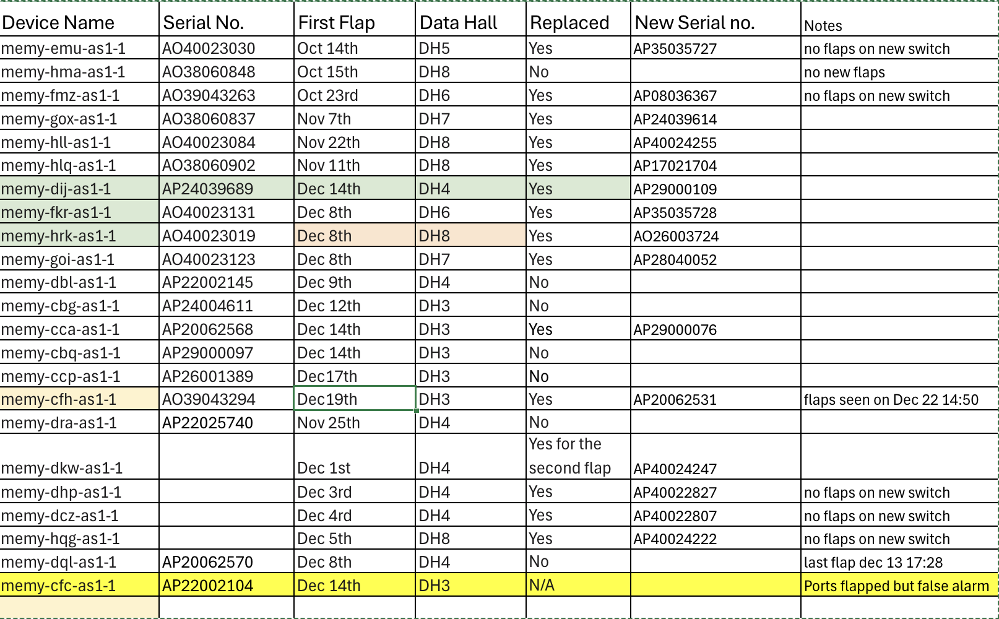

# XAI Link Flap Escalation

## Log Location
- /volume/CSdata/amodh/2025-1014-899718

## Problem Statement
- All server facing ports (port 0-35) are flapping at the same time and recover in approx. 12 seconds. The issue started Oct 13 and is seen on more than 11 devices so far (11 out of 700+).
- Server facing ports use AEC cables - Y cables (800G <-> 2x400G). The uplink ports (p36 to 63) with DR8 optics do not see flaps.
- This issue was never reported in Mem-1 or Colossus-1.
- Each time a port flap is seen, the switch receives a LOS (Loss of Signal).

## Initial Findings
- At 16:29:41 UTC on Dec 14, every front-panel AEC port `et-0/0/0` through `et-0/0/35` was driven to harddown by PFE linkscan (local fault) within the same second; see `memy-cca-as1-1/memy-cca-journal-14-Dec.txt` where each IFD flips `harddown:0 -> 1` and SNMP trap `LINK_DOWN` fires. They recovered together at ~16:37:08 when the same interfaces clear `harddown:1 -> 0` in the same file. No FPC/PFE reset messages in the window, only mass link faults on these ports.
- Switch-side port detail for one affected lane shows Rx LOS/LOCAL-FAULT during the event and a few uncorrected FECs when it flapped (for example, `memy-cca-as1-1/interface_flap.txt` for `et-0/0/17` shows `Device flags: ... Transceiver-Rx-LOS`, `Active defects: LINK, LOCAL-FAULT`, `FEC Uncorrected Errors: 12`, last flapped 16:29:42).
- Hosts connected via these ports logged simultaneous down events: 20+ servers report `mlx5_eth0: Port: 1 Link DOWN` at 16:29:41 (for example, `memy-cca-as1-1/cca_logs/memy-cca-05-sr1.xpop.twttr.net/mlxlink_logs/log_20251214_162944_634.txt`, `memy-cca-as1-1/cca_logs/memy-cca-10-sr1.xpop.twttr.net/mlxlink_logs/log_20251214_162944_517.txt`).
- Cable diagnostics on an impacted host show the AEC blaming the local PHY: in `memy-cca-as1-1/cca_logs/memy-cca-10-sr1.xpop.twttr.net/mlxlink_logs/amber_flap_20251214_162944_517*.csv` the record has `Link_Down=1`, `Phy_Manager_State=Polling/Active`, `down_blame=Local_phy`, `local_reason_opcode=Alignment_loss`, cable vendor Credo, 4m active copper (AEC). The "after 60 sec" capture still reports `Link_Down=1`, meaning the AEC stayed down for at least a minute.
- Scope matches the notes: only the AEC-connected front-panel ports (0-35) show the fault; higher-numbered QSFPs and other media types are not logging flaps in the same window.

### What it points to
- Simultaneous alignment loss across all Credo AECs suggests a shared dependency (retimer firmware crash/reset or a power or I2C disturbance on the AEC cages) rather than individual links. The switch ASIC stayed up; hosts simply saw loss of light.
- No temperature or PSU alarms around the event, so thermal or brown-out seems unlikely.

### Suggested next actions
- Reflash or upgrade NIC and AEC firmware (these logs show non-fastbootable AEC FW and local-phy alignment loss); swap one link to a DAC or optic as an A/B check.
- If possible, reseat or power-cycle a few AECs and watch amber or mlxlink for recovery; capture amber when links are healthy for baseline.
- If the 16:29 window coincided with maintenance, avoid running anything that toggles all AECs; otherwise open a vendor/RMA case for the Credo AEC batch with the above evidence.
- Keep `memy-cca-.../cca_logs` collection handy for the next occurrence; if it repeats, consider moving critical traffic off ports 0-35 until the AEC issue is cleared.

## Auto Negotiation Notes
- Credo confirmed auto negotiation for AEC cables should be turned off on both sides (switch and server).
- Broadcom also confirmed auto negotiation should be turned off on the switch.
- Please check and confirm auto negotiation is disabled.
- In the lab, link flaps were observed when auto negotiation was enabled or disabled.
- Can auto negotiation be disabled on a sample configuration?

## Event Summary
- Symptoms: repeated down/up events on one uplink caused packet loss, retransmits, and elevated tail latency while flows hashed to the bad member.
- Customer impact: transient 5xx spikes (~3% for ~12 minutes) and p95 latency regression (+250–400 ms) until traffic drained off the flapping link.
- Mitigation: disabled the unhealthy link in the port-channel, forced traffic to the healthy member, replaced the suspect optic, and re-enabled after burn-in.

## Customer Process

- Zeroize from computer center
- Send to data center
- Physically connect with cables in data center on servers, spectrum, QFX5240, management. Get the whole data center. But not powered on.
- Power up management switches
- Power up the QFX5240.
- Through ZTP configuration is pushed.
- someone verifies if all is okay.
- Power up spectrum switches.
- Then the servers are brought up.
- server does ztp via management (not through QFX5240) 
- Configuration is pushed to server via ztp. --> no server team to confirm what is pushed here.
 

In a rack, there are some management switches at the top,  followed by console switch and one QFX, then 4 spectrum devices. Customer mentioned it is 20cms gap between each switches.

Each server rack has PDUs at the top and bottom. In between there are 18 servers. 10 servers, followed by console switches, then 8 servers. 

In total, there are 5 racks, 4 server racks and one switch rack. For QFX one port connects to each server BF3 NICs, so in total 18x4 across the racks.

They have BM300 Nvidia servers. Each server has two 2-ports cx Nic cards and one  2-ports BF3. One port of CX7 connects to one spectrum switch, so 4 ports to 4 different switches in the rack. One port from the BF3 connects to the QFX.

Now, coming to traffic, the server to Juniper connection is not for ROCEv2 traffic. The spectrum switches connects uplink towards the T1 in the same DH, then T1 connects to T2 in master core room. T3 layer connects with the T2 layer. All the spectrum switches connects on the upper layers only to spectrum. All the training of GPU happens only via spectrum. 

Juniper switches similarly connects to only Juniper switches are different layers. Juniper devices that connects to servers acts as a g/w to those servers. When customers use grok to generate image or video, that traffic can come into the servers. Also we act as g/w to connect to storage which has templates for image/video generation.

All the traffic data hall to data hall are rocev2, uses nvidia spectrum. DCI connection is at the T3 layer.
Sending some pictures that was taken at data center today. Dont sell me out . Customer said dont post it in social media.

## Current Status

Dated: Dec/22/2025

- System Test Lab - Voltage margining, multiple power reset, optics insertion/removal, and firmware/software regression testing on the FA unit
No pattern that resulted in repetitive/continuous flaps.

- Hardware Lab - Chamber testing, Multiple thermal cycles [-5C -> room temp -> +40C -> room temp] completed but no flaps seen so far.

- Hardware Lab - Power Testing, 3.3V optics power rails have been scoped and associated circuits reviewed. No issues found so far
Attempts to force link flaps on an RMA QFX5240 by injecting noise have not been successful.
Instrumented FA unit with probes and attempt to replicate link flaps, not able to find a consistent way to replicate the issue.

- Hardware Lab – Timing, We have been evaluating clock circuits for a potential source of disruption that could impact multiple optical links simultaneously. 
It’s difficult to access clock signals directly for measurements due to how they are routed to BGA component with buried vias. Scoping these signals is tricky and requires more time and careful instrumentation.
We have found that injecting a disturbance into a specific part of the timing circuit can cause simultaneous link flaps. The team is looking at all aspects to confirm if it’s resulting in the same issue reported at xAI. We are also trying to determine if and how a similar disturbance can potentially occur in normal operating conditions.

## All Flapped Devices
Dec/23/2025

