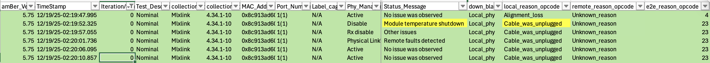

# Overview

- We have reproduced the issue in more than 3 instances (multiple times in each instance).
- The behavior is the same: `local_reason_opcode = alignment loss` on the NIC end (Amber log).
- NIC initializes; link goes down.
- Link comes back up.
- Resulting in a ~12-second link flap.
- One leg of the AEC cable was connected to BF-3; the other was dangling.
- Voltage margin variation: -5% to +3.16% of nominal.
- Built a scaled-up FA unit (2 occurrences of flap on one AEC, same signature as above) with:
  - 14x 800G AEC to 2x400G BF-3140
  - 22x 800G AEC to QFX5240-64QD
  - 28x 800G OSFP 800G DR8 to QFX5240-64OD

## Repro with Probes Attached - Dec/19/2025
### Amber logs from server

